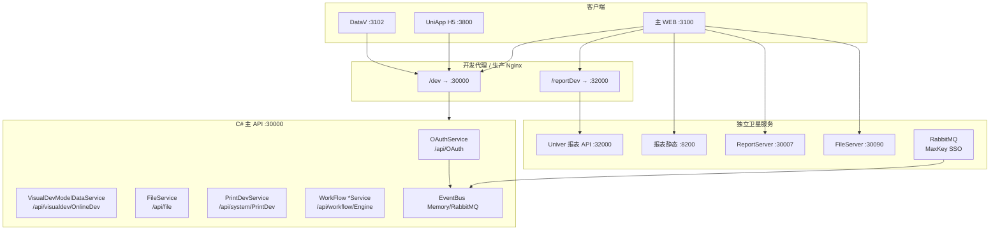
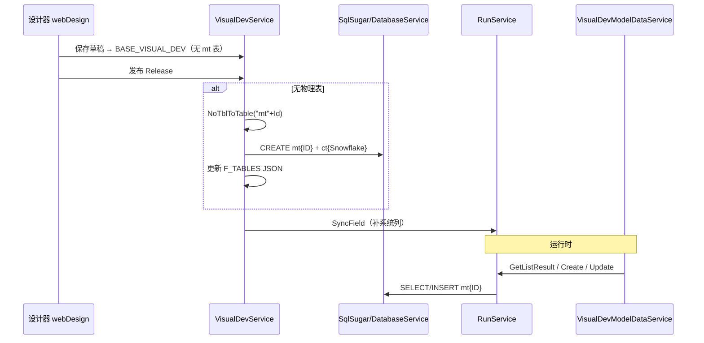
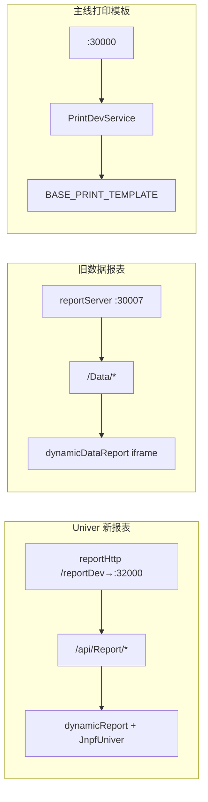
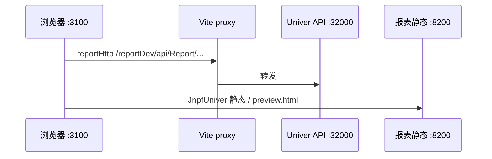
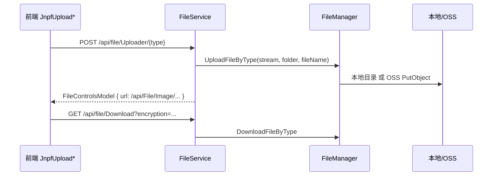
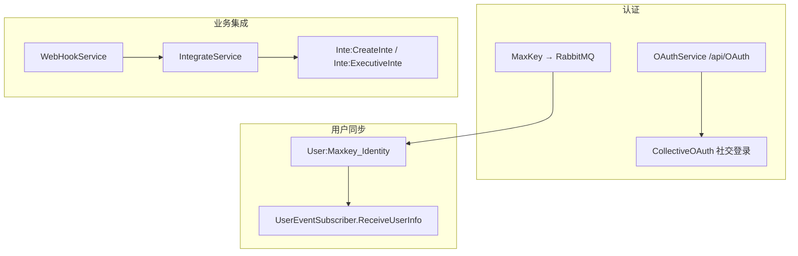
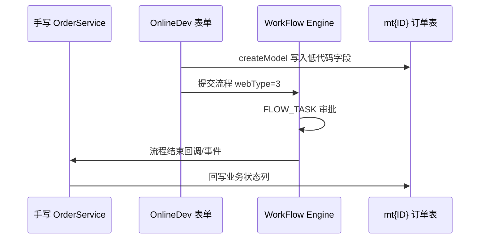

# 【专项文档11】JNPF v5.2 低代码平台 — 跨模块汇总速查与补遗

> **适用版本**：JNPF v5.2  
> **后端源码仓库**：`d:\JNPF-v52\backend`  
> **PC 前端路径**：`d:\JNPF-v52\jnpf-web-vue3\`  
> **移动端路径**：`d:\JNPF-v52\jnpf-app-vue3\`  
> **文档编号**：v52-arch-11  
> **文档版本**：v2.0-final  
> **编写日期**：2026-05-24  
> **审核状态**：2026-05-24 审核通过（3 处确认项 + 3 条建议已闭合）  
> **编写依据**：01–10 专项文档交叉索引 + v5.2 源码补遗验证  

> **与 01–10 的边界**  
> 本篇为 **v52 体系收尾篇**，不做各模块深度解剖（深度见 01–10）。  
> 职责：**部署拓扑汇总**、**低代码能力索引**、**01–10 未展开子系统补遗**（报表 / 文件 / SSO / 集成）、**缓存与 EventBus 速查表**。  
> 编写指南原 **11=低代码平台能力汇总**；本篇在指南基础上按 2026-05-24 审核意见调整为「跨模块汇总 + 补遗」定位。

---

## 已知问题与注意事项

> **⚠️ 报表为多服务并存**  
> v5.2 同时存在 **Univer 新报表**（`:32000` API + `:8200` 前端静态）、**旧数据报表 ReportServer**（`:30007`）与主线 **PrintDev 打印模板**（`:30000`）。三者 API 前缀与端口不同，勿混为一谈。

> **⚠️ 报表 / 大屏 / VisualData 不在 C# 主仓库**  
> `liu202505v2` 含 **PrintDev**（打印模板）与 OnlineDev 引擎；**Univer 报表服务**与 **DataV 大屏**为独立部署单元，本文仅记录前端对接方式。

> **⚠️ MaxKey SSO 依赖 RabbitMQ 模式**  
> `User:Maxkey_Identity` 事件在 Memory EventBus 下**无发布点**；须配置 RabbitMQ 且 MaxKey 推送 MQ 消息方可同步用户（详见 [08 §6.3](08-mq-and-events-deep-dive.md)）。

---

## 第一章：v5.2 部署拓扑全景

### 1.1 服务与端口一览（已源码验证）

| # | 服务 | 开发端口 / 路径 | 生产典型路径 | 技术栈 | 深度文档 |
|---|------|----------------|-------------|--------|----------|
| 1 | 主 API | `:30000` | 同域 `/dev` 反代 | ASP.NET Core 6 + Furion | [01](01-core-framework.md)、[02](02-application-services.md) |
| 2 | 主 WEB | `:3100` | 静态 + Nginx | Vue 3 + Vite | [04](04-application-frontend-deep-dive.md) |
| 3 | UniApp H5 | `:3800` | `/app` 等 | uni-app | [06](06-mobile-uniapp-deep-dive.md) |
| 4 | 数字大屏 DataV | `:3102/DataV/` | `/DataV/` | Vue（独立工程） | [05](05-visual-data-deep-dive.md) |
| 5 | **Univer 报表 API** | 代理 `/reportDev` → **`:32000`** | `/Report` 或独立域名 | **独立服务**【待源码验证 Java 栈】 | **本篇 §4** |
| 6 | **Univer 报表前端静态** | **`:8200`** | `apiUrl + '/Report'` | 静态资源 + JnpfUniver 组件 | **本篇 §4** |
| 7 | **旧数据报表 ReportServer** | **`:30007`** | `/ReportServer` | **独立服务** | **本篇 §4.4** |
| 8 | 文件预览 FileServer | `:30090/FileServer` | `/FileServer` | **kkFileView / YoZo 独立预览服务** | **本篇 §5.4–§5.5** |
| 9 | WebSocket | `ws://localhost:30000` | 同 API 域 | 内置 WS | [04 §6](04-application-frontend-deep-dive.md) |

前端环境变量锚点（`jnpf-web-vue3/.env.development`）：

```7:17:d:\JNPF-v52\jnpf-web-vue3\.env.development
VITE_PROXY = [["/dev","http://localhost:30000"], ["/reportDev","http://localhost:32000"]]
VITE_GLOB_API_URL=/dev
VITE_GLOB_REPORT_API_URL=/reportDev
```

`hooks/setting/index.ts` 同时定义多路报表 URL：

```29:36:d:\JNPF-v52\jnpf-web-vue3\src\hooks\setting\index.ts
    filePreviewServer: isDevMode() ? 'http://localhost:30090/FileServer' : VITE_GLOB_API_URL + '/FileServer',
    dataVUrl: isDevMode() ? 'http://localhost:3102/DataV/' : prodUrlPrefix + '/DataV/',
    reportServer: isDevMode() ? 'http://localhost:30007' : VITE_GLOB_API_URL + '/ReportServer',
    report: isDevMode() ? 'http://localhost:8200' : VITE_GLOB_API_URL + '/Report',
```

### 1.2 部署拓扑总图（图1-1）

**图1-1 JNPF v5.2 全链路部署拓扑**



数据流摘要：

- **低代码 CRUD**：PC/App → `/dev` → `VisualDevModelDataService` → `RunService` → **mt{ID}** / 业务表
- **Univer 报表**：PC → `reportHttp`（`/reportDev`）→ `:32000` `/api/Report`；渲染组件 `JnpfUniver` 加载 `:8200` 静态资源
- **旧数据报表**：PC iframe → `:8200/preview.html` + 元数据 `:30007/Data`
- **文件上传**：各模块 → `POST /api/file/Uploader/{type}` → `IFileManager`

#### 本节核心表清单

—（拓扑章无独立表；各服务消费表见后续章节）

#### 本节关键代码路径索引

| 路径 | 说明 |
|------|------|
| `jnpf-web-vue3/.env.development` | 代理与 API 前缀 |
| `jnpf-web-vue3/src/hooks/setting/index.ts` | 多服务 URL 汇总 |
| `application/JNPF.API.Entry/` | API 宿主 |

---

## 第二章：低代码能力全景与 01–10 文档索引

### 2.1 能力清单（已源码验证）

| 能力 | 实现状态 | 核心模块 / 入口 | 深度文档 |
|------|----------|----------------|----------|
| 表单/列表设计器 | ✅ 完整 | `BASE_VISUAL_DEV` + `FormGenerator` | [09 §2–§5](09-frontend-runtime-deep-dive.md) |
| 在线运行时 Parser | ✅ 完整 | `dynamicModel` + `RunService` | [09](09-frontend-runtime-deep-dive.md)、[04 §7](04-application-frontend-deep-dive.md) |
| 移动端运行时 | ✅ 完整（部分 jnpfKey 缺口） | `jnpf-app-vue3` Parser | [06](06-mobile-uniapp-deep-dive.md)、[09 §6.3](09-frontend-runtime-deep-dive.md) |
| 无表动态表 **mt{ID}** | ✅ 完整 | `VisualDevService.NoTblToTable` | **本篇 §3**、[09 §8](09-frontend-runtime-deep-dive.md) |
| 代码生成 | ✅ 完整 | `CodeGenService` + `.vm` | [09 §8](09-frontend-runtime-deep-dive.md) |
| 工作流引擎 | ✅ 自研 JSON 状态机 | `JNPF.WorkFlow`、**FLOW_*** ×18 | [10](10-workflow-engine-deep-dive.md) |
| 数字大屏 DataV | ✅ 独立工程 | **BLADE_***、`/api/blade-visual/` | [05](05-visual-data-deep-dive.md) |
| Univer 报表 | ✅ 独立服务 | `/api/Report` @ `:32000` | **本篇 §4** |
| 旧数据报表 | ⚠️ 遗留并存 | ReportServer `:30007` | **本篇 §4.4** |
| 打印模板 PrintDev | ✅ 主线模块 | `PrintDevService`、**BASE_PRINT_TEMPLATE** | **本篇 §4.5** |
| 数据接口 / 集成助手 | ✅ 完整 | `DataInterfaceService`、`IntegrateService` | [03](03-application-modules-deep-dive.md)、**本篇 §6** |
| 缓存 / EventBus | ✅ 完整 | `ICacheManager`、8 EventId | [07](07-cache-middleware-deep-dive.md)、[08](08-mq-and-events-deep-dive.md) |

### 2.2 01–10 专项文档速查矩阵

| 编号 | 文件 | 一句话定位 |
|------|------|-----------|
| 01 | [01-core-framework.md](01-core-framework.md) | Furion 框架、DynamicApi、SqlSugar、JWT、中间件 |
| 02 | [02-application-services.md](02-application-services.md) | DI、Filter、数据权限、UnitOfWork、Oops |
| 03 | [03-application-modules-deep-dive.md](03-application-modules-deep-dive.md) | Systems 六大模块 **BASE_*** 表 |
| 04 | [04-application-frontend-deep-dive.md](04-application-frontend-deep-dive.md) | 主 WEB 工程化、路由、Axios、Layout |
| 05 | [05-visual-data-deep-dive.md](05-visual-data-deep-dive.md) | DataV 大屏 **BLADE_***、`:3102` |
| 06 | [06-mobile-uniapp-deep-dive.md](06-mobile-uniapp-deep-dive.md) | UniApp 工程、App 菜单、`:3800` |
| 07 | [07-cache-middleware-deep-dive.md](07-cache-middleware-deep-dive.md) | Redis/Memory 缓存、键全量清单 |
| 08 | [08-mq-and-events-deep-dive.md](08-mq-and-events-deep-dive.md) | EventBus、RabbitMQ、8 EventId |
| 09 | [09-frontend-runtime-deep-dive.md](09-frontend-runtime-deep-dive.md) | Parser、jnpfKey、OnlineDev、Codegen |
| 10 | [10-workflow-engine-deep-dive.md](10-workflow-engine-deep-dive.md) | 自研工作流 **FLOW_***、流程表单 |

#### 本节核心表清单

**BASE_VISUAL_DEV**、**BASE_MODULE**、**FLOW_***、**BLADE_*** — 分属 03/05/09/10

#### 本节关键代码路径索引

| 路径 | 说明 |
|------|------|
| `docs/architecture/v52/CATALOG.md` | 全系列目录 |
| `modularity/visualdev/` | 低代码后端 |
| `modularity/workflow/` | 工作流 |

---

## 第三章：mt{ID} 动态表生命周期汇总

> 深度见 [09 §2.3](09-frontend-runtime-deep-dive.md)、[03 §4](03-application-modules-deep-dive.md)；本篇统一生命周期视图。

### 3.1 命名与触发时机

| 项 | 规则 |
|----|------|
| 主表名 | **`mt` + `VisualDevEntity.Id`**（发布时赋值，如 `mt1847234567890123456`） |
| 子表名 | **`ct` + SnowflakeId**（`NoTblToTable` L1573） |
| 触发时机 | **发布**（`VisualDevService` Release），且原配置 **无物理表**（`!tInfo.IsHasTable`） |
| 配置存储 | **BASE_VISUAL_DEV**（**F_FORM_DATA**、**F_TABLES**、**F_DB_LINK_ID**） |

发布时无表转有表：

```733:744:modularity/visualdev/JNPF.VisualDev/VisualDevService.cs
        // 无表转有表
        if (!tInfo.IsHasTable && !entity.WebType.Equals(4))
        {
            string? mTableName = "mt" + entity.Id; // 主表名称
            VisualDevEntity? res = await NoTblToTable(entity, mTableName);
            if (res != null)
                await _visualDevRepository.AsSugarClient().Updateable(entity).IgnoreColumns(ignoreAllNullColumns: true).CallEntityMethod(m => m.LastModify()).ExecuteCommandAsync();
            else
                throw Oops.Oh(ErrorCode.D1414);
            tInfo = new TemplateParsingBase(res); // 解析模板
            entity = res;
        }
```

### 3.2 表结构组成

`NoTblToTable`（L1517+）组装字段：

| 类别 | 列 | 来源 |
|------|-----|------|
| 主键 | **f_id** / **F_ID** | 固定追加（identity 或 varchar 视 `primaryKeyPolicy`） |
| 业务字段 | `item.__vModel__` 原样 | `FieldsModelToTableFile`（**无保留字黑名单**，见 [09 §2.3](09-frontend-runtime-deep-dive.md)） |
| 流程 | **f_flow_task_id**、**f_flow_id** | `EnableFlow=1` 时追加 |
| 软删 | **f_delete_mark** 等 | `formModel.logicalDelete` |
| 多租户 | **f_tenant_id** | 租户库隔离模式 |
| 集成 | **f_inte_assistant** | 固定追加 |
| 子表外键 | **f_foreign_id** | 子表固定 |

发布后增量列：`RunService.SyncField` 在运行期再次检查并 **ALTER TABLE** 追加**缺失**系统列**（不覆盖用户列）。

### 3.3 生命周期图（图3-1）

**图3-1 mt{ID} 动态表生命周期**



### 3.4 运行时 CRUD 路径

| 操作 | 入口 | 引擎 |
|------|------|------|
| 列表 | `POST /api/visualdev/OnlineDev/{modelId}/List` | `RunService.GetListResult` |
| 新建/更新 | `POST|PUT /api/visualdev/OnlineDev/{modelId}` | `RunService.Create/Update` |
| 代码生成态 | 生成 `*Service : IDynamicApiController` | 直连 mt 表 Entity（[09 §8.5](09-frontend-runtime-deep-dive.md)） |

数据权限：经 `UserManager` 数据范围 + 列表 `columnData` 配置，与手写模块共用 **BASE_AUTHORIZE** 体系（[02 §4](02-application-services.md)）。

### 3.5 取消发布与物理表回收（问题 2 · 已源码验证）

| 操作 | 对 **BASE_VISUAL_DEV** | 对 **mt{ID}** 物理表 |
|------|------------------------|----------------------|
| 保存草稿 | 更新配置 JSON | **不建表** |
| 发布 `Actions/Release` | `State=1`；无表时 `NoTblToTable` | **CREATE** mt{ID} + ct* |
| 修改已发布模板 | `State=2`（已修改） | **ALTER** 增列（`SyncField` / 发布同步） |
| 回滚 `RollbackTemplate` | 从 **VisualDevReleaseEntity** 恢复 `State=1` | **不 DROP** |
| 删除功能 `Delete` | 软删 `DeleteMark` | **不 DROP**（`VisualDevService.Delete` L580–603 无 `DropTable`） |
| 取消菜单发布 | 菜单解绑 | **保留**物理表与历史数据 |

**结论**：v5.2 **无**「取消发布即 DROP mt{ID}」逻辑；物理表一旦创建即长期保留，仅配置态 `State` / 菜单绑定变化。手工删表须 DBA 操作，**【待 DDL 验证】** 是否影响已发布菜单。

#### 本节核心表清单

| 表名 | 关键字段 |
|------|----------|
| **BASE_VISUAL_DEV** | F_Id、F_FORM_DATA、F_TABLES、F_DB_LINK_ID、F_WEB_TYPE |
| **mt{ID}** | f_id、用户 __vModel__ 列、f_flow_*（可选） |
| **ct{SnowflakeId}** | f_foreign_id、子表字段 |

#### 本节关键代码路径索引

| 路径 | 说明 |
|------|------|
| `modularity/visualdev/JNPF.VisualDev/VisualDevService.cs` | `NoTblToTable`、Release |
| `modularity/visualdev/JNPF.VisualDev/RunService.cs` | `SyncField`、CRUD |
| `modularity/engine/JNPF.VisualDev.Engine/Core/FormDataParsing.cs` | 表单 ↔ 列映射 |

---

## 第四章：报表与打印子系统

### 4.1 三路子系统对照（图4-1）

**图4-1 报表 / 打印三路径**



### 4.2 Univer 新报表（:32000 / :8200）

| 项 | 值 |
|----|-----|
| 前端运行时 | `views/common/dynamicReport/index.vue` |
| 路由组件 | `routeHelper.ts` → `LayoutMap.set('ONLINE_REPORT', ...)` |
| HTTP 客户端 | `reportHttp`（`axios/index.ts` L280，`apiUrl: globSetting.reportApiUrl`） |
| 开发 API 代理 | `VITE_GLOB_REPORT_API_URL=/reportDev` → `:32000` |
| API 前缀 | **`/api/Report`**（`api/onlineDev/report.ts`） |
| 静态/设计器 UI | `globSetting.report` → dev **`http://localhost:8200`** |

`reportHttp` 与主 API 分离：

```279:284:d:\JNPF-v52\jnpf-web-vue3\src\utils\http\axios\index.ts
// 报表接口
export const reportHttp = createAxios({
  requestOptions: {
    apiUrl: globSetting.reportApiUrl,
  },
});
```

典型 API（`report.ts`）：`GET/POST /api/Report`、`POST /api/Report/Data`、`POST /api/Report/Save`（设计保存）。

> **【待源码验证】** Univer 报表后端不在 `liu202505v2` C# 仓库；生产 `deploy/default.conf` 反代目标为 `jnpf-univer-external.java-cloud-v510:32000`。

### 4.3 端口对照（:8200 与 :32000 分工）

| 用途 | 开发端口 | 配置键 | 说明 |
|------|----------|--------|------|
| Univer **报表 API** | **32000**（经 `/reportDev` 代理） | `VITE_GLOB_REPORT_API_URL` | `reportHttp` 调用 |
| Univer **报表前端静态** | **8200** | `globSetting.report` | JnpfUniver 资源；生产 `/Report` |
| 旧 **ReportServer** | **30007** | `globSetting.reportServer` | 旧数据报表 API |
| 主 API | 30000 | `VITE_GLOB_API_URL` | PrintDev 打印模板 |

### 4.4 前端调用链（问题 2 · 已源码验证）

**Univer 新报表**（`dynamicReport/index.vue`）双通道：

| 通道 | 配置 | 开发实际目标 | 用途 |
|------|------|-------------|------|
| **报表 API** | `VITE_GLOB_REPORT_API_URL=/reportDev` | Vite 代理 → **`:32000`** | `reportHttp` 调 `/api/Report/*`（**不走** `:30000`） |
| **静态/嵌入** | `globSetting.report` | **`http://localhost:8200`** | JnpfUniver 资源；旧报表 `preview.html` iframe |

开发环境 **无跨域问题**：浏览器只访问 `:3100`，由 Vite 将 `/reportDev` 反代到 `:32000`。生产通常 Nginx 同域挂载 `/Report`（API）与 `/Report` 静态，或分域名配置。

**旧数据报表**（`dynamicDataReport`）：元数据走 `defHttp` + `reportServer`（`:30007` `/Data`）；预览 iframe 走 **`:8200`** 的 `preview.html`。



### 4.5 旧数据报表 ReportServer（:30007）

| 项 | 值 |
|----|-----|
| 前端运行时 | `views/common/dynamicDataReport/index.vue`（**iframe**） |
| 预览 URL | `{report}/preview.html?id={id}&token=...`（`:8200` 静态） |
| 元数据 API | `reportServer + '/Data'`（`:30007`，`api/onlineDev/dataReport.ts`） |
| 部署 | **独立进程/容器**【待源码验证】；`liu202505v2` C# 仓库**不含** ReportServer 源码 |
| 与 Univer 关系 | **遗留并存**；新功能优先 Univer（`:32000`） |

### 4.6 PrintDev 打印模板（主线 :30000）

与 Univer 报表**不同**：打印模板存于主库，由 C# 动态 API 提供。

| 项 | 值 |
|----|-----|
| Service | `modularity/system/JNPF.Systems/System/PrintDevService.cs` |
| 路由 | `[Route("api/system/[controller]")]` → **`/api/system/PrintDev`** |
| 实体 | `PrintDevEntity` → 表 **BASE_PRINT_TEMPLATE** |
| 能力 | SQL 模板字段解析、批量打印数据 `GetData` / `GetBatchData` |

```35:37:modularity/system/JNPF.Systems/System/PrintDevService.cs
[ApiDescriptionSettings(Tag = "System", Name = "PrintDev", Order = 200)]
[Route("api/system/[controller]")]
public class PrintDevService : IDynamicApiController, ITransient
```

#### 本节核心表清单

| 表名 | 说明 |
|------|------|
| **BASE_PRINT_TEMPLATE** | 打印模板（PrintDev） |
| Univer 报表表 | **【待 DDL 验证】** 在 `:32000` 独立库 |

#### 本节关键代码路径索引

| 路径 | 说明 |
|------|------|
| `jnpf-web-vue3/src/api/onlineDev/report.ts` | Univer reportHttp API |
| `jnpf-web-vue3/src/views/common/dynamicReport/index.vue` | Univer 运行时 |
| `jnpf-web-vue3/src/api/onlineDev/dataReport.ts` | 旧 ReportServer |
| `modularity/system/JNPF.Systems/System/PrintDevService.cs` | 打印模板 |

---

## 第五章：文件服务（IFileManager / FileService）

> [02](02-application-services.md)、[05/06](05-visual-data-deep-dive.md) 提及上传；本篇补全 API 与存储链。

### 5.1 分层架构（图5-1）

**图5-1 文件上传下载链**



### 5.2 FileService 路由（:30000）

```32:36:modularity/system/JNPF.Systems/Common/FileService.cs
[ApiDescriptionSettings(Tag = "Common", Name = "File", Order = 161)]
[Route("api/[controller]")]
[AllowAnonymous]
public class FileService : IFileService, IDynamicApiController, ITransient
```

| 方法 | HTTP | 说明 |
|------|------|------|
| `Uploader` | POST **`/api/file/Uploader/{type}`** | 分类型上传（`annex`、`annexpic` 等） |
| `DownloadUrl` | GET `/api/file/Download/{type}/{fileName}` | 返回加密下载 URL |
| `DownloadFile` | GET **`/api/file/Download?encryption=`** | 实际下载 |
| `Preview` | GET `/api/file/Uploader/Preview` | kkFile / YoZo 预览 |
| `PackDownload` | POST `/api/file/PackDownload/{type}` | 批量 ZIP |

前端全局上传地址（`hooks/setting/index.ts` L23）：

```typescript
uploadUrl: VITE_GLOB_API_URL + '/api/file/Uploader',
```

### 5.3 IFileManager 实现

| 项 | 值 |
|----|-----|
| 接口 | `JNPF.Common.Core.Manager.Files.IFileManager` |
| 实现 | `FileManager : IFileManager, IScoped` |
| 路径 | `modularity/common/JNPF.Common.Core/Manager/Files/FileManager.cs` |
| 存储策略 | `KeyVariable.FileStoreType`（`OssOptions.Provider`） |
| **本地** | `OSSProviderType.Invalid` → `File.Create` 写入 `KeyVariable.SystemPath` 下各子目录 |
| **对象存储** | `Minio` / `Aliyun` / `QCloud` / `Qiniu` / `HuaweiCloud` → `IOSSServiceFactory.PutObjectAsync` |

```10:46:modularity/common/JNPF.Common/Enums/OSSProviderType.cs
public enum OSSProviderType
{
    Invalid,   // 本地
    Minio,
    Aliyun,
    QCloud,
    Qiniu,
    HuaweiCloud
}
```

配置：`Configurations/Oss.json`（或同类 Options 扫描文件）→ `OssOptions.Provider`；桶名 `KeyVariable.BucketName`。

### 5.4 路径常量 FileVariable（含大屏专用目录）

| 常量 | 路径 | 用途 |
|------|------|------|
| `TemporaryFilePath` | `{SystemPath}/TemporaryFile` | 导入导出临时文件 |
| `UserAvatarFilePath` | `{SystemPath}/UserAvatar` | 头像 |
| `SystemFilePath` | `{MultiSystemPath}/SystemFile` | 系统附件 |
| **`BiVisualPath`** | **`{SystemPath}/BiVisualPath`** | **大屏 DataV 图片**（[05 §8.1](05-visual-data-deep-dive.md)；`FileService.VisusalImg/BiVisualPath`） |
| `DocumentFilePath` | `{SystemPath}/DocumentFile` | 文档管理 |

`BiVisualPath` **非**通用上传根目录；低代码 `Uploader/annex` 等走 `FileManager` 按 type 映射的 folder，与大屏路径分离。

### 5.5 文件在线预览 FileServer（:30090 · 问题 1）

| 项 | 说明 |
|----|------|
| **是什么** | **kkFileView / YoZo 文档预览**独立服务，**非** Nacos/Consul 注册中心 |
| 开发地址 | `http://localhost:30090/FileServer`（`globSetting.filePreviewServer`） |
| 触发 | `GET /api/file/Uploader/Preview` → `AppOptions.PreviewType` 为 `kkfile` 或 `yozo` |
| 与上传关系 | 上传仍在 **`:30000` `/api/file`**；预览服务只读已上传文件 URL |

生产：`VITE_GLOB_API_URL + '/FileServer'` 由网关反代至预览容器（与操作手册部署一致）。

#### 本节核心表清单

—（文件元数据通常存业务表 JSON 字段或 **BASE_*** 附件列，无统一文件索引表）

#### 本节关键代码路径索引

| 路径 | 说明 |
|------|------|
| `modularity/system/JNPF.Systems/Common/FileService.cs` | REST 入口 |
| `modularity/common/JNPF.Common.Core/Manager/Files/FileManager.cs` | 存储实现 |
| `modularity/common/JNPF.Common/Configuration/FileVariable.cs` | 路径常量（含 BiVisualPath） |
| `modularity/common/JNPF.Common/Enums/OSSProviderType.cs` | 存储类型枚举 |
| `jnpf-web-vue3/src/hooks/setting/index.ts` | `uploadUrl`、filePreviewServer |

---

## 第六章：第三方集成与 SSO

### 6.1 集成能力地图（图6-1）

**图6-1 外部系统集成路径**



### 6.2 OAuthService（:30000）

| 项 | 值 |
|----|-----|
| 类 | `modularity/oauth/JNPF.OAuth/OAuthService.cs` |
| 路由 | **`/api/OAuth`** |
| 关键接口 | `POST Login`、`GET CurrentUser`、`GET Logout`、`GET ImageCode` |
| 社交登录 | `SocialsLoginCallBack` + `JNPF.Extras.CollectiveOAuth` |
| 票据缓存 | `SocialsLogin_{id}`、`ScanCode_{id}`、`OnlineTicket_{ticket}`（[07 §2.1](07-cache-middleware-deep-dive.md)） |

配置节：`OAuth`（`OauthOptions`），`grant_type=official` 等分支见 `Login` L690+。

### 6.3 MaxKey SSO（EventBus 路径）

| 步骤 | 实现 |
|------|------|
| 1 | MaxKey 向 RabbitMQ 推送用户 JSON |
| 2 | `RabbitMQEventSourceStorer` 无 EventId 时映射为 **`User:Maxkey_Identity`** |
| 3 | `UserEventSubscriber.ReceiveUserInfo` → `Receive(message)` |
| 4 | 解析 `MqMessage` → INSERT/UPDATE **BASE_USER** |

```57:61:modularity/common/JNPF.Common.Core/EventBus/UserEventSubscriber.cs
    [EventSubscribe("User:Maxkey_Identity")]
    public async Task ReceiveUserInfo(EventHandlerExecutingContext context)
    {
        var log = context.Source.Payload;
        await Receive(log.ToString());
```

> Memory EventBus 模式下**无** MaxKey 发布点；SSO 同步**必须** RabbitMQ + 外部 MaxKey 部署（[08 §6.3](08-mq-and-events-deep-dive.md)）。

### 6.4 集成助手与 WebHook

| Service | 路由 | 表 |
|---------|------|-----|
| `IntegrateService` | **`/api/VisualDev/Integrate`** | **BASE_INTEGRATE**、**BASE_INTEGRATE_QUEUE** |
| `WebHookService` | **`/api/visualdev/Hooks`** | WebHook 触发 → 集成队列 |

事件：`Inte:CreateInte`（入队）、`Inte:ExecutiveInte`（执行）；缓存键 `jnpf:global:integrate:*`（[07 §2.1](07-cache-middleware-deep-dive.md) #12–15）。

WebHook 缓存映射（5 min TTL）：`jnpf:global:integrate:webhook:{inteId}:{randomStr}`。

### 6.5 WebHook 机制详解（问题 3 · 已源码验证）

| 项 | 结论 |
|----|------|
| **归属** | **集成助手**（InteAssistant），**非**工作流引擎外部回调 |
| **与 10 工作流关系** | 无直接关联；流程回调走 `WorkFlow` 模块 API，不走 `WebHookService` |
| **表结构** | **无 `BASE_WEBHOOK` 表**；方案存 **BASE_INTEGRATE**，触发写入 **BASE_INTEGRATE_QUEUE** |
| **Service** | `WebHookService`（`ISqlSugarRepository<IntegrateEntity>` L42） |
| **入站 URL** | `POST /api/visualdev/Hooks/{base64IntegrateId}`（`AllowAnonymous`） |
| **触发链** | HTTP Body → INSERT **BASE_INTEGRATE_QUEUE** → 更新 `jnpf:global:integrate:{tenantId}` 缓存 → 调度 `ExecutionQueue` Job |

```172:208:modularity/inteAssistant/JNPF.InteAssistant/WebHookService.cs
    [HttpPost("{id}")]
    public async Task GetWebHookTrigger(string id, [FromQuery] string tenantId, [FromBody] Dictionary<string, string>? parameter)
    {
        // ...
        sqlSugarClient.Queryable<IntegrateEntity>().Where(it => it.Id.Equals(inteId))
            .Select(...).IntoTable<IntegrateQueueEntity>();
        cacheKey = string.Format("{0}:{1}", CommonConst.INTEASSISTANT, tenantId);
        // ... 加入执行队列调度器
```

配置 WebHook URL：`GET /api/visualdev/Hooks/getUrl?id={integrateId}` → 返回 `/api/visualdev/Hooks/{enCode}/params/{randomStr}`。

#### 本节核心表清单

| 表名 | 用途 |
|------|------|
| **BASE_USER** | OAuth / MaxKey 用户 |
| **BASE_INTEGRATE** | 集成方案 |
| **BASE_INTEGRATE_QUEUE** / **BASE_INTEGRATE_TASK** | 集成队列与任务 |

#### 本节关键代码路径索引

| 路径 | 说明 |
|------|------|
| `modularity/oauth/JNPF.OAuth/OAuthService.cs` | 登录/OAuth |
| `modularity/common/JNPF.Common.Core/EventBus/UserEventSubscriber.cs` | MaxKey |
| `modularity/inteAssistant/JNPF.InteAssistant/IntegrateService.cs` | 集成助手 |
| `modularity/inteAssistant/JNPF.InteAssistant/WebHookService.cs` | WebHook |
| `infrastructure/JNPF.Extras.CollectiveOAuth/` | 第三方 OAuth 适配 |

---

## 第七章：缓存 Key 跨模块速查表

> 全量 28 项见 [07 §2.1](07-cache-middleware-deep-dive.md)；本篇按业务域压缩为运维速查。

### 7.1 按域分组（图7-1）

**图7-1 缓存键业务域**

```mermaid
mindmap
  root((ICacheManager))
    认证
      vercode_{ts}
      SocialsLogin_{id}
      ScanCode_{id}
      OnlineTicket_{ticket}
    会话
      {tenantId}:jnpf:permission:user:{userId}
      jnpf:user:online:{tenantId}
    低代码
      visualdev_{tenant}_*
      codegendynamic_{tenant}_*
    集成
      jnpf:global:integrate:*
    平台
      jnpf:global:tenant
      billrule_{tenant}_{user+code}
```

### 7.2 按业务域分组（表7-1 · 对齐 07 §2.1）

> **说明**：v5.2 **无** `jnpf:global:dictionary:*` / `jnpf:global:sysConfig:*` 等 ICacheManager 全局键；数据字典与系统配置直读 **BASE_DICTIONARY_DATA** / **BASE_SYS_CONFIG**。下表为 **实测存在** 的域分组。

**表7-1 缓存 Key 业务域速查**

| 域 | 键模式（代表） | 来源文档 |
|----|---------------|----------|
| **平台/租户** | `jnpf:global:tenant` | [07 §2.1 #1](07-cache-middleware-deep-dive.md) |
| **会话/用户** | `{tenantId}:jnpf:permission:user:{userId}` | [07 #2](07-cache-middleware-deep-dive.md) |
| **在线用户** | `jnpf:user:online:{tenantId}` | [07 #3](07-cache-middleware-deep-dive.md) |
| **认证票据** | `vercode_*`、`SocialsLogin_*`、`ScanCode_*`、`OnlineTicket_*` | [07 #4,16–18](07-cache-middleware-deep-dive.md) |
| **低代码/代码生成** | `visualdev_{tenant}_*`、`codegendynamic_{tenant}_*` | [07 #6–10](07-cache-middleware-deep-dive.md) |
| **集成助手** | `jnpf:global:integrate:{tenantId}`、`...:webhook:*` | [07 #12–15](07-cache-middleware-deep-dive.md) |
| **单据流水号** | `billrule_{tenant}_{userId+enCode}` | [07 #5](07-cache-middleware-deep-dive.md) |
| **门户日程** | `jnpf:portal:schedule:{tenantId}:{id}` | [07 #11](07-cache-middleware-deep-dive.md) |
| **文件下载占位** | `{fileName}` / `{fileName}.zip` | [07 #21](07-cache-middleware-deep-dive.md) |
| **遗留无效** | `menu_`、`permission_`、`datascope_` | [07 #24–27](07-cache-middleware-deep-dive.md)（**零 Set 引用**） |

### 7.3 高频键 Top 10（运维速查）

| 键模式 | 域 | TTL（约） | 典型读写方 |
|--------|-----|----------|-----------|
| `jnpf:global:tenant` | 平台 | 无 | `OAuthService.SetTenantCache` |
| `{tenantId}:jnpf:permission:user:{userId}` | 会话 | token 分钟 | `UserManager` |
| `jnpf:user:online:{tenantId}` | 会话 | 无 | `OAuthService` 在线列表 |
| `vercode_{timestamp}` | 认证 | 5 min | 验证码 |
| `visualdev_{tenant}_{renderKey}_{fieldKey}` | 低代码 | 3 min–7 day | `FormDataParsing` |
| `codegendynamic_{tenant}_{key}_{dynamicId}` | 低代码 | 3 min | `DataInterfaceService` |
| `billrule_{tenant}_{userId}{enCode}` | 计数 | 3 min | `BillRuleService` |
| `jnpf:global:integrate:{tenantId}` | 集成 | — | 集成引擎 |
| `jnpf:global:integrate:webhook:*` | 集成 | 5 min | `WebHookService` |
| `jnpf:portal:schedule:{tenantId}:{id}` | 门户 | 1 day | `ScheduleService` |
| `SocialsLogin_{id}` | 认证 | 配置 | OAuth 社交 |
| `ScanCode_{id}` | 认证 | 2 min | 扫码登录 |
| `OnlineTicket_{ticket}` | 认证 | — | SSO 票据 |
| `{fileName}` 下载占位 | 文件 | — | `FileService.DownloadUrl` |
| `menu_` / `permission_` 等 | 遗留 | — | **v5.2 基本无效** |

常量定义：`modularity/common/JNPF.Common/Const/CommonConst.cs`（`GLOBALTENANT`、`CACHEKEYUSER` 等）。

管理 API：`GET /api/system/CacheManage`（[07 §3](07-cache-middleware-deep-dive.md)）。

#### 本节核心表清单

**BASE_SYS_CONFIG**（`tokentimeout` 等影响会话 TTL）

#### 本节关键代码路径索引

| 路径 | 说明 |
|------|------|
| [07-cache-middleware-deep-dive.md §2.1](07-cache-middleware-deep-dive.md) | 28 项全表 |
| `modularity/common/JNPF.Common/Const/CommonConst.cs` | 键常量 |

---

## 第八章：EventBus 跨模块速查表

> 全量见 [08 §3.1](08-mq-and-events-deep-dive.md)；本篇按业务域分组。

### 8.1 按域分组（表8-1）

**表8-1 EventId 业务域速查**

| 业务域 | EventId | 订阅者 | 落库表 |
|--------|---------|--------|--------|
| **日志** | `Log:CreateReLog` | `LogEventSubscriber.CreateLog` | **BASE_SYS_LOG** (Type=5) |
| **日志** | `Log:CreateExLog` | 同上 | Type=4 异常 |
| **日志** | `Log:CreateVisLog` | 同上 | Type=1 登录 |
| **日志** | `Log:CreateOpLog` | 同上 | Type=3 操作 |
| **用户** | `User:UpdateUserLogin` | `UserEventSubscriber.UpdateUserLoginInfo` | **BASE_USER** 登录字段 |
| **SSO** | `User:Maxkey_Identity` | `UserEventSubscriber.ReceiveUserInfo` | **BASE_USER** 同步 |
| **集成** | `Inte:CreateInte` | `IntegreateEventSubscriber.CreateInte` | **BASE_INTEGRATE_QUEUE** |
| **集成** | `Inte:ExecutiveInte` | `InteAssistantWayEventSubscriber` | **BASE_INTEGRATE_TASK** |

### 8.2 发布方速查（含集成/WebHook）

| 发布方 | EventId | 路径 |
|--------|---------|------|
| 请求日志中间件 | `Log:CreateReLog` | 框架 Logging |
| 全局异常 | `Log:CreateExLog` | FriendlyException |
| `OAuthService` 登录/登出 | `Log:CreateVisLog`、`User:UpdateUserLogin` | `modularity/oauth/JNPF.OAuth/OAuthService.cs` |
| `OAuthService` 操作审计 | `Log:CreateOpLog` | 同上 |
| RabbitMQ（MaxKey） | `User:Maxkey_Identity` | `RabbitMQEventSourceStorer` |
| `IntegrateService` / 触发器 | `Inte:CreateInte` | 集成助手入队 |
| `ExecutionQueue` / 集成引擎 | `Inte:ExecutiveInte` | `InteAssistantWayEventSubscriber` |
| **WebHook 入站** | **不直接 Publish**；写 **BASE_INTEGRATE_QUEUE** 后由调度器触发 `Inte:ExecutiveInte` | `WebHookService.GetWebHookTrigger` |

### 8.3 与 TaskQueue 边界

| 机制 | 接口 | 适用 |
|------|------|------|
| EventBus | `IEventPublisher` + EventId | 跨模块解耦、MQ 集成 |
| TaskQueue | `ITaskQueue` | 进程内短任务（[08 §7](08-mq-and-events-deep-dive.md)） |

#### 本节核心表清单

**BASE_SYS_LOG**、**BASE_USER**、**BASE_INTEGRATE_***

#### 本节关键代码路径索引

| 路径 | 说明 |
|------|------|
| [08-mq-and-events-deep-dive.md §3](08-mq-and-events-deep-dive.md) | 8 EventId 详解 |
| `modularity/common/JNPF.Common.Core/EventBus/` | 订阅者 |

---

## 第九章：低代码与手写协作 + 外部对接要点

### 9.1 协作边界（汇总）

| 场景 | 推荐方式 | 参考 |
|------|----------|------|
| 标准 CRUD 表单/列表 | 在线 `dynamicModel` | [09 §1](09-frontend-runtime-deep-dive.md) |
| 需纳入 Git / 深度定制 | CodeGen + 手改生成物 | [09 §8](09-frontend-runtime-deep-dive.md) |
| 复杂业务规则 | 手写 `*Service : IDynamicApiController` | [01 §5](01-core-framework.md) |
| 流程审批 | 低代码表单 + **FLOW_*** | [10](10-workflow-engine-deep-dive.md) |
| 报表展示 | Univer（新）或 PrintDev（打印） | **本篇 §4** |
| 权限/menu | 统一 **BASE_MODULE** + **BASE_AUTHORIZE** | [03](03-application-modules-deep-dive.md) |

### 9.2 典型集成场景（图9-1）

**图9-1 手写 Service + 低代码 + 工作流**



### 9.3 外部系统对接清单

| 方式 | 入口 | 说明 |
|------|------|------|
| REST | 任意 `IDynamicApiController` | Token：`Authorization` + `/api/OAuth/Login` |
| WebHook 入站 | `POST /api/visualdev/Hooks/{...}` | `WebHookService` |
| MQ 出站/入站 | RabbitMQ + EventBus | MaxKey、可扩展 Subscriber |
| 数据接口 | `DataInterfaceService` | 低代码控件远端数据 |
| 文件 | `POST /api/file/Uploader/{type}` | 统一附件 |

### 9.4 扩展入口索引（不重复 09 细节）

| 扩展点 | 步骤摘要 | 文档 |
|--------|----------|------|
| 新 jnpfKey | PC `componentMap` + App `Item.vue` | [09 §9.1](09-frontend-runtime-deep-dive.md) |
| 新 EventId | `IEventSubscriber` + `[EventSubscribe]` | [08 §9](08-mq-and-events-deep-dive.md) |
| 新缓存场景 | `CommonConst` + `ICacheManager` | [07 §9](07-cache-middleware-deep-dive.md) |
| VisualData 组件 | DataV 工程 + **BLADE_*** | [05 §9](05-visual-data-deep-dive.md) |

#### 本节核心表清单

**BASE_MODULE**、**BASE_AUTHORIZE**、**mt{ID}**、**FLOW_TASK**

#### 本节关键代码路径索引

| 路径 | 说明 |
|------|------|
| `modularity/zxdev/`、`modularity/subdev/` | 二次开发扩展模块 |
| `application/JNPF.API.Entry/JNPF.API.Entry.csproj` | 宿主 ProjectReference |

---

## 附录 A：深度自检清单

- [x] 部署拓扑含 :30000 / :3100 / :3800 / :3102 / :8200 / :32000 / :30007 / :30090
- [x] 01–10 文档索引矩阵
- [x] mt{ID} 生命周期图 + NoTblToTable 源码
- [x] 报表三路径区分（Univer / ReportServer / PrintDev）
- [x] FileService + IFileManager 路由与存储
- [x] OAuth / MaxKey / WebHook / 集成助手
- [x] 缓存 Key 域分组速查（指向 07 全表）
- [x] EventBus 8 EventId 域分组速查（指向 08）
- [x] `:5000` / `sys_*` / `appsettings.json` 零命中
- [x] 审核 3 处确认项已闭合（`:30090`、报表调用链、WebHook）
- [x] 附录 C/D/E（迁移速查、术语表、按问题索引）

---

## 附录 C：v3.6 → v5.2 迁移差异速查

> 摘自 [编写指南第一部分 §1](V5.2版本架构文档编写指南第一部分.md)；历史用户升级时对照。

| 维度 | v3.6 常见 | v5.2 实测 |
|------|-----------|----------|
| API 端口 | `:5000` | **`:30000`**（launchSettings 可能仍显示 5000，以运行参数为准） |
| 主 WEB | 各异 | **`:3100`**，代理 **`/dev` → :30000** |
| 系统表 | `sys_*` | **`BASE_*`** |
| 菜单 | `sys_menu` | **BASE_MODULE** |
| API 层 | 手写 Controller | **`*Service : IDynamicApiController`** |
| 启动 | Program + Startup | **`Serve.Run()` + `AppStartup`** |
| 配置 | 单 `appsettings.json` | **`Configurations/*.json`** 分文件 |
| 大屏表 | — | **BLADE_***（非 BASE_*） |
| 低代码运行表 | — | **BASE_VISUAL_DEV** + **mt{ID}** |
| 报表 | 单 ReportServer | **Univer :32000** + 静态 :8200 + 遗留 :30007 |

---

## 附录 D：全系列术语速查

| 术语 | 含义 | 详见 |
|------|------|------|
| `jnpfKey` | 低代码控件类型键（`input`、`table`…） | [09 §4.3](09-frontend-runtime-deep-dive.md) |
| `__vModel__` | 表单字段绑定键；映射物理列（无 F_ 前缀） | [09 §2.3](09-frontend-runtime-deep-dive.md) |
| `columnData` | 列表设计 JSON（列/搜索/SuperQuery） | [09 §2.2](09-frontend-runtime-deep-dive.md) |
| `webType` | 1 表单 / 2 表单+列表 / 3 流程 / 4 行内编辑 | [09 §1.1](09-frontend-runtime-deep-dive.md) |
| `jnpf-origin: app` | App 列配置请求头 → **F_APP_COLUMN_DATA** | [06 §3.2.3](06-mobile-uniapp-deep-dive.md) |
| `DynamicApiController` | Service 自动暴露 REST 的 Furion 约定 | [01 §5](01-core-framework.md) |
| `mt{ID}` | 无表发布生成的动态主表名 | **本篇 §3** |
| `OnlineDev` | 在线开发运行时 API 前缀 | [09 §7](09-frontend-runtime-deep-dive.md) |
| `reportHttp` | 独立 Axios 实例，代理至 Univer :32000 | **本篇 §4.4** |
| `IDynamicApiController` | 动态 API 标记接口（同 DynamicApi） | [01 §5](01-core-framework.md) |
| `FLOW_TASK` | 工作流实例（无 FLOW_INSTANCE 表） | [10 §2](10-workflow-engine-deep-dive.md) |
| `BLADE_*` | 大屏元数据表前缀 | [05 §2](05-visual-data-deep-dive.md) |

---

## 附录 E：按问题找文档

| 我想知道… | 看这篇 |
|-----------|--------|
| 后端怎么启动、DynamicApi 怎么工作 | [01](01-core-framework.md) |
| Filter、数据权限、事务 | [02](02-application-services.md) |
| BASE_USER / BASE_MODULE 表结构 | [03](03-application-modules-deep-dive.md) |
| Vite、路由、Axios、Layout | [04](04-application-frontend-deep-dive.md) |
| DataV 大屏、BLADE 表 | [05](05-visual-data-deep-dive.md) |
| UniApp、App 菜单、`:3800` | [06](06-mobile-uniapp-deep-dive.md) |
| 缓存 Key 全量 28 项 | [07](07-cache-middleware-deep-dive.md) 或 **本篇 §7** |
| EventBus 8 EventId 详解 | [08](08-mq-and-events-deep-dive.md) 或 **本篇 §8** |
| Parser、jnpfKey、SuperQuery | [09](09-frontend-runtime-deep-dive.md) |
| 工作流状态机、FLOW_* | [10](10-workflow-engine-deep-dive.md) |
| 报表三端口、文件服务、部署总图 | **本篇 §1、§4、§5** |
| mt{ID} 什么时候建表 | **本篇 §3** |
| v3.6 升级差异 | **本篇附录 C** |

---

## 附录 B：01–11 全系列索引

| # | 文档 | 状态 |
|---|------|------|
| 01 | [01-core-framework.md](01-core-framework.md) | v2.0-final |
| 02 | [02-application-services.md](02-application-services.md) | v2.0-final |
| 03 | [03-application-modules-deep-dive.md](03-application-modules-deep-dive.md) | v2.0-final |
| 04 | [04-application-frontend-deep-dive.md](04-application-frontend-deep-dive.md) | v2.0-final |
| 05 | [05-visual-data-deep-dive.md](05-visual-data-deep-dive.md) | v2.0-final |
| 06 | [06-mobile-uniapp-deep-dive.md](06-mobile-uniapp-deep-dive.md) | v2.0-final |
| 07 | [07-cache-middleware-deep-dive.md](07-cache-middleware-deep-dive.md) | v2.0-final |
| 08 | [08-mq-and-events-deep-dive.md](08-mq-and-events-deep-dive.md) | v2.0-final |
| 09 | [09-frontend-runtime-deep-dive.md](09-frontend-runtime-deep-dive.md) | v2.0-final |
| 10 | [10-workflow-engine-deep-dive.md](10-workflow-engine-deep-dive.md) | v2.0-final |
| 11 | 本文 | **v2.0-final** |

---

> **文档维护**：新增独立服务端口或 EventId 后，请同步 §1.1 拓扑表、§7/§8 速查表、附录 E；Univer 报表后端入库后替换【待源码验证】标注。

**v5.2 架构内参全系列 11 篇已于 2026-05-24 闭合。**
