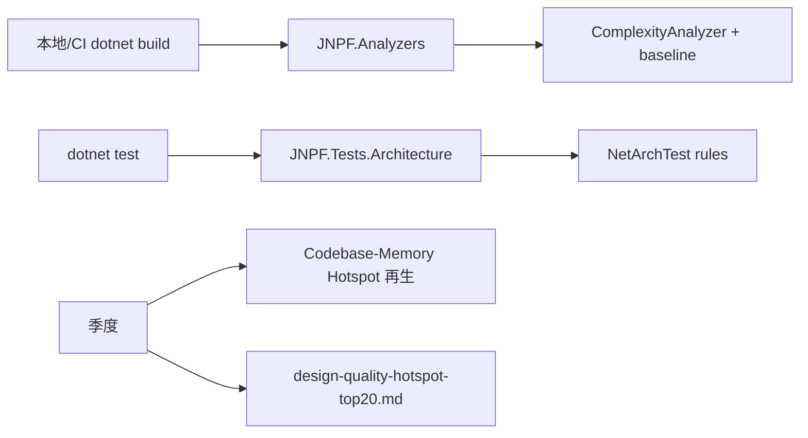

# 复杂度基线与分层架构门禁 — 设计（先设计后实现）

> **父文档**：[`design-quality-diagnostics.md`](design-quality-diagnostics.md)  
> **状态**：设计稿 v1.0（2026-08-06）— **本文不实现代码**；落地须另开任务 + ADF/CR（若触碰受保护方法）  
> **依据数据**：[`design-quality-hotspot-top20.md`](design-quality-hotspot-top20.md) · `get_architecture(boundaries)` on `jnpf-v52`

---

## 1. 问题陈述

| 缺口 | 现状 | 后果 |
|------|------|------|
| 无复杂度门禁 | [`JNPF.Analyzers`](../../../backend/tools/JNPF.Analyzers/) 仅有 AsyncVoid / SqlSugar / Outbox / CreateScope / AppServiceLocator / DataExecuting / RequirementAnalysisGuard | 新代码可继续贡献 CC≥30 方法 |
| 无分层架构测试 | 依赖约定 + Codebase-Memory 人工查 | `JNPF → inteAssistant` 已有 **626** 次调用边，可持续恶化 |
| Hotspot 未进 CI | Top20 为手册快照 | 变更频率变化时清单过期 |

---

## 2. 方案对比与推荐

### 2.1 复杂度门禁

| 方案 | 描述 | 优点 | 失效边界 |
|------|------|------|----------|
| **A · Roslyn Analyzer + 基线文件（推荐）** | 新增/修改方法：CC&gt;30 → error；存量方法写入 `complexity-baseline.json` 豁免直至下降 | 增量有效；不堵日常；与现有 Analyzers 工程一致 | 基线文件无限膨胀且无人消减 → 门禁名存实亡 |
| B · 全仓 Sonar/Roslynator 一次红 | CI 全量失败 | 惊吓力强 | 报告不可执行；团队绕过 CI |
| C · 不做 | 仅靠 Codebase-Memory 人工 | 零成本 | 重症数只增不减 |

**推荐：方案 A。**

#### 设计要点（实现阶段遵守）

1. **诊断 ID**：建议 `JNPF0xx`（实现时在 Analyzers 内分配，避开已有 JNPF007/008）  
2. **度量**：优先 **圈复杂度**（Roslyn 可算）；认知复杂度可作为 informational  
3. **触发**：仅对**本次编译触及的语法树中新增或行级变更的方法**报错；纯格式化不触发  
4. **基线格式**（建议路径 `backend/tools/JNPF.Analyzers/complexity-baseline.json`）：

```json
{
  "version": 1,
  "threshold": 30,
  "entries": [
    {
      "symbol": "JNPF.VisualDev.VisualDevService.FuncToMenu",
      "maxComplexity": 84,
      "file": "modularity/visualdev/JNPF.VisualDev/VisualDevService.cs"
    }
  ]
}
```

5. **消减规则**：PR 若降低某方法 CC，必须同步下调或删除基线条目（CI 校验「基线不得升高」）  
6. **与 CI_BUILD**：`dotnet build /p:CI_BUILD=true` 时 analyzer 为 error；本地可先 warning（可选）

**failure_boundary**：若团队把 41 个重症全部写入基线后不再消减，门禁退化为「只拦新文件」— 须在季度复盘强制消减 Top10 score。

### 2.2 分层架构测试（NetArchTest）

| 方案 | 描述 | 优点 | 失效边界 |
|------|------|------|----------|
| **A · NetArchTest 单测项目（推荐）** | 新测试项目 `JNPF.Tests.Architecture`；规则：`JNPF` 程序集不得引用 `JNPF.InteAssistant*` | 可回归；失败即红 | 反射/源生成器绕过引用检查 → 漏报 |
| B · 仅 Hook 扫 `using` | 写文件时拦 | 拦 AI 写入 | 拦不住已存在边；易误杀合法桥接 |
| C · 不做 | 继续人工查图 | — | 626 边继续涨 |

**推荐：方案 A + 窄规则起步。**

#### 第一批规则（只立 2 条，避免大爆炸）

| ID | 规则 | 说明 |
|----|------|------|
| ARCH-01 | `JNPF*.csproj`（framework）不得 ProjectReference / 编译期引用 `JNPF.InteAssistant*` | 对应 boundaries 反向边 |
| ARCH-02 | `JNPF.InteAssistant` 访问框架能力仅通过已存在的 `JNPF` / `JNPF.Common*` API，不得反向注册到 framework 内部静态 | 文档约束；能自动化的部分进 ARCH-01 |

**迁移策略（实现时）：**

1. 先让 ARCH-01 **以 warning/统计模式**跑出违规类型列表  
2. 抽 `IInteAssistantBridge`（或现有接口）到 `JNPF.Common` / 独立 Contracts 程序集，framework 只依赖接口  
3. 清零后再改 error  

**failure_boundary**：若业务坚持 framework 内直接 `new` 业务服务，架构测试会与交付冲突 — 须走 CR 明确「永久豁免类型名单」，名单外禁止新增。

### 2.3 不做 / 零代码备选

维持手册 + 季度人工跑 Codebase-Memory。适合人力为零的窗口；**不推荐**作为默认。

---

## 3. 与现有工具链的挂载点



**图 3-1 门禁挂载**

| 阶段 | 命令 |
|------|------|
| 编译 + analyzer | `cd backend; dotnet build /p:CI_BUILD=true` |
| 架构测试 | `dotnet test backend/tests/JNPF.Tests.Architecture/...`（实现后） |
| Hook 行为红线 | `node scripts/test-hooks.mjs`（已有，不替代本设计） |
| 三元组 | `node scripts/diagnose-triple-key.mjs` |

---

## 4. 实现任务拆解（供后续施工包，本次不编码）

| 序号 | 任务 | 预估 | 依赖 |
|------|------|------|------|
| G1 | 增加 `ComplexityAnalyzer` + baseline 生成脚本（**PowerShell 或 xUnit 生成器**；禁止新增业务 `.mjs`） | 2–3d | 无 |
| G2 | 用当前 41 个 CC&gt;29 方法灌入基线 | 0.5d | G1 |
| G3 | 新建 `JNPF.Tests.Architecture` + NetArchTest 包引用 | 1d | 无 |
| G4 | ARCH-01 统计模式 → 列违规清单 | 1d | G3 |
| G5 | 依赖反转设计（Contracts）+ 消反向引用 | 按违规量 | G4 + 可能 CR |
| G6 | CI 工作流接入 G1/G3 | 0.5d | G1+G3 |

**受保护方法**：若 G5 改到 `PmSkillService` / Orchestrator / Gates 等，须先写 `.claude/change-requests/CR-*.md`。

---

## 5. 验收标准（实现完成后）

1. 新建演示方法 CC=35 且不在基线 → `CI_BUILD=true` **编译失败**  
2. 基线内方法 CC 未升高 → 通过；升高 → 失败  
3. ARCH-01：在 framework 增加对 `JNPF.InteAssistant` 的 ProjectReference → **测试失败**  
4. `node scripts/test-hooks.mjs` 仍全绿（不破坏现有 L0）  
5. 文档：更新 Hotspot Top20 日期与基线条目数

---

## 6. 红线检查清单

| 红线 | 本设计是否触碰 |
|------|----------------|
| R1 禁手写 Controller | 否 |
| R4 多租户 | 否（不改查询） |
| R7 SQL | 否 |
| R8 权限属性 | 否 |
| R12 三元组 | 否 |
| L10c 禁新增 .mjs | 遵守：生成器用 ps1/xUnit |
| L11 零占位符 | 实现阶段禁止 TODO 壳子 |
| 实现完整性 | 拆业务方法前必须有测试 — 门禁本身不拆业务 |

---

## 7. 本节关键代码路径索引

- `backend/tools/JNPF.Analyzers/JNPF.Analyzers/Analyzers/` — 现有分析器  
- `backend/tools/JNPF.Analyzers/JNPF.Analyzers.Tests/` — 分析器单测范式  
- `backend/framework/JNPF/` — ARCH-01 约束主体  
- `backend/modularity/inteAssistant/` — 反向依赖源  
- 拟建：`backend/tests/JNPF.Tests.Architecture/`（未创建）
