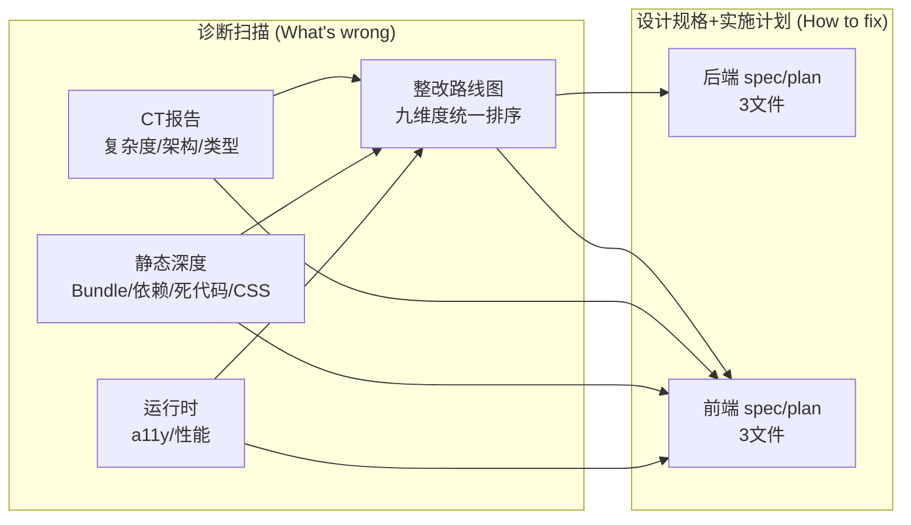

# 前后端质量交付物索引（2026-08-06）

> **本文件是入口**——集中列出今天全部 10 份交付文档的完整路径、用途与相互关系。  
> **物理文件保留在规范位置**（OpenSpec / v52 架构内参），不移动——避免破坏工具链归档与交叉引用。  
> 父目录：[`../`](../)

---

## 一、文档总览（按阅读顺序）

**推荐阅读路径**：先看 R4 路线图（全局）→ 再看 B/F 的 proposal（Why/What）→ design（架构方案）→ tasks（执行步骤）。

---

## 二、完整路径清单

### A. 诊断与路线图报告（`docs/architecture/v52/`）

| # | 文档 | 完整路径 | 用途 |
|---|------|---------|------|
| R1 | 前端 CT 报告 | `docs/architecture/v52/design-quality-frontend-ct-report.md` | D1复杂度 · D2架构(182环) · D3类型 |
| R2 | 前端静态深度 | `docs/architecture/v52/design-quality-frontend-static-deep.md` | D4 Bundle · D5依赖 · D6死代码 · D7 CSS |
| R3 | 前端运行时 | `docs/architecture/v52/design-quality-frontend-runtime.md` | D8 a11y · D9 性能 |
| R4 | 整改路线图 | `docs/architecture/v52/design-quality-frontend-remediation-roadmap.md` | 九维度 ROI 排序 + DoD 判据 |

> R1-R3 是「扫描结果」，R4 是「行动总表」。R4 汇总了 R1-R3 的整改项。

### B. 后端设计规格 + 实施计划（`openspec/changes/backend-arch-code-quality/`）

| # | 文档 | 完整路径 | 用途 |
|---|------|---------|------|
| B1 | proposal | `openspec/changes/backend-arch-code-quality/proposal.md` | Why(41重症+分层违例)/What/Scope |
| B2 | design | `openspec/changes/backend-arch-code-quality/design.md` | 依赖反转+授权簇拆解+静态门禁 |
| B3 | tasks | `openspec/changes/backend-arch-code-quality/tasks.md` | S1门禁→S2授权簇→S3主路径→S4反转 |

> **位置说明**：OpenSpec change 必须在 `openspec/changes/` 才能被 `/opsx:archive`、`/opsx:apply` 识别。

### C. 前端设计规格 + 实施计划（`openspec/changes/frontend-arch-code-quality/`）

| # | 文档 | 完整路径 | 用途 |
|---|------|---------|------|
| F1 | proposal | `openspec/changes/frontend-arch-code-quality/proposal.md` | Why(182环+7.8MB+死代码+a11y)/What/Scope |
| F2 | design | `openspec/changes/frontend-arch-code-quality/design.md` | axios反转+bundle分包+god组件拆解 |
| F3 | tasks | `openspec/changes/frontend-arch-code-quality/tasks.md` | F1清死代码→F2破环→F3拆god→F4收敛 |

---

## 三、为什么不物理移动（技术原因）

| 约束 | 影响 |
|------|------|
| OpenSpec 工具链 | `openspec/changes/` 是 `/opsx:archive` 的硬编码扫描路径，移走后 change 无法归档 |
| `ct-report.md` 被 5 个外部文件引用 | README.md / CATALOG.md / diagnostics.md / tooling-adr.md / superpowers specs 都引用它，移动会断链 |
| 报告间同级相对引用 | R1-R4 用 `design-quality-*.md` 同级引用，分散到子目录需全部重写为 `../` 前缀 |
| evidence 引用跨 3 层 | 报告引用 `.claude/evidence/...`，路径层级深，迁移后易错 |

**采用「索引集中 + 文件原位」**：本 INDEX 是唯一入口，物理文件各守其位。

---

## 四、九维度 → 文档映射速查

| 维度 | 关键数值 | 报告 | 整改计划 |
|:----:|---------|:----:|:--------:|
| D1 复杂度 | CC 232 最高，20 巨型文件 | R1 | F3b/F3c |
| D2 架构 | 182 环，89% 基础设施互咬 | R1 §5.1 | F2 |
| D3 类型 | 2062 any | R1 | F4 |
| D4 Bundle | vendor-common 7.8MB 占 55% | R2 §4 | F3a |
| D5 依赖 | 4 类重叠库 + 196 多版本 | R2 §2 | F1 |
| D6 死代码 | 104 文件 + 14 依赖 | R2 §1 | F1 |
| D7 CSS | 205 文件 2270 error | R2 §3 | F4 |
| D8 a11y | 3 critical + 5 serious | R3 §1 | F4 |
| D9 性能 | LCP 1020ms 健康，长任务待查 | R3 §2 | F4 |

---

## 五、git 提交记录

| commit | 内容 |
|--------|------|
| `4c58736c` | 前后端 spec/plan（6 文档 B1-B3 + F1-F3） |
| `bda3797b` | 整改路线图（R4） |
| `bbb81e54` | D8/D9 运行时扫描（R3 证据） |
| `af08d448` | CT报告 + 静态深度（R1/R2，并行会话携带） |

---

## 六、实施起点建议

| 优先级 | 起步动作 | 文档 | 风险 |
|:------:|---------|:----:|:----:|
| 🥇 零风险 | 前端 F1 清死代码 | F3 tasks | 低（Knip 高置信） |
| 🥈 纯新增 | 后端 S1 静态门禁 | B3 tasks | 低（只拦新增，现有 baseline 豁免） |
| 🥉 高价值 | 前端 F2 打破核心环 | F3 tasks | 中（需登录回归） |

> **铁律提醒**：任何 CC≥30 的方法 / 2682 行组件拆解，**必须先补测试（红→绿）再 extract（绿保绿）**。
