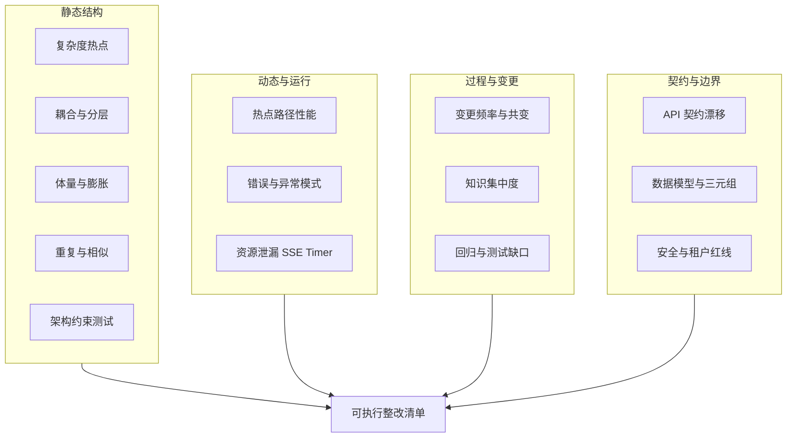

# 代码质量与架构诊断方法体系

> **类型**：跨模块专项设计（诊断手册）  
> **适用源码**：JNPF v5.2  
> **状态**：v1.0（2026-08-06）  
> **关联产物**：[`design-quality-hotspot-top20.md`](design-quality-hotspot-top20.md) · [`design-quality-frontend-index-summary.md`](design-quality-frontend-index-summary.md) · [`design-quality-frontend-ct-report.md`](design-quality-frontend-ct-report.md)（**前端 X光/CT 实测**） · [`design-quality-frontend-cabinets.md`](design-quality-frontend-cabinets.md) · [`design-quality-frontend-tooling-adr.md`](design-quality-frontend-tooling-adr.md) · [`design-quality-baseline-gates.md`](design-quality-baseline-gates.md)  
> **编写规范**：[`../ARCHITECTURE_DOC_RULES.md`](../ARCHITECTURE_DOC_RULES.md)

---

## 1. 目的与边界

### 1.1 目的

把「感觉项目很烂、不知道从哪下手」变成**可重复执行的量化诊断**：每个维度对应验收命令、输出物与整改排序键。

### 1.2 边界（明确不做）

| 不做 | 原因 |
|------|------|
| 全仓 SonarQube 吓一跳报告 | 不可执行，淹没真正热点 |
| 无 xUnit 拆上帝函数 | 违反实现完整性铁律；改完无法证明行为 |
| 先「组件化」后清热点 | 上帝函数会变成上帝组件 |
| 三前端合成单一 Vue 工程 | UI 库 + UniApp 运行时冲突；属体验/部署层，见附录 A |
| 日常开发全进 Docker Desktop | 发布向镜像无 HMR；见附录 A |

### 1.3 本节核心表清单

本手册为**过程/结构诊断**，不直接读写业务表。相关数据面门禁仍锚定：

- **AI / Studio 血缘**：三元组 `(tenantId, projectId, pipelineId)` — 见 R12 与 `scripts/diagnose-triple-key.mjs`
- **权限**：`BASE_USER` / `BASE_AUTHORIZE` 等（经 `UserManager` 数据权限路径）

### 1.4 本节关键代码路径索引

| 路径 | 用途 |
|------|------|
| `backend/tools/JNPF.Analyzers/` | 现有 Roslyn 行为红线（无复杂度门禁） |
| `.claude/hooks/guard-write.mjs` 等 | L0 红线（租户/SQL/权限/SSE） |
| `scripts/diagnose-triple-key.mjs` | 三元组健康检查 |
| `scripts/test-hooks.mjs` | Hook 用例 |
| `graphify-out/` | 文件关系图缓存 |
| Codebase-Memory 项目名 `jnpf-v52` | 后端图（Method 复杂度属性） |

---

## 2. 诊断维度总图



**图 2-1 诊断维度 → 整改清单**

---

## 3. 整改排序公式（强制）

对候选符号 / 文件：

```text
score = 业务核心度(1..5) × 变更频率(commits) × max(认知复杂度, 1)
```

| 业务核心度 | 含义 | 示例 |
|------------|------|------|
| 5 | 授权 / 登录 / 租户 | `UserManager.GetConditionAsync`、`OAuthService.Login` |
| 4 | 在线开发列表/保存主路径 | `RunService.GetListResult`、`SaveDataToDataByFId` |
| 3 | 可视化/代码生成装配 | `FuncToMenu`、`ImportDataAssemble` |
| 2 | 集成助手/Studio 编排 | `AIDevelopmentPipelineService`、Skill 编排器 |
| 1 | 周边工具/导出辅助 | `ExcelExportHelper` |

**规则**：同分优先「有测试缺口」者；**禁止**无测试覆盖下拆复杂度 ≥30 的方法。

---

## 4. 八类方法与本仓命令映射

### 4.1 静态结构

| 方法 | 测什么 | 验收命令 / 操作 | 输出物 |
|------|--------|-----------------|--------|
| 复杂度热点 | 圈/认知/嵌套 | Codebase-Memory：`MATCH (m:Method) WHERE m.complexity > 29 RETURN ...`（project=`jnpf-v52`） | 重症清单（见 Hotspot 报告） |
| 依赖方向 / 分层 | 跨层双向调用 | `get_architecture(aspects=['boundaries','layers'])` | 违例边表（如 `JNPF↔inteAssistant`） |
| 模块内聚 | Leiden 簇 vs 目录 | `get_architecture(aspects=['clusters'])` | 低凝聚簇名单 |
| 不稳定度 | fan-in/fan-out | `get_architecture(aspects=['hotspots','packages'])` | 危险核心包 |
| 上帝文件 | LOC / 方法数 | PowerShell 量行 + Serena `get_symbols_overview` | 文件体量表 |
| 近似克隆 | 相似边 | 图 `SIMILAR_TO`；可选 jscpd | 克隆对 |
| 死代码 | 零入边 | 图 fan-in=0（慎判 DI/反射） | 候选删除表 |
| Roslyn 覆盖 | 编译期规则 | 审 `backend/tools/JNPF.Analyzers/Analyzers/*.cs` | 缺口列表 → baseline-gates |

### 4.2 体量与可维护性

| 方法 | 阈值经验 | 验收命令 |
|------|----------|----------|
| 文件体积 | `.cs` >800 行、`.vue` >500 行警戒 | `Get-Content … \| Measure-Object -Line` |
| 类型检查可负担性 | 全量 `vue-tsc` OOM | `cd jnpf-web-vue3; pnpm type-check`（**禁止**裸全量） |
| 依赖膨胀 | 三端 UI 库分裂为架构事实 | 对比三端 `package.json` |

### 4.3 过程与变更（往往比静态更准）

| 方法 | 验收命令 | 输出物 |
|------|----------|--------|
| Hotspot = 复杂度 × 变更频率 | 见 [`design-quality-hotspot-top20.md`](design-quality-hotspot-top20.md) 再生步骤 | Top20 |
| 共变耦合 | `git log --name-only` 同 commit 共现统计 | 文件对 |
| Bus factor | `git shortlog -sn -- path` | 主作者占比 |

### 4.4 动态与运行时

| 方法 | 验收命令 |
|------|----------|
| API 冒烟 | `node scripts/jnpf-api.mjs GET /api/oauth/CurrentUser` |
| API 快测 | `E2E_PIPELINE_ID=311 pnpm test:api` |
| Hook 合规 | `node scripts/test-hooks.mjs` |
| 后端编译 | `cd backend; dotnet build` |
| SSE/Timer | Hook R6 + Playwright 长会话（前端交付时） |
| 数据驱动调试 | `.claude/skills/data-driven-debug/SKILL.md` |

### 4.5 契约、数据与安全

| 方法 | 验收命令 |
|------|----------|
| 三元组 | `node scripts/diagnose-triple-key.mjs` |
| L0 红线用例 | `node scripts/test-hooks.mjs` |
| CI 分析器构建 | `cd backend; dotnet build /p:CI_BUILD=true` |
| OpenSpec 对照 | `openspec/specs/` + 源码（architecture-doc skill） |

### 4.6 前端专用（体重秤 ≠ CT）

| 层 | 方法 | 做法 |
|----|------|------|
| L1 | LOC | 行数初筛；**不能**单独定案 |
| L3/L4 | **vue-mess-detector** + **SonarJS 认知复杂度** | 圈复杂度 / Vue 异味 + 认知复杂度双榜 — **前端 CT 主力** |
| L2 | **dependency-cruiser** + Knip | 环依赖 / 死文件（已配置；`pnpm quality:arch` / `quality:knip`） |
| L5 | 类型债 | `as any` / 显式 any；注意本仓 ESLint 关掉了 `no-explicit-any` |
| L6 | Bundle | `rollup-plugin-visualizer`（已在 package.json） |
| 组件契约 | vue-component-meta | `pnpm quality:components` |
| 内存 | fuite + R6 | `pnpm quality:memory`（需 Chrome + :3100） |
| 图谱 | Codebase-Memory | 辅助模块扇入；**不能替代** VMD |

完整实测胶片：[`design-quality-frontend-ct-report.md`](design-quality-frontend-ct-report.md)。  
专科五柜选型：[`design-quality-frontend-tooling-adr.md`](design-quality-frontend-tooling-adr.md) · 执行快照：[`design-quality-frontend-cabinets.md`](design-quality-frontend-cabinets.md)。

---

## 5. 输出物模板

### 5.1 重症方法清单（模板）

| 方法 | 文件 | CC | 认知 | 业务核心 | commits | score | 有测试? | 动作 |
|------|------|----|------|----------|---------|-------|---------|------|
| … | … | … | … | 1–5 | … | … | 是/否 | 补测 / 拆分 / 暂缓 |

### 5.2 分层违例（模板）

| From | To | call_count | 期望方向 | 处置 |
|------|-----|------------|----------|------|
| JNPF | inteAssistant | N | 禁止（应由接口反转） | 见 baseline-gates |

### 5.3 前端索引后报告（模板）

见 [`design-quality-frontend-index-summary.md`](design-quality-frontend-index-summary.md)。

---

## 6. 本仓「已具备 vs 缺口」

### 6.1 已具备（优先复用）

- Codebase-Memory：`hotspots` / `clusters` / `boundaries` / Method.`complexity`·`cognitive`·`loop_depth`
- Serena：符号级定位
- Knowledge Graph / wrongbook：领域与错题
- `graphify-out/`：文件关系
- Hooks + `JNPF.Analyzers`：行为红线
- `pnpm test:api`、阶段 xUnit、Playwright 证据链
- `diagnose-triple-key.mjs`

### 6.2 缺口（设计见 baseline-gates，勿一次上全）

1. 复杂度门禁（新增方法 >30 失败；存量基线豁免）
2. NetArchTest：禁止 `framework → inteAssistant` 直接依赖
3. Hotspot 报告自动化再生（当前为手册 + Top20 快照）
4. 前端索引保持新鲜（三项目已建索引，见摘要）
5. `start-dev` 按需剖面（体验层，附录 A）

---

## 7. 推荐执行序


**图 7-1 推荐操作序**

1. 阅读并维护 [`design-quality-hotspot-top20.md`](design-quality-hotspot-top20.md)
2. 阅读 [`design-quality-frontend-index-summary.md`](design-quality-frontend-index-summary.md)
3. 按 [`design-quality-baseline-gates.md`](design-quality-baseline-gates.md) 排期实现（**先设计后编码**）
4. 拆分时：先补 xUnit → 再 extract method；目标 CC&lt;15

---

## 附录 A · 体验层诊断（与代码质量正交）

| 痛点 | 诊断结论 | 建议 |
|------|----------|------|
| 多端口多窗口 | 开发态 Vite/UniApp 各需 HMR 进程；生产 Nginx 已可 `/` + `/DataV` 同域 | `start-dev` 增加 Profile：Core=API+PC |
| 全进 Docker | 现有 Dockerfile 为 publish/build，无热更新；Windows 挂卷慢 | 仅演示/预发用 Compose；日常本机 |
| 三端单体前端 | Ant Design / Element Plus / UniApp 不可硬合 | 禁止作为质量整改第一步 |

端口约定：[`docs/conventions/ports.md`](../../conventions/ports.md) · 启动：[`start-dev.ps1`](../../../start-dev.ps1)

---

## 附录 B · Codebase-Memory 速查（project 名）

| 索引名 | 范围 |
|--------|------|
| `jnpf-v52` | 后端为主（C# / SQL） |
| `D-JNPF-v52-jnpf-web-vue3` | PC 前端（moderate 索引） |
| `D-JNPF-v52-jnpf-web-datascreen` | 数字大屏 |
| `D-JNPF-v52-jnpf-app-vue3` | UniApp |

复杂度查询示例（后端）：

```cypher
MATCH (m:Method)
WHERE m.complexity > 29
RETURN m.name, m.complexity, m.cognitive, m.loop_depth, m.file_path
ORDER BY m.complexity DESC
LIMIT 50
```

> 注意：部分环境下 `WHERE m.complexity >= 30` 可能因类型绑定失败返回空集；优先用 `m.complexity > 29` 或 `m.cognitive > 100`。
