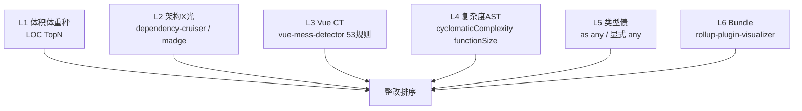

# 前端 CT 报告 — jnpf-web-vue3（X 光 / CT 三层工具栈）

> **日期**：2026-08-06  
> **范围**：`jnpf-web-vue3/src`（788 `.vue` + 647 `.ts/.tsx`）  
> **父文档**：[`design-quality-diagnostics.md`](design-quality-diagnostics.md)  
> **证据目录**：`.claude/evidence/frontend-ct/`  
> **原则**：行数只是体重秤；本报告以 **实测可复现扫描** 为准

---

## 0. 纠错声明（相对此前「索引摘要」）

| 此前说法 | 纠正 |
|----------|------|
| 前端无法像后端那样查圈复杂度 | **错**。`vue-mess-detector` 规则 `cyclomaticComplexity` 已对全量 `src` 跑通 |
| Serena / Codebase-Memory 是前端 CT 主力 | **错**。Serena 对 `.vue` 符号弱；前端 CT 主力是 **vue-mess-detector** |
| 文件行数是核心指标 | **错**。行数 = L1 初筛；病症在 L3/L4（复杂度 / Vue 反模式 / computed 副作用） |
| 「前端只能猜」 | **过时**。本报告给出 3869 errors / 4989 warnings 的规则级分布 |

---

## 1. 工具栈：体重秤 → X 光 → CT



**图 1-1 前端六层扫描**

| 层 | 扫描什么 | 工具 | 本仓状态 |
|----|----------|------|----------|
| L1 | 文件行数 | PowerShell LOC | ✅ 已跑 |
| L2 | 循环依赖 / 分层 | **dependency-cruiser** + Knip | ✅ **已配置并实测**（见五柜 ADR / `pnpm quality:arch`） |
| L3 | Vue 反模式 + 异味 | **vue-mess-detector** `rrd`+`vue-essential` | ✅ **全量实测** |
| L4 | 圈复杂度 / 函数过长 | VMD 内置 | ✅ 已从 JSON 抽出 Top |
| L5 | 类型逃逸 | ripgrep | ✅ 已跑 |
| L6 | 包体积 | `rollup-plugin-visualizer`（package 已有） | 🟡 未生成本次 report.html |

**调研依据：**

- [vue-mess-detector](https://github.com/rrd108/vue-mess-detector) · [cyclomaticComplexity 文档](https://vue-mess-detector.webmania.cc/rules/rrd/cyclomatic-complexity.html) · 53 条规则  
- [dependency-cruiser](https://github.com/sverweij/dependency-cruiser)（Vue SFC 需 `@vue/compiler-sfc` + tsconfig paths）  
- madge（轻量环检测）  
- 本仓已有：`eslint-plugin-vue`、`typescript-eslint`、`rollup-plugin-visualizer`（见 `package.json`）

---

## 2. 实测验证（不是纸面）

### 2.1 冒烟：单文件 CT

```text
npx vue-mess-detector analyze src/components/Jnpf/InputTable/src/InputTable.vue
```

| 指标 | 结果 |
|------|------|
| 规则集 | 6 sets / 53 rules |
| 发现问题 | 45 errors + 36 warnings |
| **圈复杂度** | **120（very high）** |
| 文件体量 | 815 lines（hugeFiles） |
| script 块 | 728 lines |
| Code Health | 88%（单文件） |

结论：**工具真正解析 template + script**，不是行数脚本。

### 2.2 全量 CT（核心扫描）

```bash
cd jnpf-web-vue3
npx vue-mess-detector analyze src -a "rrd,vue-essential" -g rule -s desc \
  --output json -f ../.claude/evidence/frontend-ct/vmd-rrd-essential.json
```

| 指标 | 数值 |
|------|------|
| 文件数 | **1420** |
| 代码行 | **210,772** |
| errors | **3,869** |
| warnings | **4,989** |
| Code Health points | **95**（工具自评 GOOD；**不等于业务健康**） |
| 原始 JSON（2 规则集：rrd+essential） | `.claude/evidence/frontend-ct/vmd-rrd-essential.json`（~3.8MB） |
| 全 6 规则集（53 规则） | 命令复现：`npx vue-mess-detector analyze src --output json`（~5.9MB；warning 升至 11,384，多出 `vue-strong` 的 5,735 多属性等风格项） |
| 汇总 | `.claude/evidence/frontend-ct/vmd-summary.json` |

> **读 Health 的正确姿势**：95% 会被「大量低危警告摊薄」。真正要盯的是 **高复杂度 / computed 副作用 / 巨型 SFC / v-if+v-for**，不是 curly braces 计数。

### 2.3 现有 ESLint 基线（为何还要 VMD）

[`jnpf-web-vue3/.eslintrc.js`](../../../jnpf-web-vue3/.eslintrc.js)：

- 已开：`plugin:vue/vue3-recommended`、`@typescript-eslint/recommended`、`no-eval` 等  
- **关掉了**：`@typescript-eslint/no-explicit-any`、`ban-ts-comment`、多数严格类型规则  
- **没有**：圈复杂度、computed 副作用、huge file、props drilling  

→ ESLint = 语法/风格门禁；**VMD = Vue 病症 CT**。二者互补，不是替代。

---

## 3. 全量扫描 Top 病症（按出现次数）

> 来源：`vmd-summary.json` · 规则集仅 `rrd` + `vue-essential`（37 条）

| 优先级解读 | 规则 | 次数 | 怎么看 |
|------------|------|-----:|--------|
| 噪声偏多 | if without curly braces | 2202 | 风格债；**勿当第一手术刀** |
| 噪声偏多 | short variable names | 1430 | 含 `i/e/res` 等；需白名单后才有用 |
| 中 | magic numbers | 603 | 可逐步收敛 |
| **Vue 病** | v-for with index key | 541 | 列表错乱风险 |
| **结构** | Long script blocks | 518（err 179） | 该拆 composable |
| 噪声 | html link | 502 | 管理端 `<a>` 常见，优先级低 |
| **结构** | function size | 447（err 124） | 长函数 |
| **核心 CT** | **cyclomatic complexity** | **369（err 213）** | **与后端重症同构** |
| 中 | else conditions | 295 | 可读性 |
| **Vue 病** | **computed side effects** | **261** | **computed 里写副作用 = 经典雷** |
| Vue 病 | big v-if | 229 | 模板逻辑过重 |
| Vue essential | single name component | 161 | 命名规范 |
| Vue essential | simple prop（无类型） | 125 | props 类型债 |
| Vue essential | global style | 105 | 样式污染 |
| Vue essential | v-for no key | 45 | 必修 |
| Vue essential | **v-if with v-for** | **5** | 数量少但必须清 |
| 结构 | huge files | 74（err 20） | 巨型组件 |

---

## 4. 重症排行榜（真正的 CT 胶片）

### 4.1 圈复杂度 Top（L4）

| CC | 文件 |
|---:|------|
| **232** | `src/views/common/dynamicModel/list/index.vue` |
| **200** | `src/views/studio/components/AiChatPanel.vue` |
| **156** | `src/components/FormGenerator/src/components/Parser.vue` |
| **129** | `src/components/FormGenerator/src/FormGenerator.vue` |
| **120** | `src/components/Jnpf/InputTable/src/InputTable.vue` |
| 116 | `src/utils/jnpf.ts` |
| 105 | `src/components/PrintDesign/printBrowse/index.vue` |
| 96 | `src/components/ColumnDesign/src/components/Main.vue` |
| 96 | `src/components/FlowProcess/src/propPanel/index.vue` |
| 88 | `src/views/workFlow/components/FlowParser.vue` |

### 4.2 巨型文件 Top（L1 ∩ L3 hugeFiles）

| 行数（LOC） | 文件 | 备注 |
|----------:|------|------|
| 2539 | `views/studio/components/AiChatPanel.vue` | Studio 主对话；业务核心度高 |
| 1807 | `views/common/dynamicModel/list/index.vue` | 在线开发列表；**CC 亦第一** |
| 1254 | `components/ColumnDesign/.../Main.vue` | 列设计器 |
| 1044 | `FlowProcess/.../ApproverNode.vue` | 审批节点面板 |
| 968 | `systemData/dataInterface/Form.vue` | 数据接口表单 |
| 923 | `FormGenerator.vue` | 表单设计器 |
| 815 | `InputTable.vue` | 冒烟样本 |

### 4.3 类型债（L5）

| 指标 | 数量 |
|------|-----:|
| `as any` | **347** |
| `@ts-ignore` / `@ts-expect-error` | **13** |
| 显式 any 注解（`: any` / `Array<any>` 等） | **1742** |
| ESLint `no-explicit-any` | **off**（见 `.eslintrc.js`） |

---

## 5. L2 架构 X 光 — 当前受阻与下一步

| 尝试 | 结果 |
|------|------|
| `madge --circular --extensions vue,ts src` | Processed **0** files |
| `dependency-cruiser --no-config` | 0 modules；缺配置 / TS 解析未吃到 paths+alias |
| `depcruise ./src --ts-config tsconfig.json` | 仍 0 modules（需正式 init + webpack alias） |

**结论（诚实）：** L2 本轮 **未形成可信环依赖报告**。不假装「无循环」。

**下一刀（实现任务，非本次）：**

1. 在 `jnpf-web-vue3` 执行 `npx depcruise --init` 生成 `.dependency-cruiser.js`  
2. 配置 `webpackConfig` / `tsConfig` / `alias`（对齐 Vite `@` → `src`）  
3. 规则起步：`no-circular` + `views 不得直接深依赖 components 内部实现`（按需）  
4. CI：`pnpm exec depcruise src`  

### 5.1 复跑成功 — madge 已产出可信环依赖报告（2026-08-06 更新）

> 用 `--ts-config` 显式喂入 TS 配置后，上表「Processed 0 files」**已解决**。复现：`npx madge --circular --extensions ts,vue src --ts-config tsconfig.json`

```bash
cd jnpf-web-vue3
npx madge --circular --extensions ts,vue src --ts-config tsconfig.json
# Processed 1496 files (13.4s) → ✖ Found 182 circular dependencies
```

**规模：** 182 个环，**162 个（89%）涉及 `utils/` × `router/` × `store/` × `api/` × `hooks/` × `layouts/` 中至少两类基础设施目录互咬**——即不是组件间偶发循环，而是**基础设施层结构性互依赖**。

**架构黑洞 Top5（被卷入环数最多的文件）：**

| 卷入环数 | 文件 | 角色 |
|--------:|------|------|
| **126** | `store/modules/user.ts` | 黑洞中心：store 反向依赖 router→views |
| **126** | `router/routes/basic.ts` | 路由直接 import view 文件 |
| **109** | `utils/http/axios/index.ts` | HTTP 层反向依赖 store/modules/user |
| **103** | `layouts/default/index.vue` | 布局组件卷入业务环 |
| **102** | `router/index.ts` | 工具函数 `utils/jnpf.ts` 反向依赖 router |

**核心病根环（最该打破的一条）：**

```text
store/modules/user.ts → router/routes/basic.ts → views/.../index.vue
  → ... → utils/http/axios/index.ts → store/modules/user.ts
```

**读法：** `utils/jnpf.ts`（工具层）依赖 `router`（路由层），`router/constant.ts` 依赖 `layouts/default/index.vue`（布局层），布局又依赖 `hooks`，`hooks` 依赖 `store/modules/lock.ts`，`store` 依赖 `api`，`api` 依赖 `utils/http/axios`，axios 又依赖 `store/modules/user.ts`——**六层基础设施首尾相咬**。后果：tree-shaking 失效、整环无法独立单测、改一处触发环上所有模块重编。

**短环（≤3 节点，硬伤，最易打破）：**

```text
api/basic/user.ts → utils/http/axios/index.ts → store/modules/user.ts
utils/jnpf.ts → router/index.ts
components/Form/src/types/form.ts ↔ components/Table/src/types/table.ts（双向）
```

> dependency-cruiser 的「分层规则」仍未落地（见上一刀 1–4），但 madge 这一刀已足够定位**拆解的第一手术刀**：`utils/http/axios` 不应反向 import `store`——抽 `IUserContext` 接口注入，可一举切断 109 个环。

---

## 6. 病症 → 整改优先级（教你怎么读胶片）

### 排序公式（前端版）

```text
score = 业务核心度(1..5) × max(圈复杂度, 巨型行数/10) × 变更频率
```

噪声规则（curly braces / short names / html link）**乘以 0.1 或直接剔除**，否则永远在刷风格。

### 建议手术排队（业务向）

| 波次 | 目标 | 为什么 |
|------|------|--------|
| **F-W1** | `dynamicModel/list/index.vue` | CC 232 + 1807 行；在线开发列表主路径 |
| **F-W2** | `AiChatPanel.vue`（studio） | 2682 行 + CC 200；当前 Studio 主战场 |
| **F-W3** | `FormGenerator` + `Parser.vue` | 低代码表单运行时核心 |
| **F-W4** | `InputTable.vue` | 已冒烟有基线；适合练「带测拆分」 |
| **F-W5** | 清 `computed side effects`（261）与 `v-if+v-for`（5） | 全仓横切 Vue 雷，可并行小 PR |

**铁律：** 拆之前先锁行为（组件测 / Playwright 关键路径）。无测试拆 2000 行 SFC = 整容事故。

---

## 7. 与后端诊断的对照（同一套专家语言）

| 后端（已有） | 前端（本报告） |
|--------------|----------------|
| Codebase-Memory Method.complexity | VMD `cyclomaticComplexity` |
| Hotspot = CC × git churn | 同公式，换成 `.vue` 路径 |
| framework↔inteAssistant 分层 | L2 depcruise（待打通） |
| Roslyn 基线门禁（设计中） | VMD CI + 逐步打开 ESLint 复杂度规则 |

---

## 8. 复现命令清单（菜鸟架构师抄这里）

```powershell
cd D:\JNPF-v52\jnpf-web-vue3

# 冒烟 CT
npx vue-mess-detector analyze src/components/Jnpf/InputTable/src/InputTable.vue

# 全量 CT（rrd + vue-essential）
npx vue-mess-detector analyze src -a "rrd,vue-essential" -g rule -s desc `
  --output json -f D:\JNPF-v52\.claude\evidence\frontend-ct\vmd-rrd-essential.json

# L5 类型债
rg -n --glob "*.{vue,ts,tsx}" -e "as any" src
rg -n --glob "*.{vue,ts,tsx}" -e "@ts-ignore|@ts-expect-error" src

# L1 LOC
# （见 evidence/l1-vue-loc-top20.txt）
```

**不做：** 全仓 Sonar 一次性吓晕；为过 VMD 去改 2202 处花括号而忽视 CC=232。

---

## 9. 本节关键路径索引

- 证据：`.claude/evidence/frontend-ct/vmd-rrd-essential.json`  
- 汇总：`.claude/evidence/frontend-ct/vmd-summary.json`  
- ESLint：`jnpf-web-vue3/.eslintrc.js`  
- 冒烟样本：`jnpf-web-vue3/src/components/Jnpf/InputTable/src/InputTable.vue`  
- 后端对照：[`design-quality-hotspot-top20.md`](design-quality-hotspot-top20.md)
