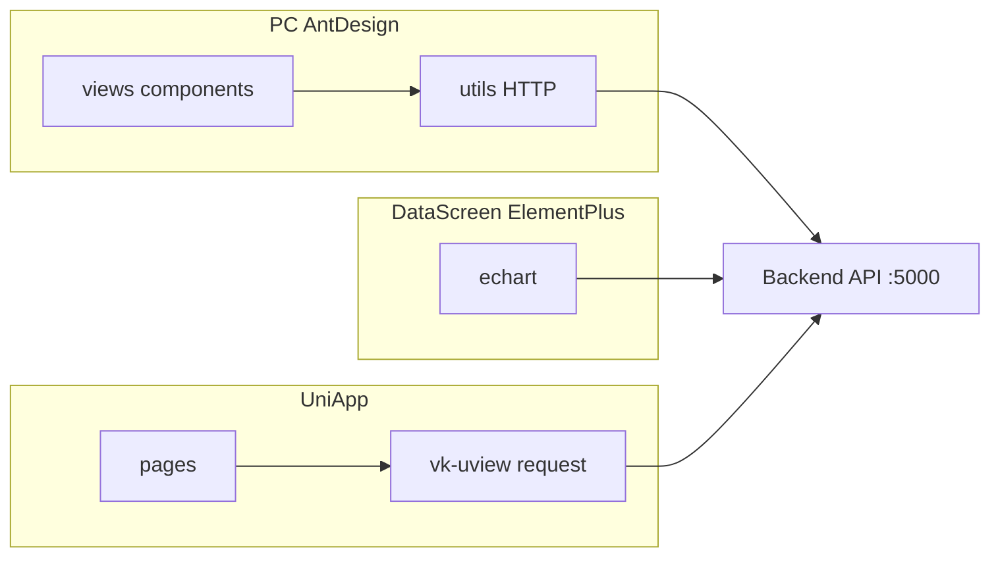

# 前端 Codebase-Memory 索引摘要

> **父文档**：[`design-quality-diagnostics.md`](design-quality-diagnostics.md)  
> **生成日期**：2026-08-06  
> **目的**：补齐「后端可量化、前端只能猜」的缺口；三端已各自建索引。

---

## 1. 索引状态

| 目录 | MCP project 名 | mode | nodes | edges | 语言构成（文件数） |
|------|----------------|------|------:|------:|-------------------|
| `jnpf-web-vue3/` | `D-JNPF-v52-jnpf-web-vue3` | moderate | 22098 | 34098 | Vue 790 · TS 590 · JS 5 |
| `jnpf-web-datascreen/` | `D-JNPF-v52-jnpf-web-datascreen` | moderate | 687 | 1023 | Vue 131 · JS 48 · SCSS 4 |
| `jnpf-app-vue3/` | `D-JNPF-v52-jnpf-app-vue3` | fast | 5208 | 8566 | Vue 404 · JS 178 · TS 10 |

**刷新命令**（Cursor MCP `index_repository`）：

- `repo_path` = 各前端根目录  
- `name` = 上表 project 名（或省略由路径派生）  
- 建议：PC 用 `moderate`；大屏 `moderate`；App 因 `uni_modules` 体积大可用 `fast`

---

## 2. PC（jnpf-web-vue3）— 结构信号

### 2.1 包级扇出（调用边界 Top）

| From | To | call_count |
|------|-----|----------:|
| api | utils | 668 |
| components | utils | 113 |
| views | utils | 63 |
| components | hooks | 30 |
| layouts | hooks | 28 |
| store | utils | 24 |

**解读**：`utils` 是事实上的核心层（architecture `layers`：utils fan-in≈903）。HTTP 封装 `VAxios.get/post` 为最高 fan-in 热点（355 / 216），属**正常基础设施扇入**，不是上帝业务函数。

### 2.2 Fan-in 热点（基础设施 vs 业务）

| 符号 | fan_in | 归类 |
|------|-------:|------|
| `VAxios.get` / `post` / `put` / `delete` | 355–73 | 基础设施 |
| `withInstall` | 69 | 组件注册 |
| `getTableInstance` | 33 | Table 组件 |
| `useI18n` | 21 | 横切 |
| `mitt.emit` | 19 | 事件总线 |

业务侧更应盯：**Studio SSE**（`useGateSSE.connect/disconnect` 为入口点）、`src/api/studio/*`、巨型 `views`/`components` SFC 体积（需另做 LOC 扫描，本索引未对每个 `.vue` 填满 cognitive）。

### 2.3 Leiden 簇

最大簇约 342 成员、凝聚度 ≈0.93（`get`/`authHeaders` 等 API 簇）— PC 侧**调用图相对内聚**，主要债在：

1. **全量 type-check OOM**（已用 Studio scoped `pnpm type-check` 规避）  
2. **utils / axios 中心化**（改 HTTP 层影响面大）  
3. **三端 UI 库分裂**（与大屏/App 无法共享组件树）

### 2.4 关键路径索引

- `jnpf-web-vue3/src/utils/http/axios/` — HTTP 核心  
- `jnpf-web-vue3/src/views/studio/ai/composables/useGateSSE.ts` — SSE（R6）  
- `jnpf-web-vue3/src/api/studio/` — Studio API  
- `jnpf-web-vue3/tsconfig.typecheck.json` — scoped 类型检查

---

## 3. 数字大屏（jnpf-web-datascreen）

| 指标 | 值 |
|------|-----|
| 规模 | 较小（687 节点） |
| 热点 | `echart` 包：`validatenull` / `getItemRefs` / `updateChart` / `updateData` |
| 边界 | mixins↔echart、utils↔echart（调用量低） |
| 技术栈事实 | Element Plus + DataV + Avue + Monaco（见 `package.json`） |

**质量结论**：债主要在**依赖重量与构建分包**（vite manualChunks 已拆 element/monaco/datav），而非巨型跨模块调用网。与 PC **禁止合并为单一 SPA**。

关键路径：`jnpf-web-datascreen/src/echart/` · `vite.config.js`（port 3102）

---

## 4. UniApp（jnpf-app-vue3）

| 指标 | 值 |
|------|-----|
| 规模 | 5208 节点（含大量 `uni_modules`） |
| 最高 fan-in | `vk-uview-ui` `Request.request` = 221 |
| 业务边界 | `workFlow`/`common`/`apply` → `vk-uview-ui`（86/76/38） |
| 噪声 | qiun-data-charts / async-validator 等第三方 inflates 热点表 |

**质量结论**：

1. 业务代码对 **uView 请求层**强耦合 — 换 HTTP 层成本高。  
2. 索引应**排除或降权 `uni_modules`** 再谈「业务热点」（当前 fast 模式已排除部分 i18n/static，但仍含组件库）。  
3. 与 PC 合仓 = 推倒 UniApp 运行时，**不在质量整改路径内**。

关键路径：`jnpf-app-vue3/api/` · `jnpf-app-vue3/utils/define.js` · `scripts/proxy_server.py`（:3800）

---

## 5. 跨端对比（架构事实）

**图 5-1 三端共用后端、不共用前端运行时**

| 维度 | PC | 大屏 | App |
|------|----|------|-----|
| UI | Ant Design Vue | Element Plus | uni-ui / uView |
| 开发端口 | 3100 | 3102 | 3800 |
| 生产合并入口 | Nginx `/` | Nginx `/DataV`（可同域） | 独立 H5/小程序包 |
| 图分析成熟度 | 高（TS+Vue 索引完整） | 中 | 中（第三方噪声大） |

---

## 6. 前端后续量化清单（建议）

| # | 动作 | 验收 |
|---|------|------|
| F1 | 对 `src/views` / `src/components` 做 LOC Top30 | PowerShell `Measure-Object -Line` |
| F2 | ESLint 统计 `no-explicit-any` | `pnpm lint` 报告计数 |
| F3 | Studio 路径单独 `query_graph` 复杂度 | project=`D-JNPF-v52-jnpf-web-vue3`，path 过滤 studio |
| F4 | App 重建索引时扩大 exclude `uni_modules` | 业务-only 热点表 |
| F5 | `pnpm type-check` 保持绿；全量仅改遗留模块时跑 | 见 frontend-typecheck 规则 |

---

## 7. 本节核心说明

本摘要不绑定业务库表；前端消费后端权限/Studio API，数据面仍受 **BASE_*** 与三元组约束（见后端手册与 R12）。
