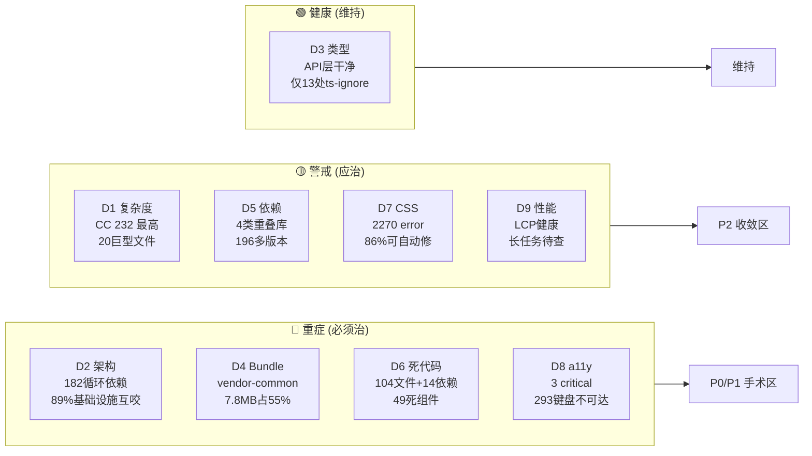
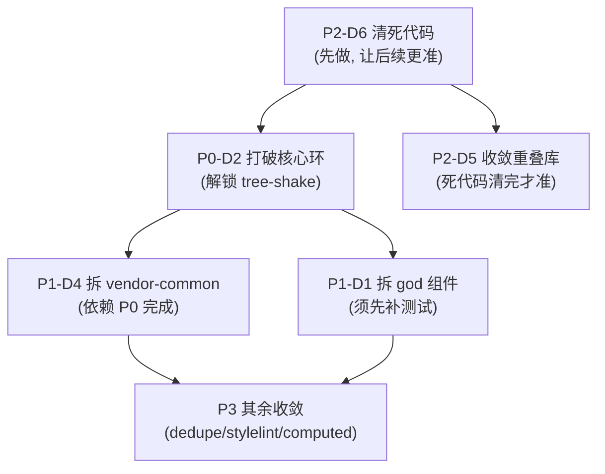

# 前端质量整改路线图（九维度统一）

> **日期**：2026-08-06  
> **定位**：本文是**执行索引**——把三份扫描报告的整改项合并成一张按 ROI 排序的统一路线图。不重复诊断细节，只给「做什么 · 改哪 · 凭什么 · 多大工作量」。  
> **父文档**：[`design-quality-diagnostics.md`](design-quality-diagnostics.md)  
> **数据来源**（按优先阅读顺序）：
> 1. [`design-quality-frontend-ct-report.md`](design-quality-frontend-ct-report.md) — D1 复杂度 · D2 架构(182环) · D3 类型
> 2. [`design-quality-frontend-static-deep.md`](design-quality-frontend-static-deep.md) — D4 Bundle · D5 依赖 · D6 死代码 · D7 CSS
> 3. [`design-quality-frontend-runtime.md`](design-quality-frontend-runtime.md) — D8 a11y · D9 性能

---

## 0. 一图读懂：九维度健康度总览



**核心判断**：前端不是「全盘皆烂」——**87% 的组件体量正常、LCP 性能健康、API 层类型干净**。问题是**结构性的**：架构循环依赖 + bundle 未分包 + 死代码堆积 + a11y 系统性缺失。这四类是"治一处活一片"的高 ROI 切入点。

---

## 1. 整改优先级总表（按 ROI 排序）

| 波次 | 维度 | 整改项 | 收益 | 工作量 | 风险 | 验收 | 来源 |
|:----:|:----:|--------|------|:------:|:----:|------|:----:|
| **P0** | D2 | **打破 `store/user→router→views→axios→store/user` 核心环**：axios 不再反向 import store，抽 `IUserContext` 接口注入 | 解锁 tree-shake/可测试性，一举切断 109 环 | 大 | 中 | `madge --circular` 环数下降 | CT§5.1 |
| **P1** | D1 | **拆 `ColumnDesign/Main.vue`（CC 96）+ `AiChatPanel.vue`（2682行）**：拆前先补组件测 | 消除两大 god object | 大 | 高(须先有测试) | CC 降 <30 | CT§4.1 |
| **P1** | D4 | **拆 `vendor-common`（7.8MB）**：排查内含库，按路由懒加载切分 | 省 3-5MB 首屏 JS | 中 | 中 | dist JS 分块，首屏 chunk <2MB | static§4 |
| **P2** | D6 | **清死代码：104 文件 + 14 依赖**（先删整目录死的 12 个组件） | 减小仓库+bundle，让后续分析更准 | 小 | 低(复核动态import) | Knip 复扫归零 | static§1 |
| **P2** | D5 | **收敛重叠库**：定「图表选 echarts 还是 highcharts」「编辑器选 monaco 还是 codemirror」 | 省 1-4MB bundle | 中 | 中(需业务确认+回归) | package.json 去重 | static§2 |
| **P2** | D8 | **修 3 处全页面 a11y**：`lang="zh_CN"→"zh-CN"`、viewport 去 `user-scalable=0`、`role="bar"/"spinner"` 改合法值 | 全站 a11y 基线提升 | 极小(几行) | 极低 | axe 复扫 0 critical | runtime§1 |
| **P3** | D8 | **治本：293 处 `@click` 绑 div → 改 button 或加 role/tabindex** | 键盘可访问性 | 中(横切) | 低 | axe + 静态预扫双降 | runtime§1.3 |
| **P3** | D5 | **`pnpm dedupe` 收敛 196 多版本包**（先收纯类型/工具类 type-fest 等） | node_modules 瘦身 | 小 | 低 | 多版本包数下降 | static§2.2 |
| **P3** | D7 | **`pnpm lint:stylelint --fix` 自动修 1957 空行格式** | CSS 风格统一 | 极小(脚本) | 极低 | stylelint error <50 | static§3 |
| **P3** | D1 | **清 261 处 computed 副作用**（error 级，隐性 bug 温床） | 消除重渲染隐患 | 中 | 低 | VMD computedSideEffects=0 | CT§3 |
| **P4** | D9 | **排查 home/workStation 长任务来源**（疑似 vendor-common 初始化） | 改善 INP | 中 | 低 | 长任务数下降 | runtime§2 |
| **P4** | D7 | **人工修 CSS 真病症**（duplicate-properties 11 + duplicate-selectors 6） | 消除渲染冲突源 | 小 | 低 | stylelint 0 error | static§3 |

---

## 2. 依赖关系（顺序不能乱）



**关键依赖**：
- **P2-D6 死代码必须先清**——清完后 Knip/D5 分析才准（死组件可能引用着重叠库）
- **P0-D2 核心环必须先于 P1-D4 拆 bundle**——环不打破，vendor 切分无效（循环依赖让 chunk 无法分离）
- **P1-D1 拆 god 组件必须先补测试**——无测试拆 2000 行 SFC = 整容事故（实现完整性铁律）

---

## 3. 风险红线（什么不能做）

| 禁止 | 原因 |
|------|------|
| ❌ 无测试下拆 CC≥30 的方法/2682 行 SFC | 违反实现完整性铁律——改完无法证明行为不变 |
| ❌ 为降 CC 去改测试断言凑新行为 | 系统性作弊 |
| ❌ 一上来跑全仓 SonarQube | 报告吓人但不可执行，淹没真正热点 |
| ❌ 为过 VMD 改 2202 处花括号而忽视 CC=232 | 治噪声不治本 |
| ❌ 自己手点浏览器验证 a11y/性能 | 违反 AGENTS.md——MUST 用 Playwright 脚本 |

---

## 4. 快速复现（整改前后对比基线）

```bash
cd D:\JNPF-v52

# 整改前先存基线, 整改后对比
EVD=.claude/evidence/frontend-ct

# D1 复杂度基线 (CC Top)
cd jnpf-web-vue3 && npx vue-mess-detector analyze src -a "rrd,vue-essential" --output json -f ../$EVD/baseline-vmd.json

# D2 环数基线
npx madge --circular --extensions ts,vue src --ts-config tsconfig.json | grep "circular dependencies"

# D6 死代码基线
npx knip --no-exit-code | grep -A1 "Unused files"

# D8 a11y 基线 (需 dev server)
cd ../e2e && JNPF_WEB_URL=http://127.0.0.1:3100 npx playwright test admin/d8-a11y-scan.spec.ts

# D9 性能基线 (需 dev server)
JNPF_WEB_URL=http://127.0.0.1:3100 npx playwright test admin/d9-render-perf.spec.ts
```

---

## 5. 整改完成判据（DoD）

每个波次完成的硬指标：

| 波次 | 完成判据 |
|:----:|---------|
| P0 | `madge --circular` 环数 < 50（从 182）；核心环不再含 axios↔store |
| P1 | `ColumnDesign/Main.vue` CC < 30；dist 首屏 chunk < 2MB |
| P2 | Knip 未用文件 < 10；package.json 无功能重叠库；axe critical = 0 |
| P3 | VMD computedSideEffects = 0；多版本包 < 100；stylelint error < 50 |
| P4 | 长任务超100ms数 < 1/路由；stylelint duplicate-* = 0 |

---

## 6. 九维度数据速查（决策时回看）

| 维度 | 关键数值 | 报告位置 |
|:----:|---------|:--------:|
| D1 复杂度 | 最高 CC 232（dynamicModel/list）；20 个巨型文件 | CT§4 |
| D2 架构 | 182 循环依赖，89% 基础设施互咬；黑洞 store/user(126环) | CT§5.1 |
| D3 类型 | 2062 处 any（views 2.4/文件）；API 层 0.0 干净 | CT§4.3 |
| D4 Bundle | JS 14.8MB；vendor-common 7.8MB 占 55% | static§4 |
| D5 依赖 | 4 类重叠库；196 包多版本 | static§2 |
| D6 死代码 | 104 文件 + 14 依赖 + 214 导出 + 212 类型 | static§1 |
| D7 CSS | 205 文件 2270 error（86% 空行可自动修） | static§3 |
| D8 a11y | 3 critical + 5 serious（运行时）；293 键盘不可达（静态） | runtime§1 |
| D9 性能 | LCP max 1020ms 健康；home/workStation 各 2-3 长任务 | runtime§2 |
