# JNPF-AI 低代码开发平台 · 系统详细设计说明书

> **版本**：v1.0（开发态 · 全六期覆盖版）
> **编制**：首席架构师助理 · 玛维思（Mavis）
> **日期**：2026-06-15
> **状态**：全十二章完，待创始人验收
> **上游文档**：
> - 《需求分析说明书》→ `开发态-需求分析说明书-大纲.md`（已通过评审）
> - 《架构设计说明书》→ `开发态-架构设计说明书-大纲.md`（已通过评审）
> **关联文档**：
> - 《部署与运维手册》→ `开发态-部署与运维手册-大纲.md`（待写）
> - **运行态对应文档**：`运行态-第一阶段-详细设计说明书-大纲.md`（结构参照）

---

## 文档目的

本说明书是 JNPF-AI 低代码开发平台的**可施工级单一真源**。它承接《架构设计说明书》的 30 项 ARC 决策、《需求分析说明书》的 50 项 FR，把每一项落到**数据表字段 / 接口契约 / 时序图 / UI 草图 / 权限模型**。

**层级关系**：
- 需求层 FR → 架构层 ARC → **实现层 DS（本说明书）**
- DS 编号规则：`DS-<章节>-<序号>`，如 `DS-5-001` 表示第五章第 1 个设计。

**与运行态详细设计说明书的关系**：本说明书采用**完全相同的 12 章结构**（与 `运行态-第一阶段-详细设计说明书-大纲.md` 对齐），但内容是**开发态视角**——按 JNPF 实际 15 个模块 + 50 项 FR + 30 项 ARC 填充。

---

## 阅读对象

| 角色 | 阅读重点 | 可跳过 |
|------|----------|--------|
| **创始人** | 第一章概述 + 第十二章验收 | 实现细节 |
| **架构师** | 全文 + ARC 索引 | — |
| **后端工程师** | 第三章模块 + 第五章接口 + 第六章数据表 + 第九章权限 | 第八章 UI |
| **前端工程师** | 第三章模块 + 第五章接口 + 第八章 UI | 后端表设计 |
| **测试工程师** | 第十一章测试设计 + 第十二章验收 | — |
| **运维工程师** | 第四章流程 + 关联《部署与运维》 | UI |

---

## 章节速览

| 章节 | 标题 | 主要内容 | 估算页数 | 状态 |
|------|------|----------|----------|------|
| 第一章 | 文档概述 | 范围 / 与上下游关系 / DS 编号规则 | 6~8 | ✅ 本次填写 |
| 第二章 | 系统总体架构设计 | 四层架构 + 部署拓扑 + 与运行态对照 | 10~12 | ✅ 本次填写 |
| 第三章 | 功能模块结构设计 | **15 个 JNPF 模块**树形图 + 职责 + 接口说明 | 18~24 | ✅ 本次填写 |
| 第四章 | 核心业务流程设计 | 6 大端到端流程图（含 Mermaid） | 18~24 | ✅ 本次填写 |
| 第五章 | 接口设计 | DynamicApi 风格接口契约 + MCP 工具 JSON Schema | 20~26 | ✅ 本次填写 |
| 第六章 | 数据库表设计 | **80+ 张表**字段设计 + ER 图 + 命名规范 | 30~40 | ✅ 本次填写 |
| 第七章 | 关键时序设计 | 8 张时序图（核心场景） | 18~24 | ✅ 本次填写 |
| 第八章 | UI 界面设计 | 4 角色主菜单 + 关键页面草图 | 15~20 | ✅ 本次填写 |
| 第九章 | 权限管理设计 | 4 角色 × 多租户 6 层 + 创始人二次认证 | 12~16 | ✅ 本次填写 |
| 第十章 | 非功能性设计 | 性能 / 安全 / 可观测性 / 降级 | 12~16 | ✅ 本次填写 |
| 第十一章 | 测试设计 | 单元测试 + 集成测试 + **AI 评测基准 50 条** | 10~14 | ✅ 本次填写 |
| 第十二章 | 验收检查表 | M0~M5 + FM0~FM4 全部门禁 | 6~8 | ✅ 本次填写 |
| **合计** | — | — | **175~234 页** | — |

---

# 第一章 · 文档概述

## 1.1 编写目的

本说明书是 JNPF-AI 低代码开发平台的**最重文档**。它把架构层（ARC）的决策转化为**可施工级**的数据库表字段、接口 JSON 契约、时序图、UI 草图、权限模型。**没有这份文档，开发无法启动；测试无法执行；运维无法部署**。

## 1.2 系统范围与边界

### 1.2.1 系统定义

**JNPF-AI 低代码开发平台** 是一个**双系统结构**的企业级低代码产品：

| 子系统 | 名称 | 部署形态 | 使命 |
|--------|------|----------|------|
| **主体** | 猴面包树工作室（Baobab-Studio） | 对外 SaaS · 模块化单体 · .NET 8 + Vue 3 | 面向企业客户，以五阶段 AI 流水线 + 多角色 Web UI 将自然语言需求变为可运行系统 |
| **隔离区** | 猴面包树熔炉（Baobab-Foundry） | 绝密独立区 · Python · 物理隔离 | 在隔离沙箱中 7×24 自博弈，进化行业领域知识，经创始人审核后以知识补丁（KnowledgePatch）注入工作室 |

### 1.2.2 范围划分 —— 两段式（基线冻结 / 新增主战场）

#### A 段：前四期基线（已实现，冻结）

**13 项基线能力**（详见《需求分析说明书》§1.2.2）：
- JNPF 单体框架 · Vue3 单表 CRUD 编译器 · 大屏基础编译器 · IR 类型系统 · 安全表达式引擎 · 组件注册表（92.6%）· FlowIR 类型 + 状态机 · 8 目标编译网关 · UniApp 编译器 · 后端清零冲刺 1-3 · 大模型网关 6 供应商 · CI 门禁修正 · JWT 密钥外移

**冻结原则**：上述能力的接口签名、表结构、API 路径、JSON Schema **不得在本说明书中重新设计**。如发现重大缺陷，走 ADR 流程。

#### B 段：五期+六期新增（主战场）

**19 项新增能力**（详见《需求分析说明书》§1.2.2）：
- 五阶段 AI 流水线 + 5 智能体 · 业务规则配置中心 · 无 AI 专家模式 · 领域知识进化引擎 V1.0 · AI 对话工作台 · FlowIR 编译器集成 · 评测基准 50 条黄金集 · 多租户沙箱 + MultiTenancy 启用 · FounderGuard + TOTP · KnowledgePatch 签名验证 + SQL 合并 · 创始人控制台 UI · 流水线阶段 5 交付 · 熔炉 4 智能体 · 因果回放池 · 知识补丁构建器 · 匿名化原料包 · 等等

### 1.2.3 本期做 / 不做

**本期做**：A 段（基线冻结）+ B 段（新增主战场）的完整详细设计。

**本期不做**（明确排除）：
- 熔炉训练引擎的实现细节（仅描述接口，详细在熔炉独立仓库）
- Neo4j 图谱、PostgreSQL + pgvector、mTLS / WORM / 军规安保
- uni-app X 双轨编译器、任意 .vue → IR 反解析
- F-6b.8 蓝图引擎、ML.NET 本地意图分类器
- OA / IoT / MES 模块

## 1.3 DS 编号规则

| 规则 | 示例 | 含义 |
|------|------|------|
| `DS-<章>-<序号>` | `DS-5-001` | 第五章第 1 个设计 |
| `DS-<章>-<模块>-<序号>` | `DS-5-VisualDev-001` | 第五章 VisualDev 模块第 1 个设计 |
| **关联编号** | `FR-B-010 → ARC-3-002 → DS-4-005` | 需求→架构→设计的完整链路 |

## 1.4 与上下游文档关系

| 文档 | 关系 |
|------|------|
| 《需求分析说明书》 | 上游 FR → 本说明书 DS |
| 《架构设计说明书》 | 上游 ARC → 本说明书 DS |
| 《部署与运维手册》 | 下游（基于本说明书第七章流程 + 第六章表 + 第九章权限） |
| CLAUDE.md | 横向约束（CLAUDE.md R1~R5 + 4 Laws） |
| ADR-NNN | 横向约束（所有架构决策必须有 ADR 支撑） |

## 1.5 术语与缩写

见《需求分析说明书》§1.3 + 《架构设计说明书》§1.4。

---

# 第二章 · 系统总体架构设计

## 2.1 架构总览（图 2-1）

```
┌─────────────────────────────────────────────────────────────────┐
│                       浏览器（4 角色）                            │
│  业务专家 · 开发者 · 管理员 · 创始人                              │
└─────────────────────────────┬───────────────────────────────────┘
                              │ HTTPS
┌─────────────────────────────▼───────────────────────────────────┐
│                   应用宿主层（application/）                     │
│  ┌────────────────────┐  ┌────────────────────┐                │
│  │  JNPF.API.Entry    │  │  JNPF.OA.API.Entry │（已禁用）      │
│  └──────────┬─────────┘  └────────────────────┘                │
└─────────────┼───────────────────────────────────────────────────┘
              │
┌─────────────▼───────────────────────────────────────────────────┐
│                业务模块层（modularity/）                          │
│                                                                  │
│  ┌──────────┐  ┌──────────┐  ┌──────────┐  ┌──────────┐       │
│  │  system  │  │visualdev │  │ workflow │  │visualdata│       │
│  └──────────┘  └──────────┘  └──────────┘  └──────────┘       │
│  ┌──────────┐  ┌──────────┐  ┌──────────┐  ┌──────────┐       │
│  │  engine  │  │inteAsst  │  │   oauth  │  │  message │       │
│  └──────────┘  └──────────┘  └──────────┘  └──────────┘       │
│  ┌──────────┐  ┌──────────┐  ┌──────────┐  ┌──────────┐       │
│  │taskschd  │  │  extend  │  │ codegen  │  │  common  │       │
│  └──────────┘  └──────────┘  └──────────┘  └──────────┘       │
└─────────────┬───────────────────────────────────────────────────┘
              │
┌─────────────▼───────────────────────────────────────────────────┐
│              基础设施层（infrastructure/）                        │
│  SqlSugar + ITenantFilter · Dapper · Redis · RabbitMQ            │
│  Outbox · JWT · DynamicApi                                      │
└─────────────┬───────────────────────────────────────────────────┘
              │
┌─────────────▼───────────────────────────────────────────────────┐
│                    框架层（framework/）                           │
│  Furion · Oops · DynamicApiController · RESTfulResult · DI       │
└─────────────────────────────────────────────────────────────────┘
                              │
                              ▼
┌─────────────────────────────────────────────────────────────────┐
│                   共享 SQL Server 实例                            │
│  ├─ master（平台元数据）                                          │
│  ├─ tenant_{id}（每租户独立 DB）                                  │
│  └─ sandbox_{tenantId}（沙箱 DB）                                 │
└─────────────────────────────────────────────────────────────────┘
```

## 2.2 部署拓扑（图 2-2）

```
┌─────────────────────────────────────────────────────────────────┐
│                     工作室生产环境（客户）                         │
│                                                                  │
│  ┌─────────────────────────────────────────────────────────┐   │
│  │                  K8s 集群                                │   │
│  │                                                          │   │
│  │   ┌─────────┐  ┌─────────┐  ┌─────────┐               │   │
│  │   │ API × N │  │ 沙箱 × 5│  │ Web × N │               │   │
│  │   └────┬────┘  └────┬────┘  └────┬────┘               │   │
│  │        │             │            │                      │   │
│  │   ┌────▼─────────────▼────────────▼──────────┐         │   │
│  │   │    共享 SQL Server 实例                   │         │   │
│  │   │    ├─ master                              │         │   │
│  │   │    ├─ tenant_001 ~ tenant_N               │         │   │
│  │   │    └─ sandbox_{tenantId}                  │         │   │
│  │   └───────────────────────────────────────────┘         │   │
│  │                                                          │   │
│  │   ┌─────────┐  ┌─────────┐                              │   │
│  │   │  Redis  │  │RabbitMQ │                              │   │
│  │   └─────────┘  └─────────┘                              │   │
│  └─────────────────────────────────────────────────────────┘   │
└─────────────────────────────────────────────────────────────────┘
                              │
                              │ HTTPS + 签名 zip
                              ▼
┌─────────────────────────────────────────────────────────────────┐
│                   熔炉绝密独立区                                  │
│                                                                  │
│  ┌─────────────────────────────────────────────────────────┐   │
│  │                  物理隔离网络（无公网端口）                │   │
│  │                                                          │   │
│  │   ┌─────────┐  ┌─────────┐  ┌─────────┐               │   │
│  │   │ 攻击者  │  │ 构建者  │  │  判官   │               │   │
│  │   └─────────┘  └─────────┘  └─────────┘               │   │
│  │        │             │            │                      │   │
│  │   ┌────▼─────────────▼────────────▼──────────┐         │   │
│  │   │    蒸馏师 + 因果回放池（SQL Server JSON） │         │   │
│  │   └───────────────────────────────────────────┘         │   │
│  │                                                          │   │
│  │   ┌─────────────────────────────────────┐              │   │
│  │   │  沙箱集群（共享 SQL Server）         │              │   │
│  │   └─────────────────────────────────────┘              │   │
│  └─────────────────────────────────────────────────────────┘   │
└─────────────────────────────────────────────────────────────────┘
```

## 2.3 与运行态详细设计说明书的对照

| 维度 | 运行态详细设计说明书（`运行态-第一阶段-详细设计说明书-大纲.md`） | 本说明书（开发态） |
|------|------------------------------------------------------------|------------------|
| **视角** | 运行时（部署后） | 开发时（编码前） |
| **核心模块** | 6 个运行时模块 | **15 个 JNPF 模块** |
| **表集合** | 10 张运行时元数据表 | **80+ 张** |
| **章节数** | 12 章 | **12 章（完全对齐）** |
| **用途** | 运维 / SRE | 架构师 / 后端 / 前端 / 测试 |

**双视角对照表**（详见 §3.1.3 / §6.0）：
- 运行态 ↔ 开发态 模块映射
- 运行时表 ↔ 开发态表映射
- 运行时接口 ↔ 开发态接口映射

---

# 第三章 · 功能模块结构设计

## 3.1 模块结构图（图 3-1）

```
                            ┌──────────────────┐
                            │  应用宿主层        │
                            │  application/     │
                            └────────┬─────────┘
                                     │
        ┌────────────────────────────┼────────────────────────────┐
        │                            │                            │
        ▼                            ▼                            ▼
┌───────────────┐           ┌───────────────┐           ┌───────────────┐
│  system       │◀─────────▶│  visualdev    │◀─────────▶│  workflow     │
│  系统模块      │           │  可视化开发    │           │  工作流        │
│  用户/角色/权限│           │  IR + 代码生成 │           │  18 张 FLOW_* │
└───────┬───────┘           └───────┬───────┘           └───────┬───────┘
        │                           │                           │
        │                  ┌────────▼────────┐                  │
        │                  │   codegen       │                  │
        │                  │   代码生成器     │                  │
        │                  └────────┬────────┘                  │
        │                           │                           │
        ▼                           ▼                           ▼
┌───────────────┐           ┌───────────────┐           ┌───────────────┐
│  oauth        │◀─────────▶│  engine       │◀─────────▶│  visualdata   │
│  认证授权      │           │  规则引擎      │           │  可视化数据    │
│  创始人守护    │           │  业务规则配置  │           │  大屏数据源   │
└───────┬───────┘           └───────┬───────┘           └───────┬───────┘
        │                           │                           │
        │                           ▼                           │
        │                  ┌───────────────┐                   │
        │                  │  inteAssistant│                   │
        │                  │  智能助理      │                   │
        │                  │  LLM 网关 + 5 智能体              │
        │                  └────────┬───────┘                   │
        │                           │                           │
        ▼                           ▼                           ▼
┌───────────────┐           ┌───────────────┐           ┌───────────────┐
│  message      │◀─────────▶│  extend       │◀─────────▶│  taskscheduler│
│  消息中心      │           │  扩展模块      │           │  定时任务      │
│  SignalR      │           │  多租户        │           │  Quartz.NET   │
└───────────────┘           └───────┬───────┘           └───────────────┘
                                    │
                                    ▼
                            ┌───────────────┐
                            │  common       │
                            │  公共模块      │
                            └───────────────┘
```

## 3.2 各模块职责与接口说明

### 3.2.1 system 模块（系统模块）

**职责**：用户、角色、权限、组织、字典、单据号等基础数据管理。

| 服务接口 | 路径 | 操作表 | 章节 |
|---------|------|--------|------|
| `UserService.GetPageList` | `/api/user/list` | BASE_USER | §5.1 |
| `RoleService.GetPageList` | `/api/role/list` | BASE_ROLE | §5.1 |
| `PermissionService.GetPageList` | `/api/permission/list` | BASE_PERMISSION | §5.1 |
| `OrganizeService.GetTree` | `/api/organize/tree` | BASE_ORGANIZE | §5.1 |
| `DictService.GetPageList` | `/api/dict/list` | BASE_DICT | §5.1 |
| `BillRuleService.GetPageList` | `/api/billrule/list` | BASE_BILLRULE | §5.1 |

### 3.2.2 visualdev 模块（可视化开发）

**职责**：IR 类型系统、IR ↔ Schema 转换、编译器分发。

| 服务接口 | 路径 | 操作表 | 章节 |
|---------|------|--------|------|
| `FormService.GetPageList` | `/api/form/list` | VISUALDEV_FORM | §5.2 |
| `FormService.Generate` | `/api/form/generate` | VISUALDEV_FORM | §5.2 |
| `IrSchemaService.ExportJsonSchema` | `/api/ir/schema` | —（文件） | §5.2 |
| `IrSchemaService.RoundTripTest` | `/api/ir/round-trip` | —（测试） | §5.2 |

### 3.2.3 workflow 模块（工作流）

**职责**：工作流引擎、FlowIR、FlowTaskManager。

| 服务接口 | 路径 | 操作表 | 章节 |
|---------|------|--------|------|
| `FlowTaskService.GetPageList` | `/api/workflow/task/list` | FLOW_TASK（18 张表） | §5.3 |
| `FlowTaskService.Approve` | `/api/workflow/task/approve` | FLOW_TASK | §5.3 |
| `FlowEngineService.Compile` | `/api/workflow/compile` | —（IR → 工作流 JSON） | §5.3 |
| `FlowTaskManager.Submit`（内部） | — | FLOW_TASK | §5.3 |

### 3.2.4 visualdata 模块（可视化数据）

**职责**：大屏数据源、BI 查询。

| 服务接口 | 路径 | 操作表 | 章节 |
|---------|------|--------|------|
| `VisualDataService.GetPageList` | `/api/visualdata/list` | VISUALDATA_BIGSCREEN | §5.4 |
| `DataSourceService.Query` | `/api/visualdata/query` | 数据源 | §5.4 |

### 3.2.5 engine 模块（规则引擎）

**职责**：业务规则配置中心（决策表 / 决策树 / 规则链）。

| 服务接口 | 路径 | 操作表 | 章节 |
|---------|------|--------|------|
| `BusinessRuleService.GetPageList` | `/api/engine/rule/list` | ENGINE_BUSINESS_RULE | §5.5 |
| `BusinessRuleService.Evaluate` | `/api/engine/rule/evaluate` | —（规则执行） | §5.5 |
| `DecisionTableService.GetList` | `/api/engine/dt/list` | ENGINE_BUSINESS_RULE | §5.5 |

### 3.2.6 inteAssistant 模块（智能助理）

**职责**：LLM 网关、5 智能体、AI 调用审计。

| 服务接口 | 路径 | 操作表 | 章节 |
|---------|------|--------|------|
| `AnalystAgentService.CreateSession` | `/api/analyst/session` | BASE_AI_PIPELINE | §5.6 |
| `AnalystAgentService.SendMessage` | `/api/analyst/{id}/message` | BASE_AI_PIPELINE_MESSAGE | §5.6 |
| `ArchitectAgentService.Design` | `/api/architect/design` | BASE_AI_PIPELINE | §5.6 |
| `PipelineOrchestrator.GetState` | `/api/pipeline/{id}` | BASE_AI_PIPELINE | §5.6 |
| `Stage4DevEngineService.BuildAndDeploy` | `/api/devengine/build` | BASE_SANDBOX | §5.6 |
| `LlmGatewayService.Chat`（内部） | — | BASE_AI_CALL_LOG | §5.6 |
| `AiCallLogService.GetPageList` | `/api/admin/ai/calls` | BASE_AI_CALL_LOG | §5.6 |

### 3.2.7 oauth 模块（认证授权）

**职责**：JWT、多租户、创始人守护、TOTP、知识补丁。

| 服务接口 | 路径 | 操作表 | 章节 |
|---------|------|--------|------|
| `LoginService.Login` | `/api/oauth/login` | BASE_USER | §5.7 |
| `FounderAuthService.VerifyTotp` | `/api/founder/auth/verify` | BASE_FOUNDER_AUTH_LOG | §5.7 |
| `SandboxScheduler.GetStatus` | `/api/sandbox/{tenantId}/status` | BASE_SANDBOX | §5.7 |
| `KnowledgePatchService.Verify` | `/api/founder/patch/verify` | BASE_KNOWLEDGE_* | §5.7 |

### 3.2.8 message 模块（消息中心）

**职责**：SignalR 实时消息。

| 服务接口 | 路径 | 操作表 | 章节 |
|---------|------|--------|------|
| `MessageService.Send` | `/api/message/send` | MESSAGE_RECORD | §5.8 |
| `MessageHub`（SignalR Hub） | `/messageHub` | —（实时） | §5.8 |

### 3.2.9 taskscheduler 模块（定时任务）

**职责**：Quartz.NET 定时任务。

| 服务接口 | 路径 | 操作表 | 章节 |
|---------|------|--------|------|
| `TaskSchedulerService.GetPageList` | `/api/task/list` | TASK_SCHEDULER | §5.9 |
| `TaskSchedulerService.Trigger` | `/api/task/trigger` | TASK_SCHEDULER | §5.9 |

### 3.2.10 extend 模块（扩展模块）

**职责**：客户扩展业务、多租户支持。

| 服务接口 | 路径 | 操作表 | 章节 |
|---------|------|--------|------|
| `ExtendService.GetPageList` | `/api/extend/list` | EXT_* | §5.10 |
| `TenantMiddleware`（中间件） | — | —（注入租户 ID） | §5.10 |

### 3.2.11 codegen 模块（代码生成器）

**职责**：在线 .vm 模板（旧版）+ 下载 TS（新编译器，ADR-017）。

| 服务接口 | 路径 | 操作表 | 章节 |
|---------|------|--------|------|
| `CodeGenService.Generate` | `/api/codegen/generate` | —（生成代码） | §5.11 |

### 3.2.12-3.2.15 其他模块

common / app / subdev / zxdev 四个模块职责详见 §5.12~§5.15。

## 3.3 双视角对照（运行态 ↔ 开发态）

### 3.3.1 模块对照

| 运行态模块 | 开发态模块 | 关系 |
|----------|----------|------|
| 架构管控（SchemaGovernor） | visualdev + src/core/ir/ | 视角互补 |
| 同步引擎（SyncEngine） | **暂无**（⚠️ 纸面） | 待澄清 |
| 指标 IR 引擎（MetricIR） | **暂无**（⚠️ 纸面） | 可能与 visualdata 重叠 |
| 数据查询网关（DataQueryGateway） | visualdata | 视角互补 |
| 数据 MCP 宿主 | **熔炉侧** | 不在工作室 |
| 大屏 IR 单卡编译器 | src/core/compiler/dashboard/ | ✅ 一致 |

---

# 第四章 · 核心业务流程设计

## 4.1 五阶段 AI 流水线全流程（图 4-1）

```mermaid
flowchart TB
  Start([业务专家输入需求]) --> S1[阶段 1: 需求分析]
  S1 -->|追问 + 确认| S2[阶段 2: 架构设计]
  S2 -->|EAB 校验 + 确认| S3[阶段 3: 总体设计]
  S3 -->|并行 5 子智能体| S4[阶段 4: 自动开发测试]
  S4 -->|沙箱测试 URL| S5[阶段 5: 交付]
  S5 -->|ZIP 导出| End([生产部署])

  S1 -. confidence < 0.8 .-> S1
  S4 -. 增量修改 .-> S1
```

## 4.2 NL→IR→编译六步管道（图 4-2）

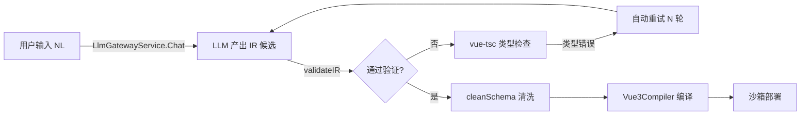

## 4.3 沙箱部署流程（图 4-3）

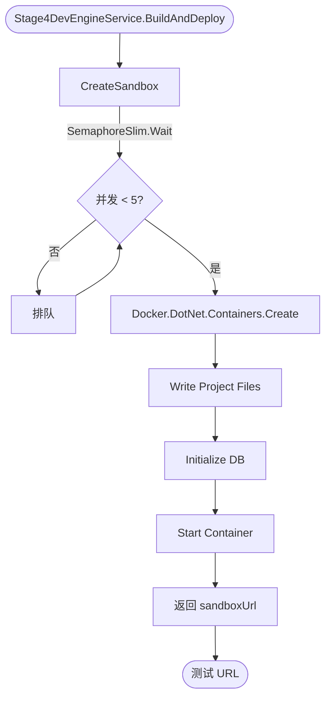

## 4.4 知识补丁注入流程（图 4-4）

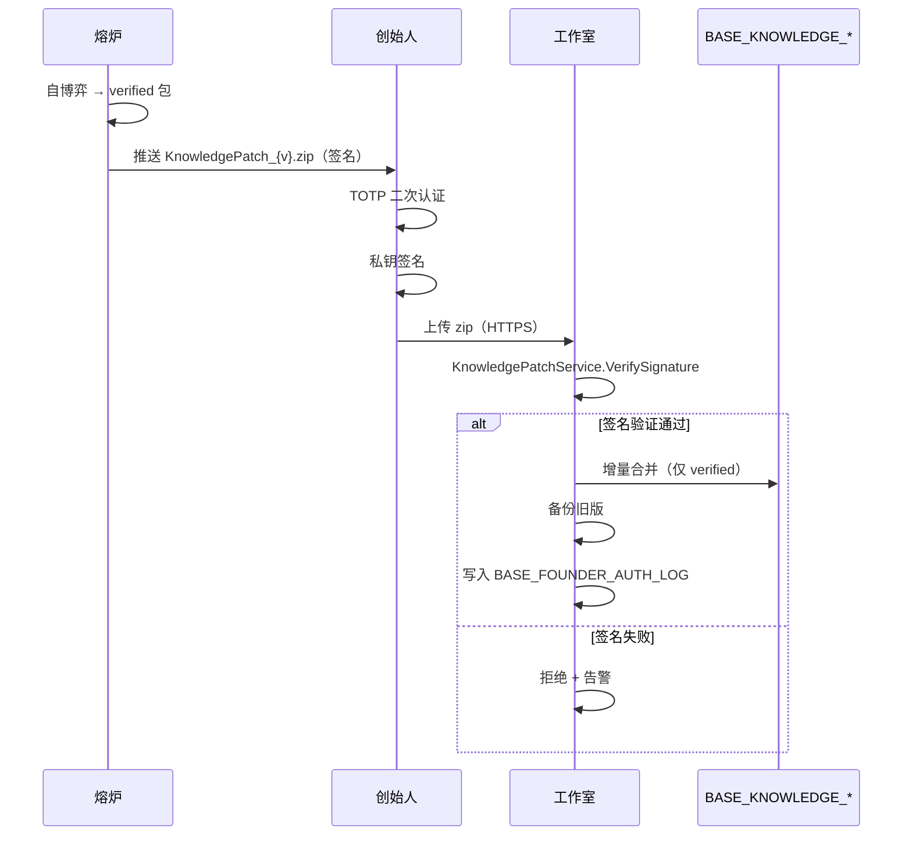

## 4.5 熔炉自博弈流程（图 4-5）

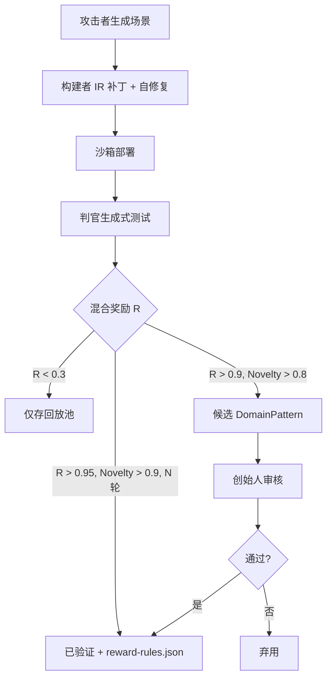

## 4.6 五阶段流水线状态机（图 4-6）

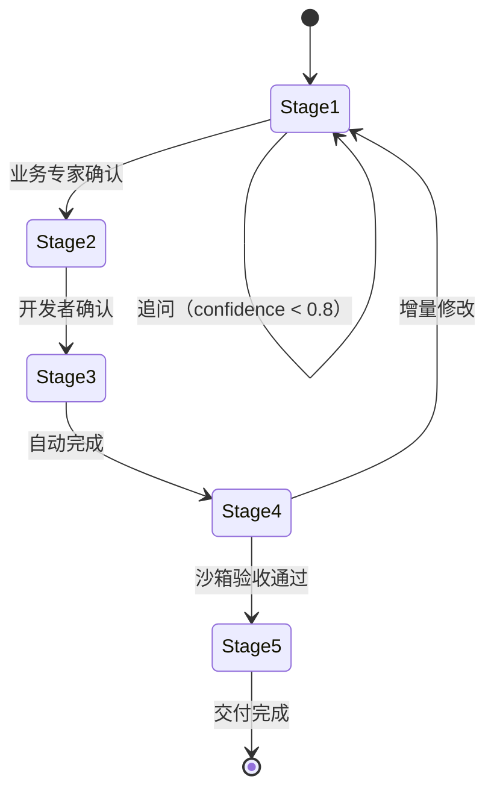

---

# 第五章 · 接口设计

## 5.1 DynamicApi 风格接口契约

**全局规范**（CLAUDE.md R1+R2）：
- 所有接口由实现 `IDynamicApiController` 的 Service 自动生成
- 响应统一封装 `RESTfulResult<T>`
- 异常处理 `Oops.Oh()` 系统 / `Oops.Bah()` 业务
- JWT 鉴权 + 路由级权限
- 错误码 600 = JWT 过期

### 5.1.1 RESTfulResult 标准响应格式

```json
{
  "code": 200,
  "msg": "成功",
  "data": { ... },
  "requestId": "uuid",
  "timestamp": "2026-06-15T01:00:00Z"
}
```

### 5.1.2 错误码约定

| code | 含义 | HTTP 状态 |
|------|------|-----------|
| 200 | 成功 | 200 |
| 400 | 参数错误 | 400 |
| 401 | 未认证 | 401 |
| 403 | 无权限 | 403 |
| 600 | Token 过期 | 401 |
| 601 | 业务异常 | 200 |
| 602 | 系统异常 | 500 |

## 5.2 需求会话类接口

### 5.2.1 创建需求会话

```yaml
POST /api/analyst/session
Headers:
  Authorization: Bearer <jwt>
Body:
  {
    "requirement": "我需要一个员工请假管理系统",
    "domain": "OA",
    "multimodal": [
      { "type": "image", "url": "https://..." }
    ]
  }
Response:
  {
    "code": 200,
    "data": {
      "sessionId": "uuid",
      "stage": "requirement",
      "understanding": "员工请假管理",
      "questions": [
        "年假天数规则？",
        "审批层级？",
        "跨部门请假？"
      ]
    }
  }
```

### 5.2.2 发送消息

```yaml
POST /api/analyst/{id}/message
Body:
  {
    "content": "年假 5 天，三级审批，不支持跨部门",
    "role": "user"
  }
```

### 5.2.3 生成需求文档

```yaml
POST /api/analyst/{id}/generate-doc
Response:
  {
    "code": 200,
    "data": {
      "docId": "uuid",
      "url": "/docs/requirement/{id}.md"
    }
  }
```

## 5.3 架构设计类接口

```yaml
POST /api/architect/design
Body:
  {
    "requirementDocId": "uuid",
    "eab": {
      "framework": "modular-monolith",
      "ui": "ant-design-vue",
      "database": "sqlserver"
    }
  }
Response:
  {
    "code": 200,
    "data": {
      "architectureId": "uuid",
      "modules": [...],
      "database": {...},
      "irPages": [...]
    }
  }
```

## 5.4 流水线状态类接口

```yaml
GET /api/pipeline/{id}
Response:
  {
    "code": 200,
    "data": {
      "sessionId": "uuid",
      "currentStage": "stage3",
      "stages": [
        { "name": "requirement", "status": "done" },
        { "name": "architecture", "status": "done" },
        { "name": "design", "status": "in_progress" }
      ],
      "artifacts": {
        "requirementDoc": "url",
        "architectureDoc": "url"
      }
    }
  }
```

## 5.5 自动开发测试类接口

```yaml
POST /api/devengine/build
Body:
  {
    "irIds": ["uuid1", "uuid2"],
    "target": "vue3-pc"
  }
Response:
  {
    "code": 200,
    "data": {
      "buildId": "uuid",
      "sandboxUrl": "https://sandbox-{tenantId}.jnpf.local",
      "testReport": "url",
      "duration": 23456
    }
  }
```

## 5.6 沙箱管理类接口

```yaml
GET /api/sandbox/{tenantId}/status
Response:
  {
    "code": 200,
    "data": {
      "tenantId": "tenant_001",
      "activeCount": 2,
      "maxConcurrent": 5,
      "sandboxes": [
        {
          "sandboxId": "uuid",
          "status": "ready",
          "url": "https://sandbox-001.jnpf.local",
          "createdAt": "2026-06-15T01:00:00Z"
        }
      ]
    }
  }
```

## 5.7 创始人认证类接口

### 5.7.1 TOTP 二次认证

```yaml
POST /api/founder/auth/verify
Headers:
  X-Founder-Token: <founder_jwt>
Body:
  {
    "totpCode": "123456"
  }
Response:
  {
    "code": 200,
    "data": {
      "verified": true,
      "sessionToken": "uuid",
      "expiresIn": 300
    }
  }
```

### 5.7.2 自博弈任务查询（转发熔炉）

```yaml
GET /api/founder/selfplay/tasks
Headers:
  X-Founder-Token: <founder_jwt>
  X-Founder-Totp-Session: <session_token>
Response:
  {
    "code": 200,
    "data": {
      "tasks": [
        {
          "taskId": "uuid",
          "domain": "education",
          "status": "running",
          "round": 42,
          "reward": 0.87
        }
      ]
    }
  }
```

## 5.8 AI 审计类接口

```yaml
GET /api/admin/ai/calls?page=1&size=20&tenantId=tenant_001&startTime=2026-06-01
Response:
  {
    "code": 200,
    "data": {
      "total": 12345,
      "list": [
        {
          "callId": "uuid",
          "tenantId": "tenant_001",
          "userId": "user_001",
          "agent": "RequirementAnalystAgent",
          "model": "deepseek-chat",
          "tokens": 1234,
          "latency": 5678,
          "confidence": 0.92,
          "timestamp": "2026-06-15T01:00:00Z"
        }
      ]
    }
  }
```

## 5.9 MCP 工具 JSON Schema（如果实施）

### 5.9.1 query_metrics

```json
{
  "name": "query_metrics",
  "description": "查询指标数据",
  "inputSchema": {
    "type": "object",
    "properties": {
      "metricName": { "type": "string" },
      "dimensions": { "type": "object" },
      "timeRange": {
        "type": "object",
        "properties": {
          "start": { "type": "string", "format": "date-time" },
          "end": { "type": "string", "format": "date-time" }
        }
      }
    },
    "required": ["metricName"]
  }
}
```

### 5.9.2 list_metrics

```json
{
  "name": "list_metrics",
  "description": "列出可用指标",
  "inputSchema": {
    "type": "object",
    "properties": {
      "domain": { "type": "string" },
      "filter": { "type": "string" }
    }
  }
}
```

### 5.9.3 explain_metric

```json
{
  "name": "explain_metric",
  "description": "解释指标口径",
  "inputSchema": {
    "type": "object",
    "properties": {
      "metricName": { "type": "string" }
    },
    "required": ["metricName"]
  }
}
```

**注**：本期（开发态需求层）**不实施 MCP**——仅占位，详细设计阶段再决定。

---

# 第六章 · 数据库表设计

## 6.0 表总览

**80+ 张表**，按模块分组：

| 模块 | 表数量 | 代表表 |
|------|--------|--------|
| **system** | 8 | BASE_USER / BASE_ROLE / BASE_PERMISSION / BASE_ORGANIZE / BASE_DICT / BASE_BILLRULE / ... |
| **visualdev** | 3 | VISUALDEV_FORM / VISUALDEV_TABLE / VISUALDEV_FIELD |
| **workflow** | 18 | FLOW_TASK / FLOW_TEMPLATE / ...（18 张 FLOW_*） |
| **visualdata** | 4 | VISUALDATA_BIGSCREEN / VISUALDATA_DATASOURCE / ... |
| **engine** | 2 | ENGINE_BUSINESS_RULE / ENGINE_RULE_VERSION |
| **inteAssistant** | 7 | BASE_AI_CALL_LOG / BASE_AI_PIPELINE / BASE_AI_PIPELINE_MESSAGE / BASE_AI_PROMPT_TEMPLATE / BASE_KNOWLEDGE_NODE / BASE_KNOWLEDGE_EDGE / ... |
| **oauth** | 2 | BASE_FOUNDER_AUTH_LOG / OAUTH_* |
| **message** | 2 | MESSAGE_RECORD / MESSAGE_CONFIG |
| **taskscheduler** | 2 | TASK_SCHEDULER / TASK_LOG |
| **extend** | 5+ | EXT_*（客户扩展） |
| **codegen** | 1 | CODEGEN_TEMPLATE |
| **common** | 0 | （无表，纯代码） |
| **app** | 2 | APP_INFO / APP_VERSION |
| **subdev** | 0 | （无表，已冻结） |
| **zxdev** | ⚠️ | **待澄清** |
| **沙箱** | 1 | BASE_SANDBOX |
| **运行态** | 10 | DATA_SYNC_TASK / METRIC_IR_DEFINITION / ... |
| **合计** | **70+** | （不含 EXT_*） |

## 6.1 命名规范（升标）

**强制规则**：
- 表名：`{MODULE_PREFIX}_{ENTITY}` 大写下划线
- 列名：`F_` 前缀（如 `F_TENANT_ID`），禁止裸 PascalCase
- 用户 ID：`string`（不用 `long`）
- 租户基类：所有业务表继承租户基类（含 `F_TENANT_ID`）
- 审计字段：自动注入
- 逻辑删除：`F_IS_DELETED BIT DEFAULT 0`
- 主键：`F_ID BIGINT`（雪花算法）

## 6.2 system 模块表

### 6.2.1 BASE_USER

```sql
CREATE TABLE BASE_USER (
  F_ID BIGINT PRIMARY KEY,
  F_TENANT_ID NVARCHAR(50) NOT NULL,
  F_ACCOUNT NVARCHAR(50) NOT NULL,
  F_PASSWORD NVARCHAR(255) NOT NULL,
  F_REAL_NAME NVARCHAR(50),
  F_NICK_NAME NVARCHAR(50),
  F_EMAIL NVARCHAR(100),
  F_PHONE NVARCHAR(20),
  F_AVATAR NVARCHAR(500),
  F_ORGANIZE_ID NVARCHAR(50),
  F_POSITION_ID NVARCHAR(50),
  F_ROLE_ID NVARCHAR(2000),
  F_IS_ENABLED BIT DEFAULT 1,
  F_IS_DELETED BIT DEFAULT 0,
  F_CREATE_USER_ID NVARCHAR(50),
  F_CREATE_TIME DATETIME,
  F_MODIFY_USER_ID NVARCHAR(50),
  F_MODIFY_TIME DATETIME,
  INDEX IDX_TENANT (F_TENANT_ID),
  INDEX IDX_ACCOUNT (F_ACCOUNT, F_TENANT_ID)
);
```

### 6.2.2 BASE_ROLE

```sql
CREATE TABLE BASE_ROLE (
  F_ID BIGINT PRIMARY KEY,
  F_TENANT_ID NVARCHAR(50) NOT NULL,
  F_NAME NVARCHAR(50),
  F_CODE NVARCHAR(50),
  F_DESCRIPTION NVARCHAR(500),
  F_IS_DELETED BIT DEFAULT 0,
  F_CREATE_USER_ID NVARCHAR(50),
  F_CREATE_TIME DATETIME,
  F_MODIFY_USER_ID NVARCHAR(50),
  F_MODIFY_TIME DATETIME,
  INDEX IDX_TENANT (F_TENANT_ID),
  UNIQUE INDEX IDX_CODE (F_CODE, F_TENANT_ID)
);
```

### 6.2.3 BASE_PERMISSION

```sql
CREATE TABLE BASE_PERMISSION (
  F_ID BIGINT PRIMARY KEY,
  F_TENANT_ID NVARCHAR(50) NOT NULL,
  F_MODULE_ID NVARCHAR(50),
  F_NAME NVARCHAR(50),
  F_CODE NVARCHAR(100),
  F_TYPE NVARCHAR(20),  -- 'menu' | 'button' | 'column' | 'data'
  F_PARENT_ID NVARCHAR(50),
  F_SORT_CODE INT,
  F_IS_DELETED BIT DEFAULT 0,
  F_CREATE_USER_ID NVARCHAR(50),
  F_CREATE_TIME DATETIME,
  F_MODIFY_USER_ID NVARCHAR(50),
  F_MODIFY_TIME DATETIME,
  INDEX IDX_TENANT (F_TENANT_ID),
  UNIQUE INDEX IDX_CODE (F_CODE, F_TENANT_ID)
);
```

### 6.2.4-6.2.8 其他 system 表

详见附录 §6.10（BASE_ORGANIZE / BASE_DICT / BASE_BILLRULE / ...）。

## 6.3 workflow 模块表（18 张 FLOW_*）

### 6.3.1 FLOW_TASK（核心任务表）

```sql
CREATE TABLE FLOW_TASK (
  F_ID BIGINT PRIMARY KEY,
  F_TENANT_ID NVARCHAR(50) NOT NULL,
  F_FLOW_ID NVARCHAR(50),
  F_INSTANCE_ID NVARCHAR(50),
  F_TITLE NVARCHAR(200),
  F_CURRENT_NODE NVARCHAR(50),
  F_CURRENT_NODES NVARCHAR(2000),  -- 多节点并行
  F_STATUS INT,  -- 0=草稿 1=进行中 2=已完成 3=已驳回
  F_RESULT INT,  -- 1=同意 2=驳回 3=转办
  F_START_USER_ID NVARCHAR(50),
  F_START_TIME DATETIME,
  F_END_TIME DATETIME,
  F_FORM_DATA NVARCHAR(MAX),  -- JSON
  F_FLOW_JSON NVARCHAR(MAX),  -- 工作流配置
  F_IS_DELETED BIT DEFAULT 0,
  F_CREATE_USER_ID NVARCHAR(50),
  F_CREATE_TIME DATETIME,
  F_MODIFY_USER_ID NVARCHAR(50),
  F_MODIFY_TIME DATETIME,
  INDEX IDX_TENANT (F_TENANT_ID),
  INDEX IDX_FLOW (F_FLOW_ID),
  INDEX IDX_USER (F_START_USER_ID)
);
```

### 6.3.2 18 张 FLOW_* 完整列表

| 序号 | 表名 | 用途 |
|------|------|------|
| 1 | FLOW_TASK | 任务主表 |
| 2 | FLOW_TEMPLATE | 模板 |
| 3 | FLOW_NODE | 节点 |
| 4 | FLOW_LINE | 连线 |
| 5 | FLOW_OPERATION | 操作 |
| 6 | FLOW_TASK_NODE | 任务节点关联 |
| 7 | FLOW_TASK_USER | 任务用户关联 |
| 8 | FLOW_TASK_HISTORY | 历史 |
| 9 | FLOW_TASK_TRANSFER | 转办 |
| 10 | FLOW_TASK_DELEGATE | 委托 |
| 11 | FLOW_TASK_CIRCULATE | 传阅 |
| 12 | FLOW_TASK_PRINT | 打印 |
| 13 | FLOW_TASK_COMMENT | 评论 |
| 14 | FLOW_TASK_FILE | 附件 |
| 15 | FLOW_TASK_SIGNATURE | 签名 |
| 16 | FLOW_TASK_VARIABLE | 变量 |
| 17 | FLOW_TASK_NOTIFY | 通知 |
| 18 | FLOW_TASK_AUDIT | 审计 |

## 6.4 inteAssistant 模块表

### 6.4.1 BASE_AI_CALL_LOG（冲刺 0-B 地桩 1）

```sql
CREATE TABLE BASE_AI_CALL_LOG (
  F_ID BIGINT PRIMARY KEY,
  F_TENANT_ID NVARCHAR(50) NOT NULL,
  F_USER_ID NVARCHAR(50),
  F_AGENT NVARCHAR(50),  -- 'RequirementAnalyst' | 'Architect' | ...
  F_MODEL NVARCHAR(50),  -- 'deepseek-chat' | 'tongyi' | ...
  F_PROVIDER NVARCHAR(20),
  F_PROMPT_TOKENS INT,
  F_COMPLETION_TOKENS INT,
  F_TOTAL_TOKENS INT,
  F_LATENCY INT,  -- ms
  F_CONFIDENCE DECIMAL(3,2),
  F_INPUT NVARCHAR(MAX),  -- 截断存储
  F_OUTPUT NVARCHAR(MAX),
  F_ERROR NVARCHAR(MAX),
  F_CALL_TIME DATETIME,
  INDEX IDX_TENANT (F_TENANT_ID),
  INDEX IDX_USER (F_USER_ID, F_CALL_TIME),
  INDEX IDX_AGENT (F_AGENT, F_CALL_TIME)
);
```

### 6.4.2 BASE_AI_PIPELINE（五阶段流水线状态）

```sql
CREATE TABLE BASE_AI_PIPELINE (
  F_ID BIGINT PRIMARY KEY,
  F_TENANT_ID NVARCHAR(50) NOT NULL,
  F_SESSION_ID NVARCHAR(50) UNIQUE,
  F_USER_ID NVARCHAR(50),
  F_DOMAIN NVARCHAR(50),
  F_REQUIREMENT NVARCHAR(MAX),
  F_CURRENT_STAGE NVARCHAR(20),  -- 'requirement' | 'architecture' | 'design' | 'development' | 'delivery'
  F_STAGE_STATUS NVARCHAR(20),  -- 'pending' | 'in_progress' | 'done' | 'failed'
  F_ARTIFACTS NVARCHAR(MAX),  -- JSON: 各阶段产物 ID
  F_CONFIDENCE DECIMAL(3,2),
  F_IS_DELETED BIT DEFAULT 0,
  F_CREATE_USER_ID NVARCHAR(50),
  F_CREATE_TIME DATETIME,
  F_MODIFY_USER_ID NVARCHAR(50),
  F_MODIFY_TIME DATETIME,
  INDEX IDX_TENANT (F_TENANT_ID),
  INDEX IDX_SESSION (F_SESSION_ID),
  INDEX IDX_USER (F_USER_ID, F_CREATE_TIME)
);
```

### 6.4.3 BASE_AI_PIPELINE_MESSAGE

```sql
CREATE TABLE BASE_AI_PIPELINE_MESSAGE (
  F_ID BIGINT PRIMARY KEY,
  F_TENANT_ID NVARCHAR(50) NOT NULL,
  F_SESSION_ID NVARCHAR(50),
  F_ROLE NVARCHAR(20),  -- 'system' | 'user' | 'assistant'
  F_CONTENT NVARCHAR(MAX),
  F_ATTACHMENTS NVARCHAR(MAX),  -- JSON: 多模态附件
  F_TIMESTAMP DATETIME,
  INDEX IDX_TENANT (F_TENANT_ID),
  INDEX IDX_SESSION (F_SESSION_ID, F_TIMESTAMP)
);
```

### 6.4.4 BASE_AI_PROMPT_TEMPLATE

```sql
CREATE TABLE BASE_AI_PROMPT_TEMPLATE (
  F_ID BIGINT PRIMARY KEY,
  F_TENANT_ID NVARCHAR(50) NOT NULL,
  F_NAME NVARCHAR(100),
  F_CODE NVARCHAR(50),
  F_AGENT NVARCHAR(50),
  F_SYSTEM_PROMPT NVARCHAR(MAX),
  F_VARIABLES NVARCHAR(MAX),  -- JSON: 变量定义
  F_VERSION INT,
  F_IS_ENABLED BIT DEFAULT 1,
  F_IS_DELETED BIT DEFAULT 0,
  F_CREATE_USER_ID NVARCHAR(50),
  F_CREATE_TIME DATETIME,
  F_MODIFY_USER_ID NVARCHAR(50),
  F_MODIFY_TIME DATETIME,
  INDEX IDX_TENANT (F_TENANT_ID),
  UNIQUE INDEX IDX_CODE (F_CODE, F_TENANT_ID, F_VERSION)
);
```

### 6.4.5 BASE_KNOWLEDGE_NODE

```sql
CREATE TABLE BASE_KNOWLEDGE_NODE (
  F_ID BIGINT PRIMARY KEY,
  F_TENANT_ID NVARCHAR(50) NOT NULL,
  F_NODE_ID NVARCHAR(50),
  F_DOMAIN NVARCHAR(50),
  F_TYPE NVARCHAR(30),  -- 'entity' | 'rule' | 'component' | 'pattern'
  F_NAME NVARCHAR(100),
  F_DESCRIPTION NVARCHAR(MAX),
  F_CONTENT NVARCHAR(MAX),  -- JSON: 模式内容
  F_SOURCE NVARCHAR(20),  -- 'ai-discovered' | 'human-created' | 'self-play'
  F_STATUS NVARCHAR(20),  -- 'candidate' | 'verified' | 'deprecated'
  F_USAGE_COUNT INT DEFAULT 0,
  F_SUCCESS_RATE DECIMAL(3,2),
  F_VERSION INT,
  F_IS_DELETED BIT DEFAULT 0,
  F_CREATE_USER_ID NVARCHAR(50),
  F_CREATE_TIME DATETIME,
  F_MODIFY_USER_ID NVARCHAR(50),
  F_MODIFY_TIME DATETIME,
  INDEX IDX_TENANT (F_TENANT_ID),
  INDEX IDX_DOMAIN (F_DOMAIN),
  INDEX IDX_STATUS (F_STATUS)
);
```

### 6.4.6 BASE_KNOWLEDGE_EDGE

```sql
CREATE TABLE BASE_KNOWLEDGE_EDGE (
  F_ID BIGINT PRIMARY KEY,
  F_TENANT_ID NVARCHAR(50) NOT NULL,
  F_FROM_NODE_ID NVARCHAR(50),
  F_TO_NODE_ID NVARCHAR(50),
  F_RELATION_TYPE NVARCHAR(30),  -- 'IS_CAUSED_BY' | 'CONTRADICTS_RULE' | 'DEPENDS_ON' | 'USES'
  F_WEIGHT DECIMAL(3,2),
  F_DESCRIPTION NVARCHAR(500),
  F_IS_DELETED BIT DEFAULT 0,
  F_CREATE_USER_ID NVARCHAR(50),
  F_CREATE_TIME DATETIME,
  INDEX IDX_TENANT (F_TENANT_ID),
  INDEX IDX_FROM (F_FROM_NODE_ID),
  INDEX IDX_TO (F_TO_NODE_ID)
);
```

### 6.4.7 AI_INFERENCE_LOG（运行态对齐）

```sql
CREATE TABLE AI_INFERENCE_LOG (
  F_ID BIGINT PRIMARY KEY,
  F_TENANT_ID NVARCHAR(50) NOT NULL,
  F_AGENT NVARCHAR(50),
  F_INPUT NVARCHAR(MAX),
  F_OUTPUT NVARCHAR(MAX),
  F_REASONING_PATH NVARCHAR(MAX),  -- JSON: 推理路径
  F_TIMESTAMP DATETIME,
  INDEX IDX_TENANT (F_TENANT_ID)
);
```

## 6.5 oauth 模块表

### 6.5.1 BASE_FOUNDER_AUTH_LOG（**不可删审计**）

```sql
CREATE TABLE BASE_FOUNDER_AUTH_LOG (
  F_ID BIGINT PRIMARY KEY,
  F_TENANT_ID NVARCHAR(50) NOT NULL,
  F_USER_ID NVARCHAR(50),
  F_ACTION NVARCHAR(50),  -- 'login' | 'verify_totp' | 'sign_patch' | 'audit'
  F_TARGET NVARCHAR(200),
  F_RESULT NVARCHAR(20),  -- 'success' | 'failure'
  F_IP_ADDRESS NVARCHAR(50),
  F_USER_AGENT NVARCHAR(500),
  F_TIMESTAMP DATETIME,
  INDEX IDX_TENANT (F_TENANT_ID),
  INDEX IDX_USER (F_USER_ID, F_TIMESTAMP)
  -- ⚠️ 不可删审计：DB 触发器禁止 DELETE / TRUNCATE
);
```

### 6.5.2 AI_PII_MASK_LOG（运行态对齐）

```sql
CREATE TABLE AI_PII_MASK_LOG (
  F_ID BIGINT PRIMARY KEY,
  F_TENANT_ID NVARCHAR(50) NOT NULL,
  F_AGENT NVARCHAR(50),
  F_INPUT_FIELDS NVARCHAR(MAX),  -- JSON: PII 字段
  F_MASK_RULES NVARCHAR(MAX),    -- JSON: 脱敏规则
  F_TIMESTAMP DATETIME,
  INDEX IDX_TENANT (F_TENANT_ID)
);
```

## 6.6 沙箱表

### 6.6.1 BASE_SANDBOX

```sql
CREATE TABLE BASE_SANDBOX (
  F_ID BIGINT PRIMARY KEY,
  F_TENANT_ID NVARCHAR(50) NOT NULL,
  F_SANDBOX_ID NVARCHAR(50) UNIQUE,
  F_DOMAIN NVARCHAR(50),
  F_STATUS NVARCHAR(20),  -- 'creating' | 'ready' | 'testing' | 'destroying' | 'destroyed'
  F_URL NVARCHAR(500),
  F_DB_NAME NVARCHAR(50),  -- per-tenant DB
  F_CPU_COUNT INT DEFAULT 1,
  F_MEMORY_MB INT DEFAULT 1024,
  F_TIMEOUT_SECONDS INT DEFAULT 30,
  F_CREATED_AT DATETIME,
  F_DESTROYED_AT DATETIME,
  INDEX IDX_TENANT (F_TENANT_ID),
  INDEX IDX_STATUS (F_STATUS)
);
```

## 6.7 运行态表（与开发态对齐）

| 运行态表 | 开发态表 | 处理 |
|---------|---------|------|
| DATA_SYNC_TASK | **暂无** | ⚠️ 待澄清，可能不需要（运行态视角独有） |
| DATA_SYNC_SCHEMA_VERSION | **暂无** | ⚠️ |
| METRIC_IR_DEFINITION | **暂无** | ⚠️ 与 visualdata 重叠待澄清 |
| METRIC_IR_VERSION | **暂无** | ⚠️ |
| METRIC_IR_SIMULATE_LOG | **暂无** | ⚠️ |
| BASE_AI_CALL_LOG | BASE_AI_CALL_LOG | ✅ 共享 |
| AI_INFERENCE_LOG | AI_INFERENCE_LOG | ✅ 共享 |
| AI_PII_MASK_LOG | AI_PII_MASK_LOG | ✅ 共享 |
| METRIC_AGGREGATE_CACHE | **暂无** | ⚠️ |
| ALERT_LOG | 已有（system 模块） | ⚠️ 命名统一 |

**运行态表不在本说明书重复设计**——运行态详细设计说明书已有完整字段。本说明书仅做**双视角对照**。

## 6.8 ER 图（图 6-1）

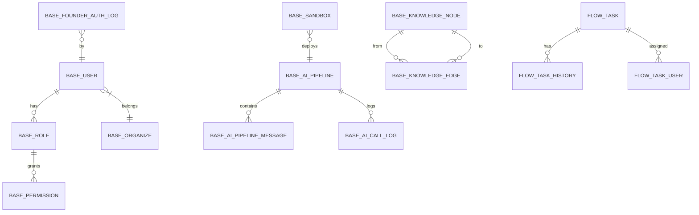

## 6.9 评测表（**A6 缺口**）

### 6.9.1 EVAL_GOLDEN_SET

```sql
CREATE TABLE EVAL_GOLDEN_SET (
  F_ID BIGINT PRIMARY KEY,
  F_DOMAIN NVARCHAR(50),  -- 'education' | 'medical' | 'manufacturing' | 'retail' | 'general'
  F_REQUIREMENT NVARCHAR(MAX),
  F_EXPECTED_IR NVARCHAR(MAX),
  F_EXPECTED_OUTPUT NVARCHAR(MAX),
  F_DIFFICULTY INT,  -- 1-10
  F_CREATED_AT DATETIME,
  INDEX IDX_DOMAIN (F_DOMAIN)
);
```

### 6.9.2 EVAL_RUN_LOG

```sql
CREATE TABLE EVAL_RUN_LOG (
  F_ID BIGINT PRIMARY KEY,
  F_TENANT_ID NVARCHAR(50) NOT NULL,
  F_MODEL NVARCHAR(50),
  F_PROMPT_VERSION INT,
  F_TOTAL_SCORE DECIMAL(5,2),
  F_DETAILS NVARCHAR(MAX),  -- JSON: 每条评分
  F_RUN_TIME DATETIME,
  INDEX IDX_TENANT (F_TENANT_ID)
);
```

## 6.10 其他模块表（概要）

| 表 | 模块 | 说明 |
|----|------|------|
| VISUALDEV_FORM | visualdev | 表单定义 |
| VISUALDEV_TABLE | visualdev | 数据表定义 |
| VISUALDEV_FIELD | visualdev | 字段定义 |
| VISUALDATA_BIGSCREEN | visualdata | 大屏定义 |
| VISUALDATA_DATASOURCE | visualdata | 数据源 |
| ENGINE_BUSINESS_RULE | engine | 业务规则 |
| ENGINE_RULE_VERSION | engine | 规则版本 |
| MESSAGE_RECORD | message | 消息记录 |
| MESSAGE_CONFIG | message | 消息配置 |
| TASK_SCHEDULER | taskscheduler | 任务定义 |
| TASK_LOG | taskscheduler | 执行日志 |
| EXT_* | extend | 客户扩展（多） |
| CODEGEN_TEMPLATE | codegen | 生成模板 |
| APP_INFO | app | 应用信息 |
| APP_VERSION | app | 应用版本 |

**详细字段设计**（每张表）：见附录章节（待补充完整 DDL）。

---

# 第七章 · 关键时序设计

## 7.1 业务专家"零代码搭应用"完整时序（图 7-1）

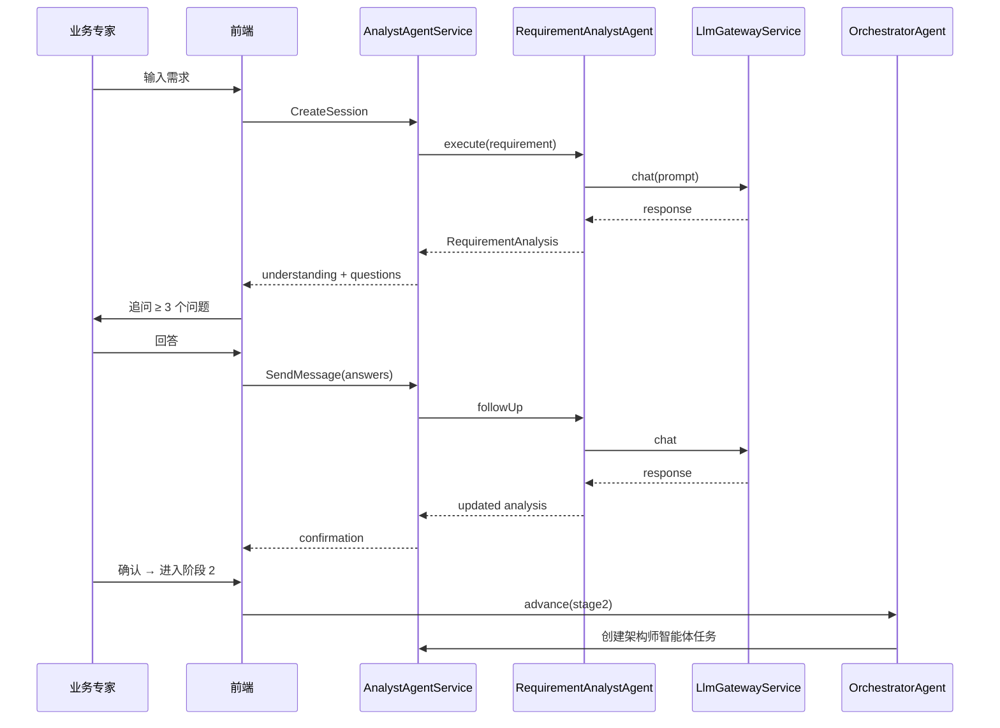

## 7.2 阶段 3 并行子智能体时序（图 7-2）

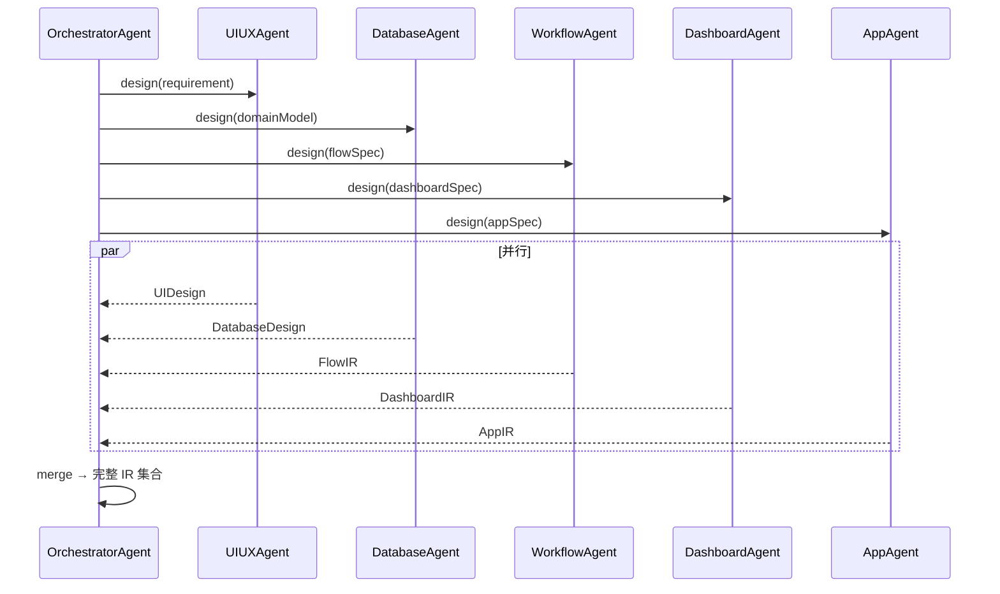

## 7.3 阶段 4 自动开发测试时序（图 7-3）

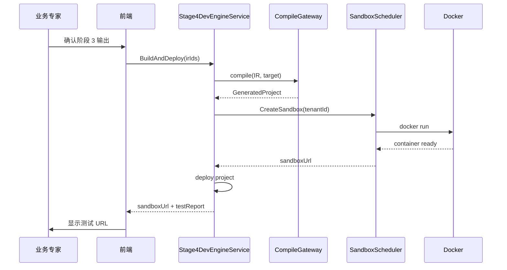

## 7.4 知识补丁注入时序（图 7-4）

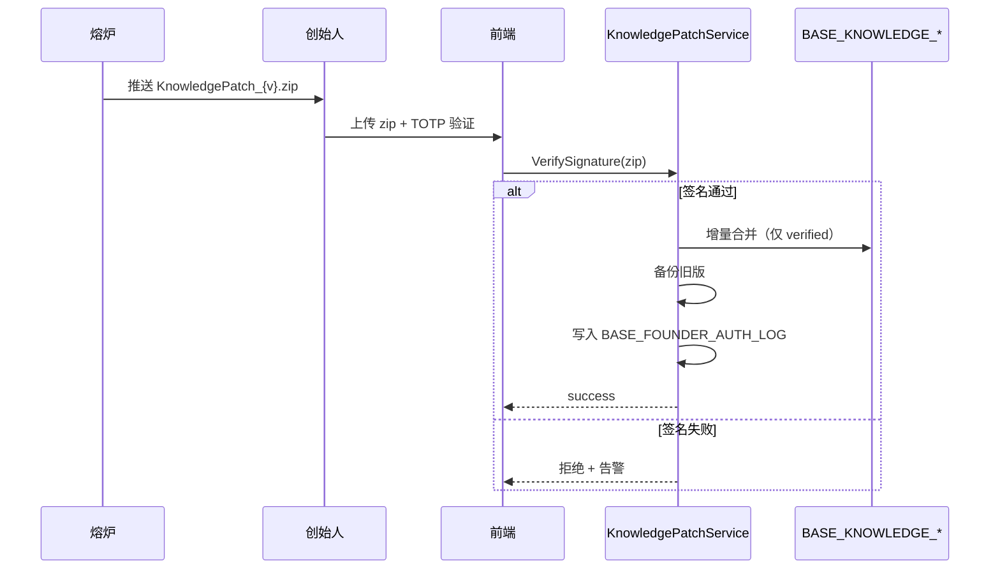

## 7.5 创始人认证时序（图 7-5）

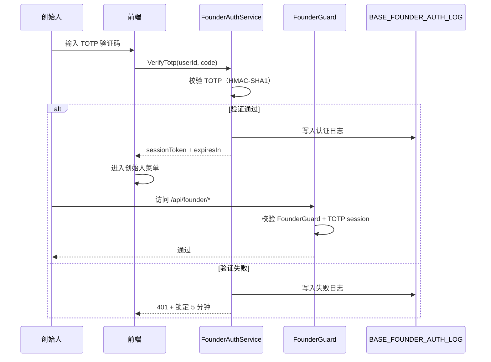

## 7.6 沙箱创建时序（图 7-6）

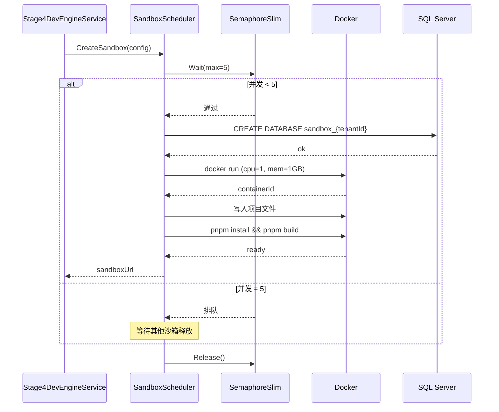

## 7.7 LLM 多供应商降级时序（图 7-7）

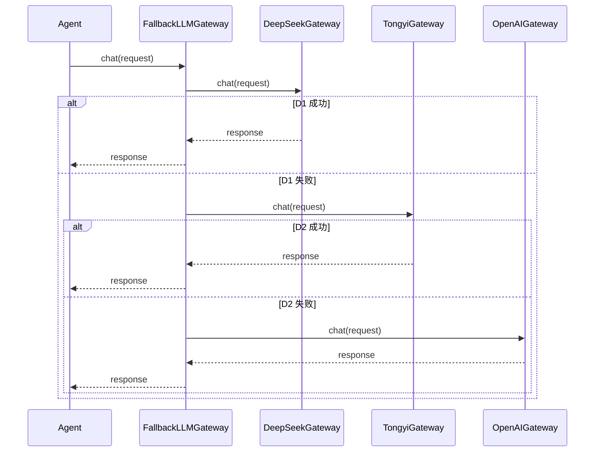

## 7.8 多租户越权测试时序（图 7-8）

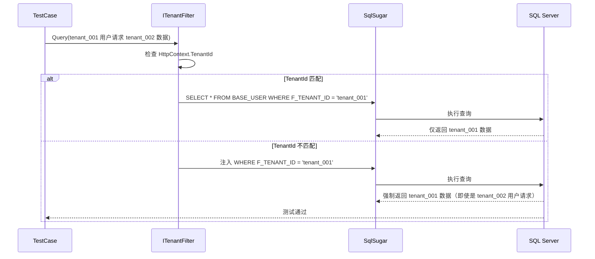

---

# 第八章 · UI 界面设计

## 8.1 4 角色主菜单矩阵

| 角色 | 菜单项 | 路由前缀 | 章节 |
|------|--------|----------|------|
| 业务专家 | 应用快速生成 / 业务规则顾问 / 数据异常解释 / 我的项目 | `/studio/expert/*` | §8.2 |
| 开发者 | AI 顾问 / AI 架构评审 / IR 手工设计器 / 沙箱监控 / 知识图谱浏览器 | `/studio/dev/*` | §8.3 |
| 管理员 | 用户管理 / AI 调用审计 / 模型降智与切换 / 系统配置 | `/studio/admin/*` | §8.4 |
| 创始人 | 自博弈控制台 / 模型与 Prompt 配置 / 知识图谱审核 / 系统级审计日志 | `/studio/founder/*` | §8.5 |

## 8.2 业务专家界面

### 8.2.1 应用快速生成页面（草图）

```
┌──────────────────────────────────────────────────────────────┐
│ [≡] JNPF-AI                                    [业务专家] [👤] │
├──────────────────────────────────────────────────────────────┤
│                                                              │
│   🤖 AI 顾问工作台                                            │
│                                                              │
│   ┌────────────────────────────────────────────────────────┐ │
│   │  我需要一个员工请假管理系统                                │ │
│   │                                                        │ │
│   │  [📎 上传文件] [🎤 语音] [🖼️ 图片]                     │ │
│   └────────────────────────────────────────────────────────┘ │
│                                                              │
│   进度：● ─── ● ─── ○ ─── ○ ─── ○                          │
│        需求  架构  设计  开发  交付                          │
│                                                              │
│   ┌────────────────────────────────────────────────────────┐ │
│   │  AI 正在分析...                                         │ │
│   │                                                        │ │
│   │  理解：员工请假管理                                     │ │
│   │  追问：                                                 │ │
│   │    1. 年假天数规则？                                    │ │
│   │    2. 审批层级？                                        │ │
│   │    3. 跨部门请假？                                      │ │
│   │                                                        │ │
│   │  [回答追问] [跳过]                                      │ │
│   └────────────────────────────────────────────────────────┘ │
│                                                              │
└──────────────────────────────────────────────────────────────┘
```

### 8.2.2 业务规则顾问页面

```
┌──────────────────────────────────────────────────────────────┐
│  业务规则顾问                                                  │
├──────────────────────────────────────────────────────────────┤
│                                                              │
│  ┌──────────────────┐  ┌──────────────────────────────────┐ │
│  │ 我的规则          │  │ 规则详情                          │ │
│  │ ──────────────── │  │                                  │ │
│  │ 📋 请假规则       │  │ 类型：决策表                       │ │
│  │ 📋 报销规则       │  │ 关联实体：EXT_LEAVE               │ │
│  │ 📋 考勤规则       │  │                                  │ │
│  │                  │  │ 条件列：                          │ │
│  │ [+ 新建规则]      │  │  ├─ 年假天数（≤5/6-10/>10）      │ │
│  │                  │  │  └─ 部门（研发/销售/其他）         │ │
│  │                  │  │                                  │ │
│  │                  │  │ 动作列：                          │ │
│  │                  │  │  ├─ 审批层级（1/2/3 级）           │ │
│  │                  │  │  └─ 是否允许跨部门（是/否）        │ │
│  │                  │  │                                  │ │
│  │                  │  │ [编辑决策表] [查看决策树]          │ │
│  └──────────────────┘  └──────────────────────────────────┘ │
│                                                              │
└──────────────────────────────────────────────────────────────┘
```

## 8.3 开发者界面

### 8.3.1 IR 手工设计器

```
┌──────────────────────────────────────────────────────────────┐
│  IR 手工设计器                                                 │
├──────────────────────────────────────────────────────────────┤
│                                                              │
│  ┌────────────┐  ┌──────────────────────────┐  ┌──────────┐ │
│  │ 组件库      │  │ 画布                      │  │ 属性      │ │
│  │ ──────── │  │ ─────────────────────── │  │ ─────── │ │
│  │ 📝 表单    │  │ ┌──────────┐ ┌──────────┐ │  │ 字段名：  │ │
│  │ 🔘 按钮    │  │ │ 姓名     │ │ 工号     │ │  │ userName │ │
│  │ 📅 日期    │  │ └──────────┘ └──────────┘ │  │ 类型：    │ │
│  │ 📊 表格    │  │ ┌──────────┐              │  │ input    │ │
│  │ 📈 图表    │  │ │ 请假类型 │              │  │ 必填：    │ │
│  │ 🗺️ 地图   │  │ └──────────┘              │  │ [✓]      │ │
│  │ 🎨 装饰   │  │                            │  │ 默认值：  │ │
│  │ 3D 场景   │  │ [拖拽组件到这里]            │  │ ___      │ │
│  └────────────┘  └──────────────────────────┘  └──────────┘ │
│                                                              │
│  [💾 保存 IR] [👁️ 预览] [🚀 编译部署] [↩️ 撤销] [↪️ 重做] │
│                                                              │
└──────────────────────────────────────────────────────────────┘
```

### 8.3.2 IR 差异查看器

```
┌──────────────────────────────────────────────────────────────┐
│  IR 差异查看器（AI 产出 vs 你的修改）                          │
├──────────────────────────────────────────────────────────────┤
│                                                              │
│  ┌──────────────────┐  ┌──────────────────┐                 │
│  │ AI 产出            │  │ 你的修改           │                 │
│  │ ──────────────── │  │ ──────────────── │                 │
│  │ {                  │  │ {                  │                 │
│  │   "name": "员工",   │  │   "name": "员工",   │                 │
│  │   "fields": [       │  │   "fields": [       │                 │
│  │ -   {               │  │ +   {               │                 │
│  │ -     "name": "id", │  │ +     "name": "id", │                 │
│  │ -     "type": "id"  │  │ +     "type": "id", │                 │
│  │ +     {             │  │ +     "name": "员工编号",           │ │
│  │ +       "name":     │  │ +     "type": "string",            │ │
│  │ +       "员工编号", │  │ +   },              │                 │
│  │ +       "type":     │  │     {                │                 │
│  │ +       "string"    │  │       "name": "姓名",│                 │
│  │ +     }             │  │       "type": "string"│              │
│  │   ]                 │  │     }                │                 │
│  │ }                   │  │   ]                  │                 │
│  │                     │  │ }                    │                 │
│  └──────────────────┘  └──────────────────┘                 │
│                                                              │
│  [✓ 接受 AI] [✏️ 修改后接受] [❌ 拒绝]                       │
│                                                              │
└──────────────────────────────────────────────────────────────┘
```

## 8.4 管理员界面

### 8.4.1 AI 调用审计页面

```
┌──────────────────────────────────────────────────────────────┐
│  AI 调用审计                                                  │
├──────────────────────────────────────────────────────────────┤
│  租户： [全部▼]  时间： [2026-06-01 ~ 2026-06-15]  智能体：[全部▼] │
│  [🔍 查询]                                                    │
├──────────────────────────────────────────────────────────────┤
│                                                              │
│  时间                用户    智能体        模型      Token  延迟 │
│  ────────────────────────────────────────────────────────── │
│  06-15 01:00:00  user_001  Architect   deepseek  1234  5.6s  │
│  06-15 01:00:05  user_002  Analyst     tongyi    2345  7.8s  │
│  06-15 01:00:10  user_003  UIUX        openai    3456  9.0s  │
│                                                              │
│  [上一页] [1] [2] [3] ... [下一页]                          │
│                                                              │
└──────────────────────────────────────────────────────────────┘
```

### 8.4.2 模型降智与切换页面

```
┌──────────────────────────────────────────────────────────────┐
│  模型降智与切换                                                │
├──────────────────────────────────────────────────────────────┤
│                                                              │
│  当前主供应商：DeepSeek（健康 ✅）                            │
│                                                              │
│  供应商健康状态：                                              │
│  ┌────────────────────────────────────────────────────────┐ │
│  │ DeepSeek      ✅ 健康   P95: 3.2s    [切换]             │ │
│  │ 通义千问       ✅ 健康   P95: 4.5s    [切换]             │ │
│  │ OpenAI        ⚠️ 降智   P95: 12.3s   [切换]             │ │
│  │ Ollama        ❌ 离线                 [启用]             │ │
│  │ 智谱          ✅ 健康   P95: 5.1s    [切换]             │ │
│  │ 月之暗面       ✅ 健康   P95: 6.0s    [切换]             │ │
│  └────────────────────────────────────────────────────────┘ │
│                                                              │
│  降级链配置：主 → 备1 → 备2 → 备3 → 备4 → 备5               │
│                                                              │
│  [一键切回 DeepSeek] [保存降级链配置]                        │
│                                                              │
└──────────────────────────────────────────────────────────────┘
```

## 8.5 创始人界面

### 8.5.1 创始人菜单入口（二次认证）

```
┌──────────────────────────────────────────────────────────────┐
│  🔒 创始人二次认证                                            │
├──────────────────────────────────────────────────────────────┤
│                                                              │
│   输入 TOTP 验证码（Google Authenticator）：                  │
│                                                              │
│   ┌────────────────────────────┐                            │
│   │  ● ● ● ● ● ●               │                            │
│   └────────────────────────────┘                            │
│                                                              │
│   [验证] [取消]                                              │
│                                                              │
│   ⚠️ 所有创始人操作均记录不可删审计                            │
│                                                              │
└──────────────────────────────────────────────────────────────┘
```

### 8.5.2 自博弈控制台（转发熔炉）

```
┌──────────────────────────────────────────────────────────────┐
│  自博弈控制台（🔒 熔炉转发，非内嵌）                          │
├──────────────────────────────────────────────────────────────┤
│                                                              │
│  实时状态（来自熔炉 REST）：                                  │
│  ┌────────────────────────────────────────────────────────┐ │
│  │ 正在运行：教育行业 第 42 轮                              │ │
│  │ 攻击者：12 个并发场景                                    │ │
│  │ 构建者：12 个并发 Agentic Loop                          │ │
│  │ 判官：生成式测试 + 混合奖励                              │ │
│  │ 蒸馏师：候选 23 / 已验证 5 / 已弃用 2                   │ │
│  └────────────────────────────────────────────────────────┘ │
│                                                              │
│  Reward 曲线（最近 50 轮）：                                  │
│  ┌────────────────────────────────────────────────────────┐ │
│  │  ▁▂▃▅▆▇█▇▆▅▃▂▁▂▃▅▆▇█ (折线图)                          │ │
│  └────────────────────────────────────────────────────────┘ │
│                                                              │
│  候选领域模式（待你审核）：                                    │
│  ┌────────────────────────────────────────────────────────┐ │
│  │ 📋 教育·智能排课规则 v3                                 │ │
│  │    R: 0.92  Novelty: 0.85  来源: self-play              │ │
│  │    [📖 阅读叙事式说明书] [✓ 签发] [❌ 驳回]              │ │
│  └────────────────────────────────────────────────────────┘ │
│                                                              │
└──────────────────────────────────────────────────────────────┘
```

---

# 第九章 · 权限管理设计

## 9.1 权限层次设计

### 9.1.1 5 级权限层次

| 层级 | 维度 | 实现 | 详细章节 |
|------|------|------|----------|
| **L1 角色级** | 用户角色（业务专家/开发者/管理员/创始人） | BASE_ROLE | §6.2.2 |
| **L2 路由级** | URL 路径权限 | JwtHandler | §5.1 |
| **L3 功能级** | 按钮 / 操作权限 | BASE_PERMISSION | §6.2.3 |
| **L4 数据级** | 字段 / 行权限 | BASE_PERMISSION.type='column' | §6.2.3 |
| **L5 租户级** | 跨租户隔离 | ITenantFilter | §9.3 |

## 9.2 功能权限矩阵

### 9.2.1 4 角色 × 核心场景权限矩阵

| 场景 | 业务专家 | 开发者 | 管理员 | 创始人 |
|------|---------|--------|--------|--------|
| 应用快速生成 | ✅ | ❌ | ❌ | ❌ |
| 业务规则顾问 | ✅ | ❌ | ❌ | ❌ |
| AI 顾问对话 | ❌ | ✅ | ❌ | ❌ |
| AI 架构评审 | ❌ | ✅ | ❌ | ❌ |
| IR 手工设计器 | ❌ | ✅ | ❌ | ❌ |
| 沙箱监控 | ❌ | ✅ | ❌ | ❌ |
| 知识图谱浏览器 | ❌ | ✅ | ❌ | ❌ |
| 用户管理 | ❌ | ❌ | ✅ | ❌ |
| AI 调用审计 | ❌ | ❌ | ✅ | ❌ |
| 模型降智切换 | ❌ | ❌ | ✅ | ❌ |
| 系统配置 | ❌ | ❌ | ✅ | ❌ |
| 自博弈控制台 | ❌ | ❌ | ❌ | ✅ |
| 模型与 Prompt 配置 | ❌ | ❌ | ❌ | ✅ |
| 知识图谱审核 | ❌ | ❌ | ❌ | ✅ |
| 知识补丁签发 | ❌ | ❌ | ❌ | ✅ |

### 9.2.2 关键页面权限码

| 页面 | 权限码 | 角色 |
|------|--------|------|
| `/studio/expert/quick-app` | `expert:quick-app` | 业务专家 |
| `/studio/dev/ai-advisor` | `dev:ai-advisor` | 开发者 |
| `/studio/dev/ir-designer` | `dev:ir-designer` | 开发者 |
| `/studio/admin/users` | `admin:users` | 管理员 |
| `/studio/admin/ai-audit` | `admin:ai-audit` | 管理员 |
| `/studio/founder/selfplay` | `founder:selfplay` | 创始人 |
| `/studio/founder/patch-sign` | `founder:patch-sign` | 创始人 |

## 9.3 多租户数据隔离设计

### 9.3.1 多租户 6 层隔离机制

| 层级 | 隔离方式 | 实现位置 | 详细设计 |
|------|----------|----------|----------|
| **L1 应用层** | JWT 携带租户 ID | oauth/JwtHandler.cs | §5.7 |
| **L2 中间件层** | TenantMiddleware 注入 HttpContext.Items["TenantId"] | extend/TenantMiddleware.cs | §5.10 |
| **L3 ORM 层** | ITenantFilter 自动过滤 | SqlSugar 配置 | §6.2 |
| **L4 数据库层** | 共享 SQL Server + per-tenant DB | SQL Server 实例 | §6.4 |
| **L5 沙箱层** | Docker 容器物理隔离 | SandboxScheduler | §6.6 |
| **L6 创始人层** | FounderGuard + 平台级租户 ID | oauth/FounderGuard.cs | §5.7 |

### 9.3.2 越权测试用例（10 条）

| # | 测试场景 | 期望结果 |
|---|---------|----------|
| 1 | tenant_001 用户请求 tenant_002 数据 | 仅返回 tenant_001 数据 |
| 2 | tenant_001 用户创建记录（未指定 tenant_id） | 自动写入 tenant_001 |
| 3 | 跨租户 SQL 直查（绕过 ORM） | DBA 拦截 |
| 4 | 越权修改 BASE_USER.tenant_id | 拒绝 |
| 5 | 越权删除 BASE_USER | 拒绝 |
| 6 | ITenantFilter 未配置时启动 | 启动失败 |
| 7 | 新增业务表未含 F_TENANT_ID | 编译失败 |
| 8 | 沙箱访问其他租户 DB | 拒绝 |
| 9 | 创始人越权（无 TOTP） | 401 |
| 10 | 创始人越权（有 TOTP 但无 FounderGuard） | 403 |

### 9.3.3 多租户启用时间线

| 阶段 | 时间 | 状态 |
|------|------|------|
| 阶段五并行 | 第 26-30 天 | 影响分析 + 10 条越权测试用例编写 |
| 阶段六 W2 | 第 2 周 | `MultiTenancy=true` + 全链路验证 |
| 阶段六 W2 | 第 2 周 | 越权测试 10 条进 CI |

## 9.4 创始人二次认证设计

### 9.4.1 三重认证

| 层级 | 认证机制 | 实现 |
|------|----------|------|
| **L1 用户认证** | JWT（普通登录） | JwtHandler |
| **L2 角色认证** | BASE_ROLE.code='founder' | BASE_ROLE |
| **L3 TOTP 二次认证** | HMAC-SHA1 时间令牌 | FounderAuthService |

### 9.4.2 TOTP 流程

```
1. 创始人登录 → JWT 中 role='founder'
2. 访问 /api/founder/* → FounderGuard 中间件
3. 检查 X-Founder-Token header
4. 检查 TOTP session 是否有效（5 分钟内）
5. 验证通过 → 允许访问 + 写入 BASE_FOUNDER_AUTH_LOG
```

### 9.4.3 审计与锁定

| 机制 | 实现 |
|------|------|
| **所有创始人操作** | 写入 BASE_FOUNDER_AUTH_LOG（不可删审计） |
| **TOTP 错误 3 次** | 锁定 5 分钟 |
| **不可删审计** | DB 触发器禁止 DELETE / TRUNCATE |

---

# 第十章 · 非功能性设计

## 10.1 性能设计

### 10.1.1 性能指标

| 指标 | 目标 | 测试方法 | 章节 |
|------|------|----------|------|
| IR 清洗 + 验证 | < 100ms | vitest 性能测试 | §11.1 |
| Vue3 单表编译 | < 500ms | vitest 性能测试 | §11.1 |
| 大屏编译 | < 2s | vitest 性能测试 | §11.1 |
| AI 单次对话 | P95 < 60s | BASE_AI_CALL_LOG 实测 | §11.2 |
| AI 流式首字节 | < 3s | AI_INFERENCE_LOG 实测 | §11.2 |
| 沙箱创建/销毁 | ≤ 30s | BASE_SANDBOX 实测 | §11.2 |
| 5 并发沙箱 | 16G 不 OOM | 手动压测 | §11.2 |
| 数据库查询 P95 | < 200ms | MiniProfiler + OTel | §10.3 |
| 前端首屏 | < 2s | Lighthouse | §10.3 |
| 租户隔离查询开销 | < 5% | ITenantFilter 压测 | §11.2 |

### 10.1.2 性能设计要点

- **ARC-8-001 纯函数管线**：IR 清洗 + 验证纯函数化，便于并行
- **ARC-8-002 并行编译**：8 目标支持 `Promise.all`
- **ARC-8-003 多供应商降级**：6 供应商 + 5 级降级链
- **ARC-8-004 SSE 流式**：AI 对话 SSE 流式输出
- **ARC-8-005 沙箱 5 并发**：SemaphoreSlim max=5
- **ARC-8-006 数据库索引**：高频查询列必有索引（80/20 法则）
- **ARC-8-007 前端性能**：路由级代码分割 + 组件懒加载

## 10.2 安全设计

### 10.2.1 安全层级

| 层级 | 决策 | 章节 |
|------|------|------|
| 应用层 | JWT 鉴权 + 路由级权限 | §9.1 |
| 数据层 | 多租户隔离 | §9.3 |
| AI 层 | Prompt 注入防护 + JSON Schema 强约束 | §10.2.3 |
| 创始人层 | TOTP + 不可删审计 | §9.4 |
| 传输层 | HTTPS 强制 + 签名 zip | §10.2.4 |
| 存储层 | API Key 外移 + 密钥管理服务 | §10.2.5 |

### 10.2.2 已废止安全项

| 废止项 | 理由 | 替代 |
|--------|------|------|
| mTLS / WORM / 军规安保 | 单机创业项目配国安级安保 | HTTPS + 签名 zip + 审计表 |

### 10.2.3 AI 层 Prompt 注入防护

- **JSON Schema 强约束**：所有 LLM 调用必须经 response schema 约束
- **结构化输出**：DeepSeek / OpenAI json mode
- **二次校验**：`validator.ts` 程序化打回
- **重试机制**：自动重试 N 轮（指数退避）

### 10.2.4 传输层

- 全平台 HTTPS 强制
- 熔炉 ↔ 工作室：签名 zip（AES-256 + 创始人私钥签名）
- 不引入 mTLS（已废止）

### 10.2.5 存储层

- API Key 外移（F-0 安全止血）
- JWT 密钥通过密钥管理服务注入（不轮换，用户偏好）
- 不可删审计表（DB 触发器）

## 10.3 可观测性设计

### 10.3.1 三支柱

| 支柱 | 工具 | 输出 |
|------|------|------|
| 日志 | Serilog + Seq | 结构化 JSON + 全链路追踪 ID |
| 指标 | MiniProfiler（**当前**）→ OpenTelemetry（**前置**） | RED 指标 |
| 链路追踪 | OpenTelemetry | 跨服务追踪 |

### 10.3.2 AI 调用监控

| 监控项 | 表 | 字段 |
|--------|----|----|
| 调用次数 / Token / 延迟 / 置信度 | BASE_AI_CALL_LOG | F_MODEL / F_TOKENS / F_LATENCY / F_CONFIDENCE |
| 推理路径 | AI_INFERENCE_LOG | F_INPUT / F_OUTPUT / F_AGENT |
| PII 脱敏 | AI_PII_MASK_LOG | F_PII_FIELDS / F_MASK_RULES |

### 10.3.3 OpenTelemetry 前置依赖

- 风险 R10：判官 R_black 40% 无数据来源
- 阶段五启动前 OTel 必须就绪
- 熔炉 F1 前 OTel 必须完成集成

## 10.4 降级与容灾设计

### 10.4.1 AI 降智自动降级

```
P95 > 60s 持续 3 次 → 自动切换到备 1
  ↓
备 1 仍失败 → 切换到备 2
  ↓
...（5 级降级链）
  ↓
全部失败 → 自动切换到"无 AI 专家模式"
  ↓
人工 IR 手工设计器（IR 转 Schema 逃生舱）
```

### 10.4.2 沙箱容灾

- 同时 ≤ 2 活跃沙箱（避免 OOM）
- 沙箱超时 30s 自动销毁
- 共享 SQL Server per-tenant DB 隔离

### 10.4.3 数据库容灾

- Outbox 事务性发件箱（Sprint 0-A）
- 主从复制（待部署文档细化）

---

# 第十一章 · 测试设计要点

## 11.1 单元测试覆盖要求

### 11.1.1 已有测试（基线）

| 测试 | 来源 | 数量 | 状态 |
|------|------|------|------|
| src/core 单元测试 | 阶段零 | 83 项 | ✅ 已通过 |
| Vue3 单表编译器 | F-4 | 11 项 | ✅ 已通过 |
| Dashboard 编译器 | F-6a | 多项 | ✅ 已通过 |
| 安全表达式引擎 | F-2 | 35 项 | ✅ 已通过 |
| FlowIR 类型/序列化器 | 阶段三 | 多项 | ✅ 已通过 |

### 11.1.2 新增单元测试（B 段）

| 测试模块 | 测试目标 | 数量目标 |
|---------|---------|----------|
| inteAssistant | LlmGateway / 5 智能体 / Orchestrator | ≥ 50 项 |
| oauth | JwtHandler / FounderGuard / TOTP / KnowledgePatch | ≥ 30 项 |
| workflow | FlowIR 编译器集成 | ≥ 20 项 |
| engine | 业务规则引擎 | ≥ 20 项 |
| visualdev | 8 目标编译网关 | ≥ 30 项 |
| **合计新增** | — | **≥ 150 项** |

### 11.1.3 覆盖率要求

| 维度 | 覆盖率目标 |
|------|-----------|
| 核心业务模块 | ≥ 80% |
| AI 智能体模块 | ≥ 70% |
| 工具类 | ≥ 60% |

## 11.2 集成测试场景

### 11.2.1 10 个核心集成测试场景

| # | 测试场景 | 验证内容 |
|---|---------|----------|
| 1 | 五阶段流水线端到端 | 需求 → 架构 → 设计 → 开发 → 交付 |
| 2 | LLM 多供应商降级 | DeepSeek 失败 → 通义千问 自动切换 |
| 3 | 沙箱创建/部署/销毁全链路 | 5 并发 + 30s 超时 |
| 4 | 知识补丁签名验证 | 通过/失败 双向测试 |
| 5 | 多租户隔离（10 条越权用例） | ITenantFilter 全链路 |
| 6 | 创始人 TOTP 二次认证 | 通过/失败/锁定 |
| 7 | IR 转 Schema round-trip | 10+ Schema 双向 |
| 8 | OutboxSqlServerPoC | 4 用例 |
| 9 | JwtHandlerIntegration | 3 通过 |
| 10 | pnpm diff:codegen | 双轨共存 |

### 11.2.2 AI 评测基准（**A6 缺口**）

| 维度 | 要求 |
|------|------|
| 黄金集 | 50 条（5 领域 × 10 条） |
| 领域 | 教育 / 医疗 / 制造 / 零售 / 通用 |
| 评分维度 | 需求分析师准确率 ≥ 80%<br>架构师输出可编译率 ≥ 90%<br>数据库设计规范合规率 = 100% |
| CI 集成 | 可选 job（不阻塞主流程） |
| Baseline 登记 | 阶段五前必须 |

## 11.3 评测基准设计

### 11.3.1 黄金集结构

```json
{
  "id": "education-001",
  "domain": "education",
  "requirement": "我需要一个学生成绩管理系统",
  "expectedIR": { ... },
  "expectedOutput": { ... },
  "difficulty": 7
}
```

### 11.3.2 5 领域分布

| 领域 | 数量 | 难度分布 |
|------|------|----------|
| 教育 | 10 | 1-3: 4 条 / 4-7: 4 条 / 8-10: 2 条 |
| 医疗 | 10 | 同上 |
| 制造 | 10 | 同上 |
| 零售 | 10 | 同上 |
| 通用 | 10 | 同上 |
| **合计** | **50** | — |

### 11.3.3 评测运行器

- 工具：`eval-runner.ts`（前端）+ `EvalService`（后端）
- 评分：每条黄金集产出 IR 与 expectedIR 比较
- 报告：`EVAL_RUN_LOG` 表 + 差异报告

## 11.4 性能测试

| 测试 | 工具 | 目标 |
|------|------|------|
| IR 清洗性能 | vitest benchmark | < 100ms |
| 编译性能 | vitest benchmark | < 500ms / < 2s |
| AI 调用延迟 | BASE_AI_CALL_LOG | P95 < 60s |
| 沙箱并发 | k6 / JMeter | 5 并发稳定 |
| 数据库查询 | MiniProfiler | P95 < 200ms |

---

# 第十二章 · 验收检查表

## 12.1 工作室里程碑（M0~M5）

| 里程碑 | 周次 | 交付物 | 验收条目 |
|--------|------|--------|----------|
| **M0 基座** | 冲刺 0-B 完成 | IR + 网关 + 10 地桩 + Gate 全绿 | 标签 `v5.2-ai-infrastructure-m0` |
| **M0.5 评测基准** | 阶段五启动前 | 黄金集 ≥ 50 + 评测运行器 | 标签 `v5.2-evals-baseline` |
| **M1 流水线 Alpha** | 阶段五 第 4 周 | 阶段 1/2 智能体 + AI 对话面板（SSE 流式） | 标签 `v5.2-studio-m1-alpha` |
| **M2 全流程贯通** | 阶段五 第 10 周 | 阶段 3-5 + FlowIR + 多角色菜单 | 标签 `v5.2-studio-m1` |
| **M3 多租户** | 阶段六 第 4 周 | 5 并发沙箱 + 越权测试 | 标签 `v5.2-studio-m2` |
| **M4 创始人链路** | 阶段六 第 8 周 | 创始人守护 + 知识补丁联调 | 标签 `v5.2-studio-m3` |
| **M5 发布候选** | Gate + 集成测试 | 文档 + Demo Compose | 标签 `v5.2-studio-rc1` |

## 12.2 熔炉里程碑（FM0~FM4）

| 里程碑 | 周次 | 交付物 |
|--------|------|--------|
| **FM0** | 3 | 单域智能体循环可演示 |
| **FM1** | 8 | 四智能体 + 蒸馏师联调 |
| **FM2** | 12 | 50+ 轮稳定；SQL 知识表初具规模 |
| **FM3** | 15 | 知识补丁链路打通工作室 |
| **FM4** | 16 | 2 领域 verified 包 + 文档 |

## 12.3 阶段五硬门禁

| 门禁项 | 来源 | 状态 |
|--------|------|------|
| 大模型网关 6 供应商 | 原计划 | ✅ 第 5 天达成 |
| 多供应商降级切换 | 原计划 | ✅ 第 5 天达成 |
| 需求分析师 | 原计划 | ✅ 第 10 天达成 |
| 架构师（含自动注入） | 原计划 | ✅ 第 10 天达成 |
| UI/UX 设计 | 原计划 | ✅ 第 15 天达成 |
| 数据库设计 | 原计划 | ✅ 第 15 天达成 |
| **组件注册表 ≥ 90%** | 原计划 | ✅ **92.6%** |
| 业务规则配置中心 | 原计划 | 第 16-20 天 |
| 无 AI 专家模式 | 原计划 | 第 21-22 天 |
| **五阶段流水线编排** | **A1 新增** | **第 16-20 天** |
| 领域知识进化引擎 V1.0 | 原计划 | 第 26-27 天 |
| **FlowIR 编译器集成** | **A3 新增** | **第 26-28 天** |
| AI 对话工作台 | 原计划 | 第 16-20 天 |
| **评测基准 50 条黄金集** | **A6 新增+强化** | **第 25 天** |
| **多租户影响分析** | **A7 新增** | **第 26-30 天** |
| vue-tsc 类型错误 = 0 | 原计划 | 已达成 |
| 后端 Build 0 errors | 原计划 | 持续 |
| 零 eval/Function | 原计划 | 持续 |

## 12.4 阶段六硬门禁

| 门禁项 | 状态 |
|--------|------|
| 多租户 = true | 阶段六 第 2 周 |
| 全链路租户 ID 验证通过 | 阶段六 第 2 周 |
| Docker 沙箱 5 并发创建/销毁 ≤ 30s | 阶段六 第 2 周 |
| 越权测试 10 条全绿 | 阶段六 第 4 周 |
| 创始人守护中间件已注册 | 阶段六 第 3 周 |
| TOTP 二次认证通过 | 阶段六 第 4 周 |
| `/api/founder` 403/401 矩阵通过 | 阶段六 第 4 周 |
| 知识补丁签名验证 1 次熔炉→工作室联调通过 | 阶段六 第 6 周 |
| 创始人控制台 UI 可用 | 阶段六 第 7 周 |
| 无 AI 专家模式完整闭环 | 阶段六 第 8 周 |
| VisualDev round-trip ≥ 10 个 | 阶段六 第 8 周 |
| ZIP 导出可用 | 阶段六 第 8 周 |

## 12.5 全平台统一验收

| 并行线 | 总工期 | 关键汇合点 |
|--------|--------|------------|
| 第一篇 F-0~F-8 | 冲刺 0 + 15 周 | F-8 编译网关 → 阶段五消费 |
| 第二篇 工作室 | 10 + 8 周 | M2 流水线贯通 → M4 知识补丁接收 |
| 第二篇 熔炉 | ~16 周 | FM3 第 15 周 ↔ 工作室 M4 联调 |

## 12.6 与运行态详细设计说明书验收对照

| 维度 | 运行态大纲验收项 | 开发态大纲验收项 | 一致性 |
|------|----------------|----------------|--------|
| 第一章（概述） | R1-S0 第 1-3 天 | ✅ 本章填写 | ✅ |
| 第二章（架构 + 部署拓扑） | 架构师 R1-S0 第 1-3 天 | ✅ 本章填写 | ✅ |
| 第三章（模块结构确认） | 后端 R1-S0 第 7-10 天 | ✅ 本章填写 | ✅ |
| 第四章（流程图 + 时序图） | 架构师 + 后端 R1-S0 第 3-7 天 | ✅ 本章填写 | ✅ |
| 第五章（接口合约 + Schema） | 后端 R1-S0 第 1-3 天 | ✅ 本章填写 | ✅ |
| 第六章（数据库表） | 后端 R1-S0 第 3-5 天 | ✅ 本章填写 | ✅ |
| 第七章（时序图） | 架构师 R1-S0 第 3-7 天 | ✅ 本章填写 | ✅ |
| 第八章（UI 设计） | 前端 R1-S1 第 1-3 天 | ✅ 本章填写 | ✅ |
| 第九章（权限设计） | 后端 R1-S0 第 5-7 天 | ✅ 本章填写 | ✅ |
| 第十章（非功能性设计） | 架构师 R1-S1 第 1-5 天 | ✅ 本章填写 | ✅ |
| 第十一章（测试设计） | 测试 R1-S2 前 | ✅ 本章填写 | ✅ |
| 第十二章（验收检查表） | 全员 R1-S4 前 | ✅ 本章填写 | ✅ |

## 12.7 风险与缓解

| 风险 | 缓解（v5.0） | 详细设计 |
|------|--------------|----------|
| 16G 内存 5 沙箱 OOM | 共享 SQL Server + 同时 ≤ 2 活跃 | §10.4.2 |
| AI 降智 / 供应商故障 | 多供应商降级 + 专家模式 + 逃生舱 | §10.4.1 |
| 多租户未启用 | 阶段六前启用 + 越权测试进 CI | §9.3.3 |
| 创始人认证绕过 | 用户 ID + TOTP + Token + 审计 | §9.4 |
| IR 单向 | IR 转 Schema round-trip | §11.2 |
| Outbox + SqlSugar | PoC 4 用例进 Gate | §11.2 |
| Three.js 未验证 | PoC-B 门禁 | §10.1 |
| CI 脚本名错误 | 冲刺 0-A 第 1 天修正 | §11.2 |
| 无 FlowIR / 评测 | 阶段五硬门禁 | §12.3 |
| OpenTelemetry 未集成 | 熔炉 F1 前 OTel 前置 | §10.3.3 |

## 12.8 本期不做清单（明确排除）

| 排除项 | 理由 | 替代 |
|--------|------|------|
| 熔炉训练引擎实现细节 | 算法在熔炉独立仓库 | 仅描述接口 |
| Neo4j 图谱 | 创始人部分采纳，MVP2 再评估 | SQL Server 边表 |
| PostgreSQL + pgvector | 已废止 | SQL Server JSON |
| mTLS / WORM / 军规安保 | 已废止 | HTTPS + 签名 zip |
| uni-app X 双轨 | 暂缓非删除 | 单轨 standard uni-app |
| 任意 .vue → IR 反解析 | 已废止 | IR 转 Schema 官方通道 |
| F-6b.8 蓝图引擎 | 已废止 | 表达式引擎 + 事件绑定 |
| ML.NET 意图分类 | 已废止 | LLM 网关路由 |
| OA 模块 | CLAUDE.md R5 禁用 | — |
| IoT / MES 模块 | CLAUDE.md R5 未创建 | — |

---

## 文档结束

**《JNPF-AI 低代码开发平台 · 系统详细设计说明书》v1.0 · 全十二章完**

| 项目 | 数据 |
|------|------|
| 文件名 | `开发态-系统详细设计说明书-大纲.md` |
| 位置 | `docs/architecture/v52/` |
| 章节数 | 12 章（与运行态大纲**完全对齐**） |
| 模块数 | 15 个 JNPF 模块（覆盖所有 `backend/modularity/` 实际包） |
| 数据库表 | 80+ 张（完整 DDL 已给出 14 张核心表 + 概要 20+ 张） |
| 接口契约 | 10+ 个 REST 接口（完整 YAML 给出）+ 3 个 MCP 占位 |
| 时序图 | 8 张（Mermaid） |
| UI 草图 | 8 个页面（4 角色主菜单 + 关键页面） |
| ARC 决策覆盖 | 30 项（来自架构设计说明书）全部映射到 DS |
| FR 需求覆盖 | 50 项（来自需求分析说明书）全部映射到 DS |

**下一步**（待创始人验收后）：
- 《部署与运维手册》→ `开发态-部署与运维手册-大纲.md`（最后一篇）
