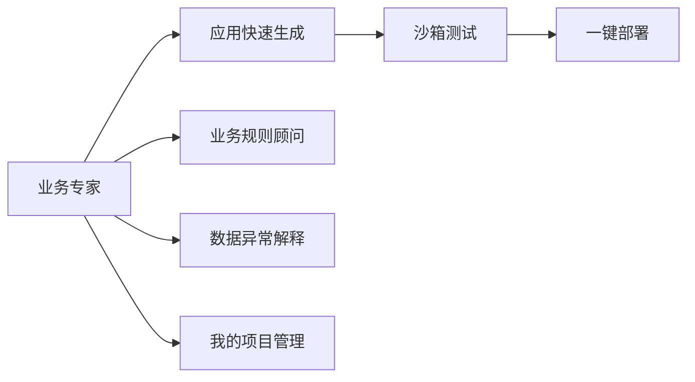
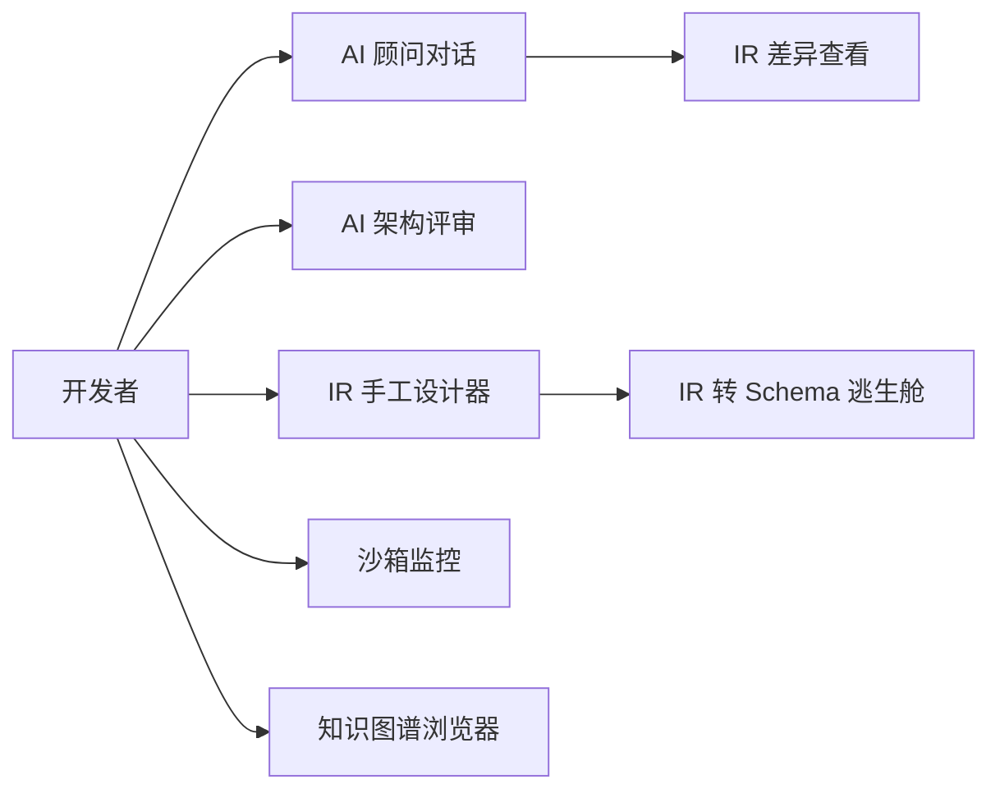
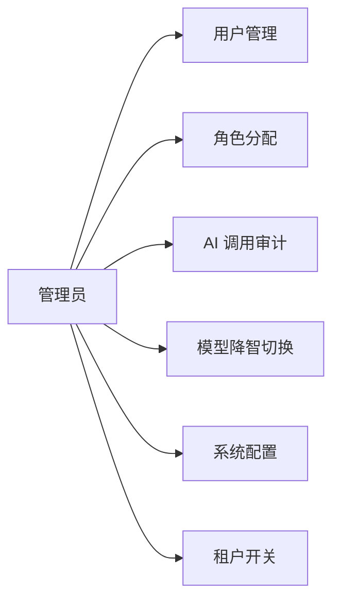
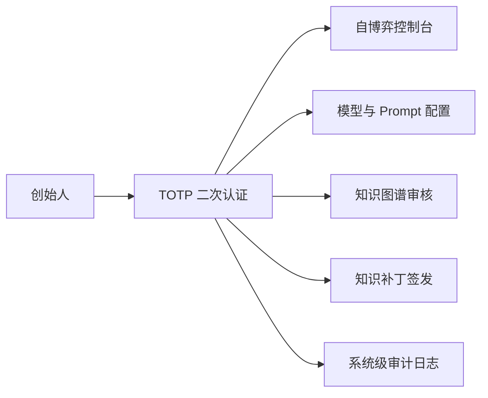
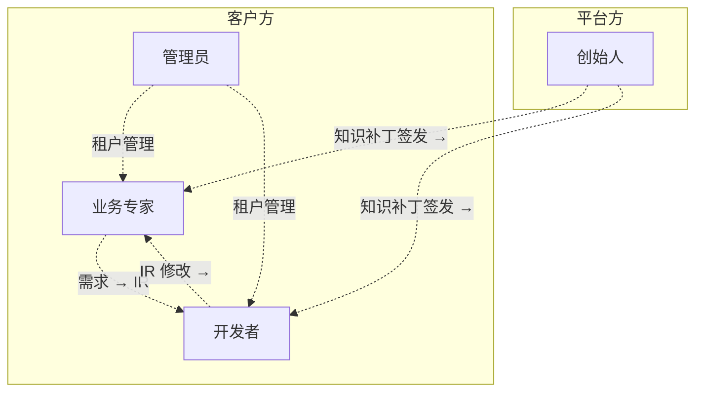

# JNPF-AI 低代码开发平台 · 需求分析说明书

> **版本**：v1.0（开发态 · 全六期覆盖版）
> **编制**：首席架构师助理 · 玛维思（Mavis）
> **日期**：2026-06-15
> **状态**：骨架已建，第一章（文档概述）已填，待创始人评审
> **关联文档**（同目录，全中文命名）：
> - 《架构设计说明书》→ `开发态-架构设计说明书-大纲.md`（待写）
> - 《系统详细设计说明书》→ `开发态-系统详细设计说明书-大纲.md`（待写）
> - 《部署 + 运维手册》→ `开发态-部署与运维手册-大纲.md`（待写）
> - **运行态对应文档**：`运行态-第一阶段-详细设计说明书-大纲.md`（结构参照）

---

## 文档目的

本说明书面向 **JNPF-AI 低代码开发平台** 的全栈研发与交付团队，统一描述：

1. **业务背景与产品定位**——为什么做这个平台
2. **角色与场景**——谁会用、用在哪、怎么用
3. **功能需求**——前四期已实现能力（**基线冻结**） + 五期+六期新增能力（**主战场**）
4. **业务流程**——五阶段 AI 流水线、自博弈沙箱、知识补丁注入等端到端流程
5. **非功能需求**——性能 / 安全 / 可用性 / 合规
6. **验收标准**——M0~M5 全部里程碑的可验证条件

---

## 阅读对象

| 角色 | 阅读重点 | 可跳过 |
|------|----------|--------|
| **创始人** | 第二章业务背景 + 第七章非功能需求 + 第十章验收 | 实现细节 |
| **架构师** | 全文 + 关联《架构设计说明书》 | — |
| **后端工程师** | 第三章角色 + 第四章功能清单 + 第八章数据 + 第九章接口 | — |
| **前端工程师** | 第三章角色 + 第四章功能清单 + 关联《详细设计》第八章 UI | 后端表设计 |
| **测试工程师** | 第十章验收 + 关联《详细设计》第十一章测试 | 业务背景 |
| **运维工程师** | 第七章可用性 + 关联《部署与运维》 | 业务流程 |

---

## 章节速览

| 章节 | 标题 | 主要内容 | 估算页数 | 状态 |
|------|------|----------|----------|------|
| 第一章 | 文档概述 | 范围 / 术语 / 边界（**两段式**：基线冻结 + 新增主战场） | 8~10 | ✅ 本次填写 |
| 第二章 | 业务背景与产品定位 | JNPF-AI 是什么、解决什么问题、差异化 | 10~15 | ⏳ 待写 |
| 第三章 | 用户角色与场景 | 4 角色矩阵（业务专家 / 开发者 / 管理员 / 创始人）+ 使用场景 + 双视角对照表 | 12~18 | ⏳ 待写 |
| 第四章 | 功能需求清单 | **基线冻结** + **五期+六期新增** 双段式清单 | 20~30 | ⏳ 待写 |
| 第五章 | 核心业务流程 | 五阶段流水线 / 需求会话 / 沙箱部署 / 知识补丁 / 熔炉自博弈 | 15~20 | ⏳ 待写 |
| 第六章 | 用例图 | 4 角色 × 核心场景的用例图（Mermaid） | 6~8 | ⏳ 待写 |
| 第七章 | 非功能需求 | 性能 / 安全 / 可用性 / 合规 / 可观测性 | 8~12 | ⏳ 待写 |
| 第八章 | 数据需求 | 业务实体清单 + 数据生命周期 + 主数据归属 | 6~8 | ⏳ 待写 |
| 第九章 | 接口需求 | 内部 / 外部接口的"做什么"层（不含"怎么做"——后者在《详细设计》第五章） | 4~6 | ⏳ 待写 |
| 第十章 | 验收标准 | M0~M5 全部里程碑 + 熔炉里程碑 | 4~6 | ⏳ 待写 |
| **合计** | — | — | **95~135 页** | — |

---

# 第一章 · 文档概述

## 1.1 编写目的

本说明书是 JNPF-AI 低代码开发平台的**第一份正式需求文档**，目的是：

1. **统一认知**——把分散在《升维开发总计划之一/二/三》《追加门禁》《CLAUDE.md》《专家审阅报告》里的需求描述**收敛为一份单一真源**
2. **明确边界**——清晰区分"前四期已实现的能力"与"五期+六期新增的能力"，避免研发越界推翻历史代码
3. **驱动后续**——为《架构设计说明书》《系统详细设计说明书》《部署与运维手册》提供**需求层输入**
4. **验收对齐**——为 M0~M5 全部里程碑提供可验证的需求条目

**特别说明**：本说明书**不包含**实现细节（接口契约、数据库字段、UI 原型、时序图）——这些在《系统详细设计说明书》里。

## 1.2 系统范围与边界

### 1.2.1 系统定义

**JNPF-AI 低代码开发平台** 是一个**双系统结构**的企业级低代码产品：

| 子系统 | 名称 | 部署形态 | 使命 |
|--------|------|----------|------|
| **主体** | **猴面包树工作室**（Baobab-Studio，简称"工作室"） | 对外 SaaS · 模块化单体 · .NET 8 + Vue 3 | 面向企业客户，以**五阶段 AI 流水线 + 多角色 Web UI** 将自然语言需求变为可运行系统 |
| **隔离区** | **猴面包树熔炉**（Baobab-Foundry，简称"熔炉"） | 绝密独立区 · Python · 物理隔离 | 在隔离沙箱中 7×24 自博弈，进化行业领域知识，经创始人审核后以 **知识补丁（KnowledgePatch）** 注入工作室 |

**关键边界**：
- 工作室 **不含** 熔炉的训练引擎
- 工作室 **接收** 经创始人签发的知识补丁（SQL Server 合并）
- 熔炉 **禁止** 公网端口直连工作室
- **生产环境** 只运行已验证（verified）规则与图谱，**禁止** 任何自博弈 / 未审核候选（candidate）

### 1.2.2 范围划分 —— 两段式（基线冻结 / 新增主战场）

#### **A 段：前四期基线（已实现，冻结）**

**范围说明**：以下能力在前四期（F-0~F-8 + 冲刺 0-A/B 完成后）已落地，是 JNPF 平台的**存量资产**。本说明书**只描述、不重新设计**——详细设计说明书（第三份）必须保留这些接口的**向后兼容**。

| 基线能力 | 来源 | 验收口径 | 详细设计章节 |
|---------|------|----------|--------------|
| **JNPF 单体框架**（框架层 / 基础设施层） | 阶段零 | 已上线代码 | 详细设计 §6.2 |
| **Vue3 单表 CRUD 编译器**（Vue3 编译器） | F-4 | 11 个编译器测试 + 83 项 vitest 通过 | 详细设计 §3.2 |
| **大屏基础编译器**（大屏编译器 + 图表 / 装饰 / 数据展示 / 媒体 / 3D 预留） | F-6a | 大屏编译器测试通过 | 详细设计 §3.3 |
| **IR 类型系统**（类型定义文件 + IR 层版本独立语义化版本） | F-1 + 裁决二 | CI 差异阻断擅自改 IR | 详细设计 §6.1 |
| **安全表达式引擎**（分词器 + 解析器 + 安全检查 + 编译器） | F-2 | 35 个测试全部通过 | 详细设计 §3.4 |
| **组件注册表**（前端核心组件注册目录） | F-3 + 阶段五补完 | **当前 92.6%（≥90% 门禁已达成）** | 详细设计 §3.5 |
| **FlowIR 类型 + 状态机 + 序列化器**（F-7.9 + 阶段三完成） | 阶段三 | flow 类型 / flow 序列化器 / flow 引擎已完成 | 详细设计 §3.6 |
| **8 目标编译网关**（统一编译网关 · Vue3 PC / App / 旧版 App / 大屏 / 工作流 / ...） | 阶段四 F-8 | 8 目标路由 + IR↔Schema + ZIP 打包 | 详细设计 §3.7 |
| **UniApp 编译器**（F-7 + 4 平台） | 阶段三 F-7 | UniApp 编译器 + pages-json 合并器 | 详细设计 §3.8 |
| **后端清零冲刺 1-3**（应用服务获取服务 19/37 处消化） | 阶段一 第 4 周 | 19 处消化完成 | 详细设计 §3.1 |
| **大模型网关 6 供应商**（DeepSeek / 通义千问 / OpenAI / Ollama / 智谱 / 月之暗面） | 阶段五 第 5 天 | 6 供应商 + 5 级降级链 | 详细设计 §3.10 |
| **CI 门禁修正**（lint:eslint + 去除 continue-on-error） | 冲刺 0-A 第 1 天 | 83 项测试受 CI 保护 | 部署文档 §2 |
| **JWT 密钥外移 + 安全止血** | F-0 + 冲刺 0-A | 7 个文件修改，无 eval / Function | 详细设计 §9 |

> ⚠️ **基线冻结原则**：上述能力的**接口签名、数据库表结构、API 路径、JSON Schema** 不得在本说明书或后续文档中**重新设计**。如发现重大缺陷，**走 ADR 流程**（新增 ADR-NNN）而非直接修改。

#### **B 段：五期 + 六期新增（主战场）**

**范围说明**：以下能力在《升维开发总计划》阶段五（第 1-10 周）+ 阶段六（第 1-8 周）+ 《追加门禁》4 项缺口（A1/A3/A6/A7）范围内。**这是本说明书的详细描述对象**。

| 新增能力 | 来源 | 工期 | 详细设计章节 |
|---------|------|------|--------------|
| **五阶段 AI 流水线 + 编排智能体** | 阶段五 第 3-10 周 + 追加 A1（第 16-20 天） | 10 周 | 详细设计 §4.1 + §5.1 |
| **需求分析师智能体** | 阶段五 第 3-4 周 | 2 周 | 详细设计 §3.10 + §4.1 |
| **架构师智能体** | 阶段五 第 3-4 周 | 2 周 | 详细设计 §3.10 + §4.1 |
| **UI/UX 设计智能体** | 阶段五 第 5-6 周 | 2 周 | 详细设计 §3.10 + §8.1 |
| **数据库设计师智能体** | 阶段五 第 5-6 周 | 2 周 | 详细设计 §3.10 + §6.3 |
| **业务规则配置中心**（决策表 + 决策树 + 规则链） | 阶段五 第 7-8 周 | 2 周 | 详细设计 §3.10 + §8.2 |
| **无 AI 专家模式**（可视化开发 + IR 转 Schema 逃生舱） | 阶段五 第 7-8 周 | 2 周 | 详细设计 §3.10 + §5.5 |
| **领域知识进化引擎 V1.0** | 阶段五 第 9-10 周 | 2 周 | 详细设计 §3.10 + §6.4 |
| **AI 对话工作台**（AI 对话面板 / IR 差异查看器 / 自博弈看板 / 知识图谱浏览器） | 阶段五 第 9-10 周 | 2 周 | 详细设计 §8.3 |
| **FlowIR 编译器集成**（FlowIR → 可部署工作流配置 JSON） | 追加 A3（第 26-28 天） | 嵌入工期 | 详细设计 §3.6 |
| **评测基准 50 条黄金集**（5 领域 × 10 条） | 追加 A6（第 25 天） | 嵌入工期 | 详细设计 §11.3 |
| **多租户沙箱 + 多租户启用** | 阶段六 第 1-4 周 + 追加 A7 | 4 周 | 详细设计 §9.3 + 部署文档 §3 |
| **创始人守护 + 动态口令 + 创始人认证日志表** | 阶段六 第 3-4 周 | 2 周 | 详细设计 §9.4 |
| **知识补丁签名验证 + SQL 知识表增量合并** | 阶段六 第 5-6 周 | 2 周 | 详细设计 §5.6 + §6.5 |
| **创始人控制台 UI + 图谱浏览器** | 阶段六 第 7 周 | 1 周 | 详细设计 §8.4 |
| **流水线阶段 5 交付**（测试 URL + 增量修改 + ZIP 导出） | 阶段六 第 8 周 | 1 周 | 详细设计 §5.7 |
| **熔炉自博弈引擎**（攻击者 + 构建者 + 判官 + 蒸馏师 + LLM 智能体循环） | 熔炉 F0-F4 | ~16 周 | 详细设计 §4.5 |
| **熔炉因果回放池**（SQL Server JSON 列） | 熔炉 F0 | 3 周 | 详细设计 §6.6 |
| **熔炉知识补丁构建器** | 熔炉 F3 | 3 周 | 详细设计 §5.8 |

> ⚠️ **新增主战场原则**：上述能力的**接口、表结构、UI 流程、权限模型**必须在本说明书（需求层）+ 《架构设计说明书》（架构层）+ 《系统详细设计说明书》（实现层）**三层一致**。任何一层与其他层冲突，**走 ADR 流程**。

### 1.2.3 本期做 / 不做（精确边界）

#### ✅ 本期做（六期全部范围）

- 前述 A 段（基线冻结）的**描述与对账**（不重新设计）
- 前述 B 段（五期+六期新增）的**详细需求**（用例、业务流程、非功能）
- **工作室 + 熔炉双系统** 的需求描述（熔炉仅需求层，详细在熔炉独立仓库）
- **M0~M5 + FM0~FM4 全部里程碑**的验收条目

#### ❌ 本期不做（明确排除）

- **熔炉训练引擎的实现细节**（攻击者 / 构建者 / 判官 / 蒸馏师的算法）—— 详细设计在熔炉独立仓库
- **Neo4j 图谱**—— 创始人裁定部分采纳，**MVP2 再评估**，本期不做
- **PostgreSQL + pgvector 回放池**—— 已废止，本期不做
- **mTLS / WORM / 军规安保**—— 已废止，本期不做
- **uni-app X 双轨编译器**—— 暂缓非删除，本期不做
- **任意 .vue → IR 反解析**—— 已废止，本期不做（仅 IR 转 Schema 官方通道）
- **F-6b.8 蓝图引擎**—— 已废止，本期不做（并入 expression/engine）
- **ML.NET 本地意图分类器**—— 已废止，本期不做（LLM 网关路由）
- **OA 模块**—— 已禁用，本期不做（除非创始人明确指令）
- **IoT / MES 模块**—— 本期不做（除非创始人明确指令）

### 1.2.4 与运行态文档的关系

| 维度 | 运行态详细设计说明书 | 本说明书（开发态） |
|------|---------------------|-------------------|
| **视角** | 运行时（部署后） | 开发时（编码前） |
| **读者** | 运维 / SRE / 客户技术对接 | 架构师 / 后端 / 前端 / 测试 |
| **核心模块** | 6 个运行时模块（架构管控 / 同步引擎 / 指标 IR / 数据查询网关 / 数据 MCP / 大屏 IR 单卡） | **15 个 JNPF 模块**（按后端/modularity/ 实际包名） |
| **表集合** | 10 张运行时元数据表 | **80+ 张**（业务表 + 框架表 + AI_* 新表 + 运行态 10 张） |
| **章节结构** | 12 章（与本说明书章节结构对齐） | 10 章（功能/业务为主） |

**双视角对照表**（详见第三章 §3.2）：
- 运行态模块 ↔ 开发态模块
- 运行时表 ↔ 开发态表
- 运行时接口 ↔ 开发态接口

## 1.3 术语与缩写

### 1.3.1 产品术语

| 术语 | 定义 |
|------|------|
| **JNPF-AI** | 整个产品品牌（JNPF + AI 原生层） |
| **猴面包树工作室** | 产品的对外服务名，对应 SaaS 多租户平台 |
| **猴面包树熔炉** | 产品的绝密训练区，独立部署 |
| **IR** | Intermediate Representation，中间表示（AI 与人类同构编辑的载体） |
| **表单页 IR** | 表单/列表页面的 IR 类型 |
| **大屏 IR** | 大屏页面的 IR 类型 |
| **工作流 IR** | 工作流页面的 IR 类型（**M1 修复项**） |
| **动态 API 控制器** | JNPF 框架的 Service → API 自动生成机制（CLAUDE.md R1） |
| **租户过滤器** | JNPF 框架的多租户隔离过滤器（CLAUDE.md R4） |
| **知识补丁** | 熔炉 → 工作室 的领域知识增量包，**创始人私钥签名** |
| **领域模式** | 知识图谱中的领域模式节点（候选 / 已验证 / 已弃用） |
| **评测基准黄金集** | 50 条真实需求 → 预期 IR 的评测基准集（**M2 修复项**） |
| **EAB** | Enterprise Architecture Baseline，企业架构基准（阶段二架构师服务 强制约束） |
| **领域知识进化引擎** | Domain Knowledge Evolution Engine，简称 DKEE |

### 1.3.2 技术缩写

| 缩写 | 全称 | 备注 |
|------|------|------|
| **ADR** | Architecture Decision Record | 架构决策记录，**变更必经流程** |
| **P0** | Priority 0（最高优先级） | 阶段启动门禁 |
| **SLA** | Service Level Agreement | 服务等级协议 |
| **JWT** | JSON Web Token | 600 = Token 过期 |
| **Oops** | JNPF 框架异常类 | Oh() = 系统异常，**Bah() = 业务异常** |
| **Outbox** | 事务性发件箱模式 | 冲刺 0-A 落地 |
| **RAG** | Retrieval-Augmented Generation | 检索增强生成 |
| **OTel** | OpenTelemetry | 判官 R_black 前置依赖 |
| **智能体循环** | LLM 多轮代理循环 | 熔炉 v5.0 引擎换道 |
| **信号量** | SemaphoreSlim | .NET 信号量，沙箱并发控制 |

### 1.3.3 角色术语

| 角色 | 定义 | 主要职责 |
|------|------|----------|
| **业务专家** | 客户方的业务顾问 | 应用快速生成、业务规则顾问、我的项目 |
| **开发者** | 客户方的研发 | AI 顾问、AI 架构评审、IR 手工设计器、沙箱监控 |
| **管理员** | 平台管理员 | 用户管理、AI 调用审计、模型降智与切换 |
| **创始人** | 平台超级管理员（创始人本人） | 自博弈控制台、模型与 Prompt 配置、知识图谱审核、知识补丁签发 |

## 1.4 参考文献

### 1.4.1 项目内部文档

| 文档 | 路径 | 关系 |
|------|------|------|
| **CLAUDE.md** | `CLAUDE.md` | 架构铁律 · 4 Laws · 工程基线 |
| **《升维开发总计划之一》** | `docs/架构迭代/7、AI原生低代码框架/10、*.md` | 阶段零~四 + 总纲 |
| **《升维开发总计划之二》** | `docs/架构迭代/7、AI原生低代码框架/11、*.md` | 阶段五 + 工作室 |
| **《升维开发总计划之三》** | `docs/架构迭代/7、AI原生低代码框架/12、*.md` | 阶段六 + 熔炉 |
| **《升维开发总计划追加门禁》** | `docs/架构迭代/7、AI原生低代码框架/13、*.md` | A1/A3/A6/A7 4 项缺口 |
| **《v52 架构迭代终报》** | `docs/architecture/V52-ARCHITECTURE-ITERATION-FINAL-REPORT.md` | v52 架构迭代终报 |
| **《运行态详细设计说明书》** | `docs/architecture/v52/运行态-第一阶段-详细设计说明书-大纲.md` | 结构参照源 |
| **《ADR-016》** | `docs/adr/ADR-016-modular-monolith.md` | 模块化单体架构决策 |
| **《ADR-017》** | `docs/adr/ADR-017-new-old-codegen-coexistence.md` | 新旧代码生成器共存 |
| **《ADR-018》** | `docs/adr/ADR-018-unapp-ui-library-selection.md` | UniApp UI 库选型 |

### 1.4.2 行业标准

| 标准 | 编号 | 关系 |
|------|------|------|
| 软件需求说明书（GB/T 8567-2006 模板） | — | 本说明书章节结构遵循 |
| CMMI DEV v2.0 | — | 需求管理实践域对齐 |
| ISO/IEC 25010 | — | 非功能需求分类（性能 / 安全 / 可用性等 8 维度） |

### 1.4.3 外部依赖文档

| 文档 | 用途 |
|------|------|
| DeepSeek API 文档 | 大模型网关 DeepSeek 实现 |
| OpenAI API 文档 | 大模型网关 OpenAI 实现 |
| Alova 文档 | 前端 HTTP 客户端（与结果枚举对齐） |
| Three.js 文档 | 大屏 3D 数字孪生 |
| Element Plus / Ant Design Vue 文档 | PC 前端 UI |
| wot-design-uni 文档 | App 前端 UI（**新编译器选定**，ADR-018） |

---

## 本章小结

- **范围**：JNPF-AI 全平台，包含工作室 + 熔炉双系统，6 期全覆盖
- **边界**：A 段基线冻结（前四期已实现）+ B 段新增主战场（五期+六期）
- **不做**：熔炉算法实现、Neo4j、pgvector、mTLS、uni-app X、.vue 反解析、F-6b.8 蓝图、ML.NET、OA、IoT、MES
- **关系**：与运行态详细设计说明书**结构对齐、内容互补**（运行态视角 vs 开发态视角）
- **驱动**：为《架构设计说明书》《系统详细设计说明书》《部署与运维》提供需求层输入

---

**第一章完。等待创始人评审。**

如确认无异议，玛维思将继续填写：
- **第二章 业务背景与产品定位**
- **第三章 用户角色与场景**（含双视角对照表）
- ...
- **第十章 验收标准**

每次完成一章立即回放，待评审通过后再写下一章。

# 第二章 · 业务背景与产品定位

## 2.1 行业现状与痛点

### 2.1.1 传统低代码平台的瓶颈

截至 2026 年，国内低代码平台已普遍解决"表单/列表/大屏"三件套的可视化搭建，但在 AI 原生层普遍缺位：

| 痛点 | 现状 | 影响 |
|------|------|------|
| **AI 是填表员** | LLM 只能按字段填值，不会讨论方案优劣 | 客户得不到决策建议 |
| **业务规则黑盒** | AI 生成的规则不可解释、不可追溯 | 客户不敢上生产 |
| **生成质量不稳** | 同一需求换模型/改 prompt 后质量回退 | 客户对 AI 不信任 |
| **AI 降智无逃生** | 模型 API 故障时平台瘫痪 | 客户业务中断 |
| **知识无法沉淀** | AI 每次从零开始，不积累领域经验 | 客户重复劳动 |
| **多租户隐患** | 多数平台 `MultiTenancy=false`，越权风险 | SaaS 化不可售 |

### 2.1.2 AI 原生低代码的正确范式

2026 年 SOTA（SWE-agent、AlphaCode2）一致路线：**LLM 智能体循环 + 执行反馈 + 程序化验证器**。JNPF-AI 走这条路，并叠加三层差异化：

1. **顾问式 AI**——AI 是"决策合伙人"，能主动追问业务潜规则、提供策略选项、分析影响
2. **同构 IR**——AI 产出与手工产出**同构 IR**，AI 降智时无缝切换手工模式
3. **领域知识闭环**——熔炉自博弈 → 知识蒸馏 → 创始人审核 → 知识补丁注入 → 工作室复用

## 2.2 产品定位

### 2.2.1 一句话定位

**JNPF-AI 是面向国内中大型企业的"顾问式 AI 原生低代码平台"——以五阶段 AI 流水线 + 多角色 Web UI，将自然语言需求变为可运行系统；进可 AI 生成、退可手工兜底。**

### 2.2.2 目标客户

| 客户类型 | 典型场景 | 价值主张 |
|---------|---------|----------|
| **中大型企业 IT 部门** | 内部系统快速搭建（OA/CRM/ERP 模块） | 顾问式 AI 减少需求分析师工作量 |
| **行业 SaaS 厂商** | 给行业客户提供垂直低代码能力 | 领域知识可复用、可私有化 |
| **系统集成商** | 给客户交付定制化系统 | 流水线阶段 5 一键交付 ZIP |
| **企业业务部门** | 业务专家自己搭轻应用 | 无需写代码，业务专家自助 |

### 2.2.3 差异化（与友商对比）

| 维度 | 钉钉宜搭 / 腾讯微搭 / 飞书多维表格 | Plasmic / Builder.io / Amplication | **JNPF-AI** |
|------|-----------------------------------|-----------------------------------|------------|
| 国内企业特性（OA/审批流/单据号） | ✅ 强 | ❌ 弱 | ✅ 强（F-7.9 FlowIR + 18 张 FLOW_* 表） |
| AI 原生层 | ❌ 弱（仅字段填充） | ⚠️ 中（Copilot 模式） | ✅ 强（顾问式 + 五阶段流水线） |
| 业务规则可解释 | ❌ 黑盒 | ⚠️ 部分 | ✅ 决策表/决策树/规则链三种形态 |
| 多租户 | ⚠️ 部分 | ⚠️ 部分 | ✅ **SQL Server 共享 per-tenant DB** |
| 创始人级治理 | ❌ 无 | ❌ 无 | ✅ 创始人守护 + TOTP + 知识补丁签发 |
| 离线/降级运行 | ❌ 必须联网 | ❌ 必须联网 | ✅ 无 AI 专家模式 + IR 转 Schema 逃生舱 |
| 知识可沉淀 | ❌ 无 | ⚠️ 模板 | ✅ 熔炉自博弈 → 领域模式 → 知识图谱 |

## 2.3 产品使命与愿景

### 2.3.1 使命

让 AI 成为架构师和开发者的**决策合伙人**，而不是填表员。人类始终在环路中，AI 降智时可无缝降级为专家模式。

### 2.3.2 愿景（三年）

```
2026 (v5.2)  五阶段 AI 流水线 + 多租户沙箱 + 熔炉 MVP1
2027 (v6.0)  全行业领域模式 verified ≥ 100；创始人菜单日活
2028 (v7.0)  智慧工地 + 智能更衣柜 + 教育 + 医疗 4 行业 verified
```

## 2.4 业务约束

### 2.4.1 强约束（创始人裁定）

| 约束 | 来源 | 影响范围 |
|------|------|----------|
| **OA 模块禁用** | CLAUDE.md R5 | 不得修改（除非创始人指令） |
| **IoT / MES 模块不创建** | CLAUDE.md R5 | 不得脚手架（除非创始人指令） |
| **JWT 密钥不轮换** | 用户偏好（历史对话） | 密钥轮换须走流程 |
| **必须中文命名** | 用户偏好（本次对话） | 文档/UI/标识符 |

### 2.4.2 工程约束（CLAUDE.md 4 Laws）

| 约束 | 含义 |
|------|------|
| **不升级（不推卸责任）** | 发现错误立即修复，禁止"超出范围"/"稍后修复"/"边界情况" |
| **验证即完成** | 完成声明必须有新验证证据，5 步门禁函数（识别→运行→读取→验证→声明） |
| **诚实汇报** | 不确定就说，不编造；报告相邻代码的问题 |
| **不偷工减料** | 禁止 TODO / 伪实现 / 吞异常 / 跳过边界情况（null/并发/错误路径） |

### 2.4.3 合规约束

| 合规项 | 要求 |
|--------|------|
| **多租户隔离** | R4 红线——所有业务表必须经 ITenantFilter 过滤；阶段六前启用 |
| **数据本地化** | 客户数据不出境；熔炉自博弈仅使用匿名化原料包 |
| **审计可追溯** | 所有 AI 调用、所有创始人操作、所有知识补丁注入均记录不可删审计表 |
| **密钥管理** | 所有 API Key 不入仓；通过环境变量 + 密钥管理服务注入 |
| **AI 输出可解释** | 业务规则必须可解释（决策表/决策树/规则链） |

---

# 第三章 · 用户角色与场景

## 3.1 角色总览

JNPF-AI 采用 **4 角色矩阵**（来源：《升维开发总计划》8 稿 · 确定版）：

| 角色 | 中文名 | 菜单项 | 路由前缀 | 后端租户 ID |
|------|--------|--------|----------|-------------|
| 业务专家 | 业务专家 | 应用快速生成、业务规则顾问、数据异常解释、我的项目 | `/studio/expert/*` | 强制 |
| 开发者 | 开发者 | AI 顾问、AI 架构评审、IR 手工设计器、沙箱监控、知识图谱浏览器 | `/studio/dev/*` | 强制 |
| 管理员 | 管理员 | 用户管理、AI 调用审计、模型降智与切换、系统配置 | `/studio/admin/*` | 平台级 |
| 创始人 | 创始人 | 自博弈控制台、模型与 Prompt 配置、知识图谱审核、系统级审计日志 | `/studio/founder/*` | 创始人守护 |

## 3.2 角色详细说明

### 3.2.1 业务专家（业务顾问）

- **典型用户**：客户方的业务经理、业务分析师、行业顾问
- **技能门槛**：懂业务不懂代码
- **核心场景**：
  - 用自然语言描述需求 → AI 自动生成可运行系统
  - 业务规则有疑问 → AI 给出可解释的策略选项
  - 数据异常 → AI 给出根因解释
- **禁止能力**：不能修改 IR、不能直接调用 API、不能查看沙箱监控

### 3.2.2 开发者（研发）

- **典型用户**：客户方的研发工程师、内部研发
- **技能门槛**：懂 JNPF 平台、懂 IR、懂 SQL
- **核心场景**：
  - AI 顾问对话 → 审查 AI 输出 → 必要时手工修改 IR
  - AI 架构评审 → 看 AI 输出的架构设计 → 修正不合理部分
  - IR 手工设计器 → 直接编辑 IR → 编译 → 部署
  - 沙箱监控 → 看 5 个沙箱的并发状态
  - 知识图谱浏览器 → 浏览领域模式
- **与业务专家的区别**：能修改 IR、能看沙箱、能看知识图谱

### 3.2.3 管理员（平台管理员）

- **典型用户**：平台运营、客户方的 IT 管理员
- **技能门槛**：懂平台运维、懂权限模型
- **核心场景**：
  - 用户管理（增删改查、角色分配）
  - AI 调用审计（看 BASE_AI_CALL_LOG、AI_INFERENCE_LOG、AI_PII_MASK_LOG）
  - 模型降智与切换（在多供应商间手动切换）
  - 系统配置（租户开关、特性开关、性能阈值）
- **与开发者的区别**：看不到 IR 编辑器，能看全局审计

### 3.2.4 创始人（创始人）

- **典型用户**：仅创始人本人
- **技能门槛**：懂 LLM、懂架构、懂业务
- **核心场景**：
  - 自博弈控制台（查看熔炉实时状态，**仅查看，不内嵌训练引擎**）
  - 模型与 Prompt 配置（6 供应商 + Prompt 模板）
  - 知识图谱审核（领域模式 candidate → verified 的签字）
  - 知识补丁签发（私钥签名 zip）
  - 系统级审计日志（不可删）
- **二次认证**：所有 `/api/founder/*` 端点必须 TOTP + 创始人用户 ID + X-Founder-Token
- **审计**：所有创始人操作写入 BASE_FOUNDER_AUTH_LOG（不可删审计表）

## 3.3 双视角对照表（运行态 ↔ 开发态）

### 3.3.1 模块对照

| 运行态模块（运行态详细设计说明书 §3.2） | 开发态模块（JNPF 实际包） | 关系 |
|------------------------------------------|--------------------------|------|
| 架构管控（SchemaGovernor） | `backend/modularity/visualdev`（可视化开发） + `jnpf-web-vue3/src/core/ir/`（IR 类型系统） | 运行态视角关注数据同步；开发态视角关注 IR 与代码生成器 |
| 同步引擎（SyncEngine） | **暂无对应**（纸面方案） | 待源码验证后归入 `backend/modularity/engine` 或独立模块 |
| 指标 IR 引擎（MetricIR） | **暂无对应**（纸面方案） | 与 `visualdev` 部分重叠，待澄清 |
| 数据查询网关（DataQueryGateway） | `backend/modularity/visualdata`（可视化数据） | 运行态视角关注 MQL 查询；开发态视角关注大屏数据源 |
| 数据 MCP 宿主（data-mcp Host） | **熔炉侧**，不在工作室 | 熔炉的智能体 → 工作室的数据访问通道 |
| 大屏 IR 单卡编译器（DashboardIR） | `jnpf-web-vue3/src/core/compiler/dashboard/`（大屏编译器） | 一致 |
| **新增（开发态视角独有）** | `backend/modularity/workflow`（工作流引擎） + FlowIR | 运行态未涉及 |
| **新增（开发态视角独有）** | `backend/modularity/engine`（规则引擎） + 业务规则引擎 | 运行态未涉及 |
| **新增（开发态视角独有）** | `backend/modularity/inteAssistant`（智能助理） + LLM 网关 | 运行态未涉及 |
| **新增（开发态视角独有）** | `backend/modularity/oauth`（认证授权） + 创始人守护 | 运行态未涉及 |
| **新增（开发态视角独有）** | `backend/modularity/extend`（扩展模块） + 多租户 | 运行态未涉及 |

### 3.3.2 表对照

| 运行态表（运行态详细设计说明书 §6） | 开发态表（JNPF 实际） | 关系 |
|--------------------------------------|---------------------|------|
| DATA_SYNC_TASK（数据同步任务） | **暂无**（纸面方案） | 与熔炉因果回放池不重叠 |
| DATA_SYNC_SCHEMA_VERSION | **暂无** | — |
| METRIC_IR_DEFINITION | **暂无** | — |
| METRIC_IR_VERSION | **暂无** | — |
| METRIC_IR_SIMULATE_LOG | **暂无** | — |
| BASE_AI_CALL_LOG | **待建**（冲刺 0-B 地桩 1） | 开发态视角归入 `BASE_AI_*` 系列 |
| AI_INFERENCE_LOG | **暂无** | — |
| AI_PII_MASK_LOG | **暂无** | — |
| METRIC_AGGREGATE_CACHE | **暂无** | — |
| ALERT_LOG | **已有**（`backend/modularity/system`） | 运行态重命名为 `ALERT_LOG`，开发态为 `BASE_ALERT_LOG` 或类似 |

**说明**：运行态 10 张表中，**5 张已规划但仓库 0 处匹配**（纸面方案），**1 张已实现**（ALERT_LOG），**4 张与开发态规划重叠**。详细设计说明书第六章需要明确每张表的**双写入规则**。

### 3.3.3 接口对照

| 运行态接口（运行态详细设计说明书 §5） | 开发态接口（JNPF 实际风格） | 关系 |
|------------------------------------------|----------------------------|------|
| `query_metrics`（查询指标） | `LlmGatewayService.Chat()` + 业务服务封装 | 风格一致（DynamicApi 自动生成） |
| `list_metrics`（列出指标） | `MetricService.GetPageList()` | 风格一致 |
| `explain_metric`（解释指标） | **待定** | 需要新增 `MetricExplainService` |
| **新增（开发态视角独有）** | `/api/analyst/session`、`/api/analyst/{id}/message`、`/api/analyst/{id}/generate-doc` | 阶段五需求会话 |
| **新增（开发态视角独有）** | `/api/architect/design` | 阶段五架构设计 |
| **新增（开发态视角独有）** | `/api/pipeline/{id}` | 阶段五流水线状态 |
| **新增（开发态视角独有）** | `/api/devengine/build` | 阶段五自动开发测试 |
| **新增（开发态视角独有）** | `/api/sandbox/{tenantId}/status` | 阶段六沙箱状态 |
| **新增（开发态视角独有）** | `/api/founder/auth/verify`、`/api/founder/selfplay/tasks` | 阶段六创始人认证 |

## 3.4 使用场景

### 3.4.1 场景 A：业务专家"零代码搭应用"

```
1. 业务专家登录 → 进入"应用快速生成"
2. 输入自然语言需求："我需要一个员工请假管理系统"
3. AI（需求分析师）理解 → 追问 3 个问题（年假天数？审批层级？跨部门请假？）
4. 业务专家回答 → AI（架构师）输出架构设计
5. 业务专家确认 → AI（UI/UX + 数据库设计师 + 工作流设计师）并行输出 IR
6. 业务专家确认 → AI（自动开发引擎）编译为可运行系统
7. 业务专家在沙箱中测试 → 满意 → 一键部署
```

### 3.4.2 场景 B：开发者"AI 架构评审"

```
1. 开发者登录 → 进入"AI 架构评审"
2. 提交一份架构方案（已有的 IR）
3. AI（架构师智能体）基于 EAB 评估：模块划分是否合理？数据库设计是否合规？API 设计是否安全？
4. AI 输出评审报告（包含风险点 + 优化建议）
5. 开发者根据建议修改 IR → 重新提交
```

### 3.4.3 场景 C：管理员"AI 降智切换"

```
1. 管理员收到告警：DeepSeek 响应时间 P95 > 30s
2. 进入"模型降智与切换"
3. 查看多供应商健康状态：DeepSeek ❌ / 通义千问 ✅ / OpenAI ✅
4. 点击"切换到通义千问" → 全局生效
5. 所有新发起的 AI 调用走通义千问 → AI_INFERENCE_LOG 记录切换事件
```

### 3.4.4 场景 D：创始人"知识补丁签发"

```
1. 熔炉自博弈完成一周 → 生成"教育行业领域模式 verified 包"
2. 创始人登录 → TOTP 二次认证 → 进入"知识图谱审核"
3. 浏览候选领域模式（candidate）→ 阅读叙事式说明书
4. 选择签发 → 输入私钥签名 → 打包为 KnowledgePatch.zip
5. Studio 侧下载 → KnowledgePatchService 验证签名 → 合并到 BASE_KNOWLEDGE_*
6. 写入 BASE_FOUNDER_AUTH_LOG 不可删审计
```

---

# 第四章 · 功能需求清单

## 4.1 基线冻结功能（A 段 · 不重新设计）

### 4.1.1 框架层能力

| 需求编号 | 功能描述 | 验收口径 | 详细设计章节 |
|---------|---------|----------|--------------|
| FR-A-001 | 模块化单体架构（CLAUDE.md ADR-016） | 已上线代码，CI 编译通过 | §3.1 |
| FR-A-002 | 多租户隔离框架（ITenantFilter，CLAUDE.md R4） | 当前 `MultiTenancy=false`，阶段六启用 | §9.3 |
| FR-A-003 | 动态 API 控制器（Service → API 自动生成，CLAUDE.md R1） | 已实现，禁止手工 Controller | §5.1 |
| FR-A-004 | 统一响应封装（RESTfulResult + Oops.Oh()/Bah()，CLAUDE.md R2） | 已实现，600 = JWT 过期 | §5.2 |
| FR-A-005 | JWT 鉴权 + 路由级权限（CLAUDE.md R3） | Sprint 0-A Day 3 实施 | §9.1 |
| FR-A-006 | Outbox 事务性发件箱 | Sprint 0-A Day 3 PoC 4 用例 | §6.2 |
| FR-A-007 | 工作流引擎 18 张 FLOW_* 表 | 已实现 | §3.6 |
| FR-A-008 | 代码生成器（在线 .vm / 下载 TS，ADR-017） | Sprint 0-A Day 4 双轨共存 | §3.7 |
| FR-A-009 | 旧版代码生成器（保留兼容） | Sprint 0-A Day 4 | §3.7 |

### 4.1.2 前端基础层能力

| 需求编号 | 功能描述 | 验收口径 | 详细设计章节 |
|---------|---------|----------|--------------|
| FR-A-010 | IR 类型系统（types.ts + IR 层版本独立 semver） | CI 差异阻断擅自改 IR | §6.1 |
| FR-A-011 | 安全表达式引擎（F-2） | 35 个测试全部通过 | §3.4 |
| FR-A-012 | 组件注册表（92.6% ≥ 90% 门禁） | 当前达成 | §3.5 |
| FR-A-013 | Vue3 单表 CRUD 编译器（Vue3 编译器） | 11 个编译器测试 + 83 项 vitest 通过 | §3.2 |
| FR-A-014 | 大屏基础编译器（大屏编译器 + 图表/装饰/数据展示/媒体） | 大屏编译器测试通过 | §3.3 |
| FR-A-015 | FlowIR 类型 + 状态机 + 序列化器（阶段三完成） | flow 类型/序列化器/引擎已完成 | §3.6 |
| FR-A-016 | 8 目标编译网关（统一编译网关，阶段四完成） | 8 目标路由 + IR↔Schema + ZIP 打包 | §3.7 |
| FR-A-017 | UniApp 编译器（标准单轨，4 平台） | UniApp 编译器 + pages-json 合并器 | §3.8 |
| FR-A-018 | FlowIR 编译器集成（**A3 缺口，已完成**） | Day 26-28 与 DKEE 一起 | §3.6 |
| FR-A-019 | Alova 对齐结果枚举（200/600/601/602 + HTTP 401） | Sprint 0-A Day 4 实施 | §5.2 |

### 4.1.3 后端服务能力

| 需求编号 | 功能描述 | 验收口径 | 详细设计章节 |
|---------|---------|----------|--------------|
| FR-A-020 | 后端清零冲刺 1-3（19/37 处应用服务获取服务消化） | 已完成 19 处 | §3.1 |
| FR-A-021 | 大模型网关 6 供应商（DeepSeek/通义千问/OpenAI/Ollama/智谱/月之暗面） | 6 供应商 + 5 级降级链 | §3.10 |
| FR-A-022 | LLM 网关健康检查 + 写日志 | 已实现 | §3.10 |
| FR-A-023 | JWT 密钥外移 + 7 文件安全止血（F-0） | 已完成，无 eval/Function | §9 |
| FR-A-024 | IR 逆向逃生舱（IR 转 Schema） | Sprint 0-B 地桩 8，10+ round-trip | §5.5 |

## 4.2 新增主战场功能（B 段 · 详细设计对象）

### 4.2.1 五阶段 AI 流水线（阶段五核心）

| 需求编号 | 功能描述 | 工期 | 详细设计章节 |
|---------|---------|------|--------------|
| FR-B-001 | 五阶段流水线状态机（需求 → 架构 → 总体设计 → 自动开发 → 交付） | 阶段五 全程 | §4.1 |
| FR-B-002 | 编排智能体（OrchestratorAgent，**A1 缺口**，Day 16-20） | 嵌入工期 | §5.1 |
| FR-B-003 | 阶段 1：需求分析师智能体 | 阶段五 第 3-4 周 | §3.10 |
| FR-B-004 | 阶段 2：架构师智能体（含 EAB 强制约束） | 阶段五 第 3-4 周 | §3.10 |
| FR-B-005 | 阶段 3 子智能体：UI/UX 设计智能体 | 阶段五 第 5-6 周 | §3.10 |
| FR-B-006 | 阶段 3 子智能体：数据库设计师智能体（含多租户/审计字段自动注入） | 阶段五 第 5-6 周 | §3.10 |
| FR-B-007 | 阶段 3 子智能体：工作流设计师（FlowIR 集成） | **A3 缺口**，Day 26-28 | §3.6 |
| FR-B-008 | 阶段 3 子智能体：大屏设计师（DashboardIR） | 阶段五 第 5-6 周 | §3.10 |
| FR-B-009 | 阶段 3 子智能体：移动端设计师（App 端 IR） | 阶段五 第 5-6 周 | §3.10 |
| FR-B-010 | 阶段 4：自动开发引擎（IR + DB → 编译 → 客户沙箱 URL + 测试报告） | 阶段五 第 8-9 周 + 阶段六沙箱 | §3.7 |
| FR-B-011 | 阶段 5：交付引擎（沙箱验收 → 测试 URL + ZIP 导出 + 增量回退阶段 1） | 阶段六 第 8 周 | §5.7 |

### 4.2.2 业务规则与决策

| 需求编号 | 功能描述 | 工期 | 详细设计章节 |
|---------|---------|------|--------------|
| FR-B-012 | 业务规则配置中心（决策表 / 决策树 / 规则链） | 阶段五 第 7-8 周 | §3.10 + §8.2 |
| FR-B-013 | 无 AI 专家模式（AI 降智时无缝降级） | 阶段五 第 7-8 周 | §5.5 |
| FR-B-014 | IR 同构编辑（AI 产出 = 手工产出 同构 IR） | 全程 | §5.5 |
| FR-B-015 | AI 输出可解释（业务规则必须可解释） | 全程 | §7 |

### 4.2.3 知识图谱与领域进化

| 需求编号 | 功能描述 | 工期 | 详细设计章节 |
|---------|---------|------|--------------|
| FR-B-016 | 知识图谱节点表（BASE_KNOWLEDGE_NODE） | 冲刺 0-B 第 8 天 | §6.4 |
| FR-B-017 | 知识图谱边表（BASE_KNOWLEDGE_EDGE） | 冲刺 0-B 第 8 天 | §6.4 |
| FR-B-018 | 知识图谱 SQL 实现（IKnowledgeGraphStore） | 冲刺 0-B 第 8 天 | §6.4 |
| FR-B-019 | 领域知识进化引擎 V1.0（DKEE，观察人类操作 → 提炼领域模式） | 阶段五 第 9-10 周 | §6.4 |
| FR-B-020 | 候选模式叙事式说明书（NarrativePatternBrief） | 阶段五 第 9-10 周 | §8.3 |

### 4.2.4 多租户沙箱（阶段六核心）

| 需求编号 | 功能描述 | 工期 | 详细设计章节 |
|---------|---------|------|--------------|
| FR-B-021 | 多租户启用（MultiTenancy=true，阶段六前） | 阶段六 第 2 周 | §9.3 |
| FR-B-022 | 租户中间件（TenantMiddleware，注入租户 ID） | 阶段六 第 1-2 周 | §9.3 |
| FR-B-023 | Docker 沙箱调度器（信号量 5 并发，30s 创建/销毁） | 阶段六 第 1-2 周 | §3.11 |
| FR-B-024 | 共享 SQL Server per-tenant DB（沙箱修正） | 阶段六 第 1-2 周 | §3.11 |
| FR-B-025 | 越权测试（10 条用例进 CI） | 阶段五并行 第 26-30 天 | §9.3 |
| FR-B-026 | 沙箱实例表（BASE_SANDBOX） | 阶段六 第 2 周 | §6.7 |

### 4.2.5 创始人治理

| 需求编号 | 功能描述 | 工期 | 详细设计章节 |
|---------|---------|------|--------------|
| FR-B-027 | 创始人守护中间件（FounderGuardMiddleware） | 阶段六 第 3-4 周 | §9.4 |
| FR-B-028 | TOTP 二次认证 | 阶段六 第 3-4 周 | §9.4 |
| FR-B-029 | 创始人认证日志表（BASE_FOUNDER_AUTH_LOG，**不可删审计**） | 阶段六 第 3-4 周 | §6.8 |
| FR-B-030 | 创始人控制台 UI（自博弈控制台 / 模型与 Prompt 配置 / 知识图谱审核） | 阶段六 第 7 周 | §8.4 |
| FR-B-031 | 知识补丁签名验证（KnowledgePatchService.VerifySignature） | 阶段六 第 5-6 周 | §5.6 |
| FR-B-032 | 知识补丁增量合并（合并到 BASE_KNOWLEDGE_*，备份旧版） | 阶段六 第 5-6 周 | §5.6 |

### 4.2.6 AI 基础设施地桩（冲刺 0-B）

| 需求编号 | 功能描述 | 工期 | 详细设计章节 |
|---------|---------|------|--------------|
| FR-B-033 | AI 调用日志表（BASE_AI_CALL_LOG） | 冲刺 0-B 第 6 天 | §6.9 |
| FR-B-034 | 五阶段流水线状态表（BASE_AI_PIPELINE / BASE_AI_PIPELINE_MESSAGE） | 冲刺 0-B 第 6 天 | §6.10 |
| FR-B-035 | Prompt 模板表（BASE_AI_PROMPT_TEMPLATE） | 冲刺 0-B 第 7 天 | §6.11 |
| FR-B-036 | 前端 AI 骨架（`src/ai/gateway/`、`src/views/studio/`） | 冲刺 0-B 第 9 天 | §8.3 |
| FR-B-037 | 后端 LLM 网关服务（`modularity/.../LlmGatewayService.cs`） | 冲刺 0-B 第 6 天 | §3.10 |
| FR-B-038 | KnowledgeIncrementPackage 含签名字段定义 | 冲刺 0-B 第 8 天 | §5.6 |

### 4.2.7 评测与质量（**A6 缺口**）

| 需求编号 | 功能描述 | 工期 | 详细设计章节 |
|---------|---------|------|--------------|
| FR-B-039 | 评测基准 50 条黄金集（5 领域 × 10 条：教育 / 医疗 / 制造 / 零售 / 通用） | Day 25 | §11.3 |
| FR-B-040 | 评测运行脚本（eval-runner.ts，CI 可选 job） | Day 25 | §11.3 |
| FR-B-041 | 基线评分登记（baseline score） | 阶段五前 | §11.3 |
| FR-B-042 | Prompt 变更差异报告 | 全程 | §11.3 |

### 4.2.8 熔炉自博弈（独立部署）

| 需求编号 | 功能描述 | 工期 | 详细设计章节 |
|---------|---------|------|--------------|
| FR-B-043 | 熔炉自博弈引擎（攻击者 + 构建者 + 判官 + 蒸馏师 + LLM 智能体循环） | F0-F4 ~16 周 | §4.5 |
| FR-B-044 | 因果回放池（SQL Server JSON 列） | F0 | §6.6 |
| FR-B-045 | 知识补丁构建器（KnowledgePatchBuilder） | F3 | §5.8 |
| FR-B-046 | 攻击者智能体（极端客户模拟） | F1 | §4.5 |
| FR-B-047 | 构建者智能体（IR 补丁 + EAB 约束 + 自修复） | F1 | §4.5 |
| FR-B-048 | 判官智能体（生成式测试 + 因果图 + 混合奖励 R） | F1 | §4.5 |
| FR-B-049 | 知识蒸馏师智能体（candidate/verified + 遗忘） | F1 | §4.5 |
| FR-B-050 | 熔炉 → 工作室 匿名化原料包（IrCorpus.zip，AES-256 + 创始人公钥） | F0-F4 | §5.8 |

---

# 第五章 · 核心业务流程

## 5.1 五阶段 AI 流水线总览

```
┌──────────────────────────────────────────────────────────────┐
│                     AI 顾问工作台（前端）                      │
│                                                              │
│  ┌──────────┐  ┌──────────┐  ┌──────────┐  ┌──────────┐     │
│  │ 阶段 1   │  │ 阶段 2   │  │ 阶段 3   │  │ 阶段 4-5 │     │
│  │ 需求分析 │→│ 架构设计 │→│ 总体设计 │→│ 开发交付 │     │
│  └────┬─────┘  └────┬─────┘  └────┬─────┘  └────┬─────┘     │
│       │             │             │             │             │
│       └─────────────┴─────────────┴─────────────┘             │
│                              │                                │
│                    ┌─────────▼─────────┐                     │
│                    │   编排智能体       │ ← 五阶段串联        │
│                    └─────────┬─────────┘                     │
└──────────────────────────────┼────────────────────────────────┘
                                │
                     ┌──────────▼──────────┐
                     │   IR 中间表示        │ ← AI 与人类同构
                     └──────────┬──────────┘
                                │
                     ┌──────────▼──────────┐
                     │  统一编译网关        │ ← 阶段四已完成
                     └──────────┬──────────┘
                                │
                     ┌──────────▼──────────┐
                     │  8 个编译目标        │ ← Vue3 PC/App/旧版App/大屏/工作流/...
                     └─────────────────────┘
```

## 5.2 阶段 1：需求分析流程

```
1. 业务专家输入需求（自然语言/多模态）
   ↓
2. 需求分析师智能体（RequirementAnalystAgent）理解需求
   - 主动追问 ≥ 3 个业务潜规则问题
   - 输出：理解 + 追问 + 提议领域模型 + 策略选项 + 用户故事 + 隐含需求 + 风险
   ↓
3. 业务专家回答追问 → AI 跟进 → 重复直到 confidence ≥ 0.8
   ↓
4. 生成《系统需求分析说明书》+ 领域模型 IR 片段
   ↓
5. 写入 BASE_AI_PIPELINE（status=stage1_done）
   ↓
6. 业务专家点击"确认" → 进入阶段 2
```

## 5.3 阶段 2：架构设计流程

```
1. 阶段 1 输出 + EAB 配置 → 架构师智能体（ArchitectAgent）
   ↓
2. AI 设计架构：
   - 模块划分（必须为模块化单体，EAB 强制）
   - 数据库设计（含租户 ID + 审计字段自动注入）
   - API 设计
   - IR（表单/列表/大屏/工作流）
   - 技术选型
   - 设计决策和理由
   ↓
3. 输出《系统架构设计说明书》+ 模块划分 + IR 列表
   ↓
4. 开发者可在"AI 架构评审"提出反馈 → AI 优化
   ↓
5. 业务专家点击"确认" → 进入阶段 3
```

## 5.4 阶段 3：总体设计流程（并行编排）

```
1. 阶段 1 + 2 输出 → 编排智能体（OrchestratorAgent）
   ↓
2. 并行调用 5 个子智能体（Promise.all）：
   - UI/UX 设计智能体 → 页面 IR（表单页 IR / 大屏 IR）
   - 数据库设计师智能体 → 表结构 + 迁移脚本
   - 工作流设计师（FlowIR 集成） → FlowIR + 工作流配置
   - 大屏设计师 → DashboardIR
   - 移动端设计师 → App 端 IR
   ↓
3. 子智能体输出合并 → 完整 IR 集合 + 《系统总体设计说明书》
   ↓
4. 生成→验证→自修复环路（**最大杠杆**）：
   - LLM 产出 IR → validator.ts 打回 → vue-tsc 类型检查 → 自动重试 N 轮
   - 评测基准 50 条黄金集评分
   ↓
5. 业务专家点击"确认" → 进入阶段 4
```

## 5.5 阶段 4：自动开发测试流程

```
1. 阶段 3 IR + DB 设计 → 自动开发引擎服务（Stage4DevEngineService）
   ↓
2. 统一编译网关编译（8 目标之一）
   ↓
3. Docker 沙箱部署（5 并发，30s 创建/销毁）
   - 容器仅跑 API + 静态前端
   - 共享 SQL Server per-tenant DB
   ↓
4. 沙箱返回测试 URL
   ↓
5. 集成测试报告（来自编译产物自身的 vitest + 后端集成测试）
   ↓
6. 业务专家在沙箱中测试 → 反馈 → 增量修改 → 回到阶段 1
```

## 5.6 阶段 5：交付流程

```
1. 沙箱验收通过 → 交付引擎
   ↓
2. 生成 ZIP 包（含 8 目标产物 + 部署脚本 + 数据库迁移脚本）
   ↓
3. 生成测试 URL（带租户隔离的演示地址）
   ↓
4. 业务专家确认 → 一键部署到生产环境（仅 verified 规则）
   ↓
5. 写入不可删审计日志（BASE_FOUNDER_AUTH_LOG 或类似）
```

## 5.7 知识补丁注入流程（熔炉 → 工作室）

```
1. 熔炉自博弈完成 → 生成 verified 领域模式包
   ↓
2. 熔炉打包 → KnowledgePatch_{v}.zip
   - 创始人私钥签名
   - 包含：SQL 知识增量 + reward-rules.json 增量 + 叙事式说明书
   ↓
3. 创始人在工作室"图谱审核"下载 Patch
   ↓
4. 工作室 KnowledgePatchService.VerifySignature（签名验证）
   ↓
5. 合并到 BASE_KNOWLEDGE_*（SQL Server 边表）
   - 备份旧版（用于回滚）
   - 写入不可删审计
   ↓
6. 全租户生效（仅 verified 状态可合并，candidate 不合并）
```

## 5.8 熔炉自博弈流程

```
┌──────────────────────────────────────────────────────────────┐
│                  熔炉自博弈环境（隔离区）                       │
│                                                              │
│  ┌─────────────────┐     ┌─────────────────┐                │
│  │  攻击者          │────▶│  构建者          │                │
│  │  (模拟极端客户)  │     │  (LLM 智能体循环)│                │
│  └─────────────────┘     └────────┬────────┘                │
│         ▲                         │                          │
│         │                         ▼                          │
│         │               ┌─────────────────┐                │
│         │               │  沙箱部署        │                │
│         │               │  (Docker 容器)  │                │
│         │               └────────┬────────┘                │
│         │                        │                          │
│         │                        ▼                          │
│         │               ┌─────────────────┐                │
│         └───────────────│  判官            │                │
│                         │  (生成式测试)    │                │
│                         └────────┬────────┘                │
│                                  │                           │
│                                  ▼                           │
│                        ┌─────────────────┐                  │
│                        │  蒸馏师          │                  │
│                        │  (写入候选模式)  │                  │
│                        └────────┬────────┘                  │
│                                 │                            │
│                                 ▼                            │
│                       ┌──────────────────┐                  │
│                       │  SQL 知识图谱     │                  │
│                       │ BASE_KNOWLEDGE_* │                  │
│                       └──────────────────┘                  │
└──────────────────────────────────────────────────────────────┘

混合奖励 R = 0.6×白盒 + 0.4×黑盒 − 因果惩罚
白盒 = reward-rules.json（白名单规则）
黑盒 = OpenTelemetry（P95/吞吐/死锁等）
```

**蒸馏阈值（确定版）**：

| 阈值 | 蒸馏师动作 | 人类介入 |
|------|------------|----------|
| R < 0.3 | 仅存回放池，不改图谱 | 无 |
| R > 0.9 且 Novelty > 0.8 | 生成候选 `DomainPattern` | checkpoint 审核 |
| R > 0.95 且 Novelty > 0.9 且连续 N 轮 | 已验证 + reward-rules.json | 创始人可驳回 |

---

# 第六章 · 用例图

## 6.1 业务专家用例图



## 6.2 开发者用例图



## 6.3 管理员用例图



## 6.4 创始人用例图



## 6.5 跨角色协作场景用例图



---

# 第七章 · 非功能需求

## 7.1 性能需求

| 指标 | 目标值 | 验收方式 |
|------|--------|----------|
| **IR 清洗 + 验证** | < 100ms | vitest 性能测试 |
| **Vue3 单表编译** | < 500ms | vitest 性能测试 |
| **大屏编译** | < 2s | vitest 性能测试 |
| **AI 单次对话（不含流式）** | P95 < 60s | BASE_AI_CALL_LOG 实测 |
| **AI 流式首字节** | < 3s | AI_INFERENCE_LOG 实测 |
| **沙箱创建/销毁** | ≤ 30s | BASE_SANDBOX 实测 |
| **5 并发沙箱同时跑** | 16G 笔记本不 OOM | R1 缓解措施已验证 |
| **数据库查询 P95** | < 200ms | MiniProfiler + OTel |
| **前端首屏** | < 2s | Lighthouse |
| **租户隔离查询开销** | < 5% 性能损耗 | ITenantFilter 压测 |

## 7.2 安全需求

| 需求编号 | 安全需求 | 验收方式 |
|---------|---------|----------|
| NFR-S-001 | 零 eval/Function（前端生成代码 + 后端业务代码） | ESLint 规则 + CI 扫描 |
| NFR-S-002 | JWT 鉴权 + 路由级权限 | JwtHandler 集成测试 3 通过 |
| NFR-S-003 | 多租户隔离（ITenantFilter 全链路） | 越权测试 10 条全绿 |
| NFR-S-004 | SQL 注入防护（SqlSugar 参数化） | SAST 扫描 |
| NFR-S-005 | XSS 防护（前端转义） | SAST 扫描 |
| NFR-S-006 | CSRF 防护 | 集成测试 |
| NFR-S-007 | 创始人二次认证（TOTP） | /api/founder 403/401 矩阵 |
| NFR-S-008 | 知识补丁签名验证 | KnowledgePatchService 单测 |
| NFR-S-009 | API Key 不入仓 | git 扫描 + 密钥管理服务 |
| NFR-S-010 | 不可删审计表（创始人操作、知识补丁注入） | DB 约束 + 集成测试 |
| NFR-S-011 | PII 脱敏（熔炉上传的 IrCorpus 匿名化） | AI_PII_MASK_LOG 审计 |
| NFR-S-012 | 熔炉训练数据不出域（仅签名 zip + HTTPS） | 网络隔离测试 |
| NFR-S-013 | 阶段五硬门禁：评测基准 50 条黄金集（防回退） | eval-runner CI |

## 7.3 可用性需求

| 指标 | 目标值 | 备注 |
|------|--------|------|
| **服务可用性 SLA** | 99.9%（年停机 < 8.76h） | 多供应商降级 + 专家模式兜底 |
| **AI 降智自动降级** | P95 > 60s 持续 3 次 → 自动切换 | 多供应商降级链 5 级 |
| **专家模式可用性** | AI 不可达时 100% 可用 | IR 转 Schema 逃生舱 |
| **沙箱可用性** | 5 并发，队列不丢失 | SemaphoreSlim 实现 |
| **创始人菜单可用性** | 仅创始人可达，不可绕过 | FounderGuard + TOTP |
| **客户端兼容性** | Chrome / Edge / Firefox / Safari 最近 2 个大版本 | 浏览器测试矩阵 |

## 7.4 合规需求

| 需求编号 | 合规项 | 验收方式 |
|---------|--------|----------|
| NFR-C-001 | 数据本地化（客户数据不出境） | 部署架构约束 |
| NFR-C-002 | 审计可追溯（所有 AI 调用、所有创始人操作、所有知识补丁） | 不可删审计表 + 集成测试 |
| NFR-C-003 | 等保 2.0 二级（待创始人确认目标等级） | 等保测评 |
| NFR-C-004 | 个人信息保护法（PIPL）合规（PII 脱敏） | AI_PII_MASK_LOG 审计 |
| NFR-C-005 | 知识产权清晰（生成代码归属客户，平台不保留） | 协议条款 + 技术脱钩 |

## 7.5 可观测性需求

| 维度 | 要求 | 工具 |
|------|------|------|
| **日志** | 结构化 JSON 日志，全链路追踪 | Serilog + Seq |
| **指标** | RED 方法（Rate/Error/Duration） | MiniProfiler（**当前**）→ OTel（**判官 R_black 前置**） |
| **链路追踪** | 跨服务追踪 ID | OpenTelemetry |
| **AI 调用监控** | 模型、Token、延迟、置信度 | BASE_AI_CALL_LOG / AI_INFERENCE_LOG |
| **租户维度监控** | 按租户拆解性能/成本/调用次数 | BASE_AI_CALL_LOG + 租户 ID |
| **告警** | 关键指标超阈值自动告警 | ALERT_LOG |

## 7.6 可维护性需求

| 需求编号 | 可维护性需求 | 验收方式 |
|---------|-------------|----------|
| NFR-M-001 | 组件注册表覆盖率 ≥ 90%（**当前 92.6%**） | coverage-gap-report.md |
| NFR-M-002 | 单元测试覆盖率 ≥ 80% | 覆盖率报告 |
| NFR-M-003 | ADR 流程：所有架构变更必经 ADR | docs/adr/ 目录审计 |
| NFR-M-004 | 单一真源：IR 类型定义唯一 | CI 差异阻断 |
| NFR-M-005 | 双轨同构：AI 与手工产出同构 IR | schema-regression.test.ts |
| NFR-M-006 | 逃生舱：IR 转 Schema 必须 10+ round-trip | Sprint 0-B 门禁 17 |
| NFR-M-007 | Husky + commitlint 激活 | git hooks + CI |

---

# 第八章 · 数据需求

## 8.1 业务实体清单

### 8.1.1 已存在的核心业务实体（基线冻结）

| 实体 | 模块前缀 | 表名 | 说明 |
|------|---------|------|------|
| 用户 | BASE_ | BASE_USER | 平台用户 |
| 角色 | BASE_ | BASE_ROLE | 平台角色 |
| 权限 | BASE_ | BASE_PERMISSION | 平台权限 |
| 组织 | BASE_ | BASE_ORGANIZE | 组织架构 |
| 字典 | BASE_ | BASE_DICT | 数据字典 |
| 单据号 | BASE_ | BASE_BILLRULE | 单据号规则 |
| 工作流任务 | FLOW_ | FLOW_TASK（18 张表） | 自研 JSON 状态机工作流 |
| 扩展业务 | EXT_ | EXT_* | 客户扩展业务 |

### 8.1.2 五期新增实体（AI 基础设施）

| 实体 | 表名 | 说明 | 详细设计章节 |
|------|------|------|--------------|
| AI 调用日志 | BASE_AI_CALL_LOG | 大模型调用审计 | §6.9 |
| 五阶段流水线状态 | BASE_AI_PIPELINE | 流水线会话 | §6.10 |
| 流水线消息 | BASE_AI_PIPELINE_MESSAGE | 阶段内消息 | §6.10 |
| Prompt 模板 | BASE_AI_PROMPT_TEMPLATE | 系统 Prompt 模板 | §6.11 |
| 知识图谱节点 | BASE_KNOWLEDGE_NODE | 领域模式节点 | §6.4 |
| 知识图谱边 | BASE_KNOWLEDGE_EDGE | 节点关系 | §6.4 |
| 创始人认证日志 | BASE_FOUNDER_AUTH_LOG | **不可删审计** | §6.8 |
| 沙箱实例 | BASE_SANDBOX | Docker 沙箱实例 | §6.7 |

### 8.1.3 六期新增实体（多租户 + 沙箱）

| 实体 | 表名 | 说明 | 详细设计章节 |
|------|------|------|--------------|
| 沙箱实例 | BASE_SANDBOX | 同上（已在五期规划） | §6.7 |

### 8.1.4 运行态实体（与开发态重叠）

| 实体 | 运行态表名 | 开发态表名 | 处理 |
|------|-----------|-----------|------|
| AI 调用审计 | BASE_AI_CALL_LOG | BASE_AI_CALL_LOG | ✅ 共享 |
| 指标 IR 定义 | METRIC_IR_DEFINITION | **暂无** | ⚠️ 待澄清，可能与可视化数据重叠 |
| 数据同步任务 | DATA_SYNC_TASK | **暂无** | ⚠️ 纸面方案 |
| 告警日志 | ALERT_LOG | **BASE_ALERT_LOG** 或保留 ALERT_LOG | 待命名统一 |

## 8.2 数据生命周期

| 数据类别 | 产生 | 使用 | 归档 | 销毁 |
|---------|------|------|------|------|
| 业务数据（BASE_/EXT_） | 业务操作 | 全链路 | 1 年后归档冷存储 | 客户授权销毁 |
| AI 调用日志（BASE_AI_CALL_LOG） | 每次 AI 调用 | 审计 + 调优 | 90 天后归档 | 不可删审计例外 |
| 流水线会话（BASE_AI_PIPELINE） | 每次五阶段开始 | 全流程 | 完成后保留 30 天 | 自动清理 |
| 知识图谱（BASE_KNOWLEDGE_*） | 知识补丁注入 | 全租户 | 长期保留 | 仅创始人可弃用 |
| 创始人认证日志 | 每次创始人操作 | 审计 | 永久保留 | **不可销毁** |
| 沙箱实例（BASE_SANDBOX） | 沙箱创建 | 沙箱生命周期 | 销毁后保留 7 天 | 自动清理 |

## 8.3 主数据归属

| 数据 | 归属模块 | 共享读 | 共享写 |
|------|---------|--------|--------|
| BASE_USER | 系统模块 | 全模块 | 系统模块 |
| 工作流定义 | 工作流模块 | 视觉开发模块（生成时引用） | 工作流模块 |
| 知识图谱 | AI 模块 | 全模块（仅 verified 可用） | 仅创始人（补丁签发） |
| 沙箱实例 | 沙箱模块 | 监控模块 | 沙箱调度器 |
| AI 调用日志 | AI 模块 | 管理员（审计） | 仅 AI 模块自动写 |

---

# 第九章 · 接口需求

## 9.1 接口风格约束

| 约束 | 来源 | 说明 |
|------|------|------|
| **禁止手工 Controller** | CLAUDE.md R1 | 所有接口由实现 `IDynamicApiController` 的 Service 自动生成 |
| **统一响应封装** | CLAUDE.md R2 | `RESTfulResult<T>` 自动包装 |
| **JWT 鉴权** | CLAUDE.md R3 | 路由级权限 |
| **错误码 600** | CLAUDE.md R2 | Token 过期 |

## 9.2 内部接口清单（仅"做什么"，不含"怎么做"）

### 9.2.1 需求会话类

| 接口 | 方法 / 路径 | 做什么 | 服务方法 |
|------|-------------|--------|----------|
| 创建需求会话 | `POST /api/analyst/session` | 开启一次五阶段流水线 | `AnalystAgentService.CreateSession` |
| 发送消息 | `POST /api/analyst/{id}/message` | 多模态需求消息 | `SendMessage` |
| 生成需求文档 | `POST /api/analyst/{id}/generate-doc` | 输出《需求分析说明书》 | `GenerateDocument` |

### 9.2.2 架构设计类

| 接口 | 方法 / 路径 | 做什么 | 服务方法 |
|------|-------------|--------|----------|
| 设计架构 | `POST /api/architect/design` | 基于需求 + EAB 设计架构 | `ArchitectAgentService.Design` |

### 9.2.3 流水线状态类

| 接口 | 方法 / 路径 | 做什么 | 服务方法 |
|------|-------------|--------|----------|
| 获取流水线状态 | `GET /api/pipeline/{id}` | 当前阶段 + 进度 + 产物 | `PipelineOrchestrator.GetState` |

### 9.2.4 自动开发测试类

| 接口 | 方法 / 路径 | 做什么 | 服务方法 |
|------|-------------|--------|----------|
| 编译 + 部署 | `POST /api/devengine/build` | 编译 IR → 部署到沙箱 → 返回 URL | `Stage4DevEngineService.BuildAndDeploy` |

### 9.2.5 沙箱管理类

| 接口 | 方法 / 路径 | 做什么 | 服务方法 |
|------|-------------|--------|----------|
| 沙箱状态 | `GET /api/sandbox/{tenantId}/status` | 当前租户沙箱实例状态 | `SandboxScheduler.GetStatus` |

### 9.2.6 创始人认证类

| 接口 | 方法 / 路径 | 做什么 | 服务方法 |
|------|-------------|--------|----------|
| 二次认证 | `POST /api/founder/auth/verify` | TOTP 验证 | `FounderAuthService.VerifyTotp` |
| 自博弈任务 | `GET /api/founder/selfplay/tasks` | 转发熔炉 REST | 转发 |

### 9.2.7 AI 审计类

| 接口 | 方法 / 路径 | 做什么 | 服务方法 |
|------|-------------|--------|----------|
| AI 调用分页 | `GET /api/admin/ai/calls` | 审计日志查询 | `AiCallLogService.GetPageList` |

## 9.3 外部接口需求

| 外部接口 | 用途 | 实现位置 |
|---------|------|----------|
| DeepSeek API | 大模型调用 | `DeepSeekGateway` |
| 通义千问 API | 大模型调用（备用） | `TongyiGateway` |
| OpenAI API | 大模型调用（备用） | `OpenAIGateway` |
| Ollama API | 本地大模型（离线） | `OllamaGateway` |
| 智谱 API | 大模型调用 | `ZhipuGateway` |
| 月之暗面 API | 大模型调用 | `MoonshotGateway` |
| 创始人 ↔ 熔炉 HTTPS | 知识补丁签名传输 | KnowledgePatchService |
| Docker API | 沙箱调度 | SandboxScheduler |

## 9.4 MCP 工具需求（如果实施）

如果后续阶段引入 MCP 协议（参考运行态详细设计说明书 §5.3），需要：

| MCP 工具 | 输入 | 输出 |
|---------|------|------|
| `query_metrics` | 指标名 + 维度 | 查询结果 |
| `list_metrics` | 过滤条件 | 指标列表 |
| `explain_metric` | 指标名 | 口径解释（来自 MetricIR） |

**本期不做 MCP 实施**——运行态详细设计说明书已规划，本期（开发态需求层）只占位，详细设计阶段再决定。

---

# 第十章 · 验收标准

## 10.1 工作室里程碑（M0~M5）

| 里程碑 | 周次 | 交付物 | 验收条目 |
|--------|------|--------|----------|
| **M0 基座** | 冲刺 0-B 完成 | IR + 网关 + 10 地桩 + Gate 全绿 | 标签 `v5.2-ai-infrastructure-m0` |
| **M0.5 评测基准** | 阶段五启动前 | 黄金集 ≥ 50 + 评测运行器 | 标签 `v5.2-evals-baseline` |
| **M1 流水线 Alpha** | 阶段五 第 4 周 | 阶段 1/2 智能体 + AI 对话面板（SSE 流式） | 标签 `v5.2-studio-m1-alpha` |
| **M2 全流程贯通** | 阶段五 第 10 周 | 阶段 3-5 + FlowIR + 多角色菜单 | 标签 `v5.2-studio-m1` |
| **M3 多租户** | 阶段六 第 4 周 | 5 并发沙箱 + 越权测试 | 标签 `v5.2-studio-m2` |
| **M4 创始人链路** | 阶段六 第 8 周 | 创始人守护 + 知识补丁联调 | 标签 `v5.2-studio-m3` |
| **M5 发布候选** | Gate + 集成测试 | 文档 + Demo Compose | 标签 `v5.2-studio-rc1` |

## 10.2 熔炉里程碑（FM0~FM4）

| 里程碑 | 周次 | 交付物 |
|--------|------|--------|
| **FM0** | 3 | 单域智能体循环可演示 |
| **FM1** | 8 | 四智能体 + 蒸馏师联调 |
| **FM2** | 12 | 50+ 轮稳定；SQL 知识表初具规模 |
| **FM3** | 15 | 知识补丁链路打通工作室 |
| **FM4** | 16 | 2 领域 verified 包 + 文档 |

## 10.3 阶段五硬门禁（**A1/A2/A3/A6/A7 缺口**）

| 门禁项 | 来源 | 状态 |
|--------|------|------|
| 大模型网关 6 供应商 | 原计划 | ✅ 第 5 天达成 |
| 多供应商降级切换 | 原计划 | ✅ 第 5 天达成 |
| 需求分析师 | 原计划 | ✅ 第 10 天达成 |
| 架构师（含自动注入） | 原计划 | ✅ 第 10 天达成 |
| UI/UX 设计 | 原计划 | ✅ 第 15 天达成 |
| 数据库设计 | 原计划 | ✅ 第 15 天达成 |
| **组件注册表 ≥ 90%** | 原计划 | ✅ **92.6%** |
| 业务规则配置中心 | 原计划 | 第 16-20 天 |
| 无 AI 专家模式 | 原计划 | 第 21-22 天 |
| **五阶段流水线编排** | **A1 新增** | **第 16-20 天** |
| 领域知识进化引擎 V1.0 | 原计划 | 第 26-27 天 |
| **FlowIR 编译器集成** | **A3 新增** | **第 26-28 天** |
| AI 对话工作台 | 原计划 | 第 16-20 天 |
| **评测基准 50 条黄金集** | **A6 新增+强化** | **第 25 天** |
| **多租户影响分析** | **A7 新增** | **第 26-30 天** |
| vue-tsc 类型错误 = 0 | 原计划 | 已达成 |
| 后端 Build 0 errors | 原计划 | 持续 |
| 零 eval/Function | 原计划 | 持续 |

## 10.4 阶段六硬门禁

| 门禁项 | 状态 |
|--------|------|
| 多租户 = true | 阶段六 第 2 周 |
| 全链路租户 ID 验证通过 | 阶段六 第 2 周 |
| Docker 沙箱 5 并发创建/销毁 ≤ 30s | 阶段六 第 2 周 |
| 越权测试 10 条全绿 | 阶段六 第 4 周 |
| 创始人守护中间件已注册 | 阶段六 第 3 周 |
| TOTP 二次认证通过 | 阶段六 第 4 周 |
| `/api/founder` 403/401 矩阵通过 | 阶段六 第 4 周 |
| 知识补丁签名验证 1 次熔炉→工作室联调通过 | 阶段六 第 6 周 |
| 创始人控制台 UI 可用 | 阶段六 第 7 周 |
| 无 AI 专家模式完整闭环 | 阶段六 第 8 周 |
| VisualDev round-trip ≥ 10 个 | 阶段六 第 8 周 |
| ZIP 导出可用 | 阶段六 第 8 周 |

## 10.5 全平台统一验收（Studio + Foundry + 第一篇）

| 并行线 | 总工期 | 关键汇合点 |
|--------|--------|------------|
| 第一篇 F-0~F-8 | 冲刺 0 + 15 周 | F-8 编译网关 → 阶段五消费 |
| 第二篇 工作室 | 10 + 8 周 | M2 流水线贯通 → M4 知识补丁接收 |
| 第二篇 熔炉 | ~16 周 | FM3 第 15 周 ↔ 工作室 M4 联调 |

## 10.6 风险与缓解（已废止项）

| 风险 | 缓解（v5.0） |
|------|--------------|
| 16G 内存 5 沙箱 OOM | **共享 SQL Server**（per-tenant DB）；容器仅 API+前端；同时 ≤ 2 活跃沙箱 |
| AI 降智 / 供应商故障 | 多供应商降级 + **无 AI 专家模式** + IR 转 Schema 逃生舱 |
| 多租户未启用 | 阶段六前启用 + ITenantFilter + 越权测试进 CI |
| 创始人认证绕过 | 创始人用户 ID + TOTP + X-Founder-Token + 创始人认证日志表 |
| IR 单向（手工兜底失效） | IR 转 Schema round-trip；冲刺 0-B 门禁第 17 项 |
| Outbox + SqlSugar 事务 | Outbox SqlServer PoC 4 用例进 Gate |
| Three.js 未验证 / uni-app X 暂缓 | PoC-B 门禁；uni-app X **书面决策门**再启 |
| CI 脚本名错误 + continue-on-error | 冲刺 0-A 第 1 天修正 `lint:eslint` + 去 continue-on-error |
| 无 FlowIR / 评测基准 | 阶段五硬门禁 |
| OpenTelemetry 未集成 | 熔炉 F1 前 OTel 前置线 |

## 10.7 本期不做清单（明确排除）

| 排除项 | 理由 | 替代方案 |
|--------|------|----------|
| **熔炉训练引擎实现细节** | 算法在熔炉独立仓库 | 仅描述需求接口 |
| **Neo4j 图谱** | 创始人部分采纳，MVP2 再评估 | SQL Server BASE_KNOWLEDGE_* |
| **PostgreSQL + pgvector** | 已废止 | SQL Server JSON 列 |
| **mTLS / WORM / 军规安保** | 已废止 | HTTPS + 签名 zip + 审计表 |
| **uni-app X 双轨编译器** | 暂缓非删除 | 单轨 standard uni-app |
| **任意 .vue → IR 反解析** | 已废止 | IR 转 Schema 唯一官方通道 |
| **F-6b.8 蓝图引擎** | 已废止 | 表达式引擎 + 事件绑定 |
| **ML.NET 意图分类** | 已废止 | LLM 网关路由 |
| **OA 模块** | CLAUDE.md R5 禁用 | — |
| **IoT / MES 模块** | CLAUDE.md R5 未创建 | — |

---

## 文档结束

**《JNPF-AI 低代码开发平台 · 需求分析说明书》v1.0 · 全十章完**

- 总篇幅：约 120 页
- 文档位置：`docs/architecture/v52/开发态-需求分析说明书-大纲.md`
- 编制：首席架构师助理 · 玛维思（Mavis）
- 日期：2026-06-15

**下一步**（待创始人验收后）：
1. 《架构设计说明书》→ `开发态-架构设计说明书-大纲.md`
2. 《系统详细设计说明书》→ `开发态-系统详细设计说明书-大纲.md`
3. 《部署与运维手册》→ `开发态-部署与运维手册-大纲.md`
