# JNPF V5.2 模块依赖图谱

> 生成日期：2026-06-07
> 数据来源：所有 .csproj 的 ProjectReference

---

## 模块依赖图

```mermaid
graph TD
    subgraph Application Layer
        API_Entry[JNPF.API.Entry]
        OA_Entry[JNPF.OA.API.Entry]
    end

    subgraph Framework Layer
        JNPF[JNPF]
        SqlSugar[JNPF.Extras.DatabaseAccessor.SqlSugar]
        JwtBearer[JNPF.Extras.Authentication.JwtBearer]
        Dapper[JNPF.Extras.DatabaseAccessor.Dapper]
        Mapster[JNPF.Extras.ObjectMapper.Mapster]
        Serilog[JNPF.Extras.Logging.Serilog]
        CodeAnalysis[JNPF.Extras.DependencyModel.CodeAnalysis]
        Xunit[JNPF.Xunit]
    end

    subgraph Infrastructure Layer
        EventBus[JNPF.Extras.EventBus.RabbitMQ]
        WebSockets[JNPF.Extras.WebSockets]
        CollectiveOAuth[JNPF.Extras.CollectiveOAuth]
        Thirdparty[JNPF.Extras.Thirdparty]
    end

    subgraph Modularity - Common
        Common[JNPF.Common]
        CommonCore[JNPF.Common.Core]
        CommonCodeGen[JNPF.Common.CodeGen]
    end

    subgraph Modularity - System
        Systems[JNPF.Systems]
        SystemsEntitys[JNPF.Systems.Entitys]
        SystemsInterfaces[JNPF.Systems.Interfaces]
    end

    subgraph Modularity - Workflow
        WorkFlow[JNPF.WorkFlow]
        WorkFlowEntitys[JNPF.WorkFlow.Entitys]
        WorkFlowInterfaces[JNPF.WorkFlow.Interfaces]
    end

    subgraph Modularity - VisualDev
        VisualDev[JNPF.VisualDev]
        VisualDevEntitys[JNPF.VisualDev.Entitys]
        VisualDevInterfaces[JNPF.VisualDev.Interfaces]
        Engine[JNPF.VisualDev.Engine]
        EngineEntity[JNPF.Engine.Entity]
    end

    subgraph Modularity - Other
        OAuth[JNPF.OAuth]
        Message[JNPF.Message]
        Apps[JNPF.Apps]
        Extend[JNPF.Extend]
        InteAssistant[JNPF.InteAssistant]
        InteAssistantEngine[JNPF.InteAssistant.Engine]
        TaskScheduler[JNPF.TaskScheduler]
        VisualData[JNPF.VisualData]
        CodeGen[JNPF.CodeGen]
        SubDev[JNPF.SubDev]
        ZxDev[JNPF.ZxDev]
    end

    %% Application → Modularity
    API_Entry --> Apps & CodeGen & Extend & InteAssistant & Message & OAuth & Systems & TaskScheduler & VisualData & VisualDev & WorkFlow & ZxDev
    OA_Entry --> API_Entry

    %% Modularity → Common
    Apps --> CommonCore & SystemsInterfaces & WorkFlowInterfaces
    Common --> JwtBearer & SqlSugar & Mapster
    CommonCore --> JwtBearer & EventBus & WebSockets & EngineEntity & SystemsEntitys & MessageEntitys & TaskSchedulerEntitys & VisualDevEntitys
    Systems --> CollectiveOAuth & Engine & MessageInterfaces & OAuth & TaskSchedulerInterfaces & WorkFlowInterfaces
    VisualDev --> CommonCore & Engine & ExtendInterfaces & MessageInterfaces & SystemsInterfaces & WorkFlowInterfaces
    WorkFlow --> CommonCore & Engine & MessageInterfaces
    Engine --> CommonCore & SystemsInterfaces & VisualDevInterfaces & WorkFlowEntitys
    Message --> WebSockets & CommonCore & SystemsInterfaces & WorkFlowEntitys
    OAuth --> CommonCore & MessageInterfaces & SystemsInterfaces
    TaskScheduler --> CommonCore & SystemsInterfaces
    InteAssistant --> CommonCore & MessageInterfaces & SystemsInterfaces & InteAssistantEngine
    InteAssistantEngine --> CommonCore

    %% Common → Framework
    JNPF --> CodeAnalysis

    %% Infrastructure → Common
    CollectiveOAuth --> Common
    Thirdparty --> Common
    WebSockets --> JwtBearer & Common

    %% Framework internal
    SqlSugar --> JNPF
    Xunit --> JNPF
```



---

## AppStartup 子类清单

| 项目 | 类名 | 文件路径 | 说明 |
|---|---|---|---|
| JNPF.API.Entry | `Startup : AppStartup` | `application/JNPF.API.Entry/Startup.cs:28` | 唯一入口点 |

**说明：** JNPF 使用单 AppStartup 模式，所有模块通过 `IServiceCollection` 扩展方法注册，不使用 Order 排序。

---

## 项目统计

| 层 | 项目数 | 说明 |
|---|---|---|
| Application | 2 | API.Entry, OA.API.Entry |
| Framework | 8 | JNPF 核心 + 7 个 Extras |
| Infrastructure | 4 | EventBus, WebSockets, OAuth, Thirdparty |
| Modularity | 37 | 15 个业务模块，每个 1-3 个项目 |
| **合计** | **51** | |

---

## 关键依赖路径

### 数据访问路径
```
API.Entry → Systems → Common.Core → SqlSugar → JNPF
```

### 认证路径
```
API.Entry → JwtHandler → JwtBearer → JNPF.Authorization
```

### 事件总线路径
```
Common.Core → EventBus.RabbitMQ → JNPF.EventBus
```

### 低代码引擎路径
```
VisualDev → VisualDev.Engine → Common.Core → SqlSugar
CodeGen → VisualDev.Engine
```
