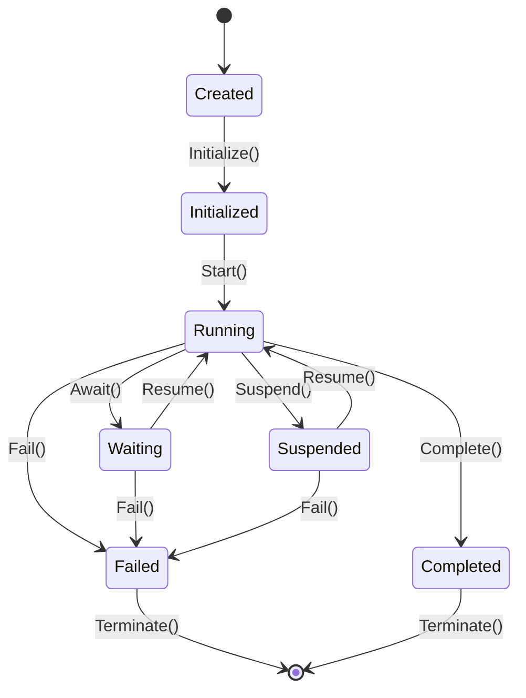
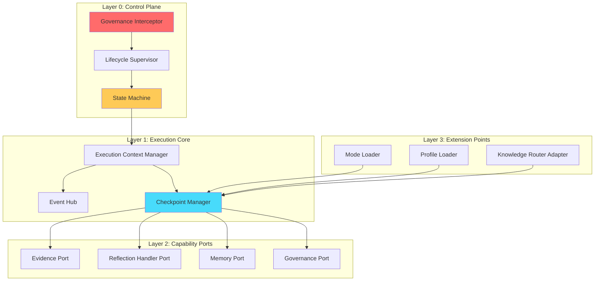
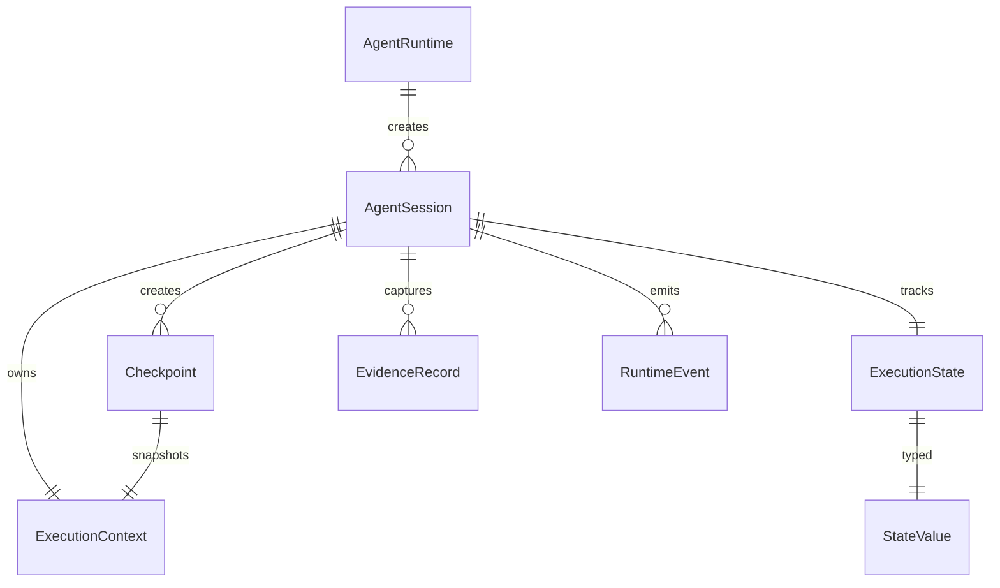
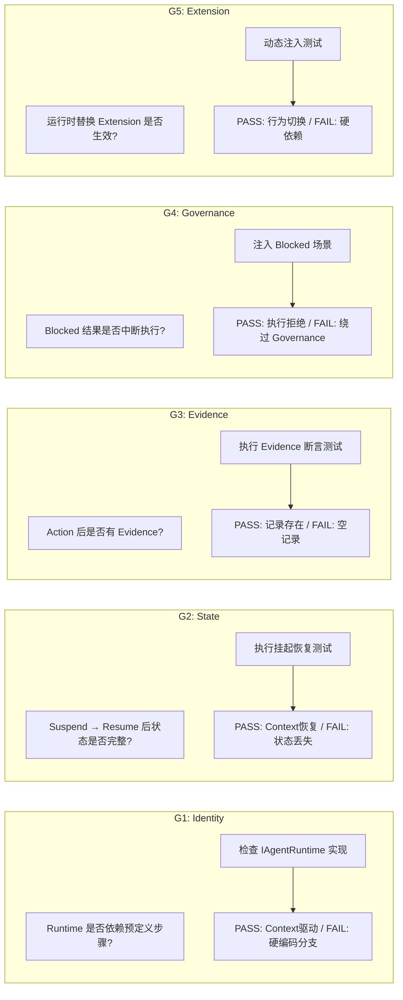
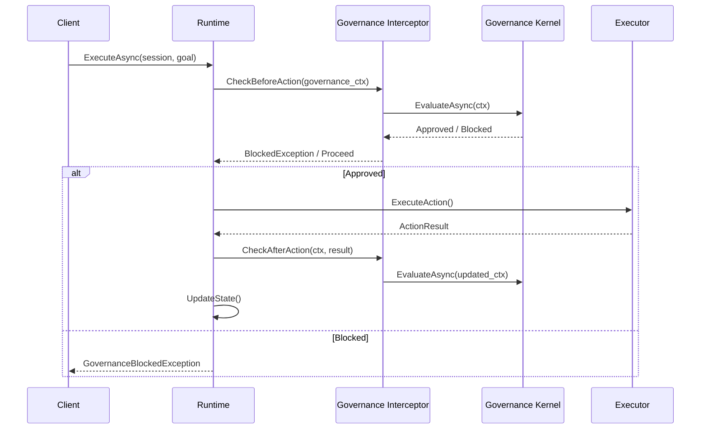

# Section 8 Runtime Architecture Design Plan

> **For agentic workers:** REQUIRED SUB-SKILL: Use `superpowers:subagent-driven-development` (recommended) or `superpowers:executing-plans` to implement this plan step-by-step. Steps use checkbox (`- [ ]`) syntax for tracking.

**Goal**: 制定 UEEA Agent Runtime 内核架构设计规格，明确 Runtime 与 Workflow Engine 的本质区别，定义 Phase 1 MVP Scope，建立不可退化运行内核。

**Architecture**: 以 State Machine First 为设计起点，采用 Layered Architecture + Governance Interceptor Pattern，确保 Runtime 是 Agent 的执行底座而非业务插件。设计分 P0 Architecture → P1 Design Pattern → P2 Interface Contract → P3 DTO/Signature → P4 Implementation Preparation 五阶段。

**Tech Stack**: 架构设计文档（Markdown + Mermaid）；后续实现技术待 P3 冻结后确定。

---

## 一、设计目标（Objective）

### 1.1 核心问题

> 为什么 Agent Runtime 不是 Workflow Engine？

**Workflow Engine 特征**：
- 预定义步骤序列
- 固定执行路径
- 无状态或会话状态
- 工具调用即业务逻辑

**Agent Runtime 特征**：
- 动态目标导向
- 状态驱动的执行
- 长期任务可恢复
- 证据驱动的决策
- Governance 约束内嵌

### 1.2 Section 8 设计目标

1. 建立 Enterprise Agent Runtime 的不可退化内核
2. 定义 Runtime Identity Boundary（什么属于 Runtime，什么不属于）
3. 明确 Agent Loop 的 Runtime 承载能力边界
4. 设计 Phase 1 MVP 的 Scope/Non-Scope
5. 通过 Runtime Architecture Gate-01（5 项证明）

### 1.3 与后续 Section 的依赖关系

```
Section 8 (Runtime Architecture)
    ├── Section 9 (Mode System): Runtime 提供 Mode 注入点
    ├── Section 10 (Profile System): Runtime 提供 Profile 加载接口
    ├── Section 11 (Knowledge System): Runtime 提供 Knowledge Router 集成点
    └── Section 12 (Validation & Evidence): Runtime 提供 Evidence Capture 基础设施
```

---

## 二、设计原则（Design Principles）

| 原则 | 含义 |
|------|------|
| **Runtime First** | Runtime 是执行底座，不承载业务逻辑 |
| **State First** | 状态机是设计起点，而非功能堆砌 |
| **Evidence First** | 关键行为必须可追踪、可回溯 |
| **Governance First** | Governance 是 Runtime 控制面，非业务插件 |
| **Extension First** | Mode/Profile/Knowledge 必须可插拔 |

---

## 三、架构工作分解（Architecture Work Breakdown）

### Phase P0: Architecture（架构层）

#### Task P0-1: Runtime Identity Boundary 定义

**Files:**
- Create: `docs/superpowers/specs/2026-08-30-Section8-Runtime-Architecture-Spec.md`（新建）

**Goal**: 明确什么属于 Runtime Core，什么不属于。

**Content:**
- Runtime Core 拥有：execution lifecycle / state transition / context propagation / event emission / checkpoint / recovery / governance interception
- Runtime 不拥有：reasoning strategy / domain knowledge / prompt engineering / business workflow / specific tools / model selection

- [ ] **Step 1: 创建 Section 8 架构规格文档框架**

```markdown
# Section 8: Agent Runtime Architecture Specification

## 0. Objective

## 1. Runtime Identity Boundary
### 1.1 What Runtime Owns
### 1.2 What Runtime Does NOT Own

## 2. Agent Loop Definition
### 2.1 Loop Architecture
### 2.2 Phase 1 Loop Scope

## 3. State Machine Model
### 3.1 State Definition
### 3.2 State Transition Matrix

## 4. Runtime Layer Architecture
### 4.1 Layer Diagram
### 4.2 Component Responsibilities

## 5. Core Object Model

## 6. Lifecycle Model

## 7. Persistence Boundary

## 8. Governance Integration

## 9. Extension Boundary

## 10. Phase 1 Scope / Non-Scope

## 11. Anti-Pattern List

## 12. Runtime Architecture Gate-01

## 13. Dependency Map
```

- [ ] **Step 2: 撰写 §1 Runtime Identity Boundary**

明确 10 项 Runtime 核心职责 + 6 项非 Runtime 职责。

- [ ] **Step 3: 自审 §1 — 检查是否有歧义**

检查点：
- "governance interception" 是否足够清晰（不是"业务调用 governance"，而是"interceptor 自动拦截"）
- "context propagation" 是否与 Memory 混淆
- Runtime 不拥有的 6 项是否与 Phase Boundary Rule 一致

---

#### Task P0-2: Agent Loop Definition

**Files:**
- Modify: `docs/superpowers/specs/2026-08-30-Section8-Runtime-Architecture-Spec.md`（§2）

**Goal**: 定义 Agent Loop 的 Runtime 承载能力边界，区分 Phase 1 实现范围。

**Content:**

Agent Loop Runtime 承载能力：

```
Observe (Runtime 提供 Context)
        ↓
Evaluate (Runtime 提供 Evidence Collection Hook)
        ↓
Decide (LLM/Reasoning，非 Runtime 负责)
        ↓
Act (Runtime 提供 Action Execution Framework)
        ↓
Capture Evidence (Runtime 提供 IEvidenceCapture)
        ↓
Reflect (Runtime 提供 IReflectionHandler Hook)
        ↓
Update State (Runtime 状态机驱动)
        ↓
Continue / Complete (Runtime Lifecycle 控制)
```

Phase 1 Loop 范围：
- Runtime 提供所有 Hook 接口（Observe/Evaluate/Act/Capture/Reflect/Update）
- LLM/Reasoning/Strategy 由后续 Phase 实现
- Runtime 必须能承载完整 Loop，不依赖预定义步骤

- [ ] **Step 1: 撰写 §2 Agent Loop Definition**

绘制 Mermaid 流程图 + 说明。

- [ ] **Step 2: 自审 §2 — 对照 IRON-14**

检查：Loop 中每个能力是否有对应接口定义？是否禁止了 Fake Loop（预定义步骤）？

---

#### Task P0-3: State Machine First 设计

**Files:**
- Modify: `docs/superpowers/specs/2026-08-30-Section8-Runtime-Architecture-Spec.md`（§3）

**Goal**: 以状态机为设计起点，回答：什么状态存在？谁触发转换？需要什么证据？能否恢复？

**Content:**

Runtime 状态定义：

```
Created      → Initialized → Running → Waiting → Completed
    ↓            ↓           ↓         ↓           ↓
 Failed       Failed      Failed   Failed      (terminal)
    ↓
 Suspended   → Resumed → Running
```

详细状态：

| State | 含义 | 可恢复 | 需要 Evidence |
|-------|------|:------:|-------------|
| Created | 实例创建，未初始化 | — | N |
| Initialized | 上下文加载完成 | N | Y |
| Running | 正在执行 | N | Y |
| Waiting | 等待外部响应（Human/IO） | Y | Y |
| Suspended | 检查点暂停 | Y | Y |
| Completed | 正常结束 | — | Y |
| Failed | 异常终止 | Y | Y |

状态转换矩阵（Mermaid state diagram）：



- [ ] **Step 1: 撰写 §3 State Machine Model**

包含状态定义表 + Mermaid 状态图 + 转换矩阵。

- [ ] **Step 2: 自审 §3 — 对照 MVP Definition Law**

检查：是否覆盖了所有必要状态？Suspended/Resumed 是否为 MVP 必须保留？

---

### Phase P1: Design Pattern（设计模式层）

#### Task P1-1: Runtime Layer Architecture

**Files:**
- Modify: `docs/superpowers/specs/2026-08-30-Section8-Runtime-Architecture-Spec.md`（§4）

**Goal**: 定义 Runtime 内部层次结构，每个组件职责清晰。

**Content:**

Runtime Layer 架构：



各层职责：

| Layer | Component | Responsibility |
|-------|-----------|----------------|
| L0: Control Plane | Governance Interceptor | 每次 Action 前后拦截，强制 Governance Check |
| L0: Control Plane | Lifecycle Supervisor | 管理 Session 生命周期，驱动状态转换 |
| L0: Control Plane | State Machine | 维护 Execution State，驱动转换规则 |
| L1: Execution Core | Execution Context Manager | 管理 AgentContext 生命周期 |
| L1: Execution Core | Event Hub | 统一事件发布订阅 |
| L1: Execution Core | Checkpoint Manager | 持久化点管理，支持 Resume |
| L2: Capability Ports | Evidence Port | Evidence 捕获接口 |
| L2: Capability Ports | Reflection Handler Port | Reflection Hook 接口 |
| L2: Capability Ports | Memory Port | Memory 访问接口 |
| L2: Capability Ports | Governance Port | Governance 访问接口 |
| L3: Extension Points | Mode/Profile/Knowledge Loader | 可插拔扩展点 |

- [ ] **Step 1: 撰写 §4 Runtime Layer Architecture**

包含 Mermaid 分层架构图 + 各层职责表。

- [ ] **Step 2: 自审 §4 — 对照 IRON-13**

检查：Governance Interceptor 是否在 Control Plane（L0）而非业务层？是否满足"每轮关键决策必须经过 Governance Check"？

---

#### Task P1-2: Core Object Model 定义

**Files:**
- Modify: `docs/superpowers/specs/2026-08-30-Section8-Runtime-Architecture-Spec.md`（§5）

**Goal**: 定义核心对象及其关系，为接口契约提供基础。

**Content:**

核心对象：

```csharp
// Agent Runtime 顶层入口
public interface IAgentRuntime
{
    AgentSession CreateSession(AgentContext context);
    Task<ExecutionResult> ExecuteAsync(AgentSession session, Goal goal, CancellationToken ct);
    Task<ExecutionResult> ResumeAsync(AgentSession session, CheckpointId checkpointId);
    void Suspend(AgentSession session);
    void Terminate(AgentSession session);
}

// Session = 一次 Agent 执行的生命周期容器
public interface IAgentSession
{
    SessionId Id { get; }
    AgentRuntime Owner { get; }
    ExecutionContext Context { get; }
    ExecutionState State { get; }
    IEventHub Events { get; }
    ICheckpointManager Checkpoints { get; }
    IEvidenceStore Evidence { get; }
    IReflectionHandler Reflection { get; }
}

// Context = 执行上下文（用户意图/目标/当前状态快照）
public class ExecutionContext
{
    public AgentIdentity AgentId { get; set; }
    public ExecutionIdentity ExecutionId { get; set; }
    public UserIntent Intent { get; set; }
    public Goal CurrentGoal { get; set; }
    public Step CurrentStep { get; set; }
    public MemoryReference MemoryRef { get; set; }
    public EvidenceReference EvidenceRef { get; set; }
    public GovernanceStatus GovernanceStatus { get; set; }
}

// State = 执行状态（含状态值 + 时间戳 + 转换原因）
public class ExecutionState
{
    public StateValue Value { get; set; }  // Created/Initialized/Running/Waiting/Suspended/Completed/Failed
    public DateTime Timestamp { get; set; }
    public string TransitionReason { get; set; }
    public EvidenceId TriggeringEvidence { get; set; }
    public bool IsRecoverable { get; set; }
}

// Evidence = 可审计的行为记录
public interface IEvidenceRecord
{
    EvidenceId Id { get; }
    CorrelationId ExecutionId { get; }
    DateTime Timestamp { get; }
    string Source { get; set; }  // "Observe"/"Evaluate"/"Act"/"Reflect"
    string Decision { get; set; }
    object Result { get; set; }
}

// Checkpoint = 持久化快照点
public interface ICheckpoint
{
    CheckpointId Id { get; }
    SessionId SessionId { get; }
    ExecutionState State { get; }
    ExecutionContext Context { get; }
    DateTime CreatedAt { get; }
    string ResumeInstruction { get; set; }
}

// Runtime Event = 生命周期事件
public interface IRuntimeEvent
{
    string Type { get; }  // "StateChanged"/"CheckpointCreated"/"EvidenceCaptured"/"GovernanceInterception"
    SessionId SessionId { get; }
    DateTime Timestamp { get; }
    object Payload { get; }
}
```

对象关系图（Mermaid）：



- [ ] **Step 1: 撰写 §5 Core Object Model**

包含 C# 接口定义 + ER 图。

- [ ] **Step 2: 自审 §5 — 检查对象完整性**

检查：是否覆盖了 EvidenceId/CorrelationId/Timestamp/Source/Decision/Result 字段？Checkpoint 是否包含 ResumeInstruction？

---

### Phase P2: Interface Contract（接口契约层）

#### Task P2-1: Extension Boundary 定义

**Files:**
- Modify: `docs/superpowers/specs/2026-08-30-Section8-Runtime-Architecture-Spec.md`（§6, §9）

**Goal**: 明确 Mode/Profile/Knowledge 的插入点，确保 G5 Extension Preservation。

**Content:**

Extension Point 矩阵：

| Extension Point | Interface | Phase 1 状态 | 注入时机 |
|----------------|-----------|:------------:|---------|
| Mode Loader | `IModeLoader` | 必须存在，可空实现 | Session 创建时 |
| Profile Loader | `IProfileLoader` | 必须存在，可空实现 | Session 创建时 |
| Knowledge Router | `IKnowledgeRouterAdapter` | 必须存在，可空实现 | Runtime 启动时 |
| Evidence Processor | `IEvidenceProcessor` | 必须存在，可空实现 | Action 执行后 |
| Governance Adapter | `IGovernanceAdapter` | **必须存在，非空** | 每次 Action 前后 |

**禁止的空实现场景**：

```csharp
// ❌ 错误：Governance Adapter 空实现 = 绕过 Governance
public class NullGovernanceAdapter : IGovernanceAdapter
{
    public Task<GovernanceResult> CheckAsync(GovernanceContext ctx) =>
        Task.FromResult(GovernanceResult.Approved);  // 永远批准 = 绕过
}
```

```csharp
// ✅ 正确：必须实际执行 Governance Check
public class GovernanceAdapter : IGovernanceAdapter
{
    private readonly IGovernanceKernel _kernel;
    public async Task<GovernanceResult> CheckAsync(GovernanceContext ctx)
    {
        var result = await _kernel.EvaluateAsync(ctx);
        if (result.IsBlocked)
            throw new GovernanceBlockedException(result.Reason);
        return result;
    }
}
```

Extension 注册契约：

```csharp
public class RuntimeOptions
{
    public IModeLoader ModeLoader { get; set; }
    public IProfileLoader ProfileLoader { get; set; }
    public IKnowledgeRouterAdapter KnowledgeRouter { get; set; }
    public IGovernanceAdapter Governance { get; set; }  // Required，非空
}

public interface IGovernanceAdapter
{
    Task<GovernanceResult> CheckBeforeActionAsync(GovernanceContext ctx);
    Task<GovernanceResult> CheckAfterActionAsync(GovernanceContext ctx);
    Task<GovernanceResult> CheckOnStateTransitionAsync(StateTransition transition);
}
```

- [ ] **Step 1: 撰写 §9 Extension Boundary**

包含 Extension Point 矩阵 + 接口定义 + 禁止的空实现案例。

- [ ] **Step 2: 自审 §9 — 对照 G5**

检查：Governance Adapter 是否明确标注"Required，非空"？其他 Adapter 是否允许 Phase 1 空实现但接口存在？

---

#### Task P2-2: Anti-Pattern List

**Files:**
- Modify: `docs/superpowers/specs/2026-08-30-Section8-Runtime-Architecture-Spec.md`（§11）

**Goal**: 明确禁止的实现模式，防止 Runtime 退化。

**Content:**

禁止模式清单：

```csharp
// 禁止 1: Prompt Chain Agent
// ❌ agent.Run() { foreach(step in predefined_steps) LLM.Call(step); }
// ✅ 动态 Goal → Plan → Action（Runtime 必须能承载）

// 禁止 2: 固定流程 Controller
// ❌ class AgentController { Run() { Step1(); Step2(); Step3(); } }
// ✅ IAgentRuntime + State Machine + Hook 机制

// 禁止 3: 无状态执行
// ❌ agent.Execute(request) { return LLM.Call(request); }
// ✅ ExecutionContext + Session + Checkpoint

// 禁止 4: 工具脚本集合
// ❌ agent { tools: [code_search, file_read, ...] LLM.ChooseTool(); }
// ✅ Action Execution Framework + Evidence Capture + Reflection Hook

// 禁止 5: Governance 作为业务插件
// ❌ business_code.Call(governance.Check());
// ✅ Governance Interceptor 在 Control Plane，自动拦截

// 禁止 6: LoadRules() + agent.Run() 分离
// ❌ var kernel = LoadRules(); agent.Run();  // Governance 启动时加载一次
// ✅ Governance Interceptor 每轮 Action 前后自动拦截
```

- [ ] **Step 1: 撰写 §11 Anti-Pattern List**

包含 6 类禁止模式 + 代码示例 + 正确实现对比。

---

### Phase P3: DTO / Signature（签名层）

#### Task P3-1: Phase 1 Scope / Non-Scope 定义

**Files:**
- Modify: `docs/superpowers/specs/2026-08-30-Section8-Runtime-Architecture-Spec.md`（§10）

**Goal**: 冻结 Phase 1 实现范围，防止范围蔓延。

**Content:**

Phase 1 MVP Scope：

| 组件 | 实现要求 | 来源 |
|------|---------|------|
| AgentRuntime 接口 | 必须完整定义 + 实现 | §5 |
| AgentSession 管理 | Create/Execute/Resume/Suspend/Terminate | §5 |
| ExecutionContext | 全部字段（AgentId/ExecutionId/Intent/Goal/Step/MemoryRef/EvidenceRef/GovernanceStatus） | §5 |
| ExecutionState | 8 个状态 + 转换矩阵 + Evidence 触发 | §3 |
| Checkpoint Manager | Create/Load/Delete，持久化到本地存储 | §7 |
| Evidence Store | Capture/Query/Export，结构化记录 | §5 |
| Governance Interceptor | CheckBeforeAction + CheckAfterAction + CheckOnStateTransition | §8 |
| Reflection Handler Hook | BeforeAction/AfterAction/OnFailure 接口 | §2 |
| Event Hub | 发布订阅机制（StateChanged/CheckpointCreated/EvidenceCaptured） | §4 |
| Mode/Profile/Knowledge Loader | 接口存在 + 最小实现（可空） | §9 |

Phase 1 Non-Scope：

| 组件 | 原因 |
|------|------|
| Planner 实现 | Phase 2（Intelligence） |
| Reasoning Engine | Phase 2 |
| Domain Analyzer | Phase 2 |
| Code Intelligence Engine | Phase 2 |
| LLM 调用封装 | Phase 2/3 |
| 远程持久化（数据库） | Phase 2（本地文件即可） |
| 多 Agent 协作 | Phase 3+ |
| 动态模型选择 | Phase 3+ |

- [ ] **Step 1: 撰写 §10 Phase 1 Scope / Non-Scope**

包含 Scope 表 + Non-Scope 表 + 来源引用。

- [ ] **Step 2: 自审 §10 — 对照 Phase Boundary Rule**

检查：Phase 1 是否仅做 Runtime 框架？是否禁止了 Intelligence 实现？

---

### Phase P4: Implementation Preparation（实现准备层）

#### Task P4-1: Runtime Architecture Gate-01 设计

**Files:**
- Modify: `docs/superpowers/specs/2026-08-30-Section8-Runtime-Architecture-Spec.md`（§12）

**Goal**: 设计 Runtime Architecture Gate-01 的具体验证方法。

**Content:**

Runtime Architecture Gate-01（5 项证明）：

| Gate | 证明方法 | 验证标准 |
|------|---------|---------|
| **G1: Agent Identity Preservation** | 检查 IAgentRuntime 实现中是否存在 `switch(intent)` 或 `if (step == N)` 硬编码分支 | Runtime 行为由 Context + Hook 驱动，非预定义步骤 |
| **G2: State Preservation** | 执行 Suspend → Terminate → Resume 序列，检查 ExecutionContext + ExecutionState 是否完整恢复 | Checkpoint 包含所有必要字段，Resume 后从暂停点继续 |
| **G3: Evidence Preservation** | 执行任意 Action 后，检查 IEvidenceStore 是否包含对应的 EvidenceRecord（含 EvidenceId/CorrelationId/Decision/Result） | Evidence 不可为空，每条记录可追溯到具体 Action |
| **G4: Governance Enforcement** | 尝试调用 IGovernanceAdapter.CheckBeforeAction 并返回 Blocked，验证 Execution 是否被中断 | Governance 拦截后 Runtime 必须拒绝执行，不可绕过 |
| **G5: Extension Preservation** | 运行时动态替换 IModeLoader，检查 Mode 是否切换生效 | Mode/Profile/Knowledge Loader 支持运行时替换 |

Gate-01 验证矩阵：



- [ ] **Step 1: 撰写 §12 Runtime Architecture Gate-01**

包含 5 项证明 + 验证矩阵 + 判定标准。

---

#### Task P4-2: Persistence Boundary 定义

**Files:**
- Modify: `docs/superpowers/specs/2026-08-30-Section8-Runtime-Architecture-Spec.md`（§7）

**Goal**: 明确哪些数据必须持久化，防止"Agent 跑完了但无法解释"。

**Content:**

Persistence Boundary 矩阵：

| 数据类型 | 必须持久化 | 持久化时机 | 存储介质（Phase 1） | 说明 |
|---------|:---------:|---------|-------------------|------|
| AgentSession | ✅ | Session 创建时 | 本地 JSON 文件 | 包含 SessionId + Owner + CreationTime |
| ExecutionState | ✅ | 每次状态转换 | 内嵌 Session | 包含 StateValue + Timestamp + TransitionReason |
| ExecutionContext | ✅ | 每次状态转换 | 内嵌 Session | 完整上下文快照 |
| Checkpoint | ✅ | Suspend/手动 | 本地文件 | 可恢复执行点 |
| EvidenceRecord | ✅ | 每次 Action 后 | 本地文件 | 关键行为可追溯 |
| RuntimeEvent | ✅ | 每次事件 | 本地文件（可选） | Debug/审计用 |
| Temporary Context | ❌ | — | 内存 | 仅 Session 生命周期内有效 |
| LLM Response Cache | ❌ | — | — | Phase 2+ 可选 |
| Working Memory | ❌ | — | 内存 | 循环内瞬态 |

关键原则：

```csharp
// ✅ 正确：Evidence 必须持久化
public async Task<ActionResult> ExecuteActionAsync(IAgentSession session, Action action)
{
    var evidence = new EvidenceRecord
    {
        Id = EvidenceId.New(),
        ExecutionId = session.Id,
        Timestamp = DateTime.UtcNow,
        Source = "Act",
        Decision = action.Type,
        Result = default
    };

    await session.Evidence.CaptureAsync(evidence);  // 持久化到 EvidenceStore
    var result = await action.ExecuteAsync();
    evidence.Result = result;
    await session.Evidence.UpdateAsync(evidence);   // 更新结果

    return result;
}

// ❌ 错误：Evidence 仅内存
public async Task<ActionResult> ExecuteActionAsync(IAgentSession session, Action action)
{
    var evidence = new { action.Type, DateTime.UtcNow };  // 匿名对象，不持久化
    var result = await action.ExecuteAsync();
    return result;  // Evidence 丢失
}
```

- [ ] **Step 1: 撰写 §7 Persistence Boundary**

包含持久化矩阵 + 关键代码示例。

- [ ] **Step 2: 自审 §7 — 检查完整性**

检查：Evidence/Checkpoint/Session/State 是否全部标记必须持久化？是否符合企业级 Audit 要求？

---

#### Task P4-3: Governance Integration 设计

**Files:**
- Modify: `docs/superpowers/specs/2026-08-30-Section8-Runtime-Architecture-Spec.md`（§8）

**Goal**: 明确 Governance 是 Runtime 控制面，非业务插件。

**Content:**

 Governance Integration 架构：



关键约束：

1. **Governance Interceptor 不可绕过**：每次 Action 前后必须调用
2. **Governance Exception 必须中断执行**：BlockedResult → 抛出异常，不继续
3. **Governance 是 Runtime 控制面**：不依赖业务代码主动调用

```csharp
// ✅ 正确：Runtime 自动拦截
public class GovernanceInterceptor
{
    private readonly IGovernanceAdapter _adapter;

    public async Task<Result> InterceptAsync(GovernanceContext ctx, Func<Task<Result>> action)
    {
        var beforeResult = await _adapter.CheckBeforeActionAsync(ctx);
        if (beforeResult.IsBlocked)
            throw new GovernanceBlockedException(beforeResult.Reason);

        var result = await action();

        var afterResult = await _adapter.CheckAfterActionAsync(ctx with { Result = result });
        if (afterResult.IsBlocked)
            throw new GovernanceBlockedException(afterResult.Reason);

        return result;
    }
}
```

- [ ] **Step 1: 撰写 §8 Governance Integration**

包含时序图 + 拦截器实现示例。

- [ ] **Step 2: 自审 §8 — 对照 IRON-13**

检查：是否明确 Governance 是 Runtime 控制面？是否禁止业务代码主动调用？

---

## 四、Review Gates（审查门控）

| Gate | 触发时机 | 判定标准 |
|------|---------|---------|
| **Design Freeze Gate** | P0-P3 完成后 | 所有章节完整，无 TBD，核心对象模型稳定 |
| **Contract Freeze Gate** | P3 完成后 | 所有接口签名冻结，Extension Point 确定 |
| **Runtime Architecture Gate-01** | P4 完成后 | 5 项证明全部通过 |
| **Implementation Entry Gate** | Gate-01 通过后 | 允许进入 Phase 1 实现 |

---

## 五、Risk Register（风险登记表）

| 风险 | 概率 | 影响 | 防御措施 |
|------|:----:|:----:|---------|
| Runtime 退化 Workflow | 中 | 高 | IRON-01~14 + Anti-Pattern List |
| MVP 删除核心能力（State/Evidence/Reflection/DAG/Resume） | 高 | 高 | Phase 1 Scope/Non-Scope 冻结 + Gate-01 G2/G3 |
| Interface 过早锁死 | 低 | 高 | Extension Boundary 预留 + G5 Extension Preservation |
| Governance 后置（变成业务插件） | 中 | 高 | §8 Governance Integration + IRON-13 |
| State Machine 过度简化 | 中 | 中 | §3 State Machine First + State 8 态定义 |
| Persistence 遗漏（Evidence/Checkpoint 丢失） | 低 | 高 | §7 Persistence Boundary + G3 Evidence Preservation |
| Extension Point 硬依赖（无法动态替换） | 中 | 中 | Extension Boundary 定义 + G5 |

---

## 六、自审清单

完成设计后，执行以下自审：

- [ ] **Spec coverage**: 每个 Section（§1-§12）都有对应 Task 完成
- [ ] **Placeholder scan**: 无 TBD/TODO/模糊描述
- [ ] **Type consistency**: 所有接口字段名在各 Task 间一致
- [ ] **IRON-13 验证**: Governance 是 Runtime 控制面，非业务插件
- [ ] **IRON-14 验证**: 每个能力有真实行为，非 Fake 实现
- [ ] **Phase Boundary Rule**: Phase 1 仅 Runtime 框架，无 Intelligence
- [ ] **MVP Definition Law**: Scope 包含完整闭环，非最小功能
- [ ] **Memory Boundary**: Working/Session/Project/Knowledge 四层区别明确
- [ ] **Gate-01 可验证**: 5 项证明方法具体可操作

---

## 七、设计文档输出

| 文档 | 路径 | 状态 |
|------|------|:----:|
| Section 8 Runtime Architecture Specification | `docs/superpowers/specs/2026-08-30-Section8-Runtime-Architecture-Spec.md` | 待创建 |

---

**Plan 完成时间**：约 3-4 个 ADF 循环（每个循环包含设计→自审→修订）

**执行方式建议**：Subagent-Driven（每个 Task 派发独立子 Agent）

---

> **下一步动作**：保存本计划 → 提交首席架构师审批 → 审批通过后执行 P0-1 开始设计
