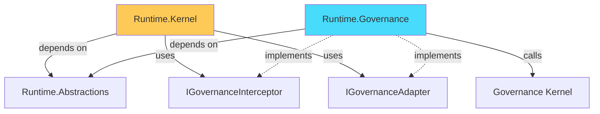

# Section 8 Phase A — Design Patch v0.1

> **本文件性质**：Phase A 启动报告的修订补丁（Design Patch），针对 Chief Architect 评审反馈。
>
> **修订触发**：Chief Architect Phase A Start Report Conditional Approval（3 项修订 + D9 + Gate-A6）
>
> **生效日期**：2026-08-30 · **当前状态**：修订完成，待 Chief Architect 批准后进入 Phase A Coding
>
> **下一次提交**：批准后直接进入 Phase A Coding（无需重新完整评审）

---

## 0. 修订清单概览

| # | 修订项 | 类型 | 来源 |
|---|--------|------|------|
| **Revision-01** | State/Lifecycle 语义保留 | 状态语义修订 | Chief Architect |
| **Revision-02** | LifecycleSupervisor 命名 | 命名 + 职责修订 | Chief Architect |
| **Revision-03** | Governance 独立模块 | 模块边界修订 | Chief Architect |
| **D9** | Runtime Event First Principle | LOCKED Decision 新增 | Chief Architect |
| **Gate-A6** | Event Ordering Integrity | 验证门控新增 | Chief Architect |

---

## 1. Revision-01：State Machine 语义保留

### 1.1 修订前（Phase A Start Report 描述）

> Phase A 实现 6 态，不含 Waiting/Resumed，Phase B 引入

### 1.2 修订后

**内部状态机简化**（实现层）：

```csharp
public enum RuntimeState
{
    Created,
    Initialized,
    Running,
    Suspended,
    Completed,
    Failed
}
```

**允许**：内部 enum 仅 6 态（不含 Waiting/Resumed）。

**不允许**：简化为以下转换路径（缺少 Resume 证据节点）：

```text
❌ Suspended → Running（直接转换，无证据）
✅ Suspended → ResumeRequested(Event) → Running
```

**关键约束（修订后）**：

| 约束 | 描述 |
|------|------|
| **状态可简化** | 内部 enum 可省略 Waiting/Resumed（Phase B 再加） |
| **Event 不可简化** | Lifecycle Event 必须保留完整序列 |
| **Resume 必须有证据节点** | Suspended → Running 转换前必须生成 `ResumeRequested` + `ResumeCompleted` Event |

### 1.3 Lifecycle Event 序列（完整）

Phase A 必须保留以下 Event 序列：

| Event | 触发时机 | 必须发布 |
|-------|---------|:---------:|
| **RuntimeStarted** | Runtime 启动 | ✅ |
| **SessionCreated** | Session 创建 | ✅ |
| **Initialized** | Init 完成 | ✅ |
| **Started** | Start 完成 | ✅ |
| **StateChanged** | 任意状态转换 | ✅ |
| **SuspendRequested** | Suspend 前置 | ✅ |
| **SuspendCompleted** | Suspend 后置 | ✅ |
| **ResumeRequested** | Resume 前置（关键证据节点） | ✅ |
| **ResumeCompleted** | Resume 后置（关键证据节点） | ✅ |
| **CompleteRequested** | Complete 前置 | ✅ |
| **CompleteCompleted** | Complete 后置 | ✅ |
| **FailRequested** | Fail 前置 | ✅ |
| **FailCompleted** | Fail 后置 | ✅ |
| **CheckpointCreated** | Checkpoint 创建 | ✅ |
| **SessionCompleted** | Session 终止（成功）| ✅ |
| **SessionFailed** | Session 终止（失败）| ✅ |

**修订说明**：原 Phase A 仅 8 种 Event，修订后增加至 **16 种 Event**，重点保留 **ResumeRequested** 与 **ResumeCompleted** 作为 Resume 路径的关键证据节点。

### 1.4 Suspend → Resume 完整序列（修订后）

```
Running State
   │
   ▼
[Trigger.Suspend()]
   │
   ▼
Event: SuspendRequested（前置证据）
   │
   ▼
Generate Checkpoint（Phase D 持久化）
   │
   ▼
State Change: Running → Suspended
   │
   ▼
Event: SuspendCompleted（后置证据）
   │
   ▼
[SUSPENDED 状态保留]
   │
   ▼
[Trigger.Resume()]
   │
   ▼
Event: ResumeRequested（关键证据节点）  ⭐ 修订重点
   │
   ▼
Load Checkpoint
   │
   ▼
State Change: Suspended → Running
   │
   ▼
Event: ResumeCompleted（关键证据节点）  ⭐ 修订重点
```

**关键**：即使内部 enum 仅 6 态，Event 序列必须体现 Resume 路径的两步证据（Requested + Completed）。

---

## 2. Revision-02：LifecycleSupervisor → RuntimeLifecycleController

### 2.1 修订前

```csharp
public interface ILifecycleSupervisor
{
    Task<LifecycleTransitionResult> RequestTransitionAsync(...);
}
```

### 2.2 修订后

```csharp
public interface IRuntimeLifecycleController
{
    Task<LifecycleTransitionResult> RequestTransitionAsync(
        SessionId sessionId,
        LifecycleTrigger trigger,
        CancellationToken ct);
}
```

**类名同步修订**：

| 修订前 | 修订后 |
|-------|-------|
| `LifecycleSupervisor` | `RuntimeLifecycleController` |
| `ILifecycleSupervisor` | `IRuntimeLifecycleController` |

### 2.3 职责明确（修订后）

RuntimeLifecycleController **只负责 4 件事**：

```
Validate Transition
       ↓
Invoke Governance
       ↓
Commit State Change
       ↓
Publish Event
```

**禁止**：

```
❌ Decide Next Action（不可决定下一步行为）
❌ Execute Action（不可执行 Action）
❌ Modify Evidence（不可直接修改 Evidence）
❌ Bypass Governance（不可绕过 Governance Interceptor）
```

**理由**：避免演化路径：

```
Supervisor → Workflow Coordinator
```

违反 IRON-01（Agent Runtime ≠ Workflow Engine）。

### 2.4 RuntimeLifecycleController 与其他组件关系

```
┌─────────────────────────────────┐
│   RuntimeLifecycleController    │
│   (Validate → Govern → Commit → Publish) │
└─────────────────────────────────┘
           │
           ├─→ IStateMachineDriver（纯逻辑转换）
           ├─→ IGovernanceInterceptor（每次转换前）
           ├─→ ISessionStore（更新状态）
           └─→ IEventHub（发布 Event）
```

**重要**：Controller 不直接操作 ExecutionState，而是通过 ISessionStore 提交。这避免 State Mutation Authority 泄漏给 Controller 之外。

---

## 3. Revision-03：Governance 独立模块

### 3.1 修订前（项目结构）

```
Runtime.Kernel/
└── GovernanceInterceptor.cs    ❌ 位置错误
```

### 3.2 修订后（项目结构）

```
backend/modules/mod-runtime/
├── Runtime.Abstractions/                    # Interface 层
│   └── Governance/
│       ├── IGovernanceAdapter.cs
│       └── IGovernanceInterceptor.cs
│
├── Runtime.Kernel/                         # Kernel 实现
│   ├── Kernel/
│   │   ├── RuntimeKernel.cs
│   │   ├── RuntimeLifecycleController.cs   # 调用 IGovernanceInterceptor
│   │   └── StateMachineDriver.cs
│   └── (无 GovernanceInterceptor.cs)        # 移除
│
└── Runtime.Governance/                     # NEW: Governance 独立模块
    ├── GovernanceInterceptor.cs
    ├── DefaultGovernanceAdapter.cs
    └── Runtime.Governance.csproj
```

### 3.3 依赖方向（修订后）

```
正确方向：

Runtime.Kernel
    |
    v
IGovernancePort (Abstractions)
    |
    v
Runtime.Governance
    |
    v
IGovernanceAdapter (Abstractions)
    |
    v
Governance Kernel（外部实现）
```

**禁止方向**：

```
❌ Runtime.Governance → Runtime.Kernel 内部类型
❌ Kernel → Governance Kernel 直接调用（必须经 Port）
```

### 3.4 依赖关系图



### 3.5 项目文件清单（修订后）

| Project | 文件 | 职责 |
|---------|------|------|
| **Runtime.Abstractions/Governance/** | `IGovernanceInterceptor.cs` | Kernel 调用契约 |
| **Runtime.Abstractions/Governance/** | `IGovernanceAdapter.cs` | Governance Kernel 适配契约 |
| **Runtime.Kernel/Kernel/** | `RuntimeLifecycleController.cs` | 调用 `IGovernanceInterceptor` |
| **Runtime.Governance/** | `GovernanceInterceptor.cs` | Interceptor 实现 |
| **Runtime.Governance/** | `DefaultGovernanceAdapter.cs` | Phase A 默认 Governance 适配器 |

---

## 4. D9：Runtime Event First Principle（新增 LOCKED Decision）

### 4.1 LOCKED Decision D9

> **Runtime Event First Principle**：Runtime 生命周期变化必须先产生 Runtime Event，再允许后续扩展消费。

### 4.2 正确流程

```
State Change
    ↓
Runtime Event（先产生）
    ↓
Extension Listener（后续消费）
```

### 4.3 错误流程（禁止）

```
State Change
    ↓
Extension（直接消费）
    ↓
Event（最后生成）
```

### 4.4 原因

- **Evidence**：每个状态变化必须有 Evidence
- **Audit**：可追溯的链路必须基于 Event 顺序
- **Replay**：回放必须能重建 Event 序列

### 4.5 实现要求

| 要求 | 描述 |
|------|------|
| Event 必须在 State Change **之前**产生 | Event 是 State Change 的"前置通知" |
| Event 必须包含 StateChange 前/后状态 | `previousState` + `currentState` |
| Event 必须有全局递增 sequence | 用于排序 |
| Event 必须有 timestamp | 用于时序 |
| Extension 只能 Listener Event | 不能直接订阅 State Change |

### 4.6 RuntimeEvent 字段扩展（修订后）

```csharp
public abstract record RuntimeEvent
{
    public EventId Id { get; init; }
    public SessionId SessionId { get; init; }
    public DateTime Timestamp { get; init; }
    public long Sequence { get; init; }     // ⭐ 新增：全局递增

    // StateChanged Event 额外字段
    public RuntimeState? PreviousState { get; init; }  // ⭐ 新增
    public RuntimeState? CurrentState { get; init; }   // ⭐ 新增

    public abstract string Type { get; }
}
```

**Event Sequence 来源**：
- 由 EventHub 内部维护
- 每个 Session 独立 sequence（避免全局锁）
- 严格递增，不可跳跃

---

## 5. Gate-A6：Event Ordering Integrity（新增验证）

### 5.1 Gate-A6 验证内容

| 检查项 | 判定标准 |
|-------|---------|
| StateChanged Event 是否包含 `previousState` | **是** |
| StateChanged Event 是否包含 `currentState` | **是** |
| StateChanged Event 是否包含 `timestamp` | **是** |
| StateChanged Event 是否包含 `sequence` | **是** |
| Event 顺序是否严格递增 | **是** |
| Event 与 State Change 时序是否正确 | Event **先于** State Change |

### 5.2 Gate-A6 测试用例

```
Test: Event_StateChanged_HasPreviousAndCurrentState
验证：触发状态转换后 Event 包含 previousState + currentState

Test: Event_SequenceIsStrictlyIncreasing
验证：同一 Session 的 Event sequence 严格递增

Test: Event_IsPublishedBeforeStateChange
验证：Event 在 State Change 之前发布（即使只有 1 微秒）

Test: Event_ResumeRequested_AndResumeCompleted_BothPresent
验证：Suspend → Resume 路径上两个 Evidence Event 都存在
```

### 5.3 Gate-A 完整列表（修订后）

| Gate | 内容 | 验证方法 |
|------|------|---------|
| **A1** | Kernel 可创建 Agent Identity | xUnit Integration |
| **A2** | State Transition 仅经过 Kernel | 静态依赖扫描 |
| **A3** | Event 可记录生命周期变化 | xUnit Integration |
| **A4** | 无 Workflow 固化代码 | Anti-Pattern 静态扫描 |
| **A5** | 无 Intelligence 依赖 | 依赖分析 |
| **A6** ⭐ | Event Ordering Integrity | xUnit + 时序断言 |

---

## 6. 修订后项目结构（完整）

```
backend/modules/mod-runtime/
├── Runtime.Abstractions/                      # Interface 层（所有能力归属）
│   ├── Kernel/
│   │   ├── IRuntimeKernel.cs                  # 顶层入口
│   │   ├── IRuntimeLifecycleController.cs     # ⭐ 修订：原 LifecycleSupervisor
│   │   └── IStateMachineDriver.cs
│   ├── State/
│   │   ├── ISessionStore.cs
│   │   └── IStateStore.cs
│   ├── Evidence/
│   │   ├── IEvidenceStore.cs
│   │   └── IEvidenceCapture.cs
│   ├── Persistence/
│   │   └── IPersistenceAdapter.cs
│   ├── Governance/                            # ⭐ 修订：独立目录
│   │   ├── IGovernanceAdapter.cs
│   │   └── IGovernanceInterceptor.cs
│   └── Extension/
│       ├── IModeLoader.cs
│       ├── IProfileLoader.cs
│       ├── IKnowledgeRouterAdapter.cs
│       └── IExtensionHookRegistry.cs
│
├── Runtime.Kernel/                           # Kernel 实现
│   ├── Kernel/
│   │   ├── RuntimeKernel.cs
│   │   ├── RuntimeLifecycleController.cs     # ⭐ 修订：原 LifecycleSupervisor
│   │   └── StateMachineDriver.cs
│   ├── Identity/
│   │   ├── AgentId.cs
│   │   ├── SessionId.cs
│   │   └── RuntimeContext.cs
│   ├── Events/
│   │   ├── RuntimeEvent.cs                   # ⭐ 修订：增加 sequence + PreviousState + CurrentState
│   │   ├── EventTypes.cs                      # ⭐ 修订：16 种 Event
│   │   ├── IEventHub.cs
│   │   └── InMemoryEventHub.cs               # ⭐ 修订：维护 sequence
│   └── Runtime.Kernel.csproj
│
├── Runtime.Governance/                        # ⭐ NEW: Governance 独立模块
│   ├── GovernanceInterceptor.cs
│   ├── DefaultGovernanceAdapter.cs
│   └── Runtime.Governance.csproj
│
└── Runtime.Tests/                             # 测试 + Gate-A 验证
    ├── UnitTests/
    │   ├── Kernel/
    │   │   ├── RuntimeKernelTests.cs
    │   │   ├── RuntimeLifecycleControllerTests.cs  # ⭐ 修订
    │   │   └── StateMachineDriverTests.cs
    │   ├── Events/
    │   │   ├── EventHubTests.cs              # ⭐ 修订
    │   │   └── EventSequenceTests.cs         # ⭐ NEW
    │   └── Governance/
    │       └── GovernanceInterceptorTests.cs # ⭐ NEW
    ├── Gate-A-Verification/
    │   ├── A1_IdentityTests.cs
    │   ├── A2_StateTransitionTests.cs
    │   ├── A3_EventTests.cs
    │   ├── A4_AntiWorkflowTests.cs
    │   ├── A5_NoIntelligenceTests.cs
    │   └── A6_EventOrderingTests.cs          # ⭐ NEW
    └── Runtime.Tests.csproj
```

---

## 7. 修订后交付物清单

### 7.1 完整文件清单（Phase A）

| # | 类型 | 文件 | 状态 |
|---|------|------|:----:|
| 1 | Solution | `backend/modules/mod-runtime/mod-runtime.sln` | 创建 |
| 2 | Abstractions | `Runtime.Abstractions.csproj` | 创建 |
| 3 | Abstractions/Kernel | `IRuntimeKernel.cs` | 创建 |
| 4 | Abstractions/Kernel | `IRuntimeLifecycleController.cs` | ⭐ 修订 |
| 5 | Abstractions/Kernel | `IStateMachineDriver.cs` | 创建 |
| 6 | Abstractions/State | `ISessionStore.cs` | 创建 |
| 7 | Abstractions/State | `IStateStore.cs` | 创建 |
| 8 | Abstractions/Evidence | `IEvidenceStore.cs` | 创建 |
| 9 | Abstractions/Evidence | `IEvidenceCapture.cs` | 创建 |
| 10 | Abstractions/Persistence | `IPersistenceAdapter.cs` | 创建 |
| 11 | Abstractions/Governance | `IGovernanceAdapter.cs` | 创建 |
| 12 | Abstractions/Governance | `IGovernanceInterceptor.cs` | 创建 |
| 13 | Abstractions/Extension | `IModeLoader.cs` | 创建 |
| 14 | Abstractions/Profile | `IProfileLoader.cs` | 创建 |
| 15 | Abstractions/Knowledge | `IKnowledgeRouterAdapter.cs` | 创建 |
| 16 | Abstractions/Extension | `IExtensionHookRegistry.cs` | 创建 |
| 17 | Kernel | `Runtime.Kernel.csproj` | 创建 |
| 18 | Kernel/Identity | `AgentId.cs` | 创建 |
| 19 | Kernel/Identity | `SessionId.cs` | 创建 |
| 20 | Kernel/Identity | `RuntimeContext.cs` | 创建 |
| 21 | Kernel/Kernel | `RuntimeKernel.cs` | 创建 |
| 22 | Kernel/Kernel | `RuntimeLifecycleController.cs` | ⭐ 修订 |
| 23 | Kernel/Kernel | `StateMachineDriver.cs` | 创建 |
| 24 | Kernel/Events | `RuntimeEvent.cs` | ⭐ 修订 |
| 25 | Kernel/Events | `EventTypes.cs` | ⭐ 修订（16 种） |
| 26 | Kernel/Events | `IEventHub.cs` | 创建 |
| 27 | Kernel/Events | `InMemoryEventHub.cs` | ⭐ 修订 |
| 28 | Governance | `Runtime.Governance.csproj` | ⭐ NEW |
| 29 | Governance | `GovernanceInterceptor.cs` | ⭐ NEW |
| 30 | Governance | `DefaultGovernanceAdapter.cs` | ⭐ NEW |
| 31 | Tests | `Runtime.Tests.csproj` | 创建 |
| 32 | Tests/Unit | `RuntimeKernelTests.cs` | 创建 |
| 33 | Tests/Unit | `RuntimeLifecycleControllerTests.cs` | ⭐ 修订 |
| 34 | Tests/Unit | `StateMachineDriverTests.cs` | 创建 |
| 35 | Tests/Unit | `EventHubTests.cs` | ⭐ 修订 |
| 36 | Tests/Unit | `EventSequenceTests.cs` | ⭐ NEW |
| 37 | Tests/Unit | `GovernanceInterceptorTests.cs` | ⭐ NEW |
| 38 | Tests/Gate-A | `A1_IdentityTests.cs` | 创建 |
| 39 | Tests/Gate-A | `A2_StateTransitionTests.cs` | 创建 |
| 40 | Tests/Gate-A | `A3_EventTests.cs` | 创建 |
| 41 | Tests/Gate-A | `A4_AntiWorkflowTests.cs` | 创建 |
| 42 | Tests/Gate-A | `A5_NoIntelligenceTests.cs` | 创建 |
| 43 | Tests/Gate-A | `A6_EventOrderingTests.cs` | ⭐ NEW |

**总计**：43 个文件（修订前 36 个 → 修订后 43 个，新增 7 个）。

### 7.2 Phase A 代码量更新

| 类别 | 修订前 | 修订后 |
|------|------:|------:|
| Abstractions | 200 行 | 250 行 |
| Kernel 实现 | 400 行 | 450 行 |
| Event 实现 | 150 行 | 220 行 |
| Governance 独立模块 | 0 | 180 行 |
| Unit Tests | 600 行 | 700 行 |
| Gate-A Tests | 400 行 | 480 行 |
| **总计** | **1750 行** | **2280 行** |

---

## 8. 自审（修订后）

### 8.1 Constraint 自审（重新确认）

| Constraint | 修订后是否满足 |
|------------|:------------:|
| Constraint-01 No Code Before Contract | ✅ Abstractions 先于实现 |
| Constraint-02 Domain Neutrality | ✅ 无 LLM/Prompt/Tool 泄漏 |
| Constraint-03 Gate-01 Mapping | ✅ A1~A6 覆盖 G1~G5 子集 |
| Constraint-04 Extension Inversion | ✅ Extension 不调用 Controller |
| Constraint-05 Contract Minimality | ✅ Port 接口仅能力抽象 |
| Constraint-06 Anti-Workflow Detection | ✅ Gate-A4 静态扫描 |
| Constraint-07 MVP Completeness | ✅ Suspend/Resume 完整 + Event 序列保留 |
| Constraint-08 Persistence Neutrality | ✅ Phase A 不实现 Persistence |
| Constraint-09 Governance Authority | ✅ **⭐ 修订：Governance 独立模块** |
| Constraint-10 Implementation Order | ✅ Phase A 仅 Kernel + Governance |

### 8.2 LOCKED Decision 自审（重新确认）

| LOCKED | 修订后状态 |
|--------|:--------:|
| EXT-01 Extension 不拥有 State Authority | ✅ State 修改仅 RuntimeLifecycleController |
| EXT-02 Extension 不拥有 Evidence Authority | ⏳ Phase A 占位 |
| EXT-03 Extension 不拥有 Execution Authority | ✅ Extension 不能调用 Controller |
| **⭐ D9 Runtime Event First Principle** | ✅ **修订后新增** |

### 8.3 Gate-A 自审（修订后）

| Gate | 内容 | 修订后覆盖 |
|------|------|:--------:|
| A1 | Kernel 创建 Identity | ✅ |
| A2 | State Transition 仅经过 Kernel | ✅ |
| A3 | Event 记录生命周期 | ✅ |
| A4 | 无 Workflow 固化 | ✅ |
| A5 | 无 Intelligence 依赖 | ✅ |
| **A6 ⭐** | **Event Ordering Integrity** | ✅ **修订后新增** |

---

## 9. 修订执行顺序

Phase A Coding 必须按以下顺序执行：

```
1. 创建 Runtime.Abstractions（修订命名：LifecycleController / Governance 独立）
   ↓
2. 创建 Runtime.Kernel（Identity + Kernel + Events）
   ↓
3. 创建 Runtime.Governance（⭐ NEW 独立模块）
   ↓
4. 创建 Runtime.Tests（Unit + Gate-A 6 项）
   ↓
5. 跑全部测试 + Gate-A 验证
   ↓
6. 自审清单全绿
   ↓
7. 提交 Phase A 完成报告
```

---

## 10. 修订清单确认表

| # | 修订项 | 已修订 | 待 Chief Architect 确认 |
|---|--------|:-----:|:---------------------:|
| **Revision-01** | State/Lifecycle 语义保留（ResumeRequested + ResumeCompleted） | ✅ | ⏳ |
| **Revision-02** | LifecycleSupervisor → RuntimeLifecycleController | ✅ | ⏳ |
| **Revision-03** | Governance 独立模块 | ✅ | ⏳ |
| **D9** | Runtime Event First Principle | ✅ | ⏳ |
| **Gate-A6** | Event Ordering Integrity | ✅ | ⏳ |

---

> **下一步**：等待 Chief Architect 确认修订，批准后立即进入 Phase A Coding。