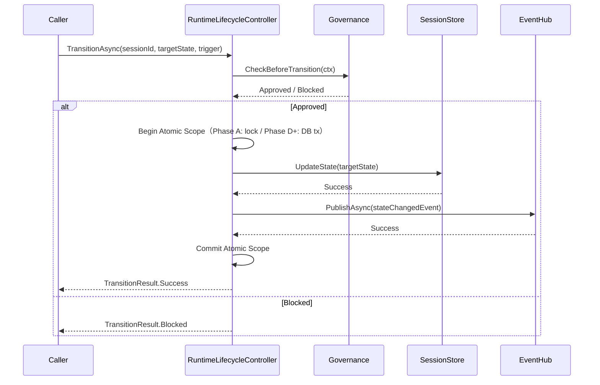

# Section 8 Phase A — Design Patch v0.2

> **本文件性质**：Phase A Design Patch v0.1 的增量修订（基于 Chief Architect Phase A Patch Review 反馈）
>
> **修订触发**：Chief Architect Phase A Patch v0.1 Review（追加 4 项：D9 微调 + ContinuationMarker + Rule-A01 + Rule-A02）
>
> **生效日期**：2026-08-30 · **当前状态**：Patch v0.2 完成 → Phase A Coding 启动准备
>
> **下一次提交**：Phase A Coding Round-1 Report（实施人员实际编码的首次汇报）

---

## 0. 修订清单（v0.1 → v0.2）

| # | 修订项 | 类型 | 来源 | 状态 |
|---|--------|------|------|:----:|
| **D9-Micro** | D9 时序语义微调（Atomic Commit） | LOCKED 微调 | Chief Architect | ✅ |
| **ContinuationMarker** | Resume Engine 占位能力 | 新增占位接口 | Chief Architect | ✅ |
| **Rule-A01** | Kernel First Commit Rule | 新增实施铁律 | Chief Architect | ✅ |
| **Rule-A02** | Event Immutability Rule | 新增实施铁律 | Chief Architect | ✅ |

---

## 1. D9 微调：Atomic State + Event Commit

### 1.1 原 v0.1 表述（错误）

```text
错误：Event 先于 State Change

State Change
    ↓
Runtime Event（先产生）
    ↓
Extension Listener

问题：短暂不一致窗口
Event: Running → Suspended
实际: Running（仍是 Running）
```

### 1.2 v0.2 最终冻结语义（正确）

```text
正确：Atomic State Commit + Event Commit

State Transition Intent
    ↓
Governance Approval
    ↓
Atomic State Commit + Event Commit（同一事务边界内）
    ↓
Extension Consume
```

### 1.3 关键差异

| 维度 | v0.1 | v0.2 |
|------|------|------|
| **Event 与 State 顺序** | Event 先于 State | **同时提交（Atomic）** |
| **事务边界** | 无明确 | **State + Event 在同一事务** |
| **不一致窗口** | 存在短暂窗口 | **零窗口** |
| **实现方式（Phase A）** | 顺序调用 | **In-memory atomic operation** |
| **实现方式（Persistence）** | 不适用 | **Transaction Boundary（Phase D+）** |

### 1.4 Phase A 实现要求

```csharp
// ❌ v0.1 错误实现（存在不一致窗口）
await eventHub.PublishAsync(newStateChangedEvent);  // 先发布 Event
await sessionStore.UpdateAsync(newState);             // 再更新 State（中间窗口不一致）

// ✅ v0.2 正确实现（Atomic Commit）
await runtimeController.TransitionToAsync(newState);  // 内部封装 Atomic Commit
//   └─ 内部实现：
//      1. Governance 验证
//      2. State 写入 SessionStore
//      3. Event 写入 EventHub（与 State 同一事务边界）
//      4. 提交事务（Phase A 用 lock；Phase D+ 用 DB Transaction）
```

### 1.5 RuntimeLifecycleController 的 Atomic Commit 流程



### 1.6 D9 v0.2 最终定义

> **LOCKED Decision D9（v0.2）**：Runtime 生命周期变化必须经过 `State Transition Intent → Governance Approval → Atomic State Commit + Event Commit` 流程。Event 与 State 必须在同一事务边界内提交，零不一致窗口。

---

## 2. ContinuationMarker 占位能力

### 2.1 问题背景

Phase A 不实现完整 Resume Engine，但必须保留 Resume 的证据节点能力。

Chief Architect 要求：

> Phase A 不要求实现完整 Resume Engine。但是必须保留：
> - `ResumeRequestedEvent`
> - `ResumeCompletedEvent`
> - `ContinuationMarker`（占位能力）

### 2.2 ContinuationMarker 定义

```csharp
// Runtime.Abstractions/Kernel/IContinuationMarker.cs

namespace JNPF.Runtime.Abstractions.Kernel;

/// <summary>
/// ContinuationMarker — Resume Engine 占位能力
///
/// Phase A 仅定义接口，不实现完整 Resume Engine。
/// Phase B+ 引入 ExecutionContext 后实现完整 Resume。
///
/// 用途：记录 Resume 时所需的最小上下文，使 Suspend → Resume 不会丢失位置信息。
/// </summary>
public interface IContinuationMarker
{
    /// <summary>
    /// 创建占位 Marker
    /// Phase A：返回包含 SessionId 的最小 Marker
    /// Phase B+：携带 PendingAction + ResumeInstruction + EvidenceCursor
    /// </summary>
    ContinuationMarker Create(SessionId sessionId, RuntimeState currentState);

    /// <summary>
    /// 从 Checkpoint 恢复 Marker
    /// Phase A：仅恢复 SessionId
    /// Phase B+：恢复完整 PendingAction + ResumeInstruction
    /// </summary>
    ContinuationMarker Restore(CheckpointId checkpointId);

    /// <summary>
    /// 获取 Marker 序列化的 Evidence
    /// </summary>
    ContinuationMarkerEvidence GetEvidence(ContinuationMarker marker);
}

public record ContinuationMarker(
    SessionId SessionId,
    RuntimeState CurrentState,
    DateTime CreatedAt,
    bool IsPlaceholder  // Phase A = true, Phase B+ = false
);

public record ContinuationMarkerEvidence(
    ContinuationMarkerId MarkerId,
    SessionId SessionId,
    DateTime Timestamp,
    string Description
);
```

### 2.3 Suspend → Resume 完整序列（v0.2 修订后）

```
Running State
   │
   ▼
[Trigger.Suspend()]
   │
   ▼
Event: SuspendRequested（前置证据）
   │
   ▼
ContinuationMarker.Create() ⭐ 新增占位
   │
   ▼
Generate Checkpoint（Phase D 持久化）
   │
   ▼
Atomic Commit: State(Suspended) + Event(SuspendCompleted) ⭐ v0.2 修正
   │
   ▼
[SUSPENDED 状态保留]
   │
   ▼
[Trigger.Resume()]
   │
   ▼
Event: ResumeRequested（关键证据节点）
   │
   ▼
ContinuationMarker.Restore(checkpointId) ⭐ 新增
   │
   ▼
Atomic Commit: State(Running) + Event(ResumeCompleted) ⭐ v0.2 修正
   │
   ▼
Extension Consume（基于 ResumeCompleted Event）
```

### 2.4 Phase A 简化策略

| 维度 | Phase A 行为 |
|------|------------|
| **IContinuationMarker 实现** | 仅返回 SessionId + RuntimeState |
| **PendingAction 字段** | 占位 null（Phase B+ 填充） |
| **ResumeInstruction 字段** | 占位空字符串（Phase B+ 填充） |
| **EvidenceCursor 字段** | 占位 null（Phase C+ 填充） |
| **ContinuationMarkerEvidence** | 仅记录 SessionId + Timestamp |

---

## 3. Rule-A01：Kernel First Commit Rule

### 3.1 LOCKED Rule A01

> **Kernel First Commit Rule**：所有 Runtime 状态变化必须经过 Kernel Commit Path（RuntimeLifecycleController.TransitionToAsync）。

### 3.2 禁止模式

```csharp
// ❌ 禁止：直接修改 ExecutionState
executionState.Value = RuntimeState.Running;
executionState.Status = RuntimeState.Running;

// ❌ 禁止：SessionStore 直接 Update 不经过 Controller
await sessionStore.UpdateStateAsync(sessionId, RuntimeState.Running);

// ❌ 禁止：绕过 RuntimeLifecycleController
session.State.TransitionTo(RuntimeState.Running);
```

### 3.3 强制模式

```csharp
// ✅ 强制：经过 RuntimeLifecycleController
await runtimeController.TransitionToAsync(
    sessionId,
    RuntimeState.Running,
    LifecycleTrigger.Start,
    ct
);

// ✅ 强制：Controller 内部封装 Atomic Commit
// 见 §1.5 流程图
```

### 3.4 Static Detection（Gate-A 增强）

```text
搜索关键词（命中即报警）：
- executionState.Value =
- executionState.Status =
- sessionStore.UpdateStateAsync
- session.State.TransitionTo

静态扫描位置：Runtime.Kernel + Runtime.State 程序集内
```

### 3.5 范围

| 程序集 | 是否受 Rule-A01 约束 |
|-------|:------------------:|
| Runtime.Abstractions | ✅（Interface 定义受约束） |
| Runtime.Kernel | ✅ |
| Runtime.Governance | ✅（不能直接修改 State） |
| Runtime.Persistence | ✅（必须经 Adapter Port） |
| Runtime.Extensions | ✅（EXT-01 强化） |

---

## 4. Rule-A02：Event Immutability Rule

### 4.1 LOCKED Rule A02

> **Event Immutability Rule**：Runtime Event 必须 immutable。发布后任何修改均属违规。

### 4.2 实现要求

```csharp
// ✅ 强制：使用 record（init-only properties）
public abstract record RuntimeEvent
{
    public EventId Id { get; init; }
    public SessionId SessionId { get; init; }
    public DateTime Timestamp { get; init; }
    public long Sequence { get; init; }
    public RuntimeState? PreviousState { get; init; }
    public RuntimeState? CurrentState { get; init; }
    public abstract string Type { get; }
}

// ✅ 子类 Event 同样使用 record
public record StateChangedEvent : RuntimeEvent
{
    public override string Type => "StateChanged";
}
```

### 4.3 禁止模式

```csharp
// ❌ 禁止：使用 mutable class
public class StateChangedEvent
{
    public RuntimeState CurrentState { get; set; }  // setter 存在 → 可变
}

// ❌ 禁止：Event 发布后修改
var evt = new StateChangedEvent(...);
await eventHub.PublishAsync(evt);
evt.CurrentState = RuntimeState.Completed;  // 违规！
```

### 4.4 Static Detection（Gate-A 增强）

```text
搜索模式（命中即报警）：
- class.*Event.*\bset\b  → 任何 Event 类含 setter
- .CurrentState\s*=\s*RuntimeState  → 直接赋值
- .PreviousState\s*=\s*RuntimeState  → 直接赋值

静态扫描位置：所有 Runtime.* 程序集
```

### 4.5 验证机制

| 机制 | 描述 |
|------|------|
| **编译时** | `init` accessor 阻止外部 setter |
| **运行时** | InMemoryEventHub 存储事件引用，禁止发布者修改 |
| **静态扫描** | Gate-A 工具扫描 class Event 含 setter 模式 |

---

## 5. Phase A 完整铁律清单（v0.2）

### 5.1 LOCKED Decision（含 v0.2 新增）

| 编号 | 决策 | 来源 |
|------|------|------|
| **D9** | Runtime Event First Principle | P2 |
| **D9-Micro** ⭐ | Atomic State + Event Commit | v0.2 微调 |
| **EXT-01** | Extension 不拥有 State Authority | P2 |
| **EXT-02** | Extension 不拥有 Evidence Authority | P2 |
| **EXT-03** | Extension 不拥有 Execution Authority | P2 |

### 5.2 LOCKED Rule（v0.2 新增）

| 编号 | 规则 | 性质 |
|------|------|------|
| **Rule-A01** ⭐ | Kernel First Commit Rule | 实施铁律 |
| **Rule-A02** ⭐ | Event Immutability Rule | 实施铁律 |

### 5.3 Phase A Gate-A 完整列表（v0.2）

| Gate | 内容 | v0.2 增强 |
|------|------|---------|
| **A1** | Kernel 创建 Agent Identity | — |
| **A2** | State Transition 仅经过 Kernel | + Rule-A01 检测 |
| **A3** | Event 记录生命周期 | + Rule-A02 检测 |
| **A4** | 无 Workflow 固化代码 | — |
| **A5** | 无 Intelligence 依赖 | — |
| **A6** | Event Ordering Integrity | + Atomic Commit 检测 |

---

## 6. v0.2 修订后项目结构（新增 ContinuationMarker）

```
backend/modules/mod-runtime/
├── Runtime.Abstractions/                      # Interface 层（所有能力归属）
│   ├── Kernel/
│   │   ├── IRuntimeKernel.cs
│   │   ├── IRuntimeLifecycleController.cs     # Rule-A01 约束
│   │   ├── IStateMachineDriver.cs
│   │   └── IContinuationMarker.cs             # ⭐ v0.2 NEW：Resume 占位
│   ├── State/
│   │   ├── ISessionStore.cs                   # Rule-A01 约束（仅 Controller 调用）
│   │   └── IStateStore.cs
│   ├── Events/
│   │   └── RuntimeEvent.cs                    # Rule-A02 约束（immutable record）
│   └── ...
│
├── Runtime.Kernel/
│   ├── Kernel/
│   │   ├── RuntimeKernel.cs
│   │   ├── RuntimeLifecycleController.cs     # Atomic Commit 入口
│   │   ├── StateMachineDriver.cs
│   │   └── ContinuationMarker.cs             # ⭐ v0.2 NEW
│   └── ...
│
└── Runtime.Tests/
    ├── UnitTests/
    │   ├── Kernel/
    │   │   ├── RuntimeLifecycleControllerTests.cs
    │   │   └── ContinuationMarkerTests.cs    # ⭐ v0.2 NEW
    │   └── Events/
    │       └── EventImmutabilityTests.cs     # ⭐ v0.2 NEW
    └── Gate-A-Verification/
        ├── A1_IdentityTests.cs
        ├── A2_StateTransitionTests.cs        # + Rule-A01 检测
        ├── A3_EventTests.cs
        ├── A4_AntiWorkflowTests.cs
        ├── A5_NoIntelligenceTests.cs
        └── A6_EventOrderingTests.cs
```

### 6.1 文件清单（v0.2 增量）

| # | 文件 | 状态 |
|---|------|:----:|
| 44 | `Runtime.Abstractions/Kernel/IContinuationMarker.cs` | ⭐ NEW |
| 45 | `Runtime.Kernel/Kernel/ContinuationMarker.cs` | ⭐ NEW |
| 46 | `Runtime.Tests/UnitTests/Kernel/ContinuationMarkerTests.cs` | ⭐ NEW |
| 47 | `Runtime.Tests/UnitTests/Events/EventImmutabilityTests.cs` | ⭐ NEW |

修订后总计：**47 个文件**（v0.1 → v0.2 新增 4 个）

---

## 7. 自审（v0.2）

### 7.1 Constraint 自审

| Constraint | v0.2 状态 |
|------------|:--------:|
| Constraint-01 No Code Before Contract | ✅ |
| Constraint-02 Domain Neutrality | ✅ |
| Constraint-03 Gate-01 Mapping | ✅ |
| Constraint-04 Extension Inversion | ✅ |
| Constraint-05 Contract Minimality | ✅ |
| Constraint-06 Anti-Workflow Detection | ✅ + Rule-A01/A02 |
| Constraint-07 MVP Completeness | ✅ + ContinuationMarker |
| Constraint-08 Persistence Neutrality | ✅ |
| Constraint-09 Governance Authority | ✅ |
| Constraint-10 Implementation Order | ✅ |

### 7.2 Iron Law 自审

| Iron Law | v0.2 状态 |
|---------|:--------:|
| IRON-01（禁止降级为流程引擎） | ✅ Rule-A01 强化 |
| IRON-07（Evidence 必须影响行为） | ✅ Atomic Commit 保证 |
| IRON-14（Capability 必须行为真实） | ✅ ContinuationMarker 真实占位 |

### 7.3 LOCKED 全量清单

| 类别 | 数量 | 编号 |
|------|:----:|------|
| LOCKED Decision | 5 | EXT-01/02/03 + D9 + D9-Micro |
| LOCKED Rule | 2 | Rule-A01 + Rule-A02 |
| Constraint | 10 | Constraint-01~10 |
| Gate-A | 6 | A1~A6 |

---

## 8. Phase A Coding 准备（v0.2 完成后）

### 8.1 Coding 执行顺序

```
1. 创建 mod-runtime.sln + 4 Project（Abstractions + Kernel + Governance + Tests）
   ↓
2. 创建 Runtime.Abstractions（18 文件，含 IContinuationMarker）
   ↓
3. 创建 Runtime.Kernel（11 文件，含 ContinuationMarker）
   ↓
4. 创建 Runtime.Governance（3 文件）
   ↓
5. 创建 Runtime.Tests（14 文件，含 Rule-A01/A02 测试）
   ↓
6. 跑全部 Unit Tests + Gate-A 6 项
   ↓
7. 提交 Phase A Coding Round-1 Report
```

### 8.2 Coding 必读（Implementation Entry Rule v0.2）

实施人员必读：

1. Section 8 v1.0 FROZEN（§1+§5+§8+§9+§12）
2. Section 8 Implementation Proposal（D1~D8 已批准）
3. Phase A Start Report + Phase A Design Patch v0.1 + **Phase A Design Patch v0.2**（本文件）
4. Runtime Constraints Registry（Constraint-01~10）
5. Runtime Anti-Pattern List（AP-01~06）
6. **⭐ Rule-A01 + Rule-A02**（v0.2 新增）
7. **⭐ ContinuationMarker 占位策略**（v0.2 新增）

---

## 9. v0.2 修订验收

| 修订项 | v0.2 落实状态 |
|-------|:------------:|
| D9 微调（Atomic Commit） | ✅ §1 完整定义 + Mermaid 时序图 |
| ContinuationMarker 占位 | ✅ §2 Interface 定义 + Phase A 简化策略 |
| Rule-A01 Kernel First Commit | ✅ §3 强制模式 + Static Detection |
| Rule-A02 Event Immutability | ✅ §4 record 强制 + Static Detection |

**v0.2 ✅ 完成，可进入 Phase A Coding**

---

> **下一步**：直接进入 Phase A Coding，无需再次请求审批。提交 **Phase A Coding Round-1 Report**。