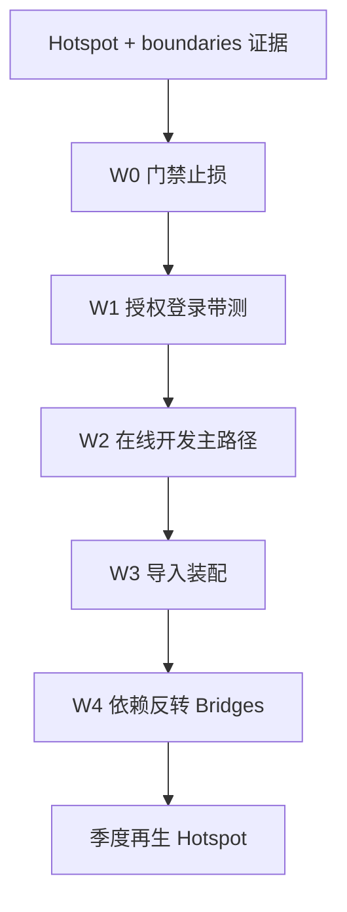

# 后端质量迭代修复与优化 — 设计规格

> **类型**：后端专项设计（**唯一施工设计源**）  
> **日期**：2026-08-06  
> **状态**：W0–W1 通过 · W2 在线开发主路径已交验（部分 extract）→ 待「通过」后开 W3  
> **分级**：S（门禁）+ A（热点带测拆分）  
> **证据**：[`design-quality-hotspot-top20.md`](../../architecture/v52/design-quality-hotspot-top20.md) · [`design-quality-baseline-gates.md`](../../architecture/v52/design-quality-baseline-gates.md) · Codebase-Memory `jnpf-v52` · [`.claude/evidence/backend-quality-check/`](../../../.claude/evidence/backend-quality-check/)（`checks-1-2-4-report.md`）  
> **方法手册**：[`design-quality-diagnostics.md`](../../architecture/v52/design-quality-diagnostics.md)  
> **编写规范**：[`ARCHITECTURE_DOC_RULES.md`](../../architecture/ARCHITECTURE_DOC_RULES.md)  
> **配套施工包**：[`../plans/2026-08-06-backend-quality-remediation-plan.md`](../plans/2026-08-06-backend-quality-remediation-plan.md)  
> **前端专册**（独立）：[`2026-08-06-frontend-quality-remediation-design.md`](2026-08-06-frontend-quality-remediation-design.md)

---

## 1. 背景与目标

### 1.0 问题陈述

后端全量扫描：**96.9% 方法健康（CC&lt;10），41 个重症（CC≥30，认知最高 834）撑起可维护性风险**——「局部重症 + 结构性耦合」，不是全面烂仓。

| 纳入 | 排除 |
|------|------|
| ComplexityAnalyzer + 基线；NetArchTest ARCH-01；授权簇/低代码主路径先测后拆；`IInteAssistantBridge` 渐进反转 | 重写既有 Analyzers 行为红线；改数据权限算法语义；改 VisualDev API 契约；重写 framework 核心（DI/SqlSugar/JWT） |

### 1.0.1 工具与波次口径（以本文为准）

| 议题 | **采纳** |
|------|----------|
| 架构测试库 | **NetArchTest** · 已建 `JNPF.Tests.Architecture`（不另建 ArchUnit 项目） |
| 复杂度存量豁免 | **`complexity-baseline.json`**（只增不减规则） |
| 波次命名 | **W0–W4 + R**（见 §7） |
| 双向调用 | 图边约 1427（801+626）作调用图证据；编译期引用另见 csproj 盘点（3 hits） |

### 1.1 当前状态（实测 · 2026-08-06 晚 1-2-4 检查）

| # | 项 | 结论 | 证据 |
|---|----|------|------|
| **1** | 架构 ARCH-01 | **框架 `JNPF` → InteAssistant*：PASS**；**`JNPF.Common.Core`：INVENTORY FAIL（预期）**，失败类型样本 `JNPF.EventHandler.IntegreateEventSubscriber`（1） | NetArchTest 3/3；`arch01-*.json` |
| **1′** | ProjectReference | 非 InteAssistant 工程含 InteAssistant 引用字样 **3** 处：`JNPF.API.Entry` · `JNPF.Common.Core` · `JNPF.Message.Interfaces` | `arch01-project-references.json` |
| **2** | 复杂度盘点 | CC>29 = **41**；20–29 = **29**；10–19 = **171**；&lt;10 = **7441**（Method 总数 **7682**）；最高 `ImportDataAssemble` CC=**138** / 认知=**834** | Codebase-Memory；`check02-complexity-inventory.json` |
| **2′** | 复杂度硬门 | **已落地** `JNPF009` + `complexity-baseline.json`（Roslyn 扫描灌入；`CI_BUILD=true` 启用） | `backend/tools/JNPF.Analyzers/` |
| **4** | 安全扫描 | Security Code Scan **1** 条：`SCS0006` 弱哈希 @ `ElemeAuthRequest.cs:256`（MD5） | `security-scan.sarif` |
| — | 调用图（辅） | `framework ↔ inteAssistant` 双向约 **1427**（801+626）；其中 `inteAssistant → framework` ≈626（图关系，≠ csproj 引用） | Codebase-Memory boundaries |
| — | 测试缺口 | 重症 **0/41** 针对性 xUnit；Hotspot Top20 均为否 | hotspot-top20 |
| — | 健康占比 | CC&lt;10 = **7441/7682（96.9%）** | Codebase-Memory |

**验收命令（已跑）：**

```powershell
dotnet test D:\JNPF-v52\backend\tests\JNPF.Tests.Architecture --nologo
# → 已通过! 失败:0，通过:3
security-scan D:\JNPF-v52\backend\zx_lowcode_netcore.sln --export=.claude/evidence/backend-quality-check/security-scan.sarif --excl-proj="**/tests/**;**/tools/**;*Test*" --ignore-msbuild-errors
```

### 1.2 期望状态

1. 新方法不可无约束贡献 CC≥30（增量门禁 + 存量基线；基线种子即上表 41 重症）。  
2. framework 保持无 InteAssistant 编译期引用；**Common.Core / Message.Interfaces 经 Contracts 清零后** ARCH-01 改硬失败。  
3. 按波次：授权/登录 → 在线开发主路径 → 导入装配，先表征测试再最小重构。  
4. SCS0006：评估迁强哈希或记兼容豁免（不阻塞 W0 复杂度/分层门禁）。  
5. 遵守多租户、SQL 参数化、Oops、禁手写 Controller、受保护方法先 CR、实现完整性铁律。

### 1.3 非目标

- 一次全仓 Sonar 清零  
- 无测拆分上帝方法  
- 前端五柜/Vue 工程整改（见前端专册）  
- 用文案顶替业务功能（四支柱①）  
- 本轮不强制上 SonarQube / NDepend / CodeQL（安全以 Security Code Scan 盘点为准）

---

## 2. 工作流



**图 2-1 后端整改波次**

---

## 3. 方案对比与推荐

### 3.1 复杂度止损

| 方案 | 结论 |
|------|------|
| **A. Roslyn Analyzer + complexity-baseline.json** | **采纳** |
| B. 全仓一次红 | 拒绝 |
| C. 仅手册 | 拒绝作默认 |

**failure_boundary**：基线只增不减 → 季度强制消减 score Top10。

### 3.2 分层止损

| 方案 | 结论 |
|------|------|
| **A. NetArchTest ARCH-01** | **采纳**；统计 → Contracts → error；**清单项目已建并跑通** |
| B. 仅 hook 扫 using | 辅 |

**盘点落地状态（2026-08-06）：**

| 规则对象 | 结果 | 下一动作 |
|----------|------|----------|
| `typeof(JNPF.App).Assembly` | PASS | 保持 error |
| `JNPF.Common.Core` | FAIL（清单） | 抽 Contracts 前维持 inventory，不阻断 CI |
| csproj 字面引用 | 3 hits（含 API.Entry 宿主属正常） | 优先拆 Common.Core / Message.Interfaces |

**failure_boundary**：永久豁免类型必须进 CR 名单。

### 3.3 热点拆分

```text
score = 业务核心度(1..5) × commits × max(认知复杂度, 1)
```

禁止无针对性测试下拆 CC≥30；禁止改断言凑绿；受保护 Skill/Gate 先 CR。

### 3.4 安全盘点（检查项 4）

| 方案 | 结论 |
|------|------|
| **A. Security Code Scan（`security-scan` CLI）** | **已跑全解**；当前 1 warning，不升阻断 |
| B. CodeQL / Sonar 安全规则 | 条件启用；本轮非必须 |

**SCS0006 评估（2026-08-06 · 不阻塞 W0/W1）：**  
命中 `ElemeAuthRequest` 第三方 OAuth 签名兼容路径（MD5）。**结论：本迭代记兼容豁免**——第三方协议要求弱哈希时不得单方面改 SHA-256，以免破坏对接；后续若饿了么侧支持强哈希再迁。PR 新增同类 SCS 高危仍须说明。

**failure_boundary**：新增 SCS 高危（注入/反序列化等）未评估即合入 → 须在 PR 说明或豁免清单。

---

## 4. 架构边界与禁改

| 层 | 禁止（目标态） |
|----|----------------|
| `framework/JNPF*` | 引用 `JNPF.InteAssistant*` |
| 任意模块 | 绕过租户过滤；动态 SQL 未参数化；手写 Controller |
| inteAssistant | 无三元组写 IR；无 CR 改 Orchestrator/Gates/PmSkill 等 |

**数据锚定（整改触及权限/登录时）**：**BASE_USER** 及授权相关表（经 `UserManager` / OAuth 路径）。

### 4.1 目标拓扑与依赖反转

```text
application (JNPF.API.Entry)          ← 组合根注册桥实现
modularity/inteAssistant              ← 实现 IInteAssistantBridge
modularity/system · visualdev · ...
framework/JNPF + modularity/common    ← 只依赖抽象，不 using InteAssistant
```

**failure_boundary**：接口按能力域聚合，初版仅抽 framework→inteAssistant **Top10 高频**；不一次清 626 图边。先切断编译期 `using`/ProjectReference，其余经事件/回调渐进。

---

## 5. 模式（P2）

| 模式 | 用途 |
|------|------|
| Baseline + Incremental Gate | Roslyn 存量基线、增量变严 |
| Characterization Test | 拆分前钉行为 |
| Extract Method + 决策表 | W1 授权簇（见 §5.1） |
| Strangler | 两处 `ImportDataAssemble` 收口 |
| Dependency Inversion | W4：`IInteAssistantBridge` → ARCH-01 硬失败 |

### 5.1 UserManager 授权簇拆解（W1）

| 方法 | CC | 认知 | 目标 |
|------|---:|-----:|------|
| `GetConditionAsync` | 45 | 279 | 编排 CC&lt;8；拆后簇内 CC&lt;15 |
| `GetDataConditionAsync` | 45 | 279 | 同上（抽共享） |
| `GetCondition` | 37 | 193 | 同上 |
| `GetCodeGenAuthorizeModuleResource` | 38 | 209 | extract |

职责拆分（待源码核对 bt 后落地）：

```text
GetConditionAsync → BuildAdminShortCircuit / ResolveDataScope /
                    AggregateRolePermissions / ComposeSqlSugarConditions
```

ItemType if/switch → `IConditionStrategy` 决策表（§6.2）。

**不变量**：相同 `(userId, moduleId, roles)` → `List<IConditionalModel>` 等价；`ToSql()` WHERE **逐字符相同**；**先 5 场景 xUnit 绿再拆**。

---

## 6. 验收契约（P3）

```powershell
cd D:\JNPF-v52\backend
dotnet build /p:CI_BUILD=true
# W0 后：
dotnet test --filter FullyQualifiedName~Architecture
dotnet test tools/JNPF.Analyzers/JNPF.Analyzers.Tests -v n

node D:\JNPF-v52\scripts\jnpf-api.mjs GET /api/oauth/CurrentUser
cd D:\JNPF-v52; $env:E2E_PIPELINE_ID=311; pnpm test:api
```

| 波次 | 用户操作 | 业务产物 |
|------|----------|----------|
| W1 | 登录 + 打开受权限列表 | 数据范围正确 |
| W2 | 在线开发列表/保存 | 与改前一致 |
| W3 | 导入预览/导入 | 字段正确入库 |
| W4 | （无 UI）图/测试证明无 framework→InteAssistant 编译依赖 | ARCH-01 Common.Core 亦可硬失败或仅剩豁免名单 |

### 6.1 `IInteAssistantBridge`（签名级 · W4 · 禁止方法体）

```csharp
// 精确命名空间实施时据现有 Bridges 目录核对
namespace JNPF.Bridges;

public interface IInteAssistantBridge
{
    // 仅声明 framework→inteAssistant 调用 Top10；签名在 W4 据图确定
    // Task<...> ...Async(...);
}
```

### 6.2 `IConditionStrategy`（签名级 · W1）

```csharp
namespace JNPF.Common.Core.Manager.User.Conditions; // 实施时对齐现有命名空间

public interface IConditionStrategy
{
    string ItemType { get; }
    IConditionalModel Build(AuthorizeEntity entity, string primaryKey);
}
```

### 6.3 测试契约（W1）

- 5 场景：管理员全权限 / 全数据 / 本部门 / 本部门及下级 / 仅本人  
- 拆解前后 `ToSql()` WHERE 快照等价  
- 路径建议：`backend/tests/.../UserManagerDataPermissionTests.cs`

---

## 7. 波次定义

| 波次 | 目标 | 入口（证据） | 盘点进度 |
|------|------|----------------|----------|
| **W0** | Analyzer + ARCH-01→CI；安全归档 | baseline-gates · `backend-quality-check/` | Analyzer **已有**；Architecture **已入 solution**；SARIF 已有 |
| **W1** | 授权簇先测后拆（目标 CC&lt;15） | UserManager 四方法 + Login | **已交验**（短路+策略+8 测；CodeGen/GetCondition 续消减） |
| **W2** | 在线开发主路径 | `FuncToMenu` / `GetListQuerySql` / `GetListResult` / `SaveDataToDataByFId` / `BatchDelHaveTableData` / `GetKeyData` | **已交验**（发布组装/短链过滤/字段别名；保存/批删续） |
| **W3** | 导入装配 | 两处 `ImportDataAssemble`（解析→校验→映射→写入） | 未开 |
| **W4** | Bridges 反转 + ARCH-01 收紧 | TopN 桥（查集成+入队）· Common.Core 硬失败 | **已通过** |
| **R** | 季度再生 / Task6 | hotspot + baseline 审计 + 门禁文档 | **已通过** |
| **R** | Hotspot 再生 · 文档 · `pnpm test:api` | CM 复扫 | — |

每波次：**表征测试绿 + 行为证据 + 用户「通过」**。W2/W3 拆解后目标 CC&lt;20（导入主方法可分阶段降至 &lt;30 再继续绞杀）。

### 7.1 风险与缓解

| 风险 | 缓解 |
|------|------|
| 拆 UserManager 破坏数据隔离 | ToSql 等价 + 5 场景；不过不合并 |
| 依赖反转范围过大 | Top10 分 PR；先编译期引用 |
| CC&gt;30 阻塞存量构建 | baseline.json 豁免 41，仅拦新增/升高 |
| 架构测试拖慢单测 | 独立 `JNPF.Tests.Architecture`，可按 filter 跑 |

---

## 8. 关键代码路径索引

- `backend/modularity/common/JNPF.Common.Core/Manager/User/UserManager.cs`
- `backend/modularity/oauth/JNPF.OAuth/OAuthService.cs`
- `backend/modularity/visualdev/JNPF.VisualDev/RunService.cs`
- `backend/modularity/visualdev/JNPF.VisualDev/VisualDevService.cs`（`FuncToMenu`）
- `backend/modularity/visualdev/JNPF.VisualDev/VisualDevModelDataService.cs`
- `backend/modularity/engine/JNPF.VisualDev.Engine/Core/FormDataParsing.cs`（`GetKeyData`）
- `backend/modularity/common/JNPF.Common.CodeGen/ExportImport/ExportImportDataHelper.cs`
- `backend/modularity/inteAssistant/JNPF.InteAssistant/AIDevelopmentPipelineService.cs`
- `backend/tools/JNPF.Analyzers/`
- **已建**：`backend/tests/JNPF.Tests.Architecture/`（`LayeringTests.cs` · NetArchTest 1.3.2）
- 安全命中：`backend/infrastructure/JNPF.Extras.CollectiveOAuth/Request/AuthRequests/ElemeAuthRequest.cs`
- 拟建（W4）：`IInteAssistantBridge` + 组合根注册

---

## 9. 本节核心表清单

- **BASE_USER**（登录/用户）  
- 授权相关表（经 `UserManager` 数据权限；具体表随 W1 任务列出）  
- 在线开发业务表（经 `RunService`；随 W2 功能点列出）  
