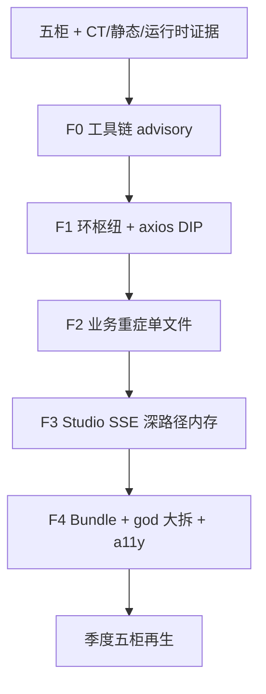

# 前端质量迭代修复与优化 — 设计规格

> **类型**：前端专项设计（**唯一施工设计源**；`jnpf-web-vue3` 主；大屏/移动复用方法不合并工程）  
> **日期**：2026-08-06  
> **状态**：Draft → 待「继续」开 F0  
> **分级**：A（环枢纽/重症拆分）+ B（工具链 advisory / a11y 存量）  
> **证据**：[`design-quality-frontend-cabinets.md`](../../architecture/v52/design-quality-frontend-cabinets.md) · [`design-quality-frontend-tooling-adr.md`](../../architecture/v52/design-quality-frontend-tooling-adr.md) · [`design-quality-frontend-ct-report.md`](../../architecture/v52/design-quality-frontend-ct-report.md) · [`design-quality-frontend-static-deep.md`](../../architecture/v52/design-quality-frontend-static-deep.md) · [`design-quality-frontend-runtime.md`](../../architecture/v52/design-quality-frontend-runtime.md) · [`.claude/evidence/frontend-ct/`](../../../.claude/evidence/frontend-ct/)（`cabinets-full-run-summary.json`）  
> **编写规范**：[`ARCHITECTURE_DOC_RULES.md`](../../architecture/ARCHITECTURE_DOC_RULES.md)  
> **配套施工包**：[`../plans/2026-08-06-frontend-quality-remediation-plan.md`](../plans/2026-08-06-frontend-quality-remediation-plan.md)  
> **后端专册**（独立）：[`2026-08-06-backend-quality-remediation-design.md`](2026-08-06-backend-quality-remediation-design.md)

---

## 1. 背景与目标

### 1.0 问题陈述

前端九维度/五柜扫描显示：**多数组件体量与 LCP 健康**，但存在四类**结构性**问题——基础设施环互咬、Bundle 巨块、死代码/假阳混杂、a11y 系统性缺失。治一处可活一片，按依赖顺序推进。

| 纳入 | 排除 |
|------|------|
| 五柜 advisory；环枢纽（含 axios↔store 反转）；单文件先测后拆；登录态 fuite/R6；高置信死目录复核后删；vendor 分包；全页面 a11y 三处 | 盲删 Knip 全量；三端合成一工程；无测大拆 AiChatPanel；全量 WCAG AA；Windi→Tailwind；Vite 大版本升级 |

### 1.0.1 口径统一（以本文为准）

| 议题 | 备选说法 | **采纳** |
|------|----------|----------|
| 波次命名 | F1–F5（清死代码→断环→Bundle/god→a11y→收尾） | **F0–F4 + R**（见 §7；映射表同节） |
| 环扫描 | madge 182 环 | **dependency-cruiser 为主**（1124 违例基线）；madge 作 axios 断环前后对照 |
| 死代码 | Knip 确认 104 文件可删 | **五柜 Knip 592（含动态路由假阳）**；仅「整目录高置信 + 路由/菜单复核」可删；禁止批量盲删 |
| 环根因 | axios 静态 import store（正确） | **采纳为 F1 首选枢纽**；路由懒加载已存在，**不是**环根因 |
| god 拆解时机 | F3 即拆 AiChatPanel | **F3 只做 R6/fuite**；AiChatPanel / ColumnDesign **大拆进 F4**（先补组件测） |
| Bundle | F3 与 god 同波 | **独立 F4a**（manualChunks），与 god 可同波但分 Task |
| 工具链 | 未单列 | **F0** 五柜进 SETUP/CI advisory |

### 1.1 当前状态（全量实测）

| 源 | 项 | 结论 |
|----|----|------|
| 五柜 | 架构 | depcruise **1124** 违例（854 err / 270 warn）；1418 模块 |
| 五柜 | 死文件 | Knip unused **592**（`.vue` **443**，动态路由假阳多） |
| 五柜 | 复杂度 | SonarJS **1376** 文件；认知命中 **126**；Top：`dynamicForm/index.vue` **146** |
| 五柜 | 组件 | meta **787/787** |
| 五柜 | 内存 | 入口页 fuite 5 轮：**无泄漏**（**-87.5 kB**）；未覆盖登录后 Studio/SSE |
| CT | 环（madge 对照） | **182** 环；约 89% 基础设施互咬；黑洞 store/user |
| 静态深度 | Bundle | JS ~14.8MB；**vendor-common ~7.8MB 占 55%** |
| 运行时 | a11y | axe 3 critical + 5 serious；静态 293 处 `@click` 绑 div |

### 1.2 期望状态

1. 环依赖枢纽可控下降；axios↔store 核心环切断；`no-circular` 由 advisory 逐步升 error。  
2. 单文件认知复杂度按业务优先级下降（先测/表征再拆）。  
3. 五柜命令进日常/CI advisory；证据可复跑。  
4. SSE/Timer 遵守 R6；深路径 fuite 有登录态场景。  
5. vendor 巨块可按路由/库拆分；全页面 a11y 三处清零；高置信死目录可复核删除。  
6. **不**合并三前端；**不**批量删 Knip 报告文件。

### 1.3 非目标

- 全量 VMD 3869 errors 进 CI 红灯  
- 三端合成单一 Vite 工程  
- 无测大拆 `AiChatPanel` / `dynamicModel`  
- 全量 WCAG 2.1 AA / 设计系统级 a11y 组件库  
- 重叠库替换期间的双库长期共存（单独 PR）  
- 后端 Roslyn/NetArchTest（见后端专册）

---

## 2. 工作流



**图 2-1 前端整改波次**

---

## 3. 方案对比与推荐

| 议题 | 采纳 | 拒绝 |
|------|------|------|
| 架构扫描 | dependency-cruiser + Knip（ADR）；madge 作断环对照 | 仅 madge |
| 复杂度 | SonarJS 认知 + VMD 对照 | 全量 Sonar CI 一次红 |
| 组件 | vue-component-meta + Knip 抽样确认 | 盲删 unused |
| 内存 | fuite + R6；深路径需登录 | 仅静态 grep |
| 环治理 | 枢纽制；**首选 axios→IUserContext** | 一次清零 854 环 |
| Bundle | Vite `manualChunks` + visualizer | 换构建工具 |
| god 拆解 | 先测后拆（Characterization） | F3 无测大拆面板 |

**failure_boundary**：

- Knip 假阳误删菜单页 → 删除前对照动态路由/菜单；先整目录高置信。  
- `no-circular` 过早 error → 堵死开发；须枢纽清零后再升。  
- 入口 fuite 无泄漏 ≠ Studio 无泄漏。  
- axios 注入破坏登录 → Playwright/登录冒烟 + token 脚本绿才合入。  
- 分包 chunk 404 → 关键路由 Playwright；先 dev 验证再 prod。

---

## 4. 架构边界与禁改

| 允许 | 禁止 |
|------|------|
| 改 `jnpf-web-vue3` 手写定制页/组件 | 改 codegen 模板输出当主修法 |
| 拆 barrel、收紧 depcruise 规则 | 批量删 Knip/depcruise 命中文件 |
| axios 抽 `IUserContext` / `IErrorContext`（行为不变） | 改拦截器业务语义/权限模型 |
| 抽 composable 降认知复杂度 | 无表征下重写整个 Studio 面板 |
| SSE 经 `buildEventSourceUrl()` | `onerror` 同步重连、无 cap、漏清 timer |
| `manualChunks` 分包 | 为分包升级 Vite/Rollup 大版本 |

**前端无直接业务表**；消费 API：`/dev` 代理 → `:5000`（见 `.env.development` `VITE_PROXY`）。

### 4.1 目标拓扑与 HTTP 依赖反转（F1）

```text
views / components     → store + api + composables
store                  → api
api                    → utils/http/axios
utils/http/axios       → 只依赖 IUserContext / IErrorContext 抽象 ★ 不 import store
router / hooks         → 基础设施
```

**现状违例（环根因）**：`utils/http/axios` 静态 `import` `store/modules/user` 与 `errorLog`；经 `api/basic/user` 闭环。

> **关键纠正**：`router/routes/basic.ts` 已是 `() => import(...)`，**不是**环根因。

**failure_boundary**：先抽 axios 对 user/errorLog 的 2 处 store 引用；其余 hooks→store 逐步处理。行为：token / 401 / 错误日志语义不变。

---

## 5. 模式（P2）

| 模式 | 用途 |
|------|------|
| Facade / 细粒度入口 | 拆 `components/Jnpf/index.ts` 环 |
| Dependency Inversion | F1：`IUserContext` / `IErrorContext` 注入 axios |
| Extract Method / composable | 降 SonarJS 认知复杂度；ColumnDesign 等 |
| Characterization | Vitest 组件测 / Playwright 金丝雀后再拆 |
| Advisory Gate | quality 脚本先报告后升严 |
| manualChunks | F4a：vendor-common 按库拆块 |

### 5.1 god 组件拆解目标（F4）

| 组件 | 参考 CC/行 | 拆解策略 | 波次 |
|------|-----------|----------|------|
| `ColumnDesign/Main.vue` | CC~96 / ~1256 行 | 按列类型抽 composable + 子组件 | F4b（亦可作 F2 候选） |
| `AiChatPanel.vue` | ~2682 行 | 消息流/SSE/输入/工具栏四域 | **F4c**（F3 仅 R6） |
| `dynamicForm/index.vue` 等 | 认知 Top | Extract / composable | **F2 首选** |

**铁律**：先补组件测（红→绿）→ 再 extract（绿保绿）。`computed` 内禁副作用（`let`/`if`/赋值迁 `watch` 或纯函数）。

### 5.2 Bundle 分包（F4a）

```ts
// vite.config.ts build.rollupOptions.output.manualChunks（示意）
{
  echarts: ['echarts', 'echarts-stat'],
  'vendor-antd': ['ant-design-vue', '@ant-design/icons-vue'],
  monaco: ['monaco-editor'],
  editor: ['codemirror'],
  richText: ['tinymce', 'vditor'],
  charts2: ['highcharts', 'highcharts-vue'], // 待重叠库收敛后移除
}
```

不引入新构建工具；用既有 `rollup-plugin-visualizer` 验收。

---

## 6. 验收契约（P3）

```powershell
cd D:\JNPF-v52\jnpf-web-vue3
pnpm quality:arch
pnpm quality:knip
pnpm quality:complexity
pnpm quality:components
pnpm type-check
# 深路径（需 :3100 + 登录态）：
pnpm quality:memory:run
# F1 断环后可选对照：
# npx madge --circular src
```

| 波次 | 用户操作 | 可见产物 |
|------|----------|----------|
| F0 | （无 UI）quality 报告可复跑 | cabinets 汇总时间戳更新 |
| F1 | 登录 + 打开工作流/Studio | 无白屏；环数下降；token 冒烟绿 |
| F2 | 打开在线开发列表或动态表单 | 行为与改前一致；该文件 CC 下降 |
| F3 | Studio 聊天/SSE 一轮 | 可停可清；fuite/DevTools 无句柄暴涨 |
| F4 | 关键路由加载 + 列设计/聊天 | chunk 无 404；拆后行为不变；全页面 a11y 三处修 |

### 6.1 `IUserContext` / `IErrorContext`（签名级 · F1 · 禁止方法体）

```ts
// src/utils/http/IUserContext.ts（路径实施时对齐现有目录）
export interface IUserContext {
  getToken(): string | null;
  onUnauthorized(): void;
}
export interface IErrorContext {
  log(error: unknown): void;
}
// main.ts：app mount 前 setHttpDependencies({ userContext, errorContext })
```

### 6.2 axios 改造点（F1）

`src/utils/http/axios/index.ts`：

- 删除对 `useUserStoreWithOut` / `useErrorLogStoreWithOut` 的静态 import  
- 改为注入接口取 token / 401 / 错误日志  
- **不**改拦截器业务分支语义  

### 6.3 a11y 全页面三处（F4d · 可与 F4 同波或提前小 PR）

| 问题 | 修正 | 文件 |
|------|------|------|
| `lang="zh_CN"` | → `zh-CN` | `index.html` |
| `user-scalable=0` | 放宽或删除 | `index.html` viewport |
| nprogress 非法 role | → `progressbar` 或移除 | nprogress 相关 |

存量 293 处 `@click` 绑 div：先 eslint 拦新增，views 分批改（非本轮一次清零）。

---

## 7. 波次定义

| 波次 | 目标 | 证据入口 |
|------|------|----------|
| **F0** | quality:* 进 SETUP/CI advisory；复跑汇总 | cabinets-full-run-summary |
| **F0′** | 可选：高置信整目录死组件复核删除 + dedupe（非盲删 592） | Knip 抽样 + 路由/菜单对照 |
| **F1** | 枢纽制拆环；**首选 axios IUserContext**；最多再加 2 枢纽（如 Jnpf barrel） | cab1-depcruise · madge 对照 |
| **F2** | **只改一个**重症文件（优先 dynamicForm / dynamicModel list；或 ColumnDesign） | cab2-sonarjs-top |
| **F3** | 登录后 fuite/R6 深路径；**不大拆** AiChatPanel | cab4 场景扩展 |
| **F4** | vendor 分包 + god 大拆（先测）+ 全页面 a11y + stylelint 自动修 | visualizer · 组件测 · axe |
| **R** | 五柜再生 · 文档 · 关键路径冒烟 | cabinets + runtime 报告 |

同一 Chat = 一个可演示波次。

### 7.1 风险与缓解

| 风险 | 缓解 |
|------|------|
| 删死代码误删动态引用 | 逐文件引用复核；先整目录高置信；假阳不删 |
| axios 改造破坏登录/token | 登录冒烟 + `jnpf-auth` / Playwright |
| 分包导致 chunk 404 | 关键路由验证；先 dev 后 prod |
| 拆 god 破坏 UI | 组件测 + 一次只抽一个 composable |
| 重叠库替换影响图表 | 先盘点使用方，能下掉再 remove |

---

## 8. 关键代码路径索引

- `jnpf-web-vue3/.dependency-cruiser.cjs` · `knip.json` · `.eslintrc.complexity.cjs`
- `jnpf-web-vue3/scripts/quality/cab2-sonarjs-run.cjs` · `cab3-component-meta.cjs` · `cab4-fuite-scenario*.cjs`
- `jnpf-web-vue3/src/utils/http/axios/index.ts` · 拟建 `IUserContext.ts`
- `jnpf-web-vue3/src/main.ts`（注入点）
- `jnpf-web-vue3/vite.config.ts`（F4a manualChunks）
- `jnpf-web-vue3/src/components/Jnpf/index.ts`
- `jnpf-web-vue3/src/views/common/dynamicModel/list/`
- `jnpf-web-vue3/src/views/workFlow/workFlowForm/dynamicForm/index.vue`
- `jnpf-web-vue3/src/views/studio/components/AiChatPanel.vue`
- `jnpf-web-vue3/src/views/studio/components/PipelineSSEPanel.vue`
- ColumnDesign：`src/.../ColumnDesign/Main.vue`（实施时按仓库路径核对）
- `.claude/evidence/frontend-ct/`

---

## 9. 本节核心表清单

纯前端专项：无直接写库。依赖后端 API 与登录会话（**BASE_USER** 体系经 OAuth）。Studio 深路径须携带三元组上下文（由后端/IR 保证）。
