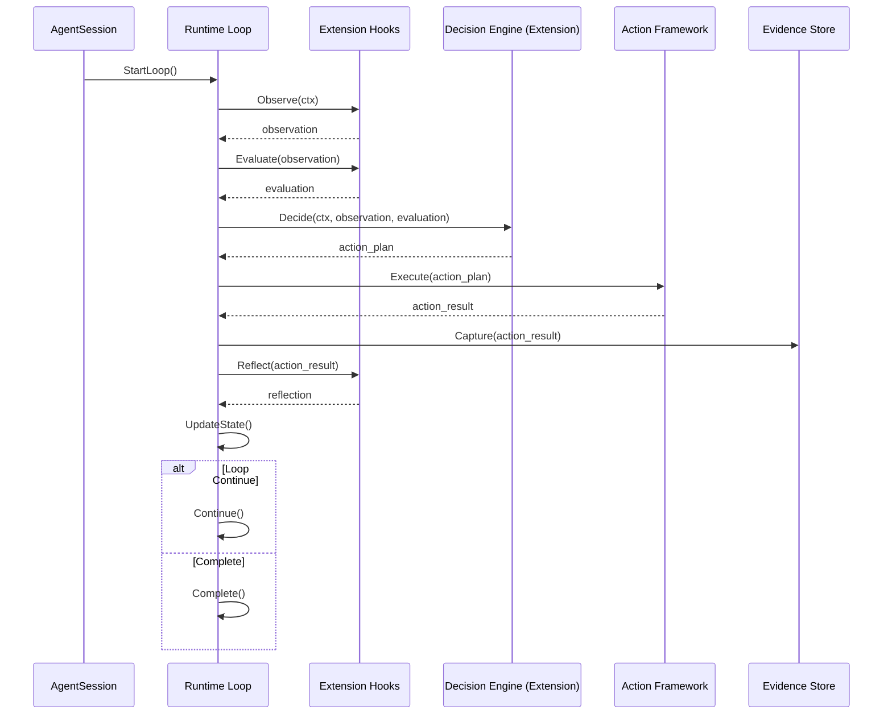
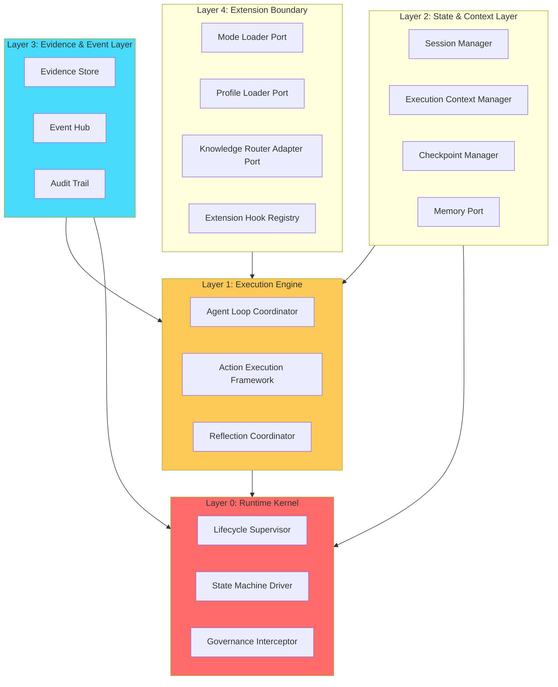
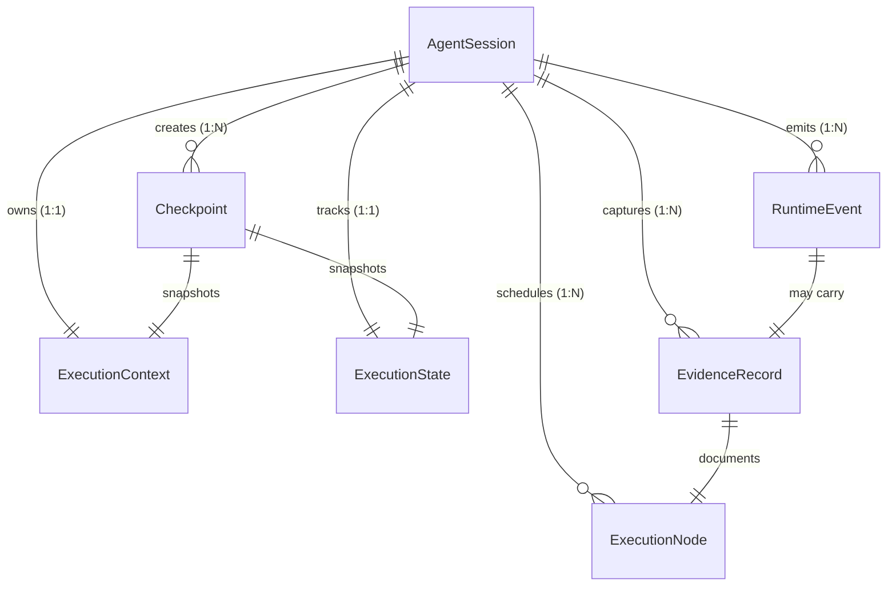
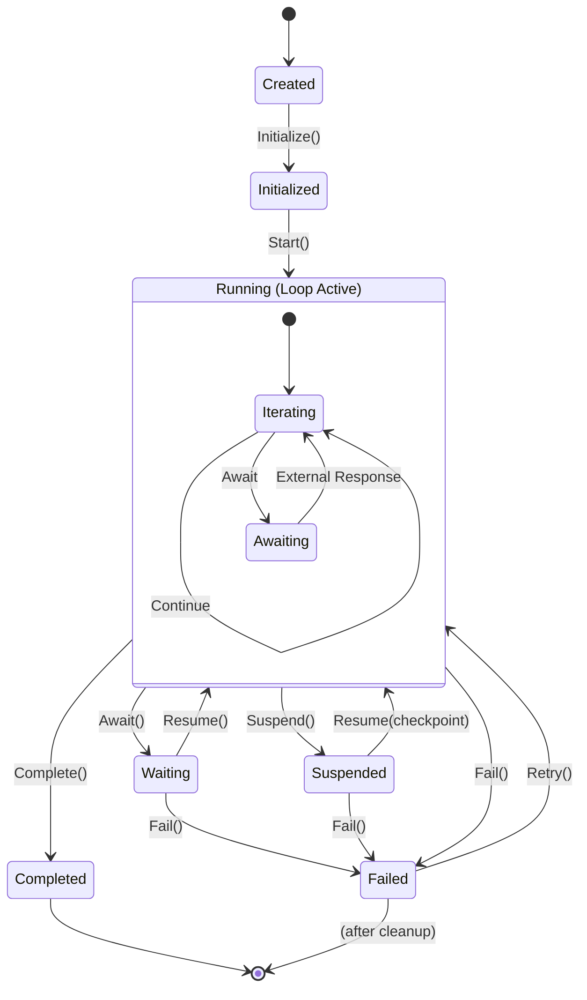
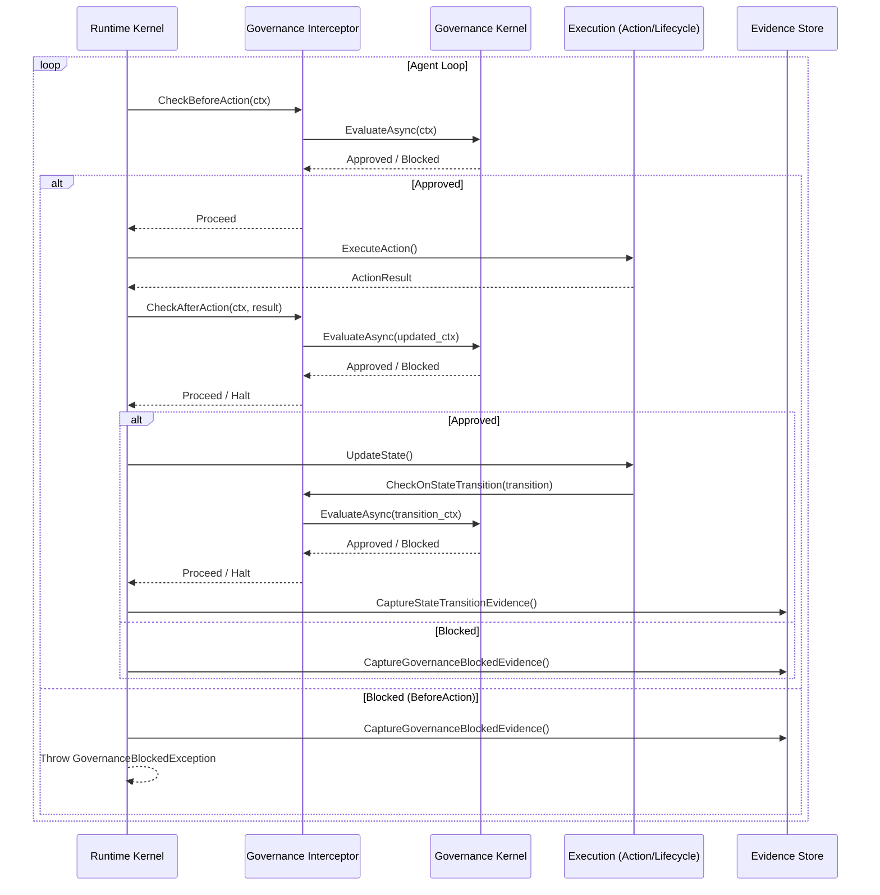

# Section 8 — Agent Runtime Architecture Specification (Phase 1 MVP)

> **本文件性质**：架构设计规格（Architecture Specification），不是 Class Design / Interface Design / Implementation Design。
>
> **执行约束（首席架构师审批补充）**：
> - **Constraint-01**：禁止提前进入代码设计（无 C# 项目结构、Runtime 类、Interface 文件、DI 注册、数据库细节）
> - **Constraint-02**：Runtime Object Model 保持领域中立（禁止 WorkflowTask / PromptTemplate / LLMRequest / ToolChain 等泄漏）
> - **Constraint-03**：所有设计必须映射 Gate-01（G1~G5 全部可验证，否则禁止冻结）
>
> **执行顺序（强制）**：
> ```
> P0 Architecture → Architecture Review
> → P1 Design Pattern → Design Review
> → P2 Contract → Contract Review
> → P3 Scope Freeze → Gate-01 Verification
> → Implementation Proposal
> ```
>
> **上位文档**：[`docs/superpowers/specs/2026-08-30-类级重构专家Agent封装设计规格.md`](../specs/2026-08-30-类级重构专家Agent封装设计规格.md) v2.1
>
> **实施计划**：[`docs/superpowers/plans/2026-08-30-Section8-Runtime-Architecture-Design-Plan.md`](./2026-08-30-Section8-Runtime-Architecture-Design-Plan.md)
>
> **生效日期**：2026-08-30 · **当前 Phase**：P0 Architecture 编写中

---

## 0. Objective（设计目标）

### 0.1 核心问题

> **为什么 Agent Runtime 不是 Workflow Engine？**

| 维度 | Workflow Engine | Agent Runtime |
|------|----------------|---------------|
| 执行驱动 | 预定义步骤序列 | 动态目标导向 |
| 执行路径 | 固定 | 状态驱动 |
| 状态 | 无/会话级 | 完整状态机（含 Suspended/Resumed） |
| 工具调用 | 业务逻辑 | 通过 Action Framework + Evidence + Reflection |
| 决策 | DAG 节点 | Evidence-Driven（含 Reflect Hook） |
| Governance | 业务插件 | **Runtime 控制面（Interceptor）** |
| 长期任务 | 不支持 | Resume + Checkpoint |
| 审计 | 日志 | Evidence Record（含 Decision 链路） |

### 0.2 设计目标

1. 建立 Enterprise Agent Runtime 的不可退化内核
2. 定义 Runtime Identity Boundary（什么属于 Runtime，什么不属于）
3. 明确 Agent Loop 的 Runtime 承载能力边界
4. 设计 Phase 1 MVP 的 Scope/Non-Scope
5. 通过 Runtime Architecture Gate-01（5 项证明）

### 0.3 Gate-01 映射承诺

| Gate | 章节 |
|------|------|
| G1 Agent Identity Preservation | §1 + §2 |
| G2 State Preservation | §3 + §7 |
| G3 Evidence Preservation | §5 + §7 |
| G4 Governance Enforcement | §8 |
| G5 Extension Preservation | §9 |

---

## 1. Runtime Identity Boundary（Runtime 身份边界）

### 1.1 核心原则

> **Runtime 是执行底座（Execution Substrate），不是业务框架（Business Framework）。**

Runtime 的职责是**承载 Agent 的生命周期**，不是**决定 Agent 的行为**。一切业务逻辑、推理策略、领域知识都属于可插拔 Extension。

### 1.2 What Runtime Owns（Runtime 拥有）

Runtime Core 严格控制以下 10 类职责：

| # | 职责 | 含义 | Gate-01 关联 |
|---|------|------|:------------:|
| 1 | **Execution Lifecycle** | Session 从创建到终止的全生命周期管理 | G1 |
| 2 | **State Transition** | 8 态状态机的转换规则与持久化 | G2 |
| 3 | **Context Propagation** | ExecutionContext 在生命周期内的传递与快照 | G2 |
| 4 | **Event Emission** | Runtime Event 的发布与订阅（StateChanged/EvidenceCaptured 等） | G3 |
| 5 | **Checkpoint** | 可恢复执行点的创建与加载 | G2 |
| 6 | **Recovery** | 从 Checkpoint 恢复执行状态 | G2 |
| 7 | **Governance Interception** | 每次 Action 前后的 Governance Check | G4 |
| 8 | **Extension Hook** | BeforeAction/AfterAction/OnFailure 等 Hook 接口 | G5 |
| 9 | **Evidence Capture** | 关键行为的 EvidenceRecord 持久化 | G3 |
| 10 | **Reflection Hook** | Reflect 阶段的接口承载（非实现 Reflect 逻辑） | G3 |

### 1.3 What Runtime Does NOT Own（Runtime 不拥有）

以下 6 类职责**明确不属于 Runtime**，必须由 Extension / Profile / Knowledge 实现：

| # | 禁止拥有的职责 | 应由谁实现 | 理由 |
|---|--------------|-----------|------|
| 1 | **Reasoning Strategy** | Profile / Knowledge | 推理策略依赖领域知识与场景 |
| 2 | **Domain Knowledge** | Profile / Knowledge | 业务知识不应硬编码在 Runtime |
| 3 | **Prompt Engineering** | Mode / Profile | Prompt 是领域特异的，Runtime 不应参与 |
| 4 | **Business Workflow** | Profile（业务层） | 业务流程由 Profile / Orchestrator 定义 |
| 5 | **Specific Tools** | Profile / Knowledge | 工具注册是 Profile 职责 |
| 6 | **Model Selection** | Mode / Profile | 模型选择依赖任务类型，Runtime 不应决定 |

### 1.4 边界澄清：容易混淆的边界点

#### 1.4.1 Runtime vs Governance

- **Runtime**：执行 Governance Interception（机制）
- **Governance**：定义 Check 规则（策略）
- **关系**：Runtime = 拦截点，Governance = 拦截内容

#### 1.4.2 Runtime vs Profile

- **Runtime**：定义 Execution 抽象（接口）
- **Profile**：提供 Execution 的具体实现（业务知识）
- **关系**：Runtime 是骨架，Profile 是血肉

#### 1.4.3 Runtime vs Memory

- **Runtime**：提供 Memory Port（接口）
- **Memory 实现**：Working/Session/Project/Knowledge 四层的具体存储
- **关系**：Runtime 不知道 Memory 存储细节，只通过 Port 访问

### 1.5 Anti-Pattern（Runtime 越界症状）

若出现以下迹象，说明 Runtime 已经越界，应立即停止实现并复核：

| 越界症状 | 对应问题 | 违反约束 |
|---------|---------|---------|
| Runtime 类中包含 `PromptTemplate` 字段 | Prompt Engineering 泄漏 | Constraint-02 |
| Runtime 类中包含 `LLMRequest` 类型 | Model Selection 泄漏 | Constraint-02 |
| Runtime 类中包含 `WorkflowTask`/`WorkflowStep` | 业务 Workflow 泄漏 | Constraint-02 |
| Runtime 类中包含 `ToolChain` | Specific Tools 泄漏 | Constraint-02 |
| Runtime 中直接调用 Governance 规则 | Governance 应该是 Interceptor | Constraint-03 G4 |
| Runtime 硬编码 `if (step == N) ExecuteX()` | 固定流程 Agent | IRON-14 Fake Capability |

---

## 2. Agent Loop Definition（Agent Loop 定义）

### 2.1 核心区分：Agent Loop ≠ Chatbot Loop

**Chatbot Loop（禁止）**：

```
Receive Request
    ↓
Call LLM
    ↓
Call Tool
    ↓
Return Answer
```

这种 Loop 的问题：

- 无状态（仅会话状态）
- 无证据（行为不可追溯）
- 无恢复（中断后只能重调 LLM）
- 无反射（无法修正下一步）

**Agent Loop（Runtime 必须承载）**：

```
Observe
    ↓
Evaluate
    ↓
Decide
    ↓
Act
    ↓
Capture Evidence
    ↓
Reflect
    ↓
Update State
    ↓
Continue / Complete
```

Agent Loop 的 8 阶段特征：

| 阶段 | Runtime 承载能力 | 不承载什么 |
|------|----------------|-----------|
| **Observe** | 提供 ExecutionContext 上下文传播 | 不实现观测逻辑 |
| **Evaluate** | 提供 IEvidenceCollection Hook | 不实现评估算法 |
| **Decide** | 仅调度（LMM/Reasoning 由 Extension 实现） | 不实现推理策略 |
| **Act** | 提供 Action Execution Framework | 不实现具体工具调用 |
| **Capture Evidence** | 提供 IEvidenceCapture（必须持久化） | 不实现业务决策记录 |
| **Reflect** | 提供 IReflectionHandler Hook | 不实现反思算法 |
| **Update State** | 驱动 ExecutionState 转换 | 不决定下一个状态 |
| **Continue/Complete** | 控制 Lifecycle 转换 | 不实现业务完成判断 |

### 2.2 Loop 时序图



### 2.3 Phase 1 Loop Scope

| Hook / 能力 | Phase 1 实现要求 |
|------------|----------------|
| **Observe Hook** | 接口存在，最小可空实现 |
| **Evaluate Hook** | 接口存在，最小可空实现 |
| **Decide 调度** | Runtime 提供调度点（Extension 占位） |
| **Action Framework** | 接口存在，最小可空实现 |
| **Evidence Capture** | **必须实现**（持久化不可空） |
| **Reflection Hook** | 接口存在，最小可空实现 |
| **State 转换驱动** | **必须实现**（状态机驱动不可空） |
| **Lifecycle 控制** | **必须实现**（Continue/Complete 不可空） |

**Phase 1 禁止范围**：

- ❌ 实现具体 Decision Engine（LLM 推理、Reasoning）
- ❌ 实现特定 Action（Tool Calling 实现）
- ❌ 实现具体 Reflect 算法

**允许**：Runtime 调度完整 Loop 框架，Extension 在 Phase 2+ 填充实际决策逻辑。

### 2.4 Loop 完整性证明（Gate-01 G1 部分）

Runtime Loop 完整性的验证标准：

| 检查项 | PASS 标准 |
|-------|---------|
| Loop 中是否存在硬编码步骤？ | **否**（不能有 `if (step == N)` 分支） |
| Loop 能否承载动态 Decision？ | **是**（Decision 由 Extension 注入） |
| Loop 行为是否由 Context + Hook 驱动？ | **是** |
| Loop 证据是否持久化？ | **是**（Evidence 不可空） |
| Loop 中断后能否恢复？ | **是**（State 持久化） |

### 2.5 Anti-Pattern 补充（Loop 退化症状）

| 退化症状 | 对应问题 | 违反约束 |
|---------|---------|---------|
| Runtime 实现 `foreach (step in predefined_steps)` | Prompt Chain Agent | IRON-14 Fake Capability |
| Loop 依赖固定 Prompt Flow | 预定义步骤 Agent | IRON-01 降级为流程引擎 |
| Decision 由 Runtime 直接硬编码 | Reasoning Strategy 泄漏 | Constraint-02 |
| Evidence 仅写内存未持久化 | 关键行为不可追溯 | IRON-07 Evidence 附件化 |

---

## 3. State Machine Model（状态机模型）

### 3.1 State First 原则

企业 Agent 最大问题不是“如何调用模型”，而是：

> 一个运行中的智能任务如何长期可靠存在。

因此必须先回答四个问题：

1. **What states exist?** 什么状态存在？
2. **Who can trigger transition?** 谁可以触发状态转换？
3. **What evidence is required?** 需要什么证据？
4. **Can transition be recovered?** 转换后能否恢复？

### 3.2 8 态状态定义

| State | 含义 | 可恢复 | 必须 Evidence |
|-------|------|:------:|-------------|
| **Created** | 实例创建，未初始化 | — | N（上下文信息） |
| **Initialized** | 上下文加载完成，已就绪 | N | Y（Initialization Evidence） |
| **Running** | 正在执行 Loop | N | Y（最近一次 Action Evidence） |
| **Waiting** | 等待外部响应（Human/IO/External） | Y | Y（Await Reason Evidence） |
| **Suspended** | 检查点暂停 | Y | Y（Checkpoint Evidence） |
| **Completed** | 正常结束 | — | Y（Final Decision Evidence） |
| **Failed** | 异常终止 | Y | Y（Failure Reason Evidence） |
| **Resumed** | 从 Waiting/Suspended 恢复中 | N | Y（Resume Evidence） |

### 3.3 状态转换矩阵

| From | To | Trigger | Evidence Required | Recoverable |
|------|----|---------|--------------------|:-----------:|
| Created | Initialized | Initialize() | Initialization | N |
| Initialized | Running | Start() | Start Evidence | N |
| Running | Waiting | Await() | Await Reason | Y |
| Running | Suspended | Suspend() | Checkpoint | Y |
| Running | Completed | Complete() | Final Decision | — |
| Running | Failed | Fail() | Failure Reason | Y |
| Waiting | Running | Resume() | Resume Evidence | N |
| Waiting | Failed | Fail() | Failure Reason | Y |
| Suspended | Running | Resume(checkpoint) | Resume Evidence | N |
| Suspended | Failed | Fail() | Failure Reason | Y |
| Failed | Running | Retry() | Retry Evidence | N |
| Completed | — | (terminal) | — | — |

### 3.4 状态图


### 3.5 转换证据合同

每次状态转换必须生成一条 `StateTransitionEvidence`，包含：

| 字段 | 类型 | 含义 |
|------|------|------|
| `FromState` | StateValue | 转换前状态 |
| `ToState` | StateValue | 转换后状态 |
| `Trigger` | string | 触发者（`Initialize`/`Start`/`Await`/`Resume`/`Suspend`/`Complete`/`Fail`/`Retry`） |
| `Timestamp` | DateTime | 转换时间 |
| `ExecutionId` | ExecutionId | 所属 Session |
| `CheckpointId` | CheckpointId? | 若为 Suspend/Resume，含检查点引用 |
| `Reason` | string | 转换原因（业务可读） |
| `TriggeringEvidence` | EvidenceId? | 触发本次转换的 Evidence |

### 3.6 State Machine 与 Gate-01 G2 映射

Gate-01 G2 **State Preservation** 的验证标准：

| 检查项 | PASS 标准 |
|-------|---------|
| Execution 中断后能否从 Checkpoint 恢复？ | **是**（Suspended → Running 转换可执行） |
| 转换证据是否持久化？ | **是**（StateTransitionEvidence 不可空） |
| 状态转换是否可追溯？ | **是**（FromState/ToState/Trigger 完整记录） |
| Failed 状态能否 Retry？ | **是**（Failed → Running 转换存在） |
| Waiting 状态能否 Recover？ | **是**（Waiting 可恢复） |

### 3.7 Anti-Pattern 补充（State 退化症状）

| 退化症状 | 对应问题 | 违反约束 |
|---------|---------|---------|
| 状态仅 `Running`/`Completed`/`Failed` 三态 | 缺少 Suspended/Resumed | MVP Definition Law |
| 状态转换不记录 Evidence | 转换不可追溯 | IRON-07 |
| `Failed` 状态不可 Retry | 不可恢复 | G2 State Preservation |
| 状态转换由业务代码主动调用 | State Machine 不在 Runtime 控制面 | IRON-13 |

---

## 4. Runtime Layer Architecture（Runtime 分层架构）

### 4.1 分层原则

Runtime 内部采用 **4 层架构**，从下至上逐层提供服务。每层仅依赖下层（不跨层调用）。

分层原则：
- **依赖单向**：上层依赖下层，下层不依赖上层
- **职责单一**：每层只有一个核心职责
- **边界清晰**：跨层交互必须通过明确的 Port

### 4.2 Runtime 内部结构

```
Agent Runtime
├── Layer 0: Runtime Kernel
│   ├── Lifecycle Supervisor
│   ├── State Machine Driver
│   └── Governance Interceptor
│
├── Layer 1: Execution Engine
│   ├── Agent Loop Coordinator
│   ├── Action Execution Framework
│   └── Reflection Coordinator
│
├── Layer 2: State & Context Layer
│   ├── Session Manager
│   ├── Execution Context Manager
│   ├── Checkpoint Manager
│   └── Memory Port
│
├── Layer 3: Evidence & Event Layer
│   ├── Evidence Store
│   ├── Event Hub
│   └── Audit Trail
│
└── Layer 4: Extension Boundary
    ├── Mode Loader Port
    ├── Profile Loader Port
    ├── Knowledge Router Adapter Port
    └── Extension Hook Registry
```

### 4.3 各层职责详述

#### Layer 0: Runtime Kernel（控制面）

Runtime 最底层，唯一拥有 Lifecycle 完整控制权的层。

| 组件 | 职责 |
|------|------|
| **Lifecycle Supervisor** | 驱动 Session 生命周期（Created→Initialized→Running→…→Completed/Failed） |
| **State Machine Driver** | 状态机驱动，所有转换都通过该组件发起并验证 |
| **Governance Interceptor** | 拦截点（CheckBeforeAction/CheckAfterAction/CheckOnStateTransition） |

**边界约束**：
- Layer 0 不依赖任何 Extension（除非 Governance Adapter，但可空）
- Layer 0 是唯一的“状态变更发起者”

#### Layer 1: Execution Engine（执行面）

负责 Agent Loop 的调度与执行。

| 组件 | 职责 |
|------|------|
| **Agent Loop Coordinator** | 驱动 Observe→Evaluate→Decide→Act→Capture→Reflect→Update State 8 阶段调度 |
| **Action Execution Framework** | 统一 Action 入口与出口，托管 Exception Handling |
| **Reflection Coordinator** | 汇总 AfterAction Reflection 结果，驱动下一步计划调整 |

**边界约束**：
- Layer 1 不实现具体 Action（调用 Profile 加载）
- Layer 1 不实现具体 Decision（调用 Extension）

#### Layer 2: State & Context Layer（状态与上下文）

提供状态持久化与上下文传播能力。

| 组件 | 职责 |
|------|------|
| **Session Manager** | Session 的创建、查找、销毁 |
| **Execution Context Manager** | ExecutionContext 的传递与快照 |
| **Checkpoint Manager** | Checkpoint 的创建、加载、删除 |
| **Memory Port** | Memory 访问接口（不实现 Memory 存储） |

**边界约束**：
- Layer 2 不决定存储技术（文件/数据库是 P3 后考虑）
- Layer 2 不实现具体 Memory 语义（仅提供 Port）

#### Layer 3: Evidence & Event Layer（证据与事件）

提供可审计性与事件可观测性。

| 组件 | 职责 |
|------|------|
| **Evidence Store** | EvidenceRecord 的 Capture/Query/Export |
| **Event Hub** | 运行时事件的发布与订阅 |
| **Audit Trail** | 决策链路的记录与可追溯 |

**边界约束**：
- Layer 3 不可空（必须实际存储）
- Layer 3 不实现具体审计格式（Audit Format 是 Extension）

#### Layer 4: Extension Boundary（扩展边界）

Runtime 与外部 Extension 的唯一交互点。

| 组件 | 职责 |
|------|------|
| **Mode Loader Port** | Mode 加载接口（可空实现） |
| **Profile Loader Port** | Profile 加载接口（可空实现） |
| **Knowledge Router Adapter Port** | Knowledge Router 适配接口（可空实现） |
| **Extension Hook Registry** | Hook 注册中心（BeforeAction/AfterAction/OnFailure） |

**边界约束**：
- Layer 4 只定义 Port，不实现 Extension 业务逻辑
- Layer 4 不决定 Extension 加载顺序（由 Governance Interceptor 验证）

### 4.4 分层架构图



### 4.5 与后续 Section 的承载能力

| Runtime 能力 | 为后续 Section 提供什么 |
|------------|----------------------|
| **Layer 0 Lifecycle Supervisor** | Section 9 Mode 注入的 Lifecycle 接口 |
| **Layer 0 Governance Interceptor** | Section 12 Validation 的 Governance Check 点 |
| **Layer 1 Agent Loop Coordinator** | Section 11 Knowledge 的 Plan/Reflect 调度点 |
| **Layer 2 Profile Loader Port** | Section 10 Profile 的加载入口 |
| **Layer 2 Memory Port** | Section 11 Knowledge 的 Working Memory 接口 |
| **Layer 3 Evidence Store** | Section 12 Validation 的证据存储后端 |
| **Layer 4 Extension Hook Registry** | Section 9/10/11 全部 Extension 的 Hook 入口 |

### 4.6 分层架构与 Gate-01 G5 映射

Gate-01 G5 **Extension Preservation** 的验证标准：

| 检查项 | PASS 标准 |
|-------|---------|
| Extension 是否可热插拔？ | **是**（Layer 4 Port 与实现解耦） |
| Mode/Profile/Knowledge 是否独立 Port？ | **是**（三个独立 Port） |
| Extension 逻辑是否泄漏到 Runtime？ | **否**（仅 Port，无业务逻辑） |
| Runtime 是否硬依赖具体 Extension？ | **否**（Port 可为空实现） |

### 4.7 Anti-Pattern 补充（分层退化症状）

| 退化症状 | 对应问题 | 违反约束 |
|---------|---------|---------|
| Runtime Kernel 依赖 Profile 加载 | 边界泄露 | Constraint-02 |
| Execution Engine 实现具体 Decision Engine | 业务逻辑越界 | Constraint-02 |
| Evidence Store 可设为 Null | 证据丢失 | IRON-07 + G3 |
| Layer 0 被动接收业务层转换请求 | Runtime 不是控制面 | IRON-13 |

---

## 5. Core Object Model（核心对象模型）

### 5.1 设计原则

本节描述的 Core Object Model 必须保持 **领域中立**：

✅ 允许：AgentSession / ExecutionContext / ExecutionState / ExecutionNode / RuntimeEvent / EvidenceRecord / Checkpoint
❌ 禁止：WorkflowTask / WorkflowStep / PromptTemplate / LLMRequest / ToolChain

### 5.2 对象清单

| 对象 | 角色 | 所在层 |
|------|------|--------|
| **AgentSession** | 一次 Agent 执行的生命周期容器 | Layer 2 |
| **ExecutionContext** | 执行上下文（用户意图/目标/状态快照） | Layer 2 |
| **ExecutionState** | 执行状态值机状态 | Layer 0 |
| **ExecutionNode** | 执行图节点（动态生成的执行节点） | Layer 1 |
| **RuntimeEvent** | 运行时生命周期事件 | Layer 3 |
| **EvidenceRecord** | 关键行为证据 | Layer 3 |
| **Checkpoint** | 可恢复执行快照 | Layer 2 |

### 5.3 AgentSession

| 属性 | 描述 |
|------|------|
| **生命周期** | Created → Initialized → Running → (Waiting/Suspended) → Completed/Failed |
| **所属关系** | 由 Agent Runtime 创建与销毁；一个 Session 仅有一个 Owner |
| **数据责任** | 负责托管 ExecutionContext / ExecutionState / EvidenceStore / EventHub / CheckpointManager |
| **是否持久化** | **必须**（本地 JSON，Phase 1） |
| **是否可扩展** | 是（Extension 可通过 Port 注入行为） |

**核心字段**：

| 字段 | 类型 | 含义 |
|------|------|------|
| `SessionId` | SessionId（全局唯一） | Session 主键 |
| `Owner` | AgentRuntime 引用 | 所属 Runtime |
| `Context` | ExecutionContext | 执行上下文 |
| `State` | ExecutionState | 当前状态 |
| `Evidence` | IEvidenceStore 引用 | 证据存储 |
| `Events` | IEventHub 引用 | 事件订阅 |
| `Checkpoints` | ICheckpointManager 引用 | 检查点管理 |
| `CreatedAt` | DateTime | 创建时间 |
| `UpdatedAt` | DateTime | 最后修改时间 |

### 5.4 ExecutionContext

| 属性 | 描述 |
|------|------|
| **生命周期** | 与 AgentSession 同生命周期；状态转换时生成快照 |
| **所属关系** | 隶属于 AgentSession（1:1） |
| **数据责任** | 负责携带 Agent Identity / User Intent / Goal / Memory Reference / Evidence Reference / Governance Status |
| **是否持久化** | **必须**（随 Session 与 Checkpoint 一起） |
| **是否可扩展** | 是（Extension 可增加上下文字段） |

**核心字段**：

| 字段 | 类型 | 含义 |
|------|------|------|
| `AgentId` | AgentIdentity | 哪个 Agent |
| `ExecutionId` | ExecutionIdentity | 本次执行的唯一标识 |
| `Intent` | UserIntent | 用户初始意图 |
| `CurrentGoal` | Goal | 当前正在追求的目标 |
| `CurrentStep` | Step | 当前所处阶段 |
| `MemoryRef` | MemoryReference | Memory 访问入口 |
| `EvidenceRef` | EvidenceReference | Evidence 访问入口 |
| `GovernanceStatus` | GovernanceStatus | 当前 Governance 状态 |
| `WorkingMemory` | WorkingMemoryScope | 循环内临时上下文 |

### 5.5 ExecutionState

| 属性 | 描述 |
|------|------|
| **生命周期** | 随 Session 存在；每次状态转换生成新 State |
| **所属关系** | 隶属于 AgentSession（1:1） |
| **数据责任** | 负责记录当前状态值 + 转换原因 + 转换时间 |
| **是否持久化** | **必须**（每次状态转换持久化） |
| **是否可扩展** | 否（状态集是封闭的） |

**核心字段**：

| 字段 | 类型 | 含义 |
|------|------|------|
| `Value` | StateValue | 状态值（Created/Initialized/Running/Waiting/Suspended/Completed/Failed） |
| `Timestamp` | DateTime | 进入该状态的时间 |
| `TransitionReason` | string | 转换原因 |
| `TriggeringEvidence` | EvidenceId | 触发本次转换的证据 |

### 5.6 ExecutionNode

| 属性 | 描述 |
|------|------|
| **生命周期** | 由 Extension 动态生成，随 Action 执行结束而销毁 |
| **所属关系** | 隶属于 AgentSession（1:N） |
| **数据责任** | 负责描述一个待执行或已执行的原子动作（**不包含 Prompt / LLM / Tool 语义**） |
| **是否持久化** | Evidence 形式（作为 ActionResult 的输入） |
| **是否可扩展** | 是（Extension 可定义自己的 Node 类型） |

**核心字段**：

| 字段 | 类型 | 含义 |
|------|------|------|
| `NodeId` | NodeId（唯一） | 节点标识 |
| `ParentNodeId` | NodeId? | 父节点（用于依赖关系） |
| `Type` | NodeType | 节点类型（`Observe`/`Evaluate`/`Decide`/`Act`/`Reflect`） |
| `Status` | NodeStatus | 节点状态（Pending/Running/Completed/Failed） |
| `Input` | ExecutionContext 快照 | 输入 |
| `Output` | ExecutionContext 快照 | 输出 |
| `Dependencies` | NodeId[] | 依赖节点 |

**注意**：ExecutionNode **不是 DAG 设计中的固定节点**。节点由 Extension 根据 Goal 动态生成。Runtime 仅提供节点调度与依赖管理能力。

### 5.7 RuntimeEvent

| 属性 | 描述 |
|------|------|
| **生命周期** | 瞬态（发布后被订阅者处理或存档） |
| **所属关系** | 隶属于 AgentSession（1:N） |
| **数据责任** | 负责传递运行时状态变更（如状态转换、证据捕获、检查点创建） |
| **是否持久化** | 可选（存档用于调试，默认只传递不存档） |
| **是否可扩展** | 是（Extension 可定义自己的事件类型） |

**核心字段**：

| 字段 | 类型 | 含义 |
|------|------|------|
| `EventId` | EventId（唯一） | 事件标识 |
| `Type` | EventType | 事件类型（`StateChanged`/`CheckpointCreated`/`EvidenceCaptured`/`GovernanceInterception`） |
| `SessionId` | SessionId | 来源 Session |
| `Timestamp` | DateTime | 事件时间 |
| `Payload` | object | 事件负载 |

### 5.8 EvidenceRecord

| 属性 | 描述 |
|------|------|
| **生命周期** | 创建后永久保留（与 Session 生命周期一致，但独立存储） |
| **所属关系** | 隶属于 AgentSession（1:N） |
| **数据责任** | 负责记录所有关键行为（状态转换 / Action 执行 / Reflection 结论） |
| **是否持久化** | **必须**（证据不可丢失） |
| **是否可扩展** | 是（Extension 可增加证据字段） |

**核心字段**：

| 字段 | 类型 | 含义 |
|------|------|------|
| `EvidenceId` | EvidenceId | 证据标识 |
| `CorrelationId` | ExecutionId | 关联的执行 |
| `Timestamp` | DateTime | 证据时间 |
| `Source` | SourceType | 证据来源（`Observe`/`Evaluate`/`Act`/`Reflect`/`StateTransition`） |
| `Decision` | string | 决策描述 |
| `Result` | object | 结果对象 |
| `TriggeringAction` | Action 引用 | 触发该证据的行为 |

### 5.9 Checkpoint（Continuation Contract 强化版）

| 属性 | 描述 |
|------|------|
| **生命周期** | 创建后保留，直到 Session 终止或手动删除 |
| **所属关系** | 隶属于 AgentSession（1:N） |
| **数据责任** | 负责携带 Session 的可恢复快照 + 续接合同 |
| **是否持久化** | **必须**（支持 Resume） |
| **是否可扩展** | 否（检查点字段固定） |

**核心字段**（Continuation Contract）：

| 字段 | 类型 | 含义 |
|------|------|------|
| `CheckpointId` | CheckpointId | 检查点标识 |
| `SessionIdentity` | SessionIdentity | 会话身份（与 AgentSession 一致） |
| `CurrentState` | ExecutionState | 快照时的状态 |
| `ExecutionPosition` | ExecutionPosition | 当前执行位置（描述“走到哪一步”） |
| `PendingAction` | Action 引用 | 待执行的下一步动作 |
| `ResumeInstruction` | ResumeInstruction | 续接指令（明确告诉 Resume 如何开始） |
| `EvidenceCursor` | EvidenceCursor | 证据游标（指向该检查点后的第一条 Evidence） |
| `GovernanceSnapshot` | GovernanceSnapshot | Governance 快照（下次 Governance Check 的上下文） |
| `CreatedAt` | DateTime | 检查点创建时间 |

**约束**：Checkpoint 不仅是 State 快照，更是 **Continuation Contract**（续接合同）。仅保存 State 不足以恢复 Agent Continuity。

### 5.10 对象关系图



### 5.11 对象生命周期一览

| 对象 | 创建时机 | 销毁时机 | 持久化 |
|------|---------|---------|--------|
| AgentSession | Runtime.CreateSession() | Session 终止后归档 | 必须 |
| ExecutionContext | Session 创建时 | Session 销毁后 | 必须 |
| ExecutionState | 每次状态转换 | 不可销毁（保留历史） | 必须 |
| ExecutionNode | Extension 生成 | Action 执行完毕 | Evidence 形式 |
| RuntimeEvent | 事件触发 | 订阅者处理后 | 可选 |
| EvidenceRecord | 关键行为发生时 | 不可销毁 | 必须 |
| Checkpoint | Suspend 或手动 | Session 销毁后可清理 | 必须 |

### 5.12 Core Object Model 与 Gate-01 映射

| Gate | 对象证据 |
|------|--------|
| **G1 Agent Identity Preservation** | ExecutionContext.AgentId + ExecutionIdentity 证明 Runtime 不依赖固定 Prompt |
| **G2 State Preservation** | ExecutionState + Checkpoint 证明可从中断恢复 |
| **G3 Evidence Preservation** | EvidenceRecord 字段覆盖 Source/Decision/Result/CorrelationId 证明可追溯 |
| **G5 Extension Preservation** | 所有对象均预留 Extension 扩展字段，避免硬依赖 |

### 5.13 Anti-Pattern 补充（对象模型退化症状）

| 退化症状 | 对应问题 | 违反约束 |
|---------|---------|---------|
| ExecutionNode 包含 `PromptTemplate` 字段 | Prompt Engineering 泄漏 | Constraint-02 |
| EvidenceRecord 包含 `LLMRequest` | Model Selection 泄漏 | Constraint-02 |
| AgentSession 包含 `WorkflowStep` | 业务 Workflow 泄漏 | Constraint-02 |
| Checkpoint 不持久化 | 不可恢复 | G2 State Preservation |
| EvidenceRecord 可设为 Null | 关键行为不可追溯 | IRON-07 + G3 |

---

## 6. Lifecycle Model（生命周期模型）

### 6.1 Agent Lifecycle Contract 定义

Lifecycle Model 是以下三者的统一：

```
State Machine (§3)
    +
Object Lifecycle (§5)
    +
Checkpoint Resume (§5.9)
    =
Agent Lifecycle Contract
```

**目的**：为 Runtime 内部所有可能生命周期提供唯一描述。

### 6.2 Session Lifecycle（Session 生命周期）

AgentSession 从创建到终止的完整生命周期：



### 6.3 State Transition Contract（状态转换合同）

每次状态转换必须遵守：

| 合同项 | 描述 |
|-------|------|
| **Evidence 生成** | 每次转换必须生成 StateTransitionEvidence |
| **触发者唯一** | 唯一合法触发者是 Runtime Kernel（Constraint-04） |
| **Governance Check** | 转换前必须经过 Governance Interceptor |
| **可追溯** | FromState/ToState/Trigger/Timestamp/Evidence 完整记录 |
| **可恢复** | Suspended → Running 必须从 Checkpoint 恢复 |

### 6.4 Object Lifecycle 矩阵

不同对象在不同生命周期阶段的行为：

| 对象 | Created | Initialized | Running | Suspended | Completed/Failed |
|------|:------:|:----------:|:-------:|:---------:|:----------------:|
| **AgentSession** | 创建 | 加载上下文 | 激活 Loop | 持久化快照 | 归档后销毁 |
| **ExecutionContext** | 初始化字段 | 填入初始值 | 动态传播 | 快照存档 | 最终快照存档 |
| **ExecutionState** | Value=Created | Value=Initialized | Value=Running | Value=Suspended | Value=Completed/Failed |
| **ExecutionNode** | 不存在 | 不存在 | Extension 动态生成 | 快照保存 | 销毁 |
| **RuntimeEvent** | 可发布 | 可发布 | 可发布 | 可发布 | 可发布（存档） |
| **EvidenceRecord** | 不存在 | 可发布 | 可发布 | 持久化存档 | 永久存档 |
| **Checkpoint** | 不存在 | 可创建 | 可创建 | 必须创建 | 保留 |

### 6.5 Checkpoint Resume Lifecycle

Suspend 与 Resume 是 Agent Continuity 的核心。

#### 6.5.1 Suspend 序列

```
Running
   │
   ▼
Trigger.Suspend()
   │
   ▼
Generate Checkpoint（7 字段）
   │
   ▼
Persist Checkpoint（写入 EvidenceStore）
   │
   ▼
Update State → Suspended
   │
   ▼
Emit RuntimeEvent(Suspended)
```

#### 6.5.2 Resume 序列

```
Suspended (with Checkpoint)
   │
   ▼
Load Checkpoint
   │
   ▼
Validate EvidenceCursor（证据一致性）
   │
   ▼
Restore ExecutionContext + ExecutionState
   │
   ▼
Read ResumeInstruction
   │
   ▼
Schedule PendingAction
   │
   ▼
Update State → Running
   │
   ▼
Emit RuntimeEvent(Resumed)
```

#### 6.5.3 Resume 的三个保证

| 保证 | 描述 |
|------|------|
| **Identity Continuity** | SessionIdentity 不变（跨 Restart） |
| **State Continuity** | ExecutionState 从 Checkpoint 恢复 |
| **Evidence Continuity** | EvidenceCursor 保证 Resume 后证据不被重放 |

### 6.6 Lifecycle 与 Iron Laws 对照

| Iron Law | Lifecycle 对应验证 |
|---------|------------------|
| IRON-06（长任务必须可恢复） | ✅ Suspend/Resume 完整实现 |
| MVP Definition Law（不可丢失 Resume） | ✅ Checkpoint Lifecycle 必须实现 |
| Memory Boundary Clarification | ✅ Session/Project Memory 生命周期与 Lifecycle 对齐 |

### 6.7 Anti-Pattern 补充（Lifecycle 退化症状）

| 退化症状 | 对应问题 | 违反约束 |
|---------|---------|---------|
| Session 生命周期仅 `Running`/`Completed` | 丢失 Suspended | MVP Definition Law |
| Checkpoint 不包含 ResumeInstruction | Resume 后位置丢失 | §5.9 Continuation Contract |
| Suspend 未生成 Evidence | 转换不可追溯 | IRON-07 |
| Resume 未加载 EvidenceCursor | 证据重复记录 | Gate-01 G3 |

---

## 7. Persistence Boundary（持久化边界）

### 7.1 Persistence Neutrality 原则（Constraint-08）

> Runtime Contract 不允许绑定具体持久化技术。

Persistence 是 **Infrastructure**（基础设施），不是 **Agent Identity**（Agent 身份）。

Runtime 允许 Persistence 后端：

| 允许 | 不允许 |
|------|--------|
| JSON 文件 | ❌ EF Core |
| SQLite | ❌ SQL Server 特定语法 |
| Local Storage | ❌ Redis |
| 任何实现 IPersistenceAdapter 的后端 | ❌ 任何具体数据库 API |

### 7.2 必须回答的四个问题

#### Q1. 哪些对象必须持久化？

Runtime 中以下对象必须持久化：

| 对象 | 是否持久化 | 持久化位置 |
|------|:---------:|-----------|
| **AgentSession** | ✅ 必须 | Persistence Adapter |
| **ExecutionContext** | ✅ 必须（随 Session） | Persistence Adapter |
| **ExecutionState** | ✅ 必须（每次转换） | Persistence Adapter |
| **StateTransitionEvidence** | ✅ 必须 | Evidence Store |
| **EvidenceRecord** | ✅ 必须 | Evidence Store |
| **Checkpoint**（9 字段） | ✅ 必须 | Persistence Adapter |
| **RuntimeEvent** | ⚠️ 可选（Debug 存档） | Persistence Adapter |
| **ExecutionNode** | ⚠️ 仅 Evidence 形式 | Evidence Store |

#### Q2. 哪些状态必须恢复？

必须恢复的状态：

| 状态 | 恢复来源 | 是否可丢失 |
|------|---------|:---------:|
| **SessionIdentity** | AgentSession 持久化记录 | ❌ 不可丢失 |
| **ExecutionState.Value** | 最新 StateTransitionEvidence | ❌ 不可丢失 |
| **ExecutionContext** | Session 中的快照 | ❌ 不可丢失 |
| **EvidenceCursor** | Checkpoint 中的游标 | ❌ 不可丢失 |
| **WorkingMemory** | 临时内存 | ✅ 可丢失（Session 重新初始化） |
| **LLM Response Cache** | 缓存 | ✅ 可丢失 |
| **RuntimeEvent 流** | Event Hub 内存 | ⚠️ 可丢失（Debug 存档可选） |

#### Q3. 哪些数据属于 Evidence？

以下数据必须作为 EvidenceRecord 持久化：

| Source | 含义 | Example |
|--------|------|---------|
| **StateTransition** | 状态转换 | Running→Suspended |
| **Action** | Action 执行 | Tool 调用 / LLM 调用 |
| **Decision** | 决策记录 | "决定使用 Plan B" |
| **Reflection** | 反思结论 | "发现 Step 3 失败，需重试" |
| **GovernanceInterception** | Governance Check | "Approved" / "Blocked: 原因 X" |
| **CheckpointCreated** | 检查点创建 | "Checkpoint saved" |
| **Resume** | Resume 记录 | "Resumed from Checkpoint X" |

#### Q4. Phase 1 JSON 是否只是 Adapter？

**是**。Phase 1 JSON 存储仅是 Persistence Adapter 的一个实现，不是 Runtime Contract 的组成部分。

```
Runtime Contract
       │
       ▼
IPersistenceAdapter (Interface)
       │
       ├─ JsonPersistenceAdapter (Phase 1)
       ├─ SqlitePersistenceAdapter (Phase 2)
       └─ CloudPersistenceAdapter (Phase 3+)
```

### 7.3 Persistence Adapter 契约

Phase 1 定义 Persistence Adapter 接口契约（不实现具体后端）：

| 方法 | 职责 |
|------|------|
| `SaveAsync(AgentSession)` | 保存 Session 完整快照 |
| `LoadAsync(SessionId)` | 加载 Session |
| `SaveCheckpointAsync(Checkpoint)` | 保存 Checkpoint |
| `LoadCheckpointAsync(CheckpointId)` | 加载 Checkpoint |
| `ListCheckpointsAsync(SessionId)` | 列出 Session 的所有 Checkpoint |
| `DeleteCheckpointAsync(CheckpointId)` | 删除 Checkpoint |

**Adapter 实现责任**：

| 责任 | 属于 Runtime | 属于 Adapter |
|------|:----------:|:----------:|
| 决定持久化哪些字段 | ✅ | ❌ |
| 决定什么时候持久化 | ✅ | ❌ |
| 如何序列化 | ❌ | ✅ |
| 如何存储 | ❌ | ✅ |
| 如何索引 | ❌ | ✅ |
| 错误处理 | ✅（Runtime 捕获） | ✅（Adapter 抛出） |

### 7.4 Evidence Store 契约

Evidence Store 独立于 Persistence Adapter，因为 Evidence 有独立的可追溯性需求：

| 方法 | 职责 |
|------|------|
| `CaptureAsync(EvidenceRecord)` | 捕获 Evidence |
| `QueryAsync(filter)` | 查询 Evidence |
| `ExportAsync(sessionId, format)` | 导出 Evidence 供审计 |
| `GetEvidenceCursorAsync(checkpointId)` | 获取 Checkpoint 的证据游标 |

### 7.5 持久化时机矩阵

不同对象的持久化时机：

| 对象 | 持久化时机 | 频率 |
|------|----------|------|
| AgentSession | 创建时 + 销毁时 | 2 次 |
| ExecutionState | 每次状态转换 | 高频 |
| ExecutionContext | 每次 Context 字段变化 | 中频 |
| StateTransitionEvidence | 状态转换后立即 | 高频 |
| Action Evidence | Action 执行后立即 | 高频 |
| Checkpoint | Suspend / 手动创建 | 中频 |
| RuntimeEvent | 事件发布时（可选） | 低频 |

### 7.6 Persistence Boundary 与 Gate-01 映射

| Gate | Persistence 对应验证 |
|------|-------------------|
| G2 State Preservation | ✅ Checkpoint 持久化可恢复 State |
| G3 Evidence Preservation | ✅ Evidence Store 独立持久化 |
| G5 Extension Preservation | ✅ Persistence Adapter 可替换实现 |

### 7.7 Anti-Pattern 补充（Persistence 退化症状）

| 退化症状 | 对应问题 | 违反约束 |
|---------|---------|---------|
| Runtime 直接使用 EF Core | Runtime 耦合数据库 | Constraint-08 |
| EvidenceRecord 存储在内存中 | 证据丢失 | IRON-07 + G3 |
| Persistence Adapter 绑定具体后端 | 不可替换 | Constraint-08 |
| Checkpoint 未包含 EvidenceCursor | Resume 后证据重放 | G3 + §5.9 |

---

## 8. Governance Integration（Governance 集成）

### 8.1 Governance Authority 原则（Constraint-09）

> Governance Kernel 是 Runtime Control Plane，不是 Plugin。

治理关系：

```
错误架构（Governance 作为 Plugin）：

Runtime

Extension

Governance (optional, 可跳过)


正确架构（Governance 作为 Control Plane）：

Runtime Kernel

      |
      v

Governance Check

      |
      v

Execution
```

Governance 不能是 Extension 调用 Governance：

```
❌ Extension -> Governance
```

必须是 Runtime 调用 Governance：

```
✅ Runtime -> Governance -> Extension
```

### 8.2 Governance Interceptor 的三个拦截点

Runtime Kernel 必须在三个关键点拦截 Governance Check：

#### 8.2.1 CheckBeforeAction

**触发时机**：每次 Action 执行之前

**检查内容**：
- 当前 Agent 是否有权限执行该 Action
- Action 参数是否符合 Policy
- Action 是否在允许的 Mode 范围内

**响应**：
- Approved → 允许执行
- Blocked → 拒绝执行 + 抛出 GovernanceBlockedException

#### 8.2.2 CheckAfterAction

**触发时机**：每次 Action 执行之后

**检查内容**：
- Action 结果是否符合预期
- Action 是否产生了需要隔离的 Side Effect
- Action Evidence 是否需要额外记录

**响应**：
- Approved → 继续后续步骤
- Blocked → 进入错误处理流程（可能触发 Checkpoint）

#### 8.2.3 CheckOnStateTransition

**触发时机**：每次状态转换之前

**检查内容**：
- 转换是否被允许（例如：是否可以从 Suspended 直接到 Completed）
- 转换是否需要额外 Evidence
- 转换是否需要人类介入

**响应**：
- Approved → 执行状态转换 + 生成 StateTransitionEvidence
- Blocked → 拒绝转换 + 保留当前状态

### 8.3 Governance Check 时序图



### 8.4 Governance Kernel 与 Runtime 的契约

#### 8.4.1 Runtime 调用契约

Runtime 调用 Governance Kernel 的唯一合法点：

```
Runtime Kernel (Control Plane)
       |
       v
Governance Interceptor
       |
       v
Governance Adapter Port
       |
       v
Governance Kernel (Implementation)
```

**禁止路径**：

```
❌ Extension → Governance Kernel（Extension 不能调用 Governance）
❌ Action Framework → Governance Kernel（Action 内部不能调用）
❌ Evidence Store → Governance Kernel（Evidence 独立于 Governance）
```

#### 8.4.2 Governance 调用 Contract

| 调用方法 | 触发点 | 是否可跳过 |
|---------|--------|:---------:|
| `CheckBeforeActionAsync` | Action 执行前 | ❌ |
| `CheckAfterActionAsync` | Action 执行后 | ❌ |
| `CheckOnStateTransitionAsync` | 状态转换前 | ❌ |

**三调用必须完整**，否则 Governance Bypass。

#### 8.4.3 Governance 响应 Contract

| 响应 | Runtime 动作 |
|------|-----------|
| **Approved** | 继续执行 |
| **Blocked + Reason** | 抛出 GovernanceBlockedException + 生成 Evidence |
| **NeedMoreContext** | 暂停 Loop + 生成 Waiting 状态 + 等待外部输入 |

### 8.5 Governance 与 Iron Laws 对照

| Iron Law | Governance 对应验证 |
|---------|-------------------|
| **IRON-08** Runtime 不拥有治理权 | ✅ Runtime 仅调用 Governance，不定义规则 |
| **IRON-13** Governance 是 Active Runtime Dependency | ✅ Interceptor 嵌入 Loop，不可跳过 |
| **EXT-01** Extension 不拥有 State Authority | ✅ Extension 不能调用 Governance |
| **Constraint-09** Governance Authority | ✅ Governance 是 Control Plane |

### 8.6 Governance Boundary 与 Gate-01 G4 映射

Gate-01 G4 **Governance Enforcement** 验证标准：

| 检查项 | PASS 标准 |
|-------|---------|
| Runtime 能否绕过 Governance？ | **否**（Interceptor 嵌入 Loop） |
| Extension 能否绕过 Governance？ | **否**（禁止调用路径） |
| Governance 被 Blocked 后 Runtime 是否拒绝执行？ | **是**（异常抛出） |
| Governance 是否在三个点都被调用？ | **是**（Before/After/OnTransition） |
| Governance Adapter 是否可空？ | **否**（必须非空） |

### 8.7 Anti-Pattern 补充（Governance 退化症状）

| 退化症状 | 对应问题 | 违反约束 |
|---------|---------|---------|
| Extension 主动调用 Governance Kernel | 绕过 Runtime Interceptor | Constraint-09 |
| Governance Check 可选（Optional） | 可跳过 | IRON-13 |
| Runtime 直接使用 Governance 结果不拦截 | 缺乏 Interceptor | Constraint-09 |
| Governance Blocked 后不抛异常 | 失败被吞没 | G4 |

---

## 9. Extension Boundary（扩展边界）

### 9.1 核心原则

> **Extension 是能力来源，不是控制来源。**

Extension 仅为 Runtime 提供能力（Observe/Evaluate/Decide/Act/Reflect Hook 的实现），不控制 Runtime 生命周期。

### 9.2 五大必须回答的问题

#### Q1. Runtime 暴露哪些 Port？

Runtime 在 Layer 4 Extension Boundary 暴露 5 类 Port：

| Port | 职责 | Phase 1 实现要求 |
|------|------|:--------------:|
| **Mode Loader Port** | Mode 加载（Audit/Verify/Execute/Assist） | 可空实现 |
| **Profile Loader Port** | Profile 加载（jnpf-sqlsugar/efcore-ddd 等） | 可空实现 |
| **Knowledge Router Adapter Port** | Knowledge 检索接口 | 可空实现 |
| **Governance Adapter Port** | Governance Check 点 | **必须非空** |
| **Extension Hook Registry** | Hook 注册中心 | 必须存在 |

**Governance Adapter 必须非空的原因**：

Constraint-04 要求 Extension 不能控制 Runtime 生命周期，但 Runtime 必须接受 Governance 约束。Governance Adapter 是 Runtime Kernel 与 Governance Kernel 之间的唯一合法调用点。

#### Q2. Extension 如何注册？

Extension 注册采用**三阶段注册**：

```
1. 声明阶段（Declaration）
   Extension 在配置中声明 Port 实现
   
2. 初始化阶段（Initialization）
   Runtime 启动时实例化 Extension，注入 Port
   
3. 运行阶段（Runtime）
   Extension 实现被 Runtime 调用，但不能反向调用 Runtime 控制接口
```

**注册表结构**（概念性）：

| 字段 | 类型 | 含义 |
|------|------|------|
| `ExtensionId` | ExtensionId | Extension 唯一标识 |
| `Version` | string | 版本号 |
| `ImplementationType` | TypeReference | 实现类型引用 |
| `EnabledPorts` | PortType[] | 启用的 Port 列表 |
| `CapabilityScope` | CapabilityScope | 能力范围（不能越出 Mode/Profile/Knowledge 等领域） |

#### Q3. Extension 生命周期谁管理？

**Runtime 管理 Extension 生命周期**，而不是 Extension 自管：

```
Runtime Kernel
       │
       ▼
Extension Port（Runtime 拥有）
       │
       ▼
Extension Implementation（Extension 实现）
```

Extension 生命周期由 Runtime 控制：

| Extension 生命周期 | Runtime 控制动作 |
|----------------|--------------|
| 加载 | Runtime.InitializeExtensions() |
| 启用 | Runtime.EnableExtension(id) |
| 禁用 | Runtime.DisableExtension(id) |
| 卸载 | Runtime.UnloadExtension(id) |

**禁止 Extension 主动控制 Runtime 生命周期**（Constraint-04）：

```text
❌ Extension.StartSession()
❌ Extension.ChangeState()
❌ Extension.CommitCheckpoint()
✅ Extension.HookBeforeAction()  （仅响应 Runtime 调用）
✅ Extension.ProvideDecision()    （仅响应 Runtime 调用）
```

#### Q4. Extension 如何影响 Loop？

Extension 通过 **Hook 点** 影响 Agent Loop。Runtime 在固定 Hook 点调用 Extension，Extension 不能越过 Hook 点。

**标准 Hook 点**：

| Hook 点 | 触发时机 | Extension 可提供什么 | Extension 不能做什么 |
|---------|---------|------------------|-------------------|
| **BeforeObserve** | Loop 开始时 | 提供初始观测 | 不能控制是否启动 |
| **AfterEvaluate** | Evaluate 后 | 提供评估补充 | 不能跳过 Validate |
| **BeforeAct** | Action 执行前 | 提供 Action 参数 | 不能取消 Execution |
| **AfterAct** | Action 执行后 | 提供 Action 增强 | 不能修改 Evidence |
| **BeforeReflect** | Reflect 前 | 提供反思提示 | 不能跳过 Reflect |
| **OnFailure** | 失败时 | 提供 Recovery 策略 | 不能决定是否 Recover |
| **OnStateTransition** | 状态转换时 | 提供转换增强 | 不能跳过 Evidence |

**关键约束**：Runtime 决定是否调用 Hook，Extension 不能拒绝调用。

#### Q5. Extension 如何产生 Evidence？

Extension 不能直接写 EvidenceStore，必须通过 Runtime 的 **Evidence Capture Framework**：

```
Extension Action 完成
       │
       ▼
Runtime.CaptureEvidence(extension_id, action_type, decision, result)
       │
       ▼
EvidenceStore.Persist()
       │
       ▼
返回 EvidenceId
```

**禁止 Extension 直接写 EvidenceStore**（Constraint-04 强化）：

```text
❌ Extension 直接调用 evidenceStore.Persist()
✅ Extension 返回 ActionResult，Runtime 调用 CaptureEvidence()
```

### 9.3 Port 设计原则（Contract Minimality, Constraint-05）

Port 接口设计必须遵循 **Contract Minimality** 原则：

| 原则 | 含义 |
|------|------|
| **禁止提前暴露** | Port 不得提前暴露 LLM Provider / Prompt / Tool / Workflow / Business Context |
| **能力抽象** | Port 只描述能力抽象，不描述具体实现 |
| **可选可空** | 多数 Port 可为空实现（仅 Governance 必须非空） |

**错误示例（违反 Constraint-05）**：

```text
❌ Port 包含 "model: LLMProvider"
❌ Port 包含 "prompt_template: string"
❌ Port 包含 "tool_registry: ToolRegistry"
❌ Port 包含 "workflow_steps: WorkflowStep[]"
❌ Port 包含 "business_context: BusinessContext"
```

**正确示例**：

```text
✅ Port 包含 "observe(observation_input)"
✅ Port 包含 "evaluate(evaluation_input)"
✅ Port 包含 "decide(context)"  // 抽象决策，不限模型
✅ Port 包含 "act(action_plan)"
✅ Port 包含 "reflect(action_result)"
```

### 9.4 Extension 注册表锁定决策

**LOCKED Decision EXT-01**：Extension 不能直接修改 Runtime 内部状态（如 ExecutionState/EvidenceRecord），必须通过 Runtime 的 Captured API。

**LOCKED Decision EXT-02**：Runtime 在 Hook 调用时必须捕获 Evidence，不允许 Extension 跳过 Evidence Capture。

**LOCKED Decision EXT-03**：Extension 可以定义自己的 Node 类型，但 Node 必须由 Runtime 调度，不能由 Extension 直接执行。

### 9.5 Extension Boundary 与 Gate-01 G5 映射

Gate-01 G5 **Extension Preservation** 验证标准：

| 检查项 | PASS 标准 |
|-------|---------|
| Extension 是否可热插拔？ | **是**（Runtime 启动后仍可注册/注销） |
| Mode/Profile/Knowledge 是否独立 Port？ | **是**（三个独立 Port） |
| Extension 是否能控制 Runtime 生命周期？ | **否**（Constraint-04） |
| Extension 是否能跳过 Evidence Capture？ | **否**（EXT-02） |
| Extension 是否能直接修改 Runtime 状态？ | **否**（EXT-01） |

### 9.6 Anti-Pattern 补充（Extension 越界症状）

| 退化症状 | 对应问题 | 违反约束 |
|---------|---------|---------|
| Extension 主动调用 `Runtime.StartSession()` | Extension 控制 Lifecycle | Constraint-04 |
| Extension Port 包含 `LLMProvider` | Intelligence 泄漏 | Constraint-05 |
| Extension 跳过 Evidence Capture 直接返回结果 | 证据丢失 | IRON-07 + G3 |
| Extension 直接调用 `state.TransitionTo()` | 绕过 Kernel | EXT-01 |

---

## 10. Phase 1 Scope / Non-Scope

### 10.1 MVP Completeness 原则（Constraint-07）

> MVP 可以减少能力数量，但不能破坏 Agent Runtime 基础闭环。

Phase 1 MVP 定义 **必须保持**以下完整闭环：

```
Goal → Mission → Plan → Task Graph → Execute → Observe → Evidence → Validate → Reflect → Next Action
```

Phase 1 允许减少：

- Extension 实现数量（仅空 Port）
- Mode 种类（仅默认 Audit + Verify）
- Profile 加载（仅 JNPF Profile 一例）
- Knowledge 资产（仅示例）
- Provider 选择（后续阶段决定）

Phase 1 **禁止删除**（完整性铁律）：

| 必须保留 | 理由 |
|---------|------|
| State Machine（8 态） | 不可丢失状态持续性 |
| Evidence Capture | 不可丢失可追溯性 |
| Resume（Suspended） | Agent Continuity 的核心 |
| Governance Adapter | Runtime 与 Governance Kernel 的唯一合法点 |
| Lifecycle Supervisor | 控制面不可丢失 |
| 4 层架构 | 不可丢失依赖单向性 |
| Continuation Contract（7 字段） | 不可丢失续接能力 |

### 10.2 Phase 1 Scope（必须实现）

Phase 1 MVP **必须实现**的能力：

#### 10.2.1 Runtime Kernel（Layer 0）

| 组件 | 实现要求 |
|------|---------|
| Lifecycle Supervisor | **必须完整实现**：驱动 Session 全生命周期 |
| State Machine Driver | **必须完整实现**：8 态状态机 + 转换矩阵 + Evidence 记录 |
| Governance Interceptor | **必须完整实现**：CheckBefore/After/OnTransition 三个拦截点 |

#### 10.2.2 Execution Engine（Layer 1）

| 组件 | 实现要求 |
|------|---------|
| Agent Loop Coordinator | **必须完整实现**：8 阶段调度（Observe→Evaluate→Decide→Act→Capture→Reflect→Update→Continue/Complete） |
| Action Execution Framework | **必须实现框架**：调用 Extension 执行 Action，托管 Exception |
| Reflection Coordinator | **必须实现 Hook**：汇集 Reflection 结果 |

#### 10.2.3 State & Context Layer（Layer 2）

| 组件 | 实现要求 |
|------|---------|
| Session Manager | **必须完整实现**：CRUD Session |
| Execution Context Manager | **必须完整实现**：Context 传播与快照 |
| Checkpoint Manager | **必须完整实现**：创建/加载/删除 + Continuation Contract |
| Memory Port | **必须实现接口**：可为空实现 |

#### 10.2.4 Evidence & Event Layer（Layer 3）

| 组件 | 实现要求 |
|------|---------|
| Evidence Store | **必须完整实现**：Capture/Query/Export |
| Event Hub | **必须实现框架**：发布订阅机制 |
| Audit Trail | **必须实现基础**：决策链路记录 |

#### 10.2.5 Extension Boundary（Layer 4）

| 组件 | 实现要求 |
|------|---------|
| Mode Loader Port | **必须实现接口**：可为空实现 |
| Profile Loader Port | **必须实现接口**：可为空实现 |
| Knowledge Router Adapter Port | **必须实现接口**：可为空实现 |
| Governance Adapter | **必须实现**：调用 Governance Kernel（不得为空） |
| Extension Hook Registry | **必须实现**：注册 + 调用 Hook |

#### 10.2.6 Core Object Model（7 对象）

| 对象 | Phase 1 实现 |
|------|------------|
| AgentSession | **完整实现**（含 SessionIdentity） |
| ExecutionContext | **完整实现**（10 字段） |
| ExecutionState | **完整实现**（5 字段 + 转换证据） |
| ExecutionNode | **接口存在**，可空实现 |
| RuntimeEvent | **完整实现**（5 类型） |
| EvidenceRecord | **完整实现**（7 字段） |
| Checkpoint | **完整实现**（9 字段 Continuation Contract） |

### 10.3 Phase 1 Non-Scope（禁止/延期实现）

Phase 1 **明确不实现**（推迟到后续 Phase）：

| 不实现项 | 原因 | 推迟到 |
|---------|------|--------|
| **Decision Engine** | 属于 Intelligence 层 | Phase 2 |
| **Reasoning Engine** | 属于 Intelligence 层 | Phase 2 |
| **Domain Analyzer** | 属于 Intelligence 层 | Phase 2 |
| **Code Intelligence Engine** | 属于 Intelligence 层 | Phase 2 |
| **LLM Provider 实现** | 属于 Intelligence 层 | Phase 2 |
| **Tool Calling 实现** | 属于 Intelligence 层 | Phase 2 |
| **Reflect 算法实现** | 属于 Intelligence 层 | Phase 2 |
| **远程持久化（数据库）** | Phase 1 本地文件足够 | Phase 2 |
| **多 Agent 协作** | 复杂度递进 | Phase 3+ |
| **动态模型选择** | 依赖 Intelligence | Phase 3+ |
| **Distributed Checkpoint** | 复杂度递进 | Phase 3+ |
| **Anti-Pattern 自动检测引擎** | 接口必须定义，实现分阶段 | Phase 2+ |

### 10.4 MVP 必须保留的能力矩阵

下表是 Phase 1 全部能力的“保留性”总表，作为 Constraint-07 的验证基准：

| 能力 | 是否实现 | 是否可后续删除 | 备注 |
|------|:------:|:------------:|------|
| AgentSession 管理 | ✅ | ❌ | Runtime 身份 |
| ExecutionState 8 态 | ✅ | ❌ | 不可降为 3 态 |
| StateTransitionEvidence | ✅ | ❌ | 转换必记录 |
| EvidenceRecord Capture | ✅ | ❌ | 关键行为必记录 |
| Checkpoint 创建/Resume | ✅ | ❌ | Continuity 不可丢失 |
| Governance Interception | ✅ | ❌ | 不可绕过 Governance |
| Lifecycle 控制 | ✅ | ❌ | Runtime 控制面 |
| 4 层架构依赖单向 | ✅ | ❌ | 架构完整性 |
| Continuation Contract 7 字段 | ✅ | ❌ | Resume 准确性 |
| Extension Hook Registry | ✅ | ⚠️ | 接口不可删，实现可为空 |
| Mode/Profile/Knowledge Loader | ✅ | ⚠️ | 接口不可删，实现可为空 |
| Decision Engine | ❌ | N/A | 推迟到 Phase 2 |
| Reasoning Engine | ❌ | N/A | 推迟到 Phase 2 |
| Multi-Agent | ❌ | N/A | 推迟到 Phase 3+ |

**判断标准**：

- ✅ = Phase 1 必须实现
- ❌ = 永久不能删除（是 Runtime Identity 的组成部分）
- ⚠️ = 接口不可删除，但可后续增加实现
- ❌（N/A）= Phase 1 不实现

### 10.5 Phase 1 与 Iron Laws 映射验证

| Iron Law | Phase 1 验证 |
|---------|------------|
| **IRON-01** 禁止降级为固定流程引擎 | ✅ Loop Coordinator 实现动态 8 阶段调度 |
| **IRON-02** Agent Loop 6 能力不可删除 | ✅ Plan/Execute/Observe/Validate/Reflect/Continue 全部实现 |
| **IRON-03** Task Graph 不得退化为列表 | ✅ ExecutionNode 由 Extension 动态生成 |
| **IRON-05** Agent 状态必须显式存在 | ✅ ExecutionState + 转换证据独立维护 |
| **IRON-06** 长任务必须可恢复 | ✅ Checkpoint + Resume 完整实现 |
| **IRON-07** Evidence 必须影响行为 | ✅ Evidence Capture 不可为空 |
| **IRON-08** Runtime 不拥有治理权 | ✅ Governance Adapter Port 隔离 |
| **IRON-13** Governance 是 Active Runtime Dependency | ✅ Governance Interceptor 嵌入 Loop |
| **IRON-14** Capability 必须行为真实 | ✅ Planner/Reflector/Evidence/Memory 非 Fake |

### 10.6 Phase 1 与 Gate-01 验证映射

| Gate | Phase 1 实现验证 |
|------|-----------------|
| G1 Agent Identity Preservation | ✅ Loop 动态决策 + Context.AgentId |
| G2 State Preservation | ✅ Checkpoint 7 字段 + ResumeInstruction |
| G3 Evidence Preservation | ✅ EvidenceRecord 7 字段 + Capture 不可空 |
| G4 Governance Enforcement | ✅ Governance Interceptor 三拦截点 |
| G5 Extension Preservation | ✅ 5 Port + Hook Registry |

Gate-01 **全部覆盖**于 Phase 1。

### 10.7 Constraint-07 最终验证清单

| 检查项 | PASS 标准 |
|-------|---------|
| MVP 是否保持完整闭环？ | **是**（8 阶段 Loop） |
| MVP 是否能减少能力？ | **能**（Extension 可为空） |
| MVP 是否能删除 State/Evidence/Resume/Governance/Lifecycle？ | **否**（6 项铁律） |
| MVP 是否违反 IRON Laws？ | **否**（已验证 9 项） |
| MVP 是否满足 Gate-01 全部 5 项？ | **是** |

---

## 11. Anti-Pattern List（禁止模式清单）

### 11.1 核心目的

> 防止 Runtime 退化为 Workflow Engine / Prompt Chain。

本节列出 **6 类禁止模式**及其**自动检测标准**（Constraint-06），作为 Runtime Architecture Gate-01 后的持续门控。

### 11.2 Anti-Pattern AP-01: Prompt Chain Runtime

**描述**：Runtime 退化为一连串 Prompt 拼接，不存在状态机、不存在证据。

**特征症状**：

```
foreach (prompt in promptChain) {
    response = llm.Call(prompt);
}
```

**自动检测标准**：

| 检测项 | 检测方法 | 触发条件 |
|-------|---------|---------|
| 存在 `List<string> promptChain` | 类型扫描 | 命中 → AP-01 警告 |
| 存在 `foreach(prompt)` 循环调用 LLM | 代码搜索 | 命中 → AP-01 警告 |
| 状态机未启用 | ExecutionState 类未注入 | 命中 → AP-01 警告 |
| Evidence 不存在 | IEvidenceCapture 调用次数为 0 | 命中 → AP-01 警告 |

**违反后果**：违反 IRON-01（禁止降级为固定流程引擎）+ IRON-14（Fake Capability）

### 11.3 Anti-Pattern AP-02: Fixed DAG Runtime

**描述**：Runtime 退化为固定 DAG 执行器（Workflow Engine）。

**特征症状**：

```
var dag = WorkflowDagBuilder.New()
    .Step("observe")
    .Step("decide")
    .Step("act")
    .Build();

dag.Execute();
```

**自动检测标准**：

| 检测项 | 检测方法 | 触发条件 |
|-------|---------|---------|
| 存在 `WorkflowDag` 类型 | 类型扫描 | 命中 → AP-02 警告 |
| 存在 `WorkflowStep[]` 预定义步骤 | 代码搜索 | 命中 → AP-02 警告 |
| ExecutionNode 由预定义步骤填充 | 调用点扫描 | 命中 → AP-02 警告 |
| Runtime 调度依赖 DAG 拓扑 | 调度器扫描 | 命中 → AP-02 警告 |

**违反后果**：违反 Constraint-02（领域中立）+ IRON-03（Task Graph 不得退化为任务列表）

### 11.4 Anti-Pattern AP-03: Stateless Executor

**描述**：Runtime 退化为无状态执行器，丢失 Agent Continuity。

**特征症状**：

```
public string Execute(string prompt) {
    var response = llm.Call(prompt);
    return response;
}
```

**自动检测标准**：

| 检测项 | 检测方法 | 触发条件 |
|-------|---------|---------|
| 不存在 AgentSession 类 | 类型扫描 | 命中 → AP-03 警告 |
| Execute() 不返回 ExecutionResult | 接口扫描 | 命中 → AP-03 警告 |
| 无 Checkpoint 调用 | 调用点扫描 | 命中 → AP-03 警告 |
| Resume() 接口缺失 | 接口扫描 | 命中 → AP-03 警告 |

**违反后果**：违反 IRON-06（长任务必须可恢复）+ MVP Definition Law（丢失 State）

### 11.5 Anti-Pattern AP-04: Hidden State

**描述**：Runtime 使用未声明状态（隐式缓存 / 私有变量 / 未持久化内存）。

**特征症状**：

```
private Dictionary<string, object> _cache; // 未暴露，不可见
```

**自动检测标准**：

| 检测项 | 检测方法 | 触发条件 |
|-------|---------|---------|
| 存在 `private Dictionary` / `private HashSet` | 代码搜索 | 命中 → AP-04 警告 |
| 存在未持久化的 private field | Roslyn 分析 | 命中 → AP-04 警告 |
| State 不在 Schema 中声明 | Schema 比对 | 命中 → AP-04 警告 |
| 存在私有 Cache 未出现在 ExecutionContext | 扫描比对 | 命中 → AP-04 警告 |

**违反后果**：违反 L-10（不依赖未声明状态）+ Memory Boundary Clarification（§7.5.5）

### 11.6 Anti-Pattern AP-05: Direct Extension Mutation

**描述**：Extension 越过 Runtime Kernel 直接修改 Runtime 内部状态。

**特征症状**：

```text
Extension 直接调用：
- session.State = Running
- evidenceStore.Persist(...)
- stateMachine.TransitionTo(...)
```

**自动检测标准**：

| 检测项 | 检测方法 | 触发条件 |
|-------|---------|---------|
| Extension 程序集包含 Runtime 类型引用 | 依赖分析 | 命中 → AP-05 警告 |
| Extension 出现 `internal` 修饰的 Runtime 调用 | 可见性扫描 | 命中 → AP-05 警告 |
| Extension 出现对 IEvidenceStore 的直接调用 | Port 接口扫描 | 命中 → AP-05 警告 |
| Extension 未通过 Hook 注册 | 注册表扫描 | 命中 → AP-05 警告 |

**违反后果**：违反 EXT-01（Extension 不能直接修改 Runtime 状态）+ Constraint-04

### 11.7 Anti-Pattern AP-06: Missing Evidence

**描述**：关键行为未生成 EvidenceRecord，导致行为不可追溯。

**特征症状**：

```text
- Action 执行后未调用 CaptureEvidence()
- State Transition 未生成 StateTransitionEvidence
- Extension 返回结果但 Runtime 未记录 Evidence
```

**自动检测标准**：

| 检测项 | 检测方法 | 触发条件 |
|-------|---------|---------|
| Action 调用点未出现 CaptureEvidence | 调用点扫描 | 命中 → AP-06 警告 |
| 状态转换点未生成 StateTransitionEvidence | 调用点扫描 | 命中 → AP-06 警告 |
| EvidenceCapture 接口为空 | 调用计数 | 命中 → AP-06 警告 |
| EvidenceStore 持久化路径未调用 | 调用点扫描 | 命中 → AP-06 警告 |

**违反后果**：违反 IRON-07（Evidence 必须影响 Agent 行为）+ Gate-01 G3

### 11.8 Anti-Pattern 检测集成

#### 11.8.1 静态检测（CI Gate）

每个 PR 触发静态检测：

```
1. 类型扫描：检测 AP-01/02/03 关键词
2. 代码搜索：检测 AP-01/04/05/06 关键词
3. 依赖分析：检测 AP-05 跨程序集调用
4. 接口比对：检测 AP-03/05 接口缺失
```

#### 11.8.2 动态检测（Runtime Gate）

Runtime 启动时检测：

```
1. EvidenceCapture 接口调用次数
2. 状态转换与 EvidenceRecord 1:1 配对
3. Checkpoint 创建频率（异常低提示问题）
4. Extension Hook 调用覆盖率
```

#### 11.8.3 检测报告

检测结果生成 **Anti-Pattern Report**：

| AP 编号 | 触发文件 | 警告描述 | 严重度 | 建议修复 |
|--------|---------|---------|:------:|---------|

### 11.9 Anti-Pattern 与 Gate-01 映射

| Anti-Pattern | 关联 Gate | 补充检测项 |
|-------------|---------|----------|
| AP-01 Prompt Chain | G1 Identity Preservation | 证据完整性 |
| AP-02 Fixed DAG | G1 Identity Preservation | 节点动态性 |
| AP-03 Stateless | G2 State Preservation | Checkpoint 存在性 |
| AP-04 Hidden State | G2 State Preservation | Schema 完整性 |
| AP-05 Direct Mutation | G4 Governance Enforcement | Extension 边界 |
| AP-06 Missing Evidence | G3 Evidence Preservation | Capture 调用次数 |

### 11.10 Anti-Pattern 与 Iron Laws 对照

| Anti-Pattern | 主要违反 Iron Law | 次要违反 Iron Law |
|-------------|-----------------|-----------------|
| AP-01 | IRON-01（禁止降级为固定流程引擎） | IRON-14（Fake Planner） |
| AP-02 | IRON-03（Task Graph 不得退化为列表） | Constraint-02（领域中立） |
| AP-03 | IRON-06（长任务必须可恢复） | MVP Definition Law |
| AP-04 | IRON-05（Agent 状态必须显式存在） | L-10（不依赖未声明状态） |
| AP-05 | IRON-08（Runtime 不拥有治理权） | EXT-01 |
| AP-06 | IRON-07（Evidence 必须影响行为） | Gate-01 G3 |

---

## 12. Runtime Architecture Gate-01（5 项证明）

### 12.1 Gate-01 性质

Gate-01 是 Section 8 设计冻结后**进入实现阶段的唯一入口**。5 项证明**必须全部通过**，否则不能进入实现。

### 12.2 G1: Agent Identity Preservation

**问题**：Runtime 是否依赖固定 Prompt Flow？

**证明标准**：

| 检查项 | 判定标准 |
|-------|---------|
| 是否存在 `switch(intent)` / `if (step == N)` 硬编码分支 | **不存在** |
| Runtime 行为是否由 Context + Hook 驱动 | **是** |
| Decision 是否由 Extension 动态提供 | **是** |
| Loop 能否承载动态行为序列 | **能** |

**验证方法**：

1. **静态扫描**：搜索关键词（`switch`、`case`、`if (step`）
2. **动态验证**：执行 100 个不同 Intent，统计是否每次走不同路径
3. **架构验证**：检查 Runtime 是否依赖 Prompt 模板

**设计依赖章节**：§1 + §2 + §5

### 12.3 G2: State Preservation

**问题**：Execution 中断后能否恢复？

**证明标准**：

| 检查项 | 判定标准 |
|-------|---------|
| Suspend 后能否 Resume | **能**（从 Checkpoint 恢复） |
| ExecutionContext 是否完整恢复 | **是** |
| ExecutionState 是否恢复 | **是**（从 Checkpoint CurrentState） |
| EvidenceCursor 是否连续 | **是**（防止重放） |
| Checkpoint 9 字段是否齐全 | **是** |

**验证方法**：

1. **动态验证**：执行 Suspend → 关闭 Runtime → 重新启动 → Resume
2. **状态断言**：检查 State Transition History 连续性
3. **证据断言**：检查 Resume 前后 Evidence 列表无重复

**设计依赖章节**：§3 + §5（含 §5.9）+ §6 + §7

### 12.4 G3: Evidence Preservation

**问题**：关键行为是否可追踪？

**证明标准**：

| 检查项 | 判定标准 |
|-------|---------|
| EvidenceRecord 是否覆盖所有 Source | **是**（StateTransition/Action/Decision/Reflection/GovernanceInterception） |
| EvidenceRecord 是否可查 | **是**（QueryAsync 可查询） |
| EvidenceRecord 是否可导出 | **是**（ExportAsync 可导出） |
| Action 与 Evidence 是否 1:1 配对 | **是** |
| Governance Blocked 是否生成 Evidence | **是** |

**验证方法**：

1. **静态扫描**：检查 EvidenceCapture 是否在 Action 后调用
2. **动态验证**：执行 1000 个 Action，统计 Evidence 数量是否等于 1000
3. **覆盖率验证**：检查每个 Source 都有 Evidence 生成

**设计依赖章节**：§5 + §7 + §8

### 12.5 G4: Governance Enforcement

**问题**：Runtime 能否绕过 Governance Kernel？

**证明标准**：

| 检查项 | 判定标准 |
|-------|---------|
| Governance Interceptor 是否在三个点都被调用 | **是**（Before/After/OnTransition） |
| Extension 能否调用 Governance Kernel | **否**（路径隔离） |
| Governance Adapter 可否为空 | **否**（必须非空） |
| Governance Blocked 后 Runtime 是否拒绝执行 | **是**（抛异常 + 生成 Evidence） |
| Runtime 能否跳过 Governance Check | **否**（Interceptor 嵌入 Loop） |

**验证方法**：

1. **静态扫描**：搜索 `GovernanceAdapter = null` / `SkipGovernance()` 关键词
2. **动态验证**：调用 Governance 返回 Blocked，验证 Runtime 拒绝执行
3. **路径验证**：从 Extension 程序集依赖中检查 Governance 调用（应为空）

**设计依赖章节**：§8 + §9（含 EXT-01/02/03）

### 12.6 G5: Extension Preservation

**问题**：Extension 是否可热插拔且不破坏 Runtime？

**证明标准**：

| 检查项 | 判定标准 |
|-------|---------|
| Extension 是否可运行时注册/注销 | **是** |
| Mode/Profile/Knowledge 是否独立 Port | **是** |
| Extension 是否能修改 Runtime 状态 | **否**（EXT-01） |
| Extension 是否能控制 Lifecycle | **否**（Constraint-04） |
| Port 接口是否可为空实现 | **是**（除 Governance Adapter） |

**验证方法**：

1. **静态扫描**：检查 Runtime 是否依赖 Extension 实现细节
2. **动态验证**：运行时移除 Extension，Runtime 仍能继续工作（带警告）
3. **Port 验证**：每个 Port 接口存在至少一个空实现 + 一个真实实现

**设计依赖章节**：§4 + §9 + §10

### 12.7 Gate-01 验证总表

| Gate | 设计依赖章节 | 验证方法 | 通过标准 |
|------|------------|---------|---------|
| **G1** Identity | §1 + §2 + §5 | 静态扫描 + 动态验证 + 架构验证 | Runtime 不含固定 Prompt Flow |
| **G2** State | §3 + §5 + §6 + §7 | 动态验证 + 状态断言 + 证据断言 | Checkpoint 可完整恢复 |
| **G3** Evidence | §5 + §7 + §8 | 静态扫描 + 动态验证 + 覆盖率验证 | Evidence 覆盖所有关键行为 |
| **G4** Governance | §8 + §9 | 静态扫描 + 动态验证 + 路径验证 | Governance 不可绕过 |
| **G5** Extension | §4 + §9 + §10 | 静态扫描 + 动态验证 + Port 验证 | Extension 可插拔 + 不越界 |

### 12.8 Gate-01 通过后的动作

```
Gate-01 全部通过
   │
   ▼
Section 8 设计冻结（v1.0）
   │
   ▼
Implementation Proposal（实现建议）
   │
   ▼
进入 Phase 1 实现阶段
```

### 12.9 Gate-01 失败的处理

若 Gate-01 任何一项失败：

| 失败原因 | 处理动作 |
|---------|---------|
| G1 失败 | 检查 Runtime 是否有硬编码步骤 |
| G2 失败 | 检查 Checkpoint 是否完整、Resume 路径是否正确 |
| G3 失败 | 检查 Evidence Capture 覆盖率 |
| G4 失败 | 检查 Governance Interceptor 路径 |
| G5 失败 | 检查 Port 设计是否充分解耦 |

**Gate-01 失败不允许“临时豁免”**进入实现。

---

## 13. Dependency Map（依赖图）

```
Section 8 (Runtime Architecture)
    ├── Section 9 (Mode System)
    │     Runtime 提供：IModeLoader Port + 启动时 Mode 注入
    │
    ├── Section 10 (Profile System)
    │     Runtime 提供：IProfileLoader Port + Session 创建时 Profile 加载
    │
    ├── Section 11 (Knowledge System)
    │     Runtime 提供：IKnowledgeRouterAdapter Port + Knowledge 检索接口
    │
    └── Section 12 (Validation & Evidence)
          Runtime 提供：IEvidenceStore + IEvidenceCapture 基础设施
```

---

## 14. 版本与变更

### 14.1 版本历史

| 版本 | 日期 | 状态 | 关键变更 |
|------|------|:----:|---------|
| **v1.0** | **2026-08-30** | ✅ **P4 完成（设计冻结）** | **§7 Persistence Boundary（Persistence Neutrality + 4 问 + Adapter 契约）+ §8 Governance Integration（3 拦截点 + 时序图 + Authority）+ §12 Gate-01 Proof Model（5 项证明 + 验证方法）** |
| v0.9 | 2026-08-30 | ✅ P3 完成 | §6 Lifecycle Model（Agent Lifecycle Contract）+ §10 Phase 1 Scope/Non-Scope |
| v0.7 | 2026-08-30 | ✅ P2 完成 | §5.9 Checkpoint 强化（Continuation Contract）+ §9 Extension Boundary（5 Port + 3 LOCKED 决策）+ §11 Anti-Pattern List（6 类 + 自动检测标准） |
| v0.5 | 2026-08-30 | ✅ P1 完成 | §4 Runtime Layer Architecture (4 层架构 + G5 Extension) + §5 Core Object Model (7 个领域中立对象 + ER 图 + Gate-01 映射) |
| v0.4 | 2026-08-30 | ✅ P0 完成 | §1 Runtime Identity Boundary + §2 Agent Loop Definition + §3 State Machine Model |
| v0.1 | 2026-08-30 | 📝 P0-1 完成 | 创建文档框架，编写 §1 Runtime Identity Boundary |
| v0.0 | 2026-08-30 | 🌱 初始化 | Section 8 计划批准 |

### 14.2 完成度（v1.0 全部完成）

- [x] §1 Runtime Identity Boundary — **P0-1 完成**
- [x] §2 Agent Loop Definition — **P0-2 完成**
- [x] §3 State Machine Model — **P0-3 完成**
- [x] §4 Runtime Layer Architecture — **P1-1 完成**
- [x] §5 Core Object Model — **P1-2 完成（含 §5.9 Checkpoint 强化）**
- [x] §6 Lifecycle Model — **P3 完成**
- [x] §7 Persistence Boundary — **P4-2 完成**
- [x] §8 Governance Integration — **P4-3 完成**
- [x] §9 Extension Boundary — **P2-1 完成**
- [x] §10 Phase 1 Scope/Non-Scope — **P3 完成**
- [x] §11 Anti-Pattern List — **P2-2 完成**
- [x] §12 Runtime Architecture Gate-01 — **P4-1 完成**

**全部 12 个章节完成，Section 8 设计冻结，可进入实现阶段。**

### 14.3 Constraint 全量清单

| 编号 | 约束 | 来源 |
|------|------|------|
| **Constraint-01** | 禁止提前代码设计 | P0 |
| **Constraint-02** | Object Model 领域中立 | P0 |
| **Constraint-03** | Gate-01 映射 | P0 |
| **Constraint-04** | Extension Inversion | P2 |
| **Constraint-05** | Contract Minimality | P2 |
| **Constraint-06** | Anti-Workflow Detection | P2 |
| **Constraint-07** | MVP Completeness | P3 |
| **Constraint-08** | Persistence Neutrality | P4 |
| **Constraint-09** | Governance Authority | P4 |

共 **9 条约束**，全部生效。

### 14.4 LOCKED Decision 全量清单

| 编号 | 决策 | 来源 |
|------|------|------|
| **EXT-01** | Extension 不拥有 State Authority | P2 |
| **EXT-02** | Extension 不拥有 Evidence Authority | P2 |
| **EXT-03** | Extension 不拥有 Execution Authority | P2 |

共 **3 条 Extension 铁律**，正式锁定。

---

---

> **下一步动作**：执行 P0-2（Agent Loop Definition）