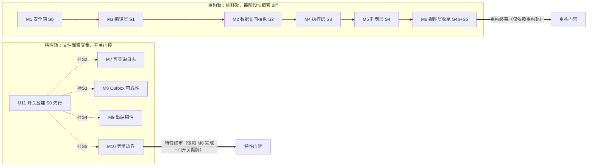

# 架构设计规格 — 运行时基座与 RunService 引擎化

- **模板**：软件设计规格模板 v10.5（`docs/AI编程范式工程/1、设计规格文档编写模板10.5.md`，执行前提显式化版）
- **日期**：2026-08-24（10.1 版按 10.5 检查修订：P0 执行前提、硬约束语义收紧+局部约束索引、NFR 清单、闸门状态、威胁建模、5.8 多租户、5.2/5.3 基线分层、5.5 两级超时+嵌套递减、五问自检、终审扩十查；用户手改 §1.1 致命问题段已保留）
- **执行前提（P0，模板 10.5 强制声明）**：① 运行模式=**T1 工具完备**（编写环境具备文件写入与 hash 能力，契约库机制全量生效；契约 hash 于实施计划物化任务计算登记，设计期为「待物化」合法中间态）；② 人工闸门状态：**G1 已过**（ADR-1~6 均用户拍板）/**G2 已过**（§3 用户 2026-08-23 确认）/**G3 已过**（§5 基线随 10.1 升级确认，本轮 10.5 修订后待复核）/**G4 批量授权在案**（用户「一次性写完后统一确认」，附录 C 豁免条款生效）/**G5 待过**（专家委员会终审）；③ 事实边界：本文档所有存量事实均指向输入上下文中真实存在的文件/文档/裁决记录（见 1.3 材料清单），无编造路径与 hash；证据暂缺项已全部升级登记 §5.4（A-1~A-4），正文引用编号，无匿名 [待确认] 残留
- **状态**：§0-§6 全量产出（含跨模块终审十查），已按模板 10.5 升级（P0 执行前提声明在文档头），待用户/专家委员会审核（G5）
- **配套**：`docs/superpowers/plans/实施计划-运行时基座与RunService引擎化.md`（已同步 10.5：契约物化步骤与假设台账贯通；模板将工时与任务拆分移出设计规格）
- **关联**：CR-20260820-01 · `docs/superpowers/specs/2026-08-20-runservice-engine-refactor-design.md`（A+C 引擎化子规格，存量事实源）

---

## 0. 全局锚定卡（初版，§3 定稿后建立；正文为唯一源）

**系统一句话定义**：借 RunService 4157 行上帝类引擎化拆分的开膛窗口，把平台运行时副作用（DB 访问/事务/出站调用/异常/日志）收拢进统一挂靠点，使「事件无声消失、LLM 故障拖死线程池、后台事故不可查」三类结构性风险在架构上不可能发生。**不做**：新业务功能、DB schema 变更、前端联动、部署侧采集与看板。

**模块清单**（投影自 3.1）：

| 模块 | 职责一句话 | 轨道 |
|------|-----------|------|
| M11 特性开关基建 | 四个运行时特性布尔开关的定义与默认值兜底 | 特性 |
| M1 安全网 | 路由快照基线与契约测试，重构的护栏 | 重构 |
| M3 编译层 | SQL 编译七方法从上帝类纯移动至 RunSqlCompiler | 重构 |
| M2 数据访问抽象 | IRuntimeDataStore：运行时 DB 副作用唯一漏斗 | 重构 |
| M4 执行层 | 数据执行二十方法纯移动至 RunDataEngine | 重构 |
| M5 列表层 | 列表查询五方法纯移动至 RunListQueryService | 重构 |
| M6 视图层收尾 | 视图四方法移动 + IRunService 接口瘦身 | 重构 |
| M7 可查询日志 | 全级别文件 JSON 日志、请求日志、PII 脱敏、内置查询 API | 特性 |
| M8 Outbox 可靠性 | 卡死消息回收器与基于 DB 的分布式互斥锁 | 特性 |
| M9 出站韧性 | LLM/MCP 出站调用的重试/熔断/超时管道 | 特性 |
| M10 异常边界 | 非 HTTP 入口的统一异常捕获与结构化记录 | 特性 |

**全局硬约束**（模板 10.5 收紧语义：仅列适用于所有模块的系统架构不变量）：

1. **路由快照零差异**——系统对外路由契约不变（重构期全模块验收基线，每阶段门禁）。
2. **租户数据隔离**——所有数据访问与日志查询不得跨租户可见（全局不变量，细化见 5.8）。

**局部约束索引**（只适用部分模块/轨道/时期的约束，按路由规则落位，防「降级=静默消失」，终审第七查核对）：

| 局部约束 | 落位 |
|---------|------|
| 双轨文件面零交集、特性门禁红不阻塞重构门禁 | §3.3 多轨隔离 + ADR-1 |
| 引擎类零 SqlSugar（构造白名单） | §4 结构重构型模块纪律段（4.4 承接）+ 架构测试守护 |
| 纯移动纪律（方法体逐字不改；唯一豁免=M3 DB 读取参数化剥离，见 Task 3.3） | §4 结构重构型模块分流定义 |
| 本期零 DB schema 变更 | §5.2 迁移基线（一次性取舍） |
| 回滚轴分工（重构=git revert/特性=四开关） | ADR-2 |
| 特性四开关 S5 按序翻牌 | §5.3 灰度基线 |

**全局基线速览**（投影自 5.5/5.6/5.7/5.8）：交互一致性范式=禁止跨模块强事务+Outbox 最终一致；并发默认档=DB 乐观并发（条件更新），全局互斥仅白名单场景（M8 DB 单行锁）；重试预算：业务级等待上限 ≤ 系统级上限 150s 且重试次数×单次超时 ≤ 业务级上限。可观测基线=OTel 字段统一 JSON 结构（M7 定义）+TraceIdMiddleware 透传+指标命名 `jnpf_{模块}_{指标}`。契约引用规则=C# 接口源码+契约测试为主载体，台账 `contract-registry.md` 登记 ID@版本+SHA256，下游校验 hash 不一致即阻断（5.7）。多租户隔离=行级租户字段（既有），三元透传（TraceIdMiddleware），无租户上下文处理见 5.8/A-2。

**共享数据实体清单**（提炼自各模块 4.N.2，§4 完成后回填校准）：

- `RuntimeFoundationOptions`：四布尔位（ExceptionBoundary/OutboxSweeper/OutboundResilience/QueryableLogging），App.json `RuntimeFoundation` 节——M11 定义，M7~M10 只读
- `IRuntimeDataStore` 契约：A+C 子规格 §4 定稿——M2 供给，M4/M5/M6 消费
- SysLog 表 `Json` 字段内结构化异常对象——M10 写入，M7 查询 API 可过滤

**跨模块接口契约**（汇编自各模块 4.N.10；字段级约束以契约库为准，见 5.7；契约台账=`docs/architecture/contract-registry.md`，实施计划物化）：

```csharp
// M3：RunSqlCompiler（ISingleton）七方法，签名与迁移前逐字一致；DB 读取改参数传入（4.3）
// M2：IRuntimeDataStore 8 成员（Dialect/ExecuteScalarAsync/ExecuteCommandAsync/SqlQueryAsync/
//     GetDataTableAsync/AnyAsync/RunInTransactionAsync/ResolveDbLink）；实现 ITransient+IDisposable（4.4.2）
// M4/5/6：RunDataEngine / RunListQueryService / RunDataViewService（ITransient，签名不变）；
//     M6 额外：瘦身后 IRunService 7 成员（WorkFlow 消费面）
// M7：LogQueryService（IDynamicApiController，入参 startTime/endTime/level/traceId/keyword/tenantId/page/pageSize）
// M8：Task<bool> IOutboxLock.TryAcquireAsync(string instanceId, CancellationToken)；Task ReleaseAsync(...)
// M9：static ResiliencePipeline<HttpResponseMessage> OutboundResiliencePipelineFactory.Create()
// M10：Task IExceptionBoundary.CaptureAsync(Exception exception, string entry, CancellationToken)
// M11：IOptions<RuntimeFoundationOptions>（四 bool）
```

契约清单（ID@版本，hash 于物化任务生成登记）：C-RS-IRunService@v0（存量 17 成员，S5 破坏性变更升 @v1）· C-M3-RunSqlCompiler@v1 · C-M2-IRuntimeDataStore@v1 · C-M4/5/6 引擎签名@v1（纯移动，存量反向提取）· C-M11-Options@v1 · C-M7-LogQueryApi@v1 · C-M8-IOutboxLock@v1 · C-M9-Pipeline@v1 · C-M10-IExceptionBoundary@v1。

**本次设计明确排除**（提取自 1.1）：全局幂等键中间件、RFC 9457 ProblemDetails 全量统一、告警规则 as-code、日志采集端点与看板、LLM/MCP 之外三处出站调用的韧性、SysLog/Outbox 表加列。

**待确认项编号列表**（投影自 5.4）：A-1（Options 落位惯例，待验证）· A-2（管理员无租户上下文放行规则，待用户拍板，阻塞 Task 7.3 开工）· A-3（Outbox 建表机制，待验证）· A-4（容量估算——全级别日志磁盘放大，待验证）。

---

## 1. 概述

### 1.1 目的与范围

**要解决什么问题。** 两组互相咬合的结构性缺陷：

其一，`RunService.cs`（4157 行，来源：A+C 子规格 §1 实测）承担了 visualdev 运行时全部数据读写：五处具体类注入（含跨模块 `Common.CodeGen/ExportImportDataHelper`，来源：`.claude/change-requests/CR-20260820-01.md`）、持有有状态 `SqlSugarScope _sqlSugarClient` 字段、无抽象边界。后果：任何测试、多租户治理、数据访问替换都无法对它动刀，类继续膨胀。

其二，运行时基座四处已实证缺口（来源：`docs/architecture/runtime-infrastructure-gap-analysis.md` v3 §1 逐条核验表）：
- 非 HTTP 入口无异常边界——`IExceptionHandler` 全仓 0 实现，`LogExceptionHandler` 仅覆盖 MVC 管道（`backend/modularity/common/JNPF.Common.Core/Filter/LogExceptionHandler.cs`），后台崩溃无声消失；
- Outbox 卡死无回收——消息置 Processing 后进程崩溃即永久滞留（无 Sweeper，grep 实证）；
- 出站 HTTP 零韧性——NuGet Polly 包全仓 0 引用，仅 EventBus 一处自研执行器（`PollyRetryHandlerExecutor.cs`），LLM 调用挂起拖死线程池；
- 日志可查询只兑现一半——`SerilogBootstrap.cs` 文件 sink 仅 error/warning 两路（info 不落盘），`UseSerilogRequestLogging` 全仓 0 匹配，无租户维度。

**不解决会怎样。** 每次进程崩溃都在积压永不被处理的幽灵消息；LLM 供应商任何抖动直接变成用户可见故障并堆积挂起请求；后台事故只能翻进程日志猜，多实例部署下不可查；上帝类继续膨胀使一切后续治理成本递增。

**本期明确排除**（砍刀只针对已提出的需求，来源逐条标注）：

| 排除项 | 排除原因 | 来源 |
|--------|---------|------|
| 全局幂等键中间件 | 用户重复提交由前端防抖兜底、系统重试由 Outbox 兜底，痛点不成立 | 用户拍板 2026-08-21（Phase 1 问题 3） |
| RFC 9457 ProblemDetails 全量统一 | 需前端联动，越出本期后端边界 | 专家评估清单降级决定（gap-analysis v3 §3 驳回登记） |
| 告警规则 as-code / Grafana 面板 | 依赖不存在的部署基建（无专职 DevOps） | 用户拍板 2026-08-21（Phase 1 问题 1） |
| 日志采集端点与看板 | 同上；本期只「产生标准信号」，不「建看板」 | 同上 |
| LLM/MCP 之外三处出站调用的韧性 | 收敛本期范围；留 backlog 2.3 | gap-analysis v3 §0.2 |
| SysLog/Outbox 表加列 | 平台无版本化迁移能力（backlog 2.12 缺失），schema 变更无承载 | Phase 1 砍刀（1.1 张力点 2：无迁移能力） |

**硬约束张力点**（第 2 章决策的直接输入）：

1. **无专职 DevOps（Conway 约束）**：一切依赖部署侧的运维方案（Seq/Grafana/告警路由）本期必须降级为「进程内可产生、文件可查、单测可验证」形态——与「可观测性要可验收」存在张力。
2. **无版本化 DB 迁移能力**：一切涉及 schema 的修复只能绕道（字段内结构化/禁加列/建表机制同源核验）——与「异常记录应结构化入列」存在张力。
3. **路由快照零差异死线**（用户裁决 2026-08-20）：四个特性全部是行为变更，与纯移动重构混流会导致冒烟红无法归因——与「特性与拆分同步做」存在张力。
4. **单团队串行施工**：无人力并行两条轨道——与「双轨并行提速」存在张力。

**致命问题（≤3）。** 设计启动时曾存在三个无法自答的问题，均已由决策者拍板（答案见下方三行及 §2 对应 ADR；本规格其余未决事项以 5.4 架构假设登记为准，当前条目 A-1 / A-2 / A-3 / A-4）：
- 部署运维能力边界 → 确认降级（无部署能力，日志/告警走文件+进程内形态）；
- 灰度/回滚基建现状 → 落四特性级布尔开关（重构轴不挂开关，见 ADR-2）；
- 幂等的真实痛点 → 整体砍除，只留 Outbox Sweeper。

**非功能需求（NFR）清单**（模板 10.5；目标值同时是 4.N.6 告警阈值与 §6 SLO 的共同来源，三处同源不新造目标；容量估算为 5.5 重试/幂等参数取值依据）：

| NFR | 目标值 | 测量口径 | 承接 | 验收方式 |
|-----|-------|---------|------|---------|
| 可用性 | LLM 瞬时故障用户无感；后台故障 100% 结构化可查 | 抽样验证+指标注册 | §4（M9/M10）/§6 | §6 SLO 抽样 |
| 容量（业务量估算） | 当前单实例部署；LLM 出站分钟级频次；事件消息分钟级频次；日志量以 `f0-log-baseline.txt` 实测为基线 | 【估算，依据：现状单实例部署+无流量统计基建，上线前建议补实测；登记 5.4 联动】 | §5.5 重试预算/5.3 放量节奏 | M7 磁盘放大对照基线 |
| 可扩展性 | 特性开关位可独立扩展；契约增量演进 | 契约兼容性规则 | §5.7 | 终审第六查 |
| 成本 | 零新增云资源；License 零新增（Polly v8 MIT） | 部署清单 | §1.1 排除项 | 验收核对 |
| 合规 | PII 脱敏与日志面扩大同批；跨租户不可见 | 脱敏用例+越权用例 | §5.1/5.8 | 单测红断言 |
| 可维护性 | 门面 <400 行；引擎零 SqlSugar（白名单架构测试） | 行数证据+架构测试 | §4（M6/M2） | 门禁断言 |

NFR 与硬约束的冲突已记入上方硬约束张力点（成本/部署能力 ↔ 可观测目标 → ADR-3 降级）。

### 1.2 术语与缩写

| 术语 | 含义 |
|------|------|
| 引擎化 | 将上帝类按职责拆为「编译/数据访问/执行/列表/视图」引擎组件，原类缩为门面 |
| 绞杀者（Strangler） | 纯移动纪律：方法体逐字不改地迁移，行为差异由快照门禁兜底 |
| 路由快照 | `JNPF.Startup.Benchmarks --mode routes` 输出的全量路由清单，阶段间 diff=0 为通过 |
| 双门禁 | 重构门禁（快照零 diff）与特性门禁（行为测试）分段独立裁决 |
| Outbox | 事件可靠投递表；消息经 Pending→Processing→完成/DeadLetter 状态机 |
| Sweeper | 回收器：把超时滞留 Processing 的消息回置 Pending 或升死信 |
| PII | 个人身份信息（手机号/身份证/口令），日志落盘前脱敏 |
| OTel | OpenTelemetry，此处指其日志字段规范（TraceId/SpanId 等） |
| 三元组 | (tenantId, projectId, pipelineId)，平台多租户隔离键（R12） |

### 1.3 参考资料

| 资料 | 来源 |
|------|------|
| A+C 引擎化子规格（RunService 方法级结构、49+8 处调用面、IRuntimeDataStore 契约 §4） | `docs/superpowers/specs/2026-08-20-runservice-engine-refactor-design.md` |
| RunService 拆分 CR（非 API Controller 定性、双通道消费、五处注入点） | `.claude/change-requests/CR-20260820-01.md` |
| 运行时基座缺陷逐条实证核验表 | `docs/architecture/runtime-infrastructure-gap-analysis.md` v3 |
| 战役编排与 backlog 选题库 | `docs/architecture/runservice-refactor-master-plan.md` v3 |
| 路由快照/启动计时工具链 | `backend/tools/JNPF.Startup.Benchmarks/Program.cs`（commit `c485a122` 引入） |
| 混入式施工与回滚轴拍板记录 | 用户裁决 2026-08-21（Phase 1/2 检查点确认） |
| 引擎类 DI 生命周期约束 | `docs/architecture/runservice-refactor-di-constraints.md` |

**输入上下文材料清单**（模板 10.5，P0 ③ 事实边界的取证范围以此为限）：上述七项文档 + 用户裁决记录（2026-08-20 死线裁决 / 2026-08-21 Phase 1-2 拍板 / 2026-08-23 §0-§3 确认与批量授权 / 2026-08-24 本轮 10.5 修订指令）+ 既有代码库文件（RunService.cs/SerilogBootstrap.cs/LogExceptionHandler.cs/PollyRetryHandlerExecutor.cs/complexity-baseline.json/JNPF.Startup.Benchmarks/Program.cs，均已在正文逐处标注）。本文档未引用材料清单之外的任何证据。

---

## 2. 架构决策记录

### ADR-1：特性与重构的施工形态——单轨穿插 + 双门禁分段裁决

- **背景**：全局硬约束 1（路由快照零差异）与用户指令「特性拆分与架构同步」正面冲突。四特性全部是行为变更，重构轨全部是纯移动；混流后冒烟红无法归因，4000+ 行重构失去安全网。
- **备选方案**：
  - 方案 A（双轨并行）：两团队/两分支同时推进。**核心代价**：单团队无并行能力（1.1 张力点 4：单团队串行施工），且两轨同时改动使合并冲突与归因双重失控。
  - 方案 B（分支双轨+顺序合入）：重构与特性各自分支，先后合入。**核心代价**：遇大范围代码移动时合并冲突成本高；特性分支长期悬置腐化。
  - 方案 C（单轨穿插+双门禁）：同一主线按阶段窗口顺序施工——每阶段重构段门禁绿后，开工同窗特性模块；两套门禁分段独立裁决。
- **决定**：选 C。推理链：**事实**——四特性的文件面（Filter/订阅者层、EventBus.Outbox、InteAssistant 出站、Serilog 引导）与重构文件面（`JNPF.VisualDev/RunService.cs` + `Runtime/`）经 grep 核验零交集（gap-analysis v3 §0.2 + A+C 子规格 §2）；**判断**——文件面零交集意味着顺序穿插不会产生合并冲突，唯一污染风险是门禁归因，可用分段裁决切断；**结论**——单轨穿插是单团队语境下唯一可行解，铁律「特性门禁红不阻塞重构门禁通过」写入纪律。
- **失效条件**：若施工中发现特性与重构必须共享某文件（如都需改 `Program.cs` 同一注册段之外的逻辑），或特性门禁连续两轮红且定位成本超过特性本身工时——停下回到本决策重评（见 2.1）。

### ADR-2：回滚轴分工——重构走 git revert，特性走四布尔开关

- **背景**：用户最初指令为重构挂全局开关 `EnableNewRunServiceEngine`（0.5d）。但纯移动重构挂开关在语义上是空的：保留旧代码路径意味着重构白拆一半，且双路径长期共存违背绞杀者纪律。
- **备选方案**：
  - 方案 A（全局重构开关）：如上。**核心代价**：语义空转 + 旧代码滞留 + 0.5d 换来虚假安全感。
  - 方案 B（回滚轴分工）：重构轨不挂运行时开关，回滚=阶段级 git revert（快照零 diff 保证 revert 安全）；特性轨落四个特性级布尔开关，精确熔断单个出问题的特性。
  - 方案 C（全部不挂开关）：**核心代价**：混入式施工中特性行为变更无法定点回滚，只能整体 revert 牵连重构。
- **决定**：选 B（用户收回方案 A 指令后拍板）。推理链：**事实**——重构轨每阶段有快照零 diff 证据；**判断**——快照零 diff 使 git revert 成为比运行时开关更彻底的逃生舱（无状态残留）；特性是行为变更且互相独立（开关语义非空）；**结论**——回滚轴按轨道分工，开关粒度=四特性级（`RuntimeFoundation.{ExceptionBoundary, OutboxSweeper, OutboundResilience, QueryableLogging}`，App.json 承载），精确熔断比省工时重要。
- **失效条件**：若某特性开关的 false 分支与另一特性 true 分支产生耦合（关不干净），该特性的开关设计回炉。

### ADR-3：可观测性形态降级——文件 JSON + 内置查询 API

- **背景**：硬约束 1（无 DevOps/部署能力）。业界标准（Seq / Grafana LGTM / OTel Collector）全部依赖部署侧组件，本期不可得；但「事故不可查」是必须修复的 P1 缺陷。
- **备选方案**：
  - 方案 A（直接上 Seq 或 LGTM 栈）：**核心代价**：无部署与运维承载，上线即烂尾（Conway 反例）。
  - 方案 B（降级：OTel 字段规范的文件 JSON + 全级别落盘 + 请求日志 + PII 脱敏 + 内置查询 API）：产生标准信号，采集/看板留待部署侧就绪后挂载（backlog 2.5）。
  - 方案 C（本期完全不碰日志）：**核心代价**：P1-1 缺陷继续裸奔，且 M10 异常记录无查询出口。
- **决定**：选 B（用户拍板）。推理链：**事实**——`Logging.json` Seq.Enabled=false、文件 sink 仅 error/warning 两路（gap-analysis v3 §1 P1-1 行）；**判断**——缺的是「信号产生端」而非「展示端」，先把信号按 OTel 规范产生出来，展示端后挂零成本；**结论**——降级版四件套（全级别 sink/请求日志/脱敏/查询 API），指标验证口径=「已产生并注册」（MeterListener 单测捕获），不要求展示。
- **失效条件**：部署侧就绪且决定引入正式采集栈时，本模块的文件查询 API 退役（2.5 余留承接），文件 sink 保留为本地兜底。

### ADR-4：全局交互与一致性范式（5.5 立项）

- **背景**：跨模块写可靠性需要全局唯一范式，否则各模块各自发明（1.1 张力点 2：零 schema 排除了新一致性基建）；模板 10.5 要求事务模型/幂等/锁档/重试预算全局锁定。
- **备选方案**：A 跨模块强事务（2PC）——代价：SqlSugar 跨源 2PC 不支持+锁放大；B TCC——代价：业务侧补偿改造覆盖 49 处存量调用面，成本爆炸；C 禁止跨模块强事务+Outbox 最终一致+乐观并发默认档——代价：短窗口不一致（卡死回收上限 10 分钟）。
- **决定**：选 C。推理链：**事实**——Outbox 表+既有幂等表+M8 Sweeper 构成完整最终一致闭环（`JNPF.Extras.EventBus.Outbox/` 实证）；SqlSugar 条件更新支撑乐观并发；**判断**——平台单进程+单主库形态，强一致需求全部落在单数据源内（RunInTransactionAsync 承载），跨模块交互均为事件形态；**结论**——5.5 范式定稿：模块只在档位内裁剪不自行发明，偏离走 2.1 回溯。
- **失效条件**：出现真正的跨数据库源强一致业务（多源分布式事务）→ 重评 TCC。

### ADR-5：全局可观测性基线（5.6 立项）

- **背景**：ADR-3 降级形态下若四特性各自定义日志/指标格式，M7 查询无法统一、指标无法横向对比（硬约束 1：无部署侧兜底，格式碎片化只能靠规范防）。
- **备选方案**：A 各模块自定义（现状惯性）——代价：格式碎片化，查询 API 无法统一解析；B 全局基线（统一 JSON 字段集+透传规则+指标命名规范）——代价：基线须随 M7 先行落地（顺序约束）。
- **决定**：选 B。推理链：**事实**——M7 的全级别 sink 与字段集是四特性共同的落盘载体；**判断**——基线是 M7 交付物的天然公共品，边际成本为零；**结论**——5.6 定稿，4.N.6 只登记模块特有指标，不自立格式。
- **失效条件**：部署侧引入正式采集栈（2.5 余留）→ 基线映射到 OTel 语义约定。

### ADR-6：契约载体与版本化策略（5.7 立项）

- **背景**：模板 10.1 要求字段级唯一源=契约库（摘要管认知、契约管编译）；但本平台契约是进程内 C# 接口（非 HTTP），OpenAPI/Protobuf 不适配。
- **备选方案**：A OpenAPI/JSON Schema——代价：与进程内接口不适配，属凭空造载体；B C# 接口源码+契约测试（机器可验证）+契约台账（ID@版本+SHA256+路径）——代价：hash 维护需任务内显式登记；C 不设契约库仅靠摘要——代价：违反 10.1 铁律，下游凭摘要生成集成代码无防护。
- **决定**：选 B。推理链：**事实**——RunServiceContractTests/架构测试已是机器可验证形态（commit `c485a122` 既有模式）；**判断**——契约测试即本项目现成的「编译防护」，台账补上版本与 hash 追溯；**结论**——契约台账 `docs/architecture/contract-registry.md`；存量契约由现状代码反向提取初版（Task 1.2/2.2 等物化任务逐条确认后生效）；破坏性变更升主版本+双轨过渡（IRunService 17→7 即 v0→v1，契约测试重录为过渡载体）；所有权=提供方模块，消费方只引用。
- **失效条件**：平台引入 IDL/代码生成流（如对外 HTTP API 契约化）→ 契约台账迁移至对应载体。

### 决策元数据与复审（模板 10.5；各条失效条件的检查时机汇总，2.1 回溯时回填本表并重评已否决方案）

| ADR | 决策日期 | 决策者 | 失效条件检查时机 |
|-----|---------|--------|----------------|
| ADR-1 混入形态 | 2026-08-21 | 用户 | 特性门禁连续两轮红时即时触发 |
| ADR-2 回滚轴 | 2026-08-21 | 用户 | S5 翻牌演练；开关耦合出现时 |
| ADR-3 可观测降级 | 2026-08-21 | 用户 | 部署侧采集栈就绪时（2.5 余留排期触发） |
| ADR-4 一致性范式 | 2026-08-23 | 用户（G1） | 跨数据源强一致业务出现时 |
| ADR-5 可观测基线 | 2026-08-23 | 用户（G1） | 同 ADR-3 |
| ADR-6 契约载体 | 2026-08-23 | 用户（G1） | IDL/代码生成流引入时 |

已否决方案重评状态：当前无回溯触发，各已否决方案（2PC/TCC/OpenAPI 载体/全局开关等）维持否决；触发时按 2.1 三件事回填并重评。

### 架构图（单轨穿插：双逻辑轨道与挂载窗口）



### 2.1 架构回溯触发条件

若 §4 模块详细设计中出现与本章决策不可调和的矛盾，停下回评，不在模块设计中硬凑。本项目预判的触发场景：

- **触发 1**：Queryable 改写为 SqlQueryable 后不可等价处 >5 处 → 回评 ADR-1 与 M2 的漏斗设计（IRuntimeDataStore 扩展面是否需重新划定）；
- **触发 2**：任一特性门禁连续两轮红且定位成本超过该特性工时 → 回评 ADR-1（该特性是否整体后移出本期）；
- **触发 3**：特性开关 false 分支无法干净关闭（与他特性耦合）→ 回评 ADR-2 开关粒度。

触发时记录三件事：冲突点（哪个模块哪个设计对哪条决策）、新事实（什么信息暴露了矛盾）、重评结论（改决策还是改模块设计）。

---

## 3. 系统分解

### 3.1 模块清单

| 模块 | 职责（一句话） | 对外接口概要 | 依赖方向 |
|------|---------------|-------------|---------|
| M11 特性开关基建 | 四布尔开关 Options 类 + App.json 配置节 + 默认值兜底 | `IOptions<RuntimeFoundationOptions>` | → M7/M8/M9/M10（被只读消费） |
| M1 安全网 | 路由快照基线 + IRunService 契约测试 + 委托方归属测试 | 测试资产（无运行时接口） | → 全部重构模块（门禁依据） |
| M3 编译层 | 七个 SQL 编译方法纯移动，零 DI 依赖 | `RunSqlCompiler`（ISingleton，7 方法签名不变） | ← RunService 门面 → M4/M5/M6 |
| M2 数据访问抽象 | 运行时 DB 副作用唯一漏斗 | `IRuntimeDataStore`（8 成员）+ `RuntimeDbLink` | ← RunService → M4/M5/M6；未来韧性/审计装饰器挂靠点 |
| M4 执行层 | 二十个数据执行方法纯移动 | `RunDataEngine`（ITransient） | ← M3/M2 → RunService 门面 |
| M5 列表层 | 五个列表查询方法纯移动 | `RunListQueryService`（ITransient） | ← M3/M2 → RunService 门面 |
| M6 视图层收尾 | 视图四方法移动 + IRunService 17→7 + 门面缩壳 | `RunDataViewService`（ITransient）+ 瘦身后的 `IRunService` | ← M3/M2 → 三委托方 |
| M7 可查询日志 | 全级别文件 sink + 请求日志 + PII 脱敏 + 查询 API | Serilog 装载配置 + `LogQueryService`（IDynamicApiController） | ← M11（开关） |
| M8 Outbox 可靠性 | 卡死回收 Sweeper + DB 单行互斥锁 | `OutboxSweeperService`（BackgroundService）+ `IOutboxLock` | ← M11（开关） |
| M9 出站韧性 | LLM/MCP 出站 Polly v8 管道 | `OutboundResiliencePipelineFactory.Create()` | ← M11（开关） |
| M10 异常边界 | 非 HTTP 入口统一捕获 + Json 内结构化记录 | `IExceptionBoundary.CaptureAsync(...)` | ← M11（开关） |

模块名均为单一职责，无「和/与/及」连接（M6 名称「视图层收尾」为同一职责「S4b+S5 收尾段」的表述，内部任务已拆开，§4 中说明）。**依赖方向无环声明（模板 10.5，终审第九查）**：重构链 M1→M3→M2→M4→M5→M6 单向；特性链 M11→M7/M8/M9/M10 单向；跨轨唯一关联=M10 Task 10.3 对 M6 Task 6.4 的时序依赖（非代码依赖，不构成环）；契约供给方向 M2→M4/M5/M6、M3→M4/M5/M6、M11→四特性均单向。无环，无需打破方式。

### 3.2 模块间交互

**交互模式**：重构轨为同步方法调用链（门面 → 引擎组件 → IRuntimeDataStore → SqlSugar）；特性轨四个模块彼此零交互，仅共享 M11 的开关配置（只读）。跨轨唯一交互点：M10 特性终审依赖 M6 重构段完成（仅时序依赖，无代码依赖）。

**挂载窗口**：特性模块在对应阶段的重构段门禁绿后开工（M7@S2 / M8@S3 / M9@S4 / M10@S5），保证任一时刻冒烟红可归因到单一轨道。

**上下游类型一致性核对**（字段级约束以契约库为准，见 5.7；下游编写/生成前校验契约 hash，不一致即阻断）：
- M3 输出 `RunSqlCompiler` 七方法签名 == M4/M5/M6 调用入参（签名逐字不变，纯移动保证）；
- M2 输出 `IRuntimeDataStore`（A+C 子规格 §4 定稿）== M4/M5/M6 构造注入类型；
- M11 输出 `IOptions<RuntimeFoundationOptions>` == M7/M8/M9/M10 注册处读取类型；
- M6 输出瘦身 `IRunService`（7 成员）== 三委托方（VisualDevModelDataService/VisualDevService/VisualdevShortLinkService）消费面，由契约测试守护。

**发布单元与集成策略（模板 10.5）**：单一发布单元=JNPF.API.Entry 主入口（特性与重构同进程集成，无独立部署单元）；集成顺序=先契约后实现——C-RS@v0 台账 S0 反向提取（Task 1.2）、C-M2@v1 S2 物化（Task 2.2）先于消费方开工，M4/M5/M6 基于已物化契约开发；接口验证策略=契约测试+架构测试充当机器可验证的契约防护（无独立 mock 层，纯移动阶段旧实现即对照物）；双轨无共享接口（文件面零交集），无接口冲突仲裁需求；重构轨契约变更通知=契约测试红灯即通知。

### 3.3 多轨隔离

| 轨道 | 文件面（归属） | 禁触清单 |
|------|---------------|---------|
| 重构轨 | `backend/modularity/visualdev/JNPF.VisualDev/{RunService.cs, Runtime/}` · `JNPF.VisualDev.Interfaces/IRunService.cs` · `backend/modularity/common/Common.CodeGen/.../ExportImportDataHelper.cs`（仅 M6 内 CodeGen 切换任务，CR 门禁）· `backend/tools/JNPF.Analyzers/complexity-baseline.json` · `backend/tests/JNPF.Tests.VisualDev/` · `backend/tests/JNPF.Tests.Architecture/RunEngineSqlSugarBoundaryTests.cs` | 特性轨全部文件面；`Program.cs` 特性注册段 |
| 特性轨 | `backend/application/JNPF.API.Entry/{Infrastructure/SerilogBootstrap.cs, Modules/, Configurations/App.json}` · `backend/modularity/common/JNPF.Common.Core/{Filter/异常边界, 日志策略}` · `backend/framework/JNPF.Extras.EventBus.Outbox/`（Sweeper 与锁，禁触 `EventOutboxMessage` 实体）· `backend/modularity/inteAssistant/`（出站两处注册）· `backend/tests/JNPF.Tests.Common/EngineThrowSiteBaselineTests.cs` | 重构轨全部文件面；`LogExceptionHandler.cs`（HTTP 面不动）；`SysLogEntity`/`EventOutboxMessage` 实体（零 schema 变更） |

**共享文件归属声明**：
- `Program.cs`：重构轨不碰；特性注册段归特性轨（M7/M8/M9/M10 各自注册互不重叠的段落）。
- `App.json`：`RuntimeFoundation` 配置节归 M11 定义，M7~M10 只读；翻牌操作仅在特性终审窗口。

共享文件无归属声明即视为冲突隐患——以上两处为全部共享面，无遗漏声明。本节只约定轨道间隔离与协调；单系统内集成顺序与仲裁统一在 3.2。**隔离按层级展开（模板 10.5）**：
- **文件级**：上表禁触清单（既有）。
- **接口级**：跨轨共享接口=无（文件面零交集）；轨内共享接口合并权=提供方模块（IRuntimeDataStore 归 M2，变更走契约升版）。
- **数据级**：共享 schema 本期零变更（硬约束，§5.2 基线）；无新增消息 topic；SysLog 表 Json 字段内结构化不改表结构（仅写入格式约定，归 M10 所有权）。
- **依赖级**：本期唯一新增共享依赖=Polly v8（InteAssistant csproj，Task 9.1 引入；版本变更通知=契约台账+CR 流程）。
- **契约先行**：C-M2 于 Task 2.2 物化先于 M4/M5/M6 开工（实施计划依赖链已保证）；纯移动模块的存量签名契约 S0 反向提取；本期无「待回填」占位场景（单团队串行，终审第八查可机械验证）。

---

## 4. 模块详细设计

模块按施工顺序编号（4.1 M11 → 4.11 M10）。按模板 10.1 **模块类型分流**：M1/M3/M4/M5/M6 为结构重构型模块（纯移动；唯一豁免：M3 DB 读取参数化剥离，等价性由特征单测守护——SQL 输出逐字一致），其 4.N.1 业务成功标准采用「重构证据标准」（行为不变性的证明方式），其余维度照常，不视为跳过业务分析；M2/M7-M11 为业务功能型，全维度展开。

---

### 4.1 M11 特性开关基建

#### 4.1.1 业务上下文

- **为谁解决什么问题**：为四个特性模块与终审流程提供统一的「精确熔断」能力——混入式施工中任一特性出问题时，只关它一个，不牵连重构与其他特性（回应 ADR-2）。业务成功标准：开关默认关闭时平台行为与现状逐字节一致；单开关置 false 时对应特性完全不在链。
- **主流程**：启动 → 读 App.json `RuntimeFoundation` 节 → 绑定 Options → 启动日志输出四位开关状态 → 各特性模块注册处读取。关键分支：配置节缺失 → 全部默认 false（特性关闭）。异常路径：绑定失败 → 启动即失败（fail-fast，不允许带模糊配置运行）。终态：开关状态在进程生命周期内恒定（无热重载）。
- **负责/不负责**：负责开关定义、默认值兜底、启动状态日志；不负责开关消费逻辑（归各特性模块）、不负责翻牌操作（仅终审窗口人工修改 App.json 并重启）。
- **业务规则**：BR-1 默认关闭兜底（缺配置=全 false，安全侧倒）；BR-2 翻牌唯一窗口（仅特性终审窗口，按序逐位）；BR-3 配置无效即启动失败（绑定异常不吞）。
- **敏感数据/权限**：不涉及。

#### 4.1.2 数据模型与状态

`RuntimeFoundationOptions`：四个 bool（ExceptionBoundary/OutboxSweeper/OutboundResilience/QueryableLogging），默认全 false。载体=App.json `RuntimeFoundation` 节（新增配置节，非 DB）。无状态、无持久化、无恢复问题——启动时一次性绑定，进程级只读。

#### 4.1.3 并发与竞态

本模块不涉及：配置启动时绑定一次，此后只读，无共享可变状态。

#### 4.1.4 错误处理与降级

配置节缺失 → Options 默认值全 false（降级方向=特性不开启，安全）。绑定类型错误 → 启动失败（fail-fast，因为带错配置启动比不启动更危险，回应 BR-3）。

#### 4.1.5 性能特征

本模块不涉及：启动时一次绑定，无运行时路径。

#### 4.1.6 可观测性契约

启动日志一行：四开关当前值（INFO 级，随 M7 全级别 sink 落盘）。观察项：任特性行为异常时第一排查动作=核对该开关值。无告警规则（无采集端，ADR-3）——异常时替代处置：改 App.json 置 false 重启。

#### 4.1.7 组件接口与依赖

```csharp
public class RuntimeFoundationOptions
{
    public const string Section = "RuntimeFoundation";
    public bool ExceptionBoundary { get; set; } = false;
    public bool OutboxSweeper { get; set; } = false;
    public bool OutboundResilience { get; set; } = false;
    public bool QueryableLogging { get; set; } = false;
}
```

消费方式=`IOptions<RuntimeFoundationOptions>`（校验规则：无，布尔无越界）。依赖方向单向：M7~M10 → M11，无反向。DI：`services.Configure<RuntimeFoundationOptions>(config.GetSection(...))` 于特性注册段（Program.cs 归特性轨，见 3.3）。借鉴=.NET 标准 Options 模式（成熟方案直接采用，无自研）。Options 类落位目录 `[待确认: framework/JNPF 或 Common.Core 的现行归属惯例]`——登记为假设 A-1（§5.4），不阻塞设计。

#### 4.1.8 落地影响

- 修改项：➕ `RuntimeFoundationOptions.cs`（落位待 A-1 确认）｜ ✏️ `App.json`（新增 RuntimeFoundation 节，四布尔位 false）｜ ✏️ Program.cs 特性注册段（Options 绑定）｜ ➕ 单测×2（缺配置默认全 false / 显式配置正确绑定）。
- 验收标准：① 两单测绿 → 失败回滚：revert 本模块全部文件；② 开关全 false 启动后路由快照与基线零 diff（开关零侵入证明）→ 失败回滚：同上。

#### 4.1.9 设计自检（5 问）

1. **参数自洽**：布尔开关无参数维度；默认值全 false 在「缺配置」最坏场景下行为=现状，成立。
2. **引用完整**：无删除操作。成立。
3. **规则覆盖**：BR-1→4.1.2 默认值+4.1.4；BR-2→4.1.1 翻牌窗口（跨模块承接于 4.11 终审任务）；BR-3→4.1.4 fail-fast。全覆盖。
4. **前置来源**：本模块无对外调用接口（纯配置供给）；Options 绑定来源=App.json 配置节（本模块自有）。
5. **补偿闭环**：无状态转移（配置只读），无业务补偿需求。

#### 4.1.10 模块接口摘要（≤300 字）

- 对外暴露：`IOptions<RuntimeFoundationOptions>`（四 bool：ExceptionBoundary/OutboxSweeper/OutboundResilience/QueryableLogging）
- 契约引用：提供 C-M11-Options@v1（Task 11.1 物化入台账，SHA256 登记）；无上游契约消费
- 依赖的上游数据：App.json `RuntimeFoundation` 节
- 产生的事件/消息：启动日志一行开关状态（INFO）
- 关键约束：默认全 false（缺配置安全侧倒）；配置绑定失败=启动失败；进程内恒定无热重载
- 明确不处理：开关消费逻辑、运行时翻牌（仅终审窗口人工改配置重启）

---

### 4.2 M1 安全网

#### 4.2.1 业务上下文

- **为谁解决什么问题**：为 4000+ 行重构提供「行为未变」的机器可验证据——没有它，任何移动都是盲飞（回应硬约束 1）。业务成功标准：任一重构阶段结束时，能在 5 分钟内回答「路由面是否变了、接口面是否变了」。
- **主流程**：重构开工前采集基线（路由快照+契约测试固化）→ 每阶段结束后重采 → diff 裁决。异常路径：diff 非零 → 该阶段重构回滚（git revert）后定位。终态：基线在 S5 终审后归档。
- **负责/不负责**：负责证据生产与门禁裁决依据；不负责修复任何差异（归触发差异的重构模块）。
- **业务规则**：BR-1 基线只在重构动刀前采集一次，禁止事后重生成替代审查（实现完整性铁律禁令 4）；BR-2 契约测试不引 MVC 类型（反射+属性名字符串匹配，来源：`backend/tests/JNPF.Tests.Systems/UsersImportExportContractTests.cs` 既有模式）。
- **敏感数据/权限**：不涉及。

#### 4.2.2 数据模型与状态

三类证据资产（均文件/测试代码形态，无 DB）：① 路由快照文本（`JNPF.Startup.Benchmarks --mode routes --filter "api/visualdev"` 输出 `[ROUTE]` 行+`[METRIC]` 行，来源：`backend/tools/JNPF.Startup.Benchmarks/Program.cs`，commit `c485a122`）；② RunServiceContractTests：IRunService 17 成员签名冻结+WorkFlow 消费的 7 方法 nameof 守护；③ VisualDevRouteOwnerTests：三委托方（OnlineDev/Base/ShortLink）Name/Route 契约。无状态。

#### 4.2.3 并发与竞态 / 4.2.5 性能特征

均不涉及：测试资产，无运行时状态与计算路径。

#### 4.2.4 错误处理与降级

快照采集失败（启动失败）→ 门禁判红，不降级（证据缺失=不通过）。契约测试编译失败 → 说明接口面已被改动，先核实现再决定回滚。

#### 4.2.6 可观测性契约

gate 输出即观测：每阶段门禁产物落盘 `s{N}-routes.txt` 存档（谁都能在事后重放裁决）。观察项：`[METRIC] route_total` 突变=路由面异动信号。无告警规则（门禁本身即处置动作：红=回滚）。

#### 4.2.7 组件接口与依赖

测试类无运行时接口。依赖：harness 工具（既有）+ 反射读 IRunService/三委托方类型。无防腐层需求（只读反射）。

#### 4.2.8 落地影响

- 修改项：➕ 路由基线文件 `s0-routes-visualdev-baseline.txt` ➕ `RunServiceContractTests.cs` ➕ `VisualDevRouteOwnerTests.cs`（`backend/tests/JNPF.Tests.VisualDev/`）。
- 验收标准：① 基线采集成功且 `[METRIC] route_matched` 全覆盖 → 失败回滚：排查启动问题，基线未落盘前禁止动 RunService；② 两测试类全绿 → 失败回滚：核对是否既有代码已违约（先核实现，非先改测试）。

#### 4.2.9 设计自检（5 问）

1. **参数自洽**：无参数维度。成立。
2. **引用完整**：无删除。成立。
3. **规则覆盖**：BR-1→4.2.1 主流程+4.2.8 验收①；BR-2→4.2.2 测试模式。全覆盖。
4. **前置来源**：测试资产消费 harness 输出（既有工具，来源明确）+类型元数据（反射，运行时可得）。
5. **补偿闭环**：无状态转移；证据失效处置=门禁判红回滚（4.2.4）。

#### 4.2.10 模块接口摘要（≤300 字）

- 对外暴露：三类证据资产（路由快照基线/契约测试×2），供每阶段门禁消费；契约引用：C-RS-IRunService@v0 反向提取入台账（Task 1.2 物化，存量逐条确认）
- 依赖的上游数据：harness `--mode routes` 输出；IRunService 与三委托方类型元数据（反射）
- 产生的事件/消息：每阶段 `s{N}-routes.txt` 存档
- 关键约束：基线一次性采集禁重生成；契约测试零 MVC 类型依赖；证据缺失=门禁红不降级
- 明确不处理：差异修复（归触发差异的模块）

---

### 4.3 M3 编译层

#### 4.3.1 业务上下文

- **为谁解决什么问题**：把上帝类中「把模型配置编译成 SQL」的纯计算职责独立出来——这是拆分的第一步，选它因为它零 DI 依赖、可独立验证，为后续抽数据访问层探路（回应 1.1 上帝类问题）。业务成功标准：七方法迁出后，任何输入产生的 SQL 与迁移前逐字一致（特征单测证明）。
- **主流程**：调用方传入模型配置/表名等参数 → 编译 → 返回 SQL/Json/条件模型。纯函数形态，无分支流程之外的状态。异常路径：参数非法 → 保持迁移前既有抛出行为（纯移动纪律：方法体逐字不改）。
- **负责/不负责**：负责 SQL 编译的七个方法；不负责执行 SQL（执行需要 DB 连接，留在 RunService 侧，DB 调用以参数传入——这是「零 DI 依赖」设计的直接推论）。
- **业务规则**：BR-1 纯移动纪律（方法体逐字不改；本模块唯一豁免=DB 读取参数化剥离，等价性由特征单测守护；来源：绞杀者纪律，A+C 子规格）；BR-2 零 DI 依赖（构造不注入任何服务，来源：`runservice-refactor-di-constraints.md` §2）；BR-3 JNPF009 复杂度基线条目随迁（来源：`backend/tools/JNPF.Analyzers/complexity-baseline.json` 含七方法中超标条目）。
- **敏感数据/权限**：不涉及（编译不触数据）。

#### 4.3.2 数据模型与状态

无数据结构新增、无状态（ISingleton 注册但纯函数，线程安全由无状态保证）。七方法签名逐字不变（来源：A+C 子规格 §3 清单：GetListQuerySql/GetInfoQuerySql/GetQueryJson/GetSuperQueryJson/GetSuperQueryInput/GetIConditionalModelListByTableName/GetVisualDevModelDataConfig）。

#### 4.3.3 并发与竞态 / 4.3.5 性能特征 / 4.3.4 错误处理与降级

- 并发：无共享可变状态，ISingleton 并发调用安全（纯函数）。
- 性能：计算路径逐字迁移，复杂度与迁移前一致（无新瓶颈；迁移本身不改变任何热路径）。
- 错误处理：保持迁移前行为（纯移动纪律），不新增容错——容错语义变更属行为变更，归特性轨，本轨禁止。

#### 4.3.6 可观测性契约

本模块不新增观测（纯移动）。观察项：特征单测即回归探针——任何 SQL 输出变化都会先被它捕获，先于生产。无告警规则（编译层异常会经调用链上抛至既有 HTTP 异常面）。

#### 4.3.7 组件接口与依赖

```csharp
public class RunSqlCompiler : ISingleton
{
    // 七方法签名与 RunService 现有私有/公开方法逐字一致（纯移动）；
    // 原方法内 DB 读取调用改为方法参数传入（调用方 RunService 侧供数）
}
```

依赖方向：RunService → RunSqlCompiler（单向）；M4/M5/M6 后续亦注入。无防腐层（内部组件）。DI=ISingleton（纯函数无状态，来源：`runservice-refactor-di-constraints.md` §2）。无业界对标需求（纯内部移动）。

#### 4.3.8 落地影响

- 修改项：➕ `Runtime/RunSqlCompiler.cs` ｜ ✏️ `RunService.cs`（七方法移出，调用点改 `_compiler.X`，IRunService 成员保留委托转发）｜ ✏️ `complexity-baseline.json`（超标条目归属改 RunSqlCompiler）｜ ➕ 特征单测（**特征捕获**：迁移前用真实输入抓取输出快照作为期望值，禁止手写猜测，来源：Evidence Over Assumption 纪律）。
- 验收标准：① grep RunSqlCompiler 零 SqlSugar 类型引用 → 失败回滚：revert 剥离步骤；② 特征单测全绿 → 失败回滚：逐方法比对迁移前后方法体；③ 路由快照零 diff → 失败回滚：阶段级 git revert。

#### 4.3.9 设计自检（5 问）

1. **参数自洽**：无参数维度。成立。
2. **引用完整**：删除=RunService 内七方法声明；引用核查=调用点改委托（4.3.8 覆盖），IRunService 面保留。无矛盾。
3. **规则覆盖**：BR-1→4.3.8 验收②③；BR-2→4.3.7 DI 设计+验收①；BR-3→4.3.8 基线随迁。全覆盖。
4. **前置来源**：方法入参数据由调用方供数（来源：RunService 既有查询上下文，4.3.7 参数化剥离声明）。
5. **补偿闭环**：无状态转移（纯函数）；异常语义保持迁移前（纯移动纪律）。

#### 4.3.10 模块接口摘要（≤300 字）

- 对外暴露：`RunSqlCompiler`（ISingleton）七方法，签名与迁移前逐字一致；DB 读取改参数传入
- 契约引用：提供 C-M3-RunSqlCompiler@v1（Task 3.2 物化入台账）；无上游契约消费
- 依赖的上游数据：调用方传入的模型配置/表名/连接配置参数（无 DI 注入）
- 产生的事件/消息：无
- 关键约束：纯函数零状态零 DI；SQL 输出与迁移前逐字一致（特征单测守护）
- 明确不处理：SQL 执行（DB 调用留调用方侧）

---

### 4.4 M2 数据访问抽象（核心模块）

#### 4.4.1 业务上下文

- **为谁解决什么问题**：给平台全部运行时 DB 副作用一个唯一漏斗——未来韧性装饰、审计、多租户加固只需包裹一个接口，而不是追 49+8 处散落调用（回应 1.1 上帝类问题 + 用户审计「统一挂靠点让泄漏在结构上不可能」）。业务成功标准：RunService 中 `_visualDevRepository.AsSugarClient()` 49 处与 `_sqlSugarClient` 直调 8 处全部收敛归零，引擎类不再出现 SqlSugar 类型。
- **主流程**：引擎组件调用 IRuntimeDataStore 成员 → SqlSugarRuntimeDataStore 经 RuntimeDbLink 解析目标连接 → 执行参数化 SQL/事务 → 返回。关键分支：主库/外部数据源由 RuntimeDbLink 解析（来源：A+C 子规格 §4，外部数据源多表查询曾发生 Where/OrderBy 别名不一致运行事故）。异常路径：DB 故障 → 上抛（本期不加容错——容错是特性轨职责，漏斗只保证「所有副作用都经过这里」）。
- **负责/不负责**：负责运行时业务表的全部 DB 读写收口；不负责平台元数据表的常规仓储用法（VisualDevEntity 等实体型 Queryable 保留原仓储，来源：A+C 子规格 D1 修订边界）、不负责事务之外的业务规则。
- **业务规则**：BR-1 豁免废除——27 处 LINQ Queryable 全部改写，无法等价者经 IRuntimeDataStore 扩展成员承载（台账 M 系列），禁止保留 SqlSugar 直调（来源：v5.2 审查修订#1，用户批准）；BR-2 引擎构造白名单 `{RunSqlCompiler, IRuntimeDataStore, ILogger<>, IOptions<>, ICacheManager}`，架构测试守护（来源：`runservice-refactor-di-constraints.md`）；BR-3 改写等价性逐处验证（ToSql 前后比对，Normalize=去空白+参数占位符归一）；BR-4 全参数化（L0 硬门控既有，SQL 注入禁令）。
- **敏感数据/权限**：多租户——每次查询必须保持 `ITenantFilter` 生效（架构规则，收敛不得破坏过滤链）。

#### 4.4.2 数据模型与状态

- 契约（逐字采用 A+C 子规格 §4）：
```csharp
public interface IRuntimeDataStore
{
    string Dialect { get; }
    Task<object?> ExecuteScalarAsync(string sql, object? param, RuntimeDbLink link);
    Task<int> ExecuteCommandAsync(string sql, object? param, RuntimeDbLink link);
    Task<List<T>> SqlQueryAsync<T>(string sql, object? param, RuntimeDbLink link);
    Task<DataTable> GetDataTableAsync(string sql, object? param, RuntimeDbLink link);
    Task<bool> AnyAsync(string sql, object? param, RuntimeDbLink link);
    Task<T> RunInTransactionAsync<T>(Func<IRuntimeDataStore, Task<T>> work, RuntimeDbLink link);
    RuntimeDbLink ResolveDbLink(CurrentConnectionConfig? config); // 主库/外部源解析
}
```
- 状态：`SqlSugarRuntimeDataStore` 承接原 RunService 的 `_sqlSugarClient`（SqlSugarScope）字段与 Dispose 职责——生命周期=请求级（ITransient+IDisposable，来源：`runservice-refactor-di-constraints.md` §2，与迁移前 RunService 生命周期一致，避免 captive dependency）。一致性边界=单请求内；事务经 RunInTransactionAsync 挂靠（未来幂等/审计装饰点）。
- 收敛台账：`s2-convergence-ledger.md`，编号分工——L1-L36（已收敛执行入口类：Utilities×12/SqlQueryable×7/CurrentConnectionConfig×3/AsTenant×4/Ado 查询类）、Q1-Q27（LINQ Queryable 改写）、M 系列（不可等价改写经扩展成员承载）。三者不重叠。

#### 4.4.3 并发与竞态

竞态场景：原 `_sqlSugarClient` 字段非 readonly 且 RunService 为有状态服务——迁移后由 ITransient 请求级实例承接，单请求内不跨线程共享（与迁移前行为一致，纯结构移动不改变并发语义）。裁决方式：不引入新并发模型；SqlSugarScope 本身的线程语义沿用存量（来源：RunService.cs 字段声明实证）。若未来引擎被后台任务复用（跨请求），需重评生命周期——失效条件登记。

#### 4.4.4 错误处理与降级

DB 超时/故障 → 原样上抛（与迁移前一致；容错增强属特性轨，本模块禁止混入行为变更，回应 ADR-1）。事务内失败 → RunInTransactionAsync 回滚语义与存量手写事务一致（迁移前逐处核对）。脏数据/空结果 → 调用方语义不变（纯收敛，不改返回形态）。

#### 4.4.5 性能特征

漏斗引入的额外开销=一层接口调用（纳秒级）；SQL 文本逐处 ToSql 比对保证编译出的 SQL 不变，故 DB 侧执行计划不变。量化锚点：收敛前后路由快照+CRUD 冒烟耗时同量级（验收以「不劣化」为断言，基线由冒烟证据承载）。10× 规模下仍成立——漏斗不引入新资源持有；连接生命周期沿用 SqlSugarScope 存量管理。

#### 4.4.6 可观测性契约

本模块不新增指标（纯收敛）。观察项：收敛台账逐行勾选状态即进度观测；架构测试（4.4.8）即常驻探针——任何绕道第二 DB 通道的新代码会让测试红。告警：无采集端（ADR-3），异常时替代处置=跑架构测试+台账复核。

#### 4.4.7 组件接口与依赖

接口签名见 4.4.2。**调用前置条件（对外接口，模板 10.5）**：调用方必须持有 ① 参数化 SQL+参数对象（来源：上游数据，由 M3 RunSqlCompiler 编译产出）② RuntimeDbLink（来源：上游契约 ResolveDbLink 解析，输入为调用方既有连接配置）③ 租户过滤上下文（来源：运行时上下文，SqlSugar 既有过滤链注入，责任边界=框架）。实现 `SqlSugarRuntimeDataStore : IRuntimeDataStore, IDisposable`（ITransient）；`RuntimeDbLink` 为值对象（主库标记或外部连接配置）。依赖方向单向：M4/M5/M6 → IRuntimeDataStore → SqlSugar；防腐层=本接口本身（引擎永不直视 SqlSugar，BR-2 白名单守护）。DI 生命周期约束来源：`runservice-refactor-di-constraints.md` §2（DataStore=Transient 承接原状态与 Dispose）。对标：仓储模式+UnitOfWork 的轻量变体——只抽运行时业务表执行面，不做全平台仓储重写（否决理由：范围爆炸，违背砍刀纪律）。

#### 4.4.8 落地影响

- 修改项：➕ `Runtime/IRuntimeDataStore.cs` `RuntimeDbLink.cs` `SqlSugarRuntimeDataStore.cs` ➕ `RunEngineSqlSugarBoundaryTests.cs`（`JNPF.Tests.Architecture/`：引擎类零 SqlSugar+构造白名单双断言，反向用例：白名单外注入桩类必须红）➕ `s2-convergence-ledger.md` ｜ ✏️ `RunService.cs`（删除 `_sqlSugarClient` 字段改注入 IRuntimeDataStore；57 处收敛）。
- 验收标准：① 架构测试即刻绿（对 RunSqlCompiler）且反向用例红 → 失败回滚：revert 测试与契约；② 台账 L1-L36/Q1-Q27 逐行勾全，grep AsSugarClient/_sqlSugarClient 在 RunService 清零 → 失败回滚：逐处定位；③ Q 系列逐处 ToSql 等价（不等价处走 M 系列扩展成员，禁止保留直调）→ 失败回滚：回滚该处改写；④ 外部数据源活体冒烟通过 → 失败回滚：阶段级 git revert。

#### 4.4.9 设计自检（5 问）

1. **参数自洽**：收敛处数 49+8=57 与台账 L36+Q27 分工核对——L 系列含部分 _sqlSugarClient 直调收敛项，编号互斥无重复计数（4.4.2 已声明不重叠）。成立。
2. **引用完整**：删除=`_sqlSugarClient` 字段与 57 处直调；引用核查=全部改经 IRuntimeDataStore（验收②的 grep 断言守护），无残留引用路径。成立。
3. **规则覆盖**：BR-1→验收③+M 系列机制；BR-2→架构测试；BR-3→验收③比对纪律；BR-4→L0 门控既有+SqlQueryable 改写禁拼接声明。全覆盖。

#### 4.4.10 模块接口摘要（≤300 字）

- 对外暴露：`IRuntimeDataStore` 8 成员（签名见 4.4.2）；实现 SqlSugarRuntimeDataStore（ITransient+IDisposable）
- 契约引用：提供 C-M2-IRuntimeDataStore@v1（Task 2.2 物化入台账）；无上游契约消费（SQL/参数由调用方传入）
- 依赖的上游数据：调用方传入的 SQL/参数/RuntimeDbLink；`_sqlSugarClient` 存量状态承接自 RunService（迁移）
- 产生的事件/消息：无（未来韧性/审计装饰的挂靠点）
- 关键约束：引擎零 SqlSugar（白名单架构测试守护）；改写全等价或走扩展成员，豁免废除；租户过滤链不得破坏；全参数化
- 明确不处理：平台元数据实体型 Queryable（保留原仓储）；容错增强（特性轨）

---

### 4.5 M4 执行层

#### 4.5.1 业务上下文

- **为谁解决什么问题**：把上帝类中「表单数据的创建/更新/批量写入/校验」执行职责独立出来——这是运行时写路径的主体，拆出后写路径的后续治理（事务增强/审计）有独立把手（回应 1.1）。业务成功标准：二十方法迁出后 CRUD 全链路行为不变（冒烟证明）。
- **主流程**：委托方/工作流经门面调用 → RunDataEngine 经 RunSqlCompiler 编译 SQL、经 IRuntimeDataStore 执行 → 返回。纯移动，流程形态不变。异常路径：保持迁移前行为（含存量裸 throw——登记技术债台账，治理归 M10 口径：存量不阻塞、新增受控，来源：v5.2 审查修订#3 拍板）。
- **负责/不负责**：负责 20 个执行方法（来源：A+C 子规格 §3.1 行号清单：Create 615/Update 878/BatchUpdate 937/SaveFlowFormData 1250/GetFlowFormDataDetails 1316/SaveDataToDataByFId 1362/OptimisticLocking 3808/DataTransferVerify 3864/UniqueVerify 2201/GenerateFeilds 1748/FieldBindDefaultValue 1995 等）；不负责 SQL 编译（M3）、连接解析（M2）。
- **业务规则**：BR-1 纯移动（方法体逐字不改，裸 throw 原样保留记入台账）；BR-2 JNPF009 基线四条随迁（SaveDataToDataByFId CC90/GenerateFeilds CC81/FieldBindDefaultValue CC82/DataTransferVerify CC74，来源：`complexity-baseline.json`）；BR-3 构造白名单（同 M2 BR-2）。
- **敏感数据/权限**：写路径涉及租户数据，继承既有租户过滤链（不新增不破坏）。

#### 4.5.2 数据模型与状态 / 4.5.3 并发与竞态 / 4.5.5 性能特征 / 4.5.4 错误处理与降级

- 数据模型：无新增结构；构造注入 RunSqlCompiler+IRuntimeDataStore，自身无状态（原方法内状态经 M2 承接）。
- 并发：与迁移前一致（方法体不改），不引入新并发语义；并发策略挂靠 5.5 默认档（DB 乐观并发/存量语义沿用），不在模块内发明。
- 性能：方法体逐字迁移，热路径不变；量化锚点=CRUD 冒烟与迁移前同量级。
- 错误处理：保持迁移前行为（纯移动纪律）；乐观锁/唯一校验的失败语义逐字不变。
- 4.5.6 可观测性：不新增（纯移动）；观察项=CRUD 冒烟+特征测试。无告警规则（异常经既有 HTTP 异常面上抛）。

#### 4.5.7 组件接口与依赖 / 4.5.8 落地影响 / 4.5.9 自检 / 4.5.10 摘要（压缩）

```csharp
public class RunDataEngine : ITransient
{
    public RunDataEngine(RunSqlCompiler compiler, IRuntimeDataStore dataStore);
    // 20 方法，签名与迁移前逐字一致
}
```

- 落地：➕ `Runtime/RunDataEngine.cs` ｜ ✏️ `RunService.cs`（20 方法移出改委托）｜ ✏️ `complexity-baseline.json`（4 条随迁）。
- 验收：① 构建 0 错误+白名单断言对本类即刻绿 → 回滚：revert；② Helpers 既有测试全绿 → 回滚：逐方法比对；③ CRUD 全链路冒烟通过 → 回滚：阶段级 git revert；④ 路由快照零 diff。
- 自检：1 参数自洽（无参数维度，成立）；2 引用完整（删除=RunService 内 20 方法声明，调用点改委托，无矛盾）；3 规则覆盖（BR-1→验收②③④；BR-2→基线随迁；BR-3→验收①）；4 前置来源：构造依赖（RunSqlCompiler/IRuntimeDataStore）来源=上游契约 C-M3/C-M2（编写前校验 hash），调用上下文不变（纯移动，来源=既有调用方）；5 补偿闭环：无状态转移，既有补偿语义（乐观锁/唯一校验失败）逐字不变。
- 摘要：对外=RunDataEngine（ITransient）20 方法签名不变；契约引用=消费 C-M3/C-M2（编写前校验 hash）；依赖=RunSqlCompiler+IRuntimeDataStore；约束=纯移动+白名单+存量裸 throw 台账登记；不处理=列表/视图查询。

---

### 4.6 M5 列表层 / 4.7 M6 视图层收尾（同构纯移动模块，合并叙述、分别落盘）

> 两模块与 M4 同构（纯移动），按模板精简；差异点逐项列明。模块仍分别落盘为 `RunListQueryService.cs`（ITransient）与 `RunDataViewService.cs`（ITransient），构造同 M4。

#### 4.6.1/4.7.1 业务上下文（差异点）

- **M5 列表层**：五个列表查询方法（GetListResult CC85/GetRelationFormList/GetHaveTableInfo/GetHaveTableInfoDetails/GetListChildTable，来源：A+C 子规格 §3.2）。成功标准=列表行为不变（既有 List*Helpers 测试全绿）。⚠ 最大单体（GetListResult CC85）逐块移动不可压缩——探索型工作量登记入实施计划。
- **M6 视图层收尾**：视图四方法移动 + 收尾三动作：① Common.CodeGen 注入点切换（ExportImportDataHelper 改注引擎组件，**CR 门禁先行，未批禁触**，来源：需求分析铁律禁令六 + v5.2 审查修订#11 文件面补登）；② IRunService 17→7 瘦身（WorkFlow 消费的 7 方法保留，其余经门面内引擎直调）；③ 门面缩壳（行数统计基线证据先行，目标 <400 行，来源：v5.2 审查补充项）。
- 共同业务规则：BR-1 纯移动；BR-2 门面只做委托转发不新增逻辑；BR-3（M6）终审拆分——重构终审仅依赖重构轨，特性终审独立（来源：v5.2 审查修订#4，回应 ADR-1 铁律）。

#### 4.6.2~4.6.6/4.7.2~4.7.6（压缩：与 M4 同构处从略，只列差异）

- 数据模型：无新增；M6 额外变更=IRunService 接口面（17→7）——属对外契约变更，由 4.2 契约测试在 S5 切换后重录（切换前后各一份快照对比，确认只有预期的 10 个成员退出）。
- 错误处理：同 M4（保持迁移前）。
- 可观测：同 M4；M6 终审六门禁产物（快照/测试/基线/冒烟/白名单/Helpers）即观测证据。
- 性能：同 M4（热路径不变）。
- 并发：同 M4。

#### 4.6.7/4.7.7 接口（差异点）

```csharp
public class RunListQueryService : ITransient { /* 5 方法，签名不变 */ }
public class RunDataViewService : ITransient { /* 4 方法，签名不变 */ }
// M6 收尾：IRunService 7 成员（WorkFlow 消费面，nameof 守护，来源：4.2 契约测试）
```

#### 4.6.8/4.7.8 落地影响（差异点）

- M5：➕ `Runtime/RunListQueryService.cs` ｜ ✏️ RunService.cs ｜ ✏️ 基线（GetListResult 条目）。验收：5 方法迁出逐字未改+构建 0 错+Helpers 全绿+快照零 diff → 失败回滚：阶段级 git revert。
- M6：➕ `Runtime/RunDataViewService.cs` ➕ CR 文档（.claude/change-requests/）｜ ✏️ RunService.cs（缩壳）｜ ✏️ IRunService.cs（S5 切换）｜ ✏️ ExportImportDataHelper.cs（仅 CR 批准后）。验收：① S4b 门禁（视图冒烟+快照零 diff）；② CR 批准后切换+46 绿导入导出安全网测试（来源：commit `c485a122` 既有资产）不回坡；③ 重构终审六门禁全绿（仅依赖重构轨）→ 失败回滚：逐项定位，接口切换可独立 revert。

#### 4.6.9/4.7.9 自检 / 4.6.10/4.7.10 摘要（压缩）

- M5 自检：1 成立（无参数）；2 删除=5 方法声明，调用点改委托无矛盾；3 BR 全覆盖；4 前置来源：同 M4（上游契约+既有调用上下文）；5 补偿闭环：无状态转移，语义不变。
- M6 自检：1 成立（缩壳行数目标以基线证据为前提，非拍脑袋指标）；2 删除=10 个 IRunService 成员——引用核查=三委托方契约测试+WorkFlow 消费面守护，确认无消费方引用被删成员（验收前置断言）；3 BR 全覆盖（BR-3→终审拆分设计）；4 前置来源：瘦身前置=Task 6.5 切换完成（依赖链声明），契约升版依据=5.7 兼容性规则；5 补偿闭环：接口切换回滚=独立 revert（4.7.8 验收③），与双轨过渡终态一致。
- M5 摘要：对外=5 方法签名不变；契约引用=消费 C-M3/C-M2；依赖=同 M4；约束=纯移动；不处理=执行/视图。
- M6 摘要：对外=4 方法+瘦身后的 IRunService（7 成员）；契约引用=提供 C-RS-IRunService 破坏性升级 v0→v1（S5 一次切换，契约测试重录为双轨过渡载体，见 5.7）；依赖=同 M4；关键约束=接口切换仅 S5 终审一次；不处理=特性终审（归 4.11）。

---

### 4.8 M7 可查询日志

#### 4.8.1 业务上下文

- **为谁解决什么问题**：让「某个租户的某次请求到底发生了什么」可查——事故排查从「翻进程日志猜」变成「按 TraceId/TenantId 精确检索」（回应 1.1 日志缺口 + ADR-3）。业务成功标准：抽 10 条真实请求，凭 TraceId 在日志文件 100% 命中且含租户维度；跨租户查询不可见。
- **主流程**：请求进入 → TraceIdMiddleware 注入三元（TraceId/UserId/TenantId 入 LogContext，既有，来源：TraceIdMiddleware.cs 实证）→ 全级别 sink 落盘 app-{date}.json（QueryableLogging=true 时）→ 请求日志行（方法/路径/状态码/耗时）。查询支路：排查者调查询 API → 按时间窗枚举日志文件 → 流式合并 → 按租户过滤返回。异常路径：查询 API 开关 false → 返回明确业务错误码（路由存在性不随开关抖动，语义：功能未启用，非 503）。
- **负责/不负责**：负责信号产生端（落盘/脱敏/查询）；不负责采集与展示（部署侧就绪后 2.5 余留挂载，ADR-3）。
- **业务规则**：BR-1 字段必含 TenantId/UserId（租户过滤的字段来源，缺失即验收不过，来源：v5.2 审查修订#5）；BR-2 开关 false 时零侵入（不生成 app 文件、无请求日志行）；BR-3 PII 脱敏先于落盘（手机前3后4/身份证前4后4/密码属性词表整体 ***）；BR-4 查询 API 租户过滤硬约束（无租户上下文的管理员放行规则登记为假设 A-2，§5.4，实现前必须拍板）；BR-5 字段映射=自定义 formatter（CompactJsonFormatter 默认 @t/@l/@x/@mt 与 OTel 字段名不一致，需映射层，来源：v5.2 审查补充项）。

查询授权决策表（多条件组合规则，模板 10.1 决策表化；**未列入的取值组合默认非法，实现必须显式拒绝**）：

| 租户上下文 | 请求方身份 | 行为 |
|---------|-----------|------|
| 有（普通租户） | 任意 | 按上下文 TenantId 过滤，跨租户不可见 |
| 无 | 管理员 | [待确认 A-2：放行全部/仅限本人租户/拒绝]——拍板前不得开工实现；设计默认最严（拒绝） |
| 无 | 非管理员 | 拒绝（权限不足） |

组合空间守卫（模板 10.5）：单测枚举上表三行组合（M7 验收④越权用例红）；变更审计责任：新增组合时由 M7 提供方模块复核+用户拍板（A-2 同闸门）。
- **敏感数据/权限**：本模块是敏感数据处理模块——日志面扩大与脱敏同批交付（PIPL，硬约束 1 的合规张力点）；查询 API 挂权限点+租户过滤+文件路径白名单（防路径穿越）。

#### 4.8.2 数据模型与状态

- 日志行结构（OTel 字段规范，经自定义 formatter 输出）：Timestamp/Level/TraceId/SpanId/TenantId/UserId/SourceContext/Message/Exception。
- 文件规则：`app-{date}.json`，按日滚动，单文件 50MB 分片；查询扫描规则（回应 v5.2 审查修订#6）：按日期文件名枚举→时间窗过滤→最多扫 N=31 个文件（上限可配置）→流式读取按时间合并排序→分页（入参含 page+pageSize，pageSize 默认 100 上限 1000）。
- 无 DB 状态；故障无恢复问题（日志丢失容忍度：降级形态下磁盘写失败记 Console 警告，不阻塞请求）。

#### 4.8.3 并发与竞态 / 4.8.5 性能特征（合并）

- 竞态：多请求并发写同一日志文件——Serilog 文件 sink 内置线程安全串行写，不自研锁（挂靠 5.5 档：组件内置线程安全，不引入新锁）；查询与写入并发——读只读已滚动完成的文件+当日文件只读到当前位置（尾部不完整行丢弃，容忍）。
- 性能：磁盘占用估算=当前日志量级×全级别放大（基线证据 `f0-log-baseline.txt` 由 Task 11.1（M11 开关落盘）顺带采集，磁盘风险对照；量级来源类型=实测基线）；扫描上限 31 文件×50MB 封顶，流式读不整文件载入内存；量化锚点=单次查询（单文件内）<2s（量级来源类型=目标，验收约束线非预测；测量条件=实施计划 Task 7.4 三跳贯通）。

#### 4.8.4 错误处理与降级 / 4.8.6 可观测性契约（合并）

- 降级链：磁盘写失败 → Console 警告（不阻塞请求）；查询 API 文件缺失 → 返回空集+提示；开关 false → 业务错误码「功能未启用」。
- 观测（命名遵 5.6 基线）：指标=`jnpf_log_query_hit` **日志可查率**（业务口径：抽 10 条请求经 TraceId 命中率=100%，验收时人工抽样）；指标产生与注册经 MeterListener 单测验证「已产生并注册」（展示待 2.16，诚实登记）。告警：无采集端（ADR-3），异常时替代处置=直接登机器查文件（降级形态的固有代价，已拍板接受）。

#### 4.8.7 组件接口与依赖 / 4.8.8 落地影响（合并）

```csharp
public class PiiDestructuringPolicy : IDestructuringPolicy
{
    public bool TryDestructure(object value, ILogEventPropertyValueFactory factory,
        [NotNullWhen(true)] out LogEventPropertyValue? result);
}
// LogQueryService : IDynamicApiController —— 查询入参：startTime/endTime/level/traceId/keyword/tenantId/page/pageSize
// 装载：SerilogBootstrap 内开关门控追加 app sink（自定义 OTel 字段 formatter）+ UseSerilogRequestLogging（TraceIdMiddleware 之后）
```

- 落地：➕ `PiiDestructuringPolicy.cs`（+五用例单测）➕ `LogQueryService.cs` ➕ OTel formatter ｜ ✏️ `SerilogBootstrap.cs`（开关门控追加 sink，既有 error/warning 两路不动）｜ ✏️ Program.cs（查询 API 权限点注册）。
- 验收：① 开关 true：app 文件含 TraceId+TenantId 字段，请求日志行四要素齐 → 回滚：revert sink 段；② 开关 false：零侵入 → 回滚：同上；③ 脱敏五用例绿（手机/身份证/密码属性/无关属性不误伤/嵌套穿透）；④ 查询 API 三跳贯通（写入→滚动→按条件查出）+租户过滤越权用例红 → 回滚：定位；⑤ 路由快照零 diff（查询 API 是新增路由，基线重录仅此一例，在 S5 终审前声明性重录并人审）。

#### 4.8.9 设计自检（5 问）

1. **参数自洽**：扫描上限 31×50MB=1.55GB 封顶，流式读内存占用与文件大小无关，成立；分页 pageSize 上限 1000 防单响应膨胀，成立。
2. **引用完整**：无删除（仅追加）。成立。
3. **规则覆盖**：BR-1→formatter 字段列；BR-2→验收②；BR-3→脱敏策略；BR-4→A-2 登记；BR-5→formatter 映射层。全覆盖。
4. **前置来源**：查询调用前置=租户上下文（运行时上下文，TraceIdMiddleware 注入，责任边界=框架；管理员无上下文行为见 A-2）+权限点（框架鉴权流）。
5. **补偿闭环**：无状态转移；查询失败降级=空集+提示（4.8.4），与终态一致。

#### 4.8.10 模块接口摘要（≤300 字）

- 对外暴露：日志查询 API（IDynamicApiController，入参见 4.8.7）；Serilog 装载配置（开关门控）
- 契约引用：提供 C-M7-LogQueryApi@v1（Task 7.3 物化）；消费 5.6 日志结构基线（本模块为基线定义方）
- 依赖的上游数据：TraceIdMiddleware 注入的 TraceId/UserId/TenantId（LogContext）；`RuntimeFoundationOptions.QueryableLogging`
- 产生的事件/消息：app-{date}.json 日志行（含请求日志）；日志可查率指标（已产生并注册）
- 关键约束：字段必含租户维度；脱敏先于落盘；查询租户过滤硬约束；开关 false 零侵入
- 明确不处理：采集端点与看板（2.5 余留）；HTTP 异常面（LogExceptionHandler 不动）

---

### 4.9 M8 Outbox 可靠性

#### 4.9.1 业务上下文

- **为谁解决什么问题**：用户提交的事件不会无声消失——进程在处理中途崩溃时，事件在 10 分半内被重试或进入可查的死信（回应 1.1 Outbox 缺口：无 Sweeper，崩在 MarkProcessing 后消息永久滞留，来源：`JNPF.Extras.EventBus.Outbox/` grep 实证）。受益方=所有依赖事件的业务（集成/通知）。业务成功标准：卡死消息滞留时长 P99 < 10分30秒；回收不产生重复消费（既有幂等表兜底）。
- **主流程**：30s 轮询到达 → 抢 DB 锁（抢不到→本轮退出）→ 扫描 Processing 超 10 分钟批（≤100 条）→ 逐条：RetryCount<MaxRetry → 回置 Pending+RetryCount+1；否则 → 转 DeadLetter（复用现有死信路径）→ 释放锁。异常路径：单条回收失败 → 记日志跳过本条（不断循环）。终态：回 Pending（将被重试）/升 DeadLetter（可查人工介入）/未超时不动。
- **负责/不负责**：负责卡死回收与锁协调；不负责正常调度（Outbox 调度器既有）、消费幂等（既有幂等表）、死信重发（RetryDeadLetterAsync 既有）。
- **业务规则**：BR-1 schema 核验优先——EventOutboxMessage 含 RetryCount/MaxRetry/DeadLetter 状态机字段（来源：master-plan v3 核验表已确认存在；开工时实体级再核），若缺字段 → 停手上报，禁私自加列（§5.2 迁移基线：零 schema）；BR-2 误回收防线：回收阈值 10 分钟 >> 现有重试退避链最长约 80s（16s×5 次量级，来源：`PollyRetryHandlerExecutor.cs`/Outbox 重试实证），余量 ≥7 倍；BR-3 开关 false=服务不注册（比注册后退出更干净）；BR-4 自身不裸奔（ExecuteAsync 全包 try-catch，单轮异常仅记日志）；BR-5 自治不重复接线（M10 台账登记，不接入异常边界）。
- **敏感数据/权限**：不涉及（只改消息状态不改内容）。

#### 4.9.2 数据模型与状态 / 4.9.3 并发与竞态

- **状态转移矩阵（硬性，模板 10.1；未列入的转移一律非法，实现必须显式拦截）**：

| 当前状态 | 触发动作（角色） | 目标状态 | 守卫条件 | 附加动作 |
|---------|---------|---------|---------|---------|
| Pending | 调度器拣起（Outbox 调度器） | Processing | 消息到期 | MarkProcessing（既有） |
| Processing | 消费成功（事件处理器） | 完成（归档/移除语义从存量） | — | 既有路径 |
| Processing | 消费失败（事件处理器） | Pending | RetryCount<MaxRetry | RetryCount+1（既有重试路径） |
| Processing | 消费失败（事件处理器） | DeadLetter | RetryCount≥MaxRetry | 死信登记（既有 RetryDeadLetterAsync） |
| Processing | Sweeper 回收（回收器，持全局锁，本模块新增） | Pending | 滞留>10min ∧ RetryCount<MaxRetry ∧ 持全局锁 | 回置+RetryCount+1 |
| Processing | Sweeper 回收（回收器，持全局锁，本模块新增） | DeadLetter | 滞留>10min ∧ RetryCount≥MaxRetry ∧ 持全局锁 | 升死信（复用既有路径） |
| DeadLetter | —（终态，无自动出边） | — | — | 人工介入走既有 RetryDeadLetterAsync（自动状态机之外的人工路径，登记） |

矩阵自检：初始态 Pending 全可达 ✅；非终态（Pending/Processing）各至少一条出边 ✅；终态（DeadLetter）无自动出边 ✅。

**恢复目标（模板 10.5）**：RPO=0（消息持久化于 DB，回收器崩溃不丢数据）；RTO=10分30秒（卡死恢复上限=10min 阈值+30s 轮询，与 §6 SLO 同源）；恢复逻辑验证方式=Stage5 内存库并发测试（4.9.8 验收③）；无独立备份策略需求（宿表随 Outbox 表现行机制）。

- 新增存储：`EventOutboxLock` 单行锁表（LockKey 主键/InstanceId/Heartbeat）——建表方式必须与 Outbox 表现行建表机制同源（无机制→SQL 脚本随仓+部署清单登记，**禁止假设 CodeFirst 自动建表**，模板铁律；机制定位登记为假设 A-3，§5.4）。
- 竞态场景（具体裁决）：双实例同时扫描同一批卡死消息 → 锁互斥只一方执行；锁持有方崩溃 → 心跳 60s 过期，他方条件更新抢占（乐观并发：WHERE 旧值匹配，affected≠1 即放弃）；回收与调度器同时操作同一消息 → 条件更新失败即放弃，30s 后重试（业务可容忍）。锁策略归属 5.5 升级白名单场景（全局互斥=DB 单行锁，单写者），条件更新裁决沿用 5.5 默认规则（失败者放弃），非模块自行发明。

#### 4.9.4 错误处理与降级 / 4.9.5 性能特征

- DB 不可用 → 单轮 try-catch 记日志下轮重试（BR-4）；本模块自身不重试（轮询即重试形态）。锁过期自愈：心跳 60s，无死锁残留。
- 性能：单表索引扫描（Processing+UpdateTime），批量上限 100 条封顶单轮内存峰值；量级天然小（卡死是异常态）。
- 4.9.6 可观测（命名遵 5.6 基线）：指标=`jnpf_outbox_stuck` **消息卡死数**（Processing 超 10 分钟存量，业务口径「用户提交的事件最长 10分30秒内必被重试或入死信可查」）+`jnpf_outbox_lock_fail_rounds` 锁连续抢占失败轮次（>10 轮=实例心跳异常，观察口径）；告警：无 Oncall 载体（2.16 砍除），卡死数>0 持续 2 轮记 P2 观察项工单——替代处置=人工查 Outbox 表状态列。
- 4.9.7 组件接口与依赖：
```csharp
public interface IOutboxLock
{
    Task<bool> TryAcquireAsync(string instanceId, CancellationToken ct = default);
    Task ReleaseAsync(string instanceId, CancellationToken ct = default);
}
public class EventOutboxLock { [SugarColumn(IsPrimaryKey = true)] public string LockKey { get; set; } = "SWEEPER";
    public string InstanceId { get; set; } = ""; public DateTime Heartbeat { get; set; } }
public class OutboxSweeperService : BackgroundService { protected override async Task ExecuteAsync(CancellationToken stoppingToken); }
// 注册：if (options.OutboxSweeper) services.AddHostedService<OutboxSweeperService>();
```
防腐层：IOutboxLock 接口——未来 Redis 在场可换实现不改 Sweeper。对标：Hangfire JobExpirationTimeout 回收模型+MassTransit Outbox sweeper 语义，取其「超时回置+重试上限升死信」，砍其独立存储依赖；失效条件：引入正式消息中间件时重评；多实例 >3 且 DB 锁竞争显著时重评 Redis 锁。

抢锁伪代码（触发条件：并发/时序竞态，≤30 行）：

```
TryAcquire(instanceId):
    row = 读锁行(无则插入)
    if row.InstanceId == instanceId 或 now - row.Heartbeat > 60s:
        affected = 条件更新(Heartbeat=now, InstanceId=instanceId, WHERE 旧值匹配)
        return affected == 1
    return false
```

#### 4.9.8 落地影响 / 4.9.9 自检 / 4.9.10 摘要

- 落地：➕ `IOutboxLock.cs` `DbOutboxLock.cs` 锁表实体 `OutboxSweeperService.cs` ➕ 测试（内存库，先例：`JNPF.Tests.Stage5/Program.cs`）➕ schema 核验证据 `f2-outbox-schema-check.txt` ｜ ✏️ Outbox 模块注册处（开关门控）｜ 🚫 `EventOutboxMessage` 实体（禁止加列，BR-1）🚫 重构轨文件面。
- 验收：① 字段核对+建表机制结论落盘（缺字段即停手上报在案）→ 回滚：停止模块上报决策；② 锁三用例绿（空闲获取/持锁失败/过期抢锁）→ 回滚：revert；③ 回收四用例绿（超时回收/升死信/持锁跳过/双实例并发）→ 回滚：revert；④ Stage5 全绿+快照复核零 diff（并发证据 `f2-sweeper-concurrency.txt`）。
- 自检：1 参数自洽——回收阈值 10min ≥ 80s×7.5 ✅；心跳 60s > 单轮执行时长（≤100 条更新，秒级）✅；轮询 30s 开销可忽略——全部成立；2 无删除，成立；3 BR 全覆盖（BR-1→验收①；BR-2→自检 1；BR-3→注册代码；BR-4→4.9.4；BR-5→4.11 台账规则）；4 前置来源：锁行来源=本模块单行表（自有），消息状态字段来源=Outbox 表现有字段（前置核验，4.9.1 BR-1）；5 补偿闭环：回收/升死信与状态矩阵终态一致（4.9.2）；重复消费由既有幂等表兜底（业务对冲声明，非仅技术重试）。
- 摘要：对外=OutboxSweeperService（BackgroundService，开关门控）+IOutboxLock；契约引用=提供 C-M8-IOutboxLock@v1（Task 8.1 物化）；依赖=Outbox 表状态机字段（既有，核验后消费）、`RuntimeFoundationOptions.OutboxSweeper`（消费 C-M11）；产生=卡死数/锁竞争指标；约束=阈值 10min、禁加列、锁表与现行建表机制同源、状态转移矩阵外一律非法；不处理=正常调度/消费幂等/死信重发。

---

### 4.10 M9 出站韧性（LLM/MCP）

#### 4.10.1 业务上下文

- **为谁解决什么问题**：AI 助手对话不因上游 LLM 的一次瞬时抖动直接失败——瞬时故障重试吸收用户无感，持续故障快速得到明确报错而非无限挂起（回应 1.1 出站零韧性：LLM 挂起拖死线程池，来源：gap-analysis v3 §0.2 五处出站实证）。业务成功标准：单次瞬时故障对用户不可见；持续故障 150s 内熔断并返回业务可读错误。
- **主流程**：出站调用到达 → 经韧性管道（总超时闸→熔断闸→重试计数→单次尝试超时）→ 发出 HTTP → 成功返回。分支：4a 瞬时失败（超时/5xx/网络）且配额未尽 → 指数退避后重试；4b 重试耗尽 → 上抛受控异常；4c 熔断开启 → 快速失败不进网络。异常路径：LLM 持续不可用 → 熔断 30s → 半开探测 1 请求 → 恢复或继续熔断；用户看到「AI 服务暂时不可用」。终态：成功/重试耗尽失败/熔断快速失败。
- **负责/不负责**：负责 LLM/MCP 两处出站（LlmGatewayService/HttpMcpTransport）的重试/熔断/超时；不负责其余三处出站（backlog 2.3）、业务级重试语义（调用方决策）、流式响应中途断开（降级：仅覆盖建连与首响应，流中断不静默重试防重复生成）。
- **业务规则**：BR-1 超时分层：单次尝试 45s、总超时 150s（总>单次×3+余量，重试永远有配额，来源：v5.2 审查修订#9）；BR-2 只重试幂等安全故障（超时/5xx/网络；4xx 不重试直接上抛）；BR-3 熔断：60s 窗口连续 5 次失败 → 开启 30s，半开放 1 探测；BR-4 开关 false=管道不装载，行为=现状裸调用；BR-5 流式不吞（建连后只覆盖首响应）。
- **敏感数据/权限**：管道不感知负载内容（只包 HttpRequestMessage 往返），不新增敏感面。

#### 4.10.2 数据模型 / 4.10.3 并发 / 4.10.4 错误处理（合并）

- 无新增数据结构；管道进程级单例（Polly v8 官方推荐，内部状态=熔断计数器）；HttpClient 经 IHttpClientFactory 既有，无 per-call new。
- 并发：管道无锁（Polly v8 内部无锁状态机），熔断状态可见性由其内部保证；重试/熔断在 await 链内同步语义推进，无 fire-and-forget（出站结果业务必须感知）。
- 容错拓扑：超时/5xx → 重试（3 尝试，退避 2s/4s+jitter）→ 耗尽上抛；持续失败 → 熔断 30s 快速失败。**参数自洽验证**（在 5.5 重试/超时基线内：≤3 尝试、退避基数 ≤4s）：业务级等待上限=150s（AI 对话最坏等待，与 1.1 NFR 可用性同源；≤ 5.5 系统级上限 150s）；重试 45s×3+退避 6s=141s ≤ 150s ✅；最坏用户等待有上限。业务级补偿：重试耗尽上抛受控异常，业务对冲=用户见明确报错（不静默挂起），归属调用方决策（4.10.9 自检 5）。
- 4.10.5 性能：热路径=每请求一次管道判断（微秒级）；熔断开启时快速失败释放线程——正是修复「挂起拖死线程池」的机制。
- 4.10.6 可观测（命名遵 5.6 基线）：指标=`jnpf_llm_retry_total` 重试次数（按调用点，业务口径「AI 提问的瞬时故障被自动吸收」）+`jnpf_llm_circuit_open` 熔断开启事件（业务口径「持续故障时快速报错而非挂死」）；验证口径=已产生并注册（MeterListener 单测捕获，展示待 2.16）。告警：无 Oncall 载体，熔断开启记 P2 观察项工单。
- 4.10.7 接口与依赖：
```csharp
public static class OutboundResiliencePipelineFactory
{
    // 单例管道：超时(150s总) → 熔断(5次/60s, 30s断开) → 重试(3尝试, 指数退避2s/4s+jitter) → 单次超时(45s)
    public static ResiliencePipeline<HttpResponseMessage> Create();
}
// 装载（两处，开关门控）：if (options.OutboundResilience) builder.AddResiliencePipeline(...);
```
对标：Polly v8 + Microsoft.Extensions.Http.Resilience（.NET 官方组合，MIT）——否决续写自研执行器（缺标准熔断状态机与 HttpClient 管道集成，续写成本>引包）；规避 v7 旧 API（直接用 v8 ResiliencePipeline）；引入时 NuGet 漏洞扫描状态记录在实施计划交付物。无伪代码：管道行为由标准策略组合定义，无歧义。
- 4.10.8 落地：➕ `OutboundResiliencePipelineFactory.cs` ➕ 行为测试（工厂可独立实例化，Mock handler，不依赖装载与开关——先红后绿可达，来源：v5.2 审查修订#8）｜ ✏️ 两处 HttpClient 注册处 ✏️ InteAssistant csproj（包引用）｜ 🚫 其余三处出站 🚫 重构轨。验收：① 行为四用例先红后绿（重试 3 次/熔断开启/快速失败/总超时截断）→ 回滚：revert；② 开关 false 时管道不在链 → 回滚：revert；③ 指标已产生并注册+出站冒烟 200。
- 4.10.9 自检：1 参数自洽（141s<150s；熔断窗口 60s ≥ 单轮最坏 51s=单次尝试 45s+首次退避 6s；半开探测 ≤45s）全部成立；2 无删除；3 BR 全覆盖（BR-1→参数表；BR-2→重试谓词；BR-3→熔断；BR-4→装载代码；BR-5→降级声明+验收）；4 前置来源：管道装载点=HttpClient 注册处（既有框架流程），无额外上下文要求；5 补偿闭环：无状态转移，重试耗尽上抛受控异常由调用方决策（业务对冲归属调用方，声明在案）；本模块为出站末端调用，无更深重试嵌套，嵌套递减规则不适用。
- 4.10.10 摘要：对外=工厂 `Create()` 产单例管道；契约引用=提供 C-M9-Pipeline@v1（Task 9.1 物化）；依赖=`RuntimeFoundationOptions.OutboundResilience`（消费 C-M11）、Polly v8；产生=重试/熔断指标；约束=超时分层已验证、仅两处装载、流式不吞；不处理=其余三处出站、业务重试语义、流中断。

---

### 4.11 M10 异常边界（非 HTTP 入口）

#### 4.11.1 业务上下文

- **为谁解决什么问题**：后台任务/事件处理/SSE/WebSocket 崩溃时不再无声消失——每次故障都有结构化记录，事故后 10 分钟内能定位「什么入口、什么异常、内层原因」（回应 1.1：`IExceptionHandler` 全仓 0 实现、`LogExceptionHandler` 仅 MVC 管道、Json 字段平铺，来源：`LogExceptionHandler.cs:61` 实证）。业务成功标准：非 HTTP 入口异常 100% 有结构化记录可查（抽样验证）；不重建 Oops 契约（HTTP 面行为零变更）。
- **主流程**：入口异常抛出 → 边界包装器捕获（入口最外层）→ 结构化组装 → 写 SysLog（Json 字段内）+指标计数 → 按入口类型决定后续。异常路径：写 SysLog 失败 → 降级 Console 错误日志（异常信息不丢）；边界自身永不抛。终态：已记录/降级记录。
- **负责/不负责**：负责非 HTTP 入口统一捕获与结构化；不负责 HTTP 管道异常（LogExceptionHandler 不动）、业务异常语义（Oops 契约不变）、存量裸 throw 治理（登记技术债，不阻塞）。
- **业务规则**：BR-1 降级不动 schema——结构化写入 Json 字段内（加列依赖 2.12 迁移能力，当前缺失，§5.2 迁移基线：零 schema）；BR-2 不重建契约（不碰 LogExceptionHandler）；BR-3 存量不阻塞（引擎存量裸 throw 纯移动保留，台账登记，架构断言不覆盖存量）；BR-4 新增抛出面受控（本期新增代码必须走 IExceptionBoundary，断言守护）；BR-5 自治不重复接线（OutboxSweeperService 已内置 try-catch，台账登记，来源：4.9 BR-4）；BR-6 开关 false=不接线，行为=现状。
- **敏感数据/权限**：异常上下文禁入栈变量值（防敏感数据泄漏入日志面）；入口台账含全仓非 HTTP 入口清单（开工时 grep 采集）。
- 4.11.2 数据模型：结构化对象写于 SysLog `Json` 字段内：`{type, code, message, innerChain:[{type,message}], entry}`（innerChain 展平 AggregateException/嵌套，深度上限 5 防膨胀；键名固定词表，M7 查询 API 可按 type/entry 过滤）。无新表新列（BR-1）。
- 4.11.3 并发：本模块不涉及——包装器在入口线程内同步推进，异常路径无并发新语义；事件执行器包装不影响 Outbox 重试链（异常上抛后语义照旧）。
- 4.11.4 错误处理：写库失败 → Console 降级；边界自身最外层 try-catch 包裹，永不抛。无重试（记录动作失败不重试，降级即处置）。
- 4.11.5 性能：本模块不涉及——异常路径非热路径。
- 4.11.6 可观测（命名遵 5.6 基线）：指标=`jnpf_boundary_capture_total` 边界捕获次数（按入口类型，业务口径「后台故障有记录可查而非无声崩溃」）；验证口径=已产生并注册（MeterListener）。告警：无采集端（2.16），观察口径登记；替代处置=经 M7 查询 API 或 SysLog 表检索。
- 4.11.7 接口与依赖：
```csharp
public interface IExceptionBoundary
{
    // entry 标识入口类型与名称（如 "HostedService:OutboxSweeperService"）
    Task CaptureAsync(Exception exception, string entry, CancellationToken ct = default);
}
public class SysLogExceptionBoundary : IExceptionBoundary { /* Json 字段内结构化，深度上限 5 */ }
```
断言载体=`JNPF.Tests.Common/EngineThrowSiteBaselineTests.cs`（**特性轨测试项目**，禁触重构轨架构测试文件，来源：v5.2 审查修订#2）；断言口径=新增抛出面必须走 IExceptionBoundary，存量豁免口径在断言注释显式声明。对标：取 ASP.NET IExceptionHandler+Serilog @x 的结构化思想；因平台多入口自研包装点（业界无现成「非 HTTP 统一边界」包）；切换触发：引入正式 APM/OTel Collector 后切 Trace Span 载体（2.14 余留）。无伪代码：组装顺序执行无歧义。
- 4.11.8 落地：➕ `IExceptionBoundary.cs` `SysLogExceptionBoundary.cs` 入口包装器 `EngineThrowSiteBaselineTests.cs` 台账文档 ｜ ✏️ 接线点入口最外层（开关门控）✏️ Common 模块注册处 ｜ 🚫 重构轨全部文件（含 RunEngineSqlSugarBoundaryTests）🚫 `LogExceptionHandler.cs`（BR-2）🚫 `SysLogEntity` 表结构（BR-1）。验收：① 台账落盘（含自治标注+存量技术债登记）；② 契约失败测试先行→实现转绿；抽样验证：人造 HostedService 异常 → SysLog Json 结构化可查（type/entry/innerChain 在）→ 回滚：revert；③ 断言绿（新增受控、存量豁免口径显式）+开关 false 行为=现状+指标已产生并注册。
- 4.11.9 自检：1 参数自洽（innerChain 深度 5 ≥ 常见嵌套；指标无参数风险）成立；2 无删除；3 BR 全覆盖（BR-1→4.11.2；BR-2→不负责声明；BR-3→4.11.7 断言口径；BR-4→断言；BR-5→台账；BR-6→装载）；4 前置来源：异常实例（调用点持有）+entry 标识（包装器自有上下文，命名规范 `{入口类型}:{入口名}`）；5 补偿闭环：写库失败 Console 降级不丢异常信息，与终态（已记录/降级记录）一致。
- 4.11.10 摘要：对外=IExceptionBoundary.CaptureAsync；契约引用=提供 C-M10-IExceptionBoundary@v1（Task 10.1 物化）；依赖=`RuntimeFoundationOptions.ExceptionBoundary`（消费 C-M11）、SysLog 表（既有，只写 Json 字段）；产生=边界捕获指标、结构化记录；约束=不动 schema、不碰 HTTP 面、新增受控存量登记；不处理=业务异常语义、存量裸 throw 治理。**特性终审**：本模块收尾任务承载特性轨终审（依赖 M6 重构段完成：四开关按序翻牌+全链冒烟，与重构终审独立，回应 BR-3 §3.1 与 ADR-1）。

---

## 5. 横切关注点

### 5.1 安全

- **认证与授权**：M7 查询 API 挂权限点+租户过滤（TenantId 字段来源见 4.8.1）；跨租户不可见；管理员无租户上下文时的放行规则=假设 A-2（实现前拍板）。
- **数据脱敏**：PIPL——PII 脱敏与日志面扩大同批交付（4.8.1 敏感段）；M10 异常上下文禁入栈变量值。
- **注入防御**：IRuntimeDataStore 全参数化（L0 硬门控既有）；SqlQueryable 改写禁字符串拼接；M7 查询文件路径白名单防穿越。
- **新增依赖**：Polly v8（MIT）——引入时 NuGet 漏洞扫描状态记录（实施计划交付物）。
- 重构轨：纯移动不新增攻击面；租户过滤链在收敛中不得破坏（4.4.1 敏感段）。

**威胁建模（模板 10.5，暴露面清单来自 §4，逐面对应 4.N.7）**：

| 暴露面 | 信任边界（谁能到达） | 输入面 | 威胁与缓解落点 |
|--------|------------------|--------|----------------|
| M7 日志查询 API（唯一新增对外面） | 已认证平台用户（权限点拦截） | 查询参数（时间窗/关键字/分页）+文件路径派生 | 越权：租户过滤硬约束（决策表，越权用例红）；注入/穿越：文件路径白名单；敏感数据：PII 脱敏先于落盘；DoS：pageSize 上限 1000+扫描 31 文件封顶；重放：无状态查询，不适用（声明） |
| M8 锁表/Sweeper（进程内，无外部面） | 仅本进程 | — | 无对外暴露面，威胁面=内部竞态（已在 4.9.3 裁决） |
| M9 出站管道（无新增入站面） | — | — | 不新增入站面；出站侧防重复生成=BR-5 流式纪律 |
| M10 异常记录（写 SysLog） | 仅进程内入口 | 异常对象 | 敏感数据：禁入栈变量值（4.11.1） |
| 重构轨（M1-M6） | 既有路由面不变 | — | 无新增暴露面（快照零 diff 即攻击面不变证明） |

### 5.2 数据迁移

**基线层（§4 前定稿，供 4.N.8 回滚动作引用）**：变更方式原则=本期零 schema 变更（硬约束，无版本化迁移能力）；兼容与回滚策略骨架=唯一新增表（M8 锁表）随模块 revert 一并删除；未来迁移能力建立后采用扩展-收缩两阶段，禁止破坏性直接变更（方向性声明，承接 2.12 余留）。

**执行层（§4 后回填）**：本期具体变更清单=零表变更；M10 结构化写 Json 字段内（4.11.2）；M8 禁加列（4.9.1 BR-1）；M8 锁表建表与 Outbox 现行机制同源（无机制→SQL 脚本随仓+部署清单登记，不假设自动建表）。回滚方案：无 DB 变更，无需数据回滚；锁表删除随 revert。

### 5.3 发布与灰度

**基线层（§4 前定稿）**：开关策略=四特性级布尔开关（ADR-2）；放量节奏原则=单实例环境按开关位逐位放量（无流量比例可言，诚实声明）；回退判据类别=冒烟红或业务口径指标异常 → 单位开关熔断（分钟级）。重构轨无运行时开关，回滚=阶段级 git revert（快照零 diff 保证 revert 安全，ADR-2）。

**执行层（§4 后回填，指标值与 1.1 NFR/§6 SLO 同源）**：特性四开关 S5 终审按序翻牌：ExceptionBoundary → OutboxSweeper → OutboundResilience → QueryableLogging；每翻一位全链冒烟+快照复核一次；观察指标=对应模块 4.N.6 业务口径指标（jnpf_* 系列）；回退条件=冒烟红或指标异常 → 单开关置 false 重启。

### 5.4 架构假设登记（[待确认] 升级）

| 编号 | 责任人 | 验证状态 | 证据位置 | 假设内容 | 验证方式与时间节点 | 失效时备选 |
|------|--------|---------|---------|---------|------------------|------------|
| A-1 | 施工执行者 | ✅已闭环（2026-08-24） | Task 11.1 Step 1 grep 结论：业务 Options 惯例=`modularity/{module}/Options/`+`IConfigurableOptions`+`AddConfigurableOptions`；但 InteAssistant 仅引用 Common.Core、EventBus.Outbox 仅引用 framework/JNPF，故落位共同可达最下层 `framework/JNPF/Options/`（ConnectionStringsOptions 同目录先例） | RuntimeFoundationOptions 落位目录按仓库现行 Options 类归属惯例 | 开工 10 分钟内 grep 既有 Options 类归属；M11 首任务前 | 按调用方最近原则落 Common.Core，登记例外 |
| A-2 | 用户（拍板） | 待验证 | 待登记（裁决记录） | M7 查询 API 管理员无租户上下文时的放行规则（放行全部/仅限本人租户/拒绝） | M7 实现前拍板（安全项）；未拍板不开工 Task 7.3 | 默认最严：拒绝无租户上下文查询，逐租户指定代查 |
| A-3 | 施工执行者 | 待验证 | 待登记（`f2-outbox-schema-check.txt`） | Outbox 表现行建表机制（CodeFirst/脚本/手工）可同源承载锁表 | 定位 Outbox 表初始化代码；M8 首任务前 | 无机制→锁表 SQL 脚本随仓+部署清单登记，不假设自动建表 |
| A-4 | 施工执行者 | 待验证 | 待登记（`f0-log-baseline.txt`） | 容量估算成立：全级别日志磁盘放大倍数在可接受范围（1.1 NFR 容量维估算联动） | Task 11.1 采集基线，Task 7.2 对照 | 超标→调滚动分片参数或限级别（保留 info 以上） |

四条假设在获得证据前不作为已确认事实参与推导；A-2 失效不影响其余设计，A-1/A-3 失效仅影响落位/集成方式不影响契约；A-4 失效仅影响 M7 滚动参数。验证状态管理（模板 10.5）：假设是活的，部分成立按新版本号重新登记不改原条目；开工闭环后回填验证状态与证据位置。

### 5.5 全局交互与一致性范式（承载 ADR-4）

并发控制、事务与幂等是全局决策，不下放模块：各模块 4.N.3 只在本节范式内裁剪；确需偏离走 2.1 架构回溯，不得自行发明。

- **跨模块事务模型（全系统唯一，模块不得混用）**：禁止跨模块强事务；单数据源内事务经 `IRuntimeDataStore.RunInTransactionAsync` 承载；跨模块/跨请求可靠性=Outbox 最终一致（既有）+M8 Sweeper 卡死回收（新增）。理由见 ADR-4。
- **幂等基线**：全局幂等中间件已砍除（1.1），基线=所有跨模块写操作可安全重试：Outbox 消费靠既有幂等表；Sweeper 回收靠条件更新（乐观并发，重复执行无副作用）；出站重试仅限幂等安全故障（M9 BR-2）。幂等键形态=租户标识+业务主键（存量语义，不新增中间件）。
- **并发控制档位**：默认档=DB 乐观并发（条件更新 WHERE 旧值匹配/既有版本列语义）；升级白名单=仅 M8 Sweeper 全局互斥（DB 单行锁+心跳，单写者场景）；冲突裁决默认规则=条件更新失败者放弃，下一轮询周期重试。
- **重试与超时基线**（模板 10.5 两级超时；供 4.N.4 逐模块校验）：**系统级总超时上限=150s**（全系统统一，取值依据=1.1 NFR 容量/可用性同源）；默认单次超时 ≤45s；重试 ≤3 尝试；指数退避基数 ≤4s + jitter；校验式=重试次数×单次超时+退避总时长 ≤ **调用方业务级等待上限**（≤ 系统级上限，各调用方在 4.N.4 定义，M9 141s≤150s 为示范）；**嵌套调用重试预算按调用栈深度递减**（顶层 N 次，深度每 +1 减 1，深度 ≥N 不重试）——本期 M9 为出站末端无嵌套（声明在案）；既有 EventBus 自研执行器退避链（80s 量级）为存量基线（M8 阈值推导依据）；幂等窗口长度取值依据（业务量估算）见 1.1 NFR 容量维。
- **裁剪声明**：平台非极简系统（存在共享可变状态与后台服务交互），本节不跳过。

### 5.6 全局可观测性基线（承载 ADR-5）

各模块 4.N.6 在本基线内扩展，不得自立日志/指标格式。

- **标准日志结构**（M7 定义，全系统唯一字段集）：Timestamp/Level/TraceId/SpanId/TenantId/UserId/SourceContext/Message/Exception（OTel 规范，自定义 formatter 输出，见 4.8.2）；业务日志必须落在该结构内；M10 异常记录双载体：文件日志走本结构 + SysLog 表 Json 字段（可查历史，见 4.11.2）。
- **链路透传**：TraceIdMiddleware 生成/恢复 TraceId（HTTP 入口，既有）并注入 LogContext；异步续传规则：await 链自然继承；BackgroundService/定时任务（M8 轮询、M10 包装入口）每轮开始时生成新 TraceId 并写入 entry 标识。
- **指标与健康检查**：命名规范 `jnpf_{模块}_{指标}`（如 jnpf_outbox_stuck/jnpf_llm_retry_total/jnpf_boundary_capture_total/jnpf_log_query_hit，已在各 4.N.6 登记）；健康检查端点=既有 /health/ready（本期不扩）；验证口径=「已产生并注册」（MeterListener 单测，展示待 2.16）。
- **告警基线**：无部署侧采集端（ADR-3）——全部告警降级为 P2 观察项工单制，各模块 4.N.6 登记替代处置（非裸 N/A）。

### 5.7 契约库与版本化（承载 ADR-6）

摘要管认知，契约管编译：§0 与 4.N.10 服务于边界理解与终审，不承载字段级精确约束；约束的唯一源是契约库机器可读定义，摘要只引用不复制明细。

- **载体**：主载体=C# 接口源码+契约测试（机器可验证）；辅助载体=契约台账 `docs/architecture/contract-registry.md`（契约 ID@版本+内容 SHA256+文件路径）。选型理由见 ADR-6（OpenAPI/Protobuf 与进程内接口不适配）。
- **唯一源方向与物化次序（模板 10.5）**：设计期字段与约束决策记录在各模块 4.N.2/4.N.7；模块 4.N.9 自检通过后、4.N.10 输出前，把字段级决策**物化**为契约定义（实施计划物化任务：1.2/2.2/3.2/7.3/8.1/9.1/10.1/11.1/6.4，其中 6.4 承载 C-RS-IRunService v0→v1 升级重录）；**4.N.10 是摘要不是物化源**；物化产出 ID@版本+hash 后 4.N.10 方可引用。存量契约由现状代码反向提取初版（C-RS-IRunService@v0 等），提取结果附可信度评估：强类型接口代码=高可信（契约测试全绿=确认载体）；本期无低可信条目。
- **层级界定（模板 10.5）**：方法签名级信息（方法名/参数/顶层类型）属认知层，本文档与 4.N.10 承载；字段级约束明细属编译层，唯一源为契约定义；正文记录选型决策及理由，不复制明细全表。
- **引用格式**：契约 ID@版本+SHA256+路径；下游编写/生成前必须校验 hash，不一致即阻断；禁止凭摘要生成集成代码。
- **兼容性**：契约演进默认仅增量（新增可选成员）；破坏性变更升主版本+双轨过渡——本期唯一破坏性变更=IRunService 17→7（v0→v1），过渡载体=契约测试切换前后双快照对比+ S5 一次性切换（见 4.7.8 验收②）。
- **所有权**：契约由提供方模块拥有维护（C-M2 归 M2、C-M11 归 M11 等），消费方只引用，禁止双头编写。
- **T2 降级协议（模板 10.5）**：本文档运行模式为 T1（工具完备，见文档头 P0 声明），T2 降级不适用；若未来在无工具环境引用本设计，按模板 5.7 T2 协议以结构化契约块承载，禁止虚构 hash。

### 5.8 多租户与数据隔离（适用：平台多租户；立项依据=硬约束 2 与架构规则 ITenantFilter）

租户与数据隔离是全局决策，不下放模块；模块不得自行切换隔离策略。

- **租户标识**：三元（tenantId 等）由 TraceIdMiddleware 生成/解析并注入 LogContext 与请求上下文（既有，来源：TraceIdMiddleware.cs 实证）；消息/后台任务无租户上下文时的处理：M8 不涉及（消息层无租户维）；M7 查询 API 管理员无上下文行为=假设 A-2（拍板前不开工）。
- **隔离级别**：行级租户字段（既有全系统一致，SqlSugar ITenantFilter 过滤链）；本期不改隔离级别。
- **跨租户访问防护**：拦截点=SqlSugar 过滤链（数据面，既有）+M7 查询 API 租户过滤（日志面，新增，越权用例红断言）；检测=越权单测；告警降级为观察项（5.6 告警基线）。
- **租户级配置与规则**：本期无租户级可变规则（四开关为平台级，作用域=平台级，4.1.1）；层级覆盖优先级（平台级>租户级>项目级）无冲突场景（声明）。
- **租户数据生命周期**：日志数据留存随文件滚动策略（自然过期）；租户删除/归档的数据清理策略本期不涉及（既有平台流程，声明）。

---

## 6. 风险与 SLO

§6 仅登记跨模块/全局风险；模块内验收失败的回滚动作由 4.N.8 承载，§6 不重复登记同一条回滚，避免两处漂移（改一处忘另一处）。**统一刻度（模板 10.5）**：概率 高（可预期发生）/中（偶发）/低（罕见）；影响 高（数据损坏/安全/核心链路不可用）/中（功能降级）/低（局部体验）；严重度=概率×影响，高风险须有缓解路径。

| 风险 | 来源模块 | 概率 | 影响 | SLO 关联 | 缓解/回滚路径 | 负责人与触发信号 |
|------|---------|------|------|---------|---------------|----------------|
| Queryable→SqlQueryable 改写 SQL 不等价 | M2 | 中 | 高 | — | 逐处 ToSql 比对；不等价处走扩展成员；触发 2.1 回评：不等价处 >5 | 施工执行者；触发=台账 M 系列 >5 条 |
| 混流污染：冒烟红无法归因 | 全局 | 中 | 高 | — | 双门禁分段裁决；特性红不阻塞重构，独立定位（ADR-1） | 施工执行者；触发=任一门禁红且归因不明 |
| Outbox 误回收活体消息 | M8 | 低 | 高 | SLO-2 | 阈值 10min ≫ 退避链 80s（≥7 倍）；幂等表兜底 | 施工执行者；触发=jnpf_outbox_stuck 异常波动 |
| LLM 重试配额被总超时吃光 | M9 | 低 | 中 | SLO-3 | 参数分层已验证 141s≤150s；失效时调单次超时 | 施工执行者；触发=重试指标升高且成功率下降 |
| CodeGen 注入点切换破坏导出导入 | M6 | 中 | 高 | — | CR 门禁先行；46 绿安全网测试守护 | 施工执行者；触发=安全网测试红 |
| 开关翻牌后行为异常 | M11 | 低 | 中 | 全部 | 单开关置 false 精确熔断 | 施工执行者；触发=翻牌后冒烟红 |
| 日志磁盘占用超预期 | M7 | 低 | 低 | — | f0 基线对照；滚动+分片封顶；必要时关开关 | 施工执行者；触发=磁盘放大超 A-4 预期 |
| 工作区文件意外丢失（本规格编写期间曾发生：中文文档被删未提交） | 流程 | 已发生 | 中 | — | 每轮交付后及时提交；已自 `c485a122` 恢复一次 | 用户+执行者；触发=工作区与 HEAD 意外偏离 |

SLO 持续破线升级为风险事件（标注 SLO 关联）；缓解若可能违反 SLO（如关开关降可用性）须在处置时声明取舍（模板 10.5）。

**核心 SLO（业务口径；目标值来自 1.1 NFR，与 4.N.6 告警同源，§6 只映射测量来源不新造目标）**：
- SLO-1 日志可查率 100%：抽 10 条真实请求凭 TraceId 全部命中（M7）。测量来源：人工抽样+`jnpf_log_query_hit` 验收口径；验收=Task 7.4。
- SLO-2 事件不无声消失：卡死消息最长 10分30秒内被重试或入死信可查（M8，与 4.9.2 RTO 同源）。测量来源：`jnpf_outbox_stuck`；验收=Task 8.3。
- SLO-3 AI 提问瞬时故障用户无感：单次抖动被重试吸收（M9）。测量来源：`jnpf_llm_retry_total`/`jnpf_llm_circuit_open`+出站冒烟；验收=Task 9.4。
- SLO-4 后台故障 100% 结构化可查：事故后 10 分钟内定位入口与内层原因（M10）。测量来源：`jnpf_boundary_capture_total`+抽样验证；验收=Task 10.2。

核心数据实体的 RPO/RTO 已在 4.9.2 声明，§6 不重复登记（防漂移）。

---

## 附录：跨模块终审十查（基于全部 4.N.10 摘要、§0 与全部被引用契约执行，模板 10.5）

1. **接口连续**：M3 输出签名==M4/5/6 入参（逐字不变）✅；M2 IRuntimeDataStore==M4/5/6 构造类型 ✅；M11 Options==M7~M10 读取类型 ✅；M6 瘦身 IRunService==三委托方消费面（契约测试守护）✅。
2. **实体一致**：RuntimeFoundationOptions 四位名称在 §0/4.1/5.3 一致 ✅；SysLog Json 结构在 4.11.2 与 §0 一致 ✅（字段级以契约定义为准）。
3. **枚举一致**：Outbox 状态机（Pending/Processing/DeadLetter）在 4.9 与 §0 无冲突；开关四位枚举跨模块一致 ✅。
4. **约束传递**：硬约束 1（路由契约不变）在每个重构模块验收中均有快照断言 ✅；硬约束 2（租户隔离）在 4.4/4.8/5.8 承接 ✅。
5. **无孤儿模块**：11 模块均有上游输入与下游消费（M1 证据供全部门禁；M11 供四特性）✅。
6. **契约一致**：全部 4.N.10 契约引用 ID@版本与 §0 契约清单一致（9 组契约）✅；hash 于物化任务生成登记（T1），物化后下游校验不一致即阻断（5.7）。
7. **局部约束落位**：§0 局部约束索引 6 条均已在落位章节找到规则（§3.3/§4 分流段/§5.2/ADR-2/§5.3）✅；正文无残留匿名 [待确认]（全部升级 §5.4 编号引用，终审时复核应为 0）✅。
8. **回填完整与占位清零**：3.2 字段级核对已于契约物化后回填（四对核对声明在 3.2）；§0 无「待 §5 定稿」占位（基线速览已投影）；契约无「待回填」占位（单团队串行，契约先行已保证）✅；4.N.6 无「暂定」阈值（均源自 1.1 NFR）✅。
9. **依赖无环**：3.1 依赖方向声明无环（重构链/特性链均单向，跨轨仅时序依赖）✅。
10. **安全覆盖**：5.1 威胁建模 5 行暴露面与 §4 各模块 4.N.7 对外接口一一对应（唯一新增对外面=M7 查询 API，已建模；其余声明无新增面）✅。

---

**§0 回填记录**：跨模块接口契约段已从占位更新为汇编结果+契约清单（见 §0）；10.1 升级时回填全局基线速览一行；10.5 升级时回填局部约束索引+待确认项编号列表+基线速览补 5.7/5.8 投影；累计回填 3 次（< 模块数 1/3，分解稳定）。
