# 专项文档 · JNPF 低代码平台 — 核心框架系统架构和功能模块深度剖析

> **文档版本**：v2.0
> **分析范围**：`framework/`、`application/`、`modularity/common/`、`infrastructure/` 全栈基础设施
> **基于**：源码深度调研（2026-05-22）

---

## 第一章：技术栈全景与项目工程结构

### 1.1 技术栈全景表

| 类别 | 技术 | 版本 | 用途 | 引入方式 |
|------|------|------|------|----------|
| 运行时 | .NET | 6.0（global.json rollForward latestMajor） | 后端运行时 | SDK |
| Web 框架 | ASP.NET Core | 6.0 | HTTP API 宿主 | 框架引用 |
| 自研应用框架 | JNPF（Furion 衍生） | 3.6.0 源码 | DynamicApi、DI、UnifyResult、Schedule等 | 源码 `framework/JNPF/` |
| ORM | SqlSugarCore | 5.1.4.140 | 主数据访问、多库/多租户 | NuGet |
| 对象映射 | Mapster | 7.4.0 | DTO/Entity映射 | NuGet |
| 缓存 | CSRedisCore | 3.8.670 | Redis客户端封装 | NuGet |
| 消息队列 | RabbitMQ.Client | 6.4.0 | EventBus持久化（可选） | NuGet |
| 定时任务 | JNPF.Schedule（内置） | 源码 | Cron任务 + UseScheduleUI看板 | 源码 |
| 日志 | JNPF FileLogging | 源码 | 按级别分文件输出 | AddFileLogging() |
| API文档 | Swashbuckle + Knife4jUI | 6.5.0 / 0.0.13 | OpenAPI生成 + Knife4UI(/newapi) | NuGet |
| JWT认证 | JwtBearer + JNPF JWTEncryption | 6.0.24 | Bearer Token校验 + Token生成/刷新 | NuGet + 源码 |
| JSON | Newtonsoft.Json + System.Text.Json | 内置 | 双序列化栈 | Startup配置 |
| WebSocket | JNPF.Extras.WebSockets | 源码 | IM消息 | infrastructure |
| 雪花ID | Yitter.IdGenerator | 1.0.14 | 分布式主键 | NuGet |
| 代码分析 | Roslynator + StyleCop | 4.6.2 / 1.1.118 | 静态分析+风格检查 | NuGet |

### 1.2 解决方案分层架构图

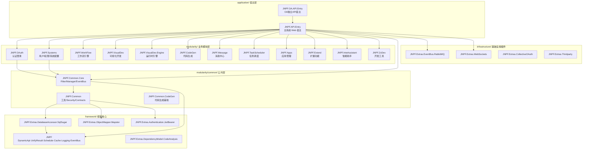

### 1.3 业务模块统一三层规范

每个业务模块严格遵循三层分离架构：

```
ModuleName/
├── JNPF.{ModuleName}.Entitys/      (数据模型层 — 实体类、枚举、DTO输入输出)
├── JNPF.{ModuleName}.Interfaces/   (接口定义层 — Service接口抽象)
└── JNPF.{ModuleName}/              (业务实现层 — Service实现、DynamicApi控制器)
```

| 模块 | Entitys | Interfaces | Service | 职责描述 |
|------|---------|------------|---------|----------|
| JNPF.OAuth | ✅ | ✅ | ✅ | 认证登录、Token颁发、OAuth第三方 |
| JNPF.Systems | ✅ | ✅ | ✅ | 用户/角色/权限/组织/字典/系统配置 |
| JNPF.WorkFlow | ✅ | ✅ | ✅ | 工作流引擎、流程设计、审批流转 |
| JNPF.VisualDev | ✅ | ✅ | ✅ | 可视化表单设计、在线开发 |
| JNPF.VisualDev.Engine | — | — | ✅ | 运行时引擎、表单渲染 |
| JNPF.CodeGen | ✅ | ✅ | ✅ | 代码生成器、模板引擎 |
| JNPF.Message | ✅ | ✅ | ✅ | 消息中心、站内信、IM |
| JNPF.TaskScheduler | ✅ | ✅ | ✅ | 定时任务调度管理 |
| JNPF.Apps | ✅ | ✅ | ✅ | 应用管理、App发布 |
| JNPF.Extend | ✅ | ✅ | ✅ | 扩展功能（邮件/短信/通知） |
| JNPF.InteAssistant | ✅ | ✅ | ✅ | 智能助手集成 |
| JNPF.ZxDev | ✅ | ✅ | ✅ | 开发者工具集 |

---

## 第二章：宿主启动与模块化机制

### 2.1 启动流程时序图

```mermaid
sequenceDiagram
    autonumber
    participant Main as Program.cs
    participant Serve as Serve.Run()
    participant RO as RunOptions
    participant WC as WebComponent.Load
    participant Builder as WebApplicationBuilder
    participant Inject as builder.Inject()
    participant DI as DI扫描注册
    participant Startup as AppStartup派生类
    participant App as WebApplication

    Main->>Serve: Serve.Run(RunOptions.Default.AddWebComponent&lt;WebComponent&gt;())
    Serve->>RO: 解析启动选项
    Serve->>Builder: WebApplication.CreateBuilder(args)
    Builder->>WC: AddWebComponent — Kestrel限流/日志过滤/控制台格式化
    Builder->>Inject: builder.Inject() — 框架核心注入
    Inject->>DI: 扫描 IPrivateDependency 标记类
    DI->>DI: 识别 ITransient/IScoped/ISingleton 生命周期
    DI->>DI: 注册服务到容器
    Inject->>Startup: 发现 AppStartup 派生类(Startup.cs)
    Startup->>Startup: ConfigureServices() 注册业务服务
    Serve->>App: builder.Build()
    Startup->>App: Configure() 注册中间件
    App->>App: app.Run() 启动监听
```

### 2.2 WebComponent 配置细节

`Program.cs` 中通过 `AddWebComponent<WebComponent>()` 注入启动前置配置：

```csharp
// 实际源码：application/JNPF.API.Entry/Program.cs
Serve.Run(RunOptions.Default
    .AddWebComponent<WebComponent>().WithArgs(args));

public class WebComponent : IWebComponent
{
    public void Load(WebApplicationBuilder builder, ComponentContext componentContext)
    {
        // 1. 日志过滤 — 屏蔽 Microsoft.Hosting / Microsoft.AspNetCore 类别，仅保留 Information 及以上
        builder.Logging.AddFilter((provider, category, logLevel) =>
            !new[] { "Microsoft.Hosting", "Microsoft.AspNetCore" }
                .Any(u => category.StartsWith(u)) && logLevel >= LogLevel.Information);

        // 2. Kestrel配置 — 请求体大小上限 50MB
        builder.WebHost.ConfigureKestrel(options =>
        {
            options.Limits.MaxRequestBodySize = 52428800; // 50 * 1024 * 1024
        });

        // 3. 控制台格式化 — 时间戳+线程Id+程序集
        builder.Logging.AddConsoleFormatter(options =>
        {
            options.DateFormat = "yyyy-MM-dd HH:mm:ss(zzz) dddd";
            options.WithTraceId = true;
            options.WithStackFrame = true;
        });
    }
}
```

| 配置项 | 值 | 说明 |
|--------|-----|------|
| MaxRequestBodySize | 52,428,800 (50MB) | 支持大文件上传场景 |
| 日志过滤 | 排除 Microsoft.Hosting/AspNetCore | 减少框架噪音日志 |
| 控制台格式 | `yyyy-MM-dd HH:mm:ss(zzz) dddd` | 含时区+星期 |
| WithTraceId | true | 显示线程Id便于追踪 |
| WithStackFrame | true | 显示调用程序集 |

### 2.3 AppStartup 自动发现机制

JNPF框架基于 Furion 衍生的 `AppStartup` 模式，实现零配置的模块自动发现：

1. **程序集扫描**：`builder.Inject()` 内部调用 `App.EffectiveTypes`，遍历所有已加载程序集的公开类型
2. **AppStartup 子类发现**：筛选所有继承自 `AppStartup` 抽象类的非抽象类
3. **排序执行**：按 `[AppStartup(Order)]` 特性的 Order 值排序，依次调用 `ConfigureServices()` 和 `Configure()`
4. **Startup.cs**（主宿主）：`public class Startup : AppStartup`，Order 默认为0

```
框架核心 Inject() 流程：
├── 扫描所有程序集 → 发现 AppStartup 子类
├── 按 Order 排序
├── 依次调用 ConfigureServices(IServiceCollection)
│   └── 注册：SqlSugar、JWT、CORS、EventBus、Schedule、Cache、WebSocket...
└── builder.Build() 后依次调用 Configure(IApplicationBuilder)
    └── 注册：中间件管道（14步顺序）
```

---

## 第三章：依赖注入与AOP横切

### 3.1 DI自动注册流程图

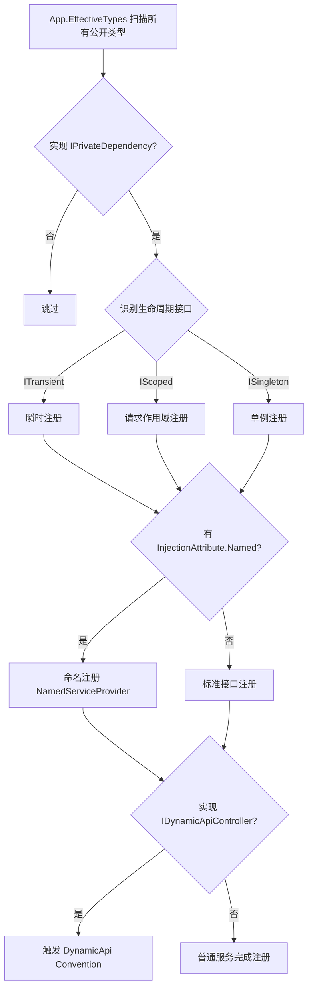

### 3.2 生命周期标记接口清单

| 接口 | 路径 | 生命周期 | 典型用途 |
|------|------|----------|----------|
| IPrivateDependency | `framework/JNPF/DependencyInjection/Dependencies/` | 扫描标记 | 所有可注册类必须继承 |
| ITransient | 同上 | 瞬时（每次解析新实例） | 无状态Service、Handler |
| IScoped | 同上 | 请求作用域 | CacheManager、UserManager、Repository |
| ISingleton | 同上 | 单例（全局唯一） | SqlSugarScope、LogEventSubscriber、配置类 |

**源码示例**：

```csharp
// framework/JNPF/DependencyInjection/Dependencies/IPrivateDependency.cs
public interface IPrivateDependency;

// framework/JNPF/DependencyInjection/Dependencies/ITransient.cs
public interface ITransient : IPrivateDependency;

// framework/JNPF/DependencyInjection/Dependencies/IScoped.cs
public interface IScoped : IPrivateDependency;

// framework/JNPF/DependencyInjection/Dependencies/ISingleton.cs
public interface ISingleton : IPrivateDependency;
```

### 3.3 MVC Filter 执行顺序架构

```mermaid
sequenceDiagram
    autonumber
    participant Request as HTTP Request
    participant DVF as DataValidationFilter<br/>Order=-1000
    participant RAF as RequestActionFilter<br/>Order=0
    participant Action as Action Method
    participant UOW as UnitOfWorkAttribute<br/>Order=9999
    participant SURF as SucceededUnifyResultFilter<br/>Order=8888
    participant FEF as FriendlyExceptionFilter
    participant Response as HTTP Response

    Request->>DVF: 模型验证（ModelState校验）
    alt 验证失败
        DVF-->>Response: 400 Bad Request + 验证错误信息
    end
    DVF->>RAF: 请求日志记录（Stopwatch计时开始）
    RAF->>Action: 执行业务逻辑
    alt 标注[UnitOfWork]
        Action->>UOW: 事务提交/回滚
    end
    Action->>SURF: 成功响应包装 RESTfulResult&lt;T&gt;
    RAF->>RAF: Stopwatch停止 + EventBus发布审计日志
    SURF->>Response: 200 OK + 统一JSON结构

    Note over FEF: 异常分支（独立于上述流程）
    Action-->>FEF: 抛出异常
    FEF->>FEF: 识别 AppFriendlyException / 系统异常
    FEF->>Response: 统一异常响应 + LogExceptionHandler异步记录
```

### 3.4 Startup.ConfigureServices 完整注册清单

| # | 注册项 | 代码 | 说明 |
|---|--------|------|------|
| 1 | 控制台格式化 | `services.AddConsoleFormatter()` | 自定义控制台输出格式 |
| 2 | SqlSugar | `services.SqlSugarConfigure()` | ORM核心：多租户/多库/AOP |
| 3 | JWT认证 | `services.AddJwt<JwtHandler>(enableGlobalAuthorize: true)` | Bearer认证 + 自定义Handler |
| 4 | 跨域 | `services.AddCorsAccessor()` | 全局CORS策略 |
| 5 | 远程请求 | `services.AddRemoteRequest()` | HTTP客户端工厂封装 |
| 6 | 任务队列 | `services.AddTaskQueue()` | 后台任务队列 |
| 7 | 任务调度 | `services.AddSchedule(options => options.AddPersistence<DbJobPersistence>())` | Cron调度+DB持久化 |
| 8 | 缓存选项 | `services.AddConfigurableOptions<CacheOptions>()` | Redis/Memory缓存配置 |
| 9 | EventBus选项 | `services.AddConfigurableOptions<EventBusOptions>()` | 事件总线类型/连接配置 |
| 10 | 连接串选项 | `services.AddConfigurableOptions<SqlSugar.ConnectionStringsOptions>()` | 数据库连接串 |
| 11 | 租户选项 | `services.AddConfigurableOptions<TenantOptions>()` | 多租户策略配置 |
| 12 | Controllers+Filter | `services.AddControllers().AddMvcFilter<RequestActionFilter>().AddInjectWithUnifyResult<RESTfulResultProvider>()` | MVC+统一响应+请求日志 |
| 13 | EventBus | `services.AddEventBus(options => ...)` | 事件总线+RabbitMQ替换+Retry执行器 |
| 14 | 视图引擎 | `services.AddViewEngine()` | 模板渲染引擎 |
| 15 | 脱敏检测 | `services.AddSensitiveDetection()` | 敏感词汇过滤 |
| 16 | WebSocket | `services.AddWebSocketManager()` | WebSocket连接管理 |
| 17 | 微信SDK | `services.AddSenparcGlobalServices().AddSenparcWeixinServices()` | 微信公众号/小程序 |
| 18 | 文件日志×3 | `AddFileLogging()` × {Info, Warning, Error} | 按级别分文件日志 |
| 19 | OSS服务 | `services.OSSServiceConfigure()` | 对象存储服务 |
| 20 | Swagger缓存 | `services.AddCachingSwaggerProvider()` | Swagger文档缓存加速 |

---

## 第四章：DynamicApi 动态控制器

### 4.1 约定驱动设计原理

JNPF框架继承Furion的DynamicApi机制，实现 **Service即Controller** 的零样板代码模式：

1. **标记接口**：类实现 `IDynamicApiController` 接口
2. **Convention转换**：`DynamicApiControllerApplicationModelConvention.Apply()` 在MVC模型构建阶段将Service类转换为Controller
3. **自动注册**：无需手动添加 `[ApiController]`、`[Route]` 等特性

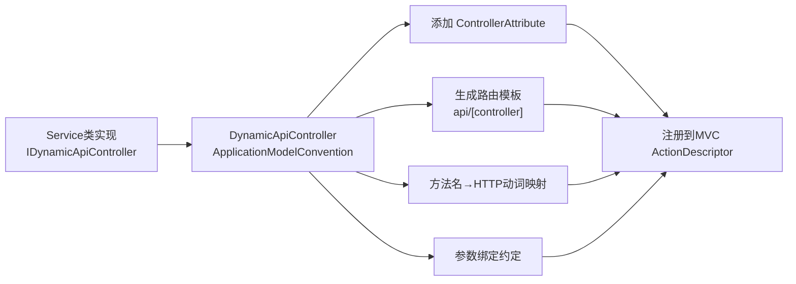

### 4.2 方法名→HTTP动词映射规则

| 方法名前缀 | HTTP动词 | 示例 |
|-----------|----------|------|
| Get* | GET | GetList(), GetInfo(), GetUser() |
| Query* | GET | QueryData(), QueryPageList() |
| Post* | POST | PostAdd(), PostCreate() |
| Create* | POST | CreateUser(), CreateOrder() |
| Add* | POST | AddItem(), AddConfig() |
| Put* | PUT | PutUpdate(), PutModify() |
| Update* | PUT | UpdateUser(), UpdateStatus() |
| Delete* | DELETE | DeleteById(), DeleteUser() |
| Remove* | DELETE | RemoveItem(), RemoveCache() |
| 显式特性 | 覆盖约定 | `[HttpPost("Login")]` |

### 4.3 路由生成规则

**类名→Controller名**：
- 类名 `UserService` → Controller名 `User`（去除Service后缀）
- 类名 `RoleService` → Controller名 `Role`

**路由模板**：
- 默认：`api/[controller]` → `api/User`
- 自定义命名空间：`[Route("api/permission/[controller]")]` → `api/permission/User`

**参数绑定约定**：
| 参数类型 | 绑定方式 | 说明 |
|---------|---------|------|
| 基元类型（int, string等） | [FromQuery] | URL查询参数 |
| 复杂对象 | [FromBody] | JSON请求体 |
| IFormFile | [FromForm] | 文件上传 |

### 4.4 Swagger集成

| 配置项 | 值 | 说明 |
|--------|-----|------|
| UI框架 | Knife4jUI | 中文化Swagger UI |
| 路由前缀 | `/newapi` | 访问地址：`http://host/newapi` |
| OpenAPI版本 | 3.0 | Swashbuckle 6.5.0 |
| 分组机制 | `ApiDescriptionSettings` | 按模块分组展示 |
| 缓存策略 | `AddCachingSwaggerProvider()` | 避免每次请求重新生成 |
| 预热 | `WarmupSwagger()` | 启动时预热避免首次20s超时 |

---

## 第五章：请求生命周期全链路

### 5.1 HTTP请求完整生命周期时序图

```mermaid
sequenceDiagram
    autonumber
    participant Client as 客户端
    participant Kestrel as Kestrel Server
    participant Middleware as 中间件管道
    participant Auth as Authentication
    participant DVF as DataValidationFilter
    participant RAF as RequestActionFilter
    participant Action as Action Method
    participant UOW as UnitOfWork
    participant SURF as SucceededUnifyResultFilter
    participant DB as SqlSugar
    participant Cache as Redis/Memory
    participant EventBus as EventBus

    Client->>Kestrel: HTTP Request
    Kestrel->>Middleware: 请求进入管道
    Middleware->>Middleware: UseUnifyResultStatusCodes
    Middleware->>Middleware: UseStaticFiles
    Middleware->>Middleware: UseWebSockets
    Middleware->>Middleware: UseRouting
    Middleware->>Middleware: UseCorsAccessor
    Middleware->>Auth: UseAuthentication
    Auth->>Auth: JWT Token验证/AutoRefreshToken
    Auth->>Middleware: UseAuthorization
    Middleware->>DVF: DataValidationFilter (Order=-1000)
    alt 模型验证失败
        DVF-->>Client: 400 + 验证错误
    end
    DVF->>RAF: RequestActionFilter (Order=0)
    RAF->>RAF: Stopwatch.Start()
    RAF->>Action: 执行业务方法
    Action->>DB: SqlSugar数据操作
    Action->>Cache: 缓存读写
    alt 标注[UnitOfWork]
        Action->>UOW: 事务控制
    end
    Action->>SURF: SucceededUnifyResultFilter (Order=8888)
    SURF->>SURF: 包装 RESTfulResult&lt;T&gt;
    RAF->>RAF: Stopwatch.Stop()
    RAF->>EventBus: PublishAsync(LogEventSource)
    EventBus->>EventBus: LogEventSubscriber → BASE_SYS_LOG
    SURF->>Client: 200 OK + 统一JSON
```

### 5.2 中间件注册完整顺序

| # | 中间件 | 代码 | 说明 |
|---|--------|------|------|
| 1 | 状态码拦截 | `app.UseUnifyResultStatusCodes()` | 非200状态码统一包装 |
| 2 | 静态文件 | `app.UseStaticFiles()` | wwwroot静态资源 |
| 3 | 微信全局注册 | `RegisterService.Start().UseSenparcGlobal()` | Senparc微信SDK |
| 4 | WebSocket | `app.UseWebSockets()` | WebSocket握手 |
| 5 | 路由 | `app.UseRouting()` | Endpoint路由 |
| 6 | 跨域 | `app.UseCorsAccessor()` | CORS策略 |
| 7 | 认证 | `app.UseAuthentication()` | JWT Bearer认证 |
| 8 | 授权 | `app.UseAuthorization()` | 权限校验 |
| 9 | 调度看板 | `app.UseScheduleUI()` | 定时任务管理UI |
| 10 | API文档 | `app.UseKnife4UI()` | Knife4UI路由/newapi |
| 11 | 框架注入 | `app.UseInject(string.Empty)` | DynamicApi+规格化文档 |
| 12 | WebSocket映射 | `app.MapWebSocketManager("/api/message/websocket")` | IM消息通道 |
| 13 | 端点映射 | `app.UseEndpoints()` | Controller路由 |
| 14 | Swagger预热 | `serviceProvider.WarmupSwagger()` | 启动时预热文档 |

### 5.3 统一响应格式

**RESTfulResult\<T\> 结构**：

```json
{
    "statusCode": 200,
    "succeeded": true,
    "data": { ... },
    "errors": null,
    "extras": null,
    "timestamp": 1716345600000
}
```

| 字段 | 类型 | 说明 |
|------|------|------|
| statusCode | int | HTTP状态码 |
| succeeded | bool | 操作是否成功 |
| data | T | 业务数据 |
| errors | object | 错误信息 |
| extras | object | 附加信息 |
| timestamp | long | 时间戳 |

**RESTfulResultProvider** 核心方法：
- `OnSucceeded(ActionExecutedContext)` → 成功时包装 `RESTfulResult<T>`
- `OnException(ExceptionContext)` → 异常时包装 `RESTfulResult<object>`，含 `Oops.Oh()` 友好异常

### 5.4 全局异常处理链路

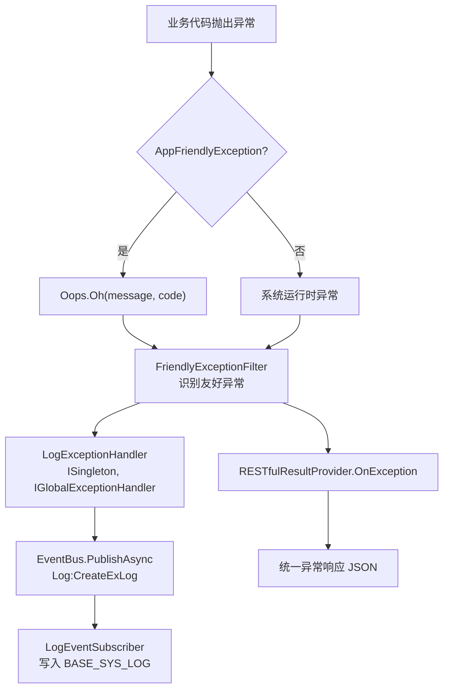

异常处理关键代码路径：
```
Oops.Oh(...) → AppFriendlyException
    → FriendlyExceptionFilter (框架层)
    → LogExceptionHandler.OnExceptionAsync() (业务层)
        → EventBus.PublishAsync(LogEventSource)
            → LogEventSubscriber.CreateLog()
                → _sqlSugarClient.Insertable(entity) → BASE_SYS_LOG
    → RESTfulResultProvider.OnException()
        → { statusCode: 400, succeeded: false, errors: "友好异常消息" }
```

---

## 第六章：ORM层与数据访问架构

### 6.1 SqlSugarRepository 构造函数完整逻辑

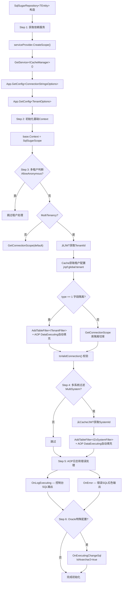

### 6.2 实体继承体系类图

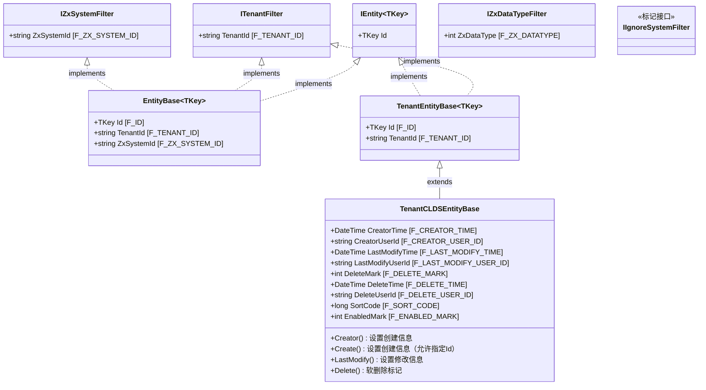

**实体层级选择指南**：

| 基类 | 适用场景 | 自动过滤 | 审计字段 |
|------|---------|---------|---------|
| `EntityBase<TKey>` | 全功能实体（租户+系统+主键） | TenantId + ZxSystemId | 无 |
| `TenantEntityBase<TKey>` | 仅需租户隔离的实体 | TenantId | 无 |
| `TenantCLDSEntityBase` | 完整业务实体（推荐） | TenantId | ✅ 全部审计字段 |

### 6.3 数据源切换时序图

```mermaid
sequenceDiagram
    autonumber
    participant Action as Action方法
    participant Repo as SqlSugarRepository
    participant Cache as ICacheManager
    participant Tenant as AsTenant()
    participant DB as 目标数据库

    Action->>Repo: 构造Repository
    Repo->>Repo: 获取ConnectionStrings配置
    Repo->>Repo: 获取TenantOptions配置

    alt 多租户模式 + 非匿名接口
        Repo->>Repo: 从JWT提取TenantId
        Repo->>Cache: Get("jnpf:global:tenant")
        Cache-->>Repo: GlobalTenantCacheModel
        alt type=0 库隔离
            Repo->>Tenant: IsAnyConnection(configId)
            alt 连接不存在
                Tenant->>Tenant: AddConnection(tenantConfig)
            end
            Tenant->>DB: GetConnectionScope(configId)
        else type=1 字段隔离
            Tenant->>DB: GetConnectionScope(default)
            DB->>DB: AddTableFilter&lt;ITenantFilter&gt;(TenantId == isolationField)
            DB->>DB: AOP DataExecuting 自动填充TenantId
        end
        DB->>DB: IsValidConnection() 校验
    else 非多租户
        Repo->>Tenant: GetConnectionScope(default)
    end

    alt 多系统模式
        Repo->>Cache: Get(userId_devSystemId)
        Repo->>DB: AddTableFilter&lt;IZxSystemFilter&gt;(ZxSystemId == systemId)
        DB->>DB: AOP DataExecuting 自动填充ZxSystemId
    end

    Repo->>DB: 设置CommandTimeOut=30
    DB->>DB: OnLogExecuting 控制台SQL输出
    DB->>DB: OnError 错误SQL记录
```

### 6.4 多数据库支持

| 数据库 | DbType枚举 | 连接串格式 | 特殊配置 |
|--------|-----------|-----------|---------|
| SQL Server | `SqlServer`（默认） | `Data Source={host};Initial Catalog={db};User ID={user};Password={pwd};` | 命名实例不含端口 |
| MySQL | `MySql` | `Server={host};Port={port};Database={db};Uid={user};Pwd={pwd};` | — |
| Oracle | `Oracle` | `Data Source=(DESCRIPTION=(ADDRESS=(PROTOCOL=TCP)(HOST={host})(PORT={port}))(CONNECT_DATA=(SERVICE_NAME={db})));User Id={user};Password={pwd};` | `IsNvarchar2=true` |
| PostgreSQL | `PostgreSQL` | `Host={host};Port={port};Database={db};Username={user};Password={pwd};` | — |
| DM（达梦） | `Dm` | `Server={host};Port={port};Database={db};User Id={user};PWD={pwd};` | 别名: dm8/dm |
| 人大金仓 | `Kdbndp` | `Server={host};Port={port};Database={db};User Id={user};Password={pwd};` | 别名: kdbndp/kingbasees |

**租户隔离类型对照**：

| type值 | 隔离方式 | 说明 |
|--------|---------|------|
| 0 | 库隔离（SCHEMA） | 每个租户独立数据库连接，AsTenant().GetConnectionScope() |
| 1 | 字段隔离（COLUMN） | 共享数据库，QueryFilter按TenantId过滤 |
| 2 | 连接隔离 | 独立连接串动态切换 |

---

## 第七章：认证与授权全链路

### 7.1 JWT认证完整时序图

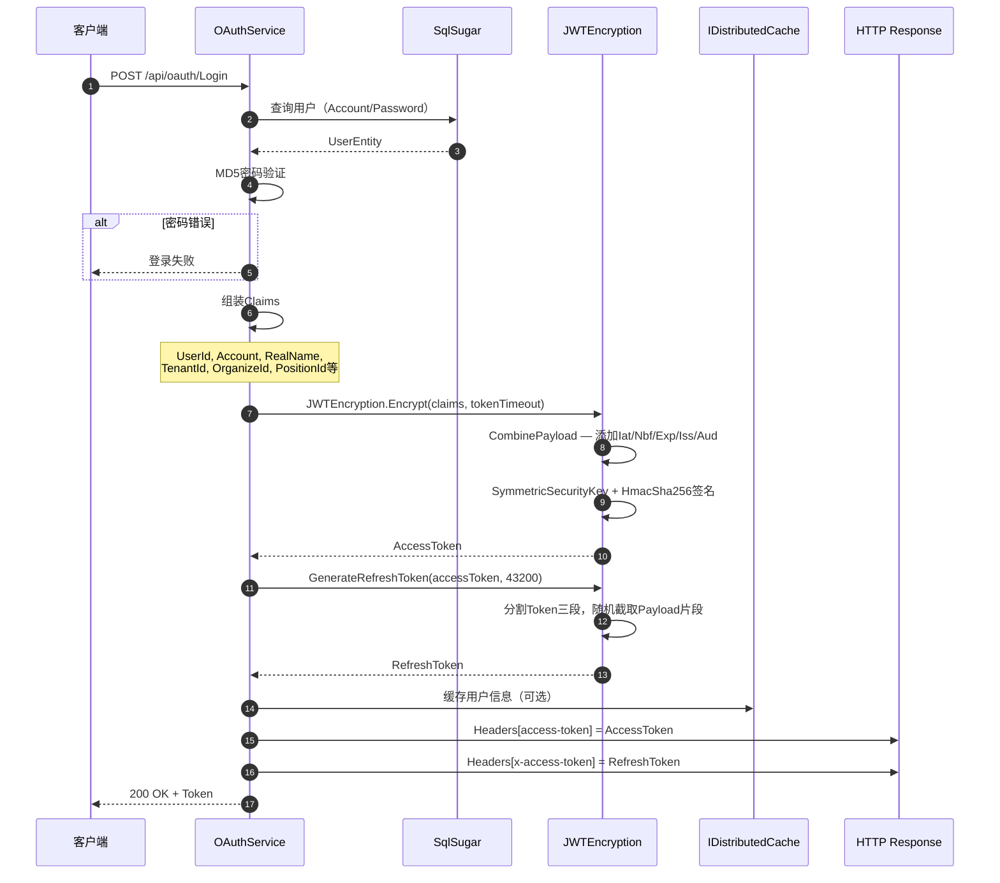

**Claims标准清单**：

| Claim键 | 常量 | 说明 |
|---------|------|------|
| UserId | ClaimConst.CLAINMUSERID | 用户ID |
| Account | ClaimConst.CLAINMACCOUNT | 登录账号 |
| RealName | ClaimConst.CLAINMREALNAME | 用户姓名 |
| TenantId | ClaimConst.TENANTID | 租户ID |
| OrganizeId | ClaimConst.ORGANIZEID | 组织ID |
| PositionId | ClaimConst.POSITIONID | 岗位ID |
| RoleId | ClaimConst.ROLEID | 角色ID |

### 7.2 Token刷新完整流程

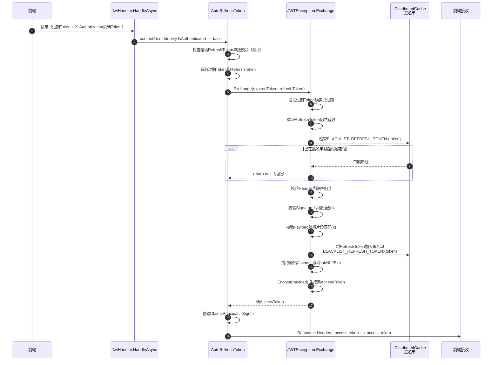

**RefreshToken安全机制详解**：

| 安全层 | 机制 | 说明 |
|--------|------|------|
| Token绑定 | 三段式片段校验 | f=Header, e=Signature, k=Payload随机片段 |
| 防重放 | 分布式缓存黑名单 | `BLACKLIST_REFRESH_TOKEN:{token}` → 时间戳 |
| 并发容错 | clockSkew容差值 | 默认5秒内允许并发刷新 |
| 一次性使用 | RefreshToken交换后失效 | SetString with AbsoluteExpiration |
| Token有效期 | AccessToken 20分钟 / RefreshToken 30天 | 可通过JWTSettings配置 |

### 7.3 RBAC权限模型

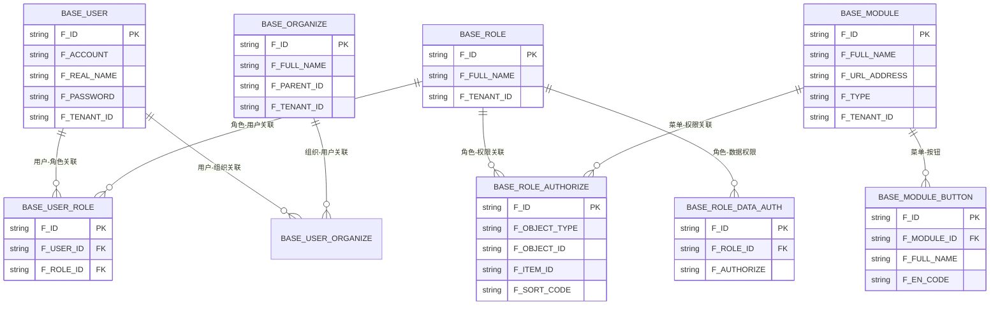

**当前权限校验状态**：

> ⚠️ **重要**：`JwtHandler.CheckAuthorzieAsync()` 当前实现恒返回 `true`，即 **所有认证通过的用户均拥有所有API权限**。RBAC权限控制仅在前端菜单/按钮层面生效，后端API级别鉴权需二次开发补全。

### 7.4 数据权限机制

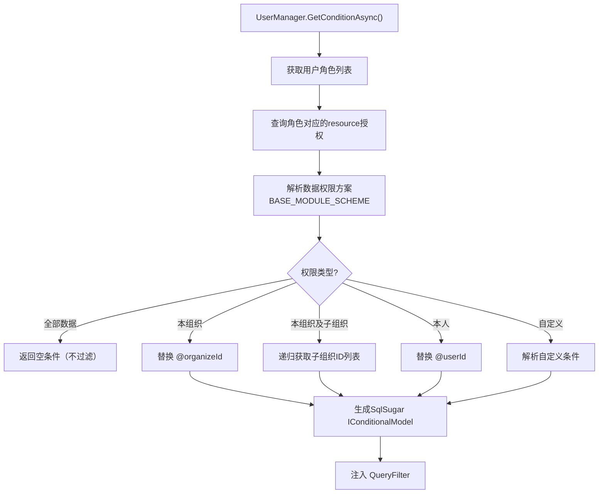

**数据权限占位符对照表**：

| 占位符 | 替换值 | 来源 |
|--------|--------|------|
| @userId | 当前用户ID | JWT Claims |
| @organizeId | 当前组织ID | JWT Claims |
| @subOrganizeId | 子组织ID列表 | 递归查询BASE_ORGANIZE |
| @positionId | 当前岗位ID | JWT Claims |

---

## 第八章：事件总线与任务调度

### 8.1 EventBus完整架构图

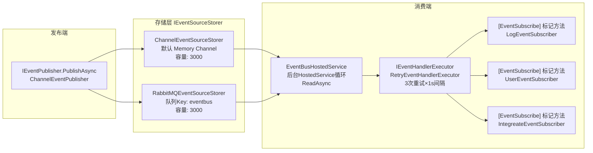

### 8.2 EventBus发布-消费完整时序图

```mermaid
sequenceDiagram
    autonumber
    participant Action as 业务代码
    participant Publisher as IEventPublisher
    participant Storer as IEventSourceStorer
    participant Hosted as EventBusHostedService
    participant Executor as RetryEventHandlerExecutor
    participant Handler as [EventSubscribe]方法
    participant DB as SqlSugar

    Action->>Publisher: PublishAsync(LogEventSource)
    Publisher->>Storer: WriteAsync(eventSource)
    alt Memory模式
        Storer->>Storer: Channel&lt;IEventSource&gt;.Writer.WriteAsync()
    else RabbitMQ模式
        Storer->>Storer: RabbitMQ Channel.BasicPublish<br/>routingKey="eventbus"
    end

    loop 后台循环
        Hosted->>Storer: ReadAsync()
        Storer-->>Hosted: IEventSource
        Hosted->>Executor: ExecuteAsync(context, handler)
        loop 最多3次重试
            Executor->>Handler: handler(context)
            alt 执行成功
                Handler->>DB: 异步写库
                Executor-->>Hosted: 成功退出
            else 执行失败
                Executor->>Executor: await Task.Delay(1000)
            end
        end
    end
```

### 8.3 RabbitMQ持久化存储器

`RabbitMQEventSourceStorer` 核心特性：

| 特性 | 配置 | 说明 |
|------|------|------|
| 连接工厂 | `ConnectionFactory { HostName, UserName, Password }` | 从EventBusOptions读取 |
| 队列声明 | `queue: "eventbus", durable: true, exclusive: false` | 持久化队列 |
| 消费模式 | `BasicConsume(noAck: false)` | 手动ACK确保可靠消费 |
| 容量控制 | `Channel capacity: 3000` | 有界Channel防止内存溢出 |
| 消息序列化 | `EventId + EventSource Content → JSON` | 自定义消息格式 |
| ACK机制 | 消费成功后 `BasicAck`，失败不ACK | 确保至少一次消费 |

### 8.4 EventBus配置与启动

**配置模型** (`EventBusOptions`)：

```csharp
// modularity/common/JNPF.Common.Core/EventBus/EventBusOptions.cs
public class EventBusOptions : IConfigurableOptions
{
    public EventBusType EventBusType { get; set; }   // Memory / RabbitMQ
    public string HostName { get; set; }              // RabbitMQ主机
    public string UserName { get; set; }              // RabbitMQ用户名
    public string Password { get; set; }              // RabbitMQ密码
}

public enum EventBusType { Memory, RabbitMQ, Redis, Kafka }
```

**Startup注册**：

```csharp
services.AddEventBus(options =>
{
    var config = App.GetOptions<EventBusOptions>();
    if (config.EventBusType != EventBusType.Memory)
    {
        switch (config.EventBusType)
        {
            case EventBusType.RabbitMQ:
                var factory = new ConnectionFactory { HostName, UserName, Password };
                var storer = new RabbitMQEventSourceStorer(factory, "eventbus", 3000);
                options.ReplaceStorer(sp => storer);
                break;
        }
    }
    options.UseUtcTimestamp = false;
    options.LogEnabled = true;                         // 启用事件日志
    options.AddExecutor<RetryEventHandlerExecutor>();   // 失败重试执行器
});
```

**已注册的事件订阅者**：

| 订阅者 | 生命周期 | 订阅事件Id | 功能 |
|--------|---------|-----------|------|
| LogEventSubscriber | ISingleton | Log:CreateReLog, Log:CreateExLog, Log:CreateVisLog, Log:CreateOpLog | 日志写入BASE_SYS_LOG |
| UserEventSubscriber | ITransient | 多个用户相关事件 | 用户缓存刷新/消息推送 |
| IntegreateEventSubscriber | ITransient | 集成事件 | 第三方集成处理 |

### 8.5 Schedule调度系统

**架构概览**：

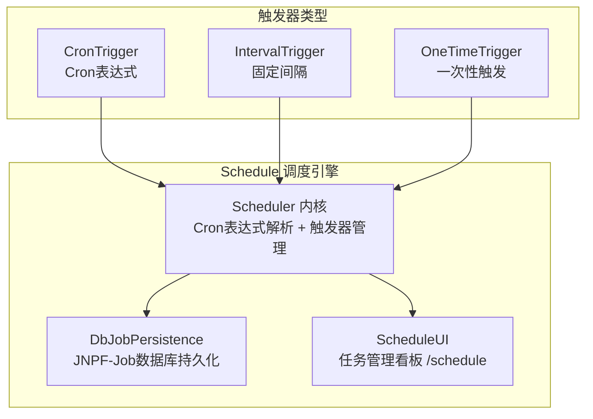

**触发器类型对比**：

| 触发器 | 说明 | 适用场景 |
|--------|------|---------|
| CronTrigger | 标准Cron表达式 | 定时报表、定期同步 |
| IntervalTrigger | 固定间隔（ms） | 心跳检测、轮询 |
| OneTimeTrigger | 延迟一次性触发 | 延迟任务 |

**Schedule vs TaskQueue**：

| 维度 | Schedule | TaskQueue |
|------|----------|-----------|
| 调度方式 | Cron定时触发 | 即时入队/后台消费 |
| 持久化 | DbJobPersistence | 内存Channel |
| 管理UI | ✅ ScheduleUI | ❌ |
| 适用场景 | 定时任务、周期性作业 | 异步任务、后台处理 |

---

## 第九章：缓存与分布式机制

### 9.1 Redis封装层

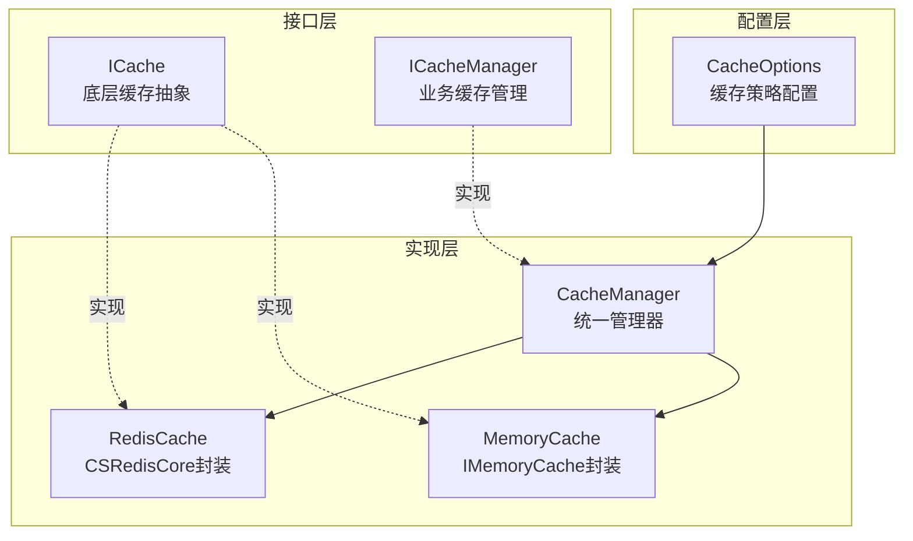

**ICacheManager 核心API**：

| 方法 | 说明 | Redis实现 | Memory实现 |
|------|------|-----------|------------|
| `Get<T>(key)` | 获取缓存 | CSRedis.Get<T> | MemoryCache.Get |
| `Set(key, value, timeSpan)` | 设置缓存 | CSRedis.Set | MemoryCache.Set |
| `Del(key)` | 删除缓存 | CSRedis.Del | MemoryCache.Remove |
| `Exists(key)` | 检查存在 | CSRedis.Exists | MemoryCache.ContainsKey |
| `SetNx(key, value, expire)` | 分布式锁 | CSRedis.SetNx | ConcurrentDictionary |
| `Incrby(key, incrBy)` | 自增计数 | CSRedis.IncrBy | Interlocked.Increment |

### 9.2 Key命名规范

| Key模式 | 用途 | 过期策略 |
|---------|------|----------|
| `jnpf:global:tenant` | 全局租户连接缓存 | 永久（手动刷新） |
| `{userId}_devSystemId` | 开发模式子系统Id | 会话级 |
| `OnlineTicket_{online_ticket}` | OAuth单点登录票据 | 短时（分钟级） |
| `BLACKLIST_REFRESH_TOKEN:{token}` | RefreshToken黑名单 | 随RefreshToken过期 |
| `{configId}{userId}_devSystemId` | 用户子系统Id缓存 | 会话级 |

### 9.3 分布式锁

通过 `ICacheManager.SetNx` 实现分布式锁：

```csharp
// 使用示例
var lockKey = $"lock:{resourceId}";
var acquired = _cacheManager.SetNx(lockKey, "locked", TimeSpan.FromSeconds(30));
if (acquired)
{
    try { /* 执行临界区操作 */ }
    finally { _cacheManager.Del(lockKey); }
}
```

| 特性 | 说明 |
|------|------|
| 原子性 | Redis SETNX 原子操作 |
| 过期自释放 | TimeSpan自动过期防死锁 |
| 非阻塞 | 返回bool指示是否获取成功 |
| 无续期 | 不支持看门狗自动续期（需二次开发） |

---

## 第十章：日志与监控审计

### 10.1 日志体系

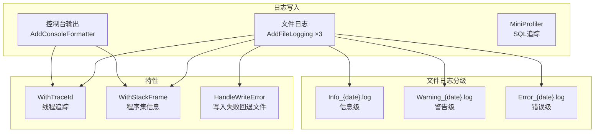

**文件日志配置**：

| 配置项 | 值 | 说明 |
|--------|-----|------|
| WithTraceId | true | 显示线程Id |
| WithStackFrame | true | 显示调用程序集 |
| FileNameRule | `{fileName}_{date}_{level}` | 每天每级别一个文件 |
| WriteFilter | 按LogLevel精确过滤 | Info/Warning/Error各一个Provider |
| HandleWriteError | 回退到 `*-oops.log` | 写入失败时启用备用文件 |

### 10.2 操作审计完整流转

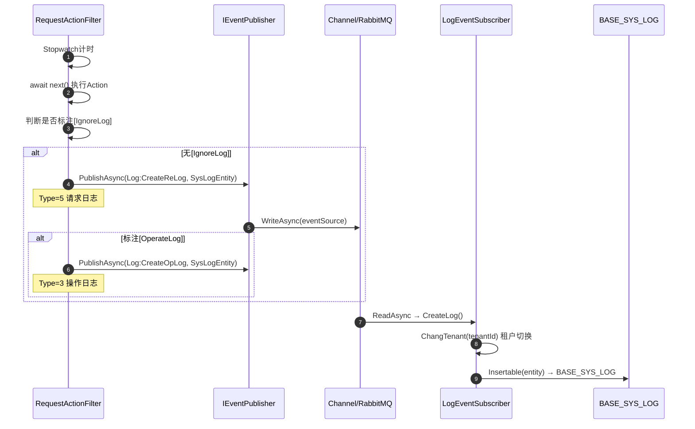

### 10.3 BASE_SYS_LOG表结构

| 字段名 | 列名 | 类型 | 说明 |
|--------|------|------|------|
| Id | F_ID | string | 主键（雪花ID） |
| UserId | F_USER_ID | string | 操作用户ID |
| UserName | F_USER_NAME | string | 用户名/账号 |
| Type | F_TYPE | int | 日志类型（见下表） |
| IPAddress | F_IP_ADDRESS | string | 请求IP |
| IPAddressName | F_IP_ADDRESS_NAME | string | IP归属地 |
| RequestURL | F_REQUEST_URL | string | 请求URL |
| RequestMethod | F_REQUEST_METHOD | string | HTTP方法 |
| RequestParam | F_REQUEST_PARAM | string | 请求参数JSON |
| RequestTarget | F_REQUEST_TARGET | string | Action描述 |
| RequestDuration | F_REQUEST_DURATION | int | 耗时(ms) |
| ModuleName | F_MODULE_NAME | string | 模块名（操作日志） |
| PlatForm | F_PLATFORM | string | 操作系统 |
| Browser | F_BROWSER | string | 浏览器信息 |
| Json | F_JSON | string | 响应内容/异常堆栈 |
| CreatorTime | F_CREATOR_TIME | DateTime | 创建时间 |

**日志类型枚举**：

| Type值 | 含义 | 事件Id | 触发条件 |
|--------|------|--------|----------|
| 1 | 登录日志 | Log:CreateVisLog | 用户登录/登出 |
| 3 | 操作日志 | Log:CreateOpLog | 标注[OperateLog]的Action |
| 4 | 异常日志 | Log:CreateExLog | 全局异常捕获 |
| 5 | 请求日志 | Log:CreateReLog | 所有非[IgnoreLog]请求 |

---

## 第十一章：实时通信双通道

### 11.1 原生WebSocket

```mermaid
graph LR
    subgraph server["服务端"]
        WSM["WebSocketConnectionManager<br/>连接池管理"]
        IMH["IMHandler<br/>消息处理器"]
    end

    subgraph client["客户端"]
        WS1["WebSocket Client 1"]
        WS2["WebSocket Client 2"]
        WSN["WebSocket Client N"]
    end

    WS1 & WS2 & WSN -->|ws://host/api/message/websocket| WSM
    WSM --> IMH
    IMH --> WSM
    WSM --> WS1 & WS2 & WSN
```

| 特性 | 说明 |
|------|------|
| 路由 | `/api/message/websocket` |
| 连接池 | `WebSocketConnectionManager` 管理所有活跃连接 |
| 消息处理器 | `IMHandler` 接口实现 |
| 注册方式 | `app.MapWebSocketManager(path, handler)` |

### 11.2 SignalR Hub

| 特性 | 说明 |
|------|------|
| 自动发现 | 通过 `[MapHub]` 特性扫描自动注册 |
| 消息类 | `IM.cs` 定义Hub方法 |
| 传输协议 | WebSockets / Server-Sent Events / Long Polling |
| 适用场景 | 实时通知、在线状态、即时通讯 |

### 11.3 双通道并存说明

JNPF同时使用原生WebSocket和SignalR两种实时通信机制：

| 维度 | 原生WebSocket | SignalR |
|------|--------------|---------|
| 路径 | `/api/message/websocket` | 自动扫描 `[MapHub]` |
| 协议 | WS仅 | WS/SSE/LP自动协商 |
| 管理 | `WebSocketConnectionManager` | Hub内置管理 |
| 消息格式 | 自定义 | Hub协议 |
| 适用场景 | IM消息推送 | 实时通知/状态广播 |
| 注册中间件 | `UseWebSockets()` + `MapWebSocketManager()` | `UseEndpoints(MapHub)` |

---

## 附录A：核心数据库表清单

### 用户权限类

| 表名 | 说明 | 关键字段 |
|------|------|----------|
| BASE_USER | 用户表 | F_ACCOUNT, F_PASSWORD, F_REAL_NAME |
| BASE_ROLE | 角色表 | F_FULL_NAME, F_ENABLED_MARK |
| BASE_USER_ROLE | 用户角色关联 | F_USER_ID, F_ROLE_ID |
| BASE_ORGANIZE | 组织机构 | F_FULL_NAME, F_PARENT_ID |
| BASE_USER_ORGANIZE | 用户组织关联 | F_USER_ID, F_ORGANIZE_ID |
| BASE_MODULE | 菜单模块 | F_FULL_NAME, F_URL_ADDRESS, F_TYPE |
| BASE_MODULE_BUTTON | 模块按钮 | F_MODULE_ID, F_EN_CODE |
| BASE_ROLE_AUTHORIZE | 角色权限授权 | F_OBJECT_ID, F_ITEM_ID |
| BASE_ROLE_DATA_AUTH | 角色数据权限 | F_ROLE_ID, F_AUTHORIZE |
| BASE_MODULE_SCHEME | 数据权限方案 | 方案定义及条件规则 |

### 日志审计类

| 表名 | 说明 | 关键字段 |
|------|------|----------|
| BASE_SYS_LOG | 系统日志 | F_TYPE, F_USER_ID, F_REQUEST_URL |
| JNPF-Job | 定时任务 | 任务定义及执行记录 |

### 字典配置类

| 表名 | 说明 | 关键字段 |
|------|------|----------|
| BASE_DICTIONARY_DATA | 数据字典 | F_DIC_CATEGORY_ID, F_FULL_NAME |
| BASE_DICTIONARY_CATEGORY | 字典分类 | F_EN_CODE |

### 系统配置类

| 表名 | 说明 | 关键字段 |
|------|------|----------|
| BASE_SYS_CONFIG | 系统配置 | F_KEY, F_VALUE |
| BASE_DB_CONNECTION | 数据库连接 | F_HOST, F_PORT, F_DB_NAME |
| BASE_TENANT | 租户管理 | F_TENANT_ID, F_TYPE |

---

## 附录B：关键代码路径索引

### 框架核心

| 路径 | 说明 |
|------|------|
| `framework/JNPF/App/` | 全局静态类 App |
| `framework/JNPF/DependencyInjection/` | DI自动注册（ITransient/IScoped/ISingleton） |
| `framework/JNPF/DynamicApiController/` | 动态API约定 |
| `framework/JNPF/UnifyResult/` | 统一响应结果 |
| `framework/JNPF/EventBus/` | 事件总线核心 |
| `framework/JNPF/Schedule/` | 定时调度引擎 |
| `framework/JNPF/Cache/` | 缓存抽象（Redis/Memory） |
| `framework/JNPF/FriendlyException/` | 友好异常 |
| `framework/JNPF/SpecificationDocument/` | OpenAPI文档 |
| `framework/JNPF/DataValidation/` | 数据验证 |
| `framework/JNPF/ConfigurableOptions/` | 选项模式配置 |

### 扩展包

| 路径 | 说明 |
|------|------|
| `framework/JNPF.Extras.Authentication.JwtBearer/JWTEncryption.cs` | JWT加解密全链路 |
| `framework/JNPF.Extras.DatabaseAccessor.SqlSugar/Repositories/SqlSugarRepository.cs` | 仓储构造/多租户切库 |
| `framework/JNPF.Extras.DatabaseAccessor.SqlSugar/Models/` | 实体过滤器接口（ITenantFilter等） |
| `framework/JNPF.Extras.ObjectMapper.Mapster/` | Mapster对象映射扩展 |
| `framework/JNPF.Extras.DependencyModel.CodeAnalysis/` | 程序集分析 |

### 基础设施

| 路径 | 说明 |
|------|------|
| `infrastructure/JNPF.Extras.EventBus.RabbitMQ/` | RabbitMQ事件存储器 |
| `infrastructure/JNPF.Extras.WebSockets/` | WebSocket管理 |
| `infrastructure/JNPF.Extras.CollectiveOAuth/` | 第三方OAuth |
| `infrastructure/JNPF.Extras.Thirdparty/` | 第三方服务集成 |

### 业务公共层

| 路径 | 说明 |
|------|------|
| `modularity/common/JNPF.Common.Core/Filter/RequestActionFilter.cs` | 请求日志拦截 |
| `modularity/common/JNPF.Common.Core/Filter/LogExceptionHandler.cs` | 全局异常日志 |
| `modularity/common/JNPF.Common.Core/EventBus/LogEventSubscriber.cs` | 日志事件订阅 |
| `modularity/common/JNPF.Common.Core/EventBus/RetryEventHandlerExecutor.cs` | 重试执行器 |
| `modularity/common/JNPF.Common.Core/EventBus/EventBusOptions.cs` | EventBus配置 |
| `modularity/common/JNPF.Common.Core/Manager/User/` | 用户管理器 |
| `modularity/common/JNPF.Common.Core/Manager/Tenant/` | 租户管理器 |
| `modularity/common/JNPF.Common/Contracts/EntityBase.cs` | 全功能实体基类 |
| `modularity/common/JNPF.Common/Contracts/TenantEntityBase.cs` | 租户实体基类 |
| `modularity/common/JNPF.Common/Contracts/TenantCLDSEntityBase.cs` | 完整审计实体基类 |

### 宿主层

| 路径 | 说明 |
|------|------|
| `application/JNPF.API.Entry/Program.cs` | 启动入口 |
| `application/JNPF.API.Entry/Startup.cs` | 服务注册+中间件管道 |
| `application/JNPF.OA.API.Entry/OAStartup.cs` | OA独立宿主 |

---

## 附录C：二次开发指南

### C.1 新增业务模块API

**步骤**：

1. 创建模块三层目录结构：
   ```
   modularity/newbiz/
   ├── JNPF.NewBiz.Entitys/
   ├── JNPF.NewBiz.Interfaces/
   └── JNPF.NewBiz/
   ```

2. 实体类继承体系选择：
   ```csharp
   // 需要完整审计字段（推荐）
   public class OrderEntity : TenantCLDSEntityBase { ... }

   // 仅需租户隔离
   public class ConfigEntity : TenantEntityBase<string> { ... }

   // 需要租户+系统过滤
   public class SystemEntity : EntityBase<string> { ... }
   ```

3. Service实现 DynamicApi：
   ```csharp
   public class OrderService : IOrderService, IDynamicApiController, ITransient
   {
       private readonly ISqlSugarRepository<OrderEntity> _repository;
       // 方法名约定自动映射HTTP动词
       public async Task GetList() { ... }        // → GET
       public async Task Create(OrderCrInput input) { ... }  // → POST
       public async Task Update(string id, OrderUpInput input) { ... }  // → PUT
       public async Task Delete(string id) { ... }  // → DELETE
   }
   ```

4. 宿主项目添加 ProjectReference

### C.2 扩展租户策略

**自定义租户隔离方式**：

1. 在 `TenantLinkExtensions.ToDbType()` 中添加新数据库类型
2. 在 `TenantLinkExtensions.ToConnectionString()` 中添加新连接串格式
3. 实现 `ITenantFilter` / `IZxSystemFilter` 接口定义新的过滤维度
4. 在 `SqlSugarRepository` 构造函数中扩展 `type` 分支

**租户缓存刷新**：

- 缓存键：`jnpf:global:tenant`
- 缓存值：`List<GlobalTenantCacheModel>`
- 刷新时机：租户配置变更时清缓存

### C.3 切换缓存实现

**从Redis切换到Memory**：

1. 修改 `CacheOptions` 配置，设置缓存类型为 Memory
2. `CacheManager` 内部根据配置自动选择 `RedisCache` 或 `MemoryCache`
3. 注意：Memory模式不支持分布式锁（`SetNx` 使用 `ConcurrentDictionary` 模拟）
4. 注意：Memory模式不支持跨实例缓存共享

**扩展自定义缓存**：

1. 实现 `ICache` 接口
2. 注册到 `ICacheManager` 的实现中
3. 在 `CacheOptions` 中添加新类型分支

---

> **文档结束** — 本文档基于 `d:/liu202505v2` 源码深度调研生成，所有代码路径、类名、配置值均来自实际源码验证。
