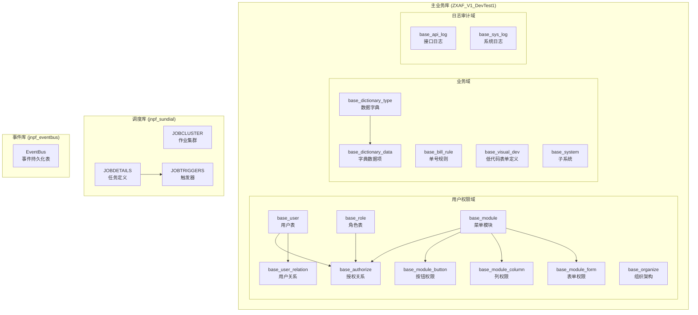
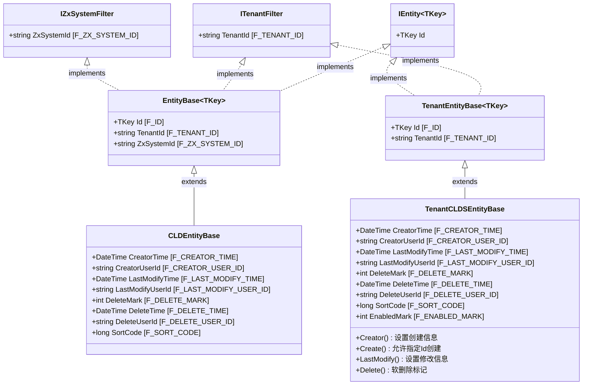
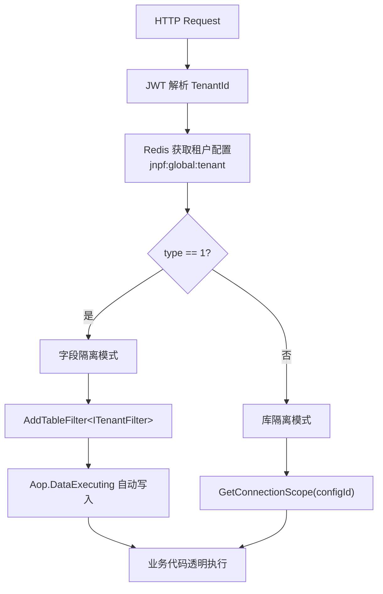

# 专项文档 · JNPF 低代码平台 — 数据库设计与数据架构

> **文档版本**：v1.0  
> **分析范围**：主业务库、调度库、事件库完整设计  
> **数据库引擎**：SQL Server 2022（兼容 Oracle/MySQL/PostgreSQL）  
> **ORM 框架**：SqlSugar  

---

## 第一章：数据库总体架构

### 1.1 三库架构设计

JNPF 低代码平台采用**三库分离架构**，将核心业务数据、定时调度数据、事件持久化数据分别存储于独立数据库中，实现职责隔离与独立运维。

| 对比项 | 主业务库 | 调度库 | 事件库 |
|--------|---------|--------|--------|
| **数据库名** | ZXAF_V1_DevTest1 | jnpf_sundial | jnpf_eventbus |
| **核心职责** | 用户权限、业务数据、低代码定义、日志审计 | 定时任务管理、触发器配置、执行日志 | EventBus 事件持久化、消息可靠投递 |
| **访问模式** | 高频读写，OLTP | 低频写入，定时触发读取 | 高频写入，低频回溯查询 |
| **数据规模** | 大（核心表百万级） | 小（千级任务） | 中（日志快速增长） |
| **隔离策略** | 多租户字段隔离 / 库隔离 | 租户字段隔离（TENANTID） | 无租户隔离 |
| **连接配置** | appsettings.json → DefaultConnection | appsettings.json → SchedulerConnection | appsettings.json → EventBusConnection |
| **ORM 注册** | SqlSugarRepository<T> + QueryFilter | Sundial 框架自管理 | EventBus RabbitMQ/内存 + 持久化 |

### 1.2 数据库架构全景图



---

## 第二章：核心表详细设计

### 2.1 用户表（base_user）

用户表是系统最核心的实体表，包含 **70+ 字段**，按功能域分组如下：

#### 2.1.1 完整字段清单

**基本信息**

| 字段名 | 数据类型 | 说明 |
|--------|---------|------|
| f_id | nvarchar(50) | 主键（雪花ID） |
| f_account | nvarchar(50) | 登录账号 |
| f_real_name | nvarchar(50) | 真实姓名 |
| f_nick_name | nvarchar(50) | 昵称 |
| f_quick_query | nvarchar(100) | 快速检索码（拼音首字母） |
| f_head_icon | nvarchar(max) | 头像URL |
| f_gender | int | 性别（0男 1女 2未知） |
| f_birthday | datetime | 生日 |
| f_signature | nvarchar(500) | 个性签名 |
| f_description | nvarchar(500) | 描述说明 |

**联系方式**

| 字段名 | 数据类型 | 说明 |
|--------|---------|------|
| f_mobile_phone | nvarchar(20) | 手机号 |
| f_tele_phone | nvarchar(20) | 电话 |
| f_landline | nvarchar(50) | 座机 |
| f_email | nvarchar(50) | 邮箱 |
| f_postal_address | nvarchar(500) | 邮寄地址 |
| f_urgent_contacts | nvarchar(50) | 紧急联系人 |
| f_urgent_tele_phone | nvarchar(50) | 紧急联系电话 |

**身份认证**

| 字段名 | 数据类型 | 说明 |
|--------|---------|------|
| f_password | nvarchar(50) | 密码（MD5 + Salt） |
| f_secretkey | nvarchar(50) | 密码盐值 |
| f_change_password_date | datetime | 最后修改密码时间 |
| f_nation | nvarchar(50) | 民族 |
| f_native_place | nvarchar(50) | 籍贯 |
| f_certificates_type | nvarchar(50) | 证件类型 |
| f_certificates_number | nvarchar(50) | 证件号码 |
| f_education | nvarchar(50) | 学历 |

**登录追踪**

| 字段名 | 数据类型 | 说明 |
|--------|---------|------|
| f_first_log_time | datetime | 首次登录时间 |
| f_first_log_ip | nvarchar(50) | 首次登录IP |
| f_prev_log_time | datetime | 上次登录时间 |
| f_prev_log_ip | nvarchar(50) | 上次登录IP |
| f_last_log_time | datetime | 最近登录时间 |
| f_last_log_ip | nvarchar(50) | 最近登录IP |
| f_log_success_count | int | 登录成功次数 |
| f_log_error_count | int | 登录失败次数 |

**用户配置**

| 字段名 | 数据类型 | 说明 |
|--------|---------|------|
| f_language | nvarchar(50) | 语言偏好 |
| f_theme | nvarchar(50) | 主题配置 |
| f_common_menu | nvarchar(max) | 常用菜单（JSON数组） |
| f_property_json | nvarchar(max) | 扩展属性（JSON） |
| f_portal_id | nvarchar(max) | 门户ID |

**权限关系**

| 字段名 | 数据类型 | 说明 |
|--------|---------|------|
| f_role_id | nvarchar(max) | 角色ID（多值逗号分隔） |
| f_organize_id | nvarchar(50) | 所属组织ID |
| f_position_id | nvarchar(50) | 岗位ID |
| f_manager_id | nvarchar(50) | 直属上级ID |
| f_group_id | nvarchar(50) | 分组ID |
| f_is_administrator | int | 是否管理员（0否 1是） |
| f_rank | nvarchar(50) | 职级 |

**企业集成**

| 字段名 | 数据类型 | 说明 |
|--------|---------|------|
| f_ding_job_number | nvarchar(50) | 钉钉工号 |
| f_openId | varchar(50) | 第三方OpenID |
| f_entry_date | datetime | 入职日期 |

**系统状态**

| 字段名 | 数据类型 | 说明 |
|--------|---------|------|
| f_lock_mark | int | 锁定标志（0正常 1锁定） |
| f_unlock_time | datetime | 解锁时间 |
| f_enabled_mark | int | 启用标志（0禁用 1启用） |
| f_handover_mark | int | 交接标志 |
| f_handover_userid | nvarchar(100) | 交接目标用户ID |
| f_is_dev | int | 是否开发者 |
| f_system_id | nvarchar(50) | 归属系统ID |
| f_app_system_id | nvarchar(50) | APP系统ID |
| f_biz_system_Id | nvarchar(50) | 业务系统ID |
| f_inte_assistant | int | 智能助手标识 |

**审计字段**

| 字段名 | 数据类型 | 说明 |
|--------|---------|------|
| f_sort_code | bigint | 排序码 |
| f_creator_time | datetime | 创建时间 |
| f_creator_user_id | nvarchar(50) | 创建人ID |
| f_last_modify_time | datetime | 最后修改时间 |
| f_last_modify_user_id | nvarchar(50) | 最后修改人ID |
| f_delete_time | datetime | 删除时间 |
| f_delete_user_id | nvarchar(50) | 删除操作人ID |
| f_delete_mark | int | 软删标志（0未删 1已删） |
| f_tenant_id | nvarchar(50) | 租户ID |
| f_zx_system_id | nvarchar(50) | 系统应用ID |

#### 2.1.2 关键字段详细说明

| 字段名 | 数据类型 | 约束 | 说明 |
|--------|---------|------|------|
| f_id | nvarchar(50) | PK, NOT NULL | 雪花算法生成，全局唯一主键 |
| f_account | nvarchar(50) | 业务唯一 | 登录账号，同租户下唯一 |
| f_real_name | nvarchar(50) | — | 真实姓名，用于显示 |
| f_password | nvarchar(50) | NOT NULL | MD5(明文+f_secretkey) 加密存储 |
| f_secretkey | nvarchar(50) | NOT NULL | 随机盐值，每用户唯一 |
| f_role_id | nvarchar(max) | — | 多角色逗号分隔，如 "role1,role2" |
| f_organize_id | nvarchar(50) | FK逻辑 | 关联 base_organize.f_id |
| f_is_administrator | int | — | 超管标识，跳过部分权限校验 |
| f_lock_mark | int | DEFAULT 0 | 密码错误次数达阈值自动锁定 |
| f_enabled_mark | int | DEFAULT 1 | 软禁用，登录时校验 |
| f_delete_mark | int | DEFAULT 0 | 软删除标志，全局 QueryFilter 过滤 |
| f_tenant_id | nvarchar(50) | — | 多租户隔离字段 |
| f_zx_system_id | nvarchar(50) | — | 多系统隔离字段 |
| f_common_menu | nvarchar(max) | — | JSON数组，存储用户自定义常用菜单ID |
| f_property_json | nvarchar(max) | — | 扩展JSON，灵活存储额外属性 |
| f_change_password_date | datetime | — | 用于密码过期策略判断 |
| f_log_success_count | int | DEFAULT 0 | 登录审计，安全分析 |
| f_log_error_count | int | DEFAULT 0 | 连续失败锁定策略依据 |
| f_last_log_time | datetime | — | 活跃度分析、会话管理 |
| f_openId | varchar(50) | — | 第三方OAuth绑定 |

#### 2.1.3 关键约束和索引建议

| 约束/索引 | 类型 | 字段 | 说明 |
|-----------|------|------|------|
| PK_base_user | 聚集主键 | f_id ASC | 雪花ID有序，聚集索引友好 |
| IX_user_account | UNIQUE (业务) | f_account, f_tenant_id, f_delete_mark | 同租户内账号唯一 |
| IX_user_organize | 非聚集 | f_organize_id, f_delete_mark | 按部门查询用户列表 |
| IX_user_tenant | 非聚集 | f_tenant_id, f_delete_mark | 多租户查询过滤 |
| IX_user_mobile | 非聚集 | f_mobile_phone, f_tenant_id | 手机号查询/登录 |
| IX_user_delete | 过滤索引 | f_delete_mark WHERE f_delete_mark=0 | 过滤已删除数据 |

---

### 2.2 角色表（base_role）

| 字段名 | 数据类型 | 说明 |
|--------|---------|------|
| f_id | nvarchar(50) | 主键（雪花ID） |
| f_full_name | nvarchar(200) | 角色名称 |
| f_en_code | nvarchar(200) | 角色编码（唯一标识） |
| f_type | nvarchar(50) | 角色类型 |
| f_global_mark | int | 全局角色标志（1=跨租户生效） |
| f_property_json | nvarchar(max) | 扩展属性（JSON） |
| f_description | nvarchar(500) | 角色描述 |
| f_enabled_mark | int | 启用标志（0禁用 1启用） |
| f_sort_code | bigint | 排序码 |
| f_creator_time | datetime | 创建时间 |
| f_creator_user_id | nvarchar(50) | 创建人ID |
| f_last_modify_time | datetime | 最后修改时间 |
| f_last_modify_user_id | nvarchar(50) | 最后修改人ID |
| f_delete_time | datetime | 删除时间 |
| f_delete_user_id | nvarchar(50) | 删除操作人ID |
| f_delete_mark | int | 软删标志（0未删 1已删） |
| f_tenant_id | nvarchar(50) | 租户ID |
| f_zx_system_id | nvarchar(50) | 系统应用ID |

**设计说明**：
- `f_global_mark` 为 1 时，该角色对所有租户可见，典型场景：平台管理员角色
- `f_property_json` 存储角色关联的数据权限规则配置（JSON结构）
- `f_type` 用于区分角色分类（如：系统角色、业务角色、自定义角色）

---

### 2.3 菜单/模块表（base_module）

| 字段名 | 数据类型 | 说明 |
|--------|---------|------|
| f_id | nvarchar(50) | 主键（雪花ID） |
| f_parent_id | nvarchar(50) | 父级ID（树形结构自关联） |
| f_type | int | 模块类型（1目录 2菜单 3页面） |
| f_full_name | nvarchar(200) | 模块名称 |
| f_en_code | nvarchar(200) | 模块编码 |
| f_category | nvarchar(50) | 分类 |
| f_url_address | nvarchar(500) | 路由地址/组件路径 |
| f_icon | nvarchar(500) | 图标 |
| f_link_target | nvarchar(50) | 链接目标（_blank/_self） |
| **f_is_button_authorize** | **int** | **是否启用按钮权限（0否 1是）** |
| **f_is_column_authorize** | **int** | **是否启用列权限（0否 1是）** |
| **f_is_data_authorize** | **int** | **是否启用数据权限（0否 1是）** |
| **f_is_form_authorize** | **int** | **是否启用表单权限（0否 1是）** |
| f_module_id | nvarchar(50) | 关联模块ID |
| f_system_id | nvarchar(50) | 归属子系统ID |
| f_property_json | nvarchar(max) | 扩展配置（JSON） |
| f_description | nvarchar(500) | 描述 |
| f_enabled_mark | int | 启用标志 |
| f_sort_code | bigint | 排序码 |
| — | — | 标准审计字段（略） |
| f_tenant_id | nvarchar(50) | 租户ID |
| f_zx_system_id | nvarchar(50) | 系统应用ID |

**设计说明**：

1. **树形结构**：通过 `f_parent_id` 自关联实现无限层级菜单树，顶级节点 `f_parent_id = '0'` 或 NULL
2. **4层细粒度权限开关**：
   - `f_is_button_authorize`：开启后该模块的按钮级权限生效，关联 `base_module_button`
   - `f_is_column_authorize`：开启后该模块的列级权限生效，关联 `base_module_column`
   - `f_is_data_authorize`：开启后该模块的数据权限方案生效
   - `f_is_form_authorize`：开启后该模块的表单字段权限生效，关联 `base_module_form`
3. **f_property_json 扩展配置**：存储模块的前端渲染配置、路由元数据、组件参数等，结构灵活可扩展

---

### 2.4 授权关系表（base_authorize）

RBAC 权限分配核心表，实现用户/角色/岗位与菜单/按钮/列/数据权限的多对多关联。

| 字段名 | 数据类型 | 说明 |
|--------|---------|------|
| f_id | nvarchar(50) | 主键 |
| f_item_type | nvarchar(50) | 权限项类型（module/button/column/resource） |
| f_item_id | nvarchar(50) | 权限项ID（→对应类型表的主键） |
| f_object_type | nvarchar(50) | 授权对象类型（Role/User/Position） |
| f_object_id | nvarchar(50) | 授权对象ID（→角色/用户/岗位的主键） |
| f_sort_code | bigint | 排序码 |
| f_creator_time | datetime | 创建时间 |
| f_creator_user_id | nvarchar(50) | 创建人ID |
| f_last_modify_time | datetime | 修改时间 |
| f_last_modify_user_id | nvarchar(50) | 修改人ID |
| f_delete_time | datetime | 删除时间 |
| f_delete_user_id | nvarchar(50) | 删除人ID |
| f_delete_mark | int | 软删标志 |
| f_tenant_id | nvarchar(50) | 租户ID |
| f_zx_system_id | nvarchar(50) | 系统应用ID |
| F_ENABLED_MARK | int | 启用标志 |

**权限项类型枚举**：

| f_item_type 值 | 含义 | 对应 f_item_id 指向 |
|----------------|------|-------------------|
| module | 菜单权限 | base_module.f_id |
| button | 按钮权限 | base_module_button.f_id |
| column | 列权限 | base_module_column.f_id |
| resource | 数据权限方案 | base_module_authorize.f_id |

**授权对象类型枚举**：

| f_object_type 值 | 含义 | 对应 f_object_id 指向 |
|------------------|------|---------------------|
| Role | 角色 | base_role.f_id |
| User | 用户 | base_user.f_id |
| Position | 岗位 | base_organize.f_id (岗位类型) |

**权限查询SQL示例**（查询用户全部菜单权限）：

```sql
-- 查询指定用户通过角色获得的所有菜单权限
SELECT DISTINCT m.f_id, m.f_full_name, m.f_url_address, m.f_icon, m.f_sort_code
FROM base_module m
INNER JOIN base_authorize a ON a.f_item_id = m.f_id 
    AND a.f_item_type = 'module'
    AND a.f_delete_mark = 0
WHERE a.f_object_type = 'Role'
    AND a.f_object_id IN (
        -- 用户关联的角色列表（逗号分隔拆分）
        SELECT value FROM STRING_SPLIT(
            (SELECT f_role_id FROM base_user WHERE f_id = @userId AND f_delete_mark = 0),
            ','
        )
    )
    AND m.f_enabled_mark = 1
    AND m.f_delete_mark = 0
ORDER BY m.f_sort_code;
```

---

### 2.5 日志表（base_api_log / base_sys_log）

系统包含两张日志表，结构基本一致，`base_api_log` 额外增加了请求体/响应体存储能力。

#### base_api_log 完整字段

| 字段名 | 数据类型 | 说明 |
|--------|---------|------|
| f_id | nvarchar(50) | 主键 |
| f_user_id | nvarchar(50) | 操作用户ID |
| f_user_name | nvarchar(100) | 操作用户名 |
| f_type | int | 日志类型（见枚举） |
| f_level | int | 日志级别 |
| f_ip_address | nvarchar(50) | 客户端IP |
| f_ip_address_name | nvarchar(50) | IP归属地 |
| f_request_url | nvarchar(500) | 请求URL |
| f_request_method | nvarchar(50) | HTTP方法 |
| f_request_duration | int | 请求耗时(ms) |
| f_json | nvarchar(max) | 请求/响应摘要JSON |
| f_plat_form | nvarchar(500) | 平台标识 |
| f_module_id | nvarchar(50) | 所属模块ID |
| f_module_name | nvarchar(50) | 模块名称 |
| f_object_id | nvarchar(50) | 操作对象ID |
| f_description | nvarchar(500) | 操作描述 |
| f_browser | nvarchar(50) | 浏览器信息 |
| f_request_param | nvarchar(max) | 请求参数 |
| f_request_target | nvarchar(max) | 请求目标 |
| f_login_mark | int | 登录标记 |
| f_login_type | int | 登录类型 |
| F_REQUEST_Body_Type | varchar(255) | 请求体类型 |
| F_REQUEST_Body | text | 请求体内容 |
| F_REQUEST_Headers | text | 请求头 |
| F_REQUEST_Result | text | 响应结果 |
| F_Msg | text | 消息/错误信息 |
| F_Status | int | HTTP状态码 |
| f_inte_assistant | int | 智能助手标识 |
| — | — | 标准审计字段 |

**日志类型枚举 (f_type)**：

| 值 | 含义 | 说明 |
|----|------|------|
| 1 | 新增 | INSERT 操作 |
| 2 | 修改 | UPDATE 操作 |
| 3 | 删除 | DELETE 操作 |
| 4 | 查询 | SELECT 操作 |
| 5 | 导出 | 数据导出操作 |
| 6 | 登录 | 用户登录事件 |
| 7 | 异常 | 系统异常记录 |

**日志分表优化建议**：

```sql
-- 按月分表命名规则
-- base_api_log_202601, base_api_log_202602, ...

-- 自动归档脚本（每月1号执行，归档90天前数据）
CREATE PROCEDURE sp_archive_api_log
AS
BEGIN
    DECLARE @archiveDate DATETIME = DATEADD(DAY, -90, GETDATE());
    DECLARE @tableName NVARCHAR(100) = 'base_api_log_' + FORMAT(@archiveDate, 'yyyyMM');
    
    -- 迁移历史数据到归档表
    EXEC('SELECT * INTO ' + @tableName + ' FROM base_api_log WHERE f_creator_time < ''' + @archiveDate + '''');
    
    -- 清理主表
    DELETE FROM base_api_log WHERE f_creator_time < @archiveDate;
END;
```

---

### 2.6 其他核心表一览

| 表名 | 所属域 | 核心字段 | 用途说明 |
|------|--------|---------|---------|
| base_user_relation | 用户权限域 | f_user_id, f_object_type, f_object_id | 用户与组织/岗位/角色的多维关系 |
| base_user_device | 用户权限域 | f_user_id, f_client_id | 用户设备绑定，多端登录管理 |
| base_user_old_password | 用户权限域 | f_user_id, f_old_password, f_secretkey | 历史密码记录，防止重复使用 |
| base_module_button | 用户权限域 | f_module_id, f_en_code, f_url_address | 按钮级权限定义 |
| base_module_column | 用户权限域 | f_module_id, f_en_code, f_bind_table | 列级权限定义 |
| base_module_form | 用户权限域 | f_module_id, f_en_code, f_bind_table | 表单字段权限定义 |
| base_module_authorize | 用户权限域 | f_module_id, f_condition_symbol | 数据权限方案定义 |
| base_dictionary_type | 业务域 | f_full_name, f_en_code, f_is_tree | 字典分类（支持树形） |
| base_dictionary_data | 业务域 | f_dictionary_type_id, f_full_name, f_en_code | 字典数据项 |
| base_bill_rule | 业务域 | f_prefix, f_date_format, f_digit, f_this_number | 单号规则（如：WO20260522001） |
| base_visual_dev | 低代码域 | f_tables_data, f_form_data, f_column_data | 低代码表单/列表配置定义 |
| base_organize | 用户权限域 | f_parent_id, f_full_name, f_category | 组织架构树（含公司/部门/岗位） |
| base_system | 业务域 | f_full_name, f_en_code, f_is_main | 多系统/子应用定义 |
| base_schedule | 业务域 | f_title, f_start_day, f_end_day, f_cron | 日程安排 |
| base_app_data | 业务域 | f_object_type, f_object_id, f_object_data | 应用数据通用存储 |

---

## 第三章：字段命名规范

### 3.1 命名规则

| 规则类别 | 规范说明 | 示例 |
|---------|---------|------|
| **前缀规则** | 所有字段统一使用 `f_` 前缀 | f_id, f_account, f_real_name |
| **单词分隔** | 使用下划线 `_` 分隔单词（snake_case） | f_creator_time, f_last_modify_time |
| **布尔标志** | 布尔类型字段使用 `_mark` 后缀 | f_delete_mark, f_lock_mark, f_enabled_mark |
| **时间字段** | 时间字段使用 `_time` 或 `_date` 后缀 | f_creator_time, f_birthday, f_entry_date |
| **外键约定** | 引用表名 + `_id` | f_organize_id, f_module_id, f_user_id |
| **JSON字段** | 扩展JSON使用 `_json` 后缀或 `_data` 后缀 | f_property_json, f_form_data, f_column_data |
| **枚举类型** | 整数类型，使用 `_type` 后缀 | f_type, f_login_type, f_certificates_type |
| **计数字段** | 使用 `_count` 后缀 | f_log_success_count, f_log_error_count |
| **启用标识** | 0=禁用, 1=启用 | f_enabled_mark |
| **删除标志** | 0=未删除, 1=已删除 | f_delete_mark |

### 3.2 标准审计字段（所有表必备）

所有业务表均继承 `TenantCLDSEntityBase` 基类，对应以下标准数据库列：

```csharp
// ========== TenantCLDSEntityBase 标准审计字段映射 ==========
// 继承链：TenantEntityBase<string> → TenantCLDSEntityBase

// --- 主键 (来自 TenantEntityBase<TKey>) ---
// 属性名: Id              列名: F_ID              类型: nvarchar(50)    说明: 雪花ID主键

// --- 租户隔离 (来自 TenantEntityBase<TKey>) ---
// 属性名: TenantId        列名: F_TENANT_ID       类型: nvarchar(50)    说明: 租户ID

// --- 创建审计 (来自 TenantCLDSEntityBase) ---
// 属性名: CreatorTime     列名: F_CREATOR_TIME    类型: datetime        说明: 创建时间
// 属性名: CreatorUserId   列名: F_CREATOR_USER_ID 类型: nvarchar(50)    说明: 创建人ID

// --- 修改审计 (来自 TenantCLDSEntityBase) ---
// 属性名: LastModifyTime  列名: F_LAST_MODIFY_TIME    类型: datetime    说明: 最后修改时间
// 属性名: LastModifyUserId列名: F_LAST_MODIFY_USER_ID 类型: nvarchar(50) 说明: 最后修改人ID

// --- 软删除 (来自 TenantCLDSEntityBase) ---
// 属性名: DeleteMark      列名: F_DELETE_MARK     类型: int             说明: 删除标志(0/1)
// 属性名: DeleteTime      列名: F_DELETE_TIME     类型: datetime        说明: 删除时间
// 属性名: DeleteUserId    列名: F_DELETE_USER_ID  类型: nvarchar(50)    说明: 删除操作人ID

// --- 排序与启用 (来自 CLDSEntityBase/TenantCLDSEntityBase) ---
// 属性名: SortCode        列名: F_SORT_CODE       类型: bigint          说明: 排序码
// 属性名: EnabledMark     列名: F_ENABLED_MARK    类型: int             说明: 启用标识(0/1)

// --- 多系统隔离 (来自 EntityBase<TKey>，部分基类包含) ---
// 属性名: ZxSystemId      列名: F_ZX_SYSTEM_ID    类型: nvarchar(50)    说明: 系统应用ID
```

### 3.3 实体基类映射关系图



**实体层级选择指南**：

| 基类 | 适用场景 | 自动过滤 | 审计字段 |
|------|---------|---------|---------|
| `EntityBase<TKey>` | 全功能实体（租户+系统+主键） | TenantId + ZxSystemId | 无 |
| `TenantEntityBase<TKey>` | 仅需租户隔离的实体 | TenantId | 无 |
| `TenantCLDSEntityBase` | 完整业务实体（**推荐**） | TenantId | 全部审计字段 |
| `CLDEntityBase` | 无租户隔离但需审计 | ZxSystemId | 全部审计字段 |
| `FwCLDSEntityBase` | 框架内部实体（TenantId/SystemId 为 null） | 无 | 全部审计字段 |

---

## 第四章：多租户数据隔离方案

### 4.1 两种隔离模式对比

| 对比项 | 字段隔离 (COLUMN) | 库隔离 (SCHEMA) |
|--------|------------------|----------------|
| **配置项** | `MultiTenancyType=COLUMN` | `MultiTenancyType=SCHEMA` |
| **隔离字段** | f_tenant_id | 独立 ConfigId |
| **实现机制** | SqlSugar QueryFilter 自动追加 WHERE | GetConnectionScope(configId) 切库 |
| **适用场景** | SaaS低成本、中小租户 | 高安全/高性能/大租户 |
| **数据迁移** | 简单（同库同表） | 复杂（跨库迁移） |
| **运维成本** | 低（单库备份） | 高（多库管理） |
| **性能影响** | 大表查询需索引优化 | 无额外过滤开销 |
| **租户类型标识** | `type == 1` (Redis缓存) | `type == 0` (Redis缓存) |
| **SQL差异** | 自动追加 `AND F_TENANT_ID = @tid` | 连接串指向租户专属库 |

### 4.2 字段隔离实现原理

字段隔离通过 `SqlSugarRepository<TEntity>` 构造函数中的 QueryFilter 和 AOP 实现全自动化：

**1. 查询过滤（QueryFilter）**：

```csharp
// SqlSugarRepository 构造函数中，当 type == 1（字段隔离）时：
base.Context.QueryFilter.AddTableFilter<ITenantFilter>(it => it.TenantId == tenantId);
```

此配置使所有实现 `ITenantFilter` 接口的实体在查询时**自动追加** `WHERE F_TENANT_ID = @tenantId` 条件，业务代码无需关心租户过滤。

**2. 写入自动填充（DataExecuting AOP）**：

```csharp
// AOP 在 INSERT/UPDATE 时自动设置租户ID
base.Context.Aop.DataExecuting = (oldValue, entityInfo) =>
{
    if (entityInfo.PropertyName == "TenantId" && entityInfo.OperationType == DataFilterType.InsertByObject)
    {
        entityInfo.SetValue(tenantId);
    }
};
```

**3. 工作流程**：



### 4.3 多系统（MultiSystem）隔离

除租户隔离外，系统支持**多系统（子应用）隔离**，通过 `f_zx_system_id` 字段实现同一租户内的数据按子系统划分。

**实现机制**：

```csharp
// 当 TenantOptions.MultiSystem == true 时：
if (tenant.MultiSystem && httpContext != null)
{
    string systemId = httpContext.User.FindFirst("ZxSystemId")?.Value;
    
    // 特殊处理：orgSystem（组织架构系统）管理所有子系统，跳过过滤
    if (systemId == "orgSystem") return;
    
    // 添加系统过滤器
    base.Context.QueryFilter.AddTableFilter<IZxSystemFilter>(it => it.ZxSystemId == systemId);
    
    // AOP 自动填充
    base.Context.Aop.DataExecuting += (oldValue, entityInfo) =>
    {
        if (entityInfo.PropertyName == "ZxSystemId")
            entityInfo.SetValue(systemId);
    };
}
```

**关键设计点**：

| 要素 | 说明 |
|------|------|
| 过滤接口 | `IZxSystemFilter`（含 `ZxSystemId` 属性） |
| 获取途径 | JWT Claim `ZxSystemId` → 若为空则从 Redis `{userId}_devSystemId` 获取 |
| 豁免机制 | `systemId == "orgSystem"` 时跳过过滤（组织管理需要跨系统） |
| 忽略接口 | 实体实现 `IIgnoreSystemFilter` 接口可豁免系统过滤 |

---

## 第五章：调度库（jnpf_sundial）设计

### 5.1 表结构

调度库采用 Sundial 调度框架标准表结构，共 3 张核心表：

#### JOBCLUSTER（作业集群表）

| 字段名 | 数据类型 | 约束 | 说明 |
|--------|---------|------|------|
| ID | int | PK, IDENTITY | 自增主键 |
| CLUSTERID | nvarchar(64) | NOT NULL | 集群唯一标识 |
| DESCRIPTION | nvarchar(128) | NULL | 集群描述 |
| STATUS | bit | NOT NULL | 集群状态（1=活跃 0=下线） |
| UPDATEDTIME | datetime | NULL | 最后更新时间 |

#### JOBDETAILS（作业信息表）

| 字段名 | 数据类型 | 约束 | 说明 |
|--------|---------|------|------|
| ID | int | PK, IDENTITY | 自增主键 |
| JOBID | nvarchar(64) | NOT NULL | 任务唯一ID（业务标识） |
| GROUPNAME | nvarchar(128) | NULL | 任务分组名称 |
| JOBTYPE | nvarchar(128) | NULL | 任务类型（C# 编译/HTTP 请求等） |
| ASSEMBLYNAME | nvarchar(128) | NULL | 程序集名称（C#类型任务） |
| DESCRIPTION | nvarchar(128) | NULL | 任务描述 |
| CONCURRENT | bit | NOT NULL | 是否允许并发执行 |
| INCLUDEANNOTATIONS | bit | NOT NULL | 是否包含注解 |
| PROPERTIES | nvarchar(max) | NULL | 扩展属性（JSON） |
| UPDATEDTIME | datetime | NULL | 最后更新时间 |
| CREATETYPE | int | NOT NULL | 创建方式（0=代码 1=手动） |
| SCRIPTCODE | nvarchar(max) | NULL | 脚本代码（动态编译执行） |
| TENANTID | nvarchar(50) | NULL | 租户ID |

#### JOBTRIGGERS（作业触发器表）

| 字段名 | 数据类型 | 约束 | 说明 |
|--------|---------|------|------|
| ID | int | PK, IDENTITY | 自增主键 |
| TRIGGERID | nvarchar(64) | NOT NULL | 触发器唯一ID |
| JOBID | nvarchar(64) | NOT NULL | 关联任务ID（→JOBDETAILS.JOBID） |
| TRIGGERTYPE | nvarchar(128) | NULL | 触发器类型（Cron/Period/Once） |
| ASSEMBLYNAME | nvarchar(128) | NULL | 程序集名称 |
| ARGS | nvarchar(128) | NULL | 触发器参数（CRON表达式） |
| DESCRIPTION | nvarchar(128) | NULL | 触发器描述 |
| STATUS | bit | NOT NULL | 状态（1=启用 0=暂停） |
| STARTTIME | datetime | NULL | 生效开始时间 |
| ENDTIME | datetime | NULL | 生效结束时间 |
| LASTRUNTIME | datetime | NULL | 上次执行时间 |
| NEXTRUNTIME | datetime | NULL | 下次计划执行时间 |
| NUMBEROFRUNS | int | NOT NULL | 已执行次数 |
| MAXNUMBEROFRUNS | int | NOT NULL | 最大执行次数（0=无限） |
| NUMBEROFERRORS | int | NOT NULL | 累计错误次数 |
| MAXNUMBEROFERRORS | int | NOT NULL | 最大允许错误次数 |
| NUMRETRIES | int | NOT NULL | 重试次数 |
| RETRYTIMEOUT | int | NOT NULL | 重试超时(秒) |
| STARTNOW | bit | NOT NULL | 是否立即启动 |
| RUNONSTART | bit | NOT NULL | 应用启动时是否执行 |
| RESETONLYONCE | bit | NOT NULL | 是否仅重置一次 |
| UPDATEDTIME | datetime | NULL | 最后更新时间 |

### 5.2 CRON 表达式规范

Sundial 使用标准 7 段 CRON 格式：

```
┌───────────── 秒 (0-59)
│ ┌───────────── 分 (0-59)
│ │ ┌───────────── 时 (0-23)
│ │ │ ┌───────────── 日 (1-31)
│ │ │ │ ┌───────────── 月 (1-12)
│ │ │ │ │ ┌───────────── 星期 (0-6 或 SUN-SAT)
│ │ │ │ │ │ ┌───────────── 年 (可选)
│ │ │ │ │ │ │
* * * * * * *
```

**常用示例**：

| CRON 表达式 | 说明 |
|------------|------|
| `0 0 2 * * ?` | 每天凌晨 2:00 执行 |
| `0 */30 * * * ?` | 每 30 分钟执行一次 |
| `0 0 8-18 * * MON-FRI` | 工作日 8:00-18:00 每整点执行 |
| `0 0 0 1 * ?` | 每月1号零点执行 |
| `0 15 10 ? * 6L` | 每月最后一个周五 10:15 执行 |
| `0 0/5 14,18 * * ?` | 每天14点和18点，每5分钟执行 |

**特殊字符说明**：

| 字符 | 含义 | 示例 |
|------|------|------|
| `*` | 所有值 | 每秒/每分/每时 |
| `?` | 不指定（日/星期互斥时用） | 日期不关心时填 `?` |
| `-` | 范围 | `8-18` 表示8到18 |
| `,` | 列表 | `MON,WED,FRI` |
| `/` | 步长 | `*/5` 每5单位 |
| `L` | 最后 | `6L` 最后一个周五 |
| `#` | 第N个 | `6#3` 第3个周五 |

---

## 第六章：索引与性能优化

### 6.1 索引设计原则

| 原则 | 说明 |
|------|------|
| **聚集索引** | 主键使用雪花ID（有序递增），天然适合聚集索引，减少页分裂 |
| **覆盖索引** | 高频查询场景创建覆盖索引，避免回表操作 |
| **软删除过滤** | 所有查询默认过滤 `f_delete_mark=0`，建议创建过滤索引 |
| **租户前缀** | 多租户表索引将 `f_tenant_id` 作为前导列 |
| **避免过度索引** | 写入密集表（如日志表）控制索引数量，平衡读写性能 |
| **JSON字段不索引** | nvarchar(max) 的 JSON 字段不建索引，通过计算列实现 |

### 6.2 推荐索引清单

| 表名 | 索引名称 | 索引字段 | 索引类型 | 优化场景 |
|------|---------|---------|---------|---------|
| base_user | IX_user_account | f_account, f_tenant_id | UNIQUE | 登录查询/账号唯一 |
| base_user | IX_user_organize | f_organize_id, f_delete_mark | 复合 | 部门用户列表 |
| base_user | IX_user_tenant | f_tenant_id, f_delete_mark | 复合 | 多租户过滤 |
| base_user | IX_user_mobile | f_mobile_phone, f_tenant_id | 复合 | 手机号登录 |
| base_user | IX_user_enabled | f_delete_mark, f_enabled_mark | 过滤 | 有效用户查询 |
| base_authorize | IX_auth_item | f_item_type, f_item_id, f_delete_mark | 复合 | 权限项查询 |
| base_authorize | IX_auth_object | f_object_type, f_object_id, f_delete_mark | 复合 | 授权对象查询 |
| base_module | IX_module_parent | f_parent_id, f_sort_code | 复合 | 子菜单排序列表 |
| base_module | IX_module_system | f_system_id, f_enabled_mark | 复合 | 按系统查菜单 |
| base_api_log | IX_log_user_time | f_user_id, f_creator_time DESC | 复合 | 用户日志查询 |
| base_api_log | IX_log_duration | f_request_duration DESC | 普通 | 慢查询分析 |
| base_api_log | IX_log_type_time | f_type, f_creator_time DESC | 复合 | 按类型查询日志 |
| base_api_log | IX_log_tenant_time | f_tenant_id, f_creator_time DESC | 复合 | 租户日志 |
| base_role | IX_role_tenant | f_tenant_id, f_delete_mark | 复合 | 租户角色列表 |
| base_dictionary_data | IX_dict_type | f_dictionary_type_id, f_enabled_mark | 复合 | 字典数据加载 |
| base_visual_dev | IX_vdev_category | f_category, f_tenant_id | 复合 | 低代码表单列表 |
| JOBDETAILS | IX_job_id | JOBID | UNIQUE | 任务ID查询 |
| JOBTRIGGERS | IX_trigger_job | JOBID, STATUS | 复合 | 任务触发器查询 |

### 6.3 大表治理建议

#### 日志表按月分表

```sql
-- 创建分区函数（按月）
CREATE PARTITION FUNCTION PF_ApiLog_Monthly (datetime)
AS RANGE RIGHT FOR VALUES (
    '2026-01-01', '2026-02-01', '2026-03-01', '2026-04-01',
    '2026-05-01', '2026-06-01', '2026-07-01', '2026-08-01',
    '2026-09-01', '2026-10-01', '2026-11-01', '2026-12-01'
);

-- 创建分区方案
CREATE PARTITION SCHEME PS_ApiLog_Monthly
AS PARTITION PF_ApiLog_Monthly ALL TO ([PRIMARY]);
```

#### 归档策略

| 策略 | 保留期限 | 归档方式 |
|------|---------|---------|
| base_api_log | 在线保留 90 天 | 超期数据迁移至归档表/归档库 |
| base_sys_log | 在线保留 180 天 | 超期数据压缩归档 |
| JOBTRIGGERS 历史记录 | 在线保留 30 天 | 重置 NUMBEROFRUNS 计数 |

#### 定期清理脚本

```sql
-- 每日执行：清理 90 天前的 API 日志
CREATE PROCEDURE [dbo].[sp_cleanup_api_log]
AS
BEGIN
    SET NOCOUNT ON;
    
    DECLARE @cutoffDate DATETIME = DATEADD(DAY, -90, GETDATE());
    DECLARE @batchSize INT = 10000;
    DECLARE @deletedCount INT = 1;
    
    -- 分批删除，避免长事务锁表
    WHILE @deletedCount > 0
    BEGIN
        DELETE TOP (@batchSize) FROM base_api_log
        WHERE f_creator_time < @cutoffDate;
        
        SET @deletedCount = @@ROWCOUNT;
        
        -- 每批次后等待，降低 I/O 压力
        WAITFOR DELAY '00:00:01';
    END
END;
GO

-- 创建调度任务（每天凌晨3点执行）
-- CRON: 0 0 3 * * ?
```

---

## 附录：完整数据库表清单

### A.1 主业务库表清单（按领域分类）

#### 用户权限域

| 序号 | 表名 | 用途 |
|------|------|------|
| 1 | base_user | 用户主表 |
| 2 | base_role | 角色定义 |
| 3 | base_organize | 组织架构（公司/部门/岗位） |
| 4 | base_authorize | 授权关系（RBAC核心） |
| 5 | base_module | 菜单/模块定义 |
| 6 | base_module_button | 按钮权限定义 |
| 7 | base_module_column | 列权限定义 |
| 8 | base_module_form | 表单权限定义 |
| 9 | base_module_authorize | 数据权限方案 |
| 10 | base_module_link | 模块关联链接 |
| 11 | base_user_relation | 用户多维关系 |
| 12 | base_user_device | 用户设备绑定 |
| 13 | base_user_old_password | 历史密码记录 |
| 14 | base_organize_administrator | 组织管理员 |
| 15 | base_organize_relation | 组织关系 |

#### 业务基础域

| 序号 | 表名 | 用途 |
|------|------|------|
| 16 | base_dictionary_type | 字典分类 |
| 17 | base_dictionary_data | 字典数据项 |
| 18 | base_bill_rule | 单号规则 |
| 19 | base_system | 子系统定义 |
| 20 | base_schedule | 日程安排 |
| 21 | base_file | 文件管理 |
| 22 | base_app_data | 应用数据通用存储 |

#### 低代码域

| 序号 | 表名 | 用途 |
|------|------|------|
| 23 | base_visual_dev | 低代码表单/列表定义 |
| 24 | base_visual_filter | 可视化过滤条件 |
| 25 | base_visual_link | 可视化外链分享 |

#### 日志审计域

| 序号 | 表名 | 用途 |
|------|------|------|
| 26 | base_api_log | 接口操作日志（含请求体） |
| 27 | base_sys_log | 系统操作日志 |

#### 定时任务域（主库关联）

| 序号 | 表名 | 用途 |
|------|------|------|
| 28 | base_time_task | 定时任务配置（业务层） |

### A.2 调度库表清单（jnpf_sundial）

| 序号 | 表名 | 用途 |
|------|------|------|
| 1 | JOBCLUSTER | 作业集群管理 |
| 2 | JOBDETAILS | 作业定义详情 |
| 3 | JOBTRIGGERS | 作业触发器配置 |

### A.3 事件库表清单（jnpf_eventbus）

| 序号 | 表名 | 用途 |
|------|------|------|
| 1 | EventBus 事件表 | 事件消息持久化存储 |

> **说明**：事件库当前主要由 EventBus 框架（RabbitMQ/内存总线）管理，仅在启用持久化模式时写入。生产环境推荐使用 RabbitMQ 作为事件传输层，数据库仅做失败重试的持久化兜底。

---

*文档版本 v1.0 — 基于项目源码及数据库脚本分析生成*
