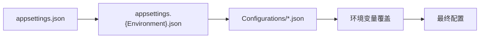
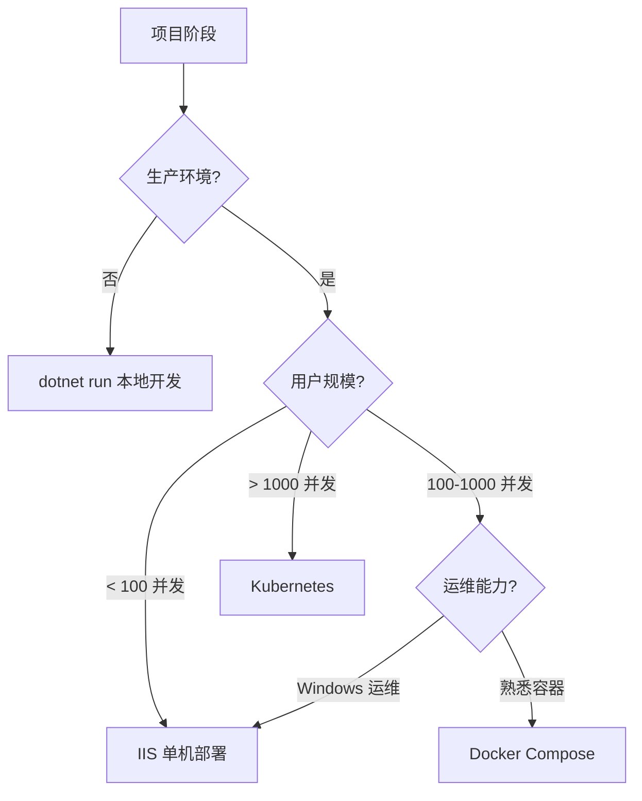

# 专项文档 · JNPF 低代码平台 — 部署运维与环境配置指南

> **文档版本**：v1.0  
> **适用范围**：所有部署形态（IIS / Docker / Kubernetes）  
> **最后更新**：2026-05  

---

## 第一章：环境要求

### 1.1 服务器基础要求

| 环境 | 最低配置 | 推荐配置 |
|------|---------|---------|
| CPU | 2核 | 4核+ |
| 内存 | 4GB | 8GB+ |
| 磁盘 | 50GB SSD | 200GB SSD |
| OS | Windows Server 2019 / Ubuntu 20.04 | Windows Server 2022 / Ubuntu 22.04 LTS |

### 1.2 软件依赖清单

| 软件 | 版本要求 | 用途 |
|------|---------|------|
| .NET 6 SDK/Runtime | 6.0.x | 应用运行时 |
| SQL Server | 2019+ / Express（开发） | 主数据库 |
| Redis | 6.0+ | 缓存 / Session |
| RabbitMQ | 3.11+（可选） | 生产 EventBus |
| Nginx（可选） | 1.20+ | 反向代理 |
| Docker（可选） | 20.10+ | 容器化部署 |
| Node.js（前端构建） | 16+ | 前端资源构建 |

### 1.3 网络端口规划

| 服务 | 默认端口 | 说明 |
|------|---------|------|
| 后端 API | 5000 / 80 | HTTP 主服务 |
| SQL Server | 1433 | 数据库连接 |
| Redis | 6379 | 缓存服务 |
| RabbitMQ | 5672 / 15672 | MQ 通信 / 管理界面 |
| 前端 | 80 / 443 | Web 静态服务 |
| WebSocket | 5000 | IM 实时通信（共享后端端口） |
| Schedule UI | /hf/schedule | 任务调度看板（相对路径） |
| API 文档 | /newapi | Knife4jUI 接口文档 |

---

## 第二章：配置文件体系

### 2.1 配置加载机制



**加载优先级**（后加载覆盖前者）：

1. `appsettings.json` — 基础配置（声明 `ConfigurationScanDirectories`）
2. `appsettings.{ASPNETCORE_ENVIRONMENT}.json` — 环境特化配置
3. `Configurations/` 目录下各独立 JSON 文件 — 模块化拆分
4. 环境变量 — 最高优先级覆盖

> **核心入口**：`appsettings.json` 通过 `"ConfigurationScanDirectories": ["Configurations"]` 声明额外配置扫描目录，框架自动加载该目录下所有 `.json` 文件。

### 2.2 各配置文件说明

#### 2.2.1 ConnectionStrings.json — 数据库连接

```json
{
  "ConnectionStrings": {
    "ConnectionConfigs": [
      {
        "Domain": "dev_v1.",
        "ConfigId": "default",
        "DBName": "ZXAF_V1_DevTest1",
        "DBType": "SqlServer",
        "Host": "(local)\\SQLEXPRESS",
        "Port": "1433",
        "UserName": "sa",
        "Password": "your_password_here",
        "DBSchema": "public"
      },
      {
        "ConfigId": "JNPF-Job",
        "DBName": "jnpf_sundial",
        "DBType": "SqlServer",
        "Host": "(local)\\SQLEXPRESS",
        "Port": "1433",
        "UserName": "sa",
        "Password": "your_password_here",
        "DBSchema": "public"
      }
    ]
  }
}
```

**字段说明**：

| 字段 | 类型 | 说明 |
|------|------|------|
| `Domain` | string | 域名匹配前缀，用于多租户场景自动路由数据库。请求 Host 匹配该值时使用对应连接 |
| `ConfigId` | string | 连接标识。`default` 为主库，`JNPF-Job` 为 Sundial 调度库 |
| `DBName` | string | 数据库名称 |
| `DBType` | string | 数据库类型，支持值：`SqlServer` / `MySql` / `PostgreSQL` / `Oracle` / `Dm`（达梦） |
| `Host` | string | 数据库服务器地址 |
| `Port` | string | 数据库端口 |
| `UserName` | string | 数据库登录用户名 |
| `Password` | string | 数据库登录密码（**生产环境必须通过环境变量注入**） |
| `DBSchema` | string | 数据库 Schema（PostgreSQL 使用，SQL Server 可填 `public`） |

> **多租户机制**：当 `Tenant.MultiTenancy=true` 时，系统根据请求 Host 中的域名前缀匹配 `Domain` 字段，实现多租户数据库路由。

#### 2.2.2 Cache.json — 缓存配置

```json
{
  "Cache": {
    "CacheType": "RedisCache",
    "ip": "127.0.0.1",
    "port": 6379,
    "RedisConnectionString": "{0}:{1}, poolsize=500,ssl=false,defaultDatabase=7"
  }
}
```

**字段说明**：

| 字段 | 类型 | 说明 |
|------|------|------|
| `CacheType` | string | 缓存类型。`MemoryCache`（开发/单机）或 `RedisCache`（生产/集群） |
| `ip` | string | Redis 服务器 IP 地址 |
| `port` | int | Redis 服务端口 |
| `RedisConnectionString` | string | Redis 完整连接字符串模板，`{0}` 替换 ip，`{1}` 替换 port |

**使用建议**：
- **开发环境**：`CacheType` 设为 `MemoryCache`，无需 Redis 依赖
- **生产环境**：必须使用 `RedisCache`，支持多实例共享 Session 和分布式缓存
- `poolsize=500` 为连接池大小，根据并发量调整
- `defaultDatabase=7` 指定使用的 Redis 数据库编号，避免与其他业务冲突

#### 2.2.3 Logging.json — 日志配置

```json
{
  "Logging": {
    "LogLevel": {
      "Default": "Information",
      "Microsoft.AspNetCore": "Warning"
    },
    "File": {
      "Enabled": true,
      "FileName": "logs/{0:yyyyMMdd}/{0:yyyyMMdd}_{1}.log",
      "Append": true,
      "FileSizeLimitBytes": 10485760,
      "MaxRollingFiles": 30
    }
  }
}
```

**字段说明**：

| 字段 | 类型 | 说明 |
|------|------|------|
| `LogLevel.Default` | string | 默认日志级别：`Trace/Debug/Information/Warning/Error/Critical` |
| `LogLevel.Microsoft.AspNetCore` | string | ASP.NET Core 框架日志级别（建议 Warning 减少噪声） |
| `File.Enabled` | bool | 是否启用文件日志 |
| `File.FileName` | string | 文件名模板。`{0}` 为时间戳，`{1}` 为日志级别名称 |
| `File.Append` | bool | `true` 追加写入 / `false` 覆盖 |
| `File.FileSizeLimitBytes` | long | 单文件大小上限（10MB = 10×1024×1024） |
| `File.MaxRollingFiles` | int | 最大滚动文件数，超出后自动覆盖最早文件 |

**日志文件输出结构**：
```
logs/
└── 20260522/
    ├── 20260522_Information.log
    ├── 20260522_Warning.log
    └── 20260522_Error.log
```

#### 2.2.4 EventBus.json — 消息总线

```json
{
  "EventBus": {
    "EventBusType": "Memory",
    "HostName": "192.168.0.232",
    "UserName": "jnpf",
    "Password": "jnpf@2019"
  }
}
```

**字段说明**：

| 字段 | 类型 | 说明 |
|------|------|------|
| `EventBusType` | string | 事件总线类型：`Memory`（内存/开发）、`RabbitMQ`（生产）、`Redis` |
| `HostName` | string | RabbitMQ 服务器地址（仅 RabbitMQ 模式需要） |
| `UserName` | string | RabbitMQ 登录用户名 |
| `Password` | string | RabbitMQ 登录密码 |

**使用建议**：
- **开发环境**：`Memory` 模式，零外部依赖，事件在进程内传递
- **生产环境**：`RabbitMQ` 模式，支持消息持久化、重试、死信队列
- `Redis` 模式适合轻量级生产场景，复用已有 Redis 基础设施

#### 2.2.5 Tenant.json — 多租户配置

```json
{
  "Tenant": {
    "MultiTenancy": false,
    "MultiTenancyType": "SCHEMA",
    "MultiTenancyDBInterFace": "https://www.jnpfsoft.com/api/Saas/Tenant/DbContent/",
    "MultiSystem": true
  }
}
```

**字段说明**：

| 字段 | 类型 | 说明 |
|------|------|------|
| `MultiTenancy` | bool | 是否启用多租户。`false` 单租户模式，`true` 多租户模式 |
| `MultiTenancyType` | string | 多租户隔离策略：`COLUMN`（共享库列隔离）/ `SCHEMA`（独立库/Schema隔离） |
| `MultiTenancyDBInterFace` | string | SaaS 租户数据库信息获取接口地址 |
| `MultiSystem` | bool | 是否支持多系统模块（启用后支持多套前端 + 独立菜单权限） |

**隔离策略选型**：
- `COLUMN`：所有租户共用一个数据库，通过 `tenant_id` 字段区分。成本低、运维简单，适合小规模
- `SCHEMA`：每个租户独立数据库/Schema。数据隔离彻底，适合对安全性要求高的场景

#### 2.2.6 JWT.json — 认证令牌

```json
{
  "JWTSettings": {
    "ValidateIssuerSigningKey": true,
    "IssuerSigningKey": "RkayGi4ltkMWrSQKsQTWic1VnakqsQfaJOmJIBUWE1gxGaS0IrJHxa9anjVAwuew",
    "ValidateIssuer": true,
    "ValidIssuer": "yinmaisoft",
    "ValidateAudience": true,
    "ValidAudience": "yinmaisoft",
    "ValidateLifetime": true,
    "ExpiredTime": 1440,
    "ClockSkew": 5
  }
}
```

**字段说明**：

| 字段 | 类型 | 说明 |
|------|------|------|
| `ValidateIssuerSigningKey` | bool | 是否验证签名密钥 |
| `IssuerSigningKey` | string | JWT 签名密钥。**必须 > 32 字符**（.NET 8+ 强制要求），建议 64 字符随机字符串 |
| `ValidateIssuer` | bool | 是否验证签发方 |
| `ValidIssuer` | string | Token 签发方标识 |
| `ValidateAudience` | bool | 是否验证签收方 |
| `ValidAudience` | string | Token 签收方标识 |
| `ValidateLifetime` | bool | 是否验证过期时间（强烈建议 `true`） |
| `ExpiredTime` | long | Token 有效期，单位：分钟。默认 1440（24小时） |
| `ClockSkew` | long | 时钟偏移容错值，单位：秒。默认 5 秒 |

**安全要求**：
- 生产环境 `IssuerSigningKey` **禁止**使用默认值，必须更换为高强度随机密钥
- 建议通过环境变量或密钥管理服务注入，不存储在代码仓库中
- `ExpiredTime` 根据安全等级调整，高安全场景建议 30~120 分钟 + RefreshToken 机制

#### 2.2.7 Cors.json — 跨域配置

```json
{
  "CorsAccessorSettings": {
    "PolicyName": "JNPFCorsAccessor",
    "WithOrigins": [
      "http://localhost:3100",
      "http://localhost:3000",
      "http://localhost:8080"
    ],
    "WithExposedHeaders": [
      "access-token",
      "x-access-token",
      "Content-Disposition"
    ]
  }
}
```

**字段说明**：

| 字段 | 类型 | 说明 |
|------|------|------|
| `PolicyName` | string | CORS 策略名称 |
| `WithOrigins` | string[] | 允许的前端来源地址列表。生产环境必须限定为实际域名 |
| `WithExposedHeaders` | string[] | 暴露给前端 JS 可读取的响应头 |

**重要事项**：
- `WithExposedHeaders` **必须**包含 `access-token` 和 `x-access-token`，前端依赖这两个 Header 实现 Token 刷新
- `Content-Disposition` 用于文件下载时前端获取文件名
- 生产环境 **严禁** 使用 `*` 通配符，必须精确列出允许的域名

#### 2.2.8 App.json — 应用配置（精简展示）

```json
{
  "JNPF_App": {
    "AesKey": "EY8WePvjM5GGwQzn",
    "SystemPath": "C:\\wwwroot\\Resources",
    "AllowUploadImageType": ["jpg", "gif", "png", "bmp", "jpeg", "..."],
    "AllowUploadFileType": ["jpg", "doc", "docx", "pdf", "xls", "xlsx", "..."],
    "PreviewType": "kkfile",
    "KKFileDomain": "http://127.0.0.1:30090/FileServer",
    "Domain": "http://your-domain.com",
    "ErrorReport": false,
    "CodeCertificateTimeout": 3
  },
  "OAuth": {
    "Enabled": false,
    "LoginPath": "http://your-sso-server/api/oauth/Login",
    "SucessFrontUrl": "http://your-frontend/sso",
    "DefaultSSO": "auth2",
    "SSO": {
      "auth2": { "enabled": true, "clientId": "...", "clientSecret": "..." },
      "cas": { "enabled": true, "serverLoginUrl": "...", "serverValidateUrl": "..." }
    }
  },
  "Socials": {
    "SocialsEnabled": true,
    "DoMain": "http://your-api-domain",
    "Config": [
      { "Provider": "wechat_open", "ClientId": "...", "ClientSecret": "..." },
      { "Provider": "wechat_enterprise", "ClientId": "...", "ClientSecret": "...", "AgentId": "..." },
      { "Provider": "dingtalk", "ClientId": "...", "ClientSecret": "...", "AgentId": "..." },
      { "Provider": "feishu", "ClientId": "...", "ClientSecret": "..." }
    ]
  },
  "Message": {
    "ApiDoMain": "http://localhost:5000",
    "DoMainPc": "http://localhost:3000",
    "DoMainApp": "http://localhost:8081"
  }
}
```

**核心配置节点说明**：

| 节点 | 说明 |
|------|------|
| `JNPF_App.AesKey` | AES 加密密钥（16字符），用于敏感数据加解密 |
| `JNPF_App.SystemPath` | 系统文件存储根路径（上传文件、模板文件等） |
| `JNPF_App.PreviewType` | 文件预览引擎：`kkfile` / `yozo` |
| `OAuth` | 单点登录配置（与第三方登录互斥，二选一） |
| `Socials` | 第三方登录配置（微信/企业微信/钉钉/飞书） |
| `Message` | 消息推送相关域名配置 |

#### 2.2.9 OSS.json — 对象存储

```json
{
  "OSS": {
    "BucketName": "your-bucket-name",
    "Provider": "Aliyun",
    "Endpoint": "oss-cn-beijing.aliyuncs.com",
    "AccessKey": "your-access-key",
    "SecretKey": "your-secret-key",
    "Region": null,
    "IsEnableHttps": false,
    "IsEnableCache": true
  }
}
```

**字段说明**：

| 字段 | 类型 | 说明 |
|------|------|------|
| `BucketName` | string | 存储桶名称 |
| `Provider` | string | 存储提供商：`Invalid`（本地）/ `MinIO` / `Aliyun` / `QCloud` / `Qiniu` |
| `Endpoint` | string | 存储服务端点地址 |
| `AccessKey` | string | 访问密钥 ID |
| `SecretKey` | string | 访问密钥 Secret（**必须通过环境变量注入**） |
| `Region` | string | 存储区域（部分提供商需要） |
| `IsEnableHttps` | bool | 是否启用 HTTPS 访问 |
| `IsEnableCache` | bool | 是否启用本地缓存 |

**Provider 选型**：
- `Invalid`：本地文件系统存储，文件保存在 `SystemPath` 目录，适合开发/单机
- `MinIO`：私有化对象存储，适合内网部署
- `Aliyun` / `QCloud` / `Qiniu`：公有云 OSS，适合生产环境

### 2.3 环境变量覆盖机制

.NET 配置系统支持通过环境变量覆盖任意配置项，优先级最高。命名规则使用 **双下划线（`__`）** 作为层级分隔符。

**覆盖规则示例**：

```bash
# 覆盖数据库连接（ConnectionConfigs 数组第0项）
ConnectionStrings__ConnectionConfigs__0__Host=prod-db.example.com
ConnectionStrings__ConnectionConfigs__0__Port=1433
ConnectionStrings__ConnectionConfigs__0__DBName=JNPF_Production
ConnectionStrings__ConnectionConfigs__0__UserName=jnpf_app
ConnectionStrings__ConnectionConfigs__0__Password=${DB_PASSWORD}

# 覆盖缓存配置
Cache__CacheType=RedisCache
Cache__ip=prod-redis.example.com
Cache__port=6379
Cache__RedisConnectionString=prod-redis.example.com:6379,password=RedisPass123,poolsize=500,ssl=false,defaultDatabase=7

# 覆盖 JWT 密钥
JWTSettings__IssuerSigningKey=YourProductionSecureKeyWith64Characters

# 覆盖事件总线
EventBus__EventBusType=RabbitMQ
EventBus__HostName=prod-rabbitmq.example.com

# ASP.NET Core 环境
ASPNETCORE_ENVIRONMENT=Production
```

**层级对应关系**：

| JSON 路径 | 环境变量名 |
|-----------|-----------|
| `Cache.ip` | `Cache__ip` |
| `ConnectionStrings.ConnectionConfigs[0].Host` | `ConnectionStrings__ConnectionConfigs__0__Host` |
| `JWTSettings.IssuerSigningKey` | `JWTSettings__IssuerSigningKey` |
| `JNPF_App.SystemPath` | `JNPF_App__SystemPath` |

---

## 第三章：IIS 部署（Windows）

### 3.1 环境准备

**Step 1：安装 .NET 6 Hosting Bundle**

```powershell
# 下载并安装 .NET 6 Hosting Bundle（包含 Runtime + ASP.NET Core Module）
# 下载地址：https://dotnet.microsoft.com/download/dotnet/6.0
# 安装完成后重启 IIS
iisreset /restart
```

**Step 2：确认 IIS 功能已启用**

```powershell
# 启用必要的 IIS 功能
Enable-WindowsOptionalFeature -Online -FeatureName IIS-WebServerRole
Enable-WindowsOptionalFeature -Online -FeatureName IIS-WebServer
Enable-WindowsOptionalFeature -Online -FeatureName IIS-CommonHttpFeatures
Enable-WindowsOptionalFeature -Online -FeatureName IIS-HttpErrors
Enable-WindowsOptionalFeature -Online -FeatureName IIS-ApplicationDevelopment
Enable-WindowsOptionalFeature -Online -FeatureName IIS-NetFxExtensibility45
Enable-WindowsOptionalFeature -Online -FeatureName IIS-HealthAndDiagnostics
Enable-WindowsOptionalFeature -Online -FeatureName IIS-HttpLogging
Enable-WindowsOptionalFeature -Online -FeatureName IIS-Security
Enable-WindowsOptionalFeature -Online -FeatureName IIS-RequestFiltering
Enable-WindowsOptionalFeature -Online -FeatureName IIS-Performance
Enable-WindowsOptionalFeature -Online -FeatureName IIS-WebServerManagementTools
Enable-WindowsOptionalFeature -Online -FeatureName IIS-StaticContent
Enable-WindowsOptionalFeature -Online -FeatureName IIS-DefaultDocument
Enable-WindowsOptionalFeature -Online -FeatureName IIS-ISAPIExtensions
Enable-WindowsOptionalFeature -Online -FeatureName IIS-ISAPIFilter
Enable-WindowsOptionalFeature -Online -FeatureName IIS-ASPNET45
Enable-WindowsOptionalFeature -Online -FeatureName IIS-WebSockets

# 安装 URL Rewrite 模块（如需 SPA 路由支持）
# 下载地址：https://www.iis.net/downloads/microsoft/url-rewrite
```

### 3.2 发布应用

```bash
# 框架依赖部署（推荐，体积小，需目标机安装 Runtime）
dotnet publish application/JNPF.API.Entry/JNPF.API.Entry.csproj \
  -c Release \
  -o ./publish \
  --runtime win-x64 \
  --self-contained false

# 独立部署（无需目标机安装 Runtime，体积较大）
dotnet publish application/JNPF.API.Entry/JNPF.API.Entry.csproj \
  -c Release \
  -o ./publish-self \
  --runtime win-x64 \
  --self-contained true
```

### 3.3 IIS 应用池与网站配置

```powershell
Import-Module WebAdministration

# 创建应用程序池（无托管代码模式，因为 .NET Core 使用 Kestrel）
New-WebAppPool -Name "JNPFAppPool"
Set-ItemProperty "IIS:\AppPools\JNPFAppPool" -Name "managedRuntimeVersion" -Value ""
Set-ItemProperty "IIS:\AppPools\JNPFAppPool" -Name "startMode" -Value "AlwaysRunning"
Set-ItemProperty "IIS:\AppPools\JNPFAppPool" -Name "processModel.idleTimeout" -Value "00:00:00"

# 创建网站（后端 API）
New-Website -Name "JNPF-API" `
  -PhysicalPath "C:\inetpub\jnpf-api\publish" `
  -ApplicationPool "JNPFAppPool" `
  -Port 5000 `
  -Force

# 创建前端静态站点
New-WebAppPool -Name "JNPFWebPool"
Set-ItemProperty "IIS:\AppPools\JNPFWebPool" -Name "managedRuntimeVersion" -Value ""

New-Website -Name "JNPF-Web" `
  -PhysicalPath "C:\inetpub\jnpf-web" `
  -ApplicationPool "JNPFWebPool" `
  -Port 80 `
  -Force

# 设置环境变量
Set-ItemProperty "IIS:\AppPools\JNPFAppPool" `
  -Name "environmentVariables" `
  -Value @(@{name="ASPNETCORE_ENVIRONMENT";value="Production"})
```

### 3.4 web.config 配置

前端静态站点需要 `web.config` 支持 SPA 路由（History 模式）：

```xml
<?xml version="1.0" encoding="UTF-8"?>
<configuration>
    <system.webServer>
        <rewrite>
            <rules>
                <rule name="waterweb" patternSyntax="Wildcard">
                    <match url="*" />
                    <conditions>
                        <add input="{REQUEST_FILENAME}" matchType="IsFile" negate="true" />
                    </conditions>
                    <action type="Rewrite" url="/index.html" />
                </rule>
            </rules>
        </rewrite>
        <modules>
            <remove name="WebDAVModule" />
        </modules>
    </system.webServer>
</configuration>
```

**说明**：
- `waterweb` 规则：所有非文件请求重写到 `/index.html`，支持前端路由
- 移除 `WebDAVModule`：避免 PUT/DELETE 请求被 WebDAV 模块拦截

### 3.5 Nginx 反向代理配置

当需要统一入口、HTTPS 终止或负载均衡时，使用 Nginx 反向代理：

```nginx
server {
    listen 80;
    server_name api.example.com;

    location / {
        proxy_pass http://localhost:5000;
        proxy_http_version 1.1;
        proxy_set_header Upgrade $http_upgrade;
        proxy_set_header Connection "upgrade";
        proxy_set_header Host $host;
        proxy_set_header X-Real-IP $remote_addr;
        proxy_set_header X-Forwarded-For $proxy_add_x_forwarded_for;
        proxy_set_header X-Forwarded-Proto $scheme;
        proxy_read_timeout 300s;
        proxy_connect_timeout 75s;
    }

    # WebSocket 支持（SignalR / IM 通信）
    location /api/message/websocket {
        proxy_pass http://localhost:5000;
        proxy_http_version 1.1;
        proxy_set_header Upgrade $http_upgrade;
        proxy_set_header Connection "upgrade";
        proxy_set_header Host $host;
        proxy_read_timeout 86400s;
    }

    # 调度看板
    location /hf/schedule {
        proxy_pass http://localhost:5000;
        proxy_set_header Host $host;
    }
}

# HTTPS 配置示例
server {
    listen 443 ssl;
    server_name api.example.com;

    ssl_certificate /etc/nginx/ssl/api.example.com.pem;
    ssl_certificate_key /etc/nginx/ssl/api.example.com.key;
    ssl_protocols TLSv1.2 TLSv1.3;

    location / {
        proxy_pass http://localhost:5000;
        proxy_http_version 1.1;
        proxy_set_header Upgrade $http_upgrade;
        proxy_set_header Connection "upgrade";
        proxy_set_header Host $host;
        proxy_set_header X-Real-IP $remote_addr;
        proxy_set_header X-Forwarded-For $proxy_add_x_forwarded_for;
        proxy_set_header X-Forwarded-Proto $scheme;
    }
}
```

---

## 第四章：Docker 部署

### 4.1 Dockerfile 多阶段构建分析

项目 `application/JNPF.API.Entry/Dockerfile` 采用四阶段构建：

```dockerfile
# ============ Stage 1: base（运行时基础镜像）============
FROM mcr.microsoft.com/dotnet/aspnet:6.0 AS base
WORKDIR /app
EXPOSE 80

# ============ Stage 2: build（编译阶段）============
FROM mcr.microsoft.com/dotnet/sdk:6.0 AS build
WORKDIR /src
COPY ["framework/JNPF/JNPF.csproj", "framework/JNPF/JNPF/"]
COPY ["src/modularity/oauth/JNPF.OAuth/JNPF.OAuth.csproj", "src/modularity/oauth/JNPF.OAuth/"]
COPY ["src/modularity/system/JNPF.Systems/JNPF.Systems.csproj", "src/modularity/system/JNPF.Systems/"]
COPY ["src/modularity/message/JNPF.Message/JNPF.Message.csproj", "src/modularity/message/JNPF.Message/"]
COPY ["src/modularity/taskscheduler/JNPF.TaskScheduler/JNPF.TaskScheduler.csproj", "src/modularity/taskscheduler/JNPF.TaskScheduler/"]
COPY ["src/modularity/workflow/JNPF.WorkFlow/JNPF.WorkFlow.csproj", "src/modularity/workflow/JNPF.WorkFlow/"]
COPY ["src/modularity/visualdev/JNPF.VisualDev/JNPF.VisualDev.csproj", "src/modularity/visualdev/JNPF.VisualDev/"]
COPY ["src/modularity/codegen/JNPF.CodeGen/JNPF.CodeGen.csproj", "src/modularity/codegen/JNPF.CodeGen/"]
COPY ["src/modularity/visualdata/JNPF.VisualData/JNPF.VisualData.csproj", "src/modularity/visualdata/JNPF.VisualData/"]
COPY ["src/modularity/extend/JNPF.Extend/JNPF.Extend.csproj", "src/modularity/extend/JNPF.Extend/"]
COPY ["src/modularity/app/JNPF.Apps/JNPF.Apps.csproj", "src/modularity/app/JNPF.Apps/"]
COPY ["src/modularity/subdev/JNPF.SubDev/JNPF.SubDev.csproj", "src/modularity/subdev/JNPF.SubDev/"]
COPY ["src/application/JNPF.API.Entry/JNPF.API.Entry.csproj", "src/application/JNPF.API.Entry/"]
COPY . .
WORKDIR "/src/src/application/JNPF.API.Entry"
RUN dotnet build "JNPF.API.Entry.csproj" -c Release -o /app/build

# ============ Stage 3: publish（发布阶段）============
FROM build AS publish
RUN dotnet publish "JNPF.API.Entry.csproj" -c Release -o /app/publish /p:UseAppHost=false

# ============ Stage 4: final（最终运行镜像）============
FROM base AS final
WORKDIR /app
COPY --from=publish /app/publish .
ENTRYPOINT ["dotnet", "JNPF.API.Entry.dll"]
```

**各阶段说明**：

| 阶段 | 基础镜像 | 用途 | 预估大小 |
|------|---------|------|---------|
| `base` | `aspnet:6.0` | 运行时环境 | ~210MB |
| `build` | `sdk:6.0` | 编译（含完整 SDK） | ~710MB（仅构建时） |
| `publish` | 继承 `build` | 执行 publish 输出优化产物 | 仅中间态 |
| `final` | 继承 `base` | 最终运行镜像 | ~280MB |

> **优势**：最终镜像不包含 SDK 和源代码，仅保留运行时 + 发布产物，显著减小体积。

### 4.2 Docker 单容器启动

```bash
# 构建镜像
docker build -f application/JNPF.API.Entry/Dockerfile -t jnpf-api:6.0 .

# 启动容器
docker run -d \
  --name jnpf-api \
  -p 5000:80 \
  -e ASPNETCORE_ENVIRONMENT=Production \
  -e "ConnectionStrings__ConnectionConfigs__0__Host=host.docker.internal" \
  -e "ConnectionStrings__ConnectionConfigs__0__Password=YourPassword123!" \
  -e "Cache__ip=host.docker.internal" \
  -e "JWTSettings__IssuerSigningKey=YourSecureKeyWith64CharactersMinimum!!" \
  -v $(pwd)/logs:/app/logs \
  -v $(pwd)/uploads:/app/uploads \
  --restart always \
  jnpf-api:6.0

# 查看日志
docker logs -f jnpf-api

# 进入容器调试
docker exec -it jnpf-api /bin/bash
```

### 4.3 Docker Compose 完整编排

```yaml
version: '3.9'

services:
  jnpf-api:
    build:
      context: .
      dockerfile: application/JNPF.API.Entry/Dockerfile
    container_name: jnpf-api-prod
    ports:
      - "5000:80"
    environment:
      ASPNETCORE_ENVIRONMENT: Production
      ConnectionStrings__ConnectionConfigs__0__Host: sqlserver
      ConnectionStrings__ConnectionConfigs__0__Port: 1433
      ConnectionStrings__ConnectionConfigs__0__DBName: ZXAF_V1_DevTest1
      ConnectionStrings__ConnectionConfigs__0__UserName: sa
      ConnectionStrings__ConnectionConfigs__0__Password: YourPassword123!
      ConnectionStrings__ConnectionConfigs__1__Host: sqlserver
      ConnectionStrings__ConnectionConfigs__1__Port: 1433
      ConnectionStrings__ConnectionConfigs__1__DBName: jnpf_sundial
      ConnectionStrings__ConnectionConfigs__1__UserName: sa
      ConnectionStrings__ConnectionConfigs__1__Password: YourPassword123!
      Cache__CacheType: RedisCache
      Cache__ip: redis
      Cache__port: 6379
      Cache__RedisConnectionString: "redis:6379,poolsize=500,ssl=false,defaultDatabase=7"
      EventBus__EventBusType: Memory
      JWTSettings__IssuerSigningKey: YourSecureKeyWith32CharactersMinimum!!Extra
    depends_on:
      sqlserver:
        condition: service_healthy
      redis:
        condition: service_started
    volumes:
      - ./logs:/app/logs
      - ./uploads:/app/uploads
    networks:
      - jnpf-network
    restart: always
    healthcheck:
      test: ["CMD-SHELL", "curl -f http://localhost:80/health || exit 1"]
      interval: 30s
      timeout: 10s
      retries: 3

  sqlserver:
    image: mcr.microsoft.com/mssql/server:2022-latest
    container_name: jnpf-sqlserver
    environment:
      SA_PASSWORD: "YourPassword123!"
      ACCEPT_EULA: "Y"
      MSSQL_PID: "Developer"
    ports:
      - "1433:1433"
    volumes:
      - sqlserver_data:/var/opt/mssql/data
      - sqlserver_log:/var/opt/mssql/log
    networks:
      - jnpf-network
    healthcheck:
      test: ["CMD-SHELL", "/opt/mssql-tools/bin/sqlcmd -S localhost -U SA -P 'YourPassword123!' -Q 'SELECT 1' || exit 1"]
      interval: 10s
      timeout: 5s
      retries: 5

  redis:
    image: redis:7-alpine
    container_name: jnpf-redis
    command: redis-server --appendonly yes --maxmemory 512mb --maxmemory-policy allkeys-lru
    ports:
      - "6379:6379"
    volumes:
      - redis_data:/data
    networks:
      - jnpf-network
    restart: always

volumes:
  sqlserver_data:
    driver: local
  sqlserver_log:
    driver: local
  redis_data:
    driver: local

networks:
  jnpf-network:
    driver: bridge
```

**启动命令**：

```bash
# 启动全部服务
docker-compose up -d

# 查看服务状态
docker-compose ps

# 查看 API 日志
docker-compose logs -f jnpf-api

# 停止并清理
docker-compose down

# 停止并清理（含数据卷）
docker-compose down -v
```

---

## 第五章：Kubernetes 部署

### 5.1 资源规划

| 组件 | Replicas | CPU Request | Memory Request | CPU Limit | Memory Limit |
|------|----------|-------------|----------------|-----------|--------------|
| jnpf-api | 3 | 250m | 256Mi | 500m | 512Mi |
| redis | 1 | 100m | 128Mi | 200m | 256Mi |

> SQL Server 建议使用云数据库服务（RDS）或独立部署，不推荐在 K8s 中运行有状态数据库。

### 5.2 Deployment + Service + ConfigMap + Secret

```yaml
# ============ ConfigMap：非敏感配置 ============
apiVersion: v1
kind: ConfigMap
metadata:
  name: jnpf-config
  namespace: jnpf
data:
  ASPNETCORE_ENVIRONMENT: "Production"
  ConnectionStrings__ConnectionConfigs__0__Host: "prod-sqlserver.database.svc"
  ConnectionStrings__ConnectionConfigs__0__Port: "1433"
  ConnectionStrings__ConnectionConfigs__0__DBName: "ZXAF_V1_Production"
  ConnectionStrings__ConnectionConfigs__0__DBType: "SqlServer"
  ConnectionStrings__ConnectionConfigs__1__Host: "prod-sqlserver.database.svc"
  ConnectionStrings__ConnectionConfigs__1__Port: "1433"
  ConnectionStrings__ConnectionConfigs__1__DBName: "jnpf_sundial"
  ConnectionStrings__ConnectionConfigs__1__DBType: "SqlServer"
  Cache__CacheType: "RedisCache"
  Cache__ip: "redis-svc.jnpf.svc.cluster.local"
  Cache__port: "6379"
  EventBus__EventBusType: "Memory"

---
# ============ Secret：敏感配置 ============
apiVersion: v1
kind: Secret
metadata:
  name: jnpf-secrets
  namespace: jnpf
type: Opaque
stringData:
  ConnectionStrings__ConnectionConfigs__0__UserName: "jnpf_app"
  ConnectionStrings__ConnectionConfigs__0__Password: "YourSecureDBPassword!"
  ConnectionStrings__ConnectionConfigs__1__UserName: "jnpf_app"
  ConnectionStrings__ConnectionConfigs__1__Password: "YourSecureDBPassword!"
  JWTSettings__IssuerSigningKey: "YourProductionJWTKeyWith64CharactersMinimumLength!!"
  Cache__RedisConnectionString: "redis-svc:6379,poolsize=500,ssl=false,defaultDatabase=7"

---
# ============ Deployment：应用部署 ============
apiVersion: apps/v1
kind: Deployment
metadata:
  name: jnpf-api
  namespace: jnpf
  labels:
    app: jnpf-api
spec:
  replicas: 3
  selector:
    matchLabels:
      app: jnpf-api
  strategy:
    type: RollingUpdate
    rollingUpdate:
      maxSurge: 1
      maxUnavailable: 0
  template:
    metadata:
      labels:
        app: jnpf-api
    spec:
      containers:
        - name: jnpf-api
          image: your-registry.com/jnpf-api:6.0
          ports:
            - containerPort: 80
              protocol: TCP
          envFrom:
            - configMapRef:
                name: jnpf-config
            - secretRef:
                name: jnpf-secrets
          resources:
            requests:
              cpu: 250m
              memory: 256Mi
            limits:
              cpu: 500m
              memory: 512Mi
          readinessProbe:
            httpGet:
              path: /health
              port: 80
            initialDelaySeconds: 10
            periodSeconds: 5
          livenessProbe:
            httpGet:
              path: /health
              port: 80
            initialDelaySeconds: 30
            periodSeconds: 10
          volumeMounts:
            - name: logs
              mountPath: /app/logs
            - name: uploads
              mountPath: /app/uploads
      volumes:
        - name: logs
          emptyDir: {}
        - name: uploads
          persistentVolumeClaim:
            claimName: jnpf-uploads-pvc

---
# ============ Service：服务暴露 ============
apiVersion: v1
kind: Service
metadata:
  name: jnpf-api-svc
  namespace: jnpf
spec:
  type: ClusterIP
  selector:
    app: jnpf-api
  ports:
    - name: http
      port: 80
      targetPort: 80
      protocol: TCP

---
# ============ Redis Deployment ============
apiVersion: apps/v1
kind: Deployment
metadata:
  name: redis
  namespace: jnpf
spec:
  replicas: 1
  selector:
    matchLabels:
      app: redis
  template:
    metadata:
      labels:
        app: redis
    spec:
      containers:
        - name: redis
          image: redis:7-alpine
          command: ["redis-server", "--appendonly", "yes", "--maxmemory", "256mb", "--maxmemory-policy", "allkeys-lru"]
          ports:
            - containerPort: 6379
          resources:
            requests:
              cpu: 100m
              memory: 128Mi
            limits:
              cpu: 200m
              memory: 256Mi
          volumeMounts:
            - name: redis-data
              mountPath: /data
      volumes:
        - name: redis-data
          emptyDir: {}

---
# ============ Redis Service ============
apiVersion: v1
kind: Service
metadata:
  name: redis-svc
  namespace: jnpf
spec:
  type: ClusterIP
  selector:
    app: redis
  ports:
    - port: 6379
      targetPort: 6379
```

### 5.3 部署命令

```bash
# 创建命名空间
kubectl create namespace jnpf

# 应用所有资源
kubectl apply -f k8s/

# 查看部署状态
kubectl get all -n jnpf

# 查看 Pod 日志
kubectl logs -f deployment/jnpf-api -n jnpf

# 滚动更新（新版本镜像）
kubectl set image deployment/jnpf-api jnpf-api=your-registry.com/jnpf-api:new-version -n jnpf

# 查看滚动更新状态
kubectl rollout status deployment/jnpf-api -n jnpf

# 回滚到上一版本
kubectl rollout undo deployment/jnpf-api -n jnpf

# 扩缩容
kubectl scale deployment jnpf-api --replicas=5 -n jnpf

# 查看 HPA（如已配置）
kubectl get hpa -n jnpf

# 进入 Pod 调试
kubectl exec -it $(kubectl get pod -l app=jnpf-api -n jnpf -o jsonpath='{.items[0].metadata.name}') -n jnpf -- /bin/bash
```

---

## 第六章：部署方式对比与选型

### 6.1 四种部署模式对比

| 对比项 | 直接运行（dotnet run） | IIS 托管 | Docker 容器 | Kubernetes |
|--------|----------------------|----------|------------|-----------|
| **复杂度** | 最低 | 低 | 中 | 高 |
| **适用场景** | 开发调试 | 小型 / 内部系统 | 中型 / 微服务 | 大型 / 分布式 |
| **可扩展性** | 无 | 低（手动扩展） | 中（Compose 扩展） | 高（自动扩缩） |
| **版本更新** | 手动重启 | 停机部署 | 滚动更新 | 金丝雀 / 蓝绿 |
| **监控能力** | 控制台输出 | Windows 事件日志 | 容器日志 + Prometheus | 全栈可观测 |
| **隔离性** | 无 | 进程隔离 | 容器隔离 | 命名空间 + 网络策略 |
| **资源利用** | 低 | 中 | 高 | 最优 |
| **故障恢复** | 手动 | 应用池自动回收 | restart policy | 自动调度重建 |
| **前置要求** | .NET SDK | IIS + Hosting Bundle | Docker Engine | K8s 集群 |
| **团队要求** | 开发人员 | Windows 运维 | 容器运维 | K8s 运维 / DevOps |

### 6.2 选型建议



---

## 第七章：日志管理

### 7.1 文件日志结构

```
logs/
├── 20260520/
│   ├── 20260520_Information.log   # 一般信息（请求/响应/业务日志）
│   ├── 20260520_Warning.log       # 警告信息（性能降级/重试）
│   └── 20260520_Error.log         # 错误信息（异常/失败）
├── 20260521/
│   ├── 20260521_Information.log
│   ├── 20260521_Warning.log
│   └── 20260521_Error.log
└── 20260522/
    ├── 20260522_Information.log
    ├── 20260522_Warning.log
    └── 20260522_Error.log
```

### 7.2 日志查看常用命令

```bash
# 实时查看最新错误日志
tail -f logs/$(date +%Y%m%d)/$(date +%Y%m%d)_Error.log

# 搜索特定用户操作
grep "UserId:xxx" logs/*/Information.log

# 查看特定时间段的错误
grep "2026-05-22 14:" logs/20260522/20260522_Error.log

# 统计某天错误数量
wc -l logs/20260522/20260522_Error.log

# 查看慢请求（响应时间 > 1000ms）
grep -E "Duration: [0-9]{4,}" logs/*/Information.log

# Windows PowerShell 查看错误
Get-Content .\logs\20260522\20260522_Error.log -Tail 50 -Wait

# 搜索异常堆栈
Select-String -Path ".\logs\*\*_Error.log" -Pattern "NullReferenceException"
```

### 7.3 SQL 日志配置

系统通过 SqlSugar 的 AOP 机制记录 SQL 执行日志：

```csharp
// 框架内 SqlSugar 配置（AOP.OnLogExecuting）
db.Aop.OnLogExecuting = (sql, pars) =>
{
    // 输出执行的 SQL 语句
    Console.WriteLine($"[SQL] {sql}");
    Console.WriteLine($"[Params] {string.Join(",", pars?.Select(p => $"{p.ParameterName}={p.Value}"))}");
};

db.Aop.OnError = (exp) =>
{
    // SQL 执行错误记录
    Logger.Error($"[SQL Error] {exp.Sql}\n{exp.Message}");
};
```

**生产建议**：
- 开发环境开启全量 SQL 日志，便于调试
- 生产环境仅记录慢 SQL（>500ms）和错误 SQL，避免日志膨胀
- 慢 SQL 阈值通过 `db.Aop.OnLogExecuted` 配合 `Stopwatch` 实现

### 7.4 日志清理策略

**自动滚动**：`MaxRollingFiles=30` 配置确保每级别最多保留 30 个日志文件，超出后自动覆盖最早文件。

**手动归档建议**：

```bash
# Linux cron 定期压缩归档（每天凌晨 2 点执行）
# crontab -e
0 2 * * * find /app/logs -name "*.log" -mtime +7 -exec gzip {} \;
0 3 * * * find /app/logs -name "*.gz" -mtime +30 -delete

# Windows 计划任务 PowerShell 脚本
$threshold = (Get-Date).AddDays(-7)
Get-ChildItem -Path "C:\inetpub\jnpf-api\logs" -Recurse -Filter "*.log" |
  Where-Object { $_.LastWriteTime -lt $threshold } |
  Compress-Archive -DestinationPath "C:\backup\logs\archive_$(Get-Date -Format 'yyyyMMdd').zip"
```

---

## 第八章：数据库运维

### 8.1 初始化数据库

```sql
-- ============ 创建主库 ============
CREATE DATABASE ZXAF_V1_DevTest1
COLLATE Chinese_PRC_CI_AS;
GO

USE ZXAF_V1_DevTest1;
GO

-- 执行初始化脚本（位于 web/主库脚本.sql）
-- :r "web/主库脚本.sql"
-- 或在 SSMS 中打开执行

-- ============ 创建调度库 ============
CREATE DATABASE jnpf_sundial
COLLATE Chinese_PRC_CI_AS;
GO

USE jnpf_sundial;
GO

-- 执行调度库初始化脚本（位于 web/jnpf_sundial_init_sqlserver.sql）
-- :r "web/jnpf_sundial_init_sqlserver.sql"

-- ============ 创建应用专用账户（生产环境） ============
USE master;
GO

CREATE LOGIN jnpf_app WITH PASSWORD = 'StrongAppPassword123!';
GO

USE ZXAF_V1_DevTest1;
GO
CREATE USER jnpf_app FOR LOGIN jnpf_app;
ALTER ROLE db_datareader ADD MEMBER jnpf_app;
ALTER ROLE db_datawriter ADD MEMBER jnpf_app;
GRANT EXECUTE TO jnpf_app;
GO

USE jnpf_sundial;
GO
CREATE USER jnpf_app FOR LOGIN jnpf_app;
ALTER ROLE db_datareader ADD MEMBER jnpf_app;
ALTER ROLE db_datawriter ADD MEMBER jnpf_app;
GRANT EXECUTE TO jnpf_app;
GO
```

### 8.2 备份策略

```sql
-- ============ 完整备份（每天凌晨 1 点） ============
BACKUP DATABASE ZXAF_V1_DevTest1
TO DISK = N'D:\Backup\ZXAF_V1_DevTest1_Full_' + CONVERT(VARCHAR(8), GETDATE(), 112) + '.bak'
WITH COMPRESSION, INIT, STATS = 10;
GO

-- ============ 差异备份（每 6 小时） ============
BACKUP DATABASE ZXAF_V1_DevTest1
TO DISK = N'D:\Backup\ZXAF_V1_DevTest1_Diff_' + REPLACE(CONVERT(VARCHAR(16), GETDATE(), 120), ':', '') + '.bak'
WITH DIFFERENTIAL, COMPRESSION, INIT;
GO

-- ============ 事务日志备份（每 30 分钟） ============
BACKUP LOG ZXAF_V1_DevTest1
TO DISK = N'D:\Backup\ZXAF_V1_DevTest1_Log_' + REPLACE(CONVERT(VARCHAR(16), GETDATE(), 120), ':', '') + '.trn'
WITH COMPRESSION, INIT;
GO

-- ============ 清理 30 天前的备份文件 ============
DECLARE @DeleteDate DATETIME = DATEADD(DAY, -30, GETDATE());
EXEC xp_delete_files N'D:\Backup\', 'bak', @DeleteDate;
GO
```

**SQL Server Agent 作业配置建议**：

| 作业名称 | 执行频率 | 备份类型 | 保留天数 |
|---------|---------|---------|---------|
| JNPF_FullBackup | 每天 01:00 | 完整备份 | 30 天 |
| JNPF_DiffBackup | 每 6 小时 | 差异备份 | 7 天 |
| JNPF_LogBackup | 每 30 分钟 | 日志备份 | 3 天 |
| JNPF_CleanBackup | 每天 03:00 | 清理过期文件 | — |

### 8.3 常用运维 SQL

```sql
-- ============ 查看在线/活跃用户 ============
SELECT TOP 50
    f_account AS '账号',
    f_real_name AS '姓名',
    f_last_log_time AS '最后登录时间',
    f_last_log_ip AS '最后登录IP'
FROM base_user
WHERE f_delete_mark = 0 AND f_enabled_mark = 1
ORDER BY f_last_log_time DESC;

-- ============ 清理 30 天前 API 日志 ============
DELETE FROM base_api_log
WHERE f_creator_time < DATEADD(DAY, -30, GETDATE());

-- 如数据量大，建议分批删除
WHILE 1=1
BEGIN
    DELETE TOP (10000) FROM base_api_log
    WHERE f_creator_time < DATEADD(DAY, -30, GETDATE());
    IF @@ROWCOUNT = 0 BREAK;
    WAITFOR DELAY '00:00:01';
END

-- ============ 查看权限分配情况 ============
SELECT
    u.f_account AS '用户账号',
    u.f_real_name AS '用户姓名',
    r.f_full_name AS '角色名称',
    m.f_full_name AS '模块名称',
    m.f_url_address AS '模块路径'
FROM base_user u
INNER JOIN base_user_relation ur ON ur.f_user_id = u.f_id AND ur.f_object_type = 'Role'
INNER JOIN base_role r ON r.f_id = ur.f_object_id
LEFT JOIN base_authorize ra ON ra.f_item_id = r.f_id AND ra.f_item_type = 'role'
LEFT JOIN base_module m ON m.f_id = ra.f_object_id
WHERE u.f_delete_mark = 0
ORDER BY u.f_account, r.f_full_name;

-- ============ 查看数据库空间使用 ============
EXEC sp_spaceused;
GO

SELECT
    t.NAME AS '表名',
    s.Name AS 'Schema',
    p.rows AS '行数',
    CAST(ROUND(((SUM(a.total_pages) * 8) / 1024.00), 2) AS NUMERIC(36, 2)) AS '总空间(MB)',
    CAST(ROUND(((SUM(a.used_pages) * 8) / 1024.00), 2) AS NUMERIC(36, 2)) AS '已用空间(MB)'
FROM sys.tables t
INNER JOIN sys.indexes i ON t.OBJECT_ID = i.object_id
INNER JOIN sys.partitions p ON i.object_id = p.OBJECT_ID AND i.index_id = p.index_id
INNER JOIN sys.allocation_units a ON p.partition_id = a.container_id
LEFT JOIN sys.schemas s ON t.schema_id = s.schema_id
GROUP BY t.Name, s.Name, p.Rows
ORDER BY SUM(a.total_pages) DESC;

-- ============ 查看当前活动连接 ============
SELECT
    DB_NAME(dbid) AS '数据库',
    COUNT(*) AS '连接数',
    loginame AS '登录名'
FROM sys.sysprocesses
WHERE dbid > 0
GROUP BY dbid, loginame
ORDER BY COUNT(*) DESC;

-- ============ 查看阻塞查询 ============
SELECT
    blocking_session_id AS '阻塞源 Session',
    session_id AS '被阻塞 Session',
    wait_type,
    wait_time / 1000.0 AS '等待时间(秒)',
    text AS 'SQL语句'
FROM sys.dm_exec_requests r
CROSS APPLY sys.dm_exec_sql_text(r.sql_handle)
WHERE blocking_session_id > 0;
```

---

## 第九章：安全加固

### 9.1 敏感信息管理

| 敏感信息 | 风险等级 | 存储位置 | 推荐处理方式 |
|---------|---------|---------|-------------|
| 数据库密码 | **高** | ConnectionStrings.json | 环境变量 / K8s Secret / 密钥管理服务 |
| JWT 签名密钥 | **高** | JWT.json | 环境变量 / K8s Secret |
| AES 加密密钥 | **高** | App.json | 环境变量 / 密钥管理服务 |
| OSS AccessKey/SecretKey | **高** | OSS.json | 环境变量 / IAM 角色 |
| RabbitMQ 密码 | **中** | EventBus.json | 环境变量 |
| Redis 密码 | **中** | Cache.json | 环境变量 |
| 第三方 ClientSecret | **高** | App.json (Socials) | 环境变量 / 密钥管理服务 |
| OAuth SSO 密钥 | **高** | App.json (OAuth) | 环境变量 |
| 邮件服务密码 | **中** | 应用配置 | 环境变量 |

> **原则**：所有配置文件中的密码/密钥在代码仓库中应为占位符或开发环境值，生产环境通过环境变量或密钥管理服务（如 Azure Key Vault、HashiCorp Vault）注入。

### 9.2 .gitignore 安全规则

```gitignore
# ============ 敏感配置文件 ============
appsettings.Production.json
appsettings.Staging.json
Configurations/*.production.json
Configurations/*.staging.json

# ============ 环境文件 ============
*.env
.env.*
!.env.example

# ============ 证书和密钥 ============
*.key
*.pem
*.pfx
*.p12
*.cer

# ============ 敏感词库 ============
sensitive-words.txt

# ============ 本地覆盖配置 ============
appsettings.local.json
local.settings.json

# ============ 日志文件 ============
logs/
*.log

# ============ 上传文件 ============
uploads/
wwwroot/Resources/
```

### 9.3 生产安全检查清单

- [ ] **JWT 密钥**：长度 > 32 字符，使用密码学安全随机生成，通过环境变量注入
- [ ] **数据库账户**：使用非 `sa` 专用账户，遵循最小权限原则（仅 read/write/execute）
- [ ] **Redis 认证**：配置 `requirepass`，连接字符串包含 `password` 参数
- [ ] **CORS 白名单**：`WithOrigins` 仅包含生产环境实际域名，禁止 `*` 通配符
- [ ] **环境标识**：`ASPNETCORE_ENVIRONMENT=Production`，禁止生产使用 Development 模式
- [ ] **Swagger 关闭**：生产环境关闭 API 文档（或限制 IP 访问）
- [ ] **HTTPS/TLS**：所有对外服务启用 HTTPS，HTTP 自动跳转 HTTPS
- [ ] **防火墙规则**：仅开放 80/443 端口对外，数据库/Redis/MQ 端口仅内网可达
- [ ] **日志脱敏**：确保日志中不输出用户密码、Token 原文等敏感数据
- [ ] **文件上传限制**：检查 `AllowUploadFileType` 白名单，禁止 `.exe/.dll/.bat/.sh` 等可执行文件
- [ ] **SQL 注入防护**：确认所有数据访问使用参数化查询（SqlSugar 默认参数化）
- [ ] **请求频率限制**：配置 API 限流，防止暴力破解和 DDoS
- [ ] **依赖更新**：定期检查 NuGet 包安全漏洞（`dotnet list package --vulnerable`）
- [ ] **备份验证**：定期执行备份恢复演练，确保备份有效

---

## 附录：快速启动检查清单

### A. 本地开发环境启动

```bash
# 1. 确认 .NET 6 SDK 已安装
dotnet --version
# 输出应为 6.0.x

# 2. 还原 NuGet 依赖
dotnet restore zx_lowcode_netcore.sln

# 3. 准备数据库
#    - 安装 SQL Server Express / 使用已有实例
#    - 创建数据库并执行初始化脚本
#    - 修改 Configurations/ConnectionStrings.json 中的连接信息

# 4. 启动 Redis（开发可选，使用 MemoryCache 可跳过）
#    方式一：直接启动
redis-server
#    方式二：使用 Docker
docker run -d --name redis-dev -p 6379:6379 redis:7-alpine

# 5. 配置缓存模式
#    开发环境可将 Cache.json 中 CacheType 改为 "MemoryCache" 免 Redis 依赖

# 6. 运行应用
cd application/JNPF.API.Entry
dotnet run --environment Development

# 7. 验证服务
#    API 文档：http://localhost:5000/newapi
#    调度看板：http://localhost:5000/hf/schedule
#    健康检查：http://localhost:5000/health
```

### B. 生产 Docker 快速部署

```bash
# 1. 克隆代码
git clone <repo-url> jnpf-platform
cd jnpf-platform

# 2. 准备环境变量文件
cat > .env.production << 'EOF'
# 数据库
DB_HOST=your-db-host
DB_PORT=1433
DB_NAME=ZXAF_V1_Production
DB_USER=jnpf_app
DB_PASSWORD=YourSecurePassword!

# Redis
REDIS_HOST=your-redis-host
REDIS_PORT=6379

# JWT
JWT_KEY=YourProductionJWTSecureKeyWith64CharactersMinimumLength!!

# 环境
ASPNETCORE_ENVIRONMENT=Production
EOF

# 3. 构建并启动
docker-compose --env-file .env.production up -d --build

# 4. 查看启动状态
docker-compose ps
docker-compose logs -f jnpf-api

# 5. 验证服务可用
curl -s http://localhost:5000/health
# 期望返回：Healthy

# 6. 初始化数据库（首次部署）
# 连接数据库执行 web/主库脚本.sql 和 web/jnpf_sundial_init_sqlserver.sql

# 7. 配置 Nginx 反向代理（可选）
# 参见第三章 3.5 节 Nginx 配置
```

### C. 故障排查快速参考

| 现象 | 可能原因 | 排查方式 |
|------|---------|---------|
| 启动报 `Connection refused` | 数据库未启动/连接信息错误 | 检查 ConnectionStrings.json，telnet 测试端口 |
| API 返回 401 | Token 过期/JWT 密钥不匹配 | 检查 JWT.json 配置，验证 Token 签发 |
| 缓存穿透 | Redis 未连接/CacheType 配置错误 | 检查 Cache.json，`redis-cli ping` |
| CORS 报错 | 前端地址不在白名单 | 检查 Cors.json 的 WithOrigins |
| WebSocket 断连 | Nginx 未配置 upgrade | 参照 3.5 节 WebSocket 配置 |
| 文件上传失败 | SystemPath 目录无写权限/磁盘满 | 检查目录权限，`df -h` 查磁盘 |
| 调度任务不执行 | JNPF-Job 数据库连接失败 | 检查 ConnectionConfigs 第二项配置 |

---

> **文档结束**  
> 如有疑问请联系运维团队或查阅框架源码 `framework/JNPF/` 目录。
