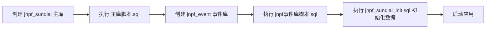
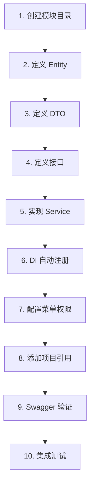
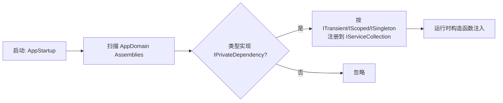
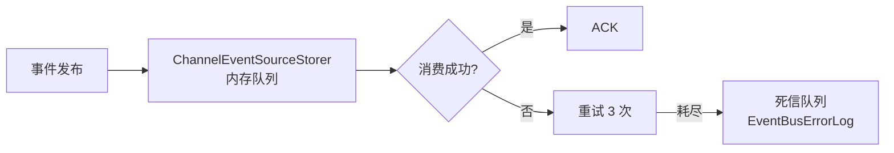
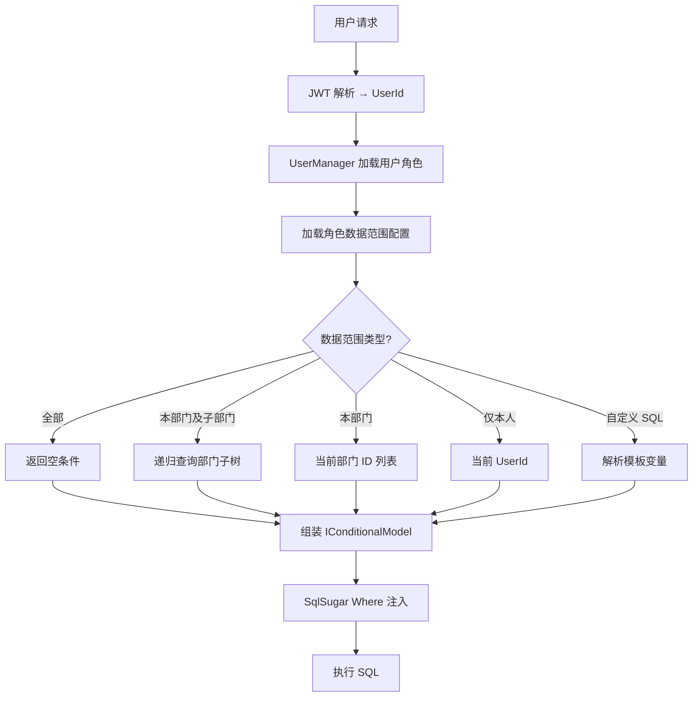
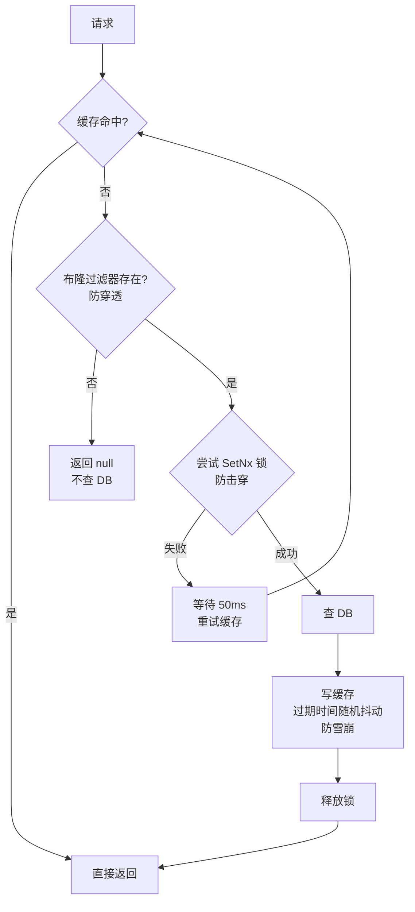
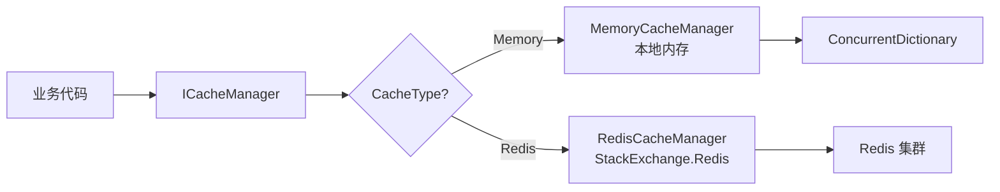
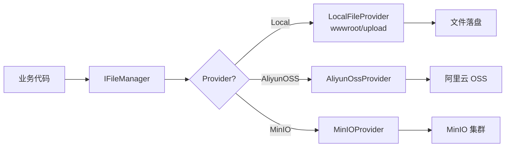
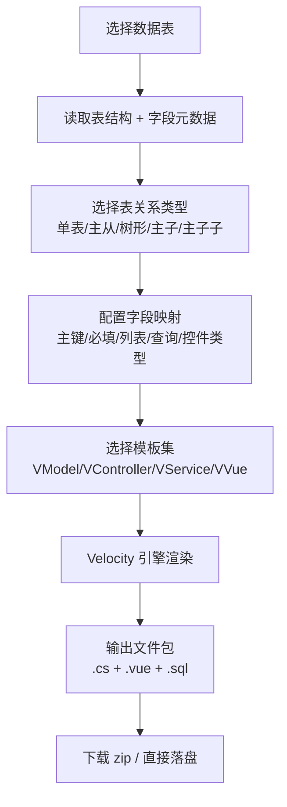

# JNPF 低代码平台 · 开发指南与编码规范

> **文档版本**：v1.0  
> **适用版本**：JNPF 3.6.0（基于 Furion 衍生 .NET 6.0）  
> **文档定位**：本手册是 JNPF 平台开发者的"作战手册"，覆盖从环境搭建到模块上线的全链路工程规范。所有新参与的二开同学，必须严格遵循本文档约定，确保团队代码风格、模块结构、运行时行为高度一致。

---

## 目录速览

- 第一章：开发环境搭建
- 第二章：编码规范
- 第三章：新模块开发完整指南（10 步流程）
- 第四章：DynamicApi 标准开发模式
- 第五章：EventBus 事件驱动开发
- 第六章：数据权限接入指南
- 第七章：缓存使用指南
- 第八章：事务管理
- 第九章：文件上传与存储
- 第十章：代码生成器使用指南
- 第十一章：单元测试
- 附录 A：常用接口速查
- 附录 B：缓存 Key 命名规范
- 附录 C：HTTP 动词与状态码
- 附录 D：文件路径索引

---

# 第一章 开发环境搭建

JNPF 平台对开发环境有强约束，版本错配是 90% 新人入坑的根因。本章给出"零踩坑"的官方推荐组合。

## 1.1 必备工具与版本要求

| 工具 | 推荐版本 | 必要性 | 备注 |
| ---- | -------- | ------ | ---- |
| .NET SDK | 6.0.x（推荐 6.0.428 LTS） | 必备 | 不允许使用 7/8/9 SDK 编译，否则 SqlSugar 行为有差异 |
| Visual Studio 2022 | 17.8 及以上 | 推荐 | 用于 IDE 开发与调试 |
| JetBrains Rider | 2023.3 及以上 | 可选 | StyleCop 集成更友好 |
| VS Code | 1.85+ | 可选 | 配 C# Dev Kit 即可 |
| Node.js | 16.20.x（不推荐 18/20） | 必备 | 前端 dist_v1.1 构建依赖 |
| MySQL | 5.7.36 / 8.0.x | 必备 | 默认主库引擎，字段前缀 `f_` |
| Redis | 6.2 及以上 | 推荐 | ICacheManager 默认实现之一 |
| RabbitMQ | 3.11+ | 可选 | 当 EventBus 切换 RabbitMQEventSourceStorer 时必备 |
| Docker Desktop | 最新稳定版 | 推荐 | 用于一键拉起中间件依赖 |
| Git | 2.40+ | 必备 | 配置 LF 行结尾，禁用 autocrlf |

> **数据库引擎说明**：当前示例以 MySQL 为主库示范，SQL Server 配置请参考《002、数据库设计与数据架构》与《003、部署运维与环境配置指南》。

**强约束**：

```bash
# 检查 SDK 版本
dotnet --list-sdks
# 必须存在 6.0.x；global.json 锁定 6.0 主版本（rollForward: latestMajor），推荐本地安装 6.0.428 LTS
```

仓库根目录的 [global.json](file:///d:/liu202505v2/global.json) 已通过 `version: 6.0` + `rollForward: latestMajor` 策略锁定 .NET 6 主版本，本地推荐安装 6.0.428 LTS，请勿提交本地策略修改。

## 1.2 本地开发环境配置

### 1.2.1 仓库克隆与还原

```bash
git clone <repo-url> liu202505v2
cd liu202505v2/framework
dotnet restore JNPF.sln
dotnet build JNPF.sln -c Debug --no-restore
```

### 1.2.2 配置文件

主入口位于 [application/JNPF.API.Entry](file:///d:/liu202505v2/application/JNPF.API.Entry)：

- `appsettings.json`：通用配置
- `appsettings.Development.json`：本地开发覆盖
- `Configurations/*.json`：分模块配置（ConnectionStrings、Cache、EventBus、JWT 等）

最常被新人忽略的两项：

```json
// Configurations/ConnectionStrings.json
{
  "ConnectionStrings": {
    "ConnectionConfigs": [
      {
        "ConfigId": "default",
        "DBType": "SqlServer",
        "ConnectionString": "Server=localhost;Database=ZXAF_V1_DevTest1;User Id=sa;Password=yourpwd;"
      }
    ]
  }
}
```

```json
// Configurations/Cache.json
{
  "Cache": {
    "CacheType": "RedisCache",        // RedisCache / MemoryCache
    "ip": "127.0.0.1",
    "port": 6379,
    "RedisConnectionString": "{0}:{1},poolsize=500,connectTimeout=5000,syncTimeout=5000"
  }
}
```

### 1.2.3 启动方式

```bash
cd application/JNPF.API.Entry
dotnet run --launch-profile JNPF.API.Entry
```

启动成功后浏览器访问 `http://localhost:30000/index.html` 进入 Swagger UI。

## 1.3 数据库初始化

JNPF 使用"主库 + 事件库"双库结构：

- **主库**：`web/主库脚本.sql`，承载所有业务表
- **事件库**：`web/jnpf事件库脚本.sql`，承载 EventBus 消息持久化

执行顺序：



> **注意**：SQL Server 用户改用 `web/jnpf_sundial_init_sqlserver.sql`，并修改 `Configurations/ConnectionStrings.json` 中对应连接的 `DBType` 为 `SqlServer`。

## 1.4 IDE 插件推荐

| 插件 | 用途 | 必备性 |
| ---- | ---- | ------ |
| StyleCop.Analyzers | 代码风格静态校验 | 必备（仓库已 NuGet 引用） |
| Roslynator | C# 重构与诊断 | 推荐 |
| EditorConfig | 自动应用 .editorconfig | 必备（VS 内置，Rider 内置） |
| SonarLint | 代码异味检测 | 推荐 |
| GitLens | Git 历史增强 | 推荐 |
| RestClient (.http) | API 调试 | 可选 |

**禁用项**：

- ReSharper 的"Suggest var"自动建议（与团队"显式类型"约定冲突）
- VS 的"Code Cleanup on Save → Remove Unused Usings"（会误删某些反射依赖）

---

# 第二章 编码规范

JNPF 代码规范以 **可读性 ≥ 一致性 ≥ 灵活性** 为核心准则。本章是上线 PR 评审的硬性卡口。

## 2.1 代码格式

### 2.1.1 Allman 风格（强制）

```csharp
public class UserService
{
    public async Task<UserOutput> GetAsync(string id)
    {
        if (string.IsNullOrEmpty(id))
        {
            throw Oops.Oh("ID 不能为空");
        }

        var entity = await _repository.GetByIdAsync(id);
        return entity.Adapt<UserOutput>();
    }
}
```

> 严禁 K&R / 1TBS 风格的 `if (xxx) {`，左花括号必须独占一行。

### 2.1.2 .editorconfig 关键约定

[根目录 .editorconfig](file:///d:/liu202505v2/.editorconfig) 已锁定以下规则：

```ini
[*.cs]
indent_style = space
indent_size = 4
charset = utf-8
end_of_line = crlf
trim_trailing_whitespace = true
insert_final_newline = true

# C#
csharp_new_line_before_open_brace = all
csharp_new_line_before_else = true
csharp_new_line_before_catch = true
csharp_new_line_before_finally = true
csharp_prefer_braces = true:warning
csharp_style_var_when_type_is_apparent = true:suggestion
csharp_style_namespace_declarations = file_scoped:suggestion
```

### 2.1.3 行宽与空行

- 单行最大宽度 **160 字符**（StyleCop SA1101 已放宽）
- 方法之间空一行；大段注释段落前空一行
- using 区块按"系统命名空间 → 三方 → 本项目"分组，每组之间空一行

## 2.2 命名约定

| 元素 | 规则 | 示例 |
| ---- | ---- | ---- |
| 类 | PascalCase | `UserService` |
| 接口 | I + PascalCase | `IUserService` |
| 抽象类 | Base 后缀 | `EntityBase` |
| 方法 | PascalCase，动词开头 | `GetUser`、`CreateUser` |
| 字段（私有） | _camelCase | `_repository` |
| 属性 | PascalCase | `UserName` |
| 常量 | UPPER_SNAKE_CASE | `BLACKLIST_REFRESH_TOKEN` |
| 局部变量 | camelCase | `var userId = ...` |
| 数据库表 | jnpf_ 前缀 | `jnpf_sys_user` |
| 数据库字段 | f_ 前缀 + 小写下划线 | `f_user_id`、`f_real_name` |
| 实体 | Entity 后缀 | `UserEntity` |
| DTO | Input / Output 后缀 | `UserListInput`、`UserListOutput` |
| 事件名 | 模块:动作（PascalCase） | `User:Created`、`Order:Paid` |
| 缓存 Key | 推荐 `{系统}:{领域}:{业务}_{标识}` 或 `{模块}_{业务}_{标识}` | `jnpf:global:tenant`、`user_info_123456` |

### 2.2.1 字段前缀强约束

```csharp
// ✅ 正确
[SugarColumn(ColumnName = "f_user_name")]
public string UserName { get; set; }

// ❌ 错误：缺少 f_ 前缀
[SugarColumn(ColumnName = "user_name")]
public string UserName { get; set; }
```

JNPF 所有业务表字段必须以 `f_` 开头，否则代码生成器、数据权限、审计日志均会异常。

## 2.3 StyleCop 规则与配置

仓库使用 [stylecop.json](file:///d:/liu202505v2/stylecop.json) + [dotnet.ruleset](file:///d:/liu202505v2/dotnet.ruleset) 双层控制：

- **保留启用**：SA1101（this 引用）、SA1200（using 在命名空间内/外）、SA1633（文件头）
- **关闭**：SA1009（右括号空格）、SA1413（尾随逗号）

**违规示例**：

```csharp
// SA1633 违规：缺少文件头
namespace JNPF.System;
public class Demo {}
```

**正确示例**：

```csharp
// -----------------------------------------------------------------------
// <copyright file="Demo.cs" company="JNPF">
//     Copyright (c) JNPF. All rights reserved.
// </copyright>
// -----------------------------------------------------------------------
namespace JNPF.System;

public class Demo
{
}
```

## 2.4 XML 文档注释规范

所有 **public** 成员必须有 XML 注释（StyleCop SA1600）。

```csharp
/// <summary>
/// 根据用户 ID 获取用户详情。
/// </summary>
/// <param name="id">用户主键，不能为空。</param>
/// <returns>用户输出 DTO；若不存在则抛出 <see cref="AppFriendlyException"/>。</returns>
/// <exception cref="AppFriendlyException">当 id 为空或用户不存在时抛出。</exception>
public async Task<UserOutput> GetAsync(string id)
{
    // ...
}
```

**Tag 使用规范**：

- `<summary>`：必须，单行不超过 60 字
- `<param>`：每个参数都要写
- `<returns>`：非 void 必须写
- `<exception>`：业务异常路径必须列出
- `<remarks>`：补充说明、场景注意事项
- `<example>`：复杂 API 提供调用示例

---

# 第三章 新模块开发完整指南（10 步流程）

本章给出从零创建一个业务模块的完整流程。以"待办事项 Todo"模块为例，所有命令在仓库根目录执行。

## 3.0 流程总览



## 3.1 模块目录创建

在 `modularity/extend/` 下创建：

```
modularity/extend/todo/
├── JNPF.Todo/
│   ├── Services/
│   │   └── Todo/
│   │       └── TodoService.cs
│   ├── EventHandlers/
│   │   └── TodoEventHandler.cs
│   └── JNPF.Todo.csproj
├── JNPF.Todo.Entitys/
│   ├── Entity/
│   │   └── TodoEntity.cs
│   ├── Dto/
│   │   └── Todo/
│   │       ├── TodoListInput.cs
│   │       ├── TodoListOutput.cs
│   │       ├── TodoCrInput.cs
│   │       └── TodoInfoOutput.cs
│   └── JNPF.Todo.Entitys.csproj
└── JNPF.Todo.Interfaces/
    ├── Service/
    │   └── ITodoService.cs
    └── JNPF.Todo.Interfaces.csproj
```

每个 csproj 都继承根目录的 [Directory.Build.props](file:///d:/liu202505v2/Directory.Build.props)：

```xml
<Project Sdk="Microsoft.NET.Sdk">
  <PropertyGroup>
    <TargetFramework>net6.0</TargetFramework>
    <GenerateDocumentationFile>true</GenerateDocumentationFile>
    <NoWarn>1701;1702;1591</NoWarn>
  </PropertyGroup>
  <ItemGroup>
    <ProjectReference Include="..\..\..\framework\JNPF\JNPF.csproj" />
  </ItemGroup>
</Project>
```

## 3.2 实体类定义

继承 `TenantCLDSEntityBase`（含 CreatorTime / LastModifyTime / DeleteMark / SortCode + TenantId）：

```csharp
using SqlSugar;

namespace JNPF.Todo.Entitys.Entity;

/// <summary>
/// 待办事项。
/// </summary>
[SugarTable("jnpf_todo")]
[Tenant("default")]
public class TodoEntity : TenantCLDSEntityBase
{
    /// <summary>标题。</summary>
    [SugarColumn(ColumnName = "f_title", Length = 200)]
    public string Title { get; set; }

    /// <summary>内容。</summary>
    [SugarColumn(ColumnName = "f_content", ColumnDataType = "text")]
    public string Content { get; set; }

    /// <summary>截止时间。</summary>
    [SugarColumn(ColumnName = "f_due_date")]
    public DateTime? DueDate { get; set; }

    /// <summary>状态：0 未开始 1 进行中 2 已完成。</summary>
    [SugarColumn(ColumnName = "f_status")]
    public int Status { get; set; }
}
```

## 3.3 DTO 定义

```csharp
namespace JNPF.Todo.Entitys.Dto.Todo;

/// <summary>分页查询入参。</summary>
public class TodoListInput : PaginationBaseInput
{
    /// <summary>关键字（标题模糊）。</summary>
    public string keyword { get; set; }

    /// <summary>状态筛选。</summary>
    public int? status { get; set; }

    /// <summary>菜单 ID（用于数据权限）。</summary>
    public string menuId { get; set; }
}

public class TodoListOutput
{
    public string id { get; set; }
    public string title { get; set; }
    public DateTime? dueDate { get; set; }
    public int status { get; set; }
    public DateTime creatorTime { get; set; }
}

public class TodoCrInput
{
    public string id { get; set; }
    public string title { get; set; }
    public string content { get; set; }
    public DateTime? dueDate { get; set; }
    public int status { get; set; }
}

public class TodoInfoOutput : TodoCrInput
{
    public DateTime creatorTime { get; set; }
    public string creatorUserId { get; set; }
}
```

## 3.4 接口定义

```csharp
using JNPF.Todo.Entitys.Dto.Todo;

namespace JNPF.Todo.Interfaces.Service;

public interface ITodoService
{
    Task<PageResult<TodoListOutput>> GetPage(TodoListInput input);
    Task<TodoInfoOutput> GetInfo(string id);
    Task Create(TodoCrInput input);
    Task Update(string id, TodoCrInput input);
    Task Delete(string id);
}
```

## 3.5 Service 实现

```csharp
[ApiDescriptionSettings(Tag = "Todo", Name = "Todo", Order = 200)]
[Route("api/todo/[controller]")]
public class TodoService : ITodoService, IDynamicApiController, ITransient
{
    private readonly ISqlSugarRepository<TodoEntity> _repository;
    private readonly IUserManager _userManager;
    private readonly ICacheManager _cacheManager;
    private readonly IEventPublisher _eventPublisher;

    public TodoService(
        ISqlSugarRepository<TodoEntity> repository,
        IUserManager userManager,
        ICacheManager cacheManager,
        IEventPublisher eventPublisher)
    {
        _repository = repository;
        _userManager = userManager;
        _cacheManager = cacheManager;
        _eventPublisher = eventPublisher;
    }

    /// <summary>分页列表。</summary>
    [HttpGet("")]
    public async Task<PageResult<TodoListOutput>> GetPage(TodoListInput input)
    {
        var authorizeWhere = await _userManager.GetConditionAsync<TodoListOutput>(
            input.menuId, primaryKey: "f_id", isDataPermissions: true);

        var query = _repository.AsQueryable()
            .WhereIF(!string.IsNullOrEmpty(input.keyword), x => x.Title.Contains(input.keyword))
            .WhereIF(input.status.HasValue, x => x.Status == input.status.Value)
            .Where(authorizeWhere)
            .OrderByDescending(x => x.CreatorTime);

        var (list, total) = await query.ToPageListAsync(input.currentPage, input.pageSize);
        return new PageResult<TodoListOutput>
        {
            list = list.Adapt<List<TodoListOutput>>(),
            pagination = new Pagination { total = total, currentPage = input.currentPage, pageSize = input.pageSize }
        };
    }

    /// <summary>详情。</summary>
    [HttpGet("{id}")]
    public async Task<TodoInfoOutput> GetInfo(string id)
    {
        var entity = await _repository.GetByIdAsync(id) 
            ?? throw Oops.Oh("待办不存在或已删除");
        return entity.Adapt<TodoInfoOutput>();
    }

    /// <summary>新增。</summary>
    [HttpPost("")]
    [UnitOfWork]
    public async Task Create(TodoCrInput input)
    {
        var entity = input.Adapt<TodoEntity>();
        entity.Id = SnowflakeIdHelper.NextId();
        await _repository.InsertAsync(entity);
        await _eventPublisher.PublishAsync("Todo:Created", entity);
    }

    /// <summary>修改。</summary>
    [HttpPut("{id}")]
    [UnitOfWork]
    public async Task Update(string id, TodoCrInput input)
    {
        var entity = await _repository.GetByIdAsync(id)
            ?? throw Oops.Oh("待办不存在");
        input.Adapt(entity);
        await _repository.UpdateAsync(entity);
        await _eventPublisher.PublishAsync("Todo:Updated", entity);
    }

    /// <summary>删除。</summary>
    [HttpDelete("{id}")]
    [UnitOfWork]
    public async Task Delete(string id)
    {
        await _repository.DeleteByIdAsync(id);
        await _eventPublisher.PublishAsync("Todo:Deleted", new { id });
    }
}
```

## 3.6 注册到 DI 容器（自动扫描）

JNPF 通过 `IPrivateDependency` 标记接口扫描注册。`ITransient` 已实现该接口，**无需手动注册**。



确认扫描覆盖范围：项目集 csproj 必须被主入口 [JNPF.API.Entry.csproj](file:///d:/liu202505v2/application/JNPF.API.Entry/JNPF.API.Entry.csproj) 直接或间接引用。

## 3.7 添加菜单权限配置

打开后台管理 → 系统管理 → 菜单管理，新增：

| 字段 | 值 |
| ---- | --- |
| 菜单名称 | 待办事项 |
| 菜单类型 | 菜单 |
| URL | `/todo/list` |
| 权限标识 | `todo:list` |
| 接口地址 | `/api/todo/Todo` |
| 请求方式 | GET |

按钮权限继续添加 `todo:add`、`todo:edit`、`todo:delete`。

## 3.8 添加到主项目引用

在 [JNPF.API.Entry.csproj](file:///d:/liu202505v2/application/JNPF.API.Entry/JNPF.API.Entry.csproj) 末尾追加：

```xml
<ItemGroup>
  <ProjectReference Include="..\..\modularity\extend\todo\JNPF.Todo\JNPF.Todo.csproj" />
  <ProjectReference Include="..\..\modularity\extend\todo\JNPF.Todo.Entitys\JNPF.Todo.Entitys.csproj" />
  <ProjectReference Include="..\..\modularity\extend\todo\JNPF.Todo.Interfaces\JNPF.Todo.Interfaces.csproj" />
</ItemGroup>
```

执行 `dotnet build` 确认无编译错误。

## 3.9 Swagger 验证

启动应用，访问 `http://localhost:30000/index.html`：

- 检查左侧分组是否出现 **Todo** 标签
- 验证 5 个端点（GET 列表、GET 详情、POST 新增、PUT 修改、DELETE 删除）
- 使用 Swagger 自带 Token 输入框完成鉴权后实际调用

## 3.10 集成测试

最后跑 [JNPF.Xunit](file:///d:/liu202505v2/framework/JNPF.Xunit) 测试：详见第十一章。

---

# 第四章 DynamicApi 标准开发模式

DynamicApi 是 JNPF 的核心生产力武器：**写 Service，自动得 Controller**。

## 4.1 路由与分组约定

```csharp
[ApiDescriptionSettings(Tag = "User", Name = "User", Order = 200)]
[Route("api/system/[controller]")]
public class UserService : IUserService, IDynamicApiController, ITransient
```

- `Tag`：Swagger 分组（按业务领域归类）
- `Name`：控制器名（替换 `[controller]` 占位）
- `Order`：分组排序权重，越小越靠前
- `Route`：路由模板，`api/{业务域}/[controller]`

## 4.2 HTTP 动词映射规则

DynamicApiController 通过方法名前缀自动映射 HTTP 动词：

| 方法名前缀 | HTTP 动词 | 备注 |
| ---------- | --------- | ---- |
| `Get*` / `Query*` / `List*` / `Detail*` | GET | 只读操作 |
| `Create*` / `Add*` / `Insert*` | POST | 新增 |
| `Update*` / `Edit*` / `Modify*` | PUT | 全量/部分更新 |
| `Delete*` / `Remove*` | DELETE | 删除 |
| `Patch*` | PATCH | 局部更新（少用） |

```csharp
public class UserService : IUserService, IDynamicApiController, ITransient
{
    public async Task<PageResult<UserListOutput>> GetPage(UserListInput input) { } // GET
    public async Task<UserInfoOutput> GetInfo(string id) { }                       // GET
    public async Task Create(UserCrInput input) { }                                // POST
    public async Task Update(string id, UserCrInput input) { }                     // PUT
    public async Task Delete(string id) { }                                        // DELETE
}
```

如需自定义动词，使用 `[HttpGet]/[HttpPost]/[HttpPut]/[HttpDelete]` 显式标注。

## 4.3 参数绑定

| 来源 | 用法 | 适用场景 |
| ---- | ---- | -------- |
| `[FromQuery]`（默认 GET） | `GetPage([FromQuery] Input input)` | 列表查询 |
| `[FromBody]`（默认 POST/PUT） | `Create([FromBody] CrInput input)` | 复杂入参 |
| `[FromRoute]` | `GetInfo([FromRoute] string id)` | RESTful ID |
| `[FromForm]` | `Upload([FromForm] IFormFile file)` | 文件上传 |
| `[FromHeader]` | `Custom([FromHeader] string xToken)` | 头信息 |

## 4.4 统一返回格式

JNPF 框架自动包裹返回值（默认 `RESTfulResultProvider`）：

```json
{
  "code": 200,
  "msg": "操作成功",
  "data": { /* Service 返回值 */ },
  "extras": { /* 追踪信息，可为空 */ },
  "timestamp": 1716345600000
}
```

如需自定义包裹，实现 `IUnifyResultProvider` 替换默认 `RESTfulResultProvider`。

**异常返回**：

```json
{
  "code": 400,
  "msg": "用户不存在",
  "data": null,
  "extras": null,
  "timestamp": 1716345600000
}
```

## 4.5 异常处理

业务异常使用 `Oops.Oh` 抛出（自动转友好异常）：

```csharp
if (entity == null)
{
    throw Oops.Oh("待办不存在或已删除");
}
```

带错误码：

```csharp
public enum TodoErrorCode
{
    [ErrorCodeItemMetadata("待办不存在")]
    TODO_NOT_FOUND = 1001,

    [ErrorCodeItemMetadata("无权限操作他人待办")]
    TODO_NO_PERMISSION = 1002,
}

throw Oops.Oh(TodoErrorCode.TODO_NOT_FOUND);
```

全局异常 → 由 `FriendlyExceptionFilter` 拦截 → 返回统一 JSON。

---

# 第五章 EventBus 事件驱动开发

EventBus 是 JNPF 解耦的核心。用法极简，但**幂等设计**是面试题级别的重点。

## 5.1 事件命名约定

```
模块:动作
```

- 模块：PascalCase 单数（User、Order、Todo）
- 动作：过去时（Created、Updated、Deleted、Paid、Cancelled）

示例：

| 事件名 | 语义 |
| ------ | ---- |
| `User:Created` | 新用户注册 |
| `User:PasswordChanged` | 密码修改 |
| `Order:Paid` | 订单支付成功 |
| `Todo:Completed` | 待办标记完成 |

## 5.2 发布事件

```csharp
public async Task Create(TodoCrInput input)
{
    var entity = input.Adapt<TodoEntity>();
    entity.Id = SnowflakeIdHelper.NextId();
    await _repository.InsertAsync(entity);

    // 发布事件
    await _eventPublisher.PublishAsync("Todo:Created", entity);
}
```

## 5.3 订阅事件

订阅器是独立类，标记 `IEventSubscriber + ITransient`：

```csharp
public class TodoEventHandler : IEventSubscriber, ITransient
{
    private readonly ILogger<TodoEventHandler> _logger;
    private readonly IMessageService _messageService;

    public TodoEventHandler(ILogger<TodoEventHandler> logger, IMessageService messageService)
    {
        _logger = logger;
        _messageService = messageService;
    }

    [EventSubscribe("Todo:Created")]
    public async Task OnTodoCreated(EventHandlerExecutingContext context)
    {
        var entity = context.Source.Payload.Adapt<TodoEntity>();
        _logger.LogInformation("收到 Todo 创建事件：{Title}", entity.Title);

        // 发送站内信
        await _messageService.SendAsync(entity.CreatorUserId, $"新待办：{entity.Title}");
    }

    [EventSubscribe("Todo:Updated")]
    public async Task OnTodoUpdated(EventHandlerExecutingContext context)
    {
        // ...
    }
}
```

## 5.4 错误重试与幂等设计

EventBus 支持失败自动重试，重试参数直接在 `[EventSubscribe]` 特性上配置：

```csharp
[EventSubscribe("Todo:Created", NumRetries = 3, RetryTimeout = 1000)]
public async Task OnTodoCreated(EventHandlerExecutingContext context) { }
```

**幂等三板斧**：

1. **业务唯一键去重**：处理前先查 `EventLog 表 where event_id = ?`
2. **数据库唯一索引**：让重复插入直接报错，捕获后忽略
3. **状态机校验**：`if (entity.Status != Pending) return;`



## 5.5 RabbitMQ 切换指南

默认使用 `ChannelEventSourceStorer`（进程内）。生产强烈推荐 RabbitMQ：

```csharp
// Startup.cs / OAStartup.cs
services.AddEventBus(builder =>
{
    builder.UseRabbitMQ(config =>
    {
        config.HostName = "127.0.0.1";
        config.UserName = "guest";
        config.Password = "guest";
        config.QueueName = "jnpf_event_queue";
    });
});
```

切换后事件跨进程可靠投递，配合 [JNPF.Extras.EventBus.RabbitMQ](file:///d:/liu202505v2/infrastructure/JNPF.Extras.EventBus.RabbitMQ) 使用。

---

# 第六章 数据权限接入指南

JNPF 数据权限通过 **角色 → 数据范围 → 条件下推** 实现，对业务代码侵入极小。

## 6.1 数据权限模型

| 数据范围 | 含义 |
| -------- | ---- |
| 全部 | 不过滤 |
| 本部门及子部门 | `f_organize_id IN (子树所有部门)` |
| 本部门 | `f_organize_id = 当前部门` |
| 仅本人 | `f_creator_user_id = 当前用户` |
| 自定义 | 通过角色自定义 SQL 片段 |

## 6.2 GetConditionAsync 用法

```csharp
var authorizeWhere = await _userManager.GetConditionAsync<TodoListOutput>(
    moduleId: input.menuId,           // 当前菜单 ID（前端传）
    primaryKey: "f_id",               // 表主键字段
    isDataPermissions: true);          // 是否启用数据权限
```

返回值类型：`List<IConditionalModel>`，可直接拼接到 SqlSugar 链式查询。

## 6.3 与分页查询集成

```csharp
public async Task<PageResult<TodoListOutput>> GetPage(TodoListInput input)
{
    var authorizeWhere = await _userManager.GetConditionAsync<TodoListOutput>(
        input.menuId, "f_id", isDataPermissions: true);

    var (list, total) = await _repository.AsQueryable()
        .WhereIF(!string.IsNullOrEmpty(input.keyword), x => x.Title.Contains(input.keyword))
        .Where(authorizeWhere)        // ← 注入权限条件
        .OrderByDescending(x => x.CreatorTime)
        .ToPageListAsync(input.currentPage, input.pageSize);

    return new PageResult<TodoListOutput>
    {
        list = list.Adapt<List<TodoListOutput>>(),
        pagination = new Pagination
        {
            total = total,
            currentPage = input.currentPage,
            pageSize = input.pageSize
        }
    };
}
```

## 6.4 数据权限过滤链



## 6.5 自定义权限扩展

实现 `IDataScopeProvider` 自定义解析：

```csharp
public class CustomScopeProvider : IDataScopeProvider, ITransient
{
    public async Task<List<IConditionalModel>> ResolveAsync(string moduleId, string primaryKey)
    {
        // 自定义业务规则
        return new List<IConditionalModel>
        {
            new ConditionalModel
            {
                FieldName = "f_status",
                ConditionalType = ConditionalType.Equal,
                FieldValue = "1"
            }
        };
    }
}
```

---

# 第七章 缓存使用指南

## 7.1 ICacheManager API 速查

| API | 说明 |
| --- | ---- |
| `List<string> GetAllCacheKeys()` | 获取所有缓存关键字 |
| `string Get(string key)` / `Task<string> GetAsync(string key)` | 获取字符串缓存 |
| `T Get<T>(string key)` / `Task<T> GetAsync<T>(string key)` | 获取并反序列化为指定类型 |
| `bool Set(string key, object value)` / `Task<bool> SetAsync(string key, object value)` | 写入（无过期） |
| `bool Set(string key, object value, TimeSpan timeSpan)` / `Task<bool> SetAsync(string key, object value, TimeSpan timeSpan)` | 写入并设置过期 |
| `bool Exists(string key)` / `Task<bool> ExistsAsync(string key)` | 是否存在 |
| `bool Del(string key)` | 删除单 Key |
| `Task<bool> DelAsync(string key)` | 异步删除单 Key |
| `Task<bool> DelAsync(string[] key)` | 异步批量删除 |
| `Task<bool> DelByPatternAsync(string pattern)` | 通配符模式删除（Redis 用 SCAN/KEYS） |
| `long Incrby(string key, long incrBy)` / `Task<long> IncrbyAsync(string key, long incrBy)` | 原子增量 |
| `bool SetNx(string key, object value, TimeSpan expire)` | 带过期分布式锁（原子 SETNX + EXPIRE） |
| `bool SetNx(string key, object value)` | 不带过期的 SETNX |
| `DateTime GetCacheOutTime(string key)` | 获取缓存过期时间 |

```csharp
public class TodoService
{
    public async Task<TodoInfoOutput> GetInfo(string id)
    {
        var cacheKey = $"todo_info_{id}";
        var cached = _cacheManager.Get<TodoInfoOutput>(cacheKey);
        if (cached != null) return cached;

        var entity = await _repository.GetByIdAsync(id) 
            ?? throw Oops.Oh("待办不存在");
        var output = entity.Adapt<TodoInfoOutput>();
        _cacheManager.Set(cacheKey, output, TimeSpan.FromMinutes(30));
        return output;
    }
}
```

## 7.2 Key 命名规范

推荐使用 `:` 作为命名空间分隔符（如 `jnpf:global:tenant`），业务模块可采用下列任一格式：

```
{系统前缀}:{领域}:{业务}_{标识}     // 推荐：多租户/多环境场景
{模块}_{业务}_{标识}                  // 备选：单调打平命名
```

示例：

| Key | 含义 |
| --- | ---- |
| `jnpf:global:tenant` | 全局租户缓存 |
| `user_info_123456` | 用户详情缓存 |
| `user_role_123456` | 用户角色集合 |
| `todo_list_userid_123` | 用户待办列表 |
| `lock_order_pay_OD20240101001` | 订单支付分布式锁 |
| `auth_blacklist_token_xxx` | JWT 黑名单 |

**禁止**：

- 包含中文
- 超过 128 字符

## 7.3 缓存穿透 / 击穿 / 雪崩防护



**抖动写入**：

```csharp
var random = new Random().Next(0, 60);
_cacheManager.Set(key, value, TimeSpan.FromMinutes(30 + random));
```

## 7.4 分布式锁（SetNx）

```csharp
var lockKey = $"lock_todo_create_{userId}";
var locked = _cacheManager.SetNx(lockKey, "1", TimeSpan.FromSeconds(10));
if (!locked)
{
    throw Oops.Oh("操作过于频繁，请稍后再试");
}

try
{
    // 临界区：仅一个进程可执行
    await _repository.InsertAsync(entity);
}
finally
{
    _cacheManager.Del(lockKey);
}
```

> **注意**：释放锁应使用 Lua 脚本校验 value 一致性，避免误删他人锁。`ICacheManager` 提供了 `ReleaseLock(key, token)` 进阶方法，生产环境推荐使用。

## 7.5 Redis / Memory 切换

切换只需修改 `Configurations/Cache.json`：

```json
// 单机调试
{
  "Cache": {
    "CacheType": "MemoryCache"
  }
}
```

```json
// 生产
{
  "Cache": {
    "CacheType": "RedisCache",
    "ip": "127.0.0.1",
    "port": 6379,
    "RedisConnectionString": "{0}:{1},poolsize=500,connectTimeout=5000,syncTimeout=5000"
  }
}
```

代码层无任何改动，全部由 `ICacheManager` 抽象屏蔽。



---

# 第八章 事务管理

## 8.1 [UnitOfWork] 声明式事务

最常用、最推荐：

```csharp
[HttpPost("batchRemove")]
[UnitOfWork]
public async Task BatchRemove([FromBody] List<string> ids)
{
    await _repository.DeleteByIdsAsync(ids.ToArray());
    await _logRepository.InsertAsync(new OperationLog { Action = "BatchRemove" });
    await _eventPublisher.PublishAsync("Todo:BatchRemoved", ids);
}
```

特性运行机制：

- 由 `UnitOfWorkAttribute`（实现 `IAsyncActionFilter`，`Order = 9999`）拦截
- 进入方法前 `BeginTran()`，方法成功 `CommitTran()`，抛异常 `RollbackTran()`
- 支持 SqlSugar `Ado.UseTran` 上下文嵌套

## 8.2 编程式事务

跨多 Repository / 复杂判断时：

```csharp
public async Task ComplexOperation(string id)
{
    var db = _repository.Context;
    try
    {
        db.BeginTran();

        var entity = await _repository.GetByIdAsync(id);
        entity.Status = 2;
        await _repository.UpdateAsync(entity);

        await _logRepository.InsertAsync(new Log { TodoId = id });

        // 条件判断
        if (entity.Title.Contains("urgent"))
        {
            await _alertRepository.InsertAsync(new Alert { TodoId = id });
        }

        db.CommitTran();
    }
    catch
    {
        db.RollbackTran();
        throw;
    }
}
```

## 8.3 跨库事务

JNPF 支持多 ConfigId 的多库场景。跨库场景使用 SqlSugar `UseTranAsync` + DTC，或者**最终一致性**（推荐）：

```csharp
// 方案一：分布式事务（不推荐，性能差）
await _repository.Context.Ado.UseTranAsync(async () =>
{
    await _mainRepo.InsertAsync(...);
    await _eventDb.InsertAsync(...);
});

// 方案二：本地事务 + EventBus 最终一致（推荐）
[UnitOfWork]
public async Task Pay(string orderId)
{
    await _orderRepo.UpdateAsync(o => o.Status = "Paid");
    await _eventPublisher.PublishAsync("Order:Paid", new { orderId });
    // 库存扣减由 OrderEventHandler 异步消费完成
}
```

## 8.4 最佳实践与注意事项

- ✅ 单条简单写：直接调用 Repository，无需事务
- ✅ 多条同库写：`[UnitOfWork]`
- ✅ 跨库写：业务表 + 事件库 → `[UnitOfWork]`（事件库自动登记）
- ❌ 长事务（含远程调用、大循环）：拆分异步处理
- ❌ 事务内使用 `Task.WhenAll`：SqlSugar 连接非线程安全
- ❌ 在 `[UnitOfWork]` 方法内 `try-catch` 吞掉异常：会导致事务无法回滚

---

# 第九章 文件上传与存储

## 9.1 IFileManager 接口

| 方法 | 用途 |
| ---- | ---- |
| `UploadFileAsync(IFormFile file, string folder = null)` | 单文件上传 |
| `InitChunkUploadAsync(string fileName, int totalChunks)` | 初始化分片 |
| `UploadChunkAsync(int index, byte[] data, string uploadId)` | 上传单片 |
| `MergeChunkAsync(string uploadId)` | 合并分片 |
| `DeleteFileAsync(string fileUrl)` | 删除文件 |
| `GetSignedUrlAsync(string fileUrl, TimeSpan expire)` | 临时签名 URL |

## 9.2 普通文件上传

```csharp
[ApiDescriptionSettings(Tag = "Upload")]
[Route("api/file/[controller]")]
public class FileUploadService : IFileUploadService, IDynamicApiController, ITransient
{
    private readonly IFileManager _fileManager;

    public FileUploadService(IFileManager fileManager)
    {
        _fileManager = fileManager;
    }

    [HttpPost("upload")]
    public async Task<FileUploadOutput> Upload([FromForm] IFormFile file)
    {
        if (file == null || file.Length == 0)
        {
            throw Oops.Oh("请选择文件");
        }
        if (file.Length > 50 * 1024 * 1024)
        {
            throw Oops.Oh("单文件不超过 50MB，请使用分片上传");
        }

        var result = await _fileManager.UploadFileAsync(file, folder: "todo");
        return new FileUploadOutput
        {
            url = result.FileUrl,
            name = result.FileName,
            size = result.FileSize
        };
    }
}
```

## 9.3 分片上传（大文件）

```csharp
// 1. 初始化
[HttpPost("chunk/init")]
public async Task<ChunkInitOutput> InitChunk(ChunkInitInput input)
{
    var result = await _fileManager.InitChunkUploadAsync(input.fileName, input.totalChunks);
    return new ChunkInitOutput { uploadId = result.UploadId };
}

// 2. 分片上传
[HttpPost("chunk/upload")]
public async Task UploadChunk([FromForm] ChunkUploadInput input)
{
    using var ms = new MemoryStream();
    await input.chunk.CopyToAsync(ms);
    await _fileManager.UploadChunkAsync(input.index, ms.ToArray(), input.uploadId);
}

// 3. 合并
[HttpPost("chunk/merge")]
public async Task<FileUploadOutput> MergeChunk(ChunkMergeInput input)
{
    var result = await _fileManager.MergeChunkAsync(input.uploadId);
    return new FileUploadOutput { url = result.FileUrl };
}
```

## 9.4 OSS 存储切换

`Configurations/UploadSettings.json`：

```json
{
  "UploadSettings": {
    "Provider": "Local",   // Local / AliyunOSS / MinIO
    "Local": {
      "BasePath": "wwwroot/upload",
      "BaseUrl": "http://localhost:30000/upload"
    },
    "AliyunOSS": {
      "Endpoint": "oss-cn-hangzhou.aliyuncs.com",
      "AccessKeyId": "xxx",
      "AccessKeySecret": "xxx",
      "BucketName": "jnpf-prod"
    },
    "MinIO": {
      "Endpoint": "minio.local:9000",
      "AccessKey": "xxx",
      "SecretKey": "xxx",
      "BucketName": "jnpf"
    }
  }
}
```



---

# 第十章 代码生成器使用指南

代码生成器位于 [modularity/codegen/JNPF.CodeGen](file:///d:/liu202505v2/modularity/codegen/JNPF.CodeGen)，基于 **Velocity** 模板引擎。

## 10.1 代码生成器架构



## 10.2 .vm 模板语法

Velocity 核心语法：

```velocity
## 单行注释
#* 多行
   注释 *#

## 变量
$entityName        ## 实体类名（PascalCase）
$tableName         ## 表名
$columns           ## 列集合
$primaryKey        ## 主键列

## 控制结构
#foreach($column in $columns)
    public ${column.csharpType} ${column.propertyName} { get; set; }
#end

#if($column.isRequired == 1)
    [Required]
#end

## 引用其他模板
#parse("Common/Header.vm")
```

实体模板示例（`VModel.vm`）：

```velocity
namespace JNPF.${moduleName}.Entitys.Entity;

[SugarTable("${tableName}")]
[Tenant("default")]
public class ${entityName}Entity : TenantCLDSEntityBase
{
#foreach($col in $columns)
    /// <summary>${col.comment}</summary>
    [SugarColumn(ColumnName = "${col.columnName}")]
    public ${col.csharpType} ${col.propertyName} { get; set; }

#end
}
```

## 10.3 五种表关系类型

| 类型 | 描述 | 典型场景 |
| ---- | ---- | -------- |
| 单表 | 仅一张表 | 字典、用户 |
| 主从 | 1:N，从表关联主表 | 订单 + 订单明细（同时新增编辑） |
| 树形 | 自关联（parent_id） | 部门、菜单、分类 |
| 主子 | 主表为基础，子表附加属性 | 商品 + SKU |
| 主子子 | 三层：主 → 子 → 孙 | 项目 → 阶段 → 任务 |

## 10.4 生成流程演示

界面操作步骤：

1. 系统管理 → 代码生成 → "新增"
2. 选择数据库连接 → 选择表（支持多表）
3. 表关系：选择对应类型
4. 字段配置：勾选 列表显示 / 表单显示 / 查询条件 / 控件类型（输入框/下拉/日期/上传等）
5. 生成配置：模块名、作者、生成路径
6. 预览 / 下载 / 直接生成到磁盘

输出文件清单：

```
JNPF.Demo.Entitys/Entity/DemoEntity.cs
JNPF.Demo.Entitys/Dto/Demo/DemoListInput.cs
JNPF.Demo.Entitys/Dto/Demo/DemoListOutput.cs
JNPF.Demo.Entitys/Dto/Demo/DemoCrInput.cs
JNPF.Demo.Interfaces/Service/IDemoService.cs
JNPF.Demo/Services/Demo/DemoService.cs
JNPF.Demo/JNPF.Demo.csproj
web/src/views/demo/list.vue
web/src/views/demo/form.vue
sql/demo.sql
```

## 10.5 自定义模板开发

新增模板步骤：

1. 在 [JNPF.CodeGen/Templates](file:///d:/liu202505v2/modularity/codegen/JNPF.CodeGen) 下新建 `XxxYourTemplate.vm`
2. 在 `TemplateConfig.json` 注册：
   ```json
   {
     "name": "MyEnumTemplate",
     "templatePath": "Templates/MyEnumTemplate.vm",
     "outputPath": "${moduleName}/Enums/${entityName}Enum.cs"
   }
   ```
3. 重启服务后在生成器界面"模板选择"中即出现新模板

---

# 第十一章 单元测试

## 11.1 JNPF.Xunit 框架

测试基础设施位于 [framework/JNPF.Xunit](file:///d:/liu202505v2/framework/JNPF.Xunit)，封装：

- `TestStartup` 基类：自动加载 DI 容器、配置、数据库
- `TestServer` 集成测试支持
- `ITestOutputHelper` 输出适配

## 11.2 TestStartup 基类用法

```csharp
public class TodoServiceTest : TestStartup
{
    private readonly ITodoService _service;

    public TodoServiceTest(ITestOutputHelper output) : base(output)
    {
        _service = GetService<ITodoService>();
    }
}
```

`TestStartup.GetService<T>()` 内部委托给 `IServiceProvider.GetRequiredService<T>()`，支持所有 DI 容器中的依赖。

## 11.3 Fact / Theory 测试用例

```csharp
[Fact(DisplayName = "新增待办应当成功")]
public async Task Create_Should_Success()
{
    var input = new TodoCrInput
    {
        title = "买菜",
        content = "周末去超市",
        dueDate = DateTime.Now.AddDays(1),
        status = 0
    };
    await _service.Create(input);

    var page = await _service.GetPage(new TodoListInput
    {
        currentPage = 1,
        pageSize = 10,
        keyword = "买菜"
    });
    Assert.True(page.list.Count > 0);
}

[Theory]
[InlineData("", "标题不能为空")]
[InlineData(null, "标题不能为空")]
[InlineData("a", "标题至少 2 字")]
public async Task Create_With_InvalidTitle_Should_Throw(string title, string expectedMsg)
{
    var input = new TodoCrInput { title = title };
    var ex = await Assert.ThrowsAsync<AppFriendlyException>(() => _service.Create(input));
    Assert.Contains(expectedMsg, ex.Message);
}
```

## 11.4 Mock 策略

针对外部依赖（HTTP、第三方 SDK）使用 Moq：

```csharp
[Fact]
public async Task SendNotification_Should_Call_HttpClient()
{
    var mockHttp = new Mock<IHttpClientFactory>();
    var mockClient = new Mock<HttpMessageHandler>(MockBehavior.Strict);
    mockClient.Protected()
        .Setup<Task<HttpResponseMessage>>("SendAsync", ItExpr.IsAny<HttpRequestMessage>(), ItExpr.IsAny<CancellationToken>())
        .ReturnsAsync(new HttpResponseMessage(HttpStatusCode.OK));

    mockHttp.Setup(f => f.CreateClient(It.IsAny<string>()))
        .Returns(new HttpClient(mockClient.Object));

    var service = new NotificationService(mockHttp.Object);
    await service.SendAsync("hello");

    mockClient.Protected().Verify("SendAsync", Times.Once(),
        ItExpr.IsAny<HttpRequestMessage>(), ItExpr.IsAny<CancellationToken>());
}
```

> **原则**：基础设施（DB / 缓存 / 文件）使用真实容器（Docker），业务相关外部 API 才 Mock。

---

# 附录 A：常用接口速查

| 接口 | 路径 | 说明 |
| ---- | ---- | ---- |
| `ISqlSugarRepository<T>` | JNPF.Extras.DatabaseAccessor.SqlSugar | 仓储基类 |
| `IUserManager` | modularity/common/JNPF.Common.Core/Manager/User | 当前用户、数据权限解析 |
| `ICacheManager` | JNPF/Cache | 缓存抽象 |
| `IEventPublisher` | JNPF/EventBus | 事件发布 |
| `IFileManager` | modularity/common/JNPF.Common.Core/Manager/Files | 文件管理 |
| `IDynamicApiController` | JNPF/DynamicApiController | 动态 API 标记 |
| `ITransient/IScoped/ISingleton` | JNPF/DependencyInjection | DI 生命周期标记 |
| `IEventSubscriber` | JNPF/EventBus | 事件订阅器标记 |
| `IUnitOfWork` | JNPF/UnitOfWork | 工作单元 |
| `IConditionalModel` | SqlSugar | 数据权限条件模型 |

---

# 附录 B：缓存 Key 命名规范

| 业务域 | Key 模板 | 示例 |
| ------ | -------- | ---- |
| 用户 | `user_info_{userId}` | `user_info_1234567890` |
| 用户角色 | `user_role_{userId}` | `user_role_1234567890` |
| 角色权限 | `role_perm_{roleId}` | `role_perm_5001` |
| 字典 | `dict_{type}_{code}` | `dict_status_active` |
| 配置项 | `config_{key}` | `config_smtp_host` |
| 验证码 | `captcha_{sessionId}` | `captcha_abc123` |
| JWT 黑名单 | `auth_blacklist_{token_hash}` | `auth_blacklist_xxx` |
| 限流 | `ratelimit_{api}_{userId}` | `ratelimit_login_192.168.1.1` |
| 分布式锁 | `lock_{业务}_{资源}` | `lock_order_pay_OD001` |

通配符删除示例：

```csharp
await _cacheManager.DelByPatternAsync("user_info_*");      // 清空所有用户缓存
await _cacheManager.DelByPatternAsync("role_perm_*");      // 清空所有角色权限
```

---

# 附录 C：HTTP 动词与状态码

| 状态码 | 业务含义 |
| ------ | -------- |
| 200 | 业务成功 |
| 400 | 业务异常（AppFriendlyException） |
| 401 | 未登录 / Token 过期 |
| 403 | 已登录但无权限 |
| 404 | 资源不存在 |
| 409 | 数据冲突（如唯一键冲突） |
| 429 | 请求频率限制 |
| 500 | 系统异常（未捕获） |
| 503 | 服务不可用（如 DB 连接失败） |

JNPF 业务异常统一通过 `code` 字段返回，HTTP 通常仍是 200。前端按 `code != 200` 处理业务错误。

---

# 附录 D：文件路径索引

| 内容 | 路径 |
| ---- | ---- |
| 主入口 | [application/JNPF.API.Entry](file:///d:/liu202505v2/application/JNPF.API.Entry) |
| OA 子入口 | [application/JNPF.OA.API.Entry](file:///d:/liu202505v2/application/JNPF.OA.API.Entry) |
| 框架核心 | [framework/JNPF](file:///d:/liu202505v2/framework/JNPF) |
| SqlSugar 扩展 | [framework/JNPF.Extras.DatabaseAccessor.SqlSugar](file:///d:/liu202505v2/framework/JNPF.Extras.DatabaseAccessor.SqlSugar) |
| JWT 扩展 | [framework/JNPF.Extras.Authentication.JwtBearer](file:///d:/liu202505v2/framework/JNPF.Extras.Authentication.JwtBearer) |
| Mapster 扩展 | [framework/JNPF.Extras.ObjectMapper.Mapster](file:///d:/liu202505v2/framework/JNPF.Extras.ObjectMapper.Mapster) |
| RabbitMQ 集成 | [infrastructure/JNPF.Extras.EventBus.RabbitMQ](file:///d:/liu202505v2/infrastructure/JNPF.Extras.EventBus.RabbitMQ) |
| OSS / MinIO 集成 | [infrastructure/JNPF.Extras.Thirdparty](file:///d:/liu202505v2/infrastructure/JNPF.Extras.Thirdparty) |
| 第三方登录 | [infrastructure/JNPF.Extras.CollectiveOAuth](file:///d:/liu202505v2/infrastructure/JNPF.Extras.CollectiveOAuth) |
| 代码生成 | [modularity/codegen/JNPF.CodeGen](file:///d:/liu202505v2/modularity/codegen/JNPF.CodeGen) |
| OAuth 模块 | [modularity/oauth/JNPF.OAuth](file:///d:/liu202505v2/modularity/oauth/JNPF.OAuth) |
| 业务扩展模块 | [modularity/extend](file:///d:/liu202505v2/modularity/extend) |
| 单元测试基类 | [framework/JNPF.Xunit](file:///d:/liu202505v2/framework/JNPF.Xunit) |
| 主库 SQL | [web/主库脚本.sql](file:///d:/liu202505v2/web/主库脚本.sql) |
| 事件库 SQL | [web/jnpf事件库脚本.sql](file:///d:/liu202505v2/web/jnpf事件库脚本.sql) |
| 全局 Build 配置 | [Directory.Build.props](file:///d:/liu202505v2/Directory.Build.props) |
| StyleCop 规则 | [stylecop.json](file:///d:/liu202505v2/stylecop.json) |
| .NET 规则 | [dotnet.ruleset](file:///d:/liu202505v2/dotnet.ruleset) |
| EditorConfig | [.editorconfig](file:///d:/liu202505v2/.editorconfig) |

---

> **结语**  
> 本指南是 JNPF 平台日常开发的"地图 + 罗盘"。模块开发、缓存使用、事件订阅、数据权限、事务边界、文件存储、代码生成、单元测试 —— 全链路有规可循。请把它放在书签栏，遇到任何编码决策犹豫时，先来这里翻一翻。
>
> **没有搞不定的代码，只有没读完的指南。** —— 马爸爸的 coder MAX
