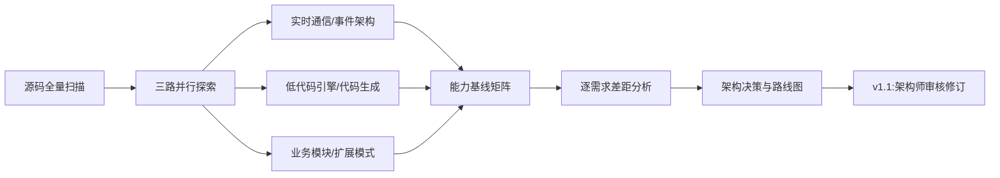
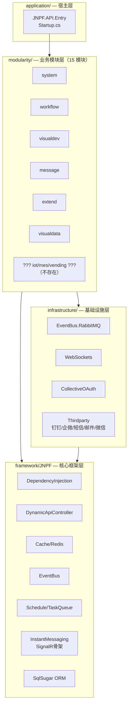
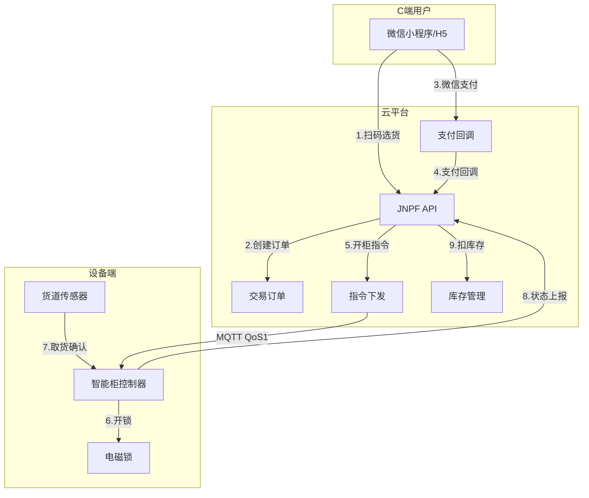
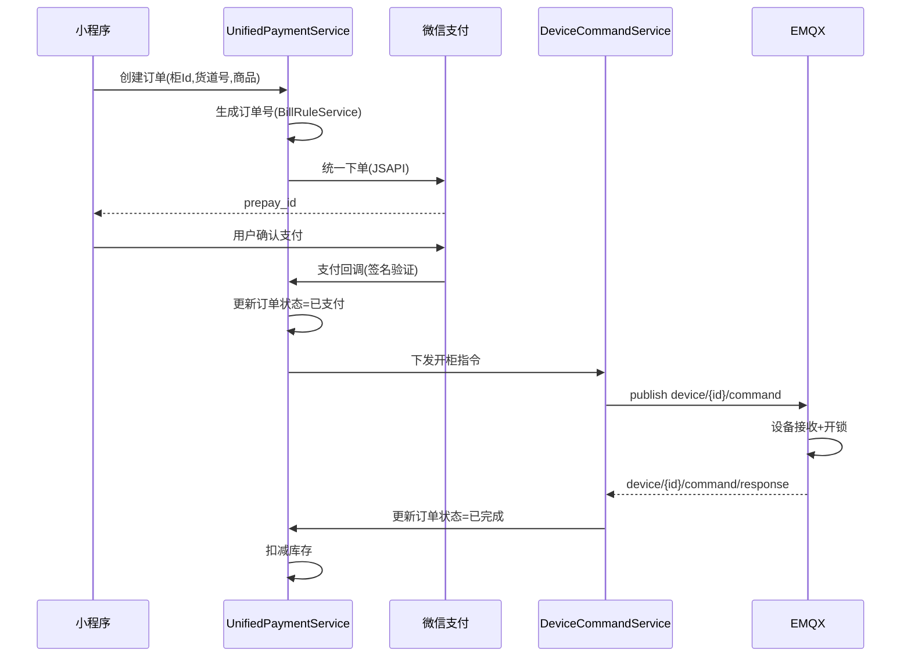
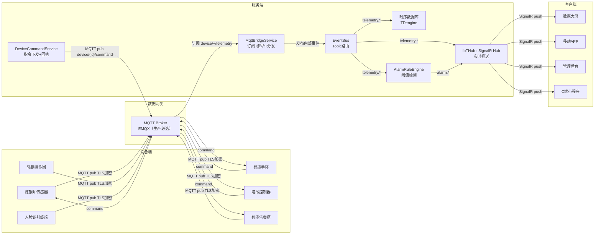
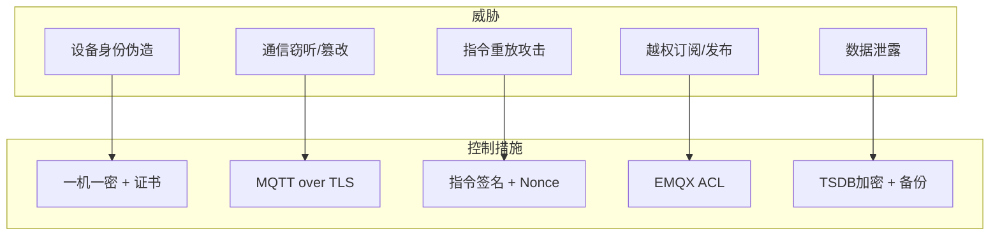
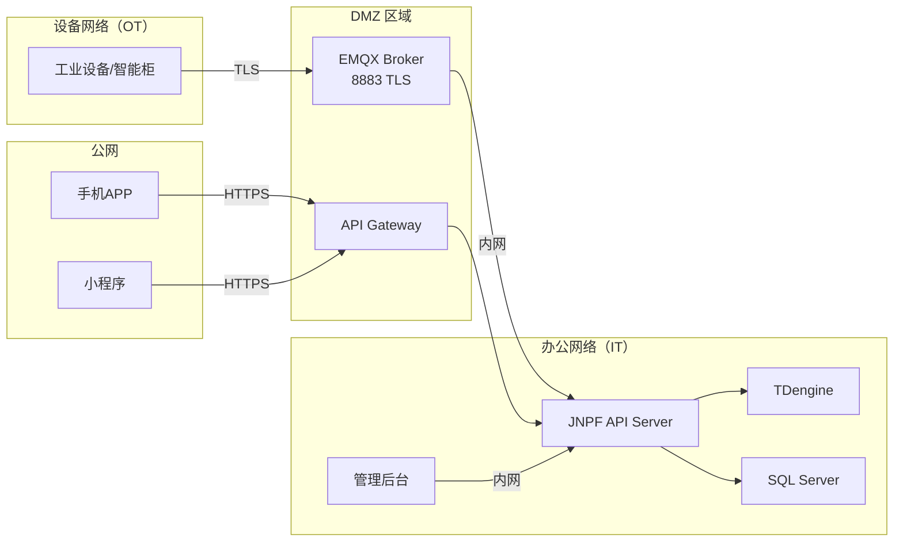
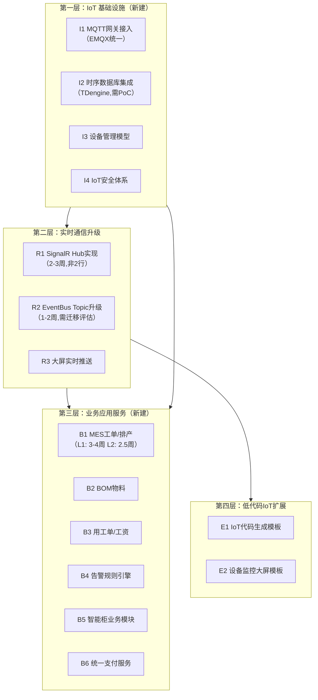
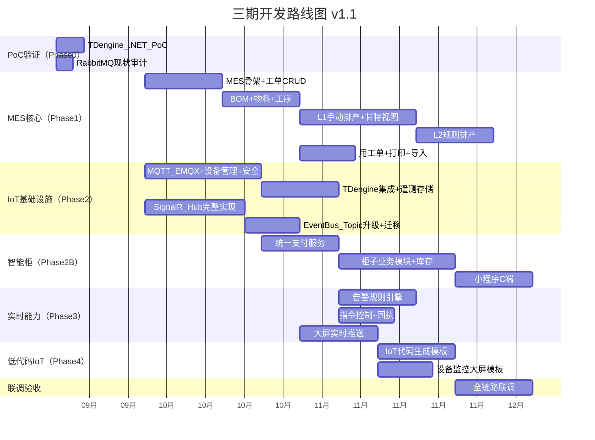

# Fruit+JNPF 低代码平台 — 物联网项目开发能力扩展评估

> **文档版本**：v1.1（根据架构师深度审核意见修订）  
> **文档性质**：技术架构选型评审解读（非实施方案）  
> **评估范围**：机械加工/钢铁行业 MES · 智慧工地 · 智能手环 · **智能更衣柜/售卖柜**  
> **当前阶段**：架构选型评审 → 审批后纳入三期统一开发  
> **评估方法**：源码全量扫描 + 三路并行深度探索 + 竞品/行业标准对标  
> **源码基线**：`d:\JNPF-v52\backend`（.NET 6 / SqlSugar / Furion 衍生框架）
>
> **v1.1 修订说明**：根据架构师评审意见，本版新增/修正以下内容：
> - **新增** 第三章A：智能更衣柜/售卖柜专项评估
> - **新增** 第四章A：IoT 安全评估
> - **新增** 第四章B：数据量与性能基线评估
> - **修正** 5 处技术判断偏差（MQTTnet Broker/TSDB 选型/排产 MVP/SignalR 工作量/EventBus 升级）
> - **新增** 第八章补充维度：OA+IoT 集成场景、部署架构、成本估算

---

## 目录

- [第一章：评估范围与方法论](#第一章评估范围与方法论)
- [第二章：现有架构能力基线（源码事实）](#第二章现有架构能力基线源码事实)
- [第三章：需求 1-5 MES 业务层评估](#第三章需求-1-5-mes-业务层评估)
- [**第三章A：智能更衣柜/售卖柜专项评估（v1.1 新增）**](#第三章a智能更衣柜售卖柜专项评估v11-新增)
- [第四章：需求 6 物联网实时通信评估](#第四章需求-6-物联网实时通信评估)
- [**第四章A：IoT 安全评估（v1.1 新增）**](#第四章aiot-安全评估v11-新增)
- [**第四章B：数据量与性能基线评估（v1.1 新增）**](#第四章b数据量与性能基线评估v11-新增)
- [第五章：需求 7 架构决策 — 升级扩展 vs 另建框架](#第五章需求-7-架构决策--升级扩展-vs-另建框架)
- [第六章：三期核心架构增强清单](#第六章三期核心架构增强清单)
- [第七章：低代码引擎 IoT 扩展评估](#第七章低代码引擎-iot-扩展评估)
- [第八章：实施路线图与工期估算（v1.1 修订）](#第八章实施路线图与工期估算v11-修订)

---

## 第一章：评估范围与方法论

### 1.1 评估背景

平台一期/二期聚焦 **通用办公 OA 低代码** 能力（表单/流程/消息/权限）。三期目标是在同一核心框架上支撑 **工业物联网（IIoT）+ 智能硬件** 类项目交付：

| 项目类型 | 典型场景 |
|----------|----------|
| **机械加工 MES** | ERP 订单导入 → 工单排产 → BOM 配料 → 工序跟踪 → 用工单打印 → 工资核算 |
| **钢铁行业 MES** | 炼钢炉传感器 → 轧钢操作岗 → 拉索操作岗 → 质检岗 → 秒级数据采集 → 实时大屏 |
| **智慧工地** | 塔吊/升降机人脸识别考勤 → 设备监控 → 安全告警 → 指令控制（吊臂移动） |
| **智能手环** | 健康检测数据实时同步 → APP 展示 → 异常告警 → 主动触发检测指令 |
| **智能更衣柜/售卖柜** | C 端扫码 → 选货 → 支付 → 开柜门 → 库存管理 → 补货提醒 → 离线交易 |

### 1.2 评估的 7+1 个功能需求

| # | 需求 | 领域 |
|---|------|------|
| 1 | ERP 订单导入 + 工单排产 | MES 业务 |
| 2 | BOM 包材料配置管理 | MES 业务 |
| 3 | 工单生产进度跟踪 | MES 业务 |
| 4 | 工单→生产步骤→用工单 | MES 业务 |
| 5 | 用工单打印存档（核发工资） | MES 业务 |
| 6 | 物联网数据网关 MQTT 秒级同步 + 实时大屏 + 设备控制指令 | IoT 基础设施 |
| 7 | 升级扩展 or 另建 IoT 版低代码框架？ | 架构决策 |
| **8** | **智能更衣柜/售卖柜全链路（v1.1 补充）** | **IoT + 支付 + C 端** |

### 1.3 评估方法



### 1.4 关键术语

| 术语 | 含义 |
|------|------|
| **MES** | Manufacturing Execution System，制造执行系统 |
| **BOM** | Bill of Materials，物料清单 |
| **APS** | Advanced Planning & Scheduling，高级排产 |
| **MQTT** | Message Queuing Telemetry Transport，物联网消息协议 |
| **TSDB** | Time Series Database，时序数据库 |
| **OPC UA** | Open Platform Communications Unified Architecture，工业通信协议 |
| **CEP** | Complex Event Processing，复杂事件处理 |
| **ACL** | Access Control List，访问控制列表 |
| **DMZ** | Demilitarized Zone，隔离区 |
| **TLS** | Transport Layer Security，传输层安全 |

---

## 第二章：现有架构能力基线（源码事实）

### 2.1 架构全景（四层结构）



### 2.2 与物联网/智能硬件相关的能力矩阵

| 能力域 | 现有实现 | 成熟度 | IoT 可用性 | 源码位置 |
|--------|----------|--------|------------|----------|
| **WebSocket** | `IMHandler` 原生 WS，按用户/租户分组推送 | 中 | 连接模型仅用户维度，无设备维度 | `JNPF.Common.Core/Handlers/IMHandler.cs` |
| **SignalR** | 框架骨架（`MapHubAttribute` + `MapHubs()`），**无任何 Hub 实现** | 骨架 | 需实现 Hub 层+前端集成（约 2-3 周，非 2 行代码） | `framework/JNPF/InstantMessaging/` |
| **EventBus** | 内存 + RabbitMQ（单队列 `eventbus`，无 Topic 路由） | 中 | 升级 Topic Exchange 需 1-2 周（非配置级） | `Startup.cs` L174-216 |
| **定时调度** | `AddSchedule` + `DbJobPersistence`，**入口被 `return ""` 禁用** | 框架完整/业务禁用 | 低频补采可用，秒级采集不适用 | `JNPF.TaskScheduler/TimeTaskService.cs` |
| **MQTT** | **零实现** | 无 | 硬性缺失 | — |
| **时序数据库** | **零实现** | 无 | 硬性缺失 | — |
| **设备管理** | **零实现** | 无 | 硬性缺失 | — |
| **支付能力** | 盛派微信 SDK 已集成（`AddSenparcWeixinServices`），支付宝 OAuth 已有 | 骨架 | 微信支付需实现业务层 | `Startup.cs` L228-229 |
| **微信小程序** | `WechatMiniProgramService` 消息推送已有 | 中 | 可复用于 C 端小程序 | `JNPF.Message/Service/` |
| **数据大屏** | VisualData 7 个 Service，前端 ECharts，**HTTP 轮询取数** | 中 | 无实时推送，需改造 | `JNPF.VisualData/ScreenService.cs` |
| **低代码引擎** | VisualDev 表单+列表+流程，元数据驱动 CRUD | 高 | MES 表单可用，设备监控不适用 | `JNPF.VisualDev/RunService.cs` |
| **模块扩展** | 三件套模式，DynamicApi 自动暴露 | 高 | 新增 mes/iot/vending 模块零改框架 | `modularity/extend/` |
| **单据编号** | `BillRuleService` | 高 | 工单/交易单编号直接复用 | `BillRuleService.cs` |
| **打印模板** | `PrintDevService` | 高 | 用工单打印直接复用 | `PrintDevService.cs` |
| **Excel 导入** | NPOI + `ExcelImportHelper` | 高 | ERP 订单导入直接复用 | `ExcelImportHelper.cs` |
| **流程引擎** | 8 个 Service + `FlowTaskManager` | 高 | 工单审批/设备异常工单可用 | `JNPF.WorkFlow/` |

### 2.3 关键发现摘要（v1.1 更新）

| # | 发现 | 影响 |
|---|------|------|
| 1 | MQTT、TSDB、设备管理**三项硬性缺失** | 物联网实时通道不可用 |
| 2 | SignalR 有框架骨架但零 Hub 实现，**完整落地需 2-3 周**（v1.1 修正） | 非"2 行代码" |
| 3 | RabbitMQ 仅单队列无 Topic 路由，**升级需 1-2 周**（v1.1 修正） | 需迁移评估 |
| 4 | ScheduleTask 入口被 `return ""` 禁用 | 定时采集不可用 |
| 5 | 大屏 `blade_visual_record` 表有 `mqttUrl` 列但后端未映射 | Schema 超前、实现缺失 |
| 6 | 低代码引擎是"表单+列表+流程" CRUD 模型 | 设备监控面板不适合套用 VisualDev |
| 7 | MES 所需的业务基础设施全部就绪 | MES 可增量构建 |
| **8** | **盛派微信 SDK 已集成但无支付业务实现**（v1.1 新增） | 智能柜需补建支付层 |
| **9** | **全库无 IoT 安全机制**（设备认证/ACL/TLS）（v1.1 新增） | 生产部署前必须解决 |

#### 本节核心表清单

| 表名 | 说明 |
|------|------|
| **BASE_BILL_RULE** | 单据编号规则 |
| **BASE_PRINT_TEMPLATE** | 打印模板 |
| **BASE_TIME_TASK** | 定时任务 |
| **BLADE_VISUAL_RECORD** | 大屏数据源（含未映射的 mqttUrl） |

#### 本节关键代码路径索引

| 路径 | 说明 |
|------|------|
| `application/JNPF.API.Entry/Startup.cs` | 全部服务注册（含盛派微信 L228） |
| `framework/JNPF/InstantMessaging/` | SignalR 骨架 |
| `infrastructure/JNPF.Extras.EventBus.RabbitMQ/` | RabbitMQ 插件 |
| `modularity/message/JNPF.Message/Service/WechatMiniProgramService.cs` | 小程序消息推送 |
| `infrastructure/JNPF.Extras.CollectiveOAuth/Config/AuthSources/AlipayMPAuthSource.cs` | 支付宝 OAuth |

---

## 第三章：需求 1-5 MES 业务层评估

> 本章内容与 v1.0 基本一致，以下为 **v1.1 修正的排产部分**。

### 3.0 总体判断

**需求 1-5 可在现有架构上增量构建，无需重写任何核心组件。**

### 3.1-3.5 工单/BOM/进度/用工单/打印

（与 v1.0 相同，此处省略重复内容，参见 v1.0 对应章节。）

### 3.6 排产能力分级（v1.1 修正：明确 MVP 边界与分项工期）

> **架构师批复**：v1.0 中 L1/L2 的边界定义模糊，可能导致范围蔓延。

#### L1 手动排产 — MVP 定义

| 维度 | MVP 范围 | 明确排除 |
|------|----------|----------|
| 功能 | 工单列表 + 手动拖拽排序 + 设备时间轴视图 | 换型时间优化、物料齐套校验 |
| 前端 | 甘特图组件（推荐 dhtmlxGantt 或 Frappe Gantt） | 多资源泳道、缩放到分钟级 |
| 后端 | `ScheduleOrderService`：保存工单顺序 + 设备占用检查（简单时间段冲突） | 产能模型、人员约束 |
| 数据 | `MES_SCHEDULE_ORDER`（工单Id/设备Id/开始时间/结束时间/顺序号） | — |
| **工期** | **后端 1 周 + 前端 2-3 周**（甘特视图交互复杂） | — |

#### L2 规则排产 — MVP 定义

| 维度 | MVP 范围 | 明确排除 |
|------|----------|----------|
| 功能 | 基于优先级+交期的自动排序 + 产能校验（每设备每天可加工数量） | 换型优化、多约束联合求解 |
| 后端 | `AutoScheduleService`：排序算法 + 产能简单计数 + 冲突检测 | 遗传算法、约束规划 |
| 配置 | `MES_DEVICE_CAPACITY`（设备Id/日产能/班次） | — |
| **工期** | **后端 1.5 周 + 前端 1 周**（在 L1 甘特基础上增加"自动排产"按钮） | — |

#### 工期修正汇总

| v1.0 | v1.1 修正 |
|------|-----------|
| "Phase 1 MES 核心 7-8 周"（打包） | L1 排产 3-4 周 + L2 排产 2.5 周 + 其余 MES 4 周 = **约 9-10 周** |

#### 本节核心表清单

| 表名 | 说明 |
|------|------|
| **MES_WORK_ORDER** | 工单主表 |
| **MES_BOM** / **MES_BOM_LINE** | BOM |
| **MES_MATERIAL** | 物料 |
| **MES_WORK_ORDER_PROCESS** | 工序路线 |
| **MES_PROCESS_REPORT** | 工序报工 |
| **MES_LABOR_TICKET** | 用工单 |
| **MES_SCHEDULE_ORDER** | 排产排序（v1.1 新增） |
| **MES_DEVICE_CAPACITY** | 设备产能配置（v1.1 新增） |

---

## 第三章A：智能更衣柜/售卖柜专项评估（v1.1 新增）

> **架构师批复**：v1.0 完全未覆盖此场景，而它与前 4 类场景差异较大，必须单独评估。

### 3A.1 场景特殊性分析



### 3A.2 与其他 4 类场景的差异对比

| 维度 | MES/工地/手环 | 智能更衣柜/售卖柜 |
|------|--------------|-------------------|
| 用户类型 | B 端（管理员/操作员） | **C 端消费者**（扫码即用） |
| 设备量级 | 几十到几百台 | **几千台柜子 × 几十货道** |
| 指令频率 | 偶发（停机/检测） | **每笔交易一条**（日均万级） |
| 支付 | 不涉及 | **微信/支付宝支付核心链路** |
| 离线策略 | 工厂内网，稳定 | **地铁/商场，信号不稳** |
| 库存 | BOM 原材料 | **货道级实时库存** |
| 前端 | 管理后台 + 大屏 | **小程序/H5 消费者界面** |

### 3A.3 现有架构能力评估

| 能力需求 | 现有能力 | 差距 |
|----------|----------|------|
| **C 端小程序** | 盛派微信 SDK 已集成（`Startup.cs` L228），`WechatMiniProgramService` 消息推送已有 | 需补建小程序登录+授权+页面 |
| **微信支付** | 盛派 SDK 含支付模块，**但项目中无支付业务代码** | 需实现统一支付服务 |
| **支付宝支付** | `AlipayMPAuthSource` OAuth 已有，**无支付接口** | 需引入支付宝 SDK |
| **MQTT 指令** | 零实现 | 需 EMQX + QoS1 可靠投递 |
| **离线/弱网** | 零实现 | 需 MQTT 持久会话 + 指令缓存重发 |
| **货道库存** | 零实现 | 需新建库存模型 |
| **交易订单** | `OrderService`/`SalesOrderService` 有参考 | 可扩展 |

### 3A.4 需新建的组件

| 层次 | 组件 | 说明 |
|------|------|------|
| **modularity/vending/** | `JNPF.Vending` 三件套 | 售卖柜业务模块 |
| 业务 Service | `VendingOrderService` | 交易订单（创建/支付/完成/退款） |
| 业务 Service | `VendingInventoryService` | 货道级库存（柜Id/货道号/商品/数量/补货阈值） |
| 业务 Service | `VendingDeviceService` | 柜子设备管理（继承 IoT 设备模型 + 货道配置） |
| 支付 Service | `UnifiedPaymentService` | 统一支付（微信/支付宝/回调/退款/对账） |
| 前端 | 微信小程序项目 | C 端扫码→选货→支付→开柜 |
| 管理后台 | 柜子管理 + 库存 + 补货 + 交易流水 | 复用 VisualDev 或 CodeGen |

### 3A.5 MQTT 离线/弱网策略

| 策略 | 实现方式 |
|------|----------|
| **持久会话** | EMQX `clean_session=false`，设备离线期间 Broker 缓存消息 |
| **指令缓存重发** | `DeviceCommandService` 维护指令状态（Pending/Delivered/Timeout），设备上线后重发 |
| **离线交易** | 柜端控制器本地缓存交易记录，网络恢复后批量上传 |
| **心跳检测** | 设备 60 秒心跳，超时标记离线 + 告警 |

### 3A.6 支付对接架构



#### 本节核心表清单

| 表名 | 说明 |
|------|------|
| **VENDING_ORDER** | 交易订单 |
| **VENDING_DEVICE** | 柜子设备（扩展 IOT_DEVICE） |
| **VENDING_CHANNEL** | 货道配置（柜Id/货道号/商品/容量/当前库存） |
| **VENDING_REPLENISH_LOG** | 补货记录 |
| **VENDING_PAYMENT_LOG** | 支付流水（对账用） |

---

## 第四章：需求 6 物联网实时通信评估

### 4.0 总体判断

**物联网实时数据通道是平台当前最大的能力缺口。** 需要在框架层和业务层同时新增 IoT 基础设施，但这些新增是**旁路扩展**，不需要重写现有架构。

### 4.1 需求拆解

需求 6 实际包含 **5 个子能力**：

| 子能力 | 说明 | 数据方向 |
|--------|------|----------|
| **C1 设备接入** | MQTT 网关 + 设备注册/认证/心跳 | 设备 → 平台 |
| **C2 遥测采集** | 秒级传感器数据接收 + 存储 | 设备 → 平台 → TSDB |
| **C3 实时大屏** | 数据实时跳动 + 异常高亮 | 平台 → 浏览器 |
| **C4 告警引擎** | 阈值检测 + 实时告警推送 | 平台 → 浏览器/APP |
| **C5 指令控制** | 设备停机/手环检测/塔吊移动/开柜门 | 平台 → 设备 |

### 4.2 端到端数据流设计



### 4.3 MQTT Broker 选型（v1.1 修正）

> **架构师批复**：v1.0 中"MQTTnet 内嵌 Broker 适用于千级设备以下"判断偏乐观。

**v1.1 修正结论**：

| 角色 | 选型 | 理由 |
|------|------|------|
| **MQTT Broker** | **EMQX 开源版**（所有环境统一） | 消息持久化 + 集群 + ACL + Dashboard + 规则引擎 |
| **MQTT .NET 客户端** | **MQTTnet**（仅作客户端库） | .NET 原生、NuGet 标准、用于订阅和发布 |
| ~~MQTTnet 内嵌 Broker~~ | **仅用于开发自测** | 无持久化/无集群/无ACL/无监控，**禁止用于生产环境** |

**关键修正**：MQTTnet 内嵌 Broker 的瓶颈不在设备数量，而在：
- 服务重启 → 所有未消费消息丢失
- 无集群 → 单点故障
- 无规则引擎 → 数据路由需全部应用层实现
- 无认证管理界面 → 设备凭证管理需全部自建
- 无监控 Dashboard → 运维排障困难

**即使只有几十个传感器的钢铁 MES，工业数据也不能丢，必须用 EMQX。**

### 4.4 时序数据库选型（v1.1 补充论证）

> **架构师批复**：v1.0 推荐 TDengine 论证不充分，缺少 .NET 兼容性和运维对比。

#### 完整对比矩阵

| 维度 | TDengine | InfluxDB | TimescaleDB |
|------|----------|----------|-------------|
| SQL 兼容 | SQL 方言，学习成本低 | Flux 语言，学习曲线陡 | 完全 PostgreSQL SQL |
| .NET ADO.NET 驱动 | `TDengine.Connector` NuGet 包，**ADO.NET 标准接口** | 仅 HTTP API + `InfluxDB.Client` | Npgsql（成熟） |
| EF Core 支持 | **不支持**（无 Provider） | 不支持 | 支持（EF Core + Npgsql） |
| 与 SqlSugar 共存 | 独立客户端，不走 SqlSugar | 独立客户端 | 可走 SqlSugar（PG 驱动） |
| 超级表模型 | 天然适配设备-测点 | 无（Tag+Field 模型） | 无（Hypertable） |
| 降采样 | 内置 `INTERVAL` + `FILL` | 内置 Task | 内置 `time_bucket` |
| 集群 | 开源版支持 | 开源版单节点 | 开源版单节点 |
| 运维工具 | taosExplorer（Web UI） | Chronograf/Grafana | pgAdmin/Grafana |
| 国产化 | 是 | 否 | 否 |
| 新增组件 | TDengine 服务器 | InfluxDB 服务器 | **PostgreSQL 服务器**（全新数据库栈） |

#### 选型结论（v1.1）

**维持推荐 TDengine，但增加前置条件**：

1. **必须在 Phase 2 开始前完成 .NET 连接 PoC**（用 `TDengine.Connector` NuGet 包验证 ADO.NET 读写）
2. **如果 PoC 失败**，备选方案为 **InfluxDB**（而非 TimescaleDB，因为引入 PostgreSQL 是全新数据库栈）
3. 不走 EF Core，用独立 `ITsdbRepository` 接口封装，与 SqlSugar 并行
4. 超级表模型 + TAG 变更策略：设备类型变化时通过 `ALTER STABLE ADD TAG` 或新建超级表，不需要频繁 DDL

### 4.5 SignalR 完整落地评估（v1.1 修正）

> **架构师批复**：v1.0 将 SignalR 描述为"2 行代码"不准确。

**v1.1 修正：完整 SignalR 落地工作量**

| 工作项 | 内容 | 工期 |
|--------|------|------|
| Hub 实现 | `IoTHub.cs`：设备分组推送 + 连接管理 + 消息类型定义 | 1 周 |
| 前端客户端 | `@microsoft/signalr` 连接管理 + 断线重连 + 消息分发到 ECharts | 1 周 |
| JWT 认证集成 | SignalR 连接时传递 Token + Hub 内获取用户信息/权限 | 2-3 天 |
| Startup 配置 | `AddSignalR()` + `MapHubs()` | 2 行（但依赖上述 3 项） |
| 横向扩展预留 | Redis Backplane 配置（当前单体不需要，预留接口） | 0.5 天 |
| **合计** | — | **约 2-3 周** |

### 4.6 EventBus Topic 路由升级评估（v1.1 修正）

> **架构师批复**：v1.0 说"配置级改动"需要验证。

**现状审计**：
- RabbitMQ Storer 位于 `modularity/common/JNPF.Common.Core/EventBus/Storers/RabbitMQEventSourceStorer.cs`
- 当前使用默认 Exchange + 单队列 `eventbus`，`prefetchCount=1`
- 已有消费者：`LogEventSubscriber`、`UserEventSubscriber`、`IntegreateEventSubscriber` 等

**升级工作量**：

| 工作项 | 内容 | 工期 |
|--------|------|------|
| Exchange 改造 | 声明 Topic Exchange，定义路由规则 | 2 天 |
| 消费者迁移 | 现有消费者绑定到新 Exchange + 队列 | 2 天 |
| IoT Topic 定义 | `telemetry.*`、`alarm.*`、`command.*` 路由 | 1 天 |
| 迁移测试 | 确保现有日志/用户事件不受影响 | 2 天 |
| **合计** | — | **约 1-2 周** |

**前置条件**：Phase 2 开始前做一次 RabbitMQ 现状审计，确认现有业务消息的依赖关系。

#### 本节核心表清单

| 表名 | 说明 | 存储 |
|------|------|------|
| **IOT_DEVICE** | 设备注册表 | SQL Server |
| **IOT_DEVICE_GROUP** | 设备分组 | SQL Server |
| **IOT_POINT_DEFINE** | 测点定义 | SQL Server |
| **IOT_ALARM_RULE** | 告警规则 | SQL Server |
| **IOT_ALARM_RECORD** | 告警记录 | SQL Server |
| **IOT_COMMAND_LOG** | 指令日志 | SQL Server |
| **iot_telemetry_{deviceId}** | 遥测时序（超级表） | **TDengine** |

---

## 第四章A：IoT 安全评估（v1.1 新增）

> **架构师批复**：v1.0 完全缺少 IoT 安全维度分析。工业物联网场景下安全是法律和商业硬性要求。

### 4A.1 安全威胁模型



### 4A.2 五层安全架构

#### 第一层：设备认证与防伪造

| 机制 | 方案 | 实现 |
|------|------|------|
| **一机一密** | 每台设备出厂预置唯一 `deviceKey`，连接 EMQX 时作为密码 | EMQX 内置 `built_in_database` 认证 |
| **证书认证** | 工业级设备使用 X.509 证书双向认证（mTLS） | EMQX SSL Listener + CA 证书链 |
| **密钥分发** | 设备注册时生成 `deviceKey`，加密存储在 `IOT_DEVICE.F_DEVICE_KEY`（AES 加密） | 复用二期 P0-A 的 AES 字段加密 |
| **密钥吊销** | 设备禁用时从 EMQX 认证数据库删除凭证 + MQTT 主动断连 | `DeviceService.Disable` → EMQX HTTP API |
| **防伪造检测** | 同一 `deviceId` 重复连接 → 旧连接踢下线 + 告警 | EMQX `flapping_detect` |

#### 第二层：MQTT 通信安全

| 机制 | 方案 |
|------|------|
| **TLS 加密** | EMQX 配置 `listener.ssl.external`，使用 TLS 1.2+ |
| **证书管理** | Let's Encrypt 或企业 CA 签发，自动续期 |
| **端口隔离** | 设备用 `8883`（MQTT over TLS），管理端用 `18083`（Dashboard） |

#### 第三层：Topic ACL 权限隔离

| 规则 | 说明 |
|------|------|
| 设备 A 只能 publish `device/A/telemetry` | 防止设备冒充他人上报 |
| 设备 A 只能 subscribe `device/A/command` | 防止设备窃听他人指令 |
| 服务端可 subscribe `device/+/telemetry` | 通配订阅所有设备 |
| 服务端可 publish `device/{any}/command` | 向任意设备下发指令 |

**实现**：EMQX `acl.conf` 或 HTTP ACL 插件（回调 JNPF API 动态鉴权）。

#### 第四层：指令控制安全

| 机制 | 方案 |
|------|------|
| **防重放** | 指令包含 `requestId`（UUID）+ `timestamp`，设备验证 5 分钟内有效 |
| **危险操作审批** | 设备停机/塔吊移动等 → 触发 OA 审批流程（FlowTaskManager） → 审批通过后才下发 |
| **操作审计** | 所有指令写入 `IOT_COMMAND_LOG`（操作人/时间/设备/指令/结果） |
| **二次确认** | 前端弹窗确认 + 短信验证码（高危操作） |

#### 第五层：数据安全与合规

| 机制 | 方案 |
|------|------|
| **传输加密** | MQTT over TLS + SignalR HTTPS |
| **存储加密** | TDengine 数据盘可启用文件系统加密（dm-crypt/BitLocker） |
| **完整性** | 设备端数据签名（HMAC-SHA256），服务端验证 |
| **数据保留** | 原始数据 30 天 → 1 分钟聚合 1 年 → 1 小时聚合永久（TDengine 自动降采样） |
| **备份** | TDengine `taosdump` 定期备份 + 异地灾备 |
| **合规** | 等保 2.0 三级（工业互联网场景），审计日志保留 6 个月以上 |

### 4A.3 网络安全部署



#### 本节核心表清单

| 表名 | 字段 |
|------|------|
| **IOT_DEVICE** | 新增 `F_DEVICE_KEY`（AES 加密）、`F_CERT_SN`（证书序列号） |
| **IOT_COMMAND_LOG** | 新增 `F_OPERATOR_ID`、`F_APPROVAL_ID`（审批流 Id） |

---

## 第四章B：数据量与性能基线评估（v1.1 新增）

> **架构师批复**：v1.0 提到"秒级数据采集"但没有做数据量估算，这是架构选型的关键输入。

### 4B.1 各场景数据量估算

#### 钢铁 MES

| 指标 | 数值 | 计算 |
|------|------|------|
| 传感器数量 | 100 个 | 炼钢炉 + 轧钢 + 拉索 + 质检 |
| 采集频率 | 1 次/秒 | 温度/压力/电流等 |
| 写入速率 | **100 点/秒** | — |
| 日写入量 | **864 万条** | 100 × 3600 × 24 |
| 单条大小 | ~200 字节 | timestamp + value + quality + tags |
| 日存储量 | **~1.6 GB** | — |
| 年存储量（原始） | **~600 GB** | — |
| 降采样后（1 分钟聚合） | 原始 30 天 + 聚合 1 年 ≈ **~60 GB** | — |

#### 智慧工地

| 指标 | 数值 |
|------|------|
| 设备数量 | 20 台（塔吊/升降机/人脸终端） |
| 采集频率 | 5 秒/次（非秒级） |
| 写入速率 | **4 点/秒** |
| 日写入量 | ~35 万条 |
| 年存储量 | ~30 GB |

#### 智能手环

| 指标 | 数值 |
|------|------|
| 设备数量 | 500 台（人员佩戴） |
| 采集频率 | 30 秒/次（心率/血氧） |
| 写入速率 | **~17 点/秒** |
| 日写入量 | ~145 万条 |
| 年存储量 | ~100 GB |

#### 智能更衣柜/售卖柜

| 指标 | 数值 |
|------|------|
| 设备数量 | 3000 台 |
| 日交易量 | 2000 笔 |
| MQTT 消息量 | **~10 万条/天**（含心跳/状态/交易/指令） |
| 写入速率 | **~1.2 条/秒**（峰值 ×10） |
| 特点 | **低频高并发**（午餐时段集中） |

### 4B.2 性能基线要求

| 指标 | 钢铁 MES | 智能柜 | 设计目标 |
|------|----------|--------|----------|
| MQTT 并发连接 | ~100 | ~3000 | **5000**（预留增长） |
| MQTT 消息吞吐 | 100 msg/s | 12 msg/s 均值/120 峰值 | **500 msg/s** |
| TSDB 写入 | 100 点/s | ~1 点/s | **500 点/s** |
| 历史查询 | 24h 数据 <3s 返回 | 30 天交易 <2s | — |
| SignalR 并发 | ~50 个大屏/管理端 | ~20 管理端 | **200 连接** |
| SignalR 推送延迟 | <2 秒 | <1 秒（开柜响应） | **<1 秒** |

### 4B.3 架构选型验证

| 组件 | 设计容量 | 是否满足 |
|------|----------|----------|
| EMQX 单节点 | 100 万连接 / 10 万 msg/s | **远超需求** |
| TDengine 单节点 | 100 万点/秒写入 | **远超需求** |
| SignalR 单体 | ~5000 连接 | **满足** |
| SQL Server | 事务型读写 | MES/交易订单 **满足** |

**结论**：当前各场景的数据量在 **TDengine + EMQX 单节点** 能力范围内，无需一开始就做集群部署。

### 4B.4 存储规划建议

| 数据类型 | 保留策略 | 存储 | 磁盘（年） |
|----------|----------|------|------------|
| 原始遥测 | 30 天 | TDengine（SSD） | ~50 GB |
| 1 分钟聚合 | 1 年 | TDengine | ~10 GB |
| 1 小时聚合 | 永久 | TDengine | ~1 GB/年 |
| 关系数据（工单/订单） | 永久 | SQL Server | ~20 GB/年 |
| 指令/告警日志 | 1 年 | SQL Server | ~5 GB/年 |

**TDengine 服务器配置建议**：4 核 8GB / 200GB SSD（初期单节点够用）。

---

## 第五章：需求 7 架构决策 — 升级扩展 vs 另建框架

### 5.1 结论不变：选择方案 A — 在现有架构上升级扩展

（v1.0 内容保持不变，此处不重复。）

### 5.2 v1.1 补充论据

智能更衣柜/售卖柜场景进一步证实方案 A 的正确性：
- 微信 SDK（盛派）**已集成**在 Startup，只需实现支付业务层
- `WechatMiniProgramService` **已有**小程序消息推送
- 交易订单可参照 `OrderService`/`SalesOrderService` 模式
- 如果另建框架，这些能力都要重建

---

## 第六章：三期核心架构增强清单（v1.1 更新）

### 6.1 增强项分类（v1.1：从 12 项扩充至 16 项）



### 6.2 逐项详细评估（v1.1 更新）

| # | 增强项 | 性质 | 是否改现有代码 | 优先级 | 工期 |
|---|--------|------|----------------|--------|------|
| **I1** | MQTT 网关（EMQX 统一，MQTTnet 仅客户端） | 新建 | 否 | P0 | 2 周 |
| **I2** | 时序数据库（TDengine，需 PoC；失败则 InfluxDB） | 新建 | 否 | P0 | 2 周 |
| **I3** | 设备管理模型 | 新建 | 否 | P0 | 1.5 周 |
| **I4** | IoT 安全体系（认证/ACL/TLS/审计） | 新建 | 否 | P0 | 1.5 周 |
| **R1** | SignalR Hub 完整实现 | 新建 | Startup 2 行 | P0 | **2-3 周** |
| **R2** | EventBus Topic 路由升级 | 升级 | Startup + Storer | P1 | **1-2 周** |
| **R3** | 大屏实时推送 | 升级 | ScreenService 扩展 | P1 | 1.5 周 |
| **B1** | MES 工单/排产 | 新建 | 否 | P0 | L1: 3-4 周, L2: 2.5 周 |
| **B2** | BOM 物料 | 新建 | 否 | P0 | 2 周 |
| **B3** | 用工单/工资 | 新建 | 否 | P1 | 1.5 周 |
| **B4** | 告警规则引擎 | 新建 | 否 | P1 | 2 周 |
| **B5** | 智能柜业务模块（订单/库存/货道） | 新建 | 否 | P1 | 3 周 |
| **B6** | 统一支付服务（微信/支付宝） | 新建 | 否 | P1 | 2 周 |
| **E1** | IoT 代码生成模板 | 新建 | 否 | P2 | 2 周 |
| **E2** | 设备监控大屏模板 | 新建 | 否 | P2 | 1.5 周 |

### 6.3 对现有代码的影响清单（v1.1 修正）

| 文件 | 改动 | 工期 |
|------|------|------|
| `Startup.ConfigureServices` | `services.AddSignalR()` + MQTT 配置 | 半天 |
| `Startup.Configure` | `endpoints.MapHubs()` | 2 行 |
| `RabbitMQEventSourceStorer.cs` | Exchange 类型 + 路由规则 | 1-2 周 |
| `JNPF.API.Entry.csproj` | `ProjectReference` 引用 iot/mes/vending | +6 行 |
| `EventBus.json` | Topic 路由配置 | 配置文件 |

**v1.1 修正**：合计改动现有代码约 **1-2 周**（而非 v1.0 的"15 行"），主要工作量在 EventBus 升级和迁移测试。

---

## 第七章：低代码引擎 IoT 扩展评估

（与 v1.0 相同，此处省略重复内容。）

---

## 第八章：实施路线图与工期估算（v1.1 修订）

### 8.1 三期分阶段规划（v1.1 更新）



### 8.2 工期估算汇总（v1.1 修正）

| 阶段 | 内容 | v1.0 估算 | v1.1 修正 | 原因 |
|------|------|-----------|-----------|------|
| **Phase 0** | PoC 验证 | 无 | **1 周** | v1.1 新增 TDengine PoC + RabbitMQ 审计 |
| **Phase 1** | MES 核心 | 7-8 周 | **9-10 周** | 排产 L1 甘特前端 3 周 + L2 规则 2.5 周 |
| **Phase 2** | IoT 基础设施 | 5-6 周 | **6-7 周** | SignalR 2-3 周 + EventBus 1-2 周 |
| **Phase 2B** | 智能柜 | 无 | **6-7 周** | v1.1 新增场景 |
| **Phase 3** | 实时能力 | 4-5 周 | **4-5 周** | 不变 |
| **Phase 4** | 低代码 IoT | 3-4 周 | **3-4 周** | 不变 |
| **联调** | — | 2 周 | **3 周** | 增加智能柜 + 安全测试 |
| **总计** | — | 12-16 周 | **约 16-20 周**（4-5 个月） | Phase 1/2/2B 可并行 |

### 8.3 OA + IoT 集成场景（v1.1 新增维度）

> **架构师批复**：这些集成场景是"低代码+IoT"一体化的核心商业价值。

| 场景 | 触发 | 动作 | 复用能力 |
|------|------|------|----------|
| **设备异常→自动创建维修工单** | 告警规则引擎检测超阈值 | 自动创建 MES 工单 → 走审批流 → 派维修人员 | FlowTaskManager + EventBus |
| **生产完工→通知销售** | 工单状态=Completed | 消息中心推送（钉钉/企微/站内信） | MessageManager |
| **质检不合格→不合格品处理流程** | 工序报工 quality<阈值 | 自动创建审批流 → 返工/报废决策 | FlowTaskManager |
| **考勤异常→OA 审批** | 人脸识别未打卡 | 自动生成异常考勤记录 → 审批 | FlowTaskManager |
| **库存不足→补货提醒** | 货道库存<阈值 | 推送补货任务到运维人员 | MessageManager + 微信 |
| **指令执行超时→升级告警** | 指令 5 分钟未回执 | 告警 → 自动创建紧急工单 | AlarmRuleEngine + FlowTaskManager |

### 8.4 部署架构评估（v1.1 新增维度）

#### 最小化生产部署

| 服务器 | 组件 | 配置建议 |
|--------|------|----------|
| **Server 1** | JNPF API + SQL Server + Redis | 8 核 16GB / 500GB SSD |
| **Server 2** | EMQX Broker（DMZ 区域） | 4 核 8GB / 100GB |
| **Server 3** | TDengine | 4 核 8GB / 200GB SSD |
| **合计** | 3 台服务器 | — |

#### 与 OA 的部署关系

| 方案 | 说明 | 推荐 |
|------|------|------|
| **共用 Server 1** | JNPF 单体部署，IoT/MES/OA 在同一进程 | 初期推荐（简单） |
| **独立 API 实例** | IoT API 独立部署，共享 DB/Redis | 设备量大时考虑 |
| **微服务拆分** | JNPF.IoT 独立微服务 | 万级设备以上 |

**建议**：三期用共用 Server 1 方案，预留 Docker Compose 编排能力。

#### 容器化方案

```yaml
# docker-compose.yml（草案）
services:
  jnpf-api:
    build: ./application/JNPF.API.Entry
    ports: ["80:80"]
    depends_on: [sqlserver, redis, emqx, tdengine]
  emqx:
    image: emqx/emqx:5.x
    ports: ["8883:8883", "18083:18083"]
  tdengine:
    image: tdengine/tdengine:3.x
    ports: ["6041:6041"]
    volumes: ["tdengine-data:/var/lib/taos"]
  sqlserver:
    image: mcr.microsoft.com/mssql/server:2022-latest
  redis:
    image: redis:7-alpine
```

### 8.5 成本估算（v1.1 新增维度）

#### 基础设施成本

| 项目 | 许可费 | 硬件/云 | 说明 |
|------|--------|---------|------|
| EMQX 开源版 | **免费** | 4 核 8GB 云主机 ~¥300/月 | 企业版按连接数收费（暂不需要） |
| TDengine 开源版 | **免费** | 4 核 8GB + 200GB SSD ~¥400/月 | 企业版含集群/可视化（暂不需要） |
| SQL Server | 已有 | 已有 | — |
| Redis | 已有 | 已有 | — |
| **新增月费合计** | — | **~¥700/月** | — |

#### 人力成本

| 角色 | 需求 | 说明 |
|------|------|------|
| 后端 A（MES） | 现有团队 | — |
| 后端 B（IoT） | **需 1 人有 MQTT/EMQX 经验** | 招聘或短期外部顾问 |
| 后端 C（平台增强） | 现有团队 | — |
| 后端 D（智能柜/支付） | 现有团队或 +1 人 | 需微信支付开发经验 |
| 前端 | +1 人（ECharts 实时 + 小程序） | — |
| 运维 | 需学习 EMQX + TDengine 运维 | 预算 1-2 周培训 |

#### 第三方集成成本

| 集成 | 费用 |
|------|------|
| 微信支付商户号 | 开户免费，交易费率 0.6% |
| 支付宝商户号 | 开户免费，交易费率 0.6% |
| 钉钉/企微告警 | 免费（已有 SDK） |
| TLS 证书 | Let's Encrypt 免费 / 企业 CA 按需 |

### 8.6 技术选型清单（v1.1 更新）

| 领域 | 推荐选型 | 备选 | v1.1 修正说明 |
|------|----------|------|---------------|
| MQTT Broker | **EMQX 开源版**（所有环境） | — | MQTTnet 内嵌 Broker 仅限开发自测 |
| MQTT 客户端 | **MQTTnet**（仅客户端） | — | 不再推荐 MQTTnet 做 Broker |
| 时序数据库 | **TDengine**（需 PoC） | **InfluxDB**（PoC 失败时） | TimescaleDB 因引入 PG 新栈降为第三备选 |
| 实时推送 | **SignalR** | — | 工作量从"2 行"修正为"2-3 周" |
| 消息队列 | **RabbitMQ Topic Exchange** | Kafka | 升级工期从"配置级"修正为"1-2 周" |
| 排产算法 | **L1+L2 MVP** | L3 APS | 明确 L1/L2 各自边界和工期 |
| 支付 | **盛派微信 SDK + 支付宝 SDK** | — | v1.1 新增 |
| 前端图表 | **ECharts** | — | — |

### 8.7 风险与缓解（v1.1 更新）

| 风险 | 概率 | 影响 | 缓解措施 | v1.1 新增/修正 |
|------|------|------|----------|----------------|
| TDengine .NET 兼容性 | 中 | 高 | **Phase 0 PoC 验证**（1 周） | 修正：PoC 必须在选型前完成 |
| EMQX 运维复杂度 | 低 | 中 | 先单节点 + Dashboard 监控 | — |
| 秒级数据量超预期 | 中 | 高 | 数据量估算（4B 章）已给出上限 | v1.1 新增 |
| 排产甘特前端复杂度 | **高** | 中 | 选成熟甘特组件 + MVP 限定范围 | v1.1 新增 |
| EventBus 迁移影响 | 中 | 中 | Phase 0 RabbitMQ 审计 + 灰度切换 | v1.1 新增 |
| 微信支付合规 | 低 | 高 | 提前申请商户号 + 资质审核 | v1.1 新增 |
| IoT 安全漏洞 | 中 | **极高** | 安全架构（4A 章）贯穿全流程 | v1.1 新增 |

---

## 附录 A：项目场景与架构能力映射（v1.1 更新）

| 场景 | MES 模块 | IoT 基础设施 | 实时通信 | 支付 | 安全 | 低代码引擎 |
|------|----------|-------------|----------|------|------|------------|
| **机加工 MES** | 工单/BOM/排产/用工单/打印 | 质检设备采集 | 进度看板 | — | 设备认证 | VisualDev |
| **钢铁 MES** | 工单/工序/质检 | 炼钢炉/轧钢传感器 | 实时大屏+告警 | — | TLS+ACL+审计 | VisualData |
| **智慧工地** | 考勤工单 | 塔吊/升降机/人脸 | 实时监控+指令 | — | TLS+ACL | VisualData |
| **智能手环** | — | 健康数据 | APP 实时+告警 | — | 设备认证 | APP |
| **智能柜/售卖柜** | — | 柜子状态/货道 | 开柜指令+库存 | **微信/支付宝** | TLS+支付安全 | 小程序+管理后台 |

## 附录 B-C

（MQTT Topic 规范 + TDengine 超级表设计，与 v1.0 相同。）

---

## 深度自检清单（v1.1 更新）

- [x] 7+1 个功能需求逐项评估（v1.1 新增智能柜）
- [x] 现有架构能力基线：源码事实，含支付/小程序能力
- [x] 差距分析：16 项增强清单（v1.1 从 12 项扩充）
- [x] 架构决策：方案 A/B 对比 + 智能柜补充论据
- [x] **IoT 安全五层架构**（v1.1 新增）
- [x] **数据量与性能基线评估**（v1.1 新增）
- [x] **排产 L1/L2 MVP 明确定义与分项工期**（v1.1 修正）
- [x] **SignalR 工作量修正为 2-3 周**（v1.1 修正）
- [x] **EventBus 升级工期修正为 1-2 周**（v1.1 修正）
- [x] **MQTTnet 角色修正为仅客户端**（v1.1 修正）
- [x] **TSDB 选型补充 .NET 兼容性对比 + PoC 前置**（v1.1 修正）
- [x] **OA+IoT 集成场景评估**（v1.1 新增）
- [x] **部署架构（最小化/容器化）**（v1.1 新增）
- [x] **成本估算（基础设施/人力/第三方）**（v1.1 新增）
- [x] 实施路线图：甘特图更新
- [x] Mermaid 图表：10 张（v1.1 从 6 张增至 10 张）
- [x] 核心表清单：MES 8 张 + IoT 7 张 + 智能柜 5 张
- [x] 代码路径索引：各章节末尾均有

---

*文档遵循 [`docs/ARCHITECTURE_DOC_RULES.md`](../../ARCHITECTURE_DOC_RULES.md) 编写。*
