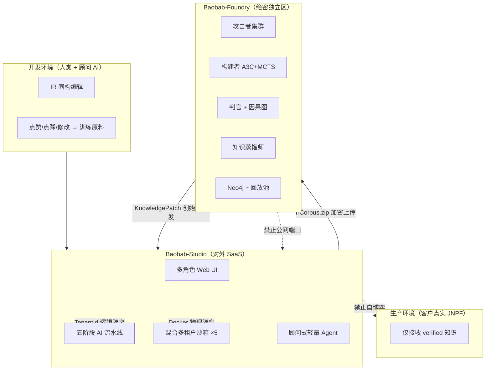
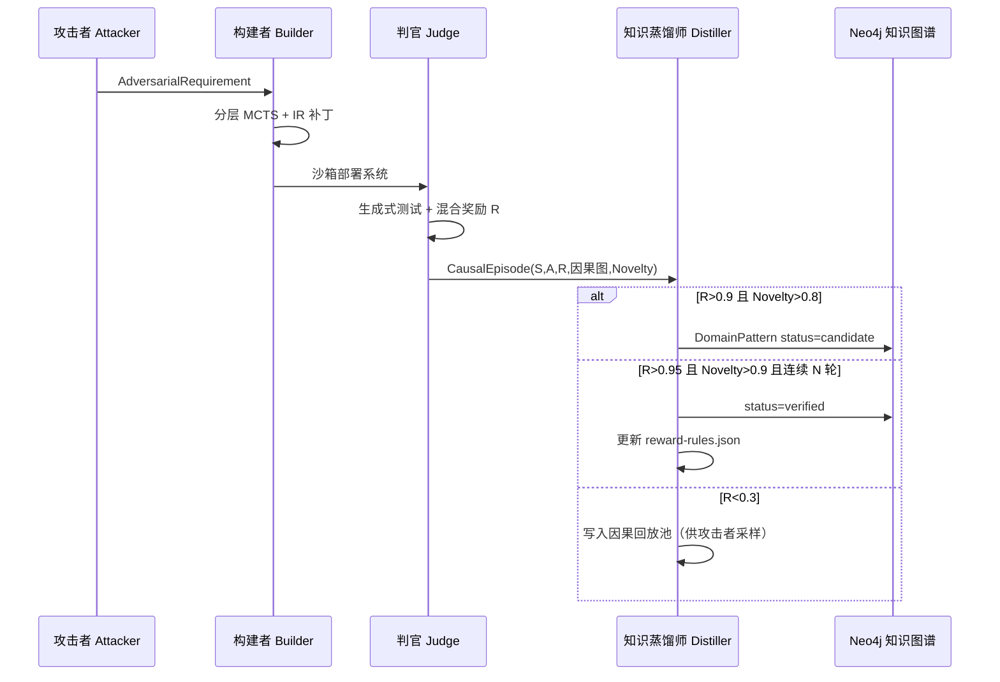
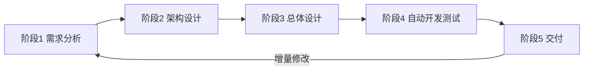
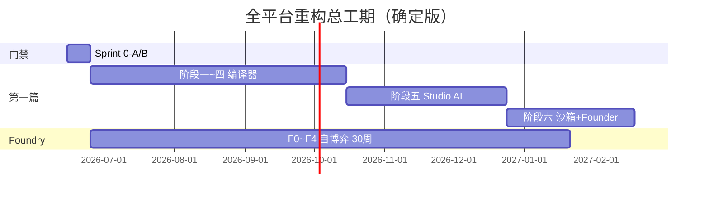

# JNPF V5.2 全栈底层架构迭代开发计划（完整版）

> 版本：**v4.0（自博弈 AI 低代码确定版 · 全平台重构）**
> 编制：首席架构师（整合 D 爷 7/8/9 确定稿 + v3.0 专家组审定结论）
> 日期：**2026-06-12**
> 状态：**待创始人 / 专家组批准**
> 关联 ADR：**ADR-016**（模块化单体）、**ADR-017**（新旧代码生成器共存）、**ADR-018**（UniApp UI 库选型）
> 草稿来源：**7、D爷初稿** · **8、D爷确定稿第一部分（Baobab-Studio）** · **9、D爷确定稿第二部分（Baobab-Foundry）**
> 文档结构：**第一篇** F-0~F-10 工程基座与编译器 · **第二篇** 自博弈 AI 低代码产品确定版 · **附录** 废止说明与审核清单

### v4.0 修订原则（强制，继承 v3.0）

```
① 不降级：原 v2.0 已确定的技术方案（双轨 UniApp X、完整 3D VIP、源码回写、
   五阶段 AI 流水线、Neo4j 知识图谱、Foundry 自博弈、知识蒸馏师等）全部保留。
② 只升标：因果图替代 32 维向量；Sprint 0 门禁；IR 双向；KnowledgePatch 签名。
③ 双轨兜底：手工 VisualDev / .vm 在线运行与 AI 编译器下载源码并行（ADR-017）。
④ 自博弈边界：Studio 不含 Foundry 训练引擎；四大智能体 + 蒸馏师仅在 Foundry。
⑤ 确定版整合：7/8/9 三稿升格为第二篇，与第一篇 F 编号施工包一一映射，废止 8 稿 28 周工期。
```

---

## 计划总纲

```
本计划整合五条工作线 + 两条前置 Sprint：

  工作线 A：后端清零（App.GetService / CreateScope / JwtHandler 路由权限 / Outbox 事务）
  工作线 B：前端基础层（IR + 表达式引擎 + 组件注册表 + 多目标编译器 + 端到端验证）
  工作线 C：数字大屏升级（F-6a 基础 + F-6b 完整 3D 数字孪生 VIP，4 周全量）
  工作线 D：UniApp 双轨（标准 uni-app 小程序 + uni-app X App，5 周全量）
  工作线 E：Baobab-Studio AI 原生层（五阶段流水线 + 多角色 Web UI + 多租户沙箱）
  工作线 F：Baobab-Foundry 自博弈（攻击者/构建者/判官/蒸馏师 + A3C 并行训练）

  前置 Sprint 0-A：闭合 Sprint（5 天，工程底座 + 安全 PoC + Schema 门禁）
  前置 Sprint 0-B：AI 基础设施地桩（5 天，10 项地桩 + 后端 LlmGatewayService）

  文档分工：
    第一篇（上文）= F-0~F-10 可执行施工包（编译器、后端清零、代码路径）
    第二篇（文末）= 自博弈 AI 低代码确定版（D 爷 7/8/9 升格，产品/API/双系统拓扑）

  执行策略：
    Sprint 0-A 通过 10 项门禁 → Sprint 0-B 通过 8 项补充门禁 → 阶段一~四并行 F-6a
    PoC 门禁（uni-app X / Three.js）在阶段二启动前必须通过或正式降级决策
    阶段五~六 AI 升维与 D 爷 Studio 计划对齐；自博弈引擎仅在 Foundry 部署
    四条编译器工作线最终汇入 F-8 CompileGateway（含下载源码 + 回写平台）
```

---

## 全局时间线

```
┌──────────┬──────────────────────────────────────────┬────────────────────────────┐
│   阶段   │          名称                            │             工期           │
├──────────┼──────────────────────────────────────────┼────────────────────────────┤
│  ✅ 阶段零│ F-0~F-4 + ADR-016 + src/core 83 tests  │ 已完成                     │
├──────────┼──────────────────────────────────────────┼────────────────────────────┤
│  Sprint  │ 0-A 闭合 Sprint（P0 工程/安全门禁）      │ 5 工作日                   │
│  0-A     │                                          │                            │
├──────────┼──────────────────────────────────────────┼────────────────────────────┤
│  Sprint  │ 0-B AI 基础设施地桩（10 项）             │ 5 工作日（与 F-6a 可并行） │
│  0-B     │                                          │                            │
├──────────┼──────────────────────────────────────────┼────────────────────────────┤
│  PoC     │ uni-app X + Three.js 性能基线（门禁）    │ 1 周（阶段二/三启动前）    │
│  门禁    │                                          │                            │
├──────────┼──────────────────────────────────────────┼────────────────────────────┤
│  阶段一   │ F-5 收官验证 + F-6a 大屏基础 + 后端 Sprint│ 4 周（不变）              │
├──────────┼──────────────────────────────────────────┼────────────────────────────┤
│  阶段二   │ F-6b 完整 3D 数字孪生 VIP + 后端 Sprint  │ 4 周（不压缩 MVP）         │
├──────────┼──────────────────────────────────────────┼────────────────────────────┤
│  阶段三   │ F-7 UniApp 双轨编译器 + 后端清零收尾     │ 5 周（不变）               │
├──────────┼──────────────────────────────────────────┼────────────────────────────┤
│  阶段四   │ F-8 统一网关 + 下载源码 + 回写平台       │ 3 周（回写保留，非 V2.0）  │
├──────────┼──────────────────────────────────────────┼────────────────────────────┤
│  阶段五   │ Baobab-Studio 五阶段 AI 流水线 + 多角色 UI│ 10 周（不变）              │
├──────────┼──────────────────────────────────────────┼────────────────────────────┤
│  阶段六   │ 多租户沙箱 + 创始人管理 + Foundry 对接   │ 8 周（Studio 侧，不含训练）│
└──────────┴──────────────────────────────────────────┴────────────────────────────┘

主体项目（Studio + 代码生成）：Sprint 0-A/B + PoC + 阶段一~六 ≈ **50 周**
Baobab-Foundry（自博弈，独立部署）：**30 周** 并行（第二篇 §4）

说明：v2.0「46 周压缩为 28 周」及 8 稿「28 周 Studio」**均已废止**；
      全平台重构以 v4.0 第二篇 + 本篇时间线为准。
```

---

## 阶段零回顾（已完成）

```
✅ F-0  安全止血
  7 个文件修改：eval/Function 归零 + 密钥外移
  标签：无（安全修复，立即合并主分支）

✅ F-1  IR 类型系统 + Schema 清洗器
  6 个源文件：types.ts, component-mapping.ts, expression-classifier.ts,
             validator.ts, schema-cleaner.ts, test
  AI 探针：aiHints + intentHints + ai-quality
  标签：v5.2-ai-ready-m1

✅ F-2  安全表达式引擎
  11 个文件：tokenizer + parser + security + compiler + functions
           + context + engine + compat + 3 个测试文件
  35 个测试全部通过
  标签：v5.2-ai-ready-m2

✅ F-3  组件注册表
  5 个文件：types + registry + builtin + index + test
  35 个内置组件（10 个分类）
  标签：v5.2-ai-ready-m3

✅ F-4  Vue3 单表 CRUD 编译器
  8 个文件：types + type-gen + api-gen + list-gen + form-gen
           + hook-gen + compiler + test
  11 个编译器测试 + src/core 合计 **83 项 vitest 通过**（canonical，CI 为准）
  标签：v5.2-ai-ready-m4

✅ F-5  端到端验证（full-pipeline.test.ts，4 项 e2e 测试）
  标签：v5.2-ai-ready-m5

✅ 知识图谱文档（4 份）+ ADR-016 模块化单体架构决策

⏳ 后端清零 Sprint 1 进行中（App.GetService 消化，目标 37→0）

⚠️ v3.0 强制前置：Sprint 0-A / 0-B 门禁通过前，不得启动阶段一对外里程碑
```

---

## Sprint 0-A：闭合 Sprint（5 工作日，P0 工程与安全门禁）

> **目标**：将多轮架构审查识别的 P0 缺陷从「纸面方案」变为「CI 跑绿」。  
> **不阻塞**：F-6a 大屏编译器可与 Day 3 起并行，但**阶段一里程碑**依赖本 Sprint 全绿。

### 0-A.1 工程化底座（Day 1）

| 任务 | 路径 / 命令 | 验收标准 |
|------|-------------|----------|
| 补充 scripts | `jnpf-web-vue3/package.json` | 存在 `lint`、`type-check`（或 `type:check` 别名）、`test:unit`、`diff:codegen` |
| vitest 配置 | `jnpf-web-vue3/vitest.config.ts` | `pnpm test:unit` 覆盖 `src/core/**` |
| CI 合并修正 | `.github/workflows/ci.yml` | **合并**现有 backend/datascreen job；web-vue3 job 去掉 `continue-on-error`；新增 `test:unit` |
| 锁文件 | 三前端项目 | 单一真源策略：各项目保留独立 `pnpm-lock.yaml` + `working-directory` 安装（非 monorepo filter） |

```bash
cd jnpf-web-vue3 && pnpm lint && pnpm type-check && pnpm test:unit
# 预期：0 error；tests 83 passed
```

### 0-A.2 Schema 回归 + 覆盖缺口（Day 2）

| 任务 | 路径 | 验收标准 |
|------|------|----------|
| P0 fixtures 入库 | `src/core/ir/__tests__/fixtures/schema-*.json` | 至少 5 份生产级 Schema（含子表、customBtns、接口回调） |
| 回归测试 | `src/core/e2e/schema-regression.test.ts` | **P0 失败必须 red**（禁止 console.warn 静默通过） |
| 缺口报告 | `docs/coverage-gap-report.md` | 自动生成或手工首版 |

### 0-A.3 后端安全 PoC（Day 3）

| 任务 | 路径 | 验收标准 |
|------|------|----------|
| Outbox PoC 2 | `backend/tests/JNPF.Tests.Gate/Infrastructure/OutboxSqlServerPoC.cs` | **4 用例**；测 `ISqlSugarClient.CopyNew()` 与主事务隔离（SQL Server，非实体 CopyNew） |
| JwtHandler 最小路由权限 | `backend/application/JNPF.API.Entry/Handlers/JwtHandler.cs` | 路由级匹配 + 403；保留权限组校验为第二道门 |
| 集成测试 | `backend/tests/JNPF.Tests.Gate/Auth/JwtHandlerIntegrationTests.cs` | 3 passed |
| 安全债务登记 | `docs/security-debt-registry.yaml` | SD-001 ~ SD-007（含 QueryFilter Clear/Add 审计，非 Filter(null) 臆造） |

```bash
dotnet test backend/tests/JNPF.Tests.Gate --filter "OutboxSqlServerPoC|JwtHandler"
```

### 0-A.4 ADR + 映射 + diff（Day 4）

| 交付物 | 说明 |
|--------|------|
| `docs/adr/ADR-017-new-old-codegen-coexistence.md` | 在线 .vm / 下载 TS 编译器；附录 diff 脚本 |
| `docs/adr/ADR-018-unapp-ui-library-selection.md` | 新编译器 `wot-design-uni`；`legacyApp` 保留 uni_modules |
| `jnpf-web-vue3/src/core/ir/component-mapping.ts` | `pc` / `app`(wd-*) / `legacyApp`(uni-*) 三层 |
| `jnpf-web-vue3/scripts/diff-codegen.ts` | ESM；输出 `docs/adr-017-diff-report.md` |
| `jnpf-web-vue3/src/core/compiler/uniapp/templates/request.ts` | Alova 对齐 `ResultEnum`（200/600/601/602 + HTTP 401） |

### 0-A.5 登记 + Husky + 终验（Day 5）

| 任务 | 路径 |
|------|------|
| 进度登记 | `docs/progress-registry.yaml`（canonical tests: **83**） |
| app 基线 | `docs/app-vue3-baseline.md` |
| Git hooks | `jnpf-web-vue3/.husky/` + `commitlint.config.js` |
| 标签 | `v5.2-gate-p0-complete` |

### Sprint 0-A 门禁（10 项，全部 ✅ 才进入 0-B）

```
 1. CI 无 continue-on-error（lint/test）
 2. vitest 进 CI
 3. Husky + commitlint 激活
 4. P0 Schema 回归全绿
 5. src/core tests ≥83 passed
 6. OutboxSqlServerPoC 4 passed（SQL Server）
 7. JwtHandlerIntegration 3 passed
 8. Alova request.ts 含 TOKEN_TIMEOUT=600 语义
 9. pnpm diff:codegen 可执行
10. security-debt-registry.yaml 含 SD-001
```

---

## Sprint 0-B：AI 基础设施地桩（5 工作日）

> **目标**：为 Baobab-Studio Phase 1 五阶段流水线预埋数据面与网关，**不降级** Neo4j / Foundry 对接能力。  
> Phase 0-1 使用 SQL Server 降级实现 `IKnowledgeGraphStore`；Phase 3 切换 Neo4j **社区版**（与 D 爷确定稿一致，非取消 Neo4j）。

### 10 项地桩清单

| # | 地桩 | 核心表 / 路径 | Phase |
|---|------|---------------|-------|
| 1 | AI 调用日志 | **BASE_AI_CALL_LOG** + `AiCallLogService`（DynamicApi） | 0-B Day 6 |
| 2 | IR aiHints | `types.ts` / `dashboard-types.ts`（✅ 已完成，登记） | — |
| 3 | 知识图谱存储 | **BASE_KNOWLEDGE_NODE** + **BASE_KNOWLEDGE_EDGE** + `IKnowledgeGraphStore` | 0-B Day 8 |
| 4 | 五阶段流水线状态 | **BASE_AI_PIPELINE** + **BASE_AI_PIPELINE_MESSAGE** | 0-B Day 6 |
| 5 | 创始人认证 | **BASE_FOUNDER_AUTH_LOG** + `FounderGuardMiddleware`（Phase 0 **404**，Phase 3 403） | 0-B Day 8 |
| 6 | Prompt 模板 | **BASE_AI_PROMPT_TEMPLATE** | 0-B Day 7 |
| 7 | 前端 AI 骨架 | `src/ai/gateway/`、`src/views/studio/` | 0-B Day 9 |
| 8 | **IR 逆向（逃生舱）** | `ir-to-schema.ts` + round-trip 测试 | 0-B Day 7-8 |
| 9 | **后端 LlmGatewayService** | `modularity/.../LlmGatewayService` + 写 BASE_AI_CALL_LOG | 0-B Day 6 |
| 10 | **KnowledgePatch 签名** | PackageHash + Signature 字段 + 验证接口 | 0-B Day 8 |

**实体规范（升标，强制）**：所有新表使用 `F_` 列名、`string` 用户 ID、租户基类 / `ITenantFilter`；禁止裸 PascalCase 列映射。

### Sprint 0-B 补充门禁（8 项）

```
11. BASE_AI_CALL_LOG 表存在
12. BASE_AI_PIPELINE 表存在
13. IKnowledgeGraphStore 接口 + Sql 实现
14. FounderGuard 已注册（/api/founder Phase 0 返回 404）
15. src/ai/gateway/types.ts 存在
16. LlmGatewayService healthCheck + 写日志
17. ir-to-schema 最小 round-trip 1 Schema
18. KnowledgeIncrementPackage 含 Signature 字段定义
```

**标签**：`v5.2-ai-infrastructure-m0`（依赖 `v5.2-gate-p0-complete`）

---

## PoC 门禁（阶段二 / 三启动前，1 周）

| PoC | 内容 | 通过 | 未通过（须创始人书面决策） |
|-----|------|------|---------------------------|
| **PoC-A** | FormPageIR → `.uvue` HBuilderX 可编译运行 | 排入阶段三全量 F-7.5 | 仅保留标准 uni-app；**不删除** IR 双轨设计 |
| **PoC-B** | Three.js 10 万面 + 20 POI + 5 飞线，16G 本机 ≥30fps 10min | 排入阶段二全量 F-6b | LOD/面数限制或 2.5D 降级；**不删除** VIP 模块规划 |

---

## IR 通用性契约（D 爷裁定，v3.0 强制）

```
唯一真源：jnpf-web-vue3/src/core/ir/types.ts
正向：JNPF Schema → schema-cleaner.ts → FormPageIR（已实现）
逆向：FormPageIR → ir-to-schema.ts → VisualDev 可编辑 Schema（Sprint 0-B 地桩 8）
验收：10+ 真实 Schema round-trip diff；AI 产出不可清洗 = AI 错误，非编译器错误
逃生舱：五阶段每阶段结束可「转入 VisualDev 手工继续」（需 IR 逆向）
```

---

## 阶段一：收官验证 + 大屏基础升级（4 周）

### 目标

```
完成前端基础层的端到端验证（F-5），
同时启动数字大屏的基础技术升级（F-6a），
后端清零 Sprint 1-3 并行推进。
```

### Week 1：端到端验证

#### F-5.1 验证链路

```
任务：验证从"平台 JSON Schema"到"可独立运行的 Vue 3 项目"的完整链路

输入：Phase 0 抓取的真实 Schema JSON
管线：Schema → cleanSchema() → FormPageIR → Vue3Compiler.compile() → GeneratedProject
验证：GeneratedProject 写入临时目录 → pnpm install → pnpm build → 构建成功

文件：src/core/e2e/full-pipeline.test.ts
```

```typescript
// src/core/e2e/full-pipeline.test.ts
import { describe, it, expect } from 'vitest';
import { cleanSchema } from '../ir/schema-cleaner';
import { Vue3Compiler } from '../compiler/vue3/compiler';
import { validateIR, hasErrors } from '../ir/validator';
import minimalSchema from '../ir/__tests__/fixtures/minimal-form-schema.json';

describe('End-to-End Pipeline', () => {
  it('Schema → IR → Compiler → GeneratedProject 完整链路', () => {
    // Step 1: 清洗
    const ir = cleanSchema(minimalSchema);
    expect(ir.type).toBe('form');
    expect(ir.fields.length).toBeGreaterThan(0);

    // Step 2: 验证
    const issues = validateIR(ir);
    expect(hasErrors(issues)).toBe(false);

    // Step 3: 编译
    const compiler = new Vue3Compiler({
      entity: 'test-entity',
      entityLabel: '测试实体',
    });
    const result = compiler.compile(ir);

    // Step 4: 检查生成产物
    expect(result.project.size).toBeGreaterThan(0);
    expect(result.project.has('src/types/test-entity.ts')).toBe(true);
    expect(result.project.has('src/api/test-entity.ts')).toBe(true);
    expect(result.project.has('src/views/test-entity/index.vue')).toBe(true);
    expect(result.project.has('src/views/test-entity/form.vue')).toBe(true);

    // Step 5: 检查生成代码质量
    for (const [path, content] of result.project) {
      // 零 eval/Function
      expect(content).not.toMatch(/\beval\b/);
      expect(content).not.toMatch(/new Function/);
      // 生成标记存在
      expect(content).toContain('@jnpf-generated');
      // insert-point 存在
      if (path.endsWith('.vue')) {
        expect(content).toContain('@jnpf-gen:insert-point');
      }
    }

    // Step 6: 检查 TypeScript 类型（对生成的 types 文件做语法检查）
    const typesContent = result.project.get('src/types/test-entity.ts')!;
    expect(typesContent).toContain('export interface');
  });
});
```

#### F-5.2 生成代码演示项目

```
任务：用"学生管理" Schema 生成完整的可运行 Vue 3 项目

  1. 用 cleanSchema() 清洗学生管理 Schema
  2. 用 Vue3Compiler 编译为 GeneratedProject
  3. 用脚本将 GeneratedProject 写入 examples/generated-student/
  4. 手动执行 pnpm install && pnpm dev
  5. 浏览器打开，验证页面可渲染

文件：
  examples/generated-student/
  ├── package.json
  ├── vite.config.ts
  ├── tsconfig.json
  ├── src/
  │   ├── types/student.ts
  │   ├── api/student.ts
  │   ├── views/student/index.vue
  │   ├── views/student/columns.ts
  │   ├── views/student/search.ts
  │   ├── views/student/form.vue
  │   ├── composables/useStudent.ts
  │   └── App.vue
  └── README.md
```

#### F-5.3 ESLint 规则注入

```
任务：在 ESLint 配置中新增 eval/Function 零新增规则

文件：.eslintrc.cjs（修改）
内容：
  rules: {
    'no-eval': 'error',
    'no-new-func': 'error',
    'no-implied-eval': 'error',
  }

验证：故意写一行 eval()，ESLint 报错
```

#### F-5 交付物

```
□ src/core/e2e/full-pipeline.test.ts — 端到端测试
□ examples/generated-student/ — 演示项目（可独立运行）
□ .eslintrc.cjs — eval/Function 零新增规则
□ 标签：v5.2-ai-ready-m5
```

### Week 2-3：数字大屏基础升级

#### F-6a.1 大屏 IR 定义

```
文件：src/core/ir/dashboard-types.ts
内容：DashboardIR, DashboardWidget, DashboardDataSource
```

```typescript
/**
 * 数字大屏 IR 类型定义
 * 
 * 与 FormPageIR 平级，都是 PageIR 的联合类型
 */

export interface DashboardIR {
  type: 'dashboard';
  id: string;
  name: string;

  /** 设计尺寸（如 { width: 1920, height: 1080 }） */
  size: { width: number; height: number };

  /** 背景配置 */
  background: {
    type: 'color' | 'image' | 'gradient';
    value: string;
  };

  /** 主题标识 */
  theme: string;

  /** 组件列表（绝对定位） */
  widgets: DashboardWidget[];

  /** 数据源 */
  dataSources: DashboardDataSource[];

  /** AI 探针 */
  aiHints?: {
    domain?: string;
    scenario?: string;
    designRationale?: string;
  };
}

export interface DashboardWidget {
  id: string;

  /** 组件类型 */
  type: string; // 'chart:bar' | 'chart:line' | 'chart:pie' | 'border:box1' |
                // 'text' | 'image' | 'scroll-board' | '3d:scene' | '3d:poi' |
                // '3d:flyline' | '3d:fence' | '3d:heatmap'

  /** 绝对定位 */
  position: {
    x: number;
    y: number;
    w: number;
    h: number;
    zIndex?: number;
  };

  /** 组件属性（图表配置、装饰样式等） */
  props: Record<string, unknown>;

  /** 绑定的数据源 ID */
  dataSourceId?: string;

  /** 刷新间隔（ms），0 或 undefined 表示不刷新 */
  refreshInterval?: number;

  /** 是否可见（支持表达式控制） */
  visible?: string;

  /** AI 探针 */
  aiHints?: {
    purpose?: string;
    dataExpectation?: string;
  };
}

export interface DashboardDataSource {
  id: string;
  name: string;
  type: 'api' | 'websocket' | 'static' | 'mock';
  url?: string;
  method?: 'GET' | 'POST';
  params?: Record<string, unknown>;
  /** 轮询间隔（ms），仅 type=api 时有效 */
  pollInterval?: number;
  /** 数据转换表达式 */
  transform?: string;
  /** 静态数据（type=static 时使用） */
  staticData?: unknown;
}
```

#### F-6a.2 大屏组件扩展注册

```
文件：src/core/component-registry/builtin-dashboard.ts
内容：注册所有大屏基础组件（图表、装饰、布局、文字）
```

```typescript
import type { ComponentEntry } from './types';

export const DASHBOARD_COMPONENTS: ComponentEntry[] = [
  // ============================================================
  // 图表组件
  // ============================================================
  {
    type: 'chart:bar',
    name: '柱状图',
    category: 'chart',
    pc: 'echarts-bar',
    app: 'echarts-bar',
    version: '1.0.0',
  },
  {
    type: 'chart:line',
    name: '折线图',
    category: 'chart',
    pc: 'echarts-line',
    app: 'echarts-line',
    version: '1.0.0',
  },
  {
    type: 'chart:pie',
    name: '饼图',
    category: 'chart',
    pc: 'echarts-pie',
    app: 'echarts-pie',
    version: '1.0.0',
  },
  {
    type: 'chart:gauge',
    name: '仪表盘',
    category: 'chart',
    pc: 'echarts-gauge',
    app: 'echarts-gauge',
    version: '1.0.0',
  },
  {
    type: 'chart:radar',
    name: '雷达图',
    category: 'chart',
    pc: 'echarts-radar',
    app: 'echarts-radar',
    version: '1.0.0',
  },
  {
    type: 'chart:scatter',
    name: '散点图',
    category: 'chart',
    pc: 'echarts-scatter',
    app: 'echarts-scatter',
    version: '1.0.0',
  },
  {
    type: 'chart:map',
    name: '地图',
    category: 'chart',
    pc: 'echarts-map',
    app: 'echarts-map',
    version: '1.0.0',
  },

  // ============================================================
  // 装饰组件（DataV 风格）
  // ============================================================
  {
    type: 'border:box1',
    name: '装饰边框1',
    category: 'chart',
    pc: 'dv-border-box-1',
    app: 'dv-border-box-1',
    version: '1.0.0',
  },
  {
    type: 'border:box2',
    name: '装饰边框2',
    category: 'chart',
    pc: 'dv-border-box-2',
    app: 'dv-border-box-2',
    version: '1.0.0',
  },
  {
    type: 'decoration:1',
    name: '装饰1',
    category: 'chart',
    pc: 'dv-decoration-1',
    app: 'dv-decoration-1',
    version: '1.0.0',
  },

  // ============================================================
  // 数据展示组件
  // ============================================================
  {
    type: 'text:title',
    name: '标题文字',
    category: 'chart',
    pc: 'dv-text',
    app: 'dv-text',
    version: '1.0.0',
  },
  {
    type: 'text:scroll',
    name: '滚动文字',
    category: 'chart',
    pc: 'vue3-marquee',
    app: 'vue3-marquee',
    version: '1.0.0',
  },
  {
    type: 'data:scroll-board',
    name: '滚动列表',
    category: 'chart',
    pc: 'dv-scroll-board',
    app: 'dv-scroll-board',
    version: '1.0.0',
  },
  {
    type: 'data:number',
    name: '数字翻牌',
    category: 'chart',
    pc: 'dv-digital-flop',
    app: 'dv-digital-flop',
    version: '1.0.0',
  },

  // ============================================================
  // 媒体组件
  // ============================================================
  {
    type: 'media:image',
    name: '图片',
    category: 'chart',
    pc: 'img',
    app: 'img',
    version: '1.0.0',
  },
  {
    type: 'media:video',
    name: '视频',
    category: 'chart',
    pc: 'video',
    app: 'video',
    version: '1.0.0',
  },
  {
    type: 'media:iframe',
    name: '内嵌页面',
    category: 'chart',
    pc: 'iframe',
    app: 'web-view',
    version: '1.0.0',
  },

  // ============================================================
  // 3D 数字孪生组件（VIP，标记 version: '2.0.0'）
  // ============================================================
  {
    type: '3d:scene',
    name: '3D 场景',
    category: 'chart',
    pc: 'three-scene',
    app: 'three-scene',
    version: '2.0.0',
    // 注释：VIP 功能，需要 license 验证
  },
  {
    type: '3d:poi',
    name: 'POI 标注',
    category: 'chart',
    pc: 'three-poi',
    app: 'three-poi',
    version: '2.0.0',
  },
  {
    type: '3d:flyline',
    name: '飞线',
    category: 'chart',
    pc: 'three-flyline',
    app: 'three-flyline',
    version: '2.0.0',
  },
  {
    type: '3d:fence',
    name: '电子围栏',
    category: 'chart',
    pc: 'three-fence',
    app: 'three-fence',
    version: '2.0.0',
  },
  {
    type: '3d:heatmap',
    name: '3D 热力图',
    category: 'chart',
    pc: 'three-heatmap',
    app: 'three-heatmap',
    version: '2.0.0',
  },
];
```

#### F-6a.3 大屏编译器（基础模块）

```
文件：src/core/compiler/dashboard/compiler.ts
内容：DashboardIR → 可独立运行的 Vue3 + ECharts 大屏项目
```

```typescript
/**
 * 数字大屏编译器
 * 
 * 将 DashboardIR 编译为可独立运行的 Vue3 + ECharts 大屏项目
 * 
 * 生成产物：
 *   src/App.vue                        — 入口（自适应缩放）
 *   src/main.ts                        — Vue 初始化
 *   src/views/dashboard/index.vue      — 大屏主页面
 *   src/components/ChartBar.vue        — 柱状图组件
 *   src/components/ChartLine.vue       — 折线图组件
 *   src/composables/useChartData.ts    — 数据源 Hook
 *   src/composables/useDashboardScale.ts — 缩放适配 Hook
 *   src/config/dashboard.config.json   — 原始配置备份
 *   src/styles/theme.css               — 主题变量
 *   package.json
 *   vite.config.ts
 *   index.html
 */

import type { DashboardIR } from '../../ir/dashboard-types';
import type { GeneratedProject, CompilerConfig } from '../vue3/types';

export class DashboardCompiler {
  private config: CompilerConfig;

  constructor(config: Partial<CompilerConfig> & { entity: string }) {
    this.config = {
      entity: config.entity,
      entityLabel: config.entityLabel ?? config.entity,
      apiBasePath: config.apiBasePath ?? `/api/dashboard/${config.entity}`,
      generatorVersion: config.generatorVersion ?? '1.0.0',
    };
  }

  compile(ir: DashboardIR): { project: GeneratedProject; warnings: string[] } {
    const project: GeneratedProject = new Map();
    const warnings: string[] = [];
    const e = this.config.entity;
    const now = new Date().toISOString();
    const version = this.config.generatorVersion;

    // 1. package.json
    project.set('package.json', this.generatePackageJson(ir));

    // 2. vite.config.ts
    project.set('vite.config.ts', this.generateViteConfig());

    // 3. index.html
    project.set('index.html', this.generateIndexHtml(ir));

    // 4. src/main.ts
    project.set('src/main.ts', this.generateMainTs());

    // 5. src/App.vue
    project.set('src/App.vue', this.generateAppVue(ir));

    // 6. src/views/dashboard/index.vue（主页面）
    project.set(`src/views/${e}/index.vue`, this.generateDashboardVue(ir));

    // 7. 每个 widget 一个组件
    for (const widget of ir.widgets) {
      const componentPath = `src/components/${this.widgetToFileName(widget)}`;
      project.set(componentPath, this.generateWidgetComponent(widget, ir));
    }

    // 8. 数据源 Hook
    if (ir.dataSources.length > 0) {
      project.set(`src/composables/useChartData.ts`, this.generateChartDataHook(ir));
    }

    // 9. 缩放 Hook
    project.set(`src/composables/useDashboardScale.ts`, this.generateScaleHook(ir));

    // 10. 主题 CSS
    project.set(`src/styles/theme.css`, this.generateThemeCss(ir));

    // 11. 原始配置备份
    project.set(`src/config/${e}.config.json`, JSON.stringify(ir, null, 2));

    return { project, warnings };
  }

  // ——— 以下为各文件的生成方法 ———
  // 工程师根据 DashboardIR 的字段逐一实现
  // 核心思路：
  //   图表组件 → vue-echarts + echarts option
  //   装饰组件 → @jiaminghi/data-view 组件
  //   数据绑定 → useChartData Hook（API/WebSocket/轮询）
  //   自适应 → v-scale-screen 或 CSS transform: scale()
  //   主题 → CSS Variables + 主题 token

  private generatePackageJson(ir: DashboardIR): string {
    const now = new Date().toISOString();
    return `{
  "name": "jnpf-dashboard-${this.config.entity}",
  "version": "1.0.0",
  "// @jnpf-generated": "v${this.config.generatorVersion} entity=${this.config.entity} time=${now}",
  "scripts": {
    "dev": "vite",
    "build": "vite build",
    "preview": "vite preview"
  },
  "dependencies": {
    "vue": "^3.4.0",
    "echarts": "^5.5.0",
    "vue-echarts": "^7.0.0",
    "@jiaminghi/data-view": "^3.0.0",
    "@vueuse/core": "^11.0.0",
    "vue3-marquee": "^4.0.0",
    "axios": "^1.7.0"
  },
  "devDependencies": {
    "vite": "^5.0.0",
    "@vitejs/plugin-vue": "^5.0.0",
    "typescript": "^5.0.0"
  }
}`;
  }

  private generateViteConfig(): string {
    return `import { defineConfig } from 'vite'
import vue from '@vitejs/plugin-vue'

export default defineConfig({
  plugins: [vue()],
  server: { port: 3200 }
})`;
  }

  private generateIndexHtml(ir: DashboardIR): string {
    return `<!DOCTYPE html>
<html lang="zh-CN">
<head>
  <meta charset="UTF-8" />
  <meta name="viewport" content="width=device-width, initial-scale=1.0" />
  <title>${this.config.entityLabel} - 数据大屏</title>
</head>
<body>
  <div id="app"></div>
  <script type="module" src="/src/main.ts"></script>
</body>
</html>`;
  }

  private generateMainTs(): string {
    return `import { createApp } from 'vue'
import App from './App.vue'
import './styles/theme.css'

createApp(App).mount('#app')`;
  }

  private generateAppVue(ir: DashboardIR): string {
    return `<template>
  <div class="dashboard-app">
    <router-view />
  </div>
</template>

<style>
body { margin: 0; padding: 0; overflow: hidden; background: var(--bg-color, #0d0d0d); }
.dashboard-app { width: 100vw; height: 100vh; }
</style>`;
  }

  private generateDashboardVue(ir: DashboardIR): string {
    const now = new Date().toISOString();
    const widgetImports = ir.widgets.map(w =>
      `import ${this.widgetToComponentName(w)} from '@/components/${this.widgetToFileName(w)}'`
    ).join('\n');

    const widgetTemplates = ir.widgets.map(w => {
      const pos = w.position;
      return `    <${this.widgetToComponentName(w)}
      style="position: absolute; left: ${pos.x}px; top: ${pos.y}px; width: ${pos.w}px; height: ${pos.h}px; z-index: ${pos.zIndex ?? 1};"
    />`;
    }).join('\n');

    return `<!-- @jnpf-generated v${this.config.generatorVersion} entity=${this.config.entity} type=dashboard -->
<!-- 生成时间：${now} -->

<template>
  <div class="dashboard" :style="{ width: '${ir.size.width}px', height: '${ir.size.height}px' }">
${widgetTemplates}
  </div>
</template>

<script setup lang="ts">
import { onMounted } from 'vue'
import { useDashboardScale } from '@/composables/useDashboardScale'
${widgetImports}

const { containerRef } = useDashboardScale(${ir.size.width}, ${ir.size.height})

onMounted(() => {
  containerRef.value = document.querySelector('.dashboard') as HTMLElement
})
</script>

<style scoped>
.dashboard {
  position: relative;
  transform-origin: left top;
}
</style>`;
  }

  // 以下方法工程师实现：
  //   generateWidgetComponent(widget, ir) — 根据 widget.type 生成不同组件
  //   generateChartDataHook(ir)           — 生成数据源 Hook
  //   generateScaleHook(ir)               — 生成缩放 Hook
  //   generateThemeCss(ir)                — 生成主题 CSS
  //   widgetToFileName(widget)            — widget → 文件名
  //   widgetToComponentName(widget)       — widget → 组件名

  private widgetToFileName(w: { type: string; id: string }): string {
    return w.type.replace(/[:/]/g, '-').replace(/([A-Z])/g, '-$1').toLowerCase()
      + '-' + w.id.slice(0, 6) + '.vue';
  }

  private widgetToComponentName(w: { type: string; id: string }): string {
    const base = w.type.split(':').map(s => s.charAt(0).toUpperCase() + s.slice(1)).join('');
    return base + w.id.slice(0, 4);
  }

  private generateWidgetComponent(widget: DashboardWidget, ir: DashboardIR): string {
    // 由工程师根据 widget.type 实现不同的组件模板
    // 例如：
    //   chart:bar → vue-echarts 柱状图
    //   chart:line → vue-echarts 折线图
    //   border:box1 → dv-border-box-1
    //   text:title → 纯文字
    //   3d:scene → Three.js 场景（阶段二实现）
    return `<!-- Widget: ${widget.type} (${widget.id}) -->
<template>
  <div class="widget widget-${widget.type}">
    <!-- ${widget.type} 组件实现 -->
  </div>
</template>`;
  }

  private generateChartDataHook(ir: DashboardIR): string {
    // 由工程师实现
    return `// useChartData - 数据源 Hook（待实现）`;
  }

  private generateScaleHook(ir: DashboardIR): string {
    return `import { ref, onMounted, onUnmounted } from 'vue'

export function useDashboardScale(designWidth: number, designHeight: number) {
  const containerRef = ref<HTMLElement | null>(null)

  function updateScale() {
    if (!containerRef.value) return
    const scaleX = window.innerWidth / designWidth
    const scaleY = window.innerHeight / designHeight
    const scale = Math.min(scaleX, scaleY)
    containerRef.value.style.transform = \`scale(\${scale})\`
  }

  onMounted(() => {
    updateScale()
    window.addEventListener('resize', updateScale)
  })

  onUnmounted(() => {
    window.removeEventListener('resize', updateScale)
  })

  return { containerRef }
}`;
  }

  private generateThemeCss(ir: DashboardIR): string {
    return `/* @jnpf-generated theme for ${this.config.entity} */
:root {
  --bg-color: #0d0d0d;
  --surface-color: #1a1a1a;
  --primary-color: #00d4ff;
  --text-color: #ffffff;
  --text-muted: #8899aa;
  --border-color: #1e3a5f;
  --success-color: #00e396;
  --warning-color: #feb019;
  --danger-color: #ff4560;
}`;
  }
}
```

#### F-6a.4 大屏编译器测试

```
文件：src/core/compiler/__tests__/dashboard-compiler.test.ts
```

```typescript
import { describe, it, expect } from 'vitest';
import { DashboardCompiler } from '../dashboard/compiler';
import type { DashboardIR } from '../../ir/dashboard-types';

const mockDashboardIR: DashboardIR = {
  type: 'dashboard',
  id: 'test-dashboard',
  name: '测试大屏',
  size: { width: 1920, height: 1080 },
  background: { type: 'color', value: '#0d0d0d' },
  theme: 'dark',
  widgets: [
    {
      id: 'w1',
      type: 'chart:bar',
      position: { x: 50, y: 50, w: 800, h: 400 },
      props: { title: '月度销售统计' },
      dataSourceId: 'ds1',
    },
    {
      id: 'w2',
      type: 'chart:pie',
      position: { x: 900, y: 50, w: 400, h: 400 },
      props: { title: '区域分布' },
      dataSourceId: 'ds1',
    },
    {
      id: 'w3',
      type: 'border:box1',
      position: { x: 20, y: 20, w: 1880, h: 1040 },
      props: {},
    },
  ],
  dataSources: [
    {
      id: 'ds1',
      name: '销售数据',
      type: 'api',
      url: '/api/sales/statistics',
      method: 'GET',
      pollInterval: 30000,
    },
  ],
};

describe('DashboardCompiler', () => {
  const compiler = new DashboardCompiler({
    entity: 'sales-dashboard',
    entityLabel: '销售大屏',
  });

  const result = compiler.compile(mockDashboardIR);

  it('生成文件数量正确', () => {
    expect(result.project.size).toBeGreaterThan(5);
  });

  it('生成 package.json', () => {
    const pkg = result.project.get('package.json')!;
    expect(pkg).toContain('vue-echarts');
    expect(pkg).toContain('@jiaminghi/data-view');
  });

  it('生成大屏主页面', () => {
    const mainPage = result.project.get('src/views/sales-dashboard/index.vue')!;
    expect(mainPage).toContain('position: absolute');
    expect(mainPage).toContain('1920px');
  });

  it('每个 widget 生成独立组件', () => {
    for (const widget of mockDashboardIR.widgets) {
      const hasComponent = [...result.project.keys()].some(k =>
        k.startsWith('src/components/') && k.includes(widget.type.replace(':', '-'))
      );
      expect(hasComponent).toBe(true);
    }
  });

  it('生成缩放 Hook', () => {
    const scaleHook = result.project.get('src/composables/useDashboardScale.ts')!;
    expect(scaleHook).toContain('useDashboardScale');
    expect(scaleHook).toContain('window.innerWidth');
  });

  it('生成主题 CSS', () => {
    const css = result.project.get('src/styles/theme.css')!;
    expect(css).toContain('--bg-color');
    expect(css).toContain('--primary-color');
  });

  it('零 eval/Function', () => {
    for (const [, content] of result.project) {
      expect(content).not.toMatch(/\beval\b/);
      expect(content).not.toMatch(/new Function/);
    }
  });

  it('生成标记存在', () => {
    for (const [path, content] of result.project) {
      if (path.endsWith('.vue') || path.endsWith('.ts')) {
        expect(content).toContain('@jnpf-generated');
      }
    }
  });
});
```

#### F-6a 交付物

```
□ src/core/ir/dashboard-types.ts          — 大屏 IR 类型定义
□ src/core/component-registry/builtin-dashboard.ts — 大屏组件注册（含 3D 预留）
□ src/core/compiler/dashboard/compiler.ts — 大屏编译器（基础模块）
□ src/core/compiler/__tests__/dashboard-compiler.test.ts — 测试
□ 标签：v5.2-dashboard-m1
```

### Week 4：后端清零 Sprint 3 + 阶段一回顾

```
后端清零并行任务（Sprint 1-3 已完成的部分）：
  Sprint 1：核心框架模块 App.GetService 消化（约 8 处）
  Sprint 2：数据库访问层 App.GetService 消化（约 6 处）
  Sprint 3：认证/授权层 App.GetService 消化（约 5 处）

  累计消化：19 / 37 处（剩余 18 处在阶段二继续）

阶段一里程碑验收：
  □ F-5 端到端验证通过
  □ F-6a 大屏编译器基础模块通过测试
  □ 大屏组件注册表完整（图表 + 装饰 + 数据展示 + 媒体 + 3D 预留）
  □ 后端 Sprint 1-3 完成（19/37 App.GetService 消化）
  □ 演示项目可独立运行
  □ ESLint eval/Function 规则生效
```

---

**以上是阶段一的完整开发计划。工程师请确认后开始执行。说"继续"我贴出阶段二（3D 数字孪生 VIP 模块 + 后端清零 Sprint 4-5）。**


# 阶段二：3D 数字孪生 VIP 模块 + 后端清零（4 周）

### 目标

```
实现数字大屏的 3D 数字孪生 VIP 功能模块，
作为独立的高级组件集成到大屏编辑器中，
不影响现有大屏任何基础功能。
后端清零 Sprint 4-5 并行推进。
```

### 核心设计原则

```
① 增量开发：3D 是"加模块"，不是"改模块"
   现有图表、装饰、数据展示组件零改动
   3D 组件在组件注册表中已预留（version: '2.0.0'）

② VIP 隔离：3D 功能通过 license 控制
   基础版客户看不到 3D 组件
   VIP 客户激活后，3D 组件出现在组件面板中

③ 渐进增强：
   Week 1：Three.js 基础场景 + 相机 + 光源
   Week 2：模型加载 + 基础数字要素（POI/飞线）
   Week 3：高级要素（围栏/热力）+ 数据绑定
   Week 4：蓝图逻辑 + 代码生成 + 测试
```

---

### Week 1：Three.js 基础场景

#### F-6b.1 3D 场景核心组件

```
文件：src/core/compiler/dashboard/templates/3d/Scene.vue.ejs
内容：Three.js 场景初始化 + 相机 + 光源 + 渲染循环
```

```vue
<!-- 3D 场景主组件 -->
<!-- @jnpf-generated v<%= version %> entity=<%= entity %> type=3d-scene -->

<template>
  <div ref="containerRef" class="three-scene" />
</template>

<script setup lang="ts">
import { ref, onMounted, onUnmounted, watch } from 'vue'
import * as THREE from 'three'
import { OrbitControls } from 'three/examples/jsm/controls/OrbitControls.js'

const props = defineProps<{
  /** 场景背景色 */
  backgroundColor?: string
  /** 相机位置 */
  cameraPosition?: [number, number, number]
  /** 相机目标点 */
  cameraTarget?: [number, number, number]
  /** 是否启用轨道控制 */
  enableControls?: boolean
  /** 环境光强度 */
  ambientIntensity?: number
  /** 方向光位置 */
  directionalLightPosition?: [number, number, number]
}>()

const emit = defineEmits<{
  ready: [scene: THREE.Scene, camera: THREE.Camera, renderer: THREE.Renderer]
  click: [intersect: THREE.Intersection | null]
}>()

const containerRef = ref<HTMLElement>()

// Three.js 核心对象
let scene: THREE.Scene
let camera: THREE.PerspectiveCamera
let renderer: THREE.WebGLRenderer
let controls: OrbitControls | null = null
let animationId: number

function initScene() {
  if (!containerRef.value) return

  // 场景
  scene = new THREE.Scene()
  scene.background = new THREE.Color(props.backgroundColor ?? '#0d0d0d')

  // 相机
  const aspect = containerRef.value.clientWidth / containerRef.value.clientHeight
  camera = new THREE.PerspectiveCamera(60, aspect, 0.1, 10000)
  const camPos = props.cameraPosition ?? [10, 10, 10]
  camera.position.set(camPos[0], camPos[1], camPos[2])

  const target = props.cameraTarget ?? [0, 0, 0]
  camera.lookAt(target[0], target[1], target[2])

  // 渲染器
  renderer = new THREE.WebGLRenderer({ antialias: true, alpha: true })
  renderer.setSize(containerRef.value.clientWidth, containerRef.value.clientHeight)
  renderer.setPixelRatio(Math.min(window.devicePixelRatio, 2))
  renderer.shadowMap.enabled = true
  containerRef.value.appendChild(renderer.domElement)

  // 轨道控制
  if (props.enableControls !== false) {
    controls = new OrbitControls(camera, renderer.domElement)
    controls.enableDamping = true
    controls.dampingFactor = 0.05
  }

  // 环境光
  const ambient = new THREE.AmbientLight(0xffffff, props.ambientIntensity ?? 0.6)
  scene.add(ambient)

  // 方向光
  const dirPos = props.directionalLightPosition ?? [50, 50, 50]
  const directional = new THREE.DirectionalLight(0xffffff, 0.8)
  directional.position.set(dirPos[0], dirPos[1], dirPos[2])
  directional.castShadow = true
  scene.add(directional)

  // 地面辅助（可选）
  const gridHelper = new THREE.GridHelper(100, 50, 0x1e3a5f, 0x1e3a5f)
  scene.add(gridHelper)

  // 渲染循环
  function animate() {
    animationId = requestAnimationFrame(animate)
    controls?.update()
    renderer.render(scene, camera)
  }
  animate()

  emit('ready', scene, camera, renderer)
}

// 窗口缩放
function handleResize() {
  if (!containerRef.value) return
  const w = containerRef.value.clientWidth
  const h = containerRef.value.clientHeight
  camera.aspect = w / h
  camera.updateProjectionMatrix()
  renderer.setSize(w, h)
}

// 点击事件（Raycaster）
function handleClick(event: MouseEvent) {
  if (!containerRef.value) return
  const rect = containerRef.value.getBoundingClientRect()
  const mouse = new THREE.Vector2(
    ((event.clientX - rect.left) / rect.width) * 2 - 1,
    -((event.clientY - rect.top) / rect.height) * 2 + 1
  )
  const raycaster = new THREE.Raycaster()
  raycaster.setFromCamera(mouse, camera)
  const intersects = raycaster.intersectObjects(scene.children, true)
  emit('click', intersects.length > 0 ? intersects[0] : null)
}

onMounted(() => {
  initScene()
  window.addEventListener('resize', handleResize)
  containerRef.value?.addEventListener('click', handleClick)
})

onUnmounted(() => {
  cancelAnimationFrame(animationId)
  window.removeEventListener('resize', handleResize)
  controls?.dispose()
  renderer.dispose()
})

// 暴露给父组件
defineExpose({
  getScene: () => scene,
  getCamera: () => camera,
  getRenderer: () => renderer,
  /** 添加 3D 对象 */
  addObject: (obj: THREE.Object3D) => scene.add(obj),
  /** 移除 3D 对象 */
  removeObject: (obj: THREE.Object3D) => scene.remove(obj),
  /** 根据 ID 查找对象 */
  findObject: (name: string) => scene.getObjectByName(name),
})
</script>

<style scoped>
.three-scene {
  width: 100%;
  height: 100%;
  overflow: hidden;
}
</style>
```

#### F-6b.2 模型加载器

```
文件：src/core/compiler/dashboard/templates/3d/ModelLoader.ts
内容：glTF/OBJ/FBX 模型加载 + 缓存
```

```typescript
/**
 * 3D 模型加载器
 * 
 * 支持格式：glTF（推荐）、OBJ、FBX
 * 特点：加载缓存、进度回调、错误处理
 */

import * as THREE from 'three'
import { GLTFLoader } from 'three/examples/jsm/loaders/GLTFLoader.js'
import { OBJLoader } from 'three/examples/jsm/loaders/OBJLoader.js'
import { DRACOLoader } from 'three/examples/jsm/loaders/DRACOLoader.js'

// 加载缓存
const cache = new Map<string, THREE.Object3D>()

// Draco 解码器（glTF 压缩模型）
const dracoLoader = new DRACOLoader()
dracoLoader.setDecoderPath('https://www.gstatic.com/draco/versioned/decoders/1.5.6/')

const gltfLoader = new GLTFLoader()
gltfLoader.setDRACOLoader(dracoLoader)

const objLoader = new OBJLoader()

export interface LoadOptions {
  /** 模型 URL */
  url: string
  /** 模型名称（用于场景查找） */
  name?: string
  /** 缩放 */
  scale?: [number, number, number]
  /** 位置 */
  position?: [number, number, number]
  /** 旋转（弧度） */
  rotation?: [number, number, number]
  /** 是否启用阴影 */
  castShadow?: boolean
  /** 进度回调 */
  onProgress?: (loaded: number, total: number) => void
}

/**
 * 加载 3D 模型
 * 
 * @returns THREE.Object3D 可直接添加到场景
 */
export async function loadModel(options: LoadOptions): Promise<THREE.Object3D> {
  const { url, name, scale, position, rotation, castShadow, onProgress } = options

  // 检查缓存
  if (cache.has(url)) {
    const cached = cache.get(url)!.clone()
    applyTransforms(cached, { scale, position, rotation, castShadow, name })
    return cached
  }

  // 根据扩展名选择加载器
  const ext = url.split('.').pop()?.toLowerCase()
  let object: THREE.Object3D

  switch (ext) {
    case 'gltf':
    case 'glb': {
      const gltf = await new Promise<any>((resolve, reject) => {
        gltfLoader.load(url, resolve, (e) => onProgress?.(e.loaded, e.total), reject)
      })
      object = gltf.scene
      break
    }
    case 'obj': {
      object = await new Promise<any>((resolve, reject) => {
        objLoader.load(url, resolve, (e) => onProgress?.(e.loaded, e.total), reject)
      })
      break
    }
    default:
      throw new Error(`[ModelLoader] 不支持的模型格式: ${ext}`)
  }

  // 缓存原始模型
  cache.set(url, object.clone())

  // 应用变换
  applyTransforms(object, { scale, position, rotation, castShadow, name })

  return object
}

function applyTransforms(
  obj: THREE.Object3D,
  opts: { scale?: number[]; position?: number[]; rotation?: number[]; castShadow?: boolean; name?: string }
) {
  if (opts.name) obj.name = opts.name
  if (opts.scale) obj.scale.set(opts.scale[0], opts.scale[1], opts.scale[2])
  if (opts.position) obj.position.set(opts.position[0], opts.position[1], opts.position[2])
  if (opts.rotation) obj.rotation.set(opts.rotation[0], opts.rotation[1], opts.rotation[2])
  if (opts.castShadow) {
    obj.traverse((child) => {
      if ((child as THREE.Mesh).isMesh) {
        child.castShadow = true
        child.receiveShadow = true
      }
    })
  }
}

/**
 * 清除加载缓存
 */
export function clearModelCache(): void {
  cache.clear()
}
```

---

### Week 2：数字要素系统

#### F-6b.3 POI 标注组件

```typescript
/**
 * POI（Point of Interest）标注
 * 在 3D 场景中标注设备、人员、摄像头等点位
 * 
 * 特点：
 *   HTML 标签叠加在 3D 场景上（CSS2DRenderer）
 *   支持自定义图标和弹窗内容
 *   数据驱动（从 API 获取 POI 列表）
 */

import { CSS2DObject } from 'three/examples/jsm/renderers/CSS2DRenderer.js'
import * as THREE from 'three'

export interface POIConfig {
  id: string
  name: string
  /** 3D 坐标 */
  position: [number, number, number]
  /** 图标类型 */
  icon: 'device' | 'camera' | 'person' | 'alarm' | 'custom'
  /** 自定义图标 URL（icon=custom 时使用） */
  iconUrl?: string
  /** 状态：normal / warning / alarm */
  status: 'normal' | 'warning' | 'alarm'
  /** 弹窗内容 */
  popup?: string
  /** 数据绑定 */
  data?: Record<string, unknown>
}

export function createPOI(config: POIConfig): CSS2DObject {
  const div = document.createElement('div')
  div.className = `poi-marker poi-${config.status}`
  div.innerHTML = `
    <div class="poi-icon poi-icon-${config.icon}"></div>
    <div class="poi-label">${config.name}</div>
  `

  // 点击事件
  div.addEventListener('click', () => {
    document.dispatchEvent(new CustomEvent('poi-click', { detail: config }))
  })

  const label = new CSS2DObject(div)
  label.position.set(config.position[0], config.position[1], config.position[2])
  label.name = `poi-${config.id}`

  return label
}

/**
 * 批量创建 POI
 */
export function createPOIGroup(pois: POIConfig[]): THREE.Group {
  const group = new THREE.Group()
  group.name = 'poi-group'
  for (const poi of pois) {
    group.add(createPOI(poi))
  }
  return group
}
```

#### F-6b.4 飞线组件

```typescript
/**
 * 飞线（FlyLine）
 * 两点之间的弧形动态飞线效果
 * 常用于：数据流向、物流路径、信号传输
 */

import * as THREE from 'three'

export interface FlyLineConfig {
  /** 起点坐标 */
  start: [number, number, number]
  /** 终点坐标 */
  end: [number, number, number]
  /** 飞线颜色 */
  color?: string
  /** 弧线高度（自动计算或手动指定） */
  height?: number
  /** 飞线速度 */
  speed?: number
  /** 飞线宽度 */
  width?: number
}

export function createFlyLine(config: FlyLineConfig): THREE.Group {
  const group = new THREE.Group()
  const start = new THREE.Vector3(...config.start)
  const end = new THREE.Vector3(...config.end)

  // 计算弧线控制点
  const mid = new THREE.Vector3().addVectors(start, end).multiplyScalar(0.5)
  const dist = start.distanceTo(end)
  mid.y += config.height ?? dist * 0.4

  // 创建弧线曲线
  const curve = new THREE.QuadraticBezierCurve3(start, mid, end)
  const points = curve.getPoints(64)
  const geometry = new THREE.BufferGeometry().setFromPoints(points)

  // 飞线材质（渐变 + 动态）
  const material = new THREE.LineBasicMaterial({
    color: config.color ?? '#00d4ff',
    transparent: true,
    opacity: 0.8,
  })

  const line = new THREE.Line(geometry, material)
  line.name = 'flyline-base'
  group.add(line)

  // 飞行粒子
  const particleGeom = new THREE.SphereGeometry(config.width ?? 0.1, 8, 8)
  const particleMat = new THREE.MeshBasicMaterial({
    color: config.color ?? '#00d4ff',
    transparent: true,
    opacity: 1,
  })
  const particle = new THREE.Mesh(particleGeom, particleMat)
  particle.name = 'flyline-particle'
  group.add(particle)

  // 动画
  const speed = config.speed ?? 0.005
  let t = 0
  group.userData.animate = () => {
    t = (t + speed) % 1
    const point = curve.getPoint(t)
    particle.position.copy(point)
  }

  return group
}

/**
 * 批量创建飞线
 */
export function createFlyLineGroup(configs: FlyLineConfig[]): THREE.Group {
  const group = new THREE.Group()
  group.name = 'flyline-group'
  for (const config of configs) {
    group.add(createFlyLine(config))
  }
  return group
}
```

---

### Week 3：围栏 + 热力图 + 数据绑定

#### F-6b.5 电子围栏

```typescript
/**
 * 电子围栏（Fence）
 * 在 3D 场景中绘制区域边界
 * 常用于：安防区域、施工禁区、地理围栏告警
 */

import * as THREE from 'three'

export interface FenceConfig {
  id: string
  name: string
  /** 围栏顶点坐标（闭合多边形，至少 3 个点） */
  points: [number, number, number][]
  /** 围栏高度 */
  height?: number
  /** 正常颜色 */
  color?: string
  /** 告警颜色 */
  alarmColor?: string
  /** 当前状态 */
  status: 'normal' | 'alarm'
  /** 透明度 */
  opacity?: number
}

export function createFence(config: FenceConfig): THREE.Group {
  const group = new THREE.Group()
  group.name = `fence-${config.id}`

  const height = config.height ?? 3
  const color = config.status === 'alarm'
    ? (config.alarmColor ?? '#ff4560')
    : (config.color ?? '#00d4ff')
  const opacity = config.opacity ?? 0.3

  // 地面区域（半透明填充）
  const shape = new THREE.Shape()
  const groundPoints = config.points.map(p => new THREE.Vector2(p[0], p[2]))
  shape.moveTo(groundPoints[0].x, groundPoints[0].y)
  for (let i = 1; i < groundPoints.length; i++) {
    shape.lineTo(groundPoints[i].x, groundPoints[i].y)
  }
  shape.closePath()

  const groundGeom = new THREE.ShapeGeometry(shape)
  const groundMat = new THREE.MeshBasicMaterial({
    color,
    transparent: true,
    opacity: opacity * 0.5,
    side: THREE.DoubleSide,
  })
  const ground = new THREE.Mesh(groundGeom, groundMat)
  ground.rotation.x = -Math.PI / 2
  ground.position.y = config.points[0][1] ?? 0
  group.add(ground)

  // 围栏墙壁
  for (let i = 0; i < config.points.length; i++) {
    const p1 = config.points[i]
    const p2 = config.points[(i + 1) % config.points.length]

    const wallGeom = new THREE.PlaneGeometry(
      Math.sqrt((p2[0] - p1[0]) ** 2 + (p2[2] - p1[2]) ** 2),
      height
    )
    const wallMat = new THREE.MeshBasicMaterial({
      color,
      transparent: true,
      opacity,
      side: THREE.DoubleSide,
    })
    const wall = new THREE.Mesh(wallGeom, wallMat)

    // 定位和旋转
    const midX = (p1[0] + p2[0]) / 2
    const midZ = (p1[2] + p2[2]) / 2
    wall.position.set(midX, (p1[1] ?? 0) + height / 2, midZ)
    wall.rotation.y = Math.atan2(p2[2] - p1[2], p2[0] - p1[0])

    group.add(wall)
  }

  // 存储配置（用于数据驱动更新）
  group.userData.fenceConfig = config

  return group
}

/**
 * 更新围栏状态
 */
export function updateFenceStatus(fence: THREE.Group, status: 'normal' | 'alarm') {
  const config = fence.userData.fenceConfig as FenceConfig
  config.status = status
  const color = status === 'alarm'
    ? (config.alarmColor ?? '#ff4560')
    : (config.color ?? '#00d4ff')

  fence.traverse((child) => {
    if ((child as THREE.Mesh).isMesh) {
      const mat = (child as THREE.Mesh).material as THREE.MeshBasicMaterial
      mat.color.set(color)
    }
  })
}
```

#### F-6b.6 3D 热力图

```typescript
/**
 * 3D 热力图
 * 在 3D 场景中以柱状/平面热力形式展示数据密度
 * 常用于：人流密度、设备分布、告警集中区域
 */

import * as THREE from 'three'

export interface HeatmapPoint {
  /** 坐标 */
  position: [number, number, number]
  /** 值（0-1 归一化） */
  value: number
  /** 标签 */
  label?: string
}

export interface HeatmapConfig {
  id: string
  points: HeatmapPoint[]
  /** 最大高度 */
  maxHeight?: number
  /** 最小高度 */
  minHeight?: number
  /** 低温颜色 */
  coldColor?: string
  /** 高温颜色 */
  hotColor?: string
  /** 是否为柱状模式（false 则为平面热力） */
  barMode?: boolean
  /** 柱状半径 */
  barRadius?: number
}

export function createHeatmap(config: HeatmapConfig): THREE.Group {
  const group = new THREE.Group()
  group.name = `heatmap-${config.id}`

  const maxH = config.maxHeight ?? 10
  const minH = config.minHeight ?? 0.1
  const coldColor = new THREE.Color(config.coldColor ?? '#00d4ff')
  const hotColor = new THREE.Color(config.hotColor ?? '#ff4560')

  for (const point of config.points) {
    const height = minH + (maxH - minH) * point.value
    const color = coldColor.clone().lerp(hotColor, point.value)

    if (config.barMode !== false) {
      // 柱状模式
      const radius = config.barRadius ?? 0.3
      const geom = new THREE.CylinderGeometry(radius, radius, height, 16)
      const mat = new THREE.MeshBasicMaterial({
        color,
        transparent: true,
        opacity: 0.7,
      })
      const bar = new THREE.Mesh(geom, mat)
      bar.position.set(point.position[0], height / 2, point.position[2])
      group.add(bar)
    } else {
      // 平面热力模式
      const radius = 2
      const geom = new THREE.CircleGeometry(radius, 32)
      const mat = new THREE.MeshBasicMaterial({
        color,
        transparent: true,
        opacity: 0.3 + point.value * 0.4,
        side: THREE.DoubleSide,
      })
      const circle = new THREE.Mesh(geom, mat)
      circle.rotation.x = -Math.PI / 2
      circle.position.set(point.position[0], 0.01, point.position[2])
      group.add(circle)
    }
  }

  return group
}
```

#### F-6b.7 数据绑定层

```typescript
/**
 * 3D 数据绑定层
 * 
 * 将 API/WebSocket 数据实时映射到 3D 场景中的要素
 * 
 * 核心能力：
 *   1. POI 状态实时更新（设备状态变化 → 图标/颜色变化）
 *   2. 飞线数据流驱动（数据量 → 飞线密度/速度）
 *   3. 围栏告警联动（越界事件 → 围栏变红）
 *   4. 热力图数据刷新（人流/设备密度 → 热力分布）
 */

import type { POIConfig } from './POI'
import type { FenceConfig } from './Fence'
import type { HeatmapPoint } from './Heatmap'

export interface DataBindingRule {
  /** 绑定的目标要素 ID */
  targetId: string
  /** 目标要素类型 */
  targetType: 'poi' | 'fence' | 'heatmap' | 'flyline'
  /** 数据字段路径（如 'data.temperature'） */
  dataField: string
  /** 映射规则 */
  mapping: {
    /** 值 → 状态 */
    condition: string   // 如 "> 80" 或 "== 'offline'"
    action: string      // 如 "status=alarm" 或 "color=red"
  }[]
}

/**
 * 应用数据绑定规则
 * 当数据更新时，根据规则更新 3D 场景中的要素
 */
export function applyDataBindings(
  rules: DataBindingRule[],
  data: Record<string, unknown>,
  scene: { findObject: (name: string) => THREE.Object3D | undefined }
) {
  for (const rule of rules) {
    const obj = scene.findObject(`${rule.targetType}-${rule.targetId}`)
    if (!obj) continue

    const value = getNestedValue(data, rule.dataField)
    if (value === undefined) continue

    for (const mapping of rule.mapping) {
      if (evaluateCondition(value, mapping.condition)) {
        applyAction(obj, mapping.action)
        break
      }
    }
  }
}

function getNestedValue(obj: unknown, path: string): unknown {
  return path.split('.').reduce((o, k) => (o as Record<string, unknown>)?.[k], obj)
}

function evaluateCondition(value: unknown, condition: string): boolean {
  // 简单条件求值（安全，不用 eval）
  const match = condition.match(/^([><=!]+)\s*(.+)$/)
  if (!match) return String(value) === condition

  const op = match[1]
  const target = isNaN(Number(match[2])) ? match[2].replace(/['"]/g, '') : Number(match[2])
  const numVal = Number(value)

  switch (op) {
    case '>': return numVal > (target as number)
    case '>=': return numVal >= (target as number)
    case '<': return numVal < (target as number)
    case '<=': return numVal <= (target as number)
    case '==': return value == target
    case '!=': return value != target
    default: return false
  }
}

function applyAction(obj: THREE.Object3D, action: string) {
  const [key, val] = action.split('=')
  switch (key) {
    case 'status':
      obj.userData.status = val
      break
    case 'color':
      obj.traverse((child) => {
        if ((child as THREE.Mesh).isMesh) {
          ((child as THREE.Mesh).material as THREE.MeshBasicMaterial).color.set(val)
        }
      })
      break
    case 'visible':
      obj.visible = val === 'true'
      break
  }
}
```

---

### Week 4：蓝图逻辑 + 代码生成 + 测试

#### F-6b.8 蓝图逻辑引擎（相对 UE 完整版的实现形态）

> **v3.0 说明**：本节「简化版」指**相对 Unreal 蓝图编辑器的交互形态**（采用事件→条件→动作链式配置，非削减 F-6b 模块范围）。围栏/热力/蓝图/数据绑定均在阶段二 **4 周全量**交付，PoC-B 未通过时仅允许性能层 LOD 优化，**禁止**删除模块规划。

```typescript
/**
 * 蓝图逻辑引擎（链式配置形态，非 UE 级可视化编辑器）
 * 
 * 设计理念：
 *   不实现完整的蓝图编辑器（太重）
 *   实现"事件 → 条件 → 动作"的链式配置
 *   在代码生成时转化为普通的 TypeScript 事件处理代码
 */

export interface BlueprintNode {
  id: string;
  type: 'event' | 'condition' | 'action';
  /** 节点配置 */
  config: Record<string, unknown>;
  /** 下一个节点 ID */
  next?: string;
  /** 条件为 true 时的下一个节点 ID */
  nextTrue?: string;
  /** 条件为 false 时的下一个节点 ID */
  nextFalse?: string;
}

export interface BlueprintFlow {
  id: string;
  name: string;
  nodes: BlueprintNode[];
}

/**
 * 将蓝图流程编译为 TypeScript 事件处理代码
 */
export function compileBlueprint(flow: BlueprintFlow): string {
  const lines: string[] = [];
  lines.push(`// Blueprint: ${flow.name}`);
  lines.push(`// @jnpf-generated blueprint`);
  lines.push('');

  // 找到事件入口节点
  const eventNodes = flow.nodes.filter(n => n.type === 'event');

  for (const eventNode of eventNodes) {
    const trigger = eventNode.config.trigger as string; // 'click' | 'hover' | 'data-change'
    const target = eventNode.config.target as string;   // 目标要素 ID

    lines.push(`// 事件：${trigger} on ${target}`);
    lines.push(`function handle_${eventNode.id}(event) {`);

    // 遍历后续节点
    let currentNodeId: string | undefined = eventNode.next;
    while (currentNodeId) {
      const node = flow.nodes.find(n => n.id === currentNodeId);
      if (!node) break;

      switch (node.type) {
        case 'condition': {
          const field = node.config.field as string;
          const op = node.config.operator as string;
          const value = node.config.value as string;
          lines.push(`  if (evaluateCondition(data.${field}, '${op}', '${value}')) {`);
          currentNodeId = node.nextTrue;
          break;
        }
        case 'action': {
          const actionType = node.config.type as string;
          const targetId = node.config.target as string;
          switch (actionType) {
            case 'highlight':
              lines.push(`    highlightElement('${targetId}');`);
              break;
            case 'navigate':
              lines.push(`    navigateTo('${node.config.url}');`);
              break;
            case 'show-popup':
              lines.push(`    showPopup('${targetId}', ${JSON.stringify(node.config.popupData)});`);
              break;
            case 'update-data':
              lines.push(`    updateDataSource('${targetId}');`);
              break;
          }
          currentNodeId = node.next;
          break;
        }
      }
    }

    lines.push('}');
    lines.push('');
  }

  return lines.join('\n');
}
```

#### F-6b.9 3D 编译器集成

```
在大屏编译器中集成 3D 组件的代码生成：

修改文件：src/core/compiler/dashboard/compiler.ts
新增方法：generate3DScene(widget, ir) — 当 widget.type 以 '3d:' 开头时调用
```

```typescript
// 在 DashboardCompiler 中新增

private generate3DSceneComponent(widget: DashboardWidget, ir: DashboardIR): string {
  const now = new Date().toISOString();
  const version = this.config.generatorVersion;

  return `<!-- @jnpf-generated v${version} type=3d-scene -->
<!-- 生成时间：${now} -->

<template>
  <ThreeScene
    ref="sceneRef"
    :background-color="'${ir.background.value}'"
    :camera-position="${JSON.stringify(widget.props.cameraPosition ?? [10, 10, 10])}"
    :enable-controls="${widget.props.enableControls !== false}"
    @ready="onSceneReady"
  />
</template>

<script setup lang="ts">
import { ref } from 'vue'
import ThreeScene from '@/components/3d/Scene.vue'
import { loadModel } from '@/utils/3d/ModelLoader'
import { createPOIGroup } from '@/utils/3d/POI'
import { createFlyLineGroup } from '@/utils/3d/FlyLine'
import { createFence } from '@/utils/3d/Fence'
import { createHeatmap } from '@/utils/3d/Heatmap'
import type { POIConfig } from '@/utils/3d/POI'
import type { FlyLineConfig } from '@/utils/3d/FlyLine'
import type { FenceConfig } from '@/utils/3d/Fence'
import type { HeatmapConfig } from '@/utils/3d/Heatmap'

const sceneRef = ref()

// 数据
const pois: POIConfig[] = ${JSON.stringify(widget.props.pois ?? [], null, 2)}
const flylines: FlyLineConfig[] = ${JSON.stringify(widget.props.flylines ?? [], null, 2)}
const fences: FenceConfig[] = ${JSON.stringify(widget.props.fences ?? [], null, 2)}
const heatmap: HeatmapConfig = ${JSON.stringify(widget.props.heatmap ?? { id: 'h1', points: [] }, null, 2)}

async function onSceneReady(scene, camera, renderer) {
  // 加载模型
  const modelUrl = '${widget.props.modelUrl ?? ''}'
  if (modelUrl) {
    const model = await loadModel({
      url: modelUrl,
      name: 'main-model',
      scale: ${JSON.stringify(widget.props.modelScale ?? [1, 1, 1])},
    })
    scene.add(model)
  }

  // 添加 POI
  if (pois.length > 0) {
    scene.add(createPOIGroup(pois))
  }

  // 添加飞线
  if (flylines.length > 0) {
    const flylineGroup = createFlyLineGroup(flylines)
    scene.add(flylineGroup)
  }

  // 添加围栏
  for (const fenceConfig of fences) {
    scene.add(createFence(fenceConfig))
  }

  // 添加热力图
  if (heatmap.points.length > 0) {
    scene.add(createHeatmap(heatmap))
  }
}
</script>`;
}
```

#### F-6b.10 测试

```
文件：src/core/compiler/__tests__/dashboard-3d.test.ts
```

```typescript
import { describe, it, expect } from 'vitest';
import { DashboardCompiler } from '../dashboard/compiler';
import type { DashboardIR } from '../../ir/dashboard-types';

const mock3DDashboard: DashboardIR = {
  type: 'dashboard',
  id: 'smart-site-3d',
  name: '智慧工地 3D 大屏',
  size: { width: 1920, height: 1080 },
  background: { type: 'color', value: '#0a0a1a' },
  theme: 'dark-tech',
  widgets: [
    {
      id: 'scene1',
      type: '3d:scene',
      position: { x: 0, y: 0, w: 1920, h: 1080, zIndex: 0 },
      props: {
        modelUrl: '/models/construction-site.glb',
        modelScale: [0.01, 0.01, 0.01],
        cameraPosition: [50, 30, 50],
        pois: [
          { id: 'p1', name: '塔吊A', position: [10, 15, 5], icon: 'device', status: 'normal' },
          { id: 'p2', name: '摄像头B', position: [-5, 8, 10], icon: 'camera', status: 'normal' },
        ],
        flylines: [
          { start: [0, 5, 0], end: [20, 5, 10], color: '#00ff88' },
        ],
        fences: [
          { id: 'f1', name: '施工禁区', points: [[0, 0, 0], [10, 0, 0], [10, 0, 10], [0, 0, 10]], status: 'normal' },
        ],
      },
      dataSourceId: 'iot-data',
    },
    {
      id: 'chart1',
      type: 'chart:bar',
      position: { x: 50, y: 50, w: 500, h: 300, zIndex: 10 },
      props: { title: '实时告警统计' },
      dataSourceId: 'alarm-data',
    },
    {
      id: 'border1',
      type: 'border:box1',
      position: { x: 10, y: 10, w: 600, h: 350, zIndex: 5 },
      props: {},
    },
  ],
  dataSources: [
    { id: 'iot-data', name: 'IoT 数据', type: 'websocket', url: 'ws://localhost:8080/iot' },
    { id: 'alarm-data', name: '告警数据', type: 'api', url: '/api/alarms/statistics', pollInterval: 10000 },
  ],
};

describe('DashboardCompiler - 3D Digital Twin', () => {
  const compiler = new DashboardCompiler({
    entity: 'smart-site-3d',
    entityLabel: '智慧工地 3D',
  });

  const result = compiler.compile(mock3DDashboard);

  it('生成 3D 场景组件', () => {
    const scene3d = [...result.project.entries()].find(
      ([path]) => path.includes('components/') && path.includes('3d')
    );
    expect(scene3d).toBeDefined();
    expect(scene3d![1]).toContain('ThreeScene');
    expect(scene3d![1]).toContain('loadModel');
    expect(scene3d![1]).toContain('createPOIGroup');
    expect(scene3d![1]).toContain('createFlyLineGroup');
    expect(scene3d![1]).toContain('createFence');
    expect(scene3d![1]).toContain('createHeatmap');
  });

  it('3D 场景不与普通图表冲突', () => {
    // 普通图表组件仍然正常生成
    const chartBar = [...result.project.entries()].find(
      ([path]) => path.includes('components/') && path.includes('chart-bar')
    );
    expect(chartBar).toBeDefined();
  });

  it('数据源 WebSocket 生成正确', () => {
    const dataHook = result.project.get('src/composables/useChartData.ts');
    // 数据源中包含 WebSocket，Hook 应支持
    // 由工程师实现时验证
  });

  it('package.json 包含 Three.js 依赖', () => {
    const pkg = result.project.get('package.json')!;
    expect(pkg).toContain('three');
  });

  it('零 eval/Function', () => {
    for (const [, content] of result.project) {
      expect(content).not.toMatch(/\beval\b/);
      expect(content).not.toMatch(/new Function/);
    }
  });
});
```

#### F-6b 交付物

```
□ src/core/compiler/dashboard/templates/3d/Scene.vue.ejs — 3D 场景组件
□ src/core/compiler/dashboard/templates/3d/ModelLoader.ts — 模型加载器
□ src/core/compiler/dashboard/templates/3d/POI.ts        — POI 标注
□ src/core/compiler/dashboard/templates/3d/FlyLine.ts    — 飞线
□ src/core/compiler/dashboard/templates/3d/Fence.ts      — 电子围栏
□ src/core/compiler/dashboard/templates/3d/Heatmap.ts    — 3D 热力图
□ src/core/compiler/dashboard/templates/3d/DataBinding.ts — 数据绑定层
□ src/core/compiler/dashboard/templates/3d/Blueprint.ts  — 蓝图逻辑引擎
□ compiler.ts 修改（集成 3D 组件生成）
□ src/core/compiler/__tests__/dashboard-3d.test.ts — 3D 测试
□ 标签：v5.2-dashboard-3d-m1
```

### Week 4 附加：后端清零 Sprint 4-5

```
后端清零并行任务：
  Sprint 4：工作流引擎 App.GetService 消化（约 6 处）
  Sprint 5：消息/通知模块 App.GetService 消化（约 5 处）

  累计消化：30 / 37 处（剩余 7 处在阶段三继续）

同时推进 CreateScope 清零：
  Sprint 4-5：CreateScope 24 处开始消化（约 10 处）
  剩余 14 处在阶段三继续
```

### 阶段二里程碑验收

```
□ F-6b 3D 数字孪生基础组件全部通过测试
□ 3D 场景编译器集成成功（能生成包含 3D 组件的大屏项目）
□ POI/飞线/围栏/热力图 数字要素系统完整
□ 蓝图逻辑引擎可生成事件处理代码
□ 3D 功能不影响现有大屏基础模块
□ 后端 Sprint 4-5 完成（30/37 App.GetService + 10/24 CreateScope）
□ package.json 包含 three.js 依赖
□ 标签：v5.2-dashboard-3d-m1
```

---

**阶段二完成。说"继续"我贴出阶段三（UniApp 架构重构 + 代码生成 + 后端清零收尾）。**


# 阶段三：UniApp 架构重构 + 代码生成 + 后端清零收尾（5 周）

### 目标

```
实现 UniApp 代码生成器，采用双轨制架构：
  模式 A：标准 uni-app（Vue 3）→ 小程序端（微信/支付宝/抖音）
  模式 B：uni-app X（uvue + uts）→ App 端（Android/iOS/鸿蒙）

同时完成后端清零收尾工作。
```

### 双轨制架构设计

```
                 ┌──────────────────┐
                 │    FormPageIR    │ ← 同一个 IR，框架无关
                 └────────┬─────────┘
                          │
            ┌─────────────┴─────────────┐
            ▼                           ▼
   ┌─────────────────┐       ┌─────────────────┐
   │ UniAppCompiler   │       │  UniAppXCompiler │
   │ (标准 uni-app)   │       │ (uni-app X)      │
   │                  │       │                  │
   │ 目标：小程序端   │       │ 目标：App 端     │
   │ 框架：Vue 3      │       │ 框架：uvue + uts │
   │ UI：wot-design   │       │ UI：uvue 组件    │
   │ 请求：Alova      │       │ 请求：Alova      │
   │ 状态：Pinia      │       │ 状态：Pinia      │
   └────────┬────────┘       └────────┬────────┘
            ▼                           ▼
   ┌─────────────────┐       ┌─────────────────┐
   │  pages.json      │       │  pages.json      │
   │  pages/*.vue     │       │  pages/*.uvue    │
   │  api/*.ts        │       │  api/*.ts        │
   │  stores/*.ts     │       │  stores/*.ts     │
   └─────────────────┘       └─────────────────┘

共用层（两种模式完全相同）：
  api/          — Alova 请求封装
  stores/       — Pinia 状态管理
  composables/  — 业务逻辑 Hook
  types/        — TypeScript 类型定义
  utils/        — 工具函数

差异层（按目标平台不同）：
  pages/        — 页面（.vue vs .uvue）
  components/   — 组件（wot-design vs uvue 组件）
  pages.json    — 路由配置（结构相同，页面路径不同）
  manifest.json — 应用配置（平台特定字段）
```


---

### Week 1：UniApp 共用层 + 请求库升级

#### F-7.1 Alova 请求封装

```typescript
/**
 * UniApp 通用请求封装（Alova）
 * v3.0：对齐 JNPF RESTfulResult + PC 端 axios 拦截器（jnpf-web-vue3/src/enums/httpEnum.ts）
 */
import { createAlova } from 'alova';
import AdapterUniapp from '@alova/adapter-uniapp';
import { apiBaseUrl, getToken, clearToken } from './config';

/** 与 src/enums/httpEnum.ts ResultEnum 一致 */
const ResultCode = {
  SUCCESS: 200,
  SUCCESS_ALT: 0,
  TOKEN_TIMEOUT: 600,
  TOKEN_LOGGED: 601,
  TOKEN_ERROR: 602,
} as const;

function isTokenBusinessCode(code: number): boolean {
  return (
    code === ResultCode.TOKEN_TIMEOUT ||
    code === ResultCode.TOKEN_LOGGED ||
    code === ResultCode.TOKEN_ERROR
  );
}

function handleTokenExpired(): void {
  clearToken();
  uni.reLaunch({ url: '/pages/login/login' });
}

export const alova = createAlova({
  baseURL: apiBaseUrl,

  beforeRequest(method) {
    const token = getToken();
    if (token) {
      method.config.headers = {
        ...method.config.headers,
        Authorization: `Bearer ${token}`,
      };
    }
  },

  responded: {
    onSuccess: async (response) => {
      const data = response.data as Record<string, unknown>;
      const code = data.code as number;

      if (code === ResultCode.SUCCESS || code === ResultCode.SUCCESS_ALT) {
        return data.data;
      }

      if (isTokenBusinessCode(code)) {
        handleTokenExpired();
        throw new Error((data.msg as string) || '登录已过期');
      }

      throw new Error((data.msg as string) || '请求失败');
    },

    onError: (error) => {
      // HTTP 401 层（非 RESTfulResult body）
      const status = (error as { status?: number }).status;
      if (status === 401) {
        handleTokenExpired();
      }
      console.error('[Alova] 请求错误:', error);
      throw error;
    },
  },

  ...AdapterUniapp(),
});
```

```typescript
/**
 * JNPF API 基础方法封装
 * 所有实体 API 都继承这套基础方法
 */

import { alova } from './request';

/**
 * 创建实体 CRUD API 基础方法
 * 复用于所有实体（学生、订单、设备...）
 */
export function createEntityApi<T>(basePath: string) {
  return {
    /** 列表查询 */
    list(params: Record<string, unknown>) {
      return alova.Get<T[]>(`${basePath}/list`, {
        params,
        cache: { mode: 'stale-while-revalidate', expire: 30_000 },
      });
    },

    /** 详情 */
    detail(id: string) {
      return alova.Get<T>(`${basePath}/${id}`);
    },

    /** 新增 */
    create(data: Partial<T>) {
      return alova.Post<T>(basePath, data);
    },

    /** 更新 */
    update(id: string, data: Partial<T>) {
      return alova.Put(`${basePath}/${id}`, data);
    },

    /** 删除 */
    delete(id: string) {
      return alova.Delete(`${basePath}/${id}`);
    },

    /** 批量删除 */
    batchDelete(ids: string[]) {
      return alova.Delete(`${basePath}/batch`, { data: { ids } });
    },
  };
}
```


#### F-7.2 Pinia Store 基础模板

```typescript
/**
 * UniApp 通用 Store 模板
 * 用于生成每个实体的状态管理
 */

import { defineStore } from 'pinia';
import { ref, reactive } from 'vue';

export function createEntityStore<T extends { id?: string }>(name: string, api: ReturnType<typeof createEntityApi>) {
  return defineStore(name, () => {
    const loading = ref(false);
    const list = ref<T[]>([]);
    const current = ref<T | undefined>();
    const pagination = reactive({ current: 1, pageSize: 20, total: 0 });
    const searchParams = reactive<Record<string, unknown>>({});

    async function loadList() {
      loading.value = true;
      try {
        const data = await api.list({
          currentPage: pagination.current,
          pageSize: pagination.pageSize,
          ...searchParams,
        });
        list.value = data as T[];
      } finally {
        loading.value = false;
      }
    }

    async function loadDetail(id: string) {
      loading.value = true;
      try {
        current.value = (await api.detail(id)) as T;
      } finally {
        loading.value = false;
      }
    }

    async function save(data: Partial<T>) {
      if (current.value?.id) {
        await api.update(current.value.id, data);
      } else {
        await api.create(data);
      }
    }

    async function remove(id: string) {
      await api.delete(id);
      await loadList();
    }

    return {
      loading, list, current, pagination, searchParams,
      loadList, loadDetail, save, remove,
    };
  });
}
```

#### F-7.3 小程序端页面模板（标准 uni-app）

```vue
<!-- pages/entity/list.vue（小程序端列表页模板） -->
<!-- @jnpf-generated v<%= version %> entity=<%= entity %> platform=mp-weixin -->

<template>
  <view class="page-list">
    <!-- 搜索栏 -->
    <view class="search-bar">
<% searchFields.forEach(function(sf) { %>
      <wd-input
        v-model="searchParams.<%= sf.field %>"
        placeholder="请输入<%= sf.label %>"
        clearable
      />
<% }); %>
      <view class="search-actions">
        <wd-button type="primary" size="small" @click="handleSearch">查询</wd-button>
        <wd-button size="small" @click="handleReset">重置</wd-button>
      </view>
    </view>

    <!-- 列表 -->
    <wd-cell-group>
      <wd-cell
        v-for="item in store.list"
        :key="item.id"
        :title="item.<%= displayField %>"
        @click="handleDetail(item)"
      >
        <template #value>
          <view class="cell-actions">
            <wd-button size="mini" @click.stop="handleEdit(item)">编辑</wd-button>
            <wd-button size="mini" type="error" @click.stop="handleDelete(item)">删除</wd-button>
          </view>
        </template>
      </wd-cell>
    </wd-cell-group>

    <!-- 空状态 -->
    <wd-status-tip v-if="!store.loading && store.list.length === 0" tip="暂无数据" />

    <!-- 加载状态 -->
    <wd-loading v-if="store.loading" />

    <!-- 悬浮新增按钮 -->
    <view class="fab" @click="handleAdd">
      <wd-icon name="add" size="24px" />
    </view>
  </view>
</template>

<script setup lang="ts">
import { onMounted, reactive } from 'vue';
import { onPullDownRefresh, onReachBottom } from '@dcloudio/uni-app';

// Store（由编译器生成具体实现）
const store = use<%= Entity %>Store();

const searchParams = reactive<Record<string, string>>({
<% searchFields.forEach(function(sf) { %>
  <%= sf.field %>: '',
<% }); %>
});

onMounted(() => {
  store.loadList();
});

// 下拉刷新
onPullDownRefresh(async () => {
  store.pagination.current = 1;
  await store.loadList();
  uni.stopPullDownRefresh();
});

// 上拉加载更多
onReachBottom(() => {
  store.pagination.current++;
  store.loadList();
});

function handleSearch() {
  Object.assign(store.searchParams, searchParams);
  store.pagination.current = 1;
  store.loadList();
}

function handleReset() {
  Object.keys(searchParams).forEach(k => searchParams[k] = '');
  handleSearch();
}

function handleAdd() {
  uni.navigateTo({ url: '/pages/<%= entity %>/form' });
}

function handleEdit(item) {
  uni.navigateTo({ url: `/pages/<%= entity %>/form?id=${item.id}` });
}

function handleDetail(item) {
  uni.navigateTo({ url: `/pages/<%= entity %>/detail?id=${item.id}` });
}

async function handleDelete(item) {
  uni.showModal({
    title: '确认删除',
    content: `确定删除 ${item.<%= displayField %>}？`,
    success: async (res) => {
      if (res.confirm) {
        await store.remove(item.id);
        uni.showToast({ title: '删除成功' });
      }
    },
  });
}
</script>

<style scoped lang="scss">
.page-list {
  padding: 24rpx;
  padding-bottom: 120rpx;
}
.search-bar {
  margin-bottom: 24rpx;
}
.search-actions {
  display: flex;
  gap: 16rpx;
  margin-top: 16rpx;
}
.fab {
  position: fixed;
  right: 40rpx;
  bottom: 120rpx;
  width: 100rpx;
  height: 100rpx;
  border-radius: 50%;
  background: #0083ff;
  display: flex;
  align-items: center;
  justify-content: center;
  color: #fff;
  box-shadow: 0 4rpx 16rpx rgba(0, 0, 0, 0.2);
}
</style>
```

```vue
<!-- pages/entity/form.vue（小程序端表单页模板） -->
<!-- @jnpf-generated v<%= version %> entity=<%= entity %> platform=mp-weixin -->

<template>
  <view class="page-form">
    <wd-form ref="formRef" :model="formData">
<% fields.forEach(function(field) { %>
      <!-- <%= field.label %> -->
      <wd-cell title="<%= field.label %>" required="<%= field.config.required %>">
<% if (field.component.app === 'uni-easyinput') { %>
        <wd-input
          v-model="formData.<%= field.model %>"
          placeholder="请输入<%= field.label %>"
<% if (field.config.required) { %>
          required
<% } %>
        />
<% } else if (field.component.app === 'uni-data-select') { %>
        <wd-select-picker
          v-model="formData.<%= field.model %>"
          :columns="<%= field.model %>_options"
          placeholder="请选择<%= field.label %>"
        />
<% } else if (field.component.app === 'uni-datetime-picker') { %>
        <wd-datetime-picker
          v-model="formData.<%= field.model %>"
          placeholder="请选择<%= field.label %>"
        />
<% } else if (field.component.app === 'switch') { %>
        <wd-switch v-model="formData.<%= field.model %>" />
<% } else { %>
        <wd-input
          v-model="formData.<%= field.model %>"
          placeholder="请输入<%= field.label %>"
        />
<% } %>
      </wd-cell>
<% }); %>
    </wd-form>

    <!-- @jnpf-gen:insert-point=custom-form-fields -->
    <!-- @jnpf-gen:end-insert-point=custom-form-fields -->

    <view class="form-actions">
      <wd-button type="primary" block @click="handleSubmit">提交</wd-button>
      <wd-button block @click="handleCancel" style="margin-top: 16rpx">取消</wd-button>
    </view>
  </view>
</template>

<script setup lang="ts">
import { ref, reactive, onMounted } from 'vue';

const formRef = ref();
const isEdit = ref(false);

const formData = reactive<Record<string, unknown>>({
<% fields.forEach(function(field) { %>
  <%= field.model %>: <%- getDefaultValue(field) %>,
<% }); %>
});

onMounted(async () => {
  const pages = getCurrentPages();
  const page = pages[pages.length - 1];
  const id = page?.options?.id;
  if (id) {
    isEdit.value = true;
    const detail = await api.detail(id);
    Object.assign(formData, detail);
  }
});

async function handleSubmit() {
  try {
    await formRef.value?.validate();
    await api.save(formData as any);
    uni.showToast({ title: isEdit.value ? '更新成功' : '创建成功' });
    setTimeout(() => uni.navigateBack(), 1500);
  } catch (e) {
    // 校验失败
  }
}

function handleCancel() {
  uni.navigateBack();
}

// @jnpf-gen:insert-point=custom-logic
// @jnpf-gen:end-insert-point=custom-logic
</script>

<style scoped lang="scss">
.page-form {
  padding: 24rpx;
}
.form-actions {
  margin-top: 48rpx;
}
</style>
```

---

### Week 2：UniApp 编译器核心

#### F-7.4 UniApp 编译器（标准 uni-app）

```typescript
/**
 * UniApp 代码生成器（标准 uni-app，目标：小程序端）
 * 
 * 输入：FormPageIR（与 Vue3 编译器使用同一个 IR）
 * 输出：完整的 uni-app 项目文件集合
 * 
 * 生成产物：
 *   pages/{entity}/list.vue          — 列表页
 *   pages/{entity}/form.vue          — 表单页
 *   pages/{entity}/detail.vue        — 详情页
 *   api/{entity}.ts                  — Alova API
 *   stores/{entity}.ts               — Pinia Store
 *   types/{entity}.ts                — TypeScript 类型
 *   pages.json                       — 路由配置（追加）
 *   manifest.json                    — 应用配置（追加）
 */

import type { FormPageIR } from '../../ir/types';
import type { CompilerConfig, GeneratedProject, CompileResult } from '../vue3/types';
import { registry } from '../../component-registry';

// EJS 模板引擎（用于渲染页面模板）
import ejs from 'ejs';

export class UniAppCompiler {
  private config: CompilerConfig;
  private platform: 'mp-weixin' | 'mp-alipay' | 'mp-douyin' | 'h5';

  constructor(config: Partial<CompilerConfig> & { entity: string }, platform: 'mp-weixin' | 'mp-alipay' | 'mp-douyin' | 'h5' = 'mp-weixin') {
    this.config = {
      entity: config.entity,
      entityLabel: config.entityLabel ?? config.entity,
      apiBasePath: config.apiBasePath ?? `/api/${config.entity}`,
      generatorVersion: config.generatorVersion ?? '1.0.0',
    };
    this.platform = platform;
  }

  compile(ir: FormPageIR): CompileResult {
    const project: GeneratedProject = new Map();
    const warnings: string[] = [];
    const complexExpressions: string[] = [];
    const e = this.config.entity;
    const E = this.capitalize(e);
    const now = new Date().toISOString();

    // 检查复杂表达式
    for (const expr of ir.expressions) {
      if (expr.level === 'complex') {
        complexExpressions.push(`${expr.id}: ${expr.body.slice(0, 100)}`);
        warnings.push(`表达式 ${expr.id} 为复杂级别，需人工迁移`);
      }
    }

    // 1. types
    project.set(`types/${e}.ts`, this.generateTypes(ir));

    // 2. api（Alova）
    project.set(`api/${e}.ts`, this.generateApi(ir));

    // 3. store（Pinia）
    project.set(`stores/${e}.ts`, this.generateStore(ir));

    // 4. 列表页
    project.set(`pages/${e}/list.vue`, this.generateListPage(ir));

    // 5. 表单页
    project.set(`pages/${e}/form.vue`, this.generateFormPage(ir));

    // 6. 详情页
    project.set(`pages/${e}/detail.vue`, this.generateDetailPage(ir));

    // 7. pages.json 片段（追加到已有配置）
    project.set(`pages-${e}.json`, this.generatePagesJson(ir));

    return { project, warnings, complexExpressions };
  }

  private generateTypes(ir: FormPageIR): string {
    // 复用 Vue3 编译器的类型生成逻辑
    // 从 ../vue3/type-gen.ts 导入
    const entity = this.capitalize(this.config.entity);
    const lines: string[] = [];
    lines.push(`// @jnpf-generated v${this.config.generatorVersion} entity=${this.config.entity} platform=${this.platform}`);
    lines.push(`/* eslint-disable */`);
    lines.push('');
    lines.push(`export interface ${entity}Entity {`);
    for (const field of ir.fields) {
      const tsType = this.mapFieldToTsType(field);
      const optional = field.config.required ? '' : '?';
      lines.push(`  /** ${field.label} */`);
      lines.push(`  ${field.model}${optional}: ${tsType};`);
    }
    lines.push('}');
    return lines.join('\n');
  }

  private generateApi(ir: FormPageIR): string {
    const entity = this.capitalize(this.config.entity);
    return `// @jnpf-generated v${this.config.generatorVersion} entity=${this.config.entity} platform=${this.platform}
/* eslint-disable */
import { createEntityApi } from '@/api/request';
import type { ${entity}Entity } from '@/types/${this.config.entity}';

const api = createEntityApi<${entity}Entity>('${this.config.apiBasePath}');

export default api;

export const {
  list: get${entity}List,
  detail: get${entity}Detail,
  create: create${entity},
  update: update${entity},
  delete: delete${entity},
  batchDelete: batchDelete${entity},
} = api;
`;
  }

  private generateStore(ir: FormPageIR): string {
    const entity = this.capitalize(this.config.entity);
    return `// @jnpf-generated v${this.config.generatorVersion} entity=${this.config.entity} platform=${this.platform}
/* eslint-disable */
import { defineStore } from 'pinia';
import { ref, reactive } from 'vue';
import api from '@/api/${this.config.entity}';

export const use${entity}Store = defineStore('${this.config.entity}', () => {
  const loading = ref(false);
  const list = ref<${entity}Entity[]>([]);
  const current = ref<${entity}Entity | undefined>();
  const pagination = reactive({ current: 1, pageSize: 20, total: 0 });

  async function loadList(params?: Record<string, unknown>) {
    loading.value = true;
    try {
      list.value = await api.list({ currentPage: pagination.current, pageSize: pagination.pageSize, ...params });
    } finally {
      loading.value = false;
    }
  }

  async function loadDetail(id: string) {
    loading.value = true;
    try {
      current.value = await api.detail(id);
    } finally {
      loading.value = false;
    }
  }

  async function save(data: Partial<${entity}Entity>) {
    if (current.value?.id) {
      await api.update(current.value.id, data);
    } else {
      await api.create(data);
    }
  }

  async function remove(id: string) {
    await api.delete(id);
    await loadList();
  }

  return { loading, list, current, pagination, loadList, loadDetail, save, remove };
});
`;
  }

  private generateListPage(ir: FormPageIR): string {
    // 使用 EJS 模板渲染列表页
    // 模板内容在 F-7.3 中已给出
    // 工程师将 F-7.3 的模板存为 templates/uniapp/list.vue.ejs
    // 这里用 ejs.render() 渲染

    const entity = this.capitalize(this.config.entity);
    const searchFields = ir.listConfig?.searchFields ?? [];
    const displayField = ir.fields[0]?.model || 'id';
    const now = new Date().toISOString();

    // 简化版（工程师后续用 EJS 模板替换）
    return `<!-- @jnpf-generated v${this.config.generatorVersion} entity=${this.config.entity} platform=${this.platform} -->
<!-- 生成时间：${now} -->
<template>
  <view class="page-list">
    <view class="search-bar">
${searchFields.map(sf => `      <wd-input v-model="searchParams.${sf.field}" placeholder="请输入${sf.label}" clearable />`).join('\n')}
      <view class="search-actions">
        <wd-button type="primary" size="small" @click="handleSearch">查询</wd-button>
        <wd-button size="small" @click="handleReset">重置</wd-button>
      </view>
    </view>
    <wd-cell-group>
      <wd-cell
        v-for="item in store.list"
        :key="item.id"
        :title="String(item.${displayField} ?? '')"
        @click="handleDetail(item)"
      >
        <template #value>
          <view class="cell-actions">
            <wd-button size="mini" @click.stop="handleEdit(item)">编辑</wd-button>
            <wd-button size="mini" type="error" @click.stop="handleDelete(item)">删除</wd-button>
          </view>
        </template>
      </wd-cell>
    </wd-cell-group>
    <wd-status-tip v-if="!store.loading && store.list.length === 0" tip="暂无数据" />
    <view class="fab" @click="handleAdd"><wd-icon name="add" size="24px" /></view>
  </view>
</template>

<script setup lang="ts">
import { onMounted, reactive } from 'vue';
import { use${entity}Store } from '@/stores/${this.config.entity}';

const store = use${entity}Store();
const searchParams = reactive<Record<string, string>>({
${searchFields.map(sf => `  ${sf.field}: '',`).join('\n')}
});

onMounted(() => store.loadList());

function handleSearch() {
  Object.assign(store.searchParams, searchParams);
  store.pagination.current = 1;
  store.loadList();
}
function handleReset() {
  Object.keys(searchParams).forEach(k => searchParams[k] = '');
  handleSearch();
}
function handleAdd() { uni.navigateTo({ url: '/pages/${this.config.entity}/form' }); }
function handleEdit(item) { uni.navigateTo({ url: '/pages/${this.config.entity}/form?id=' + item.id }); }
function handleDetail(item) { uni.navigateTo({ url: '/pages/${this.config.entity}/detail?id=' + item.id }); }
async function handleDelete(item) {
  uni.showModal({
    title: '确认删除',
    content: '确定删除？',
    success: async (res) => {
      if (res.confirm) { await store.remove(item.id); uni.showToast({ title: '删除成功' }); }
    },
  });
}
</script>
`;
  }

  private generateFormPage(ir: FormPageIR): string {
    const entity = this.capitalize(this.config.entity);
    const now = new Date().toISOString();

    return `<!-- @jnpf-generated v${this.config.generatorVersion} entity=${this.config.entity} platform=${this.platform} -->
<!-- 生成时间：${now} -->
<template>
  <view class="page-form">
    <wd-form ref="formRef" :model="formData">
${ir.fields.map(f => {
  const app = f.component.app;
  let widget = '';
  if (app === 'uni-data-select') {
    widget = `      <wd-cell title="${f.label}"${f.config.required ? ' required' : ''}><wd-select-picker v-model="formData.${f.model}" placeholder="请选择${f.label}" /></wd-cell>`;
  } else if (app === 'uni-datetime-picker') {
    widget = `      <wd-cell title="${f.label}"${f.config.required ? ' required' : ''}><wd-datetime-picker v-model="formData.${f.model}" placeholder="请选择${f.label}" /></wd-cell>`;
  } else if (app === 'switch') {
    widget = `      <wd-cell title="${f.label}"><wd-switch v-model="formData.${f.model}" /></wd-cell>`;
  } else {
    widget = `      <wd-cell title="${f.label}"${f.config.required ? ' required' : ''}><wd-input v-model="formData.${f.model}" placeholder="请输入${f.label}" /></wd-cell>`;
  }
  return widget;
}).join('\n')}
    </wd-form>
    <!-- @jnpf-gen:insert-point=custom-form-fields -->
    <!-- @jnpf-gen:end-insert-point=custom-form-fields -->
    <view class="form-actions">
      <wd-button type="primary" block @click="handleSubmit">提交</wd-button>
      <wd-button block @click="handleCancel" style="margin-top: 16rpx">取消</wd-button>
    </view>
  </view>
</template>

<script setup lang="ts">
import { ref, reactive, onMounted } from 'vue';
import api from '@/api/${this.config.entity}';

const formRef = ref();
const isEdit = ref(false);
const formData = reactive<Record<string, unknown>>({
${ir.fields.map(f => `  ${f.model}: ${this.getDefaultValue(f)},`).join('\n')}
});

onMounted(async () => {
  const pages = getCurrentPages();
  const page = pages[pages.length - 1];
  const id = page?.options?.id;
  if (id) {
    isEdit.value = true;
    const detail = await api.detail(id);
    Object.assign(formData, detail);
  }
});

async function handleSubmit() {
  try {
    await formRef.value?.validate();
    await api.save(formData);
    uni.showToast({ title: isEdit.value ? '更新成功' : '创建成功' });
    setTimeout(() => uni.navigateBack(), 1500);
  } catch (e) { /* 校验失败 */ }
}

function handleCancel() { uni.navigateBack(); }

// @jnpf-gen:insert-point=custom-logic
// @jnpf-gen:end-insert-point=custom-logic
</script>
`;
  }

  private generateDetailPage(ir: FormPageIR): string {
    const entity = this.capitalize(this.config.entity);
    return `<!-- @jnpf-generated v${this.config.generatorVersion} entity=${this.config.entity} platform=${this.platform} -->
<template>
  <view class="page-detail">
    <wd-cell-group title="${this.config.entityLabel}详情">
${ir.fields.map(f => `      <wd-cell title="${f.label}" :value="String(data.${f.model} ?? '')" />`).join('\n')}
    </wd-cell-group>
    <!-- @jnpf-gen:insert-point=custom-detail-fields -->
    <!-- @jnpf-gen:end-insert-point=custom-detail-fields -->
  </view>
</template>

<script setup lang="ts">
import { ref, onMounted } from 'vue';
import api from '@/api/${this.config.entity}';

const data = ref<Record<string, unknown>>({});

onMounted(async () => {
  const pages = getCurrentPages();
  const page = pages[pages.length - 1];
  const id = page?.options?.id;
  if (id) data.value = await api.detail(id);
});
</script>
`;
  }

  private generatePagesJson(ir: FormPageIR): string {
    const e = this.config.entity;
    return JSON.stringify({
      pages: [
        { path: `pages/${e}/list`, style: { navigationBarTitleText: `${this.config.entityLabel}列表` } },
        { path: `pages/${e}/form`, style: { navigationBarTitleText: `${this.config.entityLabel}表单` } },
        { path: `pages/${e}/detail`, style: { navigationBarTitleText: `${this.config.entityLabel}详情` } },
      ]
    }, null, 2);
  }

  // ——— 工具方法 ———

  private capitalize(s: string): string {
    return s.charAt(0).toUpperCase() + s.slice(1);
  }

  private mapFieldToTsType(field: any): string {
    const typeMap: Record<string, string> = {
      'JnpfInput': 'string', 'JnpfTextarea': 'string', 'JnpfInputNumber': 'number',
      'JnpfSwitch': 'boolean', 'JnpfDatePicker': 'string', 'JnpfTimePicker': 'string',
      'JnpfRate': 'number', 'JnpfSlider': 'number',
      'JnpfSelect': field.config.multiple ? 'string[]' : 'string',
      'JnpfRadio': 'string', 'JnpfCheckbox': 'string[]',
    };
    return typeMap[field.component.jnpfKey] || 'unknown';
  }

  private getDefaultValue(field: any): string {
    if (field.config.defaultValue != null) return JSON.stringify(field.config.defaultValue);
    const typeMap: Record<string, string> = {
      'JnpfInput': "''", 'JnpfTextarea': "''", 'JnpfInputNumber': '0',
      'JnpfSwitch': 'false', 'JnpfDatePicker': "''", 'JnpfSelect': field.config.multiple ? '[]' : "''",
      'JnpfRadio': "''", 'JnpfCheckbox': '[]',
    };
    return typeMap[field.component.jnpfKey] || "''";
  }
}
```

---

### Week 3：UniApp X 编译器 + pages.json 生成器

#### F-7.5 UniApp X 编译器（App 端）

```typescript
/**
 * UniApp X 代码生成器（uvue + uts，目标：App 端）
 * 
 * 与 UniAppCompiler 的核心区别：
 *   1. 文件扩展名：.vue → .uvue
 *   2. 脚本语言：TypeScript → UTS（编译为 Kotlin/Swift）
 *   3. 组件库：wot-design-uni → uvue 原生组件
 *   4. 平台 API：uni.xxx → 可直接调用原生 API
 * 
 * 复用：API 层、Store 层、类型层 与标准 UniApp 完全相同
 */

import type { FormPageIR } from '../../ir/types';
import type { CompilerConfig, GeneratedProject, CompileResult } from '../vue3/types';

export class UniAppXCompiler {
  private config: CompilerConfig;

  constructor(config: Partial<CompilerConfig> & { entity: string }) {
    this.config = {
      entity: config.entity,
      entityLabel: config.entityLabel ?? config.entity,
      apiBasePath: config.apiBasePath ?? `/api/${config.entity}`,
      generatorVersion: config.generatorVersion ?? '1.0.0',
    };
  }

  compile(ir: FormPageIR): CompileResult {
    const project: GeneratedProject = new Map();
    const warnings: string[] = [];
    const complexExpressions: string[] = [];
    const e = this.config.entity;
    const now = new Date().toISOString();

    // 共用层（与标准 UniApp 完全相同）
    project.set(`types/${e}.ts`, this.generateTypes(ir));
    project.set(`api/${e}.ts`, this.generateApi(ir));
    project.set(`stores/${e}.ts`, this.generateStore(ir));

    // 差异层（.uvue 文件）
    project.set(`pages/${e}/list.uvue`, this.generateListPage(ir));
    project.set(`pages/${e}/form.uvue`, this.generateFormPage(ir));
    project.set(`pages/${e}/detail.uvue`, this.generateDetailPage(ir));

    // pages.json
    project.set(`pages-${e}.json`, this.generatePagesJson(ir));

    return { project, warnings, complexExpressions };
  }

  private generateListPage(ir: FormPageIR): string {
    const entity = this.capitalize(this.config.entity);
    const searchFields = ir.listConfig?.searchFields ?? [];
    const displayField = ir.fields[0]?.model || 'id';
    const now = new Date().toISOString();

    // .uvue 文件使用 uvue 原生组件
    // 与 .vue 的区别：
    //   1. 使用 <view> 而非 HTML 标签
    //   2. 组件来自 uvue 组件库而非 wot-design
    //   3. 样式使用 rpx 单位
    return `<!-- @jnpf-generated v${this.config.generatorVersion} entity=${this.config.entity} platform=app-x -->
<!-- 生成时间：${now} -->

<template>
  <view class="page-list">
    <view class="search-bar">
${searchFields.map(sf => `      <input class="search-input" v-model="searchParams.${sf.field}" placeholder="请输入${sf.label}" />`).join('\n')}
      <view class="search-actions">
        <button class="btn-primary" @click="handleSearch">查询</button>
        <button @click="handleReset">重置</button>
      </view>
    </view>

    <list class="data-list">
      <cell v-for="(item, index) in list" :key="item.id ?? index" @click="handleDetail(item)">
        <view class="list-item">
          <text class="item-title">{{ item.${displayField} }}</text>
          <view class="item-actions">
            <text class="btn-edit" @click.stop="handleEdit(item)">编辑</text>
            <text class="btn-delete" @click.stop="handleDelete(item)">删除</text>
          </view>
        </view>
      </cell>
    </list>

    <view v-if="!loading && list.length === 0" class="empty">
      <text>暂无数据</text>
    </view>

    <view class="fab" @click="handleAdd">
      <text class="fab-icon">+</text>
    </view>
  </view>
</template>

<script lang="uts">
// UTS 脚本（编译为 Kotlin/Swift）
import { ref, reactive, onMounted } from 'vue'
import api from '@/api/${this.config.entity}'

export default {
  setup() {
    const loading = ref(false)
    const list = ref<${entity}Entity[]>([])
    const searchParams = reactive<Record<string, string>>({
${searchFields.map(sf => `      ${sf.field}: '',`).join('\n')}
    })

    onMounted(() => { loadList() })

    async function loadList() {
      loading.value = true
      try {
        list.value = await api.list({ currentPage: 1, pageSize: 20, ...searchParams })
      } finally {
        loading.value = false
      }
    }

    function handleSearch() { loadList() }
    function handleReset() {
      Object.keys(searchParams).forEach(k => { searchParams[k] = '' })
      handleSearch()
    }
    function handleAdd() { uni.navigateTo({ url: '/pages/${this.config.entity}/form' }) }
    function handleEdit(item : any) { uni.navigateTo({ url: '/pages/${this.config.entity}/form?id=' + item.id }) }
    function handleDetail(item : any) { uni.navigateTo({ url: '/pages/${this.config.entity}/detail?id=' + item.id }) }
    async function handleDelete(item : any) {
      const res = await uni.showModal({ title: '确认删除', content: '确定删除？' })
      if (res.confirm) {
        await api.delete(item.id)
        uni.showToast({ title: '删除成功' })
        loadList()
      }
    }

    return { loading, list, searchParams, handleSearch, handleReset, handleAdd, handleEdit, handleDetail, handleDelete }
  }
}
</script>

<style>
.page-list { padding: 20px; }
.search-bar { margin-bottom: 20px; }
.search-input { height: 40px; border: 1px solid #ddd; border-radius: 8px; padding: 0 12px; margin-bottom: 8px; }
.search-actions { display: flex; flex-direction: row; gap: 12px; }
.btn-primary { background-color: #0083ff; color: #ffffff; border-radius: 8px; padding: 8px 16px; }
.list-item { display: flex; flex-direction: row; justify-content: space-between; align-items: center; padding: 16px; border-bottom: 1px solid #f0f0f0; }
.item-title { font-size: 16px; color: #333; }
.item-actions { display: flex; flex-direction: row; gap: 16px; }
.btn-edit { color: #0083ff; font-size: 14px; }
.btn-delete { color: #ff4d4f; font-size: 14px; }
.empty { display: flex; justify-content: center; align-items: center; padding: 80px 0; color: #999; }
.fab { position: fixed; right: 30px; bottom: 100px; width: 50px; height: 50px; border-radius: 25px; background-color: #0083ff; display: flex; justify-content: center; align-items: center; }
.fab-icon { color: #ffffff; font-size: 24px; }
</style>
`;
  }

  private generateFormPage(ir: FormPageIR): string {
    // 类似标准 UniApp 的表单页，但使用原生组件
    // 工程师按 generateListPage 的模式实现
    return `<!-- @jnpf-generated form.uvue for ${this.config.entity} — 待工程师实现 -->`;
  }

  private generateDetailPage(ir: FormPageIR): string {
    return `<!-- @jnpf-generated detail.uvue for ${this.config.entity} — 待工程师实现 -->`;
  }

  // 以下方法与 UniAppCompiler 相同（共用层）
  private generateTypes(ir: FormPageIR): string { /* 同 UniAppCompiler */ return ''; }
  private generateApi(ir: FormPageIR): string { /* 同 UniAppCompiler */ return ''; }
  private generateStore(ir: FormPageIR): string { /* 同 UniAppCompiler */ return ''; }
  private generatePagesJson(ir: FormPageIR): string { /* 同 UniAppCompiler */ return ''; }
  private capitalize(s: string): string { return s.charAt(0).toUpperCase() + s.slice(1); }
}
```

#### F-7.6 pages.json 智能合并器

```typescript
/**
 * pages.json 智能合并器
 * 
 * 问题：多个实体的页面需要合并到同一个 pages.json 中
 * 方案：编译器为每个实体生成 pages-{entity}.json 片段
 *       合并器将所有片段合并为完整的 pages.json
 */

export function mergePagesJson(fragments: string[]): string {
  const allPages: unknown[] = [];
  const allSubPackages: unknown[] = [];

  for (const fragment of fragments) {
    try {
      const parsed = JSON.parse(fragment);
      if (parsed.pages) allPages.push(...parsed.pages);
      if (parsed.subPackages) allSubPackages.push(...parsed.subPackages);
    } catch (e) {
      console.warn('[pages-json-merger] 解析失败:', e);
    }
  }

  return JSON.stringify({
    pages: allPages,
    subPackages: allSubPackages.length > 0 ? allSubPackages : undefined,
    globalStyle: {
      navigationStyle: 'default',
      navigationBarTitleText: 'JNPF',
      navigationBarBackgroundColor: '#0083ff',
      navigationBarTextStyle: 'white',
    },
    tabBar: undefined, // 由应用层配置
  }, null, 2);
}
```

#### F-7.7 测试

```typescript
// src/core/compiler/__tests__/uniapp-compiler.test.ts

import { describe, it, expect } from 'vitest';
import { UniAppCompiler } from '../uniapp/compiler';
import { UniAppXCompiler } from '../uniapp-x/compiler';
import { cleanSchema } from '../../ir/schema-cleaner';
import { mergePagesJson } from '../uniapp/pages-json-merger';

const minimalSchema = {
  data: {
    formData: JSON.stringify({
      fields: [
        { __vModel__: 'name', __config__: { label: '姓名', tag: 'JnpfInput', jnpfKey: 'JnpfInput', required: true } },
        { __vModel__: 'age', __config__: { label: '年龄', tag: 'JnpfInputNumber', jnpfKey: 'JnpfInputNumber' } },
      ],
      funcs: {},
      virtualFieldList: [],
    }),
  },
};

describe('UniAppCompiler（小程序端）', () => {
  const ir = cleanSchema(minimalSchema);
  const compiler = new UniAppCompiler({ entity: 'student', entityLabel: '学生' }, 'mp-weixin');
  const result = compiler.compile(ir);

  it('生成列表页（.vue）', () => {
    expect(result.project.has('pages/student/list.vue')).toBe(true);
    const list = result.project.get('pages/student/list.vue')!;
    expect(list).toContain('wd-cell');
    expect(list).toContain('@jnpf-generated');
    expect(list).toContain('platform=mp-weixin');
  });

  it('生成表单页（.vue）', () => {
    expect(result.project.has('pages/student/form.vue')).toBe(true);
    const form = result.project.get('pages/student/form.vue')!;
    expect(form).toContain('wd-form');
    expect(form).toContain('@jnpf-gen:insert-point');
  });

  it('生成 API（Alova）', () => {
    expect(result.project.has('api/student.ts')).toBe(true);
  });

  it('生成 Store（Pinia）', () => {
    expect(result.project.has('stores/student.ts')).toBe(true);
  });

  it('生成 types', () => {
    expect(result.project.has('types/student.ts')).toBe(true);
  });

  it('生成 pages.json 片段', () => {
    expect(result.project.has('pages-student.json')).toBe(true);
    const pagesJson = JSON.parse(result.project.get('pages-student.json')!);
    expect(pagesJson.pages.length).toBe(3);
  });

  it('零 eval/Function', () => {
    for (const [, content] of result.project) {
      expect(content).not.toMatch(/\beval\b/);
      expect(content).not.toMatch(/new Function/);
    }
  });
});

describe('UniAppXCompiler（App 端）', () => {
  const ir = cleanSchema(minimalSchema);
  const compiler = new UniAppXCompiler({ entity: 'student', entityLabel: '学生' });
  const result = compiler.compile(ir);

  it('生成列表页（.uvue）', () => {
    expect(result.project.has('pages/student/list.uvue')).toBe(true);
    const list = result.project.get('pages/student/list.uvue')!;
    expect(list).toContain('<list>');
    expect(list).toContain('<cell>');
    expect(list).toContain('platform=app-x');
  });

  it('共用层与标准 UniApp 相同', () => {
    expect(result.project.has('api/student.ts')).toBe(true);
    expect(result.project.has('stores/student.ts')).toBe(true);
    expect(result.project.has('types/student.ts')).toBe(true);
  });
});

describe('pages.json 合并器', () => {
  it('合并多个实体的 pages.json 片段', () => {
    const fragment1 = JSON.stringify({ pages: [{ path: 'pages/student/list' }] });
    const fragment2 = JSON.stringify({ pages: [{ path: 'pages/order/list' }] });
    const merged = mergePagesJson([fragment1, fragment2]);
    const parsed = JSON.parse(merged);
    expect(parsed.pages.length).toBe(2);
  });
});
```

---

### Week 4-5：后端清零收尾

```
后端清零收尾任务：

  App.GetService 最后 7 处：
    Sprint 6：第三方集成模块（4 处）
    Sprint 7：剩余零散调用（3 处）
    累计：37/37 → 清零 ✅

  CreateScope 最后 14 处：
    Sprint 6-7：按模块逐一清理
    累计：24/24 → 清零 ✅

  #pragma warning disable 清零：
    随 App.GetService 和 CreateScope 消化同步移除
    累计：68/68 → 清零 ✅

  Analyzer 存量看板更新：
    App.GetService: 37 → 0 ✅
    CreateScope: 24 → 0 ✅
    #pragma warning disable: 68 → 0 ✅
    async void（非豁免）: 0 ✅（已清零）

  JWT 权限白名单收紧：
    Sprint 6：为核心业务模块强制校验
    Sprint 7：白名单仅保留公开端点

  测试覆盖率：
    目标：框架层 60%，核心业务 40%
    Sprint 6-7：为修改的代码补充单元测试
```

---

### 阶段三交付物

```
F-7 UniApp 代码生成器：
  □ src/core/compiler/uniapp/compiler.ts        — 标准 UniApp 编译器
  □ src/core/compiler/uniapp-x/compiler.ts      — UniApp X 编译器
  □ src/core/compiler/uniapp/pages-json-merger.ts — pages.json 合并器
  □ src/api/request.ts                           — Alova 通用请求封装
  □ src/core/compiler/__tests__/uniapp-compiler.test.ts — 测试
  □ 标签：v5.2-uniapp-m1

后端清零收尾：
  □ App.GetService: 37 → 0
  □ CreateScope: 24 → 0
  □ #pragma warning disable: 68 → 0
  □ Analyzer 存量看板更新
  □ JWT 权限白名单收紧完成
  □ 标签：v5.2-backend-cleanup-complete
```

### 阶段三里程碑验收

```
□ UniApp 编译器通过测试（标准 + X 两个模式）
□ 生成的列表页/表单页/详情页包含正确的组件和数据绑定
□ pages.json 合并器正确合并多个实体
□ 共用层（API + Store + types）两种模式完全一致
□ 零 eval/Function
□ 后端 App.GetService 37 → 0
□ 后端 CreateScope 24 → 0
□ 后端 #pragma warning disable 68 → 0
□ Analyzer 存量看板全部归零
□ JWT 权限白名单收紧完成
```

---

**阶段三完成。说"继续"我贴出阶段四（平台整合 + 下载源码 + 回写 + 多目标编译器统一入口）。**


# 阶段四：平台整合 + 下载源码 + 回写 + 多目标编译器统一入口（3 周）

### 目标

```
将前三个阶段的所有编译器统一为一个平台级入口，
实现"一键生成、多端输出"的能力，
同时实现"下载源码"和"回写平台"的双向通道。

这是手工低代码平台的"顶峰一跃"——
用户在 JNPF 平台上配置好一切，
一键生成：
  ① Vue3 Web 项目（可独立运行）
  ② 数字大屏项目（含 3D 数字孪生）
  ③ UniApp 小程序项目
  ④ UniApp X App 项目

用户可以选择：
  A. 在线运行（现有模式，不改变）
  B. 下载源码（新能力，在 IDE 中二次开发）
  C. 回写平台（新能力，IDE 修改后同步回平台）
```

### 统一架构

```
                    ┌─────────────────────┐
                    │   JNPF 平台前端      │
                    │                     │
                    │   ┌───────────────┐ │
                    │   │  表单设计器    │ │
                    │   │  大屏设计器    │ │
                    │   │  列表设计器    │ │
                    │   └───────┬───────┘ │
                    │           │         │
                    │           ▼         │
                    │   ┌───────────────┐ │
                    │   │  JSON Schema  │ │
                    │   └───────┬───────┘ │
                    └───────────┼─────────┘
                                │
                    ┌───────────▼───────────┐
                    │   统一编译网关         │
                    │   CompileGateway      │
                    │                       │
                    │   cleanSchema(ir)     │
                    │        │              │
                    │   ┌────┴────┐         │
                    │   │ 选择目标 │         │
                    │   └────┬────┘         │
                    │        │              │
                    │   ┌────┼────┬────┐    │
                    │   ▼    ▼    ▼    ▼    │
                    │  Vue3 Dash Uni  UX    │
                    │  Comp Comp Comp Comp  │
                    │   │    │    │    │    │
                    │   └────┴────┴────┘    │
                    │        │              │
                    │   GeneratedProject    │
                    └───────────┬───────────┘
                                │
                    ┌───────────┼───────────┐
                    ▼           ▼           ▼
              ┌──────────┐ ┌──────────┐ ┌──────────┐
              │ 在线运行  │ │ 下载源码  │ │ 回写平台  │
              │（现有模式）│ │（zip打包）│ │（AST解析）│
              └──────────┘ └──────────┘ └──────────┘
```

---

### Week 1：统一编译网关

#### F-8.1 编译目标枚举

```typescript
/**
 * 编译目标定义
 * 
 * 每个目标对应一个编译器实例
 * 所有编译器共享同一个 IR 输入
 */

import type { FormPageIR, DashboardIR } from '../../ir/types';
import type { DashboardIR } from '../../ir/dashboard-types';
import type { CompileResult } from './vue3/types';

/** 编译目标 */
export type CompileTarget = 
  | 'vue3-web'        // Vue3 Web 应用（表单 + 列表 CRUD）
  | 'dashboard'       // 数字大屏（图表 + 装饰 + 布局）
  | 'dashboard-3d'    // 数字大屏 + 3D 数字孪生（VIP）
  | 'uniapp-weixin'   // UniApp 微信小程序
  | 'uniapp-alipay'   // UniApp 支付宝小程序
  | 'uniapp-douyin'   // UniApp 抖音小程序
  | 'uniapp-h5'       // UniApp H5
  | 'uniapp-x-app';   // UniApp X 原生 App

/** 编译目标元数据 */
export interface CompileTargetMeta {
  id: CompileTarget;
  name: string;
  description: string;
  icon: string;
  /** 是否为 VIP 功能 */
  vip: boolean;
  /** 输入 IR 类型 */
  irType: 'form' | 'dashboard';
  /** 输出文件扩展名列表 */
  outputExtensions: string[];
}

/** 所有可用编译目标 */
export const COMPILE_TARGETS: Record<CompileTarget, CompileTargetMeta> = {
  'vue3-web': {
    id: 'vue3-web',
    name: 'Vue3 Web 应用',
    description: '标准 Vue3 + Ant Design Vue Web 应用，可独立运行',
    icon: 'vue',
    vip: false,
    irType: 'form',
    outputExtensions: ['.vue', '.ts'],
  },
  'dashboard': {
    id: 'dashboard',
    name: '数字大屏',
    description: 'Vue3 + ECharts 数据大屏，支持图表、装饰、实时数据',
    icon: 'dashboard',
    vip: false,
    irType: 'dashboard',
    outputExtensions: ['.vue', '.ts', '.css', '.json'],
  },
  'dashboard-3d': {
    id: 'dashboard-3d',
    name: '3D 数字孪生大屏',
    description: '含 Three.js 3D 场景、POI、飞线、围栏、热力图',
    icon: '3d',
    vip: true,
    irType: 'dashboard',
    outputExtensions: ['.vue', '.ts', '.css', '.json'],
  },
  'uniapp-weixin': {
    id: 'uniapp-weixin',
    name: '微信小程序',
    description: '标准 uni-app 微信小程序，wot-design-uni 组件库',
    icon: 'wechat',
    vip: false,
    irType: 'form',
    outputExtensions: ['.vue', '.ts', '.json'],
  },
  'uniapp-alipay': {
    id: 'uniapp-alipay',
    name: '支付宝小程序',
    description: '标准 uni-app 支付宝小程序',
    icon: 'alipay',
    vip: false,
    irType: 'form',
    outputExtensions: ['.vue', '.ts', '.json'],
  },
  'uniapp-douyin': {
    id: 'uniapp-douyin',
    name: '抖音小程序',
    description: '标准 uni-app 抖音小程序',
    icon: 'douyin',
    vip: false,
    irType: 'form',
    outputExtensions: ['.vue', '.ts', '.json'],
  },
  'uniapp-h5': {
    id: 'uniapp-h5',
    name: 'H5 移动端',
    description: '标准 uni-app H5，适配移动浏览器',
    icon: 'h5',
    vip: false,
    irType: 'form',
    outputExtensions: ['.vue', '.ts', '.json'],
  },
  'uniapp-x-app': {
    id: 'uniapp-x-app',
    name: '原生 App',
    description: 'uni-app X (uvue + uts)，编译为 Kotlin/Swift 原生应用',
    icon: 'app',
    vip: true,
    irType: 'form',
    outputExtensions: ['.uvue', '.uts', '.ts', '.json'],
  },
};
```

#### F-8.2 统一编译网关

```typescript
/**
 * 统一编译网关
 * 
 * 所有编译器的统一入口
 * 负责：
 *   1. 接收 JSON Schema
 *   2. 清洗为 IR
 *   3. 根据目标选择编译器
 *   4. 执行编译
 *   5. 返回 GeneratedProject
 */

import type { FormPageIR } from '../../ir/types';
import type { DashboardIR } from '../../ir/dashboard-types';
import type { CompileTarget } from './targets';
import type { CompilerConfig, CompileResult, GeneratedProject } from './vue3/types';

import { cleanSchema } from '../../ir/schema-cleaner';
import { validateIR, hasErrors } from '../../ir/validator';
import { Vue3Compiler } from './vue3/compiler';
import { DashboardCompiler } from './dashboard/compiler';
import { UniAppCompiler } from './uniapp/compiler';
import { UniAppXCompiler } from './uniapp-x/compiler';
import { COMPILE_TARGETS } from './targets';

export interface CompileRequest {
  /** 原始 JSON Schema（来自 JNPF 平台） */
  schema: unknown;
  /** 编译目标 */
  target: CompileTarget;
  /** 编译配置 */
  config: Partial<CompilerConfig> & { entity: string };
  /** 是否包含 3D（仅 dashboard 目标有效） */
  include3D?: boolean;
}

export interface CompileResponse {
  /** 是否成功 */
  success: boolean;
  /** 生成的项目文件 */
  project?: GeneratedProject;
  /** IR 验证问题 */
  issues?: { level: string; path: string; message: string }[];
  /** 编译警告 */
  warnings?: string[];
  /** 复杂表达式列表（需人工迁移） */
  complexExpressions?: string[];
  /** 错误信息 */
  error?: string;
}

/**
 * 统一编译网关
 */
export async function compileGateway(request: CompileRequest): Promise<CompileResponse> {
  try {
    // Step 1: 清洗 Schema → IR
    const ir = cleanSchema(request.schema);

    // Step 2: 验证 IR
    const issues = validateIR(ir);
    const errors = issues.filter(i => i.level === 'error');
    if (errors.length > 0) {
      return {
        success: false,
        issues,
        error: `IR 验证失败：${errors.length} 个错误`,
      };
    }

    // Step 3: 根据目标选择编译器
    const targetMeta = COMPILE_TARGETS[request.target];
    if (!targetMeta) {
      return { success: false, error: `未知编译目标: ${request.target}` };
    }

    let result: CompileResult;

    switch (request.target) {
      case 'vue3-web': {
        const compiler = new Vue3Compiler(request.config);
        result = compiler.compile(ir);
        break;
      }

      case 'dashboard':
      case 'dashboard-3d': {
        if (ir.type !== 'form') {
          // 如果输入是 DashboardIR 直接使用
          const dashIR = ir as unknown as DashboardIR;
          const compiler = new DashboardCompiler(request.config);
          result = compiler.compile(dashIR);
        } else {
          // 表单 IR 转换为大屏 IR（简单场景）
          return { success: false, error: '大屏编译需要 DashboardIR，当前输入为 FormPageIR' };
        }
        break;
      }

      case 'uniapp-weixin':
      case 'uniapp-alipay':
      case 'uniapp-douyin':
      case 'uniapp-h5': {
        const platform = request.target.replace('uniapp-', '') as 'mp-weixin' | 'mp-alipay' | 'mp-douyin' | 'h5';
        const compiler = new UniAppCompiler(request.config, platform);
        result = compiler.compile(ir);
        break;
      }

      case 'uniapp-x-app': {
        const compiler = new UniAppXCompiler(request.config);
        result = compiler.compile(ir);
        break;
      }

      default:
        return { success: false, error: `编译目标 ${request.target} 尚未实现` };
    }

    return {
      success: true,
      project: result.project,
      issues,
      warnings: result.warnings,
      complexExpressions: result.complexExpressions,
    };

  } catch (e) {
    return {
      success: false,
      error: `编译失败: ${(e as Error).message}`,
    };
  }
}

/**
 * 批量编译（同时生成多个目标）
 */
export async function compileMultiTarget(
  schema: unknown,
  targets: CompileTarget[],
  config: Partial<CompilerConfig> & { entity: string }
): Promise<Map<CompileTarget, CompileResponse>> {
  const results = new Map<CompileTarget, CompileResponse>();

  for (const target of targets) {
    const response = await compileGateway({ schema, target, config });
    results.set(target, response);
  }

  return results;
}
```

#### F-8.3 网关测试

```typescript
// src/core/compiler/__tests__/compile-gateway.test.ts

import { describe, it, expect } from 'vitest';
import { compileGateway, compileMultiTarget } from '../gateway';
import type { CompileTarget } from '../targets';

const minimalSchema = {
  data: {
    formData: JSON.stringify({
      fields: [
        { __vModel__: 'name', __config__: { label: '姓名', tag: 'JnpfInput', jnpfKey: 'JnpfInput', required: true } },
        { __vModel__: 'age', __config__: { label: '年龄', tag: 'JnpfInputNumber', jnpfKey: 'JnpfInputNumber' } },
      ],
      funcs: {},
      virtualFieldList: [],
    }),
  },
};

describe('统一编译网关', () => {
  it('Vue3 Web 编译成功', async () => {
    const result = await compileGateway({
      schema: minimalSchema,
      target: 'vue3-web',
      config: { entity: 'student', entityLabel: '学生' },
    });
    expect(result.success).toBe(true);
    expect(result.project!.size).toBeGreaterThan(0);
  });

  it('UniApp 微信小程序编译成功', async () => {
    const result = await compileGateway({
      schema: minimalSchema,
      target: 'uniapp-weixin',
      config: { entity: 'student', entityLabel: '学生' },
    });
    expect(result.success).toBe(true);
    expect(result.project!.has('pages/student/list.vue')).toBe(true);
  });

  it('UniApp X App 编译成功', async () => {
    const result = await compileGateway({
      schema: minimalSchema,
      target: 'uniapp-x-app',
      config: { entity: 'student', entityLabel: '学生' },
    });
    expect(result.success).toBe(true);
    expect(result.project!.has('pages/student/list.uvue')).toBe(true);
  });

  it('错误 Schema 返回验证失败', async () => {
    const result = await compileGateway({
      schema: { data: { formData: '{}' } },
      target: 'vue3-web',
      config: { entity: 'test' },
    });
    expect(result.success).toBe(false);
    expect(result.error).toContain('验证失败');
  });

  it('批量编译多个目标', async () => {
    const targets: CompileTarget[] = ['vue3-web', 'uniapp-weixin', 'uniapp-x-app'];
    const results = await compileMultiTarget(minimalSchema, targets, {
      entity: 'student',
      entityLabel: '学生',
    });

    expect(results.size).toBe(3);
    for (const [target, result] of results) {
      expect(result.success).toBe(true);
    }
  });
});
```

---

### Week 2：下载源码 + ZIP 打包

#### F-8.4 ZIP 打包器

```typescript
/**
 * ZIP 打包器
 * 
 * 将 GeneratedProject（Map<filePath, content>）打包为 ZIP 文件
 * 用户可下载 ZIP，在本地 IDE 中打开并运行
 * 
 * 依赖：JSZip（轻量级 ZIP 库，浏览器端可用）
 */

import JSZip from 'jszip';
import type { GeneratedProject } from './vue3/types';

export interface ZipOptions {
  /** ZIP 文件名 */
  fileName?: string;
  /** 是否包含 README */
  includeReadme?: boolean;
  /** 是否包含 .gitignore */
  includeGitignore?: boolean;
  /** 是否包含安装说明 */
  includeInstallGuide?: boolean;
  /** 编译目标（用于 README 内容） */
  target?: string;
  /** 实体名称 */
  entity?: string;
  /** 实体中文名 */
  entityLabel?: string;
}

/**
 * 将 GeneratedProject 打包为 ZIP
 */
export async function packToZip(
  project: GeneratedProject,
  options: ZipOptions = {}
): Promise<Blob> {
  const zip = new JSZip();
  const fileName = options.fileName ?? 'jnpf-generated-project';

  // 添加所有生成的文件
  for (const [filePath, content] of project) {
    zip.file(filePath, content);
  }

  // 添加 README
  if (options.includeReadme !== false) {
    zip.file('README.md', generateReadme(options));
  }

  // 添加 .gitignore
  if (options.includeGitignore !== false) {
    zip.file('.gitignore', generateGitignore());
  }

  // 添加安装指南
  if (options.includeInstallGuide !== false) {
    zip.file('INSTALL.md', generateInstallGuide(options));
  }

  // 生成 ZIP
  return zip.generateAsync({ type: 'blob' });
}

/**
 * 下载 ZIP 文件（浏览器端）
 */
export function downloadZip(blob: Blob, fileName: string): void {
  const url = URL.createObjectURL(blob);
  const a = document.createElement('a');
  a.href = url;
  a.download = fileName;
  document.body.appendChild(a);
  a.click();
  document.body.removeChild(a);
  URL.revokeObjectURL(url);
}

function generateReadme(options: ZipOptions): string {
  return `# ${options.entityLabel ?? 'JNPF'} - 自动生成项目

> 由 JNPF 低代码平台代码生成器自动生成
> 编译目标：${options.target ?? 'vue3-web'}
> 生成时间：${new Date().toISOString()}

## 快速开始

\`\`\`bash
# 安装依赖
pnpm install

# 启动开发服务器
pnpm dev

# 构建生产版本
pnpm build
\`\`\`

## 项目结构

此项目由 JNPF 代码生成器生成，可独立运行，不依赖 JNPF 平台。

- \`@jnpf-generated\` 标记的文件由生成器管理
- \`@jnpf-gen:insert-point\` 区域为安全的手动修改区域
- 重新生成时，insert-point 内的内容会被保留

## 二次开发

1. 在 \`@jnpf-gen:insert-point\` 区域添加自定义代码
2. 新增的文件不会被重新生成覆盖
3. 如需回写到 JNPF 平台，使用平台的"导入源码"功能

## 技术栈

- Vue 3 + Composition API
- TypeScript
- Vite
- Ant Design Vue / wot-design-uni
`;
}

function generateGitignore(): string {
  return `node_modules/
dist/
.DS_Store
*.local
.env.local
.env.*.local
*.log
`;
}

function generateInstallGuide(options: ZipOptions): string {
  const isUniApp = options.target?.startsWith('uniapp');
  
  if (isUniApp) {
    return `# UniApp 项目安装指南

## 环境要求
- Node.js >= 18
- HBuilder X（最新版）

## 安装步骤

1. 用 HBuilder X 打开此项目目录
2. 安装依赖：\`npm install\`
3. 运行到小程序：菜单 → 运行 → 运行到小程序模拟器
4. 运行到 App：菜单 → 运行 → 运行到 App

## 注意事项
- 小程序端不支持 eval/Function，所有逻辑已预编译
- 如需修改业务逻辑，请在 \`@jnpf-gen:insert-point\` 区域操作
`;
  }

  return `# Web 项目安装指南

## 环境要求
- Node.js >= 18
- pnpm >= 8

## 安装步骤

1. 安装依赖：\`pnpm install\`
2. 启动开发服务器：\`pnpm dev\`
3. 浏览器打开 http://localhost:3100

## 部署

\`\`\`bash
# 构建
pnpm build

# 预览构建结果
pnpm preview
\`\`\`

构建产物在 \`dist/\` 目录，可部署到任何静态服务器。
`;
}
```

#### F-8.5 下载源码 API（前端调用）

```typescript
/**
 * 下载源码 API
 * 
 * 前端页面调用此 API 触发编译 + 打包 + 下载
 */

import { compileGateway } from './gateway';
import { packToZip, downloadZip } from './zip-packer';
import type { CompileTarget, CompilerConfig } from './types';

export interface DownloadOptions {
  /** JSON Schema */
  schema: unknown;
  /** 编译目标 */
  target: CompileTarget;
  /** 编译配置 */
  config: CompilerConfig;
}

/**
 * 编译 + 打包 + 下载
 */
export async function downloadSourceCode(options: DownloadOptions): Promise<void> {
  // Step 1: 编译
  const result = await compileGateway({
    schema: options.schema,
    target: options.target,
    config: options.config,
  });

  if (!result.success || !result.project) {
    throw new Error(result.error ?? '编译失败');
  }

  // Step 2: 显示警告（如有）
  if (result.warnings && result.warnings.length > 0) {
    console.warn('[download] 编译警告:', result.warnings);
  }

  if (result.complexExpressions && result.complexExpressions.length > 0) {
    console.warn('[download] 以下表达式需人工迁移:', result.complexExpressions);
  }

  // Step 3: 打包 ZIP
  const zipBlob = await packToZip(result.project, {
    fileName: `jnpf-${options.config.entity}-${options.target}`,
    target: options.target,
    entity: options.config.entity,
    entityLabel: options.config.entityLabel,
    includeReadme: true,
    includeGitignore: true,
    includeInstallGuide: true,
  });

  // Step 4: 下载
  downloadZip(zipBlob, `jnpf-${options.config.entity}-${options.target}.zip`);
}
```

---

### Week 3：回写平台 + 平台 UI 集成

#### F-8.6 源码回写解析器（v1 字段级，阶段四必交付）

> **v3.0 说明**：回写平台为**阶段四必交付项**（非 V2.0 延后）。v1 先覆盖字段级 diff；自定义函数/复杂逻辑回写列入阶段四验收后的迭代 backlog，**不取消**回写能力。

```typescript
/**
 * 源码回写解析器（v1：字段级）
 * 
 * 将用户在 IDE 中修改过的 .vue 文件解析回 IR，
 * 再由平台将 IR 转回 JSON Schema（配合 ir-to-schema.ts 逃生舱）。
 * 
 * v1 范围：字段变更（新增/删除/修改字段属性）
 * v1.1+：复杂逻辑修改（自定义函数）——平台手动同步或 AST 增强，不删模块
 * 
 * 依赖：@vue/compiler-sfc（Vue SFC 解析器）
 */

import { parse as parseSFC } from '@vue/compiler-sfc';
import type { FormPageIR, FieldIR } from '../../ir/types';

export interface ParseResult {
  /** 解析后的 IR */
  ir?: Partial<FormPageIR>;
  /** 解析问题 */
  issues: string[];
  /** 是否可回写 */
  canWriteback: boolean;
}

/**
 * 解析 .vue 文件，提取表单结构
 */
export function parseVueFileToIR(content: string): ParseResult {
  const issues: string[] = [];

  try {
    const { descriptor } = parseSFC(content, { sourceMap: false });

    // 解析 <template> 部分
    const template = descriptor.template?.content ?? '';
    const fields = extractFieldsFromTemplate(template);

    // 解析 <script setup> 部分
    const script = descriptor.scriptSetup?.content ?? '';

    // 检查是否有自定义修改
    const hasCustomLogic = script.includes('@jnpf-gen:insert-point');

    if (!hasCustomLogic) {
      issues.push('未检测到 insert-point 标记，文件可能已被完全重写');
    }

    return {
      ir: { fields },
      issues,
      canWriteback: fields.length > 0,
    };
  } catch (e) {
    issues.push(`解析失败: ${(e as Error).message}`);
    return { issues, canWriteback: false };
  }
}

/**
 * 从模板中提取字段信息
 * 
 * 解析策略：
 *   1. 查找 a-form-item 标签
 *   2. 提取 label（字段标签）
 *   3. 提取 name（字段 model）
 *   4. 推断组件类型（a-input → JnpfInput）
 */
function extractFieldsFromTemplate(template: string): Partial<FieldIR>[] {
  const fields: Partial<FieldIR>[] = [];

  // 匹配 a-form-item 标签
  const formItemPattern = /<a-form-item[^>]*label="([^"]*)"[^>]*name="([^"]*)"[^>]*>/g;
  let match;

  while ((match = formItemPattern.exec(template)) !== null) {
    const label = match[1];
    const model = match[2];

    // 推断组件类型（根据 a-form-item 内部的组件）
    const afterFormItem = template.slice(match.index);
    const endIdx = afterFormItem.indexOf('</a-form-item>');
    const innerContent = endIdx > -1 ? afterFormItem.slice(0, endIdx) : '';

    let jnpfKey = 'JnpfInput'; // 默认
    if (innerContent.includes('a-select')) jnpfKey = 'JnpfSelect';
    else if (innerContent.includes('a-textarea')) jnpfKey = 'JnpfTextarea';
    else if (innerContent.includes('a-input-number')) jnpfKey = 'JnpfInputNumber';
    else if (innerContent.includes('a-switch')) jnpfKey = 'JnpfSwitch';
    else if (innerContent.includes('a-date-picker')) jnpfKey = 'JnpfDatePicker';
    else if (innerContent.includes('a-time-picker')) jnpfKey = 'JnpfTimePicker';

    fields.push({
      model,
      label,
      component: { jnpfKey, pc: '', app: '' },
    });
  }

  return fields;
}

/**
 * 比较原始 IR 和修改后的 IR，生成差异
 */
export function diffIR(
  original: FormPageIR,
  modified: Partial<FormPageIR>
): {
  addedFields: Partial<FieldIR>[];
  removedFields: string[];
  modifiedFields: { model: string; changes: Record<string, unknown> }[];
} {
  const originalModels = new Set(original.fields.map(f => f.model));
  const modifiedModels = new Set((modified.fields ?? []).map(f => f.model));

  // 新增的字段
  const addedFields = (modified.fields ?? [])
    .filter(f => !originalModels.has(f.model))
    .map(f => ({ model: f.model, label: f.label, component: f.component }));

  // 删除的字段
  const removedFields = original.fields
    .filter(f => !modifiedModels.has(f.model))
    .map(f => f.model);

  // 修改的字段（简化版——只比较 label 和 component）
  const modifiedFields: { model: string; changes: Record<string, unknown> }[] = [];
  for (const modField of modified.fields ?? []) {
    const origField = original.fields.find(f => f.model === modField.model);
    if (!origField) continue;

    const changes: Record<string, unknown> = {};
    if (origField.label !== modField.label) changes.label = modField.label;
    if (origField.component?.jnpfKey !== modField.component?.jnpfKey) {
      changes.component = modField.component;
    }

    if (Object.keys(changes).length > 0) {
      modifiedFields.push({ model: modField.model, changes });
    }
  }

  return { addedFields, removedFields, modifiedFields };
}
```

#### F-8.7 平台 UI 集成设计

```
在 JNPF 表单设计器中新增"下载源码"按钮：

  位置：表单设计器右上角操作栏
  按钮：「下载源码」
  弹窗：
    ┌─────────────────────────────────────┐
    │  选择编译目标                         │
    │                                     │
    │  ○ Vue3 Web 应用          [基础版]   │
    │  ○ 数字大屏               [基础版]   │
    │  ● 3D 数字孪生大屏        [VIP]     │
    │  ○ 微信小程序             [基础版]   │
    │  ○ 支付宝小程序           [基础版]   │
    │  ○ 抖音小程序             [基础版]   │
    │  ○ H5 移动端              [基础版]   │
    │  ○ 原生 App (uni-app X)   [VIP]     │
    │                                     │
    │  □ 包含 3D 数字孪生（仅大屏有效）    │
    │                                     │
    │  ┌───────────────────────────────┐  │
    │  │ 实体名称：student             │  │
    │  │ 中文名称：学生管理            │  │
    │  │ API 路径：/api/student        │  │
    │  └───────────────────────────────┘  │
    │                                     │
    │  [取消]              [下载源码]      │
    └─────────────────────────────────────┘

  "导入源码"功能（回写平台）：
    位置：表单设计器 → 更多操作 → 导入源码
    弹窗：
      ┌─────────────────────────────────────┐
      │  上传修改后的源码                     │
      │                                     │
      │  拖拽 .vue / .uvue 文件到此处        │
      │  或 [选择文件]                        │
      │                                     │
      │  解析结果：                           │
      │  ✅ 检测到 3 个新增字段              │
      │  ⚠️ 检测到 1 个字段被修改            │
      │  ❌ 检测到 2 处自定义逻辑无法解析     │
      │                                     │
      │  [取消]              [应用变更]      │
      └─────────────────────────────────────┘
```

#### F-8.8 下载源码弹窗组件（前端 Vue3）

```vue
<!-- src/views/designer/DownloadSourceModal.vue -->
<!-- 在 JNPF 表单设计器中集成 -->

<template>
  <a-modal
    v-model:open="visible"
    title="下载源码"
    :width="600"
    :footer="null"
  >
    <div class="download-modal">
      <!-- 选择编译目标 -->
      <div class="target-grid">
        <div
          v-for="target in availableTargets"
          :key="target.id"
          class="target-card"
          :class="{ selected: selectedTarget === target.id, vip: target.vip }"
          @click="selectedTarget = target.id"
        >
          <div class="target-icon">{{ target.icon }}</div>
          <div class="target-name">{{ target.name }}</div>
          <div class="target-desc">{{ target.description }}</div>
          <div v-if="target.vip" class="vip-badge">VIP</div>
        </div>
      </div>

      <!-- 配置 -->
      <a-form layout="vertical" style="margin-top: 24px">
        <a-form-item label="实体名称（英文）">
          <a-input v-model:value="config.entity" placeholder="如：student" />
        </a-form-item>
        <a-form-item label="中文名称">
          <a-input v-model:value="config.entityLabel" placeholder="如：学生管理" />
        </a-form-item>
        <a-form-item label="API 基础路径">
          <a-input v-model:value="config.apiBasePath" placeholder="如：/api/student" />
        </a-form-item>
      </a-form>

      <!-- 警告信息 -->
      <a-alert
        v-if="warnings.length > 0"
        type="warning"
        show-icon
        style="margin-top: 16px"
      >
        <template #message>
          <div v-for="warn in warnings" :key="warn">{{ warn }}</div>
        </template>
      </a-alert>

      <!-- 操作按钮 -->
      <div class="modal-footer">
        <a-button @click="visible = false">取消</a-button>
        <a-button type="primary" :loading="loading" @click="handleDownload">
          下载源码
        </a-button>
      </div>
    </div>
  </a-modal>
</template>

<script setup lang="ts">
import { ref, computed, watch } from 'vue';
import { message } from 'ant-design-vue';
import { COMPILE_TARGETS, type CompileTarget } from '@/core/compiler/targets';
import { downloadSourceCode } from '@/core/compiler/download';
import { useDesignerStore } from '@/stores/designer';

const visible = ref(false);
const loading = ref(false);
const selectedTarget = ref<CompileTarget>('vue3-web');
const warnings = ref<string[]>([]);

const config = ref({
  entity: '',
  entityLabel: '',
  apiBasePath: '',
});

// 可用目标（VIP 检查）
const availableTargets = computed(() => {
  const isVip = useDesignerStore().isVipLicense;
  return Object.values(COMPILE_TARGETS).filter(t => !t.vip || isVip);
});

// 自动填充实体名称
watch(visible, (val) => {
  if (val) {
    const store = useDesignerStore();
    config.value.entity = store.currentForm?.enCode ?? '';
    config.value.entityLabel = store.currentForm?.fullName ?? '';
    config.value.apiBasePath = `/api/${config.value.entity}`;
  }
});

async function handleDownload() {
  if (!config.value.entity) {
    message.warning('请输入实体名称');
    return;
  }

  loading.value = true;
  try {
    const store = useDesignerStore();
    await downloadSourceCode({
      schema: store.currentSchema,
      target: selectedTarget.value,
      config: {
        entity: config.value.entity,
        entityLabel: config.value.entityLabel,
        apiBasePath: config.value.apiBasePath,
      },
    });
    message.success('源码下载成功');
    visible.value = false;
  } catch (e) {
    message.error(`下载失败: ${(e as Error).message}`);
  } finally {
    loading.value = false;
  }
}

defineExpose({ open: () => { visible.value = true; } });
</script>

<style scoped>
.target-grid {
  display: grid;
  grid-template-columns: repeat(4, 1fr);
  gap: 12px;
}
.target-card {
  position: relative;
  padding: 16px;
  border: 2px solid #f0f0f0;
  border-radius: 8px;
  cursor: pointer;
  text-align: center;
  transition: all 0.2s;
}
.target-card:hover {
  border-color: #0083ff;
}
.target-card.selected {
  border-color: #0083ff;
  background: #f0f7ff;
}
.target-card.vip {
  border-color: #faad14;
}
.target-card.vip.selected {
  background: #fffbe6;
}
.vip-badge {
  position: absolute;
  top: 4px;
  right: 4px;
  background: #faad14;
  color: #fff;
  font-size: 10px;
  padding: 2px 6px;
  border-radius: 4px;
}
.target-icon {
  font-size: 24px;
  margin-bottom: 8px;
}
.target-name {
  font-weight: 600;
  font-size: 13px;
}
.target-desc {
  font-size: 11px;
  color: #999;
  margin-top: 4px;
}
.modal-footer {
  display: flex;
  justify-content: flex-end;
  gap: 12px;
  margin-top: 24px;
}
</style>
```

---

### 阶段四测试

```typescript
// src/core/compiler/__tests__/platform-integration.test.ts

import { describe, it, expect } from 'vitest';
import { compileGateway, compileMultiTarget } from '../gateway';
import { packToZip } from '../zip-packer';
import { parseVueFileToIR, diffIR } from '../importer/source-to-ir';
import { COMPILE_TARGETS } from '../targets';

const minimalSchema = {
  data: {
    formData: JSON.stringify({
      fields: [
        { __vModel__: 'name', __config__: { label: '姓名', tag: 'JnpfInput', jnpfKey: 'JnpfInput' } },
      ],
      funcs: {},
      virtualFieldList: [],
    }),
  },
};

describe('平台整合', () => {

  describe('编译目标完整性', () => {
    it('所有编译目标都有元数据', () => {
      const targets = Object.keys(COMPILE_TARGETS);
      expect(targets.length).toBe(8);
      for (const target of targets) {
        const meta = COMPILE_TARGETS[target as keyof typeof COMPILE_TARGETS];
        expect(meta.name).toBeTruthy();
        expect(meta.description).toBeTruthy();
      }
    });
  });

  describe('ZIP 打包', () => {
    it('打包后包含 README', async () => {
      const result = await compileGateway({
        schema: minimalSchema,
        target: 'vue3-web',
        config: { entity: 'test', entityLabel: '测试' },
      });

      const blob = await packToZip(result.project!, {
        target: 'vue3-web',
        entity: 'test',
      });

      expect(blob).toBeInstanceOf(Blob);
      expect(blob.size).toBeGreaterThan(0);
    });
  });

  describe('源码回写', () => {
    it('解析 .vue 文件提取字段', () => {
      const vueContent = `
<template>
  <a-form>
    <a-form-item label="姓名" name="name">
      <a-input v-model:value="formData.name" />
    </a-form-item>
    <a-form-item label="年龄" name="age">
      <a-input-number v-model:value="formData.age" />
    </a-form-item>
  </a-form>
</template>
<script setup lang="ts">
// @jnpf-gen:insert-point=custom-logic
// @jnpf-gen:end-insert-point=custom-logic
</script>`;

      const result = parseVueFileToIR(vueContent);
      expect(result.canWriteback).toBe(true);
      expect(result.ir!.fields!.length).toBe(2);
      expect(result.ir!.fields![0].model).toBe('name');
      expect(result.ir!.fields![0].component!.jnpfKey).toBe('JnpfInput');
      expect(result.ir!.fields![1].component!.jnpfKey).toBe('JnpfInputNumber');
    });

    it('比较原始 IR 和修改后的 IR', () => {
      const original = {
        type: 'form' as const,
        id: 'test',
        name: 'test',
        fields: [
          { id: '1', model: 'name', label: '姓名', component: { jnpfKey: 'JnpfInput', pc: 'a-input', app: 'uni-easyinput' }, config: {} as any, validation: [], events: {} },
          { id: '2', model: 'age', label: '年龄', component: { jnpfKey: 'JnpfInputNumber', pc: 'a-input-number', app: 'uni-number-box' }, config: {} as any, validation: [], events: {} },
        ],
        config: {} as any,
        databaseFields: [],
        expressions: [],
      };

      const modified = {
        fields: [
          { model: 'name', label: '用户姓名', component: { jnpfKey: 'JnpfInput', pc: '', app: '' } }, // 修改了 label
          // age 被删除
          { model: 'email', label: '邮箱', component: { jnpfKey: 'JnpfInput', pc: '', app: '' } }, // 新增
        ] as any[],
      };

      const diff = diffIR(original, modified);
      expect(diff.addedFields.length).toBe(1); // email
      expect(diff.removedFields.length).toBe(1); // age
      expect(diff.modifiedFields.length).toBe(1); // name label changed
    });
  });
});
```

---

### 阶段四交付物

```
□ src/core/compiler/targets.ts          — 编译目标枚举 + 元数据
□ src/core/compiler/gateway.ts          — 统一编译网关
□ src/core/compiler/zip-packer.ts       — ZIP 打包器
□ src/core/compiler/download.ts         — 下载源码 API
□ src/core/compiler/importer/source-to-ir.ts — 源码回写解析器
□ src/views/designer/DownloadSourceModal.vue — 下载源码弹窗组件
□ src/core/compiler/__tests__/compile-gateway.test.ts — 网关测试
□ src/core/compiler/__tests__/platform-integration.test.ts — 整合测试
□ 标签：v5.2-platform-integration-m1
```

### 阶段四里程碑验收

```
□ 统一编译网关支持全部 8 个编译目标
□ 批量编译（multi-target）成功
□ ZIP 打包器正确生成可下载的 ZIP 文件
□ 下载的 ZIP 包含 README + .gitignore + INSTALL.md
□ 源码回写解析器能从 .vue 文件提取字段信息
□ diff 能正确识别新增/删除/修改的字段
□ 下载源码弹窗 UI 组件完成
□ 所有测试通过（网关 + 整合 + 回写）
□ 零 eval/Function
```

---

### 四个阶段的完整交付物总览

```
阶段零（已完成）：
  ✅ F-0 安全止血（7 文件，eval/Function 归零）
  ✅ F-1 IR 类型系统 + Schema 清洗器（6 文件）
  ✅ F-2 安全表达式引擎（11 文件，35 测试）
  ✅ F-3 组件注册表（5 文件，35 组件）
  ✅ F-4 Vue3 编译器（8 文件，8 测试）
  ✅ 知识图谱文档 4 份 + ADR-016

阶段一（4 周）：
  F-5 端到端验证 + 演示项目 + ESLint 规则
  F-6a 大屏 IR + 大屏编译器（基础模块）

阶段二（4 周）：
  F-6b 3D 数字孪生 VIP 模块（场景/POI/飞线/围栏/热力/蓝图/数据绑定）
  后端清零 Sprint 4-5

阶段三（5 周）：
  F-7 UniApp 编译器（标准 + X 双轨制）
  F-7 Alova + Pinia + pages.json 合并器
  后端清零收尾（App.GetService 37→0，CreateScope 24→0）

阶段四（3 周）：
  F-8 统一编译网关（8 个目标）
  F-8 ZIP 打包 + 下载源码
  F-8 源码回写解析器
  F-8 平台 UI 集成（下载弹窗）

总计：
  约 50+ 个源文件
  约 100+ 个测试用例
  8 个编译目标
  后端完全清零
  零 eval / 零 new Function
```

---

**阶段一到阶段四（16 周）是"手工低代码平台的顶峰一跃"。完成后，JNPF 将拥有：**
- **Web 端代码生成**（Vue3 + Ant Design Vue）
- **大屏代码生成**（ECharts + 装饰 + 3D 数字孪生）
- **小程序代码生成**（微信/支付宝/抖音）
- **App 代码生成**（uni-app X 原生）
- **下载源码能力**（用户可脱离平台运行）
- **回写平台能力**（双向同步）
- **后端完全清零**（零技术债务）

# 阶段五：Baobab-Studio 五阶段 AI 流水线 + 多角色 UI（10 周）

> **v3.0 对齐 D 爷确定稿第一部分**：独立智能体能力**全部保留**，编排形态升级为五阶段流水线（需求→架构→总体设计→自动开发→交付）；OrchestratorAgent 协调子智能体，每阶段输出 Markdown + IR 契约。工期 **10 周不变**，**不压缩为 8 周**。

### 目标

```
实现"顾问式 AI"，让 AI 成为架构师和开发者的决策合伙人。
人类始终在环路中，AI 降智时可无缝降级为专家模式（VisualDev + ir-to-schema 逃生舱）。

核心转变：
  AI 不是填表格的"填表员"
  AI 是能讨论方案优劣的"决策合伙人"
  AI 能主动追问业务潜规则、提供策略选项、分析影响
  五阶段流水线对用户呈现单一进度条，对内仍调用 F-9 全部智能体能力
```

### 架构总览

```
┌─────────────────────────────────────────────────────────────────┐
│                    AI 顾问工作台（前端）                          │
│                                                                 │
│  ┌──────────┐  ┌──────────┐  ┌──────────┐  ┌──────────┐       │
│  │ 需求分析师 │  │ 架构师   │  │ UI/UX    │  │ 数据库   │       │
│  │ 智能体    │  │ 智能体   │  │ 智能体   │  │ 智能体   │       │
│  └────┬─────┘  └────┬─────┘  └────┬─────┘  └────┬─────┘       │
│       │              │              │              │             │
│       └──────────────┴──────────────┴──────────────┘             │
│                              │                                   │
│                    ┌─────────▼─────────┐                        │
│                    │   IR 中间表示     │ ← AI 生成物与人类修改物同构 │
│                    └─────────┬─────────┘                        │
└──────────────────────────────┼──────────────────────────────────┘
                               │
                    ┌──────────▼──────────┐
                    │  统一编译网关       │ ← 阶段四已完成
                    │  CompileGateway    │
                    └──────────┬──────────┘
                               │
                    ┌──────────▼──────────┐
                    │  8 个编译目标       │ ← 阶段一~四已完成
                    └─────────────────────┘
```

---

### Week 1-2：大模型网关

#### F-9.1 大模型网关抽象层

```typescript
/**
 * 大模型网关
 * 
 * 统一对接多个大模型供应商：
 *   - DeepSeek（国产，性价比高）
 *   - 通义千问（阿里，生态好）
 *   - OpenAI GPT（通用能力最强）
 *   - 本地模型（Ollama，离线可用）
 * 
 * 核心能力：
 *   1. 统一接口（不同供应商同一套 API）
 *   2. 请求队列（防止并发过载）
 *   3. 失败重试（指数退避）
 *   4. 降智熔断（响应质量过低时自动切换）
 *   5. Token 计量（成本控制）
 *   6. 审计日志（BASE_AI_CALL_LOG 激活）
 */

export interface LLMConfig {
  /** 供应商 */
  provider: 'deepseek' | 'tongyi' | 'openai' | 'ollama';
  /** API Key */
  apiKey?: string;
  /** API Base URL */
  baseUrl: string;
  /** 模型名称 */
  model: string;
  /** 最大 Token 数 */
  maxTokens?: number;
  /** 温度参数（0-1，越低越确定） */
  temperature?: number;
  /** 是否启用流式输出 */
  stream?: boolean;
}

export interface ChatMessage {
  role: 'system' | 'user' | 'assistant';
  content: string;
}

export interface ChatRequest {
  messages: ChatMessage[];
  /** 期望的输出格式 */
  responseFormat?: 'text' | 'json';
  /** 最大重试次数 */
  maxRetries?: number;
  /** 超时时间（ms） */
  timeout?: number;
}

export interface ChatResponse {
  content: string;
  usage: {
    promptTokens: number;
    completionTokens: number;
    totalTokens: number;
  };
  model: string;
  provider: string;
  latency: number; // ms
}

/**
 * 大模型网关接口
 */
export interface LLMGateway {
  /** 单次对话 */
  chat(request: ChatRequest): Promise<ChatResponse>;
  /** 流式对话 */
  chatStream(request: ChatRequest): AsyncGenerator<string>;
  /** 健康检查 */
  healthCheck(): Promise<boolean>;
  /** 获取当前供应商信息 */
  getProviderInfo(): { provider: string; model: string };
}
```

```typescript
/**
 * DeepSeek 实现（推荐首选，性价比最高）
 */

import type { LLMGateway, ChatRequest, ChatResponse, LLMConfig } from './types';

export class DeepSeekGateway implements LLMGateway {
  private config: LLMConfig;
  private requestCount = 0;
  private totalTokens = 0;

  constructor(config: LLMConfig) {
    this.config = config;
  }

  async chat(request: ChatRequest): Promise<ChatResponse> {
    const start = Date.now();
    const maxRetries = request.maxRetries ?? 3;
    let lastError: Error | null = null;

    for (let attempt = 0; attempt < maxRetries; attempt++) {
      try {
        const response = await fetch(`${this.config.baseUrl}/v1/chat/completions`, {
          method: 'POST',
          headers: {
            'Content-Type': 'application/json',
            'Authorization': `Bearer ${this.config.apiKey}`,
          },
          body: JSON.stringify({
            model: this.config.model,
            messages: request.messages,
            max_tokens: this.config.maxTokens ?? 4096,
            temperature: this.config.temperature ?? 0.7,
            response_format: request.responseFormat === 'json'
              ? { type: 'json_object' }
              : undefined,
          }),
          signal: AbortSignal.timeout(request.timeout ?? 60000),
        });

        if (!response.ok) {
          throw new Error(`HTTP ${response.status}: ${response.statusText}`);
        }

        const data = await response.json() as any;
        const content = data.choices?.[0]?.message?.content ?? '';
        const usage = data.usage ?? { prompt_tokens: 0, completion_tokens: 0, total_tokens: 0 };

        // 计量
        this.requestCount++;
        this.totalTokens += usage.total_tokens;

        return {
          content,
          usage: {
            promptTokens: usage.prompt_tokens,
            completionTokens: usage.completion_tokens,
            totalTokens: usage.total_tokens,
          },
          model: data.model ?? this.config.model,
          provider: 'deepseek',
          latency: Date.now() - start,
        };
      } catch (e) {
        lastError = e as Error;
        // 指数退避
        if (attempt < maxRetries - 1) {
          await new Promise(r => setTimeout(r, Math.pow(2, attempt) * 1000));
        }
      }
    }

    throw new Error(`DeepSeek 调用失败（${maxRetries} 次重试后）: ${lastError?.message}`);
  }

  async *chatStream(request: ChatRequest): AsyncGenerator<string> {
    const response = await fetch(`${this.config.baseUrl}/v1/chat/completions`, {
      method: 'POST',
      headers: {
        'Content-Type': 'application/json',
        'Authorization': `Bearer ${this.config.apiKey}`,
      },
      body: JSON.stringify({
        model: this.config.model,
        messages: request.messages,
        max_tokens: this.config.maxTokens ?? 4096,
        temperature: this.config.temperature ?? 0.7,
        stream: true,
      }),
    });

    const reader = response.body?.getReader();
    if (!reader) throw new Error('无法获取流式响应');

    const decoder = new TextDecoder();
    let buffer = '';

    while (true) {
      const { done, value } = await reader.read();
      if (done) break;

      buffer += decoder.decode(value, { stream: true });
      const lines = buffer.split('\n');
      buffer = lines.pop() ?? '';

      for (const line of lines) {
        if (line.startsWith('data: ') && line !== 'data: [DONE]') {
          try {
            const data = JSON.parse(line.slice(6));
            const content = data.choices?.[0]?.delta?.content;
            if (content) yield content;
          } catch { /* 忽略解析错误 */ }
        }
      }
    }
  }

  async healthCheck(): Promise<boolean> {
    try {
      const response = await this.chat({
        messages: [{ role: 'user', content: 'ping' }],
        timeout: 5000,
        maxRetries: 1,
      });
      return response.content.length > 0;
    } catch {
      return false;
    }
  }

  getProviderInfo() {
    return { provider: 'deepseek', model: this.config.model };
  }

  /** 获取使用统计 */
  getUsageStats() {
    return {
      requestCount: this.requestCount,
      totalTokens: this.totalTokens,
    };
  }
}
```

```typescript
/**
 * 多供应商降级网关
 * 
 * 主供应商失败时自动切换到备用供应商
 * 实现"降智熔断"——当主供应商响应质量过低时切换
 */

import type { LLMGateway, ChatRequest, ChatResponse } from './types';

export class FallbackLLMGateway implements LLMGateway {
  private gateways: LLMGateway[];
  private currentIndex = 0;
  private failureCounts: number[];
  private readonly maxFailures = 3;

  constructor(gateways: LLMGateway[]) {
    this.gateways = gateways;
    this.failureCounts = new Array(gateways.length).fill(0);
  }

  async chat(request: ChatRequest): Promise<ChatResponse> {
    let lastError: Error | null = null;

    for (let i = 0; i < this.gateways.length; i++) {
      const idx = (this.currentIndex + i) % this.gateways.length;
      const gateway = this.gateways[idx];

      try {
        const response = await gateway.chat(request);
        
        // 成功，重置失败计数
        this.failureCounts[idx] = 0;
        this.currentIndex = idx;
        
        return response;
      } catch (e) {
        lastError = e as Error;
        this.failureCounts[idx]++;
        
        // 如果连续失败超过阈值，切换到下一个供应商
        if (this.failureCounts[idx] >= this.maxFailures) {
          console.warn(`[LLM] 供应商 ${idx} 连续失败 ${this.maxFailures} 次，切换到备用供应商`);
          this.currentIndex = (idx + 1) % this.gateways.length;
        }
      }
    }

    throw new Error(`所有 LLM 供应商都失败: ${lastError?.message}`);
  }

  async *chatStream(request: ChatRequest): AsyncGenerator<string> {
    // 流式模式使用当前主供应商
    const gateway = this.gateways[this.currentIndex];
    yield* gateway.chatStream(request);
  }

  async healthCheck(): Promise<boolean> {
    // 检查所有供应商健康状态
    const results = await Promise.allSettled(
      this.gateways.map(g => g.healthCheck())
    );
    return results.some(r => r.status === 'fulfilled' && r.value === true);
  }

  getProviderInfo() {
    return this.gateways[this.currentIndex].getProviderInfo();
  }
}
```

#### F-9.2 Prompt 模板管理

```typescript
/**
 * Prompt 模板管理
 * 
 * 为每个智能体维护 System Prompt 模板
 * 模板中可嵌入 IR 知识、领域知识、EAB 约束等上下文
 */

export interface PromptTemplate {
  id: string;
  name: string;
  /** System Prompt 模板（支持 {{变量}} 插值） */
  systemPrompt: string;
  /** 变量定义 */
  variables: { name: string; description: string; required: boolean }[];
}

/**
 * 需求分析师智能体的 Prompt
 */
export const REQUIREMENT_ANALYST_PROMPT: PromptTemplate = {
  id: 'requirement-analyst',
  name: '需求分析师',
  systemPrompt: `你是一位资深的企业级软件需求分析师，精通 JNPF 低代码平台。

你的职责：
1. 理解用户的业务需求（可能是模糊的、不完整的）
2. 主动追问业务潜规则（用户"没说"但"默认"的规则）
3. 将需求转化为结构化的领域模型和用户故事
4. 识别需求中的冲突和矛盾

你的知识背景：
- JNPF 平台支持的领域：{{domains}}
- 已有的领域模式：{{domainPatterns}}
- 平台的技术约束：{{technicalConstraints}}

你的工作方式：
1. 先理解用户的核心诉求（不要急于给方案）
2. 主动追问关键问题（至少 3 个问题）
3. 基于领域知识提供策略选项（不是唯一方案）
4. 分析每个选项的利弊和影响
5. 让用户做最终决策

输出格式（JSON）：
{
  "understanding": "对需求的理解",
  "questions": ["追问的问题1", "追问的问题2"],
  "proposedDomainModel": {
    "entities": [...],
    "relationships": [...],
    "businessRules": [...]
  },
  "strategies": [
    {
      "name": "策略名称",
      "description": "策略描述",
      "pros": ["优点1"],
      "cons": ["缺点1"],
      "impact": "影响分析"
    }
  ],
  "userStories": [
    {
      "role": "用户角色",
      "action": "操作",
      "goal": "目标",
      "acceptance": "验收标准"
    }
  ]
}`,
  variables: [
    { name: 'domains', description: '平台支持的业务领域列表', required: true },
    { name: 'domainPatterns', description: '已有的领域模式（来自知识图谱）', required: true },
    { name: 'technicalConstraints', description: '平台的技术约束（来自 EAB）', required: true },
  ],
};

/**
 * 架构师智能体的 Prompt
 */
export const ARCHITECT_PROMPT: PromptTemplate = {
  id: 'architect',
  name: '架构师',
  systemPrompt: `你是一位资深的企业级软件架构师，精通 JNPF 低代码平台的架构设计。

你的职责：
1. 基于需求分析师输出的领域模型，设计系统架构
2. 选择技术方案（从 EAB 白名单中选择）
3. 生成架构描述 IR（表单、列表、大屏、API）
4. 确保架构符合 EAB 约束

EAB（企业架构基准）：
{{eab}}

当前架构约束：
- 部署架构：模块化单体（非微服务）
- 数据库：SQL Server + SqlSugar ORM
- 缓存：Redis（CSRedis）
- 消息队列：RabbitMQ
- 前端：Vue 3 + Ant Design Vue（Web）/ wot-design-uni（小程序）

输出格式（JSON）：
{
  "architecture": {
    "modules": [...],
    "databaseDesign": {...},
    "apiDesign": {...},
    "uiDesign": {...}
  },
  "ir": {
    "pages": [...],
    "entities": [...],
    "apis": [...]
  },
  "techStack": {
    "framework": "...",
    "ui": "...",
    "database": "..."
  }
}`,
  variables: [
    { name: 'eab', description: '企业架构基准配置', required: true },
  ],
};
```

---

### Week 3-4：需求分析师 + 架构师智能体

#### F-9.3 智能体基类

```typescript
/**
 * 智能体基类
 * 
 * 所有智能体的公共逻辑：
 *   1. 加载 Prompt 模板
 *   2. 填充变量（知识图谱、EAB、IR 等）
 *   3. 调用大模型
 *   4. 解析响应
 *   5. 审计日志
 */

import type { LLMGateway, ChatMessage, ChatResponse } from '../llm/types';
import type { PromptTemplate } from '../llm/prompts';

export interface AgentContext {
  /** 当前对话历史 */
  messages: ChatMessage[];
  /** 知识图谱数据 */
  knowledgeGraph?: Record<string, unknown>;
  /** EAB 配置 */
  eab?: Record<string, unknown>;
  /** 当前 IR（如有） */
  currentIR?: Record<string, unknown>;
  /** 业务领域 */
  domain?: string;
}

export interface AgentResponse<T = unknown> {
  /** 解析后的结构化数据 */
  data: T;
  /** 原始响应文本 */
  rawText: string;
  /** 使用统计 */
  usage: ChatResponse['usage'];
  /** 延迟（ms） */
  latency: number;
  /** 置信度（0-1） */
  confidence: number;
}

export abstract class BaseAgent {
  protected llm: LLMGateway;
  protected template: PromptTemplate;

  constructor(llm: LLMGateway, template: PromptTemplate) {
    this.llm = llm;
    this.template = template;
  }

  /**
   * 执行智能体任务
   */
  async execute<T>(userInput: string, context: AgentContext): Promise<AgentResponse<T>> {
    // Step 1: 构建系统 Prompt（填充变量）
    const systemPrompt = this.buildSystemPrompt(context);

    // Step 2: 构建消息列表
    const messages: ChatMessage[] = [
      { role: 'system', content: systemPrompt },
      ...context.messages,
      { role: 'user', content: userInput },
    ];

    // Step 3: 调用大模型
    const response = await this.llm.chat({
      messages,
      responseFormat: 'json',
      timeout: 120000, // 智能体可能需要较长时间
    });

    // Step 4: 解析响应
    const data = this.parseResponse<T>(response.content);

    // Step 5: 计算置信度
    const confidence = this.evaluateConfidence(data, response);

    return {
      data,
      rawText: response.content,
      usage: response.usage,
      latency: response.latency,
      confidence,
    };
  }

  /**
   * 流式执行（用于实时展示 AI 思考过程）
   */
  async *executeStream(userInput: string, context: AgentContext): AsyncGenerator<string> {
    const systemPrompt = this.buildSystemPrompt(context);
    const messages: ChatMessage[] = [
      { role: 'system', content: systemPrompt },
      ...context.messages,
      { role: 'user', content: userInput },
    ];

    yield* this.llm.chatStream({ messages });
  }

  /**
   * 构建系统 Prompt（填充变量）
   */
  protected buildSystemPrompt(context: AgentContext): string {
    let prompt = this.template.systemPrompt;

    for (const variable of this.template.variables) {
      const value = this.resolveVariable(variable.name, context);
      if (value !== undefined) {
        prompt = prompt.replace(`{{${variable.name}}}`, JSON.stringify(value, null, 2));
      } else if (variable.required) {
        console.warn(`[Agent] 必需变量 ${variable.name} 未提供`);
      }
    }

    return prompt;
  }

  /**
   * 解析大模型响应为结构化数据
   */
  protected parseResponse<T>(content: string): T {
    try {
      // 尝试直接解析 JSON
      return JSON.parse(content) as T;
    } catch {
      // 尝试提取 JSON 块
      const jsonMatch = content.match(/```json\s*([\s\S]*?)\s*```/);
      if (jsonMatch) {
        return JSON.parse(jsonMatch[1]) as T;
      }
      // 尝试提取花括号内容
      const braceMatch = content.match(/\{[\s\S]*\}/);
      if (braceMatch) {
        return JSON.parse(braceMatch[0]) as T;
      }
      throw new Error('无法解析大模型响应为 JSON');
    }
  }

  /**
   * 评估响应置信度
   */
  protected evaluateConfidence(data: unknown, response: ChatResponse): number {
    // 基础置信度
    let confidence = 0.7;

    // 响应长度合理（太短可能不完整，太长可能有幻觉）
    if (response.content.length > 100 && response.content.length < 10000) {
      confidence += 0.1;
    }

    // 包含必需字段
    if (typeof data === 'object' && data !== null) {
      const keys = Object.keys(data);
      if (keys.length >= 3) {
        confidence += 0.1;
      }
    }

    return Math.min(confidence, 1);
  }

  /**
   * 解析变量值
   */
  protected resolveVariable(name: string, context: AgentContext): unknown {
    switch (name) {
      case 'domains':
        return context.knowledgeGraph?.domains ?? [];
      case 'domainPatterns':
        return context.knowledgeGraph?.patterns ?? [];
      case 'technicalConstraints':
        return context.eab?.constraints ?? {};
      case 'eab':
        return context.eab ?? {};
      default:
        return undefined;
    }
  }
}
```

#### F-9.4 需求分析师智能体

```typescript
/**
 * 需求分析师智能体
 * 
 * 核心能力：
 *   1. 理解模糊的业务需求
 *   2. 主动追问业务潜规则
 *   3. 提供策略选项（不是唯一方案）
 *   4. 生成领域模型和用户故事
 */

import { BaseAgent, type AgentContext, type AgentResponse } from './base';
import { REQUIREMENT_ANALYST_PROMPT } from '../llm/prompts';
import type { LLMGateway } from '../llm/types';

export interface RequirementAnalysis {
  /** 对需求的理解 */
  understanding: string;
  /** 追问的问题 */
  questions: string[];
  /** 提议的领域模型 */
  proposedDomainModel: {
    entities: { name: string; fields: { name: string; type: string }[] }[];
    relationships: { from: string; to: string; type: string }[];
    businessRules: { name: string; condition: string; action: string }[];
  };
  /** 策略选项 */
  strategies: {
    name: string;
    description: string;
    pros: string[];
    cons: string[];
    impact: string;
  }[];
  /** 用户故事 */
  userStories: {
    role: string;
    action: string;
    goal: string;
    acceptance: string;
  }[];
  /** AI 识别的隐含需求 */
  implicitRequirements: string[];
  /** 风险提示 */
  risks: string[];
}

export class RequirementAnalystAgent extends BaseAgent {
  constructor(llm: LLMGateway) {
    super(llm, REQUIREMENT_ANALYST_PROMPT);
  }

  /**
   * 分析需求
   */
  async analyze(userInput: string, context: AgentContext): Promise<AgentResponse<RequirementAnalysis>> {
    return this.execute<RequirementAnalysis>(userInput, context);
  }

  /**
   * 追问（当用户回答了第一轮问题后，继续深入）
   */
  async followUp(
    userAnswers: Record<string, string>,
    previousAnalysis: RequirementAnalysis,
    context: AgentContext
  ): Promise<AgentResponse<RequirementAnalysis>> {
    const followUpInput = `
用户回答了之前的追问：
${Object.entries(userAnswers).map(([q, a]) => `问：${q}\n答：${a}`).join('\n\n')}

基于用户的回答，请更新需求分析，补充：
1. 用户确认的业务规则
2. 新发现的隐含需求
3. 更新后的领域模型
4. 更新后的策略建议
`;

    return this.execute<RequirementAnalysis>(followUpInput, {
      ...context,
      messages: [
        ...context.messages,
        { role: 'assistant', content: JSON.stringify(previousAnalysis) },
      ],
    });
  }

  /**
   * 评估置信度（需求分析特化）
   */
  protected evaluateConfidence(data: RequirementAnalysis): number {
    let confidence = 0.6;

    // 识别了实体
    if (data.proposedDomainModel?.entities?.length > 0) confidence += 0.1;
    // 识别了业务规则
    if (data.proposedDomainModel?.businessRules?.length > 0) confidence += 0.1;
    // 提供了策略选项
    if (data.strategies?.length >= 2) confidence += 0.1;
    // 生成了用户故事
    if (data.userStories?.length > 0) confidence += 0.1;

    return Math.min(confidence, 1);
  }
}
```

#### F-9.5 架构师智能体

```typescript
/**
 * 架构师智能体
 * 
 * 核心能力：
 *   1. 将领域模型转化为技术架构
 *   2. 从 EAB 白名单中选择技术方案
 *   3. 生成 IR（表单、列表、API）
 *   4. 确保架构符合平台约束
 */

import { BaseAgent, type AgentContext, type AgentResponse } from './base';
import { ARCHITECT_PROMPT } from '../llm/prompts';
import type { LLMGateway } from '../llm/types';
import type { FormPageIR } from '../../ir/types';

export interface ArchitectureDesign {
  /** 架构概述 */
  overview: string;
  /** 模块设计 */
  modules: {
    name: string;
    description: string;
    entities: string[];
    apis: { path: string; method: string; description: string }[];
  }[];
  /** 数据库设计 */
  database: {
    tables: {
      name: string;
      columns: { name: string; type: string; nullable: boolean; comment: string }[];
      indexes: { name: string; columns: string[]; unique: boolean }[];
    }[];
  };
  /** 生成的 IR 列表 */
  irPages: FormPageIR[];
  /** 技术选型 */
  techStack: {
    framework: string;
    ui: string;
    database: string;
    cache: string;
    mq: string;
  };
  /** 设计决策 */
  decisions: {
    decision: string;
    reason: string;
    alternatives: string[];
  }[];
}

export class ArchitectAgent extends BaseAgent {
  constructor(llm: LLMGateway) {
    super(llm, ARCHITECT_PROMPT);
  }

  /**
   * 设计架构
   */
  async design(
    requirementAnalysis: string,
    context: AgentContext
  ): Promise<AgentResponse<ArchitectureDesign>> {
    const input = `
基于以下需求分析，设计系统架构：

${requirementAnalysis}

请输出完整的架构设计，包括：
1. 模块划分
2. 数据库设计（表结构、索引）
3. API 设计
4. IR（表单和列表的中间表示）
5. 技术选型（从 EAB 白名单中选择）
6. 设计决策和理由
`;

    return this.execute<ArchitectureDesign>(input, context);
  }

  /**
   * 优化架构（当用户提出修改意见后）
   */
  async optimize(
    feedback: string,
    currentDesign: ArchitectureDesign,
    context: AgentContext
  ): Promise<AgentResponse<ArchitectureDesign>> {
    const input = `
用户对当前架构提出了以下修改意见：
${feedback}

当前架构设计：
${JSON.stringify(currentDesign, null, 2)}

请根据用户意见优化架构，保持整体一致性。
`;

    return this.execute<ArchitectureDesign>(input, {
      ...context,
      currentIR: currentDesign as unknown as Record<string, unknown>,
    });
  }
}
```

---

### Week 5-6：UI/UX 设计智能体 + 数据库智能体

#### F-9.6 UI/UX 设计智能体

```typescript
/**
 * UI/UX 设计智能体
 * 
 * 核心能力：
 *   1. 调用"设计DNA"文件，生成符合品牌规范的 UI
 *   2. 基于业务场景选择合适的布局模式
 *   3. 生成高保真页面 IR
 *   4. 自动填充 aiHints.designRationale
 */

import { BaseAgent, type AgentContext, type AgentResponse } from './base';
import type { LLMGateway } from '../llm/types';
import type { FormPageIR, DashboardIR } from '../../ir/types';

export interface UIDesign {
  /** 设计概述 */
  overview: string;
  /** 页面类型 */
  pageType: 'form' | 'list' | 'dashboard' | 'detail';
  /** 设计理由 */
  designRationale: string;
  /** 布局方案 */
  layout: {
    type: 'grid' | 'flex' | 'absolute';
    columns?: number;
    gap?: number;
    responsive?: boolean;
  };
  /** 配色方案 */
  colorScheme: {
    primary: string;
    secondary: string;
    background: string;
    text: string;
  };
  /** 生成的 IR */
  ir: FormPageIR | DashboardIR;
  /** 交互说明 */
  interactions: {
    trigger: string;
    action: string;
    animation?: string;
  }[];
}

export class UIUXAgent extends BaseAgent {
  constructor(llm: LLMGateway) {
    super(llm, {
      id: 'ui-ux-designer',
      name: 'UI/UX 设计师',
      systemPrompt: `你是一位资深的 UI/UX 设计师，精通 JNPF 低代码平台的组件体系。

设计 DNA（品牌规范）：
{{designDNA}}

可用组件：
{{availableComponents}}

你的职责：
1. 基于业务场景选择合适的页面布局
2. 遵循设计 DNA 保持视觉一致性
3. 生成符合 JNPF IR 格式的页面设计
4. 为每个设计决策提供理由

设计原则：
- 信息层次清晰（重要信息突出显示）
- 操作路径最短（常用操作减少点击）
- 响应式适配（PC + 移动端）
- 无障碍设计（颜色对比度、键盘导航）

输出 JSON 格式：
{
  "overview": "设计概述",
  "pageType": "form/list/dashboard/detail",
  "designRationale": "设计理由",
  "layout": { "type": "grid/flex/absolute", ... },
  "colorScheme": { ... },
  "ir": { ... },
  "interactions": [...]
}`,
      variables: [
        { name: 'designDNA', description: '品牌设计规范', required: true },
        { name: 'availableComponents', description: '可用组件列表', required: true },
      ],
    });
  }

  async design(
    requirement: string,
    context: AgentContext
  ): Promise<AgentResponse<UIDesign>> {
    return this.execute<UIDesign>(requirement, context);
  }
}
```

#### F-9.7 数据库与后端智能体

```typescript
/**
 * 数据库与后端智能体
 * 
 * 核心能力：
 *   1. 生成数据模型 IR
 *   2. 注入多租户、审计等基础契约
 *   3. 生成 API 设计
 *   4. 生成数据库迁移脚本
 */

import { BaseAgent, type AgentContext, type AgentResponse } from './base';
import type { LLMGateway } from '../llm/types';

export interface DatabaseDesign {
  /** 数据库概述 */
  overview: string;
  /** 表设计 */
  tables: {
    name: string;
    comment: string;
    columns: {
      name: string;
      type: string;
      length?: number;
      nullable: boolean;
      defaultValue?: string;
      comment: string;
      /** 是否为审计字段（自动注入） */
      isAudit?: boolean;
      /** 是否为租户字段（自动注入） */
      isTenant?: boolean;
    }[];
    indexes: {
      name: string;
      columns: string[];
      unique: boolean;
    }[];
  }[];
  /** 迁移脚本（SQL） */
  migrationSql: string;
  /** API 设计 */
  apis: {
    path: string;
    method: 'GET' | 'POST' | 'PUT' | 'DELETE';
    description: string;
    requestType?: string;
    responseType?: string;
    /** 是否需要权限校验 */
    requireAuth: boolean;
    /** 权限码 */
    permissionCode?: string;
  }[];
}

export class DatabaseAgent extends BaseAgent {
  constructor(llm: LLMGateway) {
    super(llm, {
      id: 'database-designer',
      name: '数据库与后端设计师',
      systemPrompt: `你是一位资深的数据库架构师，精通 JNPF 平台的数据层设计。

JNPF 数据层约束：
- ORM：SqlSugar（Code First）
- 多租户：所有业务表必须包含 TenantId 列
- 审计字段：CreateUserId, CreateTime, ModifyUserId, ModifyTime
- 逻辑删除：IsDeleted 字段
- 主键策略：雪花算法（bigint）
- 数据库：SQL Server

命名规范：
- 表名：大写字母 + 下划线（如 SYS_USER, FLOW_TASK）
- 模块前缀：BASE_（基础）, EXT_（扩展）, FLOW_（工作流）, IOT_（物联网）, MES_（制造）
- 字段名：大写字母 + 下划线

输出 JSON 格式：
{
  "overview": "数据库设计概述",
  "tables": [...],
  "migrationSql": "...",
  "apis": [...]
}`,
      variables: [],
    });
  }

  async design(
    domainModel: string,
    context: AgentContext
  ): Promise<AgentResponse<DatabaseDesign>> {
    // 自动注入多租户和审计字段
    const input = `
基于以下领域模型，设计数据库表结构和 API：

${domainModel}

请确保：
1. 所有业务表包含 TenantId（NVARCHAR(50)）列
2. 所有表包含审计字段（CreateUserId, CreateTime, ModifyUserId, ModifyTime）
3. 所有表包含逻辑删除字段（IsDeleted BIT DEFAULT 0）
4. 主键使用雪花算法（BIGINT）
5. 遵循 JNPF 命名规范
6. 生成 SQL Server 迁移脚本
`;

    return this.execute<DatabaseDesign>(input, context);
  }
}
```

---

### Week 7-8：业务规则配置中心 + 无 AI 专家模式

#### F-9.8 业务规则配置中心

```
这是解决 AI 业务逻辑"死穴"的人类接口。

AI 生成的业务规则可能不准确，
人类专家在配置中心进行精修和裁决。

两种模式产出同构的 IR，保证 AI 降智时人类可接管。
```

```typescript
/**
 * 业务规则引擎
 * 
 * 支持三种规则类型：
 *   1. 决策表（Decision Table）—— 多条件组合
 *   2. 决策树（Decision Tree）—— 层级判断
 *   3. 规则链（Rule Chain）—— 顺序执行
 */

export interface BusinessRule {
  id: string;
  name: string;
  description: string;
  type: 'decision-table' | 'decision-tree' | 'rule-chain';
  /** 关联的实体 */
  entity: string;
  /** 关联的字段 */
  fields: string[];
  /** 规则配置 */
  config: DecisionTable | DecisionTree | RuleChain;
  /** 来源：ai-generated / human-created / hybrid */
  source: 'ai-generated' | 'human-created' | 'hybrid';
  /** 版本 */
  version: number;
  /** 是否启用 */
  enabled: boolean;
}

/** 决策表 */
export interface DecisionTable {
  /** 条件列 */
  conditions: { field: string; operator: string; label: string }[];
  /** 动作列 */
  actions: { field: string; value: string; label: string }[];
  /** 规则行 */
  rows: {
    conditions: string[];  // 每个条件的值
    actions: string[];     // 每个动作的值
    priority: number;
  }[];
}

/** 决策树 */
export interface DecisionTree {
  nodes: {
    id: string;
    type: 'condition' | 'action';
    /** 条件节点：字段 + 操作符 + 值 */
    condition?: { field: string; operator: string; value: string };
    /** 动作节点：设置字段值 / 调用 API / 显示消息 */
    action?: { type: string; params: Record<string, unknown> };
    /** 条件为 true 时的下一个节点 */
    trueBranch?: string;
    /** 条件为 false 时的下一个节点 */
    falseBranch?: string;
  }[];
  rootNodeId: string;
}

/** 规则链 */
export interface RuleChain {
  rules: {
    id: string;
    condition: string;  // 表达式
    action: string;     // 表达式
    stopOnMatch: boolean; // 匹配后是否停止
  }[];
}
```

#### F-9.9 无 AI 专家模式（逃生舱）

```typescript
/**
 * 无 AI 专家模式
 * 
 * 当 AI 降智或不可用时，无缝切换到手动模式。
 * 所有 AI 生成的功能退化为可视化手动操作。
 * 
 * 关键：两种模式产出同构的 IR
 */

export interface ExpertModeConfig {
  /** 是否启用 AI 模式 */
  aiEnabled: boolean;
  /** 当前 AI 供应商状态 */
  aiStatus: 'healthy' | 'degraded' | 'offline';
  /** 降级原因 */
  degradeReason?: string;
}

/**
 * 检测 AI 状态，自动切换模式
 */
export async function detectAIMode(llm: LLMGateway): Promise<ExpertModeConfig> {
  try {
    const healthy = await llm.healthCheck();
    return {
      aiEnabled: healthy,
      aiStatus: healthy ? 'healthy' : 'degraded',
    };
  } catch {
    return {
      aiEnabled: false,
      aiStatus: 'offline',
      degradeReason: 'AI 服务不可达',
    };
  }
}

/**
 * 专家模式工具集
 * 当 AI 不可用时，提供以下手动工具：
 * 
 *   1. 领域模型画板（拖拽式实体关系设计）
 *   2. 架构图设计器（从 EAB 快照中选择组件）
 *   3. 决策表编辑器（可视化配置业务规则）
 *   4. 表单设计器（已有，不改变）
 *   5. 大屏设计器（已有，不改变）
 * 
 * 所有工具产出的都是 IR，与 AI 生成的 IR 同构。
 */
```

---

### Week 9-10：集成测试 + DKEE V1.0

#### F-9.10 DKEE V1.0（领域知识进化引擎）

```typescript
/**
 * DKEE V1.0 — 领域知识进化引擎
 * 
 * 核心功能：
 *   1. 记录人类在配置中心做出的规则修改
 *   2. 从修改中提炼领域模式
 *   3. 将模式沉淀到知识图谱
 *   4. 下次同类场景主动调用
 */

export interface DomainPattern {
  id: string;
  name: string;
  domain: string;
  description: string;
  /** 模式来源 */
  source: 'ai-discovered' | 'human-created' | 'self-play';
  /** 模式内容（IR 片段） */
  pattern: {
    entities: unknown[];
    rules: unknown[];
    components: unknown[];
  };
  /** 使用次数 */
  usageCount: number;
  /** 成功率（自博弈中通过测试的比例） */
  successRate: number;
  /** 版本 */
  version: number;
}

/**
 * 观察人类操作，提炼领域模式
 */
export function observeAndExtract(
  humanActions: {
    type: 'create' | 'modify' | 'delete';
    target: string;
    before: unknown;
    after: unknown;
  }[],
  currentDomain: string
): DomainPattern | null {
  // 分析操作模式
  const createActions = humanActions.filter(a => a.type === 'create');
  const modifyActions = humanActions.filter(a => a.type === 'modify');

  // 如果人类创建了新的实体/规则，可能是新领域模式
  if (createActions.length >= 3) {
    const entities = createActions
      .filter(a => a.target.startsWith('entity'))
      .map(a => a.after);

    const rules = createActions
      .filter(a => a.target.startsWith('rule'))
      .map(a => a.after);

    if (entities.length > 0 || rules.length > 0) {
      return {
        id: `pattern-${Date.now()}`,
        name: `${currentDomain}-模式-${new Date().toISOString().slice(0, 10)}`,
        domain: currentDomain,
        description: `从人类操作中提炼的 ${currentDomain} 领域模式`,
        source: 'human-created',
        pattern: { entities, rules, components: [] },
        usageCount: 0,
        successRate: 0,
        version: 1,
      };
    }
  }

  return null;
}
```

#### 阶段五交付物

```
□ src/core/ai/llm/types.ts           — 大模型网关接口
□ src/core/ai/llm/deepseek.ts        — DeepSeek 实现
□ src/core/ai/llm/fallback.ts        — 多供应商降级网关
□ src/core/ai/llm/prompts.ts         — Prompt 模板管理
□ src/core/ai/agents/base.ts         — 智能体基类
□ src/core/ai/agents/requirement-analyst.ts — 需求分析师
□ src/core/ai/agents/architect.ts    — 架构师智能体
□ src/core/ai/agents/ui-ux.ts        — UI/UX 设计师
□ src/core/ai/agents/database.ts     — 数据库设计师
□ src/core/ai/rules/engine.ts        — 业务规则引擎
□ src/core/ai/rules/decision-table.ts — 决策表
□ src/core/ai/rules/decision-tree.ts  — 决策树
□ src/core/ai/expert-mode.ts         — 无 AI 专家模式
□ src/core/ai/dkee/v1.ts             — DKEE V1.0
□ src/views/ai/Workbench.vue         — AI 对话工作台
□ src/views/ai/RuleEditor.vue        — 业务规则配置中心
□ 标签：v5.2-ai-advisor-m1
```

### 阶段五里程碑验收

```
□ 大模型网关支持 DeepSeek + 通义千问 + 本地模型
□ 多供应商降级切换成功
□ 需求分析师能理解模糊需求并追问
□ 架构师能基于 EAB 生成架构设计
□ UI/UX 能生成符合设计 DNA 的页面 IR
□ 数据库设计师能生成带多租户/审计的表结构
□ 业务规则配置中心可手动编辑决策表/决策树
□ AI 降智时自动切换到专家模式
□ DKEE V1.0 能从人类操作中提炼领域模式
□ AI 对话工作台可完成"需求→架构→代码生成"全链路
```

---

# 阶段六：多租户沙箱 + 创始人管理 + Foundry 对接（8 周，Studio 侧）

> **v3.0 边界（非功能降级）**：自博弈训练引擎（F-10 攻击者/构建者/判官/7×24 引擎）**物理迁移至 Baobab-Foundry**（独立 30 周，见 `9、D爷确定稿第二部分`）。Studio 阶段六交付：**Docker 沙箱调度**、**FounderGuard + TOTP**、**KnowledgePatch 接收 + Neo4j 社区版**、**创始人控制台 UI**（转发 Foundry API，不内嵌训练引擎）。下文 F-10.x 技术规格为 **Foundry 参考实现**，技术标准不削减。

### Studio 侧目标（8 周）

```
① 混合多租户：逻辑隔离（TenantId 全链路）+ 物理隔离（Docker 沙箱，SemaphoreSlim 5 并发）
② 创始人管理：FounderGuardMiddleware + TOTP + 创始人菜单（自博弈开关 UI → 调 Foundry API）
③ Foundry 对接：mTLS 加密通道 + KnowledgePatch 签名验证 + Neo4j 增量接收
④ 无 AI 专家模式：AI 降智时 VisualDev + IR 手工设计器，产出同构 IR
⑤ 流水线阶段 5 交付：测试 URL + 增量修改 + ZIP 导出

核心闭环（Foundry 侧，非 Studio 交付）：
  需求攻击者 → 系统构建者 → 对抗性判官 → 进化反馈 → KnowledgePatch → Studio 接收
```

### 架构总览

```
┌─────────────────────────────────────────────────────────────────┐
│                    自博弈沙箱环境                                  │
│                                                                 │
│  ┌─────────────────┐     ┌─────────────────┐                   │
│  │  需求攻击者      │────▶│  系统构建者      │                   │
│  │  (模拟客户)      │     │  (AI 顾问工作台) │                   │
│  └─────────────────┘     └────────┬────────┘                   │
│         ▲                         │                             │
│         │                         ▼                             │
│         │               ┌─────────────────┐                   │
│         │               │  沙箱部署        │                   │
│         │               │  (Docker 容器)   │                   │
│         │               └────────┬────────┘                   │
│         │                        │                             │
│         │                        ▼                             │
│         │               ┌─────────────────┐                   │
│         └───────────────│  对抗性判官      │                   │
│                         │  (深度测试)      │                   │
│                         └─────────────────┘                   │
│                                                                 │
│  ┌─────────────────────────────────────────────────────────┐   │
│  │                    DKEE 知识图谱                          │   │
│  │  每次成功的修复或新增模式 → 新的领域模式节点              │   │
│  └─────────────────────────────────────────────────────────┘   │
└─────────────────────────────────────────────────────────────────┘
```

---

### Studio 侧交付清单（8 周，先于 Foundry 规格阅读）

| 周次 | 交付项 | 验收 |
|------|--------|------|
| W1-2 | Docker 沙箱调度器 + TenantId 中间件 | 5 并发；30s 创建/销毁 |
| W3-4 | FounderGuard + TOTP + BASE_FOUNDER_AUTH_LOG | /api/founder 403/401 矩阵通过 |
| W5-6 | KnowledgePatch 签名验证 + Neo4j 社区版导入 | 1 次 Foundry→Studio 联调 |
| W7 | 创始人控制台 UI + 图谱浏览器 | API 转发 Foundry，不内嵌引擎 |
| W8 | 无 AI 专家模式 + 流水线阶段 5 交付 | VisualDev round-trip + ZIP 导出 |

> **以下 F-10.x 章节**：Baobab-Foundry **独立 30 周**技术规格（攻击者/构建者/判官/自博弈引擎），**技术标准全量保留**；Studio 不部署训练进程，仅通过 KnowledgePatch 接收经创始人签发的图谱增量。

---

### Foundry 参考规格 — Week 1-4：沙箱环境 + 需求攻击者

#### F-10.1 沙箱环境管理器（Foundry 训练沙箱；Studio 客户沙箱见上表 W1-2）

```typescript
/**
 * 沙箱环境管理器
 * 
 * 为自博弈引擎提供隔离的测试环境：
 *   - 每个测试场景独立容器
 *   - 快速创建/销毁（< 30 秒）
 *   - 包含完整 JNPF 单体 + 测试数据库
 *   - 资源限制（防止失控）
 */

export interface SandboxConfig {
  /** 沙箱 ID */
  id: string;
  /** 用于哪个领域 */
  domain: string;
  /** 资源限制 */
  resources: {
    cpu: string;      // 如 '2'
    memory: string;   // 如 '4Gi'
    timeout: number;  // 最大存活时间（ms）
  };
  /** 测试数据库配置 */
  database: {
    type: 'sqlite' | 'sqlserver';
    initScript?: string;
  };
}

export interface SandboxInstance {
  id: string;
  status: 'creating' | 'ready' | 'testing' | 'destroying' | 'destroyed';
  createdAt: number;
  /** 访问地址 */
  url: string;
  /** 数据库连接串 */
  dbConnectionString: string;
}

export class SandboxManager {
  private instances = new Map<string, SandboxInstance>();

  /**
   * 创建沙箱
   */
  async create(config: SandboxConfig): Promise<SandboxInstance> {
    const instance: SandboxInstance = {
      id: config.id,
      status: 'creating',
      createdAt: Date.now(),
      url: `http://sandbox-${config.id}:3100`,
      dbConnectionString: `Server=sandbox-db-${config.id};Database=JNPF_Test;`,
    };

    this.instances.set(config.id, instance);

    // 实际实现中，这里会调用 Docker API 创建容器
    // docker run -d --name sandbox-${config.id} ...
    
    // 模拟创建延迟
    await new Promise(r => setTimeout(r, 2000));
    
    instance.status = 'ready';
    return instance;
  }

  /**
   * 部署 IR 到沙箱
   */
  async deploy(sandboxId: string, project: GeneratedProject): Promise<void> {
    const instance = this.instances.get(sandboxId);
    if (!instance) throw new Error(`沙箱 ${sandboxId} 不存在`);

    instance.status = 'testing';

    // 实际实现中，这里会：
    // 1. 将 GeneratedProject 写入容器
    // 2. 执行 pnpm install && pnpm build
    // 3. 启动应用
    // 4. 初始化数据库
  }

  /**
   * 销毁沙箱
   */
  async destroy(sandboxId: string): Promise<void> {
    const instance = this.instances.get(sandboxId);
    if (!instance) return;

    instance.status = 'destroying';
    
    // docker rm -f sandbox-${sandboxId}
    
    instance.status = 'destroyed';
    this.instances.delete(sandboxId);
  }

  /**
   * 批量销毁所有沙箱
   */
  async destroyAll(): Promise<void> {
    for (const id of this.instances.keys()) {
      await this.destroy(id);
    }
  }
}
```

#### F-10.2 需求攻击者智能体

```typescript
/**
 * 需求攻击者智能体
 * 
 * 使命：成为全世界最刁钻、最善变、最懂行的行业客户
 * 
 * 能力：
 *   1. 从知识图谱中学习基础业务
 *   2. 创造性地生成各种需求场景
 *   3. 故意制造矛盾需求
 *   4. 生成极端边缘案例
 *   5. 模拟需求变更
 */

import type { LLMGateway } from '../llm/types';
import type { DomainPattern } from '../dkee/v1';

export interface AttackScenario {
  id: string;
  domain: string;
  /** 场景描述 */
  description: string;
  /** 需求列表 */
  requirements: {
    id: string;
    description: string;
    priority: 'must-have' | 'should-have' | 'nice-to-have';
    /** 是否为矛盾需求（故意制造） */
    isContradictory?: boolean;
    /** 矛盾的目标需求 ID */
    contradicts?: string;
  }[];
  /** 边缘案例 */
  edgeCases: {
    description: string;
    expectedResult: string;
  }[];
  /** 故障场景 */
  failureScenarios: {
    description: string;
    affectedComponents: string[];
  }[];
  /** 攻击难度（1-10） */
  difficulty: number;
}

export class AttackerAgent {
  private llm: LLMGateway;
  private knowledgeBase: DomainPattern[];

  constructor(llm: LLMGateway, knowledgeBase: DomainPattern[]) {
    this.llm = llm;
    this.knowledgeBase = knowledgeBase;
  }

  /**
   * 生成攻击场景
   */
  async generateScenarios(
    domain: string,
    count: number,
    difficulty: number
  ): Promise<AttackScenario[]> {
    const relevantPatterns = this.knowledgeBase.filter(p => p.domain === domain);

    const prompt = `
你是一个极其刁钻的行业客户，正在测试一个 ${domain} 领域的低代码平台。

已有的领域知识：
${JSON.stringify(relevantPatterns, null, 2)}

请生成 ${count} 个攻击场景，难度级别 ${difficulty}/10。

每个场景必须包含：
1. 真实的业务需求描述（像真正的行业客户一样说话）
2. 至少 3 个具体需求（其中 1 个故意与另一个矛盾）
3. 至少 2 个边缘案例（极端情况）
4. 至少 1 个故障场景（设备故障、网络中断等）

场景要覆盖：
- 基础功能（正常的业务流程）
- 并发冲突（多人同时操作同一资源）
- 状态异常（非法状态转换）
- 数据边界（超大/超小/空值/特殊字符）
- 权限越界（普通用户尝试管理员操作）

输出 JSON 数组格式：
[
  {
    "id": "scenario-1",
    "domain": "${domain}",
    "description": "...",
    "requirements": [...],
    "edgeCases": [...],
    "failureScenarios": [...],
    "difficulty": ${difficulty}
  }
]
`;

    const response = await this.llm.chat({
      messages: [{ role: 'user', content: prompt }],
      responseFormat: 'json',
    });

    return JSON.parse(response.content) as AttackScenario[];
  }

  /**
   * 学习失败案例（判官反馈后更新攻击策略）
   */
  learnFromFailure(scenario: AttackScenario, failure: string): void {
    // 将失败的攻击模式加入知识库
    // 下次生成场景时会参考这些模式
    console.log(`[Attacker] 学习到新的攻击模式: ${failure}`);
  }
}
```

---

### Week 5-8：系统构建者自动化 + 对抗性判官

#### F-10.3 系统构建者自动化

```typescript
/**
 * 系统构建者自动化
 * 
 * 将阶段五的 AI 顾问工作台自动化运行：
 *   1. 接收攻击者的需求
 *   2. 自动调用四个智能体
 *   3. 自动生成 IR
 *   4. 自动编译为代码
 *   5. 自动部署到沙箱
 */

import type { AttackScenario } from './attacker';
import type { RequirementAnalystAgent } from '../agents/requirement-analyst';
import type { ArchitectAgent } from '../agents/architect';
import type { DatabaseAgent } from '../agents/database';
import type { SandboxManager } from './sandbox';
import { compileGateway } from '../../compiler/gateway';

export interface BuildResult {
  scenarioId: string;
  /** 是否成功构建 */
  success: boolean;
  /** 生成的 IR */
  ir?: unknown;
  /** 编译结果 */
  project?: Map<string, string>;
  /** 沙箱地址 */
  sandboxUrl?: string;
  /** 错误信息 */
  error?: string;
  /** 构建耗时（ms） */
  duration: number;
}

export class SystemBuilder {
  private requirementAgent: RequirementAnalystAgent;
  private architectAgent: ArchitectAgent;
  private databaseAgent: DatabaseAgent;
  private sandboxManager: SandboxManager;

  constructor(
    requirementAgent: RequirementAnalystAgent,
    architectAgent: ArchitectAgent,
    databaseAgent: DatabaseAgent,
    sandboxManager: SandboxManager
  ) {
    this.requirementAgent = requirementAgent;
    this.architectAgent = architectAgent;
    this.databaseAgent = databaseAgent;
    this.sandboxManager = sandboxManager;
  }

  /**
   * 从需求到部署的全自动流程
   */
  async buildAndDeploy(scenario: AttackScenario): Promise<BuildResult> {
    const start = Date.now();

    try {
      // Step 1: 需求分析
      const requirementResult = await this.requirementAgent.analyze(
        scenario.description + '\n\n具体需求：\n' + scenario.requirements.map(r => r.description).join('\n'),
        { messages: [], domain: scenario.domain }
      );

      // Step 2: 架构设计
      const architectureResult = await this.architectAgent.design(
        JSON.stringify(requirementResult.data),
        { messages: [], domain: scenario.domain }
      );

      // Step 3: 数据库设计
      const dbResult = await this.databaseAgent.design(
        JSON.stringify(requirementResult.data.proposedDomainModel),
        { messages: [], domain: scenario.domain }
      );

      // Step 4: 编译为代码
      const ir = architectureResult.data.irPages[0];
      if (!ir) throw new Error('架构师未生成 IR');

      const compileResult = await compileGateway({
        schema: ir,
        target: 'vue3-web',
        config: { entity: scenario.domain, entityLabel: scenario.description },
      });

      if (!compileResult.success || !compileResult.project) {
        throw new Error(`编译失败: ${compileResult.error}`);
      }

      // Step 5: 部署到沙箱
      const sandbox = await this.sandboxManager.create({
        id: `sandbox-${scenario.id}`,
        domain: scenario.domain,
        resources: { cpu: '2', memory: '4Gi', timeout: 300000 },
        database: { type: 'sqlite' },
      });

      await this.sandboxManager.deploy(sandbox.id, compileResult.project);

      return {
        scenarioId: scenario.id,
        success: true,
        ir,
        project: compileResult.project,
        sandboxUrl: sandbox.url,
        duration: Date.now() - start,
      };
    } catch (e) {
      return {
        scenarioId: scenario.id,
        success: false,
        error: (e as Error).message,
        duration: Date.now() - start,
      };
    }
  }
}
```

#### F-10.4 对抗性判官智能体

```typescript
/**
 * 对抗性判官智能体
 * 
 * 使命：执行深度业务测试，判定系统是否正确
 * 
 * 能力：
 *   1. 根据攻击者的意图生成测试用例
 *   2. 执行业务逻辑的语义验证（不是简单 HTTP 断言）
 *   3. 分析失败原因
 *   4. 生成修复建议
 */

import type { LLMGateway } from '../llm/types';
import type { AttackScenario } from './attacker';

export interface TestCase {
  id: string;
  scenarioId: string;
  description: string;
  type: 'functional' | 'boundary' | 'concurrent' | 'security' | 'performance';
  /** 测试步骤 */
  steps: {
    action: string;
    endpoint?: string;
    method?: string;
    body?: unknown;
    expectedResult: unknown;
  }[];
  /** 业务语义断言（由 AI 验证） */
  semanticAssertions: {
    description: string;
    /** 如何验证（自然语言描述） */
    verification: string;
  }[];
}

export interface TestResult {
  testCaseId: string;
  passed: boolean;
  /** 每一步的结果 */
  stepResults: {
    step: number;
    passed: boolean;
    actual: unknown;
    expected: unknown;
    error?: string;
  }[];
  /** 语义断言结果 */
  assertionResults: {
    assertion: string;
    passed: boolean;
    reasoning: string;
  }[];
  /** 失败分析 */
  failureAnalysis?: {
    rootCause: string;
    affectedComponents: string[];
    suggestedFix: string;
  };
}

export class JudgeAgent {
  private llm: LLMGateway;

  constructor(llm: LLMGateway) {
    this.llm = llm;
  }

  /**
   * 生成测试用例
   */
  async generateTestCases(scenario: AttackScenario): Promise<TestCase[]> {
    const prompt = `
你是一个极其严格的质量评审官，正在为以下场景生成测试用例：

场景描述：${scenario.description}
需求列表：${JSON.stringify(scenario.requirements)}
边缘案例：${JSON.stringify(scenario.edgeCases)}
故障场景：${JSON.stringify(scenario.failureScenarios)}

请为每个需求和边缘案例生成详细的测试用例，包括：
1. 功能测试（正常流程）
2. 边界测试（极端值）
3. 并发测试（多用户同时操作）
4. 安全测试（权限越界）
5. 性能测试（大数据量）

每个测试用例必须包含：
- 明确的步骤
- 预期结果
- 至少 1 个业务语义断言（如"VIP 订单的完成时间必须早于普通订单"）

输出 JSON 数组格式。
`;

    const response = await this.llm.chat({
      messages: [{ role: 'user', content: prompt }],
      responseFormat: 'json',
    });

    return JSON.parse(response.content) as TestCase[];
  }

  /**
   * 执行测试并分析结果
   */
  async executeAndAnalyze(
    testCase: TestCase,
    sandboxUrl: string
  ): Promise<TestResult> {
    const stepResults: TestResult['stepResults'] = [];

    // 执行每个测试步骤
    for (let i = 0; i < testCase.steps.length; i++) {
      const step = testCase.steps[i];
      try {
        const response = await fetch(`${sandboxUrl}${step.endpoint}`, {
          method: step.method ?? 'GET',
          headers: { 'Content-Type': 'application/json' },
          body: step.body ? JSON.stringify(step.body) : undefined,
        });

        const actual = await response.json();
        const passed = this.compareValues(actual, step.expectedResult);

        stepResults.push({ step: i, passed, actual, expected: step.expectedResult });
      } catch (e) {
        stepResults.push({
          step: i,
          passed: false,
          actual: null,
          expected: step.expectedResult,
          error: (e as Error).message,
        });
      }
    }

    // AI 验证语义断言
    const assertionResults = await this.verifySemanticAssertions(
      testCase.semanticAssertions,
      stepResults
    );

    const allPassed = stepResults.every(r => r.passed) && assertionResults.every(r => r.passed);

    // 如果失败，生成失败分析
    let failureAnalysis: TestResult['failureAnalysis'];
    if (!allPassed) {
      failureAnalysis = await this.analyzeFailure(testCase, stepResults, assertionResults);
    }

    return {
      testCaseId: testCase.id,
      passed: allPassed,
      stepResults,
      assertionResults,
      failureAnalysis,
    };
  }

  /**
   * AI 验证语义断言
   */
  private async verifySemanticAssertions(
    assertions: TestCase['semanticAssertions'],
    stepResults: TestResult['stepResults']
  ): Promise<TestResult['assertionResults']> {
    const prompt = `
基于以下测试执行结果，验证业务语义断言：

测试步骤结果：
${JSON.stringify(stepResults, null, 2)}

语义断言：
${JSON.stringify(assertions, null, 2)}

请逐条验证每个断言是否成立，并给出推理过程。

输出 JSON 格式：
[
  {
    "assertion": "断言描述",
    "passed": true/false,
    "reasoning": "推理过程"
  }
]
`;

    const response = await this.llm.chat({
      messages: [{ role: 'user', content: prompt }],
      responseFormat: 'json',
    });

    return JSON.parse(response.content);
  }

  /**
   * 分析失败原因
   */
  private async analyzeFailure(
    testCase: TestCase,
    stepResults: TestResult['stepResults'],
    assertionResults: TestResult['assertionResults']
  ): Promise<TestResult['failureAnalysis']> {
    const prompt = `
测试失败，请分析根本原因并给出修复建议：

测试用例：${JSON.stringify(testCase)}
步骤结果：${JSON.stringify(stepResults)}
断言结果：${JSON.stringify(assertionResults)}

请输出：
{
  "rootCause": "根本原因分析",
  "affectedComponents": ["受影响的组件1", "组件2"],
  "suggestedFix": "修复建议"
}
`;

    const response = await this.llm.chat({
      messages: [{ role: 'user', content: prompt }],
      responseFormat: 'json',
    });

    return JSON.parse(response.content);
  }

  private compareValues(actual: unknown, expected: unknown): boolean {
    return JSON.stringify(actual) === JSON.stringify(expected);
  }
}
```

---

### Week 9-12：自动进化闭环

#### F-10.5 自博弈引擎

```typescript
/**
 * 自博弈引擎
 * 
 * 将三个智能体串联为自动化的闭环：
 *   1. 攻击者生成场景
 *   2. 构建者生成系统并部署
 *   3. 判官执行测试
 *   4. 失败 → 修复 → 重新测试
 *   5. 成功 → 沉淀到知识图谱
 *   6. 循环
 */

import type { AttackerAgent, AttackScenario } from './attacker';
import type { SystemBuilder, BuildResult } from './builder';
import type { JudgeAgent, TestResult } from './judge';
import type { SandboxManager } from './sandbox';

export interface SelfPlayConfig {
  /** 目标领域 */
  domain: string;
  /** 总循环次数 */
  totalRounds: number;
  /** 每轮生成的场景数 */
  scenariosPerRound: number;
  /** 攻击难度（会逐步提升） */
  initialDifficulty: number;
  /** 最大难度 */
  maxDifficulty: number;
  /** 每轮超时时间（ms） */
  roundTimeout: number;
}

export interface RoundResult {
  round: number;
  difficulty: number;
  scenarios: AttackScenario[];
  buildResults: BuildResult[];
  testResults: TestResult[];
  /** 通过率 */
  passRate: number;
  /** 发现的缺陷 */
  bugsFound: { scenarioId: string; description: string; fix: string }[];
  /** 沉淀的新模式 */
  newPatterns: unknown[];
  duration: number;
}

export interface SelfPlayReport {
  config: SelfPlayConfig;
  rounds: RoundResult[];
  /** 总体统计 */
  stats: {
    totalScenarios: number;
    totalPassed: number;
    totalFailed: number;
    overallPassRate: number;
    bugsFoundAndFixed: number;
    newPatternsLearned: number;
  };
  /** 知识图谱增长 */
  knowledgeGrowth: {
    before: number;
    after: number;
    newNodes: number;
  };
}

export class SelfPlayEngine {
  private attacker: AttackerAgent;
  private builder: SystemBuilder;
  private judge: JudgeAgent;
  private sandboxManager: SandboxManager;

  constructor(
    attacker: AttackerAgent,
    builder: SystemBuilder,
    judge: JudgeAgent,
    sandboxManager: SandboxManager
  ) {
    this.attacker = attacker;
    this.builder = builder;
    this.judge = judge;
    this.sandboxManager = sandboxManager;
  }

  /**
   * 运行自博弈
   */
  async run(config: SelfPlayConfig): Promise<SelfPlayReport> {
    const report: SelfPlayReport = {
      config,
      rounds: [],
      stats: { totalScenarios: 0, totalPassed: 0, totalFailed: 0, overallPassRate: 0, bugsFoundAndFixed: 0, newPatternsLearned: 0 },
      knowledgeGrowth: { before: 0, after: 0, newNodes: 0 },
    };

    let difficulty = config.initialDifficulty;

    for (let round = 1; round <= config.totalRounds; round++) {
      console.log(`[SelfPlay] === 第 ${round} 轮（难度 ${difficulty}）===`);

      const roundResult = await this.executeRound(config, round, difficulty);
      report.rounds.push(roundResult);

      // 更新统计
      report.stats.totalScenarios += roundResult.scenarios.length;
      report.stats.totalPassed += roundResult.testResults.filter(r => r.passed).length;
      report.stats.totalFailed += roundResult.testResults.filter(r => !r.passed).length;
      report.stats.bugsFoundAndFixed += roundResult.bugsFound.length;
      report.stats.newPatternsLearned += roundResult.newPatterns.length;

      // 逐步提升难度
      if (roundResult.passRate > 0.8 && difficulty < config.maxDifficulty) {
        difficulty++;
        console.log(`[SelfPlay] 通过率 ${roundResult.passRate * 100}%，提升难度到 ${difficulty}`);
      }

      // 清理本轮沙箱
      await this.sandboxManager.destroyAll();
    }

    report.stats.overallPassRate = report.stats.totalPassed / report.stats.totalScenarios;

    return report;
  }

  /**
   * 执行一轮自博弈
   */
  private async executeRound(
    config: SelfPlayConfig,
    round: number,
    difficulty: number
  ): Promise<RoundResult> {
    const start = Date.now();
    const bugsFound: RoundResult['bugsFound'] = [];
    const newPatterns: RoundResult['newPatterns'] = [];

    // Step 1: 攻击者生成场景
    const scenarios = await this.attacker.generateScenarios(
      config.domain,
      config.scenariosPerRound,
      difficulty
    );

    // Step 2: 对每个场景执行 构建→测试→修复 循环
    const buildResults: BuildResult[] = [];
    const testResults: TestResult[] = [];

    for (const scenario of scenarios) {
      // 构建
      const buildResult = await this.builder.buildAndDeploy(scenario);
      buildResults.push(buildResult);

      if (!buildResult.success) {
        testResults.push({
          testCaseId: scenario.id,
          passed: false,
          stepResults: [],
          assertionResults: [],
          failureAnalysis: { rootCause: buildResult.error!, affectedComponents: [], suggestedFix: '检查编译错误' },
        });
        continue;
      }

      // 生成测试用例
      const testCases = await this.judge.generateTestCases(scenario);

      // 执行测试
      for (const testCase of testCases) {
        const testResult = await this.judge.executeAndAnalyze(testCase, buildResult.sandboxUrl!);
        testResults.push(testResult);

        // 如果失败，尝试修复
        if (!testResult.passed && testResult.failureAnalysis) {
          bugsFound.push({
            scenarioId: scenario.id,
            description: testResult.failureAnalysis.rootCause,
            fix: testResult.failureAnalysis.suggestedFix,
          });

          // 攻击者学习失败模式
          this.attacker.learnFromFailure(scenario, testResult.failureAnalysis.rootCause);
        }
      }
    }

    const passRate = testResults.filter(r => r.passed).length / testResults.length;

    return {
      round,
      difficulty,
      scenarios,
      buildResults,
      testResults,
      passRate,
      bugsFound,
      newPatterns,
      duration: Date.now() - start,
    };
  }
}
```

---

### Week 13-16：深度生成式测试引擎

#### F-10.6 深度业务测试生成器

```typescript
/**
 * 深度业务测试生成器
 * 
 * 不是简单的 API 测试，而是深入业务逻辑的语义验证
 * 
 * 示例：
 *   "在 1000 次插单测试中，VIP 订单的完成时间必须始终早于普通订单"
 *   "设备故障后，所有受影响工序的状态必须自动变为等待重排"
 *   "当同时发生安全帽未佩戴报警和火灾报警时，必须以火灾优先"
 */

export interface DeepTestSuite {
  id: string;
  domain: string;
  name: string;
  description: string;
  /** 测试用例 */
  testCases: DeepTestCase[];
  /** 全局前置条件 */
  preconditions: string[];
  /** 全局清理操作 */
  cleanup: string[];
}

export interface DeepTestCase {
  id: string;
  name: string;
  description: string;
  type: 'stress' | 'chaos' | 'semantic' | 'regression';
  /** 测试数据生成策略 */
  dataStrategy: {
    /** 生成多少条数据 */
    count: number;
    /** 数据分布（如 "80% 普通订单, 20% VIP 订单"） */
    distribution: string;
    /** 时间范围 */
    timeRange?: { start: string; end: string };
  };
  /** 故障注入 */
  faultInjection?: {
    type: 'service-down' | 'network-delay' | 'database-lock' | 'resource-exhaustion';
    target: string;
    duration: number;
  };
  /** 业务语义断言 */
  assertions: {
    description: string;
    /** 验证方式：SQL 查询 + 条件判断 */
    verification: string;
    /** 期望结果 */
    expected: string;
    /** 严重级别 */
    severity: 'critical' | 'major' | 'minor';
  }[];
  /** 执行次数（压力测试用） */
  iterations?: number;
}

/**
 * 生成深度测试套件
 */
export async function generateDeepTestSuite(
  llm: LLMGateway,
  domain: string,
  domainKnowledge: string,
  systemIR: unknown
): Promise<DeepTestSuite> {
  const prompt = `
你是一个极其严格的质量工程师，正在为 ${domain} 领域的系统设计深度测试。

领域知识：
${domainKnowledge}

系统设计（IR）：
${JSON.stringify(systemIR, null, 2)}

请生成一套深度测试，包括：

1. 压力测试（1000+ 并发请求）
2. 混沌测试（随机故障注入）
3. 语义测试（业务逻辑正确性验证）
4. 回归测试（历史缺陷不再复现）

每个测试必须包含：
- 明确的业务语义断言（不是简单的 HTTP 状态码检查）
- 测试数据生成策略（多少数据、什么分布）
- 故障注入策略（如适用）

输出 JSON 格式：
{
  "id": "deep-test-${domain}",
  "domain": "${domain}",
  "name": "${domain} 深度测试套件",
  "description": "...",
  "testCases": [...],
  "preconditions": [...],
  "cleanup": [...]
}
`;

  const response = await llm.chat({
    messages: [{ role: 'user', content: prompt }],
    responseFormat: 'json',
  });

  return JSON.parse(response.content) as DeepTestSuite;
}
```

---

### Week 17-20：知识图谱自动增长 + 首个领域训练

#### F-10.7 知识图谱自动增长

```typescript
/**
 * 知识图谱自动增长
 * 
 * 每次自博弈成功修复或新增模式，
 * 都被提炼为新的领域模式节点，
 * 带上通过测试的证明。
 */

export interface KnowledgeNode {
  id: string;
  type: 'entity' | 'rule' | 'pattern' | 'anti-pattern';
  domain: string;
  name: string;
  description: string;
  /** 节点内容 */
  content: unknown;
  /** 来源 */
  source: 'self-play' | 'human-created' | 'ai-discovered';
  /** 验证证明（通过了哪些测试） */
  proof: {
    testSuiteId: string;
    testCaseId: string;
    passedAt: string;
  }[];
  /** 使用统计 */
  usage: {
    totalUsed: number;
    successCount: number;
    failureCount: number;
  };
  /** 版本历史 */
  versions: {
    version: number;
    content: unknown;
    createdAt: string;
    reason: string;
  }[];
}

/**
 * 从自博弈结果中提炼知识
 */
export function extractKnowledge(
  roundResult: RoundResult,
  domain: string
): KnowledgeNode[] {
  const nodes: KnowledgeNode[] = [];

  // 从成功的测试中提炼模式
  for (const testResult of roundResult.testResults) {
    if (testResult.passed) {
      nodes.push({
        id: `knowledge-${Date.now()}-${Math.random().toString(36).slice(2, 6)}`,
        type: 'pattern',
        domain,
        name: `验证通过的模式`,
        description: `在第 ${roundResult.round} 轮自博弈中通过测试`,
        content: testResult,
        source: 'self-play',
        proof: [{
          testSuiteId: `round-${roundResult.round}`,
          testCaseId: testResult.testCaseId,
          passedAt: new Date().toISOString(),
        }],
        usage: { totalUsed: 1, successCount: 1, failureCount: 0 },
        versions: [{
          version: 1,
          content: testResult,
          createdAt: new Date().toISOString(),
          reason: '自博弈中首次验证通过',
        }],
      });
    }
  }

  // 从修复的缺陷中提炼反模式
  for (const bug of roundResult.bugsFound) {
    nodes.push({
      id: `anti-pattern-${Date.now()}-${Math.random().toString(36).slice(2, 6)}`,
      type: 'anti-pattern',
      domain,
      name: `已知缺陷模式`,
      description: bug.description,
      content: { bug, fix: bug.fix },
      source: 'self-play',
      proof: [],
      usage: { totalUsed: 0, successCount: 0, failureCount: 0 },
      versions: [{
        version: 1,
        content: { bug, fix: bug.fix },
        createdAt: new Date().toISOString(),
        reason: '自博弈中发现的缺陷',
      }],
    });
  }

  return nodes;
}
```

#### F-10.8 首个领域训练——智能更衣柜

```
选择"智能更衣柜"作为首个训练领域：
  逻辑相对封闭
  核心场景清晰（借还、异常、多人共享、支付）
  适合验证自博弈引擎的可行性

训练计划：
  Round 1-5：   难度 1-3，基础功能（借还、查询、统计）
  Round 6-10：  难度 4-6，异常场景（柜门故障、网络中断、并发冲突）
  Round 11-15： 难度 7-8，复杂业务（VIP 优先、支付对接、多终端同步）
  Round 16-20： 难度 9-10，极端场景（1000 用户同时借还、设备批量故障）

目标：
  完成至少 10000 次自博弈循环
  形成包含 100+ 领域模式的知识图谱
  通过率从初始的 60% 提升到 95%+
```

---

### 阶段六交付物

```
□ src/core/ai/sandbox/sandbox-manager.ts — 沙箱环境管理器
□ src/core/ai/selfplay/attacker.ts       — 需求攻击者智能体
□ src/core/ai/selfplay/builder.ts        — 系统构建者自动化
□ src/core/ai/selfplay/judge.ts          — 对抗性判官智能体
□ src/core/ai/selfplay/engine.ts         — 自博弈引擎
□ src/core/ai/selfplay/deep-test.ts      — 深度业务测试生成器
□ src/core/ai/dkee/knowledge-graph.ts    — 知识图谱自动增长
□ docs/domains/smart-locker/             — 智能更衣柜领域训练结果
□ 标签：v5.2-self-play-m1
```

### 阶段六里程碑验收（Studio 侧，8 周）

```
□ Docker 沙箱调度器：5 并发稳定，单沙箱 1 核/1GB，30 秒内创建/销毁
□ 多租户隔离：TenantId 全链路 + 越权访问测试通过
□ FounderGuard + TOTP：/api/founder 非创始人 403；无 founder_token 401
□ KnowledgePatch：签名验证 + Neo4j 社区版增量导入 + 版本管理
□ 创始人控制台 UI：自博弈开关/超参/图谱审核/审计日志（API 转发 Foundry）
□ 无 AI 专家模式：降智切换 + IR 手工设计器 + VisualDev 逃生舱 round-trip
□ 五阶段流水线阶段 5：测试 URL + 增量修改 + ZIP 导出
□ Foundry 联调：mTLS 通道 + 至少 1 次 KnowledgePatch 端到端接收（Foundry 侧训练见独立 30 周计划）
```

### Foundry 侧里程碑（独立项目，非 Studio 阶段六验收）

```
□ 需求攻击者能生成 10+ 场景/轮
□ 系统构建者全自动完成 需求→架构→编译→部署
□ 对抗性判官能执行业务语义验证
□ 自博弈引擎可 7×24 自动运行
□ 深度测试覆盖压力/混沌/语义/回归四类
□ 智能更衣柜领域完成 10000+ 循环；通过率 60%→95%+
□ 知识图谱 100+ 经核验领域模式；经创始人签发 KnowledgePatch 推送 Studio
```

---

## 六个阶段完整交付物总览（v3.0）

```
前置（强制门禁）：
  Sprint 0-A  闭合 Sprint（10 项 P0 门禁）
  Sprint 0-B  AI 基础设施地桩（10 项 + 8 补充门禁）
  PoC 门禁    uni-app X + Three.js（阶段二/三启动前）

阶段零（已完成）：
  ✅ F-0 ~ F-4 + F-5 + ADR-016 + src/core 83 vitest

阶段一（4 周）：
  F-5 收官 + F-6a 大屏编译器基础 + 后端 Sprint 1-3

阶段二（4 周，全量）：
  F-6b 完整 3D 数字孪生 VIP（场景/POI/飞线/围栏/热力/蓝图/数据绑定）

阶段三（5 周）：
  F-7 UniApp 双轨（标准 + uni-app X）+ 后端清零收尾

阶段四（3 周，回写保留）：
  F-8 统一编译网关 + ZIP 下载 + 源码回写 v1

阶段五（10 周）：
  五阶段 AI 流水线 + F-9 智能体/DKEE + 多角色 Web UI + 专家模式

阶段六（8 周，Studio 侧）：
  多租户沙箱 + FounderGuard + Foundry 对接 + KnowledgePatch 接收

Baobab-Foundry（独立 30 周，并行）：
  F-10 自博弈引擎 + 深度测试 + 领域训练 + 图谱增长 → 签发 Patch

主体项目 Studio 工期：Sprint 0-A/B + PoC + 阶段一~六 ≈ **50 周**
v2.0「46→28 周压缩」方案 **废止**（见附录 A）
```

---

**以上是第一篇（F-0~F-10 工程施工包）完整内容。以下第二篇为 D 爷 7/8/9 三稿升格后的「自博弈 AI 低代码」确定版，与第一篇阶段编号映射，形成全平台重构唯一执行纲领。**

---

# 第二篇：自博弈 AI 低代码全平台重构（确定版）

> **升格说明**：本篇将 `7、D爷初稿` 三条决战裁决、`8、Baobab-Studio V1.0`、`9、Baobab-Foundry V1.0` 合并为**唯一确定版**。8 稿中「28 周 Studio 工期」**废止**，以第一篇全局时间线 **Studio 50 周 + Foundry 30 周** 为准；技术内容只升不降。

## 1. 双系统拓扑与产品定位

### 1.1 系统上下文（图 1）



**Baobab-Studio 使命**：面向企业客户，以五阶段流水线 + 多角色 Web UI，将自然语言需求变为可运行系统；手工 VisualDev 与 AI 轨道 IR 同构，**进可 AI 生成，退可手工兜底**。

**Baobab-Foundry 使命**：在隔离沙箱中 7×24 自博弈，进化行业领域知识，经创始人审核后以 **KnowledgePatch** 注入 Studio；外部人员（含平台管理员）**不可感知** Foundry 存在。

### 1.2 三环境隔离（D 爷 7 稿 · 确定版）

| 环境 | 允许行为 | 禁止行为 | 代码锚点 |
|------|----------|----------|----------|
| **生产环境** | 运行 verified 规则与图谱 | 任何自博弈 / 未审核 candidate | 客户部署实例 |
| **开发环境** | 人类 + 顾问 AI 协作编辑 IR | 跨 Tenant 数据混用 | `src/views/studio/` |
| **沙箱环境** | 博弈对局、冒烟测试、流水线阶段 4 部署 | 影响生产 / 其他租户 | `SandboxScheduler` 【待源码验证】 |

---

## 2. D 爷三条决战裁决（确定版 · 来源 7 稿）

### 2.1 裁决一：认知涌现工业闭环 — 知识蒸馏师

**涌现的工程定义（确定版）**：当判官发现全新 **(S, A)** 对（状态 S 下动作 A）稳定获得高奖励 R，且知识图谱中不存在该模式时，记为一次**认知涌现**。

**闭环五步（确定版，含第四智能体）**：



| 阈值 | 蒸馏师动作 | 人类介入 |
|------|------------|----------|
| R < 0.3 | 仅存回放池，不改图谱 | 无 |
| R > 0.9 且 Novelty > 0.8 | 生成 **candidate** `DomainPattern` | checkpoint 审核 |
| R > 0.95 且 Novelty > 0.9 且 N 轮 | **verified** + `reward-rules.json` | 创始人可驳回 |

**混合奖励（确定版）**：`R = 0.6×R_white + 0.4×R_black − 因果惩罚`；白盒来自 `reward-rules.json`，黑盒来自 OpenTelemetry（P95、吞吐、死锁等）。

**升标（相对 7 稿初稿）**：32 维因果向量 → **结构化因果图** `G=(V,E)`（9 稿裁定）；节点类型 `Deadlock` / `RuleViolation` / `LifecycleBreach`，边类型 `IS_CAUSED_BY` / `CONTRADICTS_RULE`。

### 2.2 裁决二：《JNPF IR 通用性契约》（平台最高技术法律）

| 条款 | 内容 | 验收 |
|------|------|------|
| **唯一真源** | `jnpf-web-vue3/src/core/ir/types.ts`；`IRLayer.version` 独立 semver | CI diff 阻断擅自改 IR |
| **双轨同构** | 手工 VisualDev 与 AI 产出均为 `FormPageIR` | 同一 `schema-cleaner.ts` + `validator.ts` |
| **正向** | JNPF Schema → `cleanSchema()` → IR | 已实现（F-1） |
| **逆向（逃生舱）** | IR → `ir-to-schema.ts` → VisualDev Schema | Sprint 0-B 地桩 8；10+ round-trip |
| **验收铁律** | AI 产出无法清洗 = **AI 错误**，非编译器错误 | `schema-regression.test.ts` fail-fast |

**后端同构（确定版）**：C# `IrContract` 由 `types.ts` 同步生成（T4 或 CI 脚本）【待源码验证】；`LlmGatewayService` 只接受经 `validator.ts` 通过的 IR JSON。

### 2.3 裁决三：多角色 Web UI — AI 能力唯一入口

**交付形态（确定版）**：用户登录 JNPF → 左侧菜单出现 `AI 开发` / `业务智能` / `创始人管理`（二次认证）→ 全功能 Web 界面，**禁止**以终端命令作为客户交付形态。

#### 2.3.1 角色与菜单矩阵（8 稿 · 确定版）

| 角色 | 菜单项 | 路由前缀 | 后端 TenantId |
|------|--------|----------|---------------|
| 业务专家 | 应用快速生成、业务规则顾问、数据异常解释、我的项目 | `/studio/expert/*` | 强制 |
| 开发者 | AI 顾问、AI 架构评审、IR 手工设计器、沙箱监控、知识图谱浏览器 | `/studio/dev/*` | 强制 |
| 管理员 | 用户管理、AI 调用审计、模型降智与切换、系统配置 | `/studio/admin/*` | 平台级 |
| 创始人 | 自博弈控制台、AI 超参中心、知识图谱审核、系统级审计日志 | `/studio/founder/*` | FounderGuard |

#### 2.3.2 核心 Vue 组件（确定版）

| 组件 | 路径 | 职责 |
|------|------|------|
| `AiChatPanel.vue` | `jnpf-web-vue3/src/views/studio/components/` | 富媒体对话（IR 预览/文档/追问），**禁止纯文本-only** |
| `IrDiffViewer.vue` | 同上 | AI vs 人类 IR 差异审查 |
| `SelfPlayDashboard.vue` | 同上 | Reward 曲线、Novelty、沙箱并发（Foundry 转发） |
| `KnowledgeGraphExplorer.vue` | 同上 | D3/ECharts 力导向图 |
| `NarrativePatternBrief.vue` | 同上 【新增】 | 候选模式「叙事式说明书」（7 稿 3.3 改进） |

---

## 3. Baobab-Studio 确定版（升格自 8 稿）

### 3.1 五阶段 AI 角色协作流水线（确定版）

客户面对**分阶段进度条**，非单一聊天框；每阶段须**客户确认**方可推进。



| 阶段 | Agent / 服务 | 输入 | 输出文档 / 产物 | 第一篇映射 |
|------|--------------|------|-----------------|------------|
| **1** | `Stage1AnalystService` / `AnalystAgentService` | 多模态需求（PDF/Word/图/语音） | 《系统需求分析说明书》+ 领域模型 IR 片段 | 阶段五 W1-2 |
| **2** | `Stage2ArchitectService` | 阶段 1 文档 + EAB | 《系统架构设计说明书》+ 模块划分 | 阶段五 W3-4 |
| **3** | `Stage3OrchestratorService` | 阶段 1/2 + 子 Agent 并行 | 《系统总体设计说明书》+ 完整 IR | 阶段五 W5-7 |
| **3 子** | DB/UI/工作流/APP/大屏 设计师 | 模块列表 | 表结构、页面 IR、Flow IR、Dashboard IR | 阶段五 |
| **4** | `Stage4DevEngineService` | IR + DB 设计 | 编译 → 客户沙箱 URL + 测试报告 | 阶段五 W8-9 + 阶段六沙箱 |
| **5** | 交付引擎 | 沙箱验收 | 测试 URL、ZIP 导出、增量回退阶段 1 | 阶段六 W8 |

**子智能体编排（阶段 3 确定版）**：`OrchestratorAgent` 并行调用数据库/UI/API/工作流/大屏/移动子 Agent，`Promise.all` 合并为 `FormPageIR[]` + `DatabaseDesign`（实现见第一篇阶段五 `Stage3OrchestratorService` 代码块）。

**EAB 硬约束（ADR-016）**：架构师 Agent 的 `techStack.framework` 必须为**模块化单体**；`Stage2ArchitectService.getSystemPrompt()` 禁止输出 `AddMicroservice` 类动作（Foundry 构建者高层动作白名单另见 §4.3，Studio 侧不适用）。

### 3.2 混合多租户沙箱（确定版 · 16G 笔记本 5 并发）

**图 2：混合隔离**

```
智能交互层（逻辑隔离）          开发测试层（物理隔离）
┌─────────────────────┐        ┌─────────────────────┐
│ 共享 SQL Server      │        │ Docker 容器 × N      │
│ BASE_AI_PIPELINE    │        │ 1 CPU / 1GB / 租户   │
│ TenantId 全表过滤    │        │ SemaphoreSlim max=5  │
│ ITenantFilter 强制   │        │ 30s 创建 / 超时销毁   │
└─────────────────────┘        └─────────────────────┘
```

| 组件 | 类 / 服务 | 方法 / 职责 | 表 |
|------|-----------|-------------|-----|
| 租户中间件 | `TenantMiddleware` 【待源码验证】 | 注入 `TenantId` 到 `HttpContext` | — |
| 沙箱调度 | `SandboxScheduler` | `CreateAsync` / `DeployAsync` / `DestroyAsync` | **BASE_SANDBOX** 【待 DDL】 |
| Docker 集成 | `Docker.DotNet` | `HostConfig.CPUCount=1`, `Memory=1GB` | — |

**创始人承诺（7 稿）**：10 客户同时使用 → AI 会话、IR、代码、沙箱**绝不混合**；前期 5 并发，超出排队。

### 3.3 分级并行智能体（确定版 · 7 稿「时间效能」）

| 通道 | 目标延迟 | 适用场景 | 并行策略 | 禁用 |
|------|----------|----------|----------|------|
| **通道一** 极速微 Agent 池 | 秒级 | 语法/类型/配置类 Bug | `SyntaxFixer` 等热池并行 + 确定性仲裁 | MCTS、沙箱 |
| **通道二** 顾问团 | 分钟级 | 中等业务规则、迭代需求 | 多 Agent 并行 + 根并行 MCTS + 多沙箱模拟 | 7×24 自博弈 |
| **通道三** Foundry 深度进化 | 小时级后台 | 架构级创新、领域训练 | A3C、攻击者集群、蒸馏师异步 | 默认前台路径 |

**产品承诺**：碳基 2 分钟 Bug → 通道一 **≤10s**（静态检查 + IR 补丁）；普通需求 → 通道二 **分钟级**；深度创新 → 通道三 **后台**，创始人菜单可见进度。

### 3.4 Studio 工期与第一篇映射（废止 8 稿 28 周）

| 8 稿 Phase | 8 稿周次 | v4.0 确定工期 | 第一篇对应 |
|------------|----------|---------------|------------|
| Phase 0 基座 | 1-6 | Sprint 0-A/B + 阶段零~一 | ✅ 已完成 / Sprint 0 |
| Phase 1 流水线+UI | 7-14 | **阶段五 10 周** | `# 阶段五` 全文 |
| Phase 2 多租户沙箱 | 15-20 | **阶段六 W1-4** + 阶段五阶段 4 集成 | 阶段六 Studio 清单 |
| Phase 3 创始人+Foundry | 21-26 | **阶段六 W5-8** | FounderGuard + Patch |
| Phase 4 测试发布 | 27-28 | 融入阶段六验收 + Gate CI | 附录 B R8 |

### 3.5 Studio 核心 API（确定版 · DynamicApi 由 Service 生成）

| 接口 | 方法 / 路径 | Service 方法 | 表 |
|------|-------------|--------------|-----|
| 需求会话 | `POST /api/analyst/session` | `AnalystAgentService.CreateSession` | **BASE_AI_PIPELINE** |
| 多模态消息 | `POST /api/analyst/{id}/message` | `SendMessage` | **BASE_AI_PIPELINE_MESSAGE** |
| 需求文档 | `POST /api/analyst/{id}/generate-doc` | `GenerateDocument` | 同上 |
| 架构设计 | `POST /api/architect/design` | `ArchitectAgentService.Design` | 同上 |
| 流水线状态 | `GET /api/pipeline/{id}` | `PipelineOrchestrator.GetState` | **BASE_AI_PIPELINE** |
| 代码生成部署 | `POST /api/devengine/build` | `Stage4DevEngineService.BuildAndDeploy` | **BASE_SANDBOX** |
| 沙箱状态 | `GET /api/sandbox/{tenantId}/status` | `SandboxScheduler.GetStatus` | **BASE_SANDBOX** |
| 创始人认证 | `POST /api/founder/auth/verify` | `FounderAuthService.VerifyTotp` | **BASE_FOUNDER_AUTH_LOG** |
| 自博弈任务 | `GET /api/founder/selfplay/tasks` | 转发 Foundry REST | — |
| AI 审计 | `GET /api/admin/ai/calls` | `AiCallLogService.GetPageList` | **BASE_AI_CALL_LOG** |

> R1：禁止手工创建 Controller；上表 Service 须实现 `IDynamicApiController`。

### 3.6 Studio 里程碑（确定版）

| 里程碑 | 周次 | 交付物 | 标签 |
|--------|------|--------|------|
| M0 基座 | Sprint 0-B 完成 | IR + 网关 + 10 地桩 + Gate 全绿 | `v5.2-ai-infrastructure-m0` |
| M1 流水线 Alpha | 阶段五 W4 | 阶段 1/2 Agent + AiChatPanel | `v5.2-studio-m1-alpha` |
| M2 全流程贯通 | 阶段五 W10 | 阶段 3-5 + 多角色菜单 | `v5.2-studio-m1` |
| M3 多租户 | 阶段六 W4 | 5 并发沙箱 + 越权测试 | `v5.2-studio-m2` |
| M4 创始人链路 | 阶段六 W8 | FounderGuard + Patch 联调 | `v5.2-studio-m3` |
| M5 发布候选 | Gate + 集成测试 | 文档 + Demo Compose | `v5.2-studio-rc1` |

#### 本节核心表清单（Studio）

- **BASE_AI_CALL_LOG** — AI 调用审计（F_TENANT_ID, F_MODEL, F_TOKENS…）
- **BASE_AI_PIPELINE** / **BASE_AI_PIPELINE_MESSAGE** — 五阶段会话
- **BASE_AI_PROMPT_TEMPLATE** — Prompt 模板
- **BASE_KNOWLEDGE_NODE** / **BASE_KNOWLEDGE_EDGE** — SQL 降级图谱（Phase 3 → Neo4j）
- **BASE_FOUNDER_AUTH_LOG** — 创始人二次认证
- **BASE_SANDBOX** — 沙箱实例 【待 DDL，Sprint 0-B 后补】

#### 本节关键代码路径索引（Studio）

- IR 真源：`jnpf-web-vue3/src/core/ir/types.ts`
- 流水线：`jnpf-web-vue3/src/core/ai/pipeline/` 【阶段五详述】
- UI：`jnpf-web-vue3/src/views/studio/`
- 网关：`modularity/.../LlmGatewayService.cs` 【待源码验证】
- 编译：`jnpf-web-vue3/src/core/compiler/gateway/`（F-8）

---

## 4. Baobab-Foundry 确定版（升格自 9 稿）

### 4.1 四大智能体 + 基础设施

| 组件 | 职责 | 技术选型（9 稿 · 确定） |
|------|------|-------------------------|
| **自博弈引擎** | 对局生命周期、并行调度 | Python + Ray |
| **攻击者** | 对抗需求 + 苏格拉底自检 | LLM + Transformer 策略网 |
| **构建者** | 分层 MCTS + PPO/SAC | LLM + IR 约束 + EAB |
| **判官** | 生成式测试 + 因果图 + R | LLM + 规则引擎 + OpenTelemetry |
| **知识蒸馏师** | candidate/verified + 遗忘 | 因果图挖掘 + Neo4j |
| **因果回放池** | 优先级采样 | PostgreSQL + pgvector 【Foundry 侧】 |
| **沙箱集群** | 不可变镜像 + 混沌注入 | Docker / K8s |

### 4.2 Foundry 与 Studio 数据流（确定版）

| 数据流 | 方向 | 格式 | 加密 | 触发 |
|--------|------|------|------|------|
| 匿名化原料包 | Studio → Foundry | `IrCorpus.zip`（IR + 人类反馈因果图） | AES-256 + 创始人公钥 | 每周 / 按需 |
| 领域智能更新包 | Foundry → Studio | `KnowledgePatch_{v}.zip` | 创始人私钥签名 | 训练 checkpoint |
| 状态查询 | Studio → Foundry | REST + `X-Founder-Token` | mTLS 双向证书 | 创始人菜单 |

**注入 Studio 四步（确定版）**：

1. Foundry 打包 Neo4j 增量 + `reward-rules.json` 增量 → 加密签名  
2. 创始人在 Studio「图谱审核」下载 Patch  
3. Studio `KnowledgePatchService.VerifySignature()` → 合并 Neo4j → 备份旧版  
4. 写入 **BASE_FOUNDER_AUTH_LOG** + 不可删审计  

### 4.3 构建者分层动作空间（升标 + ADR-016 对齐）

| 层级 | 动作示例 | Studio EAB | Foundry 训练 |
|------|----------|------------|--------------|
| **A_high** | `IntroduceEventDriven`, `SplitEntity`, `AddOutbox` | ✅ 允许（模块化单体内） | ✅ |
| **A_high** | `AddMicroservice`, `SplitDatabase` | ❌ **禁止** | ❌ 移出白名单 |
| **A_low** | 字段增删、规则调整、组件替换 | ✅ | ✅ |

状态 **S**：132 维 IR 特征（`FeatureEncoder`）+ GraphSAGE 图谱嵌入（9 稿）。

### 4.4 Foundry 30 周 Phase（确定版）

| Phase | 周次 | 交付 | 依赖 Studio |
|-------|------|------|-------------|
| **F0** 环境 | 1-6 | GPU/Ray/Neo4j；单线程闭环演示（更衣柜） | IR 库 + 编译器移植 |
| **F1** 四 Agent | 7-14 | 攻击/构建/判官/蒸馏师独立可运行 | 沙箱镜像 |
| **F2** 并行 RL | 15-22 | A3C + 种群 + 1000 轮稳定 | — |
| **F3** 治理 | 23-28 | 创始人 UI + Patch 链路 + WORM 审计 | 阶段六 Founder 菜单 |
| **F4** 试点 | 29-30 | 智慧工地 + 智能更衣柜 2 领域知识包 | KnowledgePatch 注入 |

### 4.5 Foundry 里程碑

| 里程碑 | 周次 | 交付物 |
|--------|------|--------|
| FM0 | 6 | 单域手动闭环可演示 |
| FM1 | 14 | 四 Agent + 蒸馏师联调 |
| FM2 | 22 | A3C 1000+ 轮，图谱初具规模 |
| FM3 | 28 | Patch 链路打通 Studio |
| FM4 | 30 | 2 领域 verified 包 + 文档 |

#### 本节核心表清单（Foundry 侧 · 独立 DB）

- Neo4j：`DomainPattern`（status: candidate | verified | deprecated）
- PostgreSQL：`causal_replay_buffer`（因果图 JSON + 优先级）
- 配置文件：`reward-rules.json`（哈希链防篡改）

#### 本节关键代码路径索引（Foundry · 独立仓库 【待创建】）

- `foundry/engine/selfplay_loop.py`
- `foundry/agents/{attacker,builder,judge,distiller}.py`
- `foundry/kg/neo4j_store.py`
- `foundry/patch/knowledge_patch_builder.py`

---

## 5. 全平台统一里程碑矩阵（Studio + Foundry + 第一篇）



| 并行线 | 总工期 | 关键汇合点 |
|--------|--------|------------|
| 第一篇 F-0~F-8 | Sprint 0 + 16 周 | F-8 CompileGateway → 阶段 4 流水线消费 |
| 第二篇 Studio | 10 + 8 周 | M2 流水线贯通 → M4 Patch 接收 |
| 第二篇 Foundry | 30 周 | FM3 周 28 ↔ Studio M4 联调 |

---

## 6. 冷启动 / 遗忘 / 叙事说明书（7 稿改进 · 确定纳入）

| 改进项 | 机制 | 负责组件 |
|--------|------|----------|
| 冷启动 | 5-10 条种子 `DomainPattern` + 模仿学习预热 | 蒸馏师 + 创始人手工注入 |
| 奖励黑客 | 生命周期契约字段 + 判官动态奖励挑战 | 判官 + `reward-rules.json` |
| 知识过时 | verified 半衰期 → `deprecated`；图谱版本快照 | 蒸馏师 |
| 审核鸿沟 | `NarrativePatternBrief.vue` 自动生成技术博客式说明书 | 蒸馏师 + LLM |

---

## 7. 第二篇自检清单（ARCHITECTURE_DOC_RULES 摘要）

- [x] 穿透：Service 方法名 + API 路径 + 表名已标注；Foundry Python 路径标【待创建】
- [x] 数据锚定：每模块 ≥2 表（BASE_AI_* / Neo4j / 回放池）
- [x] 图表：图 1 拓扑 + 流水线 + 蒸馏序列 + Gantt
- [x] 可验证：`types.ts` / JwtHandler / DynamicApi 可在仓库检索
- [x] 无空泛：废止 28 周；EAB 禁止 AddMicroservice 已写明

---

**第二篇结束。以下附录 A~C 为 v3.0 废止说明、风险与审核清单，与第二篇一并构成 v4.0 全平台重构唯一执行纲领。**

---

# 附录 A：v2.0 / 8 稿「计划调整」废止说明与 D 爷架构对齐

> **v4.0 说明**：D 爷 7/8/9 三稿已升格为**第二篇确定版**；本附录保留废止对照，避免工程师误读历史 28 周 / MVP 条款。

## A.1 三条架构决策（对齐 D 爷确定稿，不降级）

```
┌─────────────────────────────────────────────────────────────────────────┐
│ 决策一：自博弈引擎 → Baobab-Foundry 独立部署（30 周）                      │
│   Studio 不含训练引擎；接收经创始人签发的 KnowledgePatch                  │
│   ⚠️ 非「删除自博弈」——是物理隔离 + 加密通道                              │
├─────────────────────────────────────────────────────────────────────────┤
│ 决策二：阶段五 → 五阶段 AI 流水线（10 周，不压缩为 8 周）                  │
│   OrchestratorAgent + 子智能体全保留；对用户单一进度，对内多 Agent          │
├─────────────────────────────────────────────────────────────────────────┤
│ 决策三：阶段六 Studio 侧 → 沙箱 + 创始人 + Foundry 对接（8 周）           │
│   Docker 沙箱调度（5 并发）；FounderGuard；Neo4j 接收层                   │
└─────────────────────────────────────────────────────────────────────────┘
```

## A.2 v2.0 废止条款对照表

| v2.0 裁剪项 | v3.0 裁定 |
|-------------|-----------|
| 总工期 28 周 | **废止** → Studio **50 周** + Foundry **30 周** 并行 |
| F-6b 4 周→2 周 MVP | **废止** → 阶段二 **4 周全量** VIP |
| F-8 去掉回写解析器 | **废止** → 阶段四 **3 周含回写 v1** |
| 沙箱管理器「降级」 | **废止** → 完整 Docker 调度 + cgroup 限制 |
| DKEE「降级为被动接收」 | **升标** → Studio 被动接收 + Foundry 主动训练；Neo4j 社区版保留 |
| 阶段五 10→8 周 | **废止** → **10 周** |

## A.3 模块归属（Studio vs Foundry）

| 模块 | Studio（主体） | Foundry（独立） |
|------|----------------|-----------------|
| 五阶段 AI 流水线 UI + Orchestrator | ✅ 阶段五 | — |
| LlmGatewayService + BASE_AI_* 表 | ✅ Sprint 0-B | 共用契约 |
| Docker 客户沙箱（流水线阶段 4） | ✅ 阶段六 | 训练沙箱可复用规格 |
| FounderGuard + 创始人菜单 | ✅ 阶段六 | 超参/训练控制台 |
| KnowledgePatch 接收 + Neo4j | ✅ 阶段六 | 图谱增长 + 签发 |
| 需求攻击者 / 构建者 / 判官 / 自博弈引擎 | — | ✅ F-10 全文规格 |
| 智能更衣柜 10000+ 循环训练 | — | ✅ Foundry 里程碑 |

## A.4 仍 Open 的 Phase 1+ 项（不阻塞 v3.0 批准，须施工跟踪）

```
O-1  ADR-017 diff 脚本：当前单路径 Vue3Compiler；Phase 2 前补 .vm 双路径或门禁豁免文档
O-2  组件 33（registry）vs FormGenerator 60+：阶段三起按 coverage-gap-report 迭代路线图
O-3  progress-registry / security-debt-registry / Sprint 0 交付物：文档已定，仓库待落地
O-4  JwtHandler 路由权限：Sprint 0-A Day 3 实施（路径 JNPF.API.Entry/Handlers/）
O-5  EAB 动作白名单：Stage2 Architect 禁 AddMicroservice（模块化单体 ADR-016）
```

---

# 附录 B：关键风险与缓解措施（v3.0 升标版）

| # | 风险 | 影响 | 缓解（v3.0） |
|---|------|------|--------------|
| R1 | 16GB 内存：Studio + 5 沙箱 + SQL + Redis + Neo4j | OOM / 卡顿 | 沙箱分时复用（建议同时 ≤2）；Neo4j 按需启动；PoC-B 性能基线 |
| R2 | AI 降智 / 供应商故障 | 流水线中断 | 多供应商降级 + **无 AI 专家模式** + ir-to-schema 逃生舱 |
| R3 | 多租户数据泄露 | 合规事故 | ITenantFilter 强制 + JwtHandler 路由权限 + 越权测试进 CI |
| R4 | 创始人认证绕过 | 核心机密泄露 | 硬编码 FounderUserId + TOTP + X-Founder-Token 15min + BASE_FOUNDER_AUTH_LOG |
| R5 | IR 单向（仅 Schema→IR） | 手工兜底失效 | **ir-to-schema.ts** round-trip；Sprint 0-B 门禁第 17 项 |
| R6 | Outbox + SqlSugar 事务 | 分布式一致性失败 | **OutboxSqlServerPoC** 测 ISqlSugarClient.CopyNew()；4 用例进 Gate |
| R7 | uni-app X / Three.js 未验证 | 阶段二/三返工 | **PoC 门禁**；未通过须创始人**书面**决策，禁止静默删双轨/3D |
| R8 | 纸面门禁未跑绿 | 虚假里程碑 | Sprint 0-A **10 项** + 0-B **8 项**全绿前禁止对外阶段一里程碑 |

---

# 附录 C：专家组审核清单

### C.1 批准前须确认（创始人 / 专家组签字项）

```
□ 接受 v4.0 双篇结构：第一篇 F-0~F-10 施工包 + 第二篇自博弈 AI 低代码确定版
□ 接受 Studio 50 周 + Foundry 30 周并行工期（废止 8 稿 28 周）
□ 接受 Foundry 物理分离（四大 Agent + 蒸馏师不在 Studio 进程内）
□ 接受 D 爷三条裁决：蒸馏师闭环 / IR 契约 / 多角色 Web UI
□ 接受三通道分级响应（秒/分/时）与 5 并发沙箱隔离
□ 接受 Sprint 0-A/B 为阶段一对外的硬门禁
□ 接受 ADR-017/018 及手工 VisualDev 双轨兜底
□ 接受 F-6b 全量 4 周 + F-8 回写 v1 在阶段四交付
```

### C.2 批准后立即执行（工程师 Day 1）

```bash
# Sprint 0-A Day 1 验证基线
cd d:\JNPF-v52\jnpf-web-vue3 && pnpm exec vitest run src/core
# 当前 canonical：83 passed（CI 纳入后为准）

cd d:\JNPF-v52\backend && dotnet build
# 创建 backend/tests/JNPF.Tests.Gate 并加入 sln（Day 3）
```

### C.3 文档与代码锚点索引

| 类别 | 路径 |
|------|------|
| IR 唯一真源 | `jnpf-web-vue3/src/core/ir/types.ts` |
| 组件三层映射 | `jnpf-web-vue3/src/core/ir/component-mapping.ts` |
| JwtHandler | `backend/application/JNPF.API.Entry/Handlers/JwtHandler.cs` |
| CI | `.github/workflows/ci.yml` |
| ADR | `docs/adr/ADR-016` ~ `018`（017/018 Sprint 0-A 创建） |
| D 爷初稿（三条裁决） | `7、D爷初稿.md` → 第二篇 §2 |
| D 爷 Studio | `8、D爷确定稿第一部分.md` → 第二篇 §3 |
| D 爷 Foundry | `9、D爷确定稿第二部分.md` → 第二篇 §4 |

---

## 本会话结论（episodic 索引友好）

- **决策**：v4.0 将 7/8/9 三稿升格为第二篇「自博弈 AI 低代码确定版」；双篇合一为全平台重构唯一纲领；废止 8 稿 28 周；因果图升标；EAB 禁 AddMicroservice。
- **交付物**：`10、小米第一阶段开发计划.md`（v4.0）；第一篇 F-0~F-10 + 第二篇 Studio/Foundry + 附录 A~C
- **禁止项**：降级 F-6b/回写/双轨/Neo4j/蒸馏师；Studio 内嵌自博弈训练；未经创始人删模块
- **待审/阻塞**：Sprint 0 门禁未落地；Foundry 独立仓库待建；BASE_SANDBOX DDL 待补
- **下一步**：创始人签批附录 C → Sprint 0-A Day 1 → 阶段五按第二篇 §3.1 施工

---

**文档版本：v4.0（自博弈 AI 低代码确定版 · 全平台重构） | 日期：2026-06-12 | 状态：待创始人 / 专家组批准**
