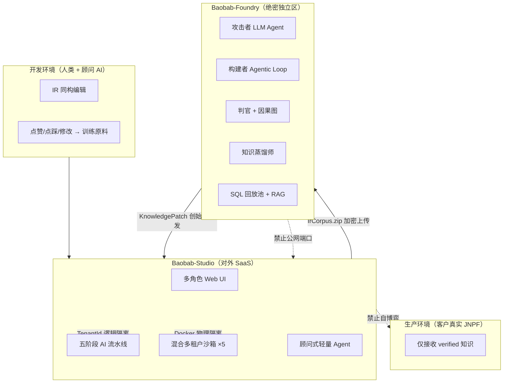
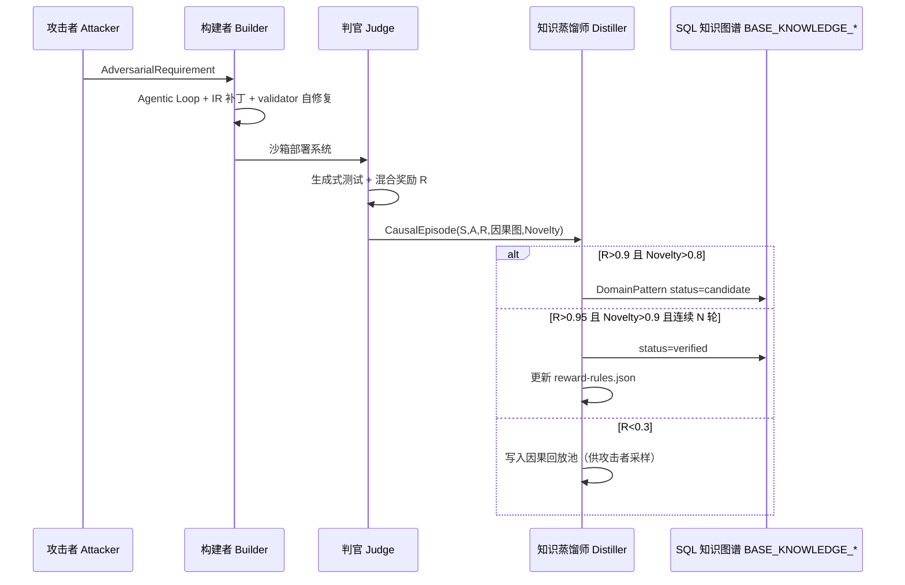
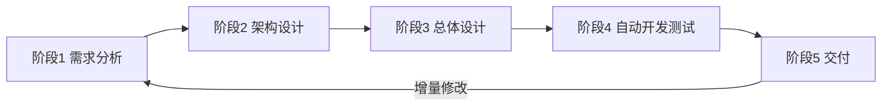
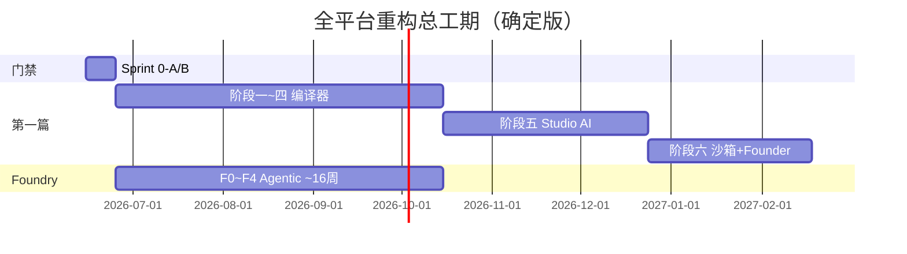

# 第二篇：自博弈 AI 低代码全平台重构（确定版）

> **升格说明**：本篇将 `7、D爷初稿` 三条决战裁决、`8、Baobab-Studio V1.0`、`9、Baobab-Foundry V1.0` 合并为**唯一确定版**。8 稿中「28 周 Studio 工期」**废止**；v5.0 以第一篇全局时间线 **Studio ~49 周 + Foundry ~16 周** 为准（专家审阅 + 创始人裁定，见附录 D）。

## 1. 双系统拓扑与产品定位

### 1.1 系统上下文（图 1）



**Baobab-Studio 使命**：面向企业客户，以五阶段流水线 + 多角色 Web UI，将自然语言需求变为可运行系统；手工 VisualDev 与 AI 轨道 IR 同构，**进可 AI 生成，退可手工兜底**。

**Baobab-Foundry 使命**：在隔离沙箱中 7×24 自博弈，进化行业领域知识，经创始人审核后以 **KnowledgePatch** 注入 Studio；外部人员（含平台管理员）**不可感知** Foundry 存在。

### 1.2 三环境隔离（D 爷 7 稿 · 确定版）

| 环境         | 允许行为                              | 禁止行为                      | 代码锚点                          |
| ------------ | ------------------------------------- | ----------------------------- | --------------------------------- |
| **生产环境** | 运行 verified 规则与图谱              | 任何自博弈 / 未审核 candidate | 客户部署实例                      |
| **开发环境** | 人类 + 顾问 AI 协作编辑 IR            | 跨 Tenant 数据混用            | `src/views/studio/`               |
| **沙箱环境** | 博弈对局、冒烟测试、流水线阶段 4 部署 | 影响生产 / 其他租户           | `SandboxScheduler` 【待源码验证】 |

---

## 2. D 爷三条决战裁决（确定版 · 来源 7 稿）

### 2.1 裁决一：认知涌现工业闭环 — 知识蒸馏师

**涌现的工程定义（确定版）**：当判官发现全新 **(S, A)** 对（状态 S 下动作 A）稳定获得高奖励 R，且知识图谱中不存在该模式时，记为一次**认知涌现**。

**闭环五步（确定版，含第四智能体）**：



| 阈值                              | 蒸馏师动作                         | 人类介入        |
| --------------------------------- | ---------------------------------- | --------------- |
| R < 0.3                           | 仅存回放池，不改图谱               | 无              |
| R > 0.9 且 Novelty > 0.8          | 生成 **candidate** `DomainPattern` | checkpoint 审核 |
| R > 0.95 且 Novelty > 0.9 且 N 轮 | **verified** + `reward-rules.json` | 创始人可驳回    |

**混合奖励（确定版）**：`R = 0.6×R_white + 0.4×R_black − 因果惩罚`；白盒来自 `reward-rules.json`，黑盒来自 OpenTelemetry（P95、吞吐、死锁等）。

**升标（相对 7 稿初稿）**：32 维因果向量 → **结构化因果图** `G=(V,E)`（9 稿裁定）；节点类型 `Deadlock` / `RuleViolation` / `LifecycleBreach`，边类型 `IS_CAUSED_BY` / `CONTRADICTS_RULE`。

### 2.2 裁决二：《JNPF IR 通用性契约》（平台最高技术法律）

| 条款               | 内容                                                         | 验收                                      |
| ------------------ | ------------------------------------------------------------ | ----------------------------------------- |
| **唯一真源**       | `jnpf-web-vue3/src/core/ir/types.ts`；`IRLayer.version` 独立 semver | CI diff 阻断擅自改 IR                     |
| **双轨同构**       | 手工 VisualDev 与 AI 产出均为 `FormPageIR`                   | 同一 `schema-cleaner.ts` + `validator.ts` |
| **正向**           | JNPF Schema → `cleanSchema()` → IR                           | 已实现（F-1）                             |
| **逆向（逃生舱）** | IR → `ir-to-schema.ts` → VisualDev Schema                    | Sprint 0-B 地桩 8；10+ round-trip         |
| **验收铁律**       | AI 产出无法清洗 = **AI 错误**，非编译器错误                  | `schema-regression.test.ts` fail-fast     |

**后端同构（v5.0）**：`types.ts` 导出 **ir.schema.json**；C# 由 NJsonSchema 生成（**废止** T4）；`LlmGatewayService` 以 JSON Schema 作为 response schema + `validator.ts` 二次校验。

### 2.3 裁决三：多角色 Web UI — AI 能力唯一入口

**交付形态（确定版）**：用户登录 JNPF → 左侧菜单出现 `AI 开发` / `业务智能` / `创始人管理`（二次认证）→ 全功能 Web 界面，**禁止**以终端命令作为客户交付形态。

#### 2.3.1 角色与菜单矩阵（8 稿 · 确定版）

| 角色     | 菜单项                                                       | 路由前缀            | 后端 TenantId |
| -------- | ------------------------------------------------------------ | ------------------- | ------------- |
| 业务专家 | 应用快速生成、业务规则顾问、数据异常解释、我的项目           | `/studio/expert/*`  | 强制          |
| 开发者   | AI 顾问、AI 架构评审、IR 手工设计器、沙箱监控、知识图谱浏览器 | `/studio/dev/*`     | 强制          |
| 管理员   | 用户管理、AI 调用审计、模型降智与切换、系统配置              | `/studio/admin/*`   | 平台级        |
| 创始人   | 自博弈控制台、**模型与 Prompt 配置**、知识图谱审核、系统级审计日志 | `/studio/founder/*` | FounderGuard  |

#### 2.3.2 核心 Vue 组件（确定版）

| 组件                         | 路径                                         | 职责                                                 |
| ---------------------------- | -------------------------------------------- | ---------------------------------------------------- |
| `AiChatPanel.vue`            | `jnpf-web-vue3/src/views/studio/components/` | 富媒体对话（IR 预览/文档/追问），**禁止纯文本-only** |
| `IrDiffViewer.vue`           | 同上                                         | AI vs 人类 IR 差异审查                               |
| `SelfPlayDashboard.vue`      | 同上                                         | Reward 曲线、Novelty、沙箱并发（Foundry 转发）       |
| `KnowledgeGraphExplorer.vue` | 同上                                         | D3/ECharts 力导向图                                  |
| `NarrativePatternBrief.vue`  | 同上 【新增】                                | 候选模式「叙事式说明书」（7 稿 3.3 改进）            |

---

## 3. Baobab-Studio 确定版（升格自 8 稿）

### 3.1 五阶段 AI 角色协作流水线（确定版）

客户面对**分阶段进度条**，非单一聊天框；每阶段须**客户确认**方可推进。



| 阶段     | Agent / 服务                                   | 输入                           | 输出文档 / 产物                          | 第一篇映射               |
| -------- | ---------------------------------------------- | ------------------------------ | ---------------------------------------- | ------------------------ |
| **1**    | `Stage1AnalystService` / `AnalystAgentService` | 多模态需求（PDF/Word/图/语音） | 《系统需求分析说明书》+ 领域模型 IR 片段 | 阶段五 W1-2              |
| **2**    | `Stage2ArchitectService`                       | 阶段 1 文档 + EAB              | 《系统架构设计说明书》+ 模块划分         | 阶段五 W3-4              |
| **3**    | `Stage3OrchestratorService`                    | 阶段 1/2 + 子 Agent 并行       | 《系统总体设计说明书》+ 完整 IR          | 阶段五 W5-7              |
| **3 子** | DB/UI/工作流/APP/大屏 设计师                   | 模块列表                       | 表结构、页面 IR、Flow IR、Dashboard IR   | 阶段五                   |
| **4**    | `Stage4DevEngineService`                       | IR + DB 设计                   | 编译 → 客户沙箱 URL + 测试报告           | 阶段五 W8-9 + 阶段六沙箱 |
| **5**    | 交付引擎                                       | 沙箱验收                       | 测试 URL、ZIP 导出、增量回退阶段 1       | 阶段六 W8                |

**子智能体编排（阶段 3 确定版）**：`OrchestratorAgent` 并行调用数据库/UI/API/工作流/大屏/移动子 Agent，`Promise.all` 合并为 `FormPageIR[]` + `DatabaseDesign`（实现见第一篇阶段五 `Stage3OrchestratorService` 代码块）。

**EAB 硬约束（ADR-016）**：架构师 Agent 的 `techStack.framework` 必须为**模块化单体**；`Stage2ArchitectService.getSystemPrompt()` 禁止输出 `AddMicroservice` 类动作（Foundry 构建者高层动作白名单另见 §4.3，Studio 侧不适用）。

### 3.2 混合多租户沙箱（确定版 · 16G 笔记本 5 并发）

**图 2：混合隔离**

```
智能交互层（逻辑隔离）          开发测试层（物理隔离）
┌─────────────────────┐        ┌─────────────────────┐
│ 共享 SQL Server      │        │ Docker 容器 × N      │
│ BASE_AI_PIPELINE    │        │ 1 CPU / 1GB / 租户   │
│ TenantId 全表过滤    │        │ SemaphoreSlim max=5  │
│ ITenantFilter 强制   │        │ 30s 创建 / 超时销毁   │
└─────────────────────┘        └─────────────────────┘
```

| 组件        | 类 / 服务                         | 方法 / 职责                                    | 表                          |
| ----------- | --------------------------------- | ---------------------------------------------- | --------------------------- |
| 租户中间件  | `TenantMiddleware` 【待源码验证】 | 注入 `TenantId` 到 `HttpContext`               | —                           |
| 沙箱调度    | `SandboxScheduler`                | `CreateAsync` / `DeployAsync` / `DestroyAsync` | **BASE_SANDBOX** 【待 DDL】 |
| Docker 集成 | `Docker.DotNet`                   | `HostConfig.CPUCount=1`, `Memory=1GB`          | —                           |

**创始人承诺（7 稿）**：10 客户同时使用 → AI 会话、IR、代码、沙箱**绝不混合**；前期 5 并发，超出排队。

### 3.3 分级并行智能体（确定版 · 7 稿「时间效能」）

| 通道                        | 目标延迟   | 适用场景                 | 并行策略                                          | 禁用         |
| --------------------------- | ---------- | ------------------------ | ------------------------------------------------- | ------------ |
| **通道一** 极速微 Agent 池  | 秒级       | 语法/类型/配置类 Bug     | `SyntaxFixer` 等热池并行 + 确定性仲裁             | 自博弈沙箱   |
| **通道二** 顾问团           | 分钟级     | 中等业务规则、迭代需求   | 多 Agent 并行 + **生成→验证→自修复** + 多沙箱模拟 | 7×24 顾问    |
| **通道三** Foundry 深度进化 | 小时级后台 | 架构级创新、领域模式涌现 | LLM Agentic Loop、攻击者集群、蒸馏师异步          | 默认前台路径 |

**产品承诺**：碳基 2 分钟 Bug → 通道一 **≤10s**（静态检查 + IR 补丁）；普通需求 → 通道二 **分钟级**；深度创新 → 通道三 **后台**，创始人菜单可见进度。

### 3.4 Studio 工期与第一篇映射（废止 8 稿 28 周）

| 8 稿 Phase             | 8 稿周次 | v5.0 确定工期                                      | 第一篇对应           |
| ---------------------- | -------- | -------------------------------------------------- | -------------------- |
| Phase 0 基座           | 1-6      | Sprint 0-A/B + 阶段零~一                           | ✅ 已完成 / Sprint 0  |
| Phase 1 流水线+UI      | 7-14     | **阶段五 10 周**（**Evals/FlowIR/组件≥90% 门禁**） | `# 阶段五` 全文      |
| Phase 2 多租户沙箱     | 15-20    | **阶段六 W1-4** + 阶段五阶段 4 集成                | 阶段六 Studio 清单   |
| Phase 3 创始人+Foundry | 21-26    | **阶段六 W5-8**                                    | FounderGuard + Patch |
| Phase 4 测试发布       | 27-28    | 融入阶段六验收 + Gate CI                           | 附录 B R8            |

### 3.5 Studio 核心 API（确定版 · DynamicApi 由 Service 生成）

| 接口         | 方法 / 路径                           | Service 方法                            | 表                           |
| ------------ | ------------------------------------- | --------------------------------------- | ---------------------------- |
| 需求会话     | `POST /api/analyst/session`           | `AnalystAgentService.CreateSession`     | **BASE_AI_PIPELINE**         |
| 多模态消息   | `POST /api/analyst/{id}/message`      | `SendMessage`                           | **BASE_AI_PIPELINE_MESSAGE** |
| 需求文档     | `POST /api/analyst/{id}/generate-doc` | `GenerateDocument`                      | 同上                         |
| 架构设计     | `POST /api/architect/design`          | `ArchitectAgentService.Design`          | 同上                         |
| 流水线状态   | `GET /api/pipeline/{id}`              | `PipelineOrchestrator.GetState`         | **BASE_AI_PIPELINE**         |
| 代码生成部署 | `POST /api/devengine/build`           | `Stage4DevEngineService.BuildAndDeploy` | **BASE_SANDBOX**             |
| 沙箱状态     | `GET /api/sandbox/{tenantId}/status`  | `SandboxScheduler.GetStatus`            | **BASE_SANDBOX**             |
| 创始人认证   | `POST /api/founder/auth/verify`       | `FounderAuthService.VerifyTotp`         | **BASE_FOUNDER_AUTH_LOG**    |
| 自博弈任务   | `GET /api/founder/selfplay/tasks`     | 转发 Foundry REST                       | —                            |
| AI 审计      | `GET /api/admin/ai/calls`             | `AiCallLogService.GetPageList`          | **BASE_AI_CALL_LOG**         |

> R1：禁止手工创建 Controller；上表 Service 须实现 `IDynamicApiController`。

### 3.6 Studio 里程碑（确定版）

| 里程碑          | 周次            | 交付物                                       | 标签                        |
| --------------- | --------------- | -------------------------------------------- | --------------------------- |
| M0 基座         | Sprint 0-B 完成 | IR + 网关 + 10 地桩 + Gate 全绿              | `v5.2-ai-infrastructure-m0` |
| M0.5 Evals      | 阶段五启动前    | golden set ≥50 + eval-runner                 | `v5.2-evals-baseline`       |
| M1 流水线 Alpha | 阶段五 W4       | 阶段 1/2 Agent + AiChatPanel（**SSE 流式**） | `v5.2-studio-m1-alpha`      |
| M2 全流程贯通   | 阶段五 W10      | 阶段 3-5 + FlowIR + 多角色菜单               | `v5.2-studio-m1`            |
| M3 多租户       | 阶段六 W4       | 5 并发沙箱 + 越权测试                        | `v5.2-studio-m2`            |
| M4 创始人链路   | 阶段六 W8       | FounderGuard + Patch 联调                    | `v5.2-studio-m3`            |
| M5 发布候选     | Gate + 集成测试 | 文档 + Demo Compose                          | `v5.2-studio-rc1`           |

#### 本节核心表清单（Studio）

- **BASE_AI_CALL_LOG** — AI 调用审计（F_TENANT_ID, F_MODEL, F_TOKENS…）
- **BASE_AI_PIPELINE** / **BASE_AI_PIPELINE_MESSAGE** — 五阶段会话
- **BASE_AI_PROMPT_TEMPLATE** — Prompt 模板
- **BASE_KNOWLEDGE_NODE** / **BASE_KNOWLEDGE_EDGE** — **SQL Server 唯一运行时**（Foundry MVP2 再评估 Neo4j）
- **BASE_FOUNDER_AUTH_LOG** — 创始人二次认证
- **BASE_SANDBOX** — 沙箱实例 【待 DDL，Sprint 0-B 后补】

#### 本节关键代码路径索引（Studio）

- IR 真源：`jnpf-web-vue3/src/core/ir/types.ts`
- 流水线：`jnpf-web-vue3/src/core/ai/pipeline/` 【阶段五详述】
- UI：`jnpf-web-vue3/src/views/studio/`
- 网关：`modularity/.../LlmGatewayService.cs` 【待源码验证】
- 编译：`jnpf-web-vue3/src/core/compiler/gateway/`（F-8）

---

## 4. Baobab-Foundry 确定版（升格自 9 稿 · v5.0 引擎换道）

> **v5.0 裁定**：四角色闭环、因果图、知识蒸馏 **产品叙事不变**；执行引擎由 RL（MCTS/PPO/A3C/GPU）换为 **LLM Agentic Loop + RAG + 程序化验证器**。工期 **~16 周**（原 30 周）。Neo4j：**MVP2 再评估**（创始人部分采纳；MVP1 用 SQL Server JSON）。

### 4.1 四大智能体 + 基础设施

| 组件           | 职责                        | 技术选型（v5.0 确定）                                        |
| -------------- | --------------------------- | ------------------------------------------------------------ |
| **自博弈引擎** | 对局生命周期、并行调度      | Python asyncio / 轻量任务队列（**废止** Ray + GPU）          |
| **攻击者**     | 对抗需求 + 历史失败 RAG     | LLM + 因果回放池 few-shot（**废止** Transformer 策略网、苏格拉底组件） |
| **构建者**     | IR 补丁 + EAB 约束 + 自修复 | LLM Agentic Loop + `validator.ts` + 沙箱执行反馈             |
| **判官**       | 生成式测试 + 因果图 + R     | LLM + 规则引擎 + **OpenTelemetry（前置依赖，Sprint 0-B 登记）** |
| **知识蒸馏师** | candidate/verified + 遗忘   | 因果图挖掘 + **SQL Server KNOWLEDGE_PATTERNS**               |
| **因果回放池** | 优先级采样                  | **SQL Server JSON 列**（**废止** PostgreSQL + pgvector）     |
| **沙箱集群**   | 不可变镜像 + 混沌注入       | Docker；**共享 SQL Server** per-tenant DB                    |

### 4.2 Foundry 与 Studio 数据流（确定版）

| 数据流         | 方向             | 格式                                  | 加密                                | 触发        |
| -------------- | ---------------- | ------------------------------------- | ----------------------------------- | ----------- |
| 匿名化原料包   | Studio → Foundry | `IrCorpus.zip`（IR + 人类反馈因果图） | AES-256 + 创始人公钥                | 每周 / 按需 |
| 领域智能更新包 | Foundry → Studio | `KnowledgePatch_{v}.zip`              | 创始人私钥签名                      | checkpoint  |
| 状态查询       | Studio → Foundry | REST + `X-Founder-Token`              | **HTTPS**（**废止** mTLS 双向证书） | 创始人菜单  |

**注入 Studio 四步（v5.0）**：

1. Foundry 打包 **SQL 知识增量** + `reward-rules.json` 增量 → 签名 zip  
2. 创始人在 Studio「图谱审核」下载 Patch  
3. Studio `KnowledgePatchService.VerifySignature()` → 合并 **BASE_KNOWLEDGE_*** → 备份旧版  
4. 写入 **BASE_FOUNDER_AUTH_LOG** + 不可删审计表  

**Neo4j 决策门（Foundry MVP2）**：若图谱规模 >10⁵ 边且 SQL 查询 P95>200ms，创始人书面批准后再引入 Neo4j 社区版；Patch 格式须向后兼容 SQL 合并路径。

### 4.3 构建者分层动作空间（升标 + ADR-016 对齐）

| 层级       | 动作示例                                           | Studio EAB             | Foundry 训练 |
| ---------- | -------------------------------------------------- | ---------------------- | ------------ |
| **A_high** | `IntroduceEventDriven`, `SplitEntity`, `AddOutbox` | ✅ 允许（模块化单体内） | ✅            |
| **A_high** | `AddMicroservice`, `SplitDatabase`                 | ❌ **禁止**             | ❌ 移出白名单 |
| **A_low**  | 字段增删、规则调整、组件替换                       | ✅                      | ✅            |

状态 **S**：IR JSON + 知识图谱检索上下文（**废止** 132 维向量 + GraphSAGE）。

### 4.4 Foundry ~16 周 Phase（v5.0）

| Phase           | 周次  | 交付                                           | 依赖 Studio         |
| --------------- | ----- | ---------------------------------------------- | ------------------- |
| **F0** 环境     | 1-3   | SQL 回放池 + 单线程 Agentic 闭环演示（更衣柜） | IR 库 + 编译器移植  |
| **F1** 四 Agent | 4-8   | 攻击/构建/判官/蒸馏师 + OTel 白盒指标          | 沙箱镜像            |
| **F2** 并行博弈 | 9-12  | 多沙箱 + 50+ 轮稳定 + RAG 冷启动               | Evals 基准          |
| **F3** 治理     | 13-15 | Patch 链路 + 创始人 UI + 审计表                | 阶段六 Founder 菜单 |
| **F4** 试点     | 16    | 智慧工地 + 智能更衣柜 2 领域 verified 包       | KnowledgePatch 注入 |

### 4.5 Foundry 里程碑

| 里程碑 | 周次 | 交付物                         |
| ------ | ---- | ------------------------------ |
| FM0    | 3    | 单域 Agentic 闭环可演示        |
| FM1    | 8    | 四 Agent + 蒸馏师联调          |
| FM2    | 12   | 50+ 轮稳定；SQL 知识表初具规模 |
| FM3    | 15   | Patch 链路打通 Studio          |
| FM4    | 16   | 2 领域 verified 包 + 文档      |

#### 本节核心表清单（Foundry 侧 · 独立 DB）

- **SQL Server**：`CAUSAL_EPISODES`、`KNOWLEDGE_PATTERNS`、`causal_replay_buffer`（JSON 列）
- **Neo4j（MVP2 可选）**：`DomainPattern` — 仅创始人书面批准 + 性能门禁触发后
- 配置文件：`reward-rules.json`（哈希链防篡改）

#### 本节关键代码路径索引（Foundry · 独立仓库 【待创建】）

- `foundry/engine/agentic_loop.py`（**废止** `selfplay_loop.py` + RL 栈）
- `foundry/agents/{attacker,builder,judge,distiller}.py`
- `foundry/kg/sql_knowledge_store.py`（MVP1）；`neo4j_store.py`（MVP2 可选）
- `foundry/patch/knowledge_patch_builder.py`

---

## 5. 全平台统一里程碑矩阵（Studio + Foundry + 第一篇）



| 并行线         | 总工期               | 关键汇合点                      |
| -------------- | -------------------- | ------------------------------- |
| 第一篇 F-0~F-8 | Sprint 0 + **15** 周 | F-8 CompileGateway → 阶段五消费 |
| 第二篇 Studio  | 10 + 8 周            | M2 流水线贯通 → M4 Patch 接收   |
| 第二篇 Foundry | **~16 周**           | FM3 周 15 ↔ Studio M4 联调      |

---

## 6. 冷启动 / 遗忘 / 叙事说明书（7 稿改进 · 确定纳入）

| 改进项   | 机制                                                 | 负责组件                       |
| -------- | ---------------------------------------------------- | ------------------------------ |
| 冷启动   | 5-10 条种子 `DomainPattern` + **RAG 历史 IR 案例**   | 蒸馏师 + BASE_KNOWLEDGE_* 检索 |
| 奖励黑客 | 生命周期契约字段 + 判官动态奖励挑战                  | 判官 + `reward-rules.json`     |
| 知识过时 | verified 半衰期 → `deprecated`；图谱版本快照         | 蒸馏师                         |
| 审核鸿沟 | `NarrativePatternBrief.vue` 自动生成技术博客式说明书 | 蒸馏师 + LLM                   |

---

## 7. 第二篇自检清单（ARCHITECTURE_DOC_RULES 摘要）

- [x] 穿透：Service 方法名 + API 路径 + 表名已标注；Foundry Python 路径标【待创建】
- [x] 数据锚定：每模块 ≥2 表（BASE_AI_* / BASE_KNOWLEDGE_* / 回放池 JSON）
- [x] 图表：图 1 拓扑 + 流水线 + 蒸馏序列 + Gantt
- [x] 可验证：`types.ts` / JwtHandler / DynamicApi 可在仓库检索
- [x] 无空泛：废止 28 周；EAB 禁止 AddMicroservice 已写明

---

**第二篇结束。以下附录 A~D 为废止说明、风险、审核清单与专家审阅裁定，与第二篇一并构成 v5.0 全平台重构唯一执行纲领。**

---

# 附录 A：v2.0 / 8 稿「计划调整」废止说明与 D 爷架构对齐

> **v5.0 说明**：D 爷 7/8/9 三稿已升格为**第二篇确定版**；本附录保留废止对照；**v5.0 专家审阅裁定**见附录 D。

## A.1 三条架构决策（对齐 D 爷确定稿，不降级）

```
┌─────────────────────────────────────────────────────────────────────────┐
│ 决策一：自博弈引擎 → Baobab-Foundry 独立部署（**~16 周**，LLM Agentic Loop） │
│   Studio 不含训练引擎；接收经创始人签发的 KnowledgePatch（SQL Server 合并）   │
│   ⚠️ 非「删除自博弈」——是物理隔离 + HTTPS 签名通道                            │
├─────────────────────────────────────────────────────────────────────────┤
│ 决策二：阶段五 → 五阶段 AI 流水线（10 周）+ **Evals + 组件覆盖 ≥90% 门禁**  │
│   OrchestratorAgent + 子智能体全保留；FlowIR 工作流 IR 并行纳入阶段三       │
├─────────────────────────────────────────────────────────────────────────┤
│ 决策三：阶段六 Studio 侧 → 沙箱 + 创始人 + Foundry 对接（8 周）           │
│   Docker 沙箱（共享 SQL Server）；FounderGuard；**BASE_KNOWLEDGE_* 接收层** │
└─────────────────────────────────────────────────────────────────────────┘
```

## A.2 v2.0 / v4.0 废止条款对照表

| 历史裁剪项                | v5.0 裁定                                                    |
| ------------------------- | ------------------------------------------------------------ |
| 总工期 28 周              | **废止** → Studio **~49 周** + Foundry **~16 周** 并行       |
| F-6b 4 周→2 周 MVP        | **废止** → 阶段二 **4 周全量** VIP                           |
| F-8 去掉回写              | **废止** → 阶段四 **ir-to-schema 官方回写**（非 .vue 反解析） |
| Foundry RL 30 周          | **废止** → **~16 周** LLM Agentic Loop（四角色叙事保留）     |
| Studio Phase 3 切换 Neo4j | **废止** → SQL Server **唯一运行时**；Foundry Neo4j **MVP2 再评估** |
| uni-app X 双轨必交付      | **暂缓非删除** → 阶段三 **单轨** standard uni-app            |
| DKEE「降级为被动接收」    | **升标** → Studio 被动接收 + Foundry 主动进化                |
| 阶段五 10→8 周            | **废止** → **10 周** + 硬门禁                                |

## A.3 模块归属（Studio vs Foundry）

| 模块                                      | Studio（主体） | Foundry（独立）                    |
| ----------------------------------------- | -------------- | ---------------------------------- |
| 五阶段 AI 流水线 UI + Orchestrator        | ✅ 阶段五       | —                                  |
| LlmGatewayService + BASE_AI_* 表          | ✅ Sprint 0-B   | 共用契约                           |
| Docker 客户沙箱（流水线阶段 4）           | ✅ 阶段六       | 训练沙箱可复用规格                 |
| FounderGuard + 创始人菜单                 | ✅ 阶段六       | 模型与 Prompt 配置 / Foundry 转发  |
| KnowledgePatch 接收 + SQL 知识表          | ✅ 阶段六       | 知识增长 + 签发（Neo4j MVP2 可选） |
| 需求攻击者 / 构建者 / 判官 / Agentic 引擎 | —              | ✅ F-10 + 第二篇 §4                 |
| 智能更衣柜 50+ 轮 Agentic 进化            | —              | ✅ Foundry FM2+ 里程碑              |

## A.4 仍 Open 的 Phase 1+ 项（不阻塞 v3.0 批准，须施工跟踪）

```
O-1  ADR-017 diff 脚本：当前单路径 Vue3Compiler；Phase 2 前补 .vm 双路径或门禁豁免文档
O-2  组件 registry vs FormGenerator 60+：**阶段五硬门禁 ≥90%**（非 backlog）
O-3  progress-registry / security-debt-registry / Sprint 0 交付物：文档已定，仓库待落地
O-4  JwtHandler 路由权限：Sprint 0-A Day 3 实施
O-5  EAB 动作白名单：Stage2 Architect 禁 AddMicroservice
O-6  OpenTelemetry 集成：判官 R_black 前置（Foundry F1 前）
O-7  MultiTenancy 启用：阶段六前 ITenantFilter + 越权 CI
O-8  FlowIR + Evals：阶段五启动前必交付（见「专家审阅裁定 · P0 新增施工包」）
```

---

# 附录 B：关键风险与缓解措施（v5.0）

| #    | 风险                               | 影响                    | 缓解（v5.0）                                                 |
| ---- | ---------------------------------- | ----------------------- | ------------------------------------------------------------ |
| R1   | 16GB 内存：5 沙箱各带独立 DB       | OOM                     | **共享 SQL Server**（per-tenant DB）；容器仅 API+前端；同时 ≤2 活跃沙箱 |
| R2   | AI 降智 / 供应商故障               | 流水线中断              | 多供应商降级 + **无 AI 专家模式** + ir-to-schema 逃生舱      |
| R3   | 多租户未启用（MultiTenancy=false） | 合规事故                | 阶段六前启用 + ITenantFilter + 越权测试进 CI                 |
| R4   | 创始人认证绕过                     | 核心机密泄露            | FounderUserId + TOTP + X-Founder-Token + BASE_FOUNDER_AUTH_LOG |
| R5   | IR 单向                            | 手工兜底失效            | ir-to-schema round-trip；Sprint 0-B 门禁第 17 项             |
| R6   | Outbox + SqlSugar 事务             | 一致性失败              | OutboxSqlServerPoC 4 用例进 Gate                             |
| R7   | Three.js 未验证 / uni-app X 暂缓   | 阶段二返工              | PoC-B 门禁；uni-app X **书面决策门**再启                     |
| R8   | CI 脚本名错误 + continue-on-error  | 83 tests 无保护         | Sprint 0-A Day 1 修正 `lint:eslint` + 去 continue-on-error   |
| R9   | 无 FlowIR / Evals                  | AI 产品不可售、不可测   | 阶段五硬门禁（附录 D）                                       |
| R10  | OTel 未集成                        | 判官 R_black 40% 无数据 | Foundry F1 前 OTel 前置线                                    |

---

# 附录 C：专家组审核清单

### C.1 批准前须确认（创始人 / 专家组签字项）

```
□ 接受 v5.0 双篇结构 + 附录 D 专家审阅裁定
□ 接受 Studio ~49 周 + Foundry ~16 周（废止 8 稿 28 周、v4.0 Foundry 30 周）
□ 接受 Foundry 引擎换道（LLM Agentic Loop；四角色 + 蒸馏师叙事保留）
□ 接受 Neo4j：**Studio=SQL 唯一**；Foundry **MVP2 再评估**（创始人部分采纳）
□ 接受 uni-app X：**暂缓非删除**；阶段三 **单轨 standard uni-app**
□ 接受 D 爷三条裁决 + 三通道分级响应 + 沙箱共享 SQL
□ 接受 Sprint 0-A/B 硬门禁 + 阶段五 **Evals / FlowIR / 组件 ≥90%**
□ 接受 F-6b 全量 4 周 + F-8 **ir-to-schema 官方回写**（非 .vue 反解析）
```

### C.2 批准后立即执行（工程师 Day 1）

```bash
# Sprint 0-A Day 1 验证基线
cd d:\JNPF-v52\jnpf-web-vue3 && pnpm exec vitest run src/core
# 当前 canonical：83 passed（CI 纳入后为准）

# 修正 CI：lint:eslint（非 lint）+ 去掉 continue-on-error
cd d:\JNPF-v52\jnpf-web-vue3 && pnpm run lint:eslint && pnpm run type:check && pnpm test:unit

cd d:\JNPF-v52\backend && dotnet build
# 创建 backend/tests/JNPF.Tests.Gate 并加入 sln（Day 3）
```

### C.3 文档与代码锚点索引

| 类别                 | 路径                                                        |
| -------------------- | ----------------------------------------------------------- |
| IR 唯一真源          | `jnpf-web-vue3/src/core/ir/types.ts`                        |
| 组件三层映射         | `jnpf-web-vue3/src/core/ir/component-mapping.ts`            |
| JwtHandler           | `backend/application/JNPF.API.Entry/Handlers/JwtHandler.cs` |
| CI                   | `.github/workflows/ci.yml`                                  |
| ADR                  | `docs/adr/ADR-016` ~ `018`（017/018 Sprint 0-A 创建）       |
| D 爷初稿（三条裁决） | `7、D爷初稿.md` → 第二篇 §2                                 |
| D 爷 Studio          | `8、D爷确定稿第一部分.md` → 第二篇 §3                       |
| D 爷 Foundry         | `9、D爷确定稿第二部分.md` → 第二篇 §4                       |
| 专家审阅裁定         | 附录 D；文档末尾「总架构师意见」（手工追加，勿删）          |

---

# 附录 D：2026-06-12 专家审阅采纳清单（创始人 / 总架构师裁定）

> 完整审阅原文见文档末尾「# 顶级专家审核意见」；总架构师逐条裁定见「# 总架构师意见」。**本节为 v5.0 施工唯一权威。**

| #    | 专家建议                               | v5.0 裁定                                                  | 计划落点                             |
| ---- | -------------------------------------- | ---------------------------------------------------------- | ------------------------------------ |
| 1    | 废止 Foundry RL 栈（MCTS/PPO/A3C/GPU） | **采纳** → LLM Agentic Loop                                | 第二篇 §4；全局时间线 Foundry ~16 周 |
| 2    | 废止 Neo4j                             | **部分采纳**：Studio **SQL 唯一**；Foundry **MVP2 再评估** | Sprint 0-B；阶段六；§4.2 决策门      |
| 3    | 废止 PostgreSQL + pgvector             | **采纳** → SQL Server JSON 列                              | Sprint 0-B；Foundry §4.1             |
| 4    | 废止 mTLS/WORM/军规安保                | **采纳** → HTTPS + 签名 zip + 审计表 + TOTP                | 阶段六；§4.2                         |
| 5    | 废止 uni-app X 双轨                    | **暂缓，非删除** → 单轨 standard uni-app                   | 阶段三；PoC-A 暂缓                   |
| 6    | 废止任意 .vue→IR 反解析                | **采纳** → **ir-to-schema 唯一官方通道**                   | F-8.6；Sprint 0-B 地桩 8             |
| 7    | 废止 F-6b.8 蓝图引擎                   | **采纳** → 并入 expression/engine 事件 DSL                 | F-6b.8                               |
| 8    | 废止 ML.NET 意图分类                   | **采纳** → LlmGateway 路由                                 | 第二篇 §3                            |
| 9    | 废止苏格拉底辩论组件                   | **采纳** → prompt 技巧                                     | Foundry §4.1 攻击者                  |
| 10   | 废止 AI 超参中心                       | **采纳** → **模型与 Prompt 配置**                          | 创始人菜单                           |
| —    | **新增** FlowIR                        | **采纳**                                                   | F-7.9；阶段五门禁                    |
| —    | **新增** AI Evals golden set           | **采纳**                                                   | F-5.2；阶段五门禁                    |
| —    | **新增** 组件覆盖 ≥90%                 | **采纳**                                                   | Sprint 0-A；阶段五门禁               |
| —    | 沙箱共享 SQL / CI 修正 / OTel 前置     | **采纳**                                                   | Sprint 0-A；附录 B R1/R8/R10         |

**净工期效应（估算）**：Foundry 30→~16 周；阶段三 5→4 周；资源投向 FlowIR + Evals + 组件覆盖。

---

## 本会话结论（episodic 索引友好）

- **决策**：v5.0 吸收专家审阅 + 创始人两条保留裁定（Neo4j 部分采纳；uni-app X 暂缓非删除）；Foundry RL→Agentic Loop；Studio 知识图谱 SQL 唯一；新增 FlowIR/Evals/组件门禁。
- **交付物**：`10、JNPF升维开发总计划.md`（v5.0）；附录 D 裁定清单；文档末尾专家意见与总架构师意见**原样保留**。
- **禁止项**：Studio 内嵌 Foundry 训练；未经创始人删除四角色/蒸馏师/IR 契约；修改文档末尾手工追加段落。
- **待审/阻塞**：Sprint 0 门禁未落地；Foundry 独立仓库待建；MultiTenancy 启用。
- **下一步**：创始人签批附录 C → Sprint 0-A Day 1（含 CI 脚本修正）→ 阶段三单轨 UniApp + FlowIR。

---

**文档版本：v5.0（专家审阅裁定版 · 全平台重构） | 日期：2026-06-12 | 状态：待创始人 / 专家组批准**


# 顶级专家审核意见

知识图谱（1497 节点 / 1616 边，覆盖代码 + 全部架构文档）查询完毕，并对仓库做了实时核查。以下是作为评审专家的完整意见，**全部结论附实测证据**，最后一节直接回答「哪些节点应彻底清除」。

---

## 一、事实核查：计划 vs 仓库真实状态（图谱 + 实测）

| 计划声称                                                     | 仓库实测（2026-06-12 本次会话）                              | 判定         |
| ------------------------------------------------------------ | ------------------------------------------------------------ | ------------ |
| src/core 83 tests                                            | `vitest run src/core` → **83 passed (8 files)** ✅            | 准确         |
| Vue3 + 大屏编译器已有                                        | `src/core/compiler/{vue3,dashboard}` 存在 ✅                  | 准确         |
| UniApp 编译器、CompileGateway、`ir-to-schema.ts`             | **均不存在**（glob 0 结果）                                  | 纸面         |
| F-6b Three.js                                                | datascreen `package.json` **无 three 依赖**                  | 纸面         |
| Sprint 0-B 十项地桩（BASE_AI_*、LlmGateway、KnowledgePatch） | 后端 **0 处匹配**                                            | 纸面         |
| `backend/tests/JNPF.Tests.Gate`                              | 只有 ADR012 / Stage5 / verifications                         | 未建         |
| JwtHandler 路由级权限                                        | 已是「管理员跳过+白名单+**权限组非空**」阶段 1，代码注释自认「阶段 2+ 才路由级」 | 半实现       |
| CI 门禁                                                      | **`pnpm lint` 调用了一个不存在的脚本**（实际叫 `lint:eslint`）且 `continue-on-error: true`——该步骤从未真正生效；CI 无 vitest、无 `type:check`。83 个测试今天不受任何 CI 保护 | **重大缺陷** |
| App.GetService 37→0                                          | framework 层（`Oops.cs`、`L.cs`、`Http.cs`、`IM.cs`…）大量使用——这是 Furion 框架基因 | **口径错误** |

图谱另给出三条计划没有正视的现状：**componentMap 有 60+ 个 jnpfKey 而新 registry 只注册 35 个**；**三前端项目组件库零共享、app-vue3 双 UI 框架冗余（52 个 uni_modules）**；**多租户当前 `MultiTenancy=false` 是关闭状态**。

---

## 二、重大错误与缺失

### 架构选型错误

**E1（最严重）：Foundry 的 RL 技术栈是 2019 年的答案，解 2026 年的题。**
MCTS + PPO/SAC + A3C + 种群训练 + GraphSAGE 图嵌入 + 132 维状态向量——这是 AlphaGo 范式硬套到离散代码空间。致命账目：策略网络收敛需要 10⁵~10⁶ 量级 episode，而沙箱吞吐是 30 秒/局，**1000 轮 ≈ 8 小时只产 1000 个样本，PPO 永远不收敛**。2026 年 SOTA（SWE-agent、AlphaCode2 式 sample-rank-verify）一致路线是 **LLM agentic loop + 执行反馈 + 程序化验证器**，不需要训练任何网络。四角色闭环（攻击者→构建者→判官→蒸馏师）+ 因果图 + 知识固化这个**产品/专利叙事是好的**，但底下的执行引擎应是 LLM 多轮代理，不是强化学习。

**E2：判官的黑盒奖励 R_black 依赖 OpenTelemetry，而图谱显示 OTel 仅「就绪」未集成**（MiniProfiler 是唯一 APM，零 OTLP 输出）。混合奖励公式 `R=0.6×白+0.4×黑` 中 40% 权重无数据来源——计划缺这条前置依赖线。

**E3：16G 笔记本 5 并发「完整 JNPF 单体」沙箱不成立。**
一个 .NET 8 API 进程冷启动约 600MB~1G，SQL Server 容器最低 2G。5×(API+DB) 完整实例的算术早已爆表（计划附录 B 的 10.5G 估算把每沙箱按 1G 算，是把数据库忘了）。修正方案：**所有沙箱共享一个 SQL Server 实例（per-tenant database），容器只跑 API + 静态前端**；前期甚至用进程级隔离 + 端口分配即可。

**E4：IR「T4 模板同步 C# IrContract」是死路。** T4 在 SDK-style/.NET 8 工程已边缘化。正确做法：把 `src/core/ir/types.ts` 导出为 **JSON Schema 作为中立契约**，TS 与 C#（NJsonSchema/quicktype）都从它生成——这一步顺便解锁了 E7 的结构化输出。

### 关键缺失

**M1：工作流 IR 完全缺失。** JNPF 的核心资产之一是自研 JSON 状态机工作流（18 张 FLOW_* 表、`FlowTaskManager` ~2390 行）。五阶段流水线阶段 3 设了「工作流引擎分析设计师」角色，却没有 FlowIR 类型定义、没有编译目标、没有与 `FlowTemplateUtil` 的映射——AI 生成的系统将不带审批流，这对国内企业客户是不可售的。

**M2：没有 AI 质量评测基准（Evals）。** 整份计划没有「50~100 个真实需求 → 预期 IR」的 golden set 与回归评分。这是 2026 年 AI 产品的第一工程资产，比自博弈早 20 周产生价值，且每次换模型/改 prompt 都靠它防回退。

**M3：组件覆盖缺口被降级为 backlog（O-2），实际是阶段五的入场门禁。** registry 35 vs jnpfKey 60+——AI 流水线生成的页面若一半控件编不出来，五阶段流水线就是空中楼阁。应设「编译器组件覆盖率 ≥90%」为阶段五启动条件。

**M4：多租户前提虚假。** 计划假定 TenantId 全链路，但平台当前 `MultiTenancy=false`。Studio SaaS 化的第一张多米诺是「真正启用 ITenantFilter + 越权测试入 CI」，计划只在风险表里一句带过。

**M5：CI 质量门禁名存实亡**（见上表）。Sprint 0-A 文字都写了，但要把「`pnpm lint` 脚本名根本不存在」这个事实写进 Day 1 任务，否则工程师会以为只是加严格度。

---

## 三、更好的建议（先进性 / UX / 代码生成性能）

1. **「生成→验证→自修复」环路是最大杠杆**：你已有罕见的优势——一条 83 测试覆盖的**纯函数确定性管线**（cleanSchema → validateIR → compile）。让 LLM 生成 IR 后由 `validator.ts` + `vue-tsc` 程序化打回错误、自动重试 N 轮，质量收益远超任何自博弈，且本周就能开工。
2. **结构化输出**：把 IR JSON Schema 直接作为 LLM 的 response schema（DeepSeek/OpenAI json mode），「AI 产出不可清洗 = AI 错误」从验收口号变成 API 层强约束。
3. **检索增强先于自博弈**：BASE_KNOWLEDGE_NODE 第一天就做「需求 → 历史 IR 案例」few-shot 检索注入，冷启动问题（7 稿缺陷 1.1）的 80% 由 RAG 解决。
4. **生成性能**：编译器本身是 ms 级，瓶颈全在 LLM。三招：阶段 3 子智能体并行（已有）＋**字段级增量重生成**（改一个字段不重生成整页 IR）＋ prompt 缓存。
5. **UX**：业务专家不该看 IR Diff——给他们「叙事式说明书 + 无头渲染的页面截图预览」；文档输出必须 SSE 流式（AiChatPanel 计划里没写 streaming，要补）；每阶段确认改为可回退草稿态。
6. **模型路由**：网关按 stage 双档路由（规划/架构用强模型，字段填充/修复用快模型），成本可降一个数量级。

---

## 四、建议彻底清除的功能节点（核心回答）

按「删除收益 ÷ 删除风险」排序：

| #    | 清除项                                                       | 理由                                                         | 替代                                                         |
| ---- | ------------------------------------------------------------ | ------------------------------------------------------------ | ------------------------------------------------------------ |
| 1    | **Foundry 整套 RL 栈**：MCTS、PPO/SAC、A3C、种群训练、Optuna/Ray Tune、GraphSAGE、132 维向量、**A100 GPU 采购** | 见 E1，样本量与沙箱吞吐差 3 个数量级，永不收敛；省下 30 周里至少 12 周 + 数十万硬件 | 四角色 LLM agentic 闭环 + 因果图 + 知识固化（叙事不变，引擎换掉） |
| 2    | **Neo4j（Studio 与 Foundry 两侧）**                          | 图谱规模百~千节点，SQL Server 边表足够；16G 笔记本跑 Neo4j 是自残 | 已设计的 BASE_KNOWLEDGE_NODE/EDGE 作为**唯一**方案（不是「Phase 3 切换 Neo4j」） |
| 3    | **PostgreSQL + pgvector 回放池**                             | 为一个子系统引入第二种数据库纯增熵                           | SQL Server JSON 列                                           |
| 4    | **mTLS 双向证书 + GPG + WORM 存储 + 硬件防火墙/堡垒机/独立 VLAN** | 单机创业项目配国安级安保，运维成本无限                       | HTTPS + 签名 zip + 不可删审计表（FounderGuard + TOTP **保留**，成本低收益高） |
| 5    | **uni-app X 双轨编译器（F-7.5）**                            | uvue 生态仍不成熟、组件不互通，等于永久维护两套模板；仓库连 wot-design-uni 都未装 | 单轨标准 uni-app 出小程序+App；省 2~3 周补 M3 组件缺口       |
| 6    | **F-8 源码回写解析器（解析任意手改 .vue → IR）**             | 用 compiler-sfc 反解人类手改代码是工程无底洞，业界（Plasmic/Builder.io/Amplication）全部放弃此路线 | 受保护区块（`@jnpf-block` 标记内才允许回写）+ `ir-to-schema.ts` 作为唯一官方回写通道 |
| 7    | **F-6b.8「蓝图逻辑引擎」**                                   | 事件→条件→动作链 = 已有表达式引擎 + 事件绑定，重复造概念     | 并入 expression/engine 的事件绑定 DSL                        |
| 8    | **ML.NET 本地意图分类器**（8 稿技术栈）                      | LLM 时代自训意图分类器毫无意义                               | LLM 网关直接路由                                             |
| 9    | **攻击者「苏格拉底式辩论」自检**                             | token 燃烧器，无可测收益                                     | 降级为 prompt 内技巧，移出架构组件清单                       |
| 10   | **创始人菜单「AI 超参中心」**（MCTS/RL 参数页）              | #1 删除后失去调参对象                                        | 缩为「模型与 Prompt 配置」页                                 |

> 第 5、6 两项动了此前「不降级」红线，属创始人决策项——但今天你问的正是该删什么，我的专业意见就是：**这两条轨道还没开工一行代码，现在删是零成本，两年后删是百万成本。**

**净效果估算**：Foundry 30 周 → ~16 周（纯 LLM 代理 + SQL 知识库）；阶段三省 2~3 周；阶段四回写省 1~2 周——省出的资源全部投向 M1（FlowIR）、M2（Evals）、M3（组件覆盖 90%），这三件才是这个产品成败的真实关键路径。

---

## 本会话结论（episodic 索引友好）

- **决策建议**：删除 Foundry RL 栈/Neo4j/pgvector/军规安保/uni-app X 双轨/任意回写解析器/蓝图引擎/ML.NET/苏格拉底辩论/超参中心；新增 FlowIR、AI Evals 基准、组件覆盖 ≥90% 门禁、OTel 前置、沙箱共享 DB 修正。
- **实测证据**：vitest 83 passed；CI `pnpm lint` 脚本名不存在且 continue-on-error；无 uniapp/gateway/ir-to-schema/three/BASE_AI_*；JwtHandler 为阶段 1 权限组校验；MultiTenancy=false。
- **交付物**：本审查报告（未改动计划文档）。
- **待审/阻塞**：上述删除项需创始人书面裁定后，方可修订《10、JNPF升维开发总计划.md》出 v5.0。
- **下一步**：创始人圈选删除清单 → 我按裁定重写总计划（含 FlowIR/Evals 两个新施工包）。