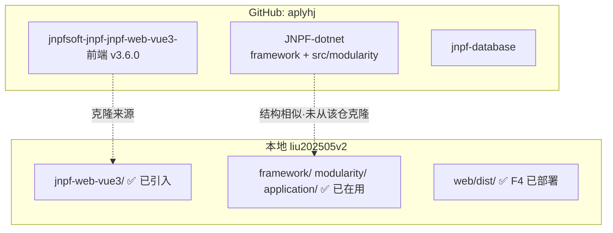

记得。当时克隆的前端来源如下，同一 GitHub 用户下**也有后端仓库**，但是**独立仓库**，不是前后端 monorepo。

---

## 前端克隆来源（我们用的）

| 项               | 内容                                                         |
| ---------------- | ------------------------------------------------------------ |
| **GitHub 地址**  | https://github.com/aplyhj/jnpfsoft-jnpf-jnpf-web-vue3-       |
| **Clone 命令**   | `git clone https://github.com/aplyhj/jnpfsoft-jnpf-jnpf-web-vue3-.git` |
| **所有者**       | [`aplyhj`](https://github.com/aplyhj)                        |
| **本地版本**     | v3.6.0（`jnpf-web-vue3/package.json`）                       |
| **推进清单记录** | LOG-20260522-003                                             |

注意：仓库名末尾有一个 `-`（`jnpfsoft-jnpf-jnpf-web-vue3-`），不是官方 `jnpfsoft/jnpf-web-vue3` 组织仓库，而是 **aplyhj 个人账号下的镜像/开发 fork**。

---

## 有没有后端？有，但是在别的仓库

`aplyhj` 账号下有一整套 JNPF 生态，前后端是**分仓库**的：

### .NET 后端（和你们最相关）

| 仓库            | 地址                                  | 说明                                                         |
| --------------- | ------------------------------------- | ------------------------------------------------------------ |
| **JNPF-dotnet** | https://github.com/aplyhj/JNPF-dotnet | 描述：「此為 JNPF 後端，由 jnpf-backEnd 分離出來做為開發 repo 用」 |
| 目录结构        | `framework/` + `src/`                 | `src/` 下有 `application/`、`modularity/`、`infrastructure/`，和你们 `liu202505v2` **结构很像** |
| SDK             | `src/global.json` → **.NET 6.0**      | 和你们本地 `global.json` 一致                                |
| 分支            | 仅 `master`                           | 最后 push：2025-07-16                                        |

README 里还写了配套关系（前端 `jnpf-web-vue3` v5.2.x-stable 等），说明这是**同一套 JNPF 产品线**，只是版本标签和你们的 v3.6.0 可能不完全对齐。

### 其他后端 / 配套（同账号）

| 类型        | 代表仓库                                                     |
| ----------- | ------------------------------------------------------------ |
| Java 单体   | https://github.com/aplyhj/jnpf-java-boot                     |
| Java 微服务 | https://github.com/aplyhj/jnpf-java-cloud                    |
| 数据库脚本  | https://github.com/aplyhj/jnpf-database                      |
| 多租户后端  | https://github.com/aplyhj/jnpf-tenant                        |
| 工作流      | https://github.com/aplyhj/jnpf-workflow-boot · `jnpf-workflow-core` |
| 报表后端    | https://github.com/aplyhj/jnpf-dotnet-datareport-univer      |
| 运维        | https://github.com/aplyhj/jnpf-ops                           |

完整列表：https://github.com/aplyhj?tab=repositories（搜 `jnpf`）

---

## 和你们当前 `liu202505v2` 的关系



| 对比     | aplyhj 仓库                                 | 你们本地                                                 |
| -------- | ------------------------------------------- | -------------------------------------------------------- |
| 前端     | 独立 repo                                   | ✅ 已从 aplyhj 克隆并对齐 dist                            |
| 后端     | `JNPF-dotnet`（代码在 `src/` 下）           | ✅ 已有完整后端，**来源不是这次 GitHub 克隆**             |
| 目录差异 | `framework/` + `src/application|modularity` | 根目录直接 `framework/` + `modularity/` + `application/` |
| 定制     | 未知                                        | 含 `zxdev/`、`subdev/`、water 禁用、OAuth 修复等         |

**结论**：  
- 前端：**就是**从这个 GitHub 地址克隆的。  
- 后端：**同一个作者有**，在 [`aplyhj/JNPF-dotnet`](https://github.com/aplyhj/JNPF-dotnet)，但你们现在的后端**不是**从那里拉的，而是已有的 `liu202505v2` 工程（结构相近，且有大量本地定制）。  
- **不建议**直接用 GitHub 后端覆盖本地——版本线、定制模块（ZX_Water 等）、已修 bug 都会冲突。

---

## 如果想「看看」GitHub 后端

只读浏览，不覆盖本地：

```bash
git clone --depth 1 https://github.com/aplyhj/JNPF-dotnet.git D:\temp\JNPF-dotnet-aplyhj
```

重点看：
- `src/modularity/` — 模块是否和你们一致  
- `src/application/JNPF.API.Entry/` — 入口配置  
- `framework/JNPF/` — 框架差异  

需要的话我可以帮你在临时目录 clone 后，和 `liu202505v2` 做一版**模块/版本 diff 摘要**（只读对比，不动现有工程）。


后台 **aplyhj 仓库版本扫描** 已完成，核心结果如下：

| 仓库                                                         | package.json 版本 |
| ------------------------------------------------------------ | ----------------- |
| `jnpfsoft-jnpf-jnpf-web-vue3-`（你们现有）                   | **3.6.0**         |
| `jnpfsoft-jnpf-jnpf-web-datascreen-vue3`                     | **3.0.0**         |
| `jnpf-web-monorepo-framework` / `jnpf-web-admin` / `jnpf-web-datascreen` | **6.1.0**         |
| `jnpf-web-bpmn`                                              | **1.1.0**         |

**未发现**任何公开仓库带 `v5.2.x-stable` 分支或 tag；aplyhj 各仓仅有 `master`/`main`。

后续深挖还发现：**v5.2 前端生态在合集仓 `aplyhj/jnpf-webn`** 里（含 `jnpf-web-vue3`、`jnpf-app-vue3`，大屏 `package.json` 为 **5.2.0**），不在你们当前 clone 的 `jnpfsoft-jnpf-jnpf-web-vue3-` 中。

若要继续推进，建议浅 clone 评测：

```bash
git clone --depth 1 https://github.com/aplyhj/jnpf-webn.git D:\temp\jnpf-webn-v52
```

需要的话我可以基于该仓做 **v3.6 vs v5.2 的 FormGenerator / UniApp 结构化 diff**，供升级决策用。