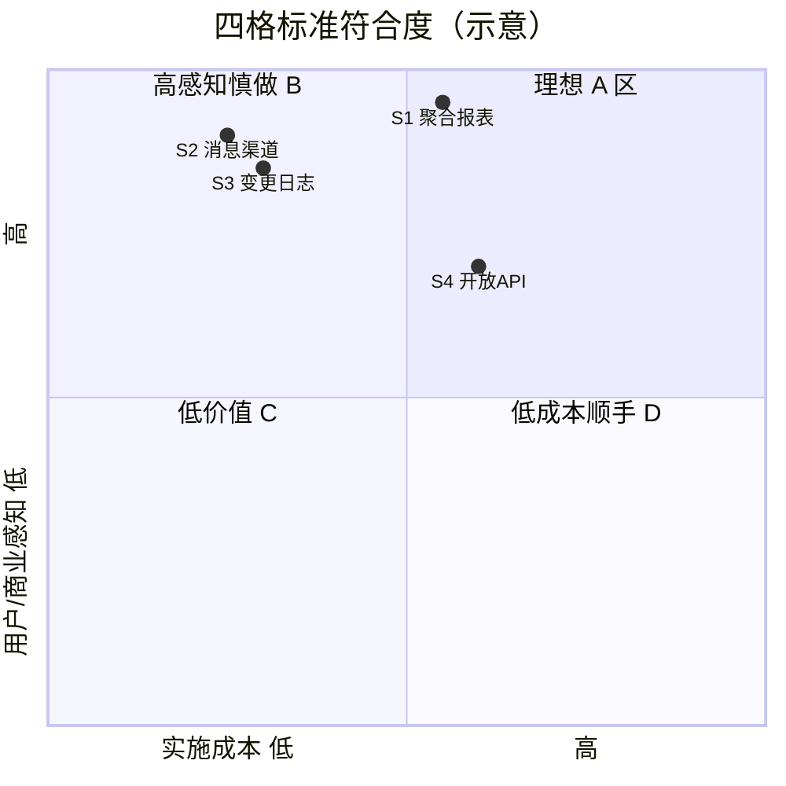

这四个 A-必做项，不是按“技术听起来很酷”筛出来的，而是按你给的 **Q1–Q4 四格标准** 在“已有能力 + 竞品差距 + 二期可落地”三个前提下，从大量候选里筛出来的。下面逐项说明 **为什么重要**，以及 **是否真正符合 Q1–Q4**。

---

## 先说筛选逻辑：什么叫“A-必做”

在审查报告里，**A-必做** 的判定不是“四项全满分”，而是：

| 条件                        | 含义                                    |
| --------------------------- | --------------------------------------- |
| **Q1 或 Q2 至少一项为“高”** | 终端用户能感知，或采购/竞品层面是硬需求 |
| **Q3 不能是“高成本低感知”** | 避免纯技术自嗨                          |
| **整体不能是 C 类**         | 去掉后用户/客户基本无感，或竞品也不做   |

因此，这四个是 **“商业上站得住 + 二期能做成 MVP”** 的应用服务，不是“所有重要功能的前四名”。

---

## 四格对照表（逐项打分）

| 应用服务                 | Q1 用户感知 | Q2 商业痛点 | Q3 成本/收益      | Q4 前置依赖 | 是否符合 A-必做                        |
| ------------------------ | ----------- | ----------- | ----------------- | ----------- | -------------------------------------- |
| **S1 数据聚合/汇总报表** | 🔴 高        | 🔴 高        | 🟡 中投入/高回报   | ✅ 是        | ✅ **强符合**                           |
| **S2 消息渠道补全**      | 🔴 高        | 🔴 高        | 🟢 低投入/高回报   | ✅ 是        | ✅ **强符合**                           |
| **S3 数据变更日志**      | 🔴 高        | 🔴 高        | 🟢 低投入/高回报   | ❌ 否        | ✅ **符合**（靠 Q1+Q2+Q3）              |
| **S4 开放 API 标准化**   | 🟡 中-高     | 🔴 高        | 🟡 中投入/中高回报 | ✅ 是        | ✅ **符合**（偏 B 边缘，但 Q2+Q4 很强） |

---

## 为什么这四个最重要（按 Q1–Q4 展开）

### S1 · 数据聚合/汇总报表 — 四格里最“齐”的一项

**Q1：用户是否直接感知？** ✅ 强符合  
- 终端用户典型话术：“这个月各部门销售额多少？”“工单按状态汇总给我看。”  
- 现在平台主要是 **列表 + Excel 导出**，用户要 **自己透视表**。  
- 去掉它：业务人员和管理者会投诉——“系统只能录数据，不能看汇总”。

**Q2：是否解决真实商业痛点？** ✅ 强符合  
- 低代码采购需求里，**统计/汇总/报表** 几乎总在 Top 清单。  
- 简道云有「聚合表」，明道云/宜搭有分析/报表能力；你们是 **明显空白**，不是小差距。

**Q3：成本收益比？** ✅ 符合（选 MVP 路径）  
- 不做独立 BI/报表引擎，而是基于 **DataInterface + 聚合查询 + ECharts（大屏已有）**，属于 **中等成本、高感知**。  
- 若做完整报表平台 → 会变成 B 类（高感知但成本爆炸），所以报告里明确 **只做聚合 MVP**。

**Q4：是否为前置依赖？** ✅ 是  
- Dashboard、数据大屏、管理看板都需要 **汇总数据源**；没有 S1，大屏只能展示“原始列表”，价值打折。

**结论**：S1 是四个里 **Q1–Q4 最均衡** 的，也是竞品差距最大的 **应用层能力缺口**。

---

### S2 · 消息推送渠道补全 — “流程做了但用户收不到”的典型坑

**Q1：用户是否直接感知？** ✅ 强符合  
- 用户不看 `MessageService` 代码，只看：“审批通过了，钉钉/企微有没有提醒？”  
- 去掉或做不好：投诉非常直接——“系统发了待办，手机没响”。

**Q2：是否解决真实商业痛点？** ✅ 强符合  
- 企业采购低代码时，**钉钉/企微/短信/邮件** 几乎标配。  
- 你们 **消息骨架已有**（`SendMessageService`、`MessageTemplate`、`MessageAccount`），但 **渠道打通不完整**，属于“有半成品、客户验收会卡”的问题。

**Q3：成本收益比？** ✅ 强符合（低成本高感知）  
- 不是从零建消息中心，而是 **补渠道配置、模板、流程联动、失败重试/日志**。  
- 约 1 周量级，用户感知极高——典型 **低成本高感知**。

**Q4：是否为前置依赖？** ✅ 是  
- 流程引擎、Schedule 提醒、S7 数据订阅通知，都依赖 **消息真正送达**。  
- P0-B 里 SignalR 解决 **站内实时**；S2 解决 **站外触达**，二者互补，不是重复。

**结论**：S2 是 **“已有能力补全”**，商业上属于交付必选项，技术上又不是大工程。

---

### S3 · 数据变更日志 — Q4 弱，但 Q1+Q2+Q3 极强

**Q1：用户是否直接感知？** ✅ 强符合  
- 业务场景：“谁改了客户电话？”“合同金额被谁改过？”  
- 管理端详情页若有「变更记录」Tab，用户 **直接可见**；没有则只能查 DBA/导库，体验极差。

**Q2：是否解决真实商业痛点？** ✅ 强符合  
- 内控、审计、纠纷追溯、等保类项目里，**操作/变更留痕** 是常见硬性要求。  
- 简道云、明道云都有类似能力；你们目前主要靠 **BASE_SYS_LOG（API 请求日志）**，**不能回答“某条业务数据的字段级变更”**。

**Q3：成本收益比？** ✅ 强符合  
- SqlSugar AOP + 异步 EventBus 写 **BASE_DATA_CHANGE_LOG**，不必改每个 Service。  
- 后端约 3 天 + 前端 Tab，属于 **低投入、高感知、高合规价值**。

**Q4：是否为前置依赖？** ❌ 否（需诚实说明）  
- 不做 S3，**不会阻断** S1/S2/S4 的实现。  
- 所以它 **不是因 Q4 入选**，而是因 **Q1+Q2+Q3 三项都强**，且竞品已有、你们缺失。

**结论**：S3 仍然符合 A-必做，但依据是 **“用户会投诉 + 采购/审计会问 + 实现便宜”**，不是“别的功能做不了就不行”。

---

### S4 · 开放 API 标准化 — Q1 相对弱，Q2+Q4 很强

**Q1：用户是否直接感知？** 🟡 中-高（要分角色）  
- **普通业务员工**：日常填表，对 Open API **感知弱**。  
- **IT 集成人员、甲方信息部、ISV**：感知 **很强**——“能不能和 ERP/HR/OA 对接？”  
- 去掉它：终端员工可能不投诉，但 **项目验收方/采购决策人会投诉**。

**Q2：是否解决真实商业痛点？** ✅ 强符合  
- 低代码平台卖进企业后，**第二阶段几乎必谈集成**。  
- 你们有 `DataInterfaceService`、`InterfaceOauthService`，但 **入口分散、规范不统一、对外文档/鉴权/限流未成体系**，售前/demo 时容易被问住。

**Q3：成本收益比？** 🟡 中等  
- 比 S2/S3 重（约 1.5 周），收益主要在 **项目交付和续约**，不是每天点按钮的爽感。  
- 若只做 **统一网关 + OAuth + 标准 REST 规范 + Swagger 分组**，仍可控；若做完整 API 市场 → 应降为 B。

**Q4：是否为前置依赖？** ✅ 是  
- 外部系统推数、拉数、Webhook 回调、后续 S7 订阅通知，都需要 **稳定、可文档化的 API 面**。  
- 没有 S4，集成永远停留在“项目定制”，难产品化。

**结论**：S4 是四个里 **Q1 最弱的一项**，仍进 A，主要是因为 **Q2（集成是采购核心项）+ Q4（生态/集成底座）**；若只按“终端员工 Q1”排，它可能排在 S1/S2/S3 之后。

---

## 为什么不是别的功能？（对照四格，说明“没进 A”的原因）

| 候选能力                    | 未进 A 的主要原因（相对四格）                                |
| --------------------------- | ------------------------------------------------------------ |
| 评论/协作 S5                | Q1/Q2 高，但 **Q3 成本高** → B（找 MVP）                     |
| 应用模板市场 S6             | Q2 高，但 **Q3 内容生产成本高** → B                          |
| 条件格式/高亮               | **Q1/Q2 低** → C                                             |
| 多语言 i18n                 | **Q1/Q2 对当前客户低** → C                                   |
| 全文搜索 ES                 | **Q3 高成本低感知（当前数据量）** → C                        |
| 流程/门户/打印/单据号       | **已实现**，文档遗漏 ≠ 二期新建 → 应 **补文档/补缺陷**，不是新 A 项 |
| P0 安全/SignalR/Schedule/AI | 属 **核心框架/横切**，已在 P0 施工包，与“应用服务 A 四项”分层不同 |

---

## 总判断：这四个是否“符合”你的四格标准？

**整体结论：符合，但符合方式不完全一样。**

- **S1、S2**：Q1–Q4 四项都站得住，是最标准的 A。  
- **S3**：Q4 不成立，但 Q1+Q2+Q3 足够强，仍属 A（合规/追溯类能力的常见入选方式）。  
- **S4**：Q1 对普通员工偏弱，靠 Q2+Q4 进 A；若你们客户 **几乎不做系统集成**，应把它 **降为 B 或合并进 DataInterface 增强**。

---

## 若要用四格做更严格的“一票否决”

若你要求 **四项必须 Q1/Q2 均为高，且 Q4 至少一项为是**，则建议调整为：

| 严格 A（3 项） | 调整                                      |
| -------------- | ----------------------------------------- |
| S1 聚合报表    | 保留                                      |
| S2 消息渠道    | 保留                                      |
| S3 变更日志    | 保留（即使 Q4=否）                        |
| S4 开放 API    | **降为 A- 或 B+**（视客户是否以集成为主） |

若你的二期客户 **以内部 OA/表单为主、很少对接外部系统**，S4 可以后移；**S1 + S2 + S3** 仍是终端用户和采购侧最稳的三项。

---

如果你愿意，我可以按你们 **实际目标客户画像**（偏内部 OA / 偏 ERP 集成 / 偏审计合规）把这四项重新打一次分，并给出 **严格四格版** 的最终优先级排序。