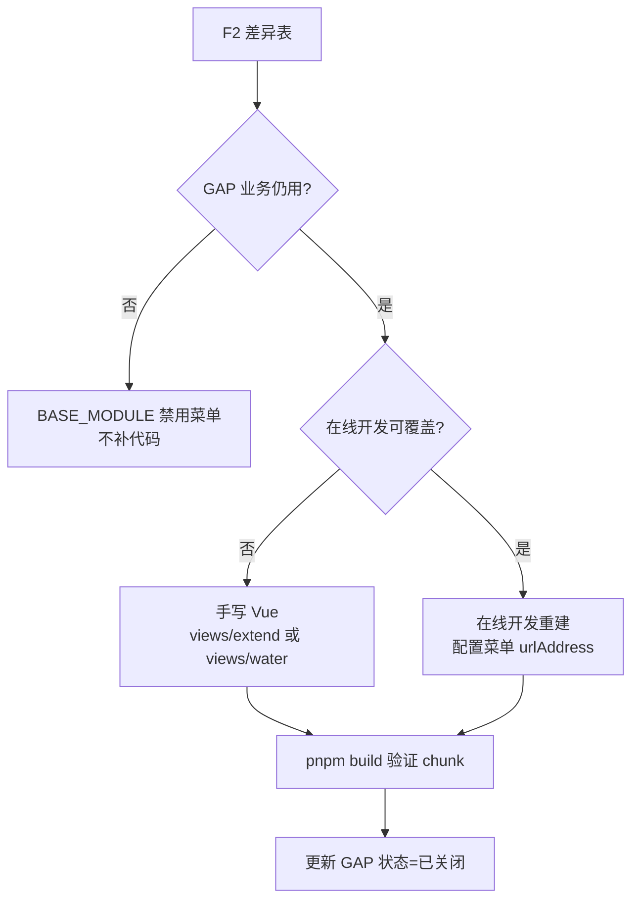
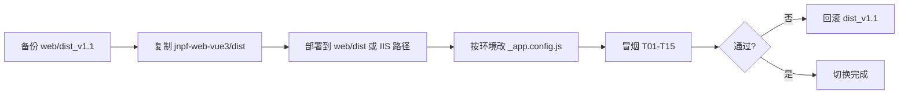

# 前端项目整理 — 开发计划与施工包

> **文档版本**：v1.1（架构师审核后修订）  
> **状态**：**执行中**（F1 构建已通过；water 待 DBA 执行 SQL）  
> **适用范围**：`jnpf-web-vue3/`、`web/dist_v1.1/`、部署 Nginx/IIS 静态资源  
> **对应方案**：[`../1、迭代方案/1、第一次整理意见.md`](../1、迭代方案/1、第一次整理意见.md)（dist 为真理之源）  
> **关联内参**：[`docs/architecture/04-application-frontend-deep-dive.md`](../../../../architecture/04-application-frontend-deep-dive.md)  
> **预估工期**：**约 3 人日**（非原 19 GAP 大工程）

---

## 0. 架构师决策摘要（2026-05-22）

| 项 | 决策 |
|----|------|
| 真实 GAP | 审计 19 项 → 修正后 **2 项待补** + 若干关闭/移除 |
| GAP-01 water | **移除**（后端无 ZX_Water Service，补前端也跑不通）→ 执行 [`scripts/sql/disable-water-menus.sql`](../../../../../../scripts/sql/disable-water-menus.sql) |
| GAP-02 printDevH5 | **暂不处理**，等测试环境确认 |
| GAP-03 | CustomBatchForm / ExtendForm **已补**；ChildrenList → 关闭（重命名为 ChildTableColumn） |
| GAP-04 | VersionHistory → 关闭（源码已有 VersionManage.vue） |
| GAP-05 | dataInterface Log 页 → **待 diff**（暂不补） |
| GAP-06/07 | 关闭（.tsx 假阳性，源码已存在） |
| 源码页数 | **327**（325 `.vue` + 2 `.tsx`），非 325 |

**执行顺序**：① 清 water 菜单 → ② 已补 2 页面 → ③ env + build + 冒烟 → ④ 文档收尾

---

## 0.1 阶段代号（简化）

| 顺序 | 代号 | 名称 | 状态 |
|------|------|------|------|
| 1 | **F0** | dist 审计收口 + water 决策 | ✅ 审计完成；water 决策=移除 |
| 2 | **F1** | 环境对齐 + 首次可构建 | ✅ `pnpm build` 零 ERROR（2026-05-22） |
| 3 | **F2** | 构建产物 + 功能对等验证 | ☐ 待冒烟 |
| 4 | **F3** | 仅补 2 个 Vue（CustomBatchForm/ExtendForm） | ✅ 已实施 |
| 5 | **F4** | 部署切换与回滚预案 | ☐ P0 冒烟通过后 |

### 0.2 核心原则（架构师已定，施工包强制执行）

| # | 原则 | 施工含义 |
|---|------|----------|
| P1 | **dist 为真理之源** | `web/dist_v1.1` 是生产验证过的标准；GitHub 源码是工程基座，须向 dist 对齐 |
| P2 | **四象限处置** | dist有+源码有→保留；dist有+源码无→待补；dist无+源码有→隐藏菜单（当前为 0）；禁止无证据删文件 |
| P3 | **基座不删引擎依赖** | echarts/xlsx/tinymce/logicflow/monaco 等 dist 已用库 **禁止** 从 `package.json` 移除 |
| P4 | **env 完整对齐** | 使用 `jnpf-web-vue3/.env.production.dist-v1.1.template`，禁止仅保留 CDN/压缩两项 |
| P5 | **低代码优先补业务** | 待补功能优先在线开发；强 UI 定制再手写 Vue，放在 `views/extend/` 或 `views/water/` |
| P6 | **dist_v1.1 保留** | 作为基准包与回滚包，P0 全绿前 **不覆盖** |

### 0.3 禁止项（违反即施工包不合格）

1. 删除 `echarts`、`xlsx`、`tinymce`、`@logicflow/*`、`monaco-editor` 等框架依赖。  
2. 精简 `.env.production` 导致 `_app.config.js` 缺少 API/WS 地址。  
3. 删除未 grep 到的假想文件（如 `utils/water-*`、`waterModuleEnabled`——**源码中不存在**）。  
4. 物理删除 `views/extend/`（dist 含 **80** 页 extend，生产在用）。  
5. 修改 JNPF 标准目录约定（如新建 `views/custom/` 并改代码生成器路径）。  
6. 用未测量的「首屏体积 ↓60%」作为验收指标。

### 0.4 本节关键路径索引

| 路径 | 说明 |
|------|------|
| `web/dist_v1.1/` | 生产基准 dist |
| `web/dist_v1.1/_app.config.js` | 运行时 API/WS/标题 |
| `web/dist_v1.1/static/js/index-f8698ae9.js` | 主 bundle（路由/HTTP/Store） |
| `jnpf-web-vue3/` | 正式前端工程根 |
| `jnpf-web-vue3/.env.production.dist-v1.1.template` | 生产 env 模板 |
| `docs/architecture/dist-src-audit.json` | 页面对照审计 JSON |

### 0.5 本节核心表清单

| 表名 | 施工用途 |
|------|----------|
| **BASE_MODULE** | 菜单树；动态路由 `urlAddress` 来源；隐藏/启用页面 |
| **BASE_AUTHORIZE** | 按钮权限；与 `v-auth` / `permissionList` 对齐 |

---

## 1. 总览：审计结论摘要

> 数据来源：2026-05-22 对 `web/dist_v1.1/static/js/*.js` 与 `jnpf-web-vue3/src/views` 的自动化对照（见 [`02-dist源码对照矩阵.md`](02-dist源码对照矩阵.md)）。

| 指标 | dist_v1.1 | jnpf-web-vue3 源码 | 结论 |
|------|-----------|-------------------|------|
| views 页面路径数 | **344** | **327**（325 vue + 2 tsx） | 源码无多余页面 |
| 双方共有页面 | 325 | 325 | **全部保留** |
| dist 独有（真实待处理） | **17** 审计项 | — | 2 待补 + 1 移除 + 其余关闭/暂缓 |
| 源码独有页面 | 0 | — | **无候选物理删除项** |
| extend 模块 | **80 页** | 79 页 | **必须保留** |
| water 模块 | **9 页** | 0 | **移除**（禁用菜单，不补源码） |

---

## 2. 阶段 F0：dist 审计收口（0.5–1 天）

### 2.1 目标

在修改源码或构建前，完成「dist 真理清单」并获架构师/业务签字。

### 2.2 任务清单

| 任务 ID | 内容 | 操作 | 产出 |
|---------|------|------|------|
| F0-1 | 页面路径对照 | 已执行脚本；见 `dist-src-audit.json` | [`02-dist源码对照矩阵.md`](02-dist源码对照矩阵.md) |
| F0-2 | 依赖/白名单标记 | dist 命中：echarts/xlsx/tinymce/logicflow/monaco；`printDevH5` 白名单 | 矩阵 §3 |
| F0-3 | API 路径扫描 | dist 内 **505** 条 `/api/*`；含 `/api/ZX_Water/*` | 矩阵 §4 |
| F0-4 | **菜单启用状态** | 查 **BASE_MODULE** 或运行 dist 登录后导出 `CurrentUser.menuList` | 矩阵「菜单启用」列填完 |
| F0-5 | **water 移除** | 执行 `scripts/sql/disable-water-menus.sql` 禁用 BASE_MODULE 中 water 菜单 | DBA/运维 |

#### F0-4 菜单导出（推荐 SQL）

```sql
-- 查 urlAddress 含 water / printDevH5 的菜单
SELECT Id, FullName, EnCode, UrlAddress, Type, EnabledMark, DeleteMark
FROM BASE_MODULE
WHERE (UrlAddress LIKE '%water%' OR UrlAddress LIKE '%printDevH5%')
  AND DeleteMark IS NULL;
```

#### F0-4 备选：运行时导出

1. 启动 `JNPF.API.Entry`（`:5000`）。  
2. 用 dist 或 dev 前端登录。  
3. 抓取 `GET /api/oauth/CurrentUser?systemCode=` 响应中的 `menuList`，保存 JSON。

### 2.3 验收标准

- [ ] [`02-dist源码对照矩阵.md`](02-dist源码对照矩阵.md) 19 行 dist 独有条目均已标注「菜单是否启用」  
- [ ] GAP-01（water）业务状态已签字：在用 / 废弃 / 待定  
- [ ] 架构师在本文档 §8 签字区批准进入 F1  

### 2.4 本节关键代码路径索引

| 路径 | 方法/说明 |
|------|-----------|
| `modularity/oauth/JNPF.OAuth/OAuthService.cs` | `GetCurrentUser()` → `menuList` |
| `modularity/system/JNPF.Systems/System/ModuleService.cs` | `GetUserModuleListByIds()` 【待源码验证具体行号】 |
| `jnpf-web-vue3/src/router/guard/permissionGuard.ts` | `createPermissionGuard()` |
| `jnpf-web-vue3/src/router/helper/routeHelper.ts` | `transformObjToRoute()` |

---

## 3. 阶段 F1：环境对齐 + 首次可构建（1 天）

### 3.1 目标

`jnpf-web-vue3` 在标准化 env 下 **pnpm build 零 ERROR**，产出可部署的 `dist/`。

### 3.2 环境对齐（施工步骤）

| 步骤 | 文件 | 动作 |
|------|------|------|
| F1-1 | `jnpf-web-vue3/.env` | 确认 `VITE_GLOB_APP_TITLE = 智轩云`（已对齐 dist） |
| F1-2 | `jnpf-web-vue3/.env.production` | `Copy-Item .env.production.dist-v1.1.template .env.production` |
| F1-3 | `jnpf-web-vue3/.env.development` | 保持 `VITE_PROXY = [["/dev","http://localhost:5000"]]` |
| F1-4 | `package.json` | **不修改** dependencies（禁止删 echarts/xlsx 等） |

**`.env.production` 关键项（与 dist_v1.1 对齐）**

| 变量 | 值 | 依据 |
|------|-----|------|
| `VITE_CDN` | **`false`（架构师裁定）** | DevTest/内网/F4 **必须 false**；依赖打进 chunk。dist_v1.1 历史为 true+bootcdn，已证实部分 CDN 404 |
| `VITE_GLOB_API_URL` | `http://localhost:5000` | dist `_app.config.js` |
| `VITE_GLOB_WEBSOCKET_URL` | `ws://localhost:5000` | 同上 |
| `VITE_BUILD_COMPRESS` | `'gzip'` | dist 产物形态 |
| `VITE_DROP_CONSOLE` | `true` | 生产包 |

### 3.3 构建命令

```powershell
cd d:\JNPF-v52\jnpf-web-vue3
pnpm install --registry=https://registry.npmmirror.com
Copy-Item .env.production.dist-v1.1.template .env.production -Force
pnpm build
```

### 3.4 构建产物检查

| 检查项 | 预期 |
|--------|------|
| 控制台 | **0 ERROR** |
| `dist/_app.config.js` | 含 `智轩云`、`jnpf`、API/WS 地址 |
| `dist/index.html` | 含 bootcdn 的 Vue/Router/Pinia/Axios |
| `dist/static/js/*.js` | 存在 `[name]-[hash].js` 分 chunk |
| 与 dist_v1.1 对比 | **尚无** water chunk（预期，待 F3 补） |

### 3.5 开发冒烟（F1 结束前）

```powershell
pnpm dev
# 浏览器访问终端提示端口（默认 3100），API 走 /dev → :5000
```

| 用例 | 预期 |
|------|------|
| 登录 | `POST /api/oauth/Login` 成功 |
| 动态菜单 | `GET /api/oauth/CurrentUser` 返回 menuList |
| 用户列表 | `views/permission/user` 可打开 |

### 3.6 验收标准

- [ ] `pnpm build` 零 ERROR  
- [ ] `pnpm dev` 可登录并打开至少 3 个系统管理页  
- [ ] **未** 删除任何 `package.json` 依赖  

---

## 4. 阶段 F2：功能对等验证（1 天）

### 4.1 目标

对照 `web/dist_v1.1` 的能力清单，填写 [`03-GAP待补清单与功能对等验收表.md`](03-GAP待补清单与功能对等验收表.md)，明确「已通过 / 待补 / 已废弃」。

### 4.2 验证环境

| 项 | 说明 |
|----|------|
| 旧基准 | 静态挂载 `web/dist_v1.1/`（或现网） |
| 新构建 | 静态挂载 `jnpf-web-vue3/dist/`（**并存**，不覆盖 v1.1） |
| 后端 | 同一 `JNPF.API.Entry` 实例 |

### 4.3 平台冒烟清单（必须全部执行）

| ID | 场景 | 验证页面/能力 | dist | 新 build |
|----|------|---------------|------|----------|
| T01 | 登录/退出 | `/login` | ☐ | ☐ |
| T02 | 用户管理 | `permission/user` | ☐ | ☐ |
| T03 | 角色授权 | `permission/role` | ☐ | ☐ |
| T04 | 菜单管理 | `system/menu` | ☐ | ☐ |
| T05 | 数据字典 | `systemData/dictionary` | ☐ | ☐ |
| T06 | 在线开发-表单 | `onlineDev/*` | ☐ | ☐ |
| T07 | 代码生成 | `generator/*` | ☐ | ☐ |
| T08 | 工作流设计 | `workFlow/flowEngine` | ☐ | ☐ |
| T09 | Excel 导入 | 用户导入 Modal + `components/Excel` | ☐ | ☐ |
| T10 | Excel 导出 | 列表导出 + `xlsx` | ☐ | ☐ |
| T11 | 图表 Demo | `extend/graphDemo/echartsBar` | ☐ | ☐ |
| T12 | 富文本 | 在线开发 Tinymce 控件 | ☐ | ☐ |
| T13 | 打印模板 | `system/printDev` | ☐ | ☐ |
| T14 | 消息中心 | `msgCenter/*` | ☐ | ☐ |
| T15 | 门户/报表 runtime | `common/dynamicPortal` 等 | ☐ | ☐ |

### 4.4 dist 独有 GAP 预期（新 build 初始应失败项）

| GAP ID | 功能 | dist | 新 build（F2 预期） |
|--------|------|------|---------------------|
| GAP-01 | water 9 页 | 有 | **无**（待 F3） |
| GAP-02 | printDevH5 | 有 | **无**（待 F3） |
| GAP-03 | CustomBatchForm / ExtendForm | 有 | **无** |
| GAP-04 | VersionHistory | 有 | **无** |
| GAP-05 | dataInterface Log 页 | 有 | 待 diff |
| GAP-06 | formDemo schemaData.tsx | 有 | **无** |
| GAP-07 | error-log data.tsx 等 | 有 | 待 diff |

> **说明**：F2 的目标不是「一次 build 全绿」，而是 **用差异表驱动 F3**。

### 4.5 验收标准

- [ ] [`03-GAP待补清单与功能对等验收表.md`](03-GAP待补清单与功能对等验收表.md) T01–T15 已填写  
- [ ] 所有 GAP 条目已标 P0/P1/P2/废弃  
- [ ] 架构师确认 F3 范围  

---

## 5. 阶段 F3：GAP 修补（按需，3–10 人日）

### 5.1 修补总流程



### 5.2 GAP-02：printDevH5（P1，约 0.5 天）

**dist 证据**：`system/printDevH5/index.vue`、`Preview.vue`；主 bundle 白名单 `printDevH5`。

| 步骤 | 文件 | 动作 |
|------|------|------|
| F3-02-1 | `jnpf-web-vue3/src/enums/pageEnum.ts` | 增加 `BASE_PRINT_DEV_H5 = '/printDevH5'` |
| F3-02-2 | `jnpf-web-vue3/src/router/guard/permissionGuard.ts` | `whitePathList` 加入 `PRINT_DEV_H5` |
| F3-02-3 | `jnpf-web-vue3/src/views/system/printDevH5/` | 新建 `index.vue`、`Preview.vue`（参考 dist chunk API，**重写**非复制 min.js） |
| F3-02-4 | — | `pnpm build` 后 dist 含 printDevH5 路由 |

**验收**：无 Token 可访问 `/printDevH5`；打印预览 API 与 dist 行为一致。

### 5.3 GAP-03：dynamicModel 扩展表单（P1，约 1 天）

**dist 证据**：

- `common/dynamicModel/list/CustomBatchForm.vue`
- `common/dynamicModel/list/ExtendForm.vue`

| 步骤 | 动作 |
|------|------|
| F3-03-1 | 从 dist chunk 提取调用的 API 与 props 约定 |
| F3-03-2 | 在 `jnpf-web-vue3/src/views/common/dynamicModel/list/` 补两个 SFC |
| F3-03-3 | 确认在线开发 runtime 引用路径与 `routeHelper` 动态 import 一致 |

**验收**：在线开发列表页批量表单/扩展表单功能与 dist 一致。

### 5.4 GAP-01：water 水务模块（P0/P1 待定，约 3–5 天）

**dist 证据**：9 页 + `/api/ZX_Water/Area|Customer|Payment/*` + chunk `Bill-e217bf5e.js`。

**阻塞**：本仓库 `modularity/` **未检索到** `ZX_Water` Service——须架构师确认：

- 后端是否在其它分支/仓库；或  
- 业务已废弃，仅 dist 残留；或  
- 需同步新建后端模块 + 前端。

| 步骤 | 动作 |
|------|------|
| F3-01-0 | 业务 + 后端联合确认（**门禁**） |
| F3-01-1 | 若在用：优先评估 **在线开发** 能否覆盖 CRUD |
| F3-01-2 | 若需手写：按 [`docs/architecture/water-module-from-dist.md`](../../../../architecture/water-module-from-dist.md) 建 `src/views/water/**` |
| F3-01-3 | 菜单 **BASE_MODULE** `urlAddress` 与页面对齐 |
| F3-01-4 | `pnpm build` 验证 dist 出现 `views/water` 相关 chunk |

**验收**：water 菜单可打开；API 200；与 dist_v1.1 功能对等。

### 5.5 GAP-04～07（P2/P3）

| GAP | 路径 | 建议工期 |
|-----|------|----------|
| GAP-04 | `workFlow/flowEngine/VersionHistory.vue` | 0.5 天 |
| GAP-05 | `systemData/dataInterface/LogDetail.vue`、`log.vue` | 0.5 天（可能与源码命名合并） |
| GAP-06 | `extend/formDemo/fieldForm1/schemaData.tsx` | 0.25 天 |
| GAP-07 | `basic/error-log/data.tsx` 等 | 0.25 天 |

每项关闭条件：`pnpm build` 含对应 lazy chunk + 菜单页冒烟通过。

### 5.6 本节核心表清单

| 表名 | 字段 | GAP 施工 |
|------|------|----------|
| **BASE_MODULE** | UrlAddress, Type, EnabledMark | 菜单指向补完后的页面 |
| **BASE_AUTHORIZE** | ItemType, ObjectId | 按钮 `v-auth` 对齐 |

---

## 6. 阶段 F4：部署切换（0.5 天）

### 6.1 前置条件

- [ ] F3 中所有 **P0** GAP 状态 = 已关闭  
- [ ] T01–T15 新 build 列全部 ☐→☑  
- [ ] 架构师签字批准切换  

### 6.2 切换步骤



| 步骤 | 命令/动作 |
|------|-----------|
| F4-1 | `Copy-Item -Recurse web/dist_v1.1 web/dist_v1.1.bak-YYYYMMDD` |
| F4-2 | 将 `jnpf-web-vue3/dist/*` 部署到目标静态目录 |
| F4-3 | 修改部署目录 `_app.config.js` 中生产 API/WS |
| F4-4 | 执行 T01–T15 |
| F4-5 | 保留 `dist_v1.1.bak` 至少一个发布周期 |

### 6.3 回滚预案

| 触发 | 动作 | RTO |
|------|------|-----|
| 登录失败 / 核心菜单不可用 | 恢复 `dist_v1.1.bak` | ≤ 15 分钟 |
| 单个 GAP 页异常 | **BASE_MODULE** 禁用该菜单；整体不回滚 | — |

---

## 7. 依赖与工具链

| 项 | 要求 |
|----|------|
| Node.js | ≥ 16.15.0 |
| pnpm | ≥ 8.1.0 |
| 后端 | `JNPF.API.Entry` @ `:5000` |
| 浏览器 | Chrome 90+ |
| 可选 | `rg` / PowerShell `Select-String` 做硬引用扫描 |

**硬引用扫描（F3 每补一项后执行）**

```powershell
cd d:\JNPF-v52\jnpf-web-vue3
rg "views/water|printDevH5|CustomBatchForm" src --glob "*.{ts,vue,tsx}"
```

---

## 8. 架构师审核签字区

| 项 | 确认（☐/☑） | 签字 | 日期 |
|----|-------------|------|------|
| 同意「dist 为真理之源」原则 | ☐ | | |
| F0 菜单/water 业务结论 | ☐ | | |
| F1–F2 可启动 | ☐ | | |
| F3 GAP 范围（P0/P1/P2） | ☐ | | |
| F4 切换条件 | ☐ | | |

**审核意见**：

---

## 9. 附录：dist 审计核心数据（2026-05-22）

| 模块 | dist 页数 | 源码页数 | 处置 |
|------|-----------|----------|------|
| extend | 80 | 79 | 保留 |
| system | 50 | 48 | 保留 + GAP-02 等 |
| workFlow | 44 | 43 | 保留 + GAP-04 |
| basic | 33 | 32 | 保留 |
| permission | 31 | 31 | 保留 |
| systemData | 30 | 28 | 保留 + GAP-05 |
| common | 22 | 19 | 保留 + GAP-03 |
| msgCenter | 21 | 21 | 保留 |
| onlineDev | 18 | 18 | 保留 |
| generator | 6 | 6 | 保留 |
| **water** | **9** | **0** | **GAP-01 待补/废弃** |

**dist 独有 19 路径完整列表**：见 [`02-dist源码对照矩阵.md`](02-dist源码对照矩阵.md) §2。

---

**文档维护**：F0 完成后更新矩阵「菜单启用」列；F2 完成后更新 GAP 验收表；F4 完成后在 `docs/architecture/README.md` 增加前端施工完成记录。
