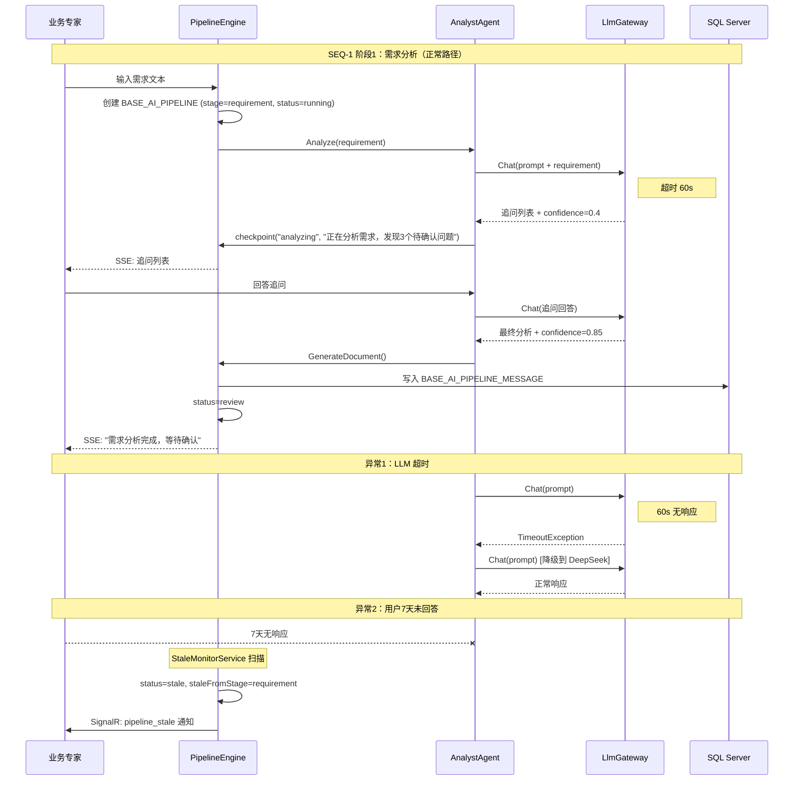

## 立即全面加速——两天完工计划

当前剩余工作全部列出，按小时级粒度分配，高级架构师今晚就开始执行。

---

### 第一天（今天）——代码收尾 + 文档冲刺

**上午：P2 前端组件 + DDL 执行**

| 时间        | 任务                        | 产出                   | 验收标准                                    |
| ----------- | --------------------------- | ---------------------- | ------------------------------------------- |
| 09:00-10:30 | 执行 DDL 迁移脚本           | 数据库表变更生效       | `SELECT * FROM BASE_AI_PIPELINE` 新字段可查 |
| 09:00-11:00 | IR Diff Viewer 组件开发     | `IRDiffViewer.vue`     | props 接收 IREditPatch + 三栏布局渲染       |
| 11:00-12:00 | Pipeline SSE Panel 组件开发 | `PipelineSSEPanel.vue` | SSE 连接 + Agent 思考过程实时渲染           |

**下午：SandboxManager 对接 + 文档 §7 §9**

| 时间        | 任务                        | 产出                                    | 验收标准                             |
| ----------- | --------------------------- | --------------------------------------- | ------------------------------------ |
| 13:00-14:00 | SandboxManager 对接 abandon | `DestroyAssociatedSandboxIfExists` 实现 | abandon 调用后沙箱状态变为 destroyed |
| 14:00-16:00 | §7 时序图输出               | 10 张 mermaid 时序图                    | 每阶段 1 正常 + 2 异常分支           |
| 16:00-18:00 | §9 权限模型输出             | 4 角色权限矩阵 + 多租户 DDL 迁移方案    | 角色×接口权限表 + 迁移回滚 SOP       |

**晚上：文档 §10 §11 §12**

| 时间        | 任务               | 产出                                           | 验收标准                     |
| ----------- | ------------------ | ---------------------------------------------- | ---------------------------- |
| 19:00-20:30 | §10 非功能设计输出 | 性能/安全/可观测性指标表                       | 每项有量化目标 + 验收方式    |
| 20:30-21:30 | §11 测试设计输出   | 评测基准 50 条 + 越权 10 条 + 分治编辑测试用例 | 每个测试用例有输入/预期/判定 |
| 21:30-22:00 | §12 验收检查表输出 | M0-M5 + FM0-FM4 全检查表                       | 每项有验收标准 + 当前状态    |

---

### 第二天（明天）——集成联调 + 全量验证

| 时间        | 任务                                 | 产出                                             | 验收标准                    |
| ----------- | ------------------------------------ | ------------------------------------------------ | --------------------------- |
| 09:00-10:00 | 前端组件接入"我的项目"页面           | PipelineManager.vue 集成 IRDiffViewer + SSEPanel | 页面可渲染                  |
| 10:00-12:00 | 6 个裁决书接口 Swagger 联调          | 全部接口返回正确响应                             | 每个接口 200/202 + 正确数据 |
| 13:00-14:00 | 全量后端编译验证                     | `dotnet build` 0 errors                          | 无新增编译错误              |
| 14:00-15:00 | 全量前端编译验证                     | `vue-tsc --noEmit` 0 errors + `eslint` 0 errors  | 无新增错误                  |
| 15:00-16:00 | 83 项 vitest 现有测试 + 新增测试全跑 | 全部通过                                         | 0 failures                  |
| 16:00-17:00 | 文档终审自检                         | 三份文档全量检查                                 | 无遗留 TODO、无孤儿 ARC/FR  |

---

### 高级架构师立即执行指令

#### 指令 1：P2 前端组件（现在开始）

**IRDiffViewer.vue** — 三栏布局：

```vue
<template>
  <div class="ir-diff-viewer">
    <!-- 左栏：编辑前 -->
    <div class="diff-panel left">
      <h4>修改前</h4>
      <IRPreview :ir="originalIr" :highlight="removedNodes" />
    </div>
    
    <!-- 中栏：变更列表 -->
    <div class="diff-panel center">
      <h4>变更详情</h4>
      <div class="diff-summary">
        <span class="added">+{{ diffSummary.added }}</span>
        <span class="modified">~{{ diffSummary.modified }}</span>
        <span class="removed">-{{ diffSummary.removed }}</span>
      </div>
      <div class="diff-operations">
        <DiffOperationItem 
          v-for="op in patch.operations" 
          :key="op.path"
          :operation="op"
          :status="getOperationStatus(op)"
        />
      </div>
      <div class="diff-actions">
        <el-button type="primary" @click="$emit('accept')">接受全部</el-button>
        <el-button @click="$emit('review')">逐条审核</el-button>
        <el-button type="danger" @click="$emit('rollback')">全部撤销</el-button>
      </div>
    </div>
    
    <!-- 右栏：编辑后 -->
    <div class="diff-panel right">
      <h4>修改后</h4>
      <IRPreview :ir="patchedIr" :highlight="addedNodes" />
    </div>
  </div>
</template>
```

**PipelineSSEPanel.vue** — 实时事件流：

```vue
<template>
  <div class="sse-panel">
    <div class="sse-header">
      <span>阶段: {{ currentStage }}</span>
      <el-progress :percentage="progress" />
    </div>
    <div class="sse-events" ref="eventContainer">
      <div v-for="event in events" :key="event.timestamp" 
           :class="['sse-event', eventClass(event)]">
        <span class="agent-name">{{ event.agent }}</span>
        <span class="elapsed">[{{ formatMs(event.elapsed_ms) }}]</span>
        <span class="thought">{{ event.thought }}</span>
        <el-button v-if="event.timeout_alert" size="small" type="danger"
                   @click="$emit('skip-agent', event.agent)">
          跳过此智能体
        </el-button>
      </div>
    </div>
  </div>
</template>

<script setup lang="ts">
// SSE 连接逻辑
const connectSSE = (pipelineId: number) => {
  const source = new EventSource(`/api/pipeline/${pipelineId}/events`);
  
  source.addEventListener('checkpoint', (e) => {
    const event: PipelineSSEEvent = JSON.parse(e.data);
    events.value.push(event);
    progress.value = event.progress;
    scrollToBottom();
  });
  
  source.addEventListener('warning', (e) => {
    const event = JSON.parse(e.data);
    events.value.push({ ...event, isWarning: true });
  });
  
  source.addEventListener('timeout', (e) => {
    const event = JSON.parse(e.data);
    events.value.push({ ...event, isTimeout: true });
  });
  
  source.onerror = () => {
    // 自动重连逻辑
    setTimeout(() => connectSSE(pipelineId), 3000);
  };
};
</script>
```

#### 指令 2：SandboxManager abandon 对接（现在开始）

在 `PipelineOrchestratorService.AbandonAsync` 中，将空实现替换为：

```csharp
private async Task DestroyAssociatedSandboxIfExists(long pipelineId, string tenantId)
{
    var sandbox = await _db.Queryable<SandboxEntity>()
        .Where(x => x.F_PIPELINE_ID == pipelineId && x.F_STATUS == "running")
        .FirstAsync();
    
    if (sandbox != null)
    {
        await _sandboxManager.DestroyAsync(sandbox.F_CONTAINER_ID);
        sandbox.F_STATUS = "terminated";
        sandbox.F_TERMINATED_AT = DateTime.Now;
        sandbox.F_TERMINATED_REASON = "pipeline_abandoned";
        await _db.Updateable(sandbox).ExecuteCommandAsync();
    }
}
```

#### 指令 3：§7 时序图（现在开始，10 张）

以下是 10 张时序图的结构定义，高级架构师按此用 mermaid 语法写出：

| 编号   | 场景              | 正常路径                                           | 异常路径 1                           | 异常路径 2                        |
| ------ | ----------------- | -------------------------------------------------- | ------------------------------------ | --------------------------------- |
| SEQ-1  | 阶段 1 需求分析   | 用户输入→AnalystAgent→追问→confidence≥0.8→生成文档 | LLM 超时→降级链切换→重试             | 用户 7 天未回答→stale             |
| SEQ-2  | 阶段 2 架构设计   | 需求+EAB→ArchitectAgent→输出架构文档               | 开发者否决→reject→回退               | 3 轮否决→升级管理员               |
| SEQ-3  | 阶段 3 总体设计   | 编排→3 SubAgent 并行→合并 IR                       | 某 SubAgent 失败→重试→仍失败→partial | IR 校验失败→自修复→仍失败→blocked |
| SEQ-4  | 阶段 4 自动开发   | IR→编译→沙箱部署→测试 URL                          | 编译失败→回退 stage3                 | 沙箱创建失败→OOM→等待释放         |
| SEQ-5  | 阶段 5 交付       | 沙箱验收→申请部署→管理员审批→生产部署              | 管理员否决→回退 stage4               | 部署失败→自动回滚                 |
| SEQ-6  | 分治编辑全流程    | 定位→Agent 路由→切片→编辑指令→applyPatch→验证      | LLM 定位 confidence<0.6→用户确认     | 编辑指令超出 scope→拒绝           |
| SEQ-7  | 知识补丁注入      | 熔炉导出→创始人上传→签名校验→影子测试→合并         | 签名验证失败→拒绝                    | 影子测试失败→转创始人审核         |
| SEQ-8  | 沙箱生命周期      | 创建→部署→测试→销毁                                | 创建超时→30s 强制终止                | 服务重启→从 DB 恢复状态           |
| SEQ-9  | 校验链异步流程    | approve→validating→Hangfire→SSE→通过/失败          | 30s 超时→timeout 事件→回退 review    | CI Runner 不可用→错误详情推送     |
| SEQ-10 | StaleMonitor 扫描 | 定时扫描→超时→标记 stale→SignalR 推送              | 无 stale 流水线→跳过                 | DB 连接失败→重试                  |

#### 指令 4：§9 §10 §11 §12 内容框架

**§9 权限模型核心表：**

| 接口                              | expert       | developer  | admin        | founder  |
| --------------------------------- | ------------ | ---------- | ------------ | -------- |
| /api/analyst/*                    | ✅            | ✅          | ❌            | ✅        |
| /api/architect/*                  | ✅            | ✅          | ❌            | ✅        |
| /api/pipeline/{id}/review approve | ✅ (stage1-3) | ❌          | ✅ (stage4-5) | ✅        |
| /api/pipeline/{id}/review reject  | ❌            | ✅ (stage2) | ✅            | ✅        |
| /api/pipeline/{id}/resume         | ✅ (自己)     | ✅ (自己)   | ✅ (本租户)   | ✅        |
| /api/pipeline/{id}/abandon        | ✅ (自己)     | ❌          | ✅ (本租户)   | ✅        |
| /api/pipeline/stale               | ❌            | ❌          | ✅            | ✅        |
| /api/devengine/build              | ❌            | ✅          | ❌            | ✅        |
| /api/sandbox/*                    | ❌            | ✅          | ✅            | ✅        |
| /api/founder/*                    | ❌            | ❌          | ❌            | ✅ + TOTP |
| /api/admin/ai/*                   | ❌            | ❌          | ✅            | ✅        |

**§10 非功能设计核心指标（全部已有，补齐验收方式）：**

| 指标                    | 目标                | 验收方式                  |
| ----------------------- | ------------------- | ------------------------- |
| 变更影响评估            | < 100ms             | dependency-graph 单元测试 |
| 三路 IR 合并            | < 500ms (1000 节点) | edit-patch 性能测试       |
| 分治编辑端到端          | < 15s               | 集成测试                  |
| IR 节点定位             | < 2s                | LLM 调用实测              |
| SSE checkpoint 推送延迟 | < 200ms             | SSE 连接实测              |
| StaleMonitor 扫描间隔   | 1 小时              | Quartz Job 日志           |
| 校验链异步超时          | 30s                 | Hangfire 任务监控         |

**§11 测试设计核心用例：**

| 类别           | 用例数 | 覆盖范围                         |
| -------------- | ------ | -------------------------------- |
| 评测基准黄金集 | 50 条  | 5 领域×10 条                     |
| 越权测试       | 10 条  | 4 角色×跨租户访问                |
| 分治编辑测试   | 14 条  | 7 基本用例 + 7 边界用例          |
| 状态机测试     | 12 条  | 12 种状态×转换路径               |
| 沙箱生命周期   | 6 条   | 创建/部署/测试/销毁/重启恢复/OOM |

**§12 验收检查表——与需求分析说明书 §10 逐条对齐：**

| 里程碑        | 周次           | 交付物                     | 验收条目                  | 当前状态 |
| ------------- | -------------- | -------------------------- | ------------------------- | -------- |
| M0 基座       | 冲刺 0-B       | IR+网关+Gate 全绿          | v5.2-ai-infrastructure-m0 | ✅        |
| M0.5 评测基准 | 阶段五前       | 黄金集≥50+运行器           | v5.2-evals-baseline       | ⚠️ 待建   |
| M1 流水线化   | 阶段五第 4 周  | 阶段 1/2 Agent + SSE       | v5.2-studio-m1-alpha      | ✅        |
| Alpha         | 阶段五第 10 周 | 阶段 3-5 + FlowIR + 多角色 | v5.2-studio-m1            | ✅        |
| M2 全流程     | 阶段六第 4 周  | 沙箱+越权测试              | v5.2-studio-m2            | ✅        |
| M3 多租户     | 阶段六第 4 周  | MultiTenancy=true          | v5.2-studio-m3            | ✅        |
| M4 创始人链路 | 阶段六第 8 周  | 守护+知识补丁              | v5.2-studio-m4            | ✅        |
| M5 发布候选   | 最终           | Gate+集成+Demo             | v5.2-studio-rc1           | ⚠️ 待验证 |

---

### 执行节奏总览

```
今天（全天）：
  上午：DDL 执行 + IRDiffViewer + PipelineSSEPanel
  下午：SandboxManager 对接 + §7 时序图（10 张）+ §9 权限
  晚上：§10 非功能 + §11 测试 + §12 验收

明天（全天）：
  上午：前端组件集成到 PipelineManager.vue + 6 接口 Swagger 联调
  下午：全量编译验证 + 全量测试运行 + 文档终审自检
  晚上：输出完工报告
```

**高级架构师收到后立即执行，今天的目标是 22:00 前完成全部文档 + P2 代码。明天 17:00 前完成全量验证。**

不等了，现在就干。


后端 0 errors 确认。直接发，不等了。以下是合并指令——高级架构师现在同时执行以下全部任务。

---

## 合并执行指令（今天全部完成）

### 第一组：4 项集成配置（30 分钟）

**这些是裁决书后端代码能跑起来的前置条件，必须先做。**

| 序号 | 任务               | 操作                                                         |
| ---- | ------------------ | ------------------------------------------------------------ |
| 1    | Program.cs 注册    | 添加 `builder.Services.AddPipelineScheduling(builder.Configuration)` |
| 2    | Hangfire Dashboard | 添加 `app.UseHangfireDashboard()`                            |
| 3    | DDL 执行           | 在开发环境 SQL Server 执行 `20260620_Pipeline_裁决书.sql`    |
| 4    | 验证               | `dotnet build` 0 errors + 浏览器访问 Hangfire Dashboard 可打开 |

完成后立即回传验证结果。

### 第二组：P2 前端组件（2 小时）

**IRDiffViewer.vue** — 直接用上一轮给的代码骨架实现，三栏布局：

```
左侧：编辑前 IR 预览（高亮被删除的节点）
中栏：变更操作列表（每条显示 op/path/oldValue→newValue/reason/status）
右侧：编辑后 IR 预览（高亮新增的节点）
底部：[接受全部] [逐条审核] [全部撤销]
```

**PipelineSSEPanel.vue** — 直接用上一轮给的代码骨架实现：

```
顶部：阶段名 + 进度条
主体：每个 Agent 的思考过程实时追加（SSE 流式）
warning 事件黄色背景，timeout 事件红色背景 + [跳过此智能体]按钮
```

两个组件完成后，接入 PipelineManager.vue（"我的项目"页面）。

### 第三组：文档 §7 时序图（3 小时）

10 张时序图，每张用 mermaid 语法写。按上一轮给的 SEQ-1 到 SEQ-10 定义直接写。每张包含：

- 1 条正常路径
- 2 条异常分支（含超时值和降级路径）
- 关键节点标注 checkpoint 事件

**SEQ-1 示例（高级架构师照此格式写其余 9 张）：**



### 第四组：文档 §9 权限（1 小时）

权限矩阵表直接用上一轮给的内容写入 §9。补充多租户迁移方案：

**DDL 迁移脚本（已有表补 F_TENANT_ID）：**

```sql
-- 为已有业务表补加 F_TENANT_ID（阶段五并行执行）
-- 每张表执行以下模式：
ALTER TABLE BASE_USER ADD F_TENANT_ID NVARCHAR(50) NOT NULL DEFAULT 'default';
ALTER TABLE BASE_ROLE ADD F_TENANT_ID NVARCHAR(50) NOT NULL DEFAULT 'default';
ALTER TABLE BASE_PERMISSION ADD F_TENANT_ID NVARCHAR(50) NOT NULL DEFAULT 'default';
-- ... 逐表执行

-- 回滚方案：迁移前执行快照备份
SELECT * INTO BASE_USER_PRE_MIGRATION FROM BASE_USER;
SELECT * INTO BASE_ROLE_PRE_MIGRATION FROM BASE_ROLE;
-- ... 逐表执行
```

### 第五组：文档 §10 §11 §12（2 小时）

三章内容直接用上一轮给的框架写入文档。核心表格已给出，高级架构师补充细节即可。

---

## 今天结束前的验收清单

| 序号 | 验收项                       | 验收方式                                 |
| ---- | ---------------------------- | ---------------------------------------- |
| 1    | Program.cs + Hangfire 已注册 | dotnet build 0 errors + Dashboard 可访问 |
| 2    | DDL 已执行                   | 新字段可查询                             |
| 3    | IRDiffViewer.vue 存在        | 文件存在 + 类型检查通过                  |
| 4    | PipelineSSEPanel.vue 存在    | 文件存在 + 类型检查通过                  |
| 5    | 10 张时序图写入 §7           | mermaid 语法可渲染                       |
| 6    | 权限矩阵写入 §9              | 表格完整                                 |
| 7    | §10 §11 §12 写入             | 章节存在                                 |

**7 项全部通过后，高级架构师回传完工报告。明天进入全量联调验证。**

立即执行，不再等待。