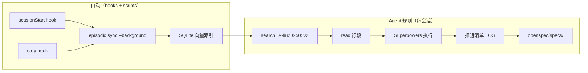

# episodic-memory 最佳实践（自动维护版）

> **状态**：已落地（2026-05-22）  
> **项目 filter**：`D--liu202505v2`  
> **配套规则**： [`.cursor/rules/episodic-memory-automation.mdc`](../../../.cursor/rules/episodic-memory-automation.mdc)

---

## 1. 目标

| 目标 | 实现方式 |
|------|----------|
| **自动索引** | Cursor `sessionStart` / `stop` hooks → `scripts/episodic-sync.mjs --background` |
| **自动回忆** | Agent 规则：每会话首轮 MCP `search` + `read` |
| **自动闭环** | 阶段完成 → LOG + `openspec/specs/` + 「本会话结论」块 |
| **可观测** | `.cursor/episodic/sync-status.json`、`.cursor/logs/episodic-sync.log` |

---

## 2. 架构：三层记忆 + 自动 sync



---

## 3. 已配置的自动化文件

| 文件 | 说明 |
|------|------|
| [`.cursor/hooks.json`](../../../.cursor/hooks.json) | 注册 sessionStart / stop |
| [`.cursor/hooks/episodic-session-start.mjs`](../../../.cursor/hooks/episodic-session-start.mjs) | 启动时 sync + 注入 Agent 上下文 |
| [`.cursor/hooks/episodic-stop.mjs`](../../../.cursor/hooks/episodic-stop.mjs) | 结束时 sync |
| [`scripts/episodic-sync.mjs`](../../../scripts/episodic-sync.mjs) | 手动同步 / stats |
| [`.cursor/episodic/search-templates.yaml`](../../../.cursor/episodic/search-templates.yaml) | 默认 search query 模板 |

---

## 4. 日常命令（人工/CI）

```powershell
# 前台同步（可见输出，约 1–2 分钟）
node scripts/episodic-sync.mjs

# 后台同步（与 hook 相同）
node scripts/episodic-sync.mjs --background

# 查看索引统计
node scripts/episodic-sync.mjs --stats

# 查看最近 sync 状态
Get-Content .cursor\episodic\sync-status.json
Get-Content .cursor\logs\episodic-sync.log -Tail 30
```

---

## 5. 检索模板（`.cursor/episodic/search-templates.yaml`）

| 模板 ID | 何时用 | query |
|---------|--------|-------|
| `session-resume` | 每次新会话 | `["liu202505v2","决策","待审"]` |
| `frontend-dist` | 前端 F0–F4 | `["dist","jnpf-web-vue3","GAP"]` |
| `backend-startup` | API/OA 启动 | `["OA","Startup","DynamicApi"]` |
| `iot-architecture` | IoT/MES | `["MQTT","EMQX","TDengine"]` |
| `toolchain` | 工具链分工 | `["OpenSpec","Superpowers","toolchain"]` |

**技巧**：多概念数组 = AND 搜索；加 `after: "2026-05-20"` 缩小范围。

---

## 6. Agent 闭环检查清单

- [ ] 会话开始：已 `search` + `read`（project=`D--liu202505v2`）  
- [ ] 执行中：Superpowers + Serena（C#）/ Cursor（前端）  
- [ ] 验证：`verification-before-completion` 有命令输出  
- [ ] 定稿：推进清单 LOG + 必要时 `openspec/specs/`  
- [ ] 结束：回复含「本会话结论」块  

---

## 7. 故障排除

| 现象 | 处理 |
|------|------|
| search 无结果 | 1) 确认 filter 为 `D--liu202505v2` 2) 运行 `node scripts/episodic-sync.mjs` 3) 新会话需 stop 后才会归档 |
| hook 未触发 | Cursor Settings → Hooks 查看；改 `hooks.json` 后重启 Cursor |
| sync 报错 | 查看 `.cursor/logs/episodic-sync.log` |
| CLI 路径变更 | 设置环境变量 `EPISODIC_MEMORY_CLI` 指向 `episodic-memory.js` |
| 敏感内容 | 消息中加入 `DO NOT INDEX THIS CHAT` 标记 |

---

## 8. 与 toolchain-division 的关系

- **episodic**：跨会话 WHY（自动 sync + 自动 search）  
- **OpenSpec specs/**：定稿 WHAT  
- **Superpowers**：HOW（施工包与实现）  
- **推进清单**：WHEN（进度）

---

**维护**：新增工作流时在 `search-templates.yaml` 增加模板；重大流程变更更新本节与 `episodic-memory-automation.mdc`。
