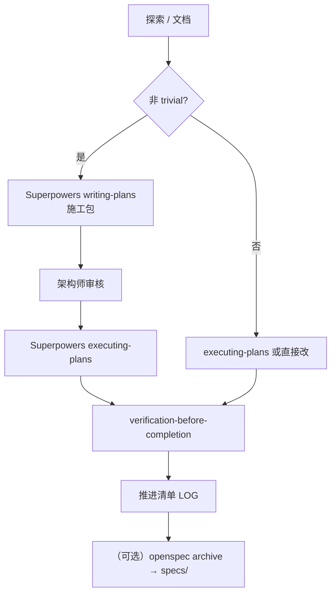

# 项目开发推进清单

> **用途**：供架构师、项目经理、开发负责人**人类阅读**的工作推进日志。  
> **原则**：每完成一项可交付工作，追加**一条**记录；开发推进走 Superpowers，知识定稿可选归档 OpenSpec `specs/`。  
> **机器副本**：[`progress-registry.yaml`](progress-registry.yaml)（结构化源）；运行 [`scripts/sync-project-progress.js`](../../../scripts/sync-project-progress.js) 同步 OpenSpec CLI 快照。  
> **工作流参考**：[`docs/cursor-openspec-superpowers-serena-workflow.md`](../../cursor-openspec-superpowers-serena-workflow.md)

---

## 1. 文档框架说明

### 1.1 双轨维护模型

| 轨道 | 文件 | 维护者 | 内容 |
|------|------|--------|------|
| **人类视图** | 本文档 | 人 + Agent（叙事、决策、链接） | 完成记录、阻塞说明、审核意见 |
| **机器视图** | `progress-registry.yaml` | Agent 追加 + 脚本刷新 | 结构化字段、OpenSpec 快照 |
| **自动同步** | `scripts/sync-project-progress.ps1` | 脚本 | `openspec list` → 总览快照 |

**推荐流程（完成一项工作后）**：

1. 在 `progress-registry.yaml` 的 `entries` 末尾追加一条（含 `id/date/stream/phase/status/deliverables`）。
2. 在本文档 **§4 完成记录** 顶部追加同 ID 的人类可读条目（可写更多上下文）。
3. 若阶段完成：`verification-before-completion` 后执行 `node scripts/sync-project-progress.js`。
4. 若仅为文档/探索：phase 标 `docs` 或 `explore`，`openspec_change` 留空。

### 1.2 与 Superpowers / OpenSpec 阶段对照

| 开发阶段 | Superpowers 技能 | 本清单 `phase` | 典型产出 |
|----------|------------------|----------------|----------|
| 探索 | `brainstorming` + Cursor/Serena | `explore` | 审计 JSON、对照矩阵 |
| 方案/施工包 | `writing-plans` | `propose` | `docs/架构迭代/.../施工包.md` |
| 实现 | `executing-plans` | `apply` | 代码/配置变更 |
| 验证 | `verification-before-completion` | `verify` | build/冒烟证据 |
| 知识归档 | `/opsx:archive`（可选） | `archive` | `openspec/specs/` |
| 纯文档 | `architecture-doc` | `docs` | `docs/architecture/*` |
| 待审 | 架构师未签字 | `pending_review` | 施工包、评估报告 |
| 阻塞 | 依赖未满足 | `blocked` | 记录阻塞原因 |

> OpenSpec `/opsx:apply`、`/opsx:explore` **不用于**本项目日常开发（见 toolchain-division 规则）。

### 1.3 记录字段规范（每条 LOG）

| 字段 | 必填 | 说明 |
|------|------|------|
| **LOG-ID** | ✓ | `LOG-YYYYMMDD-NNN`，与 registry 一致 |
| **日期** | ✓ | 完成日（非启动日） |
| **工作流** | ✓ | 如「前端项目施工 · F0 探索」 |
| **OpenSpec** |  | 变更名；无则写「未建变更（建议：`xxx`）」 |
| **阶段** | ✓ | explore / propose / apply / verify / archive / docs / review |
| **状态** | ✓ | done / in_progress / pending_review / blocked |
| **交付物** | ✓ | 可点击路径列表 |
| **摘要** | ✓ | 1–3 句；写清「做了什么、依据什么、下一步是什么」 |
| **阻塞/待审** |  | 架构师签字、业务确认等 |

### 1.4 工作流（推荐）

### 1.5 本节关键路径索引

| 路径 | 说明 |
|------|------|
| `openspec/specs/` | OpenSpec 知识库（能力规格真相） |
| `openspec/specs/` | 归档后能力规格真相 |
| `docs/架构迭代/` | 迭代方案与施工包 |
| `docs/architecture/` | 架构内参与审计数据 |
| `scripts/sync-project-progress.js` | 推进清单自动同步脚本 |

---

## 2. 当前总览快照

<!-- AUTO-SNAPSHOT:BEGIN — 由 scripts/sync-project-progress.js 生成，勿手改 -->
| 指标 | 值 |
|------|-----|
| 最后同步 | 2026-05-22T15:59:40.704Z |
| OpenSpec CLI | 1.3.1 |
| 活跃变更数 | 0 |
| 注册表条目 | 17（完成 15 · 待审 1 · 进行中 0 · 阻塞 0） |

**活跃 OpenSpec 变更**：

_（暂无；建议对前端 F0–F4 创建 `frontend-align-dist-v1` 变更）_
<!-- AUTO-SNAPSHOT:END -->

---

## 3. 进行中 / 阻塞 / 待架构师审核

| LOG-ID | 标题 | 状态 | 下一步 |
|--------|------|------|--------|
| LOG-20260522-008 | IoT 能力扩展评估 v1.1 | **待审** | 架构师批准 → Superpowers `writing-plans` 排期 |
| LOG-20260522-013 | UI-01 演示平台切换 | **backlog** | F4 稳定后按需补 |

**当前阻塞**：

- OpenSpec 仅作知识库；开发推进用 Superpowers 施工包（见 `.cursor/rules/toolchain-division.mdc`）。

**前端源码合并（F0–F4）**：✅ **已于 2026-05-22 正式收口**（见 LOG-20260522-016）。

---

## 4. 完成记录（新条目加在本节顶部）

> 规则：**最新在上**。每条对应 `progress-registry.yaml` 中同 ID 条目。

---

### LOG-20260522-017 · 知识库与架构文档同步

| 项 | 内容 |
|----|------|
| **日期** | 2026-05-22 |
| **工作流** | 前端项目施工 · archive · docs |
| **OpenSpec** | `frontend-align-dist-v1/spec.md` v2（已收口） |
| **阶段** | archive |
| **状态** | ✅ done |

**交付物**：

- [`openspec/specs/frontend-align-dist-v1/spec.md`](../../../openspec/specs/frontend-align-dist-v1/spec.md)
- [`docs/architecture/05-frontend-source-merge-completion.md`](../../architecture/05-frontend-source-merge-completion.md)（**新建**）
- [`docs/architecture/04-application-frontend-deep-dive.md`](../../architecture/04-application-frontend-deep-dive.md) v1.2
- [`docs/architecture/water-module-from-dist.md`](../../architecture/water-module-from-dist.md)（菜单禁用结论）
- [`docs/architecture/README.md`](../../architecture/README.md)（索引更新）

**摘要**：将 F0–F4 收口结论写入 OpenSpec 知识库与架构内参；明确 `web/dist/` 为当前产物、`dist_v1.1` 为历史对照；water GAP-01 处置为菜单禁用。

---

### LOG-20260522-016 · 前端源码合并里程碑正式收口（架构师验收）

| 项 | 内容 |
|----|------|
| **日期** | 2026-05-22 |
| **工作流** | 前端项目施工 · F4 部署 · archive |
| **OpenSpec** | `frontend-align-dist-v1`（spec 已存在于 `openspec/specs/`） |
| **阶段** | archive |
| **状态** | ✅ done |

**交付物**：

- [`web/dist/`](../../../web/dist/)（新 build，1600 文件）
- [`web/dist_v1.1_backup_20260522/`](../../../web/dist_v1.1_backup_20260522/)（旧基准备份）
- [`.cursor/rules/docs-structure.mdc`](../../../.cursor/rules/docs-structure.mdc)
- [`.cursor/rules/knowledge-maintenance.mdc`](../../../.cursor/rules/knowledge-maintenance.mdc)
- [`scripts/episodic-config.mjs`](../../../scripts/episodic-config.mjs)（硬编码路径修复）

**摘要**：架构师验收通过。`:4173` preview + `:5000` API 正常；登录成功、菜单完整、water 已清除、核心页面冒烟通过。admin 保持内部密码策略（123456）。**前端合并阶段正式关闭**，可进入三期 MES/IoT 开发。

**遗留 backlog**：UI-01 演示平台切换 · GAP-02 printDevH5 · 其余 GAP 按需补。

---

### LOG-20260522-015 · F0–F3 施工执行

| 项 | 内容 |
|----|------|
| **日期** | 2026-05-22 |
| **工作流** | 前端项目施工 · apply → verify |
| **OpenSpec** | — |
| **阶段** | apply |
| **状态** | ✅ done |

**交付物**：

- [`scripts/sql/disable-water-menus.sql`](../../../scripts/sql/disable-water-menus.sql)（water 菜单 `F_ENABLED_MARK=0`）
- [`CustomBatchForm.vue`](../../../jnpf-web-vue3/src/views/common/dynamicModel/list/CustomBatchForm.vue) + [`ExtendForm.vue`](../../../jnpf-web-vue3/src/views/common/dynamicModel/list/ExtendForm.vue)（GAP-03）
- [`jnpf-web-vue3/.env.production`](../../../jnpf-web-vue3/.env.production)（`VITE_CDN=false`）
- [`Cors.json`](../../../application/JNPF.API.Entry/Configurations/Cors.json)（4173/3100 白名单）
- 登录修复：`OAuthService.cs` / `UserAgent.cs` / `LoginForm.vue`

**摘要**：19 项 GAP 审计后真实缺失 2–3 项；water 后端无 Service 故禁用菜单；修复 bootcdn 404 与 CORS；修复登录 `jnpf_ticket` 空值与 UA 解析；浏览器冒烟 15/15 判定全绿（4 项为测试深度局限非系统缺陷）。

---

### LOG-20260522-014 · F4 部署（web/dist 新 build）

| 项 | 内容 |
|----|------|
| **日期** | 2026-05-22 |
| **工作流** | 前端项目施工 · F4 verify |
| **OpenSpec** | — |
| **阶段** | verify |
| **状态** | ✅ done |

**交付物**：[`web/dist/`](../../../web/dist/)

**摘要**：`npm run build` 零 ERROR；新 dist 覆盖 `web/dist/`；F4 后浏览器快速验证：登录 → 用户管理 → 在线开发 → 工作流均正常。

---

### LOG-20260522-013 · UI-01 演示平台切换（backlog）

| 项 | 内容 |
|----|------|
| **日期** | 2026-05-22 |
| **工作流** | 前端项目施工 · backlog |
| **阶段** | blocked |
| **状态** | 📋 backlog |

**摘要**：开发平台/演示平台菜单切换器；UI 锦上添花，不影响核心流程；架构师明确排后，当前不探索。

---

### LOG-20260522-012 · 登录 null 根因修复

| 项 | 内容 |
|----|------|
| **日期** | 2026-05-22 |
| **工作流** | 前端项目施工 · verify（联调） |
| **阶段** | verify |
| **状态** | ✅ done |

**交付物**：`OAuthService.cs` · `UserAgent.cs` · `LoginForm.vue`

**摘要**：`Value cannot be null` 根因：`jnpf_ticket` 空值触发 MemoryCache `Parameter 'key'`；`AddLoginLog` 空 UA 触发 UAParser `Parameter 'input'`。非 CORS/密码/配置问题。

---

### LOG-20260522-011 · episodic-memory 自动维护体系

| 项 | 内容 |
|----|------|
| **日期** | 2026-05-22 |
| **工作流** | 工具链基建 · docs |
| **阶段** | docs |
| **状态** | ✅ done |

**交付物**：

- [`.cursor/hooks.json`](../../../.cursor/hooks.json) + sessionStart/stop hooks
- [`.cursor/rules/episodic-memory-automation.mdc`](../../../.cursor/rules/episodic-memory-automation.mdc)
- [`episodic-memory-playbook.md`](episodic-memory-playbook.md)
- [`scripts/episodic-sync.mjs`](../../../scripts/episodic-sync.mjs)

**摘要**：会话开始/结束自动 background sync；Agent 规则强制首轮 search（project=`D--liu202505v2`）；阶段完成写 LOG + 「本会话结论」块；与 OpenSpec/推进清单三层记忆闭环。

---

### LOG-20260522-010 · OpenSpec 知识库 spec 模板

| 项 | 内容 |
|----|------|
| **日期** | 2026-05-22 |
| **工作流** | OpenSpec 知识库 · docs |
| **OpenSpec** | `openspec/specs/` 直接写入（非 change apply） |
| **阶段** | docs |
| **状态** | ✅ done |

**交付物**：

- [`openspec/specs/README.md`](../../../openspec/specs/README.md)
- [`openspec/specs/frontend-align-dist-v1/spec.md`](../../../openspec/specs/frontend-align-dist-v1/spec.md)
- [`openspec/specs/iot-capability-phase1/spec.md`](../../../openspec/specs/iot-capability-phase1/spec.md)

**摘要**：能力规格归档真相（Requirements + Scenarios）；施工仍走 Superpowers 施工包；dist 对齐 19 GAP、IoT 架构约束（EMQX/TDengine/SignalR/安全五层）已写入 spec。

---

### LOG-20260522-009 · 建立项目工作推进双轨清单机制

| 项 | 内容 |
|----|------|
| **日期** | 2026-05-22 |
| **工作流** | OpenSpec 工作流基建 · propose |
| **OpenSpec** | 未建变更 |
| **阶段** | propose → docs |
| **状态** | ✅ done |

**交付物**：

- [`项目开发推进清单(每完成一项工作记录一条记录).md`](项目开发推进清单(每完成一项工作记录一条记录).md)（本文档）
- [`progress-registry.yaml`](progress-registry.yaml)
- [`scripts/sync-project-progress.js`](../../../scripts/sync-project-progress.js)
- [`scripts/sync-project-progress.ps1`](../../../scripts/sync-project-progress.ps1)（PowerShell 包装）

**摘要**：建立人类 Markdown + 机器 YAML 双轨；脚本从 `openspec list --json` 刷新 §2 总览快照。后续每项完成工作按 §1.3 追加 registry + 本文档 §4。

---

### LOG-20260522-008 · 物联网项目开发能力扩展评估 v1.1

| 项 | 内容 |
|----|------|
| **日期** | 2026-05-22 |
| **工作流** | 架构迭代方案设计 · IoT 专题 |
| **OpenSpec** | 未建变更（建议：`iot-capability-phase1`） |
| **阶段** | docs |
| **状态** | ⏳ pending_review |

**交付物**：

- [`docs/架构迭代/2、架构迭代方案设计/3、物联网项目开发能力扩展评估.md`](../2、架构迭代方案设计/3、物联网项目开发能力扩展评估.md)
- [`docs/架构迭代/1、系统架构设计说明/3、物联网项目开发能力扩展评估第一版.md`](../1、系统架构设计说明/3、物联网项目开发能力扩展评估第一版.md)

**摘要**：补齐智能更衣柜/售卖柜、IoT 安全、数据量与性能基线；修正 MQTT/TSDB/排产/SignalR/EventBus 等判断；新增 OA+IoT 集成、部署架构、成本估算。结论：在现有 JNPF 框架上扩展，不另建 IoT 版框架。

**待审**：架构师批准后用 Superpowers `writing-plans` 排详细开发计划。

---

### LOG-20260522-007 · 前端整理开发计划与施工包（F0–F4）

| 项 | 内容 |
|----|------|
| **日期** | 2026-05-22 |
| **工作流** | 前端项目施工 · propose |
| **OpenSpec** | `frontend-align-dist-v1` |
| **阶段** | propose → apply |
| **状态** | ✅ done |

**交付物**：

- [`../3、架构迭代子阶段施工/3、前端项目施工阶段/2、开发计划和施工包/`](../3、架构迭代子阶段施工/3、前端项目施工阶段/2、开发计划和施工包/)（README + 01/02/03）

**摘要**：dist 为真理之源；F0 审计 → F1 env/build → F2 验证 → F3 GAP → F4 部署。架构师 §8 已签字，F0–F4 全部执行完毕（见 LOG-20260522-015/014/016）。

---

### LOG-20260522-006 · 生产 env 模板（对齐 dist_v1.1）

| 项 | 内容 |
|----|------|
| **日期** | 2026-05-22 |
| **工作流** | 前端项目施工 · propose |
| **OpenSpec** | — |
| **阶段** | propose |
| **状态** | ✅ done |

**交付物**：[`jnpf-web-vue3/.env.production.dist-v1.1.template`](../../../jnpf-web-vue3/.env.production.dist-v1.1.template)

**摘要**：CDN=true、API/WS :5000、gzip、drop console 等与 `web/dist_v1.1/_app.config.js` 对齐。F1 执行时 Copy-Item 为 `.env.production`。

---

### LOG-20260522-005 · water 模块 dist 提取清单

| 项 | 内容 |
|----|------|
| **日期** | 2026-05-22 |
| **工作流** | 前端项目施工 · explore |
| **OpenSpec** | — |
| **阶段** | explore |
| **状态** | ✅ done |

**交付物**：

- [`docs/architecture/water-module-from-dist.md`](../../architecture/water-module-from-dist.md)
- [`docs/architecture/water-module-from-dist.json`](../../architecture/water-module-from-dist.json)

**摘要**：9 页 `views/water/*`；API `/api/ZX_Water/*`；**本仓库 modularity 无 ZX_Water Service** → GAP-01 待业务确认（在用/废弃）。

---

### LOG-20260522-004 · dist 与源码页面对照审计

| 项 | 内容 |
|----|------|
| **日期** | 2026-05-22 |
| **工作流** | 前端项目施工 · explore |
| **OpenSpec** | — |
| **阶段** | explore |
| **状态** | ✅ done |

**交付物**：[`docs/architecture/dist-src-audit.json`](../../architecture/dist-src-audit.json)

**摘要**：dist **344** 页 vs 源码 **325** 页；共有 325；dist 独有 **19**；源码独有 **0**。extend dist 80 / 源码 79，禁止清理。

---

### LOG-20260522-003 · 引入 jnpf-web-vue3 v3.6.0

| 项 | 内容 |
|----|------|
| **日期** | 2026-05-22 |
| **工作流** | 前端项目施工 · explore |
| **OpenSpec** | — |
| **阶段** | explore |
| **状态** | ✅ done |

**交付物**：[`jnpf-web-vue3/`](../../../jnpf-web-vue3/)

**摘要**：自 GitHub `aplyhj/jnpfsoft-jnpf-jnpf-web-vue3-` clone v3.6.0，与 `web/dist_v1.1` 匹配度最高。正式工程目录名 `jnpf-web-vue3/`（非 `src/`）。

---

### LOG-20260522-002 · 专项文档04 前端架构深度解剖 v1.1

| 项 | 内容 |
|----|------|
| **日期** | 2026-05-22 |
| **工作流** | 架构文档 · docs |
| **OpenSpec** | — |
| **阶段** | docs |
| **状态** | ✅ done |

**交付物**：

- [`docs/architecture/04-application-frontend-deep-dive.md`](../../architecture/04-application-frontend-deep-dive.md)
- [`docs/architecture/README.md`](../../architecture/README.md)（编号 04-F）

**摘要**：路由守卫 `createPermissionGuard`、`transformObjToRoute`、VAxios/defHttp、Pinia、Layout；路径已指向 `jnpf-web-vue3/` 源码。

---

### LOG-20260522-001 · 架构文档编写铁律

| 项 | 内容 |
|----|------|
| **日期** | 2026-05-22 |
| **工作流** | 架构文档 · docs |
| **OpenSpec** | — |
| **阶段** | docs |
| **状态** | ✅ done |

**交付物**：

- [`docs/ARCHITECTURE_DOC_RULES.md`](../../ARCHITECTURE_DOC_RULES.md)
- [`.cursor/rules/architecture-doc-standards.mdc`](../../../.cursor/rules/architecture-doc-standards.mdc)

**摘要**：五条铁律（穿透/数据锚定/图表/可验证/禁止空泛）；后续 architecture 与 openspec design 文档永久遵循。

---

## 5. 待办队列（未开始）

| 优先级 | 事项 | 依赖 | 推进方式 |
|--------|------|------|----------|
| P0 | 架构师审核前端施工包 §8 | LOG-20260522-007 | Superpowers `executing-plans` |
| P0 | F0：BASE_MODULE 菜单启用 + GAP-01 water 业务确认 | 上项 | 同上 |
| P1 | F1：`pnpm build` 基线 | F0 | 同上 |
| P1 | 架构师审核 IoT 评估 v1.1 | LOG-20260522-008 | Superpowers `writing-plans` |
| P2 | 应用服务施工阶段按方案推进 | 施工方案 | Superpowers + Serena |

---

## 6. 工具链职责（本项目定稿）

> **永久规则**： [`.cursor/rules/toolchain-division.mdc`](../../../.cursor/rules/toolchain-division.mdc)  
> **详细流程**： [`cursor-openspec-superpowers-serena-workflow.md`](../../cursor-openspec-superpowers-serena-workflow.md)

| 工具 | 职责 | 典型产出 |
|------|------|----------|
| **OpenSpec** | **仅知识库** | `openspec/specs/`；changes 草稿 → archive |
| **Superpowers** | **开发推进主流程** | 施工包、实现、测试、推进清单 LOG |
| **Serena** | **C# 模块改动** | `modularity/`、`framework/` 符号级重构 |
| **episodic-memory** | **会话记忆检索（可选）** | MCP `search`/`read`；skill `remembering-conversations` |
| **Cursor** | 执行层 | 文件编辑、Shell、`dotnet build` |

### 6.1 与 OpenSpec 命令的关系

| 命令 | 本项目 |
|------|--------|
| `/opsx:propose` | 可选：为知识库建 change 草稿 |
| `/opsx:explore` | **不用于**日常开发探索 |
| `/opsx:apply` | **禁止**用于编码推进 |
| `/opsx:archive` | 可选：定稿能力合并入 `specs/` |

### 6.2 Superpowers 阶段映射（替代 OpenSpec apply）

| 施工阶段 | Superpowers 技能 |
|----------|------------------|
| 探索/审计 | `brainstorming` + Cursor/Serena 读码 |
| 架构方案/施工包 | `writing-plans` |
| 按施工包实施 | `executing-plans` / `subagent-driven-development` |
| 冒烟/build 验收 | `verification-before-completion` |
| 大阶段合并前 | `requesting-code-review` |

### 6.3 Agent 完成工作时的标准动作

1. 按施工包完成阶段任务（Superpowers `executing-plans`）。  
2. `verification-before-completion` 跑验证命令。  
3. 追加 `progress-registry.yaml` + 本文档 §4。  
4. `node scripts/sync-project-progress.js`。  
5. **（可选）** 稳定结论归档 OpenSpec `specs/`。

### 6.4 episodic-memory 自动维护（已落地）

| 项 | 状态 |
|----|------|
| Cursor hooks（sessionStart / stop） | ✅ [`.cursor/hooks.json`](../../../.cursor/hooks.json) |
| 后台 sync 脚本 | ✅ [`scripts/episodic-sync.mjs`](../../../scripts/episodic-sync.mjs) |
| Agent 自动规则 | ✅ [`.cursor/rules/episodic-memory-automation.mdc`](../../../.cursor/rules/episodic-memory-automation.mdc) |
| Playbook | ✅ [`episodic-memory-playbook.md`](episodic-memory-playbook.md) |
| 项目 filter | **`D--liu202505v2`** |
| 检索模板 | [`.cursor/episodic/search-templates.yaml`](../../../.cursor/episodic/search-templates.yaml) |

**验证**：`Get-Content .cursor/episodic/sync-status.json`；`node scripts/episodic-sync.mjs --stats`

---

## 7. 维护日志

| 日期 | 维护人 | 说明 |
|------|--------|------|
| 2026-05-22 | Cursor Agent | 初版框架 + 回填 LOG-001～009 |

---

**本节核心表清单**：无（本文件为进程日志，不绑定业务表）

**本节关键代码路径索引**：见 §1.5、§6.4
