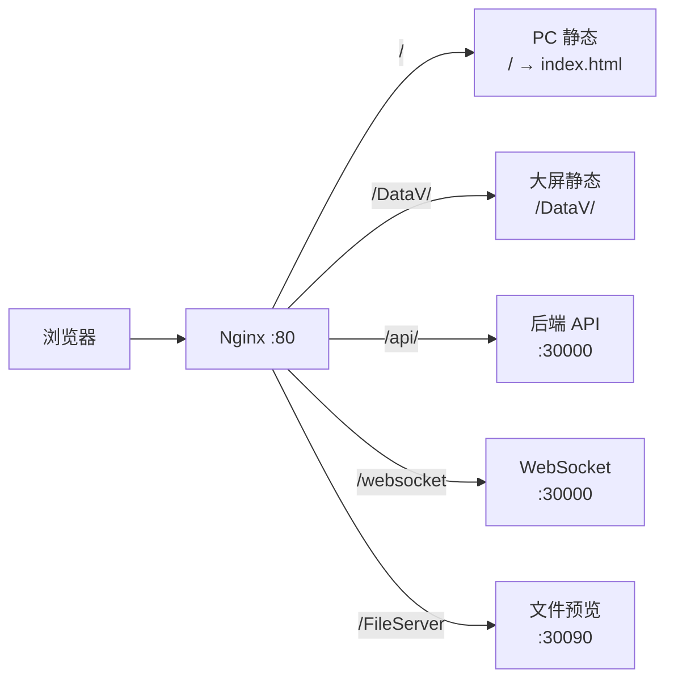

# 阶段四：前端构建与 Nginx 部署

> **做完这个阶段，你会得到：** 浏览器打开 `http://localhost/` 能看到 JNPF PC 前端登录页；Nginx 把 `/api/` 转发到后端 `:30000`。  
> **预计耗时：** 20–40 分钟  
> **前置条件：** [阶段三](./03-阶段三-后端服务启动.md) 验证全部 ✅（后端 `:30000` 已运行）

---

## 4.0 本阶段概览

| 步骤 | 做什么 | 必选/可选 |
|------|--------|-----------|
| 4.1 | 构建 PC 前端 | [必选] |
| 4.2 | 部署 PC 前端静态文件 | [必选] |
| 4.3 | 构建并部署大屏前端 | [可选] |
| 4.4 | 构建并部署移动端 H5 | [可选] |
| 4.5 | 配置 Nginx | [必选] |
| 4.6 | 本阶段总验证 | [必选] |

---

## 4.1 构建 PC 前端 [必选]

> **PC 前端**（工程名 `jnpf-web-vue3`）是浏览器里的主界面：登录、低代码设计、系统管理。

### 4.1.1 先读 `.env.production`（再选方案）

> **变量名说明：** 本工程使用 **`VITE_GLOB_API_URL`**（不是 `VITE_APP_BASE_API`）。  
> **先读文件，再改——不要编造。**

🟢 **核对命令：**

```powershell
Get-Content "$JNPF_ROOT\jnpf-web-vue3\.env.production"
Get-Content "$JNPF_ROOT\jnpf-web-vue3\.env.development"
```

**本仓库实测 — 生产打包** `jnpf-web-vue3/.env.production`：

```bash
VITE_GLOB_API_URL = http://localhost:5000
VITE_GLOB_WEBSOCKET_URL = ws://localhost:5000
```

**本仓库实测 — 开发环境** `jnpf-web-vue3/.env.development`：

```bash
VITE_PROXY = [["/dev","http://localhost:5000"]]
VITE_GLOB_API_URL=/dev
VITE_GLOB_WEBSOCKET_URL='ws://localhost:5000'
```

> 仓库内前端默认指向 **`:5000`**（与 `launchSettings.json` 一致）。本手册后端部署在 **`:30000`**，须按下表处理，**不要**把后端改回 5000。

---

### 4.1.2 选择 API 地址方案（生产推荐方案 B）

| 方案 | 操作 | 适用场景 | 推荐 |
|------|------|----------|------|
| **A** | 后端 `--urls "http://0.0.0.0:5000"` | 与前端默认 `:5000` 对齐 | ❌ 与 v5.2 架构/手册 `:30000` 不一致，**勿用** |
| **B** | 改 `.env.production`：`VITE_GLOB_API_URL` 为空 | Nginx 同域，`/api/` 反代到 `:30000` | ✅ **生产默认** |
| **C** | 改 `.env.production`：`VITE_GLOB_API_URL = http://localhost:30000` | 无 Nginx、本地联调打包 | ⚠️ **仅开发联调** |

#### 方案 B（推荐·生产 Nginx 同域）

编辑 `jnpf-web-vue3/.env.production`，将：

```bash
VITE_GLOB_API_URL = http://localhost:5000
VITE_GLOB_WEBSOCKET_URL = ws://localhost:5000
```

改为：

```bash
VITE_GLOB_API_URL =
VITE_GLOB_WEBSOCKET_URL =
```

> **为什么留空：** 浏览器与 API 同域（如 `http://localhost/`），请求走相对路径 `/api/...`，由 Nginx（阶段四 4.5）转发到 `$API_PORT`（30000）。  
> 打包后也可不改源文件，直接编辑 `dist/_app.config.js` 中的 API/WS 地址（`.env.production` 文件头注释已说明）。

**WebSocket：** 同域部署时，可在 `dist/_app.config.js` 设为 `ws://你的域名/` 或与页面同 host；须与 Nginx 的 `/websocket` 反代一致。

#### 方案 C（仅开发联调）

```bash
VITE_GLOB_API_URL = http://localhost:30000
VITE_GLOB_WEBSOCKET_URL = ws://localhost:30000
```

同时若用 `pnpm dev`，将 `.env.development` 中：

```bash
VITE_PROXY = [["/dev","http://localhost:30000"]]
VITE_GLOB_WEBSOCKET_URL='ws://localhost:30000'
```

---

### 4.1.3 安装依赖并构建

🪟 **Windows 11**（[普通用户]）：

```powershell
cd $JNPF_ROOT\jnpf-web-vue3
pnpm install --registry=https://registry.npmmirror.com
pnpm build
```

🐧 **Linux**：

```bash
cd "$JNPF_ROOT/jnpf-web-vue3"
pnpm install --registry=https://registry.npmmirror.com
pnpm build
```

> **期望看到：** 构建成功，生成 `jnpf-web-vue3/dist/` 目录，内含 `index.html`、`assets/`。

> **如果你看到这个错误：**
> ```
> JavaScript heap out of memory
> ```
> **原因**：Node 内存不足。  
> **解决**：`package.json` 的 build 脚本已含 `--max-old-space-size=8192`；关闭其他占内存程序后重试。

### 验证

```powershell
Test-Path "$JNPF_ROOT\jnpf-web-vue3\dist\index.html"
```

> **期望：** `True`

---

## 4.2 部署 PC 前端静态文件 [必选]

🪟 **Windows 11**：

```powershell
$NGINX_ROOT = "C:\nginx\html\jnpf"
New-Item -ItemType Directory -Force -Path $NGINX_ROOT
Copy-Item -Path "$JNPF_ROOT\jnpf-web-vue3\dist\*" -Destination $NGINX_ROOT -Recurse -Force
```

🐧 **Linux**：

```bash
export NGINX_ROOT="/usr/share/nginx/html/jnpf"
sudo mkdir -p "$NGINX_ROOT"
sudo cp -r "$JNPF_ROOT/jnpf-web-vue3/dist/"* "$NGINX_ROOT/"
```

---

## 4.3 构建并部署大屏前端 [可选]

> `[可选]` **本步骤可跳过**  
> **跳过后会怎样：** 数字大屏菜单/链接不可用；PC 低代码、工作流正常。  
> **什么时候需要做：** 需要 DataV 大屏设计与预览。

### 操作概要

1. 获取 `jnpf-web-datascreen-vue3` 源码（**不在本仓库**）  
2. `pnpm install && pnpm build`  
3. 将 `dist/` 复制到 Nginx 的 `DataV/` 子目录：

```powershell
Copy-Item -Path "D:\path\to\jnpf-web-datascreen-vue3\dist\*" -Destination "C:\nginx\html\jnpf\DataV" -Recurse -Force
```

开发环境大屏前端端口 **:8100**（Vite）；生产由 Nginx `location /DataV` 提供静态文件，API 仍走 `/api/blade-visual/` → `:30000`。

---

## 4.4 构建并部署移动端 H5 [可选]

> `[可选]` **跳过后会怎样：** 手机浏览器 / H5 预览不可用。

1. 获取 `jnpf-app-vue3` 源码  
2. 使用 HBuilderX「发行 → 网站-H5」或项目内 `uniapp-h5-proxy.js`  
3. 将 H5 产物放到 Nginx，例如 `location /app/`（路径按实际打包 `base` 调整）

开发 H5 默认端口 **:3800**；API 仍指向 `:30000`，请求头带 `jnpf-origin: app`。

---

## 4.5 配置 Nginx [必选]

> **这一步做什么：** 让 `http://localhost/` 打开 PC 前端，`/api/` 转发到后端。

### 4.5.1 Nginx 路由图（图4-1）

**图4-1 Nginx 路由关系**



### 4.5.2 配置文件

基于仓库 `jnpf-web-vue3/deploy/default.conf`，改为本机地址：

🪟 **Windows 11** — 编辑 `C:\nginx\conf\nginx.conf` 或 `conf.d\jnpf.conf`：

```nginx
server {
    listen       80;
    server_name  localhost;
    root C:/nginx/html/jnpf;
    index index.html;

    client_max_body_size 100m;

    proxy_set_header Host $http_host;
    proxy_set_header X-Real-IP $remote_addr;
    proxy_set_header X-Forwarded-For $proxy_add_x_forwarded_for;
    proxy_set_header X-Forwarded-Proto $scheme;
    proxy_connect_timeout 300;

    # PC 前端 SPA
    location / {
        try_files $uri $uri/ /index.html;
    }

    # 大屏 SPA
    location /DataV {
        try_files $uri $uri/ /DataV/index.html;
    }

    # 后端 API → :30000
    location /api/ {
        proxy_pass http://127.0.0.1:30000;
    }

    # WebSocket（IM 等）
    location /websocket {
        proxy_pass http://127.0.0.1:30000/api/message/websocket;
        proxy_http_version 1.1;
        proxy_set_header Upgrade $http_upgrade;
        proxy_set_header Connection "upgrade";
        proxy_read_timeout 600s;
    }

    # 文件预览（阶段五部署后启用）
    location /FileServer {
        proxy_pass http://127.0.0.1:30090;
    }
}
```

🐧 **Linux** — `/etc/nginx/conf.d/jnpf.conf`，`root` 改为 `/usr/share/nginx/html/jnpf`，路径分隔符用 `/`。

### 4.5.3 启动 Nginx

🪟 **Windows 11**（[管理员]）：

```powershell
cd C:\nginx
.\nginx.exe -t
.\nginx.exe -s reload
```

🐧 **Linux**：

```bash
sudo nginx -t
sudo systemctl reload nginx
```

> **期望看到：** `syntax is ok` / `test is successful`

| # | 验证什么 | 怎么验证 | 通过长什么样 | 失败长什么样 |
|---|----------|----------|-------------|-------------|
| 1 | 配置语法 | `nginx -t` | successful | 行号报错 → 检查路径与分号 |
| 2 | 静态页 | 浏览器 `http://localhost/` | JNPF 登录页：账号/密码输入框 + 登录按钮 | 404 → 检查 root 路径；403 → 权限 |
| 3 | API 反代 | `curl http://localhost/api/oauth/getLoginConfig` | JSON，`code` 字段 | 502 → 后端未启动 |

**登录页长什么样：**

- 页面标题「智轩云」或 `.env` 中 `VITE_GLOB_APP_TITLE` 配置的名称  
- 中央或左侧有「账号」「密码」输入框和「登录」按钮  
- 背景为浅色或深蓝主题（随主题配置）

---

## 4.6 本阶段总验证

| # | 检查项 | 怎么查 | 通过标准 | 失败怎么办 |
|---|--------|--------|----------|-----------|
| 1 | dist 产物 | `dist/index.html` 存在 | ✅ | 4.1 |
| 2 | Nginx 80 | `curl -I http://localhost/` | HTTP 200 | 4.5 |
| 3 | 登录页 | 浏览器 `/` | 见上文描述 | 4.2、4.5 |
| 4 | 前端 API 方案 | 检查 `.env.production` | 生产：`VITE_GLOB_API_URL` 为空（方案 B） | 4.1.2 |
| 5 | API 反代 | `curl localhost/api/oauth/getLoginConfig` | JSON 非 502 | 阶段三 + 4.5 |
| 6 | 大屏（若做） | `http://localhost/DataV/` | 大屏壳页面 | 4.3 + 阶段三 3.2 |

全部 ✅ → [阶段五：辅助服务部署](./05-阶段五-辅助服务部署.md)

---

## 本节关键代码路径索引

| 路径 | 说明 |
|------|------|
| `jnpf-web-vue3/.env.production` | 生产 API 地址 |
| `jnpf-web-vue3/deploy/default.conf` | Nginx 参考模板 |
| `jnpf-web-vue3/src/hooks/setting/index.ts` | dataVUrl、report、filePreviewServer |
