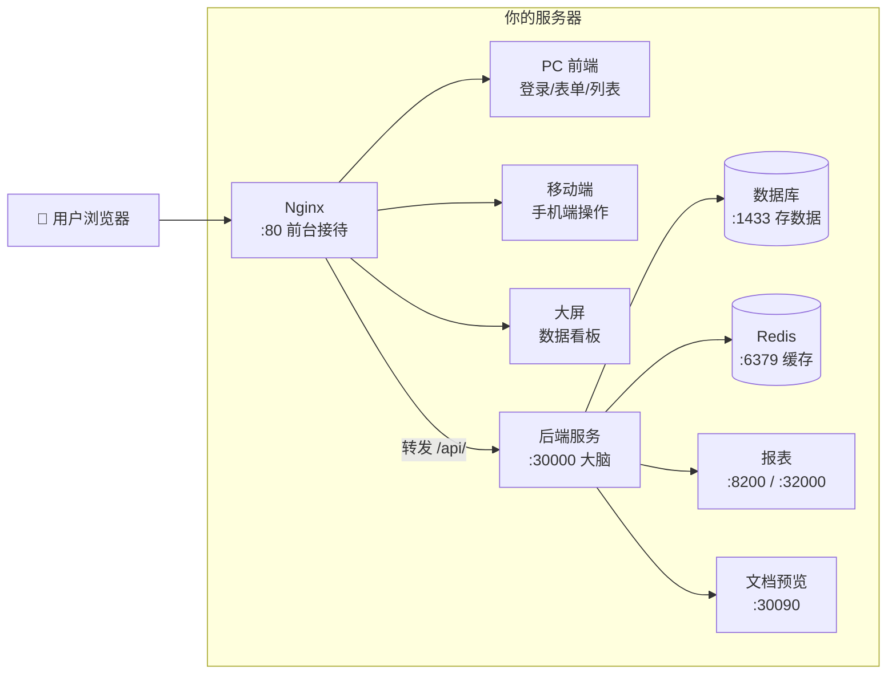

# JNPF v5.2 系统部署运行手册

> **文档版本**：v2.1-final  
> **修订日期**：2026-05-26  
> **读者**：2–3 年经验的 Java/.NET 工程师，第一次接触 JNPF，希望半天到一天内把系统跑起来  
> **编写依据**：架构师《JNPF v5.2 系统部署运行手册 — 编写指南 v2.0》+ 本仓库源码实测  

---

## 配置原则（必读）

> **部署 = 读项目已有配置 → 搭建匹配的基础设施。不是编配置让项目来适配。**

| 值 | 来源文件 | 能否随意改 |
|----|----------|-----------|
| 主库名 / 调度库名 | `Configurations/ConnectionStrings.json` → `DBName` | ❌ 须与 SQL 脚本建库名一致 |
| 数据库 Host / UserName | 同上 → `Host` / `UserName` | ❌ 须与 SQL Server 实例一致 |
| 数据库 Password | 同上 → `Password` | ⚠️ 可改 JSON 或改 sa，**两边必须一致** |
| 缓存类型 | `Configurations/Cache.json` → `CacheType` | ❌ Memory 则不装 Redis |
| Redis 密码 | `Cache.json` → `RedisConnectionString` | ⚠️ 与 Redis 实例一致 |
| EventBus | `Configurations/EventBus.json` | ❌ Memory 则不装 RabbitMQ |
| JWT 密钥 | `Configurations/JWT.json` | ⚠️ 生产须换 |
| API 部署端口 | 环境变量 `ASPNETCORE_URLS` | 本手册用 **30000**（非 launchSettings 的 5000） |

> ⚠️ **安全提示（生产必读）**  
> 当前 `ConnectionStrings.json` 中数据库密码为 **`1qazxsw2`**，这是**开发/测试密码**，随源码提交。  
> **生产部署前必须：**  
> 1. 将 SQL Server `sa` 密码改为强密码  
> 2. 同步修改 `ConnectionStrings.json` 中**两处** `Password` 字段（`default` 与 `JNPF-Job`）  
> 3. 阶段六再次核对（见 [06-阶段六-生产加固.md](./06-阶段六-生产加固.md)）

> ⚠️ JNPF **不使用** ADO.NET 单行连接串；数据库配置在 **`Configurations/ConnectionStrings.json`** 的 `ConnectionConfigs` 数组中，**不是** `appsettings.json` 里的 `DBConnectionString`。

**第一步：** 打开 [阶段一 §1.1](./01-阶段一-环境准备.md#11-读取项目实际配置-必选)，读取配置文件并设置 `$DB_HOST`、`$DB_PASS`、`$MAIN_DB`、`$JOB_DB`。

---

## 这份手册能帮你做什么

照着 **阶段一 → 阶段七** 顺序执行，你会得到：

- 浏览器打开 `http://localhost` 看到 **PC 前端登录页**
- 浏览器打开 `http://localhost:30000/newapi` 看到 **API 接口文档**
- （可选）大屏、移动端、报表、文件预览按阶段五说明启用

> **端口说明（重要）**  
> 本仓库 `application/JNPF.API.Entry/Properties/launchSettings.json` 中开发默认端口为 **`:5000`**，这是 Visual Studio 本地调试用的。  
> **v5.2 迁移/部署环境统一使用 `:30000`**。本手册正文全部以 **`:30000`** 为准；仅在脚注提及 `:5000`。

---

## 部署拓扑图（图0-1）

**图0-1 JNPF v5.2 部署拓扑（服务 + 端口）**



---

## 部署前检查清单（阶段一之前）

> **开始之前，确认你有：**
>
> - [ ] 后端源码目录（能看到 `application/JNPF.API.Entry/` 文件夹）
> - [ ] PC 前端目录（能看到 `jnpf-web-vue3/package.json` 和 `jnpf-web-vue3/src/`）
> - [ ] 主库 SQL 脚本（`web/主库脚本.sql`，约 2.1 MB）
> - [ ] 调度库 SQL 脚本（`web/jnpf_sundial_init_sqlserver.sql`，SQL Server 版）
> - [ ] 已阅读 `Configurations/ConnectionStrings.json`，知悉项目期望的数据库名与 sa 密码
> - [ ] 一台 Windows 11 或 Linux 服务器（内存 ≥ 8GB，推荐 16GB）
> - [ ] （可选）含 admin 等业务数据的 `.bak` 备份或 seed 包——**主库脚本只有表结构，不含登录数据**
>
> **如果你缺少任何 [必选] 项，请先联系 JNPF 团队获取，再开始部署。**

---

## 文件与获取方式一览

| 文件/组件 | 位置 | 获取方式 | 阶段 |
|-----------|------|----------|------|
| 后端源码 | 本仓库根目录 | ✅ 已有 | 三 |
| **PC 前端** `jnpf-web-vue3/` | 本仓库根目录（**不在** `web/` 下） | ✅ 已有 | 四 |
| **大屏前端** `jnpf-web-datascreen-vue3/` | 配套包 | ⚠️ 需向 JNPF 获取 | 四 [可选] |
| **移动端** `jnpf-app-vue3/` | 配套包 | ⚠️ 需向 JNPF 获取 | 四 [可选] |
| **主库 SQL** `web/主库脚本.sql` | 本仓库 | ✅ 已有 | 二 |
| **调度库 SQL** `web/jnpf_sundial_init_sqlserver.sql` | 本仓库 | ✅ 已有（SQL Server） | 二 |
| 调度库 Oracle 版 `web/jnpf_sundial_init.sql` | 本仓库 | ✅ 已有（**非 SQL Server，勿误用**） | — |
| 事件库脚本 `web/jnpf事件库脚本.sql` | 本仓库 | ✅ 按需 | 二 [可选] |
| 业务 seed / `.bak` 备份 | 交付包 | ⚠️ **本仓库不含** | 二 |
| Univer 报表服务 | 独立安装包 | ⚠️ 需获取 | 五 [可选] |
| kkFileView 文档预览 | 开源 / 交付包 | ⚠️ 需下载 | 五 [可选] |
| Nginx 参考配置 | `jnpf-web-vue3/deploy/default.conf` | ✅ 已有 | 四 |

> ❌ **不需要** 单独的 `jnpf_visualdata_ddl.sql` / `jnpf_workflow_ddl.sql`：工作流与大屏表已在 `主库脚本.sql` 内（见阶段二 2.1 源码验证）。

### 确认 `web/` 下 SQL 文件（必做）

🪟 **Windows 11**：

```powershell
Get-ChildItem "$JNPF_ROOT\web\*.sql" | Select-Object Name, Length, LastWriteTime
```

🐧 **Linux**：

```bash
ls -la "$JNPF_ROOT/web/"*.sql
```

**本仓库实测（2026-05-26）：**

| 文件名 | 大小 | 用途 |
|--------|------|------|
| `主库脚本.sql` | 2,210,828 字节（≈2.1 MB） | **主业务库** DDL，库名 `ZXAF_V1_DevTest1` |
| `jnpf_sundial_init_sqlserver.sql` | 2,819 字节 | **调度库** DDL（SQL Server），库名 `jnpf_sundial` |
| `jnpf_sundial_init.sql` | 9,989 字节 | 调度库 DDL（**Oracle 语法**，给 Oracle 环境用） |
| `jnpf事件库脚本.sql` | 11,848 字节 | 事件库扩展（按需） |

**完整性快速检查：**

🪟 **Windows 11**：

```powershell
Test-Path "$JNPF_ROOT\application\JNPF.API.Entry\JNPF.API.Entry.csproj"
Test-Path "$JNPF_ROOT\web\主库脚本.sql"    # 中文文件名，引号必加
Test-Path "$JNPF_ROOT\jnpf-web-vue3\package.json"
```

> 期望三个命令均返回 `True`。

---

## 本仓库配置锚点（源码实测 2026-05-26）

> 以下值来自当前仓库配置文件。**部署前请用 `Get-Content` / `cat` 再核对一次**，若本地文件已改，以本地为准。

| 配置项 | 源码路径 | 本仓库实测值 |
|--------|----------|-------------|
| 主库名 | `ConnectionStrings.json` → `ConfigId=default` | `ZXAF_V1_DevTest1` |
| 调度库名 | `ConnectionStrings.json` → `ConfigId=JNPF-Job` | `jnpf_sundial` |
| DB Host | `ConnectionStrings.json` → `Host` | `(local)\SQLEXPRESS` |
| DB User / Pass | `UserName` / `Password` | `sa` / `1qazxsw2` ⚠️ **开发密码，生产须换** |
| 缓存 | `Cache.json` → `CacheType` | `MemoryCache`（无需 Redis） |
| EventBus | `EventBus.json` → `EventBusType` | `Memory` |
| PC 前端 dev 代理 | `jnpf-web-vue3/.env.development` → `VITE_PROXY` | `http://localhost:5000` |
| PC 前端 prod API | `jnpf-web-vue3/.env.production` → `VITE_GLOB_API_URL` | `http://localhost:5000` |

**全局变量**在 [阶段一 §1.1.7](./01-阶段一-环境准备.md#117-设置全局变量从上面读到的值填入) 从上述文件读取后设置；全文命令使用 `$DB_HOST`、`$DB_USER`、`$DB_PASS`、`$MAIN_DB`、`$JOB_DB`、`$API_PORT`。

> **Windows 和 Linux 哪个先看？** 每个命令块标注 🪟 / 🐧 / 🟢，只看对应系统即可。

---

## 七阶段总览

| 阶段 | 文档 | 做什么 | 耗时 | 前置 |
|------|------|--------|------|------|
| **一** | [01-阶段一-环境准备.md](./01-阶段一-环境准备.md) | 装软件、清端口 | 30–60 分钟 | 无 |
| **二** | [02-阶段二-数据库初始化.md](./02-阶段二-数据库初始化.md) | 建库、导表 | 15–30 分钟 | 阶段一 ✅ |
| **三** | [03-阶段三-后端服务启动.md](./03-阶段三-后端服务启动.md) | 配置、编译、启动 API | 10–20 分钟 | 阶段二 ✅ |
| **四** | [04-阶段四-前端构建与Nginx部署.md](./04-阶段四-前端构建与Nginx部署.md) | PC + 大屏 + 移动端 + Nginx | 20–40 分钟 | 阶段三 ✅ |
| **五** | [05-阶段五-辅助服务部署.md](./05-阶段五-辅助服务部署.md) | 报表 + 文档预览 | 15–30 分钟 | 阶段四 ✅ |
| **六** | [06-阶段六-生产加固.md](./06-阶段六-生产加固.md) | 安全、日志、备份、HTTPS | 15–30 分钟 | 阶段五 ✅ |
| **七** | [07-阶段七-端到端验证.md](./07-阶段七-端到端验证.md) | 全量功能验收 | 15–30 分钟 | 阶段六 ✅ |
| **附录** | [附录-速查表与术语.md](./附录-速查表与术语.md) | 端口/配置/报错速查 | — | — |

> **验证即停原则**：每个阶段末尾有「本阶段总验证」清单。**全部 ✅ 才能进入下一阶段**。  
> 跳过验证会在后面变成更难排查的错误。

---

## 推荐启动顺序（开发/首次部署）

1. 读取 `ConnectionStrings.json` / `Cache.json`（阶段一 1.1）
2. SQL Server（阶段二，库名与 JSON 一致）
3. Redis — **仅当** `Cache.json` 为 `RedisCache`（本仓库默认 MemoryCache，可跳过）
3. 后端 API `:30000`（阶段三）
4. Nginx + PC 前端静态文件（阶段四）
5. 大屏 / 移动端 / 报表 / 预览 — [可选]（阶段四、五）

---

## 相关架构文档（深入原理时用）

| 主题 | 路径 |
|------|------|
| 配置文件体系 | `docs/架构迭代/1、系统架构设计说明/003、部署运维与环境配置指南.md` |
| 部署端口全景 | `docs/architecture/v52/README.md` |
| 大屏模块 | `docs/architecture/v52/05-visual-data-deep-dive.md` |
| 插件/报表/预览 | `docs/architecture/v52/11-plugins-integration-deep-dive.md` |

---

## 本节关键路径索引

| 路径 | 用途 |
|------|------|
| `application/JNPF.API.Entry/` | 后端 API 宿主 |
| `application/JNPF.API.Entry/Configurations/` | 数据库/缓存/JWT 等配置 |
| `web/主库脚本.sql` | 主库 DDL |
| `web/jnpf_sundial_init_sqlserver.sql` | 调度库 DDL |
| `jnpf-web-vue3/deploy/default.conf` | Nginx 参考配置 |
| `modularity/visualdata/JNPF.VisualData/` | 大屏后端模块（默认未引用） |
