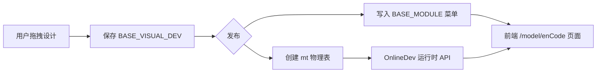
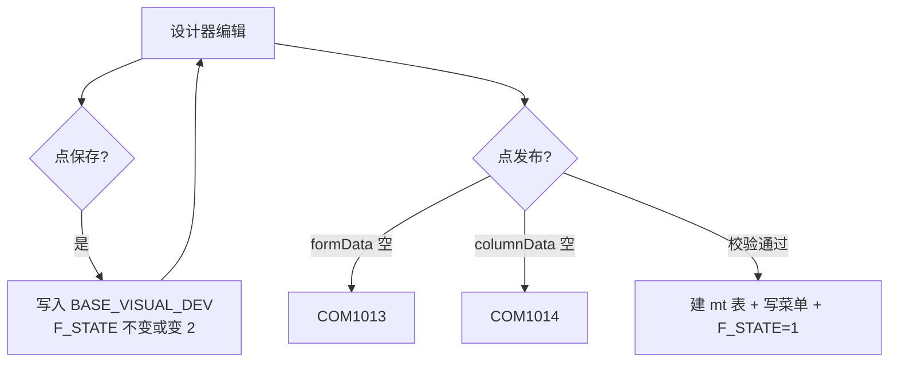
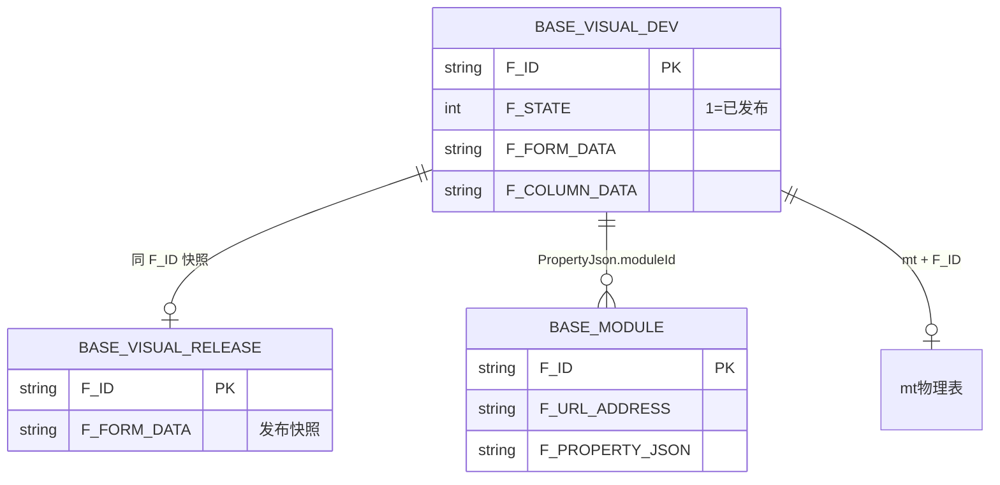
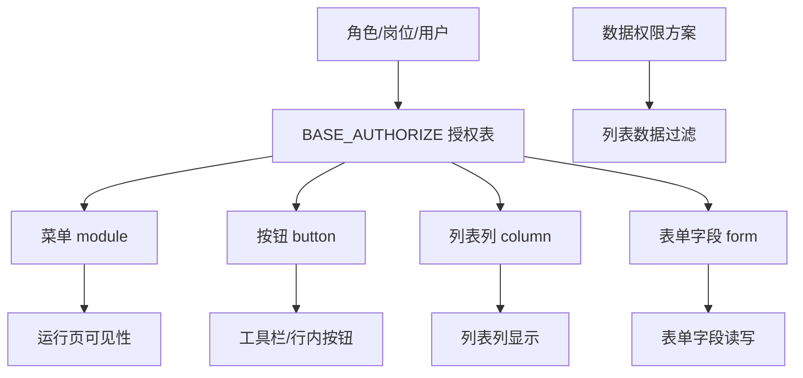

# JNPF v5.2 低代码框架主 WEB 代码生成全部功能操作手册

**文档编号**：v52-migration-docs-001-manual1  
**文档状态**：终审批准  
**审核人**：架构师  
**批准日期**：2026-05-23  
**版本**：v1.0-final  
**编写依据**：同目录 `1、三大操作手册编写要求.md`（经源码核验修订）  
**源码仓库**：`d:\JNPF-v52\backend`（后端/前端对照本仓库；v5.2 运行时环境见第二章）  
**截图**：ch01–ch06 待补（不阻塞交付）

### 目录

| 章 | 标题 | 状态 |
|----|------|------|
| 一 | 概述 | ✅ |
| 二 | 环境配置与前置条件 | ✅ |
| 三 | 功能设计——数据模型创建 | ✅ |
| 四 | 发布机制详解 | ✅ |
| 五 | 进阶功能 | ✅ |
| 六 | 权限与角色配置 | ✅ |
| 七 | 常见问题与踩坑记录 | ✅ |
| 八 | API 参考 | ✅ |
| 附录 A | 配置字典 | ✅ |

---

> **截图说明**：各章 `[截图：…]` 占位符需在对应环境实际操作后保存至  
> `docs/架构迭代/6、培训与操作手册/01-mainweb-lowcode-operation-manual-screenshots/ch0N/`（N=章号），文件名与占位符编号一致。

---

## 第一章：概述

读完本章，你应能回答三个问题：**低代码是什么、在本项目中能做什么、和手册二/三是什么关系**。  
不必先懂编程；本章不涉及具体操作步骤（操作从第三章开始）。

---

### 1.1 JNPF v5.2 低代码框架在主 WEB 中的定位

#### 1.1.1 什么是低代码（面向使用者）

**低代码**指：用**可视化拖拽**设计业务表单和列表，由平台**自动生成**数据库表、后台接口和前端页面，无需手写 HTML/SQL/C#。

在本项目中，低代码设计器位于 **主 WEB** 的「在线开发 → 功能设计」菜单下。实施人员、产品经理、业务顾问均可使用；只有需要深度定制时才介入二次开发。

#### 1.1.2 v5.2 低代码能做什么

| 能力 | 说明 | 使用者可见结果 |
|------|------|----------------|
| 可视化设计表单 | 拖拽文本框、下拉框、日期等 | 设计器中的表单画布 |
| 自动生成数据库表 | 无表模式发布时建 `mt{ID}` 表 | SSMS 中可见业务表 |
| 自动生成 Web 页面 | 列表 + 新增/编辑/删除 | 浏览器 `/model/{编码}` |
| 自动生成移动端页面 | 同一设计，勾选 App 发布 | 详见手册三 |
| 自动生成功能菜单 | 发布时写入 `BASE_MODULE` | 左侧导航出现菜单项 |
| 发布即上线 | 发布后即可录入数据 | 无需编译部署前端 |

#### 1.1.3 与传统开发方式对比

| 对比项 | 传统开发 | JNPF 低代码 |
|--------|----------|-------------|
| 建表 | DBA/开发手写 DDL | 发布时自动建 `mt{ID}` |
| 列表页 | 前端写 Vue 组件 | 设计器配置列即可 |
| 表单页 | 前端写表单 + 校验 | 设计器拖拽 + 属性面板 |
| CRUD API | 手写 Controller/Service | `OnlineDev` 运行时自动生成 |
| 改字段 | 改代码 + 改库 + 发版 | 设计器改完重新发布 |
| 适用场景 | 复杂逻辑、高性能定制 | 标准 CRUD、快速交付 |

#### 1.1.4 主 WEB 在低代码链路中的位置

```
业务人员 ──→ 主 WEB 低代码设计器（:3100）
                │
                ├─→ 保存设计 → BASE_VISUAL_DEV（数据库）
                ├─→ 发布     → mt{ID} 物理表 + BASE_MODULE 菜单
                └─→ 访问页面 → /model/{enCode} 自动 CRUD

同一设计 ──→ 勾选 App 发布 ──→ UniApp 端（手册三）
独立体系 ──→ 数字大屏设计器（:8100，手册二）
```

---

### 1.2 技术架构

#### 1.2.1 组件一览

| 层级 | 组件 | 说明 |
|------|------|------|
| 前端 | `jnpf-web-vue3`（Vue 3 + Vite） | 主 WEB，低代码设计器与运行页 |
| 后端 | `JNPF.VisualDev` 模块 | C# / .NET（v5.2 运行环境为 .NET 8；本仓库 SDK 6.0 可 rollForward） |
| ORM | SqlSugar | 访问 SQL Server |
| 数据库 | SQL Server | 库名 `jnpf_v52_test` |
| 缓存 | Redis | 登录 Token 等会话数据 |
| 工作流 | Flowable | 流程表单依赖；当前 v5.2 环境为 **:31000 桩服务** |

#### 1.2.2 低代码核心数据流



逐步说明：

1. **设计阶段**：表单 JSON 存入 `BASE_VISUAL_DEV.F_FORM_DATA`，列表 JSON 存入 `F_COLUMN_DATA`。  
   服务：`VisualDevService`（`modularity/visualdev/JNPF.VisualDev/VisualDevService.cs`）。

2. **发布阶段**：校验 `formData`/`columnData` 非空 → 无表则建 `mt` + 功能 ID → 同步菜单。  
   API：`POST /api/visualdev/Base/{id}/Actions/Release`。

3. **运行阶段**：用户打开 `/model/{enCode}`，前端调用 `OnlineDev` 系列 API 完成增删改查。  
   示例：`POST /api/visualdev/OnlineDev/{id}/List`。

#### 1.2.3 关键源码路径（供二次开发查阅）

| 功能 | 路径 |
|------|------|
| 功能设计 CRUD | `modularity/visualdev/JNPF.VisualDev/VisualDevService.cs` |
| 运行时 CRUD | `modularity/visualdev/JNPF.VisualDev/RunService.cs` |
| 设计器前端 | `jnpf-web-vue3/src/views/onlineDev/webDesign/` |
| 表单组件库 | `jnpf-web-vue3/src/components/FormGenerator/` |
| 实体定义 | `modularity/visualdev/JNPF.VisualDev.Entitys/Entity/VisualDevEntity.cs` |

---

### 1.3 低代码体系全景图

JNPF v5.2 低代码相关能力分为三条线，对应三份操作手册：

```
                    ┌─────────────────────────────────────┐
                    │     JNPF v5.2 低代码体系全景          │
                    └─────────────────────────────────────┘
                                      │
          ┌───────────────────────────┼───────────────────────────┐
          │                           │                           │
          ▼                           ▼                           ▼
   ┌──────────────┐           ┌──────────────┐           ┌──────────────┐
   │ 手册一        │           │ 手册三        │           │ 手册二        │
   │ 主 WEB 低代码  │           │ UniApp 移动端 │           │ 数字大屏      │
   │ :3100        │           │ :3800 H5     │           │ :8100 DataV  │
   └──────────────┘           └──────────────┘           └──────────────┘
          │                           │                           │
   功能设计三步向导              同一设计器产出               独立设计器
   Web 菜单 + CRUD              App 菜单 + 同表数据           数据源+图表+大屏
          │                           │                           │
          └─────────── 数据互通 ──────┘                           │
                    （同一张 mt 表）                               │
                                                                  │
                                                    独立 BLADE_VISUAL_* 表系
```

| 手册 | 入口 | 依赖关系 |
|------|------|----------|
| **手册一（本手册）** | 主 WEB → 在线开发 → 功能设计 | 基础，必读 |
| **手册三** | 主 WEB 设计 + UniApp 访问 | 依赖手册一第三、四章 |
| **手册二** | 主 WEB → 大屏管理 / :8100 | 独立，与低代码表单无直接依赖 |

[截图：ch01-01-低代码体系全景图.png]

---

### 1.4 与 v3.6 低代码的差异概述

> 本节面向从 v3.6 迁移到 v5.2 的实施团队；全新部署可略读。

| 维度 | v3.6（常见部署） | v5.2（当前项目） |
|------|------------------|------------------|
| 前端框架 | Vue 2 为主 | Vue 3 + Vite（`jnpf-web-vue3`） |
| 后端运行时 | .NET Core 3.1 / .NET 6 | .NET 8（v5.2 部署包） |
| 移动端 | 独立或较弱 | UniApp 与 Web **同一设计器**发布 |
| 数据库脚本 | 原始 DDL | 需执行迁移修复脚本（见第二章 2.6） |
| 租户字段 | 各版本不一 | 单租户统一 `F_TENANT_ID = '0'` |
| 流程引擎 | 内置/集成方式因版本而异 | 依赖 Flowable API（当前桩服务 :31000） |

**迁移注意**：

- 不要直接拷贝 v3.6 数据库而不跑修复脚本，否则易出现 INSERT 500、JSON 截断 2628。  
- v3.6 的功能编码/菜单 URL 规则与 v5.2 大体一致（`/model/{enCode}`），但设计器 UI 与字段名有调整，需重新走通发布流程验证。

---

### 1.5 本手册适用对象和阅读指南

#### 1.5.1 适用对象

| 角色 | 阅读重点 |
|------|----------|
| 产品经理 / 业务顾问 | 第一、三章（能设计表单） |
| 实施 / 运维人员 | 第二、三、四章（环境 + 设计 + 发布） |
| 二次开发工程师 | 全册 + 源码路径索引 |

#### 1.5.2 阅读顺序（必须按序）

```
第一章 概述          ← 你现在在这里
    ↓
第二章 环境配置      ← 启动全部服务并打勾检查清单
    ↓
第三章 功能设计      ← 新建表单并保存
    ↓
第四章 发布机制      ← （待编写）发布为 Web 菜单
    ↓
第五至八章 + 附录    ← （待编写）
```

#### 1.5.3 前置知识

- 会使用浏览器、能按文档复制粘贴命令  
- 了解「数据库表」「API」「登录账号」等基本概念即可  
- **不需要**会写代码

---

## 第二章：环境配置与前置条件

**本章目标**：按步骤启动 v5.2 运行环境，并完成检查清单全部打勾后，再进入第三章。  
跳过本章直接操作，极易遇到「页面打不开」「保存 500」「登录失败」等问题。

---

### 2.1 后端 API 环境确认

#### 2.1.1 访问 Swagger

浏览器打开：

```
http://localhost:30000/newapi/index.html
```

**预期**：页面正常加载，显示 API 文档（HTTP 200）。

#### 2.1.2 无法访问时的排查

| 现象 | 可能原因 | 处理 |
|------|----------|------|
| 连接被拒绝 | API 未启动 | 见下方启动命令 |
| 端口不对 | 30000 被占用，服务用了其他端口 | 查看启动日志中的 `Now listening on` |
| 500 错误 | 数据库/Redis 未就绪 | 先完成 2.4、2.5 |

#### 2.1.3 启动命令（v5.2 部署目录）

```powershell
cd d:\JNPF-v52\backend
dotnet run --project application\JNPF.API.Entry\JNPF.API.Entry.csproj -f net8.0 --urls http://localhost:30000
```

> 本仓库 `d:\JNPF-v52\backend` 亦可编译运行（SDK 6.0 rollForward），但 v5.2 验收环境以 `d:\JNPF-v52\backend` 为准。

[截图：ch02-01-Swagger-可访问.png]

---

### 2.2 主 WEB 前端启动

#### 2.2.1 进入目录并启动

```powershell
cd d:\JNPF-v52\jnpf-web-vue3
npx vite --port 3100
# 或：pnpm run dev
```

#### 2.2.2 访问与登录

| 项 | 值 |
|----|-----|
| 地址 | `http://localhost:3100/index.html`（或终端显示的 Local URL） |
| 账号 | `admin` |
| 密码 | `123456`（传输时会 MD5 → AES 加密，见附录） |

#### 2.2.3 端口变化

Vite 若提示 3100 被占用，会自动改用 **3103、3104** 等。  
**以终端输出为准**，不要死记 3100。

| 现象 | 处理 |
|------|------|
| 页面空白 | 确认 API :30000 已启动；F12 看 Network 是否 CORS/401 |
| 登录失败 | 检查 Redis（2.4）；检查 admin 账号状态 |

[截图：ch02-02-主WEB-登录页.png]

---

### 2.3 Flowable 工作流桩服务启动

#### 2.3.1 为什么需要

功能类型选 **「流程表单」**（`enableFlow=1`）时，流程设计、发起、审批依赖 Flowable HTTP API。  
普通 CRUD 表单（`enableFlow=0`）**不依赖** Flowable，但环境仍建议启动，避免误点流程功能时报错。

#### 2.3.2 启动与验证

```powershell
node D:\temp\v52-migration\phase5\scripts\flowable-mock-server.js
```

验证：浏览器访问 `http://localhost:31000`，应返回正常 JSON/文本响应（非连接拒绝）。

#### 2.3.3 重要说明

| 项 | 说明 |
|----|------|
| 当前性质 | **Mock 桩服务**，模拟 Flowable API，供迁移验证 |
| 生产环境 | 须部署 **真实 Flowable** 或使用官方集成方案 |
| 未启动时 | 流程引擎相关功能全部报错 |

⚠ **流程表单操作前，确认 :31000 已运行。**

---

### 2.4 Redis 启动

#### 2.4.1 为什么需要

登录 Token、会话等依赖 Redis。Redis 未启动时常见：**登录失败、401、频繁掉线**。

#### 2.4.2 启动与验证

```powershell
docker start jnpf-redis
docker exec jnpf-redis redis-cli -a redis@123 ping
```

**预期输出**：`PONG`

| 项 | 值 |
|----|-----|
| 地址 | `127.0.0.1:6380` |
| 密码 | `redis@123` |

---

### 2.5 数据库表结构

#### 2.5.1 连接信息

| 项 | 值 |
|----|-----|
| 服务器 | `(local)\SQLEXPRESS` |
| 数据库 | `jnpf_v52_test` |
| 认证 | Windows 或 SQL 认证（按本地安装） |

#### 2.5.2 低代码核心表

##### 表 1：`BASE_VISUAL_DEV`（设计记录表）

存储功能设计草稿与已发布设计的「当前版本」。

| 字段 | 说明 |
|------|------|
| **F_ID** | 主键，Snowflake 字符串；无表模式下物理表名为 `mt` + 本 ID |
| **F_FULL_NAME** | 功能名称 |
| **F_EN_CODE** | 功能编码，决定 `/model/{enCode}` 路由 |
| **F_STATE** | 0=未发布，1=已发布，2=已修改 |
| **F_TYPE** | 1=Web 设计，3=流程表单，4=Web 表单 |
| **F_WEB_TYPE** | 1=纯表单，2=表单+列表，4=数据视图 |
| **F_FORM_DATA** | 表单设计 JSON（**必须 nvarchar(max)**） |
| **F_COLUMN_DATA** | 列表设计 JSON（**必须 nvarchar(max)**） |
| **F_APP_COLUMN_DATA** | App 端列表 JSON |
| **F_TABLES_DATA** | 关联数据表 JSON |
| **F_CATEGORY** | 功能分类 |
| **F_DB_LINK_ID** | 数据连接 ID，默认 `0` |
| **F_ENABLE_FLOW** | 0=普通表单，1=流程表单 |
| **F_DESCRIPTION** | 说明 |
| **F_TENANT_ID** | 租户 ID，单租户必须为 `'0'` |
| **F_CREATOR_TIME** / **F_CREATOR_USER_ID** | 创建时间/人 |
| **F_LAST_MODIFY_TIME** / **F_LAST_MODIFY_USER_ID** | 修改时间/人 |

实体源码：`modularity/visualdev/JNPF.VisualDev.Entitys/Entity/VisualDevEntity.cs`

##### 表 2：`BASE_VISUAL_RELEASE`（发布快照表）

每次发布写入一条快照，用于版本追溯与回滚。

| 字段 | 说明 |
|------|------|
| **F_ID** | 主键 |
| **F_FULL_NAME** / **F_EN_CODE** | 同设计表 |
| **F_STATE** | 0=暂存，1=发布 |
| **F_FORM_DATA** / **F_COLUMN_DATA** | 发布时的 JSON 快照 |
| **F_WEB_TYPE** / **F_ENABLE_FLOW** | 同设计表 |

实体源码：`modularity/visualdev/JNPF.VisualDev.Entitys/Entity/VisualDevReleaseEntity.cs`

##### 表 3：`mt{功能设计ID}`（运行时物理表）

| 项 | 说明 |
|----|------|
| 命名 | `mt` + `BASE_VISUAL_DEV.F_ID` |
| 创建时机 | 首次发布、且无已有绑定表时（`VisualDevService.cs:733-744`） |
| 主键 | `f_id` / `F_ID`（varchar(50)） |
| 业务列 | 来自表单设计器各控件的 `__vModel__` |
| 扩展列 | 流程表单含 `f_flow_task_id`；逻辑删除含 `f_delete_mark` 等 |

验证 SQL：

```sql
-- 查看设计记录
SELECT TOP 5 F_ID, F_FULL_NAME, F_EN_CODE, F_STATE FROM BASE_VISUAL_DEV ORDER BY F_CREATOR_TIME DESC;

-- 查看已发布物理表（表名以 mt 开头）
SELECT name FROM sys.tables WHERE name LIKE 'mt%' ORDER BY name;
```

---

### 2.6 必须执行的修复脚本（新建/迁移库）

脚本目录：`D:\temp\v52-migration\scripts\`

| 脚本 | 作用 | 不执行的后果 |
|------|------|--------------|
| **09-fix-notnull-defaults.sql** | 约 1140 列补 NOT NULL DEFAULT | INSERT 报 SQL 515 |
| **10-fix-json-columns.sql** | 56 列 JSON 列扩为 nvarchar(max) | 保存设计报 SQL 2628（JSON 截断） |
| **11-fix-datascreen-component.sql** | 大屏组件列扩展 | 大屏保存失败（手册二） |

**执行方式**（SSMS 或 sqlcmd）：

```powershell
sqlcmd -S "(local)\SQLEXPRESS" -d jnpf_v52_test -i "D:\temp\v52-migration\scripts\09-fix-notnull-defaults.sql"
sqlcmd -S "(local)\SQLEXPRESS" -d jnpf_v52_test -i "D:\temp\v52-migration\scripts\10-fix-json-columns.sql"
sqlcmd -S "(local)\SQLEXPRESS" -d jnpf_v52_test -i "D:\temp\v52-migration\scripts\11-fix-datascreen-component.sql"
```

**验证 JSON 列**：

```sql
SELECT c.name, t.name AS type_name, c.max_length
FROM sys.columns c
JOIN sys.types t ON c.user_type_id = t.user_type_id
WHERE c.object_id = OBJECT_ID('BASE_VISUAL_DEV')
  AND c.name IN ('F_FORM_DATA', 'F_COLUMN_DATA', 'F_APP_COLUMN_DATA');
-- 预期：nvarchar(max)，max_length = -1
```

---

### 2.7 全局 IgnoreNull 配置确认

#### 2.7.1 作用

INSERT 时若 C# 实体某字段为 `null`，SqlSugar 应**跳过该列**，让数据库 DEFAULT 生效。  
未配置时，NOT NULL 且无显式值的列会收到 NULL → **HTTP 500 / SQL 515**。

#### 2.7.2 配置位置

v5.2 迁移分支在：

```
application/JNPF.API.Entry/Extensions/SqlSugarConfigureExtensions.cs
→ StaticConfig.CompleteInsertableFunc（全局 INSERT 忽略 NULL 列）
```

本仓库 `d:\JNPF-v52\backend` 中，各 Service 在 INSERT 时普遍使用：

```csharp
.IgnoreColumns(ignoreNullColumn: true)
```

示例：`VisualDevService.cs:422`（创建功能设计记录）。

#### 2.7.3 验证

新建用户/角色/组织或保存低代码设计，若返回 500 且日志含 `Cannot insert the value NULL`，优先检查：

1. 是否已执行 **09-fix-notnull-defaults.sql**  
2. v5.2 后端是否包含 **CompleteInsertableFunc** 全局配置

---

### 2.8 F_TENANT_ID 确认

#### 2.8.1 规则

| 模式 | F_TENANT_ID 值 |
|------|----------------|
| 单租户（当前 v5.2 测试环境） | **`'0'`** |
| 多租户 | 对应租户编码 |

实体定义：`EntityBase.cs` → `F_TENANT_ID`；SqlSugar 租户过滤器接口 `ITenantFilter`。

#### 2.8.2 常见问题

| 现象 | 原因 | 解决 |
|------|------|------|
| 列表始终为空，无报错 | 数据中 `F_TENANT_ID` 为 `'default'` 等与过滤器不匹配 | 批量改为 `'0'` |
| 登录后看不到菜单 | 菜单/权限表租户不一致 | 同上 |

**检查 SQL**：

```sql
-- 不应返回非 '0' 的行（单租户环境）
SELECT DISTINCT F_TENANT_ID FROM BASE_VISUAL_DEV;
SELECT DISTINCT F_TENANT_ID FROM BASE_MODULE;
SELECT DISTINCT F_TENANT_ID FROM BASE_USER;
```

**修复示例**（执行前请备份）：

```sql
UPDATE BASE_VISUAL_DEV SET F_TENANT_ID = '0' WHERE F_TENANT_ID IS NULL OR F_TENANT_ID <> '0';
-- 其他业务表同理
```

---

### 2.9 环境检查清单（启动前逐项确认）

完成下列全部检查后再进入第三章：

| 检查项 | 验证方法 | 状态 |
|--------|----------|------|
| 后端 API :30000 可访问 | 打开 Swagger 文档页 | □ |
| 主 WEB 可访问 | 打开登录页（注意实际端口） | □ |
| Redis :6380 可连接 | `redis-cli ping` → PONG | □ |
| Flowable :31000 可访问 | 浏览器访问无连接拒绝 | □ |
| 数据库 jnpf_v52_test 可连接 | SSMS 连接成功 | □ |
| NOT NULL DEFAULT 脚本已执行 | 09 脚本无报错 | □ |
| JSON 列扩展脚本已执行 | F_FORM_DATA 为 nvarchar(max) | □ |
| F_TENANT_ID 全部为 `'0'` | 2.8 检查 SQL 通过 | □ |
| admin 可登录 | admin / 123456 进入首页 | □ |

```
全部打勾 → 进入第三章「功能设计」
有未勾项 → 按对应小节排查，勿跳过
```

[截图：ch02-03-环境检查清单-全部通过.png]

---

## 第三章：功能设计——数据模型创建

本章是手册一的核心。完成本章操作后，你应能：**新建低代码表单 → 设计字段 → 配置列表 → 保存到数据库**，并为第四章「发布为 Web 菜单」做好准备。

---

### 3.1 入口路径

#### 3.1.1 菜单路径

```
主 WEB（:3100）→ 在线开发 → 功能设计（webDesign 列表页）
```

- 前端路由组件：`jnpf-web-vue3/src/views/onlineDev/webDesign/index.vue`（`defineOptions({ name: 'onlineDev-webDesign' })`）
- 列表页标题区按钮「新增」打开类型选择弹窗（`AddModal.vue`）

#### 3.1.2 新建类型选择

点击「新增」后弹出二选一：

| 选项 | webType | 说明 |
|------|---------|------|
| **表单** | 2 | 业务功能的表单 + 列表（本手册默认路径） |
| **视图** | 4 | 数据视图（绑定已有数据模型，本章不展开） |

源码：`jnpf-web-vue3/src/views/onlineDev/webDesign/components/AddModal.vue:4-17`

选择「表单」后进入三步向导全屏弹窗（`Form.vue`），顶部显示：**基础设置 → 表单设计 → 列表设计**。

[截图：ch03-01-入口-功能设计列表页.png]  
[截图：ch03-02-新增类型选择-表单.png]

---

### 3.2 三步向导概述

#### 3.2.1 步骤与界面

| 步骤索引 | 界面 Tab 名称 | 对应组件 | 主要产出 |
|----------|---------------|----------|----------|
| 0 | 基础设置 | `BasicForm` + 数据表区域 | 基础元数据、`F_TABLES_DATA` |
| 1 | 表单设计 | `FormGenerator` | `F_FORM_DATA`（JSON） |
| 2 | 列表设计 | `BasicColumnDesign` | `F_COLUMN_DATA` / `F_APP_COLUMN_DATA` |

源码：`jnpf-web-vue3/src/views/onlineDev/webDesign/Form.vue:20-24, 77-84`

#### 3.2.2 「下一步」与「保存」的校验逻辑（重要）

**误解澄清**：并非「必须走完三步才会发 HTTP 请求」。  
**实际行为**（`Form.vue:487-541`）：

- 在**任意步骤**点击「保存」，只要当前步骤校验通过，就会调用 API 写入/更新 `BASE_VISUAL_DEV`。
- 在步骤 0 点保存 → 只写入基础信息（`formData`/`columnData` 可能为空）。
- 在步骤 1 点保存 → 额外写入 `F_FORM_DATA`。
- 在步骤 2 点保存 → 额外写入 `F_COLUMN_DATA` 与 `F_APP_COLUMN_DATA`。

**但发布有硬性要求**（第四章详述，此处先记结论）：

- `F_FORM_DATA` 不能为空，否则发布报 **COM1013**（`VisualDevService.cs:666`）。
- `webType=2` 时 `F_COLUMN_DATA` 不能为空，否则发布报 **COM1014**（`VisualDevService.cs:667`）。

因此：**要发布并生成可访问页面，必须完成步骤 1（至少一个组件）和步骤 2（至少一列表格列）并成功保存。**

#### 3.2.3 步骤间前进校验

点击「下一步」时（`Form.vue:412-459`）：

1. **步骤 0 → 1**：校验基础表单；若未选手动数据表，允许「无表模式」自动建表。
2. **步骤 1 → 2**：调用 `FormGenerator.getData()`；表单不能为空（`FormGenerator.vue:357-361`）。
3. **步骤 2 之后**：调用 `ColumnDesign.Main.getData()`；PC 端列表字段不能为空（`Main.vue:742-746`）。

[截图：ch03-03-三步向导顶部步骤条.png]

---

### 3.3 Step 0 基础设置——每个字段逐一解释

打开新建表单后，居中显示基础设置表单。以下按界面字段顺序说明。

#### 3.3.1 功能名称（fullName → `F_FULL_NAME`）

| 项 | 说明 |
|----|------|
| **填法** | 中文或英文业务名，如「巡检记录」 |
| **格式** | 必填；最长 100 字符（`Form.vue:127`） |
| **用途** | 列表展示、设计器标题、菜单默认名称 |
| **示例** | `巡检记录` |

#### 3.3.2 功能编码（enCode → `F_EN_CODE`）

| 项 | 说明 |
|----|------|
| **填法** | 英文开头，可含英文、数字、**小数点**（`.`） |
| **禁止** | 中文、空格、连字符 `-`、下划线 `_`、特殊符号 |
| **校验来源** | `jnpf-web-vue3/src/utils/formValidate.ts:29-33`（`formValidate('enCode')`） |
| **正则** | `/^[a-zA-Z0-9]((([a-zA-Z0-9])*[a-zA-Z0-9]?)|(([a-zA-Z0-9]+|\.)*[a-zA-Z0-9]))$/` |
| **错误提示** | 「只能输入英文、数字和小数点且小数点不能放在首尾」 |
| **用途** | Web 路由 `/model/{enCode}`、菜单编码、API 关联 |
| **推荐示例** | `inspectionRecord` 或 `inspection.record` |
| **不推荐** | `巡检记录`、`inspection-record`、`inspection_record` |

> **与编写要求文档的差异**：原稿写「ModuleValidator.cs + 下划线」；源码实为前端 `formValidate.ts`，且 **enCode 不支持下划线**（控件字段名 `field` 才支持下划线，见 3.4.3）。

#### 3.3.3 功能分类（category → `F_CATEGORY`）

| 项 | 说明 |
|----|------|
| **填法** | 下拉选择，必填 |
| **选项来源** | 字典类型 `webDesign`（`index.vue:252` → `baseStore.getDictionaryData('webDesign')`） |
| **底层表** | `BASE_DICTIONARY_TYPE` / `BASE_DICTIONARY_DATA` |
| **用途** | 功能设计列表筛选与分类展示 |

#### 3.3.4 功能类型（enableFlow → `F_ENABLE_FLOW`）

| 选项 | 值 | 说明 |
|------|-----|------|
| 普通表单 | 0 | 默认；纯 CRUD |
| 流程表单 | 1 | 保存时同步写入流程表单表；需配置流程设计；**依赖 Flowable 服务（:31000 桩服务或生产真实服务）** |

源码：`Form.vue:148-161`

> **与编写要求文档的差异**：原稿「普通表单 / 列表表单 / 树形表单」对应的是 **webType / 列表模式**，不是本字段。列表/树形/分组在 **步骤 2 列表设计** 的 `columnData.type` 中配置。

#### 3.3.5 功能排序（sortCode → `F_SORT_CODE`）

| 项 | 说明 |
|----|------|
| **填法** | 0–999999 整数，默认 0 |
| **用途** | 功能设计列表排序 |

#### 3.3.6 功能说明（description → `F_DESCRIPTION`）

| 项 | 说明 |
|----|------|
| **填法** | 可选，多行文本 |
| **用途** | 备注，不影响运行 |

#### 3.3.7 数据连接（dbLinkId → `F_DB_LINK_ID`）

| 项 | 说明 |
|----|------|
| **默认值** | `0`（平台默认库） |
| **填法** | 下拉选择已配置的数据源 |
| **选项来源** | `GET` 数据连接选择器 API（`getDataSourceSelector`） |
| **注意** | 切换数据连接会清空已选数据表（`Form.vue:315-317`） |

#### 3.3.8 数据表区域（tables → `F_TABLES_DATA`）

基础设置下方表格用于绑定已有物理表（可选）：

| 列 | 说明 |
|----|------|
| 类别 | 主表 / 从表 |
| 表名 | 数据库已有表 |
| 外键字段 | 从表关联字段（从表必填） |
| 关联主键 | 主表被关联字段（从表必填） |

**无表模式（推荐新手）**：不点「新增一行」，直接进入步骤 1 设计字段。  
**首次发布时**系统自动建表，表名规则：`mt` + 功能设计 ID（`VisualDevService.cs:736`）。

**有表模式**：点「新增一行」从数据模型选择 1 个（单表）或多个（主从表）已有表。

[截图：ch03-04-Step0-基础设置全表单.png]

---

### 3.4 Step 1 表单设计——组件体系详解

#### 3.4.1 设计器布局

```
┌──────────────┬─────────────────────────┬──────────────────┐
│ 左：组件面板   │ 中：画布（拖拽/排序）      │ 右：属性面板        │
│ inputComponents│ drawingList             │ 选中组件的配置项    │
│ selectComponents│ 栅格 rowFormItem        │                  │
│ …             │                         │                  │
└──────────────┴─────────────────────────┴──────────────────┘
```

- 组件定义：`jnpf-web-vue3/src/components/FormGenerator/src/helper/componentMap.ts`
- 校验入口：`FormGenerator.vue:357` 的 `getData()`

#### 3.4.2 属性面板通用配置项

| 配置项 | 对应字段 | 规则 |
|--------|----------|------|
| 控件字段 | `__vModel__` | 必填（存储型组件）；规则见下 |
| 控件名称 | `__config__.label` | 界面显示名 |
| 必填 | `__config__.required` | 运行时表单校验 |
| 可见 | `__config__.noShow` | false=可见 |
| 只读 | `readonly` / `disabled` | 组件级 |
| 默认值 | `__config__.defaultValue` | 新建记录初始值 |
| 校验规则 | `__config__.regList` | 正则等 |
| 占位提示 | `placeholder` | 输入框提示 |

#### 3.4.3 控件字段命名规则（__vModel__）

| 项 | 说明 |
|----|------|
| **规则** | 大小写字母开头，可含字母、数字、下划线 |
| **校验** | `formValidate('field')` — `formValidate.ts:59-63` |
| **禁止** | 数字开头、下划线开头 |
| **示例** | `fieldName`、`item_code` |
| **与 enCode 区别** | enCode 用 `.` 不用 `_`；控件字段用 `_` 不用 `-` |

---

#### 3.4.4 基础组件逐一说明

以下 **数据库类型** 来自发布建表逻辑 `VisualDevService.FieldsModelToTableFile`（`VisualDevService.cs:1688-1760`），SQL Server 下 `longtext` → `nvarchar(max)`，`varchar` → `nvarchar(n)`。

##### （1）单行输入（jnpfKey: `input`）

| 项 | 值 |
|----|-----|
| 界面名称 | 单行输入 |
| 数据库类型 | `nvarchar(500)`（default 分支） |
| 用途 | 短文本：姓名、编号、标题 |
| 关键属性 | `maxlength`、`showPassword`、`useMask` |
| 数据格式 | 字符串 |

##### （2）多行输入（jnpfKey: `textarea`）

| 项 | 值 |
|----|-----|
| 数据库类型 | `nvarchar(500)` |
| 用途 | 长备注（极大文本建议用富文本） |
| 关键属性 | `autoSize.minRows` / `maxRows` |

##### （3）数字输入（jnpfKey: `inputNumber`）

| 项 | 值 |
|----|-----|
| 数据库类型 | `decimal(38, precision)`，`precision` 默认 15 |
| 用途 | 金额、数量、比率 |
| 关键属性 | `min`、`max`、`step`、`precision`、`thousands` |
| 整数场景 | 将 `precision` 设为 `0`（无单独「整数」组件） |

> **与编写要求文档的差异**：原稿写 `decimal(18,2)` 与独立「整数/int」组件；源码为 `decimal(38, precision)`，整数通过 precision=0 实现。

##### （4）开关（jnpfKey: `switch`）

| 项 | 值 |
|----|-----|
| 数据库类型 | `nvarchar(500)`（default 分支） |
| 运行时值 | `activeValue=1` / `inactiveValue=0`（`componentMap.ts:209-210`） |
| 用途 | 是/否、启用/禁用 |

> **注意**：存储列类型为 varchar，运行时仍按 0/1 读写。

##### （5）下拉选择（jnpfKey: `select`）

| 项 | 值 |
|----|-----|
| 数据库类型 | `nvarchar(500)` |
| 数据来源（`__config__.dataType`） | `static` 静态 / `dictionary` 字典 / `dynamic` 远端接口 |
| 字典来源 | `__config__.dictionaryType` → `BASE_DICTIONARY_*` |
| 存储值 | 选项的 `id`（value），**不是** `fullName` |
| 多选 | `multiple: true` 时值为逗号分隔 |

⚠ **踩坑**：列表显示要用格式化或关联字典，否则只看到 ID。

##### （6）单选框组 / 多选框组（`radio` / `checkbox`）

与下拉相同的数据来源机制；checkbox 多选存储为逗号分隔 ID。

##### （7）日期选择（jnpfKey: `date`）

| 项 | 值 |
|----|-----|
| 数据库类型 | `datetime` |
| 格式 | 由组件 `format` 决定展示；入库 DateTime |

##### （8）时间选择（jnpfKey: `time`）

| 项 | 值 |
|----|-----|
| 数据库类型 | `nvarchar(50)` |
| 用途 | 仅时间（不含日期） |

##### （9）富文本（jnpfKey: `editor`）

| 项 | 值 |
|----|-----|
| 数据库类型 | `nvarchar(max)` |
| 数据格式 | HTML 字符串 |

##### （10）图片上传（jnpfKey: `uploadImg`）

| 项 | 值 |
|----|-----|
| 数据库类型 | `nvarchar(max)` |
| 数据格式 | 文件路径 JSON/字符串（非 base64 入库） |
| 关键属性 | 数量限制、大小限制、格式限制 |

##### （11）文件上传（jnpfKey: `uploadFz`）

同 `uploadImg`，`longtext` → `nvarchar(max)`。

##### （12）关联表单（jnpfKey: `relationForm`）

| 项 | 值 |
|----|-----|
| 数据库类型 | `nvarchar(500)` |
| 必填属性 | `modelId`（关联功能）、`relationField`（显示字段） |
| 存储值 | 关联记录主键 ID |
| 踩坑 | 被关联功能须已发布；否则选项为空 |

校验：`FormGenerator.vue:381-389`

##### （13）弹窗选择（jnpfKey: `popupSelect` / `popupTableSelect`）

| 项 | 值 |
|----|-----|
| 数据库类型 | `nvarchar(500)` |
| 必填属性 | `interfaceId`、`propsValue`（存储字段）、`relationField`（显示字段） |

##### （14）签名（jnpfKey: `sign`）

| 项 | 值 |
|----|-----|
| 数据库类型 | `nvarchar(max)` |
| 数据格式 | 签名图片数据 |

##### （15）设计子表（jnpfKey: `table`）

| 项 | 值 |
|----|-----|
| 说明 | 从表控件，建表时 **不** 生成独立列（`FieldsModelToTableFile` 排除 TABLE） |
| 用途 | 一对多明细行 |

##### （16）不存储字段

以下组件默认 **不生成数据库列** 或 `isStorage=0` 时不存储：  
展示类（`calculate` 计算公式、`relationFormAttr`、`popupAttr` 等）、二维码/条形码。

---

#### 3.4.5 拖拽操作

1. 从左侧面板拖组件到画布空白或栅格行内。  
2. 点击组件 → 右侧显示属性。  
3. 画布内可调整顺序；栅格 `span` 控制列宽（24 栅格）。  
4. 每拖入一个**存储型**组件，必须填写 **控件字段**（`__vModel__`）。

[截图：ch03-05-Step1-表单设计器全界面.png]  
[截图：ch03-06-Step1-单行输入属性面板.png]  
[截图：ch03-07-Step1-下拉选择-字典数据源.png]

#### 3.4.6 踩坑：表单不允许为空

| 现象 | 点「下一步」或「保存」提示「表单不允许为空」 |
|------|---------------------------------------------|
| 根因 | `FormGenerator.vue:359-361` — `drawingList.length === 0` |
| 解决 | 至少拖入 1 个组件并配置控件字段 |
| 验证 | 保存后 `SELECT F_FORM_DATA FROM BASE_VISUAL_DEV WHERE F_ID='...'` 非 NULL |

---

### 3.5 Step 2 列表设计

#### 3.5.1 界面布局

列表设计器含 **桌面端 / 移动端** 两个 Tab（`BasicColumnDesign.vue:6-9`）：

- **桌面端**：`ColumnDesign/Main.vue` → 产出 `F_COLUMN_DATA`
- **移动端**：`ColumnDesign/MainApp.vue` → 产出 `F_APP_COLUMN_DATA`（若 App 列为空，发布时复制 PC 列 `BasicColumnDesign.vue:48-50`）

#### 3.5.2 列表类型（columnData.type）

| type | 模式 | 说明 |
|------|------|------|
| 1 | 普通列表 | 默认 |
| 2 | 树形列表 | 需配置树数据源、关联字段 |
| 3 | 分组列表 | 需配置分组字段 |

树形/分组有额外必填校验（`Main.vue:748-777`）。

#### 3.5.3 操作步骤

1. 从左侧「表单字段」勾选或拖入列到「列表字段」。  
2. 选中列 → 右侧配置列属性。  
3. 配置搜索区、排序、按钮区（增删改导出等）。

#### 3.5.4 列属性配置项

| 配置项 | 说明 | 推荐 |
|--------|------|------|
| 列名 | 表头文字 | 简短中文 |
| 字段 | 绑定 `__vModel__` | 与表单一致 |
| 宽度 | 列宽 px | **固定值 120–180px**（移动端友好） |
| 对齐 | 左/中/右 | 数字右对齐 |
| 排序 | 是否可排序 | 按业务 |
| 搜索 | 是否出现在查询区 | 核心字段开启 |
| 格式化 | 日期/字典/数字 | 日期字段建议配置 |

#### 3.5.5 踩坑记录

##### 踩坑 A：列表字段不允许为空

| 现象 | 保存/下一步提示「列表字段不允许为空」 |
|------|--------------------------------------|
| 根因 | `Main.vue:744-746` |
| 解决 | 至少添加 1 列 |
| 验证 | 发布不报 COM1014 |

##### 踩坑 B：发布 COM1014

| 现象 | 发布失败，错误码 COM1014 |
|------|-------------------------|
| 根因 | `VisualDevService.cs:667` — `webType=2` 且 `columnData` 为空 |
| 解决 | 完成列表设计并保存 |

##### 踩坑 C：列宽 auto 导致移动端溢出

| 现象 | App 端列表横向撑破布局 |
|------|------------------------|
| 根因 | 移动端无横向滚动 |
| 解决 | 列宽设固定 px；列数控制在 3–4 列（详见手册三） |

[截图：ch03-08-Step2-列表设计-桌面端.png]  
[截图：ch03-09-Step2-列属性面板.png]

---

### 3.6 保存操作详解

#### 3.6.1 API 路径

| 操作 | 方法 | URL | 源码 |
|------|------|-----|------|
| 新建 | POST | `/api/visualdev/Base` | `visualDev.ts:18-19` |
| 更新 | PUT | `/api/visualdev/Base/{id}` | `visualDev.ts:22-23` |
| 详情 | GET | `/api/visualdev/Base/{id}` | `visualDev.ts:26-27` |

后端服务类：`modularity/visualdev/JNPF.VisualDev/VisualDevService.cs`

#### 3.6.2 请求体关键字段

`Form.vue:522-528` 提交前组装：

```json
{
  "fullName": "巡检记录",
  "enCode": "inspectionRecord",
  "category": "…",
  "enableFlow": 0,
  "webType": 2,
  "dbLinkId": "0",
  "tables": "[] 或 JSON 字符串",
  "formData": "{…设计器 JSON 字符串…}",
  "columnData": "{…列表 JSON 字符串…}",
  "appColumnData": "{…App 列表 JSON…}"
}
```

#### 3.6.3 保存成功验证

**Network**：

- 首次保存：HTTP 200，`POST /api/visualdev/Base`
- 再次保存：HTTP 200，`PUT /api/visualdev/Base/{id}`

**SQL**：

```sql
SELECT F_ID, F_FULL_NAME, F_EN_CODE, F_STATE, F_WEB_TYPE,
       LEN(F_FORM_DATA) AS form_len,
       LEN(F_COLUMN_DATA) AS col_len
FROM BASE_VISUAL_DEV
WHERE F_FULL_NAME = N'巡检记录';
```

| 字段 | 预期 |
|------|------|
| F_STATE | 0=未发布，1=已发布，2=已修改（`VisualDevEntity.cs:25-28`） |
| form_len | > 0（否则无法发布） |
| col_len | > 0（webType=2 时） |

#### 3.6.4 常见保存失败

| 现象 | 根因 | 解决 |
|------|------|------|
| 点击保存无 Network 请求 | 当前步骤前端校验未过 | F12 Console 看 warning；补全字段/组件/列表列 |
| HTTP 500，SQL 2628 | JSON 列长度不足 | 执行迁移脚本 `10-fix-json-columns.sql`，列改 `nvarchar(max)` |
| HTTP 500，SQL 515 | NOT NULL 列收到 NULL | 确认 `09-fix-notnull-defaults.sql` 与 IgnoreNull 配置 |
| 200 但查不到数据 | F_TENANT_ID 非 `'0'` | 单租户统一改为 `'0'` |

#### 3.6.5 完整操作示例：新建并保存「巡检记录」

```
━━━━━━━━━━━━━━━━━━━━━━━━━━━━━━
操作名称：新建低代码表单（表单+列表）并保存

操作入口：
  主 WEB → 在线开发 → 功能设计 → 新增 → 表单

Step A：基础设置
  功能名称：巡检记录
  功能编码：inspectionRecord
  功能分类：（任选已存在分类）
  功能类型：普通表单
  数据连接：默认（0）
  数据表：不新增（无表模式）

Step B：表单设计
  拖入「单行输入」→ 控件字段 recordTitle，名称「标题」，必填
  拖入「下拉选择」→ 控件字段 status，字典数据源，必填
  拖入「日期选择」→ 控件字段 inspectDate

Step C：列表设计
  添加列：recordTitle、status、inspectDate
  列宽：150px
  开启 status、recordTitle 搜索

Step D：保存
  点击「保存」→ 提示成功 → 列表出现「巡检记录」

验证 SQL：
  SELECT * FROM BASE_VISUAL_DEV WHERE F_EN_CODE = 'inspectionRecord';
━━━━━━━━━━━━━━━━━━━━━━━━━━━━━━
```

[截图：ch03-10-保存成功-Network.png]

---

### 3.7 数据模型

#### 3.7.1 物理表生成规则

| 项 | 规则 |
|----|------|
| 表名 | `mt` + `BASE_VISUAL_DEV.F_ID` |
| 生成时机 | **首次发布**且无已有表时（`VisualDevService.cs:733-744`） |
| 主键 | `F_ID`，`varchar(50)`，Snowflake 字符串 |

#### 3.7.2 系统自动字段（CLDSEntityBase + 框架约定）

发布建表后，业务表除设计字段外，运行时 CRUD 自动维护：

| 字段 | 类型（SQL Server） | 说明 |
|------|-------------------|------|
| F_ID | nvarchar(50) | 主键 |
| F_CREATE_USER_ID | nvarchar(50) | 创建人 |
| F_CREATE_TIME | datetime | 创建时间 |
| F_MODIFY_USER_ID | nvarchar(50) | 修改人 |
| F_MODIFY_TIME | datetime | 修改时间 |
| F_TENANT_ID | nvarchar(50) | 单租户固定 `'0'` |

> 若启用流程/版本等，可能还有扩展字段；以发布后 `sp_columns` 实际为准。

#### 3.7.3 设计器组件 → 数据库列类型（源码映射表）

来源：`VisualDevService.FieldsModelToTableFile` + SqlServer 类型转换

| 设计器组件 | jnpfKey | SQL Server 列类型 | 备注 |
|-----------|---------|-------------------|------|
| 单行输入 | input | nvarchar(500) | default |
| 多行输入 | textarea | nvarchar(500) | default |
| 下拉/单选/多选 | select/radio/checkbox | nvarchar(500) | default |
| 数字输入 | inputNumber | decimal(38, p) | p=precision，默认 15 |
| 开关 | switch | nvarchar(500) | 值 0/1 |
| 日期选择 | date | datetime | |
| 时间选择 | time | nvarchar(50) | |
| 富文本 | editor | nvarchar(max) | longtext |
| 图片/文件上传 | uploadImg/uploadFz | nvarchar(max) | |
| 签名 | sign | nvarchar(max) | |
| 关联表单/弹窗选择 | relationForm/popupSelect | nvarchar(500) | default |
| 评分 | rate | decimal(38,1) | |
| 滑块 | slider | decimal(38,15) | |
| 设计子表 | table | （不建独立列） | 从表单独处理 |

#### 3.7.4 验证物理表

发布成功后（第四章操作后）执行：

```sql
-- 将 {功能设计ID} 替换为 BASE_VISUAL_DEV.F_ID
SELECT COLUMN_NAME, DATA_TYPE, CHARACTER_MAXIMUM_LENGTH
FROM INFORMATION_SCHEMA.COLUMNS
WHERE TABLE_NAME = 'mt{功能设计ID}'
ORDER BY ORDINAL_POSITION;
```

---

## 本章小结

完成第三章后，你应已在 `BASE_VISUAL_DEV` 中保存完整 `F_FORM_DATA` + `F_COLUMN_DATA`。  
**下一步（第四章）**：发布为 Web/App 菜单 → 自动创建 `mt{ID}` 物理表 → 访问运行页进行 CRUD。

---

## 附录：第三章相关源码索引

| 主题 | 路径 |
|------|------|
| 三步向导主界面 | `jnpf-web-vue3/src/views/onlineDev/webDesign/Form.vue` |
| 表单设计校验 | `jnpf-web-vue3/src/components/FormGenerator/src/FormGenerator.vue:357` |
| 列表设计校验 | `jnpf-web-vue3/src/components/ColumnDesign/src/components/Main.vue:742` |
| 编码/字段正则 | `jnpf-web-vue3/src/utils/formValidate.ts` |
| 组件清单 | `jnpf-web-vue3/src/components/FormGenerator/src/helper/componentMap.ts` |
| 实体定义 | `modularity/visualdev/JNPF.VisualDev.Entitys/Entity/VisualDevEntity.cs` |
| 发布/建表 | `modularity/visualdev/JNPF.VisualDev/VisualDevService.cs:660-744, 1688-1760` |
| 前端 API | `jnpf-web-vue3/src/api/onlineDev/visualDev.ts` |

---

## 第四章：发布机制详解

本章是整本手册的**核心**。迁移过程中反复出现的问题，几乎都出在「以为保存就等于发布」或「App 菜单挂错上级」——读透本章可避免重踩。

---

### 4.1 保存 vs 发布的本质区别

#### 4.1.1 对照总表

| 维度 | **保存** | **发布** |
|------|----------|----------|
| 触发位置 | 设计器任意步骤点「保存」 | 功能设计列表 →「发布表单」 |
| 前置校验 | 仅当前步骤前端校验 | **强制** `formData` + `columnData` 非空 |
| 写入表 | `BASE_VISUAL_DEV` | 同上 + `BASE_VISUAL_RELEASE` + `BASE_MODULE` + 权限表 |
| `F_STATE` | 0（草稿）或保持已发布态 | **1（已发布）** |
| 物理表 `mt{ID}` | **不创建** | 首次无表模式时**创建** |
| 菜单 | **不生成** | 按勾选项生成 Web/App 菜单 |
| API | `POST/PUT /api/visualdev/Base` | `POST /api/visualdev/Base/{id}/Actions/Release` |

#### 4.1.2 保存——可以多次、可以只保存一半

源码：`Form.vue:487-541`

- 步骤 0 保存 → 只有基础信息，`F_FORM_DATA` 可能为空。  
- 步骤 1 保存 → 有 `F_FORM_DATA`，`F_COLUMN_DATA` 可能仍为空。  
- 步骤 2 保存 → 三者齐全（推荐在发布前至少保存到这一步）。

**保存不会改 `F_STATE` 为已发布**，也不会动线上菜单和物理表。

#### 4.1.3 发布——上线动作，校验更严

源码：`VisualDevService.cs:660-667`

```csharp
if (entity.FormData.IsNullOrEmpty() && !entity.WebType.Equals(4))
    throw Oops.Oh(ErrorCode.COM1013);
if ((entity.WebType.Equals(2) || entity.WebType.Equals(4)) && entity.ColumnData.IsNullOrEmpty())
    throw Oops.Oh(ErrorCode.COM1014);
```

发布成功后（`VisualDevService.cs:1342`）：

- `BASE_VISUAL_DEV.F_STATE` → **1**  
- `F_PLATFORM_RELEASE` 记录桌面端/移动端勾选状态  
- 首次发布：插入 `BASE_VISUAL_RELEASE` 快照  
- 再次发布：更新 `BASE_VISUAL_RELEASE`  
- 无表时：执行 `NoTblToTable`，创建 `mt{F_ID}`  
- 同步菜单、按钮/列/表单/数据权限到 `BASE_MODULE_*`

#### 4.1.4 ⚠ 常见误区（必读）

```
误区："我点保存成功了，为什么发布失败？"

答案：保存不检查 formData/columnData 是否满足发布条件。

  现象 A：COM1013
    根因：Step 1 未拖入任何组件 → F_FORM_DATA 为空
    解决：回到设计器，至少添加 1 个控件并保存

  现象 B：COM1014
    根因：Step 2 未配置列表列 → F_COLUMN_DATA 为空（webType=2）
    解决：完成列表设计，至少 1 列并保存

验证 SQL：
  SELECT LEN(F_FORM_DATA) AS form_len, LEN(F_COLUMN_DATA) AS col_len, F_STATE
  FROM BASE_VISUAL_DEV WHERE F_ID = '{功能设计ID}';
  -- 发布前：form_len > 0 且 col_len > 0
```



[截图：ch04-01-保存vs发布-状态对比.png]

---

### 4.2 发布对话框详解

#### 4.2.1 入口

```
主 WEB → 在线开发 → 功能设计 → 选中记录 → 操作下拉 →「发布表单」
```

组件：`jnpf-web-vue3/src/views/onlineDev/webDesign/components/ReleaseModal.vue`

#### 4.2.2 对话框结构

顶部提示：**「将该功能的按钮、列表、表单及数据权限发布至应用菜单」**

| 区域 | 字段 | 说明 |
|------|------|------|
| 桌面端 | 开关 `pc` | 1=发布 Web 菜单；0=不发布 |
| 桌面端 | 上级 `pcModuleParentId` | **必填**（首次发布 Web 时）；多选树，选目录型父菜单 |
| 移动端 | 开关 `app` | 1=发布 App 菜单 |
| 移动端 | 上级 `appModuleParentId` | **必填**（首次发布 App 时）；**不能选系统根**（type=0 节点已 disabled） |
| 已发布路径 | `pcReleaseName` / `appReleaseName` | 再次发布时显示已有菜单路径 |

前端校验（`ReleaseModal.vue:93-100, 146-147`）：

- 至少勾选桌面端或移动端之一。  
- 首次发布某端时，对应「上级」为必填数组。

#### 4.2.3 请求体示例

```json
POST /api/visualdev/Base/2058337396986089472/Actions/Release
Authorization: Bearer {token}

{
  "pc": 1,
  "app": 1,
  "pcModuleParentId": ["406720838398647365"],
  "appModuleParentId": ["406720838398647366"],
  "platformRelease": "{\"pc\":1,\"app\":1}"
}
```

#### 4.2.4 错误码 D4017

| 项 | 说明 |
|----|------|
| **触发条件** | 勾选了 Web 或 App，但 `pcModuleParentId` / `appModuleParentId` **为空**，且该端**从未发布过**此功能（`BASE_MODULE` 中无含本功能 ID 的 `PropertyJson` 记录） |
| **源码** | `VisualDevService.cs:676-677`（Web）、`705-706`（App） |
| **典型场景** | App 上级留空；或误把系统根当上级（前端已 disable type=0，但仍可能历史数据问题） |
| **解决** | 在树中选择**已有 App/Web 目录**作为上级（如「功能参考」）；详见 4.4 |

再次发布且菜单已存在时，上级可留空——后端会复用已有菜单的 `ParentId`（`VisualDevService.cs:679-684`）。

[截图：ch04-02-发布对话框-桌面端与移动端.png]

---

### 4.3 Web 菜单生成

#### 4.3.1 写入 `BASE_MODULE` 的关键字段

源码：`VisualDevService.cs:899-917`（webType=2 普通表单+列表）

| 字段 | 典型值 | 说明 |
|------|--------|------|
| **F_FULL_NAME** | 功能名称 | 菜单显示名 |
| **F_EN_CODE** | `{功能EnCode}{5位随机}` | 首次发布追加随机后缀防重复 |
| **F_TYPE** | **3** | 功能页（非目录 1、非普通页面 2） |
| **F_CATEGORY** | `Web` | 仅 PC 端 |
| **F_URL_ADDRESS** | `model/{菜单EnCode}` | 路由地址（无前导 `/`） |
| **F_PARENT_ID** | 所选上级菜单 ID | 勿挂系统根 `-1` |
| **F_SYSTEM_ID** | 所属系统 ID | 与上级菜单系统一致 |
| **F_PROPERTY_JSON** | `{"moduleId":"{功能设计F_ID}",...}` | **运行时真正加载的设计 ID** |
| **F_ENABLED_MARK** | 1 | 启用 |

#### 4.3.2 访问方式

1. 登录主 WEB → 左侧菜单进入发布路径。  
2. 浏览器地址栏形如：`http://localhost:3100/model/inspectionRecordabcde`（端口以实际为准）。  
3. 前端 `dynamicModel/index.vue:40` 通过 `route.meta.relationId` 取得 **功能设计 F_ID**，再调 `GET /api/visualdev/OnlineDev/{modelId}/Config` 渲染列表/表单。

> **注意**：URL 中的是**菜单 EnCode**（含随机后缀），不是功能设计原始 EnCode；运行时以 `PropertyJson.moduleId` 关联设计记录。

#### 4.3.3 验证 SQL

```sql
SELECT F_ID, F_FULL_NAME, F_EN_CODE, F_TYPE, F_CATEGORY,
       F_URL_ADDRESS, F_PARENT_ID, F_PROPERTY_JSON
FROM BASE_MODULE
WHERE F_PROPERTY_JSON LIKE '%2058337396986089472%'
  AND F_CATEGORY = 'Web'
  AND F_DELETE_MARK IS NULL;
```

[截图：ch04-03-Web菜单-运行页列表.png]

---

### 4.4 App 菜单生成

#### 4.4.1 菜单字段（与 Web 差异）

源码：`VisualDevService.cs:1132-1141`

| 字段 | App 典型值 |
|------|------------|
| **F_CATEGORY** | `App` |
| **F_URL_ADDRESS** | `/pages/apply/dynamicModel/index?id={菜单EnCode}` |
| 其余 | 同 Web，含 `PropertyJson.moduleId` |

> **源码修正**：App URL 的 `id` 参数是**菜单 EnCode**（含随机后缀），不是功能设计 `F_ID` 字面量。App 端运行时再通过接口解析到设计配置（详见手册三）。

#### 4.4.2 App 上级菜单规则

| 规则 | 说明 |
|------|------|
| 必须选目录 | `ReleaseModal.vue:128-131` 将 `type==0`（系统）节点设为 disabled |
| 不能仅挂系统根 | 否则 D4017 或 App 端「应用」Tab 看不到（无子分组） |
| 推荐 | 选已有 App 目录，如「功能参考」 |

#### 4.4.3 App 端菜单过滤（简要）

- 后端 `AppMenuService` / `AppDataService.GetAppMenuList`：按 `F_CATEGORY='App'`、权限、系统 ID 查菜单。  
- **前端** App「应用」Tab 只渲染 `children.length > 0` 的分组——叶子菜单必须挂在目录下才可见（手册三 5.4 详述）。

#### 4.4.4 验证

```sql
SELECT F_ID, F_FULL_NAME, F_URL_ADDRESS, F_PARENT_ID, F_CATEGORY
FROM BASE_MODULE
WHERE F_CATEGORY = 'App'
  AND F_PROPERTY_JSON LIKE '%{功能设计F_ID}%'
  AND F_DELETE_MARK IS NULL;
```

---

### 4.5 发布后的数据结构

一次成功发布后，数据库侧变化：



| 对象 | 变化 |
|------|------|
| `BASE_VISUAL_DEV` | `F_STATE=1`，`F_PLATFORM_RELEASE` 更新 |
| `BASE_VISUAL_RELEASE` | 首次 INSERT / 再次 UPDATE 全量快照 |
| `mt{F_ID}` | 首次无表发布时 CREATE（含业务列 + `f_id`） |
| `BASE_MODULE` | 新增或更新 Web/App 菜单行 |
| `BASE_MODULE_BUTTON` 等 | 同步按钮/列/表单/数据权限方案 |

**验证清单 SQL**：

```sql
-- 1. 设计状态
SELECT F_STATE, F_EN_CODE FROM BASE_VISUAL_DEV WHERE F_ID = '{id}';

-- 2. 发布快照
SELECT F_ID, F_LAST_MODIFY_TIME FROM BASE_VISUAL_RELEASE WHERE F_ID = '{id}';

-- 3. 物理表
SELECT COUNT(*) FROM mt{id};  -- 表存在即可

-- 4. 菜单
SELECT F_FULL_NAME, F_CATEGORY, F_URL_ADDRESS FROM BASE_MODULE
WHERE F_PROPERTY_JSON LIKE '%{id}%' AND F_DELETE_MARK IS NULL;
```

---

### 4.6 取消发布、重新发布与删除

#### 4.6.1 状态流转

| F_STATE | 列表显示 | 含义 |
|-------|----------|------|
| 0 | 未发布 | 从未发布或仅保存草稿 |
| 1 | 已发布 | 与 `BASE_VISUAL_RELEASE` 一致 |
| 2 | 已修改 | 发布后再次编辑保存，**草稿超前于线上** |

编辑已发布功能后保存 → `F_STATE=2`（`VisualDevService.cs:493`）。

#### 4.6.2 重新发布

- 再次点「发布表单」→ 确认框：「发布确定后会覆盖当前线上版本且进行菜单同步」（`ReleaseModal.vue:165-169`）。  
- 覆盖 `BASE_VISUAL_RELEASE`，同步菜单与权限；**不会**删除已有业务数据。

#### 4.6.3 回滚模板（非「取消发布」）

```
GET /api/visualdev/Base/{id}/Actions/RollbackTemplate
```

- 用 `BASE_VISUAL_RELEASE` 快照**覆盖**当前 `BASE_VISUAL_DEV` 设计内容。  
- `F_STATE` 设回 **1**（`VisualDevService.cs:384-391`）。  
- **用途**：改乱了设计器，想恢复到上次发布版本。

> 平台**没有**单独的「取消发布 F_STATE 1→0 且保留菜单」一键 API；若需下线，通常禁用菜单（`F_ENABLED_MARK=0`）或删除功能设计。

#### 4.6.4 删除功能设计

```
DELETE /api/visualdev/Base/{id}
```

源码：`VisualDevService.cs:578-603`

| 操作 | 实际效果 |
|------|----------|
| `BASE_VISUAL_DEV` | 软删除（`F_DELETE_MARK=1`） |
| `BASE_VISUAL_RELEASE` | 软删除（`F_DELETE_MARK=1`，**非物理删除**） |
| 流程相关 | 条件删除流程模板 |
| **`mt{ID}` 物理表** | **不会自动 DROP** |
| **`BASE_MODULE` 菜单** | **不会自动删除** |
| **`BASE_AUTHORIZE` 授权** | **不会自动删除** |

---

#### 4.6.5 ⚠ 重要警告：删除功能设计的影响

删除功能设计记录后，平台**仅软删除设计数据**，以下对象**会残留**：

```
删除功能设计后残留清单：

  BASE_VISUAL_DEV     → F_DELETE_MARK=1（列表中不可见，库中仍在）
  BASE_VISUAL_RELEASE → F_DELETE_MARK=1（发布快照仍在）
  mt{ID} 物理表        → 仍在数据库中（业务数据完整保留）
  BASE_MODULE 菜单     → 仍在导航中（若未手动删）
  BASE_AUTHORIZE 授权  → 角色/岗位授权记录仍在
  BASE_MODULE_BUTTON   → 按钮权限记录仍在
```

**不清理残留会导致**：

| 现象 | 原因 |
|------|------|
| 点击菜单白屏 / 404 | 菜单 `PropertyJson.moduleId` 指向已软删除的设计 |
| 数据库堆积无用表 | `mt{ID}` 未 DROP |
| 权限列表混乱 | 授权仍指向已删菜单 ID |

**完全清理步骤**（执行前请备份数据库）：

```sql
-- 0. 确认功能设计 ID 与物理表名
DECLARE @devId NVARCHAR(50) = '{功能设计F_ID}';
DECLARE @tableName NVARCHAR(128) = 'mt' + @devId;

-- 1. 查残留菜单 ID
SELECT F_ID, F_FULL_NAME, F_URL_ADDRESS, F_CATEGORY
FROM BASE_MODULE
WHERE F_PROPERTY_JSON LIKE '%' + @devId + '%'
  AND F_DELETE_MARK IS NULL;

-- 2. 删除授权（将 {menuId} 替换为上一步查到的菜单 F_ID）
DELETE FROM BASE_AUTHORIZE
WHERE F_ITEM_ID = '{menuId}' AND F_ITEM_TYPE IN ('module','button','column','form');

-- 3. 删除按钮/列/表单权限子表
DELETE FROM BASE_MODULE_BUTTON WHERE F_MODULE_ID = '{menuId}';
DELETE FROM BASE_MODULE_COLUMN WHERE F_MODULE_ID = '{menuId}';
DELETE FROM BASE_MODULE_FORM   WHERE F_MODULE_ID = '{menuId}';

-- 4. 删除菜单
DELETE FROM BASE_MODULE WHERE F_ID = '{menuId}';

-- 5. 删除物理表（确认无业务价值后再执行）
-- DROP TABLE [dbo].[mt{功能设计F_ID}];
```

**推荐做法**：若仅需下线页面，优先 **禁用菜单**（`F_ENABLED_MARK=0`），而非删除功能设计。

⚠ **删除功能设计不可恢复业务数据**；删除前请备份 `mt{ID}` 表。

---

### 4.7 CRUD API 自动生成

发布后，运行期 API 由 `VisualDevModelDataService`（`Name = "OnlineDev"`）提供。  
`{modelId}` = **功能设计 F_ID**（`BASE_VISUAL_DEV.F_ID`）。

基础路径：`/api/visualdev/OnlineDev`

#### 4.7.1 列表查询

```http
POST /api/visualdev/OnlineDev/{modelId}/List
Authorization: Bearer {token}
Content-Type: application/json

{
  "currentPage": 1,
  "pageSize": 20,
  "sort": "desc",
  "sidx": "f_creator_time",
  "keyword": "",
  "menuId": "{当前菜单F_ID，可选}"
}
```

**响应结构（示意）**：

```json
{
  "pagination": { "currentPage": 1, "pageSize": 20, "total": 1 },
  "list": [
    {
      "f_id": "2058337396986089473",
      "recordTitle": "测试标题",
      "status": "1",
      "f_creator_time": "2026-05-24 10:00:00"
    }
  ]
}
```

#### 4.7.2 新增

```http
POST /api/visualdev/OnlineDev/{modelId}
Content-Type: application/json

{
  "data": "{\"recordTitle\":\"测试标题\",\"status\":\"1\",\"inspectDate\":\"2026-05-24\"}",
  "status": 0
}
```

**响应**：`{ "id": "新记录F_ID" }`

#### 4.7.3 编辑

```http
PUT /api/visualdev/OnlineDev/{modelId}/{recordId}
Content-Type: application/json

{
  "data": "{\"recordTitle\":\"修改后标题\",\"status\":\"2\"}"
}
```

#### 4.7.4 删除

```http
DELETE /api/visualdev/OnlineDev/{modelId}/{recordId}
```

#### 4.7.5 详情

```http
GET /api/visualdev/OnlineDev/{modelId}/{recordId}
```

**响应**：`{ "id": "...", "data": "{...JSON字符串...}" }`

#### 4.7.6 页面加载配置（运行前必调）

```http
GET /api/visualdev/OnlineDev/{modelId}/Config
```

返回表单/列表渲染所需的 `columnData`、`formData`、按钮权限等。

#### 4.7.7 curl 快速验证示例

```bash
# 列表（替换 TOKEN 与 MODEL_ID）
curl -s -X POST "http://localhost:30000/api/visualdev/OnlineDev/MODEL_ID/List" \
  -H "Authorization: Bearer TOKEN" \
  -H "Content-Type: application/json" \
  -d "{\"currentPage\":1,\"pageSize\":20}"
```

[截图：ch04-04-运行页-新增编辑删除.png]

---

### 4.8 本章小结

| 必记三点 | 内容 |
|----------|------|
| ① 保存 ≠ 发布 | 保存不校验 formData；发布报 COM1013/COM1014 |
| ② App 上级必选目录 | 否则 D4017 或 App 端不可见 |
| ③ modelId | 运行 API 用功能设计 **F_ID**，不是菜单 EnCode |

---

## 附录：第四章相关源码索引

| 主题 | 路径 |
|------|------|
| 发布对话框 | `jnpf-web-vue3/src/views/onlineDev/webDesign/components/ReleaseModal.vue` |
| 发布 API | `VisualDevService.cs:660-1375` |
| 运行 CRUD | `VisualDevModelDataService.cs` |
| 运行页 | `jnpf-web-vue3/src/views/common/dynamicModel/` |

---

## 第五章：进阶功能

本章介绍列表设计器与表单设计器中的**进阶配置**。操作入口均在 **第三章三步向导** 内完成，发布后生效。

---

### 5.1 自定义按钮（高优先级）

#### 5.1.1 入口

```
功能设计 → 编辑 → Step 2 列表设计 → 右侧「按钮配置」区域
```

组件：`ColumnDesign/src/components/Main.vue`；自定义按钮事件：`BtnEvent.vue`

#### 5.1.2 按钮类型

| 类型 | 配置位置 | 说明 |
|------|----------|------|
| **系统按钮** | `btnsList` 多选 | 新增/导出/导入/批量删除/编辑/删除/详情/批量打印 |
| **列按钮** | `columnBtnsList` | 行内操作按钮 |
| **自定义按钮** | `customBtnsList` | 自行增删，可配图标与标签 |

默认系统按钮清单（`Main.vue:567-571`）：add、download、upload、batchRemove、edit、remove、detail、batchPrint。

#### 5.1.3 自定义按钮事件类型

在 `BtnEvent.vue` 中配置：

| 类型 | 说明 |
|------|------|
| **前端脚本** | 配置 JS 事件（打开弹窗、刷新列表等） |
| **数据接口** | 绑定 `BASE_DATA_INTERFACE` 远端接口；可配参数、刷新列表 |

#### 5.1.4 按钮权限

- 列表设计器开关：**按钮权限** `useBtnPermission`（`Main.vue:436`）。  
- 发布时写入 `BASE_MODULE_BUTTON`（`VisualDevService.cs:922-941`）。  
- 运行时按角色授权：`系统管理 → 菜单管理 → 按钮权限`，编码形如 `btn_add`、`btn_edit` 及自定义 `customBtnsList[].value`。

[截图：ch05-01-自定义按钮配置.png]

---

### 5.2 自定义查询条件（高优先级）

#### 5.2.1 入口

Step 2 列表设计 → **查询字段** Tab → `searchList`

#### 5.2.2 配置项

| 配置 | 字段 | 说明 |
|------|------|------|
| 加入搜索 | 勾选表单字段 | 出现在列表页顶部查询区 |
| 关键词搜索 | `isKeyword` | 最多 **3** 个字段（`Main.vue:739`） |
| 查询控件类型 | 随字段组件 | 文本→模糊；下拉→精确；日期→范围 |

#### 5.2.3 高级搜索

- 列表设计可配置 **超级查询** `superQueryJson`（发布后在 `OnlineDev/List` 请求体传入）。  
- 支持多条件组合 AND/OR（复杂场景建议在列表设计器「查询配置」中逐项添加）。

#### 5.2.4 踩坑

| 现象 | 原因 | 解决 |
|------|------|------|
| 搜索区无某字段 | 未加入 `searchList` | 在查询字段 Tab 勾选 |
| 关键词搜索无效 | 超过 3 个 isKeyword | 减少关键词字段 |

[截图：ch05-02-查询字段配置.png]

---

### 5.3 表单校验规则（高优先级）

#### 5.3.1 配置入口

Step 1 表单设计 → 选中组件 → 右侧属性：

| 校验方式 | 配置 |
|----------|------|
| **必填** | `__config__.required = true` |
| **正则** | `__config__.regList` 添加规则 |
| **长度** | `maxlength`（单行文本） |

#### 5.3.2 正则来源

与 Step 0「功能编码」共用 `formValidate.ts` 中预置规则（enCode、field、mobile 等），也可手写正则。

#### 5.3.3 踩坑：设计器校验 vs 运行校验

| 层级 | 时机 | 说明 |
|------|------|------|
| 设计器保存 | `FormGenerator.getData()` | 控件字段空、关联表单未配等 |
| 运行提交 | 运行页 `Form.vue` validate | 必填、正则 |
| Step 0 基础信息 | `Form.vue` BasicForm | **仅基础信息字段**，与表单组件 regList **独立** |

⚠ 在 Step 0 给「功能编码」加正则，**不会**自动应用到 Step 1 业务字段；业务字段须在组件属性面板单独配置。

---

### 5.4 表单联动（中优先级）

#### 5.4.1 条件显隐

组件属性 → **显隐规则**（或表单属性 `funcs.onLoad` 脚本）：

- 某下拉值 = A 时显示字段 B。  
- 实现方式：表单脚本 `setShowOrHide('fieldName', true/false)`（见 `componentMap.ts` 中 `formConf.funcs` 模板）。

#### 5.4.2 值变化触发

组件 `on.change` 脚本：

```javascript
({ formData, setFormData, setShowOrHide, setRequired, setDisabled, onlineUtils }) => {
  // 字段变化时联动赋值
  if (formData.type === '1') {
    setShowOrHide('extraField', true);
  } else {
    setShowOrHide('extraField', false);
  }
}
```

#### 5.4.3 关联填充

- **关联表单** `relationForm`：选择关联记录后带回显示字段。  
- **弹窗选择** `popupSelect`：远端接口选取后写入存储字段。

---

### 5.5 导入导出（中优先级）

#### 5.5.1 启用入口

Step 2 列表设计 → 按钮区勾选 **导出**（download）、**导入**（upload）。

#### 5.5.2 导出

- 运行页点击「导出」→ `POST /api/visualdev/OnlineDev/{modelId}/Actions/ExportData`。  
- 可按当前筛选条件或勾选行导出 Excel。

#### 5.5.3 导入

- 需配置 **导入模板** `uploaderTemplateJson`（`Main.vue:784-787` 校验 selectKey）。  
- 模板下载：`GET /api/visualdev/OnlineDev/{modelId}/TemplateDownload`。  
- 上传导入：运行页导入按钮 → 平台解析 Excel 写入 `mt{ID}`。

#### 5.5.4 踩坑

| 现象 | 原因 |
|------|------|
| 导入按钮灰显 | 未勾选 upload 或未配导入模板 |
| 导入列错位 | 模板 selectKey 与字段 __vModel__ 不一致 |

[截图：ch05-03-导入模板配置.png]

---

### 5.6 打印模板（低优先级）

#### 5.6.1 启用

Step 2 → 勾选 **批量打印** batchPrint → 选择打印模板 `printIds`（来自 `系统管理 → 打印设计`）。

#### 5.6.2 使用

运行页列表勾选行 →「批量打印」→ 按模板渲染 PDF/打印预览。

---

### 5.7 数据权限（高优先级）

#### 5.7.1 入口

Step 2 列表设计 → 开关 **数据权限** `useDataPermission`（`Main.vue:445`）。

#### 5.7.2 发布时自动创建

`VisualDevService.cs:1103-1128`：

- 默认插入「全部数据」方案 `jnpf_alldata`。  
- 若表单含 **创建人**、**所属组织** 系统控件，自动生成按用户/组织过滤方案。

#### 5.7.3 配置方式

```
系统管理 → 菜单管理 → 选中低代码菜单 → 数据权限
```

| 方案类型 | 效果 |
|----------|------|
| 全部数据 | 不限制 |
| 仅本人 | `@userId` 过滤 |
| 本组织 | `@organizeId` 过滤 |
| 自定义 | 条件表达式 |

#### 5.7.4 验证

用**普通用户**（非 admin）登录 → 同一列表应比 admin 看到更少记录。

[截图：ch05-04-数据权限方案.png]

---

### 5.8 本章小结

| 优先级 | 功能 | 配置步骤 |
|--------|------|----------|
| 高 | 自定义按钮 | 列表设计 → customBtnsList + BtnEvent |
| 高 | 查询条件 | searchList + isKeyword |
| 高 | 表单校验 | 组件 required / regList |
| 高 | 数据权限 | useDataPermission + 菜单管理 |
| 中 | 表单联动 | 组件/表单 JS 脚本 |
| 中 | 导入导出 | btnsList + uploaderTemplateJson |
| 低 | 打印 | batchPrint + printIds |

**修改进阶配置后须重新保存设计并发布**，运行页才会同步按钮/权限/查询区变更。

---

## 附录：第五章相关源码索引

| 主题 | 路径 |
|------|------|
| 列表设计主界面 | `jnpf-web-vue3/src/components/ColumnDesign/src/components/Main.vue` |
| 按钮事件 | `jnpf-web-vue3/src/components/ColumnDesign/src/components/BtnEvent.vue` |
| 列表默认配置 | `jnpf-web-vue3/src/components/ColumnDesign/src/helper/config.ts` |
| 运行页列表 | `jnpf-web-vue3/src/views/common/dynamicModel/list/index.vue` |
| 发布同步权限 | `VisualDevService.cs:920-1128` |

---

## 第六章：权限与角色配置

低代码页面发布后会自动生成菜单及按钮/列/表单/数据权限项。本章说明如何把这些权限分配给角色，以及不同用户为何看到不同页面和数据。

---

### 6.1 低代码页面的权限体系

#### 6.1.1 四层权限结构



#### 6.1.2 核心数据表

| 表 | 作用 | 实体 |
|----|------|------|
| **BASE_AUTHORIZE** | 角色/岗位/用户 ↔ 权限项绑定 | `AuthorizeEntity.cs` |
| **BASE_MODULE** | 菜单（低代码发布自动生成） | `ModuleEntity.cs` |
| **BASE_MODULE_BUTTON** | 按钮权限项（btn_add 等） | `ModuleButtonEntity.cs` |
| **BASE_MODULE_COLUMN** | 列表列权限 | `ModuleColumnEntity.cs` |
| **BASE_MODULE_FORM** | 表单字段权限 | `ModuleFormEntity.cs` |
| **BASE_MODULE_DATA_AUTHORIZE_SCHEME** | 数据权限方案 | 发布时自动创建 `jnpf_alldata` |

#### 6.1.3 BASE_AUTHORIZE 字段说明

| 字段 | 说明 | 低代码典型值 |
|------|------|--------------|
| **F_ITEM_TYPE** | 权限项类型 | `module` / `button` / `column` / `form` |
| **F_ITEM_ID** | 权限项 ID | 菜单 F_ID 或按钮 F_ID |
| **F_OBJECT_TYPE** | 授权对象类型 | `Role` / `Position` / `User` |
| **F_OBJECT_ID** | 角色/岗位/用户 ID | 如角色「业务员」的 F_ID |

#### 6.1.4 发布时自动生成的权限

发布低代码功能时（`VisualDevService.cs:920-1128`），若列表设计器开启对应开关：

| 开关 | 生成内容 |
|------|----------|
| `useBtnPermission` | `btn_add`、`btn_edit`、`btn_remove`、`btn_download` 等 + 自定义按钮 |
| `useColumnPermission` | 每个列表列一条 `BASE_MODULE_COLUMN` |
| `useFormPermission` | 每个表单字段一条 `BASE_MODULE_FORM` |
| `useDataPermission` | 「全部数据」方案 + 创建人/组织方案（若有系统控件） |

默认系统按钮初始 `F_ENABLED_MARK=0`，发布时按列表设计勾选启用。

---

### 6.2 不同角色看到不同页面/数据

#### 6.2.1 配置入口

```
系统管理 → 权限管理 → 角色管理 → 选中角色 → 权限
```

或：

```
系统管理 → 菜单管理 → 选中低代码菜单 → 按钮权限 / 列表权限 / 表单权限 / 数据权限
```

#### 6.2.2 菜单权限（看不到页面）

| 现象 | 原因 | 解决 |
|------|------|------|
| 角色登录后无某低代码菜单 | `BASE_AUTHORIZE` 未授权该菜单 `module` | 角色权限中勾选对应菜单 |
| admin 有、业务员无 | 仅 admin 被授权 | 给业务员角色勾选菜单 |

验证 SQL：

```sql
SELECT a.F_OBJECT_ID, a.F_ITEM_TYPE, m.F_FULL_NAME
FROM BASE_AUTHORIZE a
JOIN BASE_MODULE m ON a.F_ITEM_ID = m.F_ID
WHERE a.F_ITEM_TYPE = 'module'
  AND a.F_OBJECT_ID = '{角色ID}';
```

#### 6.2.3 按钮权限（看不到新增/删除）

- 运行页加载 Config 后，按 `BASE_AUTHORIZE` 过滤 `btn_*` 编码。  
- 编码与发布时一致：`btn_add`、`btn_edit`、自定义按钮的 `value`。

#### 6.2.4 数据权限（看到不同数据行）

| 方案 | 条件 | 效果 |
|------|------|------|
| 全部数据 `jnpf_alldata` | 无过滤 | 看全部记录 |
| 仅本人 | `@userId` | 仅 `创建人` 字段 = 当前用户 |
| 本组织 | `@organizeId` | 仅本组织数据 |

配置路径：菜单管理 → 数据权限 → 编辑方案 → 分配给角色。

#### 6.2.5 操作示例：业务员只能看自己的巡检记录

1. 确认表单含 **创建人** 系统控件（或发布时已生成数据权限方案）。  
2. 菜单管理 → 该低代码菜单 → 数据权限 → 新建「仅本人」方案。  
3. 角色管理 → 业务员角色 → 勾选该菜单 + 数据权限方案。  
4. 用业务员账号登录 → 列表应少于 admin。

[截图：ch06-01-角色菜单权限配置.png]

---

### 6.3 管理员特权

#### 6.3.1 IsAdministrator（Web 端）

| 字段 | 表 | 说明 |
|------|-----|------|
| **F_IS_ADMINISTRATOR** | `BASE_USER` | 1=超级管理员，0=普通用户 |

源码：`UserEntity.IsAdministrator`；`UserManager.IsAdministrator` 为 true 时：

- **跳过数据权限过滤**（`UserManager.cs:1304`）  
- **可见全部菜单**（不按 `BASE_AUTHORIZE` 过滤模块）

#### 6.3.2 F_STANDING / F_APP_STANDING（v5.2 迁移环境）

v5.2 测试库中用户表另有身份字段（迁移文档约定）：

| 值 | 含义 |
|----|------|
| 1 | 超级管理员 |
| 2 | 分管管理员 |
| 3 | 普通用户 |

App 端登录若报 **D1044**，检查 `F_APP_STANDING` 是否为有效值（详见手册三 8.3）。

#### 6.3.3 实施建议

| 角色 | 建议权限 |
|------|----------|
| admin | 保留超级管理员，用于实施与排错 |
| 实施顾问 | 分管管理员 + 在线开发菜单 |
| 业务用户 | 普通用户 + 已发布低代码菜单（只读或限定数据方案） |

---

## 第七章：常见问题与踩坑记录

本章汇总第一至五章所有 ⚠ 踩坑点，并补充架构审核后的修正项。格式统一：**现象 → 原因 → 解决方案 → 验证**。

---

### 7.1 环境与启动类

#### 7.1.1 主 WEB 打不开

| 项 | 内容 |
|----|------|
| **现象** | 浏览器连接拒绝或空白页 |
| **原因** | Vite 未启动；或端口非 3100（被占用改为 3103/3104） |
| **解决** | 按第二章 2.2 启动；以终端输出 URL 为准 |
| **验证** | 登录页可访问 |

#### 7.1.2 登录失败 / 频繁 401

| 项 | 内容 |
|----|------|
| **现象** | 账号密码正确仍无法登录 |
| **原因** | Redis 未启动（Token 无法存储） |
| **解决** | `docker start jnpf-redis`；`redis-cli ping` → PONG |
| **验证** | 登录后 Network 返回 200 |

#### 7.1.3 保存设计报 SQL 2628

| 项 | 内容 |
|----|------|
| **现象** | HTTP 500，日志含 String or binary data would be truncated |
| **原因** | `F_FORM_DATA` 等 JSON 列长度不足 |
| **解决** | 执行 `10-fix-json-columns.sql` |
| **验证** | 列类型为 nvarchar(max) |

#### 7.1.4 INSERT 报 SQL 515

| 项 | 内容 |
|----|------|
| **现象** | 保存用户/角色/低代码均 500 |
| **原因** | NOT NULL 列无 DEFAULT + INSERT 写入 NULL |
| **解决** | 执行 `09-fix-notnull-defaults.sql`；确认 IgnoreNull 配置 |
| **验证** | 新建记录成功 |

#### 7.1.5 列表始终为空（无报错）

| 项 | 内容 |
|----|------|
| **现象** | 页面正常，数据 0 条 |
| **原因** | `F_TENANT_ID` 非 `'0'`，SqlSugar 租户过滤器过滤 |
| **解决** | 批量 UPDATE 为 `'0'` |
| **验证** | `SELECT DISTINCT F_TENANT_ID FROM mt{id}` |

---

### 7.2 功能设计类

#### 7.2.1 保存无 Network 请求

| 项 | 内容 |
|----|------|
| **现象** | 点保存无任何 API |
| **原因** | 当前步骤前端校验失败（组件/列表列未配） |
| **解决** | F12 看 Console warning；补全后重试 |
| **验证** | 出现 POST/PUT `/api/visualdev/Base` |

#### 7.2.2 表单不允许为空

| 项 | 内容 |
|----|------|
| **现象** | 无法进入列表设计 |
| **原因** | Step 1 未拖入组件（`FormGenerator.vue:359`） |
| **解决** | 至少 1 个控件 + 控件字段 |
| **验证** | `LEN(F_FORM_DATA) > 0` |

#### 7.2.3 列表字段不允许为空

| 项 | 内容 |
|----|------|
| **现象** | 无法保存列表设计 |
| **原因** | Step 2 无列表列（`Main.vue:744`） |
| **解决** | 至少添加 1 列 |
| **验证** | `LEN(F_COLUMN_DATA) > 0` |

#### 7.2.4 功能编码校验失败

| 项 | 内容 |
|----|------|
| **现象** | 提示「只能输入英文、数字和小数点…」 |
| **原因** | 使用了中文、下划线、连字符 |
| **解决** | 改用 `inspectionRecord` 或 `inspection.record` |
| **验证** | Step 0 校验通过 |

---

### 7.3 发布类（最高频）

#### 7.3.1 保存成功但发布 COM1013

| 项 | 内容 |
|----|------|
| **现象** | 发布失败，错误码 COM1013 |
| **原因** | `F_FORM_DATA` 为空；**保存不检查，发布检查** |
| **解决** | 完成表单设计并保存 |
| **验证** | `SELECT LEN(F_FORM_DATA) FROM BASE_VISUAL_DEV WHERE F_ID=...` |

#### 7.3.2 发布 COM1014

| 项 | 内容 |
|----|------|
| **现象** | 发布失败，错误码 COM1014 |
| **原因** | `F_COLUMN_DATA` 为空（webType=2） |
| **解决** | 完成列表设计并保存 |
| **验证** | `LEN(F_COLUMN_DATA) > 0` |

#### 7.3.3 发布 D4017

| 项 | 内容 |
|----|------|
| **现象** | 发布失败 D4017 |
| **原因** | 勾选 Web/App 但未选上级菜单，且该端从未发布过 |
| **解决** | 选择 Web/App **目录型**上级菜单 |
| **验证** | 发布 200；`BASE_MODULE` 有新记录 |

#### 7.3.4 App 菜单不显示

| 项 | 内容 |
|----|------|
| **现象** | App「应用」Tab 看不到新功能 |
| **原因** | 上级挂系统根；或前端只显示有子节点的分组 |
| **解决** | 发布时选 App 目录（如「功能参考」） |
| **验证** | `GET /api/app/Menu` 响应含该菜单 |

---

### 7.4 运行与路由类

#### 7.4.1 菜单能点但页面 404

| 项 | 内容 |
|----|------|
| **现象** | 点击低代码菜单跳转 404 |
| **原因** | 功能设计已软删除，但菜单残留；或 `relationId` 无效 |
| **解决** | 恢复设计或按 4.6.5 清理残留菜单 |
| **验证** | `GET .../OnlineDev/{modelId}/Config` 返回 200 |

#### 7.4.2 meta.relationId 与 URL EnCode

| 项 | 内容 |
|----|------|
| **现象** | 不理解为何 URL 与 API 的 modelId 不一致 |
| **原因** | URL 用**菜单 EnCode**；运行时用 `PropertyJson.moduleId`（功能设计 F_ID） |
| **解决** | API 调试始终用 **F_ID**；勿用菜单 EnCode 调 OnlineDev |
| **验证** | `dynamicModel/index.vue:40` 读 `meta.relationId` |

#### 7.4.3 F_TYPE=2 与 F_TYPE=3 混淆

| 项 | 内容 |
|----|------|
| **现象** | 手工建菜单选错类型，低代码页打不开 |
| **原因** | 低代码发布生成 **F_TYPE=3（功能）**；普通静态路由页为 **F_TYPE=2（页面）** |
| **解决** | 低代码菜单勿改 F_TYPE；手工菜单按实际类型选择 |
| **验证** | `ModuleEntity.cs:21` 注释：1=类别，2=页面，3=功能 |

---

### 7.5 删除与残留类

#### 7.5.1 删除功能设计后菜单仍在

| 项 | 内容 |
|----|------|
| **现象** | 功能设计列表已无记录，左侧菜单仍可点 |
| **原因** | 删除仅软删除设计，**不删** `BASE_MODULE` |
| **解决** | 按 **4.6.5** 手动删菜单与授权，或禁用菜单 |
| **验证** | `BASE_MODULE` 无对应 `PropertyJson` 记录 |

#### 7.5.2 删除功能设计后 mt 表仍在

| 项 | 内容 |
|----|------|
| **现象** | SSMS 中仍见 `mt{ID}` 表 |
| **原因** | 平台不自动 DROP 物理表 |
| **解决** | 确认无业务价值后 `DROP TABLE mt{ID}` |
| **验证** | `sys.tables` 中无该表 |

---

### 7.6 进阶功能类

#### 7.6.1 修改按钮/查询后运行页无变化

| 项 | 内容 |
|----|------|
| **现象** | 设计器已改，运行页仍旧 |
| **原因** | 仅保存未发布 |
| **解决** | 保存 → 重新发布 |
| **验证** | `F_STATE=1` 且 RELEASE 快照时间更新 |

#### 7.6.2 导入按钮不可用

| 项 | 内容 |
|----|------|
| **现象** | 运行页无导入 |
| **原因** | 未勾选 upload 或未配 `uploaderTemplateJson` |
| **解决** | 列表设计勾选导入 + 配置模板 |
| **验证** | 发布后再测 |

---

## 第八章：API 参考

本章汇总手册一涉及的 **功能设计（Base）** 与 **运行期（OnlineDev）** API。  
服务类：`VisualDevService`、`VisualDevModelDataService`（DynamicApi 自动生成路由）。

### 8.1 认证方式

| 项 | 说明 |
|----|------|
| **Header** | `Authorization: Bearer {access_token}` |
| **Web 标识** | `jnpf-origin: pc`（主 WEB 请求拦截器自动附加） |
| **获取 Token** | `POST /api/oauth/Login`（见第二章登录） |
| **Content-Type** | `application/json`（上传除外） |

---

### 8.2 功能设计 API（/api/visualdev/Base）

| 方法 | 路径 | 说明 |
|------|------|------|
| GET | `/api/visualdev/Base` | 功能设计分页列表 |
| GET | `/api/visualdev/Base/{id}` | 详情 |
| POST | `/api/visualdev/Base` | 新建 |
| PUT | `/api/visualdev/Base/{id}` | 更新 |
| DELETE | `/api/visualdev/Base/{id}` | 软删除 |
| POST | `/api/visualdev/Base/{id}/Actions/Release` | **发布** |
| POST | `/api/visualdev/Base/{id}/Actions/Copy` | 复制 |
| GET | `/api/visualdev/Base/{id}/Actions/RollbackTemplate` | 回滚至发布版 |
| GET | `/api/visualdev/Base/{id}/FormDataFields` | 表单字段列表 |

#### 8.2.1 新建功能设计

```http
POST /api/visualdev/Base
Authorization: Bearer {token}

{
  "fullName": "巡检记录",
  "enCode": "inspectionRecord",
  "category": "…",
  "type": 1,
  "webType": 2,
  "enableFlow": 0,
  "dbLinkId": "0",
  "formData": null,
  "columnData": null
}
```

**响应**：标准 `{ code: 200, msg: "…" }`

#### 8.2.2 发布

```http
POST /api/visualdev/Base/{id}/Actions/Release

{
  "pc": 1,
  "app": 0,
  "pcModuleParentId": ["{父菜单ID}"],
  "appModuleParentId": [],
  "platformRelease": "{\"pc\":1,\"app\":0}"
}
```

**失败码**：COM1013 / COM1014 / D4017

---

### 8.3 运行期 API（/api/visualdev/OnlineDev）

`{modelId}` = 功能设计 **F_ID**。

| 方法 | 路径 | 说明 |
|------|------|------|
| GET | `/api/visualdev/OnlineDev/{modelId}/Config` | 页面渲染配置 |
| GET | `/api/visualdev/OnlineDev/{modelId}/FormData` | 表单 JSON |
| GET | `/api/visualdev/OnlineDev/{modelId}/ColumnData` | 列表 JSON |
| POST | `/api/visualdev/OnlineDev/{modelId}/List` | 分页列表 |
| POST | `/api/visualdev/OnlineDev/{modelId}` | 新增 |
| PUT | `/api/visualdev/OnlineDev/{modelId}/{id}` | 编辑 |
| DELETE | `/api/visualdev/OnlineDev/{modelId}/{id}` | 删除 |
| GET | `/api/visualdev/OnlineDev/{modelId}/{id}` | 详情 |
| POST | `/api/visualdev/OnlineDev/{modelId}/Actions/ExportData` | 导出 Excel |
| POST | `/api/visualdev/OnlineDev/{modelId}/ImportData` | 导入 Excel |
| GET | `/api/visualdev/OnlineDev/{modelId}/TemplateDownload` | 导入模板下载 |
| POST | `/api/visualdev/OnlineDev/batchDelete/{modelId}` | 批量删除 |

#### 8.3.1 Config（运行页首屏必调）

```http
GET /api/visualdev/OnlineDev/2058337396986089472/Config
Authorization: Bearer {token}
```

**响应（结构示意）**：

```json
{
  "code": 200,
  "data": {
    "webType": "2",
    "formData": { "...": "..." },
    "columnData": { "...": "..." },
    "enCode": "inspectionRecord",
    "fullName": "巡检记录"
  }
}
```

#### 8.3.2 List / Create / Update / Delete

见第四章 4.7；curl 模板：

```bash
TOKEN="your_token"
MID="2058337396986089472"
BASE="http://localhost:30000/api/visualdev/OnlineDev"

curl -s -X POST "$BASE/$MID/List" \
  -H "Authorization: Bearer $TOKEN" \
  -H "Content-Type: application/json" \
  -d '{"currentPage":1,"pageSize":20}'

curl -s -X POST "$BASE/$MID" \
  -H "Authorization: Bearer $TOKEN" \
  -H "Content-Type: application/json" \
  -d '{"data":"{\"recordTitle\":\"测试\"}"}'

curl -s -X PUT "$BASE/$MID/{recordId}" \
  -H "Authorization: Bearer $TOKEN" \
  -H "Content-Type: application/json" \
  -d '{"data":"{\"recordTitle\":\"已修改\"}"}'

curl -s -X DELETE "$BASE/$MID/{recordId}" \
  -H "Authorization: Bearer $TOKEN"
```

---

### 8.4 错误码速查（低代码相关）

| 码 | 含义 | 常见触发 |
|----|------|----------|
| COM1013 | formData 为空 | 未设计表单即发布 |
| COM1014 | columnData 为空 | 未设计列表即发布 |
| D4017 | 未选菜单上级 | 发布对话框上级为空 |
| D1406 | 名称或编码重复 | 新建时 enCode 冲突 |
| D1420 / D1421 | 模板/流程异常 | 流程表单未设计流程 |
| COM1031/COM1032 | 菜单编码/名称冲突 | 同父级下重复发布 |
| 2628 | SQL 截断 | JSON 列未扩 max |
| 515 | NULL 写入 NOT NULL 列 | 缺 DEFAULT 脚本 |

---

## 附录 A：配置字典

三份操作手册共用；低代码相关条目以**源码核验版**为准。

---

### A.1 字段类型映射表（低代码设计器 → SQL Server）

来源：`VisualDevService.FieldsModelToTableFile`（见第三章 3.7.3）

| 设计器组件 | jnpfKey | SQL Server 列类型 | 说明 |
|-----------|---------|-------------------|------|
| 单行输入 | input | nvarchar(500) | 短文本 |
| 多行输入 | textarea | nvarchar(500) | 长文本 |
| 下拉/单选/多选 | select/radio/checkbox | nvarchar(500) | 存选项 id |
| 数字输入 | inputNumber | decimal(38, p) | p=precision，整数设 0 |
| 开关 | switch | nvarchar(500) | 运行时值 0/1 |
| 日期选择 | date | datetime | |
| 时间选择 | time | nvarchar(50) | |
| 富文本 | editor | nvarchar(max) | |
| 图片/文件 | uploadImg/uploadFz | nvarchar(max) | |
| 签名 | sign | nvarchar(max) | |
| 关联表单 | relationForm | nvarchar(500) | 存关联 F_ID |
| 设计子表 | table | （不建主表列） | 从表 ct* |

---

### A.2 菜单类型枚举（F_TYPE）

来源：`ModuleEntity.cs:21` 注释

| 值 | 含义 | 使用场景 |
|----|------|----------|
| **1** | 类别（目录） | 有子菜单，本身不打开页面 |
| **2** | 页面 | 普通静态路由页 |
| **3** | **功能** | **低代码发布自动生成的菜单** |
| **7** | 其他 | 扩展类型 |

⚠ 低代码运行页菜单为 **3**，不是 2。

---

### A.3 菜单分类枚举（F_CATEGORY）

| 值 | 说明 |
|----|------|
| Web | 仅 PC 主 WEB |
| App | 仅 UniApp 端 |
| WebApp | 两端（若使用） |

---

### A.4 状态枚举

| 字段 | 值 | 含义 |
|------|-----|------|
| F_ENABLED_MARK | 1/0 | 启用/禁用 |
| F_DELETE_MARK | null/1 | 正常/软删除 |
| F_STATE（设计） | 0/1/2 | 未发布/已发布/已修改 |
| F_IS_ADMINISTRATOR | 1/0 | 超级管理员/普通 |
| F_STANDING / F_APP_STANDING | 1/2/3 | 超管/分管/普通（v5.2 迁移库） |

---

### A.5 F_ID 与路由

| 项 | 规则 |
|----|------|
| F_ID | Snowflake 18 位字符串，框架自动生成 |
| Web 菜单 URL | `model/{菜单EnCode}` |
| Web 运行 modelId | `PropertyJson.moduleId` = 功能设计 F_ID |
| App URL | `/pages/apply/dynamicModel/index?id={菜单EnCode}` |
| 物理表 | `mt` + 功能设计 F_ID |

---

### A.6 F_TENANT_ID

单租户 v5.2 测试环境：**固定 `'0'`**。填 `'default'` 等会导致查询为空。

---

### A.7 jnpf-origin 请求头

| 端 | 值 |
|----|-----|
| 主 WEB | pc |
| UniApp | app |

---

### A.8 密码协议

| 阶段 | 规则 |
|------|------|
| 传输 | MD5(明文) → AES-ECB-Hex |
| 存储 | MD5(MD5(明文)+secretkey) |
| 默认账号 | admin / 123456 |

---

### A.9 常见错误码（低代码专用）

| 码 | 说明 |
|----|------|
| COM1013 | formData 为空，无法发布 |
| COM1014 | columnData 为空，无法发布 |
| D4017 | 未选择菜单上级 |
| D1044 | 用户/App 身份状态异常 |
| COM1031 | 菜单编码重复 |
| COM1032 | 同父级下菜单名称重复 |
| 2628 | JSON/字符串 SQL 截断 |
| 515 | NOT NULL 收到 NULL |

---

### A.10 mt{ID} 运行时系统字段

业务表除设计字段外，常见框架字段（以实际 `mt` 表 DDL 为准）：

| 字段 | 说明 |
|------|------|
| f_id | 主键 |
| f_flow_task_id / f_flow_id | 流程表单专用 |
| f_delete_mark 等 | 启用逻辑删除时 |

审计字段名以 SqlServer 建表结果为准（`f_creator_time` / `F_CREATOR_TIME` 因库而异）。

---

*（Day 4 交付物：手册一第一至八章 + 附录 A 完整初稿；截图 ch01–ch06 待实机补全。下一步：手册三 UniApp。）*
