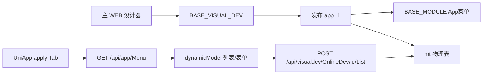
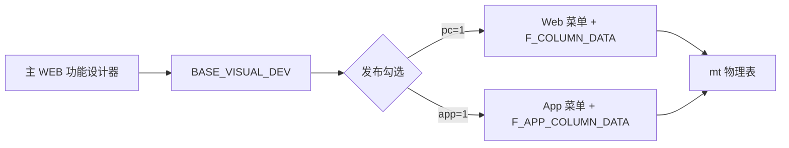
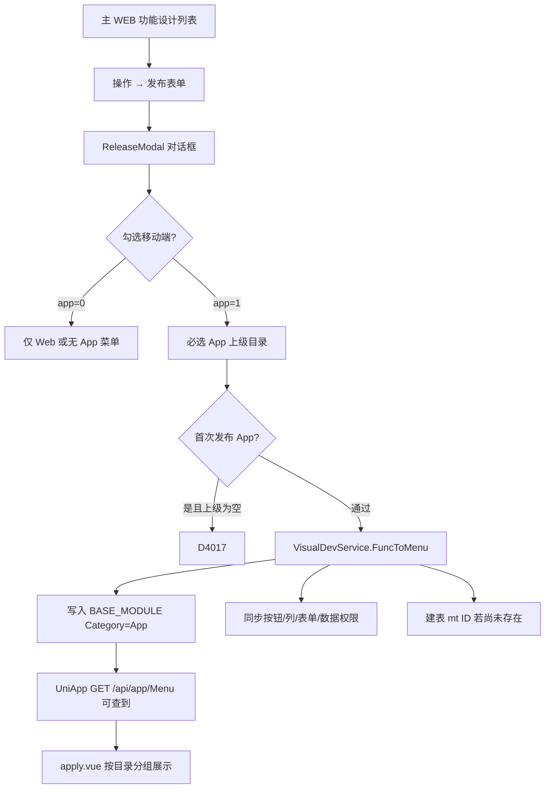
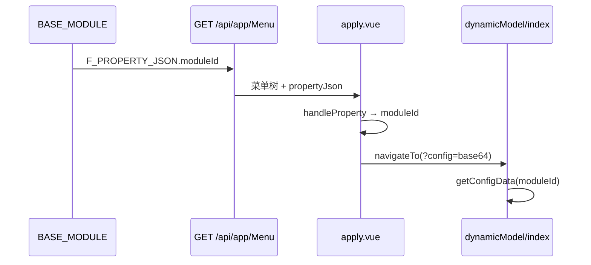
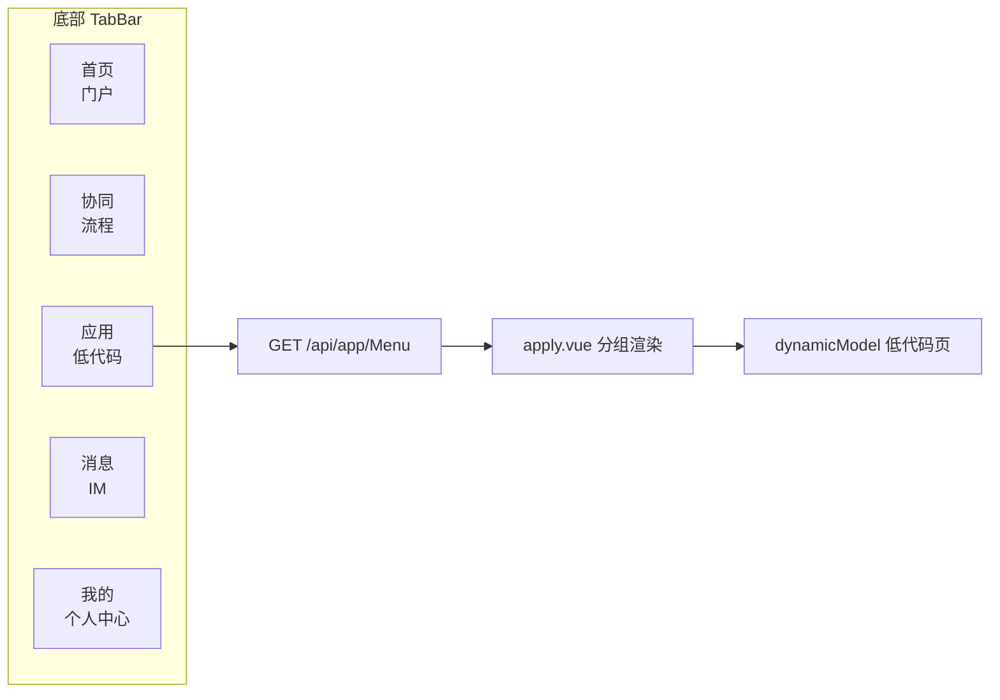
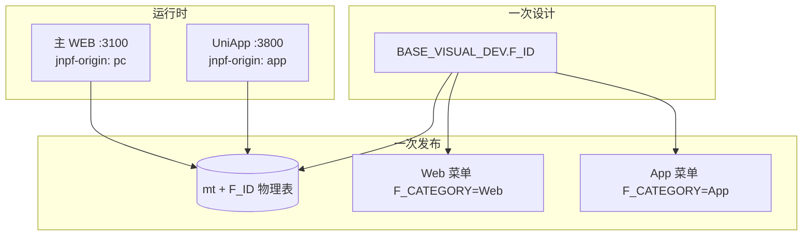

# JNPF v5.2 低代码框架 UniApp 移动 APP 生成全部功能操作手册

**文档编号**：v52-migration-docs-003-manual3  
**文档状态**：终审批准  
**审核人**：架构师  
**批准日期**：2026-05-23  
**版本**：v1.0-final  
**编写依据**：同目录 `1、三大操作手册编写要求.md`（经源码核验修订）  
**前置手册**：[`2、手册一-主WEB低代码代码生成操作手册.md`](2、手册一-主WEB低代码代码生成操作手册.md)（功能设计、发布机制基础）  
**源码仓库**：`d:\JNPF-v52\backend`（后端）；UniApp 前端运行时：`d:\JNPF-v52\jnpf-app-vue3\`  
**截图**：ch01–ch10 待补（不阻塞交付）

### 目录

| 章 | 标题 | 状态 |
|----|------|------|
| 一 | 概述 | ✅ |
| 二 | 环境配置与启动 | ✅ |
| 三 | 低代码表单创建——App 端差异 | ✅ |
| 四 | 发布到移动端 | ✅ |
| 五 | UniApp 端操作详解 | ✅ |
| 六 | Web ↔ App 数据互通 | ✅ |
| 七 | 多端打包与部署 | ✅ |
| 八 | 权限与角色 | ✅ |
| 九 | 常见问题与踩坑记录 | ✅ |
| 十 | API 参考 | ✅ |
| 附录 A | 配置字典 | ✅ |

---

> **截图说明**：各章 `[截图：…]` 占位符需在对应环境实际操作后保存至  
> `docs/架构迭代/6、培训与操作手册/03-uniapp-lowcode-operation-manual-screenshots/ch0N/`（N=章号），文件名与占位符编号一致。

---

## 第一章：概述

读完本章，你应能回答：**UniApp 在 JNPF 低代码体系中扮演什么角色、与手册一/二是什么关系、完整价值链路是什么**。  
本章不涉及具体操作（操作从第二章环境、第三章设计差异开始）。

---

### 1.1 UniApp 在 JNPF v5.2 中的定位

#### 1.1.1 一句话定义

**UniApp 是同一套低代码设计的移动端运行载体**——表单与列表仍在 **主 WEB（:3100）** 设计；发布时勾选「移动端」即可在 App 端访问，**无需单独写移动端代码**。

#### 1.1.2 与主 WEB 的分工

| 维度 | 主 WEB（手册一） | UniApp（本手册） |
|------|------------------|------------------|
| **设计器** | ✅ 功能设计三步向导 | ❌ 无设计器 |
| **发布** | ✅ 勾选 pc / app | 消费发布结果 |
| **运行** | 浏览器 `/model/{EnCode}` | 「应用」Tab → 低代码页 |
| **数据** | `mt{ID}` | **同一张** `mt{ID}` |
| **菜单 API** | CurrentUser.menuList | **`GET /api/app/Menu`** |

#### 1.1.3 使用者可见结果

| 能力 | 说明 |
|------|------|
| 移动端 CRUD | 列表、新增、编辑、删除（与 Web 同表） |
| App 菜单 | 发布写入 `BASE_MODULE`（`F_CATEGORY='App'`） |
| 移动门户 | 首页 Tab 演示门户（与低代码独立） |
| 协同/消息 | 流程、IM（非低代码核心，第五章简要说明） |

---

### 1.2 技术架构

#### 1.2.1 组件一览

| 层级 | 组件 | 说明 |
|------|------|------|
| 移动端前端 | `jnpf-app-vue3`（UniApp + Vue 3） | HBuilderX 工程；H5 / App / 小程序 |
| 设计端前端 | `jnpf-web-vue3` | 低代码设计器（手册一） |
| 后端 App 模块 | `JNPF.Apps` | `AppMenuService`、`AppDataService` |
| 低代码运行时 | `JNPF.VisualDev` | `RunService`、`VisualDevModelDataService` |
| API 宿主 | `JNPF.API.Entry` | `:30000` |
| 数据库 | SQL Server `jnpf_v52_test` | 共用 `BASE_*`、`mt*` |

#### 1.2.2 App 端数据流



关键差异：**请求头 `jnpf-origin: app`** → `RunService` 使用 `F_APP_COLUMN_DATA`（见第六章）。

#### 1.2.3 关键源码路径

| 功能 | 路径 |
|------|------|
| App 菜单 API | `modularity/app/JNPF.Apps/AppMenuService.cs` |
| App 菜单数据 | `modularity/app/JNPF.Apps/AppDataService.cs` |
| 列配置切换 | `modularity/visualdev/JNPF.VisualDev/RunService.cs:209-232` |
| 应用 Tab | `jnpf-app-vue3/pages/index/apply.vue` |
| 低代码运行 | `jnpf-app-vue3/pages/apply/dynamicModel/` |
| API 封装 | `jnpf-app-vue3/api/apply/visualDev.js` |
| 请求头 | `jnpf-app-vue3/utils/request.js:34` |

---

### 1.3 三手册关系——同一设计器，两种输出

```
                    ┌─────────────────────────────────────┐
                    │     JNPF v5.2 低代码体系全景          │
                    └─────────────────────────────────────┘
                                      │
          ┌───────────────────────────┼───────────────────────────┐
          │                           │                           │
          ▼                           ▼                           ▼
   ┌──────────────┐           ┌──────────────┐           ┌──────────────┐
   │ 手册一        │           │ 手册三（本册） │           │ 手册二        │
   │ 主 WEB 低代码  │           │ UniApp 移动端 │           │ 数字大屏      │
   │ :3100        │           │ :3800 H5     │           │ :8100 DataV  │
   └──────────────┘           └──────────────┘           └──────────────┘
          │                           │                           │
   功能设计 + Web 发布            同一设计 App 发布              独立大屏设计器
   /model/{EnCode}              应用 Tab + dynamicModel         BLADE_VISUAL_*
          │                           │                           │
          └─────────── 同 mt 表 ──────┘                           │
                    （第六章验证）                                  │
                                                                  无直接依赖
```

| 手册 | 必读章节（相对本册） |
|------|----------------------|
| **手册一** | 第三、四章（设计 + 发布）——**本册前置** |
| **手册三** | 全册（移动端访问与互通） |
| **手册二** | 独立；大屏与低代码表单无共用表 |

#### 1.3.1 Web 与 App 路由对照

| 端 | 菜单库字段 | 实际导航 |
|----|------------|----------|
| Web | `F_URL_ADDRESS=model/{EnCode}` | 路由 + `PropertyJson.moduleId` |
| App | `F_URL_ADDRESS=/pages/apply/dynamicModel/index?id={EnCode}` | **base64 config** 传菜单对象 + `moduleId`（第四章、5.4） |

> 库中 App URL 的 `id` 为菜单 EnCode；运行时 CRUD 的 `modelId` 为功能设计 **F_ID**。

---

### 1.4 核心价值链路

```
设计一次（主 WEB）
    │
    ├─→ 保存 → BASE_VISUAL_DEV
    │
    └─→ 发布 → pc=1 + app=1
              ├─→ Web 菜单（F_CATEGORY=Web）
              ├─→ App 菜单（F_CATEGORY=App，挂 App 目录）
              └─→ mt{ID} 物理表（仅一张）

Web 录入数据 ──→ mt{ID} ←── App 录入数据
         （无同步延迟、无中间件，第六章）
```

**实施验收标准**：Web 新增一条记录 → App 刷新列表可见；反之亦然；SQL `SELECT * FROM mt{ID}` 可见两端写入。

[截图：ch01-01-三手册关系与价值链路.png]

---

### 1.5 适用对象与阅读顺序

| 角色 | 阅读重点 |
|------|----------|
| 实施 / 运维 | 第二、四、五、九章 |
| 产品经理 | 第一、三章（设计差异）+ 五章（App 操作） |
| 二次开发 | 全册 + 源码索引 + 第十章 API |

**推荐顺序**：

```
第一章 概述 → 第二章 环境 → 第三章 App 设计差异
    → 第四章 发布 → 第五章 App 操作 → 第六章 互通验证
    → 第七至十章 + 附录（按需查阅）
```

**前置**：手册一第三、四章；v5.2 环境（API :30000、主 WEB :3100）已按手册一第二章启动。

---

## 第二章：环境配置与启动

**本章目标**：启动 UniApp 联调环境并完成检查清单。**低代码设计仍依赖主 WEB 与 API**——请先完成手册一第二章（API、Redis、数据库、主 WEB）。

---

### 2.1 项目结构（jnpf-app-vue3）

| 路径 | 说明 |
|------|------|
| `pages/` | 页面（含 `index/apply` 应用 Tab、`apply/dynamicModel` 低代码） |
| `api/` | 接口封装（`api/apply/apply.js` 菜单、`visualDev.js` CRUD） |
| `utils/request.js` | 统一请求（`jnpf-origin: app`） |
| `utils/define.js` | **baseURL**、WebSocket、超时 |
| `manifest.json` | 应用配置、H5 端口、打包参数 |
| `pages.json` | 路由与 **TabBar** |
| `unpackage/dist/build/web/` | H5 **发行产物**（proxy 模式静态根目录） |

工程路径（v5.2 环境）：`d:\JNPF-v52\jnpf-app-vue3\`

> **注意**：该目录 **无 `package.json`**，不是 uni-cli 命令行工程，需 **HBuilderX** 打开（2.2）。

---

### 2.2 项目类型：HBuilderX 工程

| 项 | 说明 |
|----|------|
| 类型 | DCloud **HBuilderX** 导入的 UniApp 项目 |
| 非 | `npm create uni-app` / Vite CLI 独立仓库 |
| 编译 | HBuilderX「运行」「发行」触发；产物在 `unpackage/` |
| 修改源码后 | HBuilderX 运行可热更新；**proxy 模式需重新发行 H5**（2.3） |

---

### 2.3 HBuilderX 启动方式（正式开发推荐）

| 步骤 | 操作 |
|------|------|
| 1 | 打开 HBuilderX |
| 2 | 文件 → 导入 → 从本地目录导入 |
| 3 | 选择 `d:\JNPF-v52\jnpf-app-vue3\` |
| 4 | 运行 → 运行到浏览器 → Chrome（或运行到手机模拟器） |
| 5 | 控制台查看实际端口（`manifest.json` H5 默认 **3800**） |

⚠ **不要用** `npm run dev` / `pnpm dev` 启动——项目根目录无 Node 包管理配置。

[截图：ch02-01-HBuilderX-导入工程.png]

---

### 2.4 uniapp-h5-proxy.js（快速联调）

#### 2.4.1 用途与原理

| 项 | 说明 |
|----|------|
| **用途** | 不打开 HBuilderX，命令行启动 H5 预览 |
| **脚本** | `d:\JNPF-v52\jnpf-app-vue3\scripts\proxy_server.py` |
| **静态根** | `jnpf-app-vue3/unpackage/dist/build/web` |
| **API 转发** | `/api/*` → `http://localhost:30000` |
| **访问** | `http://localhost:3800` |

#### 2.4.2 启动

```powershell
# 前提：已用 HBuilderX 发行过 H5（生成 unpackage/dist/build/web）
cd d:\JNPF-v52\jnpf-app-vue3
python scripts/proxy_server.py
```

#### 2.4.3 局限

| 局限 | 说明 |
|------|------|
| **无热更新** | 改 `jnpf-app-vue3` 源码后须 HBuilderX 重新「发行 → 网站-H5」并重启 proxy |
| **依赖发行包** | `unpackage/dist/build/web` 不存在则 404 |
| **仅 H5** | 不能替代 App/小程序真机调试 |

[截图：ch02-02-proxy-3800-登录页.png]

---

### 2.5 API 地址配置

#### 2.5.1 开发环境（define.js）

源码：`jnpf-app-vue3/utils/define.js`

```javascript
const baseURL = "http://localhost:30000"
const webSocketUrl = "ws://localhost:30000/api/message/websocket"
```

HBuilderX **运行**时直连 `:30000`；**proxy 模式**下浏览器请求 `/api` 由脚本转发，前端仍写相对或绝对 API 路径。

#### 2.5.2 生产 / 发行环境

| 端 | baseURL 配置 | 注意 |
|----|--------------|------|
| H5 部署 | 改为 `""` 或同源反代 | Nginx 将 `/api` 反代到后端 |
| Android / iOS | `define.js` 改为 **HTTPS 域名** | 应用商店要求 HTTPS |
| 微信小程序 | 微信公众平台配置 **合法域名** | 必须 HTTPS，且备案 |

#### 2.5.3 manifest.json

- H5 开发端口：`manifest.json` → `h5.devServer.port` = **3800**  
- 小程序：`mp-weixin` → `urlCheck: true`（生产校验合法域名）

---

### 2.6 认证方式

| 项 | Web | App |
|----|-----|-----|
| 登录 API | `POST /api/oauth/Login` | 同左 |
| **jnpf-origin** | `pc` | **`app`**（`request.js` 自动） |
| 菜单 | CurrentUser | **`GET /api/app/Menu`** |
| CurrentUser | `GET /api/oauth/CurrentUser?type=pc` | `?type=app`（用户信息，**非**低代码菜单主来源） |
| 密码传输 | MD5 → AES-ECB-Hex | 同左（手册一附录 A.8） |

---

### 2.7 环境检查清单（UniApp 联调）

完成下列全部打勾后再做第三章发布与第五章实机操作：

| # | 检查项 | 命令/操作 | 预期 |
|---|--------|-----------|------|
| 1 | API 可访问 | 打开 `http://localhost:30000/newapi/index.html` | Swagger 200 |
| 2 | Redis | `docker exec jnpf-redis redis-cli -a redis@123 ping` | `PONG` |
| 3 | 数据库 | SSMS 连接 `jnpf_v52_test` | 可查询 `BASE_USER` |
| 4 | 主 WEB（设计用） | `http://localhost:3100` 登录 | admin 可进功能设计 |
| 5 | H5 静态包 | 目录 `unpackage/dist/build/web/index.html` 存在 | 文件存在 |
| 6 | Proxy 或 HBuilderX | `:3800` 或 HBuilderX 运行 | 见登录页 |
| 7 | App 登录 | admin / 123456 | 进入 TabBar |
| 8 | F_APP_STANDING | `SELECT F_APP_STANDING FROM BASE_USER WHERE F_ACCOUNT='admin'` | **1** |
| 9 | App 菜单 API | `GET /api/app/Menu` + `jnpf-origin: app` + Token | 返回 `list` 树 |
| 10 | 请求头 | F12 Network 任选一 API | 含 `jnpf-origin: app` |

依赖服务未启动时的现象见 **第九章**。

[截图：ch02-03-环境检查清单打勾.png]

---

### 2.8 与手册一环境的关系

| 服务 | 手册一 | 本手册 |
|------|--------|--------|
| API :30000 | ✅ 必须 | ✅ 必须 |
| Redis | ✅ 必须 | ✅ 必须 |
| 主 WEB :3100 | ✅ 设计必备 | ✅ 发布前必备 |
| Flowable :31000 | 流程表单需要 | 低代码 CRUD **不需要** |
| UniApp :3800 | 不需要 | ✅ 本手册必须 |

---

## 第三章：低代码表单创建——App 端差异

本章**不重复**手册一第三章的完整操作步骤。低代码表单仍在 **主 WEB（:3100）** 的「在线开发 → 功能设计」中创建；本章只说明：**同一套设计器里，哪些配置会影响 App 端体验，以及 App 与 Web 的差异点**。

读完本章，你应能：在主 WEB 设计器中完成「Web + App 双端可用」的表单与列表配置，并理解 `F_APP_COLUMN_DATA` 与 `visibility` 的作用。

---

### 3.1 与手册一的关系（快速回顾）

| 项 | 说明 |
|----|------|
| **操作入口** | 主 WEB → 在线开发 → 功能设计（与手册一相同） |
| **完整步骤** | 见手册一 **第三章**（三步向导、组件体系、保存逻辑） |
| **本章定位** | 在手册一基础上，补充 **App 端特有** 的设计注意点 |
| **共用数据** | 同一 `BASE_VISUAL_DEV.F_ID` → 同一物理表 `mt{ID}` → Web/App 数据互通（第六章详述） |



---

### 3.2 Step 1 表单设计——App 端注意事项

#### 3.2.1 布局：单列优先

| 项 | Web | App |
|----|-----|-----|
| 屏幕宽度 | 宽屏，可多列栅格 | 窄屏，建议 **单列**（`span=24`） |
| 栅格 | 24 栅格自由组合 | 避免一行多列，防止控件挤压 |
| 复杂布局 | 分组、折叠可用 | 尽量减少嵌套分组 |

**推荐**：App 常用字段各占一行；非核心字段可放到折叠面板（若组件支持）。

#### 3.2.2 组件可见性（`visibility`）

源码：`jnpf-web-vue3/src/components/FormGenerator/src/helper/config.ts:73` — 默认 `visibility: ['pc', 'app']`。

| 配置 | 效果 |
|------|------|
| 仅 `pc` | Web 可见，App **不渲染**该字段 |
| 仅 `app` | App 可见，Web 不渲染 |
| `pc` + `app` | 双端均可见（默认） |

属性面板中可勾选「显示设备」。发布时：

- Web 表单权限：`visibility.Contains("pc")`（`VisualDevService.cs:1123`）
- App 表单权限：`visibility.Contains("app")`（`VisualDevService.cs:1329`）

> **踩坑**：某字段在 App 端消失 → 检查该控件 `visibility` 是否误去掉 `app`。

#### 3.2.3 组件选型建议（App 体验）

| 组件（jnpfKey） | App 建议 | 说明 |
|-----------------|----------|------|
| `input` / `textarea` | ✅ 推荐 | 基础录入 |
| `select` / `radio` / `checkbox` | ✅ 推荐 | 移动端原生选择器体验较好 |
| `date` / `time` | ✅ 推荐 | 调用移动端日期/时间控件 |
| `uploadImg` | ✅ 推荐 | **支持拍照上传**（移动端优势） |
| `uploadFz` | ⚠ 谨慎 | 大文件上传受网络影响 |
| `editor`（富文本） | ⚠ 谨慎 | 移动端编辑体验差，非必要不用 |
| `relationForm` / `popupSelect` | ⚠ 谨慎 | 弹窗选择在小屏上操作成本高 |
| `table`（设计子表） | ⚠ 谨慎 | 明细行在移动端可用但交互受限 |
| `sign` | ✅ 可用 | 适合现场签名场景 |

数据库类型映射与手册一 **3.4.4** 一致（以 `VisualDevService.FieldsModelToTableFile` 为准），**不因 App/Web 而变**。

#### 3.2.4 校验与联动

- 必填、正则、自定义校验：双端共用同一 `formData`，规则一致。  
- 显示/禁用联动（`linkage`）：双端共用；复杂联动在 App 窄屏上更易暴露布局问题，设计时先在 App 预览（第五章）验证。

[截图：ch03-01-Step1-控件可见性-pc与app.png]

---

### 3.3 Step 2 列表设计——桌面端 vs 移动端 Tab

#### 3.3.1 双 Tab 结构

列表设计器含 **桌面端 / 移动端** 两个 Tab（`BasicColumnDesign.vue:5-9`）：

| Tab | 组件 | 产出字段 |
|-----|------|----------|
| 桌面端 | `ColumnDesign/Main.vue` | `F_COLUMN_DATA` |
| 移动端 | `ColumnDesign/MainApp.vue` | `F_APP_COLUMN_DATA` |

保存时（`BasicColumnDesign.vue:47-51`）：

```javascript
// 若移动端 Tab 未配置任何列，自动复制桌面端 columnList
if (!appColumnData.columnList || !appColumnData.columnList.length) {
  appColumnData.columnList = columnData.columnList;
}
```

> **含义**：移动端 Tab 留空 → 发布/App 运行时会**沿用 PC 列配置**；但 PC 列宽、列数未必适合手机，**建议主动配置移动端 Tab**。

#### 3.3.2 移动端列配置要点

| 配置项 | Web 常见做法 | App 推荐 |
|--------|--------------|----------|
| **列宽** | 可 auto 或较大 px | **必须固定 px**（如 100–150） |
| **列数** | 6–10 列 | **3–4 列** |
| **列标题** | 可较长 | **4 字以内** |
| **搜索字段** | 多字段 | 核心 2–3 个 |
| **按钮** | 可放多个 | 保留增删改，自定义按钮按需 |

**原因**：UniApp 列表页无 PC 式横向滚动；列过多/过宽会导致布局撑破（手册一 3.5.5 踩坑 C，App 端更明显）。

#### 3.3.3 运行时列配置切换

后端 `RunService.cs:209-210`：

```csharp
bool udp = _userManager.UserOrigin == "pc"
    ? templateInfo.ColumnData.useDataPermission
    : templateInfo.AppColumnData.useDataPermission;
templateInfo.ColumnData = _userManager.UserOrigin == "pc"
    ? templateInfo.ColumnData
    : templateInfo.AppColumnData;
```

App 请求携带 `jnpf-origin: app`（`jnpf-app-vue3/utils/request.js:34`）时，列表查询、搜索、数据权限均走 **`F_APP_COLUMN_DATA`**（即移动端 Tab 配置）。

#### 3.3.4 列表类型（type）在 App 上的限制

| type | 模式 | App 说明 |
|------|------|----------|
| 1 | 普通列表 | ✅ 默认，App 完全支持 |
| 2 | 树形列表 | ⚠ 部分树形逻辑在 `RunService` 中对 `UserOrigin=="pc"` 有分支，App 需实测 |
| 3 | 分组列表 | 同左 |
| 4 | 复杂表头 | PC 专用逻辑较多（`RunService.cs:264` 等），App **不建议** |

**推荐**：面向 App 的功能优先使用 **type=1 普通列表**。

[截图：ch03-02-Step2-列表设计-移动端Tab.png]  
[截图：ch03-03-Step2-移动端列宽与列数示例.png]

---

### 3.4 Step 3 代码生成——与 App 的关系

手册一 **3.7** 已说明：v5.2 无表模式（`webType=2`）**发布时自动建表**，Step 3 对 App 无额外步骤。

| 项 | App 相关说明 |
|----|--------------|
| 物理表 | 仍为 `mt{F_ID}`，Web/App **共用** |
| 表前缀 | 发布时 `VisualDevService.cs:736` 创建，与端无关 |
| 代码预览 | Step 3 预览的 Vue 代码供二次开发参考；App 运行时**不依赖**该代码，走 UniApp 动态渲染 |

---

### 3.5 保存与发布前置检查（App 视角）

发布 App 菜单前，除手册一 **4.1** 的 COM1013/COM1014 外，建议额外自检：

| 检查项 | 验证方式 | 期望 |
|--------|----------|------|
| 表单非空 | `LEN(F_FORM_DATA) > 0` | 至少 1 个控件 |
| 列表非空 | `LEN(F_COLUMN_DATA) > 0` | 至少 1 列（COM1014） |
| 移动端列 | 打开移动端 Tab 确认 | 列宽固定、列数 ≤4 |
| 关键字段 visibility | 属性面板 | 含 `app` |
| 发布勾选 | 发布对话框 | `app=1` 且选好 App 上级（见第四章） |

```sql
SELECT F_ID, F_FULL_NAME,
       LEN(F_FORM_DATA) AS form_len,
       LEN(F_COLUMN_DATA) AS col_len,
       LEN(F_APP_COLUMN_DATA) AS app_col_len,
       F_STATE
FROM BASE_VISUAL_DEV
WHERE F_ID = '{功能设计ID}';
```

---

### 3.6 本章踩坑汇总

| # | 现象 | 根因 | 解决 |
|---|------|------|------|
| 1 | App 列表列宽溢出 | 沿用 PC 列配置且列宽 auto | 配置移动端 Tab，固定列宽 |
| 2 | App 某字段不显示 | `visibility` 无 `app` | 属性面板勾选 App 显示 |
| 3 | App 搜索条件与 Web 不一致 | 未配 `F_APP_COLUMN_DATA.searchList` | 在移动端 Tab 配置搜索字段 |
| 4 | 发布成功但 App 无菜单 | 未勾 App 或未选上级 | 见第四章 4.2、4.4 |
| 5 | 富文本/关联表单难用 | 组件不适合窄屏 | 换简单组件或仅 Web 显示 |

---

### 本章小结

- 表单/列表仍在 **主 WEB** 设计；App 差异主要在 **布局、组件选型、visibility、移动端列表 Tab**。  
- `F_APP_COLUMN_DATA` 为空时发布会复制 PC 列，但**不应依赖默认复制**。  
- **下一步（第四章）**：勾选「生成移动端菜单」并正确挂载 App 目录 → UniApp「应用」Tab 可见。

---

### 附录：第三章相关源码索引

| 主题 | 路径 |
|------|------|
| 列表双 Tab | `jnpf-web-vue3/src/components/ColumnDesign/src/BasicColumnDesign.vue` |
| 移动端列表设计 | `jnpf-web-vue3/src/components/ColumnDesign/src/components/MainApp.vue` |
| 控件 visibility 默认 | `jnpf-web-vue3/src/components/FormGenerator/src/helper/config.ts:73` |
| App 列运行时切换 | `modularity/visualdev/JNPF.VisualDev/RunService.cs:209-232` |
| App 表单权限过滤 | `modularity/visualdev/JNPF.VisualDev/VisualDevService.cs:1329` |
| 手册一完整设计步骤 | 同目录 `2、手册一…` 第三章 |

---

## 第四章：发布到移动端

本章是手册三的**核心**。迁移与联调中，App 端「菜单有了但应用 Tab 看不到」「发布报 D4017」「点了菜单白屏」等问题，几乎都出在**发布对话框 App 上级选择**或**菜单挂载层级**——读透本章可避免重踩。

---

### 4.1 发布流程概述



| 步骤 | 操作位置 | 结果 |
|------|----------|------|
| 1 | 完成功能设计三步并保存 | `BASE_VISUAL_DEV` 有完整 JSON |
| 2 | 列表 →「发布表单」 | 打开发布对话框 |
| 3 | 勾选「移动端」 | `app=1` |
| 4 | 选择 **App 上级目录** | 写入 `F_PARENT_ID` |
| 5 | 确定 | 创建/更新 App 菜单 + 权限 |
| 6 | UniApp「应用」Tab | 展开目录 → 点击功能图标进入低代码页 |

与 Web 发布**共用同一 API**（手册一 4.1.3）：

```http
POST /api/visualdev/Base/{功能设计F_ID}/Actions/Release
Authorization: Bearer {token}
Content-Type: application/json
```

---

### 4.2 发布对话框——移动端配置详解

#### 4.2.1 入口与组件

```
主 WEB → 在线开发 → 功能设计 → 选中记录 → 操作 →「发布表单」
```

组件：`jnpf-web-vue3/src/views/onlineDev/webDesign/components/ReleaseModal.vue`

#### 4.2.2 移动端区域字段

| 字段 | 绑定 | 说明 |
|------|------|------|
| 移动端开关 | `dataForm.app` | 1=发布 App 菜单；0=不发布 |
| App 上级 | `appModuleParentId` | **首次发布 App 时必填**（数组，可多选系统下不同目录） |
| 已发布路径 | `record.appReleaseName` | 再次发布时显示已有 App 菜单路径 |

前端校验（`ReleaseModal.vue:93-100, 146-147`）：

- 至少勾选桌面端或移动端之一。  
- **首次发布 App**（`!record.appIsRelease`）时，`appModuleParentId` 必填。

App 上级树加载（`ReleaseModal.vue:125-133`）：

```javascript
getMenuSelectorFilter({ category: 'App' }, id).then(res => {
  let list = res.data.list || [];
  for (let index = 0; index < list.length; index++) {
    const item = list[index];
    if (item.type == 0) item.disabled = true;  // 系统根节点不可选
  }
  state.appTreeData = list;
});
```

> **注意**：`type==0` 为系统节点，前端 **disabled**；不能作为 App 上级。

[截图：ch04-01-发布对话框-移动端勾选与上级.png]

#### 4.2.3 请求体示例（仅 App）

```json
{
  "pc": 0,
  "app": 1,
  "pcModuleParentId": [],
  "appModuleParentId": ["406720838398647366"],
  "platformRelease": "{\"pc\":0,\"app\":1}"
}
```

Web + App 同时发布时，`pcModuleParentId` 与 `appModuleParentId` 各自独立；**App 上级必须是有子节点的 App 目录**（见 4.4.2）。

#### 4.2.4 错误码 D4017（App 端）

| 项 | 说明 |
|----|------|
| **触发** | `app=1` 且 `appModuleParentId` **为空**，且该功能 **从未发布过 App 菜单** |
| **源码** | `VisualDevService.cs:705-706` |
| **典型场景** | 首次发布 App 未选上级；或误以为系统根可选 |
| **解决** | 在 App 树中选择**已有目录**（如「功能参考」）；若无目录，先建 App 目录（4.6） |

再次发布且 App 菜单已存在时，上级可留空——后端复用已有 `ParentId`（`VisualDevService.cs:708-714` 逻辑同 Web）。

---

### 4.3 App 菜单在数据库中的记录

#### 4.3.1 写入逻辑

源码：`VisualDevService.cs:1132-1229`（App 分支，`platform.Key == "App"`）

| 字段 | 典型值 | 说明 |
|------|--------|------|
| **F_FULL_NAME** | 功能名称 | App 菜单显示名 |
| **F_EN_CODE** | `{功能EnCode}{5位随机}` | 首次发布防重复（同 Web） |
| **F_TYPE** | **3** | **功能页**（非 2 页面、非 1 目录） |
| **F_CATEGORY** | `App` | 区分 Web 菜单 |
| **F_URL_ADDRESS** | `/pages/apply/dynamicModel/index?id={菜单EnCode}` | 库中存储的路由模板 |
| **F_PARENT_ID** | 所选 App **目录** ID | **勿为 `-1`（系统根）** |
| **F_SYSTEM_ID** | 所属应用系统 ID | 与上级目录一致 |
| **F_PROPERTY_JSON** | `{"moduleId":"{功能设计F_ID}",...}` | **运行时解析设计 ID 的关键** |
| **F_ENABLED_MARK** | 1 | 启用 |

> **源码修正（相对编写要求旧稿）**：App 菜单 `F_TYPE=3`（功能），与 Web 低代码菜单一致；**不是** `F_TYPE=2`（页面）。见 `ModuleEntity.cs:21`。

#### 4.3.2 URL 与运行时导航（重要）

库中 `F_URL_ADDRESS` 含 `id={菜单EnCode}`，但 UniApp **实际导航**并不直接拼该 URL：

源码：`jnpf-app-vue3/pages/index/apply.vue:283-295`

```javascript
// type==3 为低代码功能菜单
if (item.type == 3 || item.type == 9) {
  if (!item.moduleId) { /* PropertyJson 解析失败 */ return; }
  uni.navigateTo({
    url: "/pages/apply/dynamicModel/index?config="
      + this.jnpf.base64.encode(JSON.stringify(item)),
  });
}
```

`moduleId` 来自 `handleProperty` 解析 `propertyJson`（`apply.vue:402-408`）：

```javascript
let propertyJson = JSON.parse(o.propertyJson);
this.$set(o, "moduleId", propertyJson.moduleId || "");
```

低代码页 `dynamicModel/index.vue` 再用 `config.moduleId`（功能设计 **F_ID**）调 `GET /api/visualdev/OnlineDev/{modelId}/Config` 加载配置。



---

### 4.4 验证 App 菜单是否发布成功

#### 4.4.1 SQL 验证

```sql
-- 按功能设计 ID 查 App 菜单
SELECT F_ID, F_FULL_NAME, F_EN_CODE, F_TYPE, F_CATEGORY,
       F_URL_ADDRESS, F_PARENT_ID, F_PROPERTY_JSON, F_ENABLED_MARK
FROM BASE_MODULE
WHERE F_CATEGORY = 'App'
  AND F_PROPERTY_JSON LIKE '%{功能设计F_ID}%'
  AND F_DELETE_MARK IS NULL;

-- 查上级是否为目录（F_TYPE=1）而非系统根
SELECT p.F_FULL_NAME AS parent_name, p.F_TYPE AS parent_type, p.F_PARENT_ID
FROM BASE_MODULE m
JOIN BASE_MODULE p ON m.F_PARENT_ID = p.F_ID
WHERE m.F_ID = '{App菜单F_ID}';
```

期望：

- 存在 `F_CATEGORY='App'` 且 `F_TYPE=3` 的记录。  
- `F_PARENT_ID` 指向 **F_TYPE=1** 的 App 目录，且该目录 `F_PARENT_ID` 不是孤立的系统根叶子。

#### 4.4.2 API 验证

```http
GET /api/app/Menu
Authorization: Bearer {token}
jnpf-origin: app
```

服务类：`AppMenuService.cs:41-45` → `AppDataService.GetAppMenuList`

响应结构：`{ list: [ 树形菜单 ] }`（`ToTree("-1")`）

**⚠ API 有数据 ≠ 前端一定可见**。UniApp 应用 Tab 额外过滤（`apply.vue:390`）：

```javascript
this.list = list.filter(o => o.children && o.children.length);
this.menuList = this.list;
```

| 层级 | 行为 |
|------|------|
| **后端 AppMenuService** | **不做**「删除无子节点根级项」过滤；返回权限内全部 App 菜单树 |
| **前端 apply.vue** | 只展示 **`children.length > 0`** 的分组；叶子功能页必须在某目录下 |

因此：**新发布的 App 功能页（F_TYPE=3）必须挂在已有 App 目录（F_TYPE=1）下**，且该目录在树中作为分组显示。若菜单 `F_PARENT_ID=-1` 直接挂系统根，分组无有效子结构，**应用 Tab 不显示**。

模板渲染（`apply.vue:47-56`）：分组标题 `v-if="item?.children?.length"`，子项 `v-for="child in item.children"`。

[截图：ch04-02-SQL验证App菜单记录.png]  
[截图：ch04-03-应用Tab-目录下见新菜单.png]

#### 4.4.3 发布状态与平台标记

```sql
SELECT F_STATE, F_PLATFORM_RELEASE
FROM BASE_VISUAL_DEV
WHERE F_ID = '{功能设计F_ID}';
-- F_STATE=1 已发布；F_PLATFORM_RELEASE 含 "app":1
```

---

### 4.5 与 Web 同时发布 / 仅 App 发布

| 场景 | pc | app | 说明 |
|------|----|-----|------|
| 仅 Web | 1 | 0 | 手册一 4.3 |
| 仅 App | 0 | 1 | 只写 App 菜单，Web 无入口 |
| 双端 | 1 | 1 | **推荐**；同一 `mt{ID}`，数据互通 |
| 再次发布 | 可只改一端 | 勾选状态保留在 `platformRelease` | 未勾选的端不更新菜单 |

同一功能设计 **F_ID** 对应 **一条** `BASE_VISUAL_DEV` 和 **一张** `mt{ID}`；Web/App 菜单是 `BASE_MODULE` 中 **两条不同** 记录（`F_CATEGORY` 分别为 `Web` / `App`）。

---

### 4.6 无合适 App 目录时——手工创建

若 App 上级树中无可用目录，可在 `BASE_MODULE` 插入 **App 目录**（F_TYPE=1）：

```sql
INSERT INTO BASE_MODULE (
  F_ID, F_FULL_NAME, F_EN_CODE, F_TYPE, F_PARENT_ID,
  F_CATEGORY, F_SYSTEM_ID, F_ENABLED_MARK, F_TENANT_ID, F_SORT_CODE
)
VALUES (
  '{雪花ID}', '我的应用', 'myApp', 1,
  '406720838398647365',  -- 示例：devDemoSystem 下某节点，以环境为准
  'App', 'devDemoSystem', 1, '0', 999
);
```

然后在发布对话框 **App 上级** 中选择「我的应用」。

> **禁止**：把低代码功能页（F_TYPE=3）直接挂到 `F_PARENT_ID='-1'` 且期望在应用 Tab 首页分组展示。

---

### 4.7 重新发布、删除与 App 菜单残留

#### 4.7.1 重新发布 App

- 再次点「发布表单」→ 确认覆盖线上版本（`ReleaseModal.vue:165-169`）。  
- 同步 App 菜单的按钮/列/表单权限；**不删除** `mt{ID}` 业务数据。  
- 若修改了 `F_APP_COLUMN_DATA`，重新发布后 App 列表/搜索即时按新配置（`RunService` 读最新发布快照）。

#### 4.7.2 删除功能设计对 App 的影响

与手册一 **4.6.5** 相同：**软删除**设计记录，**不自动删除** App 菜单、`mt{ID}`、`BASE_AUTHORIZE`。

```
删除功能设计后 App 端残留：

  BASE_MODULE (F_CATEGORY=App)  → 仍在，应用 Tab 可能仍可点
  PropertyJson.moduleId         → 指向已软删除的设计 → 白屏/报错
  mt{ID}                        → 业务数据仍在
```

**清理 SQL 模板**（执行前确认 ID）：

```sql
-- 1. 查 App 菜单
SELECT F_ID FROM BASE_MODULE
WHERE F_CATEGORY='App' AND F_PROPERTY_JSON LIKE '%{功能设计F_ID}%';

-- 2. 删授权（按需）
DELETE FROM BASE_AUTHORIZE WHERE F_ITEM_ID IN ('{App菜单F_ID}');

-- 3. 删菜单
UPDATE BASE_MODULE SET F_DELETE_MARK=1 WHERE F_ID='{App菜单F_ID}';
```

---

### 4.8 发布规范总结（App  checklist）

| # | 规范 | 验证 |
|---|------|------|
| 1 | 首次 App 发布必须选 **App 目录** 上级 | 不报 D4017 |
| 2 | 不选系统根（type=0）作上级 | `ReleaseModal` 树中 disabled |
| 3 | 确认 `F_TYPE=3`、`F_CATEGORY=App` | SQL 4.4.1 |
| 4 | `PropertyJson.moduleId` = 功能设计 F_ID | SQL + API |
| 5 | 用户 `F_APP_STANDING` 允许登录 App | 第五章 / 登录不报 D1044 |
| 6 | 角色具备 App 菜单授权 | `BASE_AUTHORIZE` |
| 7 | UniApp 请求带 `jnpf-origin: app` | 拦截器自动 |
| 8 | 删除设计后手动清 App 菜单 | 避免残留点击白屏 |

---

### 4.9 本章踩坑汇总

| # | 现象 | 根因 | 解决 |
|---|------|------|------|
| 1 | 发布报 **D4017** | App 首次发布未选上级 | 选 App 目录 |
| 2 | API 有菜单，应用 Tab 无 | 菜单挂系统根或分组无 children | 改 `F_PARENT_ID` 到目录下 |
| 3 | 点击菜单「暂无此页面」 | `propertyJson.moduleId` 空或设计已删 | 查 F_PROPERTY_JSON；恢复或重发布 |
| 4 | App 列表列不对 | 未配移动端 Tab，或 origin 非 app | 配 `F_APP_COLUMN_DATA`；查请求头 |
| 5 | 误以为 F_TYPE=2 | 编写要求旧稿笔误 | **低代码 App 菜单 F_TYPE=3** |
| 6 | 删除设计后 App 仍能点但白屏 | 菜单残留 | 4.7.2 手动清理 |

---

### 本章小结

- App 发布与 Web **同一发布 API**；差异在 `app=1` 与 **App 上级目录**。  
- **D4017** = 首次 App 发布缺上级；**应用 Tab 不可见** = 前端只要「有子节点的分组」，目录挂载是根因。  
- 运行时 CRUD 的 `modelId` 是 **功能设计 F_ID**（来自 `PropertyJson`），不是菜单 EnCode。  
- **下一步（第五章）**：UniApp H5（:3800）登录 → 应用 Tab → 低代码列表/新增/编辑实机操作。

---

### 附录：第四章相关源码索引

| 主题 | 路径 |
|------|------|
| 发布对话框 | `jnpf-web-vue3/src/views/onlineDev/webDesign/components/ReleaseModal.vue` |
| 发布核心逻辑 | `modularity/visualdev/JNPF.VisualDev/VisualDevService.cs:660-744, 1132-1229` |
| D4017 App 分支 | `VisualDevService.cs:705-706` |
| App 菜单 API | `modularity/app/JNPF.Apps/AppMenuService.cs` |
| App 菜单数据 | `modularity/app/JNPF.Apps/AppDataService.cs:200-241` |
| 应用 Tab 过滤 | `jnpf-app-vue3/pages/index/apply.vue:390-391, 47-56, 283-295` |
| 低代码页入口 | `jnpf-app-vue3/pages/apply/dynamicModel/index.vue` |
| App 请求头 | `jnpf-app-vue3/utils/request.js:34` |
| App CRUD（前端实际调用） | `jnpf-app-vue3/api/apply/visualDev.js` |
| App CRUD（后端专用控制器） | `modularity/visualdev/JNPF.VisualDev/VisualdevModelAppService.cs` |
| 模块 F_TYPE 定义 | `modularity/system/JNPF.Systems.Entitys/Entity/System/ModuleEntity.cs:21` |

---

## 第五章：UniApp 端操作详解

本章在 **已完成 App 菜单发布**（第四章）的前提下，指导你在 UniApp H5 环境中完成登录、导航与低代码 CRUD 实机操作。  
环境默认：**API `:30000`** + **UniApp H5 proxy `:3800`**（详见 Day3 第二章）。

---

### 5.1 登录

#### 5.1.1 访问地址与前置条件

| 项 | 值 |
|----|-----|
| **H5 预览地址** | `http://localhost:3800`（`uniapp-h5-proxy.js` 代理模式） |
| **HBuilderX 运行** | 运行 → 运行到浏览器 → Chrome（端口以控制台为准） |
| **默认账号** | `admin` / `123456` |
| **后端 API** | `http://localhost:30000`（proxy 脚本转发） |

启动顺序（与手册一第二章一致）：

1. 启动 API：`dotnet run --project application/JNPF.API.Entry/JNPF.API.Entry.csproj`  
2. 启动 proxy：`cd d:\JNPF-v52\jnpf-app-vue3
python scripts/proxy_server.py`  
3. 浏览器打开 `http://localhost:3800` → 自动进入登录页 `pages/login/index`

[截图：ch05-01-登录页.png]

#### 5.1.2 认证机制

| 项 | 说明 |
|----|------|
| **登录 API** | `POST /api/oauth/Login`（与 Web 相同） |
| **请求头** | `jnpf-origin: app`（`jnpf-app-vue3/utils/request.js:34` **自动附加**） |
| **密码协议** | MD5(明文) → AES-ECB-Hex（与手册一附录 A.8 一致） |
| **Token** | 响应 `data.token` → 后续请求 `Authorization: Bearer {token}` |

登录成功后跳转 TabBar 首页 `pages/index/index`（`pages.json` 第一个 Tab 页）。

#### 5.1.3 F_APP_STANDING 与 D1044

v5.2 迁移测试库 `BASE_USER` 含 **`F_APP_STANDING`** 字段（迁移脚本扩展，当前 `UserEntity.cs` 未映射该列，以 **SSMS 实际 DDL** 为准）：

| F_APP_STANDING | 含义 |
|----------------|------|
| 1 | 超级管理员（App 全量菜单） |
| 2 | 分管管理员 |
| 3 | 普通用户 |

| 现象 | 原因 | 解决 |
|------|------|------|
| 登录报 **D1044** | `F_APP_STANDING` 为空或非法值 | `UPDATE BASE_USER SET F_APP_STANDING=1 WHERE F_ACCOUNT='admin'` |
| 登录报 **D1038** | 用户未分配 App 系统/菜单权限 | 检查 `F_APP_SYSTEM_ID`、`BASE_AUTHORIZE` |

```sql
SELECT F_ACCOUNT, F_IS_ADMINISTRATOR, F_APP_STANDING, F_APP_SYSTEM_ID
FROM BASE_USER
WHERE F_ACCOUNT = 'admin' AND F_DELETE_MARK IS NULL;
```

> **admin 实施账号**：迁移环境通常 `F_APP_STANDING=1`；新建用户默认为 3，需管理员调整。

[截图：ch05-02-登录成功进入首页.png]

---

### 5.2 首页（Tab：首页）

**路由**：`pages/index/index`（TabBar 第 1 项，`pages.json:564-567`）

#### 5.2.1 页面结构

| 区域 | 说明 | 源码 |
|------|------|------|
| 顶栏 | 系统名称、扫码、切换门户 | `index.vue` uni-nav-bar |
| 门户内容 | 若用户有 `appPortalId` → 加载可视化门户组件 | `portalItem` |
| 默认门户 | 无 `appPortalId` 时展示 `defaultPortal` | `index.vue:68-72` |

默认演示门户含：销售指数、交易卡片、公告等演示组件（`defaultPortal` 子组件）。门户数据来自 App 端门户配置，**与低代码功能设计无直接关系**。

#### 5.2.2 与低代码的关系

首页是 **移动办公门户**；低代码业务页入口在 **「应用」Tab**（5.4），不在首页。

[截图：ch05-03-首页-默认门户.png]

---

### 5.3 底部 TabBar 导航

配置：`jnpf-app-vue3/pages.json:559-593`

| 序号 | Tab 文案 | pagePath | 功能概述 |
|------|----------|----------|----------|
| 1 | 首页 | `pages/index/index` | 移动门户、公告、指标卡片 |
| 2 | 协同 | `pages/index/workFlow` | 待办、日程、文档、流程发起 |
| 3 | **应用** | `pages/index/apply` | **低代码功能入口（本章核心）** |
| 4 | 消息 | `pages/index/message` | 站内信、通讯录、IM 会话 |
| 5 | 我的 | `pages/index/my` | 个人资料、组织、设置、退出 |



[截图：ch05-04-TabBar五栏.png]

---

### 5.4 应用 Tab（低代码入口——核心）

**路由**：`pages/index/apply`（TabBar 第 3 项）

#### 5.4.1 菜单数据来源

| 项 | Web 端 | App 端 |
|----|--------|--------|
| **菜单 API** | `GET /api/oauth/CurrentUser` → `menuList` | **`GET /api/app/Menu`** |
| **客户端** | `jnpf-web-vue3` 路由守卫 | `api/apply/apply.js:getMenuList` |
| **分类** | `F_CATEGORY='Web'` | `F_CATEGORY='App'` |

```javascript
// api/apply/apply.js
export function getMenuList(data) {
  return request({ url: '/api/app/Menu', method: 'get', data });
}
```

后端：`AppMenuService.GetList` → `AppDataService.GetAppMenuList` → `ToTree("-1")`。**后端不做「无子节点根级过滤」**。

#### 5.4.2 前端渲染逻辑（问题出在前端，非后端）

`apply.vue:386-391` 拉取菜单后：

```javascript
getMenuList(query).then((res) => {
  let list = res.data.list || [];
  this.list = list.filter(o => o.children && o.children.length);  // 关键过滤
  this.menuList = this.list;
  this.handleProperty(this.list);  // 解析 propertyJson → moduleId
});
```

模板（`apply.vue:47-56`）：

```html
<view class="part" v-for="(item, i) in menuList" :key="i">
  <view class="caption" v-if="item?.children?.length">{{ item.fullName }}</view>
  <view class="item" v-for="(child, ii) in item.children" @click="handelClick(child)">
    <!-- 子菜单图标 + 名称 -->
  </view>
</view>
```

| 层级 | 行为 |
|------|------|
| **一级分组** | 仅 `children.length > 0` 的节点进入 `menuList` |
| **二级功能** | 点击 `type==3` 的低代码菜单 → 进入动态页 |
| **常用菜单** | 顶部「常用菜单」区来自 `GET /api/system/MenuData`（独立接口） |

> **⚠ 必读**：新发布的低代码菜单必须挂在 **已有 App 目录（F_TYPE=1）** 下。若挂系统根且前端树中该节点无 `children`，**应用 Tab 不显示**——这是 **apply.vue 前端过滤**，不是 AppMenuService 后端过滤（见第四章 4.4.2）。

[截图：ch05-05-应用Tab-目录分组.png]

#### 5.4.3 进入低代码页面

点击 `type==3` 子菜单（`apply.vue:283-295`）：

```javascript
if (item.type == 3 || item.type == 9) {
  if (!item.moduleId) return toast('暂无此页面');
  uni.navigateTo({
    url: "/pages/apply/dynamicModel/index?config="
      + this.jnpf.base64.encode(JSON.stringify(item)),
  });
}
```

`moduleId` 由 `handleProperty` 从 `propertyJson.moduleId` 解析（功能设计 **F_ID**）。

低代码页加载（`dynamicModel/index.vue`）：

1. `onLoad` → base64 解码 `config`  
2. `getConfigData(config.moduleId)` → `GET /api/visualdev/OnlineDev/{modelId}/Config`  
3. 按 `webType` 渲染 `List`（列表+表单）或 `Form`（纯表单）

[截图：ch05-06-应用Tab-点击低代码菜单.png]

#### 5.4.4 操作步骤（从应用到低代码页）

| 步骤 | 操作 |
|------|------|
| 1 | 底部 Tab 点 **「应用」** |
| 2 | 在分组标题下找到已发布功能（如「功能参考」→「巡检记录」） |
| 3 | 点击功能图标 |
| 4 | 进入低代码列表页（导航栏显示功能名称） |

若看不到菜单 → 按第四章 4.4 排查（SQL / API / 上级目录 / 授权）。

---

### 5.5 低代码页面操作

组件路径：`pages/apply/dynamicModel/components/list/index.vue`（列表）、`form/index.vue`（表单）

#### 5.5.1 列表页

| 功能 | 操作 | API |
|------|------|-----|
| **列表加载** | 进入页面自动上拉加载 | `POST /api/visualdev/OnlineDev/{modelId}/List` |
| **下拉刷新** | 下拉列表区域 | 同上，`mescroll-uni` 触发 |
| **排序** | 顶栏「排序」下拉 | `queryJson` + `sidx` |
| **筛选** | 顶栏「筛选」→ 搜索表单 | 来自 `F_APP_COLUMN_DATA.searchList` |
| **分页** | 上拉加载更多 | `currentPage` / `pageSize` |

列表请求（`list/index.vue:293`）：

```javascript
getModelList(this.modelId, {
  modelId: this.modelId,
  currentPage: page.num,
  pageSize: page.size,
  queryJson: this.queryJson,
  ...
});
```

[截图：ch05-07-低代码列表页.png]

#### 5.5.2 新增

| 步骤 | 操作 |
|------|------|
| 1 | 列表右下角 **「+」** 浮动按钮（需 `btn_add` 权限） |
| 2 | 跳转表单页（全屏，非 Web 弹窗） |
| 3 | 填写 Step 1 设计的字段（`visibility` 含 `app` 的控件） |
| 4 | 点「提交」 |

API（`form/index.vue:166`）：

```javascript
createModel(this.modelId, this.dataForm)
// → POST /api/visualdev/OnlineDev/{modelId}
// Header: jnpf-origin: app（自动）
```

[截图：ch05-08-低代码新增表单.png]

#### 5.5.3 编辑 / 详情

| 步骤 | 操作 |
|------|------|
| 1 | 点击列表行 → `goDetail(item)` |
| 2 | 有 `btn_edit` → 进入编辑；仅 `btn_detail` → 只读详情 |
| 3 | 修改字段 → 保存 |

API：

```javascript
// 读取
GET /api/visualdev/OnlineDev/{modelId}/{recordId}
// 更新
PUT /api/visualdev/OnlineDev/{modelId}/{recordId}
```

[截图：ch05-09-低代码编辑页.png]

#### 5.5.4 删除

两种方式：

| 方式 | 操作 | 源码 |
|------|------|------|
| **左滑删除** | 列表行左滑 → 点「删除」 | `list/list.vue:4-5` `u-swipe-action` |
| **批量删除** | 点批量图标 → 勾选 → 底部删除 | `list/index.vue:99-123` |

API（`list/index.vue:559`）：

```javascript
deteleModel({ ids: [id] }, this.modelId)
// → POST /api/visualdev/OnlineDev/batchDelete/{modelId}
```

> **路径说明**：UniApp 前端统一走 `/api/visualdev/OnlineDev/...`，**不是** `/OnlineDev/App/...`；后端 `VisualdevModelAppService` 为备用控制器，日常联调以浏览器 Network 面板实际请求为准。

[截图：ch05-10-低代码左滑删除.png]

---

### 5.6 协同 / 消息 / 我的（简要）

#### 5.6.1 协同 Tab（`pages/index/workFlow`）

| 入口 | 说明 |
|------|------|
| 待办 | `/pages/workFlow/flowTodo/index` |
| 日程 | `/pages/workFlow/schedule/index` |
| 文档 | `/pages/workFlow/document/index` |
| 常用流程 | 流程模板快捷发起 |

未启用工作流时显示「该应用协同办公未开启」。**与低代码无直接关联**，流程表单（`webType=3`）另走流程引擎。

#### 5.6.2 消息 Tab（`pages/index/message`）

站内信、通讯录、IM 会话列表。消息推送依赖后端 Message 模块与 WebSocket（非低代码范畴）。

#### 5.6.3 我的 Tab（`pages/index/my`）

个人资料、组织/岗位、下属、委托、修改密码、退出登录等。

[截图：ch05-11-协同消息我的-概览.png]

---

### 5.7 本章踩坑汇总

| # | 现象 | 根因 | 解决 |
|---|------|------|------|
| 1 | 登录 D1044 | `F_APP_STANDING` 异常 | SQL 改为 1 |
| 2 | 应用 Tab 空白 | apply.vue 过滤无 children 分组 | 菜单挂 App 目录（第四章） |
| 3 | 点击菜单「暂无此页面」 | `propertyJson.moduleId` 空 | 检查发布与 PropertyJson |
| 4 | 无「+」按钮 | 无 `btn_add` 权限 | 重新发布或角色授权 |
| 5 | 列表列与 Web 不一致 | 正常——走 App 列配置 | 配移动端 Tab（第三章） |
| 6 | Network 见 `/OnlineDev/` 非 `/App/` | 前端设计如此 | 勿按旧文档改客户端 |

---

### 本章小结

- 登录：`jnpf-origin: app` 自动携带；`F_APP_STANDING` 影响 App 登录。  
- **低代码入口在「应用」Tab**，菜单来自 **`GET /api/app/Menu`**，非 CurrentUser。  
- 列表/新增/编辑/删除均走 **`/api/visualdev/OnlineDev/{modelId}`** 系列接口。  
- **下一步（第六章）**：验证 Web 写入 App 可读、App 写入 Web 可读——同一张 `mt{ID}` 表。

---

### 附录：第五章相关源码索引

| 主题 | 路径 |
|------|------|
| TabBar | `jnpf-app-vue3/pages.json:559-593` |
| 登录页 | `jnpf-app-vue3/pages/login/index.vue` |
| 首页 | `jnpf-app-vue3/pages/index/index.vue` |
| 应用 Tab | `jnpf-app-vue3/pages/index/apply.vue` |
| 菜单 API 客户端 | `jnpf-app-vue3/api/apply/apply.js` |
| 低代码入口 | `jnpf-app-vue3/pages/apply/dynamicModel/index.vue` |
| 列表 CRUD | `jnpf-app-vue3/pages/apply/dynamicModel/components/list/index.vue` |
| 表单提交 | `jnpf-app-vue3/pages/apply/dynamicModel/components/form/index.vue` |
| 左滑删除 | `jnpf-app-vue3/pages/apply/dynamicModel/components/list/list.vue:4-5` |
| 请求头 | `jnpf-app-vue3/utils/request.js:34` |
| CRUD API 封装 | `jnpf-app-vue3/api/apply/visualDev.js` |

---

## 第六章：Web ↔ App 数据互通

本章验证手册三的核心价值主张：**同一功能设计、同一物理表、双端实时读写，无同步中间件**。

---

### 6.1 核心原理



| 项 | 说明 |
|----|------|
| **物理表** | Web 与 App 读写 **同一张** `mt{功能设计F_ID}` |
| **设计 ID** | 两端 `modelId` 均为 `PropertyJson.moduleId`（功能设计 F_ID） |
| **同步** | **无** MQ/定时任务；写入即落库，对端刷新列表可见 |
| **差异** | 仅 **展示层**（列、字段 visibility）和 **请求头** 不同 |

---

### 6.2 API 路径与 Header 区别

#### 6.2.1 路径对照（基于 Day1 修正 #3）

| 操作 | Web 实际路径 | App 实际路径 | 是否相同 |
|------|--------------|--------------|----------|
| 列表 | `POST /api/visualdev/OnlineDev/{id}/List` | 同左 | ✅ |
| 新增 | `POST /api/visualdev/OnlineDev/{id}` | 同左 | ✅ |
| 详情 | `GET /api/visualdev/OnlineDev/{id}/{recordId}` | 同左 | ✅ |
| 编辑 | `PUT /api/visualdev/OnlineDev/{id}/{recordId}` | 同左 | ✅ |
| 批量删 | `POST /api/visualdev/OnlineDev/batchDelete/{id}` | 同左 | ✅ |
| 配置 | `GET /api/visualdev/OnlineDev/{id}/Config` | 同左 | ✅ |

**前端客户端**：

- Web：`jnpf-web-vue3/src/api/onlineDev/visualDev.ts`  
- App：`jnpf-app-vue3/api/apply/visualDev.js`

两端 URL **一致**；App **不**调用 `/api/visualdev/OnlineDev/App/{id}`（该路由由 `VisualdevModelAppService` 提供，为后端备用入口，非 UniApp 客户端默认路径）。

#### 6.2.2 Header 区别（真正的「端」标识）

| Header | Web | App |
|--------|-----|-----|
| `jnpf-origin` | `pc` | `app` |
| `Authorization` | `Bearer {token}` | 同左 |
| `vue-version` | `3` | `3` |

#### 6.2.3 后端如何区分端

`RunService.cs:209-232`：

```csharp
// UserOrigin 来自 jnpf-origin 请求头
templateInfo.ColumnData = _userManager.UserOrigin == "pc"
    ? templateInfo.ColumnData
    : templateInfo.AppColumnData;

queryWhere = GetQueryJson(input.queryJson,
    _userManager.UserOrigin == "pc" ? templateInfo.ColumnData : templateInfo.AppColumnData, ...);
```

| UserOrigin | 列配置 | 搜索字段 | 数据权限开关 |
|------------|--------|----------|--------------|
| `pc` | `F_COLUMN_DATA` | PC searchList | `columnData.useDataPermission` |
| `app` | `F_APP_COLUMN_DATA` | App searchList | `appColumnData.useDataPermission` |

**落库逻辑相同**：`Create` / `Update` / `Delete` 均操作 `mt{ID}`，与 origin 无关。

---

### 6.3 验证方法

以下用 `{ID}` 表示功能设计 F_ID（如 `2058337396986089472`），`{field}` 表示业务字段名（如 `testField`）。

#### 6.3.1 Web 写入 → App 查看

| 步骤 | 操作 |
|------|------|
| 1 | 主 WEB 登录 → 进入已发布 Web 菜单 |
| 2 | 点「新增」→ 填写 `{field}` = `互通测试-Web-001` → 保存 |
| 3 | UniApp 登录 → 应用 Tab → 进入 **同一功能** App 菜单 |
| 4 | 下拉刷新列表 → **应看到** `互通测试-Web-001` |

**SQL 验证**：

```sql
SELECT f_id, {field}, F_CREATOR_TIME
FROM mt{ID}
WHERE {field} LIKE N'%互通测试-Web-001%'
ORDER BY F_CREATOR_TIME DESC;
```

[截图：ch06-01-Web写入App可见.png]

#### 6.3.2 App 写入 → Web 查看

| 步骤 | 操作 |
|------|------|
| 1 | UniApp → 应用 Tab → 进入低代码页 |
| 2 | 点「+」→ `{field}` = `互通测试-App-002` → 提交 |
| 3 | 主 WEB → 同一功能 Web 菜单 → 刷新列表 |
| 4 | **应看到** `互通测试-App-002` |

**SQL 验证**：

```sql
SELECT f_id, {field}, F_CREATOR_TIME
FROM mt{ID}
WHERE {field} LIKE N'%互通测试-App-002%'
ORDER BY F_CREATOR_TIME DESC;
```

[截图：ch06-02-App写入Web可见.png]

#### 6.3.3 数据库直连验证

```sql
-- 最近 10 条（双端写入混合）
SELECT TOP 10 f_id, {field}, F_CREATOR_TIME, F_CREATOR_USER_ID
FROM mt{ID}
ORDER BY F_CREATOR_TIME DESC;
```

期望：Web 与 App 写入的记录 **f_id 不同、同表共存**，`F_CREATOR_USER_ID` 对应当前登录用户。

#### 6.3.4 curl 快速验证（可选）

```bash
# 1. App 端登录（需 AES 加密密码，见手册一第二章）
# 2. App 端新增
curl -X POST "http://localhost:30000/api/visualdev/OnlineDev/{ID}" \
  -H "Authorization: Bearer {token}" \
  -H "jnpf-origin: app" \
  -H "Content-Type: application/json" \
  -d '{"data":"{\"testField\":\"curl-App-003\"}"}'

# 3. Web 端列表（origin: pc）
curl -X POST "http://localhost:30000/api/visualdev/OnlineDev/{ID}/List" \
  -H "Authorization: Bearer {token}" \
  -H "jnpf-origin: pc" \
  -H "Content-Type: application/json" \
  -d '{"modelId":"{ID}","currentPage":1,"pageSize":20}'
```

---

### 6.4 数据格式与展示差异

**数据本身完全一致**（同表同列）；差异仅在 **UI 展示层**：

| 维度 | Web | App | 数据是否一致 |
|------|-----|-----|--------------|
| **列表列** | `F_COLUMN_DATA.columnList` | `F_APP_COLUMN_DATA.columnList` | ✅ 同行数据，列可能不同 |
| **搜索项** | PC searchList | App searchList | ✅ 同表过滤 |
| **表单字段** | `visibility` 含 `pc` | `visibility` 含 `app` | ✅ 同列存储 |
| **按钮** | PC btnsList | App btnsList | 权限独立配置 |
| **日期格式** | PC format | App format | ✅ 库中 datetime 相同 |

#### 6.4.1 示例：列数不同但数据相同

| 端 | 列表显示列 |
|----|------------|
| Web | 名称、编号、状态、创建人、创建时间（5 列） |
| App | 名称、状态、创建时间（3 列，移动端 Tab 精简） |

两行记录的主键 `f_id` 与 `{field}` 值 **完全相同**；仅 App 隐藏了部分列。

#### 6.4.2 示例：字段 visibility 不同

| 控件 | visibility | Web 表单 | App 表单 |
|------|------------|----------|----------|
| 备注 | `['pc']` | 显示 | **不显示** |
| 现场照片 | `['pc','app']` | 显示 | 显示 |

提交时 App 不传「备注」→ 该列保持 NULL 或原值（编辑场景）。

---

### 6.5 不应出现「不同步」的情况

| 若出现 | 排查 |
|--------|------|
| Web 有、App 无 | 是否 **同一功能**（同一 `{ID}` / 同一 App 菜单 PropertyJson） |
| App 有、Web 无 | Web 列表是否刷新；数据权限方案是否过滤（`useDataPermission`） |
| SQL 有、UI 无 | 搜索条件残留；Tab 筛选；F_TENANT_ID 非 `'0'` |
| 完全两表 | 误操作两个不同功能设计 → 两个 `mt` 表 |

---

### 6.6 本章踩坑汇总

| # | 现象 | 根因 | 解决 |
|---|------|------|------|
| 1 | 以为 App 用 `/OnlineDev/App/` | 旧文档/备用控制器误导 | 以 Network + visualDev.js 为准 |
| 2 | 列不同以为数据不同 | App 列配置精简 | 查 SQL 验证同表 |
| 3 | App 缺字段 | visibility 无 app | 设计器勾选 App 显示 |
| 4 | 一端有数据一端无 | 不同 mt 表 | 核对 PropertyJson.moduleId |
| 5 | curl 成功 UI 失败 | origin 或 token 错误 | 检查 Header |

---

### 本章小结

- Web/App **同表** `mt{ID}`，**同 API 路径**，**异 Header**（`jnpf-origin`）。  
- 后端 `RunService` 按 origin 切换 **列/搜索/权限配置**，不改变落库表。  
- 验证互通：**Web 写 → App 读 → SQL 查** 三步闭环即可。  
- **下一步**：第七至十章（打包、权限、踩坑、API）+ 附录 A。

---

### 附录：第六章相关源码索引

| 主题 | 路径 |
|------|------|
| origin 切换列配置 | `modularity/visualdev/JNPF.VisualDev/RunService.cs:209-232` |
| Web CRUD 服务 | `modularity/visualdev/JNPF.VisualDev/VisualDevModelDataService.cs` |
| App 备用 CRUD 服务 | `modularity/visualdev/JNPF.VisualDev/VisualdevModelAppService.cs` |
| Web 客户端 API | `jnpf-web-vue3/src/api/onlineDev/visualDev.ts` |
| App 客户端 API | `jnpf-app-vue3/api/apply/visualDev.js` |
| App 请求头 | `jnpf-app-vue3/utils/request.js:34` |

---

## 第七章：多端打包与部署

本章说明如何将 `jnpf-app-vue3` 产出为 **H5 / Android / iOS / 微信小程序**，以及各端 **API 地址** 配置差异。  
低代码业务逻辑在后端运行时，**打包只影响壳与静态资源**，不重新编译 C#。

---

### 7.1 H5 打包（网站 / 移动 Web）

| 步骤 | 操作 |
|------|------|
| 1 | HBuilderX 打开 `jnpf-app-vue3` |
| 2 | 发行 → 网站-PC Web 或 **网站-H5** |
| 3 | 产出目录：`unpackage/dist/build/web/` |
| 4 | 将 web 目录部署到 Nginx/IIS 静态站点 |
| 5 | 配置反向代理：`/api` → 后端 `https://your-api.com` |

**生产 define.js**：`baseURL` 设为 `""`（同源）或完整 API 域名。

**联调 proxy**：第七章产出即 `uniapp-h5-proxy.js` 的静态根（第二章 2.4）。

[截图：ch07-01-H5发行.png]

---

### 7.2 Android 打包

| 步骤 | 操作 |
|------|------|
| 1 | HBuilderX → 发行 → **原生 App-云打包**（或本地打包） |
| 2 | `manifest.json` → App 模块配置 → Android 包名、证书 |
| 3 | 图标、启动图按向导配置 |
| 4 | 提交打包 → 下载 **.apk** |

| 注意项 | 说明 |
|--------|------|
| **API 地址** | 修改 `utils/define.js` 的 `baseURL` 为 **HTTPS 生产域名** |
| **权限** | 相机/相册（上传图片）、定位等按 manifest 声明 |
| **低代码页** | 已含于 `pages/apply/dynamicModel`，无需额外注册 |

[截图：ch07-02-Android云打包.png]

---

### 7.3 iOS 打包

| 步骤 | 操作 |
|------|------|
| 1 | 发行 → 原生 App-云打包 → iOS |
| 2 | 配置 Bundle ID、Apple 开发者证书/描述文件 |
| 3 | 产出 **.ipa** → TestFlight 或 App Store |

| 注意项 | 说明 |
|--------|------|
| 证书 | 需 Apple Developer 账号 |
| ATS | iOS 默认要求 HTTPS API |
| Universal Links | `manifest.json` 可配 `associated-domains`（按需） |

---

### 7.4 微信小程序打包

| 步骤 | 操作 |
|------|------|
| 1 | 发行 → 小程序-微信 |
| 2 | 填写微信小程序 **AppID** |
| 3 | 产出目录导入 **微信开发者工具** |
| 4 | 上传审核 |

| 注意项 | 说明 |
|--------|------|
| **合法域名** | 微信公众平台 → 开发 → 服务器域名 → request 合法域名 |
| **urlCheck** | 开发版可关；体验/正式版必须配置 HTTPS 域名 |
| **WebSocket** | 消息 Tab 需配置 `wss://` 合法域名 |

---

### 7.5 各端 API 地址配置差异

| 运行形态 | baseURL 典型值 | jnpf-origin |
|----------|----------------|-------------|
| HBuilderX 开发 H5 | `http://localhost:30000` | `app` |
| proxy :3800 | 相对 `/api`（脚本转发） | `app` |
| 生产 H5（同域反代） | `""` | `app` |
| Android / iOS 独立域名 | `https://api.example.com` | `app` |
| 微信小程序 | `https://api.example.com`（合法域名） | `app` |

**低代码 CRUD 路径不因端而变**：均为 `/api/visualdev/OnlineDev/{id}/...`（第六章）。

---

### 7.6 打包后低代码功能验证

| # | 验证项 |
|---|--------|
| 1 | 登录成功（D1044、D1038 无） |
| 2 | 应用 Tab 可见已发布目录与功能 |
| 3 | 低代码列表/新增/编辑/删除 |
| 4 | 与 Web 端数据互通（第六章） |

---

## 第八章：权限与角色

App 端权限与 Web **共用同一套数据库表**；差异在于菜单 `F_CATEGORY='App'` 与 `jnpf-origin: app` 下的运行时过滤。

---

### 8.1 App 端权限体系

#### 8.1.1 四层结构（与手册一 6.1 一致）

| 层级 | 表/机制 | App 说明 |
|------|---------|----------|
| 菜单 | `BASE_MODULE` + `BASE_AUTHORIZE` | 仅 `F_CATEGORY='App'` 的 module |
| 按钮 | `BASE_MODULE_BUTTON` | `btn_add`、`btn_edit` 等 |
| 列 | `BASE_MODULE_COLUMN` | App 列表列显示（结合 App 列配置） |
| 表单 | `BASE_MODULE_FORM` | App 表单字段（结合 visibility） |
| 数据 | `BASE_MODULE_DATA_AUTHORIZE_SCHEME` | `RunService` 按 origin 读 App 列上的 `useDataPermission` |

发布低代码时同步生成上述记录（`VisualDevService.cs` App 分支，第四章）。

#### 8.1.2 App 菜单权限数据源

| 角色 | App 菜单来源 |
|------|--------------|
| 超级管理员 | `AppDataService.GetAppMenuList` 查全部 App 菜单 |
| 普通用户 | `BASE_AUTHORIZE` 过滤后的 App module |
| 分管 | `DataScope` 含 `AppSystemId` 时可见该系统全部 App 菜单 |

源码：`AppDataService.cs:200-241`

---

### 8.2 不同角色看到不同 App 菜单/数据

#### 8.2.1 配置入口

```
主 WEB → 系统管理 → 权限管理 → 角色管理 → 权限
```

勾选 **App 分类** 下对应菜单（与 Web 菜单授权独立，需分别勾选）。

#### 8.2.2 现象对照

| 现象 | 原因 | 解决 |
|------|------|------|
| App 无某低代码菜单 | 角色未授权 App module | 角色权限勾选 App 菜单 |
| 无「+」按钮 | 无 `btn_add` | 按钮权限 / 重新发布 |
| 列表行为空 | 数据权限「仅本人」 | 换 admin 或调整方案 |
| admin 全有 | `IsAdministrator=1` | 正常 |

验证 SQL（App 菜单授权）：

```sql
SELECT a.F_OBJECT_ID, m.F_FULL_NAME, m.F_CATEGORY
FROM BASE_AUTHORIZE a
JOIN BASE_MODULE m ON a.F_ITEM_ID = m.F_ID
WHERE a.F_ITEM_TYPE = 'module'
  AND m.F_CATEGORY = 'App'
  AND a.F_OBJECT_ID = '{角色ID}';
```

[截图：ch08-01-角色App菜单权限.png]

---

### 8.3 F_APP_STANDING 与 F_IS_ADMINISTRATOR

v5.2 迁移库 `BASE_USER` 扩展字段（DDL 以 SSMS 为准；`UserEntity.cs` 当前未映射 `F_APP_STANDING`）：

| 字段 | 值 | App 含义 |
|------|-----|----------|
| **F_APP_STANDING** | 1 | App 超级管理员身份 |
| | 2 | App 分管管理员 |
| | 3 | 普通 App 用户 |
| **F_IS_ADMINISTRATOR** | 1 | 平台超级管理员（Web+App 特权） |

| 错误码 | 场景 |
|--------|------|
| **D1044** | `F_APP_STANDING` 无效（迁移环境约定，见手册一附录 A.9） |
| **D1038** | 未分配 App 系统/菜单权限 |

```sql
UPDATE BASE_USER SET F_APP_STANDING = 1 WHERE F_ACCOUNT = 'admin';
```

---

## 第九章：常见问题与踩坑记录

本章汇总第三至八章全部 ⚠ 点，格式统一：**现象 → 原因 → 解决 → 验证**。

---

### 9.1 环境与启动类

#### 9.1.1 UniApp :3800 打不开

| 项 | 内容 |
|----|------|
| **现象** | 连接拒绝或白屏 |
| **原因** | proxy 未启动；或 `unpackage/dist/build/web` 不存在 |
| **解决** | `node uniapp-h5-proxy.js`；或 HBuilderX 先发行 H5 |
| **验证** | `http://localhost:3800` 见登录页 |

#### 9.1.2 proxy 改代码不生效

| 项 | 内容 |
|----|------|
| **现象** | 改 vue 文件后页面不变 |
| **原因** | proxy 托管静态发行包，**无热更新** |
| **解决** | HBuilderX 重新发行 H5 + 重启 proxy |
| **验证** | 改动的 UI 出现在新发行包 |

#### 9.1.3 HBuilderX dev baseURL 错误

| 项 | 内容 |
|----|------|
| **现象** | API 全 404 或 CORS |
| **原因** | `define.js` 中 baseURL 非 `:30000` |
| **解决** | 开发环境设为 `http://localhost:30000` |
| **验证** | Network 请求指向 30000 |

#### 9.1.4 登录 D1044

| 项 | 内容 |
|----|------|
| **现象** | App 登录失败，码 D1044 |
| **原因** | `F_APP_STANDING` 为空或非法 |
| **解决** | 设为 1（超管）或有效 2/3 |
| **验证** | 登录进 TabBar |

#### 9.1.5 jnpf-origin 缺失

| 项 | 内容 |
|----|------|
| **现象** | 401 或菜单/列配置错乱 |
| **原因** | 手工调 API 未带 `jnpf-origin: app` |
| **解决** | 使用 `request.js`；curl 手动加 Header |
| **验证** | 响应正常且 App 列生效 |

---

### 9.2 设计与发布类

#### 9.2.1 发布 COM1013 / COM1014

| 项 | 内容 |
|----|------|
| **现象** | 发布失败 |
| **原因** | formData / columnData 为空 |
| **解决** | 完成手册一 Step1/2 并保存 |
| **验证** | `LEN(F_FORM_DATA)>0` 且 `LEN(F_COLUMN_DATA)>0` |

#### 9.2.2 发布 D4017

| 项 | 内容 |
|----|------|
| **现象** | App 首次发布报错 D4017 |
| **原因** | 未选 App 上级目录 |
| **解决** | 发布对话框选 App 目录（非系统根） |
| **验证** | 发布成功，`BASE_MODULE` 有 App 行 |

#### 9.2.3 App 菜单 API 有、应用 Tab 无

| 项 | 内容 |
|----|------|
| **现象** | `GET /api/app/Menu` 有数据，Tab 空白 |
| **原因** | **前端** `apply.vue` 过滤无 `children` 分组；菜单挂错层级 |
| **解决** | `F_PARENT_ID` 指向 App 目录（F_TYPE=1） |
| **验证** | 应用 Tab 见分组标题与子菜单 |

> **归因修正**：非 `AppMenuService` 后端过滤。

#### 9.2.4 误认 F_TYPE=2

| 项 | 内容 |
|----|------|
| **现象** | 文档与库中类型不一致 |
| **原因** | 旧稿笔误 |
| **解决** | 低代码 App 菜单 **F_TYPE=3** |
| **验证** | `ModuleEntity.cs:21` |

#### 9.2.5 删除设计后 App 菜单残留

| 项 | 内容 |
|----|------|
| **现象** | 设计已删，App 仍可点但白屏 |
| **原因** | 软删除不删 `BASE_MODULE` |
| **解决** | 第四章 4.7.2 清理 SQL |
| **验证** | 菜单删除或禁用 |

---

### 9.3 App 端操作类

#### 9.3.1 点击菜单「暂无此页面」

| 项 | 内容 |
|----|------|
| **现象** | toast 暂无此页面 |
| **原因** | `propertyJson.moduleId` 空或设计已删 |
| **解决** | 重发布；查 F_PROPERTY_JSON |
| **验证** | `handleProperty` 解析出 moduleId |

#### 9.3.2 无新增按钮

| 项 | 内容 |
|----|------|
| **现象** | 列表无「+」 |
| **原因** | 无 `btn_add` 权限 |
| **解决** | 角色授权或 admin 测试 |
| **验证** | Config 中 btnPermission 含 btn_add |

#### 9.3.3 列表列溢出

| 项 | 内容 |
|----|------|
| **现象** | App 列表横向撑破 |
| **原因** | 未配移动端 Tab，沿用 PC 多列 |
| **解决** | 第三章 3.3 配 App 列宽固定 |
| **验证** | 列数 ≤4，固定 px |

#### 9.3.4 某字段 App 不显示

| 项 | 内容 |
|----|------|
| **现象** | Web 有、App 无 |
| **原因** | `visibility` 无 `app` |
| **解决** | 属性面板勾选 App |
| **验证** | formData 中 visibility 含 app |

---

### 9.4 数据互通类

#### 9.4.1 误以为 App 用 /OnlineDev/App/

| 项 | 内容 |
|----|------|
| **现象** | 文档与 Network 不一致 |
| **原因** | 备用控制器 `VisualdevModelAppService` |
| **解决** | 客户端以 `visualDev.js` 为准 |
| **验证** | POST `/OnlineDev/{id}` + origin app |

#### 9.4.2 列不同以为数据不同

| 项 | 内容 |
|----|------|
| **现象** | Web 5 列 App 3 列 |
| **原因** | 正常——`F_APP_COLUMN_DATA` 精简 |
| **解决** | SQL 查同表同行 |
| **验证** | `SELECT * FROM mt{ID}` |

#### 9.4.3 一端有数据一端无

| 项 | 内容 |
|----|------|
| **现象** | 不应出现「不同步」 |
| **原因** | 不同功能设计 / 不同 mt 表；或数据权限 |
| **解决** | 核对 PropertyJson.moduleId；换 admin 试 |
| **验证** | 同一 `{ID}` SQL 可见 |

---

### 9.5 数据库迁移类（与手册一共用）

#### 9.5.1 F_TENANT_ID 非 '0'

| 项 | 内容 |
|----|------|
| **现象** | 列表空 |
| **原因** | 迁移 COALESCE 为 default |
| **解决** | 统一改为 `'0'` |
| **验证** | 查询有数据 |

#### 9.5.2 JSON 列截断 2628

| 项 | 内容 |
|----|------|
| **现象** | 保存/发布 SQL 2628 |
| **原因** | formData 列非 max |
| **解决** | 执行 `10-fix-json-columns.sql` |
| **验证** | 大表单保存成功 |

---

## 第十章：API 参考

本章汇总 UniApp 低代码联调常用 API。认证默认：`Authorization: Bearer {token}` + **`jnpf-origin: app`**。

---

### 10.1 App 菜单 API

#### 10.1.1 获取菜单树

```http
GET /api/app/Menu?keyword=
Authorization: Bearer {token}
jnpf-origin: app
```

| 项 | 说明 |
|----|------|
| 服务 | `AppMenuService.GetList` |
| 响应 | `{ list: [ 树形节点 ] }` |
| 节点字段 | `id`, `fullName`, `type`, `propertyJson`, `children`, `urlAddress` |
| 低代码菜单 | `type=3`，`propertyJson.moduleId`= 功能设计 F_ID |

#### 10.1.2 子菜单（目录展开）

```http
GET /api/app/Menu/getChildList/{parentId}
```

---

### 10.2 登录与 CurrentUser

#### 10.2.1 登录

```http
POST /api/oauth/Login
Content-Type: application/x-www-form-urlencoded
jnpf-origin: app

account=admin&password={AES加密后}&grant_type=password
```

密码加密规则见手册一附录 A.8。

#### 10.2.2 当前用户（辅助）

```http
GET /api/oauth/CurrentUser?type=app
Authorization: Bearer {token}
jnpf-origin: app
```

返回用户信息、App 系统 ID 等；**低代码菜单请以 10.1 为准**。

---

### 10.3 低代码 CRUD API（App 客户端实际路径）

> 与 Web **路径相同**；`VisualdevModelAppService`（`/OnlineDev/App/`）为备用，**非** UniApp 默认调用。

| 方法 | 路径 | 说明 |
|------|------|------|
| GET | `/api/visualdev/OnlineDev/{modelId}/Config?type=1` | 列表/表单配置 |
| POST | `/api/visualdev/OnlineDev/{modelId}/List` | 分页列表 |
| GET | `/api/visualdev/OnlineDev/{modelId}/{recordId}` | 详情 |
| POST | `/api/visualdev/OnlineDev/{modelId}` | **新增** |
| PUT | `/api/visualdev/OnlineDev/{modelId}/{recordId}` | 更新 |
| POST | `/api/visualdev/OnlineDev/batchDelete/{modelId}` | 批量删除 |

`modelId` = 功能设计 **F_ID**（非菜单 EnCode）。

---

### 10.4 curl 示例

```bash
# 变量
API=http://localhost:30000
# TOKEN 通过 Login 获取；PASSWORD 为 AES 加密后的 hex

# App 菜单
curl -s "$API/api/app/Menu" \
  -H "Authorization: Bearer $TOKEN" \
  -H "jnpf-origin: app"

# 列表
curl -s -X POST "$API/api/visualdev/OnlineDev/{modelId}/List" \
  -H "Authorization: Bearer $TOKEN" \
  -H "jnpf-origin: app" \
  -H "Content-Type: application/json" \
  -d '{"modelId":"{modelId}","currentPage":1,"pageSize":20}'

# 新增
curl -s -X POST "$API/api/visualdev/OnlineDev/{modelId}" \
  -H "Authorization: Bearer $TOKEN" \
  -H "jnpf-origin: app" \
  -H "Content-Type: application/json" \
  -d '{"data":"{\"testField\":\"curl-App-test\"}"}'

# Web 端查同一表（对比 origin）
curl -s -X POST "$API/api/visualdev/OnlineDev/{modelId}/List" \
  -H "Authorization: Bearer $TOKEN" \
  -H "jnpf-origin: pc" \
  -H "Content-Type: application/json" \
  -d '{"modelId":"{modelId}","currentPage":1,"pageSize":20}'
```

---

### 10.5 错误码速查（App 相关）

| 码 | 含义 | 常见触发 |
|----|------|----------|
| D4017 | 未选菜单上级 | App 首次发布未选目录 |
| D1038 | 未分配权限 | 无 App 系统/菜单 |
| D1044 | App 身份异常 | F_APP_STANDING 无效 |
| COM1013 | formData 空 | 未设计表单发布 |
| COM1014 | columnData 空 | 未设计列表发布 |
| 401 | 未授权 | Token 过期或 origin 错误 |

---

## 附录 A：配置字典

本附录 **引用并扩展** 手册一附录 A，补充 **App 端特有** 配置项。字段类型、F_TYPE、密码协议等与手册一一致处不重复展开。

---

### A.1 App 端请求标识

| 配置项 | 值 | 位置 |
|--------|-----|------|
| jnpf-origin | `app` | `utils/request.js:34` |
| vue-version | `3` | 同文件 |
| baseURL（开发） | `http://localhost:30000` | `utils/define.js` |
| H5 端口 | `3800` | `manifest.json` → h5.devServer.port |

---

### A.2 App 菜单与路由

| 项 | 规则 |
|----|------|
| 菜单 API | `GET /api/app/Menu` |
| F_CATEGORY | `App` |
| 低代码 F_TYPE | **3**（功能） |
| 库中 F_URL_ADDRESS | `/pages/apply/dynamicModel/index?id={菜单EnCode}` |
| 实际导航 | `?config={base64(菜单对象)}` |
| 运行时 modelId | `propertyJson.moduleId` = 功能设计 F_ID |
| 应用 Tab 过滤 | 前端 `apply.vue` 仅 `children.length>0` 的分组 |

---

### A.3 双端列配置字段

| 字段 | 表 | 用途 |
|------|-----|------|
| F_COLUMN_DATA | BASE_VISUAL_DEV | Web 列表（origin=pc） |
| F_APP_COLUMN_DATA | BASE_VISUAL_DEV | App 列表（origin=app） |
| visibility | formData JSON | 控件 pc/app 显示 |

---

### A.4 F_APP_STANDING（迁移库）

| 值 | 含义 |
|----|------|
| 1 | App 超级管理员 |
| 2 | App 分管 |
| 3 | App 普通用户 |

登录 App 前确认测试账号该字段有效（第八章 8.3）。

---

### A.5 CRUD 路径（定稿）

| 调用方 | 新增路径 | Header |
|--------|----------|--------|
| jnpf-web-vue3 | `POST /api/visualdev/OnlineDev/{id}` | jnpf-origin: pc |
| jnpf-app-vue3 | **同左** | jnpf-origin: app |
| 备用（Swagger） | `POST /api/visualdev/OnlineDev/App/{id}` | 按 UserOrigin |

---

### A.6 与手册一共用条目索引

| 主题 | 参见 |
|------|------|
| 字段类型映射 | 手册一 附录 A.1 |
| F_TYPE / F_CATEGORY | 手册一 附录 A.2–A.3 |
| F_TENANT_ID | 手册一 附录 A.6 |
| 密码协议 | 手册一 附录 A.8 |
| COM1013/COM1014 | 手册一 附录 A.9 |

---

**手册三交付说明（全文完成）**

| 章节 | 状态 |
|------|------|
| 第一至十章 + 附录 A | ✅ |
| 截图 ch01–ch10 | ⏳ 待实机补全（不阻塞定稿） |

**下一步**：手册二（数字大屏，独立体系）。

---

## 本会话结论（episodic 索引友好）

- **决策**：手册三 Day3 补全 ch01–02、ch07–10、附录 A；全书十十章结构完整
- **交付物**：`docs/架构迭代/6、培训与操作手册/3、手册三-UniApp低代码移动APP生成操作手册.md`
- **禁止项**：不写手册二内容于本文件
- **待审/阻塞**：架构师终审；ch01–ch10 截图并行
- **下一步**：手册二（数字大屏）
