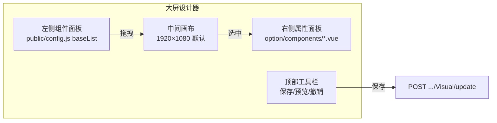
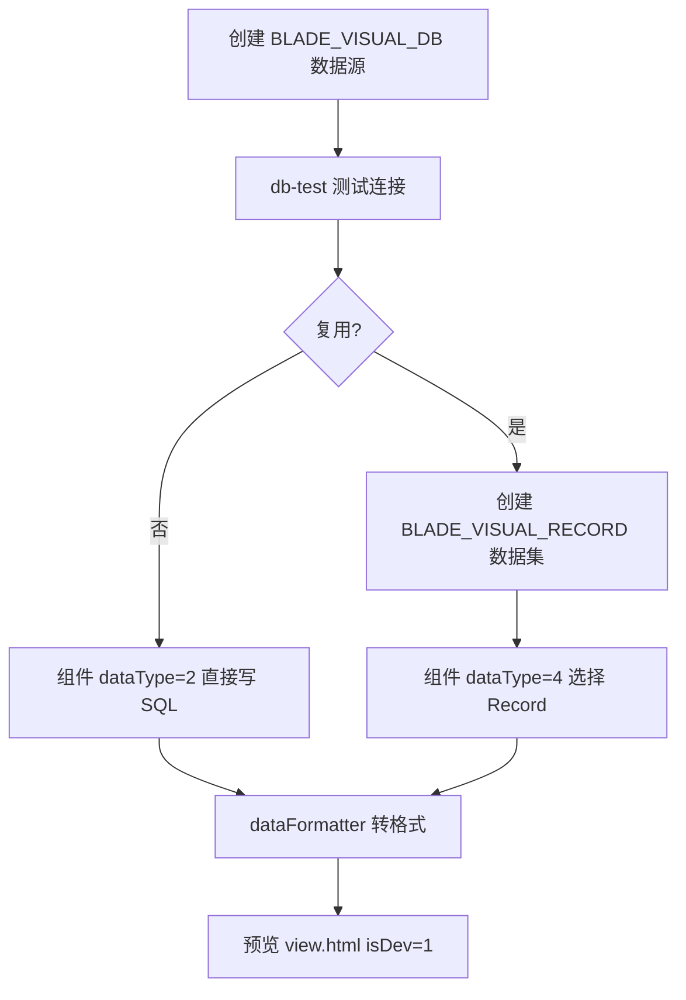
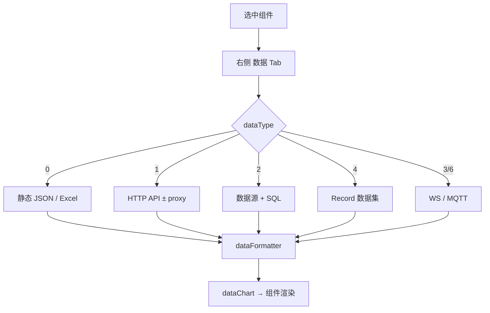

# JNPF v5.2 数字大屏全部功能操作手册

**文档编号**：v52-migration-docs-002-manual2  
**文档状态**：终审批准  
**审核人**：架构师  
**批准日期**：2026-05-23  
**版本**：v1.0-final  
**编写依据**：同目录 `1、三大操作手册编写要求.md`（经源码核验修订）  
**源码仓库**：`d:\JNPF-v52\backend`（后端 `JNPF.VisualData`）；前端运行时 `d:\JNPF-v52\jnpf-web-datascreen\`  
**与手册一/三关系**：**完全独立**——不使用低代码 `BASE_VISUAL_DEV` / `mt{ID}` 体系  
**截图**：ch01–ch12 待补（不阻塞交付）

### 目录

| 章 | 标题 | 状态 |
|----|------|------|
| 一 | 概述 | ✅ |
| 二 | 环境配置与启动 | ✅ |
| 三 | 大屏分类管理 | ✅ |
| 四 | 大屏管理 | ✅ |
| 五 | 大屏设计器 | ✅ |
| 六 | 数据源配置 | ✅ |
| 七 | 数据绑定到组件 | ✅ |
| 八 | 全局变量 | ✅ |
| 九 | 组件库与静态资源 | ✅ |
| 十 | 发布与预览 | ✅ |
| 十一 | 常见问题与踩坑 | ✅ |
| 十二 | API 参考 | ✅ |
| 附录 A | 配置字典 | ✅ |

---

> **截图说明**：各章 `[截图：…]` 占位符保存至  
> `docs/架构迭代/6、培训与操作手册/04-datascreen-operation-manual-screenshots/ch0N/`

---

## 第一章：概述

读完本章，你应能回答：**数字大屏在 JNPF v5.2 中是什么、与手册一/三有何关系、完整价值链路是什么**。  
本章不涉及具体操作（操作从第二章环境、第三章分类开始）。

---

### 1.1 数字大屏在 JNPF v5.2 中的定位

#### 1.1.1 一句话定义

**数字大屏是独立的可视化看板设计器**——通过拖拽 ECharts / DataV 组件、绑定数据源/数据集，产出全屏数据展示页面；**不经过低代码三步向导**，也**不生成 `mt{ID}` 物理表**。

#### 1.1.2 与手册一/三的分工

| 维度 | 手册一（主 WEB 低代码） | 手册三（UniApp） | 手册二（本手册） |
|------|-------------------------|------------------|------------------|
| **设计器** | 功能设计三步向导 | 无（消费 Web 设计） | 大屏拖拽设计器 |
| **数据存储** | `mt{ID}` + `BASE_VISUAL_DEV` | 同 Web | **BLADE_VISUAL_*** |
| **API 前缀** | `/api/visualdev/*` | 同左 + Header | **`/api/blade-visual/*`** |
| **访问 URL** | `/model/{EnCode}` | App Tab | **`view.html?id={大屏ID}`** |
| **依赖关系** | 基础 | 依赖手册一 | **完全独立** |

#### 1.1.3 使用者可见结果

| 能力 | 说明 |
|------|------|
| 大屏设计 | 1920×1080 画布、30+ 内置组件 |
| 数据源 | SQL Server / MySQL / PostgreSQL / Oracle |
| 数据集 | SQL / API / 静态 / WS / MQTT 预定义 |
| 发布预览 | 全屏展示、密码保护、轮播、iframe 嵌入 |
| 全局变量 | 跨组件参数传递、URL 参数注入 |

---

### 1.2 技术架构

#### 1.2.1 组件一览

| 层级 | 组件 | 说明 |
|------|------|------|
| 大屏前端 | `jnpf-web-datascreen-vue3` | Vite + Vue 3；dev **:8100/DataV/** |
| 后端模块 | `JNPF.VisualData` | `ScreenService` 等 DynamicApi |
| API 宿主 | `JNPF.API.Entry` | `:30000` |
| 数据库 | SQL Server `jnpf_v52_test` | **BLADE_VISUAL_*** 表族 |
| 主 WEB 入口 | `jnpf-web-vue3` | 菜单类型 6 跳转 `dataVUrl` |

#### 1.2.2 数据流

```mermaid
flowchart LR
    A[设计器 :8100/build/id] -->|保存| B[POST Visual/update]
    B --> C[(BLADE_VISUAL_CONFIG<br/>DETAIL + COMPONENT)]
    D[数据源 BLADE_VISUAL_DB] --> E[数据集 BLADE_VISUAL_RECORD]
    E --> F[组件 dataType=4]
    G[view.html?id=] -->|GET Visual/detail| C
    G -->|isDev=1| H[/dev/api → :30000]
```

#### 1.2.3 认证链路

| 场景 | Token 来源 | 说明 |
|------|------------|------|
| 设计器内操作 | 登录后 `localStorage.token` | axios 自动带 Authorization |
| 主 WEB 跳转 | URL `?token=` | 菜单拼接 `dataVUrl + view/{id}?token=...` |
| 独立 view.html | URL `?token=` | `view.html:82-85` 写入 localStorage |

---

### 1.3 本章核心表清单

| 表名 | 用途 |
|------|------|
| **BLADE_VISUAL** | 大屏元信息（标题、分类、发布状态、密码） |
| **BLADE_VISUAL_CONFIG** | 页面 JSON（DETAIL）+ 组件 JSON（COMPONENT） |
| **BLADE_VISUAL_CATEGORY** | 大屏分类 |
| **BLADE_VISUAL_DB** | 数据源连接 |
| **BLADE_VISUAL_RECORD** | 数据集 |
| **BLADE_VISUAL_GLOB** | 全局变量 |
| **BLADE_VISUAL_COMPONENT** | 自定义组件库 |
| **BLADE_VISUAL_MAP** | 自定义 GeoJSON 地图 |

### 1.4 本章关键代码路径索引

| 主题 | 路径 |
|------|------|
| 大屏 CRUD | `modularity/visualdata/JNPF.VisualData/ScreenService.cs` |
| 前端入口 | `jnpf-web-datascreen-vue3/src/registerConfig.js` |
| 组件清单 | `jnpf-web-datascreen-vue3/public/config.js` → `baseList` |
| 运行时预览 | `jnpf-web-datascreen-vue3/public/view.html` |

---

## 第二章：环境配置与启动

### 2.1 前置条件

| 项 | 要求 |
|----|------|
| .NET SDK | 6.0（见仓库 `global.json`） |
| Node.js | 16+（推荐 pnpm） |
| 数据库 | SQL Server；库名 `jnpf_v52_test` |
| 后端 API | `http://localhost:30000` 可访问 |

---

### 2.2 数据库表结构

大屏模块使用 **BLADE_VISUAL_*** 表族（实体定义在 `JNPF.VisualData.Entitys/Entity/`），与低代码 `BASE_VISUAL_DEV` **无关**。

#### 2.2.1 核心表字段

**BLADE_VISUAL**（`VisualEntity.cs`）

| 字段 | 说明 |
|------|------|
| **ID** | 主键（雪花 ID） |
| **TITLE** | 大屏名称 |
| **CATEGORY** | 分类值（对应 BLADE_VISUAL_CATEGORY.CATEGORY_VALUE） |
| **STATUS** | 0=未发布，1=已发布 |
| **PASSWORD** | 访问密码（可选） |
| **BACKGROUND_URL** | 封面/背景图 |
| **IS_DELETED** | 逻辑删除 |

**BLADE_VISUAL_CONFIG**（`VisualConfigEntity.cs`）

| 字段 | 说明 |
|------|------|
| **VISUAL_ID** | 关联 BLADE_VISUAL.ID |
| **DETAIL** | 页面级 JSON（宽高、背景、glob、filters 等） |
| **COMPONENT** | 组件树 JSON 数组 |

**BLADE_VISUAL_DB** / **BLADE_VISUAL_RECORD** / **BLADE_VISUAL_GLOB** / **BLADE_VISUAL_MAP** / **BLADE_VISUAL_COMPONENT** / **BLADE_VISUAL_CATEGORY** — 详见第六、八、九章及附录 A。

#### 2.2.2 JSON 列必须为 nvarchar(max)

> **⚠ 强制**：`BLADE_VISUAL_CONFIG.DETAIL` 与 `COMPONENT` 必须为 **nvarchar(max)**。

| 现象 | 根因 |
|------|------|
| 保存报 **COM1000** | 事务回滚（常伴随 SQL 2628） |
| SQL Server 报 **2628** | 字符串截断，JSON 超出列宽 |

修复脚本：`D:\temp\v52-migration\phase5\scripts\11-fix-datascreen-component.sql`

```sql
ALTER TABLE BLADE_VISUAL_CONFIG ALTER COLUMN DETAIL nvarchar(max) NOT NULL;
ALTER TABLE BLADE_VISUAL_CONFIG ALTER COLUMN COMPONENT nvarchar(max) NOT NULL;
```

---

### 2.3 后端启动

```powershell
cd d:\JNPF-v52\backend
dotnet run --project application/JNPF.API.Entry/JNPF.API.Entry.csproj
```

验证：

```http
GET http://localhost:30000/api/blade-visual/Visual/list?current=1&size=10
Authorization: Bearer {token}
```

期望：**HTTP 200**，`records` 数组（可为空）。

---

### 2.4 大屏前端启动

```powershell
cd d:\JNPF-v52\jnpf-web-datascreen
pnpm install   # 首次
pnpm run dev
```

| 配置项 | 值（`.env.development`） |
|--------|--------------------------|
| `VITE_APP_BASE` | `/DataV/` |
| `VITE_PROXY` | `http://localhost:30000` |
| `VITE_APP_API` | `/dev` |
| dev port | **8100**（`vite.config.js:34`） |

| URL | 说明 |
|-----|------|
| `http://localhost:8100/DataV/index.html` | ✅ 正确入口（大屏列表） |
| `http://localhost:8100/DataV/` | ❌ 404（无 history fallback） |
| `/dev/api/*` | 代理到 `:30000` |

[截图：ch02-01-大屏首页.png]

---

### 2.5 API 代理机制

开发模式下，前端 axios 请求前缀为 `/dev`，Vite 代理剥离后转发到 `VITE_PROXY`：

```
浏览器 → http://localhost:8100/dev/api/blade-visual/Visual/list
       → vite proxy rewrite → http://localhost:30000/api/blade-visual/Visual/list
```

独立预览页 `view.html` 在 URL 带 `isDev=1` 时同样走 `/dev` 前缀（`view.html:89`）。

---

### 2.6 认证方式

#### 2.6.1 大屏前端独立登录

访问 `:8100/DataV/index.html`，使用与主 WEB **同一套** OAuth 账号登录；Token 存 `localStorage`。

#### 2.6.2 从主 WEB 跳转

主 WEB dev 配置 `dataVUrl = http://localhost:8100/DataV/`。  
菜单 **F_TYPE=6（大屏）** 跳转格式：

```
{dataVUrl}view/{moduleId}?token={当前用户Token}
```

#### 2.6.3 独立预览页

```
http://localhost:8100/DataV/view.html?id={大屏ID}&token={token}&isDev=1
```

---

### 2.7 环境检查清单

| # | 检查项 | 通过标准 |
|---|--------|----------|
| 1 | API 200 | `GET /api/blade-visual/Visual/list` |
| 2 | 数据源 API | `GET /api/blade-visual/db/list` |
| 3 | 前端 200 | `http://localhost:8100/DataV/index.html` |
| 4 | DETAIL/COMPONENT 列宽 | `INFORMATION_SCHEMA.COLUMNS` 为 nvarchar(max) |
| 5 | 代理 | 设计器内保存不报网络错误 |
| 6 | 预览 | `view.html?...&isDev=1` 画布有内容 |

### 2.8 本章核心表清单

**BLADE_VISUAL**、**BLADE_VISUAL_CONFIG**（DETAIL/COMPONENT 列宽）

### 2.9 本章关键代码路径索引

| 主题 | 路径 |
|------|------|
| Vite 端口/代理 | `jnpf-web-datascreen-vue3/vite.config.js` |
| 环境变量 | `jnpf-web-datascreen-vue3/.env.development` |
| 列宽修复脚本 | `D:\temp\v52-migration\phase5\scripts\11-fix-datascreen-component.sql` |
| 预览 isDev | `jnpf-web-datascreen-vue3/public/view.html:89` |

---

## 第三章：大屏分类管理

### 3.1 分类的用途

大屏列表按 **Tab 分类** 分组展示；`BLADE_VISUAL.CATEGORY` 存储分类数值，与 `BLADE_VISUAL_CATEGORY.CATEGORY_VALUE` 对应。


---

### 3.2 访问路径

```
http://localhost:8100/DataV/index.html#/category
```

路由：`registerConfig.js:62-63` → `page/list/category.vue`

---

### 3.3 创建分类

点击「创建分类」，填写：

| 字段（UI） | 后端字段 | 说明 |
|------------|----------|------|
| **模块名** | `categoryKey` | 分类显示名称（Tab 标签文字） |
| **模块值** | `categoryValue` | **数字**，写入 `BLADE_VISUAL.CATEGORY` |

API：

```http
POST /api/blade-visual/category/save
{ "categoryKey": "生产监控", "categoryValue": "1" }
```

服务：`ScreenCategoryService.Create`（`ScreenCategoryService.cs:87-97`）

| 错误码 | 说明 |
|--------|------|
| **D2200** | 同名分类已存在（`categoryValue` 重复） |
| **COM1000** | 插入失败 |

[截图：ch03-01-分类列表.png]

---

### 3.4 编辑与删除

| 操作 | API |
|------|-----|
| 列表 | `GET /api/blade-visual/category/list` |
| 详情 | `GET /api/blade-visual/category/detail?id=` |
| 修改 | `POST /api/blade-visual/category/update` |
| 删除 | `POST /api/blade-visual/category/remove?ids=` |

删除为**逻辑删除**（`IsDeleted=1`，`ScreenCategoryService.cs:122-125`）。

> **注意**：内置演示分类（index 0/1/2）在 demo 模式下不可删（`category.vue:113-115`）。

---

### 3.5 分类与大屏关联

新建大屏时 `category` 默认取当前 Tab 的 `categoryValue`（`index.vue:391`）。  
列表筛选：`GET /api/blade-visual/Visual/list?category={categoryValue}`（`ScreenService.cs:78`）。

### 3.6 本章核心表清单

**BLADE_VISUAL_CATEGORY**（CATEGORY_KEY、CATEGORY_VALUE、IS_DELETED）

### 3.7 本章关键代码路径索引

| 主题 | 路径 |
|------|------|
| 分类服务 | `ScreenCategoryService.cs` |
| 前端页面 | `src/page/list/category.vue` |
| 实体 | `VisualCategoryEntity.cs` |

---

## 第四章：大屏管理

### 4.1 大屏列表

#### 4.1.1 访问路径

```
http://localhost:8100/DataV/index.html
```

#### 4.1.2 列表 API

```http
GET /api/blade-visual/Visual/list?category={categoryValue}&current=1&size=50&title={可选搜索}
```

服务：`ScreenService.GetList`（`ScreenService.cs:75-96`）

响应字段：`id`、`title`、`backgroundUrl`、`status`（0/1）、`category`、`createTime` 等。

[截图：ch04-01-大屏列表.png]

---

### 4.2 新建大屏

点击「创建大屏」：

| 字段 | 说明 |
|------|------|
| **大屏名称** `title` | 必填 |
| **分辨率** `width` × `height` | 预设 1920×1080 / 2560×1440 / 3840×2160 或自定义 |
| **分类** `category` | 当前 Tab 的 categoryValue |
| **封面** `backgroundUrl` | 上传后写入；默认 `VisualEntity.Create` 设 bg1.png |

创建 API：

```http
POST /api/blade-visual/Visual/save
{
  "visual": { "title": "...", "category": 1 },
  "config": { "detail": "{...}", "component": "[]" }
}
```

成功后自动打开设计器：`/DataV/build/{id}`（`index.vue:446-451`）。

---

### 4.3 编辑大屏

| 入口 | 行为 |
|------|------|
| 卡片「设计」 | 新窗口 `/build/{id}` |
| 卡片「编辑」 | 弹窗改标题/密码/发布状态/封面 |
| 设计器保存 | `POST /api/blade-visual/Visual/update` |

---

### 4.4 发布状态与密码

列表「编辑」弹窗（`index.vue:259-275`）：

| 字段 | 值 | 运行时行为 |
|------|-----|------------|
| **status** | 0 | 未发布 — `container.vue:325` 提示「还没有发布」 |
| **status** | 1 | 已发布 — 正常渲染 |
| **password** | 非空 | 预览时弹密码框（`container.vue:332-342`） |

---

### 4.5 复制与删除

| 操作 | API | 说明 |
|------|-----|------|
| **复制** | `POST /api/blade-visual/Visual/copy?id=` | 标题追加 `_复制`；复制 CONFIG（`ScreenService.cs:340-354`） |
| **删除** | `POST /api/blade-visual/Visual/remove?ids=` | 逻辑删除 `IsDeleted=1` |
| **导出** | 前端 export 组件 | 导出 JSON 配置 |

[截图：ch04-02-新建大屏弹窗.png]

---

### 4.6 本章核心表清单

**BLADE_VISUAL**（TITLE、CATEGORY、STATUS、PASSWORD）、**BLADE_VISUAL_CONFIG**

### 4.7 本章关键代码路径索引

| 主题 | 路径 |
|------|------|
| 列表/新建 | `src/page/list/index.vue` |
| 大屏服务 | `ScreenService.cs` |
| 实体 | `VisualEntity.cs`、`VisualConfigEntity.cs` |

---

## 第五章：大屏设计器

本章是手册二的**核心**。数字大屏与低代码的本质区别：

| 维度 | 低代码（手册一） | 数字大屏（本手册） |
|------|------------------|-------------------|
| 产出 | CRUD 表单/列表 | 全屏可视化看板 |
| 数据 | `mt{ID}` 物理表 | **数据源 + 数据集** |
| 设计 | 三步向导 | **拖拽组件 + 绑定数据** |
| 访问 | `/model/{EnCode}` | `view.html?id={大屏ID}` |

---

### 5.1 设计器界面布局

#### 5.1.1 入口

```
主 WEB → 在线开发 / 大屏管理（按环境菜单配置）
或独立访问：http://localhost:8100/DataV/index.html
```

工程：`jnpf-web-datascreen-vue3`（Vite + Vue 3 + Element Plus + ECharts）

#### 5.1.2 四区域结构



| 区域 | 说明 | 源码 |
|------|------|------|
| **左侧** | 组件分类面板（图表/文本/表格/地图/媒体/装饰等） | `public/config.js` → `baseList` |
| **中间** | 画布，默认分辨率见 `option/config.js` | `width:1920, height:1080` |
| **右侧** | 选中组件的属性；页面级配置切换 | `src/option/components/*.vue` |
| **顶部** | 保存、预览、撤销、图层、滤镜等 | 设计器主框架 |

[截图：ch05-01-设计器全界面标注.png]

#### 5.1.3 保存数据结构

保存/更新调用 `POST /api/blade-visual/Visual/update`（`ScreenService.cs:293`），写入：

| 表 | 字段 | 内容 |
|----|------|------|
| **BLADE_VISUAL** | TITLE、CATEGORY、STATUS 等 | 大屏元信息 |
| **BLADE_VISUAL_CONFIG** | **DETAIL** | 页面 JSON（宽高、背景、组件列表等） |
| **BLADE_VISUAL_CONFIG** | **COMPONENT** | 组件 JSON 快照 |

> **⚠ 列宽**：`DETAIL` / `COMPONENT` 必须为 **nvarchar(max)**，否则保存 COM1000 / SQL 2628（见 5.7、第九章）。

---

### 5.2 组件体系——分类总览

组件清单定义在 **`public/config.js`** 的 `baseList`（左侧拖拽源）。  
每个组件含：`component.name`（类型标识）、默认 `data`（静态示例）、`dataType`、`option`（样式）。

#### 5.2.1 组件分类表

| 分类 | 组件 type（name） | 用途 |
|------|-------------------|------|
| **图表** | bar, line, pie, scatter, radar, funnel, gauge, pictorialbar, common | ECharts 系 |
| **文本** | text, flop, datetime, wordcloud | 标题、数值翻牌、时间 |
| **表格** | table | 明细/排行榜 |
| **地图** | map | 散点/区域地图 |
| **媒体** | img, video, swiper, clapper, iframe | 图片/视频/轮播 |
| **装饰** | borderBox, decoration, datav, progress, rectangle | 边框、水位、进度 |
| **交互** | tabs, group, fullscreen | Tab 切换、组合 |
| **其他** | html, svg, audio, vue | 自定义 HTML/嵌入 |

属性面板文件：`src/option/components/{name}.vue`（由 `components.js` 自动注册）。

---

### 5.3 文本类组件

#### 5.3.1 文本（text）

| 项 | 说明 |
|----|------|
| **默认 data** | `{ value: "文本内容" }` 字符串 |
| **动态数据** | 绑定后 `data.value` 为展示值 |
| **属性** | 字体、颜色、对齐、跑马灯（scroll）、超链（`text.vue`） |
| **dataType** | 0 静态 / 1 API / 2 SQL 等（见 5.8） |

静态示例（`config.js` 文本组件默认值）：

```json
{ "value": "JNPF 数字大屏" }
```

[截图：ch05-02-文本组件.png]

#### 5.3.2 翻牌器（flop）

| 项 | 说明 |
|----|------|
| **data 格式** | `{ value: 12345 }` 或数组（多段翻牌） |
| **场景** | KPI 数字大屏 |

#### 5.3.3 实时时间（datetime）

| 项 | 说明 |
|----|------|
| **data** | 通常静态，组件内部取系统时间 |
| **属性** | 格式（`dicOption.format`：yyyy-MM-dd 等） |

---

### 5.4 图表类组件

#### 5.4.1 柱状图 / 折线图（bar / line）

| 项 | 说明 |
|----|------|
| **默认 data 格式** | 带 categories + series（ECharts 类目轴） |

```json
{
  "categories": ["苹果", "三星", "小米"],
  "series": [{
    "name": "销量",
    "data": [100, 200, 150]
  }]
}
```

| **属性（bar.vue / line）** | 柱宽、圆角、网格、图例、坐标轴、渐变色 |
| **等效简格式** | 部分过滤器可转为 `[{name,value}]`——以组件内 `dataFormatter` 为准 |

[截图：ch05-03-柱状图.png]  
[截图：ch05-04-折线图.png]

#### 5.4.2 饼图（pie）

| 项 | 说明 |
|----|------|
| **默认 data 格式** | **数组** `[{name, value}]` |

```json
[
  { "name": "苹果", "value": 1000879 },
  { "name": "三星", "value": 3400879 }
]
```

| **属性** | 图例、标签、玫瑰图、环形 |

[截图：ch05-05-饼图.png]

#### 5.4.3 散点图（scatter）

| 项 | 说明 |
|----|------|
| **data 格式** | `[{ data: [[x,y], ...] }, ...]` 多系列 |

#### 5.4.4 雷达图 / 漏斗图 / 仪表盘（radar / funnel / gauge）

| 组件 | data 格式要点 |
|------|---------------|
| **funnel** | `[{name, value}, ...]` |
| **gauge** | `{ value: 66 }` 或系列配置 |
| **radar** | `{ indicator:[], series:[] }` ECharts 雷达结构 |

#### 5.4.5 自定义 ECharts（common）

| 项 | 说明 |
|----|------|
| **说明** | 通过 `echartFormatter` JavaScript 函数完全自定义 |
| **场景** | 复杂地图下钻等（config.js 内置中国地图示例） |
| **要求** | 需熟悉 ECharts API |

---

### 5.5 表格类组件

#### 5.5.1 基础表格（table）

| 项 | 说明 |
|----|------|
| **data 格式** | **对象数组** `[{col1: v1, col2: v2}, ...]` |
| **属性** | 表头列配置（`tableOption`）、行数、滚动/轮播 |
| **场景** | 排行榜、明细列表 |

```json
[
  { "name": "张三", "dept": "销售部", "amount": 1200 },
  { "name": "李四", "dept": "技术部", "amount": 980 }
]
```

[截图：ch05-06-表格组件.png]

---

### 5.6 地图类组件

#### 5.6.1 地图（map）

| 项 | 说明 |
|----|------|
| **默认 data 格式** | 散点：`[{name, value, lng, lat, zoom}, ...]` |
| **区域填色** | 可转为 `[{name: "地区", value: 数值}]` + `echartFormatter` |
| **属性** | 缩放 roam、边框色、标注 banner、地图类型（`option.type`） |
| **自定义** | GeoJSON 导入（地图管理，第九章） |

```json
[
  { "name": "测试点1", "value": 100, "lng": 118.30, "lat": 36.92, "zoom": 1 }
]
```

[截图：ch05-07-地图组件.png]

---

### 5.7 媒体与装饰类组件

| 组件 | data / 配置 | 说明 |
|------|-------------|------|
| **img** | URL 字符串或 `{value:url}` | 背景图、LOGO |
| **video** | 视频地址 | 宣传视频 |
| **swiper** | 图片 URL 数组 | 轮播图 |
| **borderBox** | 装饰边框，datav 风格 | 区域美化 |
| **datav** | `{ value: 66 }` + `option.is` 如 `dv-water-level-pond` | DataV 水位等 |
| **progress** | 进度值 | 完成率展示 |
| **iframe** | 外部 URL | 嵌入第三方页 |

[截图：ch05-08-装饰与媒体.png]

---

### 5.8 交互类组件

| 组件 | 说明 |
|------|------|
| **tabs** | Tab 切换，可联动刷新其他组件数据 |
| **group** | 组合多个子组件统一移动 |
| **fullscreen** | 全屏控制按钮 |

配置入口：组件「交互」分类 + `setup/transfer.vue` 联动设置。

---

### 5.9 组件通用配置

#### 5.9.1 位置与尺寸

每个组件 `component` 节点：

| 字段 | 说明 |
|------|------|
| **width / height** | 像素宽高 |
| **left / top** | 画布坐标（拖拽自动写入 DETAIL） |
| **zIndex** | 图层层级 |
| **rotate** | 旋转角度 |

#### 5.9.2 数据类型（dataType）

来源：`src/option/config.js` → `dicOption.dataType`

| 值 | 标签 | 说明 |
|----|------|------|
| **0** | 静态数据 | 手工 JSON / Excel 导入 |
| **1** | API 接口 | HTTP GET/POST 等 |
| **2** | SQL 数据库 | 选 BLADE_VISUAL_DB 数据源 + SQL |
| **3** | WebSocket | wsUrl |
| **4** | Record 数据集 | BLADE_VISUAL_RECORD 预定义 |
| **5** | Public 共用数据 | 公共数据集 |
| **6** | MQTT | mqttUrl + 配置 |
| **7** | 解析数据 | 二次解析 |

配置 UI：`src/page/setup/database.vue`

#### 5.9.3 数据过滤器（dataFormatter）

JavaScript 函数字符串，将原始响应转为组件所需结构：

```javascript
(data, params) => {
  // data 为接口/SQL 原始结果
  return [{ name: 'A', value: data.total }];
}
```

#### 5.9.4 刷新与联动

| 机制 | 说明 |
|------|------|
| **定时刷新** | 组件 `time` 属性（毫秒） |
| **全局变量** | `window.$glob.params`（第八章） |
| **交互联动** | 点击/Tab 切换触发其他组件 `handleRefresh` |

---

### 5.10 页面级配置

来源：`option/config.js` → `config` 默认对象

| 配置项 | 说明 |
|--------|------|
| **width / height** | 画布分辨率（默认 1920×1080） |
| **backgroundImage** | 背景图 URL |
| **theme / themeId** | 全局配色主题 |
| **scale** | 预览缩放策略 |
| **mark** | 水印 |
| **glob** | 全局变量定义 |
| **filters** | 页面级过滤器字典 |

[截图：ch05-09-页面背景与主题.png]

---

### 5.11 预览要点（设计器内）

设计器「预览」与独立 `view.html` 区别见第十章；开发环境预览 URL **必须带 `isDev=1`**：

```
http://localhost:8100/DataV/view.html?id={大屏ID}&token={token}&isDev=1
```

源码：`src/page/list/swiper.vue:40-41` — `process.env.NODE_ENV === "development"` 时自动追加 `isDev=1`。

> **不带 isDev=1**：H5 静态站把 `/api` 打到 :8100 自身 → **画布空白**（Phase5 已验证）。

---

### 5.12 本章踩坑

| # | 现象 | 根因 | 解决 |
|---|------|------|------|
| 1 | 保存 COM1000 | DETAIL/COMPONENT 列过短 | `11-fix-datascreen-component.sql` 扩 max |
| 2 | 预览空白 | 缺 `isDev=1`（dev 环境） | URL 加参数 |
| 3 | 图表无数据 | data 格式与组件不匹配 | 对照 5.3–5.6 格式 + dataFormatter |
| 4 | 组件面板空 | `public/config.js` 未加载 | 检查 `/DataV/` 基路径 |

---

### 本章小结

- 设计器四区：组件面板 → 画布 → 属性 → 工具栏。  
- 组件清单以 **`public/config.js` baseList** 为准；属性以 **`option/components/{type}.vue`** 为准。  
- **data 格式因组件而异**：饼图/地图填色用 `[{name,value}]`；柱/折线用 categories+series；文本用 `{value}`。  
- **下一步（第六章）**：配置 BLADE_VISUAL_DB 数据源与 BLADE_VISUAL_RECORD 数据集。

---

### 附录：第五章相关源码索引

| 主题 | 路径 |
|------|------|
| 组件清单 | `jnpf-web-datascreen-vue3/public/config.js` |
| 页面默认配置 | `jnpf-web-datascreen-vue3/src/option/config.js` |
| 属性面板注册 | `jnpf-web-datascreen-vue3/src/option/components.js` |
| 数据类型枚举 | `dicOption.dataType` in config.js |
| 数据绑定 UI | `jnpf-web-datascreen-vue3/src/page/setup/database.vue` |
| 保存 API | `modularity/visualdata/JNPF.VisualData/ScreenService.cs` |
| 配置表实体 | `VisualConfigEntity.cs`（DETAIL/COMPONENT） |
| 预览 isDev | `jnpf-web-datascreen-vue3/src/page/list/swiper.vue:40` |

---

## 第六章：数据源配置

本章说明大屏**数据从哪来**：先建 **数据源（DB 连接）**，再建 **数据集（Record）** 或在组件上直接配 SQL/API。

---

### 6.1 数据源管理页面

#### 6.1.1 入口

```
大屏前端 → 左侧菜单 → 数据源管理
路由组件：src/page/list/db.vue
```

#### 6.1.2 列表 API

```http
GET /api/blade-visual/db/list?current=1&size=10
Authorization: Bearer {token}
```

服务：`ScreenDataSourceService.GetList`（`ScreenDataSourceService.cs:49`）  
数据表：**BLADE_VISUAL_DB**

[截图：ch06-01-数据源列表.png]

---

### 6.2 支持的数据源类型

后端 `ToDbTytpe`（`ScreenDataSourceService.cs:206-220`）与前端 `dicData`（`db.vue:84-101`）**驱动类字符串必须一致**：

| 类型 | driverClass（前后端统一） | 前端默认 URL 模板 |
|------|---------------------------|-------------------|
| **MySQL** | `com.mysql.cj.jdbc.Driver` | `jdbc:mysql://localhost:3306/bladex_report` |
| **SQL Server** | `com.microsoft.sqlserver.jdbc.SQLServerDriver` | `jdbc:sqlserver://127.0.0.1:1433;DatabaseName=bladex` |
| **PostgreSQL** | `org.postgresql.Driver` | `jdbc:postgresql://127.0.0.1:5432/bladex` |
| **Oracle** | `oracle.jdbc.OracleDriver` | `jdbc:oracle:thin:@127.0.0.1:1521:orcl` |

> **说明**：字段存于 `BLADE_VISUAL_DB`（`VisualDBEntity.cs`）：Name、DRIVER_CLASS、URL、USERNAME、PASSWORD、REMARK。  
> **API 数据集 / 静态 JSON** 不走本表——在组件或 Record 上直接配置（6.5）。

---

### 6.3 创建数据源——字段说明

#### 6.3.1 表单字段

| 字段 | 属性名 | 必填 | 说明 |
|------|--------|------|------|
| 名称 | name | ✅ | 显示名，下拉选择数据源时可见 |
| 类型 | driverClass | ✅ | 上表四选一 |
| 用户名 | username | ✅ | 数据库账号 |
| 密码 | password | ✅ | 前端 AES 加密后提交（`db.vue:217`） |
| 连接地址 | url | ✅ | JDBC 模板，选类型后自动填充 |
| 备注 | remark | | 可选 |

#### 6.3.2 连接字符串与后端处理

后端测试连接（`ScreenDataSourceService.cs:142-160`）：

```csharp
ConnectionString = ToConnectionString(driverClass, url, username, password)
// ToConnectionString 内部：string.Format(url, username, password)
```

| 要点 | 说明 |
|------|------|
| **Format 规则** | URL 若含 `{0}` `{1}` 会替换为用户名/密码 |
| **默认模板** | 前端 dicData 的 JDBC URL **无占位符** 时原样传入 SqlSugar |
| **v5.2 SQL Server 实测** | 若 JDBC 串连不通，可改为 SqlSugar 风格，例如：`Data Source=(local)\SQLEXPRESS;Initial Catalog=jnpf_v52_test;User ID=sa;Password=YourPwd;TrustServerCertificate=True` |

#### 6.3.3 创建 API

```http
POST /api/blade-visual/db/save
Content-Type: application/json

{
  "name": "v52测试库",
  "driverClass": "com.microsoft.sqlserver.jdbc.SQLServerDriver",
  "username": "sa",
  "password": "{AES加密后}",
  "url": "Data Source=(local)\\SQLEXPRESS;Initial Catalog=jnpf_v52_test;...",
  "remark": "迁移环境"
}
```

更新/合并：`POST /api/blade-visual/db/submit`；删除：`POST /api/blade-visual/db/remove?ids={id}`

#### 6.3.4 测试连接

```http
POST /api/blade-visual/db/db-test
Body: 同 save 字段（含 driverClass、url、username、password）
```

| 成功 | 返回 true |
| 失败 | **D1507**（连接无效） |
| 驱动 unrecognized | **D1505** |

UI：数据源表单底部「测试连接」按钮（`db.vue:8`）

[截图：ch06-02-创建数据源.png]

---

### 6.4 常见连接失败排查

| 现象 | 原因 | 处理 |
|------|------|------|
| D1507 | 地址/库名/账号错误 | 核对 SSMS 能连后再填 |
| D1505 | driverClass 拼写错误 | 必须全字匹配上表 |
| 密码错误 | 前端加密/拷贝问题 | 重新输入密码测试 |
| SQL 2628 | 非连接阶段 | 属 JSON 列问题，见第九章 |
| 防火墙 | 1433/3306 不通 | 开放端口或本机连接 |

---

### 6.5 数据集管理（BLADE_VISUAL_RECORD）

#### 6.5.1 概念

| 概念 | 表 | 说明 |
|------|-----|------|
| **数据源** | BLADE_VISUAL_DB | 数据库**连接** |
| **数据集** | BLADE_VISUAL_RECORD | 可复用的**查询/API/静态**定义 |

组件 `dataType=4`（Record 数据集）时，从下拉选择已建 Record（`database.vue:56-59`）。

#### 6.5.2 数据集 API

| 操作 | API |
|------|-----|
| 列表 | `GET /api/blade-visual/record/list` |
| 详情 | `GET /api/blade-visual/record/detail?id=` |
| 新增/改 | `POST /api/blade-visual/record/submit` |
| 删除 | `POST /api/blade-visual/record/remove?ids=` |

服务：`ScreenRecordService.cs`

#### 6.5.3 数据集字段（VisualRecordEntity）

| 字段 | 说明 |
|------|------|
| **NAME** | 数据集名称 |
| **DATATYPE** | 同组件 dataType（0 静态 / 1 API / 2 SQL …） |
| **URL** | API 地址（dataType=1） |
| **DATAMETHOD** | GET/POST 等 |
| **DATAHEADER** | 请求头 JSON |
| **DATAQUERY** | 请求体/参数 |
| **DBSQL / FSQL** | SQL 语句（dataType=2） |
| **DATA** | 静态 JSON（dataType=0） |
| **DATAFORMATTER** | 过滤器函数 |
| **PROXY** | 是否走大屏后端代理（跨域） |

UI：`src/page/list/record.vue`

[截图：ch06-03-数据集编辑.png]

---

### 6.6 SQL 数据集

#### 6.6.1 组件上直接配 SQL（dataType=2）

`database.vue:24-35`：

1. 数据类型选 **SQL 数据库**  
2. 数据源下拉 → `GET /api/blade-visual/db/db-list`  
3. Monaco 编辑器编写 SQL  
4. 点「请求数据」预览

#### 6.6.2 动态执行 API

```http
POST /api/blade-visual/db/dynamic-query
{
  "id": "{数据源ID}",
  "sql": "SELECT TOP 10 * FROM BASE_USER"
}
```

服务：`ScreenDataSourceService.Query`（`ScreenDataSourceService.cs:167-194`）

| 错误码 | 说明 |
|--------|------|
| D1513 | SQL 为空 |
| D1512 | SQL 执行异常（语法/权限） |

#### 6.6.3 参数化

设计器支持在 SQL 中写 **函数返回 SQL**，引用全局变量（`database.vue:29` 提示）：

```javascript
// 示例：SQL 框内写函数体，return 带参数的 SQL 字符串
function(){
  var dept = window.$glob.params.dept || '0';
  return "SELECT * FROM mt2058337396986089472 WHERE deptId='" + dept + "'";
}
```

> 防注入：生产环境应对参数做校验或使用参数化查询方案。

#### 6.6.4 SQL 结果 → 组件格式

查询结果为 **行数组** `[{col:val,...}]`：

| 目标组件 | 建议 dataFormatter |
|----------|-------------------|
| 表格 table | 可直接使用 |
| 饼图 pie | `(data)=>data.map(r=>({name:r.label,value:r.cnt}))` |
| 柱/折线 bar/line | 需转为 categories+series 结构 |

---

### 6.7 API 数据集

#### 6.7.1 组件 dataType=1

| 配置项 | 说明 |
|--------|------|
| url | 完整 HTTP 地址 |
| dataMethod | get/post/put/delete |
| dataQuery | Body（JSON 或 form） |
| dataHeader | Headers JSON |
| proxy | 开启后走大屏后端 **`GET /api/blade-visual/Visual/proxy`** |

#### 6.7.2 后端代理（跨域）

`ScreenService.GetApiData`（`ScreenService.cs:205-254`）：

- 自动附加当前用户 `Authorization`（若 Header 未指定）  
- 支持 GET/POST/PUT/DELETE  
- 用于浏览器无法直连的第三方 API

```http
GET /api/blade-visual/Visual/proxy?url={encodeURIComponent}&method=GET&headers={json}
```

#### 6.7.3 API 响应 → 组件

1. 在「响应数据」Tab 查看原始 JSON  
2. 编写 **dataFormatter** 提取 `data.list` 等路径  
3. 转为目标组件结构（见 5.3–5.6）

---

### 6.8 静态数据与其它类型

| dataType | 配置方式 |
|----------|----------|
| **0 静态** |  Monaco 编辑 JSON；或 Excel 导入（`database.vue:13-16`） |
| **3 WebSocket** | 填 wsUrl |
| **5 Public** | 选公共数据集 |
| **6 MQTT** | mqttUrl + mqttConfig JSON |
| **7 解析** | 对已有数据二次解析 |

---

### 6.9 数据配置工作流（推荐）



---

### 6.10 本章踩坑

| # | 现象 | 根因 | 解决 |
|---|------|------|------|
| 1 | db-test D1507 | 连接串/驱动错误 | 6.3–6.4 |
| 2 | dynamic-query D1512 | SQL 语法/表不存在 | SSMS 先验证 |
| 3 | 图表空白但 SQL 有数据 | 未写 dataFormatter | 转 name/value 或 categories |
| 4 | API 跨域 | 浏览器拦截 | 开启 proxy |
| 5 | 密码保存后测失败 | 加密存储后再编辑 | 重新输入密码测试 |

---

### 本章小结

- **数据源** = `BLADE_VISUAL_DB` + 四种 JDBC 驱动类；API **`/api/blade-visual/db/*`**。  
- **数据集** = `BLADE_VISUAL_RECORD`；组件可引用或直配 SQL/API。  
- SQL 执行走 **`POST .../db/dynamic-query`**；API 跨域走 **`Visual/proxy`**。  
- 查询结果须经 **dataFormatter** 对齐组件 data 格式（第五章、第七章）。

---

### 附录：第六章相关源码索引

| 主题 | 路径 |
|------|------|
| 数据源服务 | `modularity/visualdata/JNPF.VisualData/ScreenDataSourceService.cs` |
| 数据集服务 | `modularity/visualdata/JNPF.VisualData/ScreenRecordService.cs` |
| DB 实体 | `VisualDBEntity.cs` / `VisualRecordEntity.cs` |
| 前端数据源页 | `jnpf-web-datascreen-vue3/src/page/list/db.vue` |
| 前端数据集页 | `jnpf-web-datascreen-vue3/src/page/list/record.vue` |
| 组件数据配置 | `jnpf-web-datascreen-vue3/src/page/setup/database.vue` |
| SQL 测试弹窗 | `jnpf-web-datascreen-vue3/src/page/components/db.vue` |
| API 代理 | `ScreenService.cs:205-254` |

---

## 第七章：数据绑定到组件

本章是手册二的**数据链路核心**——从数据源/数据集到组件可视化的完整绑定机制。

---

### 7.1 绑定总览



配置 UI：`build.vue:374-443`（快捷）或 `database.vue`（更多设置弹窗）。

---

### 7.2 dataType 0–7 逐一详解

来源：`src/option/config.js:223-247`；运行时分支：`echart/common.js:431-553`。

| 值 | 标签 | 配置项 | 数据获取方式 |
|----|------|--------|--------------|
| **0** | 静态数据 | `data` JSON | 直接使用组件内 `data` 字段 |
| **1** | API 接口 | `url`、`dataMethod`、`dataQuery`、`dataHeader`、`proxy` | axios 请求；`proxy=true` 走 `/api/blade-visual/Visual/proxy` |
| **2** | SQL 数据库 | `sql`（加密 JSON：`{id, sql}`）、数据源下拉 | `POST /api/blade-visual/db/dynamic-query` |
| **3** | WebSocket | `wsUrl`、`dataQuery` | 浏览器 WebSocket 长连接 |
| **4** | Record 数据集 | `record`（数据集 ID） | `GET /api/blade-visual/record/detail` 后按 Record 内 dataType 再取数 |
| **5** | Public 共用数据 | `public`（公共组件 index） | 引用另一组件的 `dataChart`；100ms 轮询同步 |
| **6** | MQTT | `mqttUrl`、`mqttConfig` | mqtt.js 订阅 topic |
| **7** | 解析数据 | `url`（同 API 路径） | 强制走 proxy 的 API 模式 |

[截图：ch07-01-数据类型下拉.png]

---

### 7.3 静态数据（dataType=0）

| 操作 | 说明 |
|------|------|
| 编辑 JSON | 「编辑」→ Monaco 编辑 `data` |
| Excel 导入 | `database.vue:13-16`；导入后写入 `activeObj.data` |
| 格式要求 | 必须符合该组件默认结构（见第五章 5.3–5.6、附录 A） |

示例（柱状图）：

```json
{
  "categories": ["Mon", "Tue", "Wed"],
  "series": [{ "name": "销量", "data": [120, 200, 150] }]
}
```

---

### 7.4 数据集绑定（dataType=4，推荐）

#### 7.4.1 流程

1. 第六章创建 **BLADE_VISUAL_RECORD** 数据集（SQL 或 API）  
2. 组件 dataType 选 **Record 数据集**  
3. 下拉选择 Record（`build.vue:411-413`；数据来自 `GET /api/blade-visual/record/list`）  
4. 点击「请求数据」验证  

运行时：`common.js:575-583` 先拉 Record 详情，再按 Record 自身 dataType 执行取数。

#### 7.4.2 Record 级 dataFormatter

Record 编辑页可预写 `dataFormatter`（`record.vue:75`）；dataType=4 时在组件 formatter **之前**执行（`common.js:409-413`）。

---

### 7.5 字段映射与 dataFormatter

SQL/API 原始结果通常为 **行数组** `[{col1: v1, col2: v2}]`， rarely 直接匹配图表结构。须通过 **dataFormatter** 转换。

#### 7.5.1 函数签名

```javascript
(data, params, refList) => {
  // data: 原始响应或 SQL 结果
  // params: dataQuery 合并后的请求参数
  // refList: 同屏其他组件 ref，可用于联动
  return transformedData;
}
```

编辑入口：`build.vue`「编辑过滤器」或 `database.vue:101-109`。  
也可引用页面级过滤器字典（`config.filters` + `dataFormatterId`）。

#### 7.5.2 常见映射示例

**饼图 / 漏斗**（目标 `[{name, value}]`）：

```javascript
(data) => data.map(r => ({ name: r.deptName, value: r.cnt }))
```

**柱/折线**（目标 `{categories, series}`）：

```javascript
(data) => ({
  categories: data.map(r => r.month),
  series: [{ name: '产量', data: data.map(r => r.qty) }]
})
```

**文本**（目标 `{value}`）：

```javascript
(data) => ({ value: data[0]?.total ?? 0 })
```

**地图**（目标含 lng/lat）：

```javascript
(data) => data.map(r => ({
  name: r.city, value: r.amount, lng: r.longitude, lat: r.latitude
}))
```

#### 7.5.3 踩坑：字段映射错误 → 图表空白

| 现象 | 根因 | 解决 |
|------|------|------|
| 图表区域空白 | formatter 返回结构不对 | 「更多设置」→ 处理后数据 Tab 检查 |
| 有数据但轴无标签 | categories 为空数组 | 检查 SQL 列名与 map 字段 |
| 表格有数据、图表无 | 未写 formatter | 按 5.3–5.6 默认格式转换 |

验证：设计器点 **「请求数据」**（`build.vue:870-891`），对比「原始数据」与「处理后数据」Tab。

[截图：ch07-02-dataFormatter前后对比.png]

---

### 7.6 数据刷新频率

| 配置 | 字段 | 说明 |
|------|------|------|
| 刷新间隔 | `time`（毫秒） | `build.vue:429-430`；0 或不填 = 不自动刷新 |
| 自动刷新开关 | `disabled` | 与 time 配合；运行时 `common.js:568-571` setInterval |
| Public 同步 | dataType=5 | 100ms 检测引用组件 dataChart 变化 |

> **静态数据（0）和 Public（5）** 不显示刷新时间配置（`build.vue:429` `v-if="!isStatic && !isPublic"`）。

手动刷新：设计器 `$refs.layer.handleRefresh()` → `subgroup.handleRefresh` → `updateData()`。

---

### 7.7 SQL 中的全局变量

SQL 框支持 **函数返回 SQL 字符串**（`database.vue:29`）：

```javascript
function(){
  var dept = window.$glob['deptId'] || window.$glob.params.dept;
  return "SELECT * FROM mt2058337396986089472 WHERE F_DEPT='" + dept + "'";
}
```

URL/API 地址支持 `${变量名}` 占位（`glob.vue:128` 提示）。

---

### 7.8 本章核心表清单

**BLADE_VISUAL_RECORD**、**BLADE_VISUAL_DB**；组件 JSON 存于 **BLADE_VISUAL_CONFIG.COMPONENT**

### 7.9 本章关键代码路径索引

| 主题 | 路径 |
|------|------|
| updateData 核心 | `src/echart/common.js:397-587` |
| 设计器数据面板 | `src/page/build.vue:374-443, 870-891` |
| 更多设置弹窗 | `src/page/setup/database.vue` |
| dataType 枚举 | `src/option/config.js:223-247` |

---

## 第八章：全局变量

全局变量用于 **跨组件传参**、**URL 参数注入**、**SQL/API 动态拼接**。

---

### 8.1 两类变量

| 类型 | 存储 | 作用域 | 管理入口 |
|------|------|--------|----------|
| **平台全局变量** | **BLADE_VISUAL_GLOB** | 所有大屏 | 列表 `#/glob` |
| **大屏内变量** | CONFIG.DETAIL 内 `glob[]` | 当前大屏 | 设计器 → 设置 → 变量 |

---

### 8.2 平台全局变量（BLADE_VISUAL_GLOB）

#### 8.2.1 访问路径

```
http://localhost:8100/DataV/index.html#/glob
```

#### 8.2.2 字段

| UI 字段 | 实体字段 | 说明 |
|---------|----------|------|
| 名称 | `globalName` | 显示用 |
| 变量名 | `globalKey` | 运行时 `window.$glob[globalKey]` |
| 变量值 | `globalValue` | 字符串（可 JSON） |

API（`ScreenGlobalService.cs`）：

| 操作 | 路径 |
|------|------|
| 列表 | `GET /api/blade-visual/visual-global/list` |
| 新增 | `POST /api/blade-visual/visual-global/save` |
| 修改 | `POST /api/blade-visual/visual-global/update` |
| 删除 | `POST /api/blade-visual/visual-global/remove?ids=` |

[截图：ch08-01-全局变量列表.png]

#### 8.2.3 运行时注入

大屏加载时（`container.vue:216-225`）：

```javascript
getList({ current: 1, size: 100 }).then(res => {
  res.data.data.records.forEach(ele => {
    window.$glob[ele.globalKey] = ele.globalValue
  })
})
```

---

### 8.3 大屏内变量（config.glob）

设计器「设置 → 变量」（`variable.vue`）：

| 字段 | 说明 |
|------|------|
| `name` | 显示名 |
| `key` | 变量名 → `window.$glob[key]` |
| `value` | 初始值 |

保存后写入 **DETAIL** JSON 的 `glob` 数组；预览时 `container.vue:263-267` 注入。

---

### 8.4 引用方式

| 场景 | 写法 |
|------|------|
| URL / API 地址 | `${deptId}` |
| dataFormatter / 事件脚本 | `window.$glob['deptId']` |
| URL 查询参数 | `window.$glob.params`（自动解析） |
| 发送参数 | `window.$glob.query` |

说明：`code-tip.vue:7-12`。

---

### 8.5 变量联动与刷新

Tab/按钮组件可执行脚本修改 `$glob` 并触发刷新（`other-list.vue:57`）：

```javascript
$glob.group='分组A'
```

修改 `$glob` 后，依赖该变量的 SQL 函数 / API URL 在 **下次 `updateData`** 时生效；可配合组件 `time` 定时刷新或手动「请求数据」。

---

### 8.6 本章核心表清单

**BLADE_VISUAL_GLOB**（GLOBALNAME、GLOBALKEY、GLOBALVALUE）

### 8.7 本章关键代码路径索引

| 主题 | 路径 |
|------|------|
| 后端服务 | `ScreenGlobalService.cs` |
| 列表页 | `src/page/list/glob.vue` |
| 设计器变量 | `src/page/setup/variable.vue` |
| 运行时注入 | `src/page/group/container.vue:216-267` |

---

## 第九章：组件库与静态资源

### 9.1 自定义组件库

#### 9.1.1 访问路径

```
http://localhost:8100/DataV/index.html#/components
```

表：**BLADE_VISUAL_COMPONENT**（`VisualComponentEntity.cs`）

| 字段 | 说明 |
|------|------|
| **NAME** | 组件名称 |
| **CONTENT** | 组件 JSON 配置 |
| **TYPE** | 分类 Tab（前端 dicData） |
| **IMG** | 缩略图 |

API（`ScreenComponentService.cs`）：

| 操作 | 路径 |
|------|------|
| 列表 | `GET /api/blade-visual/component/list?type=` |
| 详情 | `GET /api/blade-visual/component/detail?id=` |
| 保存/更新 | `POST /api/blade-visual/component/submit` |
| 删除 | `POST /api/blade-visual/component/remove?ids=` |

设计器内可将当前组件保存到组件库，供其他大屏导入。

[截图：ch09-01-组件库.png]

---

### 9.2 静态资源（图片/视频）

路径：`#/file` → `page/list/file.vue`

上传 API：

```http
POST /api/blade-visual/Visual/put-file/{type}
```

`type` 对应 `ScreenImgEnum`（bg、border、source 等）；文件存 `BiVisualPath/{type}/`，返回 `/api/file/VisusalImg/BiVisualPath/...` 链接（`ScreenService.cs:360-378`）。

---

### 9.3 地图管理（GeoJSON）

路径：`#/map` → `page/list/map.vue`

表：**BLADE_VISUAL_MAP**（Name、DATA）

| 操作 | API |
|------|-----|
| 列表 | `GET /api/blade-visual/Map/list` |
| GeoJSON 数据 | `GET /api/blade-visual/Map/data?id=`（`ScreenMapConfigService.cs:65-71`） |
| 上传 | 表单内上传 `.json`（`map.vue:55-58`） |
| 保存 | `POST /api/blade-visual/Map/save` |

地图组件 `option.mapId` 指向自定义地图 ID；运行时 `map-formatter` 拉取 GeoJSON。

> **踩坑**：GeoJSON 格式不合法或缺少 `features` → 地图不渲染（见第十一章）。

[截图：ch09-02-地图GeoJSON上传.png]

---

### 9.4 工具箱与其它

| 路由 | 功能 |
|------|------|
| `#/document` | 文档/说明 |
| `#/record` | 数据集管理（第六章） |
| `#/db` | 数据源管理（第六章） |

---

### 9.5 本章核心表清单

**BLADE_VISUAL_COMPONENT**、**BLADE_VISUAL_MAP**；静态文件存 BiVisualPath

### 9.6 本章关键代码路径索引

| 主题 | 路径 |
|------|------|
| 组件服务 | `ScreenComponentService.cs` |
| 地图服务 | `ScreenMapConfigService.cs` |
| 文件上传 | `ScreenService.SaveFile` |
| 前端地图页 | `src/page/list/map.vue` |

---

## 第十章：发布与预览

### 10.1 保存

设计器顶部「保存」→ `POST /api/blade-visual/Visual/update`（`ScreenService.cs:293-323`）。

| 写入 | 内容 |
|------|------|
| BLADE_VISUAL | title、status 等元信息 |
| BLADE_VISUAL_CONFIG.DETAIL | 页面 config JSON |
| BLADE_VISUAL_CONFIG.COMPONENT | 组件树 JSON |

> 保存 ≠ 发布。`status` 仍为 0 时，独立预览页会拦截（见 10.3）。

---

### 10.2 发布

大屏列表 → 卡片「编辑」→ **发布状态** 选「已发布」（`status=1`）→ 保存。

| status | 含义 |
|--------|------|
| 0 | 未发布 — 公开预览拒绝 |
| 1 | 已发布 — 允许 view.html 访问 |

可选设置 **密码**（`PASSWORD` 字段）；预览时弹窗校验（`container.vue:332-342`）。

[截图：ch10-01-发布设置.png]

---

### 10.3 预览方式

#### 10.3.1 设计器内预览

列表「预览」或设计器工具栏 → 路由 `/view/{id}`（仍依赖登录态）。

#### 10.3.2 独立 HTML 预览（推荐验收）

```
http://localhost:8100/DataV/view.html?id={大屏ID}&token={token}&isDev=1
```

| 参数 | 必填 | 说明 |
|------|------|------|
| `id` | ✅ | BLADE_VISUAL.ID |
| `token` | ✅ | Bearer Token |
| `isDev` | dev 必填 | 开发环境走 `/dev` 代理（`view.html:89`） |

源码：`swiper.vue:33-42` 开发环境自动追加 `isDev=1`。

#### 10.3.3 轮播预览

```
http://localhost:8100/DataV/swiper.html?id={id1,id2}&token={token}&isDev=1
```

多个 ID 逗号分隔（`swiper.vue:44-56`）。

---

### 10.4 分享与嵌入

#### 10.4.1 分享链接

将 10.3.2 URL 发给观众；若设密码，首次打开需输入。

#### 10.4.2 iframe 嵌入主 WEB

```html
<iframe
  src="http://localhost:8100/DataV/view.html?id={id}&token={token}&isDev=1"
  width="100%" height="1080" frameborder="0">
</iframe>
```

生产环境去掉 `isDev=1`，确保 API 与静态资源同域或网关统一转发。

#### 10.4.3 全屏

浏览器 F11；或安装「全屏」组件（`config.js` baseList → fullscreen）。

---

### 10.5 权限控制

| 层级 | 机制 |
|------|------|
| API | JWT Authorization；未登录 401 |
| 发布 | `status=0` 公开页拒绝 |
| 密码 | `PASSWORD` 非空时客户端正则校验 |
| 菜单 | 主 WEB 菜单权限控制「谁能进设计器」 |

---

### 10.6 本章核心表清单

**BLADE_VISUAL**（STATUS、PASSWORD）、**BLADE_VISUAL_CONFIG**

### 10.7 本章关键代码路径索引

| 主题 | 路径 |
|------|------|
| 发布状态校验 | `container.vue:322-345` |
| view.html | `public/view.html` |
| 轮播 | `src/page/list/swiper.vue` |
| 更新 API | `ScreenService.Update` |

---

## 第十一章：常见问题与踩坑汇总

### 11.1 JSON 列长度不足（SQL 2628 / COM1000）

| 项 | 内容 |
|----|------|
| **现象** | 设计器保存失败，后端 COM1000；SQL 日志 2628 |
| **根因** | DETAIL/COMPONENT 非 nvarchar(max) |
| **解决** | 执行 `11-fix-datascreen-component.sql`（第二章 2.2.2） |
| **验证** | 保存含 20+ 组件的大屏成功 |

---

### 11.2 预览画布空白（缺 isDev=1）

| 项 | 内容 |
|----|------|
| **现象** | view.html 打开后黑屏/无数据 |
| **根因** | dev 环境 API 请求打到 :8100 而非 :30000 |
| **解决** | URL 加 `&isDev=1` |
| **验证** | Network 面板见 `/dev/api/blade-visual/Visual/detail` 200 |

---

### 11.3 图表空白（dataFormatter / 字段映射）

| 项 | 内容 |
|----|------|
| **现象** | 设计器「原始数据」有值，「处理后数据」为空或结构不对 |
| **根因** | 未写 formatter 或返回格式不符合组件要求 |
| **解决** | 第七章 7.5 示例 |
| **验证** | 处理后 data 与第五章默认格式一致 |

---

### 11.4 数据源连接失败（D1507 / D1505）

| 错误码 | 含义 | 处理 |
|--------|------|------|
| **D1507** | db-test 连接无效 | 检查 JDBC URL、账号密码（第六章） |
| **D1505** | driverClass 不在四库枚举 | 必须用 JDBC 驱动类字符串 |
| **D1512** | SQL 执行失败 | SSMS 验证 SQL |
| **D1513** | SQL 为空 | 填写 SQL 语句 |

---

### 11.5 认证 / Token 问题

| 现象 | 解决 |
|------|------|
| 401 | 重新登录获取 token；view.html URL 带 token |
| 主 WEB 跳转大屏 401 | 检查 dataVUrl 与 token 拼接 |

---

### 11.6 地图不显示

| 项 | 内容 |
|----|------|
| **现象** | 地图组件空白 |
| **根因** | GeoJSON 无效；mapId 未指向 BLADE_VISUAL_MAP |
| **解决** | `#/map` 上传标准 GeoJSON；组件 option 选正确 mapId |
| **验证** | `GET /api/blade-visual/Map/data?id=` 返回合法 JSON |

---

### 11.7 分辨率适配异常

| 配置 | 效果（`container.vue:76-90`） |
|------|-------------------------------|
| `screen: x` | 横向缩放，纵向滚动 |
| `screen: y` | 纵向缩放，横向滚动 |
| `screen: xy` | 双向缩放 |

设计分辨率与物理屏幕差异大时，调整页面 config.screen 或画布 width/height。

---

### 11.8 分类重复（D2200）

创建分类时 **categoryValue** 不可与已有重复（`ScreenCategoryService.cs:90-91`）。

---

## 第十二章：API 参考

所有接口前缀：**`/api/blade-visual/`**；需 Header **`Authorization: Bearer {token}`**（proxy、put-file 等少数 AllowAnonymous 除外）。

---

### 12.1 大屏 Visual

| 方法 | 路径 | 服务方法 | 说明 |
|------|------|----------|------|
| GET | `/Visual/list` | GetList | 分页列表；query: category, current, size, title |
| GET | `/Visual/detail?id=` | GetInfo | 返回 visual + config |
| POST | `/Visual/save` | Save | 新建；body: `{visual, config}` |
| POST | `/Visual/update` | Update | 保存/发布 |
| POST | `/Visual/remove?ids=` | Remove | 逻辑删除 |
| POST | `/Visual/copy?id=` | Copy | 复制 |
| GET | `/Visual/proxy` | GetApiData | API 跨域代理 |
| GET | `/Visual/selector` | GetSelector | 分类+大屏树 |
| POST | `/Visual/put-file/{type}` | SaveFile | 静态资源上传 |

**detail 响应示例**：

```json
{
  "visual": { "id": "...", "title": "...", "status": 1, "password": "" },
  "config": { "detail": "{...}", "component": "[...]" }
}
```

---

### 12.2 分类 category

| 方法 | 路径 | 说明 |
|------|------|------|
| GET | `/category/list` | 列表 |
| GET | `/category/page` | 分页 |
| GET | `/category/detail?id=` | 详情 |
| POST | `/category/save` | 新增 |
| POST | `/category/update` | 修改 |
| POST | `/category/remove?ids=` | 删除 |

---

### 12.3 数据源 db

| 方法 | 路径 | 说明 |
|------|------|------|
| GET | `/db/list` | 分页列表 |
| GET | `/db/detail?id=` | 详情 |
| POST | `/db/save` | 新增 |
| POST | `/db/update` | 修改 |
| POST | `/db/remove?ids=` | 删除 |
| POST | `/db/db-test` | 测试连接 |
| POST | `/db/dynamic-query` | 执行 SQL |

**dynamic-query 请求**：

```json
{ "id": "{数据源ID}", "sql": "SELECT TOP 10 * FROM BASE_USER" }
```

---

### 12.4 数据集 record

| 方法 | 路径 | 说明 |
|------|------|------|
| GET | `/record/list` | 分页 |
| GET | `/record/detail?id=` | 详情 |
| POST | `/record/save` | 新增 |
| POST | `/record/update` | 修改 |
| POST | `/record/submit` | 新增或修改 |
| POST | `/record/remove?ids=` | 删除 |

---

### 12.5 全局变量 visual-global

| 方法 | 路径 | 说明 |
|------|------|------|
| GET | `/visual-global/list` | 分页 |
| GET | `/visual-global/detail?id=` | 详情 |
| POST | `/visual-global/save` | 新增 |
| POST | `/visual-global/update` | 修改 |
| POST | `/visual-global/remove?ids=` | 删除 |

---

### 12.6 组件 component / 地图 Map

| 模块 | 列表 | 保存 |
|------|------|------|
| component | `GET /component/list?type=` | `POST /component/submit` |
| Map | `GET /Map/list` | `POST /Map/save`；GeoJSON: `GET /Map/data?id=` |

---

### 12.7 错误码速查

| 码 | 场景 |
|----|------|
| COM1000 | 新增/事务失败 |
| COM1001 | 更新失败 |
| COM1002 | 删除失败 |
| COM1005 | 记录不存在 |
| D1505 | 不支持的 driverClass |
| D1507 | 数据源连接测试失败 |
| D1512 | SQL 执行异常 |
| D1513 | SQL 为空 |
| D2200 | 分类 categoryValue 重复 |
| D5013 | 上传文件类型不允许 |

---

## 附录 A：配置字典

### A.1 组件默认 data 格式速查

| 组件 type | data 格式 |
|-----------|-----------|
| text / flop | `{ "value": "..." }` 或 `{ "value": 12345 }` |
| bar / line / radar 等 | `{ "categories": [], "series": [{ "name": "", "data": [] }] }` |
| pie / funnel | `[{ "name": "", "value": 0 }]` |
| table | `[{ "col1": "...", "col2": "..." }]` |
| map | `[{ "name": "地区", "value": 0, "lng": 0, "lat": 0 }]` |
| swiper | `[{ "src": "url", "title": "" }]` |
| scatter | `[{ "x": 0, "y": 0 }]` |

> 权威来源：`public/config.js` → `baseList` 各组件 `data` 默认值（第五章）。

---

### A.2 dataType 枚举（0–7）

| 值 | 标签 |
|----|------|
| 0 | 静态数据 |
| 1 | API 接口数据 |
| 2 | SQL 数据库数据 |
| 3 | WebScoket 数据 |
| 4 | Record 数据集 |
| 5 | Public 共用数据 |
| 6 | MQTT 数据 |
| 7 | 解析数据 |

---

### A.3 driverClass 四库写法

| 数据库 | driverClass |
|--------|-------------|
| SQL Server | `com.microsoft.sqlserver.jdbc.SQLServerDriver` |
| MySQL | `com.mysql.cj.jdbc.Driver` |
| PostgreSQL | `org.postgresql.Driver` |
| Oracle | `oracle.jdbc.OracleDriver` |

JDBC URL 模板见第六章 6.3（`db.vue:84-101`）。

---

### A.4 预览 URL 模板

```
# 开发
http://localhost:8100/DataV/view.html?id={id}&token={token}&isDev=1

# 生产（同域部署，无 isDev）
https://{domain}/DataV/view.html?id={id}&token={token}
```

---

### A.5 BLADE_VISUAL_CONFIG 列要求

| 列 | 类型 |
|----|------|
| DETAIL | **nvarchar(max)** |
| COMPONENT | **nvarchar(max)** |

---

### A.6 发布状态

| status | 含义 |
|--------|------|
| 0 | 未发布 |
| 1 | 已发布 |

---

**Day2 交付说明（提交架构师终审）**

| 章节 | 状态 | 备注 |
|------|------|------|
| 第一至四章 | ✅ | 概述/环境/分类/大屏管理 |
| 第五至六章 | ✅ | Day1 已批准 |
| 第七至十二章 | ✅ | 数据绑定/变量/资源/发布/踩坑/API |
| 附录 A | ✅ | 配置字典 |
| 截图 ch01–ch12 | ⏳ | 待 :8100 实机补全 |

---

## 本会话结论（episodic 索引友好）

- **决策**：手册二 Day2 完成全部章节；dataType 0–7 以 config.js + common.js 为准；预览 dev 必须 isDev=1；DETAIL/COMPONENT 必须 nvarchar(max)
- **交付物**：`docs/架构迭代/6、培训与操作手册/4、手册二-数字大屏全部功能操作手册.md`
- **禁止项**：不与低代码 mt 表混写；JDBC URL 非 ADO.NET
- **待审/阻塞**：架构师终审；截图 ch01–ch12 待补
- **下一步**：架构师终审；三份手册截图批量补全
