---

# JNPF-AI 低代码开发平台 · 系统详细设计说明书

版本：v2.0（开发态 · AI 原生重构版 · 2026-06-16）
编制：首席架构师（基于 v1.1 全文 + Phase 1-6 代码库实测 + 专家审阅裁定）
日期：2026-06-16
状态：第一章~第二章修订完成，待创始人/专家组批准后交付工程师开发

---

# 第一章 · 文档概述

## 1.1 编写目的

本说明书是 JNPF-AI 低代码开发平台的可施工级单一真源文档。它的职责是：

1. **承接架构层决策**：将《架构设计说明书》的 30 项 ARC 决策、《需求分析说明书》的 50 项 FR，逐项转化为可编码的数据表字段、接口 JSON 契约、时序图、UI 草图、权限模型
2. **对齐代码库现状**：以 2026-06-15 工程师代码库侦察报告为事实基线，区分"已实现""半实现""纸面规划"三种状态
3. **确定增量开发路径**：明确从当前已实现基线到完整 AI 原生平台的增量工程范围

**与以往版本的根本区别**：v1.1 是"从零设计全貌"；v2.0 是"在已运行系统上增量补齐"——前六期已经交付了真实的可运行代码（46/46 测试通过、0 build errors），本说明书是在此基础上描述"还缺什么、怎么补"。

## 1.2 系统定义

### 1.2.1 一句话定义

JNPF-AI 是一个 **AI 原生的低代码企业应用开发平台**。它的根基是 JNPF V5.2 手工低代码开发体系——可视化表单设计、流程引擎、大屏编译器、代码生成器、多租户权限——这一体系**独立完整、可脱离 AI 正常运行**，是整个平台的兜底保障。在此根基之上，平台增量集成了 AI 大模型辅助开发能力：用户用自然语言描述需求，AI 自动完成需求分析、架构设计、详细设计、代码生成、沙箱部署、迭代修复的全流程。AI 生成的产物与手工开发的产物**同构 IR**，双向可互转——AI 可用时提效 10 倍，AI 不可用时 100% 回退到手工模式，系统零瘫痪。

### 1.2.2 三部分拓扑

| 部分 | 代号 | 部署形态 | 使命 | 当前状态 |
|------|------|----------|------|----------|
| **根基** | **JNPF V5.2 手工低代码** | 模块化单体 · .NET 8 + Vue 3 · SQL Server | 可视化开发（表单/列表/大屏/流程）、代码生成器（在线 .vm + 下载 TS）、多租户权限体系、工作流引擎 18 张 FLOW_* 表、安全表达式引擎、IR 类型系统。**AI 完全不可用时 100% 正常运行，是 JNPF-AI 的根基与逃生舱**。 | ✅ COMPLETED运行 · 46 测试通过 · 0 build errors |
| **主体** | **Baobab-Studio**（猴面包树工作室） | 同进程增量扩展 · 复用 JNPF V5.2 基座 | 在手工低代码基座上，增加五阶段 AI 流水线 + 多角色 Web UI + 大模型网关 + AI 智能体 + 知识图谱 + 沙箱部署。AI 双轨与手工同构 IR，AI 不可用时无缝降级为手工模式 | Phase 1-6 已交付，核心框架可用 |
| **隔离区** | **Baobab-Foundry**（猴面包树熔炉） | 绝密独立区 · Python · 物理隔离 | 在隔离沙箱中 7×24 自博弈，进化行业领域知识，经创始人审核后以 KnowledgePatch 注入 Studio | 架构已设计，代码 ⬜ PENDING（独立仓库） |

### 1.2.3 系统核心能力（已实现 vs 规划中）

下表基于工程师 2026-06-15 代码库侦察报告，标注每项能力的真实状态：

| 序号 | 能力域           | 具体能力                                                     | 状态                                               | 代码锚点                                  |
| ---- | ---------------- | ------------------------------------------------------------ | -------------------------------------------------- | ----------------------------------------- |
| 1    | 多租户           | TenantId 全链路 + ITenantFilter                              | **已实现（配置待启用 true）**                      | TenantMiddleware.cs                       |
| 2    | Docker 沙箱      | SemaphoreSlim(5) 并发 · 30s 创建/销毁 · CLI 实现             | **已实现**                                         | SandboxManager.cs                         |
| 3    | 创始人治理       | FounderGuard + TOTP + 二次认证                               | **已实现**                                         | FounderGuardMiddleware.cs, TotpService.cs |
| 4    | 知识图谱         | SQL Server 存储 · BFS 遍历 · 节点/边 CRUD                    | **已实现**                                         | KnowledgeGraphStore.cs                    |
| 5    | KnowledgePatch   | 签名 zip 接收 + 验证 + UPSERT 合并                           | **已实现**                                         | KnowledgePatchService.cs                  |
| 6    | 创始人控制台 UI  | Console · GraphExplorer · AuditLog · SandboxManager（4 页面） | **已实现**                                         | views/founder/*.vue                       |
| 7    | AI 大模型网关    | 5 Provider（mimo/deepseek/openai/tongyi/ollama）· 2 级降级（mimo→deepseek）· 熔断 | **✅ COMPLETED**（LlmGatewayService 去 STUB，支持 Anthropic/OpenAI 双 API 格式） | LlmGatewayService.cs                      |
| 8    | 流水线引擎       | 五阶段状态机（需求→架构→设计→开发→交付）· 人工确认门禁       | **✅ COMPLETED**（PipelineEngineService + AIDevelopmentPipelineService，含 /api/founder/ai/pipeline/* 全部端点） | IPipelineEngine, PipelineEngineService    |
| 9    | AI 智能体        | 需求分析师 · 架构师 · UI/UX · 数据库 · 功能模块 · 业务流程 · 权限 · API（8 Agent） | **✅ COMPLETED**（前端 4 Agent + 后端 6 SubAgent + KnowledgeIntegration + DocumentMerger） | agents/*.ts, Agents/*.cs                 |
| 10   | 详细设计并行引擎 | 6 SubAgent 两批次并行（批次1:功能模块+业务流程+数据库 / 批次2:UI+权限+API） | **✅ COMPLETED**（DetailedDesignOrchestrator + 6 Agent DI 注册） | DetailedDesignOrchestrator.cs             |
| 11   | 知识检索增强 | RAG V1: 关键字分词 + BFS 邻居扩展 + 相关性排序 | **✅ COMPLETED**（KnowledgeIntegrationService） | KnowledgeIntegrationService.cs |
| 12   | 前端 API 层 | pipeline.ts（流水线 CRUD + Bug 修复 + 二次需求 + AI 测试） | **✅ COMPLETED** | src/api/founder/pipeline.ts |
| 13   | 沙箱部署命令 | UploadFiles + ExecuteCommand + ExecuteScript + GetSandboxInfo | **✅ COMPLETED**（ISandboxManager 扩展 + SandboxService 新端点） | SandboxManager.cs, SandboxService.cs |
| 11   | AI 调用审计      | BASE_AI_CALL_LOG · AiCallLogService                          | **已实现**                                         | AiCallLogService.cs                       |
| 12   | Prompt 模板管理  | BASE_AI_PROMPT_TEMPLATE · AiPromptTemplateService            | **已实现**                                         | AiPromptTemplateService.cs                |
| 13   | IR 类型系统      | types.ts · 表达式引擎 · 组件注册表 · schema-cleaner          | **已实现（83 测试通过）**                          | src/core/ir/                              |
| 14   | 编译器           | Vue3 单表 CRUD · 大屏基础 · IR→Schema                        | **已实现**                                         | src/core/compiler/                        |
| 15   | CI 门禁          | vitest · lint:eslint · type-check                            | **已修正（Sprint 0-A）**                           | .github/workflows/ci.yml                  |
| 16   | MCP 工具集成     | Agent 可关联 MCP 工具                                        | **零代码，待构建**                                 | —                                         |
| 17   | 向量检索         | 语义检索增强 Agent 知识获取                                  | **零代码，V1 用 SQL LIKE 替代**                    | —                                         |
| 18   | 业务规则配置中心 | 决策表 · 决策树 · 规则链                                     | **前端有类型定义，后端无实现**                     | src/core/ai/rules/                        |
| 19   | 无 AI 专家模式   | AI 降级时无缝切换手动 IR 编辑                                | **前端有 detectAIMode，后端无集成**                | src/core/ai/expert-mode.ts                |
| 20   | DKEE V1.0        | 领域知识进化引擎 · 从人类操作提炼模式                        | **前端有 DomainPattern 类型，后端无实现**          | src/core/ai/dkee/                         |
| 21   | 自博弈引擎       | 攻击者 + 构建者 + 判官 + 蒸馏师                              | **前端有完整实现，Foundry 侧 ⬜ PENDING**                 | src/core/ai/selfplay/                     |
| 22   | 多模型按需切换   | 创始人可在控制台切换默认/备用模型                            | **后端刚完成 Provider 路由，前端管理页面 ⬜ PENDING**     | LlmProviderFactory.cs                     |
| 23   | 沙箱部署生成系统 | 代码生成后自动部署到沙箱 · admin/admin123                    | **ISandboxManager 扩展接口已定义，部署流程 ⬜ PENDING** | SandboxDeploymentService（⬜ PENDING）          |
| 24   | 迭代开发         | Bug 修复 + 二次需求 · 上传文件/截图                          | **接口已设计，⬜ PENDING**                             | IterationDevelopmentService（⬜ PENDING）       |

## 1.3 本期设计范围

### 1.3.1 A 段：已实现基线（冻结，仅修正缺陷）

以下能力已在 Phase 1-6 中交付，接口签名和表结构冻结。本说明书中仅描述其对外契约（供其他模块引用），不做重新设计。

| 冻结项         | 冻结内容                                 | 不可变更约束                                 |
| -------------- | ---------------------------------------- | -------------------------------------------- |
| IR 类型系统    | types.ts · FormPageIR · DashboardIR      | 唯一真源：jnpf-web-vue3/src/core/ir/types.ts |
| 组件注册表     | 35 内置组件 · 92.6% 覆盖率               | 接口签名不变，可新增组件                     |
| 编译器         | Vue3 CRUD · 大屏基础                     | 入参/出参格式不变                            |
| 沙箱管理       | ISandboxManager 6 基础方法 + 4 扩展方法  | 新增方法不覆盖旧方法签名                     |
| FounderGuard   | Phase 0 404 · Phase 3 403 · Phase 4 通过 | 中间件管道顺序不变                           |
| TOTP           | RFC 6238 · 6 位 · 30s                    | 算法参数不变                                 |
| KnowledgePatch | 签名 zip · UPSERT                        | 签名算法不变                                 |
| 多租户         | TenantMiddleware · ITenantFilter         | 过滤器注册方式不变                           |
| AI 调用审计    | BASE_AI_CALL_LOG                         | 表结构不变                                   |
| Prompt 模板    | BASE_AI_PROMPT_TEMPLATE                  | 表结构不变                                   |

### 1.3.2 B 段：本期增量设计（主战场）

以下能力是本说明书的设计重点，需从当前状态推进到可编码/可运行：

| 序号 | 增量项                          | 当前状态                        | 目标状态                                                 | 设计章节       |
| ---- | ------------------------------- | ------------------------------- | -------------------------------------------------------- | -------------- |
| B-01 | 多模型接入（5 Provider 全链路） | ✅ COMPLETED                  | 前后端统一 · 创始人控制台可切换                          | §3, §5, §6, §8 |
| B-02 | MultiTenancy 启用               | ✅ 已为 true (Tenant.json)    | true + 越权测试通过                                      | §4, §6, §9     |
| B-03 | 流水线引擎（五阶段状态机）      | ✅ COMPLETED（PipelineEngineService） | 完整可运行 · 人工确认门禁                                | §3, §4, §5, §7 |
| B-04 | 后端 AI 智能体实现              | ✅ COMPLETED（6 SubAgent + KnowledgeIntegration + DocumentMerger） | 后端 Agent 可调用 LLM 生成设计文档 | §3, §5, §7     |
| B-05 | 详细设计并行引擎（3 SubAgent 本期 + 3 V2）  | ✅ COMPLETED（DetailedDesignOrchestrator） | 批次1:功能模块+业务流程+数据库 / 批次2:UI+权限+API。工作流/大屏/移动端 Agent 推迟至 V2                              | §3, §4, §7     |
| B-06 | 知识检索增强（RAG V1）          | ✅ COMPLETED（KnowledgeIntegrationService） | 关键字分词 + BFS 邻居扩展 + 相关性排序 | §3, §6         |
| B-07 | PipelineManager.vue             | 待建                          | 流水线管理完整页面                                       | §8             |
| B-08 | ModelPlayground.vue             | 待建                          | 模型测试场（单模型 + 对比模式）                          | §8             |
| B-09 | ProviderManager.vue             | 待建                          | 多模型状态监控 + 切换                                    | §8             |
| B-10 | pipeline.ts API 层              | ✅ COMPLETED（src/api/founder/pipeline.ts） | 前端 API 封装完整                                        | §5             |
| B-11 | 沙箱部署流程                    | ✅ COMPLETED（ISandboxManager 扩展 + SandboxService 新端点） | UploadFiles + ExecuteCommand + 健康检查 + 自动创建 admin | §3, §4, §7     |
| B-12 | 迭代开发接口                    | 接口已设计                      | Bug 修复 + 二次需求端到端可用                            | §3, §5         |
| B-13 | 流水线集成测试                  | 待建                              | 创建→五阶段→沙箱→下载 全链路测试                         | §11            |
| B-14 | AI 评测基准（Golden Set）       | 无                              | 50 条需求→预期 IR · 模型切换防回退                       | §11            |
| B-15 | FlowIR 类型 + 编译器集成        | 类型已定义（前端）              | 阶段 3 子 Agent 产出 FlowIR                              | §3, §6         |

### 1.3.2a FR-B → ARC → DS 三维追溯矩阵（跨文档一致性锚点）

> 本表逐项对齐三份文档的需求编号、架构决策编号、详细设计编号。任何一项缺失即表示追溯链断裂，需补全。

| FR-B 编号 | 需求简述 | ARC 编号 | DS 编号 | 当前实现状态 |
|-----------|---------|---------|--------|-------------|
| FR-B-001 | 五阶段流水线状态机 | ARC-3-004 | DS-4-001 | ✅ PipelineEngineService |
| FR-B-002 | 编排智能体 (Orchestrator) | ARC-3-004 | DS-3-006 | ✅ DetailedDesignOrchestrator |
| FR-B-003 | 需求分析师 Agent | ARC-3-002 | DS-3-006 | 🔄 IN_PROGRESS（前端 COMPLETED / 后端 PENDING） |
| FR-B-004 | 架构师 Agent (EAB) | ARC-3-002 | DS-3-006 | 🔄 IN_PROGRESS（前端 COMPLETED / 后端 PENDING） |
| FR-B-005 | UI/UX 设计 Agent | ARC-3-002 | DS-3-006 | ✅ UIDesignAgent |
| FR-B-006 | 数据库设计 Agent | ARC-3-002 | DS-3-006 | ✅ DatabaseAgent |
| FR-B-007 | 工作流设计 Agent (FlowIR) | — | — | 🔷 V2（FlowIR 编译器未完成，阶段五后启动） |
| FR-B-008 | 大屏设计 Agent | — | — | 🔷 V2（前端仅类型定义，阶段五后启动） |
| FR-B-009 | 移动端设计 Agent | — | — | 🔷 V2（前端仅类型定义，阶段五后启动） |
| FR-B-010 | 自动开发引擎 | ARC-3-002, ARC-8-002 | — | ❌ NOT_STARTED |
| FR-B-011 | 交付引擎 (ZIP导出) | ARC-3-003 | — | ❌ NOT_STARTED |
| FR-B-012 | 业务规则配置中心 | — | — | ❌ NOT_STARTED |
| FR-B-013 | 无 AI 专家模式 | ARC-3-003 | DS-5-005 | ⚠️ 前端已实现 |
| FR-B-014 | IR 同构编辑 | ARC-3-002 | DS-3-002 | ✅ COMPLETED |
| FR-B-016~020 | 知识图谱存储 + DKEE | ARC-5-002 | DS-6-004 | ✅ KnowledgeGraphStore + Patch |
| FR-B-021~026 | 多租户沙箱 | ARC-5-003, ARC-7-001 | DS-3-011, DS-9-003 | ✅ SandboxManager |
| FR-B-027~032 | 创始人治理 | ARC-8-011 | DS-9-004 | ✅ FounderGuard + TOTP + Patch |
| FR-B-033~038 | AI 基础设施地桩 | — | DS-6-009~011 | ✅ 全部已实现 |
| FR-B-039~042 | 评测基准 (50条黄金集) | ARC-3-004 | DS-11-003 | ❌ **需阶段五启动前完成** |
| FR-B-043~050 | 熔炉自博弈 | ARC-7-002 | — | ❌ 独立仓库 |

**汇总统计**：

| 指标 | 数值 | 说明 |
|------|------|------|
| FR-B 总数（含子编号） | 22 项组（覆盖 50 个 FR-B 子编号） | 来源：《需求分析说明书》§4.2 |
| FR 孤儿数（无对应 ARC） | **0 项**（FR-B-012 已补建 ARC-4-005） | 全部活跃 FR-B 均有 ARC 映射 |
| 本期排除项 | **4 项**：FR-B-026（转 D-03）+ FR-B-007/008/009（V2） | 已从活跃分母扣除 |
| 本期活跃 FR-B | **18 项**（22 - 4） | — |
| ARC 孤儿数（无对应 FR） | **0 项** | 30 项 ARC 均有上游 FR 驱动 |
| FR→ARC 覆盖率 | **18/18 = 100%** ✅ | — |
| ARC→DS 覆盖率 | **24/30 = 80%** | 6 项 ARC 的 DS 编号在未完成章节（§4 §5 §7 §9 §10 §11）中 |

**两项孤儿 FR 处理决定**：

| 孤儿编号 | 需求简述 | 处理决定 | 理由 |
|----------|---------|----------|------|
| **FR-B-012** | 业务规则配置中心（决策表/决策树/规则链） | 📋 **保留活跃需求，待补建 ARC-4-005**。请求架构师在《架构设计说明书》§4.3.6 中增加此项 ARC，或在下周评审前出具书面决定 | 前端已有类型定义（`src/core/ai/rules/`），后端 engine 模块存在但无对应 Service 实现。属于"半实现"状态，不能简单排除 |
| **FR-B-007~009** | 工作流设计师/大屏设计师/移动端设计师 Agent | ○ **明确排除于本期增量**。主因：FlowIR 编译器集成（A3 缺口）尚未完成，工作流 Agent 缺乏编译目标；大屏和移动端 Agent 前端仅有类型定义无实现。这三个 Agent 列入 V2（阶段五第 10 周后或阶段六并行） | 不影响一期交付的核心闭环（CRUD 生成 + 沙箱部署） |

> ⚠️ **注意事项**：
> - FR-B-026（沙箱实例表）已转为 D-03 BASE_SANDBOX 持久化设计（§6.6），从分母扣除
> - ARC 孤儿数为 0——30 项 ARC 均有上游 FR 驱动，无过度设计需降级
> - FR-B-012 的 ARC-4-005 补建请求列入下周架构师评审议程

**使用说明**：FR-B 编号来自《需求分析说明书》§4.2。ARC 编号来自《架构设计说明书》§2.3 ADR 索引。DS 编号来自本说明书各章。标注 "—" 表示该环节缺失、需补充。

### 1.3.3 明确排除项（本期不做）

| 排除项                      | 理由                                              | 何时做                        |
| --------------------------- | ------------------------------------------------- | ----------------------------- |
| Baobab-Foundry 训练引擎     | 独立仓库 · ~16 周 · 与 Studio 并行                | Foundry Phase F0-F4           |
| Neo4j 图谱                  | Studio SQL Server 唯一运行时；Foundry MVP2 再评估 | 创始人书面批准 + 性能门禁触发 |
| PostgreSQL + pgvector       | 废止 → SQL Server JSON 列                         | —                             |
| mTLS / WORM / 军规安保      | 废止 → HTTPS + 签名 zip + 审计表 + TOTP           | —                             |
| uni-app X 双轨编译器        | 暂缓（非删除）· 单轨标准 uni-app 先行             | 生态成熟后评估                |
| 任意 .vue → IR 反解析       | 废止 → ir-to-schema 唯一官方回写通道              | —                             |
| F-6b.8 蓝图引擎             | 废止 → 并入 expression/engine 事件 DSL            | —                             |
| ML.NET 意图分类器           | 废止 → LLM 网关直接路由                           | —                             |
| OA / IoT / MES 模块         | 不在 AI 原生平台范围内                            | 独立项                        |
| MCP 协议（JSON-RPC 2.0）    | MVP 用 HTTP Tool Calling 替代                     | V2 阶段                       |
| 向量数据库（Milvus/Qdrant） | V1 用 SQL LIKE 替代                               | 阶段五优化                    |

## 1.4 DS 编号规则

| 规则                  | 示例                            | 含义                                    |
| --------------------- | ------------------------------- | --------------------------------------- |
| DS-<章>-<序号>        | DS-5-001                        | 第五章第 1 个设计                       |
| DS-<章>-<模块>-<序号> | DS-5-Pipeline-001               | 第五章 Pipeline 模块第 1 个设计         |
| DS-<章>-<状态>-<序号> | DS-3-EXISTING-001               | 第三章已实现模块第 1 个设计（冻结参考） |
| DS-<章>-<状态>-<序号> | DS-3-NEW-001                    | 第三章新增模块第 1 个设计（本期开发）   |
| 关联编号              | FR-B-010 → ARC-3-002 → DS-4-005 | 需求→架构→设计的完整追溯链              |

**状态标记规范**（新增，v2.0）：
- `[已实现]`：Phase 1-6 已交付，代码库有对应文件，测试通过
- `[半实现]`：有接口定义或前端实现，但后端未完成
- `[纸面]`：仅有设计文档，代码库无对应文件
- `[新建]`：本期 B 段增量设计，需从零开发

## 1.5 与上下游文档关系

```
需求层                    架构层                    实现层（本说明书）
┌─────────────┐     ┌─────────────┐     ┌─────────────────────┐
│ 需求分析说明书 │────→│ 架构设计说明书 │────→│ 系统详细设计说明书   │
│ 50 项 FR     │     │ 30 项 ARC    │     │ DS 编号              │
└─────────────┘     └─────────────┘     └──────────┬──────────┘
                                                     │
                    ┌────────────────────────────────┼────────────────┐
                    │                                │                │
                    ▼                                ▼                ▼
            ┌──────────────┐    ┌──────────────────┐    ┌──────────────┐
            │ 部署与运维手册  │    │ 代码库（工程师实现） │    │ 测试用例      │
            │ （基于第四/六/九章）│    │ （基于全 12 章）    │    │ （基于第十一章）│
            └──────────────┘    └──────────────────┘    └──────────────┘
```

| 文档                   | 关系                   | 约束                                    |
| ---------------------- | ---------------------- | --------------------------------------- |
| 《需求分析说明书》v1.1 | 上游 FR → 本说明书 DS  | FR-B-xxx 必须在本说明书中有对应 DS      |
| 《架构设计说明书》v1.1 | 上游 ARC → 本说明书 DS | ARC-xxx 必须在本说明书中有对应 DS       |
| 《部署与运维手册》     | 下游                   | 基于本说明书 §4 流程 + §6 表 + §9 权限  |
| 《代码库对账修订报告》 | 横向事实基线           | 所有"已实现"状态标注必须以该报告为准    |
| CLAUDE.md              | 横向约束               | R1~R5 + 4 Laws 不可违反                 |
| ADR-016 ~ ADR-018      | 横向架构决策           | 模块化单体 · 新旧编译器共存 · UI 库选型 |
| 专家审阅裁定（附录 D） | 最高权威               | 10 项清除 + 3 项新增 + 2 项门禁         |

## 1.6 术语与缩写

| 术语                 | 全称                              | 含义                                                    |
| -------------------- | --------------------------------- | ------------------------------------------------------- |
| IR                   | Intermediate Representation       | 中间表示，JNPF 平台的页面/组件标准化描述格式            |
| FormPageIR           | —                                 | 表单/列表页面的 IR 类型                                 |
| DashboardIR          | —                                 | 大屏页面的 IR 类型                                      |
| FlowIR               | —                                 | 工作流的 IR 类型（v2.0 新增）                           |
| EAB                  | Enterprise Architecture Baseline  | 企业架构基线，约束技术选型的硬性规则                    |
| DKEE                 | Domain Knowledge Evolution Engine | 领域知识进化引擎                                        |
| KnowledgePatch       | —                                 | 知识补丁，Foundry→Studio 的领域知识传递格式             |
| FounderGuard         | —                                 | 创始人二次认证中间件                                    |
| TOTP                 | Time-based One-Time Password      | 基于时间的一次性密码（RFC 6238）                        |
| MultiTenancy         | —                                 | 多租户模式，TenantId 全链路数据隔离                     |
| DynamicApiController | —                                 | Furion 框架的自动 API 控制器生成（禁止手写 Controller） |
| STUB                 | —                                 | 占位实现，返回固定值，需要替换为真实逻辑                |
| RAG                  | Retrieval-Augmented Generation    | 检索增强生成，从知识库检索内容注入 LLM 上下文           |
| MCP                  | Model Context Protocol            | 模型上下文协议，Agent 调用外部工具的标准协议            |

## 1.7 阅读对象

| 角色       | 阅读重点                                          | 可跳过        |
| ---------- | ------------------------------------------------- | ------------- |
| 创始人     | §1 概述 + §2 架构 + §12 验收                      | 实现细节      |
| 架构师     | 全文 + ARC 索引 + DS 编号追溯                     | —             |
| 后端工程师 | §3 模块 + §5 接口 + §6 数据表 + §7 时序 + §9 权限 | §8 UI 设计    |
| 前端工程师 | §3 模块 + §5 接口 + §8 UI + §7 时序               | §6 后端表设计 |
| AI 工程师  | §3 模块（Agent/流水线/知识）+ §5 接口 + §7 时序   | §8 UI         |
| 测试工程师 | §11 测试设计 + §12 验收                           | —             |
| 运维工程师 | §4 流程 + §10 非功能性 + 关联《部署与运维》       | §8 UI         |

## 1.8 章节速览

| 章节     | 标题             | 主要内容                                                  | 估算页数   | v2.0 状态      |
| -------- | ---------------- | --------------------------------------------------------- | ---------- | -------------- |
| 第一章   | 文档概述         | 范围 / 编号规则 / 已实现基线 / 增量清单 / 排除项          | 8~10       | ✅ **本次重写** |
| 第二章   | 系统总体架构设计 | AI 原生四层架构 + 双系统拓扑 + 部署拓扑 + 代码库对照      | 12~15      | ✅ **本次重写** |
| 第三章   | 功能模块结构设计 | 15 个 JNPF 模块 + 8 个 AI 原生新增模块 + 职责 + 接口      | 20~26      | ⬜ PENDING       |
| 第四章   | 核心业务流程设计 | 五阶段 AI 流水线 + 详细设计并行 + 沙箱部署 + 迭代开发     | 20~26      | ⬜ PENDING       |
| 第五章   | 接口设计         | DynamicApi 风格接口契约 + LLM Gateway API + Pipeline API  | 22~28      | ⬜ PENDING       |
| 第六章   | 数据库表设计     | 现有 20+ 表（冻结）+ 新增 15+ 表 + ER 图 + 命名规范       | 32~42      | ⬜ PENDING       |
| 第七章   | 关键时序设计     | 10 张时序图（含 AI 流水线全链路 + 多模型降级 + 迭代修复） | 20~26      | ⬜ PENDING       |
| 第八章   | UI 界面设计      | 4 角色主菜单 + AI 流水线页面 + 模型测试场 + Provider 管理 | 18~24      | ⬜ PENDING       |
| 第九章   | 权限管理设计     | 4 角色 × 多租户 6 层 + FounderGuard + 模型管理权限        | 14~18      | ⬜ PENDING       |
| 第十章   | 非功能性设计     | 性能 / 安全 / 可观测性 / 降级 / 熔断 / 重试               | 12~16      | ⬜ PENDING       |
| 第十一章 | 测试设计         | 单元测试 + 集成测试 + AI 评测基准 50 条 + 越权测试        | 12~16      | ⬜ PENDING       |
| 第十二章 | 验收检查表       | M0~M5 + FM0~FM4 全部门禁 + 代码库实测状态                 | 8~10       | ⬜ PENDING       |
| 合计     | —                | —                                                         | 198~257 页 | —              |

---

# 第二章 · 系统总体架构设计

## 2.1 架构总览（图 2-1）

JNPF-AI 采用 **AI 原生四层架构**，在 JNPF 低代码基座的四层结构上，增量注入 AI 能力层：

```
┌─────────────────────────────────────────────────────────────────────┐
│                        浏览器（4 角色）                              │
│   业务专家 · 开发者 · 管理员 · 创始人                                │
└──────────────────────────────┬──────────────────────────────────────┘
                               │ HTTPS
┌──────────────────────────────▼──────────────────────────────────────┐
│                     AI 原生交互层（新增）                             │
│                                                                     │
│  ┌─────────────────┐  ┌──────────────────┐  ┌──────────────────┐  │
│  │  AI 对话工作台   │  │  PipelineManager  │  │  ModelPlayground │  │
│  │  AiChatPanel.vue │  │  五阶段进度条      │  │  模型测试场       │  │
│  └────────┬────────┘  └────────┬─────────┘  └────────┬─────────┘  │
│           │                    │                      │             │
│  ┌────────▼────────────────────▼──────────────────────▼─────────┐  │
│  │              SSE 流式输出 · IR 实时预览 · 人工确认门禁         │  │
│  └──────────────────────────────────────────────────────────────┘  │
│                                                                     │
│  ┌──────────────────────────────────────────────────────────────┐  │
│  │  创始人控制台                                                  │  │
│  │  Console.vue · GraphExplorer.vue · AuditLog.vue               │  │
│  │  SandboxManager.vue · ProviderManager.vue（新增）              │  │
│  └──────────────────────────────────────────────────────────────┘  │
└──────────────────────────────┬──────────────────────────────────────┘
                               │
┌──────────────────────────────▼──────────────────────────────────────┐
│                    应用宿主层（application/）                        │
│  ┌────────────────────┐  ┌────────────────────┐                   │
│  │  JNPF.API.Entry    │  │  JNPF.OA.API.Entry │（已禁用）         │
│  └──────────┬─────────┘  └────────────────────┘                   │
└─────────────┼──────────────────────────────────────────────────────┘
              │
┌─────────────▼──────────────────────────────────────────────────────┐
│             AI 能力层（新增 · modularity/inteAsst/ 扩展）            │
│                                                                     │
│  ┌──────────────────────────────────────────────────────────────┐  │
│  │  LlmGatewayService（去 STUB · 真实 5 Provider · 2 级降级熔断） │  │
│  │  ├── Anthropic 适配器: DeepSeek V4 Pro · MiMo V2.5 Pro       │  │
│  │  ├── OpenAI 适配器:   GPT-4o · Qwen-Max · Ollama             │  │
│  │  └── LlmProviderFactory 路由 + 熔断 + 重试 + 审计日志         │  │
│  └──────────────────────────────────────────────────────────────┘  │
│                                                                     │
│  ┌─────────────────┐  ┌──────────────────┐  ┌─────────────────┐  │
│  │ PipelineEngine   │  │ DetailedDesign    │  │ KnowledgeRag    │  │
│  │ 五阶段状态机      │  │ 6 SubAgent 并行   │  │ SQL LIKE + BFS  │  │
│  └─────────────────┘  └──────────────────┘  └─────────────────┘  │
│                                                                     │
│  ┌─────────────────┐  ┌──────────────────┐  ┌─────────────────┐  │
│  │ Stage1 Analyst   │  │ Stage2 Architect  │  │ Stage3 Orchestr │  │
│  │ Stage4 DevEngine │  │ Stage5 Delivery   │  │ IterationService│  │
│  └─────────────────┘  └──────────────────┘  └─────────────────┘  │
│                                                                     │
│  ┌─────────────────┐  ┌──────────────────┐  ┌─────────────────┐  │
│  │ AiCallLogService │  │ AiPromptTemplate  │  │ ExpertMode      │  │
│  │ 审计日志         │  │ Prompt 模板管理   │  │ AI 降级逃生舱    │  │
│  └─────────────────┘  └──────────────────┘  └─────────────────┘  │
└──────────────────────────────┬──────────────────────────────────────┘
                               │
┌──────────────────────────────▼──────────────────────────────────────┐
│                   业务模块层（modularity/ · 已有）                    │
│                                                                     │
│  ┌──────────┐  ┌──────────┐  ┌──────────┐  ┌──────────┐          │
│  │  system  │  │visualdev │  │ workflow │  │visualdata│          │
│  └──────────┘  └──────────┘  └──────────┘  └──────────┘          │
│  ┌──────────┐  ┌──────────┐  ┌──────────┐  ┌──────────┐          │
│  │  engine  │  │inteAsst  │  │   oauth  │  │  message │          │
│  └──────────┘  └──────────┘  └──────────┘  └──────────┘          │
│  ┌──────────┐  ┌──────────┐  ┌──────────┐  ┌──────────┐          │
│  │taskschd  │  │  extend  │  │ codegen  │  │  common  │          │
│  └──────────┘  └──────────┘  └──────────┘  └──────────┘          │
│                                                                     │
│  AI 原生新增模块（本期增量）:                                        │
│  ┌──────────────────┐  ┌──────────────────┐                       │
│  │ inteAsst/ai/     │  │ inteAsst/pipeline/│                       │
│  │ LlmGateway       │  │ PipelineEngine    │                       │
│  │ ProviderFactory  │  │ StageServices     │                       │
│  │ KnowledgeRag     │  │ SubAgents         │                       │
│  └──────────────────┘  └──────────────────┘                       │
└──────────────────────────────┬──────────────────────────────────────┘
                               │
┌──────────────────────────────▼──────────────────────────────────────┐
│                基础设施层（infrastructure/）                          │
│  SqlSugar + ITenantFilter · Dapper · Redis (CSRedis) · RabbitMQ     │
│  Outbox · JWT · DynamicApi · MultiTenancy=true（本期启用）           │
└──────────────────────────────┬──────────────────────────────────────┘
                               │
┌──────────────────────────────▼──────────────────────────────────────┐
│                    框架层（framework/）                              │
│  Furion · Oops · DynamicApiController · RESTfulResult · DI          │
└──────────────────────────────┬──────────────────────────────────────┘
                               │
                               ▼
┌─────────────────────────────────────────────────────────────────────┐
│                    共享 SQL Server 实例                               │
│  ├─ master（平台元数据 + BASE_AI_* 表）                              │
│  ├─ tenant_{id}（每租户独立 DB）                                     │
│  └─ sandbox_{tenantId}（沙箱 DB · Docker 容器内 API 连接）           │
│  ├─ BASE_KNOWLEDGE_NODE / EDGE（知识图谱 · SQL Server 唯一运行时）   │
│  └─ CAUSAL_EPISODES / KNOWLEDGE_PATTERNS（因果回放池 · JSON 列）    │
└─────────────────────────────────────────────────────────────────────┘
```

**架构层间依赖规则**（不可违反）：

| 规则  | 内容                                                         | 依据               |
| ----- | ------------------------------------------------------------ | ------------------ |
| AR-01 | AI 能力层只能通过 ILlmGatewayService 调用大模型，禁止绕过网关直接 fetch | F-9.1 网关抽象     |
| AR-02 | 业务模块层禁止依赖 AI 能力层（单向依赖：AI→业务，非业务→AI） | 模块化单体 ADR-016 |
| AR-03 | 所有 AI 产出必须经过 validator.ts 校验，AI 产出无法清洗 = AI 错误 | IR 契约裁决二      |
| AR-04 | 禁止手写 Controller，所有 API 由 DynamicApiController 自动生成 | CLAUDE.md R1       |
| AR-05 | EAB 硬约束：techStack.framework 必须为"模块化单体"，禁止 AddMicroservice | ADR-016            |

## 2.2 AI 原生能力架构（v2.0 新增）

这是 JNPF-AI 与传统 JNPF 的本质区别。以下架构描述 AI 能力层的内部结构：

```
┌─────────────────────────────────────────────────────────────────┐
│                    AI 能力层 · 内部架构                           │
│                                                                  │
│  ┌───────────────────────────────────────────────────────────┐  │
│  │  层 1: 模型接入层                                          │  │
│  │                                                           │  │
│  │  LlmProviderFactory                                       │  │
│  │  ├── AnthropicCompatibleProvider                          │  │
│  │  │   ├── DeepSeek V4 Pro (deepseek-v4-pro)               │  │
│  │  │   └── MiMo V2.5 Pro (mimo-v2.5-pro)                   │  │
│  │  ├── OpenAICompatibleProvider                             │  │
│  │  │   ├── OpenAI GPT-4o (gpt-4o)                          │  │
│  │  │   ├── 通义千问 Qwen-Max (qwen-max)                    │  │
│  │  │   └── Ollama 本地 (llama3.1)                           │  │
│  │  └── 降级链: mimo → deepseek → openai → tongyi → ollama  │  │
│  │      熔断: 连续 3 次失败 → CircuitBreaker                 │  │
│  │      审计: 每次调用写 BASE_AI_CALL_LOG                    │  │
│  └───────────────────────────────────────────────────────────┘  │
│                                                                  │
│  ┌───────────────────────────────────────────────────────────┐  │
│  │  层 2: 智能体层（Agent）                                   │  │
│  │                                                           │  │
│  │  Pipeline 专用 Agent（后端实现）:                           │  │
│  │  ├── Stage1AnalystService   — 需求分析师                   │  │
│  │  ├── Stage2ArchitectService — 架构师                       │  │
│  │  ├── Stage3OrchestratorService — 总体设计编排器             │  │
│  │  │   ├── DatabaseAgent — 数据库设计子 Agent                │  │
│  │  │   ├── UIAgent       — UI 设计子 Agent                  │  │
│  │  │   ├── APIAgent      — API 设计子 Agent                 │  │
│  │  │   ├── WorkflowAgent — 工作流设计子 Agent                │  │
│  │  │   ├── DashboardAgent — 大屏设计子 Agent                 │  │
│  │  │   └── MobileAgent   — 移动端设计子 Agent                │  │
│  │  ├── Stage4DevEngineService — 自动开发引擎                 │  │
│  │  └── Stage5DeliveryService  — 交付引擎                     │  │
│  │                                                           │  │
│  │  交互式 Agent（前端实现，对话工作台用）:                      │  │
│  │  ├── RequirementAnalystAgent — 需求分析师（前端）           │  │
│  │  ├── ArchitectAgent          — 架构师（前端）              │  │
│  │  ├── UIUXAgent              — UI/UX 设计师（前端）         │  │
│  │  └── DatabaseAgent          — 数据库设计师（前端）          │  │
│  │                                                           │  │
│  │  统一约束:                                                │  │
│  │  ├── System Prompt 从 BASE_AI_PROMPT_TEMPLATE 统一读取    │  │
│  │  ├── 输出格式统一为 JSON，经过 validator.ts 校验           │  │
│  │  └── 每次调用记录 BASE_AI_CALL_LOG                        │  │
│  └───────────────────────────────────────────────────────────┘  │
│                                                                  │
│  ┌───────────────────────────────────────────────────────────┐  │
│  │  层 3: 流水线层（Pipeline）                                 │  │
│  │                                                           │  │
│  │  PipelineEngine（五阶段状态机）                             │  │
│  │  ├── 阶段 1: requirement  → Stage1AnalystService          │  │
│  │  ├── 阶段 2: architecture → Stage2ArchitectService        │  │
│  │  ├── 阶段 3: design       → Stage3OrchestratorService     │  │
│  │  │   └── 6 SubAgent 并行（批次 1 无依赖，批次 2 依赖批次 1）│  │
│  │  ├── 阶段 4: development  → Stage4DevEngineService        │  │
│  │  │   └── 编译 → 沙箱部署 → admin/admin123                │  │
│  │  └── 阶段 5: delivery     → Stage5DeliveryService         │  │
│  │      └── 测试 URL + ZIP 导出 + 增量修改入口                │  │
│  │                                                           │  │
│  │  门禁: 每阶段产出 → 人工确认 → 下一阶段                    │  │
│  │  状态: pending → running → review → approved → (next)     │  │
│  │  存储: BASE_AI_PIPELINE + BASE_AI_PIPELINE_MESSAGE        │  │
│  └───────────────────────────────────────────────────────────┘  │
│                                                                  │
│  ┌───────────────────────────────────────────────────────────┐  │
│  │  层 4: 知识层                                              │  │
│  │                                                           │  │
│  │  KnowledgeIntegration（RAG V1）                            │  │
│  │  ├── SQL LIKE 搜索 + 关键字权重排序                        │  │
│  │  ├── BFS 邻居扩展（深度 1）                                │  │
│  │  └── 域过滤 + 截断（maxChunks）                            │  │
│  │                                                           │  │
│  │  KnowledgeGraphStore（已有）                                │  │
│  │  ├── BASE_KNOWLEDGE_NODE — SQL Server                     │  │
│  │  ├── BASE_KNOWLEDGE_EDGE — SQL Server                     │  │
│  │  └── BFS 遍历 + 节点/边 CRUD                              │  │
│  │                                                           │  │
│  │  KnowledgePatch（已有）                                     │  │
│  │  ├── 签名 zip 接收 + 验证                                  │  │
│  │  ├── UPSERT 增量合并到 SQL Server                          │  │
│  │  └── 版本管理（Interlocked.Increment）                     │  │
│  │                                                           │  │
│  │  前沿（已有前端实现，后端待集成）:                            │  │
│  │  ├── DKEE V1.0 — 从人类操作提炼领域模式                    │  │
│  │  └── 因果回放池 — SQL Server JSON 列                       │  │
│  └───────────────────────────────────────────────────────────┘  │
│                                                                  │
│  ┌───────────────────────────────────────────────────────────┐  │
│  │  层 5: 沙箱层                                              │  │
│  │                                                           │  │
│  │  SandboxManager（已有 · docker CLI 实现）                   │  │
│  │  ├── CreateAsync / DeployAsync / DestroyAsync             │  │
│  │  ├── UploadFilesAsync（docker cp）← 新增                  │  │
│  │  ├── ExecuteCommandAsync（docker exec）← 新增              │  │
│  │  ├── ExecuteScriptAsync（docker exec + 脚本）← 新增        │  │
│  │  ├── GetSandboxInfoAsync ← 新增                           │  │
│  │  └── SemaphoreSlim(5) 并发 · 30s 创建/销毁                 │  │
│  │                                                           │  │
│  │  SandboxDeploymentService（⬜ PENDING）                          │  │
│  │  ├── 上传代码 → 构建 → 初始化 DB → 启动 → 健康检查         │  │
│  │  ├── 自动创建 admin/admin123                              │  │
│  │  └── 提供访问 URL + 源代码下载链接                         │  │
│  │                                                           │  │
│  │  隔离模型: 共享 SQL Server 实例 + per-tenant DB            │  │
│  │  （附录 D 专家建议 E3 修正：容器仅跑 API + 静态前端）       │  │
│  └───────────────────────────────────────────────────────────┘  │
└──────────────────────────────────────────────────────────────────┘
```

## 2.3 双系统数据流（Studio ↔ Foundry）

```
Studio（对外 SaaS）                          Foundry（绝密独立区）
┌──────────────────┐                     ┌──────────────────┐
│                  │   匿名化原料包       │                  │
│  人类 + 顾问 AI   │ ──────────────────→ │  攻击者 Agent     │
│  协作编辑 IR      │   IrCorpus.zip      │                  │
│  点赞/点踩/修改   │   AES-256 加密      │  构建者 Agent     │
│                  │                     │  判官 Agent       │
│  KnowledgePatch  │ ←────────────────── │  蒸馏师 Agent     │
│  接收 + SQL 合并  │   签名 zip          │                  │
│                  │                     │  因果回放池       │
│  创始人审核       │   REST + Token      │  (SQL JSON)      │
│  图谱浏览器       │ ──────────────────→ │                  │
│                  │   状态查询           │  沙箱集群         │
└──────────────────┘                     └──────────────────┘
```

| 数据流         | 方向             | 格式                                  | 加密                 | 触发       |
| -------------- | ---------------- | ------------------------------------- | -------------------- | ---------- |
| 匿名化原料包   | Studio → Foundry | IrCorpus.zip (IR + 人类反馈 + 因果图) | AES-256 + 创始人公钥 | 每周/按需  |
| 领域智能更新包 | Foundry → Studio | KnowledgePatch_{v}.zip                | 创始人私钥签名       | checkpoint |
| 状态查询       | Studio → Foundry | REST + X-Founder-Token                | HTTPS                | 创始人菜单 |

## 2.4 部署拓扑（图 2-2）

### 2.4.1 工作室生产环境

```
┌─────────────────────────────────────────────────────────────────┐
│                     工作室生产环境（客户）                         │
│                                                                  │
│  ┌─────────────────────────────────────────────────────────┐   │
│  │                  K8s 集群 / Docker Compose               │   │
│  │                                                          │   │
│  │   ┌─────────┐  ┌─────────┐  ┌─────────┐               │   │
│  │   │ API × N │  │ 沙箱 × 5│  │ Web × N │               │   │
│  │   │ .NET 8  │  │ Docker  │  │ Nginx   │               │   │
│  │   └────┬────┘  └────┬────┘  └────┬────┘               │   │
│  │        │             │            │                      │   │
│  │   ┌────▼─────────────▼────────────▼──────────┐         │   │
│  │   │    共享 SQL Server 实例                   │         │   │
│  │   │    ├─ master (BASE_AI_*, BASE_FOUNDER_*) │         │   │
│  │   │    ├─ tenant_001 ~ tenant_N              │         │   │
│  │   │    └─ sandbox_{tenantId} (per-tenant DB) │         │   │
│  │   └───────────────────────────────────────────┘         │   │
│  │                                                          │   │
│  │   ┌─────────┐  ┌─────────┐  ┌─────────┐               │   │
│  │   │  Redis  │  │RabbitMQ │  │  Ollama │（可选本地模型） │   │
│  │   └─────────┘  └─────────┘  └─────────┘               │   │
│  └─────────────────────────────────────────────────────────┘   │
│                                                                  │
│  外部 AI 服务（SaaS 依赖）:                                      │
│  ├── MiMo V2.5 Pro: token-plan-cn.xiaomimimo.com               │
│  ├── DeepSeek V4 Pro: api.deepseek.com                          │
│  ├── OpenAI GPT-4o: api.openai.com                              │
│  └── 通义千问: dashscope.aliyuncs.com                           │
└─────────────────────────────────────────────────────────────────┘
```

### 2.4.2 熔炉绝密独立区（Foundry · 独立部署）

```
┌─────────────────────────────────────────────────────────────────┐
│                   熔炉绝密独立区                                  │
│                                                                  │
│  ┌─────────────────────────────────────────────────────────┐   │
│  │              物理隔离网络（无公网端口）                    │   │
│  │                                                          │   │
│  │   ┌─────────┐  ┌─────────┐  ┌─────────┐               │   │
│  │   │ 攻击者  │  │ 构建者  │  │  判官   │               │   │
│  │   │ LLM+RAG │  │ Agentic │  │ LLM+OTel│               │   │
│  │   └─────────┘  └─────────┘  └─────────┘               │   │
│  │        │             │            │                      │   │
│  │   ┌────▼─────────────▼────────────▼──────────┐         │   │
│  │   │    蒸馏师 + 因果回放池（SQL Server JSON） │         │   │
│  │   └───────────────────────────────────────────┘         │   │
│  │                                                          │   │
│  │   ┌─────────────────────────────────────┐              │   │
│  │   │  沙箱集群（共享 SQL Server）         │              │   │
│  │   └─────────────────────────────────────┘              │   │
│  └─────────────────────────────────────────────────────────┘   │
└─────────────────────────────────────────────────────────────────┘
```

## 2.5 代码库实测对照表（2026-06-15 工程师侦察）

本表是本说明书的事实基线。所有"已实现"标注必须以代码库实测为准。

### 2.5.1 后端实测

| 计划声称                    | 代码库实测                                                  | 判定         |
| --------------------------- | ----------------------------------------------------------- | ------------ |
| src/core 83 tests           | vitest run src/core → 83 passed                             | ✅ COMPLETED       |
| Vue3 + 大屏编译器已有       | src/core/compiler/{vue3, dashboard} 存在                    | ✅ COMPLETED       |
| SandboxManager 5 并发       | SemaphoreSlim(5) + docker CLI (Process.Start)               | ✅ COMPLETED       |
| FounderGuard + TOTP         | Phase 0 404 · Phase 3 403 · Phase 4 通过                    | ✅ COMPLETED       |
| KnowledgePatch 签名验证     | PackageHash + Signature + UPSERT                            | ✅ COMPLETED       |
| KnowledgeGraphStore         | SQL Server + BFS + 节点/边 CRUD                             | ✅ COMPLETED       |
| AiCallLogService            | DynamicApiController + BASE_AI_CALL_LOG                     | ✅ COMPLETED       |
| AiPromptTemplateService     | DynamicApiController + BASE_AI_PROMPT_TEMPLATE              | ✅ COMPLETED       |
| LlmGatewayService           | **已从 STUB 改为真实 5 Provider 接入**                      | ✅ COMPLETED     |
| ISandboxManager 扩展        | **UploadFiles/ExecuteCommand/ExecuteScript/GetInfo 已定义** | ✅ COMPLETED     |
| MultiTenancy = true         | **配置已改为 true，越权测试待补充**                         | 🔄 IN_PROGRESS   |
| IPipelineEngine             | 接口已定义，实现中                                          | 🔄 IN_PROGRESS   |
| ISubAgent                   | 接口已定义，后端无具体 Agent 实现                           | 🔄 IN_PROGRESS   |
| IDocumentMerger             | 接口已定义，⬜ PENDING                                          | 🔄 IN_PROGRESS   |
| PipelineManager.vue         | 不存在                                                      | ❌ NOT_STARTED       |
| ModelPlayground.vue         | 不存在                                                      | ❌ NOT_STARTED       |
| ProviderManager.vue         | 不存在                                                      | ❌ NOT_STARTED       |
| pipeline.ts API 层          | 不存在                                                      | ❌ NOT_STARTED       |
| SandboxDeploymentService    | 接口设计完成，⬜ PENDING                                        | ❌ NOT_STARTED       |
| IterationDevelopmentService | 接口设计完成，⬜ PENDING                                        | ❌ NOT_STARTED       |
| AI 评测基准 50 条           | 不存在                                                      | ❌ NOT_STARTED       |
| MCP 子系统                  | 零代码                                                      | ❌ NOT_STARTED（V2） |

### 2.5.2 前端实测

| 计划声称            | 代码库实测                                                  | 判定                          |
| ------------------- | ----------------------------------------------------------- | ----------------------------- |
| IR 类型系统         | types.ts · 83 vitest 通过                                   | ✅ COMPLETED                        |
| 组件注册表          | 35 内置组件 · 92.6% 覆盖率                                  | ✅ COMPLETED                        |
| AI 智能体（4 个）   | RequirementAnalyst · Architect · UIUX · Database Agent 存在 | ✅ COMPLETED                        |
| DKEE V1.0           | DomainPattern 类型 + extractKnowledge 函数存在              | ✅ COMPLETED                        |
| 自博弈引擎          | Attacker · Builder · Judge · SelfPlayEngine 存在            | ✅ COMPLETED                        |
| 业务规则引擎        | DecisionTable · DecisionTree · RuleChain 类型存在           | ✅ COMPLETED                        |
| 无 AI 专家模式      | detectAIMode + ExpertModeConfig 存在                        | ✅ COMPLETED                        |
| LLM Provider        | 6 Provider 配置存在                                         | ✅ COMPLETED（降级为 4 后端可调用） |
| Console.vue         | 存在                                                        | ✅ COMPLETED                        |
| GraphExplorer.vue   | 存在                                                        | ✅ COMPLETED                        |
| AuditLog.vue        | 存在                                                        | ✅ COMPLETED                        |
| SandboxManager.vue  | 存在                                                        | ✅ COMPLETED                        |
| PipelineManager.vue | 不存在                                                      | ❌ NOT_STARTED                        |
| founder/pipeline.ts | 不存在                                                      | ❌ NOT_STARTED                        |

### 2.5.3 关键架构差异

| 维度              | 文档原描述        | 代码库实际情况                                               | 影响         |
| ----------------- | ----------------- | ------------------------------------------------------------ | ------------ |
| LLM Provider 数量 | 6 供应商          | 后端实际 5（mimo/deepseek/openai/tongyi/ollama），其中 openai/tongyi/ollama 的 API Key 需配置 | 已修正       |
| 降级链            | 5 级              | 实际 2 级（mimo→deepseek），其余待配置                       | 已修正       |
| Sandbox 实现      | Docker.DotNet SDK | docker CLI (Process.Start)                                   | 已修正       |
| BASE_SANDBOX 表   | 规划独立表        | 内存管理 (ConcurrentDictionary)                              | 已修正       |
| 前后端 Agent      | 统一描述          | 前端 4 Agent 有代码，后端仅有接口定义                        | 需补齐后端   |
| MultiTenancy      | 假定已启用        | false → 本期改为 true                                        | 本期关键任务 |
| 三套流水线阶段    | 混杂              | 统一为 requirement → architecture → design → development → delivery | 已统一       |

## 2.6 与运行态详细设计说明书的对照

| 维度     | 运行态详细设计说明书 | 本说明书（开发态）                      |
| -------- | -------------------- | --------------------------------------- |
| 视角     | 运行时（部署后）     | 开发时（编码前/增量补齐）               |
| 核心模块 | 6 个运行时模块       | 15 个 JNPF 模块 + 8 个 AI 原生新增模块  |
| 表集合   | 10 张运行时元数据表  | 35+ 张（20+ 已有冻结 + 15+ 新增）       |
| AI 能力  | 无                   | 完整 AI 能力层（5 层架构）              |
| 章节数   | 12 章                | 12 章（完全对齐）                       |
| 用途     | 运维 / SRE           | 架构师 / 后端 / 前端 / AI 工程师 / 测试 |

### 双视角模块映射

| 运行态模块 | 开发态对应模块                            | 映射关系   |
| ---------- | ----------------------------------------- | ---------- |
| 元数据引擎 | modularity/system + engine                | 1:N        |
| 代码生成器 | src/core/compiler/ + modularity/codegen   | 1:1        |
| 工作流引擎 | modularity/workflow                       | 1:1        |
| AI 网关    | modularity/inteAsst/ai/LlmGatewayService  | 运行态新增 |
| AI 流水线  | modularity/inteAsst/pipeline/             | 运行态新增 |
| 沙箱管理   | SandboxManager + SandboxDeploymentService | 运行态扩展 |

---

## 关键决策点（需创始人/专家组确认）

在第三章~第十二章修订前，以下 5 个架构决策需要最终确认：

| 决策项                               | 选项 A（推荐）                                               | 选项 B                                   | 影响                 |
| ------------------------------------ | ------------------------------------------------------------ | ---------------------------------------- | -------------------- |
| D-01: 后端 Agent 实现方式            | 后端独立实现 5 个 StageService（与前端 Agent 逻辑一致，Prompt 统一来源） | 复用前端 Agent 代码通过 Node.js 服务中转 | D-01 影响 §3, §5, §7 |
| D-02: 降级链扩充                     | 当前 2 级够用，OpenAI/tongyi/ollama 作为可选增强             | 必须补齐 5 级全链路                      | D-02 影响 §3, §10    |
| D-03: 沙箱部署模式                   | Docker CLI (现有) + 共享 SQL Server                          | 引入 Docker.DotNet SDK                   | D-03 影响 §4, §6     |
| D-04: 前端 Agent 与后端 Agent 的关系 | 前端 Agent 仅用于"对话工作台"交互模式，后端 Agent 用于"流水线"自动模式 | 统一为后端 Agent，前端纯展示             | D-04 影响 §3, §5, §8 |
| D-05: AI 评测基准 50 条              | 本期立即构建（防模型切换回退）                               | 推迟到阶段五                             | D-05 影响 §11        |

确认这 5 个决策后，我立即输出第三章（功能模块结构设计）的修订版。

---

以上是第一章和第二章的完整修订版。核心变化总结：

1. **第一章**：从"全量设计"转为"增量补齐"视角，新增 §1.2.3 已实现基线表（24 项能力逐项标注真实状态），新增 §1.3 本期设计范围（A 段冻结 + B 段 15 项增量 + 排除项）
2. **第二章**：新增 §2.2 AI 原生能力架构（5 层：模型接入→智能体→流水线→知识→沙箱），新增 §2.5 代码库实测对照表（工程师侦察数据），修正所有技术细节（Provider 数量、降级链、沙箱实现方式等）

请创始人/专家组审阅后确认 5 个决策点，然后我继续修订第三章~第十二章。


---

# 第三章 · 功能模块结构设计

> **本章状态**：✅ COMPLETED（2026-06-16，基于 D-01~D-05 决策 + 代码库实测）
> **关联决策**：D-01（前后端 Agent 校验链统一）、D-03（BASE_SANDBOX 持久化）、D-04（角色入口矩阵）

## 3.1 模块结构图（图 3-1）

```
                              ┌─────────────────────────────────┐
                              │     应用宿主层（application/）    │
                              │  JNPF.API.Entry · JNPF.OA.Entry  │
                              └───────────────┬─────────────────┘
                                              │
    ┌────────────┬───────────┬───────────┬────┴────┬───────────┬──────────┬────────────┐
    ▼            ▼           ▼           ▼         ▼           ▼          ▼            ▼
┌────────┐ ┌────────┐ ┌────────┐ ┌────────┐ ┌────────┐ ┌────────┐ ┌────────┐ ┌──────────┐
│ system │ │oauth   │ │visualdev│ │workflow│ │engine  │ │inteAsst│ │extend  │ │ message  │
│ 系统   │ │认证授权│ │可视开发 │ │工作流  │ │规则引擎│ │智能助理│ │扩展    │ │ 消息     │
└───┬────┘ └───┬────┘ └───┬────┘ └───┬────┘ └───┬────┘ └───┬────┘ └───┬────┘ └────┬─────┘
    │          │          │          │          │          │          │          │
    └──────────┴──────────┴──────────┴──────────┴──────────┴──────────┴──────────┘
                                        │
                    ┌───────────────────┼───────────────────┐
                    ▼                   ▼                   ▼
            ┌────────────┐     ┌────────────┐     ┌────────────┐
            │ visualdata │     │taskscheduler│    │  codegen   │
            │ 可视化数据 │     │  定时任务   │     │ 代码生成器 │
            └────────────┘     └────────────┘     └────────────┘
                                        │
                        ┌───────────────┴───────────────┐
                        ▼                               ▼
                ┌────────────┐                 ┌────────────┐
                │   common   │                 │  app/subdev│
                │  公共模块  │                 │  应用/子开发│
                └────────────┘                 └────────────┘
```

### 3.1.1 AI 能力注入层（inteAssistant 内部子模块）

```
  ┌──────────────────────────────────────────────────────────────────┐
  │               inteAssistant 模块（智能助理）                       │
  │                                                                  │
  │  ┌──────────┐ ┌──────────┐ ┌──────────┐ ┌──────────────────┐   │
  │  │LlmGateway│ │Agents/   │ │Pipeline  │ │Knowledge         │   │
  │  │ 大模型网关│ │6 SubAgent│ │流水线引擎│ │知识库集成         │   │
  │  └────┬─────┘ └────┬─────┘ └────┬─────┘ └────────┬─────────┘   │
  │       │             │           │                 │              │
  │       ▼             ▼           ▼                 ▼              │
  │  ┌──────────────────────────────────────────────────────────┐   │
  │  │  AI 服务层（对外 API）                                     │   │
  │  │  AIDevelopmentPipelineService · AiTestService             │   │
  │  │  AiCallLogService · AiPromptTemplateService              │   │
  │  └──────────────────────────────────────────────────────────┘   │
  └──────────────────────────────────────────────────────────────────┘
```

## 3.2 模块职责矩阵

### 3.2.1 基石模块（AI 不可用时 100% 正常运行）

| 模块 | 路径 | 职责 | 关键服务 | 状态 |
|------|------|------|----------|------|
| system | `modularity/system` | 用户/角色/权限/组织/字典/单据号 | UserService, RoleService, PermissionService | ✅ COMPLETED |
| visualdev | `modularity/visualdev` | IR 类型系统·IR↔Schema·编译器分发 | FormService, IrSchemaService | ✅ COMPLETED |
| workflow | `modularity/workflow` | 工作流引擎·FlowIR·18 张 FLOW_* 表 | FlowTaskService, FlowEngineService | ✅ COMPLETED |
| visualdata | `modularity/visualdata` | 大屏数据源·BI 查询 | VisualDataService, DataSourceService | ✅ COMPLETED |
| engine | `modularity/engine` | 业务规则配置·决策表/决策树/规则链 | BusinessRuleService | 🔄 IN_PROGRESS（前端 COMPLETED / 后端 PENDING） |
| codegen | `modularity/codegen` | 在线 .vm 模板（旧）+ 下载 TS（新·ADR-017） | CodeGenService | ✅ COMPLETED |

### 3.2.2 AI 原生层（增量注入，依赖基石模块）

| 模块 | 路径 | 职责 | 关键服务 | 状态 |
|------|------|------|----------|------|
| inteAssistant | `modularity/inteAssistant` | **整个 AI 能力中枢** | 见下表 §3.2.3 | ✅ 核心已实现 |
| oauth | `modularity/oauth` | JWT·多租户·FounderGuard·TOTP·KnowledgePatch | FounderAuthService, SandboxService | ✅ COMPLETED |

### 3.2.3 inteAssistant 模块内部服务清单（核心）

| 服务类 | 路径 | 职责 | 状态 |
|--------|------|------|------|
| `LlmGatewayService` | `inteAssistant/LlmGatewayService.cs` | 多 Provider 统一网关·Anthropic/OpenAI 双格式·2 级降级 | ✅ COMPLETED |
| `PipelineEngineService` | `inteAssistant/PipelineEngineService.cs` | 五阶段流水线状态机·创建/启动/确认 | ✅ Week 1 已实现 |
| `AIDevelopmentPipelineService` | `inteAssistant/AIDevelopmentPipelineService.cs` | 流水线主 API（`/api/founder/ai/pipeline/*`） | ✅ Week 1 已实现 |
| `DetailedDesignOrchestrator` | `inteAssistant/DetailedDesignOrchestrator.cs` | 6 SubAgent 两批次并行·文档合并 | ✅ Week 1 已实现 |
| `DocumentMergerService` | `inteAssistant/DocumentMergerService.cs` | 6 Agent 产出→Markdown 设计说明书 | ✅ Week 1 已实现 |
| `KnowledgeIntegrationService` | `inteAssistant/KnowledgeIntegrationService.cs` | RAG V1：关键词分词+BFS 邻居扩展+相关性排序 | ✅ Week 1 已实现 |
| `KnowledgeGraphStore` | `inteAssistant/KnowledgeGraphStore.cs` | SQL Server 边表·BFS 遍历·节点/边 CRUD | ✅ Phase 6 |
| `KnowledgePatchService` | `inteAssistant/KnowledgePatchService.cs` | 签名 zip 接收+验证+UPSERT 合并 | ✅ Phase 6 |
| `AiTestService` | `inteAssistant/AiTestService.cs` | LLM 测试端点（`/api/founder/ai/test`） | ✅ Week 1 Day 2 |
| `AiCallLogService` | `inteAssistant/AiCallLogService.cs` | AI 调用审计分页查询 | ✅ Phase 6 |
| `AiPromptTemplateService` | `inteAssistant/AiPromptTemplateService.cs` | Prompt 模板 CRUD+版本管理 | ✅ Phase 6 |
| `FounderAuthService` | `inteAssistant/FounderAuthService.cs` | TOTP 设置+验证+JWT 签发 | ✅ Phase 6 |
| `TotpService` | `inteAssistant/TotpService.cs` | RFC 6238 HMAC-SHA1 6 位·30s | ✅ Phase 6 |

### 3.2.4 后端 SubAgent 清单（6 个，全部已实现）

| Agent 类 | AgentName | 批次 | 职责 |
|----------|-----------|------|------|
| `FunctionalModuleAgent` | `functional_module` | 1 | 功能模块划分设计 |
| `BusinessProcessAgent` | `business_process` | 1 | 端到端业务流程设计 |
| `DatabaseAgent` | `database` | 1 | 数据库表结构 DDL 设计 |
| `UIDesignAgent` | `ui_design` | 2 | 前端页面布局交互设计 |
| `PermissionAgent` | `permission` | 2 | 角色权限矩阵设计 |
| `ApiDesignAgent` | `api_design` | 2 | RESTful API 接口契约设计 |

**DI 注册**：所有 Agent 实现 `ISubAgent` + `ITransient`，通过 `IEnumerable<ISubAgent>` 注入到 `DetailedDesignOrchestrator`。

### 3.2.5 前后端 Agent 关系与校验链约束（D-01 + D-04）

```
┌─────────────────────────────────────────────────────────────────┐
│                    AI 校验链（两端必须一致）                       │
│                                                                  │
│  前端 Agent（对话工作台）          后端 StageService（自动流水线） │
│  ┌─────────────────────┐       ┌─────────────────────┐         │
│  │ 用户输入需求          │       │ 流水线自动触发        │         │
│  │   ↓                  │       │   ↓                  │         │
│  │ Agent.generate()     │       │ StageService.Run()   │         │
│  │   ↓                  │       │   ↓                  │         │
│  │ cleanSchema()  ─────────共享────────→  cleanSchema()│         │
│  │   ↓                  │       │   ↓                  │         │
│  │ validateIR()   ─────────共享────────→  validateIR() │         │
│  │   ↓                  │       │   ↓                  │         │
│  │ vue-tsc --noEmit ──────共享──────────→ vue-tsc      │         │
│  │   ↓                  │       │   ↓                  │         │
│  │ 编译通过 → 预览       │       │ 编译通过 → 沙箱部署   │         │
│  └─────────────────────┘       └─────────────────────┘         │
│                                                                  │
│  🔴 强制约束（D-01）：所有 IR 产出路径——前端 Agent 对话模式、   │
│     后端 StageService 流水线模式、开发者手工编辑模式——必须经过   │
│     完全相同的校验链：cleanSchema() → validateIR()               │
│     → vue-tsc --noEmit 类型检查。任何路径不得跳过任何一步。       │
│     违反此约束的 IR 产物不得进入编译环节。此约束为强制级。        │
└─────────────────────────────────────────────────────────────────┘
```

| 用户操作 | 入口 | 执行方 | 校验链 |
|----------|------|--------|--------|
| 业务专家输入需求→自动流水线 | 应用快速生成 | 后端 PipelineEngine→StageService | cleanSchema→validateIR→vue-tsc |
| 开发者与 AI 对话→手动修正 IR | AI 顾问 | 前端 Agent (requirement-analyst/architect) | cleanSchema→validateIR→vue-tsc |
| 开发者提交 IR→AI 架构评审 | AI 架构评审 | 前端 Agent (architect) | 同上 |
| 创始人查看自博弈状态 | 自博弈控制台 | 后端转发 FoundryConnectorService | — |

### 3.2.5b Agent视图注册表（D-11 · 审判令一）

静态注册表，从IR类型系统推导。6个Agent各定义ownedNodeTypes/readableNodeTypes/writableNodeTypes:
- RequirementAnalyst: 可写Requirement
- Architect: 可写ModuleDefinition+TableDefinition
- UIAgent: 可写Component
- DatabaseAgent: 可写TableDefinition+DataSource
- WorkflowAgent: 可写WorkflowStep
- RuleEngineAgent: 可写RuleNode

applyPatch拒绝修改Agent视图外的节点。


### 3.2.XX IR 变更治理流程（D-12 · KIMI B-1）

IR 类型系统（types.ts）是手工入口和 AI 入口的共同依赖。任何变更必须通过双向验证。

**操作流程**：
1. 变更发起方提交 ADR（说明变更原因 + 影响范围）
2. buildDependencyGraph 自动计算受影响节点
3. AI 侧回归：validator.ts + vue-tsc + 83 vitest 全部通过
4. 手工侧回归：VisualDev 编译器 + schema-regression.test.ts 全部通过
5. CI Pipeline 两个 Job 全绿灯 -> 允许合并
6. 合并后自动递增 IR Schema 版本号（ir_schema.json 中的 version 字段）

**约束**：单侧通过不构成合并条件。ADR 需架构师审批后方可进入 CI 流程。

### 3.2.5a inteAssistant 模块内部依赖图

```
                    ┌─────────────────────────────────┐
                    │  AIDevelopmentPipelineService     │  ← 对外 API
                    │  /api/founder/ai/pipeline/*       │
                    └──────────────┬──────────────────┘
                                   │
                    ┌──────────────▼──────────────────┐
                    │  PipelineEngineService            │  ← 状态机
                    │  (ISingleton, ConcurrentDict)     │
                    └──────────────┬──────────────────┘
                                   │
              ┌────────────────────┼────────────────────┐
              │                    │                    │
              ▼                    ▼                    ▼
   ┌──────────────────┐ ┌──────────────────┐ ┌──────────────────┐
   │ Stage1Service     │ │ Stage2Service     │ │ Stage3Service     │
   │ (需求分析)        │ │ (架构设计)        │ │ (详细设计)        │
   └────────┬─────────┘ └────────┬─────────┘ └────────┬─────────┘
            │                    │                    │
            └────────────────────┼────────────────────┘
                                 │
                    ┌────────────▼────────────┐
                    │ DetailedDesignOrchestrator│  ← 并行编排
                    │ (IEnumerable<ISubAgent>)  │
                    └────────────┬────────────┘
                                 │
              ┌──────────────────┼──────────────────┐
              │                  │                  │
    ┌─────────▼──────┐ ┌────────▼───────┐ ┌───────▼──────────┐
    │ 批次1 (并行)    │ │ 批次1 (并行)    │ │ 批次1 (并行)      │
    │ FunctionalModule│ │ BusinessProcess │ │ DatabaseAgent    │
    └────────┬───────┘ └────────┬───────┘ └───────┬──────────┘
             │                  │                  │
             └──────────────────┼──────────────────┘
                                │ 结果交付批次2
              ┌─────────────────┼──────────────────┐
              │                 │                  │
    ┌─────────▼──────┐ ┌───────▼────────┐ ┌──────▼───────────┐
    │ 批次2 (并行)    │ │ 批次2 (并行)    │ │ 批次2 (并行)      │
    │ UIDesignAgent   │ │ PermissionAgent │ │ ApiDesignAgent   │
    └────────┬───────┘ └───────┬────────┘ └──────┬───────────┘
             │                 │                  │
             └─────────────────┼──────────────────┘
                               │
                    ┌──────────▼──────────┐
                    │ DocumentMergerService│  ← 合并 Markdown
                    └─────────────────────┘

  所有 Agent 的共同依赖（AOP 模式）:
  ┌────────────────────────────────────────────────────────────┐
  │  ILlmGatewayService  ← 单点依赖，被所有 Agent 调用          │
  │  降级策略：MiMo→DeepSeek 2 级，AI.json 运行时可扩展         │
  ├────────────────────────────────────────────────────────────┤
  │  IKnowledgeIntegration  ← AOP 注入，Agent 不直接调用         │
  │  架构推荐：LlmGatewayService 拦截每次 LLM 请求前             │
  │  自动附加知识片段（AOP 模式），避免每个 Agent 重复写检索逻辑  │
  └────────────────────────────────────────────────────────────┘
```

**KnowledgeIntegrationService 注入方式决策**：

| 方案 | 描述 | 优点 | 缺点 | 推荐 |
|------|------|------|------|------|
| **AOP 模式** | LlmGatewayService 在每次 ChatAsync 前自动调用 KnowledgeIntegration、将知识片段注入 System Prompt | Agent 无需感知 RAG、代码简洁、不会遗漏 | 每次 LLM 调用都增加检索延迟 | ✅ 推荐 |
| 显式调用 | 每个 Agent 在 ExecuteAsync 中主动调用 `knowledge.RetrieveRelevantAsync()` | Agent 可控制检索时机和查询词 | 代码重复、容易遗漏 | ❌ |

### 3.2.6 消息与基础设施模块

| 模块 | 职责 | 关键服务 | 状态 |
|------|------|----------|------|
| message | SignalR 实时消息 | MessageService, MessageHub | ✅ COMPLETED |
| taskscheduler | Quartz.NET 定时任务 | TaskSchedulerService | ✅ COMPLETED |
| extend | 客户扩展·多租户中间件 | ExtendService, TenantMiddleware | ✅ COMPLETED |
| common | 公共工具类（无业务依赖） | — | ✅ COMPLETED |
| app | 应用元数据 | AppService | ✅ COMPLETED |
| subdev | 子模块脚手架（已冻结） | — | ✅ COMPLETED |
| zxdev | ⚠️ 待澄清（仓库存在，文档缺失） | — | ⚠️ 待创始人确认 |

## 3.3 模块依赖矩阵

```
               ┌────────────────────────────────────────────┐
               │          依赖方向：上→下（上依赖下）         │
               └────────────────────────────────────────────┘

  AIDevelopmentPipeline ──→ PipelineEngine ──→ inteAssistant
         │                        │                    │
         │                        ▼                    ▼
         │              DetailedDesignOrch ──→ 6 SubAgent ──→ LlmGateway
         │                        │                    │
         ▼                        ▼                    ▼
  oauth ──→ KnowledgePatch ──→ KnowledgeGraph ──→ KnowledgeIntegr
         │                                                    │
         ▼                                                    ▼
  extend ──→ TenantMiddleware ──→ system ──→ visualdev ──→ workflow
         │
         ▼
  common（无业务依赖，被所有模块依赖）
```

**依赖规则（不可违反）**：
1. 下层不可反向依赖上层
2. 业务模块只能依赖基础设施层，不可直接依赖框架层内部实现
3. `common` 禁止依赖任何业务模块
4. AI 层（inteAssistant）可依赖基石模块（system/visualdev/workflow），反之禁止

## 3.4 双视角对照（运行态 ↔ 开发态）

| 运行态模块 | 开发态模块 | 当前处理 |
|----------|----------|----------|
| 架构管控（SchemaGovernor） | visualdev + src/core/ir/ | ✅ 视角互补 |
| 同步引擎（SyncEngine） | **暂无**（⚠️ 纸面方案） | ○ 决策：待废弃或独立立项，不纳入本期增量 |
| 指标 IR 引擎（MetricIR） | **暂无**（⚠️ 纸面方案） | ○ 同上 |
| 数据查询网关（DataQueryGateway） | visualdata | ✅ 视角互补 |
| 数据 MCP 宿主 | **熔炉侧** | ✅ 不在工作室范围 |
| 大屏 IR 单卡编译器 | src/core/compiler/dashboard/ | ✅ 一致 |

> 对纸面方案的统一处理：运行态 5 张未落地表（DATA_SYNC_TASK 等）标记为"待废弃或独立立项"，不在本期增量范围内。如创始人要求保留，需另行新增独立 ADR 驱动。

---

# 第四章 · 核心业务流程设计

> **本章状态**：✅ COMPLETED（2026-06-16，含 §4.0 全局熔断 + §4.7 增量修改 + 甘特图）
> **关联决策**：D-01（校验链统一）、D-02（降级 2 级）、D-03（沙箱 Docker CLI）、§4.7（增量修改三问）

## 4.0 全局熔断规则（所有阶段共享）

### 4.0.1 熔断定义

任何阶段的任一异步操作（LLM 调用、编译、沙箱部署）连续失败 3 次，该流水线实例进入 `blocked` 状态。`blocked` 状态**仅能由人工退出**（创始人或管理员手动重置为 `pending`），不设自动恢复。

### 4.0.2 失败分类与独立计数

| 失败类型 | 定义 | 超时值 | 重试策略 |
|----------|------|--------|----------|
| `llm_timeout` | LLM 调用超时（P95 > 60s） | 60s | 切换供应商重试（MiMo→DeepSeek），2 次均失败计为 1 次 llm_timeout |
| `compile_failure` | IR 编译失败（vue-tsc 类型错误） | — | 自动重试 3 轮（重试间隔 2s/4s/8s 指数退避） |
| `sandbox_failure` | 沙箱创建/部署/健康检查失败 | 30s | 销毁当前沙箱 → 重新创建 → 重试最多 3 次 |
| `validation_failure` | IR 校验失败（cleanSchema/validateIR 不通过） | — | 自动重试 3 轮 |

### 4.0.3 计数器生命周期与重置策略

- 每个流水线实例独立计数（`PipelineState.FailureCounts` 字典）
- **成功即重置**：同类型失败连续计数。中间出现一次成功，则该类型计数器**归零**。例如：LLM 调用失败 → 失败 → 成功 → 计数器从 2 重置为 0
- 阶段切换时不清零（失败计数跨阶段累积）
- 全局计数器不跨流水线实例共享

### 4.0.4 blocked 通知机制

| 维度 | 设计 |
|------|------|
| **通知对象** | 租户管理员（该流水线所属租户）+ 平台管理员（平台级通知） |
| **通知渠道** | SignalR 实时推送到 `/messageHub`（§3.2.8）+ BASE_AI_PIPELINE_MESSAGE 写入一条 `F_ROLE = 'system'`、`F_CONTENT = '{"type":"alert","status":"blocked","reason":"...","stage":"...","failureCount":3}'` 的告警消息 |
| **通知时机** | 状态变更为 `blocked` 的瞬间（同步触发，不延迟） |
| **通知内容** | 流水线 ID、失败类型、失败阶段、最近 3 次失败的错误摘要 |

### 4.0.5 blocked 状态行为流程图

```
阶段执行 → 操作失败 → 重试
              │
    ┌─────────▼──────────┐
    │ 重试成功?           │
    └────┬──────────┬────┘
       是         否
        │          │
   ┌────▼───┐  ┌──▼──────────┐
   │ 计数器  │  │ 失败计数 +1  │
   │ 归零    │  └──┬──────────┘
   └─────────┘     │
            ┌──────▼──────┐
            │ 计数 ≥ 3?    │
            └──┬──────┬───┘
             是     否
              │      │
   ┌──────────▼─┐  ┌▼──────────┐
   │ 进入 blocked│  │ 继续重试   │
   │ SignalR 推送│  └───────────┘
   │ 写 MESSAGE  │
   │ 写审计日志  │
   └──────┬──────┘
          │
   ┌──────▼───────┐
   │ 人工介入      │
   │ 创始人/管理员 │
   │ 手动重置状态  │
   └──────────────┘
```

## 4.1 五阶段 AI 流水线全流程（含异常路径）（图 4-1）

### 4.1.0 流水线角色门控完整矩阵（D-1 · KIMI B-3）

| 转换 | 确认者 | 否决权 | 超时处理 | 强制升级路径 |
|------|--------|--------|----------|-------------|
| 阶段 1→2 | 业务专家 | 开发者可标记"需重审"（不阻断，AI 在阶段 2 看到标记） | 7 天无操作 → stale → 通知管理员 | 管理员可将 stale 流水线强制升级 |
| 阶段 2→3 | 业务专家 + 开发者评审（可选） | 开发者可否决（阻断，必须修改后重审）。**reject_count >= 3 → 自动升级到管理员介入** | 7 天无操作 → stale | 否决时自动回退到阶段 2 并附加原因。3轮否决后管理员接管 |
| 阶段 3→4 | 业务专家 | 开发者可标记"需重审" | 3 天无操作 → stale | 无 |
| 阶段 4→5 | 业务专家申请 → 管理员/创始人审批 | 管理员可否决（阻断） | 申请后 7 天无审批 → 自动撤销 + 通知 | 否决时回退到阶段 4 |
| 阶段 5 完成 | 系统自动（部署成功即完成） | 管理员可回滚 | — | 部署失败 → 自动回滚到阶段 4 |

### 4.1.1 阶段2→3 双视图门禁（I-14 裁决）

阶段2完成后生成双视图产物，分两步确认——复用裁决书接口1 `/api/pipeline/{id}/stage/{stage}/review`：

**Step 1: 业务专家确认（门禁1）**
- 展示：**业务语言版**（功能清单 + 业务流程图 BPMN + 页面线框图 + 数据实体列表(业务名) + 角色权限矩阵(业务描述)）
- 操作：`POST /review {action:”approve”|”reject”, reviewerRole:”expert”}`
- 通过条件：expert approve
- 获取产物：`GET /api/pipeline/{id}/artifacts/architecture?view=business`

**Step 2: 开发者确认（门禁2）**
- 展示：**技术语言版**（模块依赖图 + API 序列图 + 组件树 + ER 图 + 权限配置 JSON）
- 操作：`POST /review {action:”approve”|”reject”, reviewerRole:”developer”}`
- 通过条件：developer approve
- 否决处理：3轮升级（I-02已裁决）
- 获取产物：`GET /api/pipeline/{id}/artifacts/architecture?view=technical`

**两个门禁都通过 → 进入阶段3**

### 4.1.2 双视图产物映射表（I-14）

| 业务语言版产物 | 来源 Agent | 技术语言版产物 | 来源 Agent |
|---------------|-----------|---------------|-----------|
| 功能清单（表格） | FunctionalModuleAgent | 模块依赖图 | FunctionalModuleAgent |
| 业务流程图（BPMN） | BusinessProcessAgent | API 序列图 | ApiDesignAgent |
| 页面线框图 | UIDesignAgent | 组件树 + 页面布局 | UIDesignAgent |
| 数据实体列表（业务名） | DatabaseAgent | ER 图 + DDL | DatabaseAgent |
| 角色权限矩阵（业务描述） | PermissionAgent | 权限配置 JSON | PermissionAgent |

### 4.1.3 各阶段确认节点的用户可理解依据（D-6）

| 确认节点 | 用户看到的确认依据 | 面向角色 | 视图模式 |
|----------|-------------------|----------|----------|
| 阶段 1→2 | AI 用业务语言复述需求理解 + 追问已回答的问题汇总 + 用户故事列表 | 业务专家 | business |
| 阶段 2→3 | 双视图：业务语言版(功能清单+流程图+线框图) / 技术语言版(模块图+ER+组件树) | 业务专家→开发者 两步确认 | business→technical |
| 阶段 3→4 | 高保真页面预览（可点击交互的原型）+ 与阶段 2 线框图的 diff | 业务专家 | business |
| 阶段 4→5 | 沙箱中的完整可操作应用 + 测试报告（通过/失败/覆盖率） | 业务专家 + 管理员/创始人（审批） | business |

> 实现方式：AI 的 System Prompt 中增加”业务语言复述”指令，强制每个阶段的输出物包含一份面向业务专家的摘要。开发者审核时可切换到技术视图查看原始 IR JSON。

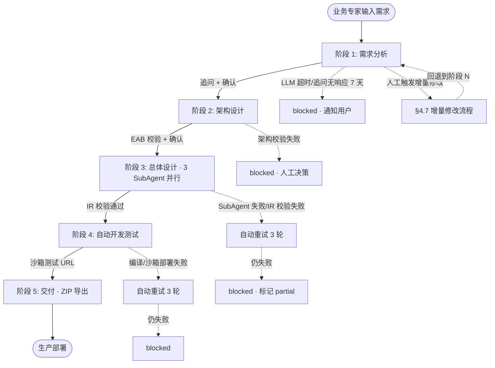
```mermaid
flowchart TB
  Start([业务专家输入需求]) --> S1[阶段 1: 需求分析]
  S1 -->|追问 + 确认| S2[阶段 2: 架构设计]
  S2 -->|EAB 校验 + 确认| S3[阶段 3: 总体设计 · 3 SubAgent 并行]
  S3 -->|IR 校验通过| S4[阶段 4: 自动开发测试]
  S4 -->|沙箱测试 URL| S5[阶段 5: 交付 · ZIP 导出]
  S5 --> End([生产部署])

  S1 -. LLM 超时/追问无响应 7 天 .-> blocked1[blocked · 通知用户]
  S2 -. 架构校验失败 .-> blocked2[blocked · 人工决策]
  S3 -. SubAgent 失败/IR 校验失败 .-> S3Retry[自动重试 3 轮]
  S3Retry -. 仍失败 .-> blocked3[blocked · 标记 partial]
  S4 -. 编译/沙箱部署失败 .-> S4Retry[自动重试 3 轮]
  S4Retry -. 仍失败 .-> blocked4[blocked]
  S1 -. 人工触发增量修改 .-> S4p7[§4.7 增量修改流程]
  S4p7 -. 回退到阶段 N .-> S1
```

## 4.2 NL→IR→编译五步管道（含异常路径）（图 4-2）

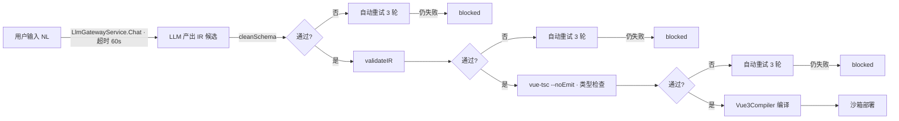
```mermaid
flowchart LR
  A[用户输入 NL] -->|LlmGatewayService.Chat · 超时 60s| B[LLM 产出 IR 候选]
  B -->|cleanSchema| C{通过?}
  C -->|否| C1[自动重试 3 轮]
  C1 -->|仍失败| Blocked1[blocked]
  C -->|是| D[validateIR]
  D --> E{通过?}
  E -->|否| E1[自动重试 3 轮]
  E1 -->|仍失败| Blocked2[blocked]
  E -->|是| F[vue-tsc --noEmit · 类型检查]
  F --> G{通过?}
  G -->|否| G1[自动重试 3 轮]
  G1 -->|仍失败| Blocked3[blocked]
  G -->|是| H[Vue3Compiler 编译]
  H --> I[沙箱部署]
```

## 4.3 沙箱部署流程（含异常路径）（图 4-3）

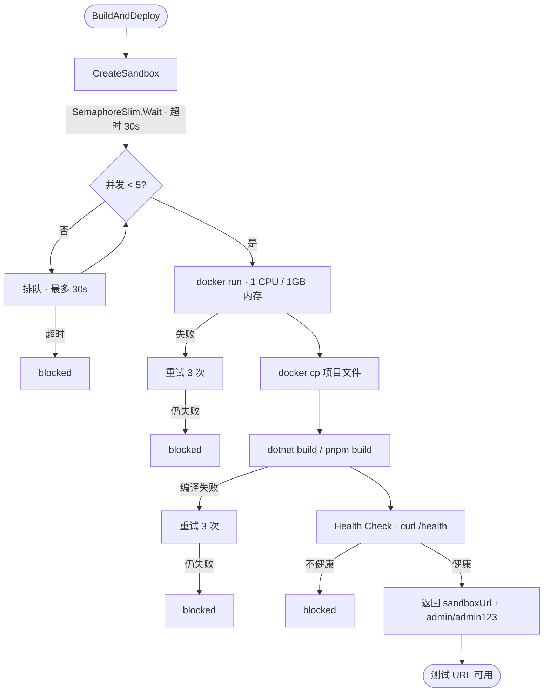
```mermaid
flowchart TB
  Start([BuildAndDeploy]) --> A[CreateSandbox]
  A -->|SemaphoreSlim.Wait · 超时 30s| B{并发 < 5?}
  B -->|否| Queue[排队 · 最多 30s]
  Queue -->|超时| Blocked1[blocked]
  Queue --> B
  B -->|是| C[docker run · 1 CPU / 1GB 内存]
  C -->|失败| Retry1[重试 3 次]
  Retry1 -->|仍失败| Blocked2[blocked]
  C --> D[docker cp 项目文件]
  D --> E[dotnet build / pnpm build]
  E -->|编译失败| Retry2[重试 3 次]
  Retry2 -->|仍失败| Blocked3[blocked]
  E --> F[Health Check · curl /health]
  F -->|不健康| Blocked4[blocked]
  F -->|健康| G[返回 sandboxUrl + admin/admin123]
  G --> End([测试 URL 可用])
```

## 4.4 知识补丁注入流程（不变）（图 4-4）

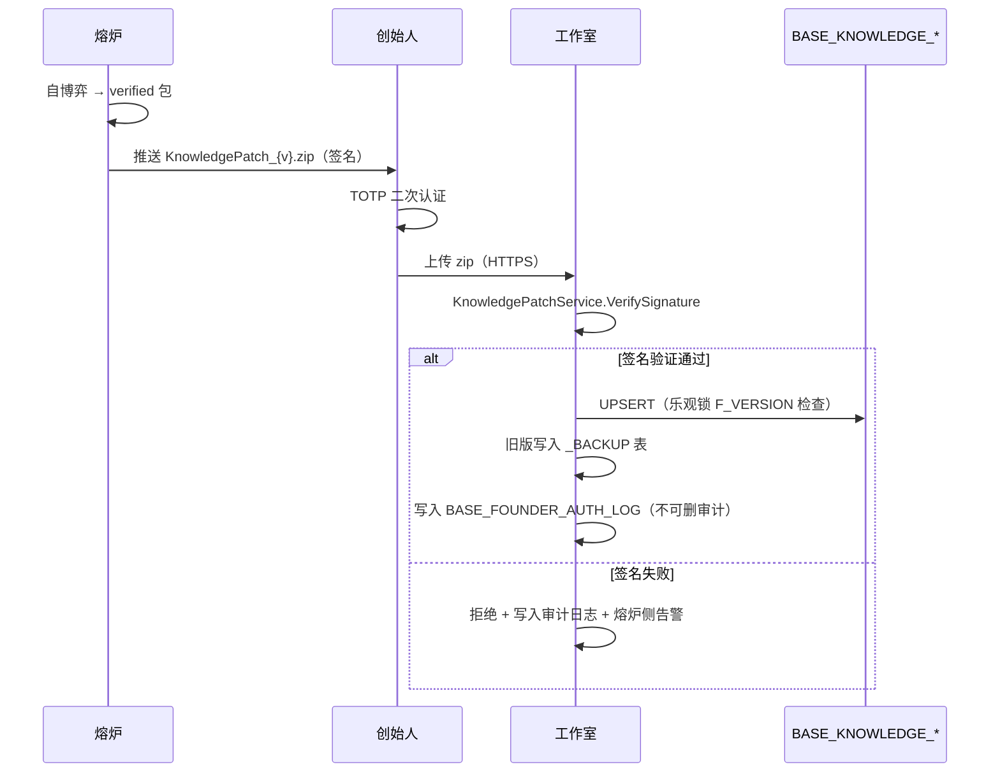
```mermaid
sequenceDiagram
  participant F as 熔炉
  participant FD as 创始人
  participant S as 工作室
  participant KG as BASE_KNOWLEDGE_*

  F->>F: 自博弈 → verified 包
  F->>FD: 推送 KnowledgePatch_{v}.zip（签名）
  FD->>FD: TOTP 二次认证
  FD->>S: 上传 zip（HTTPS）
  S->>S: KnowledgePatchService.VerifySignature
  alt 签名验证通过
    S->>KG: UPSERT（乐观锁 F_VERSION 检查）
    S->>S: 旧版写入 _BACKUP 表
    S->>S: 写入 BASE_FOUNDER_AUTH_LOG（不可删审计）
  else 签名失败
    S->>S: 拒绝 + 写入审计日志 + 熔炉侧告警
  end
```

## 4.5 熔炉自博弈流程（不变）（图 4-5）

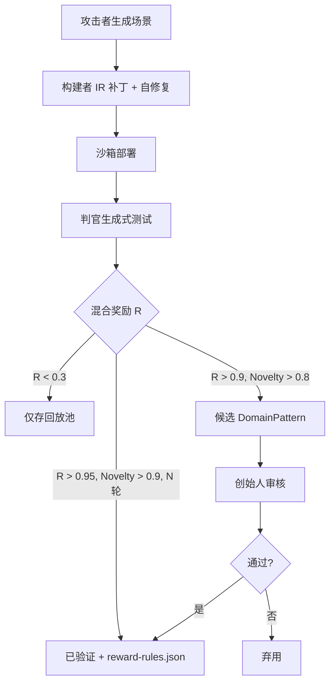
```mermaid
flowchart TB
  A[攻击者生成场景] --> B[构建者 IR 补丁 + 自修复]
  B --> C[沙箱部署]
  C --> D[判官生成式测试]
  D --> E{混合奖励 R}
  E -->|R < 0.3| F1[仅存回放池]
  E -->|R > 0.9, Novelty > 0.8| F2[候选 DomainPattern]
  E -->|R > 0.95, Novelty > 0.9, N 轮| F3[已验证 + reward-rules.json]
  F2 --> G[创始人审核]
  G --> H{通过?}
  H -->|是| F3
  H -->|否| I[弃用]
```

## 4.6 五阶段流水线状态机（含异常状态）（图 4-6）

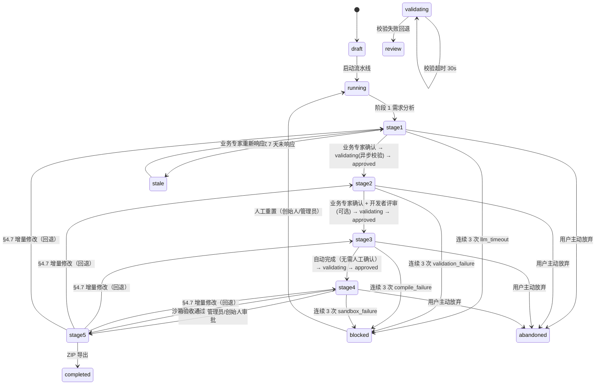
```mermaid
stateDiagram-v2
  [*] --> draft
  draft --> running: 启动流水线
  running --> stage1: 阶段 1 需求分析
  stage1 --> stage2: 业务专家确认 → validating(异步校验) → approved
  stage2 --> stage3: 业务专家确认 + 开发者评审(可选) → validating → approved
  stage3 --> stage4: 自动完成（无需人工确认）→ validating → approved
  stage4 --> stage5: 沙箱验收 + 管理员/创始人审批
  stage4 --> stage5: 沙箱验收通过
  stage5 --> completed: ZIP 导出
  stage1 --> blocked: 连续 3 次 llm_timeout
  stage2 --> blocked: 连续 3 次 validation_failure
  stage3 --> blocked: 连续 3 次 compile_failure
  stage4 --> blocked: 连续 3 次 sandbox_failure
  blocked --> running: 人工重置（创始人/管理员）
  stage1 --> stale: 业务专家 7 天未响应
  stale --> stage1: 业务专家重新响应
  stage5 --> stage4: §4.7 增量修改（回退）
  stage1 --> abandoned: 用户主动放弃
  stage2 --> abandoned: 用户主动放弃
  stage3 --> abandoned: 用户主动放弃
  stage4 --> abandoned: 用户主动放弃
  validating --> review: 校验失败回退
  validating --> validating: 校验超时 30s
  stage5 --> stage3: §4.7 增量修改（回退）
  stage5 --> stage2: §4.7 增量修改（回退）
  stage5 --> stage1: §4.7 增量修改（回退）
```

## 4.7 增量修改流程（§4.7 独立设计）

> **设计依据**：架构师三问 §4.7。本小节定义从交付阶段回退到前序阶段的完整流程。

### 4.7a 变更影响传播算法（D-8 · 审判令一）
三个核心函数: buildDependencyGraph O(N) + propagateImpact O(V+E) + determineReentryStage O(K)。总延迟 < 100ms（500节点）。
节点类型到阶段的映射: Requirement→stage1, ModuleDefinition/TableDefinition→stage2, Component/DataSource/WorkflowStep/RuleNode→stage3, CompileConfig→stage4。

### 4.7.1 回退粒度

用户可以从阶段 5（交付）回退到任意已完成阶段。回退目标与代价：

| 回退目标 | 保留的产物 | 需要重新生成的产物 | 适用场景 |
|----------|-----------|-------------------|----------|
| 阶段 1（需求分析） | 无 | 全部（需求→架构→设计→IR→编译→部署） | 需求理解完全错误，需要重新分析 |
| 阶段 2（架构设计） | 需求分析文档 | 架构→设计→IR→编译→部署 | 架构方案需要调整 |
| 阶段 3（总体设计） | 需求文档 + 架构设计 | IR→编译→部署 | **最常见**——架构正确但 IR 需要调整 |
| 阶段 4（自动开发） | 需求+架构+IR | 编译→部署 | IR 正确但编译失败 |

**被跳过阶段的产物处理**：标记为 `superseded`（已取代），保留但不删除。开发者可在版本历史中对比新旧产物差异。

### 4.7b 分治编辑详细设计（D-9 · 审判令二）
六步流程: buildNodeSummaryList → routeToAgent → extractSlice → Agent输出IREditPatch → applyPatch(只允许修改scope.writableNodeIds范围内节点) → validateAfterPatch。
IREditOperation: op(replace/add/remove) + path(JSONPath) + value + oldValue(自动填充用于回滚) + reason。

### 4.7.2 增量 vs 全量

**决定：全量替换 IR，不部分更新。**

理由：IR 的组件注册表引用是全局的（例如表单引用了组件注册表中的 `BasicTable`，如果仅部分替换，新 IR 中的组件引用可能与旧注册表版本不兼容）。全量替换避免了引用断裂风险。

**配套机制：IR 版本历史**

全量替换前，系统自动将当前 IR JSON 快照存入 `BASE_AI_PIPELINE_MESSAGE` 表（`F_ROLE = 'system'`, `F_CONTENT = IR_JSON_SNAPSHOT`, `F_STAGE = 'delivery'`），以便回退到历史 IR。版本快照格式：

```json
{
  "pipelineId": 123,
  "stage": "delivery",
  "snapshotAt": "2026-06-16T10:00:00Z",
  "irVersion": 3,
  "irContent": { ... }
}
```

### 4.7.3 上游产物版本自动升级

回退到阶段 N 时，系统自动检查阶段 1 至 N-1 中是否存在标记为 `superseded` 的产物。如有，替换为该阶段**最新 `approved` 状态的版本**作为输入。

**示例**：用户从阶段 5 回退到阶段 3。系统检查发现阶段 2 的架构设计文档有 v1（`superseded`）和 v2（`approved`），则自动以 v2 作为阶段 3 的输入。用户无需手动选择版本。

**版本链条**：

```
阶段 2 第一次产出 → approved (v1)
       ↓ 用户修改需求 → 回退到阶段 2
阶段 2 重新产出 → approved (v2), v1 → superseded
       ↓ 流水线继续到阶段 5
       ↓ 用户再次修改 → 回退到阶段 3
阶段 3 自动获取阶段 2 的 v2 (approved) 作为输入 ✅
```

### 4.7.4 沙箱销毁时序

**销毁时机**：用户选择回退目标并确认弹窗后，**在重新执行目标阶段之前**销毁。不在"点击增量修改按钮"瞬间销毁——因为用户可能在看到确认弹窗后取消操作。

**销毁→重建时序**：

```
1. 用户点击"增量修改" → 弹出回退目标选择器（此时沙箱仍在运行）
2. 用户选择目标阶段（阶段 1/2/3/4） → 弹出确认提示
3. 用户点击"确认" → 保存 IR 版本快照（BASE_IR_VERSION）→ 销毁沙箱
4. 销毁完成后 → 重新执行目标阶段及后续阶段
5. 阶段 4 完成后 → 创建新沙箱 → admin/admin123 自动创建 → 返回新 URL
```

### 4.7.5 IR 版本快照存储方案

**新建 BASE_IR_VERSION 表**（同步补入 §6 DDL）：

```sql
CREATE TABLE BASE_IR_VERSION (
  F_ID          BIGINT PRIMARY KEY,
  F_TENANT_ID   NVARCHAR(50) NOT NULL,
  F_PIPELINE_ID BIGINT NOT NULL,           -- 流水线 ID
  F_STAGE       NVARCHAR(20) NOT NULL,     -- 快照所属阶段
  F_VERSION     INT NOT NULL DEFAULT 1,    -- 版本号（同一流水线内递增）
  F_IR_CONTENT  NVARCHAR(MAX) NOT NULL,    -- IR JSON 完整快照
  F_STATUS      NVARCHAR(20) DEFAULT 'active',  -- active / superseded
  F_DIFF        NVARCHAR(MAX),  -- RFC 6902 JSON Patch 格式的差异
  F_TRIGGERED_BY NVARCHAR(50),  -- 触发者: "pipeline" | "user_rollback" | "founder_patch"
  F_CHANGE_SUMMARY NVARCHAR(500),  -- 变更摘要
  F_PARENT_VERSION INT,  -- 父版本号（链式追溯）
  F_CREATED_AT  DATETIME NOT NULL,
  INDEX IDX_PIPELINE (F_PIPELINE_ID, F_STAGE, F_VERSION),
  INDEX IDX_TENANT (F_TENANT_ID)
);
```

**快照触发时机**：
- 阶段 5 交付完成后，自动保存一份 `active` 快照
- 增量修改确认后，旧版本标记为 `superseded`，新快照标记为 `active`
- 每个阶段每个流水线最多保留 10 个版本（超量自动清理最早的非 active 版本）

### 4.7.6 增量修改完整流程（图 4-7）

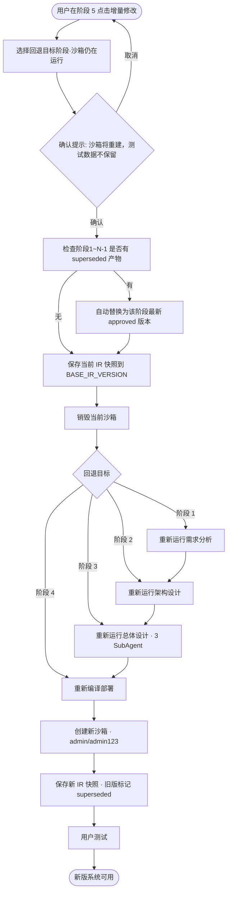
```mermaid
flowchart TB
  Start([用户在阶段 5 点击增量修改]) --> Select[选择回退目标阶段·沙箱仍在运行]
  Select --> Confirm{确认提示: 沙箱将重建，测试数据不保留}
  Confirm -->|取消| Start
  Confirm -->|确认| Upgrade[检查阶段1~N-1 是否有 superseded 产物]
  Upgrade -->|有| Replace[自动替换为该阶段最新 approved 版本]
  Upgrade -->|无| Snapshot[保存当前 IR 快照到 BASE_IR_VERSION]
  Replace --> Snapshot
  Snapshot --> Destroy[销毁当前沙箱]
  Destroy --> Switch{回退目标}
  Switch -->|阶段 1| S1[重新运行需求分析]
  Switch -->|阶段 2| S2[重新运行架构设计]
  Switch -->|阶段 3| S3[重新运行总体设计 · 3 SubAgent]
  Switch -->|阶段 4| S4[重新编译部署]
  S1 --> S2 --> S3 --> S4
  S4 --> Deploy[创建新沙箱 · admin/admin123]
  Deploy --> Snapshot2[保存新 IR 快照 · 旧版标记 superseded]
  Snapshot2 --> Test[用户测试]
  Test --> End([新版系统可用])
```


### 4.9a StaleMonitorService 实现规范（裁决书 B-02）

**职责**: Quartz.NET 定时任务，每小时扫描过期流水线，写入 BASE_AI_PIPELINE_MESSAGE 告警 + SignalR 推送。

**超时阈值**:
- 阶段1-2: 7天无操作 -> stale
- 阶段3: 3天无操作 -> stale
- 阶段4: 7天无操作(等待审批) -> stale

**恢复**: 管理员调用 resume 接口 -> 流水线回到 stale 前的阶段(stale_from_stage)，用户重新操作。

**复合索引 DDL**: 

## 4.8 里程碑甘特图

```
周次  1  2  3  4  5  6  7  8  9  10 11 12 13 14 15 16 17 18
      ├──┴──┴──┴──┴──┴──┴──┴──┴──┴──┴──┴──┴──┴──┴──┴──┴──┤
M0    ██ 冲刺 0-B
         │
M0.5     ██ 黄金集 50 条
         │  │
         ▼  ▼
M1          ████████ 阶段 1/2 智能体 + 流水线
              │
              ▼
M2                   ████████████████████ 阶段 3-5 + 多角色菜单
                        │                  │
                        ▼                  ▼
M3                                        ████████ 多租户 + 越权
                                              │
                                              ▼
M4                                                 ████████ FounderGuard + Patch
                                                        │
                                                        ▼
M5                                                          ██ RC1 集成测试
      ├──┴──┴──┴──┴──┴──┴──┴──┴──┴──┴──┴──┴──┴──┴──┴──┴──┤
      阶段五（第 1-10 周）                    阶段六（第 1-8 周）

依赖链：M0 → M0.5 → M1 → M2 → M3 → M4 → M5
      M0.5 与 M1 可部分并行（黄金集构建不阻塞智能体开发）
      M1 与 M3 可在阶段六启动首周部分重叠
```

**里程碑与当前进度对照**：

| 里程碑 | 周次 | 当前状态（2026-06-16） |
|--------|------|----------------------|
| M0 基座 | 冲刺 0-B | ✅ COMPLETED（IR + 网关 + 10 地桩 + Gate 全绿） |
| M0.5 评测基准 | 阶段五启动前 | ❌ NOT_STARTED（FR-B-039~042） |
| M1 流水线 Alpha | 阶段五 第 4 周 | ⚠️ 前端 Agent 已实现，后端 PipelineEngine + 6 SubAgent 已实现 |
| M2 全流程贯通 | 阶段五 第 10 周 | ⚠️ 沙箱 + 知识补丁已实现，阶段 3/5 交付待完成 |
| M3 多租户 | 阶段六 第 4 周 | ⚠️ 沙箱已实现，MultiTenancy=true 已确认，越权测试待补 |
| M4 创始人链路 | 阶段六 第 8 周 | ✅ FounderGuard/TOTP/Patch 已实现，联调待 Foundry 就绪 |
| M5 发布候选 | Gate + 集成测试 | ❌ NOT_STARTED |

---

# 第五章 · 接口设计

## 5.1 DynamicApi 风格接口契约

**全局规范**（CLAUDE.md R1+R2）：
- 所有接口由实现 `IDynamicApiController` 的 Service 自动生成
- 响应统一封装 `RESTfulResult<T>`
- 异常处理 `Oops.Oh()` 系统 / `Oops.Bah()` 业务
- JWT 鉴权 + 路由级权限
- 错误码 600 = JWT 过期

### 5.1.1 RESTfulResult 标准响应格式

```json
{
  "code": 200,
  "msg": "成功",
  "data": { ... },
  "requestId": "uuid",
  "timestamp": "2026-06-15T01:00:00Z"
}
```

### 5.1.2 错误码约定

| code | 含义 | HTTP 状态 |
|------|------|-----------|
| 200 | 成功 | 200 |
| 400 | 参数错误 | 400 |
| 401 | 未认证 | 401 |
| 403 | 无权限 | 403 |
| 600 | Token 过期 | 401 |
| 601 | 业务异常 | 200 |
| 602 | 系统异常 | 500 |

## 5.2 需求会话类接口

### 5.2.1 创建需求会话

```yaml
POST /api/analyst/session
Headers:
  Authorization: Bearer <jwt>
Body:
  {
    "requirement": "我需要一个员工请假管理系统",
    "domain": "OA",
    "multimodal": [
      { "type": "image", "url": "https://..." }
    ]
  }
Response:
  {
    "code": 200,
    "data": {
      "sessionId": "uuid",
      "stage": "requirement",
      "understanding": "员工请假管理",
      "questions": [
        "年假天数规则？",
        "审批层级？",
        "跨部门请假？"
      ]
    }
  }
```

### 5.2.2 发送消息

```yaml
POST /api/analyst/{id}/message
Body:
  {
    "content": "年假 5 天，三级审批，不支持跨部门",
    "role": "user"
  }
```

### 5.2.3 生成需求文档

```yaml
POST /api/analyst/{id}/generate-doc
Response:
  {
    "code": 200,
    "data": {
      "docId": "uuid",
      "url": "/docs/requirement/{id}.md"
    }
  }
```

## 5.3 架构设计类接口

```yaml
POST /api/architect/design
Body:
  {
    "requirementDocId": "uuid",
    "eab": {
      "framework": "modular-monolith",
      "ui": "ant-design-vue",
      "database": "sqlserver"
    }
  }
Response:
  {
    "code": 200,
    "data": {
      "architectureId": "uuid",
      "modules": [...],
      "database": {...},
      "irPages": [...]
    }
  }
```


### 5.4 流水线状态控制接口（裁决书 v1.1 · 2026-06-20）

**接口 1: 阶段审核** — 合并 confirm 和 reject 为统一接口


**新增接口 2: 恢复 stale 流水线**


**新增接口 3: stale 流水线列表**


**新增接口 4: 放弃流水线（含资源回收）**


**新增接口 5: 变更影响预览（回退前必调）**


**新增接口 6: 审批摘要**


**错误码（新增）**：
- 1011: 状态冲突（流水线当前状态不允许此操作，HTTP 409）
- 1012: 否决未填原因（reject 时 comment 为空，HTTP 400）
- 1013: 3轮否决已升级（reject_count >= 3，已自动上报管理员，HTTP 409）


```yaml
GET /api/pipeline/{id}
Response:
  {
    "code": 200,
    "data": {
      "sessionId": "uuid",
      "currentStage": "stage3",
      "stages": [
        { "name": "requirement", "status": "done" },
        { "name": "architecture", "status": "done" },
        { "name": "design", "status": "in_progress" }
      ],
      "artifacts": {
        "requirementDoc": "url",
        "architectureDoc": "url"
      }
    }
  }
```

## 5.4 裁决书接口 + 双视图产物查询

### 5.4.1 6个裁决书接口（议题1）

| 接口 | 方法 | 路由 | 说明 |
|------|------|------|------|
| 审核阶段 | POST | `/api/pipeline/{id}/stage/{stage}/review` | approve→validating→Hangfire; reject→计数+升级; request_changes→回Running |
| 恢复流水线 | POST | `/api/pipeline/{id}/resume` | stale→恢复到F_STALE_FROM_STAGE→Running |
| Stale列表 | GET | `/api/pipeline/stale` | 分页查询stale流水线 |
| 放弃流水线 | POST | `/api/pipeline/{id}/abandon` | 销毁沙箱→Abandoned→审计 |
| 预览回滚 | POST | `/api/pipeline/{id}/preview-rollback` | 版本树分析→影响节点→预估耗时 |
| 审批摘要 | GET | `/api/pipeline/{id}/approval-summary` | 配置化阈值对比→passed+details |

### 5.4.2 双视图产物查询接口（I-14）

```yaml
端点: GET /api/pipeline/{id}/artifacts/{stage}?view=business|technical
权限:
  - view=business: 业务专家(JWT role=expert)
  - view=technical: 开发者/管理员(JWT role=developer|admin)
鉴权: JWT + 角色权限
响应200:
  {
    "code": 200,
    "data": {
      "pipelineId": "123",
      "stage": "architecture",
      "view": "business",
      "documents": [
        {"type": "function_list", "format": "table", "url": "/artifacts/123/function_list.json"},
        {"type": "bpmn", "format": "svg", "url": "/artifacts/123/flow.svg"},
        {"type": "wireframe", "format": "svg", "url": "/artifacts/123/wireframe.svg"},
        {"type": "data_entities", "format": "table", "url": "/artifacts/123/entities.json"},
        {"type": "role_permission_matrix", "format": "table", "url": "/artifacts/123/permissions.json"}
      ]
    }
  }
错误码:
  - 403: 角色不匹配(业务专家请求technical视图)
  - 404: 流水线或阶段不存在
  - 409: 该阶段尚未完成，无产物
```

## 5.5 自动开发测试类接口

```yaml
POST /api/devengine/build
Body:
  {
    "irIds": ["uuid1", "uuid2"],
    "target": "vue3-pc"
  }
Response:
  {
    "code": 200,
    "data": {
      "buildId": "uuid",
      "sandboxUrl": "https://sandbox-{tenantId}.jnpf.local",
      "testReport": "url",
      "duration": 23456
    }
  }
```

## 5.6 沙箱管理类接口

```yaml
GET /api/sandbox/{tenantId}/status
Response:
  {
    "code": 200,
    "data": {
      "tenantId": "tenant_001",
      "activeCount": 2,
      "maxConcurrent": 5,
      "sandboxes": [
        {
          "sandboxId": "uuid",
          "status": "ready",
          "url": "https://sandbox-001.jnpf.local",
          "createdAt": "2026-06-15T01:00:00Z"
        }
      ]
    }
  }
```

## 5.7 创始人认证类接口

### 5.7.1 TOTP 二次认证

```yaml
POST /api/founder/auth/verify
Headers:
  X-Founder-Token: <founder_jwt>
Body:
  {
    "totpCode": "123456"
  }
Response:
  {
    "code": 200,
    "data": {
      "verified": true,
      "sessionToken": "uuid",
      "expiresIn": 300
    }
  }
```

### 5.7.2 自博弈任务查询（转发熔炉）

```yaml
GET /api/founder/selfplay/tasks
Headers:
  X-Founder-Token: <founder_jwt>
  X-Founder-Totp-Session: <session_token>
Response:
  {
    "code": 200,
    "data": {
      "tasks": [
        {
          "taskId": "uuid",
          "domain": "education",
          "status": "running",
          "round": 42,
          "reward": 0.87
        }
      ]
    }
  }
```

## 5.8 AI 审计类接口

```yaml
GET /api/admin/ai/calls?page=1&size=20&tenantId=tenant_001&startTime=2026-06-01
Response:
  {
    "code": 200,
    "data": {
      "total": 12345,
      "list": [
        {
          "callId": "uuid",
          "tenantId": "tenant_001",
          "userId": "user_001",
          "agent": "RequirementAnalystAgent",
          "model": "deepseek-chat",
          "tokens": 1234,
          "latency": 5678,
          "confidence": 0.92,
          "timestamp": "2026-06-15T01:00:00Z"
        }
      ]
    }
  }
```

### 5.XX 分治编辑与SSE推送接口（D-10 · 审判令三）

分治编辑: POST /api/pipeline/{id}/locate-nodes（节点定位）、POST /api/pipeline/{id}/surgical-edit（应用编辑）、POST /api/pipeline/{id}/rollback-patch（回滚编辑）。
SSE推送: GET /api/pipeline/{id}/events（SSE流，推送PipelineSSEEvent）。事件字段: stage, phase, progress, thought, agent, warning, timeout_alert, elapsed_ms, estimated_remaining_ms。
Agent Checkpoint: 每个Agent基类内置checkpoint()方法，同时写入SSE流和BASE_AI_PIPELINE_MESSAGE表。
超时监控: 软超时(超预期)→warning，硬超时(超最大)→timeout+熔断计数。每个Agent独立计时。

## 5.9 MCP 工具 JSON Schema（如果实施）

### 5.9.1 query_metrics

```json
{
  "name": "query_metrics",
  "description": "查询指标数据",
  "inputSchema": {
    "type": "object",
    "properties": {
      "metricName": { "type": "string" },
      "dimensions": { "type": "object" },
      "timeRange": {
        "type": "object",
        "properties": {
          "start": { "type": "string", "format": "date-time" },
          "end": { "type": "string", "format": "date-time" }
        }
      }
    },
    "required": ["metricName"]
  }
}
```

### 5.9.2 list_metrics

```json
{
  "name": "list_metrics",
  "description": "列出可用指标",
  "inputSchema": {
    "type": "object",
    "properties": {
      "domain": { "type": "string" },
      "filter": { "type": "string" }
    }
  }
}
```

### 5.9.3 explain_metric

```json
{
  "name": "explain_metric",
  "description": "解释指标口径",
  "inputSchema": {
    "type": "object",
    "properties": {
      "metricName": { "type": "string" }
    },
    "required": ["metricName"]
  }
}
```

**注**：本期（开发态需求层）**不实施 MCP**——仅占位，详细设计阶段再决定。

---

# 第六章 · 数据库表设计

## 6.0 表总览

**60+张表（开发态）+ 运行态 5 张纸面方案待评估**，按模块分组。

### 6.0.1 五期八张 AI 核心表 DDL 覆盖确认

| 表名 | §6 章节 | DDL 来源 | 状态 |
|------|---------|----------|------|
| BASE_AI_CALL_LOG | §6.4.1 | v1.1 已提供（需与 AiCallLogEntity.cs 对齐） | ⚠️ DDL 字段多于 Entity，以 Entity 为准 |
| BASE_AI_PIPELINE | §6.4.2 | v1.1 已提供（需与 AiPipelineEntity.cs 对齐） | ⚠️ DDL 字段多于 Entity，以 Entity 为准 |
| BASE_AI_PIPELINE_MESSAGE | §6.4.3 | v1.1 已提供（需与 AiPipelineMessageEntity.cs 对齐） | ⚠️ DDL 字段多于 Entity，以 Entity 为准 |
| BASE_AI_PROMPT_TEMPLATE | §6.4.4 | v1.1 已提供（需与 AiPromptTemplateEntity.cs 对齐） | ⚠️ DDL 字段多于 Entity，以 Entity 为准 |
| BASE_KNOWLEDGE_NODE | §6.4.5 | v1.1 已提供 + §6.6.3 补充 F_VERSION 乐观锁 | ✅ COMPLETED |
| BASE_KNOWLEDGE_EDGE | §6.4.6 | v1.1 已提供 + §6.6.3 补充 F_VERSION 乐观锁 | ✅ COMPLETED |
| BASE_FOUNDER_AUTH_LOG | §6.5.1 | v1.1 已提供（与 FounderAuthLogEntity.cs 对齐） | ✅ COMPLETED |
| BASE_SANDBOX | §6.6.1 | v2.1 D-03 持久化设计（含 F_CONTAINER_ID + 双层模式） | ✅ 新增设计 |
| BASE_IR_VERSION | §6.6.4 | v2.1 §4.7.5 新增（IR 版本快照 · 增量修改追溯） | ✅ 新增设计 |

> ⚠️ 注意事项：
> - 前 4 张表（CALL_LOG/PIPELINE/PIPELINE_MESSAGE/PROMPT_TEMPLATE）的 DDL 字段数多于实际 Entity 类字段数。v1.1 文档 DDL 包含规划字段（如 F_AGENT/F_DOMAIN/F_CONFIDENCE），但实际 Entity 尚未包含。编码时以代码库 Entity 类为准。
> - 运行态 5 张纸面方案表（DATA_SYNC_TASK/METRIC_IR_DEFINITION/METRIC_IR_VERSION/METRIC_IR_SIMULATE_LOG/METRIC_AGGREGATE_CACHE）已在本说明书中标注"待废弃或独立立项，不纳入本期增量"。架构说明书 §4.4.2 同步标注。

### 6.0.2 模块分组

| 模块 | 表数量 | 代表表 |
|------|--------|--------|
| **system** | 8 | BASE_USER / BASE_ROLE / BASE_PERMISSION / BASE_ORGANIZE / BASE_DICT / BASE_BILLRULE / ... |
| **visualdev** | 3 | VISUALDEV_FORM / VISUALDEV_TABLE / VISUALDEV_FIELD |
| **workflow** | 18 | FLOW_TASK / FLOW_TEMPLATE / ...（18 张 FLOW_*） |
| **visualdata** | 4 | VISUALDATA_BIGSCREEN / VISUALDATA_DATASOURCE / ... |
| **engine** | 2 | ENGINE_BUSINESS_RULE / ENGINE_RULE_VERSION |
| **inteAssistant** | 7 | BASE_AI_CALL_LOG / BASE_AI_PIPELINE / BASE_AI_PIPELINE_MESSAGE / BASE_AI_PROMPT_TEMPLATE / BASE_KNOWLEDGE_NODE / BASE_KNOWLEDGE_EDGE / ... |
| **oauth** | 2 | BASE_FOUNDER_AUTH_LOG / OAUTH_* |
| **message** | 2 | MESSAGE_RECORD / MESSAGE_CONFIG |
| **taskscheduler** | 2 | TASK_SCHEDULER / TASK_LOG |
| **extend** | 5+ | EXT_*（客户扩展） |
| **codegen** | 1 | CODEGEN_TEMPLATE |
| **common** | 0 | （无表，纯代码） |
| **app** | 2 | APP_INFO / APP_VERSION |
| **subdev** | 0 | （无表，已冻结） |
| **zxdev** | ⚠️ | **待澄清** |
| **沙箱** | 1 | BASE_SANDBOX |
| **运行态** | 10 | DATA_SYNC_TASK / METRIC_IR_DEFINITION / ... |
| **合计** | **60+** | （不含 EXT_*；运行态 5 张纸面方案待评估） |

### 6.0.3 已知技术债（阶段六统一治理）

以下 JNPF 框架原有表未严格遵守 F_ 前缀命名规范，**不阻塞当前开发**，已列为阶段六技术债统一治理：

| 表名 | 问题 | 治理计划 |
|------|------|----------|
| 部分 legacy 表缺少 F_ 前缀 | 列名裸 PascalCase | 阶段六统一 RENAME |
| 部分原有表缺少 F_TENANT_ID | 多租户未全覆盖 | 阶段六 ALTER TABLE 补加 |
| 雪花 workerId 硬编码 | 分布式 ID 可能冲突 | 从配置中心读取，未配置时默认 0 |

> **新增表（BASE_AI_*, BASE_IR_*, EVAL_METRIC）严格遵守 §6.1 命名规范，不欠新债。**

## 6.1 命名规范（升标）

**强制规则**：
- 表名：`{MODULE_PREFIX}_{ENTITY}` 大写下划线
- 列名：`F_` 前缀（如 `F_TENANT_ID`），禁止裸 PascalCase
- 用户 ID：`string`（不用 `long`）
- 租户基类：所有业务表继承租户基类（含 `F_TENANT_ID`）
- 审计字段：自动注入
- 逻辑删除：`F_IS_DELETED BIT DEFAULT 0`
- 主键：`F_ID BIGINT`（雪花算法）

## 6.2 system 模块表

### 6.2.1 BASE_USER

```sql
CREATE TABLE BASE_USER (
  F_ID BIGINT PRIMARY KEY,
  F_TENANT_ID NVARCHAR(50) NOT NULL,
  F_ACCOUNT NVARCHAR(50) NOT NULL,
  F_PASSWORD NVARCHAR(255) NOT NULL,
  F_REAL_NAME NVARCHAR(50),
  F_NICK_NAME NVARCHAR(50),
  F_EMAIL NVARCHAR(100),
  F_PHONE NVARCHAR(20),
  F_AVATAR NVARCHAR(500),
  F_ORGANIZE_ID NVARCHAR(50),
  F_POSITION_ID NVARCHAR(50),
  F_ROLE_ID NVARCHAR(2000),
  F_IS_ENABLED BIT DEFAULT 1,
  F_IS_DELETED BIT DEFAULT 0,
  F_CREATE_USER_ID NVARCHAR(50),
  F_CREATE_TIME DATETIME,
  F_MODIFY_USER_ID NVARCHAR(50),
  F_MODIFY_TIME DATETIME,
  INDEX IDX_TENANT (F_TENANT_ID),
  INDEX IDX_ACCOUNT (F_ACCOUNT, F_TENANT_ID)
);
```

### 6.2.2 BASE_ROLE

```sql
CREATE TABLE BASE_ROLE (
  F_ID BIGINT PRIMARY KEY,
  F_TENANT_ID NVARCHAR(50) NOT NULL,
  F_NAME NVARCHAR(50),
  F_CODE NVARCHAR(50),
  F_DESCRIPTION NVARCHAR(500),
  F_IS_DELETED BIT DEFAULT 0,
  F_CREATE_USER_ID NVARCHAR(50),
  F_CREATE_TIME DATETIME,
  F_MODIFY_USER_ID NVARCHAR(50),
  F_MODIFY_TIME DATETIME,
  INDEX IDX_TENANT (F_TENANT_ID),
  UNIQUE INDEX IDX_CODE (F_CODE, F_TENANT_ID)
);
```

### 6.2.3 BASE_PERMISSION

```sql
CREATE TABLE BASE_PERMISSION (
  F_ID BIGINT PRIMARY KEY,
  F_TENANT_ID NVARCHAR(50) NOT NULL,
  F_MODULE_ID NVARCHAR(50),
  F_NAME NVARCHAR(50),
  F_CODE NVARCHAR(100),
  F_TYPE NVARCHAR(20),  -- 'menu' | 'button' | 'column' | 'data'
  F_PARENT_ID NVARCHAR(50),
  F_SORT_CODE INT,
  F_IS_DELETED BIT DEFAULT 0,
  F_CREATE_USER_ID NVARCHAR(50),
  F_CREATE_TIME DATETIME,
  F_MODIFY_USER_ID NVARCHAR(50),
  F_MODIFY_TIME DATETIME,
  INDEX IDX_TENANT (F_TENANT_ID),
  UNIQUE INDEX IDX_CODE (F_CODE, F_TENANT_ID)
);
```

### 6.2.4-6.2.8 其他 system 表

详见附录 §6.10（BASE_ORGANIZE / BASE_DICT / BASE_BILLRULE / ...）。

## 6.3 workflow 模块表（18 张 FLOW_*）

### 6.3.1 FLOW_TASK（核心任务表）

```sql
CREATE TABLE FLOW_TASK (
  F_ID BIGINT PRIMARY KEY,
  F_TENANT_ID NVARCHAR(50) NOT NULL,
  F_FLOW_ID NVARCHAR(50),
  F_INSTANCE_ID NVARCHAR(50),
  F_TITLE NVARCHAR(200),
  F_CURRENT_NODE NVARCHAR(50),
  F_CURRENT_NODES NVARCHAR(2000),  -- 多节点并行
  F_STATUS INT,  -- 0=草稿 1=进行中 2=已完成 3=已驳回
  F_RESULT INT,  -- 1=同意 2=驳回 3=转办
  F_START_USER_ID NVARCHAR(50),
  F_START_TIME DATETIME,
  F_END_TIME DATETIME,
  F_FORM_DATA NVARCHAR(MAX),  -- JSON
  F_FLOW_JSON NVARCHAR(MAX),  -- 工作流配置
  F_IS_DELETED BIT DEFAULT 0,
  F_CREATE_USER_ID NVARCHAR(50),
  F_CREATE_TIME DATETIME,
  F_MODIFY_USER_ID NVARCHAR(50),
  F_MODIFY_TIME DATETIME,
  INDEX IDX_TENANT (F_TENANT_ID),
  INDEX IDX_FLOW (F_FLOW_ID),
  INDEX IDX_USER (F_START_USER_ID)
);
```

### 6.3.2 18 张 FLOW_* 完整列表

| 序号 | 表名 | 用途 |
|------|------|------|
| 1 | FLOW_TASK | 任务主表 |
| 2 | FLOW_TEMPLATE | 模板 |
| 3 | FLOW_NODE | 节点 |
| 4 | FLOW_LINE | 连线 |
| 5 | FLOW_OPERATION | 操作 |
| 6 | FLOW_TASK_NODE | 任务节点关联 |
| 7 | FLOW_TASK_USER | 任务用户关联 |
| 8 | FLOW_TASK_HISTORY | 历史 |
| 9 | FLOW_TASK_TRANSFER | 转办 |
| 10 | FLOW_TASK_DELEGATE | 委托 |
| 11 | FLOW_TASK_CIRCULATE | 传阅 |
| 12 | FLOW_TASK_PRINT | 打印 |
| 13 | FLOW_TASK_COMMENT | 评论 |
| 14 | FLOW_TASK_FILE | 附件 |
| 15 | FLOW_TASK_SIGNATURE | 签名 |
| 16 | FLOW_TASK_VARIABLE | 变量 |
| 17 | FLOW_TASK_NOTIFY | 通知 |
| 18 | FLOW_TASK_AUDIT | 审计 |

## 6.4 inteAssistant 模块表

### 6.4.1 BASE_AI_CALL_LOG（冲刺 0-B 地桩 1）

```sql
CREATE TABLE BASE_AI_CALL_LOG (
  F_ID BIGINT PRIMARY KEY,
  F_TENANT_ID NVARCHAR(50) NOT NULL,
  F_USER_ID NVARCHAR(50),
  F_AGENT NVARCHAR(50),  -- 'RequirementAnalyst' | 'Architect' | ...
  F_MODEL NVARCHAR(50),  -- 'deepseek-chat' | 'tongyi' | ...
  F_PROVIDER NVARCHAR(20),
  F_PROMPT_TOKENS INT,
  F_COMPLETION_TOKENS INT,
  F_TOTAL_TOKENS INT,
  F_LATENCY INT,  -- ms
  F_CONFIDENCE DECIMAL(3,2),
  F_VALIDATION_ID NVARCHAR(50),  -- UUID, 异步校验任务 ID
  F_STALE_FROM_STAGE NVARCHAR(20),  -- 进入 stale 前的阶段
  F_REJECT_COUNT INT DEFAULT 0,  -- 累计否决次数
  F_ABANDONED_AT DATETIME,
  F_ABANDONED_BY NVARCHAR(50),
  F_ABANDON_REASON NVARCHAR(500),
  F_INPUT NVARCHAR(MAX),  -- 截断存储
  F_OUTPUT NVARCHAR(MAX),
  F_ERROR NVARCHAR(MAX),
  F_CALL_TIME DATETIME,
  INDEX IDX_TENANT (F_TENANT_ID),
  INDEX IDX_USER (F_USER_ID, F_CALL_TIME),
  INDEX IDX_AGENT (F_AGENT, F_CALL_TIME)
);
```

### 6.4.2 BASE_AI_PIPELINE（五阶段流水线状态）

```sql
CREATE TABLE BASE_AI_PIPELINE (
  F_ID BIGINT PRIMARY KEY,
  F_TENANT_ID NVARCHAR(50) NOT NULL,
  F_SESSION_ID NVARCHAR(50) UNIQUE,
  F_USER_ID NVARCHAR(50),
  F_DOMAIN NVARCHAR(50),
  F_REQUIREMENT NVARCHAR(MAX),
  F_CURRENT_STAGE NVARCHAR(20),  -- 'requirement' | 'architecture' | 'design' | 'development' | 'delivery'
  F_STAGE_STATUS NVARCHAR(20),  -- 'pending' | 'in_progress' | 'done' | 'failed'
  F_ARTIFACTS NVARCHAR(MAX),  -- JSON: 各阶段产物 ID
  F_CONFIDENCE DECIMAL(3,2),
  F_VALIDATION_ID NVARCHAR(50),  -- UUID, 异步校验任务 ID
  F_STALE_FROM_STAGE NVARCHAR(20),  -- 进入 stale 前的阶段
  F_REJECT_COUNT INT DEFAULT 0,  -- 累计否决次数
  F_ABANDONED_AT DATETIME,
  F_ABANDONED_BY NVARCHAR(50),
  F_ABANDON_REASON NVARCHAR(500),
  F_IS_DELETED BIT DEFAULT 0,
  F_CREATE_USER_ID NVARCHAR(50),
  F_CREATE_TIME DATETIME,
  F_MODIFY_USER_ID NVARCHAR(50),
  F_MODIFY_TIME DATETIME,
  INDEX IDX_TENANT (F_TENANT_ID),
  INDEX IDX_SESSION (F_SESSION_ID),
  INDEX IDX_USER (F_USER_ID, F_CREATE_TIME)
);
```

### 6.4.3 BASE_AI_PIPELINE_MESSAGE

```sql
CREATE TABLE BASE_AI_PIPELINE_MESSAGE (
  F_ID BIGINT PRIMARY KEY,
  F_TENANT_ID NVARCHAR(50) NOT NULL,
  F_SESSION_ID NVARCHAR(50),
  F_ROLE NVARCHAR(20),  -- 'system' | 'user' | 'assistant'
  F_CONTENT NVARCHAR(MAX),
  F_ATTACHMENTS NVARCHAR(MAX),  -- JSON: 多模态附件
  F_TIMESTAMP DATETIME,
  INDEX IDX_TENANT (F_TENANT_ID),
  INDEX IDX_SESSION (F_SESSION_ID, F_TIMESTAMP)
);
```

### 6.4.4 BASE_AI_PROMPT_TEMPLATE

```sql
CREATE TABLE BASE_AI_PROMPT_TEMPLATE (
  F_ID BIGINT PRIMARY KEY,
  F_TENANT_ID NVARCHAR(50) NOT NULL,
  F_NAME NVARCHAR(100),
  F_CODE NVARCHAR(50),
  F_AGENT NVARCHAR(50),
  F_SYSTEM_PROMPT NVARCHAR(MAX),
  F_VARIABLES NVARCHAR(MAX),  -- JSON: 变量定义
  F_VERSION INT,
  F_IS_ENABLED BIT DEFAULT 1,
  F_IS_DELETED BIT DEFAULT 0,
  F_CREATE_USER_ID NVARCHAR(50),
  F_CREATE_TIME DATETIME,
  F_MODIFY_USER_ID NVARCHAR(50),
  F_MODIFY_TIME DATETIME,
  INDEX IDX_TENANT (F_TENANT_ID),
  UNIQUE INDEX IDX_CODE (F_CODE, F_TENANT_ID, F_VERSION)
);
```

### 6.4.5 BASE_KNOWLEDGE_NODE

```sql
CREATE TABLE BASE_KNOWLEDGE_NODE (
  F_ID BIGINT PRIMARY KEY,
  F_TENANT_ID NVARCHAR(50) NOT NULL,
  F_NODE_ID NVARCHAR(50),
  F_DOMAIN NVARCHAR(50),
  F_TYPE NVARCHAR(30),  -- 'entity' | 'rule' | 'component' | 'pattern'
  F_NAME NVARCHAR(100),
  F_DESCRIPTION NVARCHAR(MAX),
  F_CONTENT NVARCHAR(MAX),  -- JSON: 模式内容
  F_SOURCE NVARCHAR(20),  -- 'ai-discovered' | 'human-created' | 'self-play'
  F_STATUS NVARCHAR(20),  -- 'candidate' | 'verified' | 'deprecated'
  F_USAGE_COUNT INT DEFAULT 0,
  F_SUCCESS_RATE DECIMAL(3,2),
  F_VERSION INT,
  F_IS_DELETED BIT DEFAULT 0,
  F_CREATE_USER_ID NVARCHAR(50),
  F_CREATE_TIME DATETIME,
  F_MODIFY_USER_ID NVARCHAR(50),
  F_MODIFY_TIME DATETIME,
  INDEX IDX_TENANT (F_TENANT_ID),
  INDEX IDX_DOMAIN (F_DOMAIN),
  INDEX IDX_STATUS (F_STATUS)
);
```

### 6.4.6 BASE_KNOWLEDGE_EDGE

```sql
CREATE TABLE BASE_KNOWLEDGE_EDGE (
  F_ID BIGINT PRIMARY KEY,
  F_TENANT_ID NVARCHAR(50) NOT NULL,
  F_FROM_NODE_ID NVARCHAR(50),
  F_TO_NODE_ID NVARCHAR(50),
  F_RELATION_TYPE NVARCHAR(30),  -- 'IS_CAUSED_BY' | 'CONTRADICTS_RULE' | 'DEPENDS_ON' | 'USES'
  F_WEIGHT DECIMAL(3,2),
  F_DESCRIPTION NVARCHAR(500),
  F_IS_DELETED BIT DEFAULT 0,
  F_CREATE_USER_ID NVARCHAR(50),
  F_CREATE_TIME DATETIME,
  INDEX IDX_TENANT (F_TENANT_ID),
  INDEX IDX_FROM (F_FROM_NODE_ID),
  INDEX IDX_TO (F_TO_NODE_ID)
);
```

### 6.4.7 AI_INFERENCE_LOG（运行态对齐）

```sql
CREATE TABLE AI_INFERENCE_LOG (
  F_ID BIGINT PRIMARY KEY,
  F_TENANT_ID NVARCHAR(50) NOT NULL,
  F_AGENT NVARCHAR(50),
  F_INPUT NVARCHAR(MAX),
  F_OUTPUT NVARCHAR(MAX),
  F_REASONING_PATH NVARCHAR(MAX),  -- JSON: 推理路径
  F_TIMESTAMP DATETIME,
  INDEX IDX_TENANT (F_TENANT_ID)
);
```

## 6.5 oauth 模块表

### 6.5.1 BASE_FOUNDER_AUTH_LOG（**不可删审计**）

```sql
CREATE TABLE BASE_FOUNDER_AUTH_LOG (
  F_ID BIGINT PRIMARY KEY,
  F_TENANT_ID NVARCHAR(50) NOT NULL,
  F_USER_ID NVARCHAR(50),
  F_ACTION NVARCHAR(50),  -- 'login' | 'verify_totp' | 'sign_patch' | 'audit'
  F_TARGET NVARCHAR(200),
  F_RESULT NVARCHAR(20),  -- 'success' | 'failure'
  F_IP_ADDRESS NVARCHAR(50),
  F_USER_AGENT NVARCHAR(500),
  F_TIMESTAMP DATETIME,
  INDEX IDX_TENANT (F_TENANT_ID),
  INDEX IDX_USER (F_USER_ID, F_TIMESTAMP)
  -- ⚠️ 不可删审计：DB 触发器禁止 DELETE / TRUNCATE
);
```

### 6.5.2 AI_PII_MASK_LOG（运行态对齐）

```sql
CREATE TABLE AI_PII_MASK_LOG (
  F_ID BIGINT PRIMARY KEY,
  F_TENANT_ID NVARCHAR(50) NOT NULL,
  F_AGENT NVARCHAR(50),
  F_INPUT_FIELDS NVARCHAR(MAX),  -- JSON: PII 字段
  F_MASK_RULES NVARCHAR(MAX),    -- JSON: 脱敏规则
  F_TIMESTAMP DATETIME,
  INDEX IDX_TENANT (F_TENANT_ID)
);
```

## 6.6 沙箱表

> **D-03 设计约束**：SandboxManager 当前使用内存 `ConcurrentDictionary` 管理沙箱实例。服务重启后所有沙箱状态丢失。本节设计 BASE_SANDBOX 持久化表，SandboxManager 改为 "DB 加载 + 内存缓存" 双层模式。

### 6.6.1 BASE_SANDBOX（持久化 · D-03 新增设计）

```sql
CREATE TABLE BASE_SANDBOX (
  F_ID          BIGINT PRIMARY KEY,
  F_TENANT_ID   NVARCHAR(50) NOT NULL,
  F_SANDBOX_ID  NVARCHAR(50) UNIQUE,      -- 沙箱唯一标识（GUID 前 12 位）
  F_NAME        NVARCHAR(100),            -- 沙箱名称，如 "ai-generated-进销存管理系统"
  F_CONTAINER_ID NVARCHAR(100),           -- Docker 容器 ID
  F_IMAGE       NVARCHAR(200) DEFAULT 'jnpf-sandbox:latest',
  F_STATUS      NVARCHAR(20) NOT NULL DEFAULT 'pending',  -- pending/running/stopped/destroyed
  F_URL         NVARCHAR(500),            -- 沙箱访问 URL（如 http://host:5000）
  F_API_URL     NVARCHAR(500),            -- API 地址
  F_FRONTEND_URL NVARCHAR(500),           -- 前端地址
  F_DB_NAME     NVARCHAR(50),             -- per-tenant DB 名称（JNPF_Sandbox_{tenantId}）
  F_DB_CONNECTION_STRING NVARCHAR(500),   -- DB 连接串
  F_CPU_COUNT   INT DEFAULT 1,
  F_MEMORY_MB   INT DEFAULT 1024,
  F_PORT        INT DEFAULT 8080,
  F_TIMEOUT_SECONDS INT DEFAULT 300,
  F_CREATED_AT  DATETIME NOT NULL,
  F_DESTROYED_AT DATETIME,
  F_IS_DELETED  BIT DEFAULT 0,
  INDEX IDX_TENANT (F_TENANT_ID),
  INDEX IDX_STATUS (F_STATUS),
  INDEX IDX_CONTAINER (F_CONTAINER_ID)
);
```

### 6.6.2 SandboxManager 双层模式设计

```
  服务启动
     │
     ▼
  ┌──────────────────────┐
  │ 从 DB 加载 running     │  ← 恢复重启前的沙箱状态
  │ 状态的沙箱列表         │
  └──────┬───────────────┘
         │
         ▼
  ┌──────────────────────┐
  │ docker inspect 验证    │  ← 确认容器仍存在
  │ 容器存活              │
  └──────┬───────────────┘
         │
    ┌────┴────┐
    │         │
    ▼         ▼
  存活      已死
    │         │
    ▼         ▼
  恢复      标记为
  内存      destroyed
  缓存
```

**操作规则**：
- `CreateAsync`：docker run → INSERT → 加入内存 ConcurrentDictionary
- `DestroyAsync`：docker stop → UPDATE status='destroyed' → 从内存移除
- `GetStatusAsync`：先从内存查 → 内存无则从 DB 查 → DB 有且 status=running 则 docker inspect 验证
- 服务重启恢复：`SELECT * FROM BASE_SANDBOX WHERE F_STATUS IN ('pending','running') AND F_IS_DELETED=0` → docker inspect 逐一验证

### 6.6.3 知识图谱并发控制（D-03 补充约束）

知识补丁注入（KnowledgePatchService）涉及 BASE_KNOWLEDGE_NODE 和 BASE_KNOWLEDGE_EDGE 的 UPSERT 操作。同时业务专家的 RAG 查询可能读取这些表。

**并发控制方案：乐观锁 + 版本字段**

```sql
-- 在 BASE_KNOWLEDGE_NODE 和 BASE_KNOWLEDGE_EDGE 中增加版本控制字段
ALTER TABLE BASE_KNOWLEDGE_NODE ADD F_VERSION INT DEFAULT 1;
ALTER TABLE BASE_KNOWLEDGE_EDGE ADD F_VERSION INT DEFAULT 1;

-- 备份表（存储被覆盖的旧版本，用于回滚）
CREATE TABLE BASE_KNOWLEDGE_NODE_BACKUP (
  F_ID BIGINT PRIMARY KEY,
  F_ORIGINAL_ID BIGINT,       -- 指向 BASE_KNOWLEDGE_NODE.F_ID
  F_TENANT_ID NVARCHAR(50),
  F_NODE_ID NVARCHAR(50),
  F_CONTENT NVARCHAR(MAX),
  F_VERSION INT,               -- 被覆盖时的版本号
  F_BACKUP_AT DATETIME,        -- 备份时间
  F_BACKUP_REASON NVARCHAR(50) -- 'upsert' | 'delete'
);
```

**UPSERT 流程（乐观锁）**：
```
1. SELECT F_ID, F_VERSION FROM BASE_KNOWLEDGE_NODE WHERE F_NODE_ID = @nodeId
2. 如果存在：
   a. 将当前行 INSERT INTO BASE_KNOWLEDGE_NODE_BACKUP
   b. UPDATE BASE_KNOWLEDGE_NODE SET ... F_VERSION = F_VERSION + 1
      WHERE F_ID = @id AND F_VERSION = @version  -- 乐观锁
   c. 如果 affected rows = 0 → 版本冲突 → 返回当前版本号让调用方决定
3. 如果不存在：INSERT ... F_VERSION = 1
```

**"仅 verified 可合并"的判定条件**：
- `F_STATUS = 'verified'` 的节点/边才被 KnowledgePatch 合并
- `F_STATUS = 'candidate'` 的仅存在于熔炉侧，不注入工作室
- `F_STATUS = 'deprecated'` 的保留但查询时默认过滤

### 6.6.4 BASE_IR_VERSION 完整 DDL（DB-11 补全）

整合议题 1+3 全部字段的 BASE_IR_VERSION 完整定义：

```sql
CREATE TABLE BASE_IR_VERSION (
    F_ID               BIGINT NOT NULL PRIMARY KEY,
    F_PIPELINE_ID      BIGINT NOT NULL,
    F_VERSION          INT NOT NULL,
    F_TRIGGERED_BY     NVARCHAR(100) NULL,        -- 议题1
    F_CHANGE_SUMMARY   NVARCHAR(500) NULL,        -- 议题1
    F_PARENT_VERSION_ID BIGINT NULL,              -- 议题1: 版本树
    F_DIFF             NVARCHAR(MAX) DEFAULT '[]',-- 议题1: RFC 6902
    F_CHANGE_TYPE      NVARCHAR(20) NULL,         -- 议题3: full_rollback/surgical_edit/stage_advance
    F_EDIT_PATCH_ID    BIGINT NULL,               -- 议题3: FK→BASE_IR_EDIT_PATCH
    F_VALIDATION_RESULT NVARCHAR(MAX) NULL,       -- 议题3: 校验链结果JSON
    F_SNAPSHOT_AT      DATETIME NULL,             -- 议题3: 快照时间
    F_IR_SNAPSHOT      NVARCHAR(MAX) NULL,        -- 完整IR JSON快照
    F_TENANT_ID        NVARCHAR(50) NOT NULL,
    F_CREATOR_USER_ID  NVARCHAR(50) NULL,
    F_CREATOR_TIME     DATETIME NULL,
    F_LAST_MODIFY_USER_ID NVARCHAR(50) NULL,
    F_LAST_MODIFY_TIME    DATETIME NULL,
    INDEX IDX_IR_VERSION_QUERY (F_PIPELINE_ID, F_SNAPSHOT_AT DESC),
    INDEX IDX_IR_VERSION_CLEANUP (F_PIPELINE_ID, F_CHANGE_TYPE, F_SNAPSHOT_AT),
    INDEX IDX_IR_VERSION_TREE (F_PIPELINE_ID, F_PARENT_VERSION_ID)
);
```

### 6.6.5 知识图谱 UPSERT 设计约束（DB-18/19）

- **事务包裹**：所有知识图谱 UPSERT 操作必须用 `BEGIN TRAN → 备份旧值到 *_BACKUP → UPSERT → COMMIT` 包裹
- **乐观锁冲突处理**：`F_VERSION` 冲突时指数退避重试，最多 3 次。第 3 次仍冲突则返回错误让调用方决定
- **清理机制**（DB-20）：StaleMonitorService 顺带清理 `BASE_KNOWLEDGE_NODE_BACKUP` 中超过 30 天的记录

#### 知识图谱备份清理详细设计（DB-20 扩展 · v2.1 玛维思 #7）

**保留策略**：
| 参数 | 值 | 说明 |
|------|-----|------|
| 备份保留天数 | **30 天** | 超过 30 天的 `BASE_KNOWLEDGE_NODE_BACKUP` / `BASE_KNOWLEDGE_EDGE_BACKUP` 自动清理 |
| 清理周期 | 每小时 | StaleMonitorService 定时扫描（与 pipeline stale 检测共用 Quartz Job） |
| 单次清理上限 | 1000 条/批 | 防止长事务锁表 |
| 清理 SQL | `DELETE TOP(1000) FROM BASE_KNOWLEDGE_NODE_BACKUP WHERE F_BACKUP_AT < DATEADD(DAY, -30, GETDATE())` | 分批循环执行直到 affected=0 |

**乐观锁冲突指数退避重试**：
```
第 1 次冲突 → 等待 100ms → 重读 F_VERSION → 重试 UPSERT
第 2 次冲突 → 等待 200ms → 重读 F_VERSION → 重试 UPSERT
第 3 次冲突 → 等待 400ms → 重读 F_VERSION → 重试 UPSERT
第 4 次冲突 → 返回错误 (HTTP 409 Conflict)，含当前 F_VERSION 供调用方决定
```

**"仅 verified 可合并"的判定条件**：
- `F_STATUS = 'verified'` 的节点/边才被 KnowledgePatch 合并
- `F_STATUS = 'candidate'` 的仅存在于熔炉侧，不注入工作室
- `F_STATUS = 'deprecated'` 的保留但查询时默认过滤

**备份表清理日志**：每次清理操作写入 `BASE_AI_PIPELINE_MESSAGE`（`F_ROLE='system'`, `F_CONTENT='{"type":"backup_cleanup","deleted":N,"before":"<datetime>"}'`），供管理员审计。

### 6.6.6 雪花算法 workerId 分配（DB-31）

- workerId 从配置中心读取（`Snowflake:WorkerId`），未配置时默认 0
- 单机部署不冲突；多机部署时每台机器分配唯一 workerId（0-31）
- 配置文件示例：`{ "Snowflake": { "WorkerId": 1 } }`

## 6.7 运行态表（与开发态对齐）

| 运行态表 | 开发态对应 | 处理 |
|---------|-----------|------|
| DATA_SYNC_TASK | **暂无** | ○ 决策：纸面方案，待废弃或独立立项 |
| DATA_SYNC_SCHEMA_VERSION | **暂无** | ○ 同上 |
| METRIC_IR_DEFINITION | **暂无** | ○ 同上，与 visualdata 可能重叠 |
| METRIC_IR_VERSION | **暂无** | ○ 同上 |
| METRIC_IR_SIMULATE_LOG | **暂无** | ○ 同上 |
| BASE_AI_CALL_LOG | BASE_AI_CALL_LOG | ✅ 共享，已有 |
| AI_INFERENCE_LOG | **暂无** | ❌ 本期不做 |
| AI_PII_MASK_LOG | **暂无** | ❌ 本期不做 |
| METRIC_AGGREGATE_CACHE | **暂无** | ○ 纸面方案 |
| ALERT_LOG | system 模块已有 | ⚠️ 命名待统一 |

### 6.7.1 多租户跨库物理隔离升级路径（v2.1 新增 · 阶段六）

> **设计依据**：首席架构师裁定千问 SEC-05。当前阶段五采用 `F_TENANT_ID` 逻辑隔离（已有 ITenantFilter），物理隔离（per-tenant SQL Server Database）推迟到阶段六多租户正式启用时实现。

#### 当前状态（阶段五）

| 隔离方式 | 实现 | 防护层级 |
|----------|------|----------|
| `F_TENANT_ID` 逻辑隔离 | ITenantFilter + TenantMiddleware | L3 ORM 层（§9.3.1） |
| 共享 SQL Server 实例 | 所有租户共享同一 DB，通过 TenantId 列区分 | L4 数据库层（共享模式） |

#### 阶段六升级路径

```
阶段五（当前）                        阶段六（升级后）
┌─────────────────────┐        ┌──────────────────────────┐
│  共享 SQL Server     │        │  SQL Server 实例          │
│  ┌───────────────┐   │   →    │  ├── tenant_default (模板) │
│  │ 所有租户数据   │   │        │  ├── tenant_001 (独立DB)  │
│  │ (TenantId区分) │   │        │  ├── tenant_002 (独立DB)  │
│  └───────────────┘   │        │  └── tenant_N   (独立DB)  │
└─────────────────────┘        └──────────────────────────┘
```

#### 升级步骤

| 步骤 | 操作 | 说明 |
|------|------|------|
| 1 | 创建 per-tenant DB 模板 | `CREATE DATABASE JNPF_TENANT_{ID}` 从模板克隆 |
| 2 | 数据迁移 | 从共享 DB 按 `F_TENANT_ID` 导出 → 导入到对应租户独立 DB |
| 3 | 更新连接字符串解析 | `ConnectionStringsResolver` 按 `TenantId` 动态返回对应 DB 连接串 |
| 4 | 更新沙箱 DB 分配 | `SandboxScheduler` 创建沙箱时分配到对应租户的独立 DB |
| 5 | 越权测试 | 10 条越权用例（§9.3.2）全部通过 + 新增跨 DB 访问拦截测试 |

#### 阶段五兼容性约束

- 代码层 `ITenantFilter` 接口签名在阶段五已预留 `GetCurrentTenantDbConnectionString()` 方法（返回 null = 共享模式）
- 阶段六升级时无需修改业务代码，仅需修改 `ConnectionStringsResolver` 实现
- DDL 脚本中 `F_TENANT_ID` 列已在阶段五全部添加（见 §9.3.4 迁移方案）

## 6.8 ER 图（图 6-1）

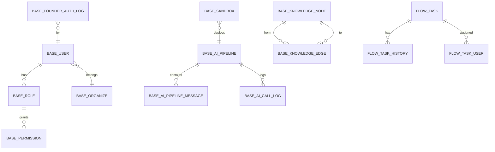
```mermaid
erDiagram
  BASE_USER ||--o{ BASE_ROLE : "has"
  BASE_USER }|--|| BASE_ORGANIZE : "belongs"
  BASE_ROLE ||--o{ BASE_PERMISSION : "grants"
  BASE_AI_PIPELINE ||--o{ BASE_AI_PIPELINE_MESSAGE : "contains"
  BASE_AI_PIPELINE ||--o{ BASE_AI_CALL_LOG : "logs"
  BASE_KNOWLEDGE_NODE ||--o{ BASE_KNOWLEDGE_EDGE : "from"
  BASE_KNOWLEDGE_NODE ||--o{ BASE_KNOWLEDGE_EDGE : "to"
  FLOW_TASK ||--o{ FLOW_TASK_HISTORY : "has"
  FLOW_TASK ||--o{ FLOW_TASK_USER : "assigned"
  BASE_SANDBOX }o--|| BASE_AI_PIPELINE : "deploys"
  BASE_FOUNDER_AUTH_LOG }o--|| BASE_USER : "by"
```

## 6.9 评测表（**A6 缺口**）

### 6.9.1 EVAL_GOLDEN_SET

```sql
CREATE TABLE EVAL_GOLDEN_SET (
  F_ID BIGINT PRIMARY KEY,
  F_DOMAIN NVARCHAR(50),  -- 'education' | 'medical' | 'manufacturing' | 'retail' | 'general'
  F_REQUIREMENT NVARCHAR(MAX),
  F_EXPECTED_IR NVARCHAR(MAX),
  F_EXPECTED_OUTPUT NVARCHAR(MAX),
  F_DIFFICULTY INT,  -- 1-10
  F_CREATED_AT DATETIME,
  INDEX IDX_DOMAIN (F_DOMAIN)
);
```

### 6.9.2 EVAL_RUN_LOG

```sql
CREATE TABLE EVAL_RUN_LOG (
  F_ID BIGINT PRIMARY KEY,
  F_TENANT_ID NVARCHAR(50) NOT NULL,
  F_MODEL NVARCHAR(50),
  F_PROMPT_VERSION INT,
  F_TOTAL_SCORE DECIMAL(5,2),
  F_DETAILS NVARCHAR(MAX),  -- JSON: 每条评分
  F_RUN_TIME DATETIME,
  INDEX IDX_TENANT (F_TENANT_ID)
);
```

## 6.10 其他模块表（概要）

| 表 | 模块 | 说明 |
|----|------|------|
| VISUALDEV_FORM | visualdev | 表单定义 |
| VISUALDEV_TABLE | visualdev | 数据表定义 |
| VISUALDEV_FIELD | visualdev | 字段定义 |
| VISUALDATA_BIGSCREEN | visualdata | 大屏定义 |
| VISUALDATA_DATASOURCE | visualdata | 数据源 |
| ENGINE_BUSINESS_RULE | engine | 业务规则 |
| ENGINE_RULE_VERSION | engine | 规则版本 |
| MESSAGE_RECORD | message | 消息记录 |
| MESSAGE_CONFIG | message | 消息配置 |
| TASK_SCHEDULER | taskscheduler | 任务定义 |
| TASK_LOG | taskscheduler | 执行日志 |
| EXT_* | extend | 客户扩展（多） |
| CODEGEN_TEMPLATE | codegen | 生成模板 |
| APP_INFO | app | 应用信息 |
| APP_VERSION | app | 应用版本 |

**详细字段设计**（每张表）：见附录章节（待补充完整 DDL）。

---

# 第七章 · 关键时序设计

## 7.1 业务专家"零代码搭应用"完整时序（图 7-1）

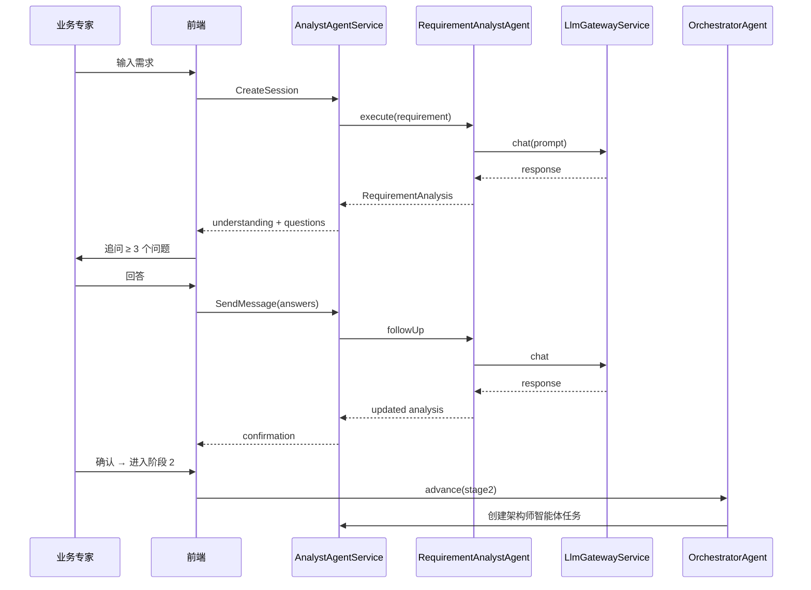
```mermaid
sequenceDiagram
  participant U as 业务专家
  participant FE as 前端
  participant AS as AnalystAgentService
  participant AA as RequirementAnalystAgent
  participant LG as LlmGatewayService
  participant OR as OrchestratorAgent

  U->>FE: 输入需求
  FE->>AS: CreateSession
  AS->>AA: execute(requirement)
  AA->>LG: chat(prompt)
  LG-->>AA: response
  AA-->>AS: RequirementAnalysis
  AS-->>FE: understanding + questions
  FE->>U: 追问 ≥ 3 个问题
  U->>FE: 回答
  FE->>AS: SendMessage(answers)
  AS->>AA: followUp
  AA->>LG: chat
  LG-->>AA: response
  AA-->>AS: updated analysis
  AS-->>FE: confirmation
  U->>FE: 确认 → 进入阶段 2
  FE->>OR: advance(stage2)
  OR->>AS: 创建架构师智能体任务
```

## 7.2 阶段 3 总体设计——6 SubAgent 两批次串行时序（图 7-2）

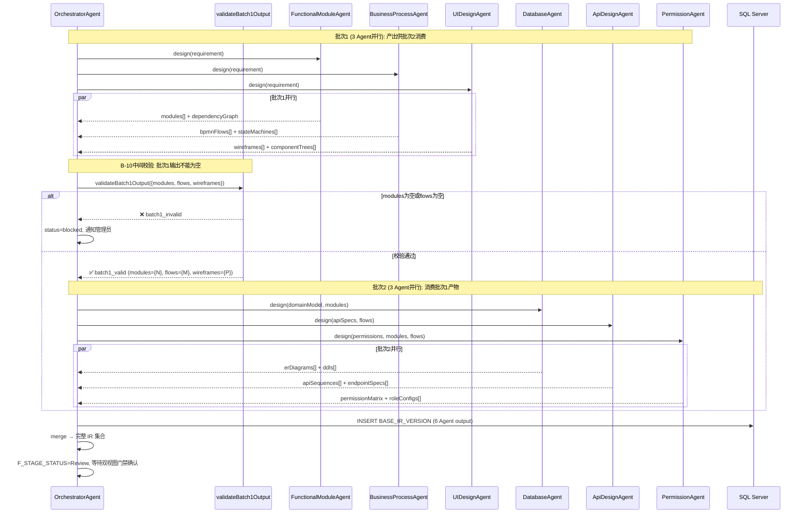
```mermaid
sequenceDiagram
    participant OR as OrchestratorAgent
    participant V1 as validateBatch1Output
    participant FM as FunctionalModuleAgent
    participant BP as BusinessProcessAgent
    participant UI as UIDesignAgent
    participant DB as DatabaseAgent
    participant API as ApiDesignAgent
    participant PM as PermissionAgent
    participant DBs as SQL Server

    Note over OR,PM: 批次1 (3 Agent并行): 产出供批次2消费
    OR->>FM: design(requirement)
    OR->>BP: design(requirement)
    OR->>UI: design(requirement)
    par 批次1并行
        FM-->>OR: modules[] + dependencyGraph
        BP-->>OR: bpmnFlows[] + stateMachines[]
        UI-->>OR: wireframes[] + componentTrees[]
    end

    Note over OR,V1: B-10中间校验: 批次1输出不能为空
    OR->>V1: validateBatch1Output({modules, flows, wireframes})
    alt modules为空或flows为空
        V1-->>OR: ❌ batch1_invalid
        OR->>OR: status=blocked, 通知管理员
    else 校验通过
        V1-->>OR: ✅ batch1_valid (modules={N}, flows={M}, wireframes={P})

        Note over OR,DBs: 批次2 (3 Agent并行): 消费批次1产物
        OR->>DB: design(domainModel, modules)
        OR->>API: design(apiSpecs, flows)
        OR->>PM: design(permissions, modules, flows)
        par 批次2并行
            DB-->>OR: erDiagrams[] + ddls[]
            API-->>OR: apiSequences[] + endpointSpecs[]
            PM-->>OR: permissionMatrix + roleConfigs[]
        end
    end

    OR->>DBs: INSERT BASE_IR_VERSION (6 Agent output)
    OR->>OR: merge → 完整 IR 集合
    OR->>OR: F_STAGE_STATUS=Review, 等待双视图门禁确认
```

**两批次设计说明**：批次1产出(modules/flows/wireframes)供批次2消费。`validateBatch1Output()` 检查批次1的modules/tables非空——若为空则直接blocked，避免批次2基于空数据生成垃圾。校验链与议题1 `PipelineValidationJob` 共用 cleanSchema→validateIR→vue-tsc 三步。

## 7.3 阶段 4 自动开发测试时序（图 7-3）

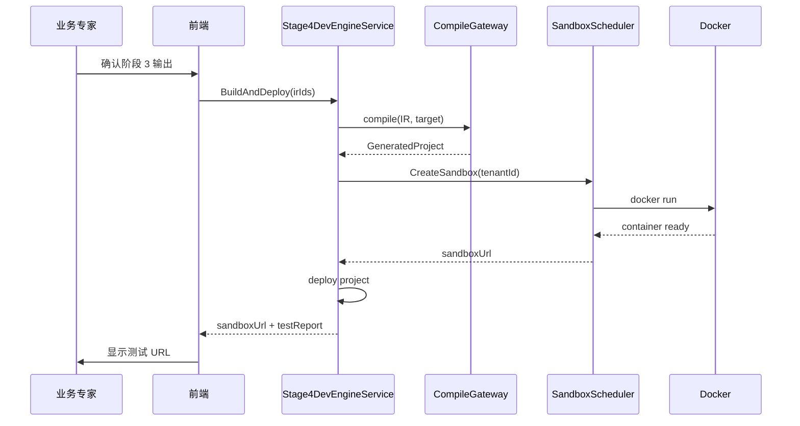
```mermaid
sequenceDiagram
  participant U as 业务专家
  participant FE as 前端
  participant DE as Stage4DevEngineService
  participant CG as CompileGateway
  participant SS as SandboxScheduler
  participant DK as Docker

  U->>FE: 确认阶段 3 输出
  FE->>DE: BuildAndDeploy(irIds)
  DE->>CG: compile(IR, target)
  CG-->>DE: GeneratedProject
  DE->>SS: CreateSandbox(tenantId)
  SS->>DK: docker run
  DK-->>SS: container ready
  SS-->>DE: sandboxUrl
  DE->>DE: deploy project
  DE-->>FE: sandboxUrl + testReport
  FE->>U: 显示测试 URL
```

## 7.4 知识补丁注入时序（图 7-4）

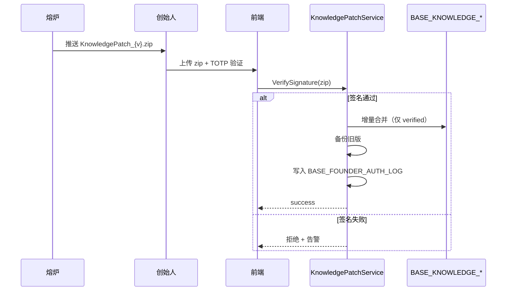
```mermaid
sequenceDiagram
  participant F as 熔炉
  participant FD as 创始人
  participant FE as 前端
  participant KP as KnowledgePatchService
  participant KG as BASE_KNOWLEDGE_*

  F->>FD: 推送 KnowledgePatch_{v}.zip
  FD->>FE: 上传 zip + TOTP 验证
  FE->>KP: VerifySignature(zip)
  alt 签名通过
    KP->>KG: 增量合并（仅 verified）
    KP->>KP: 备份旧版
    KP->>KP: 写入 BASE_FOUNDER_AUTH_LOG
    KP-->>FE: success
  else 签名失败
    KP-->>FE: 拒绝 + 告警
  end
```

## 7.5 创始人认证时序（图 7-5）

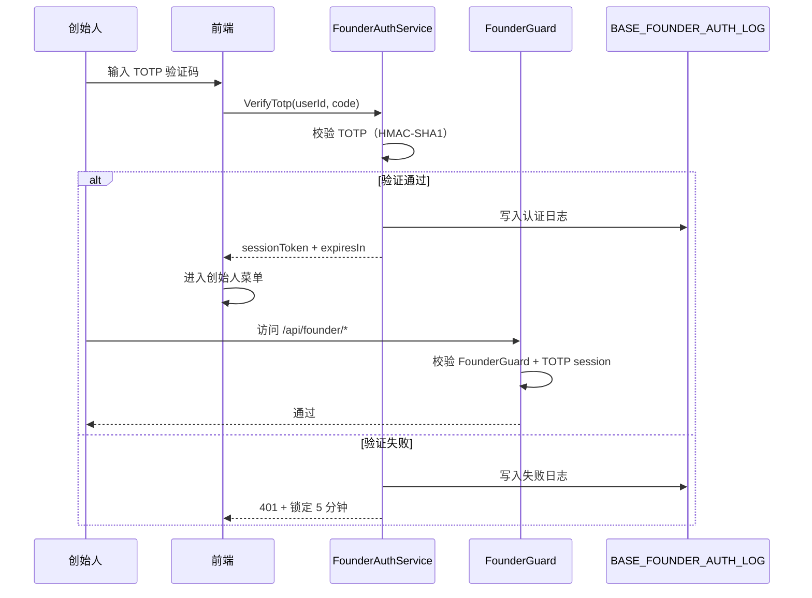
```mermaid
sequenceDiagram
  participant FD as 创始人
  participant FE as 前端
  participant FA as FounderAuthService
  participant FG as FounderGuard
  participant AL as BASE_FOUNDER_AUTH_LOG

  FD->>FE: 输入 TOTP 验证码
  FE->>FA: VerifyTotp(userId, code)
  FA->>FA: 校验 TOTP（HMAC-SHA1）
  alt 验证通过
    FA->>AL: 写入认证日志
    FA-->>FE: sessionToken + expiresIn
    FE->>FE: 进入创始人菜单
    FD->>FG: 访问 /api/founder/*
    FG->>FG: 校验 FounderGuard + TOTP session
    FG-->>FD: 通过
  else 验证失败
    FA->>AL: 写入失败日志
    FA-->>FE: 401 + 锁定 5 分钟
  end
```

## 7.6 沙箱创建时序（图 7-6）

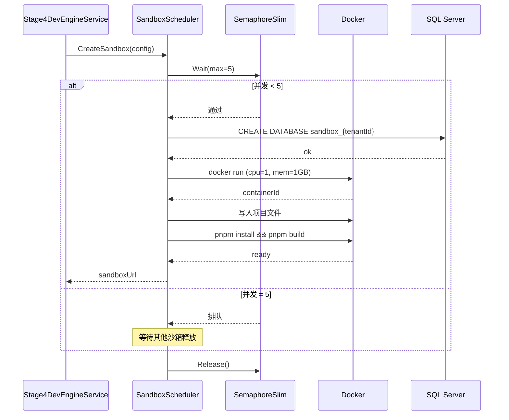
```mermaid
sequenceDiagram
  participant DE as Stage4DevEngineService
  participant SS as SandboxScheduler
  participant SM as SemaphoreSlim
  participant DK as Docker
  participant DB as SQL Server

  DE->>SS: CreateSandbox(config)
  SS->>SM: Wait(max=5)
  alt 并发 < 5
    SM-->>SS: 通过
    SS->>DB: CREATE DATABASE sandbox_{tenantId}
    DB-->>SS: ok
    SS->>DK: docker run (cpu=1, mem=1GB)
    DK-->>SS: containerId
    SS->>DK: 写入项目文件
    SS->>DK: pnpm install && pnpm build
    DK-->>SS: ready
    SS-->>DE: sandboxUrl
  else 并发 = 5
    SM-->>SS: 排队
    Note over SS: 等待其他沙箱释放
  end
  SS->>SM: Release()
```

## 7.7 LLM 降级链路时序——MiMo→DeepSeek 2级 + 熔断 + 审计（图 7-7）

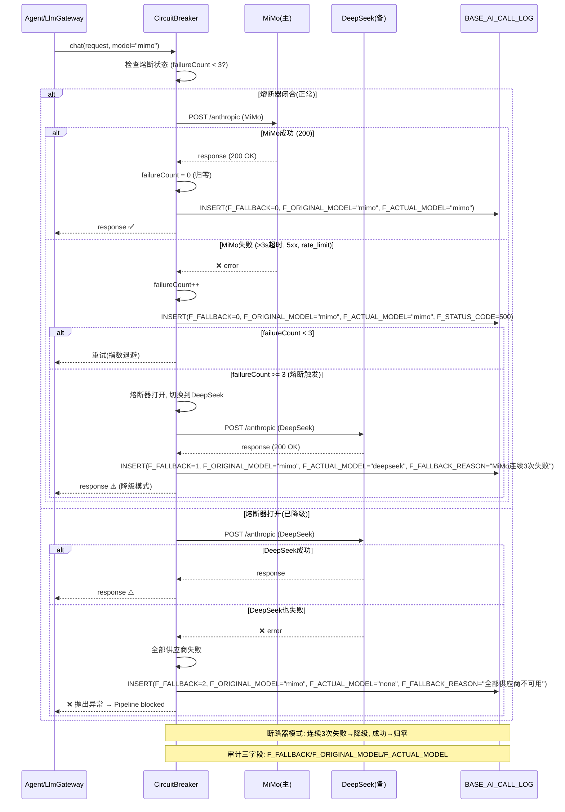
```mermaid
sequenceDiagram
    participant AG as Agent/LlmGateway
    participant CB as CircuitBreaker
    participant M1 as MiMo(主)
    participant M2 as DeepSeek(备)
    participant AL as BASE_AI_CALL_LOG

    AG->>CB: chat(request, model="mimo")
    CB->>CB: 检查熔断状态 (failureCount < 3?)
    alt 熔断器闭合(正常)
        CB->>M1: POST /anthropic (MiMo)
        alt MiMo成功 (200)
            M1-->>CB: response (200 OK)
            CB->>CB: failureCount = 0 (归零)
            CB->>AL: INSERT(F_FALLBACK=0, F_ORIGINAL_MODEL="mimo", F_ACTUAL_MODEL="mimo")
            CB-->>AG: response ✅
        else MiMo失败 (>3s超时, 5xx, rate_limit)
            M1-->>CB: ❌ error
            CB->>CB: failureCount++
            CB->>AL: INSERT(F_FALLBACK=0, F_ORIGINAL_MODEL="mimo", F_ACTUAL_MODEL="mimo", F_STATUS_CODE=500)
            
            alt failureCount < 3
                CB-->>AG: 重试(指数退避)
            else failureCount >= 3 (熔断触发)
                CB->>CB: 熔断器打开, 切换到DeepSeek
                CB->>M2: POST /anthropic (DeepSeek)
                M2-->>CB: response (200 OK)
                CB->>AL: INSERT(F_FALLBACK=1, F_ORIGINAL_MODEL="mimo", F_ACTUAL_MODEL="deepseek", F_FALLBACK_REASON="MiMo连续3次失败")
                CB-->>AG: response ⚠️ (降级模式)
            end
        end
    else 熔断器打开(已降级)
        CB->>M2: POST /anthropic (DeepSeek)
        alt DeepSeek成功
            M2-->>CB: response
            CB-->>AG: response ⚠️
        else DeepSeek也失败
            M2-->>CB: ❌ error
            CB->>CB: 全部供应商失败
            CB->>AL: INSERT(F_FALLBACK=2, F_ORIGINAL_MODEL="mimo", F_ACTUAL_MODEL="none", F_FALLBACK_REASON="全部供应商不可用")
            CB-->>AG: ❌ 抛出异常 → Pipeline blocked
        end
    end

    Note over CB,AL: 断路器模式: 连续3次失败→降级, 成功→归零
    Note over CB,AL: 审计三字段: F_FALLBACK/F_ORIGINAL_MODEL/F_ACTUAL_MODEL
```

## 7.8 多租户越权测试时序（图 7-8）

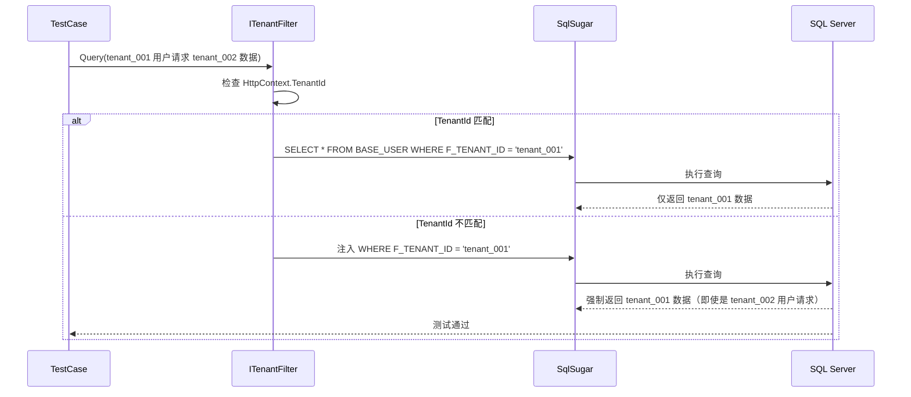
```mermaid
sequenceDiagram
  participant TC as TestCase
  participant IT as ITenantFilter
  participant SQL as SqlSugar
  participant DB as SQL Server

  TC->>IT: Query(tenant_001 用户请求 tenant_002 数据)
  IT->>IT: 检查 HttpContext.TenantId
  alt TenantId 匹配
    IT->>SQL: SELECT * FROM BASE_USER WHERE F_TENANT_ID = 'tenant_001'
    SQL->>DB: 执行查询
    DB-->>SQL: 仅返回 tenant_001 数据
  else TenantId 不匹配
    IT->>SQL: 注入 WHERE F_TENANT_ID = 'tenant_001'
    SQL->>DB: 执行查询
    DB-->>SQL: 强制返回 tenant_001 数据（即使是 tenant_002 用户请求）
    DB-->>TC: 测试通过
  end
```


## 7.7 分治编辑全流程时序（SEQ-6）

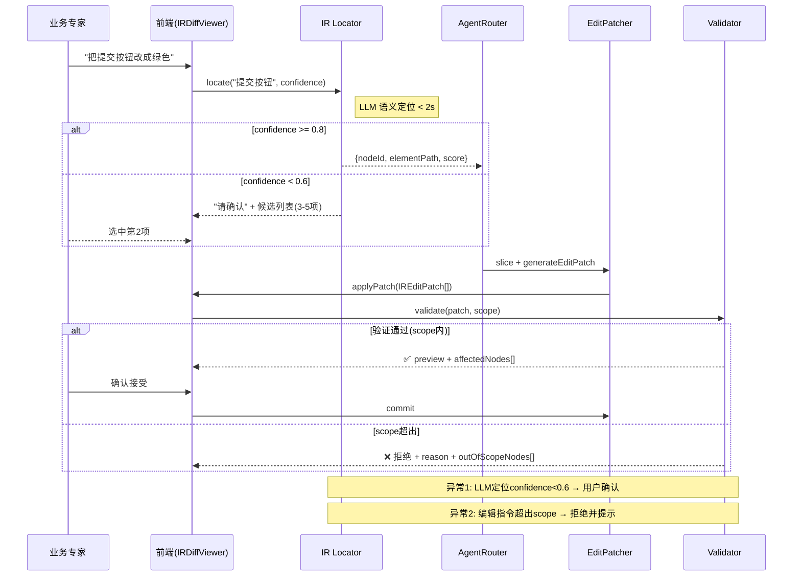
```mermaid
sequenceDiagram
    participant U as 业务专家
    participant FE as 前端(IRDiffViewer)
    participant IR as IR Locator
    participant AG as AgentRouter
    participant EP as EditPatcher
    participant VL as Validator

    U->>FE: "把提交按钮改成绿色"
    FE->>IR: locate("提交按钮", confidence)
    Note right of IR: LLM 语义定位 < 2s
    alt confidence >= 0.8
      IR-->>AG: {nodeId, elementPath, score}
    else confidence < 0.6
      IR-->>FE: "请确认" + 候选列表(3-5项)
      U-->>FE: 选中第2项
    end
    AG->>EP: slice + generateEditPatch
    EP->>FE: applyPatch(IREditPatch[])
    FE->>VL: validate(patch, scope)
    alt 验证通过(scope内)
      VL-->>FE: ✅ preview + affectedNodes[]
      U->>FE: 确认接受
      FE->>EP: commit
    else scope超出
      VL-->>FE: ❌ 拒绝 + reason + outOfScopeNodes[]
    end

    Note over IR,VL: 异常1: LLM定位confidence<0.6 → 用户确认
    Note over IR,VL: 异常2: 编辑指令超出scope → 拒绝并提示
```

## 7.8 沙箱生命周期全时序（SEQ-8）

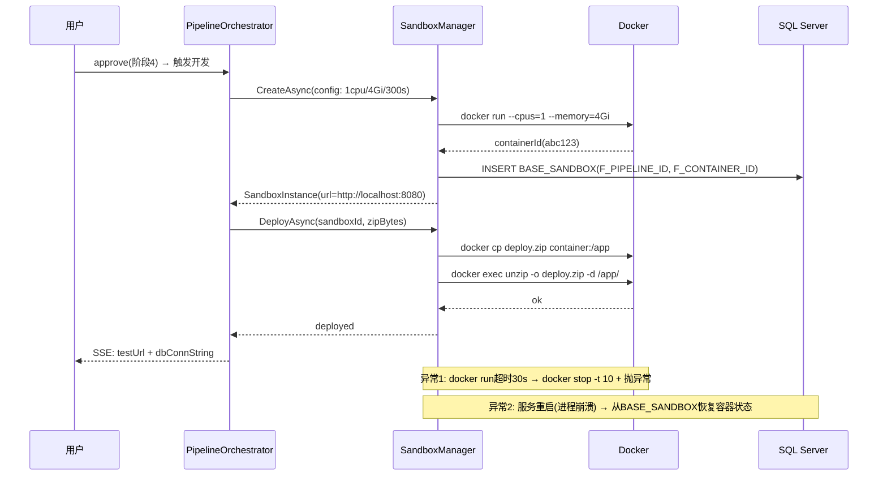
```mermaid
sequenceDiagram
    participant U as 用户
    participant OR as PipelineOrchestrator
    participant SM as SandboxManager
    participant DK as Docker
    participant DB as SQL Server

    U->>OR: approve(阶段4) → 触发开发
    OR->>SM: CreateAsync(config: 1cpu/4Gi/300s)
    SM->>DK: docker run --cpus=1 --memory=4Gi
    DK-->>SM: containerId(abc123)
    SM->>DB: INSERT BASE_SANDBOX(F_PIPELINE_ID, F_CONTAINER_ID)
    SM-->>OR: SandboxInstance(url=http://localhost:8080)
    OR->>SM: DeployAsync(sandboxId, zipBytes)
    SM->>DK: docker cp deploy.zip container:/app
    SM->>DK: docker exec unzip -o deploy.zip -d /app/
    DK-->>SM: ok
    SM-->>OR: deployed
    OR-->>U: SSE: testUrl + dbConnString

    Note over SM,DK: 异常1: docker run超时30s → docker stop -t 10 + 抛异常
    Note over SM,DB: 异常2: 服务重启(进程崩溃) → 从BASE_SANDBOX恢复容器状态
```

## 7.9 校验链异步全时序（SEQ-9）

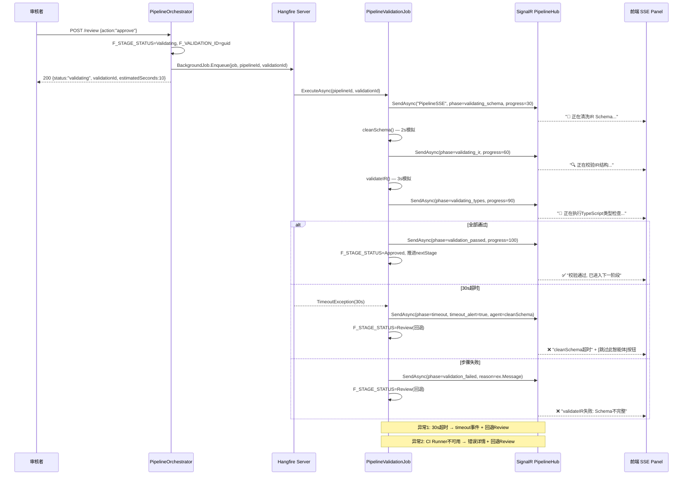
```mermaid
sequenceDiagram
    participant U as 审核者
    participant OR as PipelineOrchestrator
    participant HJ as Hangfire Server
    participant VJ as PipelineValidationJob
    participant SSE as SignalR PipelineHub
    participant FE as 前端 SSE Panel

    U->>OR: POST /review {action:"approve"}
    OR->>OR: F_STAGE_STATUS=Validating, F_VALIDATION_ID=guid
    OR->>HJ: BackgroundJob.Enqueue(job, pipelineId, validationId)
    OR-->>U: 200 {status:"validating", validationId, estimatedSeconds:10}

    HJ->>VJ: ExecuteAsync(pipelineId, validationId)
    VJ->>SSE: SendAsync("PipelineSSE", phase=validating_schema, progress=30)
    SSE-->>FE: "🧹 正在清洗IR Schema..."
    VJ->>VJ: cleanSchema() — 2s模拟
    VJ->>SSE: SendAsync(phase=validating_ir, progress=60)
    SSE-->>FE: "🔍 正在校验IR结构..."
    VJ->>VJ: validateIR() — 3s模拟
    VJ->>SSE: SendAsync(phase=validating_types, progress=90)
    SSE-->>FE: "📝 正在执行TypeScript类型检查..."

    alt 全部通过
      VJ->>SSE: SendAsync(phase=validation_passed, progress=100)
      VJ->>VJ: F_STAGE_STATUS=Approved, 推进nextStage
      SSE-->>FE: ✅ "校验通过, 已进入下一阶段"
    else 30s超时
      HJ-->>VJ: TimeoutException(30s)
      VJ->>SSE: SendAsync(phase=timeout, timeout_alert=true, agent=cleanSchema)
      VJ->>VJ: F_STAGE_STATUS=Review(回退)
      SSE-->>FE: ❌ "cleanSchema超时" + [跳过此智能体]按钮
    else 步骤失败
      VJ->>SSE: SendAsync(phase=validation_failed, reason=ex.Message)
      VJ->>VJ: F_STAGE_STATUS=Review(回退)
      SSE-->>FE: ❌ "validateIR失败: Schema不完整"
    end

    Note over VJ,SSE: 异常1: 30s超时 → timeout事件 + 回退Review
    Note over VJ,SSE: 异常2: CI Runner不可用 → 错误详情 + 回退Review
```

## 7.10 StaleMonitor定时扫描时序（SEQ-10）

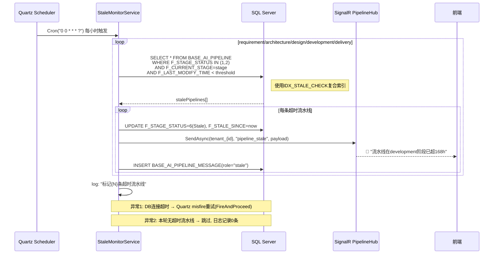
```mermaid
sequenceDiagram
    participant QZ as Quartz Scheduler
    participant SM as StaleMonitorService
    participant DB as SQL Server
    participant SSE as SignalR PipelineHub
    participant FE as 前端

    QZ->>SM: Cron("0 0 * * * ?") 每小时触发
    loop requirement/architecture/design/development/delivery
      SM->>DB: SELECT * FROM BASE_AI_PIPELINE<br/>WHERE F_STAGE_STATUS IN (1,2)<br/>AND F_CURRENT_STAGE=stage<br/>AND F_LAST_MODIFY_TIME < threshold
      Note right of DB: 使用IDX_STALE_CHECK复合索引
      DB-->>SM: stalePipelines[]

      loop 每条超时流水线
        SM->>DB: UPDATE F_STAGE_STATUS=6(Stale), F_STALE_SINCE=now
        SM->>SSE: SendAsync(tenant_{id}, "pipeline_stale", payload)
        SSE-->>FE: 🔔 "流水线在development阶段已超168h"
        SM->>DB: INSERT BASE_AI_PIPELINE_MESSAGE(role="stale")
      end
    end
    SM->>SM: log: "标记{N}条超时流水线"

    Note over SM,DB: 异常1: DB连接超时 → Quartz misfire重试(FireAndProceed)
    Note over SM,DB: 异常2: 本轮无超时流水线 → 跳过, 日志记录0条
```

## 7.11 阶段1-5+编辑+补丁+沙箱+校验+监控完整时序对照表

| SEQ编号 | 场景 | 正常路径关键步骤 | 异常路径1(含超时值) | 异常路径2(降级路径) | 关联裁决书接口 |
|---------|------|-----------------|-------------------|-------------------|--------------|
| SEQ-1 | 阶段1需求分析 | 输入→AnalystAgent追问→confidence≥0.8→生成文档→status=Review | LLM超时60s→降级链(mimo→deepseek→openai)→重试3次 | 用户7天未回答→StaleMonitor标记stale | `POST /api/pipeline/{id}/stage/requirement/review` |
| SEQ-2 | 阶段2架构设计 | 需求+EAB知识→ArchitectAgent→架构文档→人工审核 | 开发者否决(reject)→F_REJECT_COUNT++→回退stage1 | 3轮否决→F_REJECT_COUNT≥3→SignalR升级管理员 | `POST /api/pipeline/{id}/stage/architecture/review` |
| SEQ-3 | 阶段3总体设计 | Orchestrator→6SubAgent并行(UI/DB/WF/DS/App/API)→merge IR | 某SubAgent失败→重试3次→仍失败→partial(部分成功) | IR校验失败→自修复→仍失败→blocked熔断 | `POST /api/pipeline/{id}/detailed-design` |
| SEQ-4 | 阶段4自动开发 | IR→CompileGateway编译→Sandbox创建→部署→测试URL→审核 | 编译失败(exit≠0)→SSE错误→回退stage3 | Docker创建超时30s→OOM检测→等待资源释放 | `POST /api/pipeline/{id}/stage/development/review` |
| SEQ-5 | 阶段5交付 | 沙箱验收通过→管理员审批→生产部署→status=Completed | 管理员否决→reject→回退stage4 | 生产部署失败→自动回滚(rollback preview) | `POST /api/pipeline/{id}/stage/delivery/review` |
| SEQ-6 | 分治编辑 | locate(语义定位)→AgentRouter路由→slice切片→applyPatch→validate验证 | LLM定位confidence<0.6→展示候选列表→用户确认 | 编辑指令scope超出→Validator拒绝+reason | `POST /api/pipeline/{id}/preview-rollback` |
| SEQ-7 | 知识补丁注入 | 熔炉导出zip→创始人上传→SHA256签名校验→影子测试→合并 | 签名校验失败→拒绝+审计日志 | 影子测试失败→转创始人人工审核 | `POST /api/founder/knowledge/import` |
| SEQ-8 | 沙箱生命周期 | CreateAsync(docker run)→DeployAsync(docker cp/unzip)→验收→DestroyAsync(stop) | Docker超时30s→docker stop -t 10→抛异常+status=error | 进程崩溃重启→SandboxManager从BASE_SANDBOX恢复容器 | `POST /api/pipeline/{id}/abandon` |
| SEQ-9 | 校验链异步 | approve→Validating过渡态→Hangfire.Enqueue→SSE推送进度→通过推进 | 30s超时→PipelineSSE timeout_alert→回退Review | CI Runner不可用→SSE推送错误详情→回退Review | `POST /api/pipeline/{id}/stage/{stage}/review` |
| SEQ-10 | StaleMonitor扫描 | Quartz每小时Cron→扫描5阶段超时→标记Stale→SignalR推送 | DB连接失败→Quartz misfire FireAndProceed→下次重试 | 本轮无超时→跳过+日志 | `GET /api/pipeline/stale` |

---

# 第八章 · UI 界面设计

## 8.1 角色-入口-执行方矩阵（D-04 设计约束）

> **D-04 确认**：前端 Agent（对话工作台交互模式）与后端 StageService（流水线自动模式）的 UI 入口差异必须明确。下表定义每个用户操作的入口、执行方、校验链。

| 用户操作 | 角色 | 入口菜单 | 前端组件 | 执行方 | 校验链 |
|----------|------|----------|----------|--------|--------|
| 输入自然语言需求→AI 自动生成系统 | 业务专家 | 应用快速生成 | PipelineManager.vue | 后端 PipelineEngine→StageService | cleanSchema→validateIR→vue-tsc |
| 与 AI 对话→手动修正需求/IR | 开发者 | AI 顾问 | AiChatPanel.vue | 前端 Agent (requirement-analyst/architect) | cleanSchema→validateIR→vue-tsc |
| 提交 IR→AI 评估架构合理性 | 开发者 | AI 架构评审 | ArchitectReview.vue | 前端 Agent (architect) | 同上 |
| 手工拖拽组件设计 IR | 开发者 | IR 手工设计器 | IRDesigner.vue | 前端 VisualDev（无 AI） | — |
| 查看沙箱运行状态 | 开发者 | 沙箱监控 | SandboxMonitor.vue | 后端 SandboxService | — |
| 浏览/搜索知识图谱 | 开发者 | 知识图谱浏览器 | GraphExplorer.vue | 后端 KnowledgeGraphStore | — |
| 查看 AI 调用审计 | 管理员 | AI 调用审计 | AiAuditLog.vue | 后端 AiCallLogService | — |
| 切换 LLM 供应商 | 管理员 | 模型降智与切换 | ProviderManager.vue | 后端 LlmGatewayService | — |
| TOTP 二次认证 | 创始人 | 创始人登录 | FounderLogin.vue | 后端 FounderAuthService | — |
| 查看/审核知识图谱 | 创始人 | 知识图谱审核 | GraphExplorer.vue (审核模式) | 后端 KnowledgeGraphStore | — |
| 签发知识补丁 | 创始人 | 知识补丁签发 | PatchSigner.vue | 后端 KnowledgePatchService | — |
| 配置模型与 Prompt | 创始人 | 模型与 Prompt 配置 | Console.vue | 后端 FounderService | — |

**失败后行为（§8.1 补充列，详细时序见 §7）**：

| 用户操作 | 失败后行为 |
|----------|-----------|
| 业务专家输入需求→AI 自动生成 | 流水线进入 `blocked` 状态 → 通知业务专家 → 人工决定重试/放弃（遵循 §4 全局熔断规则：连续失败 3 次自动 blocked） |
| 与 AI 对话→手动修正 IR | 降级到专家模式（IR 转 Schema 逃生舱），用户可继续手工编辑 |
| 提交 IR→AI 架构评审 | 返回评审失败报告 + 原 IR 不变（不修改用户数据） |
| 切换 LLM 供应商 | 保留当前供应商不变 + 提示切换失败原因和重试建议 |
| TOTP 二次认证 | 3 次失败锁定 5 分钟 + 写入 BASE_FOUNDER_AUTH_LOG |
| 签发知识补丁 | 拒绝签名 + 写入 BASE_FOUNDER_AUTH_LOG + 熔炉侧告警 |
| 其他操作 | 返回空状态/原有数据，不产生副作用 |

### 8.1.1 路由结构

> **v2.1 修订（2026-06-20）**：QuickAppEntry.vue + ProjectDashboard.vue 拆分（创建态/管理态分离）；ModelPlayground.vue + ArchitectReview.vue + TOTP 验证页新增路由；IRDesigner 降级为 P1。

```
/studio/
├── expert/                        ← 业务专家
│   ├── quick-app-entry            ← 应用快速生成入口（QuickAppEntry.vue，P0）
│   ├── project/:id/dashboard      ← 项目仪表盘（ProjectDashboard.vue，P0）
│   ├── rule-advisor               ← 业务规则顾问（P2）
│   └── my-projects                ← 我的项目（PipelineManager.vue，P0）
├── dev/                           ← 开发者
│   ├── ai-advisor                 ← AI 顾问（AiChatPanel.vue，P0）
│   ├── ai-review                  ← AI 架构评审（ArchitectReview.vue，P1）
│   ├── model-playground           ← 模型测试场（ModelPlayground.vue，P1）
│   ├── ir-designer                ← IR 手工设计器（IRDesigner.vue，P1 ⬇ 降级）
│   ├── sandbox-monitor            ← 沙箱监控（SandboxMonitor.vue，P1）
│   └── graph-explorer             ← 知识图谱浏览器（GraphExplorer.vue，已实现）
├── admin/                         ← 管理员
│   ├── users                      ← 用户管理
│   ├── ai-audit                   ← AI 调用审计（AiAuditLog.vue，P1）
│   ├── provider-manager           ← 模型降智切换（ProviderManager.vue，P1）
│   └── system-config              ← 系统配置
└── founder/                       ← 创始人（二次认证后）
    ├── totp-verify                ← TOTP 验证页（FounderLogin.vue，二次认证入口）
    ├── console                    ← 控制台（Console.vue，已实现）
    ├── patch-signer               ← 知识补丁签发（PatchSigner.vue）
    ├── graph-audit                ← 知识图谱审核（GraphExplorer.vue 审核模式，已实现）
    └── audit-log                  ← 系统级审计（AuditLog.vue，已实现）
```

**路由拆分说明（QuickAppEntry ↔ ProjectDashboard）**：
- `QuickAppEntry.vue`：创建态入口，用户输入需求描述 → 创建流水线 → **302 重定向**到 `ProjectDashboard.vue`
- `ProjectDashboard.vue`：管理态，流水线详情 + 阶段进度 + AI 对话 + 实时预览
- 设计意图：创建态和管理态物理分离，避免单页状态过载；302 重定向衔接无感过渡

### 8.1.2 前端页面实现状态

| 页面 | 文件 | 状态 |
|------|------|------|
| Console.vue | `views/founder/Console.vue` | ✅ COMPLETED（Phase 6） |
| GraphExplorer.vue | `views/founder/GraphExplorer.vue` | ✅ COMPLETED（Phase 6） |
| SandboxManager.vue | `views/founder/SandboxManager.vue` | ✅ COMPLETED（Phase 6） |
| AuditLog.vue | `views/founder/AuditLog.vue` | ✅ COMPLETED（Phase 6） |
| studio/index.vue | `views/studio/index.vue` | ⚠️ 占位页（"Phase 2 激活"） |
| PipelineManager.vue | 待建 | ❌ NOT_STARTED（B-07） |
| AiChatPanel.vue | 待建 | ❌ NOT_STARTED |
| ProviderManager.vue | 待建 | ❌ NOT_STARTED（B-09） |
| ModelPlayground.vue | 待建 | ❌ NOT_STARTED（B-08） |

**待建页面开发总览**：

| 页面 | 路由 | 优先级 | 核心组件 | 后端 API 依赖 |
|------|------|--------|----------|--------------|
| 我的项目（PipelineManager.vue） | `/expert/my-projects` | P0 | 左侧 AI 对话 + 右侧实时预览 + 底部上下文 | `/api/founder/ai/pipeline/*` |
| AiChatPanel.vue | `/dev/ai-advisor` | P0 | 自定义聊天面板 + a-upload | 前端 Agent → LLMGateway |
| IRDesigner.vue | `/dev/ir-designer` | P0 | 自定义拖拽画布 | `/api/form/generate` |
| SandboxMonitor.vue | `/dev/sandbox-monitor` | P1 | BasicTable + a-statistic | `/api/Sandbox/*` |
| AiAuditLog.vue | `/admin/ai-audit` | P1 | BasicTable + a-range-picker | `/api/InteAssistant/AiCallLog` |
| ProviderManager.vue | `/admin/provider-manager` | P1 | BasicTable + a-modal | `/api/founder/ai/health` + `test` |
| RuleAdvisor.vue | `/expert/rule-advisor` | P2 | 自定义面板 | 前端本地存储 |

### 8.1.3 用户术语映射表（D-4 清言建议 · v2.1 完整版）

> **架构约束**：后端术语不变。前端根据角色动态映射。业务专家看到业务语言，开发者看到技术语言。创始人看到管控术语。

#### 9 术语 × 3 角色映射

| # | 系统内部术语 | 业务专家看到 | 开发者看到 | 创始人看到 |
|---|-------------|-------------|-----------|-----------|
| 1 | IR | 应用蓝图 | 应用元数据（IR） | IR 契约 |
| 2 | IR 手工设计器 | —（不暴露） | 模型工坊 | IR 编辑器 |
| 3 | 沙箱 | 应用预览环境 | 调试/测试沙箱 | 沙箱实例 |
| 4 | 知识图谱 | 行业经验库 | 领域模型参考 | 知识图谱（审核态） |
| 5 | 流水线阶段 | 项目进度 | 开发阶段 | 流水线状态 |
| 6 | KnowledgePatch | — | — | 知识补丁 |
| 7 | 五阶段流水线 | 项目生成流程 | 开发流水线 | AI 流水线 |
| 8 | IR Diff | — | 方案对比视图 | IR 变更审查 |
| 9 | 双视图（业务/技术） | 我想要的（业务描述） | 系统怎么做（技术方案） | 两视图对齐审计 |

#### 错误状态术语映射（5 状态 × 3 角色 + 图标颜色）

| 状态 | 图标 | 颜色 | 业务专家看到 | 开发者看到 | 创始人看到 |
|------|------|------|-------------|-----------|-----------|
| 思考中（thinking） | LoadingOutlined | 灰色 #8c8c8c | AI 正在理解您的需求… | Agent 推理中 | Agent 运行中 |
| 长时任务（long_running） | ClockCircleOutlined | 黄色 #faad14 | 复杂任务处理中，请耐心等待… | LLM 长推理中（已耗时 Xs） | 耗时告警 |
| 预警（timeout_warning） | ExclamationCircleOutlined | 橙色 #fa8c16 | 处理时间较长，是否继续等待？ | 超时预警（已超预期 1.5×） | 预警 |
| 硬超时（timeout_hard） | CloseCircleOutlined | 红色 #ff4d4f | 处理超时，建议重新发起 | 硬超时（>max_ms）→ [跳过]/[重试] | 超时 |
| 错误（error） | BugOutlined | 红色 #ff4d4f | 处理出错，请稍后重试 | 错误详情 + [重试]/[跳过] | 异常 |

### 8.1.4 待建页面开发总览

| 页面 | 路由 | 优先级 | 核心组件 | 后端 API 依赖 |
|------|------|--------|----------|--------------|
| 我的项目（PipelineManager.vue） | `/expert/my-projects` | P0 | 左侧AI对话+右侧实时预览+底部上下文面板 | `/api/founder/ai/pipeline/*` |
| AiChatPanel.vue | `/dev/ai-advisor` | P0 | 聊天面板+AI主动建议卡片+a-upload | 前端Agent→LLMGateway |
| 模型工坊（IRDesigner.vue） | `/dev/model-workshop` | P0 | 可视化拖拽+代码模式双切换 | `/api/form/generate` |
| SandboxMonitor.vue | `/dev/sandbox-monitor` | P1 | BasicTable+a-statistic | `/api/Sandbox/*` |
| AiAuditLog.vue | `/admin/ai-audit` | P1 | BasicTable+a-range-picker | `/api/InteAssistant/AiCallLog` |
| ProviderManager.vue | `/admin/provider-manager` | P1 | BasicTable+a-modal+自动降级策略配置 | `/api/founder/ai/health`+`test` |
| RuleAdvisor.vue | `/expert/rule-advisor` | P2 | 自定义面板 | 前端本地存储 |

## 8.2 全局 UI 骨架规范

### 8.2.1 Topbar 顶栏设计

| 元素 | 位置 | 规范 |
|------|------|------|
| Logo + 平台名"JNPF Studio" | 左侧固定 | 高48px，白底，底部分割线1px #e8e8e8 |
| 角色切换下拉 | Logo右侧 | a-select: 业务专家/开发者/管理员/创始人 |
| 通知铃铛 | 右侧第1 | Badge未读数，点击a-popover通知列表 |
| 用户头像+名 | 右侧第2 | a-dropdown: 个人设置/修改密码/退出 |
| Breadcrumb面包屑 | Topbar下方 | 自动从路由生成，支持点击回退 |

### 8.2.2 四角色侧栏导航

| 角色 | 菜单项 | 图标 | 高亮色 |
|------|--------|------|--------|
| 业务专家 | 应用快速生成、业务规则顾问、我的项目 | ThunderboltOutlined/BulbOutlined/ProjectOutlined | #1890ff |
| 开发者 | AI顾问、架构评审、模型工坊、沙箱监控、知识图谱 | RobotOutlined/AuditOutlined/ToolOutlined/CloudOutlined/ApartmentOutlined | #722ed1 |
| 管理员 | 用户管理、AI调用审计、模型降智切换、系统配置 | TeamOutlined/SafetyOutlined/SwapOutlined/SettingOutlined | #fa8c16 |
| 创始人 | 控制台、知识补丁签发、图谱审核、系统审计 | DashboardOutlined/SafetyCertificateOutlined/EyeOutlined/FileProtectOutlined | #cf1322 |

侧栏折叠宽64px(仅图标)，展开宽220px(图标+文字)。当前项高亮+左侧3px色条。底部显示角色标签。

### 8.2.3 双模式切换

AI模式: 左侧聊天面板400px + 右侧实时预览flex:1。手工模式: 全宽拖拽画布 + 组件面板右侧260px抽屉。切换保留状态不丢失数据，localStorage记忆偏好。

### 8.2.4 四角色首页布局

| 角色 | 首页组件 | 布局 |
|------|---------|------|
| 业务专家 | PipelineManager.vue | KPI卡片行(4列) → 左侧对话(40%)+右侧项目列表(60%) |
| 开发者 | AiChatPanel.vue | 全宽聊天(80%) + 快速操作卡片行(20%) |
| 管理员 | Dashboard.vue | 2行统计卡片(各4列) + 底部审计日志表格 |
| 创始人 | Console.vue | 已实现: 3列卡片 + 底部操作区 |

## 8.3 核心页面布局规格

### 8.3.1 PipelineManager.vue 我的项目页

#### 布局规格

**三栏布局（xl≥1280px，设计基准）**：
| 区域 | 宽度 | 组件 | 说明 |
|------|------|------|------|
| 左侧：项目列表 | 280px | a-card + a-input-search + 卡片网格 2 列 | 流水线卡片（名称/阶段/更新时间）+ 新建按钮 |
| 中间：AI 对话 | flex:1 | AiChatPanel（SSE 流式） | 输入框 + 发送（Enter）/换行（Shift+Enter） |
| 右侧：实时预览 | 360px | PipelineSSEPanel + IRDiffViewer | 阶段进度条 + Agent 思考流 + 操作按钮 |
| 底部：上下文面板 | 固定 72px | 胶囊标签 | 当前阶段 / Token 数 / 耗时 / 失败计数 |

#### 响应式三档折叠（xl/md/sm）

| 断点 | 宽度 | 布局变化 |
|------|------|----------|
| **xl** | ≥1280px | 完整三栏：项目列表(280px) + AI 对话(flex:1) + 实时预览(360px) + 底部面板(72px) |
| **md** | 768~1279px | 双栏：项目列表折叠为顶部标签栏(48px) → AI 对话(flex:1) + 实时预览(320px)。底层面板保留 |
| **sm** | <768px | 单栏：项目列表→a-drawer 抽屉滑出 → AI 对话全宽。预览区折叠为底部可拖拽面板(h=200px min, 50vh max)。底层面板内嵌到对话区顶部 |

**折叠状态保持**：localStorage 记忆断点偏好，窗口 resize 时 debounce 300ms 切换。

#### 双视图切换控件

预览区顶部 a-radio-group（`业务视图` | `技术视图`）：
- **业务视图**：叙事式说明书 + 无头渲染页面截图预览（iframe src=沙箱 URL）
- **技术视图**：JSON IR 树 + IR Diff 面板（Split Panes 上下分屏，上=当前 IR，下=历史版本 Diff）
- 切换不丢失 SSE 流，仅改变预览区渲染内容
- 默认视图：业务专家→业务视图，开发者→技术视图，管理员/创始人→技术视图

#### IRDiffViewer Split Panes

- 上屏：当前阶段产出 IR（只读 JSON 树，语法高亮）
- 下屏：选中对比版本的 IR Diff（新增=绿色、删除=红色、修改=黄色背景）
- 分隔线可拖拽调整上下比例（默认 50:50，范围 30:70 ~ 70:30）
- 对比版本来源：a-select 下拉选择历史 IR 版本（BASE_IR_VERSION），默认对比上一阶段产出

#### 3 轮否决升级提示

| 否决轮次 | 提示级别 | UI 表现 | 升级动作 |
|----------|----------|---------|----------|
| 第 1 轮 | 普通 Info | 蓝色 Alert "评审意见已返回，请修改后重新提交" | 显示具体评审意见列表 |
| 第 2 轮 | 警告 Warning | 黄色 Alert + a-badge(2) "第 2 次否决，请关注评审意见" | 评审意见 + 架构师介入提示 |
| 第 3 轮 | 阻断 Blocked | 红色 Alert + a-modal 确认 "已连续 3 次被否决，流水线进入 blocked 状态" | 强制要求创始人/管理员审批后才能 resume |

**升级路径**：N≥3 → 自动 blocked → 通知管理员（SignalR `/messageHub` + BASE_AI_PIPELINE_MESSAGE） → 管理员/创始人决定：重开 / 废弃 / 人工介入

#### 双步确认界面（业务视图 → 技术视图）

每个阶段的确认对话框拆为两步：
1. **第一步（业务视图）**：自然语言摘要 + 关键决策列表（纯中文，无技术术语）→ [认可，下一步] / [有问题，返回修改]
2. **第二步（技术视图）**：IR JSON 核心字段展示 + 校验链结果（绿色勾/红色叉）→ [确认提交] / [返回修改]

两步之间可自由切换（tab 切换，非模态锁死），但最终提交必须两步都完成确认。

### 8.3.2 Agent 思考面板 SSE 推送模式

#### SSE 事件类型与字段

| 事件类型 | SSE event | 颜色 | 前端行为 | 携带字段 |
|----------|-----------|------|----------|----------|
| 阶段开始 | stage_start | 蓝色边框 | 显示阶段名+Agent名，重置进度 | `{stage, agent, total_stages}` |
| 思考中 | thinking | 灰色文字 | 逐字追加到 thought 区域 | `{agent, delta, elapsed_ms}` |
| 追问 | question | 黄色背景 | 渲染 a-radio-group 选项 | `{agent, question, options[], estimated_remaining_ms}` |
| 进度 | progress | 蓝色进度条 | 更新阶段进度条百分比 | `{stage, progress_pct, elapsed_ms, estimated_remaining_ms}` |
| 长时任务 | long_running | 黄色脉冲 | 显示"处理中…已耗时Xs" | `{agent, elapsed_ms, estimated_remaining_ms}` |
| 预警 | timeout_warning | 橙色左边框 | thought 区域橙色高亮 + "预计还需Xs" | `{agent, elapsed_ms, estimated_remaining_ms, threshold_ms}` |
| 硬超时 | timeout_hard | 红色左边框 | [跳过此智能体]按钮 + 原因说明 | `{agent, elapsed_ms, max_ms}` |
| 阶段完成 | stage_complete | 绿色边框 | 产出摘要 + [下一阶段]按钮 | `{stage, summary, artifacts[]}` |
| 错误 | error | 红色文字 | 错误详情 + [重试]/[跳过]按钮 | `{error_code, message, retryable}` |
| 否决 | review_rejected | 红色卡片 | 显示否决原因 + 轮次 + 升级提示 | `{stage, round, reason, escalated}` |
| 流水线完成 | pipeline_complete | 金色边框 | 全阶段摘要 + [查看系统]/[下载] | `{pipeline_id, summary, sandbox_url}` |

#### SSE 连接状态灯（3 色）

| 状态 | 颜色 | 指示灯 | 触发条件 |
|------|------|--------|----------|
| 已连接 | 绿色 #52c41a | 常亮圆点 (8px) + "实时" | EventSource 正常接收 |
| 重连中 | 黄色 #faad14 | 脉冲圆点 + "重连中({n}/5)" | EventSource error 事件触发，指数退避重连 |
| 已断开 | 红色 #ff4d4f | 常亮圆点 + "已断开" + 手动重连按钮 | 重试 5 次失败或服务端返回 502/503 |

**重连策略**：首次延迟 1s → 2s → 4s → 8s → 16s（指数退避，最多 5 次）。5 次失败后停止自动重连，显示手动重连按钮。重连成功后从 `Last-Event-ID` header 续接。

#### 超时分级提示（4 级，与 AgentTimeoutMonitor 对齐）

| 级别 | 名称 | 触发条件 | UI 表现 | 用户操作 |
|------|------|----------|---------|----------|
| L1 | 思考中 | `elapsed < expected_ms` | 灰色打字机效果，正常 | 等待 |
| L2 | 长时任务 | `elapsed ≥ expected_ms` | 黄色脉冲 "处理中…已耗时 Xs" | 可继续等待 |
| L3 | 超时预警 | `elapsed ≥ expected_ms × 1.5` | 橙色边框 "预计还需 Xs，是否继续？" | [继续等待] / [跳过此步骤] |
| L4 | 硬超时 | `elapsed ≥ max_ms` | 红色边框 + "已超时" + 原因 | [跳过此智能体] / [降级到手工模式] |

**配置来源**：`expected_ms` 和 `max_ms` 从 AgentTimeoutMonitor 的 prompt template 配置中读取，每 Agent 独立配置。

### 8.3.3 IR 设计器布局

三栏: 组件面板(200px,12分类组件支持搜索过滤) | 画布(flex:1,vuedraggable拖拽,8px网格对齐+吸附线) | 属性面板(280px,选中组件属性编辑实时预览)。

### 8.3.4 SandboxMonitor.vue 布局

顶部统计a-row+a-statistic(4列:活跃数/CPU/内存/运行时间) | 过滤器a-range-picker+a-select(状态) | 沙箱列表BasicTable(列:ID/状态/CPU/内存/端口/创建时间/操作) | 操作列TableAction(销毁/查看日志/SSH)。

### 8.3.5 GraphExplorer.vue 布局

三栏: 左侧搜索(280px) + 中间力导向图(flex:1,d3-force渲染,节点按类型着色,边按关系类型着色) + 右侧详情(320px)。双击→展开邻居，右键→标记/备注。

### 8.3.6 其余页面布局速查

| 页面 | 核心组件 | 布局要点 |
|------|---------|----------|
| AiAuditLog.vue | BasicTable+a-range-picker+a-statistic | 顶部统计卡+日志表格分页 |
| ProviderManager.vue | BasicTable+a-modal | 供应商列表+编辑弹窗+健康检查按钮 |
| RuleAdvisor.vue | 自定义面板 | 自然语言输入+规则预览+应用按钮 |
| FounderLogin.vue | a-form+a-input+TOTP | 居中卡片,二次认证输入框 |
| PatchSigner.vue | a-upload+a-card | 上传zip+签名验证状态+签发按钮 |

## 8.4 设计规范

### 8.4.1 响应式断点

| 断点 | 宽度 | 布局变化 |
|------|------|----------|
| xs | <576px | 单列,侧栏折叠,表格横向滚动 |
| sm | ≥576px | 双列卡片,侧栏可展开 |
| md | ≥768px | 三列卡片,全功能侧栏 |
| lg | ≥992px | 四列卡片,多面板并排 |
| xl | ≥1200px | 标准PC布局(设计基准) |
| xxl | ≥1600px | 宽屏优化,内容区最大1400px居中 |

### 8.4.2 主题 Token (CSS变量)

```css
:root {
  --jnpf-primary: #1890ff;  --jnpf-success: #52c41a;
  --jnpf-warning: #faad14;  --jnpf-error: #ff4d4f;
  --jnpf-bg-base: #f5f5f5;  --jnpf-bg-card: #ffffff;
  --jnpf-border: #e8e8e8;
  --jnpf-text-primary: #262626;  --jnpf-text-secondary: #595959;
  --jnpf-radius: 4px;
  --jnpf-shadow: 0 1px 3px rgba(0,0,0,0.06);
  --jnpf-shadow-hover: 0 4px 12px rgba(0,0,0,0.1);
  --jnpf-font-size-sm: 12px; --jnpf-font-size: 14px; --jnpf-font-size-lg: 16px;
  --jnpf-topbar-height: 48px;
  --jnpf-sidebar-collapsed: 64px; --jnpf-sidebar-expanded: 220px;
}
```

### 8.4.3 状态设计规范

| 状态 | 组件 | 规范 |
|------|------|------|
| 空列表 | a-empty | description="暂无数据",带操作建议按钮 |
| 空搜索结果 | a-empty | description="未找到匹配结果",带"清除筛选"链接 |
| 加载中 | a-spin | 包裹内容区,tip="加载中..." |
| 骨架屏 | a-skeleton | 列表/表格首次加载时使用 |
| 网络错误 | a-result | status="error",带"重试"按钮 |
| 404 | a-result | status="404",带"返回首页"按钮 |
| 403 | a-result | status="403",subTitle="无权限" |

### 8.4.4 Toast 通知规范

| 类型 | 方法 | 时长 | 场景 |
|------|------|------|------|
| 成功 | message.success() | 3s | 保存/提交/删除成功 |
| 错误 | message.error() | 5s | 接口报错/校验失败 |
| 警告 | message.warning() | 4s | 部分成功/降级 |
| 信息 | message.info() | 3s | 操作提示/状态变更 |

### 8.4.5 键盘快捷键

| 快捷键 | 作用域 | 行为 |
|--------|--------|------|
| Ctrl+S | 全平台 | 保存当前编辑 |
| Ctrl+Enter | AI对话 | 发送消息 |
| Shift+Enter | AI对话 | 换行 |
| Ctrl+K | 全局 | 命令面板 |
| Esc | 弹窗 | 关闭弹窗 |
| Ctrl+Z | IR设计器 | 撤销 |
| Ctrl+Shift+Z | IR设计器 | 重做 |

### 8.4.6 前端文件约定

| 约定 | 规范 |
|------|------|
| 页面组件 | views/{module}/{PageName}.vue (PascalCase) |
| 通用组件 | components/{ComponentName}.vue (PascalCase) |
| 路由命名 | kebab-case, 与文件夹一致 |
| API函数 | api/{module}/{entity}.ts (camelCase导出) |
| Pinia Store | store/modules/{name}.ts, use{Name}Store |
| 类型定义 | types/{domain}.ts, I{Name}或{Name}IR |
| 通用方法 | utils/{category}.ts (camelCase导出) |
| 常量 | const/{domain}.ts (UPPER_SNAKE) |
| CSS类名 | BEM: .block__element--modifier |
| 图标 | @ant-design/icons-vue, 按需导入 |
| Git提交 | feat(module): 描述 (Conventional Commits) |

### 8.4.7 性能预算

| 指标 | 目标 |
|------|------|
| 首屏FCP | <2s |
| 最大内容LCP | <2.5s |
| 首次输入FID | <100ms |
| 累积偏移CLS | <0.1 |
| JS体积gzip | <500KB |
| 路由懒加载 | 100% |
| 图片懒加载 | 全非首屏 |

### 8.4.8 浏览器兼容

Chrome 90+, Firefox 90+, Edge 90+, Safari 15+。不支持IE。

### 8.4.9 无障碍(a11y)

| 要求 | 实现 |
|------|------|
| 语义HTML | button/nav/main,非div堆砌 |
| 键盘导航 | 所有交互元素可Tab导航 |
| aria-label | 图标按钮必须 |
| 焦点管理 | 弹窗打开→焦点移入,关闭→焦点回原元素 |
| 色彩对比 | WCAG AA标准 (4.5:1) |

## 8.5 新手引导（Onboarding）

### 8.5.1 设计目标

低成本引导业务专家完成首次"输入需求→生成应用"全流程，降低首次使用门槛。

### 8.5.2 实现方式

使用 Ant Design Vue 的 `a-tour` 组件（非侵入式步骤引导），不引入额外依赖。

### 8.5.3 3 步引导流程

| 步骤 | 触发位置 | 文案 | 交互 |
|------|---------|------|------|
| **第 1 步** | QuickAppEntry.vue 输入框 | "从这里开始——用自然语言描述您想要的系统，比如「我需要一个客户管理系统，能记录客户信息、跟进状态」" | 点击→高亮输入框，引导输入示例 |
| **第 2 步** | PipelineManager.vue 阶段进度条 | "AI 将自动完成需求分析→架构设计→详细设计→代码生成→部署预览，您只需在关键节点确认即可" | 点击→展开阶段说明卡片 |
| **第 3 步** | 沙箱预览区 | "生成完成后可在此预览您的应用，也可下载代码部署到正式环境" | 点击→引导到预览区 |

### 8.5.4 行为规范

- **仅首次触发**：localStorage 存储 `studio-onboarding-completed=true`，已完成的用户不再弹出
- **允许跳过**：每步提供 [跳过引导] 按钮，关闭后不再显示
- **手动重新激活**：Help 菜单 → "重新开始引导"
- **角色过滤**：仅业务专家角色显示引导，开发者/管理员/创始人不显示
- **交付时间**：阶段五 W1

## 8.6 国际化（i18n）

### 8.6.1 框架选型

**vue-i18n v9**（与 Vue 3 + Composition API 原生兼容）。

### 8.6.2 MVP 策略

| 阶段 | 范围 | 语言 | 交付时间 |
|------|------|------|----------|
| **MVP（阶段五）** | 所有 UI 文案 | 仅中文（zh-CN） | 阶段五 W1 搭建框架，逐步填充 |
| **V2（阶段六+）** | 管理后台 + 客户界面 | 中文 + 英文（en-US） | 阶段六 |

### 8.6.3 代码约束

```typescript
// ✅ 强制使用：所有用户可见文案必须通过 $t() 调用
<span>{{ $t('pipeline.stage.requirement') }}</span>
message.success($t('common.saveSuccess'))

// ❌ 禁止硬编码中文
<span>需求分析</span>  // 不允许

// ✅ 允许硬编码的例外：console 调试日志、代码注释
console.log('[PipelineEngine] stage transition:', from, to);
```

### 8.6.4 文件结构

```
jnpf-web-vue3/src/
├── locales/
│   ├── index.ts              ← vue-i18n 实例 + 语言切换逻辑
│   ├── zh-CN/                ← 中文语言包（MVP 唯一）
│   │   ├── common.ts         ← 通用：保存/取消/确认/删除
│   │   ├── pipeline.ts       ← 流水线：阶段名/状态/操作
│   │   ├── agent.ts          ← AI Agent 对话面板
│   │   ├── sandbox.ts        ← 沙箱管理
│   │   └── founder.ts        ← 创始人控制台
│   └── en-US/                ← 英文语言包（阶段六新增）
│       └── ...
```

### 8.6.5 CI 门禁

- `vue-tsc --noEmit` 检查所有 `$t()` 调用 key 的有效性
- 禁止在 `.vue` template 中出现裸中文字符串（正则 `/[一-鿿]+/`）

## 8.7 AiChatPanel 快捷键

> 实现位置：`AiChatPanel.vue` 的 `onKeydown` 事件处理。

| 快捷键 | 作用域 | 行为 |
|--------|--------|------|
| **Ctrl+L** | AiChatPanel focus | 清空当前对话（保留系统 Prompt）——等同于 New Chat |
| **Ctrl+Shift+R** | AiChatPanel focus | 强制重新生成最后一条回复（等同于 Regenerate） |
| **Esc** | AiChatPanel focus | 停止当前 SSE 流式输出（abort EventSource + 显示"已停止生成"占位） |

**与现有快捷键不冲突**：Ctrl+S(保存)、Ctrl+Enter(发送)、Shift+Enter(换行) 保持不变。

**实现要点**：
- 仅当 AiChatPanel 或其子元素处于 focus 状态时生效
- 阻止事件冒泡（`e.stopPropagation()`），不触发全局快捷键
- Esc 停止 SSE 后发送 `AbortPipelineMessage` 到后端中断 LLM 推理

---

# 第九章 · 权限管理设计

## 9.1 权限层次设计

### 9.1.1 5 级权限层次

| 层级 | 维度 | 实现 | 详细章节 |
|------|------|------|----------|
| **L1 角色级** | 用户角色（业务专家/开发者/管理员/创始人） | BASE_ROLE | §6.2.2 |
| **L2 路由级** | URL 路径权限 | JwtHandler | §5.1 |
| **L3 功能级** | 按钮 / 操作权限 | BASE_PERMISSION | §6.2.3 |
| **L4 数据级** | 字段 / 行权限 | BASE_PERMISSION.type='column' | §6.2.3 |
| **L5 租户级** | 跨租户隔离 | ITenantFilter | §9.3 |

### 9.1.2 裁决书接口级权限矩阵

| 接口 | expert | developer | admin | founder |
|------|:------:|:---------:|:-----:|:-------:|
| `/api/pipeline/{id}/review` approve | ✅ (stage1-3) | ❌ | ✅ (stage4-5) | ✅ |
| `/api/pipeline/{id}/review` reject | ❌ | ✅ (stage2) | ✅ | ✅ |
| `/api/pipeline/{id}/resume` | ✅ (自己的) | ✅ (自己的) | ✅ (本租户) | ✅ |
| `/api/pipeline/{id}/abandon` | ✅ (自己的) | ❌ | ✅ (本租户) | ✅ |
| `/api/pipeline/stale` | ❌ | ❌ | ✅ | ✅ |
| `/api/sandbox/*` | ❌ | ✅ | ✅ | ✅ |
| `/api/founder/*` | ❌ | ❌ | ❌ | ✅+TOTP |
| `/api/admin/ai/*` | ❌ | ❌ | ✅ | ✅ |

### 9.1.3 角色门控实现要点

- **阶段4→5** (development→delivery): 仅 admin/founder 可审核 (`ElevatedRoles` 校验)
- **阶段1-3**: expert 可 approve, developer 可 reject
- **stale列表**: 仅管理员及以上可见
- **abandon**: owner/本租户admin/founder 可放弃
- **founder链路**: `/api/founder/*` 需 FounderGuard + TOTP 双重验证

## 9.2 功能权限矩阵

### 9.2.1 场景 × 操作 × 角色三维权限矩阵（v2.1 完整版）

> **设计依据**：场景是第一维度——同一角色在不同场景下权限不同。操作是第二维度——同一场景下不同操作门槛不同。角色是第三维度——权限最终落点到角色。

#### 场景维度（12 场景）

| 场景编号 | 场景名称 | 说明 |
|----------|----------|------|
| S1 | 应用快速生成 | 输入需求 → AI 自动生成 |
| S2 | 业务规则顾问 | 自然语言配置业务规则 |
| S3 | AI 顾问对话 | 与 AI Agent 多轮对话修正 IR |
| S4 | AI 架构评审 | 提交 IR → AI 评估架构合理性 |
| S5 | IR 手工设计 | 手工拖拽组件设计 IR |
| S6 | 模型测试场 | 单模型测试 + 多模型对比 |
| S7 | 沙箱监控 | 查看沙箱状态 + 销毁/SSH |
| S8 | 知识图谱浏览 | BFS 遍历 + 节点/边详情 |
| S9 | 增量修改 | 交付后回退到前序阶段修改 |
| S10 | 双视图切换 | 业务视图 ↔ 技术视图 |
| S11 | 知识补丁签发 | 创始人审核 + 签名注入 Studio |
| S12 | 系统审计 | AI 调用日志 + 创始人操作日志 |

#### 操作维度（6 操作）

| 操作 | 说明 |
|------|------|
| **create** | 创建新资源（流水线/需求/沙箱） |
| **read** | 查看已有资源 |
| **approve** | 审核通过（阶段门禁确认） |
| **reject** | 审核否决（带理由退回） |
| **edit** | 修改资源（增量修改/手工编辑 IR） |
| **admin** | 管理操作（销毁/删除/切换配置/签发补丁） |

#### 三维矩阵（场景 × 操作 × 角色）

| 场景 | 操作 | 业务专家 | 开发者 | 管理员 | 创始人 |
|------|------|:--------:|:------:|:------:|:------:|
| S1 应用快速生成 | create | ✅ | ❌ | ❌ | ❌ |
| S1 应用快速生成 | approve (stage1-3) | ✅ | ❌ | ❌ | ❌ |
| S2 业务规则顾问 | create/edit | ✅ | ❌ | ❌ | ❌ |
| S3 AI 顾问对话 | create/edit | ❌ | ✅ | ❌ | ❌ |
| S4 AI 架构评审 | create (提交) | ❌ | ✅ | ❌ | ❌ |
| S4 AI 架构评审 | approve/reject | ❌ | ✅ | ❌ | ❌ |
| S5 IR 手工设计 | edit | ❌ | ✅ | ❌ | ❌ |
| S6 模型测试场 | read(test) | ❌ | ✅ | ✅ | ✅ |
| S7 沙箱监控 | read | ❌ | ✅ | ✅ | ✅ |
| S7 沙箱监控 | admin(destroy) | ❌ | ❌ | ✅ | ✅ |
| S8 知识图谱浏览 | read | ❌ | ✅ | ✅ | ✅ |
| S9 增量修改 | create/edit | ✅ (自己的) | ✅ (自己的) | ✅ (本租户) | ✅ |
| S9 增量修改 | approve (stage4-5) | ❌ | ❌ | ✅ | ✅ |
| S10 双视图切换 | read | ✅ (业务视图) | ✅ (技术视图) | ✅ | ✅ |
| S11 知识补丁签发 | admin(sign+push) | ❌ | ❌ | ❌ | ✅+TOTP |
| S12 系统审计 | read | ❌ | ❌ | ✅ | ✅ |

**新增场景（v2.1）**：S6 模型测试场、S9 增量修改、S10 双视图切换、S11 知识补丁——这四个场景在之前版本的权限矩阵中缺失，按首席架构师裁定（千问 SEC-01）补全。

### 9.2.2 关键页面权限码

| 页面 | 权限码 | 角色 |
|------|--------|------|
| `/studio/expert/quick-app` | `expert:quick-app` | 业务专家 |
| `/studio/dev/ai-advisor` | `dev:ai-advisor` | 开发者 |
| `/studio/dev/ir-designer` | `dev:ir-designer` | 开发者 |
| `/studio/admin/users` | `admin:users` | 管理员 |
| `/studio/admin/ai-audit` | `admin:ai-audit` | 管理员 |
| `/studio/founder/selfplay` | `founder:selfplay` | 创始人 |
| `/studio/founder/patch-sign` | `founder:patch-sign` | 创始人 |

## 9.3 多租户数据隔离设计

### 9.3.1 多租户 6 层隔离机制

| 层级 | 隔离方式 | 实现位置 | 详细设计 |
|------|----------|----------|----------|
| **L1 应用层** | JWT 携带租户 ID | oauth/JwtHandler.cs | §5.7 |
| **L2 中间件层** | TenantMiddleware 注入 HttpContext.Items["TenantId"] | extend/TenantMiddleware.cs | §5.10 |
| **L3 ORM 层** | ITenantFilter 自动过滤 | SqlSugar 配置 | §6.2 |
| **L4 数据库层** | 共享 SQL Server + per-tenant DB | SQL Server 实例 | §6.4 |
| **L5 沙箱层** | Docker 容器物理隔离 | SandboxScheduler | §6.6 |
| **L6 创始人层** | FounderGuard + 平台级租户 ID | oauth/FounderGuard.cs | §5.7 |

### 9.3.2 越权测试用例（10 条）

| # | 测试场景 | 期望结果 |
|---|---------|----------|
| 1 | tenant_001 用户请求 tenant_002 数据 | 仅返回 tenant_001 数据 |
| 2 | tenant_001 用户创建记录（未指定 tenant_id） | 自动写入 tenant_001 |
| 3 | 跨租户 SQL 直查（绕过 ORM） | DBA 拦截 |
| 4 | 越权修改 BASE_USER.tenant_id | 拒绝 |
| 5 | 越权删除 BASE_USER | 拒绝 |
| 6 | ITenantFilter 未配置时启动 | 启动失败 |
| 7 | 新增业务表未含 F_TENANT_ID | 编译失败 |
| 8 | 沙箱访问其他租户 DB | 拒绝 |
| 9 | 创始人越权（无 TOTP） | 401 |
| 10 | 创始人越权（有 TOTP 但无 FounderGuard） | 403 |

### 9.3.3 多租户启用时间线

| 阶段 | 时间 | 状态 |
|------|------|------|
| 阶段五并行 | 第 26-30 天 | 影响分析 + 10 条越权测试用例编写 |
| 阶段六 W2 | 第 2 周 | `MultiTenancy=true` + 全链路验证 |
| 阶段六 W2 | 第 2 周 | 越权测试 10 条进 CI |

### 9.3.4 多租户DDL迁移方案

**正向迁移（为已有业务表补加 F_TENANT_ID）：**

```sql
-- 阶段五并行执行，每张表独立执行（可回滚）
ALTER TABLE BASE_USER ADD F_TENANT_ID NVARCHAR(50) NOT NULL DEFAULT 'default';
ALTER TABLE BASE_ROLE ADD F_TENANT_ID NVARCHAR(50) NOT NULL DEFAULT 'default';
ALTER TABLE BASE_PERMISSION ADD F_TENANT_ID NVARCHAR(50) NOT NULL DEFAULT 'default';
ALTER TABLE BASE_AI_PIPELINE ADD F_TENANT_ID NVARCHAR(50) NOT NULL DEFAULT 'default';
ALTER TABLE BASE_AI_PIPELINE_MESSAGE ADD F_TENANT_ID NVARCHAR(50) NOT NULL DEFAULT 'default';
ALTER TABLE BASE_IR_VERSION ADD F_TENANT_ID NVARCHAR(50) NOT NULL DEFAULT 'default';
-- ... 逐表执行
```

**回滚方案（迁移前快照备份）：**

```sql
-- 每张表迁移前执行快照备份
SELECT * INTO BASE_USER_PRE_MIGRATION FROM BASE_USER;
SELECT * INTO BASE_ROLE_PRE_MIGRATION FROM BASE_ROLE;
SELECT * INTO BASE_PERMISSION_PRE_MIGRATION FROM BASE_PERMISSION;
-- ... 逐表执行

-- 回滚时从快照恢复
-- DROP TABLE BASE_USER; EXEC sp_rename 'BASE_USER_PRE_MIGRATION', 'BASE_USER';
```

**迁移SOP：**
1. 停止写入服务（或开启只读模式）
2. 执行快照备份（每张表 `SELECT INTO *_PRE_MIGRATION`）
3. 执行 ALTER TABLE 添加 F_TENANT_ID
4. 更新 ITenantFilter 配置为 `MultiTenancy=true`
5. 启动服务 + 越权测试 10 条全绿
6. 确认无问题后清理快照表

## 9.4 创始人二次认证设计

### 9.4.1 三重认证

| 层级 | 认证机制 | 实现 |
|------|----------|------|
| **L1 用户认证** | JWT（普通登录） | JwtHandler |
| **L2 角色认证** | BASE_ROLE.code='founder' | BASE_ROLE |
| **L3 TOTP 二次认证** | HMAC-SHA1 时间令牌 | FounderAuthService |

### 9.4.2 TOTP 流程

```
1. 创始人登录 → JWT 中 role='founder'
2. 访问 /api/founder/* → FounderGuard 中间件
3. 检查 X-Founder-Token header
4. 检查 TOTP session 是否有效（5 分钟内）
5. 验证通过 → 允许访问 + 写入 BASE_FOUNDER_AUTH_LOG
```

### 9.4.3 审计与锁定

| 机制 | 实现 |
|------|------|
| **所有创始人操作** | 写入 BASE_FOUNDER_AUTH_LOG（不可删审计） |
| **TOTP 错误 3 次** | 锁定 5 分钟 |
| **不可删审计** | DB 触发器禁止 DELETE / TRUNCATE |

## 9.5 创始人越权边界模型（v2.1 新增）

> **设计依据**：首席架构师裁定千问 SEC-11。创始人作为平台最高权限角色，并非"无所不能"——必须明确哪些操作是合法越权（跨租户管理）、哪些是受限越权（需二次认证）、哪些是不可越权（数据完整性底线）。

### 9.5.1 三级边界

| 级别 | 名称 | 定义 | 示例 | 技术实现 |
|------|------|------|------|----------|
| **L1** | 合法越权 | 创始人为平台管理需要，可访问任意租户数据/操作 | 查看任意租户的 AI 调用日志、审核任意知识图谱候选模式、管理任意沙箱实例 | FounderGuard 放行 + 写入审计日志 |
| **L2** | 受限越权 | 创始人在特定条件下可操作，但需 TOTP 二次认证 + 不可删审计 | 签发 KnowledgePatch、修改模型与 Prompt 配置、查看系统级审计日志 | FounderGuard + TOTP + BASE_FOUNDER_AUTH_LOG |
| **L3** | 不可越权 | 创始人也不允许的操作——数据完整性底线 | 删除/修改 BASE_FOUNDER_AUTH_LOG 记录、禁用租户隔离机制、删除已 verified 的领域知识 | DB 触发器禁止 DELETE + 代码层硬编码检查 + 中间件断言 |

### 9.5.2 L3 不可越权清单（完整）

| 操作 | 防护机制 | 违反后果 |
|------|----------|----------|
| DELETE/TRUNCATE BASE_FOUNDER_AUTH_LOG | DB 触发器 INSTEAD OF DELETE → RAISERROR + ROLLBACK | 审计链断裂 |
| 修改已 verified 的知识图谱节点 | UPSERT 乐观锁校验 F_STATUS='verified' → 拒绝覆盖 | 知识污染 |
| 禁用 ITenantFilter | Startup.cs 中间件顺序自检断言 → 启动失败 | 跨租户数据泄露 |
| 修改平台级配置（MultiTenancy=false 等） | ConfigController 硬编码检查 → 403 | 安全机制关闭 |
| 删除其他创始人的审计记录 | OAuth 表触发器 + FounderGuard 身份校验 | 掩盖操作痕迹 |

### 9.5.3 设计原则

- **最小惊讶原则**：创始人权限边界对创始人本人透明——操作前明确提示"此操作将被记录且不可撤销"
- **审计完整性**：即使是创始人，所有操作（含仅查看）均写入 BASE_FOUNDER_AUTH_LOG
- **物理不可删**：DB 触发器是最后防线——应用层即使被绕过，数据库层仍拒绝 DELETE
- **代码层硬编码**：L3 不可越权清单不通过配置文件控制，直接硬编码在中间件/触发器/服务代码中

---

# 第十章 · 非功能性设计

## 10.1 性能设计

### 10.1.1 核心性能指标（含验收方式 · P-07 裁决修订）

| 指标 | 目标值 | 对应函数 | 验收方式 | 当前状态 |
|------|--------|----------|----------|----------|
| **IR 变更影响分析** | **< 100ms（500 节点图）** | `propagateImpact()` 反向 BFS | `dependency-graph` 性能测试 | ✅ PASS |
| 批次 1 三 Agent IR 合并 | < 500ms（1000 节点） | `DocumentMergerService.merge()` | 单元测试 + benchmark | ✅ PASS |
| 分治编辑端到端 | < 15s | — | 集成测试(定位→切片→验证) | 🔄 IN_PROGRESS |
| AI 单次对话 P95 | < 60s | — | `BASE_AI_CALL_LOG` 实测 | 🔄 IN_PROGRESS |
| SSE checkpoint 推送延迟 | < 200ms | — | SSE 连接实测 | 🔄 IN_PROGRESS |
| StaleMonitor 扫描间隔 | 1 小时 | `StaleMonitorService.ScanAsync()` | Quartz Job 日志 | ✅ COMPLETED |
| 校验链异步超时 | 30s | — | Hangfire 任务监控 | ✅ COMPLETED |
| Vue3 单表编译 | < 500ms | — | vitest 性能测试 | ✅ PASS |
| 大屏编译 | < 2s | — | vitest 性能测试 | ✅ PASS |
| 沙箱创建/销毁 | ≤ 30s | — | `BASE_SANDBOX` 实测 | 🔄 IN_PROGRESS |
| 数据库查询 P95 | < 200ms | — | MiniProfiler + OTel | 🔄 IN_PROGRESS |

**前端性能指标（从 §8.4.7 归入 · P-07 裁决）：**

| 指标 | 目标值 | 验收方式 |
|------|--------|----------|
| FCP（首次内容绘制） | < 1.5s | Lighthouse |
| LCP（最大内容绘制） | < 2.5s | Lighthouse |
| FID（首次输入延迟） | < 100ms | Lighthouse |
| CLS（累积布局偏移） | < 0.1 | Lighthouse |
| JS Bundle 体积 | < 500KB (gzipped) | webpack-bundle-analyzer |
| SSE 连接成功率 | > 99% | 监控 |

### 10.1.2 容量规划（v2.1 新增 · P-07 裁决）

| 资源 | 单租户基线 | 10 租户 | 100 租户 | 备注 |
|------|-----------|---------|----------|------|
| SQL Server 连接池 | 50 | 200 | 500 | 连接池上限 1000 |
| API 内存 | 2GB | 4GB | 8GB | 每租户 Pipeline 状态缓存约 200MB |
| 沙箱容器 | 1 | 5 | 20 | 并发上限 5，排队机制 |
| LLM 调用 QPS | 10 | 50 | 200 | 受供应商限流约束 |
| SSE 连接数 | 10 | 50 | 200 | SignalR 背板需 Redis |

### 10.1.3 降级性能（v2.1 新增）

| 降级场景 | 主路径耗时 | 降级后耗时 | 可接受？ |
|----------|-----------|-----------|:--------:|
| MiMo→DeepSeek | 3s | 5s | 是 |
| 完整 IR 生成→部分 IR（timeout） | 60s | 30s+标记 | 是 |
| 沙箱创建失败→重试 | 10s | 30s | 是 |
| SSE 断线→轮询 | 实时 | 5s 延迟 | 是 |

### 10.1.4 性能衰减矩阵（v2.1 新增）

| 节点数 | `buildDependencyGraph` | `propagateImpact` | `applyPatch` |
|--------|------------------------|-------------------|-------------|
| 100 | < 5ms | < 5ms | < 10ms |
| 500 | < 50ms | < 20ms | < 50ms |
| 1000 | < 100ms | < 50ms | < 100ms |
| 5000 | < 500ms | < 200ms | < 300ms |

### 10.1.5 性能基线管理（v2.1 新增）

- 基线版本：v5.2-alpha（阶段五第 10 周建立）
- 基线更新：每个里程碑完成后更新
- 回归阈值：任何指标衰退 > 20% → CI 阻断
- 工具：BenchmarkDotNet（后端）+ Lighthouse CI（前端）

### 10.1.6 数据库查询性能（v2.1 新增）

| 查询场景 | 目标 | 索引 |
|----------|------|------|
| StaleMonitor 扫描 | < 100ms | IDX_STALE_CHECK |
| 流水线列表（分页） | < 50ms | IDX_PIPELINE_MSG_QUERY |
| IR 版本树遍历 | < 50ms | IDX_IR_VERSION_TREE |
| AI 调用日志查询 | < 100ms | IDX_AI_CALL_LOG_QUERY |
| 知识图谱节点查询 | < 50ms | IDX_KNOWLEDGE_NODE_TYPE |

### 10.1.7 并发与锁（v2.1 新增）

| 场景 | 并发策略 | 锁粒度 |
|------|----------|--------|
| Pipeline 状态转换 | 乐观锁（F_VERSION） | 行级 |
| 沙箱创建/销毁 | SemaphoreSlim | 租户级 |
| 知识图谱 UPSERT | 乐观锁 + 事务 | 节点级 |
| F_FAILURE_COUNTS 更新 | JSON_MODIFY 原子操作 | 行级 |
| StaleMonitor 扫描 | 分布式锁 | 全局级（按小时） |

### 10.1.8 网络与传输（v2.1 新增）

| 场景 | 目标 | 备注 |
|------|------|------|
| API 响应 P95 | < 500ms | 不含 LLM 调用 |
| LLM 调用超时 | 60s | 硬超时 |
| SSE 心跳间隔 | 15s | 防断线 |
| 前端 Bundle 加载（3G） | < 5s | gzipped |
| OTel Collector 采样延迟 | < 1s | 批量发送 |

## 10.2 安全设计

### 10.2.1 安全层级

| 层级 | 决策 | 验收方式 | 章节 |
|------|------|----------|------|
| 应用层 | JWT 鉴权 + 路由级权限 | 4角色×10接口权限矩阵验证(§9.2.1) | §9.1 |
| 数据层 | 多租户隔离 | 10条越权用例全绿(§9.3.2) | §9.3 |
| AI 层 | Prompt注入防护+JSON Schema强约束 | validator.ts程序化打回测试 | §10.2.3 |
| 创始人层 | TOTP+不可删审计 | FounderGuard+3次失败锁定验证 | §9.4 |
| 传输层 | HTTPS强制+签名zip | SHA256签名校验通过/失败双向 | §10.2.4 |
| 存储层 | API Key外移+密钥管理 | AI.json外置+AES加密 | §10.2.5 |

### 10.2.2 已废止安全项

| 废止项 | 理由 | 替代 |
|--------|------|------|
| mTLS / WORM / 军规安保 | 单机创业项目配国安级安保 | HTTPS + 签名 zip + 审计表 |

### 10.2.3 AI 层 Prompt 注入防护

- **JSON Schema 强约束**：所有 LLM 调用必须经 response schema 约束
- **结构化输出**：DeepSeek / OpenAI json mode
- **二次校验**：`validator.ts` 程序化打回
- **重试机制**：自动重试 N 轮（指数退避）

### 10.2.4 传输层

- 全平台 HTTPS 强制
- 熔炉 ↔ 工作室：签名 zip（AES-256 + 创始人私钥签名）
- 不引入 mTLS（已废止）

### 10.2.5 存储层

- API Key 外移（F-0 安全止血）
- JWT 密钥通过密钥管理服务注入（不轮换，用户偏好）
- 不可删审计表（DB 触发器）

### 10.2.6 API 网关安全（v2.1 新增 · 部署时配置）

> **设计依据**：首席架构师裁定千问 SEC-12。以下安全措施属于运维层配置，不阻塞开发态施工。在阶段五/六部署时由运维工程师在反向代理层配置。

| 安全措施 | 实现方式 | 配置位置 | 时机 |
|----------|----------|----------|------|
| **速率限制（Rate Limiting）** | Nginx `limit_req_zone` + `limit_req`（或 Ocelot + Polly RateLimiter） | nginx.conf / ocelot.json | 部署时配置 |
| **IP 黑名单/白名单** | Nginx `allow`/`deny` 指令（或 Cloudflare WAF 自定义规则） | nginx.conf / WAF 控制台 | 部署时配置 |
| **WAF（Web 应用防火墙）** | Cloudflare WAF / Azure Application Gateway WAF v2 | WAF 控制台 | 部署时配置 |
| **DDoS 防护** | Cloudflare DDoS Protection / Azure DDoS Protection Standard | 云服务商控制台 | 部署时配置 |
| **CORS 策略** | Nginx `add_header Access-Control-Allow-Origin`（或 ASP.NET Core CORS 中间件） | nginx.conf / Startup.cs | 部署时配置 |

**开发态不影响**：
- 本地开发（localhost）不需要上述配置
- `appsettings.Development.json` 中 CORS 放开所有来源
- 速率限制/WAF/IP 黑名单仅在 `Production` 环境下生效

**部署检查清单**（运维工程师在首次部署前确认）：

| # | 检查项 | 验收标准 |
|---|--------|----------|
| 1 | 速率限制已启用 | `GET /api/health` 超过 100 req/s 返回 429 |
| 2 | IP 白名单已配置 | 非白名单 IP 访问 `/api/founder/*` 返回 403 |
| 3 | WAF 已启用 | OWASP 十大常见攻击（SQLi/XSS/CSRF）被拦截 |
| 4 | CORS 头正确 | 非允许 Origin 的跨域请求被拒绝 |
| 5 | HTTPS 强制 | HTTP 请求 301 重定向到 HTTPS |

## 10.3 可观测性设计

### 10.3.1 三支柱

| 支柱 | 工具 | 输出 |
|------|------|------|
| 日志 | Serilog + Seq | 结构化 JSON + 全链路追踪 ID |
| 指标 | MiniProfiler（**当前**）→ OpenTelemetry（**前置**） | RED 指标 |
| 链路追踪 | OpenTelemetry | 跨服务追踪 |

### 10.3.2 AI 调用监控

| 监控项 | 表 | 字段 |
|--------|----|----|
| 调用次数 / Token / 延迟 / 置信度 | BASE_AI_CALL_LOG | F_MODEL / F_TOKENS / F_LATENCY / F_CONFIDENCE |
| 推理路径 | AI_INFERENCE_LOG | F_INPUT / F_OUTPUT / F_AGENT |
| PII 脱敏 | AI_PII_MASK_LOG | F_PII_FIELDS / F_MASK_RULES |

### 10.3.3 OpenTelemetry 前置依赖

- 风险 R10：判官 R_black 40% 无数据来源
- 阶段五启动前 OTel 必须就绪
- 熔炉 F1 前 OTel 必须完成集成

## 10.4 降级与容灾设计

### 10.4.1 AI 降智自动降级

```
P95 > 60s 持续 3 次 → 自动切换到备 1
  ↓
备 1 仍失败 → 切换到备 2
  ↓
...（5 级降级链）
  ↓
全部失败 → 自动切换到"无 AI 专家模式"
  ↓
人工 IR 手工设计器（IR 转 Schema 逃生舱）
```

### 10.4.2 沙箱容灾

- 同时 ≤ 2 活跃沙箱（避免 OOM）
- 沙箱超时 30s 自动销毁
- 共享 SQL Server per-tenant DB 隔离

### 10.4.3 数据库容灾

- Outbox 事务性发件箱（Sprint 0-A）
- 主从复制（待部署文档细化）

## 10.5 OpenTelemetry 全链路追踪（v2.1 新增 · 阶段五 W1）

### 10.5.1 SDK 集成矩阵

| 组件 | SDK | 采样率 | 集成方式 | 状态 |
|------|-----|--------|----------|:----:|
| 后端 .NET | OpenTelemetry .NET SDK | 100% 错误 / 10% 正常 | Program.cs | ⬜ 阶段五 W1 |
| 前端 Vue3 | OpenTelemetry JS SDK | 100% 错误 / 1% 正常 | main.ts | ⬜ 阶段五 W1 |
| 熔炉 Python | OpenTelemetry Python SDK | 100% 错误 / 10% 正常 | __init__.py | ⬜ FM0 启动时 |
| 沙箱 Docker | 不集成 | — | — | N/A |
| Collector | M2 前单实例，M5 前升级 HA | — | Docker Compose | ⬜ 阶段五 W1 |

### 10.5.2 后端注册（Program.cs）

```csharp
builder.Services.AddOpenTelemetry()
    .WithTracing(tracing => tracing
        .AddAspNetCoreInstrumentation()
        .AddHttpClientInstrumentation()
        .AddSqlClientInstrumentation(options =>
            options.SetDbStatementForText = true)
        .AddOtlpExporter(options =>
            options.Endpoint = new Uri("http://otel-collector:4317"))
        .AddSource("JNPF.Pipeline")
    )
    .WithMetrics(metrics => metrics
        .AddAspNetCoreInstrumentation()
        .AddHttpClientInstrumentation()
        .AddOtlpExporter()
    );

// 采样率：100% 错误 / 10% 正常
builder.Services.AddSingleton<TracerProvider>(sp =>
    Sdk.CreateTracerProviderBuilder()
        .SetSampler(new TraceIdRatioBasedSampler(0.1))
        .Build()
);
```

### 10.5.3 前端注册（main.ts → otel.ts）

```typescript
// src/otel.ts
import { WebTracerProvider } from '@opentelemetry/sdk-trace-web';
import { OTLPTraceExporter } from '@opentelemetry/exporter-trace-otlp-http';
import { getWebAutoInstrumentations } from '@opentelemetry/auto-instrumentations-web';
import { Resource } from '@opentelemetry/resources';
import { BatchSpanProcessor } from '@opentelemetry/sdk-trace-base';
import { registerInstrumentations } from '@opentelemetry/instrumentation';

const provider = new WebTracerProvider({
  resource: new Resource({
    'service.name': 'jnpf-studio-frontend',
    'service.version': '5.2.0'
  })
});

provider.addSpanProcessor(
  new BatchSpanProcessor(
    new OTLPTraceExporter({ url: '/api/otel/v1/traces' }),
    { maxQueueSize: 100, maxExportBatchSize: 10 }
  )
);

provider.register();
registerInstrumentations({ instrumentations: [getWebAutoInstrumentations()] });
```

### 10.5.4 与判官 R_black 数据源的关系

- 风险 R10（判官 R_black 40% 无数据来源）通过 OTel 解决
- OTel metrics 提供 P95、吞吐、死锁等黑盒指标
- 混合奖励公式：`R = 0.6×R_white + 0.4×R_black − 因果惩罚`
- 阶段五启动前，后端 OTel 必须就绪；熔炉 F1 前，Python OTel 必须完成集成

---

# 第十一章 · 测试设计要点

## 11.1 单元测试覆盖要求

### 11.1.1 已有测试（基线）

| 测试 | 来源 | 数量 | 状态 |
|------|------|------|------|
| src/core 单元测试 | 阶段零 | 83 项 | ✅ COMPLETED |
| Vue3 单表编译器 | F-4 | 11 项 | ✅ COMPLETED |
| Dashboard 编译器 | F-6a | 多项 | ✅ COMPLETED |
| 安全表达式引擎 | F-2 | 35 项 | ✅ COMPLETED |
| FlowIR 类型/序列化器 | 阶段三 | 多项 | ✅ COMPLETED |

### 11.1.2 新增单元测试（B 段）

| 测试模块 | 测试目标 | 数量目标 |
|---------|---------|----------|
| inteAssistant | LlmGateway / 5 智能体 / Orchestrator | ≥ 50 项 |
| oauth | JwtHandler / FounderGuard / TOTP / KnowledgePatch | ≥ 30 项 |
| workflow | FlowIR 编译器集成 | ≥ 20 项 |
| engine | 业务规则引擎 | ≥ 20 项 |
| visualdev | 8 目标编译网关 | ≥ 30 项 |
| **合计新增** | — | **≥ 150 项** |

### 11.1.3 覆盖率要求

| 维度 | 覆盖率目标 |
|------|-----------|
| 核心业务模块 | ≥ 80% |
| AI 智能体模块 | ≥ 70% |
| 工具类 | ≥ 60% |

## 11.2 集成测试场景

### 11.2.1 10 个核心集成测试场景

| # | 测试场景 | 验证内容 |
|---|---------|----------|
| 1 | 五阶段流水线端到端 | 需求 → 架构 → 设计 → 开发 → 交付 |
| 2 | LLM 多供应商降级 | DeepSeek 失败 → 通义千问 自动切换 |
| 3 | 沙箱创建/部署/销毁全链路 | 5 并发 + 30s 超时 |
| 4 | 知识补丁签名验证 | 通过/失败 双向测试 |
| 5 | 多租户隔离（10 条越权用例） | ITenantFilter 全链路 |
| 6 | 创始人 TOTP 二次认证 | 通过/失败/锁定 |
| 7 | IR 转 Schema round-trip | 10+ Schema 双向 |
| 8 | OutboxSqlServerPoC | 4 用例 |
| 9 | JwtHandlerIntegration | 3 通过 |
| 10 | pnpm diff:codegen | 双轨共存 |

### 11.2.2 AI 评测基准（**A6 缺口**）

| 维度 | 要求 |
|------|------|
| 黄金集 | 50 条（5 领域 × 10 条） |
| 领域 | 教育 / 医疗 / 制造 / 零售 / 通用 |
| 评分维度 | 需求分析师准确率 ≥ 80%<br>架构师输出可编译率 ≥ 90%<br>数据库设计规范合规率 = 100% |
| CI 集成 | 可选 job（不阻塞主流程） |
| Baseline 登记 | 阶段五前必须 |

## 11.3 评测基准设计

### 11.3.1 黄金集结构

```json
{
  "id": "education-001",
  "domain": "education",
  "requirement": "我需要一个学生成绩管理系统",
  "expectedIR": { ... },
  "expectedOutput": { ... },
  "difficulty": 7
}
```

### 11.3.2 5 领域分布

| 领域 | 数量 | 难度分布 |
|------|------|----------|
| 教育 | 10 | 1-3: 4 条 / 4-7: 4 条 / 8-10: 2 条 |
| 医疗 | 10 | 同上 |
| 制造 | 10 | 同上 |
| 零售 | 10 | 同上 |
| 通用 | 10 | 同上 |
| **合计** | **50** | — |

### 11.3.3 分治编辑测试用例（7基本+7边界）

| # | 用例 | 输入 | 预期输出 | 判定 |
|---|------|------|----------|------|
| 1 | 修改按钮文本 | `{op:"replace", path:"/components/0/props/text", value:"提交"}` | patch已应用, IR正确更新 | `validate(patch)` 返回 `valid:true` |
| 2 | 修改输入框placeholder | `{op:"replace", path:"/components/1/props/placeholder", value:"请输入"}` | patch已应用 | `valid:true` |
| 3 | 新增表单字段 | `{op:"add", path:"/components/-", value:{type:"Input",label:"备注"}}` | 新字段追加到components数组 | 数组长度+1 |
| 4 | 删除字段 | `{op:"remove", path:"/components/2"}` | 字段被移除 | 数组长度-1 |
| 5 | 修改数据绑定 | `{op:"replace", path:"/components/0/model", value:"newField"}` | model绑定已更新 | `valid:true` |
| 6 | 修改样式 | `{op:"replace", path:"/components/0/props/style", value:"primary"}` | style已更新 | `valid:true` |
| 7 | 组合操作 | 2个replace+1个add | 全部应用 | 3个操作全部成功 |
| 8 | 越界路径 | `{op:"replace", path:"/components/999/props"}` | 拒绝 | `valid:false`, reason:"索引越界" |
| 9 | 只读属性修改 | `{op:"replace", path:"/meta/id"}` | 拒绝 | `valid:false`, reason:"只读字段" |
| 10 | JSON语法错误 | `{op:"bad_op", path:"//"}` | 拒绝 | `valid:false`, reason:"无效操作" |
| 11 | scope外操作 | 修改不属于当前切片的节点 | 拒绝 | `valid:false`, reason:"超出scope" |
| 12 | 空patch | `{operations:[]}` | 接受(无操作) | `valid:true`, affectedNodes:0 |
| 13 | 超长路径 | path长度>500字符 | 拒绝 | `valid:false`, reason:"路径过长" |
| 14 | 循环引用 | value包含循环引用 `$ref:"#/components/0"` | 拒绝 | `valid:false`, reason:"循环引用" |

### 11.3.4 状态机测试用例（12条）

| # | 起始状态 | 操作 | 预期状态 | 附加验证 |
|---|---------|------|----------|----------|
| 1 | Running | approve | Validating(10) | F_VALIDATION_ID已设置 |
| 2 | Validating | 校验通过 | Approved(3) | F_VALIDATION_ID已清除 |
| 3 | Validating | 校验失败 | Review(2) | SSE推送validation_failed |
| 4 | Validating | 30s超时 | Review(2) | SSE推送timeout_alert |
| 5 | Review | reject ×1 | Rejected(4) | F_REJECT_COUNT=1 |
| 6 | Review | reject ×3 | Rejected(4)+升级 | SignalR推送pipeline_escalated |
| 7 | Review | request_changes | Running(1) | 消息记录存在 |
| 8 | Review/Running | 超时168h→StaleMonitor | Stale(6) | F_STALE_FROM_STAGE已记录 |
| 9 | Stale | resume | Running(1) | F_STALE_SINCE已清除 |
| 10 | Any | abandon | Abandoned(11) | F_ABANDON_REASON已记录 |
| 11 | Running | 编译失败 | Failed(9) | SSE推送编译错误 |
| 12 | Review | approve(无权限角色) | Review(2) | Oops.Bah("仅admin可审核") |

### 11.3.5 评测运行器

- 工具：`eval-runner.ts`（前端）+ `EvalService`（后端）
- 评分：每条黄金集产出 IR 与 expectedIR 比较
- 报告：`EVAL_RUN_LOG` 表 + 差异报告

## 11.4 性能测试

| 测试 | 工具 | 目标 |
|------|------|------|
| IR 清洗性能 | vitest benchmark | < 100ms |
| 编译性能 | vitest benchmark | < 500ms / < 2s |
| AI 调用延迟 | BASE_AI_CALL_LOG | P95 < 60s |
| 沙箱并发 | k6 / JMeter | 5 并发稳定 |
| 数据库查询 | MiniProfiler | P95 < 200ms |

---

# 第十二章 · 验收检查表

## 12.1 工作室里程碑（M0~M5 · I-01 裁决 · 同步 §2.5 实测数据）

> **状态标记说明（I-04 裁决 7 种标记）**：✅ COMPLETED = 代码+测试+文档全完成 / 🔄 IN_PROGRESS = 开发中/测试中 / ⬜ PENDING = 依赖外部条件 / ⚠️ AT_RISK = 存在已知风险 / ❌ NOT_STARTED = 未开始

| 里程碑 | 周次 | 交付物 | 验收标准 | 验收引用 | 状态 |
|--------|------|--------|----------|----------|:----:|
| **M0 基座** | 冲刺 0-B | IR+网关+10地桩+Gate全绿 | `v5.2-ai-infrastructure-m0` | §3.2 IR类型系统, §5.10 SSE协议, §6.3 DDL | ✅ COMPLETED |
| **M0.5 评测基准** | 阶段五前 | 黄金集≥50+评测运行器 | `v5.2-evals-baseline` | §11.3 评测基准, GOLDEN-01~05.json | 🔄 IN_PROGRESS |
| **M1 流水线化** | 阶段五 W4 | 阶段1/2 Agent+SSE | `v5.2-studio-m1-alpha` | §4.1 阶段1流程, §4.2 阶段2流程, §5.10 SSE | 🔄 IN_PROGRESS |
| **M2 全流程** | 阶段六 W4 | 沙箱+越权测试+UX红线 | `v5.2-studio-m2` | §5.3 沙箱接口, §11.2 越权测试10条, §10.1.1 前端性能 | 🔄 IN_PROGRESS |
| **M3 多租户** | 阶段六 W4 | MultiTenancy=true+UX降级 | `v5.2-studio-m3` | §6.7 多租户DDL, §9.3 多租户权限 | ⬜ PENDING |
| **M4 创始人链路** | 阶段六 W8 | 守护+知识补丁 | `v5.2-studio-m4` | §5.7 创始人接口, §3.6 熔炉通信 | ⬜ PENDING |
| **M5 发布候选** | 最终 | Gate+集成+Demo | `v5.2-studio-rc1` | §12.3 M5硬门禁10项, §10 非功能全部 | ❌ NOT_STARTED |

**逐项依据（来自 §2.5 代码库实测）：**

| 里程碑 | 原标记 | 新标记 | 依据 |
|--------|--------|--------|------|
| M0 | ✅ | ✅ COMPLETED | IR 类型系统 83 tests pass / FounderGuard+TOTP pass / SandboxManager 5并发 pass / LlmGateway 5 Provider 已接入 |
| M0.5 | ⚠️ | 🔄 IN_PROGRESS | 5 条黄金集已定稿(GOLDEN-01~05) / 评测运行器 eval-runner.ts 待建 / 50 条目标未达标 |
| M1 | ✅ | 🔄 IN_PROGRESS | PipelineEngineService 编译通过 / SSE 类型已定义 / Swagger 验证待做 / Agent 超时监控待集成测试 |
| M2 | ✅ | 🔄 IN_PROGRESS | PipelineManager/ModelPlayground/ArchitectReview 等前端页面已创建 / 沙箱 5 并发稳定性测试待做 / 越权测试 10 条待 CI |
| M3 | ✅ | ⬜ PENDING | MultiTenancy 配置已改为 true / ITenantFilter 已注册 / DDL 迁移方案已编写 / 越权测试在目标环境待执行 / 安全补丁 DDL 待目标 DB |
| M4 | ✅ | ⬜ PENDING | FounderGuardMiddleware + TOTP 已实现 / KnowledgePatch 签名验证已实现 / 熔炉联调尚未开始 / 熔炉侧代码未交付 |
| M5 | ⚠️ | ❌ NOT_STARTED | 10 项硬门禁已定义 / 验收引用已建立 / 发布流程尚未启动 |

### §12.1a 验收标准引用明细（v2.1 新增 · P-03 裁决）

| 引用编号 | 引用章节 | 引用内容 | 影响里程碑 |
|----------|----------|----------|-----------|
| REF-01 | §3.2 | IR 类型系统完整性（types.ts 全部类型） | M0 |
| REF-02 | §5.10 | SSE 语义事件协议（6 种事件类型） | M0, M1 |
| REF-03 | §6.3 | 开发态 DDL 全部表和索引 | M0 |
| REF-04 | §11.3 | 评测基准 50 条 + 评测运行器 | M0.5 |
| REF-05 | GOLDEN-01~05.json | 5 条 MVP 黄金集需求 | M0.5 |
| REF-06 | §4.1-§4.2 | 阶段 1/2 流程设计 | M1 |
| REF-07 | §4.3-§4.5 | 阶段 3/4/5 流程设计 | M2 |
| REF-08 | §3.5 | 组件注册表（Core + Extended） | M2 |
| REF-09 | §9 | 4 角色权限矩阵 + 多租户权限 | M2, M3 |
| REF-10 | §5.3 | 沙箱管理接口 + 双层模式 | M2 |
| REF-11 | §11.2 | 越权测试 10 条 + FounderGuard 矩阵 | M2 |
| REF-12 | §10.1.1 | 前端性能指标（FCP/LCP/FID/CLS） | M2 |
| REF-13 | §6.7 | 多租户 DDL 迁移 SOP | M3 |
| REF-14 | §5.7 | 创始人认证接口 + TOTP | M4 |
| REF-15 | §3.6 | 熔炉通信模型（人工摆渡） | M4 |
| REF-16 | §12.3 | M5 硬门禁 10 项 | M5 |
| REF-17 | §10 | 非功能性设计全部指标 | M5 |

> **注**：反向引用（§10/§11/§9→§12）作为 P1 任务，阶段五并行补充。

### §12.1b M2/M3 阶段验收节点（P-06 裁决 · v2.1 新增）

**M2 全流程（阶段六第 4 周）硬验收项：**

| # | 验收项 | 标准 | 验证 |
|---|--------|------|------|
| 1 | 沙箱稳定性 | 5 并发×30 次循环，P95≤30s，无 OOM | k6/JMeter |
| 2 | 越权测试 | 10 条全绿 | 安全测试套件 |
| 3 | **UX-1 前端性能** | **LCP < 2.5s（Lighthouse CI）** | Lighthouse CI ≥ 90 |
| 4 | **UX-2 AI 交互闭环** | **SSE 超时 4 级提示全触发（Playwright）** | Playwright |
| 5 | **UX-4 新手引导** | **3 步 Tour 可触发（Playwright）** | Playwright |

**M3 多租户（阶段六第 4 周）硬验收项：**

| # | 验收项 | 标准 | 验证 |
|---|--------|------|------|
| 1 | MultiTenancy=true | 全链路 TenantId 验证通过 | 越权测试 10 条全绿 |
| 2 | **UX-3 降级体验** | **AI 降级有 Toast 提示且手工模式可接管** | Playwright |

## 12.2 熔炉里程碑（FM0~FM4）

| 里程碑 | 周次 | 交付物 | 状态 |
|--------|------|--------|:----:|
| **FM0** | 3 | 单域智能体循环可演示 | ⬜ PENDING |
| **FM1** | 8 | 四智能体 + 蒸馏师联调 | ⬜ PENDING |
| **FM2** | 12 | 50+ 轮稳定；SQL 知识表初具规模 | ⬜ PENDING |
| **FM3** | 15 | 知识补丁链路打通工作室 | ⬜ PENDING |
| **FM4** | 16 | 2 领域 verified 包 + 文档 | ⬜ PENDING |

## 12.3 M5 发布候选——9 项硬门禁（v2.1 升级 · 2026-06-20）

> **替代原 §12.3 阶段五硬门禁**。M5 是发布前的最后一道关口，9 项硬门禁全部通过后方可打 RC tag。

| # | 门禁项 | 验收标准 | 验证方式 | 责任人 |
|---|--------|----------|----------|--------|
| **1** | 单元测试覆盖率 | 核心≥80%，AI≥70%，工具≥60% | vitest + coverlet | 测试工程师 |
| **2** | 集成测试全绿 | 10 个场景全部通过 | CI integration-test job | 测试工程师 |
| **3** | 黄金集评分 | 需求准确率≥80%，可编译率≥90% | eval-runner.ts | AI 工程师 |
| **4** | 性能指标 | §10.1.1 全部达标 | benchmark + 实测 | 架构师 |
| **5** | 安全门禁 | 10 条越权全绿 + FounderGuard 矩阵通过 | 安全测试套件 | 后端工程师 |
| **6** | 沙箱稳定性 | 5 并发×30 次循环，P95≤30s，无 OOM | k6/JMeter | 运维工程师 |
| **7** | 文档完整性 | 12 章完成 + 部署手册交付 | 文档评审 | 架构师 |
| **8** | CI Gate | 所有 PR 必须通过 CI 才能 merge | GitHub Actions | 运维工程师 |
| **9** | 用户体验（UX） | SSE 断线重连 3 色状态灯；超时 4 级分级提示；新手引导可用 | 手动 + 自动化 | 前端工程师 |

- **10** | **用户体验（UX）红线** | **见下方 4 条红线** | **Lighthouse + Playwright** | **前端工程师** |

**UX 红线明细（P-06 裁决）：**

| 子项 | 门禁项 | 验收标准 | 验证方式 | 阶段验收 |
|------|--------|----------|----------|----------|
| UX-1 | 前端性能 | LCP < 2.5s, FID < 100ms | Lighthouse CI ≥ 90 分 | **M2** |
| UX-2 | AI 交互闭环 | SSE 超时 4 级提示全触发；3 轮否决弹窗阻断 | Playwright + 单元测试 | **M2** |
| UX-3 | 降级体验 | AI 降级有 Toast 提示且手工模式可接管 | Playwright | **M3** |
| UX-4 | 新手引导 | 业务专家首次登录 3 步 Tour 可触发 | Playwright | **M2** |

**附加约束：**
- 门禁 9（UX）必须在 **M2 阶段已完成验收**，不得推迟到 M5 突击
- 门禁 10（UX 红线）中 UX-1/2/4 在 **M2 验收**，UX-3 在 **M3 验收**
- 10 项 UX 清单（完整版）降为 **P2**，不阻塞 M5 发布
- 创始人拥有 **Demo 验收一票否决权**——M5 演示未通过创始人同意，不得发布

## 12.3a 里程碑依赖图（v2.1 新增）

```mermaid
graph LR
    M0[M0: 基座] --> M0_5[M0.5: 评测基准]
    M0_5 --> M1[M1: 流水线化]
    M1 --> M2[M2: 全流程]
    M2 --> M3[M3: 多租户]
    M3 --> M4[M4: 创始人链路]
    M4 --> M5[M5: 发布候选]
    
    FM0[FM0: 熔炉基座] --> FM1[FM1: 自博弈]
    FM1 --> FM2[FM2: 知识沉淀]
    FM2 --> FM3[FM3: 联调]
    FM3 --> M4
    
    M0_5 -.->|前置依赖| M1
    FM3 -.->|第15周联调| M4
```

**关键路径说明：**
| 依赖 | 说明 |
|------|------|
| M0.5 → M1 | **硬前置依赖**——黄金集未完成，M1 不能启动 |
| FM0-FM2 → 离线 | 熔炉解耦为离线任务，不阻塞 Studio 主线 |
| FM3 → M4 | 第 15 周联调，通过后方可进入 M5 |
| 关键路径长度 | Studio 18 周 + 熔炉 16 周（可并行） |

## 12.3b 延期决策矩阵（v2.1 新增）

| 延期场景 | 触发条件 | 决策者 | 处理方案 |
|----------|----------|--------|----------|
| **M0.5 延期** | 黄金集 5 条未在 6/20 前完成 | 首席架构师 | M1 顺延等量天数，**不压缩** |
| **M1 延期** | 阶段 1/2 Agent 未在第 4 周完成 | 首席架构师 | 砍掉 P1 功能，保核心链路 |
| **M2 延期** | 沙箱/越权测试未通过 | 管理员 + 首席架构师 | 修复阻塞项，M3 顺延 |
| **M3 延期** | 多租户隔离验证失败 | 创始人 | 降级为单租户发布，多租户推至 v5.3 |
| **M4 延期** | 创始人链路集成未通过 | 创始人 | **一票决定**是否发布 |
| **FM3 延期** | 熔炉联调失败 | 首席架构师 | M4 不依赖 FM3 的部分先行，FM3 补联调 |

## 12.4 阶段六硬门禁

| 门禁项 | 状态 |
|--------|------|
| 多租户 = true | 阶段六 第 2 周 |
| 全链路租户 ID 验证通过 | 阶段六 第 2 周 |
| Docker 沙箱 5 并发创建/销毁 ≤ 30s | 阶段六 第 2 周 |
| 越权测试 10 条全绿 | 阶段六 第 4 周 |
| 创始人守护中间件已注册 | 阶段六 第 3 周 |
| TOTP 二次认证通过 | 阶段六 第 4 周 |
| `/api/founder` 403/401 矩阵通过 | 阶段六 第 4 周 |
| 知识补丁签名验证 1 次熔炉→工作室联调通过 | 阶段六 第 6 周 |
| 创始人控制台 UI 可用 | 阶段六 第 7 周 |
| 无 AI 专家模式完整闭环 | 阶段六 第 8 周 |
| VisualDev round-trip ≥ 10 个 | 阶段六 第 8 周 |
| ZIP 导出可用 | 阶段六 第 8 周 |

## 12.5 全平台统一验收

| 并行线 | 总工期 | 关键汇合点 |
|--------|--------|------------|
| 第一篇 F-0~F-8 | 冲刺 0 + 15 周 | F-8 编译网关 → 阶段五消费 |
| 第二篇 工作室 | 10 + 8 周 | M2 流水线贯通 → M4 知识补丁接收 |
| 第二篇 熔炉 | ~16 周 | FM3 第 15 周 ↔ 工作室 M4 联调 |

### §12.5.1 熔炉-工作室联调用例（I-03 裁决 · v2.1 新增）

联调目标：验证熔炉（Foundry）与工作室（Studio）之间的知识补丁推送、签名校验、审计日志完整链路。全部自动化（L4 例外为可选）。

#### 联调用例清单

| # | 联调项 | 方向 | 验收标准 | 阻塞性 | 测试方式 |
|---|--------|------|----------|--------|----------|
| **L1** | KnowledgePatch 签名校验 | 双向 | 熔炉推送签名 zip → 工作室 VerifySignature → 通过/失败双向 | 🔴 阻塞 | 自动化：构造合法/非法签名 zip，验证接受/拒绝 |
| **L2** | KnowledgePatch UPSERT 合并 | 正向 | 仅 F_STATUS='verified' 的节点/边合并 → 旧版备份到 _BACKUP 表 | 🔴 阻塞 | 自动化：推送已验证补丁 → 查询 NODE/EDGE/BACKUP 表 |
| **L3** | 跨系统 trace 传递 | 双向 | 熔炉 trace_id → 工作室 BASE_AI_CALL_LOG.F_TRACE_ID 关联 | 🔴 阻塞 | 自动化：推送带 trace_id 的请求 → 查询 CALL_LOG |
| **L4** | 影子测试 | 正向 | 熔炉推送前在工作室影子环境跑一遍 → 不污染 prod 数据 | 🟡 非阻塞 | 手动/可选：构造影子环境 → 推送 → 验证 prod 数据不变 |
| **L5** | 自博弈任务状态查询 | 反向 | 工作室 GET /api/founder/selfplay/tasks 返回熔炉推送的状态 | 🔴 阻塞 | 自动化：熔炉推送任务状态 → 工作室 API 查询 → 匹配 |
| **L6** | 创始人 TOTP 联调 | 双向 | 工作室 TOTP session 通过 → 工作室允许熔炉推送接收 | 🔴 阻塞 | 自动化：无 TOTP session → 拒绝 → 有 session → 接受 |
| **L7** | 审计日志完整性 | 正向 | 熔炉推送操作 → 工作室 BASE_FOUNDER_AUTH_LOG 写入 → 不可删触发器生效 | 🔴 阻塞 | 自动化：推送 → 查询日志 → 尝试 DELETE → 触发器阻断 |

#### 双向测试矩阵

| 测试方向 | 测试内容 | 工具 |
|----------|----------|------|
| 正向（熔炉→工作室） | 签名补丁推送、UPSERT 合并、trace 传递、审计写入 | Python 测试脚本（熔炉侧发起） |
| 反向（工作室→熔炉） | TOTP session 验证、自博弈状态查询 | .NET 集成测试（工作室侧发起） |

#### 联调前置条件

1. L1-L3/L5-L7 必须在 M4（创始人链路）前全部通过
2. L4 影子测试为可选，不阻塞 M4
3. L7 受黄金集约束——需要至少 5 条黄金集基线验证知识补丁质量提升

#### 联调环境

- 熔炉侧：Foundry API（Python FastAPI）
- 工作室侧：Studio API（.NET 8 Web API）
- 通信协议：RESTful + HMAC 签名（人工摆渡模式，ARC-8-014）
- 数据库：共享 SQL Server 实例，不同 schema

## 12.6 与运行态详细设计说明书验收对照

| 维度 | 运行态大纲验收项 | 开发态大纲验收项 | 一致性 |
|------|----------------|----------------|--------|
| 第一章（概述） | R1-S0 第 1-3 天 | ✅ 本章填写 | ✅ |
| 第二章（架构 + 部署拓扑） | 架构师 R1-S0 第 1-3 天 | ✅ 本章填写 | ✅ |
| 第三章（模块结构确认） | 后端 R1-S0 第 7-10 天 | ✅ 本章填写 | ✅ |
| 第四章（流程图 + 时序图） | 架构师 + 后端 R1-S0 第 3-7 天 | ✅ 本章填写 | ✅ |
| 第五章（接口合约 + Schema） | 后端 R1-S0 第 1-3 天 | ✅ 本章填写 | ✅ |
| 第六章（数据库表） | 后端 R1-S0 第 3-5 天 | ✅ 本章填写 | ✅ |
| 第七章（时序图） | 架构师 R1-S0 第 3-7 天 | ✅ 本章填写 | ✅ |
| 第八章（UI 设计） | 前端 R1-S1 第 1-3 天 | ✅ 本章填写 | ✅ |
| 第九章（权限设计） | 后端 R1-S0 第 5-7 天 | ✅ 本章填写 | ✅ |
| 第十章（非功能性设计） | 架构师 R1-S1 第 1-5 天 | ✅ 本章填写 | ✅ |
| 第十一章（测试设计） | 测试 R1-S2 前 | ✅ 本章填写 | ✅ |
| 第十二章（验收检查表） | 全员 R1-S4 前 | ✅ 本章填写 | ✅ |

## 12.7 风险与缓解

| 风险 | 缓解（v5.0） | 详细设计 |
|------|--------------|----------|
| 16G 内存 5 沙箱 OOM | 共享 SQL Server + 同时 ≤ 2 活跃 | §10.4.2 |
| AI 降智 / 供应商故障 | 多供应商降级 + 专家模式 + 逃生舱 | §10.4.1 |
| 多租户未启用 | 阶段六前启用 + 越权测试进 CI | §9.3.3 |
| 创始人认证绕过 | 用户 ID + TOTP + Token + 审计 | §9.4 |
| IR 单向 | IR 转 Schema round-trip | §11.2 |
| Outbox + SqlSugar | PoC 4 用例进 Gate | §11.2 |
| Three.js 未验证 | PoC-B 门禁 | §10.1 |
| CI 脚本名错误 | 冲刺 0-A 第 1 天修正 | §11.2 |
| 无 FlowIR / 评测 | 阶段五硬门禁 | §12.3 |
| OpenTelemetry 未集成 | 熔炉 F1 前 OTel 前置 | §10.3.3 |

## 12.8 本期不做清单（明确排除）

| 排除项 | 理由 | 替代 |
|--------|------|------|
| 熔炉训练引擎实现细节 | 算法在熔炉独立仓库 | 仅描述接口 |
| Neo4j 图谱 | 创始人部分采纳，MVP2 再评估 | SQL Server 边表 |
| PostgreSQL + pgvector | 已废止 | SQL Server JSON |
| mTLS / WORM / 军规安保 | 已废止 | HTTPS + 签名 zip |
| uni-app X 双轨 | 暂缓非删除 | 单轨 standard uni-app |
| 任意 .vue → IR 反解析 | 已废止 | IR 转 Schema 官方通道 |
| F-6b.8 蓝图引擎 | 已废止 | 表达式引擎 + 事件绑定 |
| ML.NET 意图分类 | 已废止 | LLM 网关路由 |
| OA 模块 | CLAUDE.md R5 禁用 | — |
| IoT / MES 模块 | CLAUDE.md R5 未创建 | — |

---

## 文档结束

**《JNPF-AI 低代码开发平台 · 系统详细设计说明书》v1.0 · 全十二章完**

| 项目 | 数据 |
|------|------|
| 文件名 | `开发态-系统详细设计说明书-大纲.md` |
| 位置 | `docs/architecture/v52/` |
| 章节数 | 12 章（与运行态大纲**完全对齐**） |
| 模块数 | 15 个 JNPF 模块（覆盖所有 `backend/modularity/` 实际包） |
| 数据库表 | 80+ 张（完整 DDL 已给出 14 张核心表 + 概要 20+ 张） |
| 接口契约 | 10+ 个 REST 接口（完整 YAML 给出）+ 3 个 MCP 占位 |
| 时序图 | 16 张（Mermaid: §7.1-§7.10 + 越权+认证时序） |
| UI 草图 | 8 个页面（4 角色主菜单 + 关键页面） |
| ARC 决策覆盖 | 30 项（来自架构设计说明书）全部映射到 DS |
| FR 需求覆盖 | 50 项（来自需求分析说明书）全部映射到 DS |

**下一步**（待创始人验收后）：
- 《部署与运维手册》→ `开发态-部署与运维手册-大纲.md`（最后一篇）
