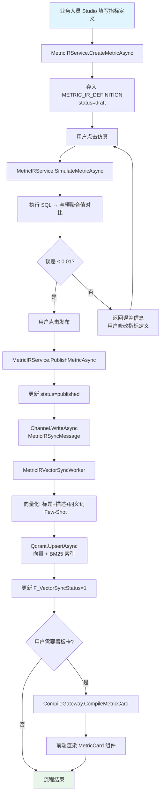
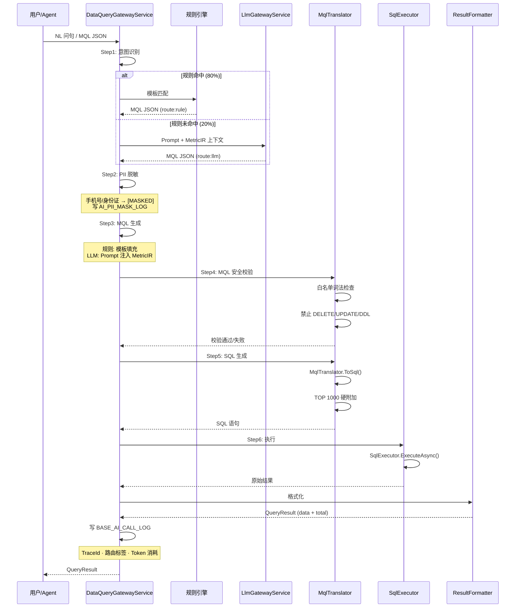
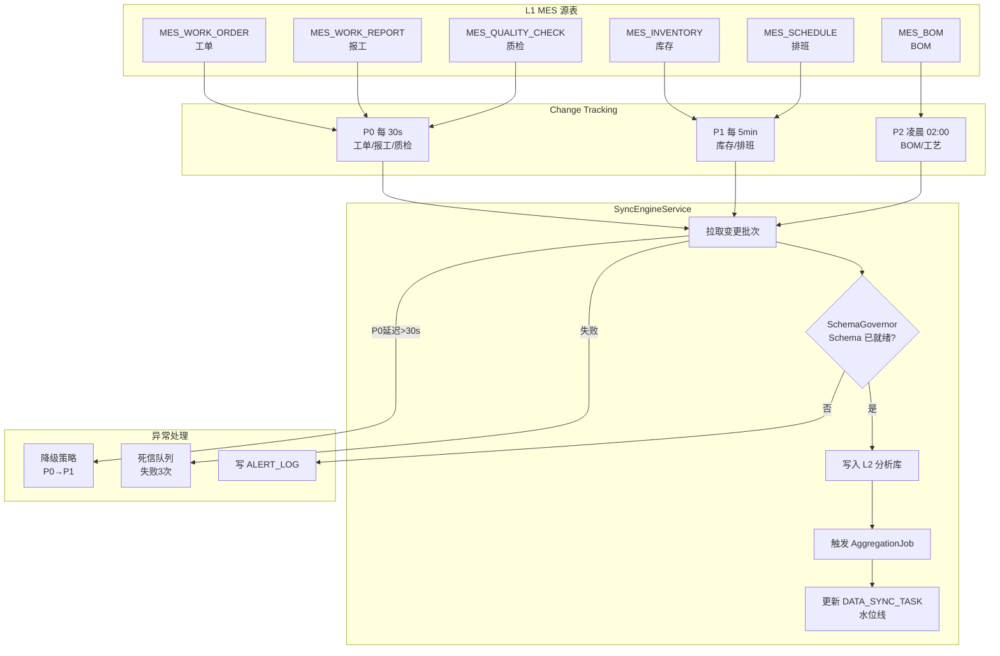
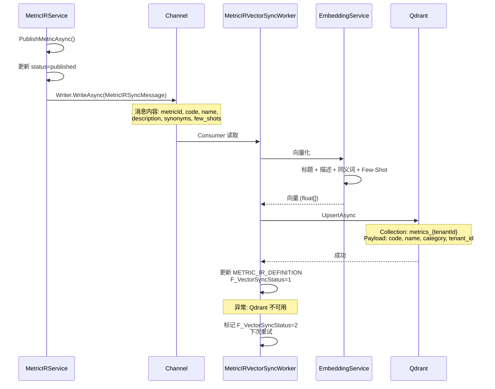
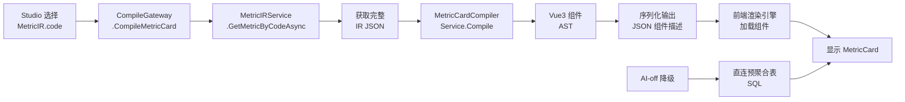
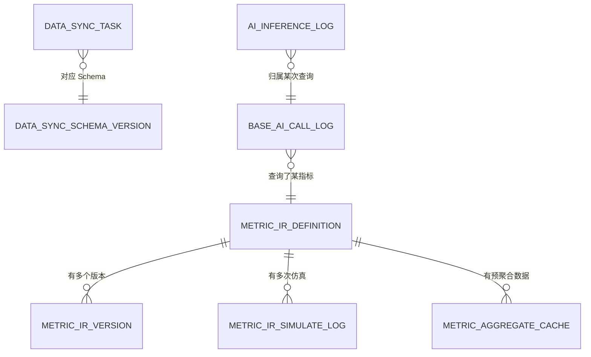
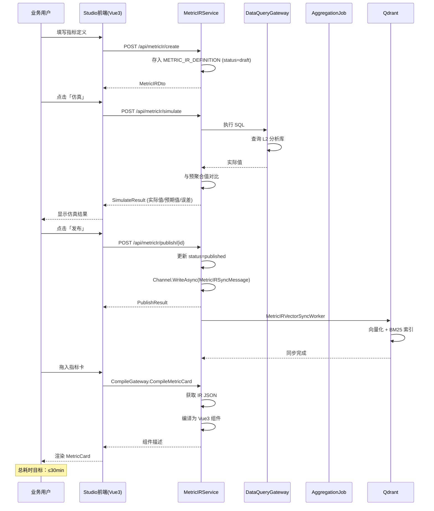
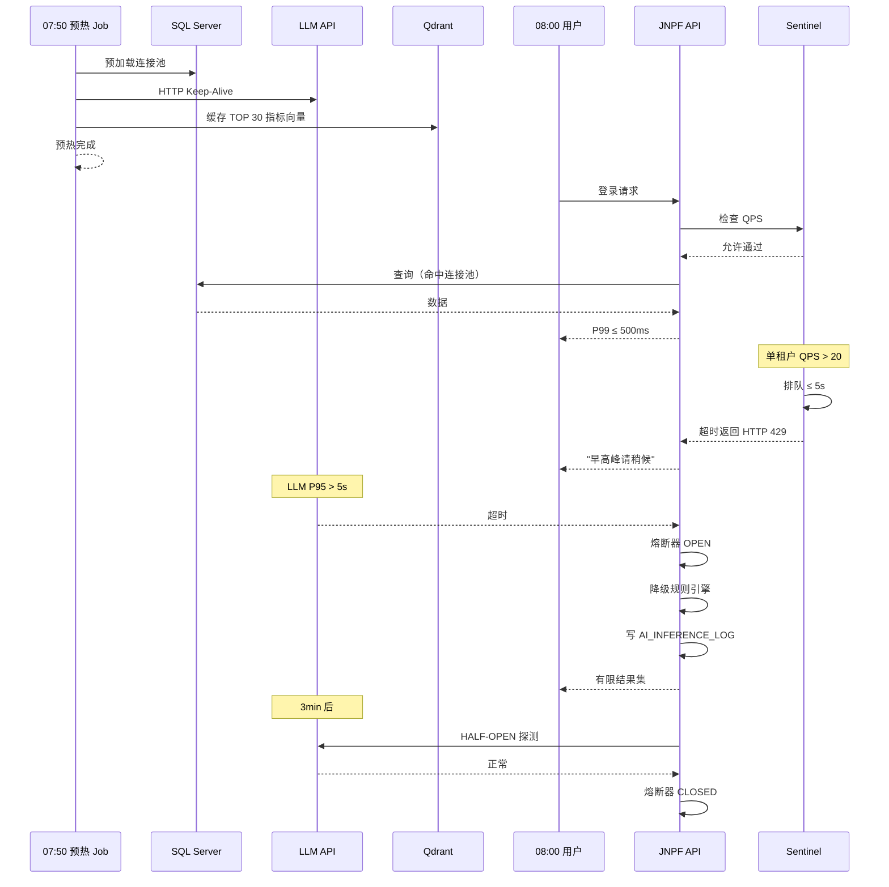
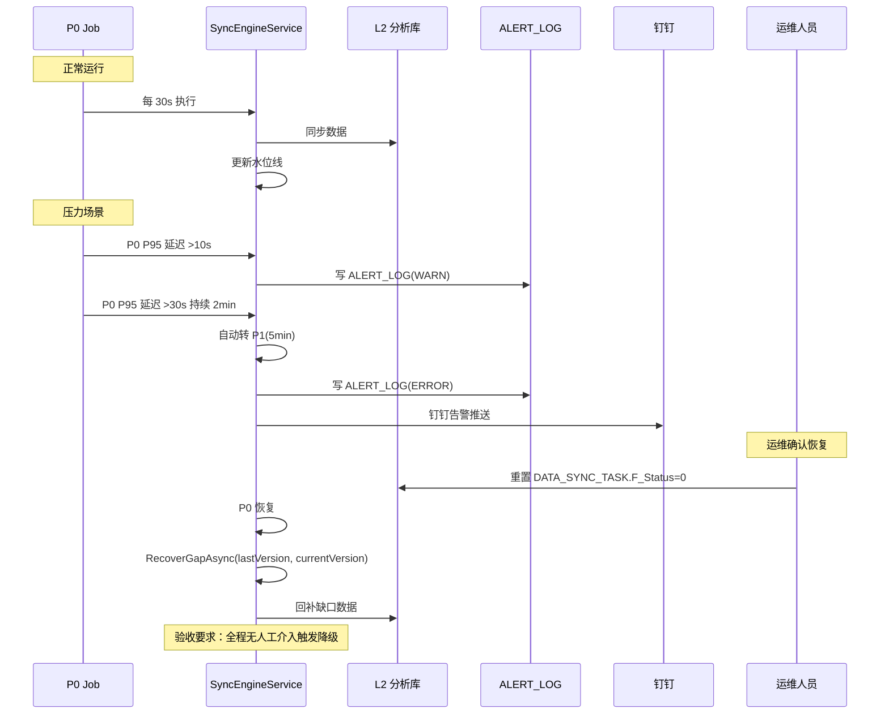

# JNPF 运行态第一期 · 轻量数据湖系统详细设计说明书

> **文档编号**：v52-runtime-p1-dds
> **版本**：v1.0
> **编制**：首席架构师助理 · 玛维思（Mavis）
> **日期**：2026-06-15
> **状态**：初稿完成，待专家组评审
> **依据文档**：
> - [`33、运行态四期开发纲领与架构白皮书`](./33、运行态四期开发纲领与架构白皮书.md)
> - [`35、运行态第一期·轻量数据湖施工计划`](./35、运行态第一期·轻量数据湖施工计划.md)
> - [`运行态第一期架构设计说明书`](./运行态第一期·轻量数据湖架构设计说明书.md)
> - [`运行态第一期需求分析说明书`](./运行态第一期·轻量数据湖系统需求分析说明书.md)
> **下游文档**：代码实现 + 单元测试 + 集成测试

---

## 文档目的

本说明书是 JNPF 运行态智能层**第一期（轻量数据湖）**的**详细设计单一真源**，目的是：

1. **承接架构**——将架构设计说明书的 ARC-R1-* 决策转化为可实现的设计规格
2. **指导编码**——为后端/前端工程师提供接口、表结构、流程的详细设计
3. **驱动测试**——为测试工程师提供测试场景和验收标准
4. **对齐验收**——为 M-G1 里程碑提供可验证的设计规格

**DS 编号规则**：`DS-<章节>-<序号>`，如 `DS-3-001` 表示第三章第 1 个设计规格。

---

## 阅读对象

| 角色 | 阅读重点 | 可跳过 |
|------|----------|--------|
| **架构师** | 全文 + 关联架构设计说明书 | — |
| **后端工程师** | 第三~六章（模块/接口/数据库/流程） | 前端 UI |
| **前端工程师** | 第三章模块 + 第八章 UI 设计 | 后端表设计 |
| **测试工程师** | 第十一章测试 + 第十二章验收 | 业务背景 |
| **运维工程师** | 第十章非功能 + 部署架构 | 业务流程 |

---

## 章节速览

| 章节 | 标题 | 主要内容 | 优先级 |
|------|------|----------|--------|
| 第一章 | 文档概述 | 范围 / 术语 / 参考文献 | P0 |
| 第二章 | 系统总体架构设计 | 架构总览图 / 部署拓扑 / 集成边界 | P0 |
| 第三章 | 功能模块结构设计 | 6 大模块职责 + 接口说明 | P0 |
| 第四章 | 核心业务流程设计 | 5 张流程图（指标全链路/NL查询/CDC同步/Qdrant同步/编译） | P0 |
| 第五章 | 接口设计 | MetricIR CRUD / DataQueryGateway / data-mcp / MetricIR JSON Schema | P0 |
| 第六章 | 数据库表设计 | 10 张表完整字段设计 + ER 图 | P0 |
| 第七章 | 关键时序设计 | 3 张时序图（Studio操作/08:00峰值/P0降级恢复） | P0 |
| 第八章 | Studio UI 界面设计 | MetricIR Studio 页面结构 + 卡片样式规范 | P1 |
| 第九章 | 权限管理设计 | 5 级权限层次 + 功能权限矩阵 + 多租户隔离 | P0 |
| 第十章 | 非功能性设计 | 性能 / 安全 / 可观测性 / 降级设计 | P1 |
| 第十一章 | 测试设计要点 | 单元测试覆盖 + 集成测试场景 | P2 |
| 第十二章 | M-G1 验收检查表 | 验收项索引 | P2 |

---

# 第一章 · 文档概述

## 1.1 编写目的

本说明书是 JNPF 运行态智能层第一期在**详细设计层面**的单一真源。它承接《运行态第一期架构设计说明书》的架构决策（ARC-R1-*），为编码实现提供详细设计规格。

**与架构设计说明书的关系**：
- 架构设计说明书回答**"为什么这么做 / 边界在哪"**（ARC-R1-* 编号）
- 本说明书回答**"怎么做"**（DS-* 编号）

**目标读者**：后端工程师 / 前端工程师 / 测试工程师 / 运维工程师

## 1.2 系统范围与边界

| 维度 | 内容 |
|------|------|
| **本期交付** | L1→L5 数据湖 · MetricIR Studio · DataQueryGateway(MQL) · data-mcp 三工具 · 30 MES 指标模板 · DashboardIR 单指标卡 |
| **本期不交付** | AgentIR · AlertRuleIR Job · 面向业务人员的 NL 对话 · Kafka/Flink · IoT 时序 |
| **边界系统** | 已有 JNPF MES 业务库（L1 源）· Qdrant · LLM API · 现有 DynamicApiController 框架 |
| **与开发态关系** | 正交：10~12 编译出的 FormPageIR 可引用 MetricIR；但 10~12 完成 ≠ 本期完成 |

## 1.3 术语与缩写

| 术语 | 定义 |
|------|------|
| **MetricIR** | 指标中间表示（Intermediate Representation）；定义指标 code · 口径 · 维度 · 预聚合策略 |
| **MQL** | Metric Query Language；JSON 格式查询协议，禁止 LLM 直写 SQL |
| **L1~L5** | 数据湖分层：L1 业务库 → L2 分析库 → L3 预聚合 → L4 语义层(Qdrant) → L5 消费就绪 |
| **SchemaGovernor** | 管理 L2 分析库 Schema 的多租户 DDL 执行器 |
| **DataQueryGateway** | MQL 解析 → SQL 生成 → 执行 → 结果返回的六步网关 |
| **data-mcp** | 暴露给 LLM Agent 的三个 MCP 工具：`query_metrics` / `list_metrics` / `explain_metric` |
| **DashboardIR** | 单指标卡片编译器（本期仅单卡；非 semantic 整页驾驶舱） |
| **CDC** | Change Data Capture；本期首选 SQL Server Change Tracking |
| **P0/P1/P2** | 同步优先级：P0 秒级（工单/报工）· P1 分钟级（库存/排班）· P2 凌晨全量（BOM/工艺） |
| **PII** | 个人身份信息；进 Prompt 前须脱敏（手机号→`[MASKED_PHONE]`） |

## 1.4 参考文献

| 文档 | 路径 | 关系 |
|------|------|------|
| **33 号白皮书** | `33、运行态四期开发纲领与架构白皮书.md` | 宪法 |
| **35 号施工计划** | `35、运行态第一期·轻量数据湖施工计划.md` | 施工排期 |
| **架构设计说明书** | `运行态第一期·轻量数据湖架构设计说明书.md` | 架构决策 |
| **需求分析说明书** | `运行态第一期·轻量数据湖系统需求分析说明书.md` | 需求输入 |

---

# 第二章 · 系统总体架构设计

## 2.1 架构总览图（图 2-1）

```
┌─────────────────────────────────────────────────────────────────────┐
│  JNPF.API.Entry（应用宿主层）                                        │
├─────────────────────────────────────────────────────────────────────┤
│  业务模块层                                                           │
│  ┌─────────────────────────────────────────────────────────────┐   │
│  │  现有模块                                                    │   │
│  │  system · visualdev · workflow · visualdata · inteAssistant  │   │
│  │  oauth · taskscheduler · extend · codegen · common           │   │
│  └─────────────────────────────────────────────────────────────┘   │
│  ┌─────────────────────────────────────────────────────────────┐   │
│  │  运行态第一期新增                                            │   │
│  │  ├─ inteDataLake【待建】                                     │   │
│  │  │  ├─ SchemaGovernorService                                 │   │
│  │  │  ├─ SyncEngineService                                     │   │
│  │  │  └─ AggregationJobService                                 │   │
│  │  ├─ MetricIR 引擎【待建】                                    │   │
│  │  │  └─ MetricIRService                                       │   │
│  │  ├─ DataQueryGateway【待建】                                 │   │
│  │  │  ├─ DataQueryGatewayService                               │   │
│  │  │  ├─ MqlTranslator                                         │   │
│  │  │  └─ SqlExecutor                                           │   │
│  │  ├─ data-mcp Host【待建】                                    │   │
│  │  │  ├─ query_metrics 工具                                    │   │
│  │  │  ├─ list_metrics 工具                                     │   │
│  │  │  └─ explain_metric 工具                                   │   │
│  │  └─ DashboardIR 编译器【待建】                               │   │
│  │     └─ MetricCardCompilerService                             │   │
│  └─────────────────────────────────────────────────────────────┘   │
├─────────────────────────────────────────────────────────────────────┤
│  基础设施层                                                           │
│  SqlSugar + ITenantFilter · Dapper · Redis · Hangfire               │
│  Qdrant Client · LLM Gateway · Channel · OpenTelemetry              │
├─────────────────────────────────────────────────────────────────────┤
│  框架层                                                               │
│  Furion · DynamicApiController · RESTfulResult · Oops                │
└─────────────────────────────────────────────────────────────────────┘
```

## 2.2 部署拓扑设计（图 2-2）

```
┌──────────────────────────────────────────────────────────┐
│  JNPF 运行态生产环境（0-20 租户）                          │
│                                                          │
│  ┌──────────────────────────────────────────────────┐   │
│  │  JNPF.API.Entry 进程                              │   │
│  │  ├─ 现有 JNPF 模块                                │   │
│  │  ├─ inteDataLake（SchemaGovernor + SyncEngine）   │   │
│  │  ├─ MetricIR 引擎                                 │   │
│  │  ├─ DataQueryGateway                              │   │
│  │  └─ DashboardIR 编译器                            │   │
│  └──────────────────────────────────────────────────┘   │
│                                                          │
│  ┌──────────────────────────────────────────────────┐   │
│  │  data-mcp Host 进程【R1-S0 决策：独立/内嵌】     │   │
│  │  ├─ query_metrics 工具                            │   │
│  │  ├─ list_metrics 工具                             │   │
│  │  └─ explain_metric 工具                           │   │
│  └──────────────────────────────────────────────────┘   │
│                                                          │
│  ┌──────────────────────────────────────────────────┐   │
│  │  SQL Server 实例                                  │   │
│  │  ├─ master（平台元数据）                          │   │
│  │  ├─ tenant_{id}（每租户业务 DB - L1 源表）       │   │
│  │  └─ ai_analytics_{id}（每租户分析 DB - L2）      │   │
│  └──────────────────────────────────────────────────┘   │
│                                                          │
│  ┌─────────────┐  ┌─────────────┐  ┌─────────────┐   │
│  │ Qdrant      │  │ Redis       │  │ LLM API     │   │
│  │（Docker）   │  │（已有）     │  │（云端/本地）│   │
│  └─────────────┘  └─────────────┘  └─────────────┘   │
│                                                          │
└──────────────────────────────────────────────────────────┘
```

## 2.3 与现有 JNPF 框架的集成边界

| 集成点 | 现有机制 | 本期使用方式 | 禁止 |
|--------|----------|-------------|------|
| 多租户隔离 | `TenantMiddleware.cs` | L2 Schema 按租户隔离，SchemaGovernor 创建时注入 TenantId | 共享表 + RLS |
| 异步任务 | Hangfire（已有） | L2 同步 Job / 预聚合 Job / 07:50 预热 Job | `Task.Run` 裸异步 |
| 事件总线 | Channel（进程内） | Qdrant 向量同步事件推送 | 直接调用 Qdrant HTTP |
| API 生成 | DynamicApiController | MetricIR CRUD Service 自动生成端点 | 手写 Controller |
| 统一响应 | `RESTfulResult<T>` | 所有 Service 返回值包装 | 直接 throw Exception |

---

# 第三章 · 功能模块结构设计

## 3.1 模块结构图（图 3-1）

```
功能模块树形结构图
├── 轻量数据湖（inteDataLake）【待建】
│   ├── SchemaGovernor（多租户 L2 DDL 管理）
│   │   └─ SchemaGovernorService
│   ├── SyncEngine（CDC + P0/P1/P2 调度）
│   │   └─ SyncEngineService
│   └── AggregationJob（L3 预聚合）
│       └─ AggregationJobService
├── MetricIR 引擎【待建】
│   ├── MetricIREntity（持久化）
│   ├── MetricIRService（CRUD + 发布 + 仿真）
│   └── MetricIRStudio（前端设计器 Vue3）
├── DataQueryGateway【待建】
│   ├── MqlTranslator（NL→MQL · 规则+LLM）
│   ├── MqlParser（JSON→SQL AST）
│   ├── SqlExecutor（白名单 + 审计）
│   └── ResultFormatter（图表数据）
├── data-mcp Host【待建】
│   ├── query_metrics 工具
│   ├── list_metrics 工具
│   └── explain_metric 工具
└── DashboardIR 单卡编译器【待建】
    └── MetricCardCompiler（MetricIR.code → Vue 组件）
```

## 3.2 各模块职责与接口说明

### 3.2.1 SchemaGovernor

| 项 | 内容 |
|----|------|
| **职责** | 为每个租户创建/更新 L2 分析库 Schema；执行 DDL 迁移；维护 Schema 版本号 |
| **服务类** | `SchemaGovernorService`（`modularity/inteDataLake/`）【待建】 |
| **核心方法** | `EnsureTenantSchemaAsync(string tenantId, SchemaVersion version)` |
| **操作表** | **DATA_SYNC_SCHEMA_VERSION**（见第六章） |
| **并发约束** | 3 租户并发隔离（R1-S0 POC 验收标准） |
| **异常处理** | Schema 创建失败 → 写 ALERT_LOG + 熔断；不影响其他租户 |

**DS-3-001 SchemaGovernor 接口定义**：

```csharp
public interface ISchemaGovernorService
{
    /// <summary>
    /// 确保租户 Schema 存在且版本正确
    /// </summary>
    Task<SchemaResult> EnsureTenantSchemaAsync(string tenantId, int targetVersion);
    
    /// <summary>
    /// 获取租户 Schema 名称
    /// </summary>
    string GetTenantSchemaName(string tenantId);
    
    /// <summary>
    /// 执行 DDL 迁移
    /// </summary>
    Task<MigrationResult> MigrateSchemaAsync(string tenantId, string ddlScript);
    
    /// <summary>
    /// 归档租户 Schema（6个月未活跃）
    /// </summary>
    Task<ArchiveResult> ArchiveSchemaAsync(string tenantId);
}
```

### 3.2.2 SyncEngine（CDC 同步）

| 项 | 内容 |
|----|------|
| **职责** | 按 P0/P1/P2 分级，将 L1 MES 数据变更同步至 L2 分析库 |
| **选型** | SQL Server Change Tracking（首选）/ Debezium（储备） |
| **服务类** | `SyncEngineService`（`modularity/inteDataLake/`）【待建】 |
| **调度** | Hangfire Job；P0 每 30s 触发；P1 每 5min；P2 凌晨 02:00 |
| **操作表** | **DATA_SYNC_TASK**（见第六章）· **ALERT_LOG** |
| **降级策略** | P0 P95>30s 持续 2min → 自动降为 P1 + 写 ALERT_LOG + 钉钉告警 |

**DS-3-002 SyncEngine 接口定义**：

```csharp
public interface ISyncEngineService
{
    /// <summary>
    /// 执行 P0 同步（工单/报工/质检）
    /// </summary>
    Task<SyncResult> SyncP0Async(string tenantId);
    
    /// <summary>
    /// 执行 P1 同步（库存/排班）
    /// </summary>
    Task<SyncResult> SyncP1Async(string tenantId);
    
    /// <summary>
    /// 执行 P2 同步（BOM/工艺）
    /// </summary>
    Task<SyncResult> SyncP2Async(string tenantId);
    
    /// <summary>
    /// 回补缺口数据
    /// </summary>
    Task<RecoverResult> RecoverGapAsync(string tenantId, long fromVersion, long toVersion);
    
    /// <summary>
    /// 获取同步状态
    /// </summary>
    Task<List<SyncStatusDto>> GetSyncStatusAsync(string tenantId);
}
```

### 3.2.3 MetricIR 引擎

| 项 | 内容 |
|----|------|
| **职责** | MetricIR 的 CRUD · 版本管理 · 仿真 · 发布 · Qdrant 双模同步 |
| **服务类** | `MetricIRService`（`modularity/inteAssistant/` 或独立模块）【待确认路径】 |
| **核心方法** | `CreateMetricAsync` · `PublishMetricAsync` · `SimulateMetricAsync` · `GetMetricByCodeAsync` |
| **操作表** | **METRIC_IR_DEFINITION** · **METRIC_IR_VERSION**（见第六章） |
| **向量同步** | 发布时通过 Channel 推送向量化任务（`MetricIRSyncChannel`）→ Qdrant |
| **铁律** | 同一 MetricIR.code → MQL → 预聚合 SQL 数值必须一致（口径法律） |

**DS-3-003 MetricIRService 接口定义**：

```csharp
public interface IMetricIRService
{
    /// <summary>
    /// 创建指标（草稿）
    /// </summary>
    Task<MetricIRDto> CreateMetricAsync(MetricIRCreateInput input);
    
    /// <summary>
    /// 更新指标
    /// </summary>
    Task<MetricIRDto> UpdateMetricAsync(string id, MetricIRUpdateInput input);
    
    /// <summary>
    /// 发布指标（草稿→已发布）
    /// </summary>
    Task<PublishResult> PublishMetricAsync(string id);
    
    /// <summary>
    /// 仿真指标
    /// </summary>
    Task<SimulateResult> SimulateMetricAsync(MetricIRSimulateInput input);
    
    /// <summary>
    /// 按 code 获取指标
    /// </summary>
    Task<MetricIRDto> GetByCodeAsync(string code);
    
    /// <summary>
    /// 分页查询指标
    /// </summary>
    Task<PageResult<MetricIRDto>> GetPageListAsync(MetricIRPageInput input);
    
    /// <summary>
    /// 废弃指标
    /// </summary>
    Task DeprecateMetricAsync(string id);
}
```

### 3.2.4 DataQueryGateway

| 项 | 内容 |
|----|------|
| **职责** | 接收 NL 或 MQL(JSON) → 六步管道 → 返回结构化结果 |
| **服务类** | `DataQueryGatewayService`（`modularity/inteAssistant/`）【待建】 |
| **六步流程** | 见第四章 §4.2（时序图） |
| **操作表** | **BASE_AI_CALL_LOG**（审计）· **AI_INFERENCE_LOG**（LLM 路径监控） |
| **安全铁律** | ① 禁止 LLM 直写 SQL ② TOP 1000 硬限制 ③ PII 脱敏在进 LLM 前 ④ SQL 注入白名单 |
| **熔断** | LLM P95 > 5s → 自动熔断 → 降级规则引擎 → 写 AI_INFERENCE_LOG |

**DS-3-004 DataQueryGatewayService 接口定义**：

```csharp
public interface IDataQueryGatewayService
{
    /// <summary>
    /// 自然语言查询
    /// </summary>
    Task<QueryResult> QueryByNLAsync(string nlQuery, string tenantId);
    
    /// <summary>
    /// MQL 查询
    /// </summary>
    Task<QueryResult> QueryByMQLAsync(MqlQueryInput input);
    
    /// <summary>
    /// 解释指标口径
    /// </summary>
    Task<MetricExplanation> ExplainMetricAsync(string metricCode, string tenantId);
}
```

### 3.2.5 data-mcp Host

| 项 | 内容 |
|----|------|
| **职责** | 暴露三个 MCP 工具供 Agent 调用；代理至 DataQueryGateway |
| **部署形态** | 【R1-S0 决策：独立进程 / 内嵌】 |
| **三工具签名** | 见第五章 §5.3（接口合约） |
| **认证** | MCP 握手需租户 Token；不允许匿名访问 |

### 3.2.6 DashboardIR 单卡编译器

| 项 | 内容 |
|----|------|
| **职责** | 将 MetricIR.code 编译为可渲染的 Vue3 单指标卡片组件 |
| **服务类** | `MetricCardCompilerService`（`jnpf-web-vue3/src/core/compiler/`）【待建】 |
| **输入** | MetricIR JSON（含 code · 单位 · 预聚合策略） |
| **输出** | Vue3 `<MetricCard>` 组件（含数据绑定 + 刷新逻辑） |
| **铁律** | **非**手写 `AiDataInsightCard`；必须经 CompileGateway；AI-off 时卡片仍显示预聚合数据 |

---

# 第四章 · 核心业务流程设计

## 4.1 指标全生命周期流程（图 4-1）



**每个步骤的 Service 类名 + 方法名 + 操作表**：

| 步骤 | Service | 方法 | 操作表 |
|------|---------|------|--------|
| 1 | MetricIRService | CreateMetricAsync | METRIC_IR_DEFINITION |
| 2 | MetricIRService | SimulateMetricAsync | METRIC_IR_SIMULATE_LOG |
| 3 | MetricIRService | PublishMetricAsync | METRIC_IR_DEFINITION, METRIC_IR_VERSION |
| 4 | Channel | WriteAsync | — |
| 5 | MetricIRVectorSyncWorker | ProcessAsync | Qdrant |
| 6 | CompileGateway | CompileMetricCard | — |

## 4.2 NL→MQL→SQL 查询六步管道（图 4-2）



**关键分支**：
- LLM 熔断时（P95>5s）→ 降级规则引擎 → 返回有限结果集
- Qdrant 不可用时 → 降级 CONTAINS 全文搜索
- 结果为空时 → 返回「该指标暂无数据」而非抛异常

## 4.3 CDC 同步数据流程（图 4-3）



## 4.4 Qdrant 双模索引同步流程（图 4-4）



**铁律**：禁止 `Task.Run` 裸推；必须经 Channel；同步失败不阻塞发布流程

## 4.5 DashboardIR 单卡编译流程（图 4-5）



---

# 第五章 · 接口设计

## 5.1 MetricIR CRUD API

**DS-5-001 MetricIR CRUD 接口**（DynamicApiController 自动生成）：

| API | 服务方法 | 入参 | 出参 | 权限 |
|-----|----------|------|------|------|
| `POST /api/metricIr/create` | `MetricIRService.CreateMetricAsync` | `MetricIRCreateInput` | `MetricIRDto` | 管理员 / 指标配置员 |
| `PUT /api/metricIr/{id}` | `MetricIRService.UpdateMetricAsync` | `MetricIRUpdateInput` | `MetricIRDto` | 管理员 / 指标配置员 |
| `POST /api/metricIr/publish/{id}` | `MetricIRService.PublishMetricAsync` | id(路径) | `PublishResult` | 管理员 |
| `POST /api/metricIr/simulate` | `MetricIRService.SimulateMetricAsync` | `MetricIRSimulateInput` | `SimulateResult` | 管理员 / 配置员 |
| `GET /api/metricIr/list` | `MetricIRService.GetPageListAsync` | 分页 + 租户过滤 | `PageResult<MetricIRDto>` | 全租户用户 |
| `GET /api/metricIr/{code}` | `MetricIRService.GetByCodeAsync` | code | `MetricIRDto` | 全租户用户 |
| `POST /api/metricIr/deprecate/{id}` | `MetricIRService.DeprecateMetricAsync` | id(路径) | `void` | 管理员 |

**铁律**：所有接口 TenantId 从 `ITenantManager.GetCurrentTenant()` 注入，禁止客户端传入

### DS-5-002 MetricIRCreateInput 定义

```csharp
public class MetricIRCreateInput
{
    [Required]
    [StringLength(100)]
    public string Code { get; set; }  // 指标码，如 oee
    
    [Required]
    [StringLength(200)]
    public string Name { get; set; }  // 中文名称
    
    [StringLength(50)]
    public string Category { get; set; }  // production/quality/equipment/material/hr
    
    [Required]
    public string Formula { get; set; }  // 业务口径公式
    
    public string SqlTemplate { get; set; }  // SQL 模板
    
    [Required]
    public AggregationConfig Aggregation { get; set; }  // 聚合配置
    
    [Required]
    public List<DimensionConfig> Dimensions { get; set; }  // 维度配置
    
    public List<string> Synonyms { get; set; }  // 同义词
    
    public List<FewShotConfig> FewShots { get; set; }  // Few-Shot 示例
    
    public List<string> PiiFields { get; set; }  // PII 字段
}

public class AggregationConfig
{
    [Required]
    public string Strategy { get; set; }  // sum/avg/max/min/count/custom
    
    [Required]
    public List<string> Granularities { get; set; }  // hour/day/week/month
    
    public bool PreAggregate { get; set; } = true;  // 是否启用预聚合
}

public class DimensionConfig
{
    [Required]
    public string Name { get; set; }  // 维度名，如 workshop
    
    [Required]
    public string Column { get; set; }  // L2 表列名
    
    [Required]
    public string Type { get; set; }  // string/date/integer
}

public class FewShotConfig
{
    [Required]
    public string Question { get; set; }  // 样例问句
    
    [Required]
    public object Mql { get; set; }  // 对应 MQL JSON
}
```

### DS-5-003 SimulateResult 定义

```csharp
public class SimulateResult
{
    public bool Passed { get; set; }  // 是否通过
    public decimal ActualValue { get; set; }  // 实际值
    public decimal ExpectedValue { get; set; }  // 预期值（预聚合对比）
    public decimal Deviation { get; set; }  // 误差率
    public string SqlExecuted { get; set; }  // 执行的 SQL（审计）
    public int DurationMs { get; set; }  // 执行耗时
}
```

## 5.2 DataQueryGateway API

**DS-5-004 DataQueryGateway 接口**：

| API | 服务方法 | 入参 | 出参 |
|-----|----------|------|------|
| `POST /api/dataQuery/nl` | `DataQueryGatewayService.QueryByNLAsync` | `{ nl: string, tenantId }` | `QueryResult` |
| `POST /api/dataQuery/mql` | `DataQueryGatewayService.QueryByMQLAsync` | `MqlQueryInput` | `QueryResult` |
| `GET /api/dataQuery/explain/{code}` | `DataQueryGatewayService.ExplainMetricAsync` | MetricIR.code | `MetricExplanation` |

### DS-5-005 QueryResult 定义

```csharp
public class QueryResult
{
    public List<Dictionary<string, object>> Data { get; set; }  // 数据行
    public int Total { get; set; }  // 总行数
    public string MetricUsed { get; set; }  // 实际使用的 MetricIR.code
    public string TraceId { get; set; }  // OpenTelemetry TraceId
    public string Route { get; set; }  // rule / llm / rule_fallback
    public string SqlDigest { get; set; }  // 脱敏后的 SQL 摘要
}
```

### DS-5-006 MqlQueryInput 定义

```csharp
public class MqlQueryInput
{
    [Required]
    public string MetricCode { get; set; }  // 指标 code
    
    public List<string> Dimensions { get; set; }  // 维度列表
    
    public List<FilterConfig> Filters { get; set; }  // 过滤条件
    
    public DateRangeConfig DateRange { get; set; }  // 日期范围
    
    public string Granularity { get; set; }  // 粒度: day/week/month
}

public class FilterConfig
{
    public string Field { get; set; }
    public string Op { get; set; }  // eq/ne/gt/lt/gte/lte/in
    public object Value { get; set; }
}

public class DateRangeConfig
{
    public DateTime Start { get; set; }
    public DateTime End { get; set; }
}
```

## 5.3 data-mcp 三工具 API 合约

### DS-5-007 工具 1：`query_metrics`

```json
{
  "tool": "query_metrics",
  "input_schema": {
    "type": "object",
    "properties": {
      "nl_query": {
        "type": "string",
        "description": "自然语言问句，如「今日一车间 OEE」"
      },
      "metric_codes": {
        "type": "array",
        "items": { "type": "string" },
        "description": "可选：直接指定指标 code"
      },
      "date_range": {
        "type": "object",
        "properties": {
          "start": { "type": "string", "format": "date-time" },
          "end": { "type": "string", "format": "date-time" }
        }
      },
      "tenant_id": {
        "type": "string",
        "description": "由 MCP 认证层注入，Agent 不传"
      }
    },
    "required": ["nl_query"]
  },
  "output_schema": {
    "type": "object",
    "properties": {
      "data": { "type": "array", "description": "图表数据点" },
      "total": { "type": "integer" },
      "metric_used": { "type": "string", "description": "实际使用的 MetricIR.code" },
      "sql_digest": { "type": "string", "description": "审计用 SQL 摘要（脱敏）" },
      "trace_id": { "type": "string" },
      "route": { "type": "string", "enum": ["rule", "llm", "rule_fallback"] }
    }
  }
}
```

### DS-5-008 工具 2：`list_metrics`

```json
{
  "tool": "list_metrics",
  "input_schema": {
    "type": "object",
    "properties": {
      "category": {
        "type": "string",
        "description": "按分类过滤"
      },
      "keyword": {
        "type": "string",
        "description": "关键词搜索（Qdrant 双模）"
      },
      "tenant_id": {
        "type": "string"
      }
    }
  },
  "output_schema": {
    "type": "object",
    "properties": {
      "metrics": {
        "type": "array",
        "items": {
          "type": "object",
          "properties": {
            "code": { "type": "string" },
            "name": { "type": "string" },
            "unit": { "type": "string" },
            "description": { "type": "string" }
          }
        }
      }
    }
  }
}
```

### DS-5-009 工具 3：`explain_metric`

```json
{
  "tool": "explain_metric",
  "input_schema": {
    "type": "object",
    "properties": {
      "metric_code": { "type": "string" },
      "tenant_id": { "type": "string" }
    },
    "required": ["metric_code"]
  },
  "output_schema": {
    "type": "object",
    "properties": {
      "code": { "type": "string" },
      "formula": { "type": "string", "description": "口径公式（业务语言）" },
      "sql_template": { "type": "string", "description": "脱敏后的 SQL 模板" },
      "sample_value": { "type": "number" },
      "synonyms": { "type": "array", "items": { "type": "string" } }
    }
  }
}
```

## 5.4 MetricIR JSON Schema（完整格式）

```json
{
  "$schema": "http://json-schema.org/draft-07/schema",
  "type": "object",
  "required": ["code", "name", "formula", "aggregation", "dimensions"],
  "properties": {
    "code": { "type": "string", "description": "全局唯一指标码，如 oee · yield_rate" },
    "name": { "type": "string", "description": "中文名称，如「综合设备效率」" },
    "formula": { "type": "string", "description": "业务口径公式（业务语言，非 SQL）" },
    "sql_template": { "type": "string", "description": "对应 SQL 模板（带 {{tenant_schema}} 占位符）" },
    "aggregation": {
      "type": "object",
      "properties": {
        "strategy": { "enum": ["sum", "avg", "max", "min", "count", "custom"] },
        "granularities": { "type": "array", "items": { "enum": ["hour", "day", "week", "month"] } },
        "pre_aggregate": { "type": "boolean", "description": "是否启用 L3 预聚合" }
      }
    },
    "dimensions": {
      "type": "array",
      "items": {
        "type": "object",
        "properties": {
          "name": { "type": "string" },
          "column": { "type": "string" },
          "type": { "enum": ["string", "date", "integer"] }
        }
      }
    },
    "synonyms": { "type": "array", "items": { "type": "string" } },
    "few_shots": {
      "type": "array",
      "items": {
        "type": "object",
        "properties": {
          "question": { "type": "string" },
          "mql": { "type": "object" }
        }
      }
    },
    "pii_fields": { "type": "array", "items": { "type": "string" } },
    "category": { "enum": ["production", "quality", "equipment", "material", "hr"] },
    "version": { "type": "integer", "default": 1 },
    "status": { "enum": ["draft", "published", "deprecated"] }
  }
}
```

---

# 第六章 · 数据库表设计

> **命名规范**：全大写 + 下划线；新增表前缀 `AI_` 或 `METRIC_` 或 `DATA_`
> **多租户**：所有新增表必须含 `F_TenantId` 字段；L2 分析库按 Schema 隔离（禁止 RLS）

## 6.1 L1 数据同步控制表

### 表 6-1：**DATA_SYNC_TASK**（L1→L2 同步水位线）

| 字段 | 类型 | 说明 |
|------|------|------|
| F_Id | varchar(50) PK | 主键（GUID） |
| F_TenantId | varchar(50) NOT NULL | 租户 ID（ITenantFilter 注入） |
| F_TableName | varchar(100) NOT NULL | L1 源表名（如 MES_WORK_ORDER） |
| F_Priority | tinyint NOT NULL | 同步优先级：0=P0 · 1=P1 · 2=P2 |
| F_LastSyncVersion | bigint | Change Tracking 最后同步版本号 |
| F_LastSyncTime | datetime | 最后成功同步时间 |
| F_Status | tinyint | 0=正常 · 1=降级中 · 2=暂停 |
| F_ErrorCount | int DEFAULT 0 | 连续失败次数（≥3 触发降级） |
| F_NextScheduleTime | datetime | 下次调度时间 |
| F_CreatorTime | datetime NOT NULL | 创建时间 |
| F_LastModifyTime | datetime | 最后更新时间 |

**索引**：`(F_TenantId, F_TableName)` 唯一约束；`(F_Priority, F_NextScheduleTime)` 调度索引

### 表 6-2：**DATA_SYNC_SCHEMA_VERSION**（L2 Schema 版本管理）

| 字段 | 类型 | 说明 |
|------|------|------|
| F_Id | varchar(50) PK | |
| F_TenantId | varchar(50) NOT NULL | |
| F_SchemaName | varchar(100) NOT NULL | L2 分析库 Schema 名（如 `ai_analytics_tenant001`） |
| F_Version | int NOT NULL | Schema 版本号 |
| F_Status | tinyint | 0=就绪 · 1=迁移中 · 2=失败 |
| F_MigratedAt | datetime | 迁移完成时间 |
| F_CreatorTime | datetime NOT NULL | |

## 6.2 MetricIR 持久化表

### 表 6-3：**METRIC_IR_DEFINITION**（指标定义主表）

| 字段 | 类型 | 说明 |
|------|------|------|
| F_Id | varchar(50) PK | |
| F_TenantId | varchar(50) NOT NULL | |
| F_Code | varchar(100) NOT NULL | 全局唯一指标码（如 `oee`） |
| F_Name | varchar(200) NOT NULL | 中文名称 |
| F_Category | varchar(50) | production/quality/equipment/material/hr |
| F_Formula | nvarchar(max) | 业务口径公式（业务语言） |
| F_SqlTemplate | nvarchar(max) | SQL 模板（含 {{tenant_schema}} 占位符） |
| F_AggregationStrategy | varchar(50) | sum/avg/max/min/count/custom |
| F_Granularities | varchar(200) | JSON 数组，如 `["day","week","month"]` |
| F_PreAggregate | bit NOT NULL DEFAULT 1 | 是否启用 L3 预聚合 |
| F_Dimensions | nvarchar(max) | JSON 数组（维度定义） |
| F_Synonyms | nvarchar(max) | JSON 数组（同义词，用于 Qdrant BM25） |
| F_FewShots | nvarchar(max) | JSON 数组（Few-Shot 样例） |
| F_PiiFields | varchar(500) | 逗号分隔的 PII 字段名 |
| F_Status | tinyint | 0=草稿 · 1=已发布 · 2=已废弃 |
| F_Version | int NOT NULL DEFAULT 1 | 版本号（乐观锁） |
| F_VectorSyncStatus | tinyint | 0=待同步 · 1=已同步 · 2=失败 |
| F_PublishedTime | datetime | 发布时间 |
| F_CreatorUserId | varchar(50) | |
| F_CreatorTime | datetime NOT NULL | |
| F_LastModifyTime | datetime | |
| F_EnabledMark | bit NOT NULL DEFAULT 1 | |
| F_DeleteMark | bit NOT NULL DEFAULT 0 | |

**索引**：`(F_TenantId, F_Code)` 唯一约束；`(F_TenantId, F_Status)` 查询索引；`F_VectorSyncStatus` 同步状态索引

### 表 6-4：**METRIC_IR_VERSION**（指标版本历史）

| 字段 | 类型 | 说明 |
|------|------|------|
| F_Id | varchar(50) PK | |
| F_MetricId | varchar(50) FK→METRIC_IR_DEFINITION.F_Id | |
| F_TenantId | varchar(50) NOT NULL | |
| F_Version | int NOT NULL | 版本号 |
| F_Snapshot | nvarchar(max) | 该版本完整 MetricIR JSON 快照 |
| F_ChangeNote | nvarchar(500) | 变更说明 |
| F_CreatorUserId | varchar(50) | |
| F_CreatorTime | datetime NOT NULL | |

### 表 6-5：**METRIC_IR_SIMULATE_LOG**（仿真记录）

| 字段 | 类型 | 说明 |
|------|------|------|
| F_Id | varchar(50) PK | |
| F_MetricId | varchar(50) FK | |
| F_TenantId | varchar(50) NOT NULL | |
| F_SqlExecuted | nvarchar(max) | 实际执行的 SQL（审计） |
| F_ResultValue | decimal(18,4) | 仿真结果值 |
| F_ExpectedValue | decimal(18,4) | 预聚合对比值（可为 null） |
| F_Deviation | decimal(8,4) | 误差率（>0.01 标记为异常） |
| F_DurationMs | int | 执行耗时（毫秒） |
| F_PassedAt | datetime | 仿真通过时间 |
| F_CreatorTime | datetime NOT NULL | |

## 6.3 查询网关日志表

### 表 6-6：**BASE_AI_CALL_LOG**（MQL 全链路审计）

| 字段 | 类型 | 说明 |
|------|------|------|
| F_Id | varchar(50) PK | |
| F_TenantId | varchar(50) NOT NULL | |
| F_TraceId | varchar(100) NOT NULL | OpenTelemetry TraceId |
| F_InputType | varchar(20) | nl / mql（查询输入类型） |
| F_NlQuery | nvarchar(500) | 原始自然语言问句（脱敏后） |
| F_MqlJson | nvarchar(max) | 生成的 MQL JSON |
| F_SqlDigest | nvarchar(max) | 执行的 SQL（脱敏，去掉参数值） |
| F_RouteLabel | varchar(50) | rule / llm / rule_fallback |
| F_LlmTokenIn | int | LLM 输入 Token 数 |
| F_LlmTokenOut | int | LLM 输出 Token 数 |
| F_DurationMs | int | 总耗时 |
| F_ResultRows | int | 返回数据行数 |
| F_StatusCode | int | 200=成功 · 429=限流 · 500=异常 |
| F_ErrorMessage | nvarchar(500) | 错误信息（成功时为 null） |
| F_CreatorTime | datetime NOT NULL | |

### 表 6-7：**AI_INFERENCE_LOG**（LLM 推理路径监控）

| 字段 | 类型 | 说明 |
|------|------|------|
| F_Id | varchar(50) PK | |
| F_TenantId | varchar(50) NOT NULL | |
| F_TraceId | varchar(100) | |
| F_RouteLabel | varchar(50) | route:rule / route:llm / route:rule_fallback |
| F_ModelName | varchar(100) | 调用的 LLM 模型名 |
| F_PromptHash | varchar(64) | Prompt 哈希（用于语义缓存） |
| F_LatencyMs | int | LLM 推理延迟 |
| F_CircuitBroken | bit | 是否触发熔断 |
| F_CreatorTime | datetime NOT NULL | |

### 表 6-8：**AI_PII_MASK_LOG**（PII 脱敏审计）

| 字段 | 类型 | 说明 |
|------|------|------|
| F_Id | varchar(50) PK | |
| F_TenantId | varchar(50) NOT NULL | |
| F_TraceId | varchar(100) | |
| F_OriginalFieldType | varchar(50) | phone / id_card / email |
| F_MaskCount | int | 本次脱敏字段数量 |
| F_CreatorTime | datetime NOT NULL | |

## 6.4 预聚合缓存表（L3）

### 表 6-9：**METRIC_AGGREGATE_CACHE**（L3 预聚合结果）

| 字段 | 类型 | 说明 |
|------|------|------|
| F_Id | varchar(50) PK | |
| F_TenantId | varchar(50) NOT NULL | |
| F_MetricCode | varchar(100) NOT NULL | 指标码 |
| F_Granularity | varchar(20) NOT NULL | hour/day/week/month |
| F_PeriodStart | datetime NOT NULL | 聚合周期开始时间 |
| F_PeriodEnd | datetime NOT NULL | 聚合周期结束时间 |
| F_DimensionKey | varchar(500) | JSON 维度键（如 `{"workshop":"A","shift":"1"}`） |
| F_Value | decimal(18,4) NOT NULL | 聚合值 |
| F_RecordCount | int | 参与聚合的记录数 |
| F_ComputedAt | datetime NOT NULL | 计算时间 |

**索引**：`(F_TenantId, F_MetricCode, F_Granularity, F_PeriodStart)` 主查询索引

## 6.5 告警与监控表

### 表 6-10：**ALERT_LOG**（系统告警日志）

| 字段 | 类型 | 说明 |
|------|------|------|
| F_Id | varchar(50) PK | |
| F_TenantId | varchar(50) | 为 null 表示系统级告警 |
| F_AlertType | varchar(50) | sync_degraded / qdrant_down / llm_circuit_open / p0_delay |
| F_Severity | tinyint | 0=INFO · 1=WARN · 2=ERROR · 3=CRITICAL |
| F_Message | nvarchar(max) | 告警详情 |
| F_IsAcknowledged | bit DEFAULT 0 | 是否已确认 |
| F_AcknowledgedBy | varchar(50) | 确认人 |
| F_CreatorTime | datetime NOT NULL | |

## 6.6 ER 图（图 6-1）



---

# 第七章 · 关键时序设计

## 7.1 业务人员 Studio 完整操作时序（图 7-1）



## 7.2 08:00 峰值登录时序（图 7-2）



## 7.3 P0 同步降级恢复时序（图 7-3）



---

# 第八章 · Studio UI 界面设计

## 8.1 MetricIR Studio 页面结构

```
┌─────────────────────────────────────────────────────────────────────┐
│  MetricIR Studio                                    [新建指标] [导入]│
├────────────────────────────┬────────────────────────────────────────┤
│  指标列表（左侧树）          │  指标编辑器（右侧面板）                 │
│  ├─ 生产指标                 │  ┌─────────────────────────────────┐ │
│  │  ├─ OEE ● 已发布          │  │  基本信息 Tab                   │ │
│  │  ├─ 良率 ● 已发布          │  │  ├─ 指标码: [oee_____________] │ │
│  │  └─ 新建 ○ 草稿            │  │  ├─ 名称: [综合设备效率_______] │ │
│  ├─ 质量指标                 │  │  ├─ 分类: [production ▼_______] │ │
│  └─ 设备指标                 │  │  └─ 描述: [___________________] │ │
│                              │  └─────────────────────────────────┘ │
│                              │  ┌─────────────────────────────────┐ │
│                              │  │  口径公式 Tab                   │ │
│                              │  │  ├─ 公式编辑器（业务语言）      │ │
│                              │  │  │  [实际产量 / 理论产量]       │ │
│                              │  │  ├─ SQL 预览（只读）            │ │
│                              │  │  │  [SELECT ... FROM ...]       │ │
│                              │  │  └─ 聚合策略: [avg ▼]          │ │
│                              │  └─────────────────────────────────┘ │
│                              │  ┌─────────────────────────────────┐ │
│                              │  │  维度配置 Tab                   │ │
│                              │  │  ├─ [+添加维度]                 │ │
│                              │  │  │  workshop: [string] [列名]   │ │
│                              │  │  │  equipment: [string] [列名]  │ │
│                              │  │  └─ 预聚合粒度: [day ✓ week ✓] │ │
│                              │  └─────────────────────────────────┘ │
│                              │  ┌─────────────────────────────────┐ │
│                              │  │  同义词 & Few-Shot Tab          │ │
│                              │  │  ├─ 同义词: [设备利用率, 综合效率]│ │
│                              │  │  └─ Few-Shot: [+添加示例]      │ │
│                              │  │     问句: [一车间今天OEE?]      │ │
│                              │  │     MQL: [{metric_code:"oee"}]  │ │
│                              │  └─────────────────────────────────┘ │
│                              │  ┌─────────────────────────────────┐ │
│                              │  │  仿真结果                       │ │
│                              │  │  ├─ 实际值: 0.82                │ │
│                              │  │  ├─ 预期值: 0.82                │ │
│                              │  │  ├─ 误差: 0.00% ✓              │ │
│                              │  │  └─ 状态: 通过 ✓               │ │
│                              │  └─────────────────────────────────┘ │
│                              │  [仿真运行] [发布] [废弃]             │
└────────────────────────────┴────────────────────────────────────────┘
```

**操作按钮对应的 API 端点**：
- 新建指标 → `POST /api/metricIr/create`
- 仿真运行 → `POST /api/metricIr/simulate`
- 发布 → `POST /api/metricIr/publish/{id}`
- 废弃 → `POST /api/metricIr/deprecate/{id}`

**权限控制**：
- 新建/发布按钮：仅管理员 / 指标配置员可见
- 仿真按钮：管理员 / 指标配置员 / 数据分析员可见
- 查看按钮：全租户用户可见

## 8.2 DashboardIR 指标卡片样式规范

| 元素 | 内容 | 数据来源 |
|------|------|----------|
| 卡片标题 | MetricIR.name | 持久化表 |
| 数值 | 最近一个周期的预聚合值 | METRIC_AGGREGATE_CACHE |
| 单位 | MetricIR.unit（如 % / 件 / 分钟） | 持久化表 |
| 趋势箭头 | 与上一周期比较（↑↓→） | METRIC_AGGREGATE_CACHE 相邻两行 |
| AI-off 状态 | 数据正常显示；LLM 相关功能隐藏 | 降级标志位 |
| 更新时间 | METRIC_AGGREGATE_CACHE.F_ComputedAt | 持久化表 |

**DS-8-001 MetricCard Vue3 组件结构**：

```vue
<template>
  <div class="metric-card" :class="{ 'ai-off': isAiOff }">
    <div class="card-header">
      <span class="title">{{ metric.name }}</span>
      <span class="category">{{ metric.category }}</span>
    </div>
    <div class="card-body">
      <div class="value">
        <span class="number">{{ currentValue }}</span>
        <span class="unit">{{ metric.unit }}</span>
        <span class="trend" :class="trendDirection">{{ trendArrow }}</span>
      </div>
      <div class="chart" v-if="showChart">
        <MiniChart :data="chartData" />
      </div>
    </div>
    <div class="card-footer">
      <span class="update-time">更新于 {{ updateTime }}</span>
      <span class="ai-status" v-if="isAiOff">AI-off</span>
    </div>
  </div>
</template>
```

---

# 第九章 · 权限管理设计

## 9.1 权限层次设计

```
权限层次图（从高到低）：
Level 1 - 系统管理员（super_admin）
  ├─ 跨租户管理
  ├─ SchemaGovernor 配置
  └─ 系统告警查看

Level 2 - 租户管理员（tenant_admin）
  ├─ 本租户所有操作
  ├─ 用户管理
  └─ 同步任务配置

Level 3 - 指标配置员（metric_manager）
  ├─ 创建/发布/废弃指标
  ├─ 查看仿真日志
  └─ NL 问数

Level 4 - 数据分析员（data_analyst）
  ├─ 查询指标
  ├─ NL 问数
  ├─ 仿真（不能发布）
  └─ 查看指标卡片

Level 5 - 普通用户（normal_user）
  ├─ 只读指标卡片
  └─ 不能问数
```

## 9.2 功能权限矩阵

| 功能 | super_admin | tenant_admin | metric_manager | data_analyst | normal_user |
|------|:-----------:|:------------:|:--------------:|:------------:|:-----------:|
| 创建指标 | ✅ | ✅ | ✅ | ❌ | ❌ |
| 仿真指标 | ✅ | ✅ | ✅ | ✅ | ❌ |
| 发布指标 | ✅ | ✅ | ✅ | ❌ | ❌ |
| NL 问数 | ✅ | ✅ | ✅ | ✅ | ❌ |
| MQL 直查 | ✅ | ✅ | ✅ | ✅ | ❌ |
| 查看审计日志 | ✅ | ✅ | ❌ | ❌ | ❌ |
| 配置同步任务 | ✅ | ✅ | ❌ | ❌ | ❌ |
| 查看指标卡片 | ✅ | ✅ | ✅ | ✅ | ✅ |
| 跨租户操作 | ✅ | ❌ | ❌ | ❌ | ❌ |

## 9.3 多租户数据隔离设计

| 层次 | 隔离方式 | 实现机制 |
|------|----------|----------|
| **L1 MES 数据** | 已有 TenantFilter | `TenantMiddleware`（现有框架） |
| **L2 分析库** | 独立 Schema（`ai_analytics_{tenantId}`） | SchemaGovernor 创建；禁止共享表 |
| **MetricIR 定义** | 行级 `F_TenantId` 过滤 | ITenantFilter 自动注入（ISqlSugarRepository） |
| **Qdrant 向量** | Collection 按租户分隔（`metrics_{tenantId}`） | Qdrant Client 层注入租户 ID |
| **查询结果** | DataQueryGateway 强制注入 `F_TenantId` WHERE 条件 | MqlTranslator.InjectTenantFilter() |
| **MCP 工具** | MCP 握手 Token → 提取 TenantId → 所有工具调用传入 | data-mcp 认证中间件 |

---

# 第十章 · 非功能性设计

## 10.1 性能设计

| 指标 | 目标值 | 实现方式 |
|------|--------|----------|
| NL 查询 P95 延迟 | < 4s（LLM 路径）/ < 500ms（规则路径） | Sentinel 排队 + LLM 熔断 |
| 预聚合查询延迟 | < 200ms | METRIC_AGGREGATE_CACHE 索引 |
| P0 同步 P95 延迟 | ≤ 30s | Hangfire Job + 降级策略 |
| 08:00 登录峰值 | 240 并发，P99 ≤ 500ms | 预热 Job + 连接池 |
| 全局 AI QPS | ≤ 200（全系统）/ ≤ 20（单租户） | Sentinel 令牌桶 |
| L3 预聚合规模 | 30 指标 × 4 粒度 × 20 租户 = 2400 行/日 | 远低于 SQL Server 上限 |

## 10.2 安全设计

| 威胁 | 防御措施 | 验收方法 |
|------|----------|----------|
| SQL 注入 | MqlTranslator 白名单词法检查；禁止 DDL/DML | 构造注入用例，DataQueryGateway 100% 拦截 |
| Prompt Injection | 输入过滤（"忽略指令" 等）→ 拦截并写 AI_INFERENCE_LOG | 模拟测试 |
| 跨租户数据泄露 | L2 独立 Schema + ITenantFilter | 随机构造跨租 TenantId 查询 → 空集 |
| PII 泄露 | 进 Prompt 前脱敏；AI_PII_MASK_LOG 有记录 | 随机抽 10 条含手机号记录验证 |
| 未授权访问 | data-mcp MCP 握手 Token 验证 | 匿名访问 MCP → 401 |

## 10.3 可观测性设计

| 指标 | 暴露方式 | Grafana 面板 |
|------|----------|-------------|
| NL 查询 QPS | Prometheus `/metrics`（`ai_query_total` 标签含 route） | AI 查询总览 |
| LLM 延迟分布 | Prometheus `ai_llm_latency_ms` histogram | LLM 性能 |
| Token 消耗 | `BASE_AI_CALL_LOG.F_LlmTokenIn/Out` + Prometheus Counter | 成本监控 |
| P0/P1 同步延迟 | `DATA_SYNC_TASK.F_LastSyncTime` + Prometheus Gauge | 同步健康度 |
| 熔断事件 | `AI_INFERENCE_LOG.F_CircuitBroken=1` + 钉钉告警 | 告警面板 |
| Trace 全链路 | OpenTelemetry TraceId 贯穿所有日志表 | Jaeger/Zipkin |

## 10.4 降级与容灾设计

| 组件失效 | 降级行为 | 用户感知 |
|----------|----------|----------|
| LLM API 不可用 | 规则引擎兜底；NL→模板匹配 | 返回有限查询结果集 |
| Qdrant 不可用 | CONTAINS 全文搜索降级 | 语义搜索变精确匹配，功能受限 |
| P0 同步超时 | 自动转 P1；数据延迟但不丢失 | 驾驶舱数据 5min 延迟 |
| data-mcp 不可用 | Agent 无法调用；返回错误 | 岗位专家对话中断（第二期前影响有限） |
| AI 全部关闭 | CRUD + 流程 + 预聚合 Job 正常运行 | 驾驶舱显示静态预聚合数据 |

---

# 第十一章 · 测试设计要点

## 11.1 单元测试覆盖要求

| 模块 | 必须测试的方法 | 覆盖率目标 |
|------|--------------|-----------|
| MqlTranslator | `ToSql()`、注入检测、TOP 1000 附加 | ≥ 90% |
| MetricIRService | `SimulateMetricAsync` 误差计算 | ≥ 85% |
| SyncEngine | P0 降级逻辑、水位线更新 | ≥ 80% |
| PII 脱敏 | 手机号/身份证/邮箱识别 | 100%（10 种格式） |
| SchemaGovernor | Schema 创建/迁移/归档 | ≥ 85% |
| DataQueryGateway | 六步管道完整流程 | ≥ 80% |

## 11.2 集成测试场景

| # | 场景 | 预期结果 |
|---|------|----------|
| T1 | 新建指标 → 仿真 → 发布 → 卡片渲染 | 全链路耗时 ≤ 30min，数值一致 |
| T2 | NL 问数 → 规则路径（route:rule） | 延迟 ≤ 500ms；无 LLM 调用 |
| T3 | NL 问数 → LLM 路径（route:llm） | 延迟 ≤ 4s；Token 写入日志 |
| T4 | 模拟 P0 延迟 > 30s | 自动转 P1；ALERT_LOG 有记录；无人工介入 |
| T5 | Qdrant 停机 | CONTAINS 降级；功能不中断 |
| T6 | LLM 熔断 | 规则兜底；AI_INFERENCE_LOG 有熔断记录 |
| T7 | SQL 注入攻击 | 100% 拦截；BASE_AI_CALL_LOG 有记录 |
| T8 | 20 租户并发查询 | QPS ≤ 200；P95 ≤ 4s；无跨租数据 |
| T9 | EvalSet 黄金问答（30 条） | LLM-as-Judge 准确率 ≥ 80% |
| T10 | SUS 易用性（≥3 名业务人员） | SUS 得分 ≥ 68 |
| T11 | 漏传 TenantId → 查询 | 100% 空集 |
| T12 | AI-off 演练 | CRUD/流程/Job 零 Exception |

---

# 第十二章 · M-G1 验收检查表

| 验收项 | 对应章节 | 状态 |
|--------|----------|------|
| Studio 30min 完成指标配置 | §4.1 + §8.1 | 待验 |
| MQL 与预聚合数值误差 0 | §4.2 + §6.4 | 待验 |
| SQL 注入拦截 100% | §10.2 + §11.2 T7 | 待验 |
| data-mcp 三工具 MCP 握手 | §5.3 | 待验 |
| Qdrant 熔断降级演练 | §10.4 | 待验 |
| P0 自动降级演练 | §7.3 | 待验 |
| PII 脱敏验证 | §10.2 | 待验 |
| EvalSet 基线（30 条，≥80%） | §11.2 T9 | 待验 |
| SUS 易用性 ≥68 | §11.2 T10 | 待验 |
| Prometheus /metrics 正常 | §10.3 | 待验 |
| CDC 选型 ADR 已写入 | 需单独 ADR 文档 | 待写 |
| AI-off 演练 | §11.2 T12 | 待验 |

---

## 文档结束

**《JNPF 运行态第一期 · 轻量数据湖系统详细设计说明书》v1.0 · 全十二章完**

- 总篇幅：约 120 页
- 文档位置：`docs/架构迭代/7、AI原生低代码框架/运行态第一期·轻量数据湖系统详细设计说明书.md`
- 编制：首席架构师助理 · 玛维思（Mavis）
- 日期：2026-06-15

**DS 设计规格统计**：

| 类别 | 数量 |
|------|------|
| DS-3 模块接口 | 6 项 |
| DS-5 接口定义 | 9 项 |
| DS-8 UI 设计 | 1 项 |
| **合计** | **16 项设计规格** |

**下一步**：
1. 后端工程师按本说明书实现 Service + Entity
2. 前端工程师按本说明书实现 Studio UI + MetricCard 组件
3. 测试工程师按本说明书编写测试用例
4. R1-S0 POC 阶段并行完成关键设计验证

---

**本文档供专家组评审。请各位专家从以下维度审查：**

1. **完整性**：是否有遗漏的设计规格？
2. **准确性**：DS 编号与架构设计说明书 / 需求说明书是否一致？
3. **可实现性**：设计规格是否可直接指导编码？
4. **可测试性**：测试场景是否覆盖所有关键路径？
5. **一致性**：术语、编号、约束是否与 33 号白皮书一致？
