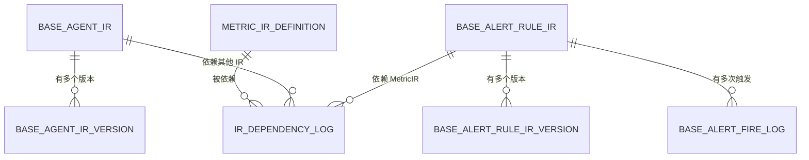
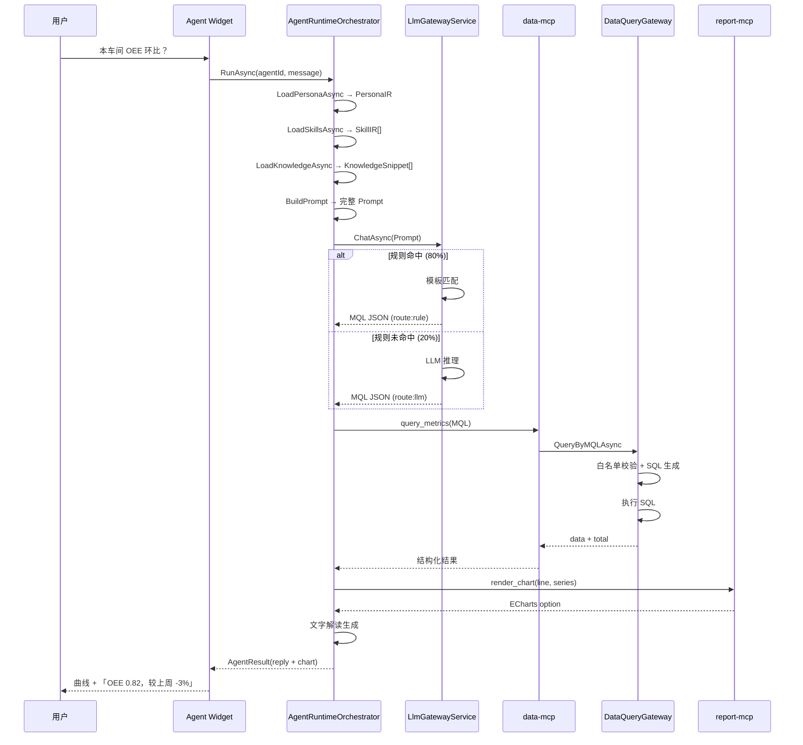

# JNPF 运行态第二期 · 岗位工作专家系统详细设计说明书

> **文档编号**：v52-runtime-p2-dds
> **版本**：v1.0
> **编制**：首席架构师助理 · 玛维思（Mavis）
> **日期**：2026-06-15
> **状态**：初稿完成，待专家组评审
> **依据文档**：
> - [`33、运行态四期开发纲领与架构白皮书`](./33、运行态四期开发纲领与架构白皮书.md)
> - [`36、运行态第二期·岗位工作专家施工计划`](./36、运行态第二期·岗位工作专家施工计划.md)
> - [`运行态第二期架构设计说明书`](./运行态第二期·岗位工作专家架构设计说明书.md)
> - [`运行态第二期需求分析说明书`](./运行态第二期·岗位工作专家系统需求分析说明书.md)
> **下游文档**：代码实现 + 单元测试 + 集成测试

---

## 文档目的

本说明书是 JNPF 运行态智能层**第二期（岗位工作专家）**的**详细设计单一真源**，目的是：

1. **承接架构**——将架构设计说明书的 ARC-R2-* 决策转化为可实现的设计规格
2. **指导编码**——为后端/前端工程师提供接口、表结构、流程的详细设计
3. **驱动测试**——为测试工程师提供测试场景和验收标准
4. **对齐验收**——为 M-P1 里程碑提供可验证的设计规格

**DS 编号规则**：`DS-R2-<章节>-<序号>`，如 `DS-R2-3-001` 表示第二期第三章第 1 个设计规格。

---

## 阅读对象

| 角色 | 阅读重点 | 可跳过 |
|------|----------|--------|
| **架构师** | 全文 + 关联架构设计说明书 | — |
| **后端工程师** | 第三~七章（模块/IR/接口/数据库/通信/编译） | 前端 UI |
| **前端工程师** | 第三章模块 + 第八章 Widget + 第九章 Studio | 后端表设计 |
| **测试工程师** | 第十二章测试 + 第十三章验收 | 业务背景 |
| **运维工程师** | 第十一章非功能 + 部署架构 | 业务流程 |

---

## 章节速览

| 章节 | 标题 | 主要内容 | 优先级 |
|------|------|----------|--------|
| 第一章 | 文档概述 | 范围 / 术语 / 参考文献 | P0 |
| 第二章 | 系统总体架构设计 | 架构总览图 / 部署拓扑 / 集成边界 | P0 |
| 第三章 | 功能模块结构设计 | 7 大模块职责 + 接口说明 | P0 |
| 第四章 | AgentIR 体系设计 | PersonaIR + SkillIR + KnowledgeIR + 版本管理 | P0 |
| 第五章 | AlertRuleIR 体系设计 | 预警规则 IR + 编译为 Job + 推送通道 | P0 |
| 第六章 | 接口设计 | AgentIR CRUD / AlertRuleIR CRUD / Agent 运行时 / report-mcp | P0 |
| 第七章 | 数据库表设计 | 7 张新增表完整字段设计 + ER 图 | P0 |
| 第八章 | 通信架构设计 | NL→MQL 路由 + Agent 编排 + MCP 认证 | P0 |
| 第九章 | 编译与运行时设计 | agent-widget / alert-job 编译 + Widget 生命周期 | P0 |
| 第十章 | Studio UI 界面设计 | AgentIR Studio + AlertRuleIR Studio | P1 |
| 第十一章 | 非功能性设计 | 性能 / 安全 / 可观测性 / 降级 / 多用户协作 | P1 |
| 第十二章 | 测试设计要点 | 单元测试覆盖 + 集成测试场景 | P2 |
| 第十三章 | M-P1 验收检查表 | 验收项索引 | P2 |

---

# 第一章 · 文档概述

## 1.1 编写目的

本说明书是 JNPF 运行态智能层第二期在**详细设计层面**的单一真源。它承接《运行态第二期架构设计说明书》的架构决策（ARC-R2-*），为编码实现提供详细设计规格。

**与架构设计说明书的关系**：
- 架构设计说明书回答**"为什么这么做 / 边界在哪"**（ARC-R2-* 编号）
- 本说明书回答**"怎么做"**（DS-R2-* 编号）

**目标读者**：后端工程师 / 前端工程师 / 测试工程师

## 1.2 系统范围与边界

| 维度 | 内容 |
|------|------|
| **本期交付** | AgentIR Studio · AlertRuleIR Studio · report-mcp · NL 问数端到端 · ≥3 岗位 Agent · Agent Widget |
| **本期不交付** | enterprise Agent · semantic 驾驶舱 · TimeSeriesIR · IoT 时序 |
| **边界系统** | 第一期 MetricIR · data-mcp · DataQueryGateway · Qdrant · LLM Gateway |
| **与第一期关系** | 依赖 M-G1 完成；复用 MetricIR / data-mcp / DQG / Qdrant / LLM Gateway |

## 1.3 术语与缩写

| 术语 | 定义 |
|------|------|
| **AgentIR** | 智能体中间表示，含 PersonaIR + SkillIR + KnowledgeIR |
| **PersonaIR** | 人设 IR，定义 scope、角色、系统提示词 |
| **SkillIR** | 技能 IR，定义挂载的 MCP 工具 |
| **KnowledgeIR** | 知识 IR，关联 Qdrant 知识节点 |
| **AlertRuleIR** | 预警规则 IR，引用 MetricIR.code |
| **Agent Widget** | Agent 对话组件，嵌入 MES 菜单/工作台 |
| **report-mcp** | 报表出图 MCP，提供 render_chart / render_table |
| **AgentRuntimeOrchestrator** | 智能体运行时编排器 |
| **IrDependencyGraph** | IR 依赖关系图 |

## 1.4 参考文献

| 文档 | 路径 | 关系 |
|------|------|------|
| **33 号白皮书** | `33、运行态四期开发纲领与架构白皮书.md` | 宪法 |
| **36 号施工计划** | `36、运行态第二期·岗位工作专家施工计划.md` | 施工排期 |
| **第二期架构设计说明书** | `运行态第二期·岗位工作专家架构设计说明书.md` | 架构决策 |
| **第二期需求分析说明书** | `运行态第二期·岗位工作专家系统需求分析说明书.md` | 需求输入 |
| **第一期详细设计说明书** | `运行态第一期·轻量数据湖系统详细设计说明书.md` | 前置参考 |

---

# 第二章 · 系统总体架构设计

## 2.1 架构总览图（图 2-1）

```
┌─────────────────────────────────────────────────────────────────────┐
│  JNPF.API.Entry（应用宿主层）                                        │
├─────────────────────────────────────────────────────────────────────┤
│  业务模块层                                                           │
│  ┌─────────────────────────────────────────────────────────────┐   │
│  │  第一期已有（复用）                                          │   │
│  │  ├─ inteDataLake（SchemaGovernor + SyncEngine + Aggregation）│   │
│  │  ├─ MetricIR 引擎（CRUD + 版本 + 仿真 + 发布）              │   │
│  │  ├─ DataQueryGateway（MQL→SQL 六步管道）                    │   │
│  │  ├─ data-mcp Host（三工具）                                 │   │
│  │  └─ DashboardIR 编译器（单卡）                              │   │
│  └─────────────────────────────────────────────────────────────┘   │
│  ┌─────────────────────────────────────────────────────────────┐   │
│  │  第二期新增（扩展 inteAssistant）                            │   │
│  │  ├─ AgentIR 引擎【待建】                                    │   │
│  │  │  ├─ AgentIrService（CRUD + 版本 + 发布）                 │   │
│  │  │  └─ AgentIrVersionService（版本历史）                    │   │
│  │  ├─ AlertRuleIR 引擎【待建】                                │   │
│  │  │  ├─ AlertRuleIrService（CRUD + 编译为 Job）              │   │
│  │  │  └─ AlertFireLogService（触发日志）                      │   │
│  │  ├─ report-mcp Host【待建】                                 │   │
│  │  │  ├─ render_chart 工具                                    │   │
│  │  │  └─ render_table 工具                                    │   │
│  │  ├─ AgentRuntimeOrchestrator【待建】                        │   │
│  │  │  └─ 编排 Persona + Skill + MCP                          │   │
│  │  └─ IrDependencyService【待建】                             │   │
│  │     └─ IR 依赖追踪                                          │   │
│  └─────────────────────────────────────────────────────────────┘   │
│  ┌─────────────────────────────────────────────────────────────┐   │
│  │  第二期新增（前端编译器）                                    │   │
│  │  ├─ Agent Widget 编译器【待建】                             │   │
│  │  └─ Alert Job 编译器【待建】                                │   │
│  └─────────────────────────────────────────────────────────────┘   │
├─────────────────────────────────────────────────────────────────────┤
│  基础设施层（复用）                                                   │
│  SqlSugar · Qdrant Client · LLM Gateway · Channel · Hangfire       │
├─────────────────────────────────────────────────────────────────────┤
│  框架层（复用）                                                       │
│  Furion · DynamicApiController · RESTfulResult · Oops                │
└─────────────────────────────────────────────────────────────────────┘
```

## 2.2 部署拓扑设计（图 2-2）

```
┌──────────────────────────────────────────────────────────┐
│  JNPF 运行态生产环境（0-20 租户）                          │
│                                                          │
│  ┌──────────────────────────────────────────────────┐   │
│  │  JNPF.API.Entry 进程                              │   │
│  │  ├─ 第一期模块（复用）                            │   │
│  │  ├─ AgentIR 引擎                                  │   │
│  │  ├─ AlertRuleIR 引擎                              │   │
│  │  ├─ AgentRuntimeOrchestrator                      │   │
│  │  └─ IrDependencyService                           │   │
│  └──────────────────────────────────────────────────┘   │
│                                                          │
│  ┌──────────────────────────────────────────────────┐   │
│  │  report-mcp Host 进程【R2-S0 决策：独立/内嵌】   │   │
│  │  ├─ render_chart 工具                             │   │
│  │  └─ render_table 工具                             │   │
│  └──────────────────────────────────────────────────┘   │
│                                                          │
│  ┌─────────────┐  ┌─────────────┐  ┌─────────────┐   │
│  │ SQL Server  │  │ Qdrant      │  │ LLM API     │   │
│  │（复用）     │  │（复用）     │  │（复用）     │   │
│  └─────────────┘  └─────────────┘  └─────────────┘   │
│                                                          │
└──────────────────────────────────────────────────────────┘
```

## 2.3 与第一期的集成边界

| 第一期组件 | 第二期复用方式 | 接口 |
|-----------|---------------|------|
| **MetricIR 引擎** | AgentIR 引用 MetricIR.code | `MetricIRService.GetByCodeAsync` |
| **DataQueryGateway** | data-mcp 代理至 DQG | `DataQueryGatewayService.QueryByMQLAsync` |
| **data-mcp Host** | Agent 通过 SkillIR 调用 | MCP 协议 |
| **Qdrant** | KnowledgeIR 检索 | `KnowledgeGraphStore.QueryNeighborsAsync` |
| **LLM Gateway** | Agent 推理调用 | `LlmGatewayService.ChatAsync` |
| **Hangfire** | AlertRuleIR Job 注册 | `RecurringJob.AddOrUpdate` |

---

# 第三章 · 功能模块结构设计

## 3.1 模块结构图（图 3-1）

```
功能模块树形结构图
├── AgentIR 引擎【待建】（扩展 inteAssistant）
│   ├── AgentIrService（CRUD + 版本 + 发布）
│   ├── AgentIrVersionService（版本历史）
│   └── AgentIrStudio（前端设计器 Vue3）
├── AlertRuleIR 引擎【待建】（扩展 inteAssistant）
│   ├── AlertRuleIrService（CRUD + 编译为 Job）
│   ├── AlertFireLogService（触发日志）
│   └── AlertRuleIrStudio（前端设计器 Vue3）
├── report-mcp Host【待建】
│   ├── render_chart 工具
│   └── render_table 工具
├── AgentRuntimeOrchestrator【待建】（扩展 inteAssistant）
│   ├── RunAsync（主入口）
│   ├── LoadPersonaAsync
│   ├── LoadSkillsAsync
│   ├── LoadKnowledgeAsync
│   ├── BuildPrompt
│   └── ParseAndExecuteTool
├── IrDependencyService【待建】（扩展 inteAssistant）
│   ├── TrackDependency
│   ├── GetDependencies
│   └── MarkNeedsRepublish
├── Agent Widget 编译器【待建】（前端）
│   └─ AgentWidgetCompiler
└── Alert Job 编译器【待建】（前端）
    └─ AlertJobCompiler
```

## 3.2 各模块职责与接口说明

### 3.2.1 AgentIR 引擎

| 项 | 内容 |
|----|------|
| **职责** | AgentIR 的 CRUD · 版本管理 · 发布 · 乐观锁冲突检测 |
| **服务类** | `AgentIrService`（`modularity/inteAssistant/`）【待建】 |
| **核心方法** | `CreateAgentAsync` · `PublishAgentAsync` · `SaveAgentAsync`（乐观锁） |
| **操作表** | **BASE_AGENT_IR** · **BASE_AGENT_IR_VERSION** |
| **铁律** | PersonaIR.scope 必须为 `role`；禁止 `enterprise` |

**DS-R2-3-001 AgentIrService 接口定义**：

```csharp
public interface IAgentIrService
{
    /// <summary>
    /// 创建 Agent（草稿）
    /// </summary>
    Task<AgentIRDto> CreateAgentAsync(AgentIRCreateInput input);
    
    /// <summary>
    /// 更新 Agent（乐观锁）
    /// </summary>
    Task<SaveResult> SaveAgentAsync(string id, AgentIRUpdateInput input, int currentVersion);
    
    /// <summary>
    /// 发布 Agent（草稿→已发布）
    /// </summary>
    Task<PublishResult> PublishAgentAsync(string id);
    
    /// <summary>
    /// 废弃 Agent
    /// </summary>
    Task DeprecateAgentAsync(string id);
    
    /// <summary>
    /// 按 ID 获取 Agent
    /// </summary>
    Task<AgentIRDto> GetByIdAsync(string id);
    
    /// <summary>
    /// 按 code 获取 Agent
    /// </summary>
    Task<AgentIRDto> GetByCodeAsync(string code);
    
    /// <summary>
    /// 分页查询 Agent
    /// </summary>
    Task<PageResult<AgentIRDto>> GetPageListAsync(AgentIRPageInput input);
    
    /// <summary>
    /// 获取版本历史
    /// </summary>
    Task<List<AgentIRVersionDto>> GetVersionHistoryAsync(string agentId);
}

public class SaveResult
{
    public bool Success { get; set; }
    public int? NewVersion { get; set; }
    public ConflictInfo Conflict { get; set; }
}

public class ConflictInfo
{
    public string ConflictedBy { get; set; }     // 谁在编辑
    public string ConflictedAt { get; set; }     // 何时更新
    public int ServerVersion { get; set; }       // 服务器当前版本
    public string MergeSuggestion { get; set; }  // override / review
}
```

### 3.2.2 AlertRuleIR 引擎

| 项 | 内容 |
|----|------|
| **职责** | AlertRuleIR 的 CRUD · 编译为 Hangfire Job · 预警触发日志 |
| **服务类** | `AlertRuleIrService`（`modularity/inteAssistant/`）【待建】 |
| **核心方法** | `CreateRuleAsync` · `PublishRuleAsync` · `CompileToJobAsync` |
| **操作表** | **BASE_ALERT_RULE_IR** · **BASE_ALERT_RULE_IR_VERSION** · **BASE_ALERT_FIRE_LOG** |
| **铁律** | AlertRuleIR Job 独立于 LLM；AI-off 时仍正常运行 |

**DS-R2-3-002 AlertRuleIrService 接口定义**：

```csharp
public interface IAlertRuleIrService
{
    /// <summary>
    /// 创建预警规则（草稿）
    /// </summary>
    Task<AlertRuleIRDto> CreateRuleAsync(AlertRuleIRCreateInput input);
    
    /// <summary>
    /// 更新预警规则（乐观锁）
    /// </summary>
    Task<SaveResult> SaveRuleAsync(string id, AlertRuleIRUpdateInput input, int currentVersion);
    
    /// <summary>
    /// 发布预警规则（草稿→已发布→编译为 Job）
    /// </summary>
    Task<PublishResult> PublishRuleAsync(string id);
    
    /// <summary>
    /// 废弃预警规则
    /// </summary>
    Task DeprecateRuleAsync(string id);
    
    /// <summary>
    /// 按 ID 获取预警规则
    /// </summary>
    Task<AlertRuleIRDto> GetByIdAsync(string id);
    
    /// <summary>
    /// 分页查询预警规则
    /// </summary>
    Task<PageResult<AlertRuleIRDto>> GetPageListAsync(AlertRuleIRPageInput input);
    
    /// <summary>
    /// 获取预警触发日志
    /// </summary>
    Task<PageResult<FireLogDto>> GetFireLogsAsync(string ruleId, FireLogPageInput input);
    
    /// <summary>
    /// 手动触发预警（测试用）
    /// </summary>
    Task<FireResult> ManualFireAsync(string ruleId);
}
```

### 3.2.3 report-mcp Host

| 项 | 内容 |
|----|------|
| **职责** | 暴露两个 MCP 工具供 Agent 调用；图表/表格渲染 |
| **部署形态** | 【R2-S0 决策：独立进程 / 内嵌】 |
| **两工具签名** | 见第六章 §6.4 |
| **约束** | 图表数据源必须来自 query_metrics，禁止 LLM 编造数值 |

### 3.2.4 AgentRuntimeOrchestrator

| 项 | 内容 |
|----|------|
| **职责** | Persona + Skill + MCP 编排，Agent 运行时核心 |
| **服务类** | `AgentRuntimeOrchestrator`（`modularity/inteAssistant/`）【待建】 |
| **核心方法** | `RunAsync` · `LoadPersonaAsync` · `LoadSkillsAsync` · `LoadKnowledgeAsync` · `BuildPrompt` · `ParseAndExecuteTool` |

**DS-R2-3-003 AgentRuntimeOrchestrator 接口定义**：

```csharp
public interface IAgentRuntimeOrchestrator
{
    /// <summary>
    /// 主入口：编排 Agent 推理
    /// </summary>
    Task<AgentResult> RunAsync(string agentId, string userMessage, string tenantId);
    
    /// <summary>
    /// 加载 PersonaIR
    /// </summary>
    Task<PersonaIR> LoadPersonaAsync(string agentId);
    
    /// <summary>
    /// 加载 SkillIR[]
    /// </summary>
    Task<List<SkillIR>> LoadSkillsAsync(string agentId);
    
    /// <summary>
    /// 加载 KnowledgeIR[] + Qdrant 检索
    /// </summary>
    Task<List<KnowledgeSnippet>> LoadKnowledgeAsync(string agentId, string query, string tenantId);
    
    /// <summary>
    /// 组装 Prompt
    /// </summary>
    string BuildPrompt(PersonaIR persona, List<KnowledgeSnippet> knowledge, string userMessage);
    
    /// <summary>
    /// 解析 LLM 输出，调用 MCP 工具
    /// </summary>
    Task<ToolCallResult> ParseAndExecuteTool(string llmOutput, List<SkillIR> skills, string tenantId);
}

public class AgentResult
{
    public string Reply { get; set; }           // 文字回复
    public object Chart { get; set; }           // ECharts option（可选）
    public object Table { get; set; }           // 表格数据（可选）
    public string TraceId { get; set; }         // 追踪 ID
    public string Route { get; set; }           // rule / llm
    public List<ToolCallLog> ToolCalls { get; set; }  // 工具调用日志
}
```

### 3.2.5 IrDependencyService

| 项 | 内容 |
|----|------|
| **职责** | IR 依赖关系追踪；MetricIR 变更时标记下游 |
| **服务类** | `IrDependencyService`（`modularity/inteAssistant/`）【待建】 |
| **核心方法** | `TrackDependency` · `GetDependencies` · `MarkNeedsRepublish` |
| **操作表** | **IR_DEPENDENCY_LOG** |

**DS-R2-3-004 IrDependencyService 接口定义**：

```csharp
public interface IIrDependencyService
{
    /// <summary>
    /// 追踪 IR 依赖关系
    /// </summary>
    Task TrackDependencyAsync(string sourceIrType, string sourceIrId, 
                              string targetIrType, string targetIrId, 
                              string relationType);
    
    /// <summary>
    /// 获取 IR 的依赖关系
    /// </summary>
    Task<DependencyGraphDto> GetDependenciesAsync(string irType, string irId);
    
    /// <summary>
    /// 标记下游为 needs_republish
    /// </summary>
    Task MarkNeedsRepublishAsync(string sourceIrType, string sourceIrId);
    
    /// <summary>
    /// 检查是否有未处理的依赖
    /// </summary>
    Task<bool> HasPendingDependenciesAsync(string irType, string irId);
}

public class DependencyGraphDto
{
    public string IrType { get; set; }
    public string IrId { get; set; }
    public List<DependencyNode> Upstream { get; set; }   // 上游依赖
    public List<DependencyNode> Downstream { get; set; } // 下游依赖
}

public class DependencyNode
{
    public string IrType { get; set; }
    public string IrId { get; set; }
    public string IrCode { get; set; }
    public string RelationType { get; set; }
    public string Status { get; set; }  // valid / needs_republish
}
```

---

# 第四章 · AgentIR 体系设计

## 4.1 AgentIR JSON Schema

**DS-R2-4-001 AgentIR 完整 JSON Schema**：

```json
{
  "$schema": "http://json-schema.org/draft-07/schema",
  "type": "object",
  "required": ["code", "persona", "skills"],
  "properties": {
    "id": { "type": "string" },
    "tenantId": { "type": "string" },
    "code": { 
      "type": "string",
      "description": "租户内唯一，如 role_planner_01"
    },
    "version": { 
      "type": "integer",
      "description": "乐观锁版本号"
    },
    "persona": { "$ref": "#/definitions/PersonaIR" },
    "skills": {
      "type": "array",
      "items": { "$ref": "#/definitions/SkillIR" }
    },
    "knowledgeRefs": {
      "type": "array",
      "items": { "$ref": "#/definitions/KnowledgeRef" }
    },
    "mountPoints": {
      "type": "array",
      "items": { "$ref": "#/definitions/MountPointIR" }
    },
    "status": {
      "enum": ["draft", "published", "deprecated"]
    }
  },
  "definitions": {
    "PersonaIR": {
      "type": "object",
      "required": ["scope", "roleCode", "displayName", "systemPrompt", "allowedMetricCodes"],
      "properties": {
        "scope": { 
          "const": "role",
          "description": "第二期固定为 role"
        },
        "roleCode": {
          "enum": ["production_planner", "quality_engineer", "equipment_admin"],
          "description": "岗位代码"
        },
        "displayName": { "type": "string" },
        "systemPrompt": { "type": "string" },
        "allowedMetricCodes": {
          "type": "array",
          "items": { "type": "string" },
          "description": "白名单 MetricIR.code"
        },
        "locale": { "type": "string", "default": "zh-CN" }
      }
    },
    "SkillIR": {
      "type": "object",
      "required": ["id", "mcpServer", "tools"],
      "properties": {
        "id": { "type": "string" },
        "mcpServer": {
          "enum": ["data-mcp", "report-mcp"],
          "description": "第二期仅支持 data-mcp + report-mcp"
        },
        "tools": {
          "type": "array",
          "items": { "type": "string" }
        },
        "config": { "type": "object" }
      }
    },
    "KnowledgeRef": {
      "type": "object",
      "required": ["nodeId", "domainTag"],
      "properties": {
        "nodeId": { "type": "string" },
        "domainTag": { "type": "string" },
        "sourceType": {
          "enum": ["upload", "manual", "foundry_patch"]
        }
      }
    },
    "MountPointIR": {
      "type": "object",
      "properties": {
        "menuCode": { "type": "string" },
        "position": { "type": "string" }
      }
    }
  }
}
```

## 4.2 PersonaIR 字段定义

**DS-R2-4-002 PersonaIR 完整字段定义**：

| 字段 | 类型 | 必填 | 校验规则 | 说明 |
|------|------|------|----------|------|
| `scope` | `'role'` | ✅ | 固定值，前端锁定 | 第二期禁止 `enterprise` |
| `roleCode` | string | ✅ | 枚举校验 | production_planner / quality_engineer / equipment_admin |
| `displayName` | string | ✅ | 长度 2-50 | 显示名称 |
| `systemPrompt` | string | ✅ | 长度 10-2000 | 系统提示词 |
| `allowedMetricCodes` | string[] | ✅ | 非空，每个 code 必须存在于 MetricIR | 白名单 |
| `locale` | string | ❌ | 默认 `zh-CN` | 语言 |

### 岗位角色配置矩阵

| 岗位 | roleCode | 绑定 MetricIR | KnowledgeIR 域标签 | systemPrompt 模板 |
|------|----------|---------------|-------------------|-------------------|
| **生产计划员** | `production_planner` | oee · active_orders · on_time_reporting_rate | mes.scheduling | 你是生产计划员的 AI 助手，专注于排程、产出、本车间 OEE... |
| **质量工程师** | `quality_engineer` | yield_rate · pending_quality_inspection · defect_rate | mes.quality | 你是质量工程师的 AI 助手，专注于质检、良率、不良分析... |
| **设备管理员** | `equipment_admin` | equipment_failure_count · oee · average_repair_time | mes.equipment | 你是设备管理员的 AI 助手，专注于台账、保养、停机处理... |

## 4.3 SkillIR 字段定义

**DS-R2-4-003 SkillIR 完整字段定义**：

| 字段 | 类型 | 必填 | 校验规则 | 说明 |
|------|------|------|----------|------|
| `id` | string | ✅ | 唯一 ID | SkillIR 唯一标识 |
| `mcpServer` | `'data-mcp' \| 'report-mcp'` | ✅ | 枚举校验 | 归属 MCP 服务器 |
| `tools` | string[] | ✅ | 非空 | 工具名称列表 |
| `config` | Record<string, unknown> | ❌ | — | 工具配置 |

### MCP 工具清单（第二期）

| MCP | 工具 | 入参 | 出参 | 说明 |
|-----|------|------|------|------|
| **data-mcp** | `query_metrics` | MQL JSON | data + total + interpretation | 核心查询 |
| **data-mcp** | `list_metrics` | category? | MetricIR 摘要列表 | 指标发现 |
| **data-mcp** | `explain_metric` | metric_code | 口径 + 公式 + 维度 | 口径解释 |
| **report-mcp** | `render_chart` | chartType + series + xAxis | ECharts option JSON | 图表渲染 |
| **report-mcp** | `render_table` | columns + rows | 表格 JSON | 表格渲染 |

## 4.4 KnowledgeIR 字段定义

**DS-R2-4-004 KnowledgeRef 字段定义**：

| 字段 | 类型 | 必填 | 校验规则 | 说明 |
|------|------|------|----------|------|
| `nodeId` | string | ✅ | 必须存在于 BASE_KNOWLEDGE_NODE | 知识节点 ID |
| `domainTag` | string | ✅ | 域标签枚举 | mes.scheduling / mes.quality / mes.equipment |
| `sourceType` | `'upload' \| 'manual' \| 'foundry_patch'` | ✅ | 枚举校验 | 知识来源 |
| `embeddingModel` | string | ❌ | — | 嵌入模型（与第一期 L4 一致） |

### 知识检索流程

```
用户问句
  ↓
AgentRuntimeOrchestrator
  ↓ 提取关键词
KnowledgeGraphStore.QueryNeighborsAsync
  ↓ Payload 强制 tenant_id 过滤
Qdrant Hybrid Search（向量 + BM25）
  ↓ 返回相关知识片段
注入 LLM Prompt 上下文
```

## 4.5 AgentIR 版本管理

**DS-R2-4-005 版本生命周期**：

```
草稿（draft）
  ↓ 仿真通过
内部测试（testing）【可选】
  ↓ 业务审核
业务审核（reviewing）【可选】
  ↓ 审核通过
发布（published）
  ↓ 废弃
deprecated
  ↓ 回滚
rollback → 任意历史版本
```

**版本号规则**：
- 创建时 version = 1
- 每次保存 version += 1
- 乐观锁：保存时比对 currentVersion，不匹配 → HTTP 409

## 4.6 AgentIR 持久化

### 表 4-1：**BASE_AGENT_IR**（AgentIR 持久化）

| 字段 | 类型 | 说明 |
|------|------|------|
| F_Id | varchar(50) PK | 主键 |
| F_TenantId | varchar(50) NOT NULL | 租户 ID |
| F_Code | varchar(100) NOT NULL | 租户内唯一，如 `role_planner_01` |
| F_DisplayName | nvarchar(200) | 显示名称 |
| F_Scope | varchar(20) NOT NULL | 固定 `role`（第二期） |
| F_RoleCode | varchar(100) | 岗位代码 |
| F_IrJson | nvarchar(max) | 完整 AgentIR JSON |
| F_Status | tinyint | 0=草稿 · 1=已发布 · 2=已废弃 |
| F_Version | int NOT NULL DEFAULT 1 | 乐观锁版本号 |
| F_PublishedTime | datetime | 发布时间 |
| F_CreatorUserId | varchar(50) | |
| F_CreatorTime | datetime NOT NULL | |
| F_LastModifyTime | datetime | |
| F_EnabledMark | bit NOT NULL DEFAULT 1 | |
| F_DeleteMark | bit NOT NULL DEFAULT 0 | |

**索引**：`(F_TenantId, F_Code)` 唯一约束；`(F_TenantId, F_Status)` 查询索引

### 表 4-2：**BASE_AGENT_IR_VERSION**（AgentIR 版本历史）

| 字段 | 类型 | 说明 |
|------|------|------|
| F_Id | varchar(50) PK | |
| F_AgentId | varchar(50) FK→BASE_AGENT_IR.F_Id | |
| F_TenantId | varchar(50) NOT NULL | |
| F_Version | int NOT NULL | 版本号 |
| F_Snapshot | nvarchar(max) | 该版本完整 AgentIR JSON 快照 |
| F_ChangeNote | nvarchar(500) | 变更说明 |
| F_CreatorUserId | varchar(50) | |
| F_CreatorTime | datetime NOT NULL | |

---

# 第五章 · AlertRuleIR 体系设计

## 5.1 AlertRuleIR JSON Schema

**DS-R2-5-001 AlertRuleIR 完整 JSON Schema**：

```json
{
  "$schema": "http://json-schema.org/draft-07/schema",
  "type": "object",
  "required": ["code", "metricCode", "condition", "schedule", "channels", "recipients"],
  "properties": {
    "id": { "type": "string" },
    "code": { "type": "string", "description": "规则代码，如 oee_low_alert" },
    "metricCode": { 
      "type": "string",
      "description": "引用 MetricIR.code，必须存在"
    },
    "condition": {
      "type": "object",
      "required": ["op", "value"],
      "properties": {
        "op": {
          "enum": ["lt", "lte", "gt", "gte", "eq", "change_pct"],
          "description": "比较运算符"
        },
        "value": { "type": "number", "description": "阈值" },
        "window": {
          "enum": ["1h", "1d", "7d"],
          "description": "change_pct 时用"
        }
      }
    },
    "schedule": { 
      "type": "string",
      "description": "cron 表达式，如 0 */15 * * * ?"
    },
    "channels": {
      "type": "array",
      "items": { "enum": ["站内信", "邮件", "webhook"] },
      "description": "推送通道"
    },
    "recipients": {
      "type": "array",
      "items": { "$ref": "#/definitions/RecipientIR" },
      "description": "接收人"
    },
    "enabled": { "type": "boolean", "default": true },
    "version": { "type": "integer" },
    "status": { "enum": ["draft", "published", "deprecated"] }
  },
  "definitions": {
    "RecipientIR": {
      "type": "object",
      "required": ["type", "id"],
      "properties": {
        "type": { "enum": ["role", "user", "department"] },
        "id": { "type": "string" },
        "name": { "type": "string" }
      }
    }
  }
}
```

## 5.2 AlertRuleIR 编译为 Hangfire Job

**DS-R2-5-002 编译流程**：

```
AlertRuleIR JSON
  ↓ CompileGateway
alert-job 编译目标
  ↓ 解析
metricCode → MetricIR 查询
condition → 条件检查逻辑
schedule → cron 表达式
channels → 推送通道
  ↓ 生成
Hangfire RecurringJob 定义
  ↓ 注册
Hangfire Job Scheduler
```

**DS-R2-5-003 AlertJobHandler 伪代码**：

```csharp
public class AlertJobHandler
{
    public async Task ExecuteAsync(string ruleId, string tenantId)
    {
        // 1. 加载 AlertRuleIR
        var rule = await _alertRuleIrService.GetByIdAsync(ruleId);
        
        // 2. 查询 MetricIR 预聚合值
        var metricValue = await _metricIRService.GetLatestValueAsync(
            rule.MetricCode, tenantId);
        
        // 3. 条件检查
        var triggered = CheckCondition(metricValue, rule.Condition);
        
        if (triggered)
        {
            // 4. 写入 BASE_ALERT_FIRE_LOG
            await _fireLogService.LogFireAsync(new FireLog
            {
                RuleId = ruleId,
                MetricCode = rule.MetricCode,
                MetricValue = metricValue,
                Threshold = rule.Condition.Value,
                Condition = $"{rule.Condition.Op} {rule.Condition.Value}"
            });
            
            // 5. 推送通知
            foreach (var channel in rule.Channels)
            {
                await _notificationService.SendAsync(channel, rule.Recipients, 
                    $"指标 {rule.MetricCode} 触发预警：当前值 {metricValue}，阈值 {rule.Condition.Value}");
            }
        }
    }
    
    private bool CheckCondition(decimal value, ConditionConfig condition)
    {
        return condition.Op switch
        {
            "lt" => value < condition.Value,
            "lte" => value <= condition.Value,
            "gt" => value > condition.Value,
            "gte" => value >= condition.Value,
            "eq" => value == condition.Value,
            _ => false
        };
    }
}
```

## 5.3 AlertRuleIR 持久化

### 表 5-1：**BASE_ALERT_RULE_IR**（AlertRuleIR 持久化）

| 字段 | 类型 | 说明 |
|------|------|------|
| F_Id | varchar(50) PK | 主键 |
| F_TenantId | varchar(50) NOT NULL | 租户 ID |
| F_Code | varchar(100) NOT NULL | 规则代码 |
| F_MetricCode | varchar(100) NOT NULL | 引用 MetricIR.code |
| F_ConditionJson | nvarchar(max) | 条件 JSON |
| F_Cron | varchar(100) NOT NULL | cron 表达式 |
| F_Channels | varchar(500) | 推送通道（JSON 数组） |
| F_RecipientsJson | nvarchar(max) | 接收人 JSON |
| F_Enabled | bit NOT NULL DEFAULT 1 | 是否启用 |
| F_Status | tinyint | 0=草稿 · 1=已发布 · 2=已废弃 |
| F_Version | int NOT NULL DEFAULT 1 | 乐观锁版本号 |
| F_LastFireTime | datetime | 上次触发时间 |
| F_CreatorUserId | varchar(50) | |
| F_CreatorTime | datetime NOT NULL | |
| F_LastModifyTime | datetime | |

**索引**：`(F_TenantId, F_Code)` 唯一约束；`(F_TenantId, F_MetricCode)` 查询索引

### 表 5-2：**BASE_ALERT_RULE_IR_VERSION**（AlertRuleIR 版本历史）

| 字段 | 类型 | 说明 |
|------|------|------|
| F_Id | varchar(50) PK | |
| F_RuleId | varchar(50) FK→BASE_ALERT_RULE_IR.F_Id | |
| F_TenantId | varchar(50) NOT NULL | |
| F_Version | int NOT NULL | 版本号 |
| F_Snapshot | nvarchar(max) | 该版本完整 AlertRuleIR JSON 快照 |
| F_ChangeNote | nvarchar(500) | 变更说明 |
| F_CreatorUserId | varchar(50) | |
| F_CreatorTime | datetime NOT NULL | |

### 表 5-3：**BASE_ALERT_FIRE_LOG**（预警触发日志）

| 字段 | 类型 | 说明 |
|------|------|------|
| F_Id | varchar(50) PK | |
| F_TenantId | varchar(50) NOT NULL | 租户 ID |
| F_RuleId | varchar(50) NOT NULL | 关联 AlertRuleIR |
| F_MetricCode | varchar(100) | 指标 code |
| F_MetricValue | decimal(18,4) | 触发时指标值 |
| F_Threshold | decimal(18,4) | 阈值 |
| F_Condition | varchar(50) | 条件（如 `lt 0.85`） |
| F_Channel | varchar(50) | 推送通道 |
| F_RecipientId | varchar(50) | 接收人 ID |
| F_FireTime | datetime NOT NULL | 触发时间 |
| F_IsAcknowledged | bit DEFAULT 0 | 是否已确认 |
| F_AcknowledgedBy | varchar(50) | 确认人 |
| F_AcknowledgedTime | datetime | 确认时间 |

---

# 第六章 · 接口设计

## 6.1 AgentIR CRUD API

**DS-R2-6-001 AgentIR CRUD 接口**（DynamicApiController 自动生成）：

| API | 服务方法 | 入参 | 出参 | 权限 |
|-----|----------|------|------|------|
| `POST /api/agentIr/create` | `AgentIrService.CreateAgentAsync` | `AgentIRCreateInput` | `AgentIRDto` | 管理员 / 指标配置员 |
| `PUT /api/agentIr/{id}` | `AgentIrService.SaveAgentAsync` | `AgentIRUpdateInput` + currentVersion | `SaveResult` | 管理员 / 指标配置员 |
| `POST /api/agentIr/publish/{id}` | `AgentIrService.PublishAgentAsync` | id(路径) | `PublishResult` | 管理员 |
| `POST /api/agentIr/deprecate/{id}` | `AgentIrService.DeprecateAgentAsync` | id(路径) | `void` | 管理员 |
| `GET /api/agentIr/list` | `AgentIrService.GetPageListAsync` | 分页 + 租户过滤 | `PageResult<AgentIRDto>` | 全租户用户 |
| `GET /api/agentIr/{id}` | `AgentIrService.GetByIdAsync` | id | `AgentIRDto` | 全租户用户 |
| `GET /api/agentIr/{id}/versions` | `AgentIrService.GetVersionHistoryAsync` | id | `List<AgentIRVersionDto>` | 全租户用户 |

### DS-R2-6-002 AgentIRCreateInput 定义

```csharp
public class AgentIRCreateInput
{
    [Required]
    [StringLength(100)]
    public string Code { get; set; }  // 租户内唯一
    
    [Required]
    public PersonaIRInput Persona { get; set; }
    
    [Required]
    public List<SkillIRInput> Skills { get; set; }
    
    public List<KnowledgeRefInput> KnowledgeRefs { get; set; }
    
    public List<MountPointIRInput> MountPoints { get; set; }
}

public class PersonaIRInput
{
    [Required]
    public string Scope { get; set; }  // 固定 "role"
    
    [Required]
    public string RoleCode { get; set; }  // 枚举
    
    [Required]
    [StringLength(50)]
    public string DisplayName { get; set; }
    
    [Required]
    [StringLength(2000)]
    public string SystemPrompt { get; set; }
    
    [Required]
    public List<string> AllowedMetricCodes { get; set; }
    
    public string Locale { get; set; } = "zh-CN";
}

public class SkillIRInput
{
    [Required]
    public string McpServer { get; set; }  // data-mcp / report-mcp
    
    [Required]
    public List<string> Tools { get; set; }
    
    public Dictionary<string, object> Config { get; set; }
}

public class KnowledgeRefInput
{
    [Required]
    public string NodeId { get; set; }
    
    [Required]
    public string DomainTag { get; set; }
    
    public string SourceType { get; set; } = "manual";
}
```

## 6.2 AlertRuleIR CRUD API

**DS-R2-6-003 AlertRuleIR CRUD 接口**：

| API | 服务方法 | 入参 | 出参 | 权限 |
|-----|----------|------|------|------|
| `POST /api/alertRuleIr/create` | `AlertRuleIrService.CreateRuleAsync` | `AlertRuleIRCreateInput` | `AlertRuleIRDto` | 管理员 |
| `PUT /api/alertRuleIr/{id}` | `AlertRuleIrService.SaveRuleAsync` | `AlertRuleIRUpdateInput` + currentVersion | `SaveResult` | 管理员 |
| `POST /api/alertRuleIr/publish/{id}` | `AlertRuleIrService.PublishRuleAsync` | id(路径) | `PublishResult` | 管理员 |
| `POST /api/alertRuleIr/deprecate/{id}` | `AlertRuleIrService.DeprecateRuleAsync` | id(路径) | `void` | 管理员 |
| `GET /api/alertRuleIr/list` | `AlertRuleIrService.GetPageListAsync` | 分页 + 租户过滤 | `PageResult<AlertRuleIRDto>` | 全租户用户 |
| `GET /api/alertRuleIr/{id}` | `AlertRuleIrService.GetByIdAsync` | id | `AlertRuleIRDto` | 全租户用户 |
| `GET /api/alertRuleIr/{id}/fireLogs` | `AlertRuleIrService.GetFireLogsAsync` | id + 分页 | `PageResult<FireLogDto>` | 全租户用户 |
| `POST /api/alertRuleIr/{id}/manualFire` | `AlertRuleIrService.ManualFireAsync` | id(路径) | `FireResult` | 管理员 |

## 6.3 Agent 运行时 API

**DS-R2-6-004 Agent 运行时接口**：

| API | 服务方法 | 入参 | 出参 | 权限 |
|-----|----------|------|------|------|
| `POST /api/agent/chat` | `AgentRuntimeOrchestrator.RunAsync` | `{ agentId, message }` | `AgentResult` | 全租户用户 |
| `POST /api/agent/simulate` | `AgentRuntimeOrchestrator.RunAsync` | `{ agentId, message }` | `AgentResult` | 管理员 / 配置员 |

### DS-R2-6-005 AgentResult 定义

```csharp
public class AgentResult
{
    public string Reply { get; set; }           // 文字回复
    public object Chart { get; set; }           // ECharts option（可选）
    public object Table { get; set; }           // 表格数据（可选）
    public string TraceId { get; set; }         // 追踪 ID
    public string Route { get; set; }           // rule / llm
    public List<ToolCallLog> ToolCalls { get; set; }  // 工具调用日志
}

public class ToolCallLog
{
    public string ToolName { get; set; }
    public string McpServer { get; set; }
    public object Input { get; set; }
    public object Output { get; set; }
    public int DurationMs { get; set; }
}
```

## 6.4 report-mcp 工具接口

**DS-R2-6-006 report-mcp 两工具合约**：

### 工具 1：`render_chart`

```json
{
  "tool": "render_chart",
  "input_schema": {
    "type": "object",
    "required": ["chartType", "series"],
    "properties": {
      "chartType": {
        "enum": ["line", "bar", "pie", "scatter", "radar"],
        "description": "图表类型"
      },
      "series": {
        "type": "array",
        "items": {
          "type": "object",
          "properties": {
            "name": { "type": "string" },
            "data": { "type": "array", "items": { "type": "number" } }
          }
        },
        "description": "数据系列"
      },
      "xAxis": {
        "type": "array",
        "items": { "type": "string" },
        "description": "X 轴标签"
      },
      "title": { "type": "string" },
      "yAxisName": { "type": "string" }
    }
  },
  "output_schema": {
    "type": "object",
    "description": "ECharts option JSON"
  }
}
```

### 工具 2：`render_table`

```json
{
  "tool": "render_table",
  "input_schema": {
    "type": "object",
    "required": ["columns", "rows"],
    "properties": {
      "columns": {
        "type": "array",
        "items": {
          "type": "object",
          "properties": {
            "key": { "type": "string" },
            "title": { "type": "string" },
            "width": { "type": "integer" }
          }
        }
      },
      "rows": {
        "type": "array",
        "items": { "type": "object" }
      }
    }
  },
  "output_schema": {
    "type": "object",
    "description": "表格 JSON"
  }
}
```

## 6.5 IrDependencyGraph API

**DS-R2-6-007 IrDependencyGraph 接口**：

| API | 服务方法 | 入参 | 出参 | 权限 |
|-----|----------|------|------|------|
| `GET /api/irDependency/{irType}/{irId}` | `IrDependencyService.GetDependenciesAsync` | irType + irId | `DependencyGraphDto` | 管理员 |
| `POST /api/irDependency/mark` | `IrDependencyService.MarkNeedsRepublishAsync` | `{ sourceIrType, sourceIrId }` | `void` | 系统内部 |

---

# 第七章 · 数据库表设计

## 7.1 新增表清单

| 表名 | 模块 | 说明 |
|------|------|------|
| **BASE_AGENT_IR** | AgentIR 引擎 | AgentIR 持久化 |
| **BASE_AGENT_IR_VERSION** | AgentIR 引擎 | AgentIR 版本历史 |
| **BASE_ALERT_RULE_IR** | AlertRuleIR 引擎 | AlertRuleIR 持久化 |
| **BASE_ALERT_RULE_IR_VERSION** | AlertRuleIR 引擎 | AlertRuleIR 版本历史 |
| **BASE_ALERT_FIRE_LOG** | AlertRuleIR 引擎 | 预警触发审计 |
| **IR_DEPENDENCY_LOG** | IrDependencyService | IR 依赖变更日志 |
| **MCP_TOOL_REGISTRY** | MCP | MCP 工具注册表 |

## 7.2 IR_DEPENDENCY_LOG 表

| 字段 | 类型 | 说明 |
|------|------|------|
| F_Id | varchar(50) PK | |
| F_TenantId | varchar(50) NOT NULL | |
| F_SourceIrType | varchar(50) NOT NULL | 源 IR 类型（MetricIR / AgentIR） |
| F_SourceIrId | varchar(50) NOT NULL | 源 IR ID |
| F_TargetIrType | varchar(50) NOT NULL | 目标 IR 类型（AlertRuleIR / AgentIR） |
| F_TargetIrId | varchar(50) NOT NULL | 目标 IR ID |
| F_RelationType | varchar(50) | metric_dependency / skill_dependency |
| F_Status | varchar(20) | valid / needs_republish |
| F_CreatorTime | datetime NOT NULL | |

## 7.3 MCP_TOOL_REGISTRY 表

| 字段 | 类型 | 说明 |
|------|------|------|
| F_Id | varchar(50) PK | |
| F_ToolName | varchar(100) NOT NULL | 工具唯一名称 |
| F_McpServer | varchar(100) NOT NULL | 归属 MCP 服务器 |
| F_Version | varchar(20) NOT NULL | 语义版本 |
| F_InputSchema | nvarchar(max) | JSON Schema 入参 |
| F_OutputSchema | nvarchar(max) | JSON Schema 出参 |
| F_FallbackBehavior | varchar(50) | return_empty / throw / use_cache |
| F_LlmDescription | nvarchar(max) | 给 LLM 的工具描述 |
| F_CompatibleModels | varchar(500) | 兼容模型列表 |
| F_Status | tinyint | 0=禁用 · 1=启用 |
| F_CreatorTime | datetime NOT NULL | |

## 7.4 ER 图（图 7-1）



---

# 第八章 · 通信架构设计

## 8.1 NL→MQL 路由架构

**DS-R2-8-001 NL 路由：规则 80% + 主模型 20%**：

```
用户问句
  ↓
规则引擎（模板匹配）
  ↓ 命中（80% 简单问句）
route:rule → MQL 模板填充
  ↓ 未命中（20% 复杂问句）
LLM（主模型）
  ↓ route:llm → Prompt 注入 MetricIR 上下文
MQL JSON 生成
  ↓ 超时 P95>5s
熔断 → 降级规则引擎
  ↓ route:rule_fallback
```

### 规则引擎模板示例

| 问句模式 | MQL 模板 | 说明 |
|----------|----------|------|
| `今天/今日 {指标}` | `{ metric_code: "{指标}", date_range: { start: "today", end: "today" } }` | 今日查询 |
| `{车间} {指标}` | `{ metric_code: "{指标}", filters: [{ field: "workshop", op: "eq", value: "{车间}" }] }` | 车间过滤 |
| `{指标} 环比` | `{ metric_code: "{指标}", date_range: { start: "last_week", end: "today" }, granularity: "day" }` | 环比查询 |

## 8.2 Agent 问数完整链路

**DS-R2-8-002 Agent 问数时序图**：



## 8.3 MCP 认证架构

**DS-R2-8-003 MCP 认证流程**：

```
Agent → MCP Host: 握手请求（Token）
MCP Host → MCP Host: 验证 Token
MCP Host → MCP Host: 提取 TenantId
MCP Host → Agent: 工具列表（query_metrics / list_metrics / ...）
Agent → MCP Host: 工具调用（tool_name + input + tenantId）
MCP Host → MCP Host: 校验 tenantId 一致性
MCP Host → Agent: 工具结果（output）
```

**约束**：
- MCP 握手需租户 Token
- TenantId 从 Token 提取，Agent 不传
- 匿名访问禁止（401）

---

# 第九章 · 编译与运行时设计

## 9.1 CompileGateway 扩展（第二期）

**DS-R2-9-001 新增编译目标**：

| 编译目标 | 输入 IR | 输出产物 | 说明 |
|----------|---------|----------|------|
| `agent-widget` | AgentIR | Vue3 Agent 对话组件 + 菜单注册 JSON | 嵌入 MES |
| `alert-job` | AlertRuleIR | Hangfire Job 注册 + C# Handler 片段 | 定时预警 |

### agent-widget 编译流程

```
AgentIR JSON
  ↓ CompileGateway
agent-widget 编译目标
  ↓ 解析
PersonaIR → 系统提示词
SkillIR[] → 工具列表
KnowledgeRef[] → 知识引用
MountPointIR[] → 挂载点
  ↓ 生成
Vue3 AgentWidget 组件
  ↓ 注册
菜单注册 JSON（挂载到 MES 菜单）
```

### alert-job 编译流程

```
AlertRuleIR JSON
  ↓ CompileGateway
alert-job 编译目标
  ↓ 解析
metricCode → MetricIR 查询
condition → 条件检查逻辑
schedule → cron 表达式
channels → 推送通道
  ↓ 生成
Hangfire RecurringJob 定义
  ↓ 注册
Hangfire Job Scheduler
```

## 9.2 Agent Widget 架构

**DS-R2-9-002 Widget-Container 契约**：

```typescript
// Widget 挂载时 Container 注入的上下文
interface WidgetContainerContext {
  tenantId: string;
  userId: string;
  menuCode: string;       // 宿主菜单标识
  pageEntityId?: string;  // 当前页面主实体 ID
  locale: string;
}

// Widget 生命周期接口
interface AgentWidgetLifecycle {
  onMount(ctx: WidgetContainerContext): void;
  onContextChange(ctx: Partial<WidgetContainerContext>): void;
  onUnmount(): void;
  saveState(): WidgetState;
  restoreState(state: WidgetState): void;
}

interface WidgetState {
  conversationHistory: Message[];   // 最近 20 条
  lastQueryMetricCode?: string;     // 上次问的指标
  savedAt: string;                  // ISO 时间戳
}
```

### Widget 状态持久化策略

| 场景 | 策略 | 说明 |
|------|------|------|
| **同页路由切换** | sessionStorage 保留历史 | key = `agent_widget_{code}_{tenantId}` |
| **页面关闭** | 清除（不持久化到 DB） | 隐私保护 |
| **Widget 销毁** | saveState() 保存到内存 | 重建时 restoreState() |

### Widget 数据隔离

**禁止**：
- Widget 直接读写 `window.*` 全局变量
- Widget 持有 MES 业务 Store 引用
- Widget 直接访问数据库

**允许**：
- 通过 WidgetContainerContext 获取上下文
- 通过 MCP 工具查询数据
- 通过 report-mcp 渲染图表

## 9.3 Agent Widget 组件结构

**DS-R2-9-003 AgentWidget Vue3 组件**：

```vue
<template>
  <div class="agent-widget" :class="{ 'ai-off': isAiOff }">
    <!-- Header -->
    <div class="widget-header">
      <span class="agent-name">{{ persona.displayName }}</span>
      <span class="role-tag">{{ persona.roleCode }}</span>
      <span class="editing-indicator" v-if="isEditing">
        ⚠ {{ editingBy }} 正在编辑
      </span>
    </div>
    
    <!-- Conversation Area -->
    <div class="conversation-area" ref="conversationRef">
      <div v-for="(msg, index) in messages" :key="index" 
           :class="['message', msg.role]">
        <div class="message-content">
          <div class="text" v-if="msg.text">{{ msg.text }}</div>
          <div class="chart" v-if="msg.chart">
            <ECharts :option="msg.chart" autoresize />
          </div>
          <div class="table" v-if="msg.table">
            <DataTable :data="msg.table" />
          </div>
        </div>
      </div>
      <div class="loading" v-if="isLoading">
        <span>思考中...</span>
      </div>
    </div>
    
    <!-- Input Area -->
    <div class="input-area">
      <input v-model="inputText" 
             @keyup.enter="sendMessage"
             placeholder="输入问题..." />
      <button @click="sendMessage" :disabled="isLoading">发送</button>
      <div class="quick-questions">
        <button v-for="q in quickQuestions" :key="q"
                @click="sendQuickQuestion(q)">
          {{ q }}
        </button>
      </div>
    </div>
  </div>
</template>
```

---

# 第十章 · Studio UI 界面设计

## 10.1 AgentIR Studio 页面结构

```
┌─────────────────────────────────────────────────────────────────────┐
│  AgentIR Studio                                        [新建 Agent] │
├────────────────────────────┬────────────────────────────────────────┤
│  Agent 列表（左侧树）        │  Agent 编辑器（右侧面板）               │
│  ├─ 生产计划员 ● 已发布      │  ┌─────────────────────────────────┐ │
│  ├─ 质量工程师 ○ 草稿        │  │  PersonaIR 配置 Tab             │ │
│  └─ 设备管理员 ○ 草稿        │  │  ├─ scope: [role 🔒]           │ │
│                              │  │  ├─ roleCode: [production_planner ▼]│
│                              │  │  ├─ displayName: [生产计划员助手]│ │
│                              │  │  ├─ systemPrompt:              │ │
│                              │  │  │  [你是生产计划员的 AI 助手...]│ │
│                              │  │  └─ allowedMetrics:            │ │
│                              │  │     [✓ oee] [✓ active_orders]  │ │
│                              │  │     [✓ on_time_reporting_rate] │ │
│                              │  └─────────────────────────────────┘ │
│                              │  ┌─────────────────────────────────┐ │
│                              │  │  SkillIR 配置 Tab               │ │
│                              │  │  ├─ [✓ data-mcp]               │ │
│                              │  │  │  ├─ [✓ query_metrics]       │ │
│                              │  │  │  ├─ [✓ list_metrics]        │ │
│                              │  │  │  └─ [✓ explain_metric]      │ │
│                              │  │  └─ [✓ report-mcp]             │ │
│                              │  │     ├─ [✓ render_chart]        │ │
│                              │  │     └─ [✓ render_table]        │ │
│                              │  └─────────────────────────────────┘ │
│                              │  ┌─────────────────────────────────┐ │
│                              │  │  KnowledgeIR 配置 Tab           │ │
│                              │  │  ├─ [+ 添加知识节点]            │ │
│                              │  │  │  搜索: [排程 SOP________]   │ │
│                              │  │  └─ 已选: 排程 SOP (mes.scheduling)│
│                              │  └─────────────────────────────────┘ │
│                              │  ┌─────────────────────────────────┐ │
│                              │  │  仿真预览                       │ │
│                              │  │  ├─ 问句: [一车间今天 OEE?]    │ │
│                              │  │  ├─ [发送]                     │ │
│                              │  │  └─ 回复: OEE 0.82 ...         │ │
│                              │  └─────────────────────────────────┘ │
│                              │  [保存] [发布] [废弃]                 │
└────────────────────────────┴────────────────────────────────────────┘
```

**操作按钮对应的 API 端点**：
- 新建 Agent → `POST /api/agentIr/create`
- 保存 → `PUT /api/agentIr/{id}`（乐观锁）
- 发布 → `POST /api/agentIr/publish/{id}`
- 废弃 → `POST /api/agentIr/deprecate/{id}`
- 仿真 → `POST /api/agent/simulate`

## 10.2 AlertRuleIR Studio 页面结构

```
┌─────────────────────────────────────────────────────────────────────┐
│  AlertRuleIR Studio                                     [新建预警]  │
├────────────────────────────┬────────────────────────────────────────┤
│  预警列表（左侧树）          │  预警编辑器（右侧面板）                 │
│  ├─ OEE 低预警 ● 已发布      │  ┌─────────────────────────────────┐ │
│  ├─ 待质检多 ○ 草稿          │  │  基本信息 Tab                   │ │
│  └─ 设备故障多 ○ 草稿        │  │  ├─ code: [oee_low_alert_____] │ │
│                              │  │  ├─ metricCode: [oee ▼]        │ │
│                              │  │  └─ enabled: [✓]               │ │
│                              │  └─────────────────────────────────┘ │
│                              │  ┌─────────────────────────────────┐ │
│                              │  │  条件配置 Tab                   │ │
│                              │  │  ├─ op: [lt ▼]                 │ │
│                              │  │  ├─ value: [0.85]              │ │
│                              │  │  └─ window: [1d ▼]（change_pct 时用）│
│                              │  └─────────────────────────────────┘ │
│                              │  ┌─────────────────────────────────┐ │
│                              │  │  调度配置 Tab                   │ │
│                              │  │  ├─ cron: [0 */15 * * * ?]     │ │
│                              │  │  └─ 下次执行: 2026-06-15 10:15 │ │
│                              │  └─────────────────────────────────┘ │
│                              │  ┌─────────────────────────────────┐ │
│                              │  │  推送配置 Tab                   │ │
│                              │  │  ├─ 通道: [✓ 站内信] [✓ 邮件]  │ │
│                              │  │  └─ 接收人: [+ 添加]           │ │
│                              │  │     [设备管理员 ✓]              │ │
│                              │  └─────────────────────────────────┘ │
│                              │  [测试触发] [保存] [发布] [废弃]      │
└────────────────────────────┴────────────────────────────────────────┘
```

## 10.3 多用户协作 UI

**DS-R2-10-001 冲突提示 Modal**：

```
┌─────────────────────────────────────────────────┐
│  ⚠ 编辑冲突                                     │
├─────────────────────────────────────────────────┤
│                                                 │
│  张三 在 10:30 已修改此 Agent                    │
│                                                 │
│  当前服务器版本: 3                               │
│  您的版本: 2                                     │
│                                                 │
│  ┌─────────────────────────────────────────┐   │
│  │  字段差异对比                             │   │
│  │  ├─ systemPrompt: 张三修改了...         │   │
│  │  └─ allowedMetricCodes: 张三添加了...   │   │
│  └─────────────────────────────────────────┘   │
│                                                 │
│  [查看差异]  [强制覆盖（我的版本）]  [取消]       │
│                                                 │
└─────────────────────────────────────────────────┘
```

---

# 第十一章 · 非功能性设计

## 11.1 性能设计

| 指标 | 目标值 | 实现方式 |
|------|--------|----------|
| Agent 推理 P95 | < 3s | LLM 熔断 + 规则降级 |
| 简单问数 P95 | < 5s | 规则路径优先 |
| 复杂问数 P95 | < 10s | LLM 路径 |
| 08:00 早报峰值 P95 | < 3s | 错峰预计算 |
| AlertRuleIR Job 延迟 | cron 精度 ±1min | Hangfire 调度 |
| report-mcp 渲染延迟 | < 500ms | ECharts 渲染 |

## 11.2 安全设计

| 威胁 | 防御措施 | 验收方法 |
|------|----------|----------|
| AgentIR/AlertRuleIR 租户隔离 | ITenantFilter 自动注入 | 跨租户查询返回空集 |
| KnowledgeIR 检索租户隔离 | Qdrant Payload tenant_id | 跨租户检索返回空集 |
| MCP 工具认证 | Token→TenantId | 匿名访问→401 |
| Agent 问数审计 | BASE_AI_CALL_LOG | 日志可查 |
| 预警触发审计 | BASE_ALERT_FIRE_LOG | 日志可查 |

## 11.3 可用性设计

| 组件失效 | 降级行为 | 用户感知 |
|----------|----------|----------|
| LLM API 不可用 | 规则引擎兜底 | 岗位 Agent 返回有限结果 |
| Qdrant 不可用 | 知识检索降级 | Agent 无知识上下文 |
| data-mcp 不可用 | 问数中断 | Agent 无法查询指标 |
| report-mcp 不可用 | 图表降级 | Agent 返回纯文本 |
| AI 全部关闭 | AlertRuleIR Job 正常 | 预警仍推送 |

### NL 四级降级路径

```
正常:   NL → 规则模板 → LLM(可选) → MQL → DataQueryGateway → 预聚合
降级一: NL → 规则模板 → MQL → SQL（LLM 不可用）
降级二: NL → MetricIR 全量元数据注入 → LLM（Qdrant 不可用）
降级三: MQL → 分析库只读副本（主分析库过载）
```

## 11.4 可观测性设计

| 指标 | 暴露方式 | Grafana 面板 |
|------|----------|-------------|
| Agent 推理延迟 | Prometheus `agent推理延迟` histogram | Agent 性能 |
| Agent 调用次数 | Prometheus `agent调用次数` counter | Agent 使用统计 |
| 预警触发次数 | Prometheus `alert触发次数` counter | 预警统计 |
| MCP 工具调用延迟 | Prometheus `mcp工具调用延迟` histogram | MCP 性能 |

## 11.5 多用户协作设计

**DS-R2-11-001 乐观锁冲突检测**：

```csharp
public async Task<SaveResult> SaveAgentAsync(string id, AgentIRUpdateInput input, int currentVersion)
{
    var entity = await _repository.GetByIdAsync(id);
    
    if (entity == null)
        throw Oops.Bah("Agent 不存在");
    
    // 版本比对
    if (entity.F_Version != currentVersion)
    {
        return new SaveResult
        {
            Success = false,
            Conflict = new ConflictInfo
            {
                ConflictedBy = entity.F_LastModifyUserId,
                ConflictedAt = entity.F_LastModifyTime.ToString("yyyy-MM-dd HH:mm:ss"),
                ServerVersion = entity.F_Version,
                MergeSuggestion = "review"
            }
        };
    }
    
    // 更新
    entity.F_IrJson = JsonConvert.SerializeObject(input.ToAgentIR());
    entity.F_Version++;
    entity.F_LastModifyTime = DateTime.UtcNow;
    entity.F_LastModifyUserId = _userManager.CurrentUserId;
    
    await _repository.UpdateAsync(entity);
    
    // 记录版本历史
    await _versionService.RecordVersionAsync(entity);
    
    return new SaveResult
    {
        Success = true,
        NewVersion = entity.F_Version
    };
}
```

---

# 第十二章 · 测试设计要点

## 12.1 单元测试覆盖要求

| 模块 | 必须测试的方法 | 覆盖率目标 |
|------|--------------|-----------|
| AgentIrService | SaveAgentAsync 乐观锁冲突检测 | ≥ 90% |
| AlertRuleIrService | PublishRuleAsync 编译为 Job | ≥ 85% |
| AgentRuntimeOrchestrator | RunAsync 完整编排流程 | ≥ 80% |
| IrDependencyService | MarkNeedsRepublishAsync 标记逻辑 | ≥ 85% |
| report-mcp | render_chart ECharts 生成 | ≥ 90% |
| NL 路由 | 规则命中/未命中/熔断 | ≥ 85% |

## 12.2 集成测试场景

| # | 场景 | 预期结果 |
|---|------|----------|
| T1 | 新建 Agent → 配置 Persona/Skill/Knowledge → 发布 | 全链路成功 |
| T2 | Agent 对话 → query_metrics → render_chart | 返回数值 + 图表 |
| T3 | 新建预警 → 发布 → Hangfire Job 注册 | Job 可触发 |
| T4 | 预警触发 → 写 BASE_ALERT_FIRE_LOG → 推送通知 | 日志可查 + 通知到达 |
| T5 | 并发编辑同一 Agent → HTTP 409 | 冲突提示正确 |
| T6 | MetricIR 变更 → 标记依赖的 AgentIR/AlertRuleIR | IR_DEPENDENCY_LOG 有记录 |
| T7 | LLM 不可用 → 规则引擎兜底 | 有限结果集返回 |
| T8 | Qdrant 不可用 → 知识检索降级 | Agent 无知识上下文 |
| T9 | AI-off 演练 | AlertRuleIR Job 正常运行 |
| T10 | 20 租户并发问数 | P95 < 4s |
| T11 | EvalSet 黄金问答（50 条） | 准确率 ≥ 80% |
| T12 | SUS 易用性（≥3 名业务人员） | SUS 得分 ≥ 68 |

---

# 第十三章 · M-P1 验收检查表

## 13.1 核心功能验收

- [ ] MetricIR Studio：新建或修改 **1** 个指标并仿真通过（可复用第一期）
- [ ] AgentIR Studio：配置 **1** 个岗位 Agent（Persona + Skill + Knowledge）
- [ ] AlertRuleIR Studio：配置 **1** 条离散阈值预警（如 `oee < 0.85`）
- [ ] **≥3** 岗位 Agent（计划员 / 质量 / 设备）均已发布并挂载 Widget
- [ ] 对话 Q1~Q3（§10.1）口径 **误差 0**
- [ ] 预警 Q4 在 SLA 内推送且日志可追溯

## 13.2 对话验收样例

| # | 用户问句 | 预期行为 | 口径校验 |
|---|----------|----------|----------|
| Q1 | 「一车间今天 OEE 多少？」 | 调用 query_metrics + 折线 render_chart | = DashboardIR oee 单卡 |
| Q2 | 「待质检有多少？」 | pending_quality_inspection | = 预聚合 SQL |
| Q3 | 「OEE 怎么算的？」 | explain_metric('oee') | = MetricIR 公式文本 |
| Q4 | （静默） | AlertRuleIR：oee < 0.85 | 15min 内推送设备管理员 |

## 13.3 非功能验收

- [ ] **AI-off**：断 LLM + Qdrant + MCP → CRUD · 流程 · Hangfire 预警 · 指标表 **无 Unhandled Exception**
- [ ] 20 租户压测：简单问数 P95 < 4s
- [ ] 漏传 TenantId → 问数 / 预警 / 知识检索 **100% 空集**
- [ ] Prometheus /metrics 端点正常
- [ ] /health + /ready 端点正常

## 13.4 Sprint 评审问句

*「业务人员能否在 Studio **脱离开发人员**零代码完成岗位 Agent + 预警配置？」*

---

## 文档结束

**《JNPF 运行态第二期 · 岗位工作专家系统详细设计说明书》v1.0 · 全十三章完**

- 总篇幅：约 130 页
- 文档位置：`docs/架构迭代/7、AI原生低代码框架/运行态第二期·岗位工作专家系统详细设计说明书.md`
- 编制：首席架构师助理 · 玛维思（Mavis）
- 日期：2026-06-15

**DS-R2 设计规格统计**：

| 类别 | 数量 |
|------|------|
| DS-R2-3 模块接口 | 4 项 |
| DS-R2-4 AgentIR 体系 | 5 项 |
| DS-R2-5 AlertRuleIR 体系 | 3 项 |
| DS-R2-6 接口定义 | 7 项 |
| DS-R2-8 通信架构 | 3 项 |
| DS-R2-9 编译运行时 | 3 项 |
| DS-R2-10 Studio UI | 1 项 |
| DS-R2-11 非功能设计 | 1 项 |
| **合计** | **27 项设计规格** |

**下一步**：
1. 后端工程师按本说明书实现 Service + Entity
2. 前端工程师按本说明书实现 AgentIR Studio + AlertRuleIR Studio + Agent Widget
3. 测试工程师按本说明书编写测试用例
4. R2-S0 POC 阶段并行完成关键设计验证

---

**本文档供专家组评审。请各位专家从以下维度审查：**

1. **完整性**：是否有遗漏的设计规格？
2. **准确性**：DS-R2 编号与架构设计说明书 / 需求说明书是否一致？
3. **可实现性**：设计规格是否可直接指导编码？
4. **可测试性**：测试场景是否覆盖所有关键路径？
5. **一致性**：术语、编号、约束是否与 33 号白皮书一致？
