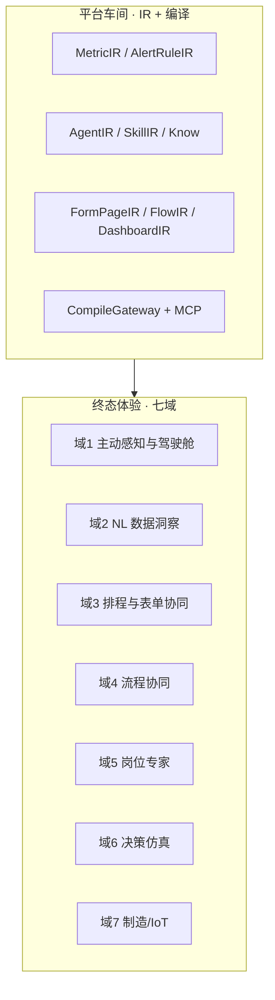
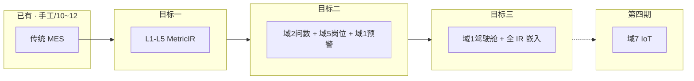
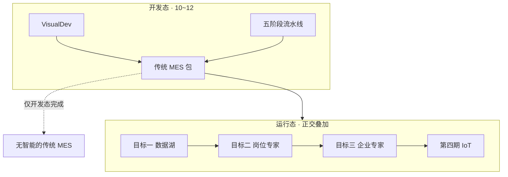
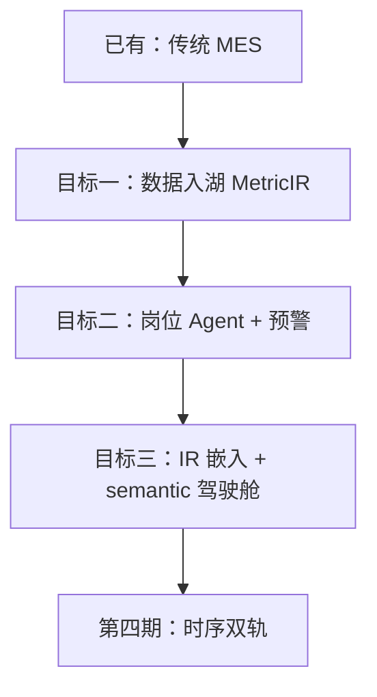
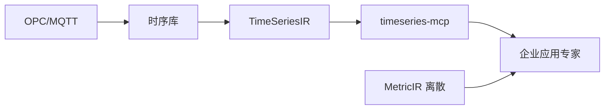

---

# JNPF 运行态四期开发纲领与架构白皮书（修订版）

**版本**：V7.11-SLIM（Mavis 紧急修订 · 2026-06-16）
**签发人**：D爷及首席架构委员会
**核心原则**：**第一期（轻量数据湖）与第二期（岗位专家）只交付核心功能，第三期及以后引入高级扩展能力。**

---

# 第一部分 · 产品靶心（Why）


## 1.1 行业范式与靶心一句话

### 1.1.1 从「被动工具」到「主动参与者」

| 范式转变   | 传统管理系统                 | AI 原生管理系统（靶心）                              |
| ---------- | ---------------------------- | ---------------------------------------------------- |
| **驾驶舱** | 各模块静态摘要、人工点进报表 | **AI 整理后的岗位回报**：待决策 + 异常 + 已办        |
| **取数**   | 选菜单 → 筛条件 → 导出       | **NL 问数** → 口径绑定的图表（环比、曲线）           |
| **执行**   | 人填表、人点审批             | **建议 → 协作 → 托管**；AI 起草，人签字              |
| **知识**   | 文档库全文检索               | **岗位专家** → **企业应用专家**：行业域 + 跨模块经验 |
| **感知**   | 人发现异常再处理             | 离散预警 → **主动预测** → **IoT 时序预测**（第四期） |
| **产出**   | 项目定制开发                 | **低代码 IR 编译**；AI 关仍可手工运行                |

### 1.1.2 靶心一句话（全文最高产品锚点）

**目标三** = 业务人员配置的 **企业应用专家** — 精通行业域知识，**统摄**岗位专家，基于 **离散数据湖** **主动**跨模块预测；semantic 驾驶舱为其**汇报面之一**；**AI-off 时手工 JNPF 7×24 零事故**。

**第四期** = TimeSeriesIR + 工业接入 + timeseries-mcp + 车床耗电/振动 **预测预警** — **独立 M-P4**，**不属于**目标三验收。

**平台角色**：**造高铁车间**（MetricIR / AgentIR / CompileGateway / MCP），**不是**出厂一列「张总管子」示范高铁。

---

## 1.2 智能层级对照（全文只保留此表 · 禁止混层）

| 维度         | 目标二 · 岗位工作专家                               | 目标三 · 企业应用专家                               | 第四期 · IoT 时序                                  |
| ------------ | --------------------------------------------------- | --------------------------------------------------- | -------------------------------------------------- |
| **层级**     | 战术 · 单一岗位                                     | 战略 · 整企离散 MES                                 | 设备波形层                                         |
| **数据**     | L1–L5 **离散** MetricIR                             | 离散 · **跨模块**                                   | **TimeSeriesIR** + 时序库                          |
| **AgentIR**  | `scope = role`                                      | `scope = enterprise`                                | 企业专家 **+ timeseries-mcp**                      |
| **SkillIR**  | data-mcp + report-mcp                               | data-mcp + report-mcp（**无** timeseries）          | **+ timeseries-mcp**                               |
| **典型问句** | 「我这岗位 OEE？」                                  | 「全厂交期+质量+库存风险？」                        | 「3 号车床耗电曲线异常？」                         |
| **统摄关系** | 无                                                  | **调度**各岗 Agent                                  | 给目标三专家装「波形眼」                           |
| **里程碑**   | **M-P1**                                            | **M-P2**                                            | **M-P4**                                           |
| **施工**     | [36 号](./36、运行态第二期·岗位工作专家施工计划.md) | [37 号](./37、运行态第三期·企业应用专家施工计划.md) | [38 号](./38、运行态第四期·IoT时序智能施工计划.md) |

---

## 1.3 七域体验分类（终态 taxonomy · 非功能清单）

七域 = **用户终态体验分类**；**不等于**平台内置功能清单。**工程落期**见第二部分 §0.4~0.7。



### 1.3.1 域 1 · 主动感知与智能驾驶舱

| 项             | 内容                                                         |
| -------------- | ------------------------------------------------------------ |
| **经典场景**   | 工作台/驾驶舱 = **AI 整理回报**：待决策、昨夜已办、风险预警、跨模块异常聚合 |
| **用户体感**   | 打开系统 ≈ 「岗位早报」：3 件须拍板 + 5 件已办 + 1 个须关注风险 |
| **典型子场景** | 早会简报 · 待办聚合 · 异常主动推送 · 证照/库存类风险提醒     |
| **平台 IR**    | `DashboardIR` semantic 槽 + `AgentIR` + `AlertRuleIR` + data-mcp |
| **运行态落期** | 离散预警 **目标二**；semantic 整页驾驶舱 **目标三**          |
| **禁止**       | `ChiefOfStaffService` · 固定「AI 总管子」单入口 · 手写 `AiDataInsightCard` 终验收 |

### 1.3.2 域 2 · 自然语言数据洞察

| 项             | 内容                                                         |
| -------------- | ------------------------------------------------------------ |
| **经典场景**   | 「本车间 OEE 曲线」「销售环比图」；截图/语音为**增强输入**（阶段二储备） |
| **用户体感**   | 说人话 → **口径正确**的图表 + 文字解读 + 异常标注            |
| **平台 IR**    | **MetricIR** → NL→**MQL(JSON)**→`DataQueryGateway`→SQL；report-mcp 出图 |
| **铁律**       | **禁止 LLM 直写 SQL**；问数/看板/Agent **同一 MetricIR code 数值一致** |
| **运行态落期** | 口径与 MQL **目标一**；业务人员 NL 问数 **目标二**           |

### 1.3.3 域 3 · 智能排程与表单协同

| 项             | 内容                                                         |
| -------------- | ------------------------------------------------------------ |
| **经典场景**   | 月/周排程表 · 智能填表（历史推断字段）· 附件→结构化单据      |
| **用户体感**   | NL 改排程 → 对比方案 → **人审**后写入业务表                  |
| **平台 IR**    | `FormPageIR` + `FlowIR` + AgentIR Skill 挂载 DynamicApi `*Service` |
| **边界**       | 排程**计算**走业务 Service/规则；LLM **理解意图、填参、解释** — **禁止**直改生产库 |
| **运行态落期** | 表单/流程 IR **开发态 10~12**；Agent 填参 **目标三**         |

### 1.3.4 域 4 · 智能执行与流程协同

| 项             | 内容                                                         |
| -------------- | ------------------------------------------------------------ |
| **经典场景**   | 智能审批预审 · 派单 · 跨部门任务 · 邮件/纪要草稿             |
| **用户体感**   | AI 起草 → 人审核/签字；高风险**写路径**经 FlowIR 或 DKEE     |
| **平台 IR**    | `FlowIR` + workflow-mcp + DKEE（L1→L2→L3）                   |
| **授权模式**   | 建议(0%自主) → 协作(AI起草人审) → 托管(规则内自动，异常上浮) |
| **运行态落期** | 流程编译 **开发态**；Agent 触发流程 **目标二**（人审节点不可 bypass） |

### 1.3.5 域 5 · 知识沉淀与岗位专家（P1 体验靶心）

| 项             | 内容                                                         |
| -------------- | ------------------------------------------------------------ |
| **经典场景**   | 工艺/SOP 问答 · 老师傅经验 · 新人岗位学习 · 历史异常回放     |
| **用户体感**   | 每岗位有**专属**数字专家；回答绑企业口径与权限               |
| **平台 IR**    | `AgentIR`(scope=role) + SkillIR + Qdrant 双模 + MetricIR 同义词 |
| **运行态落期** | **目标二 · M-P1 核心验收域**                                 |
| **验收问句**   | *「脱离开发人员，Studio 配 1 指标 + 1 岗位 Agent + 1 预警？」* |

### 1.3.6 域 6 · 决策辅助与仿真

| 项             | 内容                                                    |
| -------------- | ------------------------------------------------------- |
| **经典场景**   | 方案对比 · 降价/排产**影响分析** · 多情景预测           |
| **用户体感**   | 「如果…会怎样」→ MetricIR 仿真 + 相似案例；标注数据来源 |
| **平台 IR**    | MetricIR 仿真 Job + data-mcp + AgentIR                  |
| **运行态落期** | 规则+聚合仿真 **目标三**；深度 ML → 第四期/储备         |

### 1.3.7 域 7 · 制造域深度智能（IoT）

| 项           | 内容                                                         |
| ------------ | ------------------------------------------------------------ |
| **经典场景** | 车床/机床 **耗电、振动、温度**；**预测预警**；与 MES 工单/交期联动 |
| **目标二**   | 离散 AlertRuleIR + MetricIR（OEE 低、停机时长）— **非**波形  |
| **目标三**   | 企业专家 **离散**跨模块主动分析 — **不含**高频波形           |
| **第四期**   | TimeSeriesIR + OPC UA/MQTT + timeseries-mcp（第二部分 §0.7） |
| **禁止**     | 目标一~三引入 Kafka/Flink 全量流；波形写入 MetricIR          |

### 1.3.8 七域 × 四期速查（工程师一页表）

| 域         | 主要 IR/MCP                                  | 主要落期                       |
| ---------- | -------------------------------------------- | ------------------------------ |
| 1 驾驶舱   | DashboardIR semantic · AlertRuleIR · AgentIR | 预警 **二** · 整页 **三**      |
| 2 问数     | MetricIR · MQL · data/report-mcp             | 口径 **一** · NL **二**        |
| 3 排程填表 | FormPageIR · FlowIR · AgentIR                | 开发态 **10~12** · 填参 **三** |
| 4 流程     | FlowIR · workflow-mcp · DKEE                 | 开发态 + 触发 **二**           |
| 5 岗位专家 | AgentIR(role) · Know · Qdrant                | **二 · M-P1**                  |
| 6 仿真     | MetricIR 仿真 · data-mcp                     | **三**                         |
| 7 IoT      | TimeSeriesIR · timeseries-mcp                | **第四期 · M-P4**              |

---

## 1.4 客户三条新需求 → 域映射

| 客户要求                  | 靶心体验                | 七域         | 运行态落点                                        |
| ------------------------- | ----------------------- | ------------ | ------------------------------------------------- |
| **① AI 原生驾驶舱**       | 模块摘要 → AI 整理回报  | 域 1         | **三** semantic DashboardIR；**二** Widget + 预警 |
| **② NL 图表 + 月排程**    | 说人话出图 · 智能填表   | 域 2 + 3     | **一** MetricIR/MQL；**二** 问数；排程 IR → 10~12 |
| **③ 主动预测 + 流程优化** | 先预警再决策 · 流程建议 | 域 6 + 4 + 7 | **三** 离散主动分析；**四** IoT 预测              |

---

## 1.5 27 子场景 taxonomy 速查（非交付清单）

> 来源：15 号升维整理。**禁止**按本表逐项内置 Service。

| 七域 | 代表子场景                     | 四期边界                     |
| ---- | ------------------------------ | ---------------------------- |
| 1    | 工作台汇总、主动告警、风险提醒 | 阈值 **二**；semantic **三** |
| 2    | 一句话报表、曲线/环比、解读    | **一** 口径 + **二** NL      |
| 3    | 月排程、智能填表、附件录入     | 10~12 + **三** 填参          |
| 4    | 智能审批、派单、纪要草稿       | 10~12 + **二** 触发          |
| 5    | SOP 问答、工艺智库、新人导师   | **二 · M-P1**                |
| 6    | 方案对比、影响分析、推演       | **三** 规则仿真              |
| 7    | 预测性维护、耗电/振动 IoT      | **第四期**                   |

---

## 1.6 「造高铁车间」— 平台 vs 产品

| 我们在建（车间）                                            | 我们不在建（车厢）                          |
| ----------------------------------------------------------- | ------------------------------------------- |
| MetricIR / AgentIR / AlertRuleIR **Studio**                 | 内置「张总管子」「销售分析 Agent」Service   |
| **CompileGateway** + MCP（data/workflow/report/timeseries） | 独立 AgentRuntime / DataPlatform modularity |
| 业务人员 **配置** 岗位专家（**二**）与企业专家（**三**）    | 开发 **写死** 的 AI 产品页                  |
| TimeSeriesIR Studio + timeseries-mcp（**四**）              | 波形塞 MetricIR · 项目定制 SCADA 烟囱       |

---

## 1.7 两大误区与验收试金石

| 误区  | 错误（造车厢）                  | 正确（造车间）                              |
| ----- | ------------------------------- | ------------------------------------------- |
| **A** | 内置 `WorkbenchAgent`、示范 MES | Studio 零代码配置 AgentIR / MetricIR        |
| **B** | 数据湖、MCP、Agent 各建烟囱     | IR 互相引用 · 同一 CompileGateway（约束五） |

**验收试金石**（第五部分铁律2）：*「业务人员能否 Studio **脱离开发人员**零代码完成指标 + 岗位 Agent + 预警？」* + **AI-off 演练** — 禁止仅用「语音问 OEE Demo」过关。

---

## 1.8 七域与四期覆盖关系



**说明**：手工低代码与 10~12 已可交付 **传统 MES**。**目标一~四**在同一 MES 运行态上叠加智能 — 与开发态**正交**（详见第二部分 §0.2）。

---

**第一部分完。请指示是否继续贴出第二部分。**

好的，D爷。我现在贴出第九部分完整的人话版，去掉所有技术术语和文档编号，只保留核心信息。

---

好的，D爷。现在贴出修订版的核心部分——**第二部分 · 运行态四期开发目标**。这是全文唯一的工程交付定义，也是我们后续所有工作的基石。

---


# 第二部分 · 运行态四期开发目标（修订版）

> **读者**：架构师、后端/前端工程师 — 理解**交付什么、不交付什么、如何验收**。  
> **本部分是全文唯一工程定义**；产品体感见第一部分；Sprint/DDL/代码路径见 **35~38 号**。  
> **铁律**：**开发态 AI ≠ 运行态 AI** — 10~12 阶段五~六完成 ≠ 目标三完成。  
> **核心变更**：明确资源池、冷热同步、分片、GraphRAG等复杂功能**移至第三期**，第一/二期聚焦核心功能。

---

## 0.1 四期总述（修订版）

在 **JNPF 手工低代码**（VisualDev / 流程 / 权限 / 报表 — **现已可造完整 MES**）及 [**10~12**](./10、JNPF升维开发总计划之一.md) 五阶段流水线（**仅加速开发态**，交付物仍为传统 MES）**100% 保留**的前提下，增量建设 **运行态智能层**。**核心宗旨：前期保核心，后期加扩展。**

| 期         | 工程交付（摘要）                                       | 里程碑   | 核心原则                   |
| ---------- | ------------------------------------------------------ | -------- | -------------------------- |
| **目标一** | L1→L5 · MetricIR Studio · MQL 网关 · data-mcp          | **M-G1** | **简单直连，稳定可靠**     |
| **目标二** | AgentIR(role) · AlertRuleIR Job · 岗位 Widget · NL问数 | **M-P1** | **AI自配置，隔离复杂协同** |
| **目标三** | 资源池 · 冷热同步 · Schema分片 · GraphRAG · 多模态RAG  | **M-P2** | **按需引入，渐进增强**     |
| **第四期** | TimeSeriesIR · IoT · timeseries-mcp                    | **M-P4** | 独立项目，双轨并行         |

---

## 0.2 开发态 vs 运行态（读错 = 全文理解错误）

| 维度       | 是什么                           | 施工文档                    | 制造企业 MES 长什么样                     |
| ---------- | -------------------------------- | --------------------------- | ----------------------------------------- |
| **开发态** | 平台**如何**把需求变成可部署系统 | **10~12** 阶段一~六         | 表单+流程+大屏+UniApp — **同构手工产物**  |
| **运行态** | 交付物**上线后**是否具备 AI 智能 | **33 第二部分** + **35~38** | 同一 MES 叠加：数据湖 · 岗位 · 企业 · IoT |



**10~12 阶段五~六真实交付**（开发态 · 非运行态）：

| 开发态能力          | 组件                                              | 产出                                                 |
| ------------------- | ------------------------------------------------- | ---------------------------------------------------- |
| 需求→架构→设计→编译 | `Stage1AnalystService` … `Stage4DevEngineService` | FormPageIR[] + FlowIR + DashboardIR → CompileGateway |
| 替代手工开发        | AI 对话工作台 · Orchestrator                      | **替代**拖表单；**不**内嵌 MetricIR/AgentIR 运行实例 |
| 降级                | expert-mode · VisualDev · IR 设计器               | AI 挂 → 手工低代码继续，**同构 IR**                  |

**阶段五~六完成后仍缺**（须运行态四期补齐）：L1–L5 · MetricIR/MQL · 岗位 Agent · semantic 驾驶舱 · 主动离散分析 · IoT 时序。

**10~12 补「开发更快」；目标一~四补「运行更聪明」** — 交集 = 完整 AI 原生 MES，**互不替代**。

---

## 0.3 MES 能力跃迁（工程师对照表）

**前提**：MES = 工单 · 报工 · 质检 · 设备 · 物料 · 排班 · 库存。

### 0.3.1 五阶能力矩阵

| 能力项                            | ① 手工 JNPF | ② +10~12   | ③ +目标一       | ④ +目标二        | ⑤ +目标三         |
| --------------------------------- | ----------- | ---------- | --------------- | ---------------- | ----------------- |
| 表单/流程/大屏/移动               | ✅           | ✅          | ✅               | ✅                | ✅                 |
| 厂长看板                          | ✅ 静态      | ✅ 传统看板 | ✅ + MetricIR 卡 | ✅ + Agent Widget | ✅ **AI 整理回报** |
| MetricIR 统一口径                 | ❌           | ❌          | ✅               | ✅                | ✅                 |
| NL 问数（业务人员）               | ❌           | ❌          | ⚠️ Studio 验证   | ✅                | ✅                 |
| 岗位 Agent + 离散预警             | ❌           | ❌          | ❌               | ✅                | ✅                 |
| AlertRuleIR Job                   | ❌           | ❌          | ❌               | ✅                | ✅                 |
| semantic 驾驶舱 + 主动离散分析    | ❌           | ❌          | ❌               | ❌                | ✅                 |
| **资源池·冷热同步·分片·GraphRAG** | ❌           | ❌          | ❌               | ❌                | **✅ 第三期**      |
| **AI-off 可用**                   | ✅           | ✅          | ✅               | ✅                | ✅（采集仍跑）     |

### 0.3.2 客户可感知跃迁

| 跃迁 | 厂长第一屏               | 计划员/day                      |
| ---- | ------------------------ | ------------------------------- |
| ②→③  | 口径统一 OEE/良率卡      | Studio 可配指标，无对话助手     |
| ③→④  | 指标 + **推送预警**      | 岗位 Agent：「本车间 OEE 环比」 |
| ④→⑤  | **AI 整理回报** + 待决策 | 企业专家统摄；关 AI 仍可报工    |

### 0.3.3 同一 MES 运行态增量路径



**禁止**把「目标三 = 第一次编译 FormPageIR」当作前提 — 传统 MES 须已存在（① 或 ②）。

---

## 0.4 目标一 · 轻量数据湖（M-G1）（修订版）

> **核心**：简单、直连、稳定。

### 0.4.1 工程交付清单（**第一/二期交付**）

| #    | 交付物                    | 说明                                                  | 复杂度 |
| ---- | ------------------------- | ----------------------------------------------------- | ------ |
| D1   | **L1→L5 分层**            | 源表 → 清洗 → 预聚合 → MetricIR 注册 → Dashboard 消费 | 中     |
| D2   | **MetricIR Studio**       | 业务人员定义指标 code、口径、维度、预聚合策略         | 高     |
| D3   | **DataQueryGateway(MQL)** | JSON 查询协议；**禁止 LLM 直写 SQL**                  | 中     |
| D4   | **data-mcp** 三工具       | `list_metrics` · `query_metric` · `explain_metric`    | 低     |
| D5   | **30 标准 MES 指标**      | OEE · 良率 · 在制 · 设备故障等 — 出厂模板             | 中     |
| D6   | **DashboardIR 单指标卡**  | 绑 MetricIR.code；**非** semantic 整页驾驶舱          | 低     |

### 0.4.2 功能要求（工程师必读）

| 要求                   | 实现锚点                                                     |
| ---------------------- | ------------------------------------------------------------ |
| 同一指标全链路数值一致 | MetricIR.code → MQL → 预聚合表 → 看板卡 →（后续）Agent 问数  |
| Studio 零代码          | 指标新建/仿真/发布 **不依赖** VisualDev 二次开发             |
| AI-off 可用            | 无 LLM 时：CRUD · 流程 · 预聚合 Job · 看板卡 **零 Exception** |
| 与开发态正交           | 10~12 编译出的 FormPageIR **可引用** MetricIR；但编译完成 **≠** 指标层已建 |

### 0.4.3 边界 · 依赖 · 验收（**第三期延期项**）

| 被延期项                   | 说明                                                    | 移至       |
| -------------------------- | ------------------------------------------------------- | ---------- |
| **资源池 (RG) 与租户计划** | 运行时精确控制CPU/内存；`SESSION_CONTEXT('TenantPlan')` | **第三期** |
| **冷热数据同步**           | 数据分层（L1-L5）与同步                                 | **第三期** |
| **Schema分片与多租户分库** | 200租户以上触发强制迁移                                 | **第三期** |

**验收 M-G1**：业务人员 30min Studio 新建指标 + 仿真；MQL 与预聚合 **误差 0**。

**一句话**：*「全厂离散数据一套口径 — 指标是法律，MQL 是法庭。」*

---

## 0.5 目标二 · 岗位工作专家（M-P1）（修订版）

> **核心**：AI自配置，隔离复杂协同。

### 0.5.1 工程交付清单（**第一/二期交付**）

| #    | 交付物                            | 说明                                              | 复杂度 |
| ---- | --------------------------------- | ------------------------------------------------- | ------ |
| P1   | **AgentIR Studio**                | PersonaIR(scope=role) + SkillIR + Know            | 高     |
| P2   | SkillIR                           | **data-mcp + report-mcp**                         | 中     |
| P3   | **AlertRuleIR Studio → Job**      | Hangfire · 引用 MetricIR.code                     | 中     |
| P4   | NL→MQL→图表 端到端                | 规则 80% + 主模型（裁定8）                        | 高     |
| P5   | ≥3 **岗位** Agent（业务人员配置） | 计划员 · 质量 · 设备                              | 中     |
| P6   | **Agent Widget**                  | 挂载 MES 菜单/工作台 — **非**整页 semantic 驾驶舱 | 低     |

### 0.5.2 典型岗位与验收场景

| 岗位       | 绑 MetricIR                                  | 验收问句示例                   |
| ---------- | -------------------------------------------- | ------------------------------ |
| 计划员     | oee · active_orders · on_time_reporting_rate | 「一车间今天 OEE？」= 看板单卡 |
| 质量工程师 | yield_rate · pending_quality_inspection      | 「待质检多少？」= 预聚合 SQL   |
| 设备管理员 | equipment_failure_count · oee                | OEE<0.85 → AlertRuleIR 推送    |

### 0.5.3 功能要求 · 边界 · 验收（**第三期延期项**）

| 被延期项              | 说明                                              | 移至       |
| --------------------- | ------------------------------------------------- | ---------- |
| **GraphRAG**          | 实体+关系+向量三层检索                            | **第三期** |
| **Prompt 工程规范库** | 量化 `agent_config_quality_variance` 并建立规范库 | **第三期** |
| **多模态 RAG**        | 包含OCR+图片检索                                  | **第三期** |

**验收 M-P1**：脱离开发：1 指标 + 1 Agent + 1 预警；口径三处一致；AI-off Job 仍跑。

**一句话**：*「每个岗位一个懂行数的 AI 同事 — 自己配，只管本岗。」*

---

## 0.6 目标三 · 企业应用专家（M-P2）（**整合延期项**）

> **核心**：按需引入，渐进增强。此阶段将引入被第一、二、三期延期的高级功能。

| 被延期项                   | 说明                                                    | 从         |
| -------------------------- | ------------------------------------------------------- | ---------- |
| **资源池 (RG) 与租户计划** | 运行时精确控制CPU/内存；`SESSION_CONTEXT('TenantPlan')` | **目标一** |
| **冷热数据同步**           | 数据分层（L1-L5）与同步                                 | **目标一** |
| **Schema分片与多租户分库** | 200租户以上触发强制迁移                                 | **目标一** |
| **Qdrant 分片**            | Qdrant 哈希分片策略                                     | **目标一** |
| **GraphRAG**               | 实体+关系+向量三层检索                                  | **目标二** |
| **Prompt 工程规范库**      | 量化 `agent_config_quality_variance` 并建立规范库       | **目标二** |
| **多模态 RAG**             | 包含OCR+图片检索                                        | **目标二** |

---

## 0.7 第四期 · IoT 时序智能（M-P4）（不变）

> **体验靶心**：第一部分 §1.3.7 域 7。

### 0.7.1 工程交付清单

| #    | 交付物                                   |
| ---- | ---------------------------------------- |
| T1   | **TimeSeriesIR** + Studio                |
| T2   | **OPC UA / MQTT** 网关                   |
| T3   | **InfluxDB / ClickHouse**                |
| T4   | **timeseries-mcp**                       |
| T5   | 耗电/振动 **规则/轻量预测** 预警 Job     |
| T6   | 企业专家 SkillIR **挂载** timeseries-mcp |



### 0.7.2 双轨边界（离散 vs 时序）

| 维度     | 离散轨（一~三）   | 时序轨（四）           |
| -------- | ----------------- | ---------------------- |
| 数据     | 工单/报工/OEE     | 耗电/振动/温度波形     |
| 存储     | SQL Server 分析库 | InfluxDB/ClickHouse    |
| MCP      | data-mcp          | **timeseries-mcp**     |
| **禁止** | 波形入 MetricIR   | Kafka/Flink 作默认交付 |

### 0.7.3 依赖 · 验收 · 施工

| 项            | 内容                                               |
| ------------- | -------------------------------------------------- |
| **依赖**      | **M-P2** 达成后启动                                |
| **验收 M-P4** | 测点入库；预测预警关联设备+工单；NL 查时序曲线     |
| **施工**      | [38 号](./38、运行态第四期·IoT时序智能施工计划.md) |

**一句话**：*「让总参谋看得懂车床每一度电、每一次振动。」*

---

## 0.8 数据边界 · 依赖顺序 · 组合卖点

**数据边界**：

| 范围      | 技术栈                                          |
| --------- | ----------------------------------------------- |
| 目标一~三 | MES **离散** · L1–L5 · SQL Server · MetricIR    |
| 第四期    | **+ 时序** · TimeSeriesIR · InfluxDB/ClickHouse |

**依赖顺序**（与 10~12 **正交**）：

```
【已有】手工 JNPF → 传统 MES
【可选并行】10~12 → 更快造同一传统 MES
35 → M-G1 → 36 → M-P1 → 37 → M-P2 → 38 → M-P4
```

**四期组合卖点**：

```
开发态（10~12）  → AI 自动造传统 MES
+ 目标一         → 全厂离散一套数
+ 目标二         → 各岗 AI 同事
+ 目标三         → 离散总参谋
+ 第四期         → 车床耗电/振动预测预警
= 造得快 · 算得准 · 岗上有专家 · 厂里有总参谋 · 设备会预警
```

---

## 0.9 与 10~12 开发态关系 · 角色分工

| 10~12 阶段  | 开发态产出                   | = 目标三？   |
| ----------- | ---------------------------- | ------------ |
| 阶段一~四   | IR · CompileGateway · FlowIR | ❌ 编译器底座 |
| 阶段五~六   | **传统 MES**                 | ❌            |
| + 目标一~四 | 同上 + 运行态 IR 嵌入        | ✅            |

| 角色     | 开发 MES         | 运行态智能          |
| -------- | ---------------- | ------------------- |
| 开发/IT  | 流水线/VisualDev | 接 L1；扩展 IR 包   |
| 业务人员 | VisualDev 逃生舱 | **Studio 主操作人** |

---

**第二部分完。请指示是否继续贴出第三部分。**


好的，D爷。我发现了问题——上一轮贴出的第三部分丢失了Markdown格式，导致标题和列表没有正确渲染。现在重新贴出，使用正确的Markdown格式，同时保持全部技术内容。

---


---

# 第三部分 · 六大底线约束（业务宪法）

> D爷裁定 · 绝无妥协。本节内容为架构基石，仅做修订以消除与“资源池”等延期项的冲突，核心条款不变。

---

### 约束一 · JNPF 增量生存

AI 必须在手工低代码之上增量；AI/向量/MCP 全挂时 VisualDev/流程/权限 **100% 可用**。

**代码锚点**：`jnpf-web-vue3/src/core/ir/types.ts` · `schema-cleaner.ts` · `validator.ts` · `ir-to-schema.ts`

**人话解释**：AI 只是辅助，不是核心。就算 AI 全挂了，你依然能用 JNPF 的手工低代码功能（拖拽表单、配流程、搭权限）正常干活。

---

### 约束二 · 运行态四期红线

目标定义 **仅** 第二部分 §0.4~0.7；施工 **仅** 35~38 号 + 10~12（开发态）。**第一/二期严禁引入第三期规划的资源池、冷热同步、分片、GraphRAG等复杂架构。**

**人话解释**：第一、二期只做核心功能，所有复杂架构（资源池、冷热同步、分片、GraphRAG）全部移到第三期，不准在第一、二期做。

---

### 约束三 · 造车间非造车厢

业务人员通过 MetricIR/AgentIR/AlertRuleIR/SkillIR + CompileGateway 配置能力；**禁止**内置 `WorkbenchAgent`、`ChiefOfStaffService`、手写 AI 业务 Vue 终交付。

基础设施 Service（SchemaGovernor/DataQueryGateway/AgentRuntimeOrchestrator）为例外。

**人话解释**：我们造的是“工具”，让业务人员自己配置AI能力，而不是开发人员写死一个“智能助手”。不准内置“张总管家”或“销售分析”这种写死的AI功能。

---

### 约束四 · DKEE 人类在环

AI 修正经 L1→L2→L3 审核方可写入 IR；禁止幻觉直改核心 IR。**审核 SLA**：见裁定5（业务2h/流程4h/AgentIR 8h）；SLA 未达自动升级通知。

**第一/二期实现L1→L2自动分析，L3人工审核；L2自动分析算法在第三期完善。**

**人话解释**：AI 自己改的东西，必须有人审核才能生效。业务指标2小时内审完，流程4小时，AI配置8小时。第一、二期先实现自动分析+人工审核，复杂算法第三期再上。

---

### 约束五 · 三要素 IR 互通

数据(MetricIR) · 规则(AlertRuleIR/FlowIR) · 逻辑(SkillIR/MCP) **互相引用、同一口径**；OEE 在 MetricIR、看板、Agent 中数值一致；**跨 IR 引用必须带版本号**（见裁定9）。

**人话解释**：指标、规则、AI能力三者的口径必须一致。比如OEE这个指标，在看板上看到的、AI回答的、预警规则算的，必须是同一个数字。跨模块引用必须带版本号，防止口径漂移。

---

### 约束六 · P2 AI-off 零事故

切断 LLM/Qdrant/MCP 后，表单/流程/Job/预聚合/VisualDev **零 Exception**；写路径经 FlowIR 或人工确认。

**度量标准**（玛维思补强·P1）：
① Unhandled Exception数=0（AI_INFERENCE_LOG可查）
② 月度断电演练≥1次且通过
③ 降级切换延迟<1s
④ 降级期间 VisualDev/CRUD/流程 P95<原SLA 120%

不可度量的约束 = 无效约束。

**第一/二期重点确保①④达标，②③可在第三期优化。**

**人话解释**：把AI关了，系统不能崩溃。表单、流程、定时任务、看板必须100%正常。第一、二期重点保证“不报错”和“性能不掉”，演练和降级优化放到第三期。

---

### 约束七 · 多租户规模门槛

0–20 租户使用**独立 Schema**（裁定1）；**200 租户以上**须转为 **Schema 分片 + 多租户分库策略**；`SchemaGovernor` 必须提前设计**自动化 DDL 迁移接口**，禁止在规模膨胀时手工操作 200 个 Schema。

触发条件由裁定1监控指标决定，见第六部分储备条目7。

**第一/二期保持0-20租户独立Schema模式，分片策略在第三期执行。**

**人话解释**：20个租户以内，每个租户独立一套表结构，简单可靠。超过200个租户，必须用分片+分库策略。第一、二期只用独立Schema模式，分片策略第三期再上。

---

### 约束八 · 生产级可观测性基线（P0·KIMI审查补强·V7.11）

凡部署到生产的 AI 推理链路，**必须**具备：

① **分布式追踪**：OpenTelemetry `ActivitySource`，TraceID 贯穿 IR→MCP→LLM→DB
② **指标暴露**：Prometheus `/metrics` 端点（QPS/P95延迟/Token消耗/租户成本）
③ **健康检查**：`/health`（存活）+ `/ready`（就绪，检查DB/Qdrant/LLM）
④ **审计日志保留**：AI_INFERENCE_LOG/AI_EVAL_LOG/AI_PII_MASK_LOG **5年**；DATA_SYNC_LOG **1年**

**禁止**上线任何无追踪、无指标、无健康检查的 AI 链路。

**第一/二期实现核心链路追踪，全链路覆盖在第三期完成。**

**人话解释**：上线的AI功能必须有追踪、有指标、有健康检查，出了问题能定位。第一、二期先做核心链路追踪，全链路覆盖放到第三期。

---

**第三部分完。现在格式已修复，核心内容完整保留。请指示是否继续贴出第四部分。**


好的，D爷。现在贴出修订版的 **第四部分 · 十二大架构裁定**。这是系统的“技术宪法”，我们保留了所有核心架构裁定，但明确标注了哪些复杂功能需要在第三期实现。

---


# 第四部分 · 十二大架构裁定（技术宪法）

> **核心**：除“多租户独立Schema”、“Qdrant Hybrid Search”、“AgentIR生命周期”等**核心架构**保持不变外，所有与“资源池”、“冷热同步”、“分片”相关的裁定，其实现从**第一/二期**推迟至**第三期**。对核心裁定（如裁定8、裁定9）的“设计约束”将保留，但其“具体实现”将分阶段落地。

| 裁定                                            | 要点                                                         | 执行阶段                                                     |
| ----------------------------------------------- | ------------------------------------------------------------ | ------------------------------------------------------------ |
| **1 多租户**                                    | 0–20 租户**独立 Schema** + **SchemaGovernor**；200 租户以上触发分片储备（约束七+储备7）；**Schema 生命周期**：创建（租户开通→模板克隆≤5min）/ 扩缩（元数据版本管理）/ 归档（6个月未活跃→只读Schema）/ 删除（注销→DROP+备份保留7年）；管理员跨Schema全局查询通过 `SchemaGovernor.CrossSchemaQuery` UNION-ALL 视图层实现 | **第一/二期（核心）**；分片 → **第三期**                     |
| **2 语义检索**                                  | **Qdrant Hybrid Search**（向量相似 + BM25关键词，RRF融合打分）+ Payload `tenant_id`；主模式：Hybrid（非互斥切换，消除降级质量断崖）；熔断降级 SQL Server CONTAINS（召回率SLA≥60%）；**容量基线**：20租户×6000节点≈12万向量（单机<100ms）；100租户≈60万向量（<200ms）；600万向量触发储备8；**熔断恢复**：5min健康检查自动切回；**向量更新**：增量重建 | **第一/二期（核心）**；分片 → **第三期**                     |
| **3 AgentIR**                                   | 与 FormPageIR 平级；Persona/Skill/Knowledge（即「**数字员工**」架构，无需另立概念）；**运行态第二期** Studio 配置；**乐观锁**防多人编辑冲突（裁定10）；**版本生命周期**：草稿→内部测试→业务审核→发布；任意版本可回滚；单Agent推理P95<3s | **第二期（核心）**                                           |
| **4 MCP**                                       | 渐进封装：先 **data/workflow/report-mcp** 手工；第四期 **timeseries-mcp**；**统一 MCP 元数据规范**：所有工具遵循统一JSON Schema（`name/version/inputSchema/outputSchema/fallback`）；工具注册表 **MCP_TOOL_REGISTRY** 表；每季度兼容性回归测试；LLM Prompt动态加载按需工具（避免超载） | **第一/二期（核心）**；timeseries-mcp → **第四期**           |
| **5 DKEE**                                      | L1 记录 → L2 分析 → L3 人审 → 标准 IR 保存；**审核 SLA**：业务指标类 **2h** / 流程类 **4h** / AgentIR/AlertRuleIR类 **8h**；SLA 未达触发自动升级通知；拒绝审核 → 旧版本保留 + 反馈追踪；**L2自动分析**：统计偏差检测 + 多源交叉验证 | **第一/二期实现L1→L2自动分析，L3人工审核**；L2自动分析算法 → **第三期** |
| **6 资源池**                                    | RG **10/30/60**；须`SESSION_CONTEXT('TenantPlan')`；登录中间件设置；突发借调：`MIN_CPU=0,MAX_CPU=60`（空闲时可借满）；季度评审调整配比 | **第三期**                                                   |
| **7 冷热同步**                                  | L1–L3 + **P0/P1/P2** 分级；禁止全量实时 CDC；P0延迟>10s自动降P1+报警；**软删除同步**：源表`F_DELETE_MARK=1`目标表同步标记；**失败重试**：3次后入死信队列DLQ；**告警阈值**：同步延迟P95>5min触发告警 | **第三期**                                                   |
| **8 LLM 路由**                                  | 规则拦截80% + 主模型复杂度标签 + **ModelAdapter 接口**（OpenAI/Claude/DeepSeek/本地一键切换）；推理路径标签（`route:rule/llm`）+ 超时熔断>5s降级；**降级链**：云端主模型→本地备用模型→纯规则；**成本监控**：每租户月Token上限（Standard 50元/Enterprise 200元）；禁止专用分类微服务 | **第一/二期（核心）**；ModelAdapter → **第二期**             |
| **9 IR 版本依赖追踪**                           | MetricIR变更时，**IrDependencyGraph**自动标记依赖AlertRuleIR/AgentIR为「**需重新发布**」；变更事件写 **IR_DEPENDENCY_LOG** 表；禁止静默口径漂移 | **第二期**                                                   |
| **10 多用户协作**                               | AgentIR/MetricIR Studio支持**乐观锁+冲突合并**（`version`字段+last-write-wins提示）；≥5人并发编辑；**禁止**悲观锁锁表 | **第二期**                                                   |
| **11 LLM 评估体系**（P0·玛维思）                | 贯穿四期：**EvalSet**（每期≥50条黄金问答对）；**自动化评估**：LLM-as-Judge准确率 + MQL查询召回率；**监控**：P50/P95/P99推理延迟 + 每租户月成本；**EvalSet回归**：每Sprint末运行，准确率下降>5%阻断发布；评估结果写 **AI_EVAL_LOG** 表 | **第一/二期（核心）**；自动化评估 → **第三期**               |
| **12 数据安全/PII**（P0·KIMI+玛维思·V7.11扩展） | **① PII脱敏**：LLM输入前强制PII扫描（手机/身份证/邮箱/银行卡正则+NER）；命中→脱敏占位（`[MASKED_PHONE]`）；写 **AI_PII_MASK_LOG**；**禁止**未脱敏数据入云端LLM；② **SQL注入防护**：DataQueryGateway强制表名+列名白名单（`AllowedTables/AllowedColumns`）；禁止字符串拼接SQL；③ **Prompt Injection检测**：用户输入过指令注入正则扫描（"忽略指令"/"你现在是"等≥20模式）；命中→拦截+记录；④ **审计日志保留**：AI_*系列日志5年；DATA_SYNC_LOG 1年；IR_DEPENDENCY_LOG永久 | **第一/二期（核心）**                                        |

---

**第四部分完。请指示是否继续贴出第五部分。**

好的，D爷。现在贴出修订版的 **第五部分 · Sprint 执行铁律**。这部分是项目的“行动指南”，确保我们在执行过程中不会偏离核心目标。

---

# 第五部分 · Sprint 执行铁律

---

> 核心：确保我们在第一、二期严格执行核心交付原则，不引入第三期的复杂架构。

1. **Sprint 0 六项 POC**（A~F）：任一失败不得进入数据/Agent Sprint — 详见 35/36 号启动门禁。**第一/二期 POC 须通过，第三期相关 POC 另行评估。**

2. **以终为始验收**：每 Sprint 问 — *「业务人员能否 Studio 零代码配置？」* **第一/二期验收聚焦核心功能，不要求完成第三期高级特性。**

3. **降级演练一票否决**：UAT 与 M-P2 必须 **AI-off** 演练通过。**第一/二期完成核心演练，第三期完成全链路演练。**

4. **P1/P2 分阶段**：M-P1 先于 M-P2；禁止跳过 P1 用内置 Demo 冒充平台能力。**第一/二期聚焦 P1，P2 及后续作为第三期目标。**

5. **IR 版本追踪铁律**（裁定9）：MetricIR 发布新版本前，必须查询 IrDependencyGraph 确认下游 AlertRuleIR/AgentIR 状态；有「需重新发布」状态的下游未处理，**禁止**上线新版本。**第一/二期实现核心 IR 版本管理，复杂依赖分析在第三期完善。**

6. **ModelAdapter 铁律**（裁定8）：新增 LLM 提供商时只能通过 ModelAdapter 接口适配；**禁止**直接在业务 Service 中 `new OpenAiClient()`。**第一/二期完成基础适配，多模型自适应在第三期实现。**

7. **推理监控铁律**：LLM 推理路径必须打 `route:rule` 或 `route:llm` 标签；超时熔断>5s 自动降级规则路径，降级事件写 **AI_INFERENCE_LOG** 表。**第一/二期实现核心监控，全链路监控在第三期完成。**

---

**第五部分完。请指示是否继续贴出第六部分。**

好的，D爷。现在贴出修订版的 **第六部分 · 演进储备库**。这部分记录了那些“未来可能需要”的技术方案，当前阶段封存，只有在触发条件满足后才启用。

---

# 第六部分 · 演进储备库（封存 · 触发后启用）

**版本**：V7.11-SLIM（Mavis 紧急修订 · 2026-06-16）
**签发人**：D爷及首席架构委员会

---

> **V7.11补强**（KIMI·ARCH-008）：储备库触发条件已全部量化 + 增加“监控指标”列；Prometheus每日自动检测，超阈值在Grafana告警面板标红。
>
> **核心原则**：以下储备技术**在第一、二期不得引入**，触发条件满足后，在第三期及以后评估启用。

| #    | 储备                           | 触发条件（量化）                       | 监控指标 / 检测频率                                       | 启用阶段                 |
| ---- | ------------------------------ | -------------------------------------- | --------------------------------------------------------- | ------------------------ |
| 1    | 多模向量库降级                 | 租户>50 且禁 Docker/SQL 全文           | `tenant_count > 50` · 周检                                | **第三期**               |
| 2    | LLM 专用分类器                 | 日查询>10 万 · 规则瓶颈                | `daily_query_count > 100000` · 日检                       | **第三期**               |
| 3    | 冰数据对象存储                 | 单租户>10 亿行                         | `per_tenant_row_count > 1e9` · 日检                       | **第三期**               |
| 4    | Kafka/Flink 全厂流             | 时序写TPS>5万 + 租户>100               | `ts_write_tps > 50000 AND tenant_count > 100` · 日检      | **第三期**               |
| 5    | **多模态 RAG（OCR+图片）**     | M-P2验收后；制造业图纸检索需求>20项/月 | `multimodal_search_req > 20/month` · 月检                 | **第三期（M-P2验收后）** |
| 6    | **ModelAdapter 多模型自适应**  | 裁定8已实现；需替换模型时一键切换      | —                                                         | **第三期**               |
| 7    | **Schema 分片+多租户分库**     | 租户>100启动评估；>200强制迁移         | `tenant_count > 100/200` · 周检                           | **第三期**               |
| 8    | **Qdrant 哈希分片**            | 200租户 P95检索>500ms                  | `qdrant_p95_latency > 500ms` · 日检                       | **第三期**               |
| 9    | **CompileGateway 多阶段编译**  | IR>6类 且编译LOC>3000行                | `ir_type_count > 6 AND compile_loc > 3000` · 季检         | **第三期**               |
| 10   | **GraphRAG（实体+关系+向量）** | Qdrant准确率<80% + 跨实体查询>20%      | `rag_accuracy < 0.8 AND complex_query_ratio > 0.2` · 月检 | **第三期**               |
| 11   | **LLM 语义缓存**               | 重复问句率>30%                         | `duplicate_query_ratio > 0.3` · 周检                      | **第三期**               |
| 12   | **Prompt 工程规范库**          | 配置质量方差>30%                       | `agent_config_quality_variance > 0.3` · 月检              | **第三期**               |

**说明**：储备5~12为**封存技术**，监控指标超阈值**才**解封评估；未触发条件前**禁止**在施工包中引入。

**第一/二期施工中，如遇上述储备触发条件，仅做监控记录，不启动实施。待第三期启动后，统一评估并纳入施工计划。**

---

**第六部分完。请指示是否继续贴出第七部分。**

好的，D爷。现在贴出修订版的 **第七部分 · 历史文档索引与废止**。这部分建立了清晰的文档分层架构，明确废止了与当前核心目标不符的旧文档，并规范了引用规则。

---

# 第七部分 · 历史文档索引与废止

**版本**：V7.11-SLIM（Mavis 紧急修订 · 2026-06-16）
**签发人**：D爷及首席架构委员会

---

### 7.1 文档三分法

| 类别       | 文件                       | 引用             |
| ---------- | -------------------------- | ---------------- |
| 运行态宪法 | **33 号（本文）**          | ✅ 全文           |
| 运行态施工 | **35~38 号**               | ✅ 全文           |
| 开发态施工 | **10~12 号**               | ✅ 全文           |
| 归档参考   | `_archived-非施工依据/`    | ⚠️ 仅下表允许章节 |
| 已废止     | `_destroyed-已废止勿引用/` | 🚫 禁止           |

### 7.2 废止清单（ABOL-001~009）

| 编号         | 文件             | 主因                                               |
| ------------ | ---------------- | -------------------------------------------------- |
| ABOL-001     | 15 号 agent 场景 | 27 场景清单 + ChiefOfStaff；taxonomy 已吸收入 §1.3 |
| ABOL-002~003 | 16、17 号        | 命名 Service + 张总管家 Demo                       |
| ABOL-004~005 | 21、23 号        | 独立数据中台 / 一期不做 AgentIR                    |
| ABOL-006     | 34 号            | 双 modularity 冲突                                 |
| ABOL-007~009 | 24、27、28 号    | 工程细节已提炼 → 第八章 + 35~38 号                 |

### 7.3 归档允许引用章节

| 文件                | ✅ 允许                  | 🚫 禁止                    |
| ------------------- | ----------------------- | ------------------------- |
| **18** 三期方案错误 | 五处致命伤；NL→MQL 原则 | Sprint 表、Demo 验收、RLS |
| **25** ARCH-001     | §1.2 七漏洞；容量算账   | v3.0 RLS/Kafka 施工       |
| **26** ARCH-002     | MES vs 时序对比         | Kafka 作为第一期任务      |
| **14** ARCH-004     | Sprint 0-A/B 已完成摘要 | 作当前施工入口            |

### 7.4 工程师引用铁律

1. 禁止引用 `_destroyed/`
2. 禁止新建 `WorkbenchAgent` / `ChiefOfStaffService` / `SalesAnalysis*`
3. 禁止 Demo 语音问 OEE 替代 Studio 验收
4. 禁止独立 `JNPF.DataPlatform` / `JNPF.AgentRuntime` 产品线
5. 禁止 ADR-023「一期不做 AgentIR」

### 7.5 从废止方案提炼的运行态机制（已入宪）

- **AlertRuleIR**：与 FlowIR 同构 → CompileGateway → Hangfire Job（**目标二**交付）
- **Studio 扩展**：Metric / Alert / Skill / Agent 设计器 — **非** CRUD 后台
- **L2.5 事件感知**：储备；当前仅 AlertRuleIR 静态阈值 + 定时扫描

---

**第七部分完。请指示是否继续贴出第八部分。**

好的，D爷。现在贴出修订版的 **第八部分 · 玛维思工程资产提炼（索引）**。这部分主要用于建立与35~38号施工计划的引用关系，确保工程资产不被遗漏。

---

# 第八部分 · 玛维思工程资产提炼（索引）

**版本**：V7.11-SLIM（Mavis 紧急修订 · 2026-06-16）
**签发人**：D爷及首席架构委员会

---

> 可施工规格已写入 **35~38 号**；本章仅索引；禁止回引 `_destroyed/` 原文。

| 原方案                                   | 落点                             |
| ---------------------------------------- | -------------------------------- |
| 28 号 · 容量/Sentinel/RG/30 指标/NL 降级 | **35 号**                        |
| 24 号 · MQL 网关铁律                     | **35 号**                        |
| 25 号 · ARCH-001 七漏洞                  | **35 号** §容量 · 第六章储备触发 |
| 26 号 · MES vs IIoT                      | **38 号** · §0.7 边界            |

**工程师规则**：运行态只打开 **35~38** + 10~12 §0-C 待办；容量评审可引 **25** §1.2；IIoT 边界可引 **26** 对比表。

---

**第八部分完。请指示是否继续贴出第九部分。**


# 第九部分 · 当前工程进度（人话版）

---

## 一、我们已经完成了什么？

### ✅ 已完成的两大块

| 完成项           | 简单解释                                                     |
| ---------------- | ------------------------------------------------------------ |
| **AI底座**       | 系统已经能跑AI流水线了，大模型网关、智能体、知识图谱这些基础设施都好了 |
| **10个技术地桩** | 之前定下的10个技术验收点全部通过，包括多租户框架、安全机制等 |

---

## 二、我们接下来要做什么？

### 🔄 接下来的四步走

| 阶段       | 要做什么                                         | 预计完成时间 |
| ---------- | ------------------------------------------------ | ------------ |
| **第一步** | 建一个轻量数据湖，让全厂数据口径统一，指标能算准 | 2026年8月    |
| **第二步** | 给每个岗位配一个AI助手，能问数、能预警           | 2026年10月   |
| **第三步** | 搭一个企业级AI参谋，能跨模块主动分析             | 2027年1月    |
| **第四步** | 接入IoT时序数据，能做设备预测预警                | 2027年4月    |

---

## 三、我们现在的系统能做什么？

### 📌 当前底座能力（一句话）

> **我们已经能手工造一个完整的制造执行系统（MES）——表单、流程、看板、移动端都能做。** AI底座也搭好了。下一步就是让这个系统“自己会思考”。

---

## 四、下一步怎么走？

### 🎯 当前核心任务

| 优先顺序   | 任务                   | 关键点                         |
| ---------- | ---------------------- | ------------------------------ |
| **第一位** | 完成第一期：轻量数据湖 | 让全厂数据口径统一，指标能算准 |
| **第二位** | 完成第二期：岗位AI助手 | 让每个岗位有自己的AI帮手       |

**第三期和第四期的复杂功能（资源池、冷热同步、分片等）全部延后，不在第一、二期做。**

---

**第九部分完。下一部分是否继续？**

好的，D爷。我现在贴出 **第十部分 · 演进储备库** 的人话版，以及 **附录A** 和 **附录B** 的人话版。至此，整个白皮书的人话版全部完成。

---

# 第十部分 · 演进储备库（人话版）

## 这个库是干什么的？

这是一个“未来技术备胎库”。里面列出的技术，**现在不用**，只有满足触发条件后，才在第三期及以后拿出来用。

**核心原则**：第一、二期专注核心功能，不碰这些复杂技术。

---

## 储备清单（12项）

| #    | 技术                          | 什么时候启用                             | 检测方式 |
| ---- | ----------------------------- | ---------------------------------------- | -------- |
| 1    | 多模向量库降级（Qdrant→SQL）  | 租户超过50个                             | 每周检查 |
| 2    | LLM专用分类器                 | 每天调用超过10万次                       | 每天检查 |
| 3    | 冰数据存储（冷数据归档）      | 单租户数据超过10亿行                     | 每天检查 |
| 4    | Kafka/Flink 全厂流处理        | 时序写入每秒超过5万条 + 租户超过100个    | 每天检查 |
| 5    | 多模态RAG（图文混搜）         | M-P2验收后，且图纸检索需求每月超过20次   | 每月检查 |
| 6    | ModelAdapter多模型自适应      | 裁定8实现后，需要替换模型时一键切换      | 按需     |
| 7    | Schema分片+多租户分库         | 租户超过100个开始评估，超过200个强制迁移 | 每周检查 |
| 8    | Qdrant分片                    | 200租户时检索P95超过500毫秒              | 每天检查 |
| 9    | CompileGateway多阶段编译      | IR类型超过6种且编译代码超过3000行        | 每季检查 |
| 10   | GraphRAG（图谱+向量混合检索） | Qdrant准确率低于80%且跨实体查询超过20%   | 每月检查 |
| 11   | LLM语义缓存                   | 重复问句率超过30%                        | 每周检查 |
| 12   | Prompt工程规范库              | 不同业务人员配置的Agent质量差异超过30%   | 每月检查 |

**一句话总结**：这些技术都是“以后再说”，第一、二期不碰。等条件触发后再评估启用。

---

## 附录A · 开发态自动生成MES评估（人话版）

### 核心结论

| 问题                            | 答案                                                      |
| ------------------------------- | --------------------------------------------------------- |
| AI流水线能不能自动生成一个MES？ | **能**（传统的离散MES）                                   |
| 现在就能验收吗？                | **不能**（还有7个卡点没过）                               |
| 全通之后能做什么？              | 能做CRUD+审批+看板+移动端；APS排程/ERP对接/运行态AI做不了 |

### 7个卡点（为什么现在过不了）

| #    | 卡点               | 影响                         |
| ---- | ------------------ | ---------------------------- |
| A1   | 五阶段流水线没跑通 | 从需求到代码的自动化链路断了 |
| A2   | 组件注册表只有64%  | 生成的页面缺零件             |
| A3   | FlowIR编译器没完成 | 审批流没法自动生成           |
| A4   | 统一编译网关没完成 | 一次编译不出所有目标         |
| A5   | UniApp单轨没完成   | 移动端报工出不来             |
| A6   | AI评测集不够50条   | 没法验证AI质量               |
| A7   | 多租户沙箱没完成   | 没法做多租户验收             |

### 能力边界（门禁全通过后也不包含）

| 能力                         | 为什么没有                                  |
| ---------------------------- | ------------------------------------------- |
| APS排程优化                  | 这是定制开发，靠Agent辅助                   |
| ERP/WMS对接                  | 这是集成项目                                |
| 运行态AI（问数/岗位/驾驶舱） | **这是目标一~四期的任务，不是开发态能做的** |
| 机床ML/时序预测              | **这是第四期的任务**                        |

### 一句话总结
> AI能造传统MES，但造不出运行态智能。想让系统“自己会思考”，还得靠目标一~四期。

---

## 附录B · 玛维思审查备忘录（人话版）

### 这个附录是干什么的？

这是一份 **“暂时不采用”的建议清单**，记录了玛维思提过、但被委员会驳回或延后的想法。

### 已驳回项（不做）

| 建议                 | 为什么驳回                                       |
| -------------------- | ------------------------------------------------ |
| 工期从36周延到44周   | 里程碑是能力门禁，不是交付量；没必要为“可能”延期 |
| 新增“数字员工”概念   | 和AgentIR完全重叠，不用另立新词                  |
| 多Agent协同规范      | 目标三已经设计了企业专家调度岗位Agent，够了      |
| 新增“AI编排范式”裁定 | 宪法不固化实现范式名称，留给工程师灵活实现       |

### 暂缓项（等条件触发再说）

| 建议              | 什么时候启用               |
| ----------------- | -------------------------- |
| GraphRAG          | 等Qdrant准确率低于80%再说  |
| SLA量化承诺       | 等系统商业化再说           |
| 实时协同/流式输出 | 等用户反馈强烈再说         |
| 多模态RAG         | 等M-P2验收后再说           |
| 读写分离          | 等单租户QPS超过1000再说    |
| Redis缓存         | 等P95超过10秒再说          |
| 100租户容量规划   | 等进入商业化规模评审前再定 |
| Prompt工程规范库  | 等配置质量差异超过30%再说  |

### 一句话总结
> 这些建议都不是当前必须的。第一、二期不碰，等条件成熟再说。

---

**至此，整个白皮书的人话版全部完成。核心原则：第一、二期只交付核心功能，所有复杂架构全部移至第三期。**

**签发生效！**

