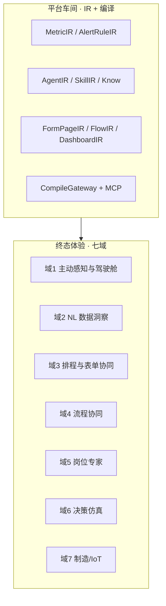
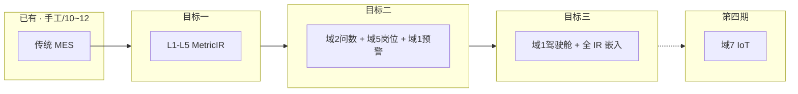

---

### JNPF 运行态四期开发纲领与架构白皮书（修订版）

版本：V7.11-SLIM（Mavis 紧急修订 · 2026-06-16）
签发人：D爷及首席架构委员会
核心原则：第一期（轻量数据湖）与第二期（岗位专家）只交付核心功能，第三期及以后引入高级扩展能力。

---

### 第一部分 · 产品靶心（Why）

#### 1.1 行业范式与靶心一句话

**1.1.1 从「被动工具」到「主动参与者」**

| 范式转变 | 传统管理系统                 | AI 原生管理系统（靶心）                      |
| :------- | :--------------------------- | :------------------------------------------- |
| 驾驶舱   | 各模块静态摘要、人工点进报表 | AI 整理后的岗位回报：待决策 + 异常 + 已办    |
| 取数     | 选菜单 → 筛条件 → 导出       | NL 问数 → 口径绑定的图表（环比、曲线）       |
| 执行     | 人填表、人点审批             | 建议 → 协作 → 托管；AI 起草，人签字          |
| 知识     | 文档库全文检索               | 岗位专家 → 企业应用专家：行业域 + 跨模块经验 |
| 感知     | 人发现异常再处理             | 离散预警 → 主动预测 → IoT 时序预测（第四期） |
| 产出     | 项目定制开发                 | 低代码 IR 编译；AI 关仍可手工运行            |

**1.1.2 靶心一句话（全文最高产品锚点）**

目标三 = 业务人员配置的 **企业应用专家** — 精通行业域知识，统摄岗位专家，基于 **离散数据湖** 主动跨模块预测；semantic 驾驶舱为其汇报面之一；AI-off 时手工 JNPF 7×24 零事故。

第四期 = TimeSeriesIR + 工业接入 + timeseries-mcp + 车床耗电/振动 预测预警 — 独立 M-P4，不属于目标三验收。

平台角色：造高铁车间（MetricIR / AgentIR / CompileGateway / MCP），不是出厂一列「张总管子」示范高铁。

---

#### 1.2 智能层级对照（全文只保留此表 · 禁止混层）

| 维度         | 目标二 · 岗位工作专家 | 目标三 · 企业应用专家                  | 第四期 · IoT 时序          |
| :----------- | :-------------------- | :------------------------------------- | :------------------------- |
| **层级**     | 战术 · 单一岗位       | 战略 · 整企离散 MES                    | 设备波形层                 |
| **数据**     | L1–L5 离散 MetricIR   | 离散 · 跨模块                          | TimeSeriesIR + 时序库      |
| **AgentIR**  | scope = role          | scope = enterprise                     | 企业专家 + timeseries-mcp  |
| **SkillIR**  | data-mcp + report-mcp | data-mcp + report-mcp（无 timeseries） | + timeseries-mcp           |
| **典型问句** | 「我这岗位 OEE？」    | 「全厂交期+质量+库存风险？」           | 「3 号车床耗电曲线异常？」 |
| **统摄关系** | 无                    | 调度各岗 Agent                         | 给目标三专家装「波形眼」   |
| **里程碑**   | M-P1                  | M-P2                                   | M-P4                       |
| **施工**     | 36 号                 | 37 号                                  | 38 号                      |

---

#### 1.3 七域体验分类（终态 taxonomy · 非功能清单）

七域 = 用户终态体验分类；不等于平台内置功能清单。工程落期见第二部分 §0.4~0.7。

**1.3.1 域 1 · 主动感知与智能驾驶舱**

| 项         | 内容                                                         |
| :--------- | :----------------------------------------------------------- |
| 经典场景   | 工作台/驾驶舱 = AI 整理回报：待决策、昨夜已办、风险预警、跨模块异常聚合 |
| 用户体感   | 打开系统 ≈ 「岗位早报」：3 件须拍板 + 5 件已办 + 1 个须关注风险 |
| 典型子场景 | 早会简报 · 待办聚合 · 异常主动推送 · 证照/库存类风险提醒     |
| 平台 IR    | DashboardIR semantic 槽 + AgentIR + AlertRuleIR + data-mcp   |
| 运行态落期 | 离散预警 目标二；semantic 整页驾驶舱 目标三                  |
| **禁止**   | ChiefOfStaffService · 固定「AI 总管子」单入口 · 手写 AiDataInsightCard 终验收 |

**1.3.2 域 2 · 自然语言数据洞察**

| 项         | 内容                                                         |
| :--------- | :----------------------------------------------------------- |
| 经典场景   | 「本车间 OEE 曲线」「销售环比图」；截图/语音为增强输入（阶段二储备） |
| 用户体感   | 说人话 → 口径正确的图表 + 文字解读 + 异常标注                |
| 平台 IR    | MetricIR → NL→MQL(JSON)→DataQueryGateway→SQL；report-mcp 出图 |
| **铁律**   | 禁止 LLM 直写 SQL；问数/看板/Agent 同一 MetricIR code 数值一致 |
| 运行态落期 | 口径与 MQL 目标一；业务人员 NL 问数 目标二                   |

**1.3.3 域 3 · 智能排程与表单协同**

| 项         | 内容                                                         |
| :--------- | :----------------------------------------------------------- |
| 经典场景   | 月/周排程表 · 智能填表（历史推断字段）· 附件→结构化单据      |
| 用户体感   | NL 改排程 → 对比方案 → 人审后写入业务表                      |
| 平台 IR    | FormPageIR + FlowIR + AgentIR Skill 挂载 DynamicApi *Service |
| **边界**   | 排程计算走业务 Service/规则；LLM 理解意图、填参、解释 — 禁止直改生产库 |
| 运行态落期 | 表单/流程 IR 开发态 10~12；Agent 填参 目标三                 |

**1.3.4 域 4 · 智能执行与流程协同**

| 项         | 内容                                                         |
| :--------- | :----------------------------------------------------------- |
| 经典场景   | 智能审批预审 · 派单 · 跨部门任务 · 邮件/纪要草稿             |
| 用户体感   | AI 起草 → 人审核/签字；高风险写路径经 FlowIR 或 DKEE         |
| 平台 IR    | FlowIR + workflow-mcp + DKEE（L1→L2→L3）                     |
| 授权模式   | 建议(0%自主) → 协作(AI起草人审) → 托管(规则内自动，异常上浮) |
| 运行态落期 | 流程编译 开发态；Agent 触发流程 目标二（人审节点不可 bypass） |

**1.3.5 域 5 · 知识沉淀与岗位专家（P1 体验靶心）**

| 项           | 内容                                                         |
| :----------- | :----------------------------------------------------------- |
| 经典场景     | 工艺/SOP 问答 · 老师傅经验 · 新人岗位学习 · 历史异常回放     |
| 用户体感     | 每岗位有专属数字专家；回答绑企业口径与权限                   |
| 平台 IR      | AgentIR(scope=role) + SkillIR + Qdrant 双模 + MetricIR 同义词 |
| 运行态落期   | 目标二 · M-P1 核心验收域                                     |
| **验收问句** | 「脱离开发人员，Studio 配 1 指标 + 1 岗位 Agent + 1 预警？」 |

**1.3.6 域 6 · 决策辅助与仿真**

| 项         | 内容                                                    |
| :--------- | :------------------------------------------------------ |
| 经典场景   | 方案对比 · 降价/排产影响分析 · 多情景预测               |
| 用户体感   | 「如果…会怎样」→ MetricIR 仿真 + 相似案例；标注数据来源 |
| 平台 IR    | MetricIR 仿真 Job + data-mcp + AgentIR                  |
| 运行态落期 | 规则+聚合仿真 目标三；深度 ML → 第四期/储备             |

**1.3.7 域 7 · 制造域深度智能（IoT）**

| 项         | 内容                                                         |
| :--------- | :----------------------------------------------------------- |
| 经典场景   | 车床/机床 耗电、振动、温度；预测预警；与 MES 工单/交期联动   |
| 目标二     | 离散 AlertRuleIR + MetricIR（OEE 低、停机时长）— 非波形      |
| 目标三     | 企业专家 离散跨模块主动分析 — 不含高频波形                   |
| **第四期** | TimeSeriesIR + OPC UA/MQTT + timeseries-mcp（第二部分 §0.7） |
| **禁止**   | 目标一~三引入 Kafka/Flink 全量流；波形写入 MetricIR          |

**1.3.8 七域 × 四期速查（工程师一页表）**

| 域         | 主要 IR/MCP                                  | 主要落期               |
| :--------- | :------------------------------------------- | :--------------------- |
| 1 驾驶舱   | DashboardIR semantic · AlertRuleIR · AgentIR | 预警 二 · 整页 三      |
| 2 问数     | MetricIR · MQL · data/report-mcp             | 口径 一 · NL 二        |
| 3 排程填表 | FormPageIR · FlowIR · AgentIR                | 开发态 10~12 · 填参 三 |
| 4 流程     | FlowIR · workflow-mcp · DKEE                 | 开发态 + 触发 二       |
| 5 岗位专家 | AgentIR(role) · Know · Qdrant                | 二 · M-P1              |
| 6 仿真     | MetricIR 仿真 · data-mcp                     | 三                     |
| 7 IoT      | TimeSeriesIR · timeseries-mcp                | 第四期 · M-P4          |

---

#### 1.4 客户三条新需求 → 域映射

| 客户要求              | 靶心体验                | 七域         | 运行态落点                                |
| :-------------------- | :---------------------- | :----------- | :---------------------------------------- |
| ① AI 原生驾驶舱       | 模块摘要 → AI 整理回报  | 域 1         | 三 semantic DashboardIR；二 Widget + 预警 |
| ② NL 图表 + 月排程    | 说人话出图 · 智能填表   | 域 2 + 3     | 一 MetricIR/MQL；二 问数；排程 IR → 10~12 |
| ③ 主动预测 + 流程优化 | 先预警再决策 · 流程建议 | 域 6 + 4 + 7 | 三 离散主动分析；四 IoT 预测              |

---

#### 1.5 27 子场景 taxonomy 速查（非交付清单）

来源：15 号升维整理。禁止按本表逐项内置 Service。

| 七域 | 代表子场景                     | 四期边界             |
| :--- | :----------------------------- | :------------------- |
| 1    | 工作台汇总、主动告警、风险提醒 | 阈值 二；semantic 三 |
| 2    | 一句话报表、曲线/环比、解读    | 一 口径 + 二 NL      |
| 3    | 月排程、智能填表、附件录入     | 10~12 + 三 填参      |
| 4    | 智能审批、派单、纪要草稿       | 10~12 + 二 触发      |
| 5    | SOP 问答、工艺智库、新人导师   | 二 · M-P1            |
| 6    | 方案对比、影响分析、推演       | 三 规则仿真          |
| 7    | 预测性维护、耗电/振动 IoT      | 第四期               |

---

#### 1.6 「造高铁车间」— 平台 vs 产品

| 我们在建（车间）                                        | 我们不在建（车厢）                          |
| :------------------------------------------------------ | :------------------------------------------ |
| MetricIR / AgentIR / AlertRuleIR Studio                 | 内置「张总管子」「销售分析 Agent」Service   |
| CompileGateway + MCP（data/workflow/report/timeseries） | 独立 AgentRuntime / DataPlatform modularity |
| 业务人员 配置 岗位专家（二）与企业专家（三）            | 开发 写死 的 AI 产品页                      |
| TimeSeriesIR Studio + timeseries-mcp（四）              | 波形塞 MetricIR · 项目定制 SCADA 烟囱       |

---

#### 1.7 两大误区与验收试金石

| 误区 | 错误（造车厢）                | 正确（造车间）                              |
| :--- | :---------------------------- | :------------------------------------------ |
| A    | 内置 WorkbenchAgent、示范 MES | Studio 零代码配置 AgentIR / MetricIR        |
| B    | 数据湖、MCP、Agent 各建烟囱   | IR 互相引用 · 同一 CompileGateway（约束五） |

验收试金石：「业务人员能否 Studio 脱离开发人员零代码完成指标 + 岗位 Agent + 预警？」 + AI-off 演练 — 禁止仅用「语音问 OEE Demo」过关。

---

#### 1.8 七域与四期覆盖关系

说明：手工低代码与 10~12 已可交付传统 MES。目标一~四在同一 MES 运行态上叠加智能 — 与开发态正交（详见第二部分 §0.2）。

---

### 第二部分 · 运行态四期开发目标（修订版）

读者：架构师、后端/前端工程师 — 理解交付什么、不交付什么、如何验收。  
本部分是全文唯一工程定义；产品体感见第一部分；Sprint/DDL/代码路径见 35~38 号。  
铁律：开发态 AI ≠ 运行态 AI — 10~12 阶段五~六完成 ≠ 目标三完成。  
核心变更：明确资源池、冷热同步、分片、GraphRAG等复杂功能移至第三期，第一/二期聚焦核心功能。

#### 0.1 四期总述（修订版）

在 JNPF 手工低代码及 10~12 五阶段流水线100% 保留的前提下，增量建设运行态智能层。核心宗旨：前期保核心，后期加扩展。

| 期     | 工程交付（摘要）                                       | 里程碑 | 核心原则               |
| :----- | :----------------------------------------------------- | :----- | :--------------------- |
| 目标一 | L1→L5 · MetricIR Studio · MQL 网关 · data-mcp          | M-G1   | 简单直连，稳定可靠     |
| 目标二 | AgentIR(role) · AlertRuleIR Job · 岗位 Widget · NL问数 | M-P1   | AI自配置，隔离复杂协同 |
| 目标三 | 资源池 · 冷热同步 · Schema分片 · GraphRAG · 多模态RAG  | M-P2   | 按需引入，渐进增强     |
| 第四期 | TimeSeriesIR · IoT · timeseries-mcp                    | M-P4   | 独立项目，双轨并行     |

#### 0.2 开发态 vs 运行态（读错 = 全文理解错误）

| 维度       | 是什么                       | 施工文档            | 制造企业 MES 长什么样                     |
| :--------- | :--------------------------- | :------------------ | :---------------------------------------- |
| **开发态** | 平台如何把需求变成可部署系统 | 10~12 阶段一~六     | 表单+流程+大屏+UniApp — 同构手工产物      |
| **运行态** | 交付物上线后是否具备 AI 智能 | 33 第二部分 + 35~38 | 同一 MES 叠加：数据湖 · 岗位 · 企业 · IoT |

10~12 补「开发更快」；目标一~四补「运行更聪明」 — 交集 = 完整 AI 原生 MES，互不替代。

#### 0.3 MES 能力跃迁（工程师对照表）

**0.3.1 五阶能力矩阵**

| 能力项                         | ① 手工 JNPF | ② +10~12   | ③ +目标一       | ④ +目标二        | ⑤ +目标三     |
| :----------------------------- | :---------- | :--------- | :-------------- | :--------------- | :------------ |
| 表单/流程/大屏/移动            | ✅           | ✅          | ✅               | ✅                | ✅             |
| 厂长看板                       | ✅ 静态      | ✅ 传统看板 | ✅ + MetricIR 卡 | ✅ + Agent Widget | ✅ AI 整理回报 |
| MetricIR 统一口径              | ❌           | ❌          | ✅               | ✅                | ✅             |
| NL 问数（业务人员）            | ❌           | ❌          | ⚠️ Studio 验证   | ✅                | ✅             |
| 岗位 Agent + 离散预警          | ❌           | ❌          | ❌               | ✅                | ✅             |
| AlertRuleIR Job                | ❌           | ❌          | ❌               | ✅                | ✅             |
| semantic 驾驶舱 + 主动离散分析 | ❌           | ❌          | ❌               | ❌                | ✅             |
| 资源池·冷热同步·分片·GraphRAG  | ❌           | ❌          | ❌               | ❌                | ✅ 第三期      |
| AI-off 可用                    | ✅           | ✅          | ✅               | ✅                | ✅（采集仍跑） |

#### 0.4 目标一 · 轻量数据湖（M-G1）

核心：简单、直连、稳定。

**0.4.1 工程交付清单（第一/二期交付）**

| #    | 交付物                | 说明                                                  | 复杂度 |
| :--- | :-------------------- | :---------------------------------------------------- | :----- |
| D1   | L1→L5 分层            | 源表 → 清洗 → 预聚合 → MetricIR 注册 → Dashboard 消费 | 中     |
| D2   | MetricIR Studio       | 业务人员定义指标 code、口径、维度、预聚合策略         | 高     |
| D3   | DataQueryGateway(MQL) | JSON 查询协议；禁止 LLM 直写 SQL                      | 中     |
| D4   | data-mcp 三工具       | list_metrics · query_metric · explain_metric          | 低     |
| D5   | 30 标准 MES 指标      | OEE · 良率 · 在制 · 设备故障等 — 出厂模板             | 中     |
| D6   | DashboardIR 单指标卡  | 绑 MetricIR.code；非 semantic 整页驾驶舱              | 低     |

**0.4.2 边界 · 依赖 · 验收（第三期延期项）**

| 被延期项               | 说明                                                  | 移至   |
| :--------------------- | :---------------------------------------------------- | :----- |
| 资源池 (RG) 与租户计划 | 运行时精确控制CPU/内存；SESSION_CONTEXT('TenantPlan') | 第三期 |
| 冷热数据同步           | 数据分层（L1-L5）与同步                               | 第三期 |
| Schema分片与多租户分库 | 200租户以上触发强制迁移                               | 第三期 |

验收 M-G1：业务人员 30min Studio 新建指标 + 仿真；MQL 与预聚合误差 0。  
一句话：「全厂离散数据一套口径 — 指标是法律，MQL 是法庭。」

#### 0.5 目标二 · 岗位工作专家（M-P1）

核心：AI自配置，隔离复杂协同。

**0.5.1 工程交付清单（第一/二期交付）**

| #    | 交付物                        | 说明                                          | 复杂度 |
| :--- | :---------------------------- | :-------------------------------------------- | :----- |
| P1   | AgentIR Studio                | PersonaIR(scope=role) + SkillIR + Know        | 高     |
| P2   | SkillIR                       | data-mcp + report-mcp                         | 中     |
| P3   | AlertRuleIR Studio → Job      | Hangfire · 引用 MetricIR.code                 | 中     |
| P4   | NL→MQL→图表 端到端            | 规则 80% + 主模型（裁定8）                    | 高     |
| P5   | ≥3 岗位 Agent（业务人员配置） | 计划员 · 质量 · 设备                          | 中     |
| P6   | Agent Widget                  | 挂载 MES 菜单/工作台 — 非整页 semantic 驾驶舱 | 低     |

**0.5.2 功能要求 · 边界 · 验收（第三期延期项）**

| 被延期项          | 说明                                            | 移至   |
| :---------------- | :---------------------------------------------- | :----- |
| GraphRAG          | 实体+关系+向量三层检索                          | 第三期 |
| Prompt 工程规范库 | 量化 agent_config_quality_variance 并建立规范库 | 第三期 |
| 多模态 RAG        | 包含OCR+图片检索                                | 第三期 |

验收 M-P1：脱离开发：1 指标 + 1 Agent + 1 预警；口径三处一致；AI-off Job 仍跑。  
一句话：「每个岗位一个懂行数的 AI 同事 — 自己配，只管本岗。」

#### 0.6 目标三 · 企业应用专家（M-P2）（整合延期项）

核心：按需引入，渐进增强。此阶段将引入被第一、二、三期延期的高级功能。

| 被延期项               | 说明                                                  | 从     |
| :--------------------- | :---------------------------------------------------- | :----- |
| 资源池 (RG) 与租户计划 | 运行时精确控制CPU/内存；SESSION_CONTEXT('TenantPlan') | 目标一 |
| 冷热数据同步           | 数据分层（L1-L5）与同步                               | 目标一 |
| Schema分片与多租户分库 | 200租户以上触发强制迁移                               | 目标一 |
| Qdrant 分片            | Qdrant 哈希分片策略                                   | 目标一 |
| GraphRAG               | 实体+关系+向量三层检索                                | 目标二 |
| Prompt 工程规范库      | 量化 agent_config_quality_variance 并建立规范库       | 目标二 |
| 多模态 RAG             | 包含OCR+图片检索                                      | 目标二 |

#### 0.7 第四期 · IoT 时序智能（M-P4）（不变）

**0.7.1 工程交付清单**

| #    | 交付物                               |
| :--- | :----------------------------------- |
| T1   | TimeSeriesIR + Studio                |
| T2   | OPC UA / MQTT 网关                   |
| T3   | InfluxDB / ClickHouse                |
| T4   | timeseries-mcp                       |
| T5   | 耗电/振动 规则/轻量预测 预警 Job     |
| T6   | 企业专家 SkillIR 挂载 timeseries-mcp |

**0.7.2 双轨边界（离散 vs 时序）**

| 维度     | 离散轨（一~三）   | 时序轨（四）           |
| :------- | :---------------- | :--------------------- |
| 数据     | 工单/报工/OEE     | 耗电/振动/温度波形     |
| 存储     | SQL Server 分析库 | InfluxDB/ClickHouse    |
| MCP      | data-mcp          | timeseries-mcp         |
| **禁止** | 波形入 MetricIR   | Kafka/Flink 作默认交付 |

一句话：「让总参谋看得懂车床每一度电、每一次振动。」

#### 0.8 数据边界 · 依赖顺序 · 组合卖点

数据边界：

| 范围      | 技术栈                                      |
| :-------- | :------------------------------------------ |
| 目标一~三 | MES 离散 · L1–L5 · SQL Server · MetricIR    |
| 第四期    | + 时序 · TimeSeriesIR · InfluxDB/ClickHouse |

依赖顺序（与 10~12 正交）：

【已有】手工 JNPF → 传统 MES  
【可选并行】10~12 → 更快造同一传统 MES  
35 → M-G1 → 36 → M-P1 → 37 → M-P2 → 38 → M-P4

---

### 第三部分 · 六大底线约束（业务宪法）

D爷裁定 · 绝无妥协。本节内容为架构基石。

**约束一 · JNPF 增量生存**

AI 必须在手工低代码之上增量；AI/向量/MCP 全挂时 VisualDev/流程/权限 100% 可用。

代码锚点：jnpf-web-vue3/src/core/ir/types.ts · schema-cleaner.ts · validator.ts · ir-to-schema.ts

**约束二 · 运行态四期红线**

目标定义仅第二部分 §0.4~0.7；施工仅 35~38 号 + 10~12（开发态）。第一/二期严禁引入第三期规划的资源池、冷热同步、分片、GraphRAG等复杂架构。

**约束三 · 造车间非造车厢**

业务人员通过 MetricIR/AgentIR/AlertRuleIR/SkillIR + CompileGateway 配置能力；禁止内置 WorkbenchAgent、ChiefOfStaffService、手写 AI 业务 Vue 终交付。基础设施 Service（SchemaGovernor/DataQueryGateway/AgentRuntimeOrchestrator）为例外。

**约束四 · DKEE 人类在环**

AI 修正经 L1→L2→L3 审核方可写入 IR；禁止幻觉直改核心 IR。审核 SLA：见裁定5（业务2h/流程4h/AgentIR 8h）；SLA 未达自动升级通知。第一/二期实现L1→L2自动分析，L3人工审核；L2自动分析算法在第三期完善。

**约束五 · 三要素 IR 互通**

数据(MetricIR) · 规则(AlertRuleIR/FlowIR) · 逻辑(SkillIR/MCP) 互相引用、同一口径；OEE 在 MetricIR、看板、Agent 中数值一致；跨 IR 引用必须带版本号（见裁定9）。

**约束六 · P2 AI-off 零事故**

切断 LLM/Qdrant/MCP 后，表单/流程/Job/预聚合/VisualDev 零 Exception；写路径经 FlowIR 或人工确认。

度量标准（玛维思补强·P1）：
① Unhandled Exception数=0（AI_INFERENCE_LOG可查）
② 月度断电演练≥1次且通过
③ 降级切换延迟<1s
④ 降级期间 VisualDev/CRUD/流程 P95<原SLA 120%

第一/二期重点确保①④达标，②③可在第三期优化。

**约束七 · 多租户规模门槛**

0–20 租户使用独立 Schema（裁定1）；200 租户以上须转为 Schema 分片 + 多租户分库策略；SchemaGovernor 必须提前设计自动化 DDL 迁移接口。第一/二期保持0-20租户独立Schema模式，分片策略在第三期执行。

**约束八 · 生产级可观测性基线（P0·KIMI审查补强·V7.11）**

凡部署到生产的 AI 推理链路，必须具备：

① 分布式追踪：OpenTelemetry ActivitySource，TraceID 贯穿 IR→MCP→LLM→DB
② 指标暴露：Prometheus /metrics 端点（QPS/P95延迟/Token消耗/租户成本）
③ 健康检查：/health（存活）+ /ready（就绪，检查DB/Qdrant/LLM）
④ 审计日志保留：AI_INFERENCE_LOG/AI_EVAL_LOG/AI_PII_MASK_LOG 5年；DATA_SYNC_LOG 1年

禁止上线任何无追踪、无指标、无健康检查的 AI 链路。第一/二期实现核心链路追踪，全链路覆盖在第三期完成。

**约束九 · Sprint 执行铁律（合并自原第五部分）**

1. **降级演练一票否决**：UAT 与 M-P2 必须 AI-off 演练通过。第一/二期完成核心演练，第三期完成全链路演练。
2. **以终为始验收**：每 Sprint 问 — 「业务人员能否 Studio 零代码配置？」第一/二期验收聚焦核心功能，不要求完成第三期高级特性。

---

### 第四部分 · 十二大架构裁定（技术宪法）

核心：所有与“资源池”、“冷热同步”、“分片”相关的裁定，其实现从第一/二期推迟至第三期。

| 裁定                                            | 要点                                                         | 执行阶段                                                     |
| :---------------------------------------------- | :----------------------------------------------------------- | :----------------------------------------------------------- |
| **1 多租户**                                    | 0–20 租户独立 Schema + SchemaGovernor；200 租户以上触发分片储备（约束七+储备7）；Schema 生命周期：创建（租户开通→模板克隆≤5min）/ 扩缩（元数据版本管理）/ 归档（6个月未活跃→只读Schema）/ 删除（注销→DROP+备份保留7年）；管理员跨Schema全局查询通过 SchemaGovernor.CrossSchemaQuery UNION-ALL 视图层实现 | 第一/二期（核心）；分片 → 第三期                             |
| **2 语义检索**                                  | Qdrant Hybrid Search（向量相似 + BM25关键词，RRF融合打分）+ Payload tenant_id；主模式：Hybrid（非互斥切换，消除降级质量断崖）；熔断降级 SQL Server CONTAINS（召回率SLA≥60%）；容量基线：20租户×6000节点≈12万向量（单机<100ms）；100租户≈60万向量（<200ms）；600万向量触发储备8；熔断恢复：5min健康检查自动切回；向量更新：增量重建 | 第一/二期（核心）；分片 → 第三期                             |
| **3 AgentIR**                                   | 与 FormPageIR 平级；Persona/Skill/Knowledge（即「数字员工」架构，无需另立概念）；运行态第二期 Studio 配置；乐观锁防多人编辑冲突（裁定10）；版本生命周期：草稿→内部测试→业务审核→发布；任意版本可回滚；单Agent推理P95<3s | 第二期（核心）                                               |
| **4 MCP**                                       | 渐进封装：先 data/workflow/report-mcp 手工；第四期 timeseries-mcp；统一 MCP 元数据规范：所有工具遵循统一JSON Schema（name/version/inputSchema/outputSchema/fallback）；工具注册表 MCP_TOOL_REGISTRY 表；每季度兼容性回归测试；LLM Prompt动态加载按需工具（避免超载） | 第一/二期（核心）；timeseries-mcp → 第四期                   |
| **5 DKEE**                                      | L1 记录 → L2 分析 → L3 人审 → 标准 IR 保存；审核 SLA：业务指标类 2h / 流程类 4h / AgentIR/AlertRuleIR类 8h；SLA 未达触发自动升级通知；拒绝审核 → 旧版本保留 + 反馈追踪；L2自动分析：统计偏差检测 + 多源交叉验证 | 第一/二期实现L1→L2自动分析，L3人工审核；L2自动分析算法 → 第三期 |
| **6 资源池**                                    | RG 10/30/60；须SESSION_CONTEXT('TenantPlan')；登录中间件设置；突发借调：MIN_CPU=0,MAX_CPU=60（空闲时可借满）；季度评审调整配比 | 第三期                                                       |
| **7 冷热同步**                                  | L1–L3 + P0/P1/P2 分级；禁止全量实时 CDC；P0延迟>10s自动降P1+报警；软删除同步：源表F_DELETE_MARK=1目标表同步标记；失败重试：3次后入死信队列DLQ；告警阈值：同步延迟P95>5min触发告警 | 第三期                                                       |
| **8 LLM 路由**                                  | 规则拦截80% + 主模型复杂度标签 + ModelAdapter 接口（OpenAI/Claude/DeepSeek/本地一键切换）；推理路径标签（route:rule/llm）+ 超时熔断>5s降级；降级链：云端主模型→本地备用模型→纯规则；成本监控：每租户月Token上限（Standard 50元/Enterprise 200元）；禁止专用分类微服务 | 第一/二期（核心）；ModelAdapter → 第二期                     |
| **9 IR 版本依赖追踪**                           | MetricIR变更时，IrDependencyGraph自动标记依赖AlertRuleIR/AgentIR为「需重新发布」；变更事件写 IR_DEPENDENCY_LOG 表；禁止静默口径漂移 | 第二期                                                       |
| **10 多用户协作**                               | AgentIR/MetricIR Studio支持乐观锁+冲突合并（version字段+last-write-wins提示）；≥5人并发编辑；禁止悲观锁锁表 | 第二期                                                       |
| **11 LLM 评估体系（P0·玛维思）**                | 贯穿四期：EvalSet（每期≥50条黄金问答对）；自动化评估：LLM-as-Judge准确率 + MQL查询召回率；监控：P50/P95/P99推理延迟 + 每租户月成本；EvalSet回归：每Sprint末运行，准确率下降>5%阻断发布；评估结果写 AI_EVAL_LOG 表 | 第一/二期（核心）；自动化评估 → 第三期                       |
| **12 数据安全/PII（P0·KIMI+玛维思·V7.11扩展）** | ① PII脱敏：LLM输入前强制PII扫描（手机/身份证/邮箱/银行卡正则+NER）；命中→脱敏占位（[MASKED_PHONE]）；写 AI_PII_MASK_LOG；禁止未脱敏数据入云端LLM；② SQL注入防护：DataQueryGateway强制表名+列名白名单（AllowedTables/AllowedColumns）；禁止字符串拼接SQL；③ Prompt Injection检测：用户输入过指令注入正则扫描（"忽略指令"/"你现在是"等≥20模式）；命中→拦截+记录；④ 审计日志保留：AI_*系列日志5年；DATA_SYNC_LOG 1年；IR_DEPENDENCY_LOG永久 | 第一/二期（核心）                                            |

---

### 第五部分 · 演进储备库（封存 · 触发后启用）

版本：V7.11-SLIM（Mavis 紧急修订 · 2026-06-16）
签发人：D爷及首席架构委员会

V7.11补强（KIMI·ARCH-008）：储备库触发条件已全部量化 + 增加“监控指标”列；Prometheus每日自动检测，超阈值在Grafana告警面板标红。

核心原则：以下储备技术在第一、二期不得引入，触发条件满足后，在第三期及以后评估启用。

| #    | 储备                       | 触发条件（量化）                       | 监控指标 / 检测频率                                     | 启用阶段             |
| :--- | :------------------------- | :------------------------------------- | :------------------------------------------------------ | :------------------- |
| 1    | 多模向量库降级             | 租户>50 且禁 Docker/SQL 全文           | tenant_count > 50 · 周检                                | 第三期               |
| 2    | LLM 专用分类器             | 日查询>10 万 · 规则瓶颈                | daily_query_count > 100000 · 日检                       | 第三期               |
| 3    | 冰数据对象存储             | 单租户>10 亿行                         | per_tenant_row_count > 1e9 · 日检                       | 第三期               |
| 4    | Kafka/Flink 全厂流         | 时序写TPS>5万 + 租户>100               | ts_write_tps > 50000 AND tenant_count > 100 · 日检      | 第三期               |
| 5    | 多模态 RAG（OCR+图片）     | M-P2验收后；制造业图纸检索需求>20项/月 | multimodal_search_req > 20/month · 月检                 | 第三期（M-P2验收后） |
| 6    | ModelAdapter 多模型自适应  | 裁定8已实现；需替换模型时一键切换      | —                                                       | 第三期               |
| 7    | Schema 分片+多租户分库     | 租户>100启动评估；>200强制迁移         | tenant_count > 100/200 · 周检                           | 第三期               |
| 8    | Qdrant 哈希分片            | 200租户 P95检索>500ms                  | qdrant_p95_latency > 500ms · 日检                       | 第三期               |
| 9    | CompileGateway 多阶段编译  | IR>6类 且编译LOC>3000行                | ir_type_count > 6 AND compile_loc > 3000 · 季检         | 第三期               |
| 10   | GraphRAG（实体+关系+向量） | Qdrant准确率<80% + 跨实体查询>20%      | rag_accuracy < 0.8 AND complex_query_ratio > 0.2 · 月检 | 第三期               |
| 11   | LLM 语义缓存               | 重复问句率>30%                         | duplicate_query_ratio > 0.3 · 周检                      | 第三期               |
| 12   | Prompt 工程规范库          | 配置质量方差>30%                       | agent_config_quality_variance > 0.3 · 月检              | 第三期               |

第一/二期施工中，如遇上述储备触发条件，仅做监控记录，不启动实施。待第三期启动后，统一评估并纳入施工计划。

---

**全文完。签发生效！**