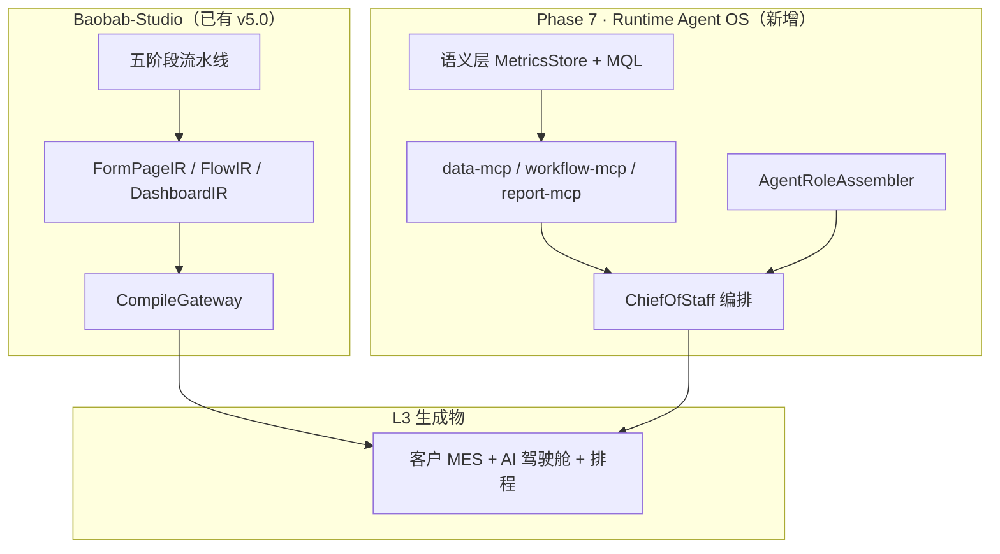

您描述的两个障碍，本质上是**同一类认知错位**：把「平台能力」当成「业务功能」来交付。v5.0 定稿（10/11/12）在工程上是对的，但缺少一条**对客户 AI 智能体业务的显式分层法则**，架构师就容易在 JNPF 主仓里直接「造一列高铁」。

下面给出：**客户需求的正确落位**、**三步走与 v5.0 的衔接**、**治架构师偏航的治理机制**。

---

## 一、先定一条「平台宪法」：造生产线，不造产品

用 v5.0 已有术语，把边界写死：

| 层级                       | 是什么                                   | 客户需求的例子                  | 谁来做                        | 代码落点                         |
| -------------------------- | ---------------------------------------- | ------------------------------- | ----------------------------- | -------------------------------- |
| **L0 平台内核**            | IR、编译器、LlmGateway、Evals            | —                               | Studio 团队                   | `src/core/`、`LlmGatewayService` |
| **L1 平台 MCP 能力**       | 可被 AI 调用的**标准工具**，不是业务页面 | `data-mcp` 查指标、排程算法 API | 平台团队                      | 独立 MCP Server / Service        |
| **L2 领域模式（Pattern）** | 可复用的 IR 片段 + Prompt + 指标字典     | 「销售环比分析驾驶舱」模式      | Foundry 蒸馏 → KnowledgePatch | `BASE_KNOWLEDGE_*`               |
| **L3 生成物（Artifact）**  | 某客户某次流水线产出的**具体系统**       | 某工厂的 AI 驾驶舱、月排程表    | **五阶段流水线生成**          | 沙箱 ZIP / 客户部署包            |

**铁律（建议写入 ADR-019）：**

> 禁止在 `modularity/`、`jnpf-web-vue3/src/views/` 主仓手写「销售环比分析页」「AI 驾驶舱」「机床异常预测模块」。  
> 这些必须是 **IR + DashboardIR + AgentRoleIR** 的编译产物；平台只提供 **语义层 + MCP + Agent 装配器**。

您说的「造高铁技术与生产线」对应关系：

```
造高铁的技术  = L0（IR 契约 + 编译器 + LlmGateway + Evals）
造高铁的车间  = L1（data-mcp / workflow-mcp / agent-assembler）
高铁设计图纸  = L2（DomainPattern：MES 驾驶舱、排程、预测维护）
一列具体高铁  = L3（客户 A 的 MES 系统，流水线阶段 4 部署）
```

架构师一旦在 L3 写 C#/Vue，就是在**手工低代码**，不是 AI 原生低代码。

---

## 二、客户三条需求 → 正确落位（不是三个功能模块）

| 客户需求                                     | 错误做法（架构师常犯）                   | 正确做法（平台能力）                                         |
| -------------------------------------------- | ---------------------------------------- | ------------------------------------------------------------ |
| **AI 原生驾驶舱**（AI 整理汇报，非模块摘要） | 在 DataV 里写死「AI 汇总组件」           | 扩展 **DashboardIR** + **BriefingAgentRoleIR**；语义层提供指标；流水线阶段 3 子 Agent 生成驾驶舱 IR |
| **自然语言查销售环比、识图、月排程**         | 每个场景一个 ChatController + 硬编码 SQL | **第一期轻量数据湖**（语义层 + `data-mcp`）+ **ChartSpecIR**；NL→MQL→SQL 走白名单，不走自由 SQL |
| **主动预测机床异常、优化流程**               | 单独建 `PredictiveMaintenanceService`    | **AlertRuleIR** + 时序特征表（第三期）+ **ProactiveAgentRoleIR**；平台只提供「感知→推理→推送」装配契约 |

关键洞察：**客户要的是 L3 体验，你们必须交付 L1+L2 能力**。  
v5.0 阶段五的「顾问式 AI」是**造系统的 Agent**；客户新需求要的是**运行系统的 Agent**——这是**第二类 Agent**，不能混进 `Stage1AnalystService` 里。

建议在 v5.0 之后增加 **Phase 7：Runtime Agent OS**（与 Studio 并行，不替代）：



---

## 三、三步走与 v5.0 时间线：插入，不推翻

您定的「轻量数据湖 → AI 助手 → AI 岗位专家」与 v5.0 **正交**，应作为 **Runtime 侧 Phase 7**，而非改 Studio 阶段五：

| 步骤                   | 内容                                                   | 与 v5.0 关系                                                 | 工期参考             |
| ---------------------- | ------------------------------------------------------ | ------------------------------------------------------------ | -------------------- |
| **Step 1 轻量数据湖**  | 语义层、30 指标、CDC、`data-mcp`、NL 查询 P95&lt;5s    | **前置依赖** Studio 的 `LlmGatewayService`（Sprint 0-B）；**不依赖** 五阶段流水线完工 | 8 周（文档 24 已定） |
| **Step 2 AI 助手**     | ChiefOfStaff + 对话工作台 + 多模态（截图 OCR）         | 消费 Step 1 的 MCP；UI 可复用 `AiChatPanel.vue` 模式，但路由在 **`/runtime/assistant/*`**，非 `/studio/*` | 6 周                 |
| **Step 3 AI 岗位专家** | `AgentRoleIR` + 装配器（销售分析师、排程员、设备哨兵） | 模式进 Foundry → KnowledgePatch；**每个专家 = 一个 DomainPattern**，不是一套 Service | 8 周                 |

**并行策略（避免拖垮 49 周主线）：**

```
Sprint 0-B 完成后：
  主线 A：阶段一~四（编译器 + FlowIR）     ← 不变
  主线 B：第一期数据湖 W1-W4              ← 与阶段二~三并行
  汇合点：阶段五启动前，data-mcp 必须可用  ← 新增硬门禁
  阶段五~六：Studio 流水线
  阶段七：Runtime Agent OS（Step 2+3）
```

没有 Step 1，Step 2/3 的 Agent 只能**幻觉**——您「没有数据无法实现 AI 智能业务」的判断完全正确。

---

## 四、障碍 1 治理：让架构师「看得见」自己在造高铁

### 4.1 立项门禁：三张必答题

任何 AI 相关 PR/设计评审，必须先填：

1. **产物层级**：L0 / L1 / L2 / L3？
2. **生成路径**：能否用「需求 → IR → CompileGateway → 沙箱 URL」演示？不能则打回。
3. **复用计数**：该能力可被几个客户/几个行业复用？=1 则禁止进平台主仓。

### 4.2 目录物理隔离（防「老小区改造」）

```
jnpf-web-vue3/src/
  core/           ← L0 唯一入口，架构师可改
  views/studio/   ← Studio UI（造系统）
  views/runtime/  ← Runtime Agent UI（用系统）★ 新建，与 studio 平级
backend/
  modularity/JNPF.DataPlatform/   ← L1 数据湖 + data-mcp ★ 新模块
  modularity/JNPF.AgentRuntime/   ← L2 Agent 装配 ★ 新模块
  modularity/JNPF.XXX/            ← 禁止出现 SalesAnalysisService 等业务名
```

**一条 CI 规则**：`grep -r "环比\|排程\|驾驶舱\|预测维护" modularity/` 命中且无 `// GENERATED` 标记 → 构建失败。

### 4.3 对照实验（说服架构师的最短路径）

用 v5.0 已有能力做 **48 小时 PoC**：

- 输入：「为 MES 客户生成 AI 驾驶舱 + 销售环比折线图」
- 路径 A（错误）：手写 Vue 页面 + Service — 记录人天
- 路径 B（正确）：DashboardIR + BriefingAgentRoleIR + data-mcp — 记录人天

PoC 结论写入 ADR，比文档说教有效。

---

## 五、障碍 2 治理：防「井盖遍地」的统一骨架

架构师走偏的根因，是缺少 **Runtime 侧与 Studio 侧同构的中间表示**。建议在 IR 契约（`types.ts`）扩展三类 IR，与 FormPageIR 同级：

| 新 IR 类型      | 用途                                       | 编译目标                   |
| --------------- | ------------------------------------------ | -------------------------- |
| **AgentRoleIR** | 岗位专家（工具列表、Prompt、触发器、权限） | Agent 配置 JSON + MCP 绑定 |
| **MetricIR**    | 指标定义（口径、维度、MQL）                | 语义层表 + RAG 片段        |
| **AlertRuleIR** | 主动感知（条件、频率、推送渠道）           | 预警引擎 Job               |

**统一原则（对齐 v5.0 裁决二）：**

- 手工配置与 AI 生成 → **同构 IR**
- 校验 → 同一套 `validator.ts`
- 审计 → 同一套 `BASE_AI_CALL_LOG`

这样不会出现「数据湖一套、Agent 一套、驾驶舱又一套」的三套管线。

### 反模式清单（评审时直接否决）

| 反模式                        | 症状                                     | 正确替代                                         |
| ----------------------------- | ---------------------------------------- | ------------------------------------------------ |
| **ChatController 地狱**       | 每个场景一个 `/api/ai/chat/sales`        | 一个 `AgentRuntimeService` + AgentRoleIR 路由    |
| **SQL 字符串拼接**            | LLM 直接出 SQL                           | MQL 白名单 + `TSqlParser` 校验（数据湖方案已定） |
| **微服务拆分 Agent**          | 销售 Agent 一个服务、排程 Agent 一个服务 | 模块化单体内 `AgentRoleAssembler` + MCP          |
| **在 VisualDev 里堆 AI 组件** | 「AI 按钮」「AI 图表」控件               | DashboardIR.aiBriefing 字段 + 编译器生成         |
| **Foundry 里训练业务页面**    | 攻击者生成「销售分析页」                 | Foundry 只进化 **DomainPattern**，不生成客户 UI  |

---

## 六、给创始人的执行建议（优先级）

**P0 — 本周可落地（不改 v5.0 主体）**

1. 起草 **ADR-019《平台能力 vs 生成物边界》**，附录客户三条需求的 L1/L2/L3 映射表  
2. 在 progress-registry 增加 **Phase 7 Runtime Agent OS**，与 Studio 49 周并列，不合并  
3. 确认 **第一期数据湖 8 周** 与阶段二~三并行启动（Sprint 0-B 后）  
4. 设立 **架构评审红牌**：L3 业务代码进 `modularity/` 一律驳回  

**P1 — 阶段五启动前硬门禁（写入附录 C）**

5. `data-mcp` 三工具可用 + 5 条 NL 查询 Evals  
6. IR 扩展：`AgentRoleIR` v0.1 + `MetricIR` v0.1（可与 FlowIR 同期）  
7. 菜单矩阵增补：`/runtime/assistant/*`（业务智能运行时），与 `/studio/expert/*`（造系统）分离  

**P2 — 对客户演示路径**

8. 第一期结束：演示「自然语言销售环比 + 指标口径一致」  
9. 第二期结束：演示「AI 驾驶舱 Briefing + 截图识图排程意图」  
10. 第三期结束：演示「机床异常主动推送 + 排程优化建议」（需 IoT 时序，对齐文档 26）  

---

## 七、一句话总结

- **v5.0 没有错**，它解决的是「如何造生产线（Studio + Foundry）」；客户新需求属于「生产线上造出来的高铁该有什么 AI 能力（Runtime Agent OS）」。  
- **三步走顺序对**：没有轻量数据湖，Agent 只能聊天；没有 AgentRoleIR 契约，就会退回手工低代码。  
- **治架构师**：靠 ADR + 目录隔离 + CI 红牌 + 48h PoC 对照，不靠反复开会。  

---

若需要，我可以下一步直接起草 **ADR-019 全文**（含 AgentRoleIR / MetricIR 字段草案 + 与 v5.0 里程碑的 Gantt 插入点），或把 Phase 7 整理成与文档 10 同格式的 **「升维开发总计划之四」** 施工包骨架——您指定要哪一份即可。