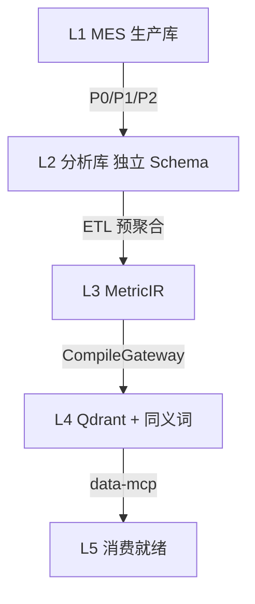

# 运行态第一期 · 轻量数据湖施工计划

> **版本**：R1 · 2026-06-15  
> **宪法**：[`33、运行态四期开发纲领与架构白皮书`](./33、运行态四期开发纲领与架构白皮书.md) **目标一** · 第二部分 §0.4  
> **前置**：已有 JNPF MES 业务表（VisualDev / 10~12 产出均可）· Sprint 0-C POC-A~F 全绿（ARCH-004）  
> **后置**：[`36、第二期·岗位工作专家`](./36、运行态第二期·岗位工作专家施工计划.md)  
> **不是**：开发态重构（见 [`10~12`](./10、JNPF升维开发总计划之一.md)）· IoT 时序（见 [`38、第四期`](./38、运行态第四期·IoT时序智能施工计划.md)）

---

## 一、本期开发目标（唯一表述）

在**已运行**的 MES 业务库之上，建设 **L1→L5 轻量数据湖**，交付 **MetricIR Studio** + **DataQueryGateway(MQL)** + **data-mcp 三工具**，使全厂离散指标**口径统一、可查询、可仿真**。

| 项 | 内容 |
|----|------|
| **里程碑** | **M-G1** |
| **工期** | **8 周**（R1-S0~S4） |
| **租户规模** | 0–20 租户（ARCH-001） |
| **数据范围** | MES **离散**（工单/报工/质检/主数据）；**禁止**传感器波形入湖 |

**验收金句**：业务人员 **30 分钟内**在 Studio 新建/改一个指标并仿真通过；MQL 查 `oee` 与预聚合 SQL **数值一致**。

---

## 二、交付物清单

| # | 交付物 | IR / 组件 |
|---|--------|-----------|
| D1 | L1→L2 CDC + **SchemaGovernor** | **DATA_SYNC_TASK** · P0/P1/P2 分级 |
| D2 | **MetricIR** 持久化 + Studio 设计器 | 公式/维度/同义词/Few-Shot |
| D3 | L4 语义层 Qdrant 双模 + Channel 同步 | 裁定2 · ADR-002 |
| D4 | **DataQueryGateway** + MqlTranslator | NL→MQL(JSON)→SQL |
| D5 | **data-mcp** 三工具 | `query_metrics` / `list_metrics` / `explain_metric` |
| D6 | **30 标准 MES 指标**模板 + 仿真 Job | ISA-95 / GB/T · §八 |
| D7 | DashboardIR **单指标卡片**编译（非手写 Vue） | MetricIR→CompileGateway |

**本期不做**：AgentIR Studio 业务配置（第二期）· AlertRuleIR Job（第二期）· TimeSeriesIR（第四期）· 独立 DataPlatform CRUD 后台。

---

## 三、L1–L5 架构

---

## 四、Sprint 计划（8 周）

| Sprint | 周 | 关键任务 | 验收 |
|--------|-----|----------|------|
| **R1-S0** | 1.5 | 5 POC：SchemaGovernor · CDC · 压测 · 规则分类 · 同步延迟 | 周五决策会：Go/No-Go |
| **R1-S1** | 1.5 | SchemaGovernor 上线 · P0/P1 链路 · **DATA_SYNC_TASK** | 跨租户漏传 TenantId → 空集 |
| **R1-S2** | 2 | MetricIR Schema + Studio · 30 模板导入 · 仿真 Job · Qdrant Channel | 业务人员 30min 新建指标 |
| **R1-S3** | 1 | DataQueryGateway 六步 · MqlTranslator 白名单 · 审计日志 | SQL 注入 0 · TOP 1000 |
| **R1-S4** | 2 | data-mcp 三工具 · DashboardIR 单卡编译 · 20 租户压测 · **M-G1 UAT** | 见 §六 |

### R1-S0 POC 明细

| POC | 验收 | 失败回退 |
|-----|------|----------|
| SchemaGovernor 批量 DDL | 3 租户并发隔离 | 应用层临时兜底 |
| **CDC 工具选型**（P0 同步） | SQL Server Change Tracking（首选）vs Debezium；P95<1min；选型结论写入 ADR | 串行 worker |
| **P0 自动降级**演练 | 模拟 P0 延迟>10s → 自动转 P1 增量 + 告警触达 | 告警写 ALERT_LOG 表 |
| 6000 万行/日压测 | 7×24 无 OOM | 分库 Plan B |
| 规则+主模型分类（裁定8 ModelAdapter） | 50 query ≥85%；路径标签 
oute:rule/llm | 全云端（成本告警） |
| P0/P1/P2 延迟 | P0≤30s · P1≤5min · P2=凌晨 | P0 降为 5min 增量 |

**CDC 工具选型决策标准**：

| 方案 | 优点 | 缺点 | 适用场景 |
|------|------|------|----------|
| SQL Server Change Tracking | 内置·零外部依赖 | 仅追踪行 ID，不含字段级变更 | 首选（0–20 租户） |
| Debezium + Kafka | 字段级 CDC · 可回放 | 额外运维成本 | 储备（>100 租户或合规要求） |
| 轮询增量（CreatedAt/UpdatedAt） | 最简单 | 漏删除·延迟高 | 兜底（Change Tracking 不可用时） |

---

## 五、同步与容量（摘自 33 裁定 · 28/25 号工程规格）

**P0/P1/P2 矩阵**：工单/报工/质检 P0 秒级；库存/排班 P1；BOM/工艺 P2 凌晨全量。

**P0 自动降级策略**（D爷建议落地）：

| 状态 | 判断条件 | 动作 |
|------|----------|------|
| 正常 | P0 P95 延迟 ≤30s | 正常运行 |
| 告警 | P0 P95 延迟 >10s | 告警推送 + 写 ALERT_LOG |
| 自动降级 | P0 P95 延迟 >30s 持续 2min | **自动转 P1（5min 增量同步）** + 钉钉告警 |
| 手动恢复 | 运维确认后 | 重设 P0；回补缺口数据 |

**预聚合策略**：30 指标 × 4 粒度 = 120 行/租户/日；**禁止**明细宽表日增 6000 万行。

**RG 10/30/60** + Sentinel：全局 AI 查询 QPS 200；单租户 20。

**LLM 推理路径监控**（33 裁定8·铁律7）：

| 指标 | 标签 | 阈值 |
|------|------|------|
| 规则命中率 | 
oute:rule | ≥80%（目标） |
| LLM 推理 P95 | 
oute:llm | <4s（正常）/ >5s 自动熔断 |
| 熔断后降级 | 
oute:rule_fallback | 降级事件写 AI_INFERENCE_LOG |

**存储成本规划**（D爷建议·R1-S4 模拟必做）：

| 场景 | 估算 | 应对 |
|------|------|------|
| 中型 MES（5000 工单/日 × 10 工序）1 年 L1 明细 | **≈1.8 亿行** · ~90GB | L1 明细保留 6 个月 + 冷归档 |
| L3 预聚合 30 指标 × 4 粒度 × 1 年 | **≈43.8 万行** | 可全量保留 SQL Server |
| L4 Qdrant 向量 1000 文档/租户 | ~200MB/租户 | 20 租户 4GB，可控 |
| **冷数据策略** | >6 个月明细 → 廉价存储 | R1-S4 压测须模拟此场景 |

---

## 六、M-G1 验收清单

**核心功能验收**：
- [ ] MetricIR Studio：业务人员新建/修改指标，**无需开发**
- [ ] 30 标准指标导入 + 仿真 **30/30** 通过
- [ ] MQL→SQL 网关：注入拦截 100%
- [ ] data-mcp 三工具 MCP 握手 + 单元测试
- [ ] Qdrant 熔断 → CONTAINS 降级演练通过
- [ ] **禁止**以「语音问 OEE Demo」替代 Studio 验收

**D爷审查项（新增必验）**：
- [ ] **CDC 选型 ADR**：已写入 docs/架构迭代/，明确 Change Tracking vs Debezium 选择及理由
- [ ] **P0 降级演练**：模拟 P0 延迟>30s → 自动转 P1 + 告警触达 → 恢复 P0，全程无人工介入
- [ ] **LLM 推理路径标签**：
oute:rule / 
oute:llm 分别在 Kibana/日志中可查
- [ ] **存储成本模拟**：R1-S4 压测报告含「中型 MES 1 年 L1 行数预测 + 冷归档策略」
- [ ] **IrDependencyGraph POC**：MetricIR 发布时触发下游检测，可在 Studio 看到「依赖告警」标记（第二期完整实现；本期 POC 验证可行性）
- [ ] **PII 脱敏验证**（裁定12）：随机抽10条含手机号的业务记录，LLM 收到的 Prompt 中手机号已替换为 `[MASKED_PHONE]`；AI_PII_MASK_LOG 有记录
- [ ] **EvalSet 基线**（裁定11）：30 条黄金问答对录入 AI_EVAL_LOG；LLM-as-Judge 准确率 ≥80%；此后每 Sprint 末自动回归

---

## 七、禁止项

1. **禁止** LLM 直写 SQL（MetricIR→MQL→网关→SQL 铁律）  
2. **禁止** 共享表 + RLS（裁定1：独立 Schema）  
3. **禁止** `Task.Run` 裸异步推向量（Channel + 同步日志表）  
4. **禁止** 本期引入 AgentIR 业务验收 · Kafka/InfluxDB  

---

## 八、30 标准 MES 指标（模板）

`oee` · `yield_rate` · `active_orders` · `completed_orders` · `equipment_failure_count` · `cost_per_unit` … 共 30 个（完整表见废止版 35 §八，代码以 MetricIR 模板 JSON 为准）。

---

## 本节核心表清单

| 表名 | 用途 |
|------|------|
| **DATA_SYNC_TASK** | 分级同步水位 |
| **MetricIR 持久化表** | 【待源码验证】 |
| **BASE_AI_CALL_LOG** | MQL/网关审计 |

## 本节关键代码路径索引

| 能力 | 路径 |
|------|------|
| MetricIR 类型 | `jnpf-web-vue3/src/core/ir/` 【待源码验证 metric-types】 |
| IR 编译 | `jnpf-web-vue3/src/core/compiler/gateway/` |
| data-mcp Host | 【待建 · R1-S4】 |
| SchemaGovernor | 【待建 · POC-E / R1-S1】 |

---

**Sprint 评审问句**（33 第三章铁律2）：*「业务人员能否在 Studio 脱离开发人员零代码完成指标配置？」*
