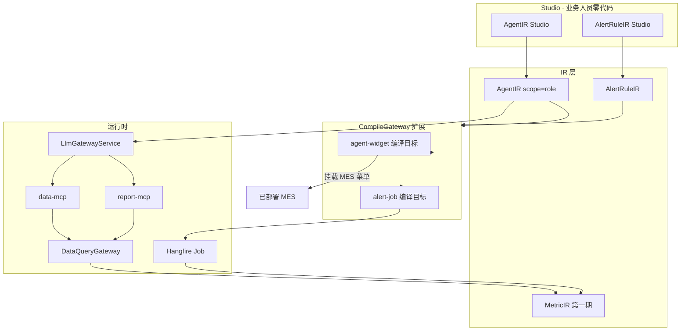
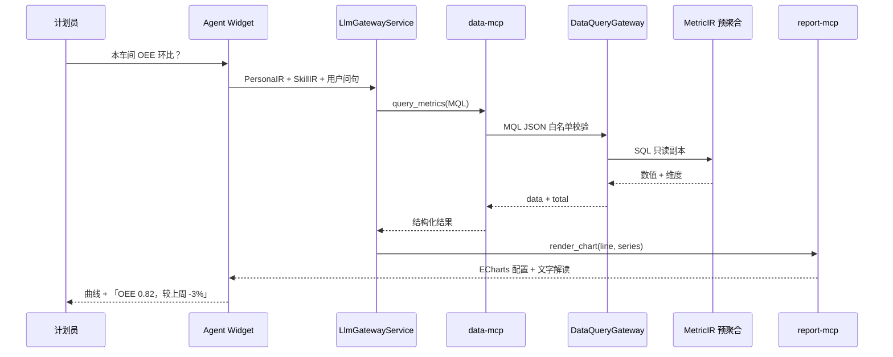

# 运行态第二期 · 岗位工作专家施工计划

> **版本**：R2.1 · 2026-06-15  
> **宪法**：[`33、运行态四期纲领`](./33、运行态四期开发纲领与架构白皮书.md) **目标二** · 第二部分 §0.5  
> **前置**：**M-G1**（[`35、第一期`](./35、运行态第一期·轻量数据湖施工计划.md) 完成）  
> **后置**：[`37、第三期·企业应用专家`](./37、运行态第三期·企业应用专家施工计划.md)  
> **不是**：开发态五阶段流水线（10~12）· 企业应用专家（第三期）· IoT 时序（第四期）

---

## 一、本期开发目标（唯一表述）

在 **L5 数据湖**（第一期 M-G1）之上，交付 **AgentIR Studio**（`PersonaIR.scope = role`），使业务人员**零代码**配置 ≥3 **岗位工作专家**（计划员 / 质检 / 设备员），实现 NL 问数、指标解读、离散阈值预警；智能层级为**战术层**，只管本岗、不跨模块统摄。

| 项 | 内容 |
|----|------|
| **里程碑** | **M-P1** |
| **工期** | **6 周**（R2-S0~S5） |
| **租户规模** | 0–20 租户（ARCH-001） |
| **数据域** | **离散** MetricIR；**禁止** TimeSeriesIR / 波形 |

**验收金句**：随机业务人员 **脱离开发人员**，完成 **1 个新指标 + 1 个岗位 Agent + 1 条预警**；Agent 答的 `oee` = MetricIR 预聚合 = DashboardIR 单卡，**误差 0**。

---

## 二、范围与非范围

### 2.1 本期做

| # | 交付物 | IR / 组件 |
|---|--------|-----------|
| P1 | **AgentIR** 持久化 + **AgentIR Studio** | PersonaIR + SkillIR + KnowledgeIR |
| P2 | **SkillIR** 挂载 **data-mcp + report-mcp** | 问数 + 出图 |
| P3 | **AlertRuleIR Studio** + 编译为运行时 Job | Hangfire · 引用 `MetricIR.code` |
| P4 | NL→MQL→图表 **端到端** | 规则 80% + 主模型（裁定8） |
| P5 | ≥3 **岗位** Agent 由**业务人员**配置 | 计划员 · 质量 · 设备 |
| P6 | **Agent Widget** 编译挂载 | 既有 MES 菜单 / 工作台槽位 |
| P7 | 早报错峰预计算 + Sentinel 租户 QPS | 08:00 峰值可控 |

### 2.2 本期不做

| 项 | 归属 |
|----|------|
| `PersonaIR.scope = enterprise` 企业应用专家 | **37 号第三期** |
| timeseries-mcp / OPC UA / InfluxDB | **38 号第四期** |
| semantic 整页驾驶舱 / 主动跨模块巡检 | **37 号第三期** |
| `ChiefOfStaffService` / `WorkbenchAgent` / 手写 AI 助手 Vue | **禁止**（33 约束三） |
| 独立 `JNPF.AgentRuntime` modularity | **禁止**（IR + CompileGateway） |
| 4 级专用 NL 分类器微服务 | **禁止**（裁定8：规则 + 主模型） |

---

## 三、启动门禁（R2 开工前必须全绿）

| 门禁 | 来源 | 验收 |
|------|------|------|
| **M-G1** | 35 号 R1-S4 | MetricIR Studio · data-mcp 三工具 · MQL 网关 |
| **POC-A** AgentIR 类型 | Sprint 0-C / R2-S0 | `AgentIR` JSON Schema 与持久化表对齐 |
| **POC-B** Qdrant 双模 | 35 号 R1-S2 | 熔断 → CONTAINS 降级演练通过 |
| **POC-C** MCP Host 骨架 | R2-S0 | data-mcp 握手 + report-mcp POC |
| **ITenantFilter** | 现有 JNPF | 全链路查询漏 TenantId → 空集 |

> Sprint 0-C 六项 POC 若未在 0-B 完成，**并入 R2-S0**，不得跳过。

---

## 四、运行态架构

### 4.1 数据与控制流



### 4.2 问数一次完整链路（图 4.2）



**铁律**：LLM **不得**生成 SQL；MQL 仅经 `DataQueryGateway.MqlTranslator` 产出（33 裁定 · 24 号提炼）。

---

## 五、IR 规格（第二期新增 / 扩展）

### 5.1 AgentIR 根结构

```typescript
// 【待建】jnpf-web-vue3/src/core/ir/agent-types.ts
interface AgentIR {
  id: string;
  tenantId: string;
  code: string;                    // 租户内唯一，如 role_planner_01
  version: number;                 // 乐观锁版本号（裁定10）；每次保存+1
  persona: PersonaIR;
  skills: SkillIR[];
  knowledgeRefs: KnowledgeRef[];   // 指向 KnowledgeIR 节点 id
  mountPoints: MountPointIR[];     // 编译为 agent-widget 的挂载点
  status: 'draft' | 'published';
}
```

### 5.2 PersonaIR（第二期仅 `scope = role`）

| 字段 | 类型 | 说明 |
|------|------|------|
| `scope` | `'role'` | **固定** role；enterprise 属第三期 |
| `roleCode` | string | 如 `production_planner` / `quality_engineer` |
| `displayName` | string | 「生产计划员助手」 |
| `systemPrompt` | string | 岗位人设 + 边界（**禁止**跨岗统摄话术） |
| `allowedMetricCodes` | string[] | 白名单 MetricIR.code |
| `locale` | string | 默认 `zh-CN` |

### 5.3 SkillIR

```typescript
interface SkillIR {
  id: string;
  mcpServer: 'data-mcp' | 'report-mcp';  // 第二期仅二者
  tools: string[];                        // 如 ['query_metrics','list_metrics']
  config?: Record<string, unknown>;       // 图表默认 theme 等
}
```

### 5.4 KnowledgeIR（岗位 SOP · 消费第一期 Qdrant）

| 字段 | 说明 |
|------|------|
| `nodeId` | 关联 `KnowledgeGraphStore` / **BASE_KNOWLEDGE_NODE** |
| `domainTag` | 如 `mes.scheduling` / `mes.quality` |
| `sourceType` | `upload` \| `manual` \| `foundry_patch`（Foundry 经 DKEE 后） |
| `embeddingModel` | 与 35 号 L4 一致 |

检索路径：`KnowledgeGraphStore.QueryNeighborsAsync` · Payload 强制 `tenant_id` 过滤。

### 5.5 AlertRuleIR（离散阈值 · 与 FlowIR 同构编译）

```typescript
interface AlertRuleIR {
  id: string;
  code: string;
  metricCode: string;              // 必须存在于 MetricIR
  condition: {
    op: 'lt' | 'lte' | 'gt' | 'gte' | 'eq' | 'change_pct';
    value: number;
    window?: '1h' | '1d' | '7d';  // change_pct 时用
  };
  schedule: string;                // cron，如 0 */15 * * * ?
  channels: Array<'站内信' | '邮件' | 'webhook'>;
  recipients: RecipientIR[];       // 角色 / 用户 / 部门
  enabled: boolean;
}
```

编译产物：`AlertJobDefinition` → Hangfire RecurringJob；触发写入 **BASE_ALERT_FIRE_LOG**。

---

## 六、MCP 工具契约

### 6.0 MCP 统一元数据规范（裁定4扩展·P1·玛维思）

所有 MCP 工具必须在 **MCP_TOOL_REGISTRY** 表中注册，并遵循统一 JSON Schema：

```typescript
interface McpToolDescriptor {
  name: string;           // 工具唯一名称，如 'query_metrics'
  mcpServer: string;      // 归属 MCP，如 'data-mcp'
  version: string;        // 语义版本 '1.0.0'
  inputSchema: object;    // JSON Schema 入参
  outputSchema: object;   // JSON Schema 出参
  fallbackBehavior: 'return_empty' | 'throw' | 'use_cache';
  llmDescription: string; // 给 LLM 的工具描述（用于动态加载）
  compatibleModels: string[]; // ['openai-gpt4', 'deepseek-v3', 'qwen-7b']
}
```

**LLM Prompt 动态加载策略**（防工具超载）：
- 根据 `PersonaIR.skills` 中的 `mcpServer` 白名单，只加载本 Agent 需要的工具描述
- 全局工具数（data+report+workflow+timeseries）共 ≤11 个，Prompt 可承载（已测试 GPT-4/DeepSeek-V3）
- 每季度更新兼容性矩阵（存于 `docs/architecture/mcp-compat-matrix.md`）

### 6.1 data-mcp（第一期交付 · 第二期生产化）

| 工具 | 入参 | 出参 | 实现类【待建】 |
|------|------|------|----------------|
| `query_metrics` | MQL JSON | `{ data, total, interpretation? }` | `DataMcpTools.QueryMetrics` |
| `list_metrics` | `category?` | MetricIR 摘要列表 | `DataMcpTools.ListMetrics` |
| `explain_metric` | `metric_code` | 口径 + 公式 + 维度 | `DataMcpTools.ExplainMetric` |

Host 路径：`backend/infrastructure/` 或 `modularity/inteAssistant/` 下 MCP Host 【待 R2-S2 定稿】。

### 6.2 report-mcp（第二期新建）

| 工具 | 入参 | 出参 |
|------|------|------|
| `render_chart` | `{ chartType, series, xAxis, title }` | ECharts option JSON |
| `render_table` | `{ columns, rows }` | 表格 JSON（Widget 内嵌） |

**约束**：图表数据源 **必须**来自 `query_metrics` 返回值，禁止 LLM 编造数值。

---

## 七、CompileGateway 扩展（第二期）

在现有 `CompileTarget`（`jnpf-web-vue3/src/core/compiler/targets.ts`）上**增量**两个目标：

| 新 target | 输入 IR | 输出 | 说明 |
|-----------|---------|------|------|
| `agent-widget` | AgentIR | Vue3 对话 Widget + 菜单注册 JSON | 非整页；嵌入 MES |
| `alert-job` | AlertRuleIR | Hangfire Job 注册 + C# Handler 片段 | 与 FlowIR Job 编译同模式 |

编译入口仍为 `compileGateway()`（`gateway.ts`）；后端 Job Handler 由 IR 生成模板 + 人工 Review 首版 【待 R2-S3】。

---

## 八、三类岗位 Agent 验收规格

### 8.1 配置矩阵

| 岗位 | `roleCode` | PersonaIR 边界 | 绑定 MetricIR | KnowledgeIR |
|------|------------|----------------|---------------|-------------|
| **生产计划员** | `production_planner` | 排程 · 产出 · 本车间 | `oee` · `active_orders` · `on_time_reporting_rate` | 排程 SOP |
| **质量工程师** | `quality_engineer` | 质检 · 良率 · 不良 | `yield_rate` · `pending_quality_inspection` · `defect_rate` | 质检 SOP · 不良代码表 |
| **设备管理员** | `equipment_admin` | 台账 · 保养 · 停机 | `equipment_failure_count` · `oee` · `average_repair_time` | 保养规则 · 设备台账 |

### 8.2 对话验收样例（M-P1 抽测）

| # | 用户问句 | 预期行为 | 口径校验 |
|---|----------|----------|----------|
| Q1 | 「一车间今天 OEE 多少？」 | 调用 `query_metrics` + 折线 `render_chart` | = DashboardIR `oee` 单卡 |
| Q2 | 「待质检有多少？」 | `pending_quality_inspection` | = 预聚合 SQL |
| Q3 | 「OEE 怎么算的？」 | `explain_metric('oee')` | = MetricIR 公式文本 |
| Q4 | （静默） | AlertRuleIR：`oee < 0.85` | 15min 内推送设备管理员 |

### 8.3 能力边界（岗位 vs 企业 · 第三期预告）

| 能力 | 第二期（岗位） | 第三期（企业） |
|------|----------------|----------------|
| 问数范围 | `allowedMetricCodes` 白名单 | 跨模块离散联合 |
| 预警 | 本岗 MetricIR 阈值 | 全厂主动巡检 |
| 统摄 | ❌ | 调度各岗 Agent |

---

## 九、Sprint 计划（6 周 · 逐任务）

### 9.1 总览

| Sprint | 周 | 目标 | 里程碑 |
|--------|-----|------|--------|
| **R2-S0** | 1 | IR 对齐 + MCP POC | **M-R2-1** MCP 联调 |
| **R2-S1** | 1.5 | AgentIR Studio | **M-R2-2** 业务配 1 Agent |
| **R2-S2** | 1 | 问数端到端 + 降级 | **M-R2-3** NL 问 OEE |
| **R2-S3** | 1 | AlertRuleIR + Job | **M-R2-4** 预警推送 |
| **R2-S4** | 0.5 | 运维错峰 + Widget 挂载 | **M-R2-5** 菜单可见 |
| **R2-S5** | 1 | UAT + 压测 + 断电 | **M-P1** |

### 9.2 R2-S0 · IR 与 MCP 基础（6d）

| 任务 | 工期 | 负责人域 | 验收 |
|------|------|----------|------|
| gent-types.ts + lert-types.ts Schema（含 ersion 乐观锁字段） | 1d | 前端 IR | 与 POC-A 对齐；单元测试 |
| **BASE_AGENT_IR** / **BASE_ALERT_RULE_IR** DDL（含 ersion INT 列） | 1d | 后端 | SqlSugar Entity + 迁移脚本 |
| AgentIrService CRUD（DynamicApi）+ **乐观锁冲突检测** | 1d | 后端 | 并发更新返回 HTTP 409 + latestVersion |
| report-mcp POC：
ender_chart | 0.5d | 基础设施 | ECharts option 可渲染 |
| **Qdrant 多租户分片策略 POC**（D爷建议·储备8） | 1d | 基础设施 | 20 租户 P95 检索 <200ms；记录 100/200 租户压测预测值；结论写入 POC 报告 |
| R2-S0 联调：data-mcp + report-mcp + LlmGateway | 0.5d | 全栈 | 图 4.2 链路通 |
| **IrDependencyGraph** 服务骨架（裁定9·D爷首要风险） | 1d | 后端 | IR_DEPENDENCY_LOG 表 DDL + IrDependencyService.TrackDependency() stub |

### 9.3 R2-S1 · AgentIR Studio（8d）

| 任务 | 工期 | 验收 |
|------|------|------|
| Studio 路由 /studio/agent 扩展 | 0.5d | 菜单可见 · 权限码 |
| PersonaIR 表单（scope 锁定 role） | 1.5d | 保存/发布 |
| SkillIR 拖拽挂载 data-mcp / report-mcp | 2d | 工具多选 |
| KnowledgeIR 选择器（KnowledgeGraph 节点） | 1.5d | 租户隔离检索 |
| allowedMetricCodes 从 MetricIR 列表多选 | 1d | 仅已发布指标 |
| **多用户乐观锁 + 冲突提示**（裁定10·D爷竞品对比3） | 1d | 见下方规格 |
| **业务人员 UAT**：独立完成 1 个计划员 Agent | 0.5d | 无开发协助 |

UI 锚点：在 jnpf-web-vue3/src/views/studio/index.vue 骨架上扩展 Tab 【待建子路由 /studio/agent】。

#### 多用户并发协作规格（乐观锁 · D爷建议）

**AgentIR 版本控制设计**：

`	ypescript
// 保存时传入 currentVersion（前端持有）
async saveAgentIR(ir: AgentIR, currentVersion: number): Promise<SaveResult> {
  // 后端比对 DB version；不匹配 → HTTP 409
}

interface SaveResult {
  success: boolean;
  newVersion?: number;
  conflict?: {
    conflictedBy: string;     // 谁在编辑
    conflictedAt: string;     // 何时更新
    serverVersion: number;    // 服务器当前版本
    mergeSuggestion: 'override' | 'review'; // 建议操作
  };
}
`

**前端冲突提示规格**：
- 检测到 HTTP 409 → 弹出 Modal 显示「xxx 在 HH:mm 已修改此 Agent」
- 提供两个选项：「查看差异」（字段级对比） / 「强制覆盖（我的版本）」
- **不提供**自动 3-way merge（储备功能，第三期后评估）

**编辑锁定指示器**（可选 · R2-S5 有余量时实现）：
- Studio 列表页实时显示「编辑中」徽标（WebSocket Presence）
- 同一 Agent 被他人打开时 → Header 显示「⚠ xxx 正在编辑」

### 9.4 R2-S2 · 问数生产化（5d）

| 任务 | 工期 | 验收 |
|------|------|------|
| NL 规则路由（简单问句模板 → MQL） | 1.5d | 50 query 集 ≥80% 命中规则 |
| 主模型复杂度标签（复杂问句才调 LLM） | 1d | 禁止 4 级分类微服务 |
| `AgentRuntimeOrchestrator`【待建】 | 1d | Persona + Skill + MCP 编排 |
| Agent Widget 编译器 v0（`agent-widget`） | 1d | 嵌入沙箱 MES 菜单 |
| P95 简单问数 &lt;5s（20 租户模拟） | 0.5d | Sentinel 单租户 QPS 20 |

### 9.5 R2-S3 · AlertRuleIR（5d）

| 任务 | 工期 | 验收 |
|------|------|------|
| AlertRuleIR Studio UI | 2d | 阈值 + cron 零代码 |
| `alert-job` 编译目标 + Hangfire 注册 | 1.5d | `oee<0.85` Job 可触发 |
| 推送通道（站内信优先） | 1d | **BASE_ALERT_FIRE_LOG** 有记录 |
| 与 Agent **解耦**验证：无 LLM 仍预警 | 0.5d | AI-off 演练 |

### 9.6 R2-S4 · 运维与挂载（4d）

| 任务 | 工期 | 验收 |
|------|------|------|
| 早报预计算 Job（租户 hash 04:00–06:00） | 1d | 08:00 峰值 P95&lt;3s |
| 3 岗位 Agent 模板一键导入 | 0.5d | 计划员/质量/设备 |
| MES 示范环境挂载 3 Widget | 1d | 菜单进入对话 |
| **Widget-Container 契约规范**（D爷落地隐患3） | 1.5d | 见下方规格 |

#### Widget-Container 契约规范（D爷建议·生命周期管理）

**Widget 数据隔离协议**：

`	ypescript
// Widget 挂载时 Container 注入的上下文
interface WidgetContainerContext {
  tenantId: string;
  userId: string;
  menuCode: string;       // 宿主菜单标识
  pageEntityId?: string;  // 当前页面主实体 ID（如工单 ID）
  locale: string;
}

// Widget 生命周期接口（Widget 必须实现）
interface AgentWidgetLifecycle {
  onMount(ctx: WidgetContainerContext): void;
  onContextChange(ctx: Partial<WidgetContainerContext>): void;  // 宿主切换实体
  onUnmount(): void;  // 清理 WebSocket / 定时器
  // 状态持久化（MES 页面刷新/切换时保留对话历史）
  saveState(): WidgetState;
  restoreState(state: WidgetState): void;
}

interface WidgetState {
  conversationHistory: Message[];   // 最近 20 条
  lastQueryMetricCode?: string;     // 上次问的指标
  savedAt: string;                  // ISO 时间戳
}
`

**状态持久化策略**：
- 对话历史存 sessionStorage（key = gent_widget_{agentIrCode}_{tenantId}）
- MES 同页路由切换：保留历史；完整页面关闭：清除（**不**持久化到 DB）
- Widget 内存：销毁前 saveState()；重建时 
estoreState()

**禁止**：Widget 直接读写 window.* 全局变量；**禁止**Widget 持有 MES 业务 Store 引用。

### 9.7 R2-S5 · M-P1 UAT（5d）

见 **§十三**；含 20 租户压测、断电 AI 7×24 抽测 24h。

---

## 十、NL 四级降级路径

```
正常:   NL → 规则模板 → LLM(可选) → MQL → DataQueryGateway → 预聚合
降级一: NL → 规则模板 → MQL → SQL（LLM 不可用）
降级二: NL → MetricIR 全量元数据注入 → LLM（Qdrant 不可用）
降级三: MQL → 分析库只读副本（主分析库过载）
```

岗位 Agent **必须**在降级一仍可回答白名单内简单指标；降级三仍不影响 Hangfire 预警 Job。

---

## 十一、Agent Widget 挂载机制

| 步骤 | 操作者 | 动作 |
|------|--------|------|
| 1 | 业务人员 | AgentIR Studio 发布 Agent |
| 2 | 系统 | `compileGateway({ target: 'agent-widget', schema: AgentIR })` |
| 3 | 实施 / 业务 | 选择 MES **菜单节点** 或 VisualDev 页面 **Widget 槽** |
| 4 | 运行时 | Widget 加载 Persona + 已编译 Skill 列表；对话走 `LlmGatewayService` |

**禁止**：新建 `views/ai-workbench/` 独立产品页作为终验收（33 第一部分 §1.5）。

---

## 十二、容量与性能（ARCH-001 · 28 号提炼）

| 指标 | 目标 | 超限动作 |
|------|------|----------|
| 20 租户并发简单问数 P95 | &lt;4s | Sentinel 排队 + RG 10/30/60 |
| 单租户 AI 查询 QPS | 20 | 429 + 友好提示 |
| 全局 AI 查询 QPS | 200 | 熔断非 P0 问数 |
| 08:00 早报峰值 P95 | &lt;3s | 扩大错峰窗口 |
| AlertRuleIR Job 延迟 | cron 精度 ±1min | 监控 Hangfire 队列深度 |

---

## 十三、M-P1 验收清单

### 13.1 功能（必须全部由**非开发**业务人员操作）

- [ ] MetricIR Studio：新建或修改 **1** 个指标并仿真通过（可复用第一期）
- [ ] AgentIR Studio：配置 **1** 个岗位 Agent（Persona + Skill + Knowledge）
- [ ] AlertRuleIR Studio：配置 **1** 条离散阈值预警（如 `oee < 0.85`）
- [ ] **≥3** 岗位 Agent（计划员 / 质量 / 设备）均已发布并挂载 Widget
- [ ] 对话 Q1~Q3（§8.2）口径 **误差 0**
- [ ] 预警 Q4 在 SLA 内推送且日志可追溯

### 13.2 非功能

- [ ] 漏传 TenantId → 问数 / 预警 / 知识检索 **100% 空集**
- [ ] **AI-off**：断 LLM + Qdrant + MCP → CRUD · 流程 · Hangfire 预警 · 指标表 **无 Unhandled Exception**
- [ ] 20 租户压测：简单问数 P95&lt;4s
- [ ] **禁止**以「语音问 OEE Demo」替代 §13.1

### 13.3 Sprint 评审问句（33 铁律2）

*「业务人员能否在 Studio **脱离开发人员**零代码完成岗位 Agent + 预警配置？」*

---

## 十四、禁止项

1. **禁止** `WorkbenchAgent` / `ChiefOfStaffService` / `MesQueryAgentService` 等业务命名 Service  
2. **禁止** LLM 直写 SQL 或编造指标数值  
3. **禁止** 岗位 Agent 读取 TimeSeriesIR / timeseries-mcp  
4. **禁止** 岗位 Agent 统摄其他岗位（`scope` 必须为 `role`）  
5. **禁止** 手写 `AiDataInsightCard` 等 AI 业务 Vue 作为交付物  
6. **禁止** 跳过 M-G1 启动第二期  

---

## 十五、与第一 / 三期接口

| 方向 | 接口 |
|------|------|
| **← 35 第一期** | MetricIR.code · data-mcp · Qdrant 同义词 · DashboardIR 单卡口径 |
| **→ 37 第三期** | 岗位 Agent 列表供 `enterprise` 统摄；`scope=role` 与 `scope=enterprise` 共存同表 |
| **∥ 10~12 开发态** | 可并行；M-P1 **不依赖**阶段五~六 |

---

## 十六、里程碑业务语言

| 里程碑 | Sprint 末 | 业务语言 |
|--------|-----------|----------|
| M-R2-1 | R2-S0 | 「MCP 能问能画」 |
| M-R2-2 | R2-S1 | 「业务人员自己配 Agent」 |
| M-R2-3 | R2-S2 | 「问 OEE 和看板一个数」 |
| M-R2-4 | R2-S3 | 「阈值到了会推人」 |
| **M-P1** | R2-S5 | 「三岗位都有 AI 同事；AI 挂了 MES 照跑」 |

---

## 本节核心表清单

| 表名 | 关键字段 | 用途 |
|------|----------|------|
| **BASE_AGENT_IR** | F_ID · F_TENANT_ID · F_CODE · F_IR_JSON · F_STATUS | AgentIR 持久化 |
| **BASE_ALERT_RULE_IR** | F_METRIC_CODE · F_CONDITION_JSON · F_CRON · F_ENABLED | AlertRuleIR 持久化 |
| **BASE_ALERT_FIRE_LOG** | F_RULE_ID · F_METRIC_VALUE · F_FIRE_TIME | 预警触发审计 |
| **BASE_AI_CALL_LOG** | F_TENANT_ID · F_PROMPT · F_DURATION | 问数审计（已有） |
| **BASE_KNOWLEDGE_NODE** | F_DOMAIN_TAG · F_CONTENT | KnowledgeIR 节点（已有） |
| **DATA_SYNC_TASK** | — | 第一期同步水位（预警依赖分析库新鲜度） |

## 本节关键代码路径索引

| 能力 | 路径 | 状态 |
|------|------|------|
| CompileGateway | `jnpf-web-vue3/src/core/compiler/gateway.ts` | ✅ 已有 · 扩展 target |
| CompileTarget 枚举 | `jnpf-web-vue3/src/core/compiler/targets.ts` | ✅ · 增 agent-widget / alert-job |
| Studio 骨架 | `jnpf-web-vue3/src/views/studio/index.vue` | ✅ · 扩展 Agent Tab |
| LLM 网关 | `backend/modularity/inteAssistant/JNPF.InteAssistant/LlmGatewayService.cs` | ✅ |
| 知识图谱 | `backend/modularity/inteAssistant/JNPF.InteAssistant/KnowledgeGraphStore.cs` | ✅ |
| AgentIR 类型 | `jnpf-web-vue3/src/core/ir/agent-types.ts` | 【待建 R2-S0】 |
| AlertRuleIR 类型 | `jnpf-web-vue3/src/core/ir/alert-types.ts` | 【待建 R2-S0】 |
| AgentIrService | `backend/modularity/inteAssistant/.../AgentIrService.cs` | 【待建 R2-S0】 |
| DataQueryGateway | `backend/modularity/.../DataQueryGateway.cs` | 【待建 · 35 第一期】 |
| report-mcp Host | `backend/infrastructure/.../ReportMcpHost.cs` | 【待建 R2-S0】 |
| Agent Widget 编译器 | `jnpf-web-vue3/src/core/compiler/agent-widget/` | 【待建 R2-S2】 |
| Alert Job 编译器 | `jnpf-web-vue3/src/core/compiler/alert-job/` | 【待建 R2-S3】 |

---

**文档维护**：R2-S5 结束后若 M-P1 通过，在 `docs/progress-registry.yaml` 登记 `M-P1` 并解锁 37 号第三期开工门禁。
