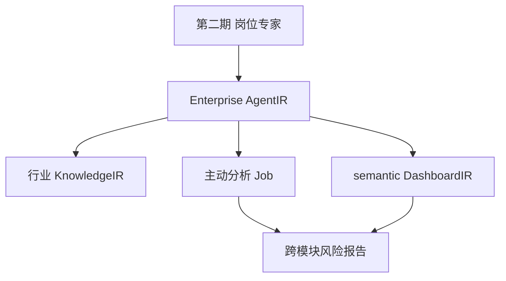

# 运行态第三期 · 企业应用专家施工计划

> **版本**：R3 · 2026-06-15  
> **宪法**：[`33、运行态四期纲领`](./33、运行态四期开发纲领与架构白皮书.md) **目标三** · 第二部分 §0.6  
> **前置**：**M-P1**（[`36、第二期`](./36、运行态第二期·岗位工作专家施工计划.md)）· 已有传统 MES（VisualDev 或 10~12 流水线产出）  
> **后置**：[`38、第四期·IoT`](./38、运行态第四期·IoT时序智能施工计划.md)（可选）

---

## 一、本期开发目标（唯一表述）

交付 **企业应用专家**（`AgentIR PersonaIR.scope = enterprise`）：精通**行业域**知识与 MES 全链路业务经验，**统摄**第二期岗位专家，基于**离散 MetricIR** **主动**跨模块预测、归因与建议；交付 **semantic DashboardIR** 作为企业专家**汇报面**。

| 项 | 内容 |
|----|------|
| **里程碑** | **M-P2** |
| **工期** | **10 周**（R3-S0~S7） |
| **数据域** | **仅离散** L1–L5 · **不含** IoT 波形 |
| **与 10~12** | 可在已有 MES IR 包上**扩展嵌入**智能 IR；**不**把阶段五~六等同于 M-P2 |

**验收金句**：企业应用专家**主动**（非等人问）产出跨模块离散风险报告；**关闭 AI** 后 VisualDev + 流程 + CRUD + AlertRuleIR Job **7×24 零 Exception**。

---

## 二、交付物清单

| # | 交付物 | 说明 |
|---|--------|------|
| E1 | **Enterprise AgentIR Studio** | `scope=enterprise` · 统摄岗位 Agent 配置 |
| E2 | **行业域 KnowledgeIR** + Foundry **KnowledgePatch** 接收 | DKEE 人审后注入 |
| E3 | **主动分析引擎** | 定时 + 事件触发 · 离散 MetricIR 跨模块扫描 |
| E4 | **DashboardIR semantic** | 待决策清单 / 风险摘要 / Agent 回报槽 |
| E5 | **IR 嵌入规范** | 已部署 MES IR 包扩展 Metric/Agent/Alert 引用 |
| E6 | SkillIR：**data-mcp + report-mcp** | **无** timeseries-mcp（第四期） |
| E7 | **逃生舱**验证 | `ir-to-schema.ts` round-trip |

**本期不做**：TimeSeriesIR · OPC UA/MQTT · `ChiefOfStaffService` · 仅 AI 可写表/仅 LLM 可触发流程节点。

---

## 三、与岗位专家的能力跃迁

| 能力 | 第二期（岗位） | 第三期（企业应用专家） |
|------|----------------|------------------------|
| 问数 | 本岗 | **跨模块**离散联合 |
| 预警 | 本岗阈值 | **全厂**主动巡检 |
| 归因 | 单点 | 交期+质量+库存+OEE **关联** |
| 驾驶舱 | Widget | **semantic 整页汇报面** |
| 统摄 | 无 | **调度**岗位 Agent 子能力 |

---

## 四、Sprint 计划（10 周）

| Sprint | 周 | 关键任务 | 验收 |
|--------|-----|----------|------|
| **R3-S0** | 1 | Enterprise PersonaIR Schema · Studio 扩展 · 统摄模型设计 | scope=enterprise 可保存 |
| **R3-S1** | 1.5 | 行业 KnowledgeIR 模板（离散制造/MES）· Qdrant 域标签 | 域文档入库可检索 |
| **R3-S2** | 2 | **主动分析 Job** 框架 · 跨模块 MetricIR 扫描 · 报告 IR |  nightly 报告可生成 |
| **R3-S3** | 1.5 | **DashboardIR semantic** 槽位 + 编译器 · 待办/风险/摘要 | 非手写 Vue |
| **R3-S4** | 1.5 | 企业专家 **AgentRuntime 协同**：Planner→Executor→Reviewer 完整闭环；workflow-mcp 建议流（人审） | 协同调度链路通；建议→FlowIR 确认 |
| **R3-S5** | 1 | Foundry KnowledgePatch 联调 · DKEE L1→L3 门 | 禁止直写生产 IR |
| **R3-S6** | 1 | 在**示范 MES**（客户沙箱）嵌入智能 IR 包 · 非内置产品 | IR 包可导入 |
| **R3-S7** | 1 | **M-P2 UAT** · **断电 AI 7×24** · ir-to-schema 抽测 | 见 §六 |
| **R3-S7.5（预研）** | 1 | **多模态 RAG 技术预研**（D爷建议·储备5）: OCR/图片接入；**不交付生产功能** | 预研报告 + 可行性结论 |



---

## 四点五、多 Agent 协同运行时架构（R3-S4 · 玛维思P0→重定义采纳）

> **架构澄清**：玛维思将「多 Agent 协同」列为P0缺失。经审查委员会裁定：企业应用专家调度岗位 Agent 即 Planner/Executor 模式，已含于设计，此处补充运行时规格。

```
企业应用专家（Planner AgentIR scope=enterprise）
  ↓ 识别需跨岗问题（如"交期+质量+库存综合风险"）
AgentRuntimeOrchestrator.DispatchAsync(agentCodes: string[])
  ↓ 并行或串行调度
  ├── 计划员 Agent（Executor scope=role）→ 返回 { data, confidence }
  ├── 质量工程师 Agent（Executor scope=role）→ 返回 { data, confidence }
  └── 设备管理员 Agent（Executor scope=role）→ 返回 { data, confidence }
  ↓ 企业专家汇总（Reviewer）→ 跨模块 semantic 报告
  ↓ DashboardIR semantic 槽位渲染
```

**AgentRuntimeOrchestrator** 规格【待建 R3-S4】：

| 方法 | 说明 |
|------|------|
| `DispatchAsync(agentCodes, context)` | 并行调度多个 role Agent |
| `AggregateResults(results)` | 汇总+去重+置信度加权 |
| `GenerateSemanticReport(aggregated)` | 输出 semantic DashboardIR 内容 |

**约束**：企业专家**仅**通过 `AgentRuntimeOrchestrator` 调度；**禁止**企业专家直接访问 MetricIR 底层；角色专家返回结构化数据，企业专家负责归因综合。

## 五、嵌入已部署 MES 的路径

| 路径 | 适用 | 步骤 |
|------|------|------|
| **A 增量嵌入** | 客户已上线传统 MES | 导入 Enterprise/Metric/Alert IR 扩展包 → Studio 绑定 → 编译挂载 |
| **B 流水线扩展** | 10~12 阶段五~六 新 MES | 阶段3 总体设计 **含** semantic DashboardIR + Agent 挂载点 IR |

**说明**：路径 B 依赖开发态 10~12；**M-P2 验收**只看运行态能力是否成立，不等待流水线全部完工。

---

## 六、M-P2 验收清单（约束六）

1. 企业专家**主动**推送 ≥1 份跨模块离散风险报告（含数据来源）  
2. semantic 驾驶舱展示：待决策 + 风险 + 摘要（域 1）  
3. 同一离散指标：Dashboard / 企业专家 / 预聚合 **一致**  
4. **AI-off 7×24**：表单 · 流程 · Job · CRUD · VisualDev **零 Unhandled Exception**  
5. 随机 10 条业务记录 AI-on vs AI-off **一致**  
6. 任选一 FormPageIR → **ir-to-schema** → VisualDev 可编辑  
7. **禁止**内置示范 MES 当产品销售

**D爷审查项（新增必验）**：
8. **推理路径监控**：主动分析 Job 日志中 
oute:rule/
oute:llm 标签可在 AI_INFERENCE_LOG 查询；LLM>5s 熔断已演练1次
9. **IrDependencyGraph 完整验收**：MetricIR 发布新版 → AlertRuleIR/AgentIR 自动标记 
eeds_republish → Studio 显示警告 → 重新发布后清除；全程 IR_DEPENDENCY_LOG 可查
10. **ModelAdapter 验证**：切换 llm.provider（如 OpenAI→DeepSeek）后企业专家功能正常，**无需修改业务代码**
  

---

## 七、禁止项

1. **禁止**把 10~12 阶段五~六完成等同于 M-P2  
2. **禁止**第三期引入 timeseries-mcp / InfluxDB  
3. **禁止**企业专家绕过 DKEE 直改核心 MetricIR  
4. **禁止** `ChiefOfStaffService` 硬编码  

---

## 本节核心表清单

| 表名 | 用途 |
|------|------|
| **BASE_AGENT_IR** | enterprise + role 共存 |
| **BASE_KNOWLEDGE_NODE** / **EDGE** | 行业域知识 |
| **BASE_FOUNDER_AUTH_LOG** | KnowledgePatch 审计 |

## 本节关键代码路径索引

| 能力 | 路径 |
|------|------|
| DashboardIR semantic | F-6a/b 编译器扩展 |
| ir-to-schema | `jnpf-web-vue3/src/core/ir/ir-to-schema.ts` |
| 主动分析 Job | 【待建 · R3-S2】 |


---

## 八、多模态 RAG 技术预研（R3-S7.5 · 储备5 · 非生产交付）

> **D爷建议**：「将多模态接入列为第三期与第四期之间的中间储备技术，提前做技术预研。」  
> **性质**：调研+POC，**不影响 M-P2 验收**；结论写入 docs/架构迭代/ ADR。

| 预研方向 | 技术选项 | 验证目标 |
|----------|----------|----------|
| **OCR 接入** | Azure OCR / Tesseract 本地 / PaddleOCR | 制造业图纸文字识别准确率 ≥85% |
| **图片 Embedding** | CLIP / BGE-VL | 设备照片与 KnowledgeIR 关联检索 P95<1s |
| **多模态 RAG 管道** | LlamaIndex MultiModal / LangChain | PDF/Word/图片统一 chunk + 向量 |
| **格式边界** | 图纸 DXF/DWG、工艺卡 PDF、设备照 JPEG | 明确哪些格式在第四期后可支持 |

**预研产物**：  
- [ ] 技术可行性报告（含准确率 benchmark）  
- [ ] 与 KnowledgeIR 的集成设计草案（sourceType: 'multimodal_ocr'）  
- [ ] 触发储备5的具体条件建议（何时从储备升入正式施工）  

**预研失败处理**：记录局限性 → 维持储备5封存；**不**因预研结论阻塞 M-P2 交付。