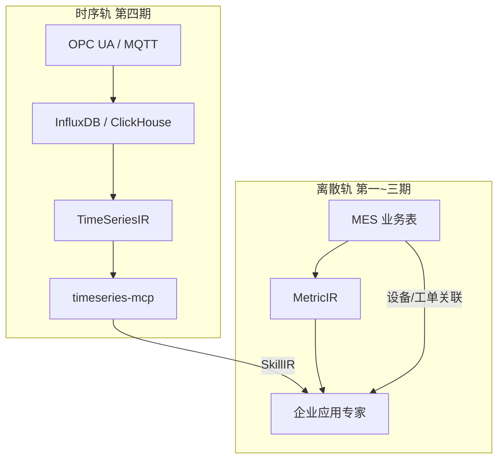

# 运行态第四期 · IoT 时序智能施工计划

> **版本**：R4 · 2026-06-15  
> **宪法**：[`33、运行态四期纲领`](./33、运行态四期开发纲领与架构白皮书.md) **第四期** · 第二部分 §0.7  
> **前置**：**M-P2**（[`37、第三期`](./37、运行态第三期·企业应用专家施工计划.md)）· 企业应用专家已配置  
> **工程规格来源**：[`26 号 ARCH-002`](./_archived-非施工依据/工业智能赛道-ARCH-002/26、玛维思物联网时序数据考量的第三期开发计划.md)（升格为第四期施工依据）

---

## 一、本期开发目标（唯一表述）

在 **离散数据湖 + 企业应用专家** 之上，增量建设 **工业物联时序** 能力：**TimeSeriesIR** + **OPC UA/MQTT** 接入 + **InfluxDB/ClickHouse** + **timeseries-mcp** + 车床/机床 **耗电、振动、温度** 的**预测预警**；经企业应用专家 SkillIR 挂载，与 MES 工单/设备/交期联动。

| 项 | 内容 |
|----|------|
| **里程碑** | **M-P4** |
| **工期** | **12 周**（R4-S0~S7） |
| **与 MetricIR** | **双轨** · 波形**禁止**写入离散 MetricIR 表 |

**验收金句**：OPC UA/MQTT 测点稳定入库；3 号车床**耗电/振动**异常 **预测预警** 并关联 **MES 设备主数据 + 在制工单**；企业应用专家可 NL 查询时序曲线。

---

## 二、交付物清单

| # | 交付物 | 说明 |
|---|--------|------|
| T1 | **TimeSeriesIR** Schema + **Studio** | 测点/采样率/窗口/retention |
| T2 | **OPC UA / MQTT** 接入网关 | 车床/机床/产线 PLC |
| T3 | **InfluxDB / ClickHouse** 集群 | 时序专用存储 |
| T4 | **timeseries-mcp** | `query_timeseries` · `get_latest` · `detect_anomaly` 【手工→半自动】 |
| T5 | **轻量异常检测 + 规则预测** | 耗电/振动趋势偏离 · **非**重型 ML 集群 |
| T6 | 企业应用专家 **SkillIR 挂载** timeseries-mcp | 与离散 data-mcp **并存** |
| T7 | AlertRuleIR **时序通道**（可选） | 与离散 Alert 分通道 |

**第四期不做**（33 第四章储备 · 触发后扩容）：Kafka/Flink 全厂流平台 · PB 级对象存储 · 重型 ML 训练集群 · 实时 3D 孪生。

---

## 三、离散 vs 时序双轨

| 维度 | 离散（MetricIR） | 时序（TimeSeriesIR） |
|------|------------------|----------------------|
| 数据 | 工单/报工/OEE | 耗电/振动/温度波形 |
| 存储 | SQL Server 分析库 | InfluxDB/ClickHouse |
| 查询 | MQL | PromQL 类 / 时序 API |
| MCP | data-mcp | **timeseries-mcp** |

---

## 四、Sprint 计划（12 周）

| Sprint | 周 | 关键任务 | 验收 |
|--------|-----|----------|------|
| **R4-S0** | 1.5 | 时序 POC：InfluxDB 写入 TPS · OPC UA 单机床 · 规模估算 | Go/No-Go（26 号 §1.2） |
| **R4-S1** | 2 | TimeSeriesIR Schema + Studio · 测点注册 UI | 业务人员注册测点 |
| **R4-S2** | 2 | MQTT/OPC UA 网关服务 · 设备映射 MES 设备主数据 | 3 台机床联调 |
| **R4-S3** | 1.5 | InfluxDB/ClickHouse 分层 · retention · 降采样 | 7 天热数据查询 P95 |
| **R4-S4** | 2 | **timeseries-mcp** 三工具+ · 单元测试 | MCP 协议通过 |
| **R4-S5** | 1.5 | 异常检测 Job · 耗电/振动预测规则 · 推送通道 | 提前预警可演示 |
| **R4-S6** | 1 | 企业应用专家挂载 timeseries-mcp · NL 时序问答 | 曲线+解读+工单关联 |
| **R4-S7** | 1.5 | **M-P4 UAT** · 压测 · AI-off（采集仍跑） | 见 §六 |

---

## 五、典型场景验收（制造企业）

| 场景 | 步骤 | 通过标准 |
|------|------|----------|
| **耗电异常** | 3 号车床电流曲线偏离 → 预警 | 推送设备管理员 + 厂长 · 关联设备 ID |
| **振动趋势** | 主轴振动 RMS 上升 → 预测 Job | 提前 ≥30min 预警（规则级） |
| **MES 联动** | 时序异常 + 在制工单 | 企业专家建议调产/保养（人审） |
| **NL 查询** | 「3 号机过去 1 小时耗电」 | timeseries-mcp → 曲线 + 文字解读 |

---

## 六、M-P4 验收清单

- [ ] TimeSeriesIR Studio：测点可配置，**不**进 MetricIR 表  
- [ ] OPC UA/MQTT ≥3 测点稳定入库 7×24  
- [ ] timeseries-mcp 与企业应用专家 SkillIR 挂载  
- [ ] 耗电/振动 **预测预警** ≥1 条端到端演示  
- [ ] 预警关联 **MES 设备表 + 工单**（非孤立 SCADA）  
- [ ] **AI-off**：时序采集/存储/规则 Job 仍运行；LLM 挂 = 传统曲线查看  
- [ ] **禁止** Kafka/Flink 作为第四期默认交付  

---

## 七、容量门禁（摘自 26 号 · ARCH-002）

| 场景 | 第四期设计上限 | 超限动作 |
|------|----------------|----------|
| 机床 × 传感器 | 100 台 × 10–20 点 | 第四期默认交付范围 |
| 写入 | ~5 万点/秒（中位） | 超 → 第四章 Kafka 储备评估 |
| SQL Server CDC | **禁止**承载波形 | 必须走时序库 |

---

## 八、禁止项

1. **禁止**波形写入 MetricIR / L2 离散分析库  
2. **禁止**第四期塞入 35~37 号 Sprint 验收  
3. **禁止**独立 SCADA 产品化 · 必须 SkillIR 挂载企业专家  
4. **禁止**未 M-P2 直接启动第四期  

---

## 本节核心表清单

| 表名 | 用途 |
|------|------|
| **TimeSeriesIR 持久化** | 【待源码验证】 |
| **MES 设备主数据** | 关联现有 EXT_/MES_ 表 |
| **时序告警 Job 登记** | 【待源码验证】 |

## 本节关键代码路径索引

| 能力 | 路径 |
|------|------|
| timeseries-mcp Host | 【待建 · R4-S4】 |
| OPC UA/MQTT 网关 | modularity/ 【待建 · R4-S2】 |
| TimeSeriesIR Studio | `jnpf-web-vue3/src/views/studio/` 【待建】 |
