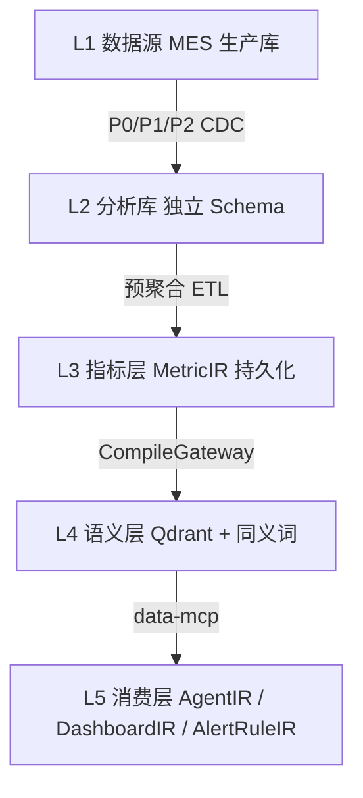
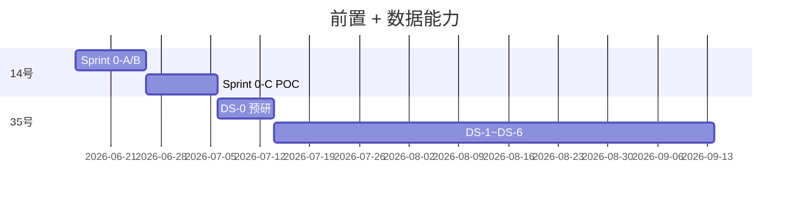

# V7.0 数据能力 Sprint 施工计划

> **版本**：V7.2 · 2026-06-15  
> **服务开发目标**：[`33 运行态四期 · 第〇章`](./33、运行态四期开发纲领与架构白皮书.md) **目标一（轻量数据湖）** + **目标二（P1 岗位专家）**  
> **全栈顺序**：[`36 号 §一`](./36、V7.0 AI原生低代码平台全栈开发总计划.md)  
> **不是**：目标三（P2 完整管理系统）——那在 10~12 号阶段五~六

---

## 〇、本计划只负责两个开发目标

| 目标 | 本计划负责的部分 | 终验 |
|------|------------------|------|
| **目标一** 轻量数据湖 | L1→L5 · MetricIR Studio · MQL 网关 · 30 MES 指标 · AlertRuleIR | M-G1 |
| **目标二 P1** 岗位专家 | AgentIR Studio · SkillIR(data-mcp) · 业务人员零代码配置 | **M-P1** |

**ARCH-002 边界**（第一期）：仅 MES **业务离散数据**；禁止 IIoT/传感器/Kafka/Flink（§二）。

**禁止当作本计划终验收**：内置 AI 业务助手页面 · ChiefOfStaffService · 语音 Demo。

---

| 维度 | ❌ 玛维思原方案（已废止） | ✅ V7.0 本计划 |
|------|---------------------------|----------------|
| 终验收 | 「AI 业务助手对话 Demo 通过」 | **MetricIR Studio 零代码配置** + AgentIR 挂载 SkillIR(data-mcp) |
| 交付形态 | 手写 `AiDataInsightCard`、AI 工作台 Vue 组件 | **DashboardIR / AlertRuleIR** 经 `CompileGateway` 编译产出 |
| LLM 路由 | 4 级专用分类器 + Qwen-1.8B | **裁定8**：规则引擎 80% + 主模型附带复杂度标签 |
| 跨租户 | `CrossTenantAccessService` 微服务 | **SchemaGovernor** + SqlSugar AOP；二次授权走 **FlowIR** |
| 向量检索 | 每租户独立 Collection / 纯倒排 | **Qdrant 双模**（ADR-002）+ Channel 同步 |
| 产品线 | 独立 DataPlatform 后台 CRUD | **MetricIR / AlertRuleIR / SkillIR** 持久化 + Studio 设计器 |

**Sprint 评审唯一问句**（白皮书第三章铁律2）：*「业务人员能否在 Studio 脱离开发人员零代码完成此能力？」* — 不能则 Sprint 未完成。

---

## 一、范围与交付物

### 1.1 第一阶段做（0–20 租户 · 10 周）

- MES **业务数据** L1→L5 闭环（工单/报工/质检/设备主数据/物料/人员/排班/库存）
- **MetricIR** 设计器 + **30 个标准 MES 指标**模板（ISA-95 / GB/T，见 §八）
- **AlertRuleIR** 静态阈值 + 定时扫描（非独立 Event Router 模块）
- **data-mcp** 三工具：`query_metrics` / `list_metrics` / `explain_metric`（手工封装，裁定4）
- **AgentIR** 极简配置：PersonaIR + SkillIR(data-mcp) + KnowledgeIR（Qdrant 语义层）
- NL→**MQL(JSON)**→.NET 引擎→SQL（**DataQueryGateway** 六步，见 §七）
- 独立 Schema + **SchemaGovernor** + P0/P1/P2 分级同步 + 预聚合指标表
- 弹性 RG **10/30/60** + Sentinel 限流

### 1.2 明确不做（约束二补充 · 来自 26 号边界）

- ❌ 传感器 / OPC UA / MQTT 高频时序接入  
- ❌ 预测性维护 / 设备健康度 ML  
- ❌ Kafka / Flink / InfluxDB / ClickHouse（触发条件见 33 第四章储备）  
- ❌ 数字孪生 / 3D 大屏（DashboardIR 阶段二）  
- ❌ 流程/表单/报表引擎 AI 化（阶段二 Foundry）  
- ❌ 内置「AI 业务助手」独立产品页作为终验收  

---

## 二、业务 MES 数据 vs IIoT 时序（ARCH-002 边界）

| 维度 | 第一期（本计划） | 第三期工业智能（储备） |
|------|------------------|------------------------|
| 数据本质 | 离散事件（工单、报工） | 连续波形（振动、温度、电流） |
| 采样 | 秒~分钟级 | 1Hz~10kHz |
| 写入 | INSERT/UPDATE | APPEND-ONLY 高频 |
| 存储 | SQL Server 分析库 | InfluxDB / ClickHouse / S3 |
| 查询 | **MetricIR → MQL** | TimeSeriesIR（储备）→ PromQL 类 |
| 组织 | JNPF Studio 子能力 | 并列「工业智能事业部」 |

**100 台机床 × 1000 传感器** 量级下，禁止将 CDC 单机方案硬扩；见 [`工业智能赛道-ARCH-002/26、…`](./_archived-非施工依据/工业智能赛道-ARCH-002/26、玛维思物联网时序数据考量的第三期开发计划.md)。

---

## 三、L1–L5 与 IR 映射（非独立技术栈）



| 层 | 玛维思原表/组件 | V7.0 IR 同构 |
|----|-----------------|--------------|
| L3 指标 | `BASE_METRIC_DEFINITION` | **MetricIR** JSON + 版本号 |
| L3 维度 | `BASE_DIMENSION_*` | MetricIR.dimensions |
| L4 语义 | `BASE_SYNONYM_DICT` + Qdrant | KnowledgeIR + Qdrant Payload `tenant_id` |
| L4 查询 | DataQueryGateway | MetricIR 编译产物 + 网关服务（非 CRUD 后台） |
| L5 预警 | 独立预警模块 | **AlertRuleIR** → 编译为 Hangfire/Quartz Job |
| L5 Agent | AI 工作台 | **AgentIR** + SkillIR(data-mcp) |

---

## 四、20 租户容量与性能门禁（来自 28 号 · 保留）

### 4.1 数据量基线（20 租户）

| 指标 | 设计值 | 极限值 |
|------|--------|--------|
| 租户数 | 20 | 20（阶段一硬顶） |
| 源表/租户 | 40–50 | 150（100 租户演进储备） |
| 日增量行/租户 | 300 万 | 600 万 |
| 分析库总行/租户 | 5–10 亿 | 15 亿 |
| 热数据保留 | 6 个月 | 12 个月（触发分库） |

### 4.2 性能基线（20 租户并发）

| 场景 | P50 | P95 | P99 |
|------|-----|-----|-----|
| 简单指标（预聚合） | <0.5s | <1.5s | <2.5s |
| 中等（单表+维度） | <1.0s | <3.0s | <4.0s |
| 复杂（JOIN+归因） | <2.0s | <5.0s | <8.0s |
| MQL→SQL | <50ms | <100ms | <200ms |
| 端到端 NL→结果（简单） | <2.0s | <3.0s | <5.0s |
| 端到端 NL→结果（复杂） | <4.0s | <6.0s | <10s |

### 4.3 并发基线

| 维度 | 目标 | 极限 | 手段 |
|------|------|------|------|
| 早报峰值 QPS | 50 | 100 | 凌晨预计算 + 错峰 |
| 白天 AI 查询 | 10 | 30 | Sentinel 全局 200 QPS |
| 单租户 QPS | 20 | 50 | 租户级 FlowRule |
| CDC 吞吐 | 2000 TPS | 5000 TPS | P0/P1/P2 分级 |

---

## 五、SaaS 容量风险门禁（来自 25 号 · ARCH-001）

v2.0 单租户方案直接套 100 租户 SaaS 的 **7 个致命漏洞**，转化为阶段一门禁：

| # | 漏洞 | 阶段一门禁 / 缓解 |
|---|------|-------------------|
| 1 | 单机 CDC × 15000 表 | 阶段一仅 20 租户 × 40 表；**P0≤10 张/租户** |
| 2 | 50 亿行 + 500 QPS 单机 | **预聚合指标表**（非明细宽表）+ RG 10/30/60 |
| 3 | 共享表 + F_TENANT_ID | **废止**；独立 Schema + SchemaGovernor |
| 4 | LLM 成本/延迟爆炸 | 规则拦截 80%；缓存 MQL 结果；早报预计算 |
| 5 | Redis 百万 key | 租户前缀 + TTL 5min；热点指标 LRU |
| 6 | 60 万 RAG 节点内存 | **单 Collection** + Payload 过滤（ADR-002） |
| 7 | 100 租户同时早报 | **错峰调度**（租户 hash 分散 04:00–06:00） |

**演进触发**（写入 33 第四章储备，阶段一禁止提前引入）：租户 >50 → 评估 Kafka；单租户 >10 亿行 → L4 对象存储；日均查询 >10 万 → 专用分类模型储备。

---

## 六、同步分层与 DATA_SYNC_TASK

### 6.1 P0/P1/P2 分级矩阵（来自 28 号 · 对齐裁定7）

| 级别 | 表类型 | 方式 | 频率 | 延迟目标 | 阶段一量 |
|------|--------|------|------|----------|----------|
| **P0** | 工单状态、报工、质检、设备状态 | CDC | 秒级 | P95 <1min | 5–10 张/租户 |
| **P1** | 库存、人员、排班 | 时间戳增量 | 5–15min | P95 <1h | 5–10 张/租户 |
| **P2** | 产品目录、BOM、工艺路线 | 全量覆盖 | 凌晨 03:00 | P95 <24h | 5–10 张/租户 |
| **P3** | 归档/冷数据 | SWITCH PARTITION | 日级 | — | 阶段二 |

### 6.2 预聚合策略（否决明细宽表）

```
❌ MES_AI_WIDE_TABLE 日 ETL 6000 万行/日 → 宽表爆炸
✅ 30 指标 × 4 粒度(时/日/周/月) = 120 行/租户/日
   20 租户 = 2400 行/日 → AI 查询命中预聚合 P95 <1s
   明细钻取 → 生产库只读副本 或 L1 热数据 7 天窄表
```

### 6.3 DATA_SYNC_TASK 核心字段（【待源码验证】表名以 DDL 为准）

| 字段 | 说明 |
|------|------|
| F_ID | 主键 |
| F_TENANT_ID | 租户 |
| F_SOURCE_TABLE / F_TARGET_TABLE | 源/目标 |
| F_SYNC_LEVEL | P0/P1/P2/P3 |
| F_LAST_SYNC_TIME | 水位 |
| F_STATUS | pending/running/success/dead |
| F_RETRY_COUNT | 死信重试 |
| F_ERROR_MSG | 失败原因 |

同步完成 → Channel 推送 Qdrant 向量更新；禁止 `Task.Run` 裸异步（裁定2）。

---

## 七、DataQueryGateway 与 MQL 链路（来自 24 号 · 升维）

### 7.1 强制链路

```
NL → 规则预分类(裁定8) → LLM → MQL(JSON) → .NET MqlTranslator → SQL → 执行
```

**禁止** LLM 直接写 SQL（ADR-005 思想，持久化进 MetricIR 编译规范）。

### 7.2 DataQueryGateway 六步

1. **租户上下文**：`SESSION_CONTEXT` + SchemaGovernor 路由；漏传 TenantId → 空集  
2. **MQL Schema 校验**：JsonSchema v1.0（basic/derived/ratio/cumulative/conversion）  
3. **白名单解析**：TSqlParser；仅 SELECT；强制 TOP 1000  
4. **MetricIR 绑定**：指标 code → 物理表/预聚合表  
5. **审计**：`BASE_AI_QUERY_AUDIT`（tenant/user/mql/sql/duration）  
6. **Sentinel**：全局 + 租户 QPS；慢查询熔断 RT>5s  

### 7.3 Schema RAG 召回（升维 ADR-002）

1. 分词 + `BASE_SYNONYM_DICT` 同义词扩展  
2. Qdrant 向量 Top-K（Payload `tenant_id` 强制过滤）  
3. 降级：Qdrant 熔断 → SQL Server `CONTAINS` 全文  
4. 注入 LLM Prompt + **F_SAMPLE_MQL** Few-Shot（存 MetricIR 样例，非独立 CRUD）  

### 7.4 data-mcp 三工具（阶段一手工封装）

| 工具 | 入参 | 出参 |
|------|------|------|
| `query_metrics` | MQL JSON | `{ data, total, interpretation? }` |
| `list_metrics` | category? | MetricIR 摘要列表 |
| `explain_metric` | metric_code | 口径说明 + 公式 + 维度 |

AgentIR 通过 **SkillIR** 挂载上述工具，禁止新建 `MesQueryAgentService` 等业务命名 Service。

---

## 八、30 个标准 MES 指标（行业标准模板）

> 录入方式：**MetricIR Studio 批量导入** + 仿真验证；非后台 CRUD 手工填表。

| # | code | 名称 | 类别 | 标准 |
|---|------|------|------|------|
| 1 | yield_rate | 良品率 | quality | GB/T 28239 |
| 2 | defect_rate | 不良率 | quality | GB/T 28239 |
| 3 | rework_rate | 返工率 | quality | ISO 9001 |
| 4 | oee | OEE 设备综合效率 | efficiency | ISA-95 |
| 5 | equipment_availability | 设备可用率 | efficiency | GB/T 25475 |
| 6 | equipment_performance | 设备性能率 | efficiency | GB/T 25475 |
| 7 | plan_completion_rate | 计划达成率 | production | ISA-95 |
| 8 | daily_output | 日产量 | production | — |
| 9 | monthly_output | 月产量 | production | — |
| 10 | on_time_delivery_rate | 订单准时交付率 | production | GB/T 25479 |
| 11 | cycle_time | 生产周期 | production | — |
| 12 | work_hour_efficiency | 工时效率 | efficiency | GB/T 28240 |
| 13 | personnel_efficiency | 人均产值 | efficiency | — |
| 14 | material_consumption | 物料消耗量 | material | — |
| 15 | material_yield | 材料利用率 | material | GB/T 25485 |
| 16 | inventory_turnover | 库存周转 | material | — |
| 17 | quality_inspection_pass_rate | 质检合格率 | quality | — |
| 18 | first_pass_yield | 首次合格率 | quality | — |
| 19 | scrap_rate | 报废率 | quality | — |
| 20 | production_schedule_adherence | 排程遵守率 | production | — |
| 21 | shift_output | 班组产量 | production | — |
| 22 | workshop_output_ranking | 车间产量排名 | production | — |
| 23 | worker_attendance_rate | 出勤率 | hr | — |
| 24 | active_orders | 在制工单数 | production | — |
| 25 | completed_orders | 完工工单数 | production | — |
| 26 | pending_quality_inspection | 待质检数 | quality | — |
| 27 | on_time_reporting_rate | 准时报工率 | production | — |
| 28 | equipment_failure_count | 设备故障次数 | efficiency | GB/T 25482 |
| 29 | average_repair_time | MTTR 平均修复时间 | efficiency | GB/T 25482 |
| 30 | cost_per_unit | 单位生产成本 | production | — |

**仿真验证**（Sprint DS-2 必过）：抽样 30 天分析库数据 → 执行 MetricIR 公式 → 偏离预期 >20% 告警并阻断发布。

---

## 九、10 周 Sprint 计划（V7.0 验收重写）

> **前置**：14 号 Sprint 0-C POC-A~F 全绿。本计划 **DS-0** 为数据域专项预研，不与 0-C 重复。

### 9.1 总览

| Sprint | 工期 | 目标 | V7.0 关键交付 |
|--------|------|------|---------------|
| **DS-0** | 1.5 周 | 数据域预研 + 退出决策 | 5 POC + 50 query 评测集 |
| **DS-1** | 1.5 周 | 隔离 + 同步 | SchemaGovernor + P0/P1 链路 |
| **DS-2** | 2 周 | MetricIR + 冷启动 | 30 指标 + Studio 导入 + Qdrant |
| **DS-3** | 1 周 | 网关 + MQL | DataQueryGateway + MqlTranslator |
| **DS-4** | 1.5 周 | Agent + MCP | data-mcp + AgentIR Studio + 规则路由 |
| **DS-5** | 1 周 | AlertRuleIR + 运维 | 预警编译 + 早报错峰 + 监控 |
| **DS-6** | 2 周 | 测试 + UAT | 压测 + **Studio 零代码验收** + 断电降级 |

### 9.2 DS-0 预研 POC（与 14 附录 A 衔接）

| POC | 工期 | 验收 | 失败回退 |
|-----|------|------|----------|
| DS-POC-1 SchemaGovernor 批量 DDL | 2d | 3 租户并发隔离 | 应用层兜底（临时） |
| DS-POC-2 多租户 CDC | 2d | 15 链路 P95<1min | 租户串行 worker |
| DS-POC-3 6000 万行/日压测 | 2d | 7×24 无 OOM | 启动分库 Plan B |
| DS-POC-4 主模型+规则分类 | 1d | 50 query ≥85% | 全云端（成本告警） |
| DS-POC-5 P0/P1/P2 延迟 | 1d | 见 §6.1 | P0 降为 5min 增量 |

**周五决策会**：输出 DS-1 任务分解；任一 POC 失败可 **暂停数据 Sprint**（不强行 10 周交付）。

### 9.3 DS-2 MetricIR Studio（核心 — 取代「指标后台 CRUD」）

| 任务 | 工期 | 验收 |
|------|------|------|
| MetricIR JSON Schema + 持久化表 | 2d | 与 POC-A 类型对齐 |
| Studio 指标设计器（公式/维度/同义词/Few-Shot） | 4d | **业务人员 30min 内新建指标** |
| 30 标准模板一键导入 | 1d | 全部导入成功 |
| 指标仿真验证 Job | 2d | 30/30 通过 |
| Qdrant Channel 同步 | 1d | 熔断降级演练通过 |

### 9.4 DS-4 AgentIR + data-mcp（取代 AI 工作台 Demo）

| 任务 | 工期 | 验收 |
|------|------|------|
| data-mcp 三工具手工封装 | 2d | MCP 协议握手 + 单元测试 |
| AgentIR Studio（Persona/Skill/Knowledge） | 3d | **业务人员配置查询 Agent，无代码** |
| 规则引擎 + 主模型复杂度标签 | 2d | 禁止 4 级专用分类器 |
| DashboardIR 编译「指标卡片」（非手写 Vue） | 2d | 从 MetricIR 编译出 PC 卡片 |

### 9.5 DS-5 AlertRuleIR + 早报

| 任务 | 工期 | 验收 |
|------|------|------|
| AlertRuleIR Schema + Studio | 2d | 阈值 + cron 零代码 |
| CompileGateway → Hangfire Job | 1d | 触发审计可追溯 |
| 早报预计算 + 租户 hash 错峰 | 2d | 08:00 峰值 P95<3s |

### 9.6 DS-6 UAT 铁律

1. **Studio 零代码**：随机业务人员配置 1 个新指标 + 1 条预警 + 1 个 Agent（仅挂载 data-mcp）  
2. **跨租户**：漏传 TenantId 100% 空集  
3. **断电降级**：切断 LLM + Qdrant，JNPF 传统功能无阻塞（白皮书铁律3）  
4. **性能**：20 租户并发 P95<4s（简单查询）  
5. **禁止**以「语音问 OEE Demo」替代上表 1–4  

### 9.7 里程碑

| 里程碑 | 周末 | 业务语言 |
|--------|------|----------|
| M1 | DS-1 | 「数据进得来、租户分得清」 |
| M2 | DS-2 | 「口径对齐了、Studio 能配指标」 |
| M3 | DS-3 | 「机器能查、SQL 攻不破」 |
| M4 | DS-4 | 「Agent 能问数、不是开发写的页面」 |
| M5 | DS-6 | 「20 租户可上线、AI 挂了也能用」 |

---

## 十、Sentinel 与 RG（工程规格摘要）

### 10.1 RG 三级池（裁定6 · 比例 10/30/60）

- 系统预留 10% · 突发共享 30% · 租户保障 60%  
- 分类器函数依赖 `SESSION_CONTEXT('TenantPlan')`；未注入连接拒绝 AI 查询类 workload  

### 10.2 Sentinel 规则（来自 28 号 · 保留）

```csharp
// 全局 AI 查询 QPS 200；单租户 20；慢查询 RT>5s 熔断
// 实现路径：【待源码验证】infrastructure 限流模块
```

---

## 十一、降级路径（NL 查询）

```
正常:   NL → 规则 → LLM → MQL → SQL → 预聚合/副本
降级一: NL → 模板匹配 → MQL → SQL（LLM 不可用）
降级二: NL → 全量 MetricIR 元数据 → LLM（Qdrant 不可用）
降级三: MQL → 生产库只读副本（分析库过载）
```

---

## 十二、与 14 号前置 Sprint 的衔接



| 14 号 POC | 本计划继承点 |
|-----------|--------------|
| POC-A AgentIR | DS-4 AgentIR Studio |
| POC-B Qdrant | DS-2 语义层 + DS-4 KnowledgeIR |
| POC-C MCP | DS-4 data-mcp |
| POC-D RG | DS-1 + DS-3 Sentinel |
| POC-E SchemaGovernor | DS-1 租户 Schema |
| POC-F DKEE | 阶段二；DS-2 指标发布人工确认门 |

---

## 十三、验收清单（Checklist）

- [ ] MetricIR Studio：业务人员新建/修改指标，无需开发  
- [ ] AlertRuleIR Studio：业务人员配置阈值预警  
- [ ] AgentIR Studio：挂载 SkillIR(data-mcp)，无业务命名 Service  
- [ ] 30 标准指标导入 + 仿真全绿  
- [ ] DataQueryGateway：注入拦截 100%；TOP 1000 强制  
- [ ] P0/P1/P2 延迟达标；DATA_SYNC_TASK 死信可重放  
- [ ] Qdrant 熔断 → CONTAINS 降级演练通过  
- [ ] RG 10/30/60 + Sentinel 压测报告  
- [ ] 断电 AI UAT 通过  
- [ ] 无 `WorkbenchAgent` / `AiDataInsightCard` 手写产物作为终交付  

---

## 本节核心表清单

| 表名 | 用途 |
|------|------|
| **DATA_SYNC_TASK** | 分级同步任务与水位 |
| **BASE_AI_QUERY_AUDIT** | NL/MQL/SQL 审计 |
| **BASE_SYNONYM_DICT** | 同义词/黑话（→ KnowledgeIR 同步源） |
| MetricIR 持久化表 | 【待源码验证】与 POC-A 统一命名 |

## 本节关键代码路径索引

| 能力 | 路径（【待源码验证】） |
|------|------------------------|
| SchemaGovernor | `backend/framework/` 或 `modularity/` 待建 |
| DataQueryGateway | `backend/modularity/` 数据能力模块待建 |
| MqlTranslator | 同上 |
| data-mcp Server | `backend/infrastructure/` MCP 宿主待建 |
| MetricIR Studio | `jnpf-web-vue3/src/` Studio 扩展待建 |
| CompileGateway | 与 10–12 号升维计划 IR 编译器同轨 |

---

**签批**：数据能力 Sprint 以本文 + 33 号白皮书为唯一施工包；玛维思 24–28 原文仅作 `_archived/` / `_destroyed/` 历史参考。
