> 📦 **工程细节已提炼** → 《33、架构纲领和架构白皮书》第六章 + 《35、V7.0数据能力Sprint施工计划》  
> 本文禁止作为施工依据；查阅已吸收内容请打开上述两文档。
> 🚫 **已废止 · 禁止引用**  
> 本文因「造高铁 / 旧小区改造」架构偏差已被架构委员会废止。  
> 唯一施工宪法：《33、架构纲领和架构白皮书 V7.0》  
> 废止日期：2026-06-15 · 索引见白皮书第五章  

---
D爷，你这个分析离真实的架构设计还很遥远，都是空洞的理论，请你借鉴清言的架构分析，我觉得非常有价值，就是在具体的企业业务智能体构建上，好像也还是有“旧小区改造，遍地井盖的烟囱模式”嫌疑，另外还没有意识到要开发出具有“岗位专家”/"岗位总管"这样的企业管理系统，我们的AI原生低代码开发平台也需要进行相应的改造。就是要造出高铁，我们就不能还是用造绿皮火车的车间来干。请看清言的分析：先把结论放前面：
- 你客户说的“工作台智能汇总、一句话报表、对话式排程”，表面是 3 个功能，本质是**一个 AI 总管家（Chief of Staff）+ 一套 Agent OS + 若干垂直智能体**。
- 基于你现有的 JNPF V5.2 架构（IR + 五阶段流水线 + CompileGateway + Baobab-Foundry），**不需要重做底层，而是要“往上再搭三层”**：
  1）Agent OS 层（记忆 / 工具 / 规划 / 权限 / MCP 适配）  
  2）领域智能体层（工作台 Agent、报表 Agent、排程 Agent、质检 Agent 等）  
  3）ChiefOfStaff 总管家（统一入口、主动感知、任务编排、多通道触达）
  下面我按“先对齐行业实践 → 再落回 JNPF 架构 → 具体要新增什么”来讲。
---
## 一、先看行业：2026 年企业 AI Agent 的“最佳实践”长什么样
综合 2026 年企业级 Agent 平台的实践（Salesforce Agentforce、钉钉悟空、微软 Copilot Studio、工业 X-Agent 等），有几个关键共识：
1. **从“对话助手”升级为“数字员工 / 岗位专家”**  
   - Salesforce Agentforce：CRM 领域的“自动化管家”，单季签约 3000 付费客户，强调在 Data Cloud 上实时推理并自动完成业务动作。  
   - 钉钉悟空：把 IM 重构为 Agent 平台，“沟通即执行”，60% 员工搭建 AI 工作流。  
   - 腾讯 WorkBuddy：定位“从超级个体到超级团队”，把专家能力、助理、团队空间统一成组织级智能。
2. **企业级 Agent 的核心是“自主闭环 + 工具调用 + 记忆 + 规划”**  
   - 典型架构：  
     - 大模型为“大脑”  
     - 规划模块：拆解任务、选工具、定步骤  
     - 记忆系统：短期（对话）+ 长期（向量库 / 知识图谱）  
     - 工具层：RAG、API、RPA、数据库、邮件、业务系统连接器  
   - 关键特征：**能跨系统执行动作，而不只是回答问题**。
3. **多智能体协作 + MCP/A2A 协议成为标配**  
   - MCP（Model Context Protocol）成为统一连接层，类似“AI 的 USB-C”，让 Agent 安全调用外部工具与数据源。  
   - 企业级架构通常是：**编排层（Dify/Coze/自研）+ 执行层（AutoGen/LangGraph）+ 模型层（多模型路由）+ 工具层（MCP）**。  
   - Multi-Agent 协同是分水岭：财务 Agent、采购 Agent、客服 Agent 自主协商，而不是简单串联。
4. **工业 / MES 场景的典型做法：感知 → 决策 → 执行 → 反馈**  
   - 排产 Agent：实时监控订单、设备、物料，动态重排计划，把排产时间从 6 小时压到 0.5–1 小时。  
   - 质检 Agent：视觉 + 工艺参数，实时识别缺陷 → 自动追溯根因 → 调整工艺参数。  
   - 设备 / 能源 / 安全 Agent：预测性维护、能源优化、主动安全监控。  
   - 技术实现上：MES 核心功能（工单、质量、物料）封装成 MCP 服务，Agent 通过调用工具实现闭环。
5. **低代码 + Agent 融合：自然语言交互 + 行业 DSL + 多模态界面**  
   - AI 低代码平台从“可视化配置”升级为“智能建模”，自然语言成为标配交互方式。  
   - 垂直行业提供专属模型库与行业 DSL（如生产调度语言、风控规则语言）。  
   - 低代码平台负责“编排 + 页面 + 流程”，Agent 负责“思考 + 调用 + 执行”。
   把这些提炼一下，对你有用的“设计约束”是：
> **JNPF 要做的，不是再做一个聊天机器人，而是：  
> 在现有 IR + 编译器 + 五阶段流水线之上，搭一套 Agent OS + 若干岗位级智能体，  
> 让“AI 总管家”能主动感知、主动建议、主动执行、主动汇报。**
---
## 二、把行业实践“翻译”到 JNPF：新增三层架构
先整体看一眼，在你们现有 V5.2 架构之上，需要补的三层：

```mermaid
flowchart LR
  subgraph L0["已有 V5.2 基座"]
    IR["IR + 组件注册表 + 表达式引擎"]
    COMP["编译器（Vue3/大屏/UniApp）+ CompileGateway"]
    AI1["五阶段流水线 + 多角色 Agent + LlmGateway"]
    DATA["BASE_AI_* + BASE_KNOWLEDGE_* + 多租户沙箱"]
  end
  subgraph L1["新增：Agent OS 层"]
    MEM["记忆系统（短期/长期/向量库）"]
    TOOL["工具层（MCP Server + 内部 API 封装）"]
    PLAN["规划与反思（任务拆解/重试/仲裁）"]
    PERM["权限与审计（TenantId + 操作范围）"]
  end
  subgraph L2["新增：领域智能体层"]
    A_WORK["工作台 Agent（汇总/提醒/待办）"]
    A_RPT["报表 Agent（一句话报表 + 解读）"]
    A_MES["MES Agent（排程/质检/物料）"]
    A_BIZ["业务 Agent（审批/录单/派单/邮件）"]
  end
  subgraph L3["新增：ChiefOfStaff 总管家"]
    CHIEF["总管家 Agent（统一入口 + 主动感知 + 任务编排）"]
    UX["多通道 UI（工作台/移动/IM/邮件/大屏）"]
  end
  L0 --> L1 --> L2 --> L3
```

### 2.1 L1：Agent OS 层（你们现在缺的“操作系统”）
**目标**：让所有 Agent 有“记忆 + 手 + 脑子 + 规矩”。
#### 2.1.1 记忆系统
- **短期记忆**：  
  - 基于 LLM 上下文 + 会话存储，保留当前对话、中间步骤、工具返回结果。  
  - 可以用 `BASE_AI_PIPELINE_MESSAGE` 扩展或新增 `AGENT_SESSION_CONTEXT` 表。
- **长期记忆**：  
  - 用户偏好、常用操作、历史决策（审批习惯、报表偏好）。  
  - 用向量库（Milvus/Qdrant）存用户行为与业务对象的 embedding，支持“你上次怎么处理的”这类 RAG 查询。
- **企业知识记忆**：  
  - 已有 `BASE_KNOWLEDGE_NODE / EDGE`，继续用 SQL Server 作为唯一运行时。  
  - 新增：**知识版本 + 半衰期**，支持“过期知识自动降级为 deprecated”（对齐 D 爷 7 稿改进）。
#### 2.1.2 工具层（MCP Server + 内部 API 封装）
2026 年实践普遍把业务能力封装为 MCP 工具，让 Agent 通过统一协议调用。
对 JNPF，需要新增：
1. **MCP Server 注册表**  
   - 表：`BASE_MCP_SERVER`（id, name, endpoint, auth_type, tenant_id, status）  
   - 每个内部系统（MES/ERP/WMS/OA）对外暴露的能力都注册为 MCP 工具。
2. **典型 MCP Server：**
   - `report-mcp`：封装现有报表引擎，支持“生成某类报表 + 刷新数据 + 导出”。  
   - `workflow-mcp`：封装 FlowIR + 工作流引擎，支持“启动流程 / 查询状态 / 审批”。  
   - `data-mcp`：封装 SqlSugar 查询，支持“按实体 + 条件取数 + 聚合”。  
   - `mes-mcp`：封装 MES API（排程、工单、质量、设备）。
3. **MCP Gateway**  
   - 统一鉴权 + 限流 + 审计，与现有 `LlmGatewayService` 协同，确保每次工具调用都写 `BASE_AI_CALL_LOG`。
#### 2.1.3 规划与反思
- **规划器 Planner**：  
  - 输入：用户自然语言意图 + 可用 MCP 工具列表。  
  - 输出：任务拆解为子任务链 + 每一步调哪个工具、传什么参数。  
  - 可以先用 LLM 做规划，再考虑引入轻量决策树/规则约束（避免“跑偏”）。
- **反思 & 重试**：  
  - 执行后检查工具返回结果、HTTP 状态、业务错误码。  
  - 失败则：修正参数 / 换工具 / 换模型 / 请求人类介入，并写入 `BASE_AGENT_EXECUTION_LOG`。
#### 2.1.4 权限与审计
- **权限模型**：  
  - Agent 操作必须在特定 TenantId + Role 范围内，禁止跨租户。  
  - 每个工具标注所需权限（如 `report:generate`, `flow:start`, `mes:schedule`），Agent 调用前检查。  
- **审计**：  
  - 所有 Agent 调用（LLM + MCP）都进 `BASE_AI_CALL_LOG` + `BASE_AGENT_EXECUTION_LOG`。  
  - 创始人菜单可查“谁让 AI 做了什么”，满足合规要求。
---
### 2.2 L2：领域智能体层（先做 3+2 个核心 Agent）
结合你客户提的 3 个需求 + 行业高频场景，优先做：
1. **工作台 Agent（WorkbenchAgent）** – 对应“工作台智能汇总 + 重要提示”
2. **报表 Agent（ReportAgent）** – 对应“一句话生成数据报表”
3. **MES 排程 Agent（SchedulingAgent）** – 对应“对话式生成排程表”
4. **业务流程 Agent（ProcessAgent）** – 智能审批 / 智能填表 / 智能派单（冰山之下）
5. **质检 / 设备 Agent（QualityAgent / EquipmentAgent）** – 工业场景刚需
#### 2.2.1 工作台 Agent（WorkbenchAgent）
**职责**：  
- 每天早上自动为用户生成“今日工作简报”：  
  - 待办任务（从工作流、审批、工单抽取）  
  - 重要提示（合同到期、异常指标、风险）  
  - 昨日工作完成情况（已审、已批、已生成的报表/排程）
  **关键数据流**：
- 输入：  
  - 用户 ID + 租户 ID  
  - 权限范围内的业务对象（订单、合同、工单、报表）  
- 处理：  
  1. 从工作流引擎拉取“我的待办”。  
  2. 从知识图谱 + 报表数据中识别“异常 / 风险 / 到期”。  
  3. 从历史记忆中学习用户关注点（如“老板总看华东区销售”）。  
- 输出：  
  - 工作台卡片：待办列表 + 风险卡片 + 关键指标变化 + AI 建议动作。
  **与现有系统集成**：
- 利用现有 `BASE_AI_PIPELINE` + `BASE_AI_PIPELINE_MESSAGE` 存储每日简报生成记录。  
- 工作台前端新增 `AiWorkbenchSummary` 组件，支持“刷新简报 / 查看详情 / 执行建议动作”。
#### 2.2.2 报表 Agent（ReportAgent）
**职责**：  
- 一句话生成报表：  
  - “帮我生成华东区上月销售毛利对比表”  
  - “按产品线看本季度退货率趋势”  
- 自动解读报表：异常点归因、关键结论、行动建议。
**关键数据流**：
- 输入：  
  - 自然语言描述 + 当前租户数据范围。  
- 处理：  
  1. 意图识别 + 指标映射（“退货率” → 退货订单数/总订单数）。  
  2. 调用 `data-mcp` 查询数据 + 聚合。  
  3. 选择可视化类型（折线/柱状/饼图）并生成图表配置。  
  4. LLM 生成解读文本。  
- 输出：  
  - 报表页面（可嵌入大屏 / 工作台）  
  - 解读摘要 + 下一步建议。
  **与现有系统集成**：
- 报表配置可转为现有大屏 IR（`DashboardIR`），通过 `DashboardCompiler` 生成页面。  
- 报表元数据存入 `BASE_REPORT_TEMPLATE`（新增），关联 IR + 查询语句 + 刷新策略。
#### 2.2.3 MES 排程 Agent（SchedulingAgent）
**职责**：  
- 对话式生成“车间下周排程表”，并考虑物料、设备、人员约束。  
- 支持插单、设备故障等异常时自动重排。
**关键数据流**：
- 输入：  
  - 车间 ID + 时间范围 + 订单优先级 + 约束条件。  
- 处理：  
  1. 调用 `mes-mcp` 获取：工单、设备能力、物料库存、工艺路线。  
  2. 构建排程问题（约束满足 / 优化问题）。  
  3. LLM 生成初始方案 → 工具计算可行解 → 对比多方案 → 选最优。  
- 输出：  
  - 甘特图形式排程表（可转为 `DashboardIR` 或 FlowIR）。  
  - 风险提示（瓶颈工序、缺料风险）。
  **与现有系统集成**：
- 排程结果写入 MES 系统，同时生成 `FlowIR` 或 `DashboardIR` 在大屏展示。  
- 使用 `SandboxScheduler` 在沙箱中验证排程方案，避免直接在生产试错。
#### 2.2.4 业务流程 Agent（ProcessAgent）– 冰山之下
- **智能审批**：  
  - 预审 + 风险评估 + 建议意见，人类只做“同意/驳回”。  
- **智能填表**：  
  - 根据历史 + 上下文自动填写 80% 字段，用户只补关键项。  
- **智能派单**：  
  - 根据规则 + 负荷 + 技能，自动派发工单/任务。
  这些可以复用现有工作流引擎 + 表单引擎，通过 `workflow-mcp` + `form-mcp` 实现。
#### 2.2.5 质检 / 设备 Agent – 工业场景刚需
- **质检 Agent**：  
  - 对接视觉检测系统，自动识别缺陷 → 记录不良品 → 触发返工/报废流程。  
- **设备 Agent**：  
  - 预测性维护，提前告警 + 自动创建维修工单。
---
### 2.3 L3：ChiefOfStaff 总管家（客户真正感知到的“AI 管家”）
**不是简单聊天框**，而是：
- **主动感知**：定时巡检数据 + 事件流，发现“3 号机 OEE 异常 + 客户 A 合同即将到期 + 下季度订单可能下滑”。  
- **主动建议**：把问题 + 方案 + 决策权打包推给用户。  
- **主动执行**：获得授权后，自动调用子 Agent 处理（修改排程 / 通知供应商 / 起草合同）。  
- **主动汇报**：每日/每周自动发工作简报。
**关键设计**：
1. **统一入口**：  
   - 工作台右下角“AI 管家”入口，移动端、IM、大屏都可以接入。  
2. **多通道触达**：  
   - 桌面工作台 + 移动 App 推送 + 邮件摘要 + IM 机器人 + 大屏数字人播报。  
3. **渐进式授权**：  
   - 建议模式（0% 自主） → 协作模式（50% 自主） → 托管模式（90% 自主）。  
4. **任务编排**：  
   - 总管家根据意图选择工作台/报表/排程/业务 Agent，串行或并行执行，并汇总结果。  
   - 使用现有 `CompileGateway` 的多目标编译能力，把“生成报表 + 生成排程 + 生成页面”打包执行。
---
## 三、具体要新增的功能 / 模块（清单版）
把上面架构翻译成“要开发什么”，按模块列：
### 3.1 Agent OS 层
| 模块       | 主要内容                                                     | 对应表 / 文件                                                | 与现有 V5.2 的关系                                           |
| ---------- | ------------------------------------------------------------ | ------------------------------------------------------------ | ------------------------------------------------------------ |
| 记忆系统   | 短期记忆（会话）、长期记忆（向量）、企业知识记忆             | 新增 `AGENT_SESSION`、`AGENT_SESSION_CONTEXT`；复用 `BASE_KNOWLEDGE_*` | 与 `BASE_AI_PIPELINE_MESSAGE` 协同，长期记忆用向量库（可独立部署） |
| MCP 工具层 | MCP Server 注册表 + MCP Gateway + 内部系统 MCP Server（report / workflow / data / mes） | 新增 `BASE_MCP_SERVER`、`BASE_MCP_CALL_LOG`；新增 `src/core/agent/mcp/` | 调用现有报表引擎、工作流引擎、数据层，仅封装一层             |
| 规划与反思 | Planner（LLM + 规则）、执行监控、重试/仲裁                   | 新增 `AGENT_PLAN`、`AGENT_EXECUTION_LOG`；复用 `BASE_AI_CALL_LOG` | 依赖 LlmGatewayService、多模型路由                           |
| 权限与审计 | Agent 操作权限、工具权限、审计日志                           | 扩展 `BASE_AI_CALL_LOG`；新增 `AGENT_OPERATION_LOG`          | 与现有 TenantId + ITenantFilter 对齐                         |
### 3.2 领域智能体层
| Agent           | 核心能力                         | 关键数据源                 | 依赖的 MCP Server                           |
| --------------- | -------------------------------- | -------------------------- | ------------------------------------------- |
| 工作台 Agent    | 每日简报、待办汇总、重要提示     | 工作流待办、合同/证照/指标 | `workflow-mcp`、`data-mcp`、`knowledge-mcp` |
| 报表 Agent      | 一句话生成报表 + 解读 + 自动刷新 | 业务数据、报表元数据       | `report-mcp`、`data-mcp`                    |
| 排程 Agent      | 车间排程 + 插单重排 + 风险提示   | MES 工单/设备/物料         | `mes-mcp`、`workflow-mcp`                   |
| 业务流程 Agent  | 智能审批/填表/派单               | 审批单、表单、工单         | `workflow-mcp`、`form-mcp`                  |
| 质检/设备 Agent | 视觉质检、预测维护、工艺调整     | IoT/SCADA、MES 质量        | `mes-mcp`、`iot-mcp`                        |
### 3.3 ChiefOfStaff 总管家层
| 模块         | 功能                                                  | 实现要点                                                    |
| ------------ | ----------------------------------------------------- | ----------------------------------------------------------- |
| 总管家 Agent | 统一入口、意图路由、任务编排、多通道输出              | 新增 `ChiefOfStaffAgent`，编排其他 Agent                    |
| 多通道 UI    | 工作台卡片、移动推送、IM 机器人、邮件摘要、大屏数字人 | 新增前端组件 `AiChiefOfStaffPanel`、IM 集成、邮件服务       |
| 渐进式授权   | 建议/协作/托管三模式，权限控制                        | 新增 `AGENT_AUTHORIZATION` 表，记录用户授权范围             |
| 任务编排引擎 | 复杂任务拆解为 Agent 调用链                           | 复用 CompileGateway 的多目标能力，新增 `AGENT_TASK_PLAN` 表 |
---
## 四、与你现有 V5.2 的边界：哪里复用，哪里新建
**可以大量复用的**：
- IR + 编译器 + CompileGateway：  
  - 报表/排程结果可以转成 `DashboardIR` / `FlowIR`，再编译成大屏或工作流页面。  
- 五阶段 AI 流水线：  
  - 顾问式对话、需求分析、架构设计，仍然是“高价值路径”的入口。  
- 知识图谱 + BASE_KNOWLEDGE_*：  
  - 作为所有 Agent 的“行业知识库 + 规则库”。  
- 多租户 + 沙箱 + FounderGuard：  
  - 所有 Agent 操作必须在租户边界内，沙箱验证排程/报表方案。
  **必须新建的**：
- Agent OS（记忆 / MCP / 规划 / 权限）。  
- 3–5 个核心领域 Agent（工作台 / 报表 / 排程 / 业务流程 / 质检）。  
- ChiefOfStaff 总管家 + 多通道 UI。  
- MCP Server 封装（report / workflow / data / mes）。  
- 相关表与 API（`BASE_MCP_SERVER`、`AGENT_*` 等）。
---
## 五、路线图建议（聚焦 12 个月）
| 阶段 | 目标                      | 交付                                   | 客户价值                                            |
| ---- | ------------------------- | -------------------------------------- | --------------------------------------------------- |
| Q1   | Agent OS + 3 个标杆 Agent | 总管家框架 + 工作台/报表/排程 Agent    | 每天节省 1 小时，报表分钟级，排程从 6 小时 → 1 小时 |
| Q2   | 10 个智能体 + 知识库      | 审批/填表/派单/质检/设备/邮件/会议纪要 | 各岗位“数字员工”上岗                                |
| Q3   | 5 大行业场景              | MES/工地/园区/政务（2–3 个深耕）       | 新行业拓展                                          |
| Q4   | 自学习 + 跨系统           | DKEE 蒸馏 + 多供应商降级 + MCP 生态    | 越用越聪明                                          |
---
## 六、下一步可以做什么
1. **先把 Agent OS 的“最小内核”跑起来**：  
   - 记忆（短期 + 长期）  
   - MCP Gateway + 1–2 个关键 MCP Server（report / workflow）  
   - 最简单的规划器（LLM + 工具选择）  
2. **做一个端到端 Demo**：  
   - 工作台 Agent + 报表 Agent + 排程 Agent，串联成一个“从一句话到报表+排程”的闭环。  
3. **再逐步把“冰山之下”的 27 个场景补齐**，优先选你们客户最多的 MES / 工地 / 园区。
如果你愿意，我下一步可以帮你：  
- 把“Agent OS 内核 + 3 个 Agent”拆成更细的施工包（表结构 / API / 前端组件 / MCP Server 清单）；  
- 或者先选一个你最关心的场景（比如 MES 排程），给出从 MCP Server 到前端卡片的完整实现方案。