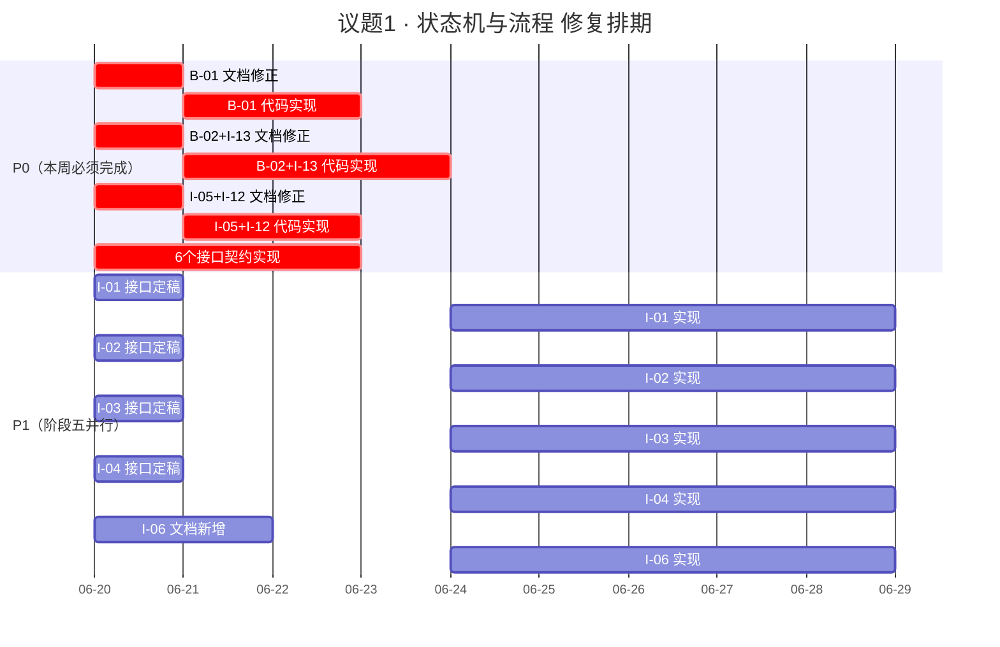

好的，D爷。这是为您准备的完整版最终裁决书，含全部附录，可直接存档。

---

# JNPF-AI 低代码开发平台 · 详细设计评审

## 议题1：状态机与流程 · 最终裁决书

**版本**：v1.1（含附录C、附录D）
**日期**：2026-06-20
**裁决人**：D爷（总架构师）
**状态**：✅ 已通过

---

## 一、核心裁决摘要

| 问题      | 优先级 | 核心方案                                         | 责任人                   | 截止时间                  |
| --------- | ------ | ------------------------------------------------ | ------------------------ | ------------------------- |
| B-01      | **P0** | 统一为“业务专家确认”，拆分approve/reject接口     | 首席架构师 + 后端        | 2小时内修文档，明天修代码 |
| B-02+I-13 | **P0** | 全阶段覆盖stale + StaleMonitorService + 双向恢复 | 首席架构师 + 后端        | 文档今天定，代码本周内    |
| I-05+I-12 | **P0** | 通知对象增加业务专家 + 消息格式统一 + 复合索引   | 后端 + 前端              | 今天修文档，明天修代码    |
| I-01      | **P1** | 增加abandoned终止态，资源回收联动                | 后端 + 前端              | 阶段五并行，接口今天定    |
| I-02      | **P1** | 3轮否决→升级机制，拆分approve/reject接口         | 首席架构师 + 后端 + 前端 | 阶段五并行                |
| I-03      | **P1** | 可配置化审批阈值                                 | 后端 + 前端              | 阶段五并行，接口今天定    |
| I-04      | **P1** | 变更影响预览步骤，含基准对比                     | 后端 + 前端              | 阶段五并行，接口今天定    |
| I-06      | **P1** | 对话模式不污染流水线，IndexedDB存储              | 首席架构师 + 前端        | 阶段五并行                |

---

## 二、6个接口契约最终版

### 接口1：确认/否决
```yaml
端点: POST /api/pipeline/{id}/stages/{stageName}/review
权限: 业务专家（stage1/2/3→4）、管理员（stage4→5）
鉴权: 普通 JWT + 角色权限

请求体:
  {
    "action": "approve" | "reject" | "request_changes",  # 否决用 reject
    "comment": "string",                                 # 否决时必填
    "reviewerRole": "expert" | "developer" | "admin" | "founder"
  }

响应（同步返回）:
  {
    "code": 202,
    "data": {
      "status": "validating",
      "validationId": "uuid",
      "estimatedSeconds": 10
    }
  }

错误码:
  - 400: 参数错误（否决未填原因）
  - 403: 权限不足
  - 404: 流水线不存在
  - 409: 状态冲突（已流转到其他阶段）

幂等性: 按 (pipelineId, stageName, action, F_MODIFY_TIME) 自然去重
校验链拦截: 异步执行（详见附录C）
IR版本快照: 流转成功后，自动创建 IR 快照存入 BASE_IR_VERSION
```

---

### 接口2：恢复stale流水线
```yaml
端点: POST /api/pipeline/{id}/resume
权限: 创建者 或 租户管理员
鉴权: 普通 JWT + 角色权限

请求体:
  {
    "targetStage": "stage2"   # 可选，默认从 F_STALE_FROM_STAGE 自动取
  }

响应:
  {
    "code": 200,
    "data": {
      "currentStage": "stage2",
      "status": "running",
      "resumedAt": "2026-06-20T..."
    }
  }

错误码:
  - 400: 目标阶段不合法
  - 403: 权限不足
  - 404: 流水线不存在
  - 409: 状态冲突（已恢复或已终止）

幂等性: 按 (pipelineId, targetStage, F_MODIFY_TIME) 自然去重
校验链拦截: 流转前强制执行 cleanSchema() → validateIR() → vue-tsc
IR版本快照: 流转成功后，自动创建 IR 快照
```

---

### 接口3：管理员查看stale列表
```yaml
端点: GET /api/pipeline/stale
权限: 租户管理员（本租户）、平台管理员（全平台）
鉴权: 普通 JWT + 角色权限

响应:
  {
    "code": 200,
    "data": {
      "list": [
        {
          "pipelineId": "...",
          "staleFromStage": "stage2",
          "staleSince": "2026-06-10T...",   # 进入stale的时间
          "canResumeTo": ["stage2", "stage1"],  # 可恢复到哪些阶段
          "createdBy": "user_001"
        }
      ]
    }
  }

错误码:
  - 403: 权限不足
  - 400: 分页参数错误

数据隔离:
  - 租户管理员：仅返回 F_TENANT_ID = 当前用户租户 的流水线
  - 平台管理员：返回全平台所有 stale 流水线
  - 业务专家：无权限访问
```

---

### 接口4：主动放弃（abandon）
```yaml
端点: POST /api/pipeline/{id}/abandon
权限: 
  - 创建者：可放弃自己的
  - 租户管理员：可放弃本租户任意
  - 平台管理员：仅可放弃自己的 + 已超30天未响应的
  - 创始人：任意
鉴权: 普通 JWT + 角色权限

请求体:
  {
    "reason": "需求变更，不再继续"
  }

响应:
  {
    "code": 200,
    "data": {
      "status": "abandoned",
      "abandonedAt": "2026-06-20T..."
    }
  }

错误码:
  - 400: 未填原因
  - 403: 权限不足
  - 404: 流水线不存在
  - 409: 状态冲突（已结束或已放弃）

资源回收联动: 检查是否有关联活跃沙箱（BASE_SANDBOX），如果有，自动触发沙箱销毁/休眠流程
幂等性: 按 (pipelineId, F_MODIFY_TIME) 自然去重
```

---

### 接口5：增量修改影响预览
```yaml
端点: POST /api/pipeline/{id}/preview-rollback
权限: 创建者 或 租户管理员
鉴权: 普通 JWT + 角色权限

请求体:
  {
    "targetStage": "stage2",
    "baseIrVersion": "v1.2"   # 基准IR版本号，用于计算Diff
  }

响应:
  {
    "code": 200,
    "data": {
      "affectedNodes": [
        {
          "id": "...",
          "type": "ModuleDefinition",
          "changeDesc": "将重新生成"
        }
      ],
      "affectedScope": ["ModuleDefinition", "APIEndpoint"],  # 影响范围标签
      "estimatedDurationSeconds": 120,  # 基于历史均值的估算，标注±30%误差
      "warnings": ["将清除沙箱测试数据"]   # 风险提示
    }
  }

错误码:
  - 400: 参数错误（targetStage不合法、baseIrVersion不存在）
  - 403: 权限不足
  - 404: 流水线不存在
  - 409: 状态冲突（流水线已结束或已放弃）

幂等性: 按 (pipelineId, targetStage, baseIrVersion) 自然去重
```

---

### 接口6：审批摘要
```yaml
端点: GET /api/pipeline/{id}/approval-summary
权限: 创建者 或 租户管理员 或 平台管理员
鉴权: 普通 JWT + 角色权限

响应:
  {
    "code": 200,
    "data": {
      "thresholds": {
        "minPassRate": 0.9,
        "requiredHealthCheck": true,
        "compileZeroError": true
      },
      "actual": {
        "passRate": 0.95,
        "healthCheckOk": true,
        "compileZeroError": true
      },
      "passed": true
    }
  }

错误码:
  - 403: 权限不足
  - 404: 流水线不存在
  - 409: 状态冲突（尚未到达stage4）
```

---

## 三、状态机与底层机制联动规范

### 3.1 校验链拦截器（异步化）
- **触发时机**：`POST /api/pipeline/{id}/stages/{stageName}/review` 收到 `approve` 请求后
- **执行流程**：
  1. 状态流转至 **`validating`**（过渡态）
  2. 接口立即返回 **`202 Accepted`**（不阻塞用户）
  3. 后端通过 Hangfire 后台任务异步执行：
     - `cleanSchema()`
     - `validateIR()`
     - `vue-tsc --noEmit`
  4. 校验结果通过 SSE 事件 (`pipeline_validation_result`) 推送给前端
  5. **校验通过**：自动流转至下一阶段
  6. **校验失败**：状态回退至 `review` 态，并附带完整错误详情
- **超时兜底**：若后台任务超过 30 秒未完成，推送到 `pipeline_validation_timeout` 事件，提示用户“校验超时，请稍后查看”。
- **例外**：abandon 操作不强制校验（终止态不需要验证 IR 合法性）

### 3.2 IR版本快照拦截器
- **触发时机**：任何状态流转成功后（包括 review、resume、rollback）
- **执行动作**：将当前 IR 完整内容存入 `BASE_IR_VERSION` 表
- **字段补充**：
  - `F_TRIGGERED_BY`：谁触发了这次版本（用户ID / Agent名称 / 系统自动）
  - `F_CHANGE_SUMMARY`：变更摘要（从状态流转日志自动生成）
  - `F_PARENT_VERSION`：父版本号（用于构建版本树）
  - `F_DIFF`：与上一版本的差异（**RFC 6902 JSON Patch 格式**，详见附录D）

### 3.3 资源回收联动（abandon）
- **触发时机**：abandon 操作执行时
- **执行动作**：
  1. 检查 `BASE_SANDBOX` 表是否存在关联的活跃沙箱（`F_STATUS = 'running'`）
  2. 如果存在，自动调用 `SandboxManager.DestroyAsync` 销毁沙箱
  3. 沙箱状态更新为 `terminated`（保留审计记录）
  4. 写入 `BASE_FOUNDER_AUTH_LOG`（记录资源回收动作）

### 3.4 StaleMonitorService 实现规范
- **调度方式**：Quartz.NET 定时任务，每小时执行一次
- **扫描条件**：
  ```sql
  SELECT * FROM BASE_AI_PIPELINE 
  WHERE F_STAGE_STATUS NOT IN ('stale', 'abandoned', 'completed')
    AND DATEDIFF(hour, F_MODIFY_TIME, GETDATE()) > 超时阈值
  ```
- **超时阈值**：
  - stage1/2：7天
  - stage3：3天
  - stage4：7天
  - stage5：14天
- **触发动作**：
  1. 更新 `F_STAGE_STATUS = 'stale'`
  2. 记录 `F_STALE_FROM_STAGE = F_CURRENT_STAGE`
  3. SignalR 推送 `pipeline_stale` 事件
  4. 写入 `BASE_AI_PIPELINE_MESSAGE`
- **复合索引**：`CREATE INDEX IDX_STALE_CHECK ON BASE_AI_PIPELINE(F_STAGE_STATUS, F_MODIFY_TIME, F_CURRENT_STAGE)`

### 3.5 消息格式统一规范（SignalR 事件）
```typescript
interface PipelineEventPayload {
  eventType: 'pipeline_blocked' | 'pipeline_stale' | 'pipeline_abandoned' | 'pipeline_validation_result';
  pipelineId: string;
  tenantId: string;
  userId: string;           // 业务专家（创建者）
  stage: string;
  reason: string;
  failureCount?: number;
  timestamp: string;
  actions: Array<{
    type: 'view' | 'reset' | 'abandon' | 'contact_admin';
    url: string;
  }>;
}

// 动态过滤规则：
// - 业务专家：看到 view + reset（自己的）
// - 租户管理员：看到 view + reset + abandon + contact_admin
// - 平台管理员：看到 view + reset + abandon（自己的）
// - 创始人：看到全部
```

---

## 四、附录

### 附录A：签字页

| 角色                       | 签名       | 日期       |
| -------------------------- | ---------- | ---------- |
| D爷（总架构师）            | __________ | 2026-06-20 |
| KIMI（流程与状态机专家）   | __________ | 2026-06-20 |
| 千问（智能体与校验专家）   | __________ | 2026-06-20 |
| 清言（用户交互与接口专家） | __________ | 2026-06-20 |
| 玛维思（数据与架构助理）   | __________ | 2026-06-20 |

---

### 附录B：议题1 P0/P1 排期甘特图



---

### 附录C：校验链拦截器异步化规范（强制执行约束）

**来源**：清言首席专家 · 最终裁决表态

> **C.1 异步化约束**
>
> `POST /api/pipeline/{id}/stages/{stageName}/review` 接口在收到 `approve` 请求后：
> - **不得同步执行** `vue-tsc` 类型检查
> - 状态应先流转至 `validating` 过渡态
> - 接口立即返回 `202 Accepted`
> - 后端通过 Hangfire 后台任务异步执行校验链
> - 校验结果通过 SSE 事件推送
> - 校验通过 → 自动流转至下一阶段；校验失败 → 状态回退至 `review` 态

> **C.2 超时兜底**
>
> 若后台任务超过 30 秒未完成，推送 `pipeline_validation_timeout` 事件，提示用户“校验超时，请稍后查看”。

> **C.3 相关接口变更**
>
> 详见本裁决书 §3.1 及接口1的响应格式。

---

### 附录D：IR版本 F_DIFF 格式确认（技术细节确认）

**来源**：清言首席专家 · 最终裁决表态

> **D.1 格式规范**
>
> `BASE_IR_VERSION` 表的 `F_DIFF` 字段使用 **RFC 6902 JSON Patch** 规范。
>
> **示例**：
> ```json
> {
> "version": "v1.2",
> "diff": [
>  { "op": "replace", "path": "/pages/0/components/1/fields/2/label", "value": "请假天数" },
>  { "op": "add", "path": "/pages/0/components/1/fields/3", "value": { "id": "field_3", "type": "text" } },
>  { "op": "remove", "path": "/pages/0/components/0" }
> ]
> }
> ```

> **D.2 前端组件要求**
>
> `IRDesigner.vue` 的 Diff 组件必须支持 JSON Patch 格式的直接渲染，不应自行实现 Diff 算法。

> **D.3 后端生成约束**
>
> 后端生成 Diff 时，必须保证：
> - `path` 字段符合 JSON Pointer 规范（RFC 6901）
> - `op` 字段仅使用 `add` / `remove` / `replace` / `move` / `copy` / `test` 六种操作
> - 同一个 Diff 中，操作顺序必须保证应用后的结果与目标 IR 一致

---

## 五、执行指令

### 立即执行（P0）
1. 首席架构师：今天（2026-06-20）2小时内完成文档修正
2. 后端工程师：今天完成6个接口的代码实现（含异步化校验）
3. 前端工程师：今天完成 PipelineManager.vue 对接（含预览UI + SSE事件监听）
4. 数据库工程师：今天完成复合索引和新增字段的DDL

### 本周内执行（P0延续）
1. 后端工程师：完成 StaleMonitorService（Quartz.NET）的实现
2. 首席架构师：完成 §4.9 对话模式文档新增
3. 前端工程师：完成 AiChatPanel.vue + IndexedDB 封装

### 阶段五并行（P1）
1. 按裁决单排期正常推进
2. 下周（2026-06-26）召开修订确认会，确认所有修正完成

---

**本裁决书一式五份，各专家留存一份。由玛维思归档至 `docs/architecture/v52/` 目录。**

**D爷签字：** __________  
**日期：** 2026-06-20