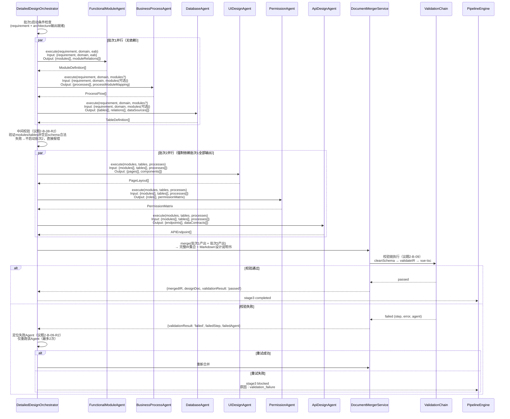
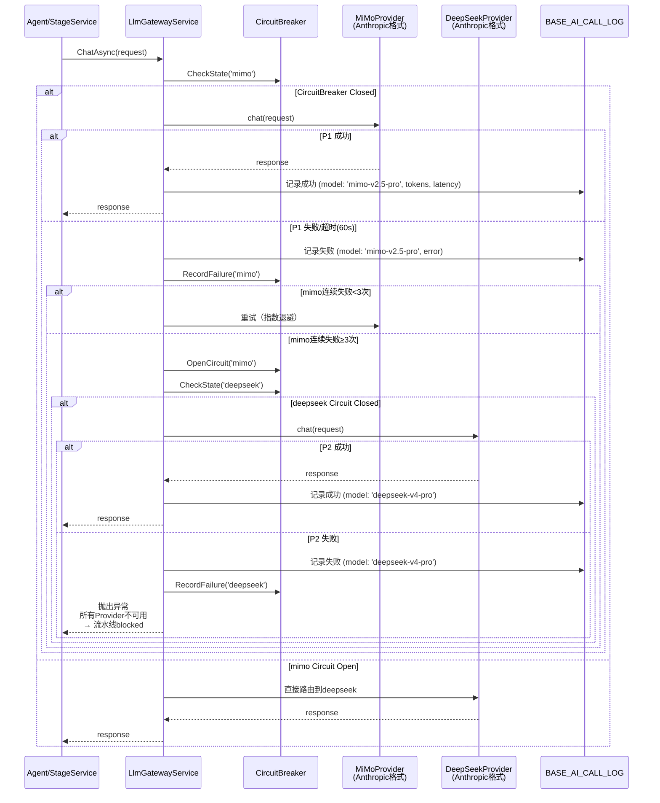

议题5开始。千问和清言联合牵头，其他专家补充。

---

## 议题5：时序图与UI（千问+清言联合，20分钟）

### 前置约束（议题1-4已锁定，不可推翻）

| 已锁定项   | 内容                                             | 对议题5的影响                 |
| ---------- | ------------------------------------------------ | ----------------------------- |
| 议题1-B-01 | stage3→stage4统一为"业务专家确认"                | 图7-3 stage4启动条件修正      |
| 议题1-B-02 | stale全阶段覆盖 + StaleMonitorService            | 所有时序图增加stale检测分支   |
| 议题2-B-07 | 6 SubAgent名称 + IR NodeType映射                 | 图7-2 Agent名称和批次必须修正 |
| 议题2-B-08 | 6 SubAgent输入输出契约                           | 图7-2消息内容必须匹配契约     |
| 议题2-B-09 | 校验链三级处理（cleanSchema→validateIR→vue-tsc） | 图7-3增加校验链时序           |
| 议题3-B-03 | 双模式：分治编辑+全量替换                        | UI增加模式选择器              |
| 议题3-I-09 | BASE_IR_VERSION 8字段DDL                         | 时序图增加版本快照存储        |
| 议题4-B-04 | 7个增量修改接口                                  | 时序图增加surgical-edit调用   |
| 议题4-B-06 | SSE 10事件类型                                   | 时序图增加SSE推送节点         |

---

## 千问：时序图修正预案（B-10, B-11）

### B-10：图7-2并行Agent名称和批次全部错误

**当前文档错误：**
- 图7-2显示：UIUXAgent, DatabaseAgent, WorkflowAgent, DashboardAgent, AppAgent（5个Agent，无批次概念）
- 实际实现：6个SubAgent，分两批次（议题2-B-08已锁定）

**修正后图7-2（Mermaid）：**



**谁来改**：首席架构师（文档Mermaid修正）
**什么时候改**：P0，**今天修正**，与议题2-B-08契约同步

---

### B-11：图7-7降级链与实现不一致

**当前文档错误：**
- 图7-7显示：DeepSeekGateway → TongyiGateway → OpenAIGateway（3级降级）
- 实际实现：MiMo → DeepSeek 2级（议题2已确认）

**修正后图7-7（Mermaid）：**



**关键修正点：**
- 删除TongyiGateway、OpenAIGateway节点（当前2级降级，非5级）
- 增加CircuitBreaker状态检查
- 明确失败计数规则：连续3次失败→熔断→切换Provider
- 明确BASE_AI_CALL_LOG记录点：每次调用（成功/失败）都记录

**谁来改**：首席架构师（文档Mermaid修正）+ 后端工程师（核对LlmGatewayService实现）
**什么时候改**：P0，**今天修正**

---

## 清言：UI修正预案（I-14）

### I-14：阶段2→3门禁要求业务专家看ER图（认知负担过高）

**问题：** §4.1.1要求业务专家确认"数据库ER图"，但业务专家不具备技术背景。

**修正方案：双视图确认**

```
阶段2→3确认流程（修正后）：

业务专家视图（简化）：
┌─────────────────────────────────────────┐
│  阶段2产出确认 - 业务视角                │
│                                         │
│  ✓ 功能模块：员工管理、请假审批、报表    │
│  ✓ 页面数量：5个（列表页、详情页...）  │
│  ✓ 核心流程：提交申请→主管审批→HR备案   │
│                                         │
│  [确认进入设计阶段]  [需要修改]         │
└─────────────────────────────────────────┘

开发者视图（技术）：
┌─────────────────────────────────────────┐
│  阶段2产出确认 - 技术视角                │
│                                         │
│  ER图：[可视化图表]                     │
│  表结构：BASE_LEAVE, BASE_APPROVAL...   │
│  模块依赖：[依赖图]                     │
│                                         │
│  [技术评审通过]  [标记需重审]  [否决]    │
└─────────────────────────────────────────┘
```

**实现约束：**
- 业务专家确认后，开发者才能看到技术视图（可选评审）
- 开发者否决 → 回退到stage2修改（议题1-I-02已锁定3轮否决机制）
- 开发者不评审 → 自动通过（议题1-B-01已锁定）

**UI路由调整：**
```
/studio/expert/quick-app/stage2-confirm  → 业务专家确认页
/studio/dev/ai-review/stage2-technical  → 开发者技术评审页（可选）
```

**谁来改**：前端工程师（双视图组件）+ 首席架构师（文档§4.1.1修正）
**什么时候改**：P1，**阶段五并行**。但UI草图今天定（影响前端开发排期）

---

## 新增：SSE事件与UI联动（议题4-B-06落地）

**PipelineManager.vue 事件消费：**

| SSE事件                   | UI响应                                                 |
| ------------------------- | ------------------------------------------------------ |
| `stage.started`           | 进度条开始动画，显示当前Agent名称                      |
| `stage.progress`          | 更新进度条（0-100），显示thought文本                   |
| `stage.approval.required` | 弹出确认对话框，根据approverRole判断当前用户是否有权限 |
| `stage.blocked`           | 红色告警卡片，显示"联系管理员"按钮                     |
| `stage.surgical.edit`     | 分治编辑进度弹窗，显示6步流程当前步骤                  |
| `system.alert`            | 顶部全局通知栏                                         |

**谁来改**：前端工程师（EventSource封装 + UI组件）
**什么时候改**：P0，**与议题4-B-06同步**

---

## 议题5裁决辅助单（整合版）

| ID   | 优先级 | 核心方案                                           | 责任人          | 截止时间                 | 关键约束             |
| ---- | ------ | -------------------------------------------------- | --------------- | ------------------------ | -------------------- |
| B-10 | P0     | 图7-2修正为6 SubAgent + 两批次 + 中间校验 + 校验链 | 首席架构师      | 今天                     | 议题2-B-07/B-08/B-09 |
| B-11 | P0     | 图7-7修正为MiMo→DeepSeek 2级 + CircuitBreaker      | 首席架构师+后端 | 今天                     | 实际实现             |
| I-14 | P1     | 阶段2→3双视图确认（业务视角+技术视角）             | 前端+首席架构师 | 阶段五并行，今天定UI草图 | 议题1-B-01/I-02      |

### 必须今天锁定

| #    | 锁定项            | 内容                           |
| ---- | ----------------- | ------------------------------ |
| 1    | 图7-2 Mermaid源码 | 6 SubAgent名称、批次、消息契约 |
| 2    | 图7-7 Mermaid源码 | 2级降级、CircuitBreaker状态    |
| 3    | I-14 UI草图       | 双视图确认流程、路由结构       |

---

千问、清言，作为联合牵头人，请确认上述整合方案是否可接受？还是有调整？