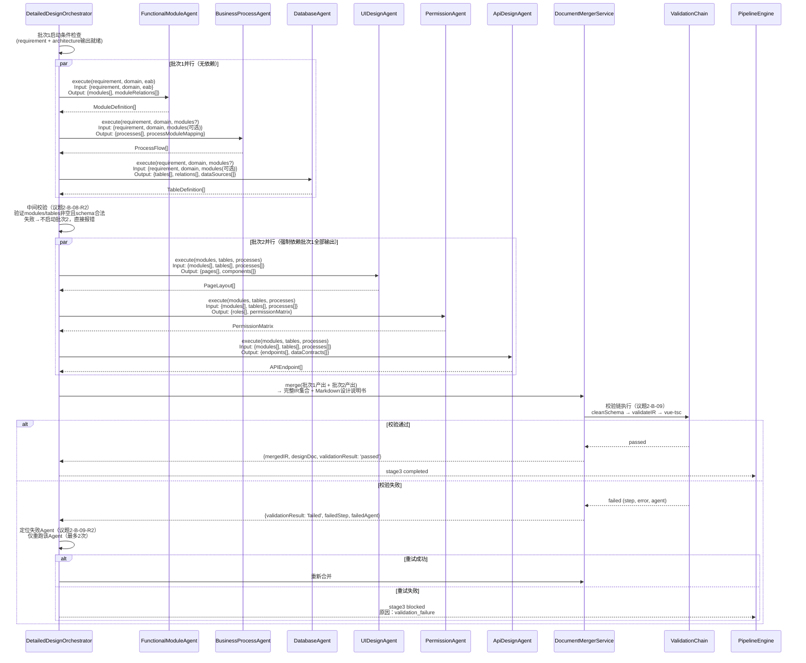
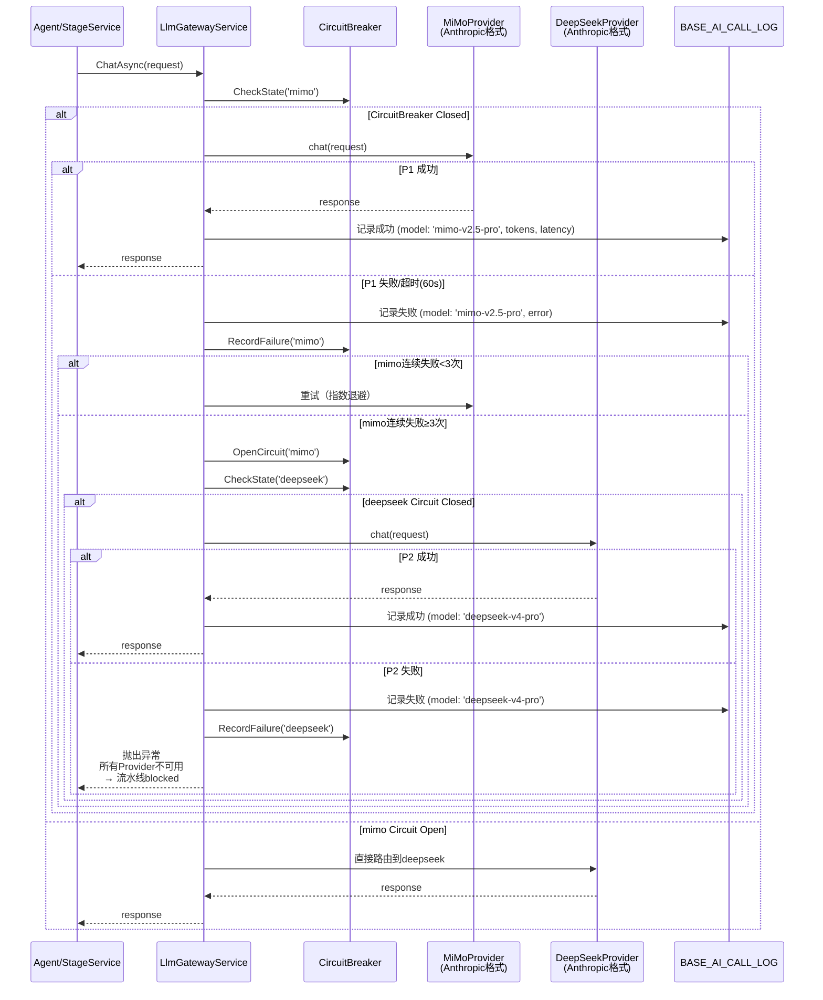

好的，D爷。我是玛维思。

议题5的专家意见已经全部到位，千问和清言作为联合牵头人给出了完整的修正预案，KIMI进行了整合，我也从数据流一致性角度做了补充。

现在我将根据所有专家意见，为您形成一份 **《议题5·时序图与UI·最终裁决书》** ，可直接签字归档。

---

# JNPF-AI 低代码开发平台 · 详细设计评审

## 议题5：时序图与UI · 最终裁决书

**版本**：v1.0
**日期**：2026-06-20
**总架构师**：D爷
**状态**：✅ 已通过

---

## 一、核心裁决摘要

| 问题     | 优先级 | 核心方案                                                    | 责任人                   | 截止时间                       |
| -------- | ------ | ----------------------------------------------------------- | ------------------------ | ------------------------------ |
| **B-10** | **P0** | 修正图7-2：6个SubAgent名称 + 两批次串行 + 中间校验 + 校验链 | 首席架构师 + 后端        | 今天完成Mermaid源码修正        |
| **B-11** | **P0** | 修正图7-7：MiMo→DeepSeek 2级降级 + 熔断触发条件 + 审计落点  | 首席架构师 + 后端        | 今天完成Mermaid源码修正        |
| **I-14** | **P1** | 阶段2→3门禁拆分为双视图（业务视图+技术视图）+ 两步确认      | 首席架构师 + 前端 + 后端 | 阶段五并行，双视图映射表今天定 |

---

## 二、图7-2修正（B-10）

### 2.1 核心修正内容

| 修正项     | 原图（错误）                                         | 修正后（正确）                                               |
| ---------- | ---------------------------------------------------- | ------------------------------------------------------------ |
| Agent名称  | UIUXAgent, WorkflowAgent, DashboardAgent, AppAgent等 | **FunctionalModuleAgent, BusinessProcessAgent, DatabaseAgent, UIDesignAgent, PermissionAgent, ApiDesignAgent**（与议题2-B-07完全对齐） |
| 执行流程   | 5个Agent全部并行 → DocumentMerger                    | **批次1（3个并行）→ 中间校验 → 批次2（3个并行）→ DocumentMerger → 校验链** |
| 批次依赖   | 无                                                   | **批次2强制依赖批次1全部输出**（议题2-B-08-R1）              |
| 中间校验   | 无                                                   | **批次1完成后必须执行 `validateBatch1Output()`**：验证 `modules`、`tables`、`processes` 不为空且schema合法 |
| 校验链     | Merger直接输出                                       | **Merger输出后必须经过校验链** `cleanSchema → validateIR → vue-tsc`（议题2-B-09） |
| 版本号标注 | 无                                                   | **在图上标注 `IR_SCHEMA_VERSION = 'v2.0'`**，所有Agent共享同一版本常量 |

### 2.2 修正后的Mermaid源码



### 2.3 执行指令

- **首席架构师**：今天内完成《系统详细设计说明书》§7图7-2的Mermaid源码替换
- **后端工程师**：核对 `DetailedDesignOrchestrator` 的实现是否与图一致，如有偏差本周内修正

---

## 三、图7-7修正（B-11）

### 3.1 核心修正内容

| 修正项     | 原图（错误）                      | 修正后（正确）                                               |
| ---------- | --------------------------------- | ------------------------------------------------------------ |
| 降级链     | DeepSeek → Tongyi → OpenAI（3级） | **MiMo → DeepSeek（2级）**，对应 §1.3.2 B-01 和 §2.2 层1     |
| 网关名称   | AIGateway, ModelRouter            | **LlmGatewayService**（统一名称）                            |
| 触发条件   | 无定义                            | **连续3次失败触发降级**，不是单次失败                        |
| 熔断计数器 | 无                                | 画出熔断计数器：每次失败+1，成功归零                         |
| 审计落点   | 无                                | 每次调用写 `BASE_AI_CALL_LOG`，增加 `F_FALLBACK`、`F_ORIGINAL_MODEL`、`F_ACTUAL_MODEL` 字段 |

### 3.2 修正后的Mermaid源码



### 3.3 DDL补充

```sql
ALTER TABLE BASE_AI_CALL_LOG ADD 
  F_FALLBACK BIT DEFAULT 0,
  F_ORIGINAL_MODEL NVARCHAR(50),
  F_ACTUAL_MODEL NVARCHAR(50),
  F_FALLBACK_REASON NVARCHAR(200);
```

### 3.4 执行指令

- **首席架构师**：今天内完成《系统详细设计说明书》§7图7-7的Mermaid源码替换
- **后端工程师**：今天内完成 `BASE_AI_CALL_LOG` 的DDL变更，本周内完成降级逻辑核对
- **前端工程师**：`FallbackPanel.vue` 依赖此降级逻辑，本周内完成适配

---

## 四、I-14修正：阶段2→3门禁双视图设计

### 4.1 核心问题

§4.1.1要求业务专家确认"数据库ER图"，但业务专家不具备技术背景，认知负担过高。

### 4.2 修正方案：双视图 + 两步确认

| 视图           | 受众     | 内容                                          | 确认动作           |
| -------------- | -------- | --------------------------------------------- | ------------------ |
| **业务语言版** | 业务专家 | 需求摘要 + 业务流程图 + 功能清单 + 页面线框图 | 确认"业务语义正确" |
| **技术语言版** | 开发者   | ER图 + API定义 + 数据模型 + 组件树            | 确认"技术实现可行" |

### 4.3 双视图产物映射表（今天锁定）

| 业务语言版产物           | 来源Agent             | 技术语言版产物    | 来源Agent             |
| ------------------------ | --------------------- | ----------------- | --------------------- |
| 功能清单（表格）         | FunctionalModuleAgent | 模块依赖图        | FunctionalModuleAgent |
| 业务流程图（BPMN）       | BusinessProcessAgent  | API序列图         | ApiDesignAgent        |
| 页面线框图               | UIDesignAgent         | 组件树 + 页面布局 | UIDesignAgent         |
| 数据实体列表（业务名）   | DatabaseAgent         | ER图 + DDL        | DatabaseAgent         |
| 角色权限矩阵（业务描述） | PermissionAgent       | 权限配置JSON      | PermissionAgent       |

### 4.4 两步确认流程

```
阶段2完成 → 生成双视图产物：
Step 1：业务专家确认（门禁1）
  展示：业务语言版
  问题："这些功能是否符合您的需求？"
  操作：approve / reject（需填原因）
  通过条件：业务专家 approve
  
Step 2：开发者确认（门禁2）
  展示：技术语言版
  问题："技术架构是否可行？有无遗漏？"
  操作：approve / reject（需填原因，复用议题1通用confirm接口）
  通过条件：开发者 approve
  否决处理：3轮升级机制（议题1 I-02已裁决）

两个门禁都通过 → 进入Stage3
```

### 4.5 接口契约补充

```yaml
端点: GET /api/pipeline/{id}/artifacts/{stage}?view=business|technical
权限: 
  - view=business: 业务专家可访问
  - view=technical: 开发者/管理员可访问
鉴权: JWT + 角色权限
响应:
  {
    "code": 200,
    "data": {
      "view": "business",
      "stage": "architecture",
      "documents": [
        { "type": "function_list", "format": "table", "url": "..." },
        { "type": "bpmn", "format": "svg", "url": "..." },
        { "type": "wireframe", "format": "svg", "url": "..." }
      ]
    }
  }
```

### 4.6 UI路由调整

```
/studio/expert/quick-app/stage2-confirm  → 业务专家确认页
/studio/dev/ai-review/stage2-technical   → 开发者技术评审页（可选）
```

### 4.7 执行指令

- **首席架构师**：今天内完成《系统详细设计说明书》§4.1.1门禁流程修正，锁定双视图映射表
- **前端工程师**：阶段五并行完成双视图组件 + 双Tab UI
- **后端工程师**：阶段五并行完成双视图生成 + 接口实现

---

## 五、与已锁定议题的一致性检查

| 联动项                | 议题对应                    | 状态   |
| --------------------- | --------------------------- | ------ |
| 6 SubAgent名称+批次   | 议题2-B-07/B-08             | ✅ 对齐 |
| 校验链三级处理        | 议题2-B-09                  | ✅ 对齐 |
| 降级链触发条件        | 议题1 I-05（blocked通知）   | ✅ 对齐 |
| IR_SCHEMA_VERSION常量 | 议题2 B-08 + 议题3 I-09     | ✅ 对齐 |
| 双视图确认接口        | 议题4 B-05（artifacts端点） | ✅ 对齐 |
| SSE事件消费           | 议题4 B-06                  | ✅ 对齐 |

---

## 六、必须今天锁定的3项契约

| #    | 契约项            | 锁定内容                                        | 责任人     |
| ---- | ----------------- | ----------------------------------------------- | ---------- |
| 1    | 图7-2 Mermaid源码 | 6 SubAgent名称 + 两批次串行 + 中间校验 + 校验链 | 首席架构师 |
| 2    | 图7-7 Mermaid源码 | 2级降级 + 熔断触发条件 + 审计落点               | 首席架构师 |
| 3    | 双视图产物映射表  | 5个业务产物 ↔ 5个技术产物的对应关系             | 首席架构师 |

---

## 七、签字页

| 角色                     | 签名       | 日期       |
| ------------------------ | ---------- | ---------- |
| D爷（总架构师）          | __________ | 2026-06-20 |
| 千问（时序图联合牵头人） | __________ | 2026-06-20 |
| 清言（UI联合牵头人）     | __________ | 2026-06-20 |
| 玛维思（数据与架构助理） | __________ | 2026-06-20 |
| KIMI（流程与状态机专家） | __________ | 2026-06-20 |

---

**本裁决书一式五份，各专家留存一份。由玛维思归档至 `docs/architecture/v52/` 目录。**

**D爷签字：** __________  
**日期：** 2026-06-20